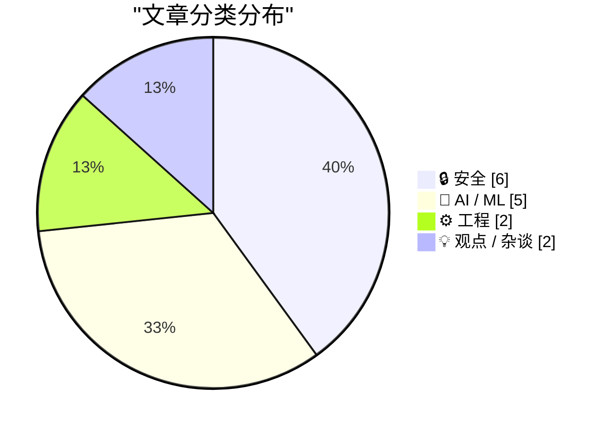
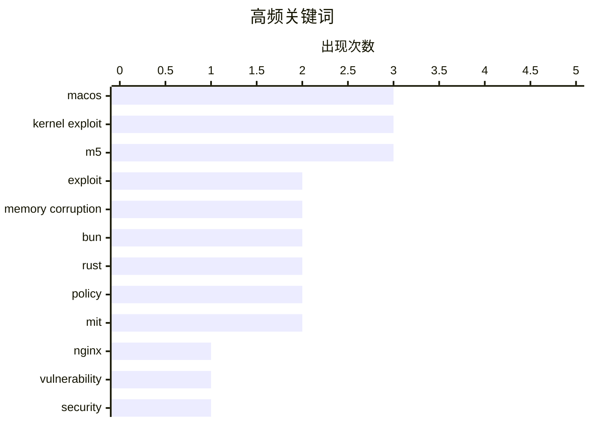

# 📰 AI 资讯每日精选 — 2026-05-15

> 汇聚 140+ 技术博客、X/Twitter、Hacker News、Reddit、Product Hunt、
> Lobste.rs、ClawFeed 日报及 GitHub Trending，经 AI 评分筛选。
>
> **本期内容**：🏆 今日必读 · 🌐 ClawFeed 日报 · 🔥 GitHub Trending · 📂 分类精选 · 🎨 设计与生成式 AI · 📊 数据概览

## 📝 今日看点

今日技术圈聚焦两大主线：安全领域迎来“硬件防线”的集中挑战，多个针对Nginx、Apple M5芯片及微软BitLocker的高危漏洞被公开，其中绕过ARM MTE硬件内存保护机制的macOS内核漏洞尤为引人关注；与此同时，AI领域正经历“攻防博弈”与“治理收紧”，研究者既用强化学习训练模型自我越狱以提升防御，也因AI生成论文泛滥而催生arXiv对虚构参考文献的封禁新规，此外，让AI学会表达“不确定”的RLCR方法成为对抗模型过度自信的新方向。

---

## 🏆 今日必读

🥇 **新的 Nginx 漏洞利用**

[New Nginx Exploit](https://github.com/DepthFirstDisclosures/Nginx-Rift) — Hacker News Best · 8 小时前 · 🔒 安全

> GitHub 上公开了一个名为“Nginx-Rift”的新 Nginx 漏洞利用程序。该漏洞利用针对的是 Nginx 服务器中一个未公开的特定安全缺陷，允许攻击者远程执行代码或导致服务崩溃。项目仓库提供了技术细节和概念验证代码，但尚未披露具体的漏洞编号。该漏洞利用在 Hacker News 上获得了 287 分和 62 条评论，引发了社区对 Nginx 安全性的广泛关注。目前建议 Nginx 用户密切关注官方安全更新并及时修补。

💡 **为什么值得读**: Nginx 是全球最流行的 Web 服务器之一，该漏洞利用的公开意味着大量网站面临直接的安全威胁，运维人员必须立即评估风险并采取行动。

🏷️ Nginx, exploit, vulnerability, security

🥈 **借助 Mythos 预览版，研究人员宣布绕过 M5 内存完整性保护的 macOS 内核漏洞**

[Aided by Mythos Preview, Researchers Announce MacOS Kernel Exploit Circumventing M5 Memory Integrity Enforcement](https://blog.calif.io/p/first-public-kernel-memory-corruption) — daringfireball.net · 1 小时前 · 🔒 安全

> 安全研究团队 Calif 宣布发现了首个公开的 macOS 内核内存破坏漏洞，该漏洞能够绕过 Apple M5 和 A19 芯片中基于 ARM MTE 的硬件内存安全系统 MIE。MIE 是 Apple 为 M5 设计的旗舰安全特性，旨在彻底阻止内存破坏类漏洞。研究人员利用“Mythos”预览版系统，成功实现了内核级别的内存破坏，证明了即使是最新的硬件防御机制也存在可被绕过的路径。该发现表明，Apple 设备并非绝对安全，硬件安全机制也存在局限性。

💡 **为什么值得读**: 这是首个公开的针对 Apple M5 芯片 MIE 安全特性的内核漏洞，直接挑战了“Apple 设备最安全”的普遍认知，对安全研究和 Apple 用户都具有里程碑意义。

🏷️ macOS, kernel exploit, M5, memory safety

🥉 **首个公开的 Apple M5 上 macOS 内核内存破坏漏洞**

[First public macOS kernel memory corruption exploit on Apple M5](https://blog.calif.io/p/first-public-kernel-memory-corruption) — Hacker News Best · 7 小时前 · 🔒 安全

> 安全团队 Calif 公开了首个针对 Apple M5 芯片的 macOS 内核内存破坏漏洞利用。该漏洞成功绕过了 M5 引入的 MIE 硬件内存安全机制，该机制基于 ARM 的 MTE 技术。攻击者可以利用该漏洞在内核级别执行任意代码，从而完全控制设备。这一发现打破了 MIE 能彻底防御内存破坏攻击的假设，表明硬件安全方案并非无懈可击。该漏洞的公开对 macOS 安全生态产生了重大冲击。

💡 **为什么值得读**: 直接证明了 Apple 最新、最引以为傲的硬件安全特性 MIE 可以被攻破，对于所有关注系统底层安全和 Apple 设备防护的人来说是必读内容。

🏷️ macOS, kernel exploit, M5, memory corruption

4️⃣ **将 Bun 用 Rust 重写的合并请求已被合并**

[Rewrite Bun in Rust has been merged](https://github.com/oven-sh/bun/pull/30412) — Hacker News Best · 17 小时前 · ⚙️ 工程

> JavaScript 运行时 Bun 的一个重大 Pull Request 被合并，该 PR 将 Bun 的核心组件从 Zig 语言重写为 Rust 语言。这一重写旨在利用 Rust 的内存安全特性来减少潜在的内存错误，并可能提升性能。该 PR 获得了 479 分和 577 条评论，是 Hacker News 上最受关注的技术事件之一。合并后，Bun 的代码库将同时包含 Zig 和 Rust 两种语言，未来可能逐步过渡。此举反映了 Rust 在系统编程领域日益增长的影响力。

💡 **为什么值得读**: Bun 是当前最热门的 JavaScript 工具链之一，其核心语言从 Zig 转向 Rust 是一个重大的技术决策，对 Bun 的未来发展、性能表现和生态兼容性有深远影响。

🏷️ Bun, Rust, rewrite, JavaScript runtime

5️⃣ **微软 BitLocker – YellowKey 零日漏洞利用**

[Microsoft BitLocker – YellowKey zero-day exploit](https://www.tomshardware.com/tech-industry/cyber-security/microsoft-bitlocker-protected-drives-can-now-be-opened-with-just-some-files-on-a-usb-stick-yellowkey-zero-day-exploit-demonstrates-an-apparent-backdoor) — Hacker News Best · 22 小时前 · 🔒 安全

> 安全研究人员演示了一个名为“YellowKey”的零日漏洞，可以仅通过一个 USB 闪存盘上的文件打开受微软 BitLocker 加密保护的驱动器。该漏洞利用似乎绕过了 BitLocker 的认证机制，被部分人认为是潜在的“后门”。该漏洞在 Tom's Hardware 上被报道，引发了关于 BitLocker 安全性和微软加密实现可靠性的激烈讨论。目前微软尚未发布官方补丁，受影响的用户面临数据泄露风险。

💡 **为什么值得读**: BitLocker 是 Windows 系统最核心的数据加密方案，该零日漏洞直接威胁到数百万企业和个人用户的数据安全，其“后门”嫌疑更增加了事件的严重性。

🏷️ BitLocker, zero-day, exploit, backdoor

---

## 🌐 ClawFeed 日报精选

> 来源：[ClawFeed](https://clawfeed.kevinhe.io) — AI 驱动的多源新闻聚合

📋 ClawFeed 日报 | 2026-05-10

注：聚合本日 4 期 4h digest（id 419 / 426 / 427 / 428，覆盖 00:00-19:59 SGT）。**5/10 是 ISO Week 19 收尾日 + Dario 7 个月一人公司时间锚 + OpenAI Realtime/Codex 全天 receipts 高密度爆发**。20:00-23:59 SGT 信号将进明天首档 4h digest。

## 🔥 今日头条（Top 5）

1. **Dario Amodei: "第一个 $10 亿一人公司还有 7 个月会出现"**
   @AYi_AInotes 转译 Anthropic CEO 公开判断。配 5/6 Andrew Wilkinson 一人 40+ 公司 case + 5/9 YC Personal Software is coming 双频道定调，"$1B 一人公司"主线被 Anthropic CEO 加上具体时间锚（2026 年内）。这是本周这条主线最强的时间定钉。来源: https://x.com/AYi_AInotes/status/2053317162664673306

2. **Greg Brockman 自做 GPT-Realtime-2 Chrome 实时翻译扩展**
   OpenAI President 个人 vibe coding 演示：Chormex 扩展跑在任何 Chrome 内播音频之上（YouTube/直播/会议/演讲），sub-second 实时翻译。"absolutely surreal"。配 5/8 Realtime API 三连发布 + @OpenAIDevs CRM voice workflow，**Realtime API 从模型发布 → 总裁亲自 ship 应用，48-72 小时落地节拍快得罕见**。来源: https://x.com/gdb/status/2053134883040514350

3. **DeepSeek V4 Pro 在 EasyRouter 2.5 折，价格仅 Sonnet 4.6 的 1/17，"硅谷开发者主动找中国模型"**
   @FuSheng_0306：输入 $0.435/1M，输出 $0.87/1M，缓存 $0.0035/1M，性能对标 Sonnet 4.6。配 5/8 DeepSeek 估值 $7B/$50B 信号 + 5/9 路由层标准化语境，**"中国 SOTA 模型成本套利"叙事在硅谷 dev 圈出现 demand-side 拉动 receipts**。来源: https://x.com/FuSheng_0306/status/2053278850910736521

4. **COCO Landing AI Agents in SEA — The Real Playbook（自家公告）**
   @CocoAIxyz 官方 — CharliehuAI 与 Cui Qiang (Cui Niu Club founder/CEO) 深度对谈，"500+ paying customers in 2 months across SEA, most of them aren't who you'd expect"。**自家信号**，团队对外把"东南亚 AI agent 落地"做成 distinct playbook。来源: https://x.com/CocoAIxyz/status/2053309026805719060

5. **Coinbase = AI native 金融基础设施叙事完整成型**
   @wublockchain12 长文拆解 — USDC 流动性 + Base 结算 + x402/MPP AI 代理支付 + CDP/AgentKit + Agentic Market 开发者生态形成"四层稳定币-支付-钱包-发现"协同网络。2031 估值预期 $3000 量级。Coinbase 不再被估值为单纯加密交易所——配 5/9 Kraken 收 Reap、Solana × Google Cloud Pay.sh、TON agentic 叙事，**stablecoin × agent 支付层全周完整收尾**。来源: https://x.com/wublockchain12/status/2053044292902592934

---

## 📰 今日核心主题（聚类）

### 主题 1: "$1B 一人公司"主线被 Anthropic CEO 时间锚定
- Dario "7 个月内出现"（id 427）
- @itsalexvacca **ColdIQ ($7M+ ARR / 70 clients / 30+ team / Bootstrapped)** 三年 AI-native services 案例（id 426）
- @IndieDevHailey 方糖 OPC 一人公司 9-Skill 集 15.4k stars（id 419）
- @lxfater "万事皆可 Skill"（id 427）
- @gregisenberg "AI agents 能做事之后哪些 business models 跑得通" thread（id 427）
- @KKaWSB AI 视频外包流水线 = 套利配方（id 427）
- @servasyy_ai 引 Karpathy "Remove yourself as the bottleneck"（id 427）
- @RealHanyaHu 19 岁中国学生 $20 Claude → YouTube 躺赚（id 426）
- @levie "Agents 降进入门槛"（id 426）

### 主题 2: OpenAI Realtime API + Codex Chrome 全天用户 receipts 爆发
- 总裁 @gdb 自做 Chrome 翻译（id 419 + 428 两次）
- @oragnes Codex Chrome 24h 实测 "原地起飞"（id 426）
- @servasyy_ai Codex × GPT Image 2 端到端自做 3D App（id 428）
- @Saccc_c Codex + HyperFrames 一句 prompt 直出 Nike 视频（id 426）
- @OpenAIDevs GPT-Realtime-2 → CRM workflow 语音（id 427）
- @aigclink 实时语音 → 白板可视化（id 419）
- **节拍**：5/8 模型发布 → 5/9 第一波厂商 receipts → 5/10 总裁亲自 ship + 24h 用户 receipts 持续。**这是 OpenAI 全季最快的产品迭代节奏**。

### 主题 3: Skill methodology 官方三件套定型
- Perplexity 开源 agent skill 内部手册（id 427）+ research.perplexity.ai 文章公开
- 配 5/6 Anthropic 33 页 Skill 教程 + 5/9 Perplexity 内部 handbook
- @VincentLogic "4 组顶级 Skills 决定 Agent 生产力"（id 419 + id 426 carryover）
- @lxfater "万事皆可 Skill"（id 427）
- **Anthropic + Perplexity + Cursor 形成 official skill methodology 三件套**

### 主题 4: 中国 AI 战略 split — 收缩 vs 出海
- 字节跳动砍 30% AI 应用线（id 419）：猫箱 / 星绘 / 海外 Dreamina 部分线，**只留豆包及其相关**
- DeepSeek V4 Pro EasyRouter 2.5 折 1/17 价格，硅谷主动找（id 428）
- @fankaishuoai "国内做 C 端 AI 产品基本没戏"（id 419）+ "做医生智能体 99% 做诊疗，但中国医生付钱要 SCI"（id 426）
- @PANews "AI 中转站灰产链三问"（id 426）
- **巨头收敛到 hero product + 模型出海卖低价 + C 端被 super app 圈死 = 中国 AI 三向 split 同日浮现**

### 主题 5: VLM × 经典 CV / 本地 LLM 经济配方
- Qwen3.6-35B-A3B Object Detection ODinW 50.8 + @nash_su 配方"标注用 Qwen，推理跑 Yolo"（id 428）
- @jun_song Mac Studio M1 Max 64GB 跑 Qwen3.6-35b-mlx-4bit 60+ tok/s（id 428）
- @ivanfioravanti follow-up：fp16 over bf16（M3 硬件 native）（id 428）
- @TinyFish Claude Code WebSearch 提速 3x+（1分52秒 → 35秒）（id 426）
- **共同主线：Cost-aware AI engineering 进入 hands-on 实战层**

### 主题 6: agent 金融基础设施完整成型
- Coinbase 四层 agentic infra 估值重构（id 427）
- @0xCryptoSam TON P2P stablecoin + agentic transactions 1B MAU 渠道（id 428）
- @minara prediction market AI stack 上线 Hyperliquid（id 428）
- @GracyBitget Consensus 一周见 BlackRock / Franklin Templeton / Jane Street（id 427）
- @0xMovez Jane Street AI Engineer 16 分钟内部 LLM trading 讲座（id 426）
- **stablecoin × agent × institutional 三向全部到位**

### 主题 7: AI 安全 / 对齐稀缺透明度
- OpenAI Chain of Thought monitors 官方披露：避免 RL 中惩罚 misaligned reasoning，承认"limited amount of accidental CoT grading affected released models"（id 427）
- frontier lab 在 alignment 上罕见的明文承认

### 主题 8: AI 史 milestone
- AlphaGo 10 周年（id 428）：Demis 与 Lee Sedol 重聚 + 与 Shin Jin-seo 下特别 Go match。回望 AlphaGo 跳跃 vs 当下 agent 跳跃的对照

---

## 🔖 累计 Bookmarks 精选
**本日 4 期 bookmarks 列表（20 条）连续与昨日 7 档完全相同——scrape 层 bug 几乎确定**（bookmark endpoint 没拉到新数据）。建议本周开 clawfeed issue 跟踪 fix。

## 🔍 Deep Dive
本日无 mark 标记（marks.json pending=0），跳过。

---

## 👀 推荐关注（4 档去重）

| 账号 | 价值锚点 |
|---|---|
| @gdb | OpenAI President，本日两档出现：自做 Chrome 翻译 + 高层亲自 ship side project 稀缺信号 |
| @AYi_AInotes | Dario / OpenAI / Anthropic 一手访谈翻译，本日"$1B 一人公司"7 月时间锚 |
| @berryxia | AI agent 论文 + 厂商手册第一时间转译，本日 Perplexity skill 手册质量高 |
| @servasyy_ai | Karpathy bottleneck + agent memory infra 路径思考密度高，配 Codex × Image 2 实战 |
| @oran_ge | 中国 AI 行业内部消息源，本日字节砍 30% 一手 |
| @CocoAIxyz | 自家公司账号，本日 SEA playbook 对外公告 |
| @itsalexvacca | AI-native services bootstrap 三年实战派，ColdIQ 数据完整披露 |
| @jun_song | Apple Silicon 本地推理 hands-on / 量化 perf 数据 |
| @FuSheng_0306 | 中国模型出海 + EasyRouter 套利信号 ground truth |
| @nash_su | 国内 AI infra 实战派，VLM × 经典 CV 组合配方源头 |

提醒：上述未通过浏览器逐一核实是否已关注，**Kevin 操作前请先在 Following 里搜一下**避免重复加关注。

## 🧹 建议取关
本日 4 档 followingSample 35 / followingProfiles 24 仍全部 bio 字段为空（连续 7 档）。**Scrape 层 bug 已堆 7 档**——followingProfiles 应带 bio + last_active_at + tweets_30d 后才能做严肃判断。等 fix。

---

## 💤 当日重复噪音模式

- **Elon Musk 频道日常**（4 档反复 filter）：Tesla AI Vision airbags / Tesla 全队事故数据 / Grok 升级 email+Notion / Starship V3 / "Bitches Money No Taxes Party"。Elon 这类 PR/单句 meme 内容已成结构性噪音。
- **政治宗教**（多档）：@narendramodi Tamil Nadu 政治 + Art of Living 仪式；@Selkis_2028 Nick Fuentes 政治表态；@anthemhayek 狗图。
- **NFTCPS AiToEarn 营销文**（连续 7 档 filter）：自媒体核武器营销 carryover，建议 mute or block。
- **空投撸毛 / 卖课**：@btclaomao6 1000U 滚仓 / @cryptoalphago 港股打新 / @ChanningSu Kaio 空投 / @0xKevin00 支付宝纳指购买清单。
- **生活段子 / 韭菜文学**：@Cristiano Herbalife 广告 / @xtony1314 人生感悟 / @teslayoda 韭菜文学 / @illaDaProducer 球鞋 / @t_sanguinetti Aston Martin / @krishashok 印度奶 vs 意大利奶酪 / @Hotpot01 meme 币行情。
- **空文 / 单句 meme**：@RaminNasibov / @ashwingop / @dotey / @trq212 / 多个空 status。
---

## 🔥 GitHub Trending

> 今日热门开源项目（全语言 + Python）

| # | 项目 | 描述 | ⭐ 总星 | 📈 今日 | 语言 |
|---|------|------|---------|---------|------|
| 1 | [tinyhumansai/openhuman](https://github.com/tinyhumansai/openhuman) 🤖 | Your Personal AI super intelligence. Private, Simple and ... | 7.8k | +3329 | Rust |
| 2 | [mattpocock/skills](https://github.com/mattpocock/skills) 🤖 | Skills for Real Engineers. Straight from my .claude direc... | 82.4k | +2987 | Shell |
| 3 | [rohitg00/agentmemory](https://github.com/rohitg00/agentmemory) 🤖 | #1 Persistent memory for AI coding agents based on real-w... | 9.0k | +1879 | TypeScript |
| 4 | [obra/superpowers](https://github.com/obra/superpowers) | An agentic skills framework & software development method... | 191.2k | +1780 | Shell |
| 5 | [NousResearch/hermes-agent](https://github.com/NousResearch/hermes-agent) 🤖 | The agent that grows with you | 150.4k | +1728 | Python |
| 6 | [ruvnet/RuView](https://github.com/ruvnet/RuView) | π RuView turns commodity WiFi signals into real-time spat... | 56.0k | +1715 | Rust |
| 7 | [CloakHQ/CloakBrowser](https://github.com/CloakHQ/CloakBrowser) | Stealth Chromium that passes every bot detection test. Dr... | 10.9k | +1354 | Python |
| 8 | [github/spec-kit](https://github.com/github/spec-kit) | 💫 Toolkit to help you get started with Spec-Driven Devel... | 99.5k | +1232 | Python |
| 9 | [supertone-inc/supertonic](https://github.com/supertone-inc/supertonic) | Lightning-Fast, On-Device, Multilingual TTS — running nat... | 5.3k | +1128 | Swift |
| 10 | [garrytan/gstack](https://github.com/garrytan/gstack) 🤖 | Use Garry Tan's exact Claude Code setup: 23 opinionated t... | 96.8k | +915 | TypeScript |
| 11 | [Genymobile/scrcpy](https://github.com/Genymobile/scrcpy) | Display and control your Android device | 141.4k | +851 | C |
| 12 | [K-Dense-AI/scientific-agent-skills](https://github.com/K-Dense-AI/scientific-agent-skills) 🤖 | A set of ready to use Agent Skills for research, science,... | 21.8k | +654 | Python |
| 13 | [Imbad0202/academic-research-skills](https://github.com/Imbad0202/academic-research-skills) 🤖 | Academic Research Skills for Claude Code: research → writ... | 7.2k | +424 | Python |
| 14 | [shiyu-coder/Kronos](https://github.com/shiyu-coder/Kronos) | Kronos: A Foundation Model for the Language of Financial ... | 24.8k | +363 | Python |
| 15 | [influxdata/telegraf](https://github.com/influxdata/telegraf) 🤖 | Agent for collecting, processing, aggregating, and writin... | 17.2k | +215 | Go |

---

## 🔒 安全

### 1. 新的 Nginx 漏洞利用

[New Nginx Exploit](https://github.com/DepthFirstDisclosures/Nginx-Rift) — **Hacker News Best** · 8 小时前 · ⭐ 29/30

> GitHub 上公开了一个名为“Nginx-Rift”的新 Nginx 漏洞利用程序。该漏洞利用针对的是 Nginx 服务器中一个未公开的特定安全缺陷，允许攻击者远程执行代码或导致服务崩溃。项目仓库提供了技术细节和概念验证代码，但尚未披露具体的漏洞编号。该漏洞利用在 Hacker News 上获得了 287 分和 62 条评论，引发了社区对 Nginx 安全性的广泛关注。目前建议 Nginx 用户密切关注官方安全更新并及时修补。

🏷️ Nginx, exploit, vulnerability, security

---

### 2. 借助 Mythos 预览版，研究人员宣布绕过 M5 内存完整性保护的 macOS 内核漏洞

[Aided by Mythos Preview, Researchers Announce MacOS Kernel Exploit Circumventing M5 Memory Integrity Enforcement](https://blog.calif.io/p/first-public-kernel-memory-corruption) — **daringfireball.net** · 1 小时前 · ⭐ 28/30

> 安全研究团队 Calif 宣布发现了首个公开的 macOS 内核内存破坏漏洞，该漏洞能够绕过 Apple M5 和 A19 芯片中基于 ARM MTE 的硬件内存安全系统 MIE。MIE 是 Apple 为 M5 设计的旗舰安全特性，旨在彻底阻止内存破坏类漏洞。研究人员利用“Mythos”预览版系统，成功实现了内核级别的内存破坏，证明了即使是最新的硬件防御机制也存在可被绕过的路径。该发现表明，Apple 设备并非绝对安全，硬件安全机制也存在局限性。

🏷️ macOS, kernel exploit, M5, memory safety

---

### 3. 首个公开的 Apple M5 上 macOS 内核内存破坏漏洞

[First public macOS kernel memory corruption exploit on Apple M5](https://blog.calif.io/p/first-public-kernel-memory-corruption) — **Hacker News Best** · 7 小时前 · ⭐ 28/30

> 安全团队 Calif 公开了首个针对 Apple M5 芯片的 macOS 内核内存破坏漏洞利用。该漏洞成功绕过了 M5 引入的 MIE 硬件内存安全机制，该机制基于 ARM 的 MTE 技术。攻击者可以利用该漏洞在内核级别执行任意代码，从而完全控制设备。这一发现打破了 MIE 能彻底防御内存破坏攻击的假设，表明硬件安全方案并非无懈可击。该漏洞的公开对 macOS 安全生态产生了重大冲击。

🏷️ macOS, kernel exploit, M5, memory corruption

---

### 4. 微软 BitLocker – YellowKey 零日漏洞利用

[Microsoft BitLocker – YellowKey zero-day exploit](https://www.tomshardware.com/tech-industry/cyber-security/microsoft-bitlocker-protected-drives-can-now-be-opened-with-just-some-files-on-a-usb-stick-yellowkey-zero-day-exploit-demonstrates-an-apparent-backdoor) — **Hacker News Best** · 22 小时前 · ⭐ 27/30

> 安全研究人员演示了一个名为“YellowKey”的零日漏洞，可以仅通过一个 USB 闪存盘上的文件打开受微软 BitLocker 加密保护的驱动器。该漏洞利用似乎绕过了 BitLocker 的认证机制，被部分人认为是潜在的“后门”。该漏洞在 Tom's Hardware 上被报道，引发了关于 BitLocker 安全性和微软加密实现可靠性的激烈讨论。目前微软尚未发布官方补丁，受影响的用户面临数据泄露风险。

🏷️ BitLocker, zero-day, exploit, backdoor

---

### 5. 我用强化学习训练 Qwen3.5 自我越狱，然后利用失败案例改进其防御

[I trained Qwen3.5 to jailbreak itself with RL, then used the failures to improve its defenses](https://www.reddit.com/r/LocalLLaMA/comments/1tdegh0/i_trained_qwen35_to_jailbreak_itself_with_rl_then/) — **r/LocalLLaMA** · 2 小时前 · ⭐ 27/30

> 作者使用强化学习（RL）训练 Qwen3.5 模型，使其学会自我越狱（生成有害内容）。在训练过程中，作者收集了模型成功越狱的失败案例，并利用这些案例作为对抗样本，反过来训练模型提高自身的防御能力。这种方法形成了一个“攻防循环”，通过让模型自己攻击自己来发现弱点并加以修补。实验结果表明，这种自我对抗训练能显著提升模型对越狱攻击的鲁棒性。

🏷️ jailbreak, RL, safety, Qwen

---

### 6. 首个公开的 Apple M5 上 macOS 内核内存破坏漏洞

[First public macOS kernel memory corruption exploit on Apple M5](https://blog.calif.io/p/first-public-kernel-memory-corruption) — **Lobste.rs** · 6 小时前 · ⭐ 26/30

> 安全团队 Calif 公开了首个针对 Apple M5 芯片的 macOS 内核内存破坏漏洞利用。该漏洞成功绕过了 M5 引入的 MIE 硬件内存安全机制，该机制基于 ARM 的 MTE 技术。攻击者可以利用该漏洞在内核级别执行任意代码，从而完全控制设备。这一发现打破了 MIE 能彻底防御内存破坏攻击的假设，表明硬件安全方案并非无懈可击。该漏洞的公开对 macOS 安全生态产生了重大冲击。

🏷️ macOS, kernel exploit, M5, memory corruption

---

## 🤖 AI / ML

### 7. 关于 DS4 的几句话

[A few words on DS4](http://antirez.com/news/165) — **antirez.com** · 3 小时前 · ⭐ 26/30

> 作者 antirez 对 DwarfStar 4 (DS4) 项目迅速走红感到意外。他认为成功的原因是市场对“单模型集成、专注本地 AI”体验的强烈需求，以及几个因素的巧合：一个准前沿模型（足够大且快）的发布，以及该模型与 2/8 位极端非对称量化方案配合极好，使得仅需 96 或 128GB 内存即可运行。DS4 的出现填补了本地运行高性能 AI 模型的空白，证明了在消费级硬件上运行前沿模型是可行的。

🏷️ local AI, model, DwarfStar, integration

---

### 8. arXiv 新政策：对虚构参考文献的作者实施一年封禁

[New arXiv policy: 1-year ban for hallucinated references](https://twitter.com/tdietterich/status/2055000956144935055) — **Hacker News Best** · 4 小时前 · ⭐ 26/30

> arXiv 发布了一项新政策，对提交论文中故意包含虚构（幻觉）参考文献的作者实施为期一年的封禁。该政策旨在打击日益严重的 AI 生成论文问题，这些论文常包含不存在的引用。此举得到了学术界的广泛支持，认为这是维护学术诚信的必要措施。该政策在 Hacker News 上获得了 255 分和 81 条评论，引发了关于 AI 对学术出版影响的讨论。

🏷️ arXiv, hallucination, policy, research integrity

---

### 9. [MIT] RLCR：教 AI 模型说“我不确定”

[[MIT] RLCR: Teaching AI models to say "I'm not sure"](https://www.reddit.com/r/LocalLLaMA/comments/1tczrop/mit_rlcr_teaching_ai_models_to_say_im_not_sure/) — **r/LocalLLaMA** · 11 小时前 · ⭐ 26/30

> MIT CSAIL 的研究人员发现，当前最强大的推理模型存在过度自信的问题，无论答案正确与否都以同样的确定性输出。他们指出这种过度自信源于训练过程中的一个特定缺陷。为此，他们开发了一种名为 RLCR 的新方法，通过强化学习训练模型在不确定时主动表达“我不确定”。RLCR 旨在提升 AI 系统的可靠性和可信度，减少误导性输出。

🏷️ RLCR, uncertainty, confidence-calibration, MIT

---

### 10. Granite Embedding Multilingual R2：开源 Apache 2.0 多语言嵌入模型，支持 32K 上下文，子亿参数检索质量最佳

[Granite Embedding Multilingual R2: Open Apache 2.0 Multilingual Embeddings with 32K Context — Best Sub-100M Retrieval Quality](https://huggingface.co/blog/ibm-granite/granite-embedding-multilingual-r2) — **Hugging Face Blog** · 6 小时前 · ⭐ 25/30

> IBM 发布 Granite Embedding Multilingual R2，一个基于 Apache 2.0 开源协议的多语言嵌入模型。该模型支持 32K 上下文窗口，在子 1 亿参数规模下，其检索质量（如 MTEB 基准）达到同类最佳。它专为多语言检索和 RAG 场景设计，覆盖 100+ 语言，且无需商业许可。相比其他开源嵌入模型，它在长文本和多语言任务上具有显著优势。

🏷️ embeddings, multilingual, Apache 2.0, retrieval

---

### 11. NVIDIA Vera Rubin 平台如何解决 Agentic AI 的规模化扩展问题

[How the NVIDIA Vera Rubin Platform is Solving Agentic AI’s Scale-Up Problem](https://developer.nvidia.com/blog/how-the-nvidia-vera-rubin-platform-is-solving-agentic-ais-scale-up-problem/) — **NVIDIA Technical Blog** · 6 小时前 · ⭐ 25/30

> Agentic AI 推理因引入非确定性轨迹（动作、观察等）而彻底改变了推理工作负载的运行时动态。NVIDIA Vera Rubin 平台通过全新的硬件架构和内存系统，专门应对 Agentic AI 在规模化扩展时面临的延迟、吞吐量和内存瓶颈。该平台支持更长的推理链和更复杂的多步骤决策，同时保持高能效。核心结论是：Vera Rubin 是专为下一代自主 AI 系统设计的规模化基础设施。

🏷️ agentic AI, NVIDIA, inference, scaling

---

## ⚙️ 工程

### 12. 将 Bun 用 Rust 重写的合并请求已被合并

[Rewrite Bun in Rust has been merged](https://github.com/oven-sh/bun/pull/30412) — **Hacker News Best** · 17 小时前 · ⭐ 27/30

> JavaScript 运行时 Bun 的一个重大 Pull Request 被合并，该 PR 将 Bun 的核心组件从 Zig 语言重写为 Rust 语言。这一重写旨在利用 Rust 的内存安全特性来减少潜在的内存错误，并可能提升性能。该 PR 获得了 479 分和 577 条评论，是 Hacker News 上最受关注的技术事件之一。合并后，Bun 的代码库将同时包含 Zig 和 Rust 两种语言，未来可能逐步过渡。此举反映了 Rust 在系统编程领域日益增长的影响力。

🏷️ Bun, Rust, rewrite, JavaScript runtime

---

### 13. 引用 Mitchell Hashimoto：编程语言如今已高度可替换

[Quoting Mitchell Hashimoto](https://simonwillison.net/2026/May/14/mitchell-hashimoto/#atom-everything) — **simonwillison.net** · 3 小时前 · ⭐ 25/30

> Mitchell Hashimoto 指出，编程语言已从过去的“锁定工具”转变为高度可替换的组件。他以 Bun 团队用 Rust 重写后，仍能在约一两周内切换到其他语言为例，说明 Rust 本身也是可消耗的。核心观点是：语言的价值在于其当前的有用性，一旦不再适用，可以随时被抛弃。这种“可替换性”是当前技术栈最有趣的变化之一。

🏷️ Rust, programming language, lock-in, Bun

---

## 💡 观点 / 杂谈

### 14. AI 正在让我变笨

[AI is making me dumb](https://jpain.io/god-damn-ai-is-making-me-dumb/) — **Hacker News Best** · 7 小时前 · ⭐ 25/30

> 作者反思过度依赖 AI 工具（如 ChatGPT、Copilot）对自身认知能力的侵蚀。他发现，频繁使用 AI 完成编程、写作和思考任务后，自己的独立解决问题能力、记忆力和批判性思维明显下降。文章列举了具体案例，如不再能记住常用 API、懒得推导逻辑、甚至对简单 bug 也直接求助 AI。作者呼吁有意识地限制 AI 使用，以保持人类的核心认知技能。

🏷️ AI, cognitive decline, critical thinking

---

### 15. MIT 校长 Kornbluth 关于资金与人才渠道的致辞

[A message from President Kornbluth about funding and the talent pipeline](https://president.mit.edu/writing-speeches/video-transcript-message-president-kornbluth-about-funding-and-talent-pipeline) — **Hacker News Best** · 10 小时前 · ⭐ 25/30

> MIT 校长 Sally Kornbluth 发表视频致辞，警告美国联邦研究资金持续削减正在威胁国家的人才管道和科研竞争力。她指出，资金不确定性导致顶尖学生和研究人员转向工业界或海外，削弱了大学培养下一代科学家和工程师的能力。她呼吁政策制定者恢复稳定、充足的基础研究投入，以维持美国在科技领域的领导地位。该致辞反映了当前美国学术界的普遍焦虑。

🏷️ MIT, funding, talent, policy

---

## 🎨 Design & Generative AI

### 🖼️ 生成式图片

- **[Anima TrainFlow：一键式LoRA训练器](https://www.reddit.com/r/StableDiffusion/comments/1tcxhoq/anima_trainflow_simple_onepage_lora_trainer_for/)** — r/StableDiffusion · 12 小时前
  > 专为Anima 2B设计的便携LoRA训练工具，仅需6GB显存，配置优化，操作简单。

- **[用Midjourney打造84分钟独立电影](https://www.reddit.com/r/midjourney/comments/1tcyu6n/i_used_midjourney_as_the_visual_foundation_for_an/)** — r/midjourney · 11 小时前
  > 分享如何以Midjourney为视觉基础，将概念艺术转化为完整电影第一幕的创作流程。

- **[Anima基础模型v1.0正式发布](https://www.reddit.com/r/StableDiffusion/comments/1td4lbn/anima_base_v10_has_been_released/)** — r/StableDiffusion · 8 小时前
  > Anima模型首个稳定版本上线，带来更强大的图像生成能力。

- **[厌倦混乱提示库？我自建了一个](https://www.reddit.com/r/StableDiffusion/comments/1td8g8q/i_got_tired_of_messy_prompt_libraries_so_i_made/)** — r/StableDiffusion · 6 小时前
  > 为解决AI图像提示词管理混乱问题，作者开发了个人提示库工具。

- **[Flux Klein T21独立应用发布](https://www.reddit.com/r/StableDiffusion/comments/1tdg02l/flux_klein_t21_standalone_app_9b_4b_basic_al/)** — r/StableDiffusion · 1 小时前
  > 无需ComfyUI，仅需基础AI环境即可运行的Flux Klein T21独立版，支持9b和4b模型。

- **[Luma Agents：电商广告全自动生成](https://x.com/LumaLabsAI/status/2055046873740984429)** — 𝕏 @LumaLabsAI · 3 小时前
  > Luma AI推出智能代理，从需求定义到风格设定，自动生成全套电商营销素材。

- **[Luma Agents：对比广告一键生成](https://x.com/LumaLabsAI/status/2054999862811521395)** — 𝕏 @LumaLabsAI · 6 小时前
  > Luma AI新功能，自动构建产品对比广告，让选择一目了然。

- **[ComfyUI Anima增强器在最终版中依然好用](https://www.reddit.com/r/StableDiffusion/comments/1tdcz0v/comfyui_anima_enhancer_still_works_well_on_the/)** — r/StableDiffusion · 3 小时前
  > 作者分享其开发的Anima增强器扩展在最终版本中仍能稳定运行。

### 🎬 生成式视频

- **[LTX Director：全能时间线编辑器](https://www.reddit.com/r/comfyui/comments/1tczzpz/ltx_director_an_allinone_timeline_editor_i2v_t2v/)** — r/comfyui · 10 小时前
  > 一站式视频编辑工具，支持图生视频、文生视频、提示接力、自定义音频等功能，解锁LTX 2.3全部潜力。

- **[AI动画中的剧情音乐引入（附工作流）](https://www.reddit.com/r/midjourney/comments/1tdgcxa/introducing_diegetic_music_in_ai_animation_with/)** — r/midjourney · 1 小时前
  > 介绍如何在AI生成动画中添加剧情音乐，并附带完整工作流教程。

- **[MeiGen-AI InfiniteTalk仓库沉寂5个月，仍是2026首选？](https://www.reddit.com/r/comfyui/comments/1tcl3bg/meigenais_infinitetalk_repo_has_been_quiet_for_5/)** — r/comfyui · 22 小时前
  > InfiniteTalk项目已5个月无更新，但模型仍可用，社区讨论其未来潜力。

- **[ComfyUI插件：集成Resemble-AI DramaBox](https://www.reddit.com/r/StableDiffusion/comments/1tcoar8/released_a_first_draft_of_a_comfy_addon_for/)** — r/StableDiffusion · 20 小时前
  > 发布首个ComfyUI插件草案，用于接入Resemble-AI的DramaBox对话生成功能。

- **[ComfyUI唇形同步：LTX2.3+SeeVR2，仅需8GB显存](https://www.reddit.com/r/comfyui/comments/1tcyj4b/comfyui_lip_sync_ltx23seevr28gb_vram/)** — r/comfyui · 11 小时前
  > 利用LTX2.3和SeeVR2模型，在8GB显存下实现高效唇形同步视频生成。

- **[后悔没买96GB DDR4内存：LTX 2.3工作流显存实测](https://www.reddit.com/r/comfyui/comments/1tcnt31/wish_i_had_gotten_the_96gb_ddr4_ram_when_i_had/)** — r/comfyui · 20 小时前
  > 在LTX 2.3工作流中，未加载LoRA的FP8模型对内存需求极高，引发硬件升级讨论。

- **[视频精修与平滑：多段I2V拼接技巧](https://www.reddit.com/r/comfyui/comments/1td1xvg/refining_and_smoothing_videos/)** — r/comfyui · 9 小时前
  > 分享如何将多个图生视频片段无缝拼接，实现20秒连续角色动画的平滑过渡。

---

## 📊 数据概览

| 扫描源 | 抓取文章 | 时间范围 | 精选 |
|:---:|:---:|:---:|:---:|
| 116/140 | 5327 篇 → 218 篇 | 24h | **15 篇** |

### 分类分布



### 高频关键词



<details>
<summary>📈 纯文本关键词图（终端友好）</summary>

```
macos             │ ████████████████████ 3
kernel exploit    │ ████████████████████ 3
m5                │ ████████████████████ 3
exploit           │ █████████████░░░░░░░ 2
memory corruption │ █████████████░░░░░░░ 2
bun               │ █████████████░░░░░░░ 2
rust              │ █████████████░░░░░░░ 2
policy            │ █████████████░░░░░░░ 2
mit               │ █████████████░░░░░░░ 2
nginx             │ ███████░░░░░░░░░░░░░ 1
```

</details>

### 🏷️ 话题标签

**macos**(3) · **kernel exploit**(3) · **m5**(3) · exploit(2) · memory corruption(2) · bun(2) · rust(2) · policy(2) · mit(2) · nginx(1) · vulnerability(1) · security(1) · memory safety(1) · rewrite(1) · javascript runtime(1) · bitlocker(1) · zero-day(1) · backdoor(1) · jailbreak(1) · rl(1)

---

*生成于 2026-05-15 01:31 | 汇聚 140 个技术博客、X/Twitter、Hacker News、Reddit、Product Hunt、Lobste.rs、ClawFeed 日报及 GitHub Trending，经 AI 评分筛选出 Top 15 精华内容*
