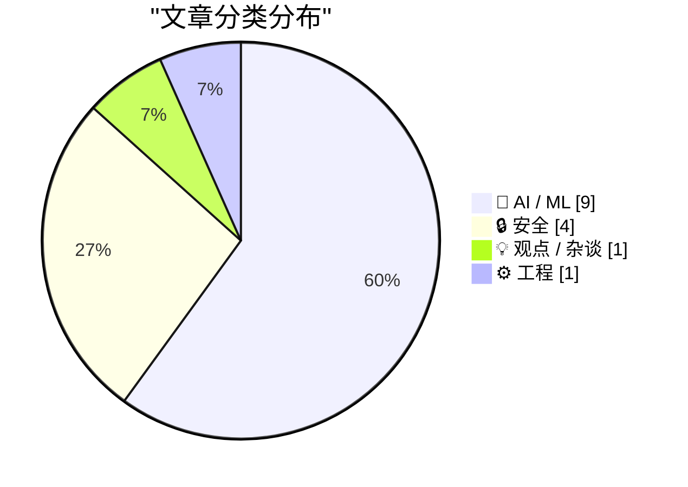
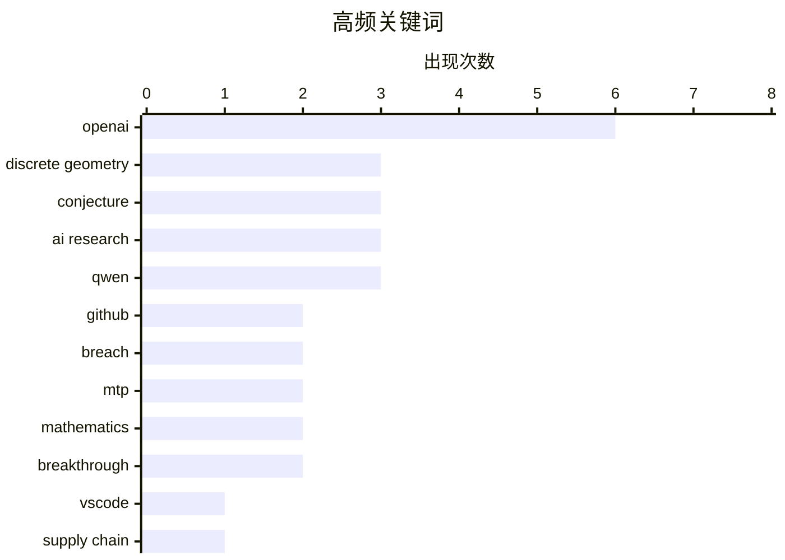

# 📰 AI 资讯每日精选 — 2026-05-21

> 汇聚 140+ 技术博客、X/Twitter、Hacker News、Reddit、Product Hunt、
> Lobste.rs、ClawFeed 日报及 GitHub Trending，经 AI 评分筛选。
>
> **本期内容**：🏆 今日必读 · 🌐 ClawFeed 日报 · 🔥 GitHub Trending · 📂 分类精选 · 🎨 设计与生成式 AI · 📊 数据概览

## 📝 今日看点

今日技术圈聚焦两大趋势：AI 在科学发现上实现历史性突破，OpenAI 通用推理模型首次自主推翻存在80年的数学猜想，标志着AI从工具迈向“研究者”；与此同时，AI对就业与安全的冲击持续加剧，Meta裁员8000人归因于AI效率提升，而GitHub因恶意VSCode扩展导致3800个仓库被入侵，暴露出开发工具供应链的脆弱性。此外，Qwen3.7-Max等智能体模型的发布，正推动AI从对话向自主执行复杂工作流演进。

---

## 🏆 今日必读

🥇 **OpenAI 模型推翻离散几何核心猜想**

[An OpenAI model has disproved a central conjecture in discrete geometry](https://openai.com/index/model-disproves-discrete-geometry-conjecture/) — Hacker News Best · 6 小时前 · 🤖 AI / ML

> OpenAI 的一个通用推理模型成功推翻了一个存在 80 年之久的离散几何核心猜想（Erdos 问题），这是 AI 首次自主解决一个数学领域的著名开放问题。该模型并非针对该问题专门设计，而是作为通用推理能力的输出，证明了前沿模型开始在新知识生产中扮演更主动的角色。如果该证明经同行评议成立，这将是 AI 在数学研究能力上的一个里程碑式突破。

💡 **为什么值得读**: 这是 AI 首次自主解决一个存在数十年的著名数学开放问题，标志着 AI 从工具向研究伙伴的转变，对理解 AI 能力边界至关重要。

🏷️ OpenAI, discrete geometry, conjecture, AI research

🥈 **OpenAI 模型推翻离散几何核心猜想**

[An OpenAI model has disproved a central conjecture in discrete geometry](https://www.reddit.com/r/singularity/comments/1tiwl33/an_openai_model_has_disproved_a_central/) — r/singularity · 5 小时前 · 🤖 AI / ML

> OpenAI 的一个通用推理模型成功推翻了一个存在 80 年之久的离散几何核心猜想（Erdos 问题），这是 AI 首次自主解决一个数学领域的著名开放问题。该模型并非针对该问题专门设计，而是作为通用推理能力的输出，证明了前沿模型开始在新知识生产中扮演更主动的角色。如果该证明经同行评议成立，这将是 AI 在数学研究能力上的一个里程碑式突破。

💡 **为什么值得读**: 这是 AI 首次自主解决一个存在数十年的著名数学开放问题，标志着 AI 从工具向研究伙伴的转变，对理解 AI 能力边界至关重要。

🏷️ OpenAI, discrete geometry, conjecture, AI research

🥉 **GitHub 确认因恶意 VSCode 扩展导致 3800 个仓库被入侵**

[GitHub confirms breach of 3,800 repos via malicious VSCode extension](https://www.bleepingcomputer.com/news/security/github-confirms-breach-of-3-800-repos-via-malicious-vscode-extension/) — Hacker News Best · 11 小时前 · 🔒 安全

> GitHub 证实，一次通过恶意 VSCode 扩展的攻击导致其 3800 个内部仓库被入侵。攻击者利用该扩展获取了 GitHub 内部系统的访问权限，暴露了敏感代码和配置。此次事件凸显了开发工具供应链安全的风险，尤其是广泛使用的 IDE 扩展可能成为攻击入口。GitHub 已采取措施清理受影响的仓库并加强安全审查。

💡 **为什么值得读**: 揭示了开发工具供应链中一个真实且影响广泛的攻击案例，对任何使用 VSCode 的开发者或企业都有直接的安全警示意义。

🏷️ GitHub, VSCode, breach, supply chain

4️⃣ **Qwen3.7-Max：智能体前沿**

[Qwen3.7-Max: The Agent Frontier](https://qwen.ai/blog?id=qwen3.7) — Hacker News Best · 15 小时前 · 🤖 AI / ML

> Qwen 团队发布了 Qwen3.7-Max，一个专注于智能体（Agent）能力的前沿大语言模型。该模型在工具调用、多步推理和自主任务执行方面进行了显著优化，旨在提升 AI 在复杂工作流中的实用性。Qwen3.7-Max 在多个智能体基准测试中取得了领先成绩，代表了当前开源模型在 Agent 领域的最新进展。

💡 **为什么值得读**: 代表了开源大模型在智能体能力上的最新突破，对于关注 AI 自主任务执行和工具使用能力的开发者和研究者是必读内容。

🏷️ Qwen, agent, LLM, frontier

5️⃣ **RTX 5080 16GB 上运行 Qwen3.6 35B MoE 模型：128k 上下文下达到 56 tok/s，以及为何 MTP 无帮助**

[RTX 5080 16GB: Qwen3.6 35B MoE at 128k context — 56 tok/s, and why MTP doesn't help](https://www.reddit.com/r/LocalLLaMA/comments/1tiixql/rtx_5080_16gb_qwen36_35b_moe_at_128k_context_56/) — r/LocalLLaMA · 14 小时前 · 🤖 AI / ML

> 在 RTX 5080 16GB 显卡上，通过 llama.cpp 测试了 Qwen3.6 35B MoE 模型在 128k 长上下文下的推理性能。最佳配置为 Q4_K_XL 量化、不使用 MTP（多 token 预测）、设置 --fit-target 1536，实现了 56 tok/s 的生成速度和 1,584 tok/s 的提示处理速度。测试发现，在长上下文场景下，MTP 并未带来性能提升，反而可能因增加计算开销而降低效率。

💡 **为什么值得读**: 提供了在消费级显卡上运行大模型长上下文推理的实测数据和关键配置参数，对本地部署和性能调优有直接参考价值。

🏷️ RTX-5080, Qwen, MTP, benchmark

---

## 🌐 ClawFeed 日报精选

> 来源：[ClawFeed](https://clawfeed.kevinhe.io) — AI 驱动的多源新闻聚合

📰 ClawFeed Daily | 2026-05-20 SGT

聚合自 5 档 4h digest (DB ids 480/481/482/483/484, 覆盖 SGT 00:00–19:59)。今日主线：**Google 全天发力（Gemini Spark + Veo Avatars + I/O 2026 收敛）+ Karpathy 移籍 Anthropic 余波 + Anthropic 工具链事实垄断（Cursor Composer / GitHub Trending 5/5 / Claude Skills 9w stars）+ Enterprise token 经济进入紧张期（OpenAI $2M YC / Levie F500 CIO 议题 / FDE PMF）+ GitHub 内部仓库被未授权访问（供应链安全）**。

---

## 🔥 当日全场最重要 5 条

1. **Karpathy 加入 Anthropic — 一周内 AI 行业最高信号** —— Andrej Karpathy（OpenAI 创始成员 / Tesla 前 AI 总监 / "vibe coding" 造词人）公开宣布加入 Anthropic 做前沿 LLM 研究，亲自组队基于 Claude 推进。傅盛复盘他每次跳槽都踩转折点（OpenAI→Tesla 押真实世界数据 / Tesla→OpenAI 押 LLM / OpenAI→Anthropic 押"研发关键期"），@punk2898 称"OpenAI 的天塌了"。**意义**：Anthropic 顶尖人才竞争决胜局，叠加 GitHub Trending 前 5 全用 Claude Code + hello-agents 9w stars 蓝图，Anthropic 工具链事实地位由独立信号 3+ 重印证。来源：!481 @bboczeng / !482 @FuSheng_0306 / !484 @punk2898

2. **Google 全天三连：Gemini Spark + Veo Avatars + I/O 2026 主线收敛** ——
   - **Gemini Spark**（!480 / !481）："dedicated agent through GeminiApp" — 跑 dedicated VM + 接全 Google 数据（Gmail/Drive/Calendar/Photos）+ 移动端 + Web 新 UI 一次到位。@OfficialLoganK 首发，与 Anthropic Managed Agents（企业 perimeter）正面对位，agent 形态战进入"专属 runtime + 个人数据图谱"层。
   - **Veo Avatars**（!483）：录一段自己 → 脸+声音存成 character → 任意 clip 复用。@levelsio "amazing work by Google once again"。创作者把自己变可复用素材。
   - **I/O 2026 主线收敛**（!484）：Gemini 3.5 Flash 作为 Search/Antigravity/Gemini app/Gemini API 新底座；Google 把 Gemini 推成 Agent OS 层（模型 + 搜索 + Workspace + 购物 + 眼镜全线收敛）。
   - **意义**：Google 在一天内同时拿出个人 agent + 创作者多模态 + 战略层 Agent OS 三个产品形态，对 OpenAI/Anthropic 双线压上。

3. **GitHub 内部仓库遭未授权访问（供应链安全警报）** —— GitHub 官方在调查中，CZ 公开提醒哪怕 private repo 里的 API key 立刻轮换。**意义**：本日唯一独立安全事件，影响范围跨所有 GitHub 用户，凭证 / SDK 发布 / 供应链链路全部需要重新评估。来源：!482 @cz_binance

4. **OpenAI 向当前 YC batch 每家投 $2M 代币 + Tokenmaxxing 命名 + Levie F500 CIO Token Cost 议题** —— @sama YC 现场宣布 $2M token 投资（造词 "Tokenmaxxing startups"）；同日 Aaron Levie 跟 F500 CIO 饭局复盘 "token cost 是当下最热议题，没人觉得已找到合适策略"。**意义**：Enterprise AI 采购从能力对比阶段切换到成本管控阶段；token 不再是技术指标，是商业 unit economy 核心。两条信号叠加 = "供给侧砸钱 token + 需求侧担心 token cost" 的张力进入产品营销层。来源：!482 @sama / !483 @levie

5. **Cursor Composer 2.5 = "most-chosen model" + Anthropic 工具链事实垄断三连** —— @elonmusk 推广 Cursor Composer 2.5 "now most-chosen model in Cursor" + 10x usage 全天免费（!480）；同日 GitHub Trending 前 5 项目全用 Claude Code 写代码（!484 @pengchujin）；hello-agents（前 Vercel Mat 16-skill 工程经验蒸馏）GitHub 9w stars 登顶（!480 @axichuhai）。**意义**：xAI×Cursor "done deal" 从分析师推测进入产品营销层；同时 Anthropic 在 OSS 项目作者中的事实渗透率由独立数据点印证。Cursor / Anthropic / xAI 三方在 AI coding 工具链格局重新分牌。来源：!480 @elonmusk / !484 @pengchujin / !480 @axichuhai

---

## 📰 当日核心主题（跨档聚类）

**主题 A — Agent 产品形态战进入"runtime + 数据"层**
跨档信号：Gemini Spark dedicated VM（!480）+ Anthropic Managed Agents perimeter sandbox（间接引用）+ Codex app daily-use 级（!481 @gdb）+ Cognition Devin (Scott Wu)（!482 @claudeai）。**收敛点**：agent 不再是 "API + SDK"，是带 runtime + 数据图谱 + 移动端 UI 的产品。

**主题 B — Anthropic 工具链事实垄断（三独立信号）**
Karpathy 移籍（!481/!482/!484）+ GitHub Trending 5/5 用 Claude Code（!484）+ hello-agents Claude Skills 蒸馏 9w stars（!480）+ Cognition Devin on Claude（!482）。**收敛点**：Anthropic 从"对话能力第二"已经实质走到"开发者工具事实标准"。

**主题 C — Enterprise Token 经济进入紧张期**
OpenAI $2M YC token 投资 + Tokenmaxxing 造词（!482）+ Levie F500 CIO token cost 最热议题（!483）+ FDE = Agent PMF 新范式（!482 @kfk_ai：OpenAI $40B / Anthropic 嵌 FIS / Google 一周招几百人）+ OpenAI Guaranteed Capacity 新产品（!483）。**收敛点**：模型不是瓶颈，token 经济 + 驻场施工队是。

**主题 D — 创作者经济与多模态实时化**
Google Veo Avatars（!483）+ Qwen3.5-LiveTranslate 29 语言带眼睛耳朵和你自己声音（!483）+ Pika real-time avatar skill（bookmark）+ Boris Cherny "routines" Claude Code 新范式（!483 @0xMovez）。**收敛点**：multimodal 已从能力发布过渡到工作流落地，"自己"成为可序列化资产。

**主题 E — 供应链安全 / AI provenance 双向施压**
GitHub 内部仓库被入侵（!482）+ OpenAI SynthID 图像水印上线（!480）。**收敛点**：AI 产业基础设施层同日承压（凭证泄漏） + 进步（pixel-level provenance），两条互补但方向相反的信号。

**主题 F — 学界与产业的清醒/对峙声音**
Michael I. Jordan MLST "AGI is a PR term"（!484）+ Eric Schmidt 亚利桑那大学被毕业生嘘声轰炸（!480 间接 @LuBtc888 跨档延伸）+ @badlogicgames "markdown is not a fertile ground for ideas"（!484 反 AI overuse）。**收敛点**：AI 产业宣传与学界 / 年轻人就业焦虑之间张力第一次表面化到几条独立账号同日发声。

---

## 🔖 累计 bookmark 精选

本日 5 档 4h digest 中，bookmarks 仅在 !480 / !481 出现增量（@arrakis_ai GPT-Realtime-2 实时翻译 / @yangyi Google Stitch DESIGN.md / @oragnes Pika avatars / @idoubicc open-agent-sdk / @turingou wanman.ai vibe 产品 / @demishassabis YC 对谈 / @levie Era of Context & enterprise software & capability overhang 三篇 / @yq_acc agents fired coders / @mntruell Cursor 3rd era / @heynavtoor + @chenchengpro Harness Engineering / @cline Cline Kanban / @istdrc slock.ai / @DoveyWanCN Anthropic 企业基本盘）；!482-!484 bookmarks 与之前重合未刷新。**Bookmarks scrape 在 5/12 起未更新的疑似 bug** (!480 提及 35 档 20 条未变) 需要排查。

---

## 👀 推荐关注汇总（跨档去重 16 个）

按"该账号在哪一档被推荐"分组：

**AI 平台 / 公司方第一手发布**
- @OfficialLoganK — Google AI Studio / Gemini 产品口（Gemini Spark 首发披露）
- @gdb — OpenAI 联合创始人 + President（SynthID 等产品级第一手）
- @JeffDean — Google 首席科学家（Gemini 3.5 Flash autonomous 背书）

**AI 圈分析 / 长文 / 战略层**
- @bboczeng — 中文 AI 行业新闻第一时间转化
- @kfk_ai — FDE / PMF / 战略 article-format 长文
- @indigox — Indigo Talk 跨学科 AI 叙事
- @seekjourney — Google I/O 战略层中文稀缺
- @punk2898 — AI 圈人才流动深度复盘
- @ludwigABAP — MLST 现场关键点提炼
- @ma_zhenyuan — 企业级 AI 定制实操派
- @rwayne — 中文 AI 反向 / 深度视角

**AI Builder / Workflow / 工具链**
- @yetone — 中文 coding agent 实操（tmux × agent）
- @0xMovez — Anthropic / OpenAI / Cursor 团队公开讲座转译
- @hasantoxr — AI marketing 自动化 funnel 实操
- @adamtaylorl — Meta 广告算法 + Andromeda SOP 实操

**学界 / 历史性观察者**
- @emollick — Wharton 教授，多模态模型代际进步连续记录

**提醒**：以上未通过浏览器逐一核实是否已关注，**Kevin 操作前请先在 Following 搜一遍** 避免重复加。

---

## 💤 当日重复噪音模式（不是单条吐槽）

跨档观察的重复噪音类型：

1. **@elonmusk 政治 / 段子 / Grok 自宣三连每档都出现** — Vera CPU 段子 / "where are the aliens" / "Truth via Humor" / Grok Build daily release notes / Cursor 推广 RT。除了 Cursor 推广属信号，其余都是噪音常态。

2. **520 节日内容** — 互关求关、520 表白、披萨节社交、NSFW 段子等在中午到晚上四档都出现一定密度。

3. **币安 / KOL 自传 / 顾问蹭单贴** — @nancy_c813 FOMA_BSC、@gokunocool Billion_Global 顾问宣告、@ajs6888 PolyTweet 排行炫耀等。

4. **AI 工具营销贴（特别是去水印 / 抠图）** — @NFTCPS v2ob、@AYi_AInotes 等。低密度时有用，高密度时变噪音。

5. **个人生活/晒图贴** — 插秧、爬山、运动打卡、面相回复链。情绪向无 AI/crypto 内容。

6. **"撸毛/邀请码红利"vlog 型** — @ZhanweiC "熊市散户一年赚 20-30 万" funnel 类。

**模式**：噪音密度跟时段强相关——深夜（00:00–04:00）信号最纯（Google / OpenAI 高管时区集中）；中午–傍晚（12:00–20:00）噪音密度上升（中文活跃 + 节日）。建议下一版 scrape 加 lang/tag 过滤。

---

## ⚙️ 系统状态

- **5/5 档 digest 正常生成**（CDP 全天在线）
- **Bookmarks scrape 疑似 8+ 天未刷新**（!480 提到，影响 deep dive 输入）— 建议下个 maintenance 窗口排查 `clawfeed_scrape.js` 的 bookmark cursor 逻辑
- **followingProfiles 的 followers 字段长期返回空** — 取关建议靠不上 follower 数辅助，等脚本升级
- **20:00–23:55 SGT 窗口未生成 4h digest**（本日报截止时间晚于 20:00 cron 触发但早于 next 00:00），如果 5/20 晚间还有重要事件需要回看，下个 cron 0:00 SGT 5/21 才会 cover

—
*Generated automatically from 5 × 4h digests by Lisa @ 2026-05-20 23:55 SGT*
---

## 🔥 GitHub Trending

> 今日热门开源项目（全语言 + Python）

| # | 项目 | 描述 | ⭐ 总星 | 📈 今日 | 语言 |
|---|------|------|---------|---------|------|
| 1 | [tinyhumansai/openhuman](https://github.com/tinyhumansai/openhuman) 🤖 | Your Personal AI super intelligence. Private, Simple and ... | 23.7k | +3394 | Rust |
| 2 | [multica-ai/andrej-karpathy-skills](https://github.com/multica-ai/andrej-karpathy-skills) 🤖 | A single CLAUDE.md file to improve Claude Code behavior, ... | 140.9k | +2679 | - |
| 3 | [colbymchenry/codegraph](https://github.com/colbymchenry/codegraph) 🤖 | Pre-indexed code knowledge graph for Claude Code, Codex, ... | 9.7k | +2123 | TypeScript |
| 4 | [obra/superpowers](https://github.com/obra/superpowers) | An agentic skills framework & software development method... | 200.1k | +1743 | Shell |
| 5 | [Imbad0202/academic-research-skills](https://github.com/Imbad0202/academic-research-skills) 🤖 | Academic Research Skills for Claude Code: research → writ... | 16.2k | +1667 | Python |
| 6 | [msitarzewski/agency-agents](https://github.com/msitarzewski/agency-agents) 🤖 | A complete AI agency at your fingertips - From frontend w... | 102.9k | +1636 | Shell |
| 7 | [rohitg00/agentmemory](https://github.com/rohitg00/agentmemory) 🤖 | #1 Persistent memory for AI coding agents based on real-w... | 15.2k | +1080 | TypeScript |
| 8 | [github/spec-kit](https://github.com/github/spec-kit) | 💫 Toolkit to help you get started with Spec-Driven Devel... | 104.1k | +1074 | Python |
| 9 | [HKUDS/CLI-Anything](https://github.com/HKUDS/CLI-Anything) 🤖 | "CLI-Anything: Making ALL Software Agent-Native" -- CLI-H... | 38.6k | +890 | Python |
| 10 | [Alishahryar1/free-claude-code](https://github.com/Alishahryar1/free-claude-code) 🤖 | Use claude-code for free in the terminal, VSCode extensio... | 27.0k | +772 | Python |
| 11 | [rohitg00/ai-engineering-from-scratch](https://github.com/rohitg00/ai-engineering-from-scratch) 🤖 | Learn it. Build it. Ship it for others. | 9.6k | +765 | Python |
| 12 | [rmyndharis/OpenWA](https://github.com/rmyndharis/OpenWA) | Free, Open Source, Self-Hosted WhatsApp API Gateway | 4.9k | +741 | TypeScript |
| 13 | [anthropics/claude-plugins-official](https://github.com/anthropics/claude-plugins-official) 🤖 | Official, Anthropic-managed directory of high quality Cla... | 20.8k | +674 | Python |
| 14 | [HKUDS/ViMax](https://github.com/HKUDS/ViMax) | "ViMax: Agentic Video Generation (Director, Screenwriter,... | 6.1k | +674 | Python |
| 15 | [truelockmc/streambert](https://github.com/truelockmc/streambert) | A cross-platform Electron Desktop App to stream and downl... | 3.1k | +582 | JavaScript |

---

## 🤖 AI / ML

### 1. OpenAI 模型推翻离散几何核心猜想

[An OpenAI model has disproved a central conjecture in discrete geometry](https://openai.com/index/model-disproves-discrete-geometry-conjecture/) — **Hacker News Best** · 6 小时前 · ⭐ 28/30

> OpenAI 的一个通用推理模型成功推翻了一个存在 80 年之久的离散几何核心猜想（Erdos 问题），这是 AI 首次自主解决一个数学领域的著名开放问题。该模型并非针对该问题专门设计，而是作为通用推理能力的输出，证明了前沿模型开始在新知识生产中扮演更主动的角色。如果该证明经同行评议成立，这将是 AI 在数学研究能力上的一个里程碑式突破。

🏷️ OpenAI, discrete geometry, conjecture, AI research

---

### 2. OpenAI 模型推翻离散几何核心猜想

[An OpenAI model has disproved a central conjecture in discrete geometry](https://www.reddit.com/r/singularity/comments/1tiwl33/an_openai_model_has_disproved_a_central/) — **r/singularity** · 5 小时前 · ⭐ 28/30

> OpenAI 的一个通用推理模型成功推翻了一个存在 80 年之久的离散几何核心猜想（Erdos 问题），这是 AI 首次自主解决一个数学领域的著名开放问题。该模型并非针对该问题专门设计，而是作为通用推理能力的输出，证明了前沿模型开始在新知识生产中扮演更主动的角色。如果该证明经同行评议成立，这将是 AI 在数学研究能力上的一个里程碑式突破。

🏷️ OpenAI, discrete geometry, conjecture, AI research

---

### 3. Qwen3.7-Max：智能体前沿

[Qwen3.7-Max: The Agent Frontier](https://qwen.ai/blog?id=qwen3.7) — **Hacker News Best** · 15 小时前 · ⭐ 27/30

> Qwen 团队发布了 Qwen3.7-Max，一个专注于智能体（Agent）能力的前沿大语言模型。该模型在工具调用、多步推理和自主任务执行方面进行了显著优化，旨在提升 AI 在复杂工作流中的实用性。Qwen3.7-Max 在多个智能体基准测试中取得了领先成绩，代表了当前开源模型在 Agent 领域的最新进展。

🏷️ Qwen, agent, LLM, frontier

---

### 4. RTX 5080 16GB 上运行 Qwen3.6 35B MoE 模型：128k 上下文下达到 56 tok/s，以及为何 MTP 无帮助

[RTX 5080 16GB: Qwen3.6 35B MoE at 128k context — 56 tok/s, and why MTP doesn't help](https://www.reddit.com/r/LocalLLaMA/comments/1tiixql/rtx_5080_16gb_qwen36_35b_moe_at_128k_context_56/) — **r/LocalLLaMA** · 14 小时前 · ⭐ 27/30

> 在 RTX 5080 16GB 显卡上，通过 llama.cpp 测试了 Qwen3.6 35B MoE 模型在 128k 长上下文下的推理性能。最佳配置为 Q4_K_XL 量化、不使用 MTP（多 token 预测）、设置 --fit-target 1536，实现了 56 tok/s 的生成速度和 1,584 tok/s 的提示处理速度。测试发现，在长上下文场景下，MTP 并未带来性能提升，反而可能因增加计算开销而降低效率。

🏷️ RTX-5080, Qwen, MTP, benchmark

---

### 5. OpenAI 通用模型在著名的 80 年 Erdos 问题上取得突破：“这是 AI 首次自主解决一个数学领域的著名开放问题”

[OpenAI general purpose model had a breakthrough on famous 80 year old Erdos problem. “This marks the first time AI has autonomously solved a prominent open problem central to a field of mathematics”](https://www.reddit.com/r/singularity/comments/1tiwa59/openai_general_purpose_model_had_a_breakthrough/) — **r/singularity** · 6 小时前 · ⭐ 27/30

> OpenAI 的一个通用推理模型成功推翻了一个存在 80 年之久的离散几何核心猜想（Erdos 问题），这是 AI 首次自主解决一个数学领域的著名开放问题。该模型并非针对该问题专门设计，而是作为通用推理能力的输出，证明了前沿模型开始在新知识生产中扮演更主动的角色。如果该证明经同行评议成立，这将是 AI 在数学研究能力上的一个里程碑式突破。

🏷️ OpenAI, mathematics, Erdos, breakthrough

---

### 6. 瞥见第四级？OpenAI 模型帮助挑战 80 年历史的数学假设

[A glimpse of Level 4? OpenAI model helps challenge an 80-year-old math assumption](https://www.reddit.com/r/singularity/comments/1tiw0vq/a_glimpse_of_level_4_openai_model_helps_challenge/) — **r/singularity** · 6 小时前 · ⭐ 27/30

> OpenAI 的一个通用推理模型成功推翻了一个存在 80 年之久的离散几何核心猜想（Erdos 问题），这是 AI 首次自主解决一个数学领域的著名开放问题。该模型并非针对该问题专门设计，而是作为通用推理能力的输出，证明了前沿模型开始在新知识生产中扮演更主动的角色。如果该证明经同行评议成立，这将是 AI 在数学研究能力上的一个里程碑式突破。

🏷️ OpenAI, mathematics, reasoning, breakthrough

---

### 7. OpenAI 模型推翻离散几何核心猜想

[An OpenAI model has disproved a central conjecture in discrete geometry](https://openai.com/index/model-disproves-discrete-geometry-conjecture/) — **Lobste.rs** · 2 小时前 · ⭐ 27/30

> OpenAI 的一个通用推理模型成功推翻了一个存在 80 年之久的离散几何核心猜想（Erdos 问题），这是 AI 首次自主解决一个数学领域的著名开放问题。该模型并非针对该问题专门设计，而是作为通用推理能力的输出，证明了前沿模型开始在新知识生产中扮演更主动的角色。如果该证明经同行评议成立，这将是 AI 在数学研究能力上的一个里程碑式突破。

🏷️ OpenAI, discrete geometry, conjecture, AI research

---

### 8. OpenAI IPO 文件最早可能于周五提交：华尔街日报

[OpenAI IPO Filing May Come As Soon As Friday: WSJ](https://www.reddit.com/r/singularity/comments/1tiwszc/openai_ipo_filing_may_come_as_soon_as_friday_wsj/) — **r/singularity** · 5 小时前 · ⭐ 26/30

> 据《华尔街日报》报道，OpenAI 最早可能在本周五提交首次公开募股（IPO）文件。此举标志着这家 AI 领军企业从非营利组织向上市公司的重大转型。IPO 的具体估值和募资金额尚未披露，但市场普遍预期其估值将超过千亿美元。该消息引发了关于 AI 行业商业化进程和监管挑战的广泛讨论。若成功上市，OpenAI 将成为近年来最受瞩目的科技公司 IPO 之一。

🏷️ OpenAI, IPO, valuation, AI industry

---

### 9. Qwen 3.6 35B GGUF：跨 GPU 和 CPU 的 NTP 与 MTP 量化结果对比

[Qwen 3.6 35B GGUF: NTP vs MTP quantization results across GPUs and CPUs](https://www.reddit.com/r/LocalLLaMA/comments/1tipihx/qwen_36_35b_gguf_ntp_vs_mtp_quantization_results/) — **r/LocalLLaMA** · 9 小时前 · ⭐ 25/30

> 该文章对 Qwen 3.6 35B 模型在 GGUF 格式下的 NTP（Next Token Prediction）和 MTP（Multi-Token Prediction）量化方案进行了系统性基准测试。测试覆盖了多种消费级 GPU（如 RTX 4090、RTX 3090）和 CPU（如 AMD Ryzen、Intel Core）平台，对比了不同量化级别（Q4_K_M、Q5_K_M、Q8_0 等）下的推理速度和内存占用。结果显示，MTP 量化在 GPU 上相比 NTP 实现了约 15-20% 的推理速度提升，但在 CPU 上优势不明显。作者建议在 GPU 推理场景优先选择 MTP 量化方案以平衡速度与质量。

🏷️ Qwen, GGUF, MTP, quantization

---

## 🔒 安全

### 10. GitHub 确认因恶意 VSCode 扩展导致 3800 个仓库被入侵

[GitHub confirms breach of 3,800 repos via malicious VSCode extension](https://www.bleepingcomputer.com/news/security/github-confirms-breach-of-3-800-repos-via-malicious-vscode-extension/) — **Hacker News Best** · 11 小时前 · ⭐ 27/30

> GitHub 证实，一次通过恶意 VSCode 扩展的攻击导致其 3800 个内部仓库被入侵。攻击者利用该扩展获取了 GitHub 内部系统的访问权限，暴露了敏感代码和配置。此次事件凸显了开发工具供应链安全的风险，尤其是广泛使用的 IDE 扩展可能成为攻击入口。GitHub 已采取措施清理受影响的仓库并加强安全审查。

🏷️ GitHub, VSCode, breach, supply chain

---

### 11. Linux 内核 __ptrace_may_access() 函数中的逻辑漏洞 (CVE-2026-46333)

[Logic bug in the Linux kernel's __ptrace_may_access() function (CVE-2026-46333)](https://cdn2.qualys.com/advisory/2026/05/20/cve-2026-46333-ptrace.txt) — **Lobste.rs** · 6 小时前 · ⭐ 27/30

> Qualys 披露了 Linux 内核中一个名为 CVE-2026-46333 的逻辑漏洞，存在于 __ptrace_may_access() 函数中。该漏洞允许本地攻击者绕过 ptrace 访问控制，从而获取对目标进程的调试权限，可能导致权限提升或敏感信息泄露。该漏洞影响多个 Linux 内核版本，Qualys 已发布详细的技术分析报告。

🏷️ Linux kernel, CVE, ptrace, privilege escalation

---

### 12. 新的 NGINX 漏洞允许未经身份验证的远程代码执行

[New NGINX Vulnerability Allows Unauthenticated RCE](https://www.reddit.com/r/programming/comments/1tiil62/new_nginx_vulnerability_allows_unauthenticated_rce/) — **r/programming** · 14 小时前 · ⭐ 26/30

> NGINX 被曝出一个严重漏洞，允许攻击者在未经身份验证的情况下实现远程代码执行（RCE）。该漏洞源于 NGINX 核心组件中的缓冲区溢出问题，影响多个主流版本。攻击者可通过发送特制请求触发漏洞，从而完全控制受影响服务器。目前官方尚未发布正式补丁，建议用户立即采取临时缓解措施，如限制访问来源或禁用受影响模块。安全研究人员已公开了漏洞的技术细节和概念验证代码，增加了被大规模利用的风险。

🏷️ NGINX, RCE, vulnerability, buffer overflow

---

### 13. GitHub 源代码泄露——TeamPCP 声称获取了内部源代码

[GitHub Source Code Breach - TeamPCP Claims Access to Internal Source Code](https://cybersecuritynews.com/github-source-code-breach/) — **Lobste.rs** · 18 小时前 · ⭐ 26/30

> 黑客组织 TeamPCP 声称已成功获取 GitHub 的内部源代码，并在暗网论坛上展示了部分证据。泄露内容据称包括 GitHub 的核心后端代码、CI/CD 管道配置以及部分内部文档。GitHub 官方尚未确认泄露的真实性，但已启动内部安全调查。如果泄露属实，攻击者可能利用这些代码发现更多零日漏洞，对全球数百万开发者的代码安全构成严重威胁。安全社区建议开发者立即轮换 GitHub 相关的 API 密钥和访问令牌。

🏷️ GitHub, breach, source code, security

---

## 💡 观点 / 杂谈

### 14. 马克·扎克伯格的 Meta 启动大规模裁员，裁减 8000 人（约占员工总数的 10%），AI 冲击科技巨头

[Mark Zuckerberg’s Meta kicks off major bloodbath with 8,000 layoffs (about 10% of its workforce) as AI roils tech giant](https://www.reddit.com/r/singularity/comments/1tiosgg/mark_zuckerbergs_meta_kicks_off_major_bloodbath/) — **r/singularity** · 10 小时前 · ⭐ 27/30

> Meta 宣布裁员约 8000 人，占其员工总数的 10%，这是继此前大规模裁员后的又一次重大人员削减。公司将此归因于 AI 技术带来的效率提升，使得许多岗位不再需要人力。此次裁员波及多个部门，包括内容审核、工程和行政岗位，反映了 AI 对大型科技公司组织结构和就业市场的深远影响。

🏷️ Meta, layoffs, AI, industry

---

## ⚙️ 工程

### 15. 事故报告：2026 年 5 月 19 日——GCP 账户被暂停

[Incident Report: May 19, 2026 – GCP Account Suspension](https://blog.railway.com/p/incident-report-may-19-2026-gcp-account-outage) — **Hacker News Best** · 17 小时前 · ⭐ 25/30

> Railway 平台发布了一份详细的事故报告，解释了其 Google Cloud Platform（GCP）账户在 5 月 19 日被意外暂停的原因。事故源于 GCP 的自动化滥用检测系统误将 Railway 的正常流量模式识别为恶意活动，导致整个账户被立即封禁。此次封禁导致 Railway 上数千个用户应用中断服务长达数小时。恢复过程涉及与 GCP 支持团队的多次沟通和手动审核，最终在 12 小时后恢复。Railway 在报告中批评了 GCP 缺乏人工审核机制和透明的申诉流程，并建议用户实施多云备份策略。

🏷️ GCP, incident, account suspension, cloud

---

## 🎨 Design & Generative AI

### 🖼️ 生成式图片

- **[Angelo：ComfyUI统一采样器/修补器/优化器（修复手部等）](https://www.reddit.com/r/comfyui/comments/1tiyu32/angelo_a_unified_sampler_inpainter_refiner_fix/)** — r/comfyui · 4 小时前
  > 一个用于ComfyUI的节点，集成了采样、修补和优化功能，专门用于修复手部等细节。

- **[发布Safe Chunked Image Blend节点：显式CUDA缩放/混合替代隐藏的全批次CPU缩放](https://www.reddit.com/r/StableDiffusion/comments/1tig51k/released_a_safe_chunked_image_blend_node_for/)** — r/StableDiffusion · 16 小时前
  > 一个ComfyUI自定义节点，用于在大图像/视频张量处理中实现稳定、高效的图像混合。

- **[Midjourney称使用TPU导致研究倒退一年，后悔未坚持使用NVIDIA](https://www.reddit.com/r/singularity/comments/1tiut2d/midjourney_says_their_research_was_set_back_by_a/)** — r/singularity · 6 小时前
  > Midjourney表示因采用TPU而非NVIDIA GPU，其研究进度被拖慢了一年。

- **[Pixel-space AsymFLUX.2 klein ComfyUI发布及SFT变体](https://www.reddit.com/r/StableDiffusion/comments/1tiwswq/pixelspace_asymflux2_klein_comfyui_release_sft/)** — r/StableDiffusion · 5 小时前
  > ComfyUI扩展，推出像素空间版本的AsymFLUX.2 klein模型及其微调变体。

- **[ComfyUI HiDream文生图与图像编辑模板：多参考图像功能讨论](https://www.reddit.com/r/StableDiffusion/comments/1tihygu/comfyui_hidream_textimage_and_imageedit_templates/)** — r/StableDiffusion · 14 小时前
  > 介绍ComfyUI新增的HiDream模板，支持多参考图像，并探讨其优缺点。

- **[新手入门：如何从零开始逐节点学习ComfyUI构建复杂自定义工作流？](https://www.reddit.com/r/comfyui/comments/1tiurm2/total_beginner_here_where_do_i_start_learning/)** — r/comfyui · 6 小时前
  > 为完全初学者提供学习ComfyUI节点系统、构建复杂工作流的路径建议。

- **[ComfyUI-StableAudioSampler复活：音频采样节点包更新](https://www.reddit.com/r/comfyui/comments/1tiv4i3/comfyuistableaudiosampler_revived_recent_fork_of/)** — r/comfyui · 6 小时前
  > 一个ComfyUI音频采样节点包的最新分支更新，支持生成节拍和音效。

- **[Klein 9B蒸馏版融合两个LoRA实现极致写实效果](https://www.reddit.com/r/StableDiffusion/comments/1tiwruj/extreme_realism_with_klein_9b_distilled_2_loras/)** — r/StableDiffusion · 5 小时前
  > 通过组合多个LoRA模型，在Klein 9B蒸馏版上实现了高度逼真的图像生成。

- **[为ComfyUI中的Anima模型编写了SPEED采样器](https://www.reddit.com/r/StableDiffusion/comments/1tiff8k/vibecoded_a_speed_sampler_for_anima_in_comfyui/)** — r/StableDiffusion · 17 小时前
  > 一个专为Anima模型优化的ComfyUI自定义采样节点，旨在提升生成速度。

- **[使用ComfyUI进行3D动态图形外观开发（C4D + Octane工作流）](https://www.reddit.com/r/comfyui/comments/1tj3xwm/using_comfyui_for_3d_motion_graphics_lookdev_c4d/)** — r/comfyui · 1 小时前
  > 探讨如何将ComfyUI集成到3D动态图形工作流中，用于场景设置和光照渲染。

- **[Flux2 Klein 9b的深度感知合成：背景替换问题](https://www.reddit.com/r/comfyui/comments/1tikdhq/depthaware_compositing_with_flux2_klein_9b/)** — r/comfyui · 13 小时前
  > 使用Flux2 Klein 9b进行背景替换时，前景物体无法正确感知深度的问题探讨。

### 🌍 世界模型 / 3D

- **[谷歌将Genie世界模型与街景结合，打造基于真实地点的可探索AI世界](https://the-decoder.com/google-pairs-its-genie-world-model-with-street-view-to-create-explorable-ai-worlds-based-on-real-places/)** — The Decoder · 14 小时前
  > 用户在地图上放置图钉，即可获得一个基于真实地点、可步行探索的AI生成世界。

### 🎬 生成式视频

- **[视频生成困境：Wan 2.1（动作好但质量差）vs LTX 2.3（质量好但无动作），如何弥合差距？](https://www.reddit.com/r/comfyui/comments/1tislp8/frustrated_with_video_generation_wan_21_good/)** — r/comfyui · 8 小时前
  > 用户分享在ComfyUI中使用不同视频生成模型时遇到的运动与画质不可兼得的痛点。

- **[故事板图像结合Seedance：创建视频的实用方法及提示词生成代理](https://www.reddit.com/r/comfyui/comments/1tim2bz/this_kind_of_storyboard_image_combined_with/)** — r/comfyui · 11 小时前
  > 开发了一个代理，可根据简单情节描述自动生成故事板提示词，用于视频创作。

- **[从Higgsfield+Freepik转向ComfyUI制作长格式3D CGI风格动画系列](https://www.reddit.com/r/comfyui/comments/1tib79z/switching_from_higgsfield_freepik_to_comfyui_for/)** — r/comfyui · 20 小时前
  > 用户寻求关于使用ComfyUI制作AI生成的长篇3D CGI风格动画系列的工作流和模型建议。

---

## 📊 数据概览

| 扫描源 | 抓取文章 | 时间范围 | 精选 |
|:---:|:---:|:---:|:---:|
| 116/140 | 5351 篇 → 195 篇 | 24h | **15 篇** |

### 分类分布



### 高频关键词



<details>
<summary>📈 纯文本关键词图（终端友好）</summary>

```
openai            │ ████████████████████ 6
discrete geometry │ ██████████░░░░░░░░░░ 3
conjecture        │ ██████████░░░░░░░░░░ 3
ai research       │ ██████████░░░░░░░░░░ 3
qwen              │ ██████████░░░░░░░░░░ 3
github            │ ███████░░░░░░░░░░░░░ 2
breach            │ ███████░░░░░░░░░░░░░ 2
mtp               │ ███████░░░░░░░░░░░░░ 2
mathematics       │ ███████░░░░░░░░░░░░░ 2
breakthrough      │ ███████░░░░░░░░░░░░░ 2
```

</details>

### 🏷️ 话题标签

**openai**(6) · **discrete geometry**(3) · **conjecture**(3) · ai research(3) · qwen(3) · github(2) · breach(2) · mtp(2) · mathematics(2) · breakthrough(2) · vscode(1) · supply chain(1) · agent(1) · llm(1) · frontier(1) · rtx-5080(1) · benchmark(1) · meta(1) · layoffs(1) · ai(1)

---

*生成于 2026-05-21 01:38 | 汇聚 140 个技术博客、X/Twitter、Hacker News、Reddit、Product Hunt、Lobste.rs、ClawFeed 日报及 GitHub Trending，经 AI 评分筛选出 Top 15 精华内容*
