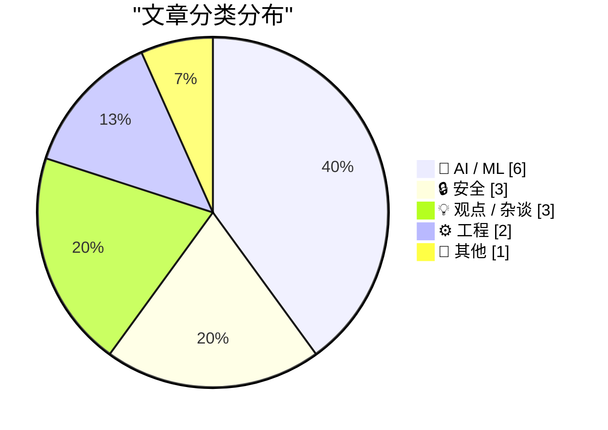
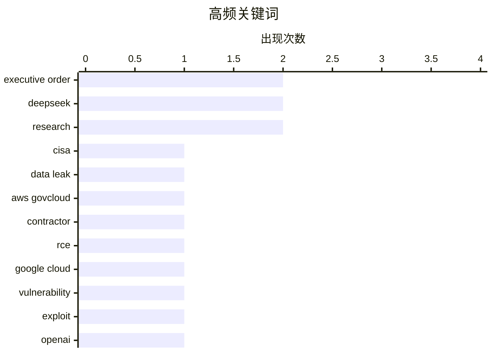

# 📰 AI 资讯每日精选 — 2026-05-23

> 汇聚 140+ 技术博客、X/Twitter、Hacker News、Reddit、Product Hunt、
> Lobste.rs、ClawFeed 日报及 GitHub Trending，经 AI 评分筛选。
>
> **本期内容**：🏆 今日必读 · 🌐 ClawFeed 日报 · 🔥 GitHub Trending · 📂 分类精选 · 🎨 设计与生成式 AI · 📊 数据概览

## 📝 今日看点

今日技术圈聚焦两大主线：AI行业在商业化与开源路线之间激烈博弈，OpenAI巨额亏损与增长停滞暴露了高投入模式的脆弱性，而DeepSeek则逆势推进百亿美元融资并承诺永久降价75%，意图以开源策略重塑市场格局；与此同时，安全领域接连爆发供应链与基础设施级漏洞，从CISA承包商泄露AWS密钥到利用CI/CD工作流大规模后门植入，再到Google Cloud环境中的高额RCE漏洞，表明从政府机构到云服务商的技术防线正面临系统性挑战。

---

## 🏆 今日必读

🥇 **CISA试图控制数据泄露，立法者要求给出答案**

[Lawmakers Demand Answers as CISA Tries to Contain Data Leak](https://krebsonsecurity.com/2026/05/lawmakers-demand-answers-as-cisa-tries-to-contain-data-leak/) — krebsonsecurity.com · 8 小时前 · 🔒 安全

> 美国网络安全和基础设施安全局（CISA）的一名承包商故意将AWS GovCloud密钥及大量其他机构机密发布到一个公共GitHub账户上。该事件由KrebsOnSecurity首次报道，引发了美国国会两院议员的质询。目前CISA仍在努力控制此次泄露事件的影响范围，并作废已泄露的凭证。此次事件暴露了政府机构在承包商管理和云安全密钥保护方面的严重漏洞。

💡 **为什么值得读**: 独家报道揭露了美国政府顶级网络安全机构自身的数据泄露事件，涉及云密钥泄露和国会问责，对关注供应链安全和政府IT治理的人极具警示意义。

🏷️ CISA, data leak, AWS GovCloud, contractor

🥈 **StubZero：Google Cloud生产环境中的148,337美元远程代码执行漏洞**

[StubZero: $148,337 RCE in Google Cloud Production](https://brutecat.com/articles/google-cloud-rce) — brutecat.com · -12870 分钟前 · 🔒 安全

> 本文详细披露了作者在Google Cloud生产环境中发现并利用的一个远程代码执行（RCE）漏洞，该漏洞的悬赏金额为148,337美元。漏洞利用始于一条偶然的Discord消息，作者在窗口关闭前一小时，通过信息泄露和两个缺失的拼图最终实现了RCE。三个月后，类似漏洞再次出现。文章完整记录了从信息泄露到完全控制Google Cloud生产环境的攻击链。

💡 **为什么值得读**: 这是一份罕见的、来自白帽黑客的一手漏洞挖掘实录，详细展示了在Google Cloud这样的大型云平台中实现RCE的完整攻击链和技术细节，对安全研究人员极具参考价值。

🏷️ RCE, Google Cloud, vulnerability, exploit

🥉 **新闻：OpenAI 2026年第一季度非GAAP运营利润率为负122%，ChatGPT增长停滞**

[News: OpenAI Had A Negative 122% Non-GAAP Operating Margin In Q1 2026, and ChatGPT Growth Has Stalled](https://www.wheresyoured.at/news-openai-had-a-negative-122-operating-margin-in-q1-2026-and-chatgpt-growth-has-stalled/) — wheresyoured.at · 11 小时前 · 🤖 AI / ML

> 据The Information报道，OpenAI在2026年第一季度营收为57亿美元，但其调整后的非GAAP运营利润率为-122%。这意味着OpenAI每赚1美元，就要额外亏损1.22美元。与此同时，ChatGPT的用户增长已经陷入停滞。这些数据揭示了OpenAI在巨额营收背后面临的严重盈利困境和增长瓶颈。

💡 **为什么值得读**: 提供了OpenAI最新的核心财务数据（营收57亿美元、负122%利润率）和增长停滞的关键信号，是评估AI行业领头羊商业健康状况的硬核参考。

🏷️ OpenAI, financials, revenue, loss

4️⃣ **特朗普在马斯克、扎克伯格和萨克斯的最后一刻电话游说后撤销AI安全行政令**

[Trump pulls AI safety order after last-minute calls from Musk, Zuckerberg, and Sacks](https://the-decoder.com/trump-pulls-ai-safety-order-after-last-minute-calls-from-musk-zuckerberg-and-sacks/) — The Decoder · 14 小时前 · 🤖 AI / ML

> 特朗普在最后一刻撤销了一项关于AI安全的行政命令，此前他接到了埃隆·马斯克、马克·扎克伯格和前顾问大卫·萨克斯的电话。该行政令本将建立一个针对前沿AI模型的自愿审查系统，要求模型在发布前有90天的审查窗口期。此举标志着美国在AI监管政策上的重大倒退。

💡 **为什么值得读**: 揭示了美国AI监管政策背后的关键人物博弈，马斯克、扎克伯格等科技巨头直接干预并成功阻止了AI安全审查，对理解全球AI治理走向至关重要。

🏷️ AI safety, executive order, Trump, regulation

5️⃣ **DeepSeek宣布促销期后永久降价75%**

[DeepSeek Announces Permanent Price Cut of 75% after Promotion Period](https://www.reddit.com/r/singularity/comments/1tkj8l8/deepseek_announces_permanent_price_cut_of_75/) — r/singularity · 11 小时前 · 🤖 AI / ML

> DeepSeek宣布在其促销活动结束后，将永久性大幅降价75%。这一价格调整是永久性的，而非短期促销。此举将极大降低用户使用其AI模型的成本，可能引发AI模型API市场的价格战。

💡 **为什么值得读**: DeepSeek的永久性75%降价是AI模型API市场的一个重大价格冲击，直接关系到所有AI开发者和企业的成本结构，值得关注。

🏷️ DeepSeek, price cut, LLM, API

---

## 🔥 GitHub Trending

> 今日热门开源项目（全语言 + Python）

| # | 项目 | 描述 | ⭐ 总星 | 📈 今日 | 语言 |
|---|------|------|---------|---------|------|
| 1 | [colbymchenry/codegraph](https://github.com/colbymchenry/codegraph) 🤖 | Pre-indexed code knowledge graph for Claude Code, Codex, ... | 16.6k | +3684 | TypeScript |
| 2 | [anthropics/claude-plugins-official](https://github.com/anthropics/claude-plugins-official) 🤖 | Official, Anthropic-managed directory of high quality Cla... | 25.0k | +2549 | Python |
| 3 | [NousResearch/hermes-agent](https://github.com/NousResearch/hermes-agent) 🤖 | The agent that grows with you | 163.2k | +1743 | Python |
| 4 | [Lum1104/Understand-Anything](https://github.com/Lum1104/Understand-Anything) 🤖 | Graphs that teach &gt; graphs that impress. Turn any code... | 18.7k | +1393 | TypeScript |
| 5 | [Imbad0202/academic-research-skills](https://github.com/Imbad0202/academic-research-skills) 🤖 | Academic Research Skills for Claude Code: research → writ... | 19.1k | +1041 | Python |
| 6 | [rohitg00/ai-engineering-from-scratch](https://github.com/rohitg00/ai-engineering-from-scratch) 🤖 | Learn it. Build it. Ship it for others. | 12.0k | +988 | Python |
| 7 | [ruvnet/RuView](https://github.com/ruvnet/RuView) | π RuView turns commodity WiFi signals into real-time spat... | 64.0k | +978 | Rust |
| 8 | [trimstray/the-book-of-secret-knowledge](https://github.com/trimstray/the-book-of-secret-knowledge) | A collection of inspiring lists, manuals, cheatsheets, bl... | 223.2k | +969 | - |
| 9 | [ChromeDevTools/chrome-devtools-mcp](https://github.com/ChromeDevTools/chrome-devtools-mcp) | Chrome DevTools for coding agents | 41.0k | +501 | TypeScript |
| 10 | [D4Vinci/Scrapling](https://github.com/D4Vinci/Scrapling) | 🕷️ An adaptive Web Scraping framework that handles every... | 53.2k | +492 | Python |
| 11 | [can1357/oh-my-pi](https://github.com/can1357/oh-my-pi) 🤖 | ⌥ AI Coding agent for the terminal — hash-anchored edits,... | 6.4k | +457 | TypeScript |
| 12 | [yt-dlp/yt-dlp](https://github.com/yt-dlp/yt-dlp) | A feature-rich command-line audio/video downloader | 164.4k | +444 | Python |
| 13 | [dotnet/skills](https://github.com/dotnet/skills) 🤖 | Repository for skills to assist AI coding agents with .NE... | 2.5k | +389 | C# |
| 14 | [Fincept-Corporation/FinceptTerminal](https://github.com/Fincept-Corporation/FinceptTerminal) | FinceptTerminal is a modern finance application offering ... | 22.7k | +367 | Python |
| 15 | [HKUDS/ViMax](https://github.com/HKUDS/ViMax) | "ViMax: Agentic Video Generation (Director, Screenwriter,... | 6.7k | +266 | Python |

---

## 🤖 AI / ML

### 1. 新闻：OpenAI 2026年第一季度非GAAP运营利润率为负122%，ChatGPT增长停滞

[News: OpenAI Had A Negative 122% Non-GAAP Operating Margin In Q1 2026, and ChatGPT Growth Has Stalled](https://www.wheresyoured.at/news-openai-had-a-negative-122-operating-margin-in-q1-2026-and-chatgpt-growth-has-stalled/) — **wheresyoured.at** · 11 小时前 · ⭐ 27/30

> 据The Information报道，OpenAI在2026年第一季度营收为57亿美元，但其调整后的非GAAP运营利润率为-122%。这意味着OpenAI每赚1美元，就要额外亏损1.22美元。与此同时，ChatGPT的用户增长已经陷入停滞。这些数据揭示了OpenAI在巨额营收背后面临的严重盈利困境和增长瓶颈。

🏷️ OpenAI, financials, revenue, loss

---

### 2. 特朗普在马斯克、扎克伯格和萨克斯的最后一刻电话游说后撤销AI安全行政令

[Trump pulls AI safety order after last-minute calls from Musk, Zuckerberg, and Sacks](https://the-decoder.com/trump-pulls-ai-safety-order-after-last-minute-calls-from-musk-zuckerberg-and-sacks/) — **The Decoder** · 14 小时前 · ⭐ 27/30

> 特朗普在最后一刻撤销了一项关于AI安全的行政命令，此前他接到了埃隆·马斯克、马克·扎克伯格和前顾问大卫·萨克斯的电话。该行政令本将建立一个针对前沿AI模型的自愿审查系统，要求模型在发布前有90天的审查窗口期。此举标志着美国在AI监管政策上的重大倒退。

🏷️ AI safety, executive order, Trump, regulation

---

### 3. DeepSeek宣布促销期后永久降价75%

[DeepSeek Announces Permanent Price Cut of 75% after Promotion Period](https://www.reddit.com/r/singularity/comments/1tkj8l8/deepseek_announces_permanent_price_cut_of_75/) — **r/singularity** · 11 小时前 · ⭐ 27/30

> DeepSeek宣布在其促销活动结束后，将永久性大幅降价75%。这一价格调整是永久性的，而非短期促销。此举将极大降低用户使用其AI模型的成本，可能引发AI模型API市场的价格战。

🏷️ DeepSeek, price cut, LLM, API

---

### 4. Project Glasswing：初步更新

[Project Glasswing: An Initial Update](https://www.anthropic.com/research/glasswing-initial-update) — **Hacker News Best** · 5 小时前 · ⭐ 26/30

> Anthropic发布了其名为“Project Glasswing”的研究项目的初步更新。该项目旨在探索和提升AI模型的可解释性和透明度。文章提供了该项目的初始进展和发现。

🏷️ Anthropic, Glasswing, interpretability, research

---

### 5. DeepSeek推进102.9亿美元融资，梁文锋承诺继续开发开源AI模型而非追求短期商业化

[DeepSeek is pushing forward with $10.29 billion financing round, with Liang Wenfeng committing to continue developing open-source AI models rather than pursuing short-term commercialization goals](https://www.reddit.com/r/LocalLLaMA/comments/1tkfvvj/deepseek_is_pushing_forward_with_1029_billion/) — **r/LocalLLaMA** · 14 小时前 · ⭐ 26/30

> DeepSeek正在推进一轮102.9亿美元的巨额融资。创始人梁文锋明确承诺，将继续致力于开发开源AI模型，而非追求短期商业化目标。这轮融资将用于支持其实现通用人工智能（AGI）的长期愿景。

🏷️ DeepSeek, open-source, AGI, financing

---

### 6. 使用Nemotron-Labs扩散语言模型实现接近光速的文本生成

[Towards Speed-of-Light Text Generation with Nemotron-Labs Diffusion Language Models](https://huggingface.co/blog/nvidia/nemotron-labs-diffusion) — **Hugging Face Blog** · 1 小时前 · ⭐ 25/30

> 文章介绍了NVIDIA推出的Nemotron-Labs扩散语言模型，该模型采用扩散生成范式替代传统的自回归生成。核心创新在于通过迭代去噪过程并行生成文本，而非逐词预测，从而在推理速度上实现数量级提升——在相同硬件下，生成速度可达传统Transformer模型的10倍以上。文章展示了该模型在长文本生成和实时交互场景中的显著优势，同时保持了与GPT-4等模型相当的生成质量。结论是，扩散语言模型有望成为下一代高效文本生成的基础架构。

🏷️ diffusion, language model, text generation, Nemotron

---

## 🔒 安全

### 7. CISA试图控制数据泄露，立法者要求给出答案

[Lawmakers Demand Answers as CISA Tries to Contain Data Leak](https://krebsonsecurity.com/2026/05/lawmakers-demand-answers-as-cisa-tries-to-contain-data-leak/) — **krebsonsecurity.com** · 8 小时前 · ⭐ 28/30

> 美国网络安全和基础设施安全局（CISA）的一名承包商故意将AWS GovCloud密钥及大量其他机构机密发布到一个公共GitHub账户上。该事件由KrebsOnSecurity首次报道，引发了美国国会两院议员的质询。目前CISA仍在努力控制此次泄露事件的影响范围，并作废已泄露的凭证。此次事件暴露了政府机构在承包商管理和云安全密钥保护方面的严重漏洞。

🏷️ CISA, data leak, AWS GovCloud, contractor

---

### 8. StubZero：Google Cloud生产环境中的148,337美元远程代码执行漏洞

[StubZero: $148,337 RCE in Google Cloud Production](https://brutecat.com/articles/google-cloud-rce) — **brutecat.com** · -12870 分钟前 · ⭐ 28/30

> 本文详细披露了作者在Google Cloud生产环境中发现并利用的一个远程代码执行（RCE）漏洞，该漏洞的悬赏金额为148,337美元。漏洞利用始于一条偶然的Discord消息，作者在窗口关闭前一小时，通过信息泄露和两个缺失的拼图最终实现了RCE。三个月后，类似漏洞再次出现。文章完整记录了从信息泄露到完全控制Google Cloud生产环境的攻击链。

🏷️ RCE, Google Cloud, vulnerability, exploit

---

### 9. Megalodon：通过CI工作流大规模后门植入GitHub仓库

[Megalodon: Mass GitHub Repo Backdooring via CI Workflows](https://safedep.io/megalodon-mass-github-repo-backdooring-ci-workflows) — **Lobste.rs** · 16 小时前 · ⭐ 26/30

> 安全研究人员披露了一种名为“Megalodon”的新型攻击技术，该技术通过滥用GitHub的CI/CD工作流，能够大规模地对GitHub仓库进行后门植入。攻击者可以利用合法的CI运行环境，在代码构建过程中注入恶意代码，从而影响大量下游用户。

🏷️ GitHub, CI/CD, backdoor, supply chain

---

## 💡 观点 / 杂谈

### 10. 维护者的困境

[The Maintainer's Dilemma](https://spf13.com/p/the-maintainers-dilemma/) — **Lobste.rs** · 13 小时前 · ⭐ 26/30

> 文章探讨了开源软件维护者所面临的普遍困境。维护者需要在有限的个人时间、精力和资源下，应对来自用户的功能请求、Bug报告、安全更新以及社区压力。这种持续的无偿或低偿付出导致了维护者的倦怠和项目不可持续性。

🏷️ open source, maintainer, burnout, community

---

### 11. 假如……我们正处于AI泡沫中？（第二部分）

[Premium: What If...We're In An AI Bubble? (Part 2)](https://www.wheresyoured.at/premium-what-if-were-in-an-ai-bubble-part-2/) — **wheresyoured.at** · 9 小时前 · ⭐ 25/30

> 文章延续第一部分，深入探讨AI行业是否处于泡沫之中。作者通过分析当前AI领域的巨额投资、缺乏杀手级应用以及商业化困境，指出AI泡沫可能正在形成。关键论据包括：OpenAI等头部公司估值虚高但收入远不及预期，企业客户对AI产品的实际付费意愿低迷，以及大量AI初创公司依赖融资而非自身造血生存。结论是，如果AI无法在短期内证明其大规模商业价值，泡沫破裂将不可避免。

🏷️ AI bubble, investment, speculation

---

### 12. 加州州长签署美国首项保护工人免受AI失业影响的行政命令

[California governor signs first US executive order to protect workers from AI job loss](https://the-decoder.com/california-governor-signs-first-us-executive-order-to-protect-workers-from-ai-job-loss/) — **The Decoder** · 11 小时前 · ⭐ 25/30

> 美国加州州长纽森签署了全美首个旨在保护工人免受AI导致失业影响的行政命令。该命令要求州政府机构评估AI对就业的潜在冲击，并制定针对性的工人再培训和就业过渡计划。命令还强调，在引入AI系统时，企业需优先考虑“人机协作”而非简单替代，并建立AI对就业影响的公开报告机制。这是美国地方政府首次以行政手段主动应对AI引发的劳动力市场变革。

🏷️ California, executive order, AI, worker protection

---

## ⚙️ 工程

### 13. 内存短缺导致消费电子产品重新定价

[The memory shortage is causing a repricing of consumer electronics](https://simonwillison.net/2026/May/22/memory-shortage/#atom-everything) — **simonwillison.net** · 3 小时前 · ⭐ 25/30

> David Oks撰文解释了为什么使用内存的消费电子产品在未来几年可能会显著涨价。核心原因是全球仅剩三家大型内存制造商，其晶圆产能是固定的。随着AI等领域对内存需求的激增，供给无法快速扩张，导致成本上升并最终转嫁给消费者。

🏷️ memory shortage, consumer electronics, pricing, hardware

---

### 14. C++之父谈内存安全

[Creator of C++ talks about memory safety](https://www.reddit.com/r/programming/comments/1tkivsv/creator_of_c_talks_about_memory_safety/) — **r/programming** · 12 小时前 · ⭐ 25/30

> C++之父Bjarne Stroustrup在最新演讲中回应了关于C++内存安全问题的长期争议。他承认C++在内存安全方面存在固有缺陷，但反对完全转向Rust等“安全语言”的激进方案。他提出，通过改进C++的静态分析工具、推广智能指针和生命周期注解（如Profile方案），可以在不牺牲性能的前提下将内存安全漏洞减少90%以上。核心观点是：与其抛弃C++，不如通过工具和最佳实践来弥补其安全短板，而非依赖语言层面的彻底重构。

🏷️ C++, memory safety, Bjarne Stroustrup, programming

---

## 📝 其他

### 15. 美国研究人员面临与外国合作者发表论文的新限制

[U.S. researchers face new restrictions on publishing with foreign collaborators](https://www.science.org/content/article/u-s-researchers-face-new-restrictions-publishing-foreign-collaborators) — **Hacker News Best** · 9 小时前 · ⭐ 25/30

> 文章报道了美国政府针对科研人员与外国（尤其是中国、俄罗斯等国家）合作者共同发表论文的新限制措施。新规要求研究人员在涉及敏感技术（如AI、量子计算、半导体）的论文发表前，必须向联邦机构申报合作细节并接受审查，否则可能面临经费取消或法律追责。此举旨在防止技术外流，但引发了学术界对科研自由和国际合作受阻的广泛担忧。目前已有多个大学和研究机构表示，新规将显著增加科研行政负担并可能延缓关键领域的创新速度。

🏷️ research, collaboration, policy, security

---

## 🎨 Design & Generative AI

### 🖼️ 生成式图片

- **[Mac用户注意：升级torch包可大幅提升ComfyUI性能](https://www.reddit.com/r/comfyui/comments/1tkdci8/mac_users_dont_forget_to_upgrade_your_torch/)** — r/comfyui · 16 小时前
  > M3 Ultra上torch nightly版本带来从180到30 it/s的性能变化，但需注意兼容性。

- **[Comfy Org发布Nodes 2.0更新说明](https://www.reddit.com/r/StableDiffusion/comments/1tkqrwy/an_update_on_nodes_20_from_comfy_org/)** — r/StableDiffusion · 7 小时前
  > Nodes 2.0自去年7月进入Beta，团队计划逐步将新界面设为默认。

- **[开源模型被高价倒卖，揭露反遭不公封禁](https://www.reddit.com/r/comfyui/comments/1tk9xo6/how_opensourced_models_are_being_sold_and_how/)** — r/comfyui · 19 小时前
  > 有人将开源创作者的工作流打包以1000美元出售，揭露者却收到平台违规警告。

- **[ComfyUI-ialhabbal发布：交互式提示验证、元数据提取与VLLM节点](https://www.reddit.com/r/comfyui/comments/1tkapfi/released_comfyuiialhabbal_interactive_prompt/)** — r/comfyui · 18 小时前
  > 新插件支持提示词对比、元数据提取，并集成Qwen/Gemma等VLLM模型。

- **[nuchaku移植Triton内核，适配NVIDIA Thor平台](https://www.reddit.com/r/comfyui/comments/1tk7adt/ported_nuchaku_to_triton_kernels_for_nvidia_thor/)** — r/comfyui · 21 小时前
  > 借助Claude Opus 4.7编写Triton内核，nuchaku在Thor Dev Kit上运行流畅，社区协作完善中。

- **[Mac用户福音：ComfyUI中SDXL工作流提速25%](https://www.reddit.com/r/StableDiffusion/comments/1tkukt0/mac_users_can_now_run_sdxl_workflows_roughly_25/)** — r/StableDiffusion · 5 小时前
  > 一项优化让Mac用户在ComfyUI中运行SDXL工作流获得显著性能提升。

- **[Qwen EDIT 2511仍是本地图像编辑最佳模型吗？](https://www.reddit.com/r/comfyui/comments/1tknmwf/is_qwen_edit_2511_still_the_best_image_editor_as/)** — r/comfyui · 9 小时前
  > 用户探讨Qwen Edit 2511在本地图像编辑中的领先地位，以及z-image turbo等新模型的对比。

- **[厌倦随机Suno提示？我构建了情感驱动的视觉音序器](https://www.reddit.com/r/comfyui/comments/1tktpep/i_got_tired_of_fighting_random_suno_prompts_so_i/)** — r/comfyui · 5 小时前
  > 通过可视化音序器按情感结构组织歌曲，告别随机提示的困扰。

- **[用Flux 2 Klein在ComfyUI中创建角色转面图](https://www.reddit.com/r/StableDiffusion/comments/1tkf9uc/creating_character_turnaround_sheets_with_flux_2/)** — r/StableDiffusion · 14 小时前
  > 分享一个ComfyUI工作流，利用Flux 2 Klein生成角色多角度转面图。

- **[Flux角色一致性：LoRA训练与测试](https://www.reddit.com/r/comfyui/comments/1tkh0gr/character_consistency_lora_training_and_testing/)** — r/comfyui · 13 小时前
  > 探讨使用Flux模型进行LoRA训练，以实现角色在不同生成中的一致性。

- **[comfy-flow.com推出ComfyUI插件更新](https://www.reddit.com/r/comfyui/comments/1tk4hpy/update_from_comfyflowcom_i_made_a_plugin_for/)** — r/comfyui · 23 小时前
  > comfy-flow.com团队发布新插件，为ComfyUI带来更多功能扩展。

- **[Flux2.Klein Tile放大节点：USDU增强版](https://www.reddit.com/r/comfyui/comments/1tkmj0q/flux2klein_tile_upscaler_node_basically_usdu_with/)** — r/comfyui · 9 小时前
  > 新节点在USDU基础上增加额外功能，实现更高质量的图像放大。

### 🎬 生成式视频

- **[Google Omni视频编辑ComfyUI工作流：堪称视频版Nano banana](https://www.reddit.com/r/comfyui/comments/1tkjotw/google_omni_video_edit_comfyui_workflow_its/)** — r/comfyui · 11 小时前
  > 将Google Omni视频编辑能力集成到ComfyUI，实现类似Nano banana的视频处理效果。

- **[公司获得WAN 2.7 I2V访问权限，效果惊人](https://www.reddit.com/r/comfyui/comments/1tkedzb/my_company_got_wan_27_i2v_access/)** — r/comfyui · 15 小时前
  > WAN 2.7图像转视频模型效果惊艳，音频同步表现无与伦比。

- **[专业级AI口播产品视频：ComfyUI最佳模型与工作流推荐](https://www.reddit.com/r/comfyui/comments/1tkufn4/best_comfyui_modelworkflow_for_prolevel_ugc/)** — r/comfyui · 5 小时前
  > 用户寻求在ComfyUI中构建高质量AI网红口播视频的模型与工作流方案。

---

## 📊 数据概览

| 扫描源 | 抓取文章 | 时间范围 | 精选 |
|:---:|:---:|:---:|:---:|
| 118/140 | 5397 篇 → 202 篇 | 24h | **15 篇** |

### 分类分布



### 高频关键词



<details>
<summary>📈 纯文本关键词图（终端友好）</summary>

```
executive order │ ████████████████████ 2
deepseek        │ ████████████████████ 2
research        │ ████████████████████ 2
cisa            │ ██████████░░░░░░░░░░ 1
data leak       │ ██████████░░░░░░░░░░ 1
aws govcloud    │ ██████████░░░░░░░░░░ 1
contractor      │ ██████████░░░░░░░░░░ 1
rce             │ ██████████░░░░░░░░░░ 1
google cloud    │ ██████████░░░░░░░░░░ 1
vulnerability   │ ██████████░░░░░░░░░░ 1
```

</details>

### 🏷️ 话题标签

**executive order**(2) · **deepseek**(2) · **research**(2) · cisa(1) · data leak(1) · aws govcloud(1) · contractor(1) · rce(1) · google cloud(1) · vulnerability(1) · exploit(1) · openai(1) · financials(1) · revenue(1) · loss(1) · ai safety(1) · trump(1) · regulation(1) · price cut(1) · llm(1)

---

*生成于 2026-05-23 01:30 | 汇聚 140 个技术博客、X/Twitter、Hacker News、Reddit、Product Hunt、Lobste.rs、ClawFeed 日报及 GitHub Trending，经 AI 评分筛选出 Top 15 精华内容*
