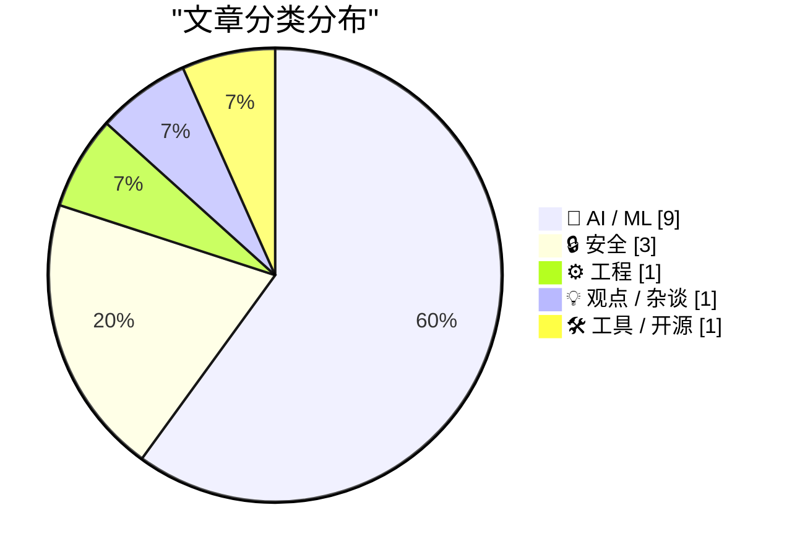
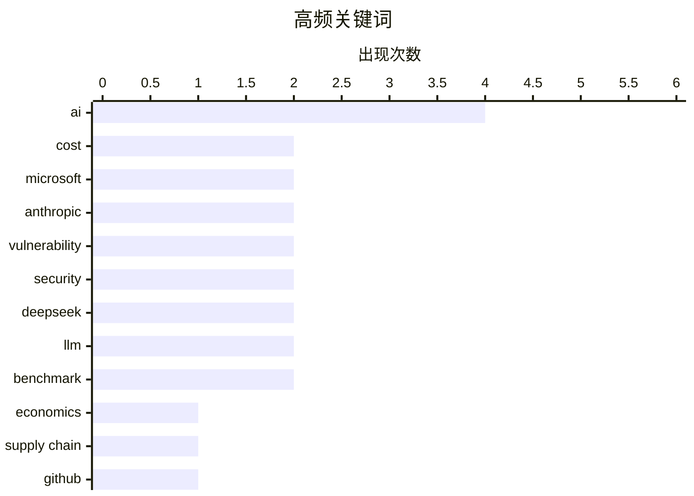

# 📰 AI 资讯每日精选 — 2026-05-24

> 汇聚 140+ 技术博客、X/Twitter、Hacker News、Reddit、Product Hunt、
> Lobste.rs、ClawFeed 日报及 GitHub Trending，经 AI 评分筛选。
>
> **本期内容**：🏆 今日必读 · 🌐 ClawFeed 日报 · 🔥 GitHub Trending · 📂 分类精选 · 🎨 设计与生成式 AI · 📊 数据概览

## 📝 今日看点

今日技术圈的核心议题聚焦于AI商业化的现实困境与成本博弈：微软内部报告揭示AI运营成本已高于人力，行业整体仍深陷亏损，而DeepSeek却以永久性低价策略掀起价格战。与此同时，安全威胁持续升级，“Megaladon”攻击已攻陷超5500个GitHub仓库，Anthropic警告AI发现的漏洞速度已超过人类修补能力。此外，技术演进呈现两极分化——C#终于迎来联合类型这一语言特性突破，而阿里巴巴的AI模型已能自主运行35小时为芯片优化代码，但社区讨论中“期望膨胀期”是否已过、实际落地困难与用户审美疲劳的质疑声渐起。

---

## 🏆 今日必读

🥇 **微软报告：AI成本高于雇佣人类员工**

[Microsoft reports AI is more expensive than paying human employees](https://fortune.com/2026/05/22/microsoft-ai-cost-problem-tokens-agents/) — Hacker News Best · 21 小时前 · 🤖 AI / ML

> 微软内部报告显示，其AI服务的运营成本已超过雇佣人类员工完成相同工作的成本。关键问题在于AI代理（Agent）消耗的Token数量巨大，导致推理成本居高不下。微软发现，在客服、文档处理等场景中，AI的边际成本远高于人工。这一发现挑战了“AI必然降本”的普遍假设，表明当前AI的经济性在特定任务上仍不占优。文章结论是，企业需重新评估AI部署的真实ROI，而非盲目追求自动化。

💡 **为什么值得读**: 用微软内部数据直接挑战了“AI比人便宜”的流行叙事，对任何正在做AI投入产出评估的决策者都有参考价值。

🏷️ AI, cost, Microsoft, economics

🥈 **新攻击“Megaladon”已攻陷5500多个GitHub仓库**

[New Attack "Megaladon" Compromises 5.5K+ GitHub Repos](https://www.reddit.com/r/programming/comments/1tlf8zj/new_attack_megaladon_compromises_55k_github_repos/) — r/programming · 13 小时前 · 🔒 安全

> 一种名为“Megaladon”的新型供应链攻击已成功入侵超过5500个GitHub仓库。攻击者通过窃取OAuth令牌或利用CI/CD管道漏洞，向合法仓库中注入恶意代码。受影响仓库包括多个知名开源项目，用户若拉取或依赖这些被污染的代码，可能面临数据泄露或后门植入风险。安全专家指出，此次攻击规模之大和隐蔽性之强，凸显了当前软件供应链安全的脆弱性。

💡 **为什么值得读**: 5500+仓库被攻陷是近年来最大规模的供应链攻击之一，所有开源项目维护者和使用者都应了解其攻击手法以防范。

🏷️ supply chain, GitHub, attack, Megaladon

🥉 **Anthropic警告：Claude Mythos Preview发现漏洞的速度超过开发者修补速度**

[Anthropic warns Claude Mythos Preview finds bugs faster than developers can patch them](https://the-decoder.com/anthropic-warns-claude-mythos-preview-finds-bugs-faster-than-developers-can-patch-them/) — The Decoder · 17 小时前 · 🔒 安全

> Anthropic的AI模型Claude Mythos Preview在“Project Glasswing”项目中与约50家合作伙伴协作，已发现超过10,000个关键系统漏洞。这些漏洞堆积的速度远超开发者的修补能力。Anthropic警告称，这创造了一个高风险过渡期，并承认包括自身在内的任何公司都尚未建立足够强大的防护措施来防止此类模型被滥用。核心问题是AI安全能力的提升速度已超过人类防御体系的建设速度。

💡 **为什么值得读**: 揭示了AI安全领域一个前所未有的悖论：AI找漏洞太快，人类修不过来，这对整个网络安全行业是重大警示。

🏷️ Anthropic, vulnerability, AI, security

4️⃣ **AI现在盈利了吗？**

[Is AI Profitable Yet?](https://isaiprofitable.com/) — Hacker News Best · 23 小时前 · 🤖 AI / ML

> 该网站通过追踪主要AI公司（如OpenAI、Anthropic、Google）的公开财务数据，系统性地评估AI行业的盈利能力。数据显示，尽管收入增长迅速，但绝大多数AI公司仍处于严重亏损状态，主要成本来自算力、数据获取和人才竞争。文章指出，目前只有少数拥有成熟云业务的巨头（如微软）可能通过AI实现间接盈利。结论是，AI行业整体距离可持续盈利还有相当距离，泡沫风险依然存在。

💡 **为什么值得读**: 用数据说话，直接回答当前AI行业最核心的财务问题，适合所有关注AI商业可行性的投资者和从业者。

🏷️ AI, profitability, analysis

5️⃣ **只有一种糟糕的AI场景**

[There is only one bad AI scenario](https://geohot.github.io//blog/jekyll/update/2026/05/23/one-bad-scenario.html) — geohot.github.io · 18 小时前 · 🤖 AI / ML

> 作者反驳了“天网式”AI失控或“灰蛊”式纳米灾难等科幻末日论，认为这些场景假设了与现实脱节的连续性断裂。真正的危险在于AI持续优化一个狭隘目标（如广告点击率、内容推荐），导致人类社会失去开放式的进化能力。这种“优化陷阱”不会引发战争，但会缓慢地、不可逆地扼杀多样性、创新和人类自主性。核心观点是：AI最可怕的不是造反，而是把世界优化成一个无聊的、没有未来的死胡同。

💡 **为什么值得读**: 提供了对AI风险的全新、非主流的深刻洞察，跳出了“AI杀人”的俗套，值得所有关心AI长期影响的人深思。

🏷️ AI safety, doomer, scenario, opinion

---

## 🔥 GitHub Trending

> 今日热门开源项目（全语言 + Python）

| # | 项目 | 描述 | ⭐ 总星 | 📈 今日 | 语言 |
|---|------|------|---------|---------|------|
| 1 | [multica-ai/andrej-karpathy-skills](https://github.com/multica-ai/andrej-karpathy-skills) 🤖 | A single CLAUDE.md file to improve Claude Code behavior, ... | 149.7k | +3507 | - |
| 2 | [colbymchenry/codegraph](https://github.com/colbymchenry/codegraph) 🤖 | Pre-indexed code knowledge graph for Claude Code, Codex, ... | 19.5k | +2456 | TypeScript |
| 3 | [Lum1104/Understand-Anything](https://github.com/Lum1104/Understand-Anything) 🤖 | Graphs that teach &gt; graphs that impress. Turn any code... | 21.6k | +2299 | TypeScript |
| 4 | [anthropics/claude-plugins-official](https://github.com/anthropics/claude-plugins-official) 🤖 | Official, Anthropic-managed directory of high quality Cla... | 26.5k | +2193 | Python |
| 5 | [rohitg00/ai-engineering-from-scratch](https://github.com/rohitg00/ai-engineering-from-scratch) 🤖 | Learn it. Build it. Ship it for others. | 13.8k | +1521 | Python |
| 6 | [NousResearch/hermes-agent](https://github.com/NousResearch/hermes-agent) 🤖 | The agent that grows with you | 164.5k | +1331 | Python |
| 7 | [yt-dlp/yt-dlp](https://github.com/yt-dlp/yt-dlp) | A feature-rich command-line audio/video downloader | 165.0k | +759 | Python |
| 8 | [trimstray/the-book-of-secret-knowledge](https://github.com/trimstray/the-book-of-secret-knowledge) | A collection of inspiring lists, manuals, cheatsheets, bl... | 223.9k | +628 | - |
| 9 | [Alishahryar1/free-claude-code](https://github.com/Alishahryar1/free-claude-code) 🤖 | Use claude-code for free in the terminal, VSCode extensio... | 28.6k | +565 | Python |
| 10 | [Fincept-Corporation/FinceptTerminal](https://github.com/Fincept-Corporation/FinceptTerminal) | FinceptTerminal is a modern finance application offering ... | 23.1k | +545 | Python |
| 11 | [ChromeDevTools/chrome-devtools-mcp](https://github.com/ChromeDevTools/chrome-devtools-mcp) | Chrome DevTools for coding agents | 41.3k | +435 | TypeScript |
| 12 | [multica-ai/multica](https://github.com/multica-ai/multica) 🤖 | The open-source managed agents platform. Turn coding agen... | 31.9k | +410 | TypeScript |
| 13 | [odoo/odoo](https://github.com/odoo/odoo) | Odoo. Open Source Apps To Grow Your Business. | 51.5k | +386 | Python |
| 14 | [mukul975/Anthropic-Cybersecurity-Skills](https://github.com/mukul975/Anthropic-Cybersecurity-Skills) 🤖 | 754 structured cybersecurity skills for AI agents · Mappe... | 7.4k | +281 | Python |
| 15 | [dotnet/skills](https://github.com/dotnet/skills) 🤖 | Repository for skills to assist AI coding agents with .NE... | 2.8k | +266 | C# |

---

## 🤖 AI / ML

### 1. 微软报告：AI成本高于雇佣人类员工

[Microsoft reports AI is more expensive than paying human employees](https://fortune.com/2026/05/22/microsoft-ai-cost-problem-tokens-agents/) — **Hacker News Best** · 21 小时前 · ⭐ 27/30

> 微软内部报告显示，其AI服务的运营成本已超过雇佣人类员工完成相同工作的成本。关键问题在于AI代理（Agent）消耗的Token数量巨大，导致推理成本居高不下。微软发现，在客服、文档处理等场景中，AI的边际成本远高于人工。这一发现挑战了“AI必然降本”的普遍假设，表明当前AI的经济性在特定任务上仍不占优。文章结论是，企业需重新评估AI部署的真实ROI，而非盲目追求自动化。

🏷️ AI, cost, Microsoft, economics

---

### 2. AI现在盈利了吗？

[Is AI Profitable Yet?](https://isaiprofitable.com/) — **Hacker News Best** · 23 小时前 · ⭐ 26/30

> 该网站通过追踪主要AI公司（如OpenAI、Anthropic、Google）的公开财务数据，系统性地评估AI行业的盈利能力。数据显示，尽管收入增长迅速，但绝大多数AI公司仍处于严重亏损状态，主要成本来自算力、数据获取和人才竞争。文章指出，目前只有少数拥有成熟云业务的巨头（如微软）可能通过AI实现间接盈利。结论是，AI行业整体距离可持续盈利还有相当距离，泡沫风险依然存在。

🏷️ AI, profitability, analysis

---

### 3. 只有一种糟糕的AI场景

[There is only one bad AI scenario](https://geohot.github.io//blog/jekyll/update/2026/05/23/one-bad-scenario.html) — **geohot.github.io** · 18 小时前 · ⭐ 25/30

> 作者反驳了“天网式”AI失控或“灰蛊”式纳米灾难等科幻末日论，认为这些场景假设了与现实脱节的连续性断裂。真正的危险在于AI持续优化一个狭隘目标（如广告点击率、内容推荐），导致人类社会失去开放式的进化能力。这种“优化陷阱”不会引发战争，但会缓慢地、不可逆地扼杀多样性、创新和人类自主性。核心观点是：AI最可怕的不是造反，而是把世界优化成一个无聊的、没有未来的死胡同。

🏷️ AI safety, doomer, scenario, opinion

---

### 4. DeepSeek将75%折扣永久化，输出Token定价比GPT-5.5低至少34倍

[Deepseek makes its 75 percent discount permanent, pricing output tokens at least 34x below GPT-5.5](https://the-decoder.com/deepseek-makes-its-75-percent-discount-permanent-pricing-output-tokens-at-least-34x-below-gpt-5-5/) — **The Decoder** · 8 小时前 · ⭐ 25/30

> DeepSeek宣布将其顶级模型V4-Pro的75%折扣永久化。其输入Token价格为每百万0.435美元，比GPT-5.5便宜至少11.5倍；输出Token价格更是低34倍以上。对于Token消耗量巨大的AI代理系统，这种定价策略将对西方AI提供商形成巨大压力。此举标志着中国AI公司通过极致性价比策略在全球市场发起价格战。

🏷️ DeepSeek, pricing, LLM, cost

---

### 5. Apex-Testing：基于真实仓库的智能编码基准测试（更新）

[Apex-Testing: real-world, real repos, agentic coding benchmark (Update)](https://www.reddit.com/r/LocalLLaMA/comments/1tlh4vq/apextesting_realworld_real_repos_agentic_coding/) — **r/LocalLLaMA** · 11 小时前 · ⭐ 25/30

> Apex-Testing基准测试进行了重大更新，已纳入所有最新模型。该基准基于65-70个真实的私有GitHub仓库，专门用于测试模型的智能编码能力。与传统的合成基准不同，它评估模型在真实代码库中完成复杂任务（如修复bug、添加功能）的能力。更新后的排行榜为开发者提供了更贴近实际开发场景的模型性能参考。

🏷️ benchmark, agentic-coding, real-world, evaluation

---

### 6. 阿里巴巴最新AI模型自主运行35小时，为其自研芯片优化代码

[Alibaba's latest AI model ran autonomously for 35 hours to optimize code for its own custom chip](https://the-decoder.com/alibabas-latest-ai-model-ran-autonomously-for-35-hours-to-optimize-code-for-its-own-custom-chip/) — **The Decoder** · 15 小时前 · ⭐ 24/30

> 阿里巴巴通义千问团队发布Qwen3.7-Max，这是一款专为长时间自主代理任务设计的专有模型。该模型在基准测试中与Claude Opus 4.6持平，并击败了DeepSeek V4 Pro和Kimi K2.6等国内对手。团队还演示了该模型自主运行35小时，为其自研芯片优化底层代码，以及控制四足机器人。这展示了AI在硬件优化和机器人控制领域的自主能力。

🏷️ Alibaba, Qwen, autonomous, chip

---

### 7. 基准测试：Needle 26M 与 Qwen3-0.6B 在 CPU 上的函数调用能力对比——小 23 倍的模型准确率更高且快 4.4 倍

[Benchmarked Needle 26M vs Qwen3-0.6B on CPU function calling, 50 queries across 5 difficulty tiers. The 23x smaller model wins on accuracy and is 4.4x faster.](https://www.reddit.com/r/LocalLLaMA/comments/1tljs5o/benchmarked_needle_26m_vs_qwen306b_on_cpu/) — **r/LocalLLaMA** · 9 小时前 · ⭐ 24/30

> 在 4 核 CPU（无 GPU）上对 Needle 26M（专为函数调用蒸馏的小模型）和 Qwen3-0.6B（通用小模型）进行了 50 次查询的对比测试，覆盖简单、释义、隐含、模糊和边缘用例（含外语及“不调用任何工具”陷阱）5 个难度等级。结果显示，体积小 23 倍的 Needle 26M 在整体准确率上胜出，且推理速度快了 4.4 倍。该实验证明，针对特定任务（如工具调用）精心蒸馏的小型专用模型，在资源受限场景下可以显著优于参数更多的通用模型。

🏷️ benchmark, function-calling, small-model, CPU

---

### 8. Microsoft Lens 首次测试：效果相当不错！——ComfyUI 原生支持即将合并

[Microsoft Lens First Tests: It's Pretty Decent! - ComfyUI Native Support About to Be Merged](https://www.reddit.com/r/StableDiffusion/comments/1tlw09a/microsoft_lens_first_tests_its_pretty_decent/) — **r/StableDiffusion** · 1 小时前 · ⭐ 24/30

> Microsoft Lens 的初步测试结果显示其生成效果令人满意，并且该工具即将获得 ComfyUI 的原生支持（合并到主分支）。Lens 是微软推出的图像生成/处理模型，此次测试验证了其在 ComfyUI 工作流中的可用性和质量。ComfyUI 的原生集成意味着用户无需额外插件即可直接调用 Lens，简化了部署流程。对于 Stable Diffusion 生态的用户来说，这提供了一个新的高质量模型选择。

🏷️ Microsoft, Lens, ComfyUI, StableDiffusion

---

### 9. 编码中无聊的 90% 任务基本已被解决

[coding is basically solved for the boring 90% of tasks](https://www.reddit.com/r/singularity/comments/1tlj7ou/coding_is_basically_solved_for_the_boring_90_of/) — **r/singularity** · 10 小时前 · ⭐ 24/30

> 作者使用 DeepSeek V4 和 Hunyuan Hy3 Preview（21B 活跃参数，每百万输入 token 约 0.18 美元，比 Opus 便宜约 80 倍）作为廉价工作模型，零人工干预地重构了一个包含 120 个文件的 FastAPI 服务，共执行 400 步，消耗 200 万 token，总成本仅 3 美元。虽然模型自信地在异步事件处理器中引入了一个死锁（说明困难的 10% 仍需 Opus 级别模型），但整体成功率极高。Tencent 报告该方案在 495 步生产运行中步骤成功率达 99.99%。结论是：对于日常的代码重构和重复性任务，廉价模型已足够胜任，但复杂逻辑仍需顶级模型把关。

🏷️ coding, refactoring, LLM, DeepSeek

---

## 🔒 安全

### 10. 新攻击“Megaladon”已攻陷5500多个GitHub仓库

[New Attack "Megaladon" Compromises 5.5K+ GitHub Repos](https://www.reddit.com/r/programming/comments/1tlf8zj/new_attack_megaladon_compromises_55k_github_repos/) — **r/programming** · 13 小时前 · ⭐ 27/30

> 一种名为“Megaladon”的新型供应链攻击已成功入侵超过5500个GitHub仓库。攻击者通过窃取OAuth令牌或利用CI/CD管道漏洞，向合法仓库中注入恶意代码。受影响仓库包括多个知名开源项目，用户若拉取或依赖这些被污染的代码，可能面临数据泄露或后门植入风险。安全专家指出，此次攻击规模之大和隐蔽性之强，凸显了当前软件供应链安全的脆弱性。

🏷️ supply chain, GitHub, attack, Megaladon

---

### 11. Anthropic警告：Claude Mythos Preview发现漏洞的速度超过开发者修补速度

[Anthropic warns Claude Mythos Preview finds bugs faster than developers can patch them](https://the-decoder.com/anthropic-warns-claude-mythos-preview-finds-bugs-faster-than-developers-can-patch-them/) — **The Decoder** · 17 小时前 · ⭐ 26/30

> Anthropic的AI模型Claude Mythos Preview在“Project Glasswing”项目中与约50家合作伙伴协作，已发现超过10,000个关键系统漏洞。这些漏洞堆积的速度远超开发者的修补能力。Anthropic警告称，这创造了一个高风险过渡期，并承认包括自身在内的任何公司都尚未建立足够强大的防护措施来防止此类模型被滥用。核心问题是AI安全能力的提升速度已超过人类防御体系的建设速度。

🏷️ Anthropic, vulnerability, AI, security

---

### 12. Anthropic 称 Mythos 已发现超过 10,000 个漏洞

[Anthropic says Mythos has already found more than 10,000 vulnerabilities](https://www.reddit.com/r/singularity/comments/1tlplt6/anthropic_says_mythos_has_already_found_more_than/) — **r/singularity** · 6 小时前 · ⭐ 24/30

> Anthropic 宣布其 AI 系统 Mythos 在安全审计中已发现超过 10,000 个软件漏洞。这一成果展示了 AI 在自动化漏洞挖掘领域的巨大潜力，远超传统人工审计的效率。Mythos 能够大规模、系统地扫描代码库并识别安全缺陷，标志着 AI 在网络安全攻防中的应用进入新阶段。该数据也暗示，未来软件安全审计可能越来越多地依赖 AI 工具。

🏷️ Anthropic, vulnerability, Mythos, security

---

## ⚙️ 工程

### 13. .NET（确切地说是C#）终于迎来了联合类型

[.NET (OK, C#) finally gets union types](https://andrewlock.net/exploring-the-dotnet-11-preview-2-dotnet-gets-union-types/) — **Lobste.rs** · 4 小时前 · ⭐ 25/30

> 在.NET 11 Preview 2中，C#正式引入了联合类型（Union Types）支持。联合类型允许一个变量存储多种预定义类型中的一种，极大地增强了类型安全性和代码表达力。这一特性解决了C#长期以来的一个痛点，使开发者能够更优雅地处理“要么是A，要么是B”的场景，而无需依赖继承或枚举。该特性预计将在.NET 11正式版中全面可用。

🏷️ .NET, C#, union-types, type-system

---

## 💡 观点 / 杂谈

### 14. 我们是否已经过了期望膨胀的顶峰？

[Have we passed the peak of inflated expectations?](https://www.reddit.com/r/LocalLLaMA/comments/1tlcars/have_we_passed_the_peak_of_inflated_expectations/) — **r/LocalLLaMA** · 15 小时前 · ⭐ 24/30

> 该帖子观察到r/LocalLLaMA子版块活跃人数有所下降，并引发讨论：AI行业是否已从“期望膨胀期”进入“幻灭低谷期”？评论者指出，尽管模型能力持续提升，但实际应用落地困难、成本高昂以及用户审美疲劳，导致公众和投资者的热情降温。部分人认为，当前AI的炒作程度已超过实际价值，市场正在回归理性。

🏷️ expectations, hype, AI, industry

---

## 🛠 工具 / 开源

### 15. llama.cpp 服务器现已内置原生工具（exec_shell、edit_file 等）

[llama.cpp server have built-in native tools (exec_shell, edit_file, etc.)](https://www.reddit.com/r/LocalLLaMA/comments/1tluma3/llamacpp_server_have_builtin_native_tools_exec/) — **r/LocalLLaMA** · 2 小时前 · ⭐ 24/30

> llama.cpp 的服务器模式新增了内置原生工具支持，包括 exec_shell（执行 shell 命令）、edit_file（编辑文件）等。这些工具允许本地运行的大语言模型直接与操作系统交互，执行文件操作和命令调用，无需额外编写代码或集成第三方框架。该功能显著扩展了本地模型的实用性，使其能完成自动化脚本执行、文件修改等任务。对于希望用本地模型替代云端 API 进行自动化操作的开发者来说，这是一个重要的能力升级。

🏷️ llama.cpp, server, tools, exec

---

## 🎨 Design & Generative AI

### 🖼️ 生成式图片

- **[微软Lens初测：表现不错！ComfyUI原生支持即将合并](https://www.reddit.com/r/StableDiffusion/comments/1tlw09a/microsoft_lens_first_tests_its_pretty_decent/)** — r/StableDiffusion · 1 小时前
  > 微软Lens工具首次测试表现良好，ComfyUI原生支持功能即将合并到主分支。

- **[在ComfyUI中实现RoPE解旋：无需训练的风格迁移](https://www.reddit.com/r/StableDiffusion/comments/1tl8mo4/i_implemented_untwisting_rope_in_comfyui/)** — r/StableDiffusion · 19 小时前
  > 一种无需训练即可实现风格迁移的新方法，通过在ComfyUI中解旋RoPE实现。

- **[IMG数据集精炼器v4.3 Pro发布：LoRA训练的终极数据准备工具](https://www.reddit.com/r/StableDiffusion/comments/1tl36zc/img_dataset_refiner_v43_pro_is_here_the_ultimate/)** — r/StableDiffusion · 23 小时前
  > 全新升级的数据集预处理工具，专为LoRA训练优化，提升数据质量与效率。

- **[最佳安全实践指南？](https://www.reddit.com/r/StableDiffusion/comments/1tl7zi5/best_security_practices/)** — r/StableDiffusion · 19 小时前
  > 用户讨论在运行Stable Diffusion和ComfyUI时如何防范随机模型带来的安全风险。

- **[为老显卡打造的本地Stable Diffusion GUI：GTX 1060也能流畅运行](https://www.reddit.com/r/StableDiffusion/comments/1tloaiq/i_built_a_local_stable_diffusion_gui_specifically/)** — r/StableDiffusion · 7 小时前
  > 专为GTX 1060等老旧GPU设计的轻量级界面，支持零拷贝ADetailer和实时显存监控。

- **[ComfyUI最佳安全实践？](https://www.reddit.com/r/comfyui/comments/1tl84uz/best_comfyui_security_practices/)** — r/comfyui · 19 小时前
  > 社区讨论ComfyUI使用中的安全隐患，强调随机模型下载的风险与防护措施。

- **[ForgeFlash：极简Stable Diffusion WebUI前端，灵感来自Fooocus](https://www.reddit.com/r/StableDiffusion/comments/1tll04p/github_forgeflash_a_clean_minimal_frontend_for/)** — r/StableDiffusion · 9 小时前
  > 一个干净、精简的SD WebUI Forge前端，保留核心控制的同时简化工作流程。

- **[SmartGallery DAM：新增Remix工作流，直接在图库中编辑和批量生成ComfyUI图像](https://www.reddit.com/r/StableDiffusion/comments/1tlfhoo/smartgallery_dam_introducing_remix_workflow_edit/)** — r/StableDiffusion · 12 小时前
  > 数字资产管理工具集成ComfyUI编辑与批量生成功能，提升图像处理效率。

- **[VNCCS PoseStudio大更新0.4.19发布](https://www.reddit.com/r/StableDiffusion/comments/1tli8j5/vnccs_posestudio_big_update_0419/)** — r/StableDiffusion · 11 小时前
  > 姿态生成工具PoseStudio迎来重大版本更新，带来多项新功能与改进。

- **[AsymFLUX.2-klein-9B：专注纹理细节的模型](https://www.reddit.com/r/StableDiffusion/comments/1tlt6md/asymflux2klein9b_is_all_about_textures/)** — r/StableDiffusion · 3 小时前
  > 新模型AsymFLUX.2-klein-9B在纹理生成方面表现突出，提供高质量细节输出。

- **[多参考潜空间节点发布](https://www.reddit.com/r/StableDiffusion/comments/1tlmwzs/multi_referencelatent/)** — r/StableDiffusion · 7 小时前
  > 为Flux2klein增强包新增的多参考潜空间节点，支持更灵活的生成控制。

- **[Flux2.Klein Tile放大节点：USDU的增强版](https://www.reddit.com/r/StableDiffusion/comments/1tlgkj3/flux2klein_tile_upscaler_node_basically_usdu_with/)** — r/StableDiffusion · 12 小时前
  > 新增的Tile放大节点，在USDU基础上加入多项质量提升功能，优化放大效果。

### 🎬 生成式视频

- **[LongCat视频头像1.5发布：更生动的说话头像模型](https://www.reddit.com/r/StableDiffusion/comments/1tl4koq/longcat_video_avatar_15_released_expressive/)** — r/StableDiffusion · 22 小时前
  > 新版说话头像模型，支持更自然的表情与动作，适用于视频生成场景。

- **[生成式AI（Kling）已进入影视制作实际应用](https://www.reddit.com/r/singularity/comments/1tlu4gv/generative_ai_kling_is_now_used_in_actual_tv/)** — r/singularity · 3 小时前
  > Kling视频生成技术已被用于真实电视节目和电影制作，标志AI影视应用新阶段。

- **[LTX 2.3（1.1）令人印象深刻：本地生成效果惊艳](https://www.reddit.com/r/comfyui/comments/1tlleg3/really_impressed_with_ltx_23_11_mind_blowing/)** — r/comfyui · 8 小时前
  > 使用ComfyUI本地生成恐怖片测试镜头，LTX 2.3模型输出效果令人惊叹。

---

## 📊 数据概览

| 扫描源 | 抓取文章 | 时间范围 | 精选 |
|:---:|:---:|:---:|:---:|
| 119/140 | 5419 篇 → 185 篇 | 24h | **15 篇** |

### 分类分布



### 高频关键词



<details>
<summary>📈 纯文本关键词图（终端友好）</summary>

```
ai            │ ████████████████████ 4
cost          │ ██████████░░░░░░░░░░ 2
microsoft     │ ██████████░░░░░░░░░░ 2
anthropic     │ ██████████░░░░░░░░░░ 2
vulnerability │ ██████████░░░░░░░░░░ 2
security      │ ██████████░░░░░░░░░░ 2
deepseek      │ ██████████░░░░░░░░░░ 2
llm           │ ██████████░░░░░░░░░░ 2
benchmark     │ ██████████░░░░░░░░░░ 2
economics     │ █████░░░░░░░░░░░░░░░ 1
```

</details>

### 🏷️ 话题标签

**ai**(4) · **cost**(2) · **microsoft**(2) · anthropic(2) · vulnerability(2) · security(2) · deepseek(2) · llm(2) · benchmark(2) · economics(1) · supply chain(1) · github(1) · attack(1) · megaladon(1) · profitability(1) · analysis(1) · ai safety(1) · doomer(1) · scenario(1) · opinion(1)

---

*生成于 2026-05-24 01:38 | 汇聚 140 个技术博客、X/Twitter、Hacker News、Reddit、Product Hunt、Lobste.rs、ClawFeed 日报及 GitHub Trending，经 AI 评分筛选出 Top 15 精华内容*
