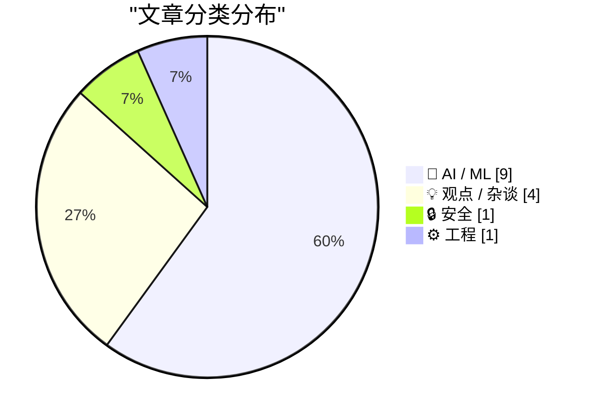
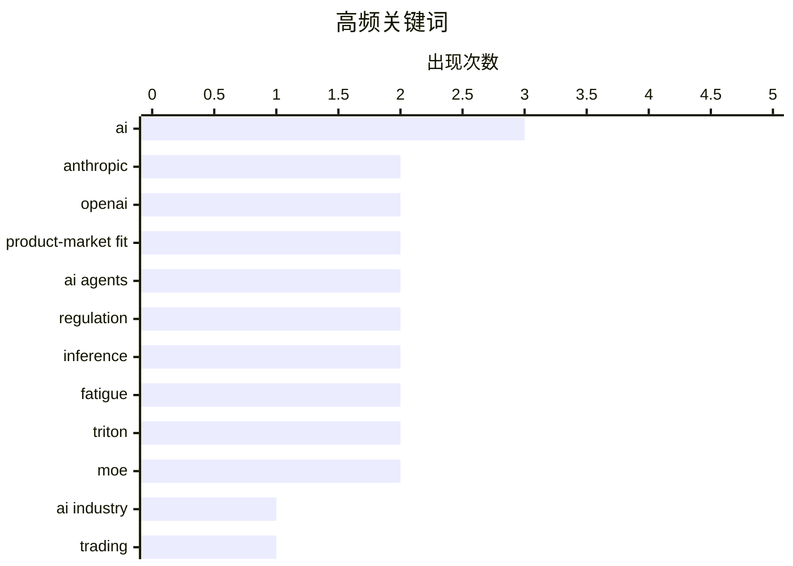

# 📰 AI 资讯每日精选 — 2026-05-28

> 汇聚 140+ 技术博客、X/Twitter、Hacker News、Reddit、Product Hunt、
> Lobste.rs、ClawFeed 日报及 GitHub Trending，经 AI 评分筛选。
>
> **本期内容**：🏆 今日必读 · 🌐 ClawFeed 日报 · 🔥 GitHub Trending · 📂 分类精选 · 🎨 设计与生成式 AI · 📊 数据概览

## 📝 今日看点

今日技术圈的核心趋势聚焦于AI商业化的加速落地与基础设施的可靠性隐忧。一方面，Anthropic和OpenAI被指已实现产品市场契合，其LLM工具因企业用户“用得太狠”导致账单激增，反而印证了真实价值；另一方面，Robinhood允许AI代理自主交易股票和信用卡消费，标志着AI正从辅助工具向自主金融代理人演进。与此同时，技术社区发出警示：AI生成的CUDA内核在生产中会静默破坏训练与推理，而Starlette框架曝出的高危认证漏洞则提醒业界，在拥抱AI效率时，安全与稳定性仍是不可忽视的底线。

---

## 🏆 今日必读

🥇 **我认为Anthropic和OpenAI已经找到了产品市场契合点**

[I think Anthropic and OpenAI have found product-market fit](https://simonwillison.net/2026/May/27/product-market-fit/) — Hacker News Best · 8 小时前 · 💡 观点 / 杂谈

> 文章探讨了Anthropic和OpenAI是否已实现产品市场契合（PMF）。关键论据包括：Anthropic即将迎来首个盈利季度，同时多家公司因员工大量使用LLM导致账单激增，这恰恰证明了产品的真实价值。作者认为，当企业开始抱怨AI费用过高时，说明AI工具已从“玩具”变成了不可或缺的生产力工具，这正是PMF的典型标志。结论是，OpenAI和Anthropic通过提供高价值、高粘性的AI服务，成功找到了产品市场契合点。

💡 **为什么值得读**: 作者用“用户抱怨太贵”这一反直觉视角论证AI公司的PMF，观点新颖且具有洞察力，值得一读。

🏷️ Anthropic, OpenAI, product-market fit, AI industry

🥈 **Robinhood允许AI代理为客户交易股票和进行信用卡消费**

[Robinhood lets AI agents trade shares and make credit card purchases for customers](https://the-decoder.com/robinhood-lets-ai-agents-trade-shares-and-make-credit-card-purchases-for-customers/) — The Decoder · 7 小时前 · 🤖 AI / ML

> Robinhood推出新功能，允许客户通过MCP协议将Anthropic的Claude等AI代理连接到独立的投资账户。这些AI代理可以自主进行股票交易和信用卡消费。美国券商监管机构FINRA已将此列为新的风险领域，警告AI代理可能做出未经检查的决策。Robinhood自身也承认该产品并不适合所有用户。

💡 **为什么值得读**: 这是金融科技领域首个允许AI代理直接执行交易和支付的主流平台案例，对理解AI Agent在金融领域的落地与监管挑战极具参考价值。

🏷️ AI agents, trading, Robinhood, regulation

🥉 **AI生成的CUDA内核会静默破坏训练和推理**

[AI-generated CUDA kernels silently break training and inference [R]](https://www.reddit.com/r/MachineLearning/comments/1tpaw6x/aigenerated_cuda_kernels_silently_break_training/) — r/MachineLearning · 8 小时前 · 🤖 AI / ML

> NVIDIA发布了包含235个生产级CUDA内核的基准测试SOL-ExecBench，这些内核来自DeepSeek、Qwen、Gemma和Kimi等模型。研究发现，多个排名靠前的AI生成内核在实际生产负载中会以意想不到的方式失效。例如，一个融合了嵌入梯度与RMSNorm反向传播的内核，在每次训练迭代末尾运行时会出现问题。这些错误是“静默”的，即不会报错但会破坏训练或推理结果，导致模型性能下降。

💡 **为什么值得读**: 揭示了AI生成代码在底层系统软件中的严重可靠性隐患，对依赖AI辅助编程的开发者是重要警示。

🏷️ CUDA, AI-generated code, training, inference

4️⃣ **CVE-2026-48710：Starlette Host-Header 认证绕过漏洞**

[CVE-2026-48710 Starlette Host-Header Auth Bypass](https://badhost.org) — Lobste.rs · 17 小时前 · 🔒 安全

> 文章披露了Starlette框架中的一个高危安全漏洞CVE-2026-48710。该漏洞允许攻击者通过操纵HTTP Host头来绕过基于Host头的认证机制。这意味着攻击者可以伪装成合法用户或访问本应受保护的内网资源。该漏洞影响所有使用Starlette进行Host头验证的应用程序。

💡 **为什么值得读**: 这是一个影响广泛Python Web框架的严重安全漏洞，所有Starlette用户应立即检查并修复。

🏷️ CVE, Starlette, authentication bypass, security

5️⃣ **我认为Anthropic和OpenAI已经找到了产品市场契合点**

[I think Anthropic and OpenAI have found product-market fit](https://simonwillison.net/2026/May/27/product-market-fit/#atom-everything) — simonwillison.net · 8 小时前 · 🤖 AI / ML

> 文章指出Anthropic即将实现首个盈利季度，同时多家公司因员工大量使用LLM导致账单激增。作者认为，这种“费用过高”的抱怨恰恰是产品市场契合（PMF）的强烈信号，因为用户已经离不开这些工具。当企业开始为AI使用成本感到“肉疼”时，说明AI已从实验性工具转变为核心生产力。结论是，OpenAI和Anthropic通过提供高价值、高粘性的AI服务，成功找到了产品市场契合点。

💡 **为什么值得读**: 作者用“用户抱怨太贵”这一反直觉视角论证AI公司的PMF，观点新颖且具有洞察力，值得一读。

🏷️ Anthropic, OpenAI, product-market fit, profitability

---

## 🌐 ClawFeed 日报精选

> 来源：[ClawFeed](https://clawfeed.kevinhe.io) — AI 驱动的多源新闻聚合

📅 ClawFeed 日报 | 2026-05-27 (SGT)

汇总：6 篇 4h digest (#527/#529/#530/#531/#532/#533)，时段覆盖 2026-05-27 00:00 SGT → 2026-05-27 23:59 SGT（周二全天）。Bookmarks 结构性 stale 已确认（连续 10+ 天 0 新增，#529 起停止重复计数）— **P0 结构性 bug，待 Kevin 排查 pipeline**。

---

## 🔥 当日全场最重要 5 条

1. **中国限制 Alibaba/DeepSeek 顶尖 AI 人才出境 — 地缘 × 科技最强信号（#529, 00:00-03:59 SGT）** — @DeItaone 全大写 breaking（636K impression，189 RT / 540 Quote）："CHINA IS RESTRICTING OVERSEAS TRAVEL FOR TOP AI PROFESSIONALS IN PRIVATE FIRMS SUCH AS ALIBABA GROUP HOLDING AND DEEPSEEK"。中国政府将顶尖 AI 工程师定性为"国家战略资产"，与 2010 年代限制核物理学家出境性质类同。对 DeepSeek 影响尤其显著——小团队高密度人才模式 × 出行管制 = 对外合作摩擦显著上升。开源代码已经出境，但人才流动通道收窄。外资 AI 公司（OpenAI/Anthropic/Google）在华招募窗口事实性收缩。来源: https://x.com/DeItaone/status/2059188403002916984

2. **Harness Engineering 被正式命名 — 同模型同 benchmark 跑两次 42% → 78%（#530, 04:00-07:59 SGT）** — @chenchengpro 整理：唯一变量是 harness（模型外围的规则/工具/技能文件/反馈循环），多人称为"2026 年 AI 工程最重要的发现"。**直接关联 Zylos/Lisa 架构**：Zylos 的 CLAUDE.md + skills + comm-bridge + scheduler 体系正是 harness layer 的具体实践，这条推文是业界对该架构路线的正面背书。来源: https://x.com/chenchengpro

3. **Uber 四个月烧光全年 2026 AI 预算 — Claude Code token 消耗曲线冲破天花板（#531, 08:00-11:59 SGT）** — 工程师把 Claude Code 当水管用，财务模型瞬间作废，COO 当场怀疑值不值，但公司没踩刹车而是连夜重做预算。**信号层**：AI 编码一旦顺手就回不去手写时代；但代价是企业 AI 预算模型全部失效，需要新的 cost governance 框架。来源: https://x.com/KKaWSB

4. **Anthropic 工程博客谈 agent 权限分级 — 官方确认 sandboxing 是默认架构（#531, 08:00-11:59 SGT）** — "授予 agent 的访问权与权限应随其能力演进"，Anthropic 自家产品用 sandboxing 限制任何潜在破坏性操作的作用域。与 Zylos per-endpoint 鉴权方向同源，**官方背书按能力分级授权 + 默认收敛**的设计原则。来源: https://x.com/AnthropicAI

5. **GPT-Realtime-2 实时音频翻译落地浏览器 — OpenAI 总裁 @gdb 亲自背书（#530, 04:00-07:59 SGT）** — Chromex 接入后可在 YouTube/直播/会议/演示等任何 Chrome 内播放音频处做实时翻译。实时多语言 AI 能力从 API 下沉到浏览器插件层，普通用户触达路径大幅缩短。来源: https://x.com/gdb

---

## 📰 当日核心主题（聚类视角）

**主题 1：Agent 基础设施与编排工具全天密集落地**

全天 6 档贯穿最清晰的 narrative：

- **#530（04:00 SGT）**：Harness Engineering 正式命名，同 benchmark 42%→78% 纯靠 harness 提升；Cline Kanban（CLI-agnostic 多 agent 编排独立 app）；wanman.ai（AI agent 团队驱动的一人公司平台）；Google Stitch DESIGN.md（一个 Markdown 教 AI agent 整套设计系统）；open-agent-sdk（开源 Claude Code harness 抽离为第三方 SDK）；OpenFang（专做 agent 实操能力，直接对标 OpenClaw 痛点）
- **#529（00:00 SGT）**：stdrc @istdrc 转推 AX 协议 + Slock 温哥华 Hackathon 现场落地（多 agent 协调协议从论文到产品）；多 agent Canvas 可视化工具 CodeGrid 出现
- **#531（08:00 SGT）**：DeepSWE benchmark 发布，贴近"开发者日常真实体验"的 agentic coding 评测；Vibelet Search（统一索引 Claude Code / Codex 历史会话，本地零网络）

→ **collective narrative**：agent harness/编排层已进入工具竞争期，从 Cline Kanban / CodeGrid / Slock / wanman.ai 四个方向同时跑马，Zylos 的多 skill 并发架构具有直接参考价值。

**主题 2：中国 AI × 地缘压力双向升温**

- **#529**：中国限制 Alibaba/DeepSeek 顶尖 AI 人才出境（636K impression，最硬地缘信号）
- **#529**：DeepSeek V4 Flash 回归 Nous Portal 免费提供 — 代码开源路线价值被管制反向强化
- **#533（16:00 SGT）**：@turingou 播客 EP5 对谈郭宇 — "中美 AI 差距本质是训练卡差距，且会随 SOTA 模型靠用户数据指数级迭代而拉大；中国做科技平权，把成本压到极致是另一种护城河"
- **#527（00:00 SGT）**：香港跨境券商被严打，合规客户批量涌向 OSL 持牌平台（续 5/26 信号）

→ 中国 AI/crypto 监管在单日多维度同时收紧：人才出境管制 + 跨境券商执法 + AI 成本竞争路线重定义，形成完整的合规压力 arc。

**主题 3：AI 就业 × 成本 × 预算重构（全球 CEO 级别）**

- **#527（00:00 SGT）**：Levie × Goldman CEO 双重驳斥 David Sacks AI 就业悲观派（承接 5/26 日报第 3 条）
- **#531（08:00 SGT）**：Uber 四个月烧光全年 AI 预算，连夜重做预算
- **#533（16:00 SGT）**：@Bitwux — 10 年后 AI 产业扩张 60-100 倍推演，泡沫破灭标志讨论
- **#529（00:00 SGT）**：Polygon $2.5 万亿稳定币累计转账量 — 链上美元基础设施已脱离"实验阶段"

→ AI 经济学在单日从就业（CEO 层辩论）→ 预算（Uber 爆预算）→ 泡沫（60-100x 推演）→ 基础设施量级（Polygon 万亿）四个维度同时发声，宏观叙事层逐渐成型。

**主题 4：伊朗霍尔木兹停火 × 宏观风险（持续信号）**

- **#527（00:00 SGT）**：伊朗外交部指控美国违反霍尔木兹停火（21K impression，实时热信号）
- 全球约 20% 原油过境通道，停火如破裂 → 油价 spike → 宏观风险资产（含 crypto）短期承压
- 本档为外交部单方声明，信号等级中等，但当日持续跟踪未见升级

**主题 5：Demis Hassabis 现身 YC + DeepMind 开源生态成形**

- **#530（04:00 SGT）**：@garrytan 主持 YC 现场，大量初创在用 Gemma 模型构建
- DeepMind 开源模型的创业生态正在与 OpenAI/Anthropic 形成三极竞争格局

---

## 🔖 累计 Bookmark 精选

**⚠️ P0 已确认结构性 bug：#529 起停止重复计数**，标注"结构性 bug confirmed，待 pipeline 排查"。

仍是固定同一批 20 条（5/19-5/20 收藏）：Harness Engineering / Cline Kanban / Stitch DESIGN.md / wanman.ai / open-agent-sdk / OpenFang / Pika Agent 实时虚拟形象 / DeepSWE / GPT-Realtime-2 Chrome 翻译 等。

**建议 Kevin 手动验证 pipeline**：
1. 手动 bookmark 一条最近 4h 内的推文
2. 触发 scrape，看是否 detect 增量
3. 若不能 detect → scrape bug（selector 撞 X UI 改版）；若能 detect → 用户行为问题（10+ 天无新 bookmark）

---

## 👀 推荐关注汇总（全天去重）

按"密度 × Kevin/Zylos 相关性"排序：

| 账号 | 价值 | 来源档 |
|---|---|---|
| @istdrc (stdrc, Slock.ai 创始人，前 Kimi CLI 作者) | AX 协议 + 多 agent 协调，与 Zylos skill 架构直接对话，连续三档推荐 | #527/#529 |
| @sainingxie (AMI Labs CSO, @ylecun 联创) | 顶级研究员 + in-building，39.4K followers，连续多档推荐 | #527/#529 |
| @chenchengpro | Harness Engineering 命名者，中文 AI 圈高质量趋势分析，不堆 buzzword | #530 |
| @arrakis_ai | Chromex 构建者，GPT-Realtime-2 浏览器实时翻译一手实操，building in public | #530 |
| @openfangg | OpenFang agent 实操能力，因 OpenClaw "一旦要它做真事就不行" 而做，直接相关 | #530 |
| @_LuoFuli (Xiaomi MiMo，前 DeepSeek) | 国产大模型 builder 一手 source，65K followers，连续三档推荐 | #529 |
| @turingou | wanman.ai 构建者，播客对谈中美 AI 判断，一人公司 AI agent 方向 | #530/#533 |

**提醒：关注前先在 Following 里搜确认未关注（curation-rules.md AND 条件第 1 项）。**

---

## 💤 当日重复噪音模式

按全天 6 档累积去重（pattern，not single gripe）：

1. **crypto 喊单 / 空投钓鱼 / meme 发射常驻** — 伪 Base 空投 checker、$EGG/$BabyAsteroid meme、HTX/JU 提现风波、42space × BinanceWallet 事件战壕 KOL 受益性推广（产品本身是 signal，但单条 KOL 推广 = noise）。全天各档固定 5-8 条。

2. **中文圈情绪段子 + 人生感悟循环** — 马斯克 2008 年平安夜破产励志叙事（#527）、黄仁勋"钱是门票"金句（#527）、深圳 AI 创业氛围套路化盘点（#529）、超级个体定价论（#529）、职业肌肉记忆（#529）。每档 2-4 条，周期性复现，无增量信息。

3. **VPN/网络管制抱怨潮** — 全天多档中文 crypto 圈集中抱怨 VPN 可用性下降（#527 两条、#529 呼应），叠加中国 AI 人才出境管制信号，形成一致性背景噪音。作为环境变量记录，单条不展开。

4. **政治推 / 外交通稿固定占位** — 美国政治（全档）、印日外交（#530）、NBA/球迷互喷、Starlink/马斯克政治立场推。区分关键：有具体地缘事件（伊朗霍尔木兹 = signal）vs 纯立场推（= noise）。

5. **BookMarks 持久收藏重复出现** — #531/#532/#533 连续三档 bookmarks 与 #530 完全一致（同批 20 条持久收藏），已在 #530 深度覆盖，各档明确标注"从略"。持久收藏不更新本身是 P0 bug 的体现。

---

**今日观察**：全天 6 档信号集中在两条主轴 — **① agent harness/编排基础设施全面进入工具竞争期**（Harness Engineering 命名 + Cline Kanban + AX 协议 + open-agent-sdk + OpenFang 同日出现）+ **② 中国 AI/crypto 监管压力多维收紧**（人才出境管制 + 跨境券商执法 + AI 成本竞争路线重定义）。硬信号约 12 条，raw feed 总量 ~248 条（6 档 feed 45/48/35/36/40/44），全天信噪比 ~4.8%。

**今日 P0（持续）：Bookmarks scrape pipeline 结构性 stale 第 10+ 天，#529 起停止重复计数，等待 Kevin 手动验证 pipeline 以判断 scrape bug vs 用户行为问题。**
---

## 🔥 GitHub Trending

> 今日热门开源项目（全语言 + Python）

| # | 项目 | 描述 | ⭐ 总星 | 📈 今日 | 语言 |
|---|------|------|---------|---------|------|
| 1 | [Lum1104/Understand-Anything](https://github.com/Lum1104/Understand-Anything) 🤖 | Graphs that teach &gt; graphs that impress. Turn any code... | 39.9k | +4465 | TypeScript |
| 2 | [Leonxlnx/taste-skill](https://github.com/Leonxlnx/taste-skill) 🤖 | Taste-Skill - gives your AI good taste. stops the AI from... | 24.3k | +2715 | Shell |
| 3 | [DigitalPlatDev/FreeDomain](https://github.com/DigitalPlatDev/FreeDomain) | DigitalPlat FreeDomain: Free Domain For Everyone | 169.2k | +2222 | HTML |
| 4 | [affaan-m/ECC](https://github.com/affaan-m/ECC) 🤖 | The agent harness performance optimization system. Skills... | 196.1k | +2062 | JavaScript |
| 5 | [harry0703/MoneyPrinterTurbo](https://github.com/harry0703/MoneyPrinterTurbo) 🤖 | 利用AI大模型，一键生成高清短视频 Generate short videos with one click us... | 62.1k | +1742 | Python |
| 6 | [rohitg00/ai-engineering-from-scratch](https://github.com/rohitg00/ai-engineering-from-scratch) 🤖 | Learn it. Build it. Ship it for others. | 22.6k | +1739 | Python |
| 7 | [obra/superpowers](https://github.com/obra/superpowers) | An agentic skills framework & software development method... | 209.6k | +1511 | Shell |
| 8 | [byoungd/English-level-up-tips](https://github.com/byoungd/English-level-up-tips) | An advanced guide to learn English which might benefit yo... | 46.7k | +1163 | - |
| 9 | [mukul975/Anthropic-Cybersecurity-Skills](https://github.com/mukul975/Anthropic-Cybersecurity-Skills) 🤖 | 754 structured cybersecurity skills for AI agents · Mappe... | 11.0k | +886 | Python |
| 10 | [Axorax/awesome-free-apps](https://github.com/Axorax/awesome-free-apps) | Curated list of the best free apps for PC and mobile | 5.9k | +728 | JavaScript |
| 11 | [anthropics/knowledge-work-plugins](https://github.com/anthropics/knowledge-work-plugins) 🤖 | Open source repository of plugins primarily intended for ... | 17.3k | +695 | Python |
| 12 | [anthropics/skills](https://github.com/anthropics/skills) 🤖 | Public repository for Agent Skills | 142.0k | +686 | Python |
| 13 | [hardikpandya/stop-slop](https://github.com/hardikpandya/stop-slop) 🤖 | A skill file for removing AI tells from prose | 5.7k | +664 | - |
| 14 | [twentyhq/twenty](https://github.com/twentyhq/twenty) 🤖 | The open alternative to Salesforce, designed for AI. | 47.3k | +519 | TypeScript |
| 15 | [microsoft/agent-governance-toolkit](https://github.com/microsoft/agent-governance-toolkit) 🤖 | AI Agent Governance Toolkit — Policy enforcement, zero-tr... | 3.0k | +472 | Python |

---

## 🤖 AI / ML

### 1. Robinhood允许AI代理为客户交易股票和进行信用卡消费

[Robinhood lets AI agents trade shares and make credit card purchases for customers](https://the-decoder.com/robinhood-lets-ai-agents-trade-shares-and-make-credit-card-purchases-for-customers/) — **The Decoder** · 7 小时前 · ⭐ 27/30

> Robinhood推出新功能，允许客户通过MCP协议将Anthropic的Claude等AI代理连接到独立的投资账户。这些AI代理可以自主进行股票交易和信用卡消费。美国券商监管机构FINRA已将此列为新的风险领域，警告AI代理可能做出未经检查的决策。Robinhood自身也承认该产品并不适合所有用户。

🏷️ AI agents, trading, Robinhood, regulation

---

### 2. AI生成的CUDA内核会静默破坏训练和推理

[AI-generated CUDA kernels silently break training and inference [R]](https://www.reddit.com/r/MachineLearning/comments/1tpaw6x/aigenerated_cuda_kernels_silently_break_training/) — **r/MachineLearning** · 8 小时前 · ⭐ 27/30

> NVIDIA发布了包含235个生产级CUDA内核的基准测试SOL-ExecBench，这些内核来自DeepSeek、Qwen、Gemma和Kimi等模型。研究发现，多个排名靠前的AI生成内核在实际生产负载中会以意想不到的方式失效。例如，一个融合了嵌入梯度与RMSNorm反向传播的内核，在每次训练迭代末尾运行时会出现问题。这些错误是“静默”的，即不会报错但会破坏训练或推理结果，导致模型性能下降。

🏷️ CUDA, AI-generated code, training, inference

---

### 3. 我认为Anthropic和OpenAI已经找到了产品市场契合点

[I think Anthropic and OpenAI have found product-market fit](https://simonwillison.net/2026/May/27/product-market-fit/#atom-everything) — **simonwillison.net** · 8 小时前 · ⭐ 26/30

> 文章指出Anthropic即将实现首个盈利季度，同时多家公司因员工大量使用LLM导致账单激增。作者认为，这种“费用过高”的抱怨恰恰是产品市场契合（PMF）的强烈信号，因为用户已经离不开这些工具。当企业开始为AI使用成本感到“肉疼”时，说明AI已从实验性工具转变为核心生产力。结论是，OpenAI和Anthropic通过提供高价值、高粘性的AI服务，成功找到了产品市场契合点。

🏷️ Anthropic, OpenAI, product-market fit, profitability

---

### 4. Triton中的跨平台融合MoE分发：无需CUDA的可移植专家路由

[Cross-Platform Fused MoE Dispatch in Triton: Portable Expert Routing Without CUDA [R]](https://www.reddit.com/r/MachineLearning/comments/1tpj6e5/crossplatform_fused_moe_dispatch_in_triton/) — **r/MachineLearning** · 4 小时前 · ⭐ 25/30

> 新论文提出了一种完全用OpenAI Triton编写的混合专家模型（MoE）推理内核TritonMoE。该内核通过融合门控和上投影矩阵乘法，消除了35%的全局内存流量。在A100上，其吞吐量达到Megablocks的89-131%（推理批次大小512 token以内）。同一份代码无需任何修改即可在AMD MI300X上运行，实现了跨平台可移植性。

🏷️ MoE, Triton, portability, inference

---

### 5. 我让8个开源模型作为智能体在持久化MMO中运行了10天：这是93k事件数据集和一些经验教训

[I ran 8 open-weight models as agents in a persistent MMO for 10 days. Here's the 93k event dataset and some things that I learned](https://www.reddit.com/r/LocalLLaMA/comments/1tp6pg7/i_ran_8_openweight_models_as_agents_in_a/) — **r/LocalLLaMA** · 11 小时前 · ⭐ 25/30

> 作者将8个开源权重模型作为智能体部署在一个持久化多人在线游戏（MMO）中运行了10天，生成了一个包含93,000个事件的数据集。实验目的是测试模型在长期规划、资源竞争和对抗压力下的表现，而非静态基准测试。关键发现包括：模型在长期任务中容易遗忘目标，资源竞争会引发意想不到的协作或冲突行为。结论是，动态、持续的环境比静态基准更能揭示模型和智能体的真实能力与缺陷。

🏷️ agents, MMO, dataset, open-weight

---

### 6. ITBench-AA: Frontier Models Score Below 50% on the First Benchmark for Agentic Enterprise IT Tasks — by Artificial Analysis and IBM

[ITBench-AA: Frontier Models Score Below 50% on the First Benchmark for Agentic Enterprise IT Tasks — by Artificial Analysis and IBM](https://huggingface.co/blog/ibm-research/itbench-aa) — **Hugging Face Blog** · 8 小时前 · ⭐ 24/30

> 

🏷️ benchmark, enterprise, AI agents, IBM

---

### 7. AI coding agent Devin maker Cognition more than doubles its valuation to $26 billion in under nine months

[AI coding agent Devin maker Cognition more than doubles its valuation to $26 billion in under nine months](https://the-decoder.com/ai-coding-agent-devin-maker-cognition-more-than-doubles-its-valuation-to-26-billion-in-under-nine-months/) — **The Decoder** · 7 小时前 · ⭐ 24/30

> Cognition, the company behind AI software developer Devin, has raised over $1 billion at a valuation north of $26 billion. The massive round shows just how much investor money is flowing into AI codin

🏷️ AI coding, Devin, valuation, funding

---

### 8. YouTube will try to automatically flag AI videos starting this month

[YouTube will try to automatically flag AI videos starting this month](https://the-decoder.com/youtube-will-try-to-automatically-flag-ai-videos-starting-this-month/) — **The Decoder** · 8 小时前 · ⭐ 24/30

> YouTube is tightening its AI labeling rules. Labels for photorealistic or heavily AI-altered content will now show up in more visible spots, below the player for long videos and as an overlay on Short

🏷️ YouTube, AI detection, labeling, regulation

---

### 9. The AI boom drove Nvidia's yearly Taiwan spending from $15 billion to $150 billion

[The AI boom drove Nvidia's yearly Taiwan spending from $15 billion to $150 billion](https://the-decoder.com/the-ai-boom-drove-nvidias-yearly-taiwan-spending-from-15-billion-to-150-billion/) — **The Decoder** · 12 小时前 · ⭐ 24/30

> Nvidia now spends up to $150 billion a year on suppliers like TSMC in Taiwan.
The article The AI boom drove Nvidia's yearly Taiwan spending from $15 billion to $150 billion appeared first on The Decod

🏷️ Nvidia, TSMC, AI boom, supply chain

---

## 💡 观点 / 杂谈

### 10. 我认为Anthropic和OpenAI已经找到了产品市场契合点

[I think Anthropic and OpenAI have found product-market fit](https://simonwillison.net/2026/May/27/product-market-fit/) — **Hacker News Best** · 8 小时前 · ⭐ 28/30

> 文章探讨了Anthropic和OpenAI是否已实现产品市场契合（PMF）。关键论据包括：Anthropic即将迎来首个盈利季度，同时多家公司因员工大量使用LLM导致账单激增，这恰恰证明了产品的真实价值。作者认为，当企业开始抱怨AI费用过高时，说明AI工具已从“玩具”变成了不可或缺的生产力工具，这正是PMF的典型标志。结论是，OpenAI和Anthropic通过提供高价值、高粘性的AI服务，成功找到了产品市场契合点。

🏷️ Anthropic, OpenAI, product-market fit, AI industry

---

### 11. 我厌倦了和AI说话

[I'm Tired of Talking to AI](https://orchidfiles.com/im-tired-of-ai-generated-answers/) — **Hacker News Best** · 14 小时前 · ⭐ 26/30

> 文章表达了作者对AI生成内容泛滥的厌倦和反思。核心问题是，当所有搜索结果、客服回复和社交媒体互动都变成AI生成的标准化答案时，互联网正在失去真实的人类声音和个性。作者认为，AI虽然高效，但抹杀了交流中的意外、幽默和情感深度。结论是，我们需要重新审视AI的边界，保留人类交流的独特价值。

🏷️ AI, fatigue, UX, criticism

---

### 12. 我厌倦了和AI说话

[I’m tired of talking to AI](https://orchidfiles.com/im-tired-of-ai-generated-answers/) — **Lobste.rs** · 8 小时前 · ⭐ 25/30

> 文章表达了作者对AI生成内容泛滥的厌倦和反思。核心问题是，当所有搜索结果、客服回复和社交媒体互动都变成AI生成的标准化答案时，互联网正在失去真实的人类声音和个性。作者认为，AI虽然高效，但抹杀了交流中的意外、幽默和情感深度。结论是，我们需要重新审视AI的边界，保留人类交流的独特价值。

🏷️ AI, conversation, fatigue, critique

---

### 13. Using My Fucking Brain

[Using My Fucking Brain](https://terriblesoftware.org/2026/05/27/using-my-fucking-brain/) — **terriblesoftware.org** · 12 小时前 · ⭐ 24/30

> AI is great when it extends your brain. It gets dangerous when it quietly replaces the part that was supposed to think.

🏷️ AI, critical thinking, over-reliance, cognition

---

## 🔒 安全

### 14. CVE-2026-48710：Starlette Host-Header 认证绕过漏洞

[CVE-2026-48710 Starlette Host-Header Auth Bypass](https://badhost.org) — **Lobste.rs** · 17 小时前 · ⭐ 27/30

> 文章披露了Starlette框架中的一个高危安全漏洞CVE-2026-48710。该漏洞允许攻击者通过操纵HTTP Host头来绕过基于Host头的认证机制。这意味着攻击者可以伪装成合法用户或访问本应受保护的内网资源。该漏洞影响所有使用Starlette进行Host头验证的应用程序。

🏷️ CVE, Starlette, authentication bypass, security

---

## ⚙️ 工程

### 15. 纯Triton实现的融合MoE分发内核：性能达到Megablocks的89-131%，无需修改代码即可在AMD上运行

[Fused MoE dispatch kernel in pure Triton: 89-131% of Megablocks, runs on AMD with zero code changes](https://www.reddit.com/r/LocalLLaMA/comments/1tp4u0u/fused_moe_dispatch_kernel_in_pure_triton_89131_of/) — **r/LocalLLaMA** · 12 小时前 · ⭐ 26/30

> 研究者开发了一个完全用OpenAI Triton编写的混合专家模型（MoE）推理内核TritonMoE。该内核通过融合门控和上投影矩阵乘法，消除了35%的全局内存流量。在A100上，其吞吐量达到Megablocks的89-131%（推理批次大小512 token以内）。最关键的是，同一份代码无需任何修改即可在AMD MI300X上运行，实现了跨平台可移植性。

🏷️ Triton, MoE, kernel, AMD

---

## 🎨 Design & Generative AI

### 🖼️ 生成式图片

- **[ComfyUI 原生帧插值功能上线](https://www.reddit.com/r/comfyui/comments/1tpn7i9/fyi_theres_now_native_frame_interpolation_in/)** — r/comfyui · 1 小时前
  > ComfyUI 新增原生帧插值节点，支持 FILM 和 RIFE 模型，包括 v4.26 版本。

- **[利用深度图和权重噪声优化角色 LoRA](https://www.reddit.com/r/StableDiffusion/comments/1tplsmr/using_depth_maps_and_weight_noising_to_get_better/)** — r/StableDiffusion · 2 小时前
  > 通过深度图和权重噪声技术，提升角色 LoRA 的训练效果。

- **[The Hunt 2：Z-Image Turbo 与 Flux.2 Klein 9b 及 Wan 2.2](https://www.reddit.com/r/StableDiffusion/comments/1tphl5l/the_hunt_2_zimage_turbo_flux2_klein_9b_wan_22/)** — r/StableDiffusion · 5 小时前
  > 介绍 Z-Image Turbo、Flux.2 Klein 9b 和 Wan 2.2 等图像生成模型。

- **[LoKR 作为 LoRA 替代方案的体验分享](https://www.reddit.com/r/StableDiffusion/comments/1tpg43r/does_anyone_have_much_experience_with_lokrs_lora/)** — r/StableDiffusion · 5 小时前
  > 用户发现 LoKR 在训练效果和速度上优于传统 LoRA。

- **[为初学者打造的简易 ComfyUI Colab 教程](https://www.reddit.com/r/comfyui/comments/1tpau6w/i_made_a_simple_comfyui_colab_for_beginners_who/)** — r/comfyui · 8 小时前
  > 一个简化模型下载流程的 ComfyUI Colab 入门指南。

- **[Anima 实现两种图像编辑方法](https://www.reddit.com/r/StableDiffusion/comments/1totumo/anima_can_edit_images_and_this_is_possible_in_two/)** — r/StableDiffusion · 21 小时前
  > Anima 支持两种不同的图像编辑方式，功能强大。

- **[NVIDIA 基于 PiD 的图像放大工具](https://www.reddit.com/r/StableDiffusion/comments/1tp0qzx/nvidia_pidbased_img_upscaler_no_workflow_but_py/)** — r/StableDiffusion · 15 小时前
  > NVIDIA 推出基于 PiD 的图像放大脚本，无需工作流。

- **[训练 LoRA 时图像余弦距离的最佳范围](https://www.reddit.com/r/StableDiffusion/comments/1tpgrwg/how_small_should_cosine_distance_be_between/)** — r/StableDiffusion · 5 小时前
  > 探讨训练人物 LoRA 时，如何选择余弦距离最小的图像以保证一致性。

- **[ComfyUI 不会训练你的艺术，只训练你的创作方式](https://www.reddit.com/r/comfyui/comments/1tphsce/comfyui_wont_train_on_your_art_just_on_how_you/)** — r/comfyui · 4 小时前
  > 讨论 ComfyUI 的训练机制，强调其学习的是创作过程而非艺术本身。

- **[Anima base 1.0 搭配自定义 LoRA 效果惊艳](https://www.reddit.com/r/StableDiffusion/comments/1tozbyo/anima_base_10_with_custom_lora_is_goated/)** — r/StableDiffusion · 17 小时前
  > 用户首次训练 LoRA 即获得出色效果，称赞 Anima base 1.0 模型。

- **[SmartGallery DAM v2.13 新增 Remix 工作流](https://www.reddit.com/r/comfyui/comments/1tp4xs4/smartgallery_dam_v213_introducing_remix_workflow/)** — r/comfyui · 12 小时前
  > SmartGallery 更新支持在画廊中直接编辑和批量处理 ComfyUI 生成内容。

- **[Microsoft Lens 非 Turbo 版在 ComfyUI 中的配置](https://www.reddit.com/r/StableDiffusion/comments/1tpfrvt/microsoft_lens_non_turbo_with_5_cfg_comfyui/)** — r/StableDiffusion · 6 小时前
  > 分享 Microsoft Lens 模型在 ComfyUI 中非 Turbo 模式的 CFG 设置。

### 🌍 世界模型 / 3D

- **[Genesis AI 发布 Genesis World 1.0](https://www.reddit.com/r/singularity/comments/1tpfe98/genesis_ai_genesis_world_10/)** — r/singularity · 6 小时前
  > Genesis AI 推出全新世界模型 Genesis World 1.0。

### 🎬 生成式视频

- **[LTX Director 节点初体验：制作音乐视频](https://www.reddit.com/r/comfyui/comments/1tpmgga/found_out_about_the_new_ltx_director_node_two/)** — r/comfyui · 1 小时前
  > 用户尝试新 LTX Director 节点，虽不完美但成功制作出有趣的音乐视频。

- **[Wan 2.2 视频生成耗时过长，如何优化？](https://www.reddit.com/r/comfyui/comments/1tp4kh8/takes_45_min_for_10_sec_video_wan_22_workflow/)** — r/comfyui · 12 小时前
  > 用户反馈 Wan 2.2 在 A100 GPU 上生成 10 秒视频需 45 分钟，寻求加速方法。

---

## 📊 数据概览

| 扫描源 | 抓取文章 | 时间范围 | 精选 |
|:---:|:---:|:---:|:---:|
| 99/140 | 3864 篇 → 179 篇 | 24h | **15 篇** |

### 分类分布



### 高频关键词



<details>
<summary>📈 纯文本关键词图（终端友好）</summary>

```
ai                 │ ████████████████████ 3
anthropic          │ █████████████░░░░░░░ 2
openai             │ █████████████░░░░░░░ 2
product-market fit │ █████████████░░░░░░░ 2
ai agents          │ █████████████░░░░░░░ 2
regulation         │ █████████████░░░░░░░ 2
inference          │ █████████████░░░░░░░ 2
fatigue            │ █████████████░░░░░░░ 2
triton             │ █████████████░░░░░░░ 2
moe                │ █████████████░░░░░░░ 2
```

</details>

### 🏷️ 话题标签

**ai**(3) · **anthropic**(2) · **openai**(2) · product-market fit(2) · ai agents(2) · regulation(2) · inference(2) · fatigue(2) · triton(2) · moe(2) · ai industry(1) · trading(1) · robinhood(1) · cuda(1) · ai-generated code(1) · training(1) · cve(1) · starlette(1) · authentication bypass(1) · security(1)

---

*生成于 2026-05-28 01:29 | 汇聚 140 个技术博客、X/Twitter、Hacker News、Reddit、Product Hunt、Lobste.rs、ClawFeed 日报及 GitHub Trending，经 AI 评分筛选出 Top 15 精华内容*
