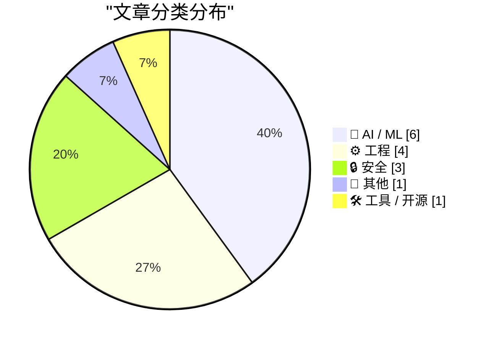
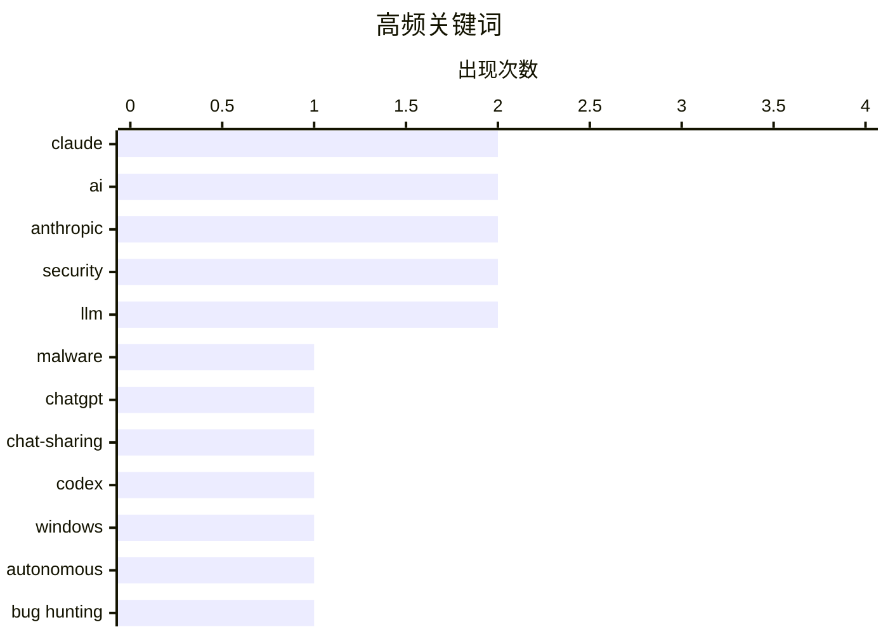

# 📰 AI 资讯每日精选 — 2026-05-31

> 汇聚 140+ 技术博客、X/Twitter、Hacker News、Reddit、Product Hunt、
> Lobste.rs、ClawFeed 日报及 GitHub Trending，经 AI 评分筛选。
>
> **本期内容**：🏆 今日必读 · 🌐 ClawFeed 日报 · 🔥 GitHub Trending · 📂 分类精选 · 🎨 设计与生成式 AI · 📊 数据概览

## 📝 今日看点

今日技术圈聚焦两大趋势：AI安全与自主操作能力成为攻防焦点，攻击者利用ChatGPT等共享聊天记录传播恶意软件，而OpenAI的Codex已能自主控制Windows PC寻找漏洞，标志着AI从辅助工具向自主代理演进；同时，AI行业格局生变，Anthropic估值超越OpenAI登顶，但其专业服务中AI幻觉引发的报告造假事件，也暴露了AI应用中的信任危机。此外，Zig构建系统重构完成、NixOS 26.05发布等工程进展，以及美国拟议的科研资助新规，共同勾勒出技术发展与治理挑战并存的图景。

---

## 🏆 今日必读

🥇 **攻击者利用共享的ChatGPT和Claude聊天记录传播恶意软件**

[Attackers abuse shared ChatGPT and Claude chats to spread malware](https://the-decoder.com/attackers-abuse-shared-chatgpt-and-claude-chats-to-spread-malware/) — The Decoder · 15 小时前 · 🔒 安全

> 攻击者正在利用ChatGPT和Claude的聊天分享功能，通过共享对话传播恶意软件。这些伪造的聊天记录伪装成错误消息或安装指南，由于托管在受信任的域名上，能够绕过安全工具的检测。文章揭示了这种新型攻击手法，并指出其利用了用户对知名AI平台链接的信任。核心结论是，即便是来自可信域名的内容，用户也应保持警惕，不要轻易执行其中的指令。

💡 **为什么值得读**: 揭示了AI平台共享功能被武器化的新型攻击面，对安全从业者和普通用户都有实际警示意义。

🏷️ malware, ChatGPT, Claude, chat-sharing

🥈 **OpenAI的Codex现在可以自主操作你的Windows PC，自行寻找漏洞并测试应用**

[OpenAI's Codex can now operate your Windows PC autonomously, hunting bugs and testing apps on its own](https://the-decoder.com/openais-codex-can-now-operate-your-windows-pc-autonomously-hunting-bugs-and-testing-apps-on-its-own/) — The Decoder · 15 小时前 · 🤖 AI / ML

> OpenAI的Codex应用现已登陆Windows 11，具备“计算机使用”能力：AI可以独立控制程序、测试应用并寻找漏洞。当用户不在电脑前时，可通过ChatGPT手机应用远程启动并监控任务。这标志着AI从对话助手向自主操作系统的关键进化，将显著提升软件测试和调试的效率。

💡 **为什么值得读**: 展示了AI从“对话”到“动手”的里程碑式跨越，对开发者、测试人员及关注AI自动化能力的人极具吸引力。

🏷️ Codex, Windows, autonomous, bug hunting

🥉 **安永加拿大发布网络安全报告，大部分引用为AI幻觉**

[EY Canada published a cybersecurity report and most citations were hallucinated](https://gptzero.me/investigations/ey) — Hacker News Best · 6 小时前 · 🔒 安全

> 安永加拿大发布的一份网络安全报告中，大部分引用内容被证实是AI生成的幻觉。调查发现，报告中的许多参考文献和引用的数据来源并不存在，系AI模型编造。这一事件暴露了专业服务机构在采用AI工具时缺乏严格的事实核查流程。结论是，AI生成内容的幻觉问题对专业领域的可信度构成了严重威胁。

💡 **为什么值得读**: 以知名咨询公司的翻车案例，生动揭示了AI幻觉在专业报告中的巨大风险，对依赖AI生成内容的企业和个人是重要警示。

🏷️ hallucination, cybersecurity, AI, report

4️⃣ **Anthropic超越OpenAI，成为全球最有价值的AI初创公司**

[Anthropic surpasses OpenAI to become most valuable AI startup](https://qazinform.com/news/anthropic-surpasses-openai-to-become-worlds-most-valuable-ai-startup) — Hacker News Best · 11 小时前 · 🤖 AI / ML

> Anthropic在最新一轮融资后估值超越OpenAI，成为全球估值最高的AI初创公司。这一里程碑标志着AI领域的竞争格局发生重大变化，投资者对Anthropic的安全优先策略和Claude系列模型给予了高度认可。文章分析了Anthropic的崛起原因及其对OpenAI市场地位的挑战。

💡 **为什么值得读**: 记录了AI行业权力格局的重大转变，对关注AI公司竞争、投资趋势和模型发展的人士是必读信息。

🏷️ Anthropic, OpenAI, valuation, AI

5️⃣ **Zig：构建系统重构完成**

[Zig: Build System Reworked](https://ziglang.org/devlog/2026/#2026-05-26) — Hacker News Best · 17 小时前 · ⚙️ 工程

> Zig编程语言团队宣布对其构建系统进行了重大重构。这次重构旨在提升构建速度、简化配置并增强跨平台兼容性。文章详细介绍了新架构的设计思路和关键改进点，例如更高效的依赖管理和缓存机制。对于Zig开发者而言，这意味着更流畅的开发体验和更快的编译周期。

💡 **为什么值得读**: Zig语言核心基础设施的重大更新，对Zig开发者、编译器爱好者以及关注编程语言生态演进的人士至关重要。

🏷️ Zig, build system, compiler, rework

---

## 🌐 ClawFeed 日报精选

> 来源：[ClawFeed](https://clawfeed.kevinhe.io) — AI 驱动的多源新闻聚合

📅 ClawFeed Daily | 2026-05-30 SGT

汇总当日 5 个 4h 档（覆盖 5/29 20:00 SGT → 5/30 15:59 SGT 内容）：4h ids 551 / 552 / 553 / 554 / 555。今日 16:00–23:59 SGT 窗口（次日 00:00 SGT 触发，已生成为 id 556 但落在 5/31 滚动窗）未含；20:00–23:59 SGT 窗口 4h digest 未触发。

---

🔥 当日全场 Top 5

1. **xAI Grok Build v0.2.11 大跃迁 — agent IDE 战线扩到 4 家**（@elonmusk 转 @XFreeze ship list，1.7M views / 6.8K likes，555）。一口气加：(1) 集成 𝕏 search + 大幅加速 web search、(2) `/export` `/login` `/usage` `/config-agents` 四条 slash command、(3) agent 配置层落地。xAI 从模型品牌升到 agent 工具品牌。Codex / Cursor / Cline / Grok Build 四家平行卷，跟 5/29 Claude Code Dynamic Workflows 同属"周节奏 CLI agent 补丁"主线延续。https://x.com/elonmusk/status/2060605320729186601
2. **Kalshi 上线美国首个 CFTC-regulated perpetual future**（@luanalopeslara × @mansourtarek_，552）。Kalshi 正式推出美国首个 perpetual future 产品，@_charlienoyes（Paradigm）回："this product line can eventually reorganize a lot of the financial system"。crypto perp 反向出口到 TradFi regulated venue 的结构性突破，与 551 Brent Oil $BZ perps 50× 杠杆、Hyperliquid 商品衍生品一脉相承。https://x.com/luanalopeslara/status/2060363515248918607
3. **Cashu unruggable mint 上线 — Bitcoin custody 硬密码学 3 年磨剑落地**（@callebtc，553）。第一个 on-chain Cashu mint 跑在 TEE（Trusted Execution Environment）里，mint keys 在 enclave 内生成，operator 也访问不到，从根上消除 Chaumian e-cash 的"运营方可作恶"风险。Bitcoin custody/privacy infra 罕见的"硬密码学 + 真上线"事件（8.8K views）。https://x.com/callebtc/status/2060457737184784662
4. **BTC 双重熊信号同期收敛 — 周期顶宣告 + 机构 $2.1B 净流出**（555）。(a) @CoinGapeMedia 引 CryptoQuant CEO Ki Young Ju 判断 BTC profitability cycle 已经掉头，潜在熊市可延续至 2027；(b) @cryptorover 报 BlackRock 过去 10 个交易日卖出 $2.1B BTC。两条线 4h 窗口内同期落地。配合 554 Strategy 卖币"误会解除"但 Polymarket 89% 仍押注卖出 + @jessezheng 散户卖飞防守样本，sentiment + onchain + 周期三档 narrative 形成。https://x.com/CoinGapeMedia/status/2060626701055664197
5. **Codex × Cua Driver Windows Computer Use 同期推到 background execution**（554）。@op7418 报 Codex 发布 Windows Computer Use + 移动端 ChatGPT 远程控制 Windows Codex；同期 @francedot 推 Cua Driver Windows 版："background computer-use for any agent" — Claude Code / Codex / 自定义 loop 可通过 CLI / MCP drive Windows 真应用，桌面保持可用。两家同时把"Windows Computer Use"从 Mac demo 拉成正规品类。https://x.com/op7418/status/2060549911960293704

---

📰 当日核心主题（聚类视角）

**A. Agent 工具链卷局延续 — 4 家平行 + Codex 自管 UI**
Claude Code Dynamic Workflows 命名 kerfuffle（552, "schmidhuber-level" 学术辩论）+ Codex inside Codex 递归（553, @rileybrown × @gdb，agent 自管 UI）+ Codex × Cua Driver Windows（554）+ xAI Grok Build v0.2.11（555）。**关键判断**：5/29 Anthropic Dynamic Workflows 之后，OpenAI / Anthropic / xAI / 第三方 driver 全部跟进，"agent IDE"品类从可选变默认配置，周补丁节奏稳定到位。

**B. Bitcoin / crypto 大持仓与机构动作三档接力**
Cashu TEE mint（553, custody 硬密码学）+ Strategy "卖币误会"暂解除 + Polymarket 89% 仍押年底前卖（554, @ai_9684xtpa 串 2022 卖回购历史）+ BTC 双熊信号（555, Ki Young Ju 周期顶 + BlackRock $2.1B 抛售）+ @jessezheng 散户卖飞防守（555）。**关键判断**：onchain 行为 + 机构净流出 + 周期模型 + 散户情绪四档同向，BTC narrative 从"机构筑底"切到"机构 derisk"。建议下个 dispatch 交叉验证 BlackRock IBIT 净申赎数据是否反映 $2.1B 抛售。

**C. crypto perp / RWA / TradFi 反向桥接全线推进**
Brent Oil $BZ perps 0 手续费 50×（551, @variational_io）+ Sui Foundation 2200 万美金借壳上市（551, @KaMiaoRich）+ $UMAC.M FPV 国防无人机 RWA 抽 coin（551）+ Kalshi US perp（552）+ Plasma One 10% AI cashback（552, ChatGPT/Claude/Cursor 等订阅返现）+ U 卡返现内卷 Jupiter 4% / Plasma 3%（554, @OKxiaohai）。**关键判断**：5/29 DTCC-Stellar 之后 crypto-TradFi 桥接持续，方向从"主流金融上链"切换到"crypto 反向输出 perp 形态 + 反向消费返现"，**Plasma One AI cashback 是 crypto card × AI subscription 的第一个公开案例**。

**D. AI 模型评测 / 范式叙事 / 估值脆弱性**
yq_acc Opus 4.8 honesty 限定性深读（553, ">10× less overconfident" 但 "None independently replicated yet. Hold accordingly."）+ @lpolovets × @Austen Anthropic coding TAM 微辩论（553, $50B ARR ÷ $5K/dev ÷ 20M devs = 2-3x upside?）+ BMAN 联想/戴尔市值超京东/逼近阿里"AI infra vs 互联网范式切换"narrative（554）。**关键判断**：模型评测圈 yq_acc 是首篇"既不黑也不吹"框架样本；估值侧 dev-spend 假设脆弱性首次量化；narrative 切换信号从硬件二级市场出货。

**E. 监管 / 立法 / banking lobby 跨档**
中国跨境美股 / 半导体监管全方位升级（551, @hanking66 + @leige2017 反读）+ Armstrong × Dimon 公开互喷 Clarity Act + stablecoin（553, "He's full of sh!t"，314K views）+ Dimon vs Armstrong 二级回响（554, @KRFsocial "Fourth turning"框架）+ WIDTH RegTech consolidation（554, @DujunX 前火币）+ HK LegCo Founder Tea #1（551, Cyberport, Duncan Chiu）。**关键判断**：crypto vs TradFi 在 CEO 级别公开对撞，HK 立法者直接坐 Web3 founder 桌的产业政策路径与 SG/迪拜路径分化。

**F. App layer 自建 vs SaaS thesis**
COCO Talk CK 合规人周末 vibe-coding 重做 SaaS stack（551）+ Lovable Connectors 单 prompt 串 5 家 SaaS shipping pipeline（552, @PrajwalTomar_）+ Kirkland & Ellis $500M 自建 LegalTech → @levie 反读 "app layer 最强广告"（555）。**关键判断**：F500 自建反向验证应用层 ROI 足够高，"app layer 不被 LLM 通吃"thesis 取得标志性背书。

**G. 教育 AI / browser agent / robotics 应用层探索**
Koji AI tutor（552, @suekhim, @chamath 站台，392K views，"AI is making kids dumber, should be making them geniuses"）+ browser agent autonomy spectrum（552, @browserbase Ramp/Lovable/Clay 不同级别）+ PrismaX "data-first robotics infrastructure"（551, @whangFT1）+ EverOS 长程记忆 OS（555, @elliotchen100，Agent OS 第三家具象产品）。**关键判断**：教育 AI 从答疑/出题转向**强制 metacognition** 的产品形态；browser agent 进入企业部署 guardrails 阶段；Agent OS 品类有第三家候选。

**H. 量子 + 硬件 IPO 通道**
Quantinuum $13B IPO 2x oversubscribed（555, @StockSavvyShay）+ Meta AI Pendant memo + Apple AI pin + OpenAI 类似（553, @amir / The Information）。**关键判断**："AI 之外另一条硬科技 IPO 主线"开始显形；可穿戴 AI 硬件三大厂同时下注。

---

🔖 累计 Bookmark 精选（跨档去重）

**连续 5 期空窗**（551-555 全部空）。bookmarks 整天复读 5/27-5/29 沉淀条目：GPT-Realtime-2 / wanman / DEMOhassabis / openfangg Agent OS / Harness Engineering / Cline Kanban / DESIGN.md / Pika / open-agent-sdk / DoveyWanCN harness 评论 / levie articles。**建议 Kevin**：(1) 主动 `mark <url>` 想 deep dive 的内容，或 (2) 放宽 scrape 窗口让新 bookmark 流入。Deep Dive 队列今天连续 5 期空。

---

👀 推荐关注汇总（跨档去重）

**AI 模型评测 / 估值 framing**
- @yq_acc — Opus 4.8 honesty 首篇成熟限定性评测，"既不黑也不吹"框架，连续多期出现高密度长文
- @lpolovets (Susa) — Anthropic TAM dev-spend 假设的脆弱性 framing 高频源

**Agent / OS infra**
- @ethereumdegen — metalcraft-agent 开源 Claude-Code-like harness，model-agnostic
- @francedot (Cua) — Cua Driver Windows + background execution，OS-level agent 平价化
- @browserbase — browser agent 企业部署 autonomy spectrum framework

**金融 / RegTech / TradFi-onchain 桥接**
- @luanalopeslara — Kalshi 美国首个 perp 产品主导者
- @variational_io — Brent Oil 等商品 perps 协议方
- @QwQiao — mungermode.com 创始人，long-term investor 研究工具
- @DrPayFi — crypto vs AI 6 维辩论高密度 framing

**BTC / 大持仓 / 链上行为**
- @callebtc — Cashu 协议作者，Bitcoin privacy/custody 路线
- @ai_9684xtpa — Strategy / 微策略 BTC 链上动作中文追踪号

**Narrative / 教育 AI / app layer**
- @BMANLead — "AI infra vs 互联网范式切换"叙事浓缩源（中文圈罕见）
- @suekhim — Brilliant + Koji 创始人，教育 AI metacognition 路线代表

（操作前请先在 Following 里搜一下避免重复加。）

---

💤 当日重复噪音模式（跨档模式，不是单条吐槽）

1. **bookmarks 队列连续 5 期空窗**（551 / 552 / 553 / 554 / 555）：全部为 5/27-5/29 沉淀条目复读，无任何新增。建议调 scrape 窗口或主动 mark。
2. **1-2 字回复 / GM / 段子跨档刷屏**（551 / 552 / 553 / 554 / 555 全档）：@elonmusk "Weird"、各种 "GM" / "LFG" / "All in" / "lol" / "我" / "奇怪" / "上海" / "成为董事会成员" — 每期固定占 1/3-1/2 比例。
3. **政治 ragebait 跨档持续**（551 / 553 / 554）：@elonmusk 转 Gad Saad "Suicidal Empathy" + Henry Nowak "racist against Whites" 框架、@mattvanswol NC 拘捕白男段子、@LemonTreeandSea + @vivilinsv 中国民主话题（多期复读）、@iamabrokwa Ghana xenophobia 段子。
4. **airdrop / shill / 互推固定噪音**（551 / 552 / 553 / 554）：@WorldCupXSOL "120,000 $WorldCup"、@BONIU888 SOL 地址 shill、@feibo03 合约 shill（"gmgn 抓奶工坊" parody 多次出现）、@SuperL9 / @TCryptochicks $ASTER + quote、@SebyCore × @KongBTC Project Quantum 闷推 + 一句承接。
5. **个人闲聊 / 励志 / 段子化生活**（551 / 552 / 553 / 554 / 555）：@HiTw93 富贵竹 + Kaku 早起、@kaylaoshi "居然不来个邀请链接？"、@florianederer ski 度假地 D vs A、@anantg4rg + @agentmail 蓝标互推段子、@MathewShen42 博客 Codex 迁移（边际有点儿但偏小范围 productivity）。
6. **engagement bait / 互关刷屏**（551 / 552 / 554）：@Gooddlovee "LOVE SMALL ACCOUNTS" 8 连刷、@SuisPasDaVinci "非中国人换关注"、@TUGE8888 "follow each other ape family"、@hananotsorry Four. meme 品牌大使。
7. **VC ragebait 三人转**（551, @Danhightower / @whizwang 等）+ 转推无营养 quote（553, @aakashgupta "Bullish"、@_charlienoyes "Huge congrats" 一句承接）：低密度互动模式跨多期识别。

**改进建议**：5/29 已提的"单字回复 / 节日 hashtag / 纯 token ticker"过滤本日依旧未上，bookmarks 5 期空窗系统性问题更严重。建议在 4h scrape 阶段加：(1) 低密度回复字符长度阈值（<10 字 + 无 URL 自动过滤），(2) 蓝V 互关帖 pattern 识别（"follow each other"/"互关"/"换关注" 关键词 + 高密度 @ 链表），(3) 主动扩 bookmark scrape 窗口或周末让 Kevin 集中 mark 新内容。预计可砍 20-30% feed 槽位换信号密度。

---

🔍 Deep Dive

• 本日 marks 队列为空，跳过（连续 5 期空窗）。

—

整体节奏：5/30 SGT 是 **TradFi-crypto 反向桥接日 + agent IDE 周节奏延续日**。结构性硬信号集中在金融基础设施层（Kalshi 美国 CFTC perp、Cashu TEE mint custody、Brent perps）和 BTC 机构动作（BlackRock $2.1B + Ki Young Ju 周期顶 + Strategy / Polymarket 89% 押注），上层 narrative 由 BMAN 联想/戴尔超京东"AI infra vs 互联网"切换 + Kirkland & Ellis $500M LegalTech 反读"app layer 最强广告"驱动。Agent 工具链 4 家（Claude / Codex / Cursor / Grok Build）周补丁节奏稳定，xAI 这周入场。监管侧 Armstrong × Dimon 公开互喷 + 中国跨境监管 + WIDTH RegTech 整合三条线齐推。bookmarks 队列连续 5 期空窗 + Deep Dive 队列空，是当前 ClawFeed 系统侧最该解决的问题。

明日重点跟进：(1) BlackRock IBIT 净申赎数据交叉验证 5/30 $2.1B 抛售；(2) Kalshi perp 上线后 24-72h 交易量与监管反应；(3) xAI Grok Build v0.2.11 扩散到中文 builder 圈层节奏；(4) Cashu TEE mint 接入主流 Bitcoin 钱包/Lightning 服务进度；(5) Strategy BTC 是否在年底前真触发卖出（Polymarket 89% 押注）；(6) bookmarks 队列重启的可行机制。
---

## 🔥 GitHub Trending

> 今日热门开源项目（全语言 + Python）

| # | 项目 | 描述 | ⭐ 总星 | 📈 今日 | 语言 |
|---|------|------|---------|---------|------|
| 1 | [harry0703/MoneyPrinterTurbo](https://github.com/harry0703/MoneyPrinterTurbo) 🤖 | 利用AI大模型，一键生成高清短视频 Generate short videos with one click us... | 72.0k | +2768 | Python |
| 2 | [microsoft/markitdown](https://github.com/microsoft/markitdown) | Python tool for converting files and office documents to ... | 132.4k | +2470 | Python |
| 3 | [run-llama/liteparse](https://github.com/run-llama/liteparse) 🤖 | A fast, helpful, and open-source document parser | 7.9k | +925 | Rust |
| 4 | [affaan-m/ECC](https://github.com/affaan-m/ECC) 🤖 | The agent harness performance optimization system. Skills... | 199.3k | +908 | JavaScript |
| 5 | [codecrafters-io/build-your-own-x](https://github.com/codecrafters-io/build-your-own-x) | Master programming by recreating your favorite technologi... | 508.3k | +817 | Markdown |
| 6 | [OpenBMB/VoxCPM](https://github.com/OpenBMB/VoxCPM) | VoxCPM2: Tokenizer-Free TTS for Multilingual Speech Gener... | 22.8k | +779 | Python |
| 7 | [ruvnet/RuView](https://github.com/ruvnet/RuView) | π RuView turns commodity WiFi signals into real-time spat... | 68.9k | +655 | Rust |
| 8 | [anthropics/claude-code](https://github.com/anthropics/claude-code) 🤖 | Claude Code is an agentic coding tool that lives in your ... | 128.4k | +592 | Python |
| 9 | [Crosstalk-Solutions/project-nomad](https://github.com/Crosstalk-Solutions/project-nomad) 🤖 | Project N.O.M.A.D, is a self-contained, offline survival ... | 27.4k | +469 | TypeScript |
| 10 | [anthropics/skills](https://github.com/anthropics/skills) 🤖 | Public repository for Agent Skills | 144.1k | +454 | Python |
| 11 | [EveryInc/compound-engineering-plugin](https://github.com/EveryInc/compound-engineering-plugin) 🤖 | Official Compound Engineering plugin for Claude Code, Cod... | 18.4k | +349 | TypeScript |
| 12 | [FareedKhan-dev/train-llm-from-scratch](https://github.com/FareedKhan-dev/train-llm-from-scratch) 🤖 | A straightforward method for training your LLM, from down... | 2.3k | +327 | Jupyter Notebook |
| 13 | [galilai-group/stable-worldmodel](https://github.com/galilai-group/stable-worldmodel) | A platform for reproducible world model research and eval... | 1.5k | +318 | Python |
| 14 | [shiyu-coder/Kronos](https://github.com/shiyu-coder/Kronos) | Kronos: A Foundation Model for the Language of Financial ... | 27.6k | +293 | Python |
| 15 | [DataTalksClub/data-engineering-zoomcamp](https://github.com/DataTalksClub/data-engineering-zoomcamp) | Data Engineering Zoomcamp is a free 9-week course on buil... | 41.8k | +274 | Jupyter Notebook |

---

## 🤖 AI / ML

### 1. OpenAI的Codex现在可以自主操作你的Windows PC，自行寻找漏洞并测试应用

[OpenAI's Codex can now operate your Windows PC autonomously, hunting bugs and testing apps on its own](https://the-decoder.com/openais-codex-can-now-operate-your-windows-pc-autonomously-hunting-bugs-and-testing-apps-on-its-own/) — **The Decoder** · 15 小时前 · ⭐ 26/30

> OpenAI的Codex应用现已登陆Windows 11，具备“计算机使用”能力：AI可以独立控制程序、测试应用并寻找漏洞。当用户不在电脑前时，可通过ChatGPT手机应用远程启动并监控任务。这标志着AI从对话助手向自主操作系统的关键进化，将显著提升软件测试和调试的效率。

🏷️ Codex, Windows, autonomous, bug hunting

---

### 2. Anthropic超越OpenAI，成为全球最有价值的AI初创公司

[Anthropic surpasses OpenAI to become most valuable AI startup](https://qazinform.com/news/anthropic-surpasses-openai-to-become-worlds-most-valuable-ai-startup) — **Hacker News Best** · 11 小时前 · ⭐ 26/30

> Anthropic在最新一轮融资后估值超越OpenAI，成为全球估值最高的AI初创公司。这一里程碑标志着AI领域的竞争格局发生重大变化，投资者对Anthropic的安全优先策略和Claude系列模型给予了高度认可。文章分析了Anthropic的崛起原因及其对OpenAI市场地位的挑战。

🏷️ Anthropic, OpenAI, valuation, AI

---

### 3. 微软与英伟达据报合作打造运行真正AI代理而非Copilot的AI PC

[Microsoft and Nvidia reportedly team up on AI PCs that run actual agents instead of Copilot](https://the-decoder.com/microsoft-and-nvidia-reportedly-team-up-on-ai-pcs-that-run-actual-agents-instead-of-copilot/) — **The Decoder** · 9 小时前 · ⭐ 24/30

> 英伟达正以自研芯片作为主处理器进军PC市场。首批搭载该芯片的戴尔和微软Surface Windows电脑预计将在下周的Computex和Build大会上亮相。微软还计划基于OpenClaw框架开发新软件，让AI代理在本地Windows PC上处理任务，这被视为在Copilot+ PC概念失败后的第二次尝试。

🏷️ AI PCs, Nvidia, Microsoft, agents

---

### 4. 大规模研究发现：让AI聊天机器人更有帮助会削弱其模拟人类行为的能力

[Making AI chatbots helpful weakens their ability to simulate human behavior, large-scale study finds](https://the-decoder.com/making-ai-chatbots-helpful-weakens-their-ability-to-simulate-human-behavior-large-scale-study-finds/) — **The Decoder** · 12 小时前 · ⭐ 24/30

> 一项覆盖20.8万名参与者和2600万条回复的大规模研究表明，将语言模型训练成有用聊天机器人的过程，反而削弱了它们复制人类行为的能力。这种负面效应随着每一代新模型的发布而加剧。即使是流行的“角色扮演”技巧（为模型提供人口统计资料），对个体预测也几乎没有实际帮助。研究结论指出，当前AI对齐训练与行为模拟之间存在根本性矛盾。

🏷️ LLM, chatbot, human behavior, training

---

### 5. Salesforce声称AI代理将231天的迁移工作缩短至13天，且事故更少

[Salesforce claims AI agents cut a 231-day migration to 13 days with fewer incidents](https://the-decoder.com/salesforce-claims-ai-agents-cut-a-231-day-migration-to-13-days-with-fewer-incidents/) — **The Decoder** · 16 小时前 · ⭐ 24/30

> Salesforce宣称，其整个开发组织已迁移至Anthropic的Claude Code（无令牌限制），并报告了2026年4月的巨大生产力提升：每位开发者的拉取请求数量增加了79%，事故减少了5%。虽然这些数据无法独立验证，但该案例凸显了编程界在代理化转型上的严重分歧：这究竟是真正的革命，还是史上最大的技术债务积累？

🏷️ AI agents, Salesforce, migration, productivity

---

### 6. Parallax：用于语言建模的参数化局部线性注意力机制

[Parallax: Parameterized Local Linear Attention for Language Modeling](https://www.reddit.com/r/LocalLLaMA/comments/1ts79rg/parallax_parameterized_local_linear_attention_for/) — **r/LocalLLaMA** · 7 小时前 · ⭐ 24/30

> Parallax提出了一种名为局部线性注意力（LLA）的新型注意力机制，它源自非参数统计中的测试时回归框架。与之前追求效率的注意力变体不同，LLA将softmax注意力中的局部常数估计升级为局部线性估计，从而在保持计算效率的同时提升了模型表达能力。该方法旨在解决大语言模型中注意力机制长期存在的结构性瓶颈。

🏷️ attention, linear attention, LLM, architecture

---

## ⚙️ 工程

### 7. Zig：构建系统重构完成

[Zig: Build System Reworked](https://ziglang.org/devlog/2026/#2026-05-26) — **Hacker News Best** · 17 小时前 · ⭐ 26/30

> Zig编程语言团队宣布对其构建系统进行了重大重构。这次重构旨在提升构建速度、简化配置并增强跨平台兼容性。文章详细介绍了新架构的设计思路和关键改进点，例如更高效的依赖管理和缓存机制。对于Zig开发者而言，这意味着更流畅的开发体验和更快的编译周期。

🏷️ Zig, build system, compiler, rework

---

### 8. 我们如何在各产品中隔离Claude

[How we contain Claude across products](https://simonwillison.net/2026/May/30/how-we-contain-claude/#atom-everything) — **simonwillison.net** · 4 小时前 · ⭐ 25/30

> Anthropic发布了一篇详细的技术文章，解释了如何在Claude.ai、Claude Code等产品中实施沙箱隔离技术。文章深入介绍了多种沙箱机制的工作原理，包括进程隔离、文件系统限制和网络访问控制。作者Simon Willison称赞这是少有的、对沙箱技术进行彻底文档化的优秀案例，有助于用户建立信任。

🏷️ sandboxing, Claude, Anthropic, security

---

### 9. NixOS 26.05 正式发布

[NixOS 26.05 released](https://nixos.org/blog/announcements/2026/nixos-2605/) — **Lobste.rs** · 10 小时前 · ⭐ 25/30

> NixOS 26.05版本正式发布，带来了大量软件包更新、新功能和稳定性改进。作为一款基于Nix包管理器的声明式Linux发行版，新版本继续强化其可复现构建和系统配置管理的优势。具体更新包括内核升级、桌面环境更新以及对新硬件的支持。

🏷️ NixOS, release, Linux, package management

---

### 10. 我将Pixal3D移植到了Apple Silicon上

[I ported Pixal3D to Apple Silicon](https://www.reddit.com/r/StableDiffusion/comments/1ts82da/i_ported_pixal3d_to_apple_silicon/) — **r/StableDiffusion** · 6 小时前 · ⭐ 24/30

> 一位开发者将腾讯ARC开源的3D生成模型Pixal3D移植到了Apple Silicon（Mac）上运行。Pixal3D能够从单张图片生成质量不错的3D模型，但原版代码仅支持CUDA（NVIDIA GPU）。该移植填补了Mac用户无法本地运行此模型的空白，为更多用户提供了便利。

🏷️ Pixal3D, Apple Silicon, port, 3D generation

---

## 🔒 安全

### 11. 攻击者利用共享的ChatGPT和Claude聊天记录传播恶意软件

[Attackers abuse shared ChatGPT and Claude chats to spread malware](https://the-decoder.com/attackers-abuse-shared-chatgpt-and-claude-chats-to-spread-malware/) — **The Decoder** · 15 小时前 · ⭐ 26/30

> 攻击者正在利用ChatGPT和Claude的聊天分享功能，通过共享对话传播恶意软件。这些伪造的聊天记录伪装成错误消息或安装指南，由于托管在受信任的域名上，能够绕过安全工具的检测。文章揭示了这种新型攻击手法，并指出其利用了用户对知名AI平台链接的信任。核心结论是，即便是来自可信域名的内容，用户也应保持警惕，不要轻易执行其中的指令。

🏷️ malware, ChatGPT, Claude, chat-sharing

---

### 12. 安永加拿大发布网络安全报告，大部分引用为AI幻觉

[EY Canada published a cybersecurity report and most citations were hallucinated](https://gptzero.me/investigations/ey) — **Hacker News Best** · 6 小时前 · ⭐ 26/30

> 安永加拿大发布的一份网络安全报告中，大部分引用内容被证实是AI生成的幻觉。调查发现，报告中的许多参考文献和引用的数据来源并不存在，系AI模型编造。这一事件暴露了专业服务机构在采用AI工具时缺乏严格的事实核查流程。结论是，AI生成内容的幻觉问题对专业领域的可信度构成了严重威胁。

🏷️ hallucination, cybersecurity, AI, report

---

### 13. 探索MTE领域：iOS内存保护深度解析

[Navigating the MTE Landscape: iOS Memory Protection Deep Dive](https://fuzzinglabs.com/wp-content/uploads/2026/05/Navigating_iOS_MTE_Landscape.pdf) — **Lobste.rs** · 7 小时前 · ⭐ 25/30

> 这是一份关于iOS内存标记扩展（MTE）技术的深度研究报告。文章详细分析了苹果在iOS中实现MTE的架构、原理及其对内存安全的影响。通过逆向工程和实验，作者揭示了MTE如何检测和防止内存安全漏洞，并评估了其性能开销和实际效果。

🏷️ iOS, memory safety, MTE, ARM

---

## 📝 其他

### 14. 拟议中的美国新资助规则：我们可随时取消任何拨款

[Proposed new US funding rules: We can cancel any grant at any time](https://arstechnica.com/science/2026/05/the-office-of-management-and-budget-tries-again-to-cripple-us-science/) — **Hacker News Best** · 14 小时前 · ⭐ 25/30

> 美国管理和预算办公室（OMB）提出新的联邦科研资助规则，赋予政府随时取消任何拨款的权力。该规则将极大削弱美国科研体系的稳定性和自主性，引发科学界的强烈反对。文章认为，这一举措是OMB试图控制科研方向的又一次尝试，将对基础研究和长期项目造成毁灭性打击。

🏷️ funding, policy, science, regulation

---

## 🛠 工具 / 开源

### 15. Openrsync：由OpenBSD团队实现的rsync

[Openrsync: An implementation of rsync, by the OpenBSD team](https://github.com/kristapsdz/openrsync) — **Hacker News Best** · 14 小时前 · ⭐ 24/30

> Openrsync是OpenBSD团队对经典文件同步工具rsync的全新实现。该项目旨在提供一个安全、可移植且符合许可要求的rsync替代方案，特别注重代码质量和安全性。它已在Hacker News上获得318个点赞和141条评论，引发了社区对实现细节和与原始rsync兼容性的广泛讨论。

🏷️ rsync, OpenBSD, security, implementation

---

## 🎨 Design & Generative AI

### 🖼️ 生成式图片

- **[SDXL Mac用户福音：ComfyUI原生MLX支持，速度提升25%](https://www.reddit.com/r/comfyui/comments/1ts2kl1/sdxl_for_macusers_now_mlxnative_in_comyui_25/)** — r/comfyui · 10 小时前
  > 将SDXL工作流从PyTorch-MPS迁移到MLX原生运行时，实现一键转换与缓存加速。

- **[Generative Paint：ComfyUI浏览器内高级绘画节点](https://www.reddit.com/r/StableDiffusion/comments/1try64e/github_orion4dorion4d_generative_paint_generative/)** — r/StableDiffusion · 13 小时前
  > 为ComfyUI添加可直接在浏览器中使用的进阶绘画界面自定义节点。

- **[Nexus BTA v0.2.20：ComfyUI预设工作流Web界面更新](https://www.reddit.com/r/StableDiffusion/comments/1tsa458/update_v0220_nexus_bta_my_web_ui_for_comfy_with/)** — r/StableDiffusion · 5 小时前
  > 推出带有预定义模板的ComfyUI Web UI新版本，简化操作流程。

- **[用Claude Cowork辅助安装与微调ComfyUI](https://www.reddit.com/r/StableDiffusion/comments/1tsbyls/using_claude_cowork_for_installing_and_finetuning/)** — r/StableDiffusion · 4 小时前
  > 借助Claude扩展在空文件夹中自动配置ComfyUI环境，简化安装流程。

- **[iPhone上运行SDXL：突破iOS内存限制的实战指南](https://www.reddit.com/r/StableDiffusion/comments/1ts2edn/getting_sdxl_to_run_on_an_iphone_without_ios/)** — r/StableDiffusion · 10 小时前
  > 通过Core ML和神经网络引擎优化，解决iPhone上SDXL生成中途被系统终止的问题。

- **[ComfyUI突然变慢？节点缓存失效问题排查](https://www.reddit.com/r/comfyui/comments/1trqqtz/comfyui_much_slower_lately_no_node_caching_for/)** — r/comfyui · 20 小时前
  > 用户反馈Flux模型工作流重复运行时速度从6秒降至30秒，疑似节点缓存机制异常。

- **[Anima IP Adapter即将到来，或终结SD 1.5时代](https://www.reddit.com/r/StableDiffusion/comments/1trw160/anima_ip_adapter_is_comming/)** — r/StableDiffusion · 15 小时前
  > 开发者正在为Anima模型适配IP Adapter，有望大幅提升图像风格一致性。

- **[Midjourney为何仍值得使用？对比ChatGPT与Gemini](https://www.reddit.com/r/midjourney/comments/1ts9ay1/why_is_midjourney_still_worth_it/)** — r/midjourney · 6 小时前
  > 探讨Midjourney在画质、审查限制和可控性方面相比竞品的独特优势。

- **[极简ComfyUI管理器：个人小工具意外走红](https://www.reddit.com/r/comfyui/comments/1tschmg/a_damn_simple_comfyui_manager/)** — r/comfyui · 3 小时前
  > 一个为个人需求打造的轻量级ComfyUI管理应用，意外获得社区关注。

- **[社区投票：你最想要的ComfyUI自定义节点是什么？](https://www.reddit.com/r/comfyui/comments/1ts2xsd/what_comfyui_custom_node_would_actually_make_your/)** — r/comfyui · 10 小时前
  > 发起节点创意征集，旨在开发真正解决用户痛点的实用工具。

- **[训练LoRA实现角色风格一致性：问题与解答](https://www.reddit.com/r/StableDiffusion/comments/1trrh6j/question_about_training_a_lora_for_character/)** — r/StableDiffusion · 19 小时前
  > 探讨如何通过LoRA训练保持生成图像中角色风格的统一性。

- **[RTX3060 6GB实测：PID+Z Image Turbo模型512到2048分辨率测试](https://www.reddit.com/r/comfyui/comments/1ts0ldb/testing_the_new_pid_with_z_image_turbo_model_with/)** — r/comfyui · 11 小时前
  > 在低显存显卡上测试新PID方法与Z Image Turbo模型的高分辨率生成性能。

- **[ComfyUI数据库应用：搜索、编辑与存储工作流](https://www.reddit.com/r/comfyui/comments/1trvory/search_edit_store_the_usefulness_of_databases_in/)** — r/comfyui · 15 小时前
  > 探索在ComfyUI中引入数据库来管理和复用复杂工作流的实用方法。

- **[Runpod用户遭遇可用性骤降？社区热议](https://www.reddit.com/r/StableDiffusion/comments/1trzex3/damn_did_all_of_you_who_use_runpod_have_very_low/)** — r/StableDiffusion · 12 小时前
  > 多位用户反映Runpod云服务近期出现资源可用性极低甚至为零的情况。

### 🎬 生成式视频

- **[LTX 2.3 LoRA实现视频彩色化演示](https://www.reddit.com/r/StableDiffusion/comments/1tru7lh/video_colorizing_using_ltx_23_lora/)** — r/StableDiffusion · 17 小时前
  > 利用LTX 2.3模型的Colorizer LoRA对视频进行自动上色处理。

---

## 📊 数据概览

| 扫描源 | 抓取文章 | 时间范围 | 精选 |
|:---:|:---:|:---:|:---:|
| 116/140 | 5351 篇 → 156 篇 | 24h | **15 篇** |

### 分类分布



### 高频关键词



<details>
<summary>📈 纯文本关键词图（终端友好）</summary>

```
claude       │ ████████████████████ 2
ai           │ ████████████████████ 2
anthropic    │ ████████████████████ 2
security     │ ████████████████████ 2
llm          │ ████████████████████ 2
malware      │ ██████████░░░░░░░░░░ 1
chatgpt      │ ██████████░░░░░░░░░░ 1
chat-sharing │ ██████████░░░░░░░░░░ 1
codex        │ ██████████░░░░░░░░░░ 1
windows      │ ██████████░░░░░░░░░░ 1
```

</details>

### 🏷️ 话题标签

**claude**(2) · **ai**(2) · **anthropic**(2) · security(2) · llm(2) · malware(1) · chatgpt(1) · chat-sharing(1) · codex(1) · windows(1) · autonomous(1) · bug hunting(1) · hallucination(1) · cybersecurity(1) · report(1) · openai(1) · valuation(1) · zig(1) · build system(1) · compiler(1)

---

*生成于 2026-05-31 01:41 | 汇聚 140 个技术博客、X/Twitter、Hacker News、Reddit、Product Hunt、Lobste.rs、ClawFeed 日报及 GitHub Trending，经 AI 评分筛选出 Top 15 精华内容*
