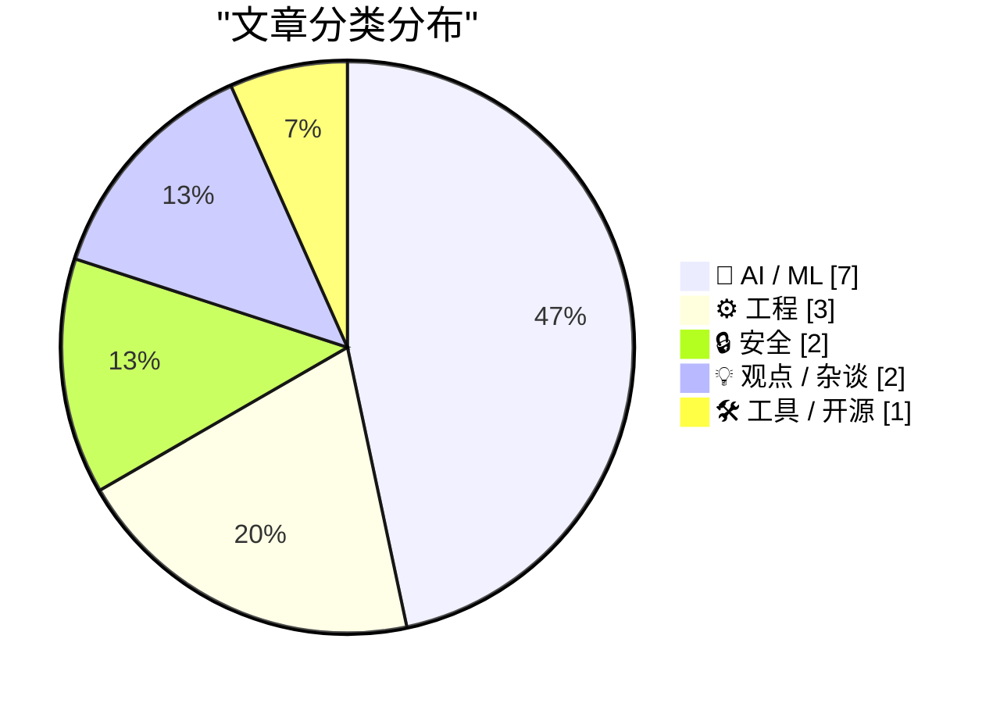
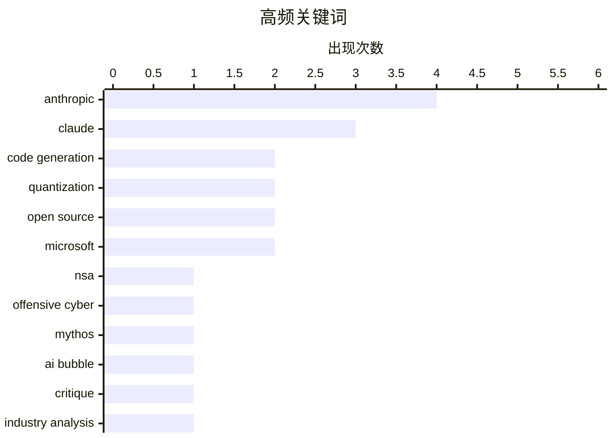

# 📰 AI 资讯每日精选 — 2026-06-06

> 汇聚 140+ 技术博客、X/Twitter、Hacker News、Reddit、Product Hunt、
> Lobste.rs、ClawFeed 日报及 GitHub Trending，经 AI 评分筛选。
>
> **本期内容**：🏆 今日必读 · 🌐 ClawFeed 日报 · 🔥 GitHub Trending · 📂 分类精选 · 🎨 设计与生成式 AI · 📊 数据概览

## 📝 今日看点

今日技术圈的核心议题围绕AI的自我进化与失控风险展开：Anthropic披露其Claude模型已编写超80%的生产代码，并呼吁全球暂停前沿AI开发，引发对“AI自我构建”指数级加速的担忧。与此同时，AI辅助编程的质量争议持续发酵，有分析指出AI生成的代码可能引入更多缺陷，而开源社区也面临大量AI生成的“简历型”拉取请求的冲击。此外，从浏览器中运行的TinyTPU到移动端优化的Gemma模型，AI与工程工具的深度融合正加速落地，但安全与伦理的平衡点尚未找到。

---

## 🏆 今日必读

🥇 **据报道，Anthropic的Mythos模型正为NSA针对中国和伊朗的进攻性网络行动提供支持**

[Anthropic's Mythos model is reportedly powering NSA offensive cyber ops against China and Iran](https://the-decoder.com/anthropics-mythos-model-is-reportedly-powering-nsa-offensive-cyber-ops-against-china-and-iran/) — The Decoder · 14 小时前 · 🔒 安全

> 据报道，Anthropic已派遣约六名工程师常驻美国国家安全局（NSA），以调整其Mythos AI模型用于进攻性网络行动。该模型可能被用于侵入中国或伊朗的网络。这与Anthropic更广泛的立场一致：该公司关于限制AI用于大规模监控等用途的承诺，明确仅适用于美国公民。

💡 **为什么值得读**: 揭示了AI公司与国家情报机构在进攻性网络行动上的深度合作，涉及地缘政治敏感议题，值得关注AI伦理与国家安全交叉领域的读者阅读。

🏷️ Anthropic, NSA, offensive cyber, Mythos

🥈 **付费内容：AI泡沫3.0的仇恨者指南**

[Premium: The Hater's Guide To The AI Bubble 3.0](https://www.wheresyoured.at/premium-the-haters-guide-to-the-ai-bubble-3-0/) — wheresyoured.at · 9 小时前 · 💡 观点 / 杂谈

> 作者延续其广受欢迎的“AI泡沫仇恨者指南”系列，推出第三卷。文章延续对当前AI热潮的批判性视角，分析泡沫持续膨胀的迹象与潜在风险。作者此前两卷内容因尖锐指出AI行业过度炒作和不可持续发展而引发广泛讨论。

💡 **为什么值得读**: 该系列以犀利批判著称，适合希望了解AI行业泡沫化另一面、避免盲目跟风的读者。

🏷️ AI bubble, critique, industry analysis

🥉 **Anthropic称Claude现已编写其90%以上的代码，并希望全球拥有AI暂停按钮**

[Anthropic says Claude now writes over 90% of its code and wants the world to have an AI pause button](https://the-decoder.com/anthropic-says-claude-now-writes-over-90-of-its-code-and-wants-the-world-to-have-an-ai-pause-button/) — The Decoder · 16 小时前 · 🤖 AI / ML

> Anthropic公布内部数据，显示Claude正大幅加速其自身AI开发：超过80%的生产代码来自Claude，工程师每日交付的代码量是2024年的8倍。公司目标是实现AI自我改进，这将引发指数级加速。为此，Anthropic正推动建立可验证的全球开发暂停机制，并表示若其他前沿实验室同样暂停，它也会停止。

💡 **为什么值得读**: 首次公开AI自我编程的具体效率数据，并由此提出全球暂停开发的激进主张，对理解AI发展速度与安全治理的博弈至关重要。

🏷️ Claude, code generation, self-improving AI, Anthropic

4️⃣ **Claude是否增加了rsync中的bug？**

[Did Claude increase bugs in rsync?](https://alexispurslane.github.io/rsync-analysis/) — Hacker News Best · 12 小时前 · 🤖 AI / ML

> 文章对rsync项目近期提交的代码进行分析，质疑由AI（Claude）生成的代码是否引入了更多缺陷。作者通过对比历史提交记录和代码审查结果，探讨AI辅助编程在成熟开源项目中的实际质量影响。该分析在Hacker News上引发激烈讨论，获得294个点赞和292条评论。

💡 **为什么值得读**: 用具体数据挑战AI编程“效率即质量”的普遍假设，对关注AI代码可靠性及开源项目维护者具有直接参考价值。

🏷️ Claude, rsync, LLM, bugs

5️⃣ **改变我们开发Ladybird的方式**

[Changing how we develop Ladybird](https://ladybird.org/posts/changing-how-we-develop-ladybird/) — Hacker News Best · 18 小时前 · ⚙️ 工程

> Ladybird浏览器项目宣布调整其开发模式，以应对项目规模增长和社区贡献激增的挑战。文章详细说明了新的协作流程、代码审查标准和版本管理策略。该公告在Hacker News上获得806个点赞和514条评论，反映出社区对独立浏览器项目的高度关注。

💡 **为什么值得读**: 独立浏览器项目Ladybird的开发模式变革，对开源项目治理、社区协作和浏览器技术爱好者具有重要参考意义。

🏷️ Ladybird, browser, development, open-source

---

## 🌐 ClawFeed 日报精选

> 来源：[ClawFeed](https://clawfeed.kevinhe.io) — AI 驱动的多源新闻聚合

🌅 ClawFeed Daily | 2026-06-05 (SGT)

聚合范围：2026-06-04 16:00 - 2026-06-05 19:59 SGT 共 7 个 4h digest（ids 594 / 596 / 597 / 598 / 599 / 600 / 601）。
（注：06-04 daily id=595 截止 06-04 15:59，今日 daily 从 id=594 起，因 594 (4h period 06-04 16:00-19:59) 未被 06-04 daily 聚合。id=595 为 06-04 daily 不计入。）

样本量：feed 约 294 + bookmarks 140 + followingSample 245 + followingProfiles 168（7 个 4h 段累计）。

—

🔥 当日全场最重要 5 条

1. **Anthropic 官方 RSI 反击 10M 阅读 + Aaron Levie 接力站台 + Anthropic Institute 把 frontier safety / recursive self-improvement 立为未来 12 个月核心叙事框架**：Anthropic 官方账号"Our internal data shows Claude is accelerating AI development—a possible path to recursive self-improvement, or AI autonomously building a more capable successor. It's happening faster than we thought" 配文章"When AI builds itself" 1.2K 转 / 5.1K 引用 / 20K 赞 / **10M 阅读**；levie 9h 接力"乐观情景的关键段落 / Anthropic 员工与高能力 AI 协作爆炸式产生 ideas / initiative / 工具 / 模拟"。**24 小时内完成"@_avichawla Anthropic 被开源化反向 thesis → 官方 RSI 长文反击 → applied AI 头部 levie 同步背书 → @_catwu Claude Code PM 招聘"四段闭环**——model lab 自我神化进入官方明牌阶段。同窗 @cline 把 NVIDIA Nemotron 3 Ultra 550B / 1M context / 5x faster / 30% cheaper 美国史上最大开源权重 模型 free 上线 → **"开源权重 vs Anthropic RSI 自神化"两条 frontier 平行叙事同窗出现**。https://x.com/AnthropicAI/status/2062568862479208923 · https://x.com/levie/status/2062728257359790292

2. **Cognition Devin "AI Productivity Guarantee / $10M 全额报销" + dabit "pay for productivity, not activity" + 0xshunshun 中文同步 = applied AI 定价从 token → seat → 产出保证 三段进化首例**：Cognition 17h "If Devin delivers less engineering value than you're paying for, Cognition will fund your usage until it does, up to $10 million / 是时候让 AI 行业从最大化 token 转向最大化 productivity"；dabit "Pay for productivity, not activity 是 AI 定价的下一章节 / If Devin doesn't pay for itself, we'll eat the cost"。**24 小时窗口内 levie "Uber $1,500/月 token cap / 企业 AI token spend dramatically exceeds 历史任何软件" demand-side 痛点被 Cognition 以 supply-side 产出保证反向回应**——applied AI / coding agent "results-based pricing" 公司级第一例 + 上下游对照：Anthropic 上游 RSI 自神化 vs 下游 Cognition 让步赔付。https://x.com/dabit3/status/2062602262237626802 · https://x.com/0xshunshun/status/2062854400960573588

3. **SpaceX IPO 正式抢注 + spacexipo.com 官方上线 + Roxom TV "$1.77T 估值"直播标题 + Starman BNB Chain meme 抢跑 + Goldman $322B AI 收入预测落地为 IPO 路径**：Elon 11h 转 SpaceX 官方"founded to make life multiplanetary / Starlink constellation + AI solution / spacexipo.com"；Roxom TV 同窗直播标题"BTC FALLS TO $62K / SPACEX SETS IPO PRICE AT $1.77 TRILLION"；@0xFelix 把 Starman 0x1241… 拉新高变现为 BNB Chain meme 抢跑；@Cointelegraph 抢发 Goldman "SpaceX AI 业务 2030 年激增 100 倍至 $322B / 总收入 $474B"；@elonmusk 同窗转 SawyerMerritt Starlink V3 硬指标"单星 1,024 Gbps / 单次 Starship 61,000 Gbps（V2 的 23.5×）"。**美国 AI infra 上游叙事完成 分析师预测 → 公司公告 → 链上 meme → KOL 营销 全链路四段闭环**。https://x.com/elonmusk/status/2062638415644865024 · https://x.com/Cointelegraph/status/2062701104039616819

4. **Zcash Orchard shielded-pool 四年漏洞曝光 + ZEC 24h -25%~-43% + frankdegods "Opus 4.8 one-shotted exploit" vs TechFlowPost "凭空生成 ZEC 通过全部验证 事后无法分辨真伪" 24h 窗口反差 + Monero/Zcash 同行论战 + Bitcoin Optech #408 BIP324 后量子前瞻**：frankdegods "Opus 4.8 one-shotted Zcash exploit" + JacobPPhillips "AI 加速 ZK 审计" → TechFlowPost 二次确认四年存在漏洞 / ZEC -25% → sethforprivacy "No Monero folks should be dunking / Monero 自己也有过通胀 bug / ZK 系统天然下行风险" + exitnode_ 反驳 → 0xxNathan "Adam (Hoffman) sold all his ETH bought VVV/NEAR/ZEC/HYPE/LIT / ZEC 24h -43% / 为什么不直接 BTC" + Bitcoin Optech #408 "BIP324 transport encryption 量子安全 / QR-based miniscript signing / CTV-only vault PoC"。**"coding agent 安全 watchdog → ZK 审计枪手"角色升级 + ZK 系统通用风险教训 + Bitcoin 后量子前瞻 同窗推进**——Zcash 既是 AI 安全胜利样本也是 ZK 系统四年盲区样本同时成立，Hoffman ETH→altcoin 换仓的"24 小时反向打脸"进入第二期发酵。https://x.com/TechFlowPost/status/2062744923200508377 · https://x.com/sethforprivacy/status/2062858766924546219 · https://x.com/bitcoinoptech/status/2062857938960543934

5. **applied AI moat 被多线 commoditize：Anthropic Artifacts 被开源 + VoidZero 整建制加入 Cloudflare + html-video 开源（3 天 3 万行代码 / 20+ 视频风格 / Claude Code Codex Cursor 接入即用）+ Manus×Shopify storefront 集成 + Coze 3.0 多 agent 同空间 + Grok worktrees 多 agent 并行**：@_avichawla "Anthropic in trouble again / 多年构建的 agent inside interface 现已 fully open-source / Generative UI Is the New Frontend" 312K 阅读 + @dfguo "恭喜 Evan / VoidZero 团队加入 Cloudflare / Vue→Vite→VoidZero 三代前端工具链整合进 Cloudflare" + @tuturetom html-video 189K 阅读 + @ManusAI Shopify 集成 37K 阅读 + @elonmusk Grok worktrees。**generative UI / 视频生成 / 电商 storefront / multi-agent worktree 四件套同窗开源 + 集成**，Cloudflare vs Vercel "edge AI infra 全栈"两条平行路径加固，Anthropic 企业级 moat 在 24 小时内被多线开源/集成蚕食。https://x.com/_avichawla/status/2062449620190630125 · https://x.com/dfguo/status/2062551628813938984 · https://x.com/tuturetom/status/2062470358687498470 · https://x.com/ManusAI/status/2062551159030649103

—

📰 当日核心主题

**主题一：Anthropic RSI 三段升级 vs applied AI commoditize 双轨叙事（贯穿 06-05 12:00 / 16:00 / 20:00 三期）**
- @_avichawla "Anthropic 被开源化 / Artifacts / agent inside interface 已全开源" 312K 反向 thesis 起头
- @istdrc "opus 4.8 has too much hallucination" 94K 反向标定 frankdegods "Opus 4.8 one-shotted Zcash exploit" 庆典声
- @_catwu Claude Code PM 招聘 + AmandaAskell pinned eval 请求 = Anthropic 内部应激响应
- Anthropic 官方 RSI 长文 + 视频 10M 阅读 反击，"When AI builds itself" thesis 正式立框架
- levie 9h 接力"乐观情景的关键段落"45K 阅读 → 上下游互背书
- 同窗 dfguo "VoidZero 加入 Cloudflare / Vue→Vite→VoidZero 三代前端 toolchain 整合" + tuturetom html-video 开源 + ManusAI×Shopify storefront + Coze 3.0 多 agent + Grok worktrees → applied AI layer commoditize 大跃进

**主题二：applied AI 定价进化首例：Cognition Devin Productivity Guarantee 收口 levie token cap 痛点**
- 06-04 16:00：levie 双推 "JOLTs 731K 历史最大 beat / 软件工程岗位反增 / 企业 AI token spend 远超历史 $10-50/月软件许可证"
- 06-05 12:00：levie 24h 三连推 = Anthropic RSI 转发 + JOLTs 731K + Uber $1,500/月 vibe-coding cap
- 06-05 20:00：Cognition Devin "AI Productivity Guarantee / 不达标全额报销 token 直到 $10M"
- nader dabit "Pay for productivity, not activity is the next chapter of AI pricing"
- 0xshunshun 中文同步定调 "从 burn tokens 到 pay for real productivity / Cognition 把行业转到正确方向"
- token 计费 → seat 计费 → 产出保证 三段进化首例正式落地

**主题三：BTC capitulation 候选窗口 + Bitcoin 协议侧后量子 + 加密 treasury 模型裂痕**
- 06-05 12:00：BTC 跌穿 $63K → $62,657（-2.51%）+ 加密贝姐 LK 完整熊市剧本喊空 / hisevenih "硬抗才是真信仰" / Web3Sherry "生活费 5U" / ShawnCT_ Prevalon Energy CFO Ben Hunnewell "5 年从嘲笑 BTC 到自己买"案例 30K 阅读
- @scottmelker "people quitting crypto, they'll be back / 等 BTC 10–20 万自然回来" capitulation indicator
- 06-04 20:00：@tulipking + @Degenerate_DeFi "Saylor / STRC convert overhang 严肃分析期开启" → 微策略 treasury 模型出现技术裂痕
- 06-05 20:00：Bitcoin Optech #408 "BIP324 transport encryption 后量子前瞻 / QR-based miniscript signing 标准化 / CTV-only vault PoC"
- @oomahq + @TheBoozles "BIP-110 个人 noderunner 17 Ph/s 占 1M Ph/s / Bitcoin 不属于 5 家公司"个人 hashrate 民主化辩论
- SAT20Labs 聪网原生模版合约 + Subfrost FIRE Vault BTCFi 教学 同窗
- 24 小时窗口三线同时推进：短期价格 capitulation / 长期协议后量子 / 协议矿池去中心化辩论

**主题四：Zcash 漏洞事件 24 小时三段递进：AI 安全胜利 → 协议四年盲区 → 加密学社区 ZK 普遍风险教训**
- 06-05 08:00：frankdegods "Opus 4.8 one-shotted Zcash exploit" + robustus "thesis 应包含 inflation bug" + JacobPPhillips "AI 一定加速 ZK 审计" → privacy / ZK 赛道首次出现 AI agent 公开破解案例
- 06-05 16:00：TechFlowPost "Zcash 四年漏洞 / 凭空生成任意数量 $ZEC / 通过网络全部验证 / 事后无法分辨真伪 / ZEC 24h -25% / Zooko Wilcox 公开经过"
- 06-05 20:00：sethforprivacy + exitnode_ 同行论战 "Monero 也有过通胀 bug / ZK 系统天然下行风险 / Zooko 公开是正确的"——Zcash 漏洞从纯市场叙事升级为加密学社区通用风险教训
- 06-05 16:00：@anymose "背叛以太坊的下场 / 霍夫曼给你打个样了 / 离开以太坊你啥也不是" 引 Hoffman ETH→VVV/NEAR/ZEC/HYPE/LIT 全套换仓
- 06-05 20:00：@0xxNathan "ZEC 24h -43% / 为什么不直接 BTC" 二次打脸 → Hoffman 押注 ZEC 进入第二期持续发酵

**主题五：中国 AI / Web3 出海资金通道连续四关收口**
- 06-05 08:00（关 1）：Fiat24 暂停大陆新用户开户
- 06-05 08:00（关 2）：Bitget Wallet Mastercard U 卡明天起停止新注册
- 06-05 12:00：jungeAGI / gkxspace 给出"门槛最低合规美元 Mastercard / 大陆护照即认证 / 0 开卡 0 年费 0 外汇手续费 / U 充值 / Google 实时汇率"最后窗口路径
- 06-05 16:00（关 3）：jungeAGI 引 TaoRay "港卡彻底死 / 香港金管局新规：大陆人转入港卡的钱不能用于投资 / 银行当中转站到券商属快进快出 100% 封户 / 港卡漏洞被釜底抽薪"
- 06-05 16:00（关 4）：jungeAGI 抢发"追觅最近树大招风 / 统一部署全面清查 / 银行系统通知立即贷后检查 / 授信可能被收回 / CEO 也被禁言"
- mumaren_2 "美区 ID + Apple 官方礼品卡 + ITIN 美卡 / Revolut $150" 替代方案陆续浮出
- 港卡 → eSIM → U 卡 → 大陆机器人独角兽信贷收口 第四只靴子同窗落地

**主题六：美国合规衍生品 + RWA 多路线产品分叉**
- Coinbase SPCX-PERP（pre-IPO 永续 / USDC 结算 / 24/7 / 真流动性）首日上线
- Kalshi ETH 永续上线（CFTC / 零手续费）+ Dani Lever 加入 comms（前 NY Governor's office / Meta） → "政策 + 增长"复合型团队
- 同窗 Polymarket 转 Goldman SpaceX AI 4 年 9,900% 增长至 $322B
- @rezosh 公开严格区分 "pre-IPO perps（合规衍生品）vs Anthropic SPV 包装代币（非法外壳）"
- @bocaibocai RWA Looping unwind 周期陷阱：私募信贷底层赎回 30 天 / loop 几层 unwind 拖近一年
- 06-05 16:00：@jaspervaultzh 0 爆仓永续 PP Protection 保护券 + @Soft6161 TermMax Long/Short $MUon/$NVDAon/$QQQon/$METAon/$INTCon Ondo BNB Chain 同窗付费推广 → BTC 跌穿 $62K 后下行市场对冲叙事
- 北美合规衍生品反向开门 vs 中国非银结算通道反向关门 镜像形成

**主题七：开源权重 model 大跃进 + frontier model 价格压制**
- NVIDIA Nemotron 3 Ultra 550B / 1M context / 5x faster / 30% cheaper for agentic tasks / 美国史上最大开源权重
- @cline 首发 + @vercel_dev AI Gateway 同窗免费分发 24h 内事实标准成型
- vercel_dev 同窗上线 Grok Imagine Video 1.5（图生视频 + 同步音频）+ Blob 时间限定签名 URL → 多模态统一接入加码
- @BohuTANG "给 codex 装上 deepseek v4 pro 模型试试" → 国产模型挤进 Codex / Claude Code harness 内部
- @AnthropicAI x @elonmusk - Grok Voice Think Fast 1.0 #1 τ-Voice benchmark / 超 GPT-Realtime-2 + Gemini 3.1 Flash / 已部署 real-world
- @_LuoFuli MiMo-V2.5 Series 推理优化 API 降价最高 99%
- 开源权重 vs Anthropic RSI 自神化 两条 frontier 平行叙事 同窗出现

**主题八：spatial / 物理 AI 对照 LLM 自神化 thesis**
- @a16z + @drfeifei "World Models 功能分类法 / 物理世界 ≠ language substrate" 6.4M 阅读 → World Labs spatial intelligence
- @sainingxie / VSTAT MLLM 时序 / 翻页 / 数 cup 等人类秒过任务集体翻车
- @Kathydotxyz 机器人产业链拆解 / 宇树 IPO 过会 / 黄仁勋 GTC Taipei 物理 AI ChatGPT 时刻 / 马斯克 Fremont 停 Model 工厂
- @FuSheng_0306 "美国达人秀中国机器人街舞 vs 景区机器人踢人 / 表演归表演产品归产品 / 商业化落地还很远"
- @kalinowski007 ex-Meta Reality Labs / Axon 董事 / physical AI 一手叙事
- LLM 自我神化 vs 物理 AI 多模态 两条 thesis 同窗 frontier

**主题九：multi-agent 协同 / Agent OS / harness 经济学进展**
- 06-04 20:00：@ZhentingQi (CMU) "Economy of Minds" 8 推论文首发 / multi-agent 自组织 + 自进化形式化框架 / Planning + Adaptation 两条耦合
- @lxfater OpenSquilla 直面 6/15 Anthropic 订阅 token 第三方禁用 / 难度分档 router agent
- @cline Bumblebee npm 供应链 cron job 扫描 → coding agent → 安全 watchdog 角色升级
- @ai_muzi Coze 3.0 多 agent 同空间 + Claude Code / Codex CLI / OpenClaw 接入 + 飞书 lark-cli 47 天 1w star
- @FinanceYF5 Peter Yang 自造 AI Skill 5 步教程（Anthropic Skills 中文圈第一次"自造"教学模板）
- @petergyang × @mvanhorn "Every Agentic Engineering Hack I Know (June 2026)" 913K + "No IDE. Just plan.md files and voice"
- @elonmusk Grok worktrees 多 agent 并行（home screen / `grok -w`）→ Claude / Codex / Grok / Cline / Coze 五家同窗 worktree-based
- @AcboxLiu Memoh AI（AI long-term memory 独立创业）+ OpenAI ChatGPT "Dreaming" 后台记忆系统美国 rollout → 长期上下文/记忆即服务 独立赛道浮现

**主题十：中文 AI 圈 early autopilot 蜜月期反思 + AI Native PE / VoidZero 离任**
- 06-05 04:00 / 08:00 / 12:00 三期：@YuLin807 "放掉 OpenClaw 全部 cron / 从头学 Linux + 编程语言防止 agent 骗我 / 凌晨 2 点冥想 cron 一眼全部不能过关 / 蓝V 机器人多了起来 / OpenAI Dreaming 想看提示词怎么构建"
- 06-04 20:00：@turingou VoidZero 离任公告 + 团队致谢 → 前端工具链人才从工具公司流向 AI Native PE / 自由 builder
- 同窗 turingou "如果我收购一堆日本小微企业用 AI 改造成 AI Native 公司，最大难点是什么" + ErvinZhuang "不在于难点 在于今天这时点在日本选择什么行业"
- 06-05 16:00：turingou "保持节奏远比其他素质在创造中更重要 / 外部环境反反复复变化越来越快 / 一直用同样视角看待一件事 容易陷入自我意识沼泽"
- 06-05 16:00：@turingou "微信完全可以做这个但是没有 / 估计未来也不会 / 人类组织变大后就会有偏见 / 长此以往陈旧腐烂" 引 Poke (Apple Messages AI agent)
- @istdrc Slock 起源故事："AI Native company 不是套壳 SOTA 模型 / FDE 改造模式短期赚钱 / AI Native company 才是终点"

**主题十一：监管 / Policy / Frontier Safety policy 推进**
- @boxmining Trump AI executive order："自愿 30 天审查 + NIST 定义 + CISA/OSTP 监督"
- @WesRoth + OpenAI Newsroom: Frontier Safety Blueprint / 接 Trump cyber EO / "put US out in front on frontier safety" 政策侧响应
- SB-53 加州法案监管路径与联邦 EO 分流
- AI 前沿模型出海合规第二条路径浮现

**主题十二：基础设施 / 融资 / 公司层叙事**
- @kiwicopple Supabase $500M @ $10B 估值 / 员工 25% vested options cashout / cashless transaction 257K 阅读
- @jack "pay by magic" 1.5M 阅读 / Block (Square/Cash App) 抢注"AI-driven payment" + CashApp USDC fee-free 营销
- @nesaorg + @Dotsent832 "3:30pm UTC tomorrow" 同步喊话 → 去中心化推理 / private inference 倒计时
- @MigrateFun + Li.Fi "200+ ETH 项目跨链迁移基建" → 链间桥从 user 小工具升级到项目迁移基础设施
- @arjunnchand AWS 成为 Conviction 2026 越南区块链大会白金赞助
- @Convictionvn 同窗对照 disparutoo / cryptoquick "Amazon Stargate 取消"叙事
- @Christianeth + @0xshunshun Infini 企业版账单支付：员工申请-审批-财务执行链上 + Agent 扫邮件自动转账草稿

—

🔖 累计 bookmark 精选（当日新增/复现）

本日 bookmarks 整体高度稳定，**无新 mark**（marks.json tweets[] 持续为空 / Kevin 当日未新增标记）。前期 bookmark 池继续复现：
- @arrakis_ai / @gdb - GPT-Realtime-2 Chrome 扩展实时翻译
- @turingou - wanman 系列 + VoidZero 离任 / "AI Native PE 收购日本小微企业"提问 + 保持节奏论
- @yangyi - Google Stitch DESIGN.md：Markdown 教 coding agent 整套设计系统
- @cline - Kanban / Bumblebee npm 供应链 cron job 扫描
- @heynavtoor + @chenchengpro - Harness Engineering
- @levie - Era of Context + 企业软件未来 + capability overhang + Uber $1500 token cap
- @idoubicc - open-agent-sdk
- @DoveyWanCN - Anthropic harness 泄漏
- @demishassabis - YC
- @openfangg / @yq_acc / @mntruell / @oragnes Pika
- @istdrc - Slock 起源 / "opus 4.8 hallucination" / AI Native company

—

👀 推荐关注汇总（去重 / 跨期合并）

**Anthropic / RSI / frontier model lab 一手**
- @AnthropicAI - 本周官方 RSI 10M 阅读帖 + Institute "widening conversation" / character formation / RSI 三件套 frontier safety 框架
- @AnthropicAI Institute - 子号若有则单独跟踪 RSI 长文系列

**applied AI / agent 商业化 一手**
- @cognition - AI Productivity Guarantee + $10M 保底报销 + dabit 站台 + 0xshunshun 中文同步 = 2026 applied AI / coding agent 定价模式转折点的官方账号
- @ManusAI - Shopify 集成 + Coze 3.0 多 agent + html-video 接入即用 同窗 中文 applied AI / agent 商业化集成 一手通道
- @cline - Nemotron 3 Ultra 首发 + npm 供应链 cron 扫描 + GPT-5.5 Terminal-Bench #1 实测 / harness 经济学一线
- @ZhentingQi - CMU "Economy of Minds" multi-agent 自组织 + 自进化形式化框架一作
- @lxfater - OpenSquilla 直面 Anthropic 6/15 红线的开源 router 第一作者
- @AcboxLiu - AI long-term memory 独立创业（Memoh AI）

**SpaceX / AI infra 上游 / 卫星 一手**
- @SpaceX - spacexipo.com 官方上线 / Goldman $322B 预测落地 / Starlink V3 路线图
- @SawyerMerritt - Starlink V3 卫星单星 / 单次发射运力指标硬数据搬运
- @qinbafrank - 光子学 ETF / Bernstein AI 数据中心连接报告 / FOTO 微盘
- @0x_Jonas - LYTE / FOTO / EUV ETF 三路横向对比 / 中文圈美股 AI infra ETF 执行层

**Bitcoin / 协议 / ZK 安全**
- @bitcoinoptech - #408 BIP324 量子安全前瞻 + QR-based miniscript signing + CTV-only vault PoC / Bitcoin 协议侧硬技术周报
- @SAT20Labs - BTC L1 模版合约一手开发账号
- @robustus - Zcash / privacy / shielded-pool 议题十年以上活跃 / ZK 真实安全风险锚定
- @sethforprivacy - Monero / privacy coin / ZK 通用风险教训 主导发声账号

**RWA / TradFi-Crypto / 衍生品 一手**
- @rezosh - Coinbase pre-IPO perps / Anthropic SPV 事件合规边界第一手解读
- @tulipking - MSTR / STRC convert overhang 严肃分析视角
- @bocaibocai_ - RWA Looping unwind 周期分析 / 中文圈 RWA 杠杆侧风险结构最清晰
- @bharvisampat - 22 分钟内 $HYPE 解锁乌龙自纠 链上数据反推习惯
- @0xLoki_Zeng - TradFi-Crypto 跨界 portfolio 公开账号

**物理 AI / spatial intelligence / robotics**
- @drfeifei / @amilabs - World Labs "World Models 功能分类法" 6.4M 阅读 / spatial intelligence 长线 thesis
- @kalinowski007 - ex-Meta Reality Labs / Axon 董事 / physical AI 一手叙事西海岸代表

**中文 AI / 大模型作者**
- @_LuoFuli - ex-DeepSeek → 小米 MiMo / 中文圈一线模型作者动态最干净账号之一
- @hasantoxr - 多模态 / 3D 生成赛道高频一手测评（Rodin Gen-2.5 三连）

**基础设施 / 公司治理**
- @kiwicopple - Supabase $500M @ $10B / 员工 cashout 范例 / web3-friendly 开源数据库标杆
- @Alex_Danco / @lulumeservey - tobi 推荐 / city PMF + entrepreneur framing 长期理论

提醒：上述未通过浏览器逐一核实是否已关注，**Kevin 操作前请先在 Following 里搜一下**避免重复加关注。

—

💤 当日重复噪音模式

**僵尸号 / follow-back 占位号（高优先级建议取关）**
- @HeXiaobo - David.He 最后原创 2018-07 / 连续 10 期出现在 followingSample 依然 8 年沉寂 / 取关结论已稳定
- @0xJasonBateman - 36 posts / 8 followers / follows you / profile 完全空 / 连续 9 期出现 / 2026 上半年只转 NASA + Spotify + APRO RWA 营销 / 典型 follow-back 占位号

**Paid partnership 营销号（强烈建议取关）**
- @Soft6161 - 已完全从 "alpha-hunter" 变成纯 TermMax DeFi 付费推广号 / 连续多期 Paid partnership / SpaceX IPO 蹭热点小作文 / 强烈建议
- @rwayne - 内容偏离 tech/crypto/AI 主轴进入纯生活段子 / pinned XCrawl 付费爬虫副业商单 / 第三期复议建议取关
- @feibo03 - Parody account / gmgn 引荐 / 抓奶工坊 TG / 美股反讽喊单 / "怎么猜中了才赚 75u 妈了个 b 的" / 第五期复议建议取关
- @caterpillarous - 608 Following / pinned 2018 备忘录 / 近两个月只有几条情绪短贴 / 活跃度尚可但领域相关性低

**重复噪音模式（按类型整合）**
- **纯互关 / 蓝V 互关刷屏**：@asunarococo / @Lewis8888888 / @ohouhou717 / @CryptoUKong / @KookCapitalLLC / @_KaranHanda / @0xLdnx / @oceansbaby_ / @xamiguo / @Sojol124 / @911Dill / @hvanvei / @BTC52000 / @csf1349 / @b_nnett / @yanliudreamer / @amytam01 等多期重复出现
- **政治 / 国内立场 / 地缘新闻**：@narendramodi 印度系列（One Earth/Mission LiFE / 瑜伽锦标赛 / DK Shivakumar / AirTrunk $30B）/ @elonmusk Vote them out + SAVE America Act / @ManUtd / @WorldCupMedia FIFA 倒计时 / @otaliptus UNIFIL 维和士兵讣告 / @Johnny_nkc 哈萨克斯坦 AI 算力 MOU
- **Parody / 喊单 / DeFi 营销**：@feibo03 三连 parody 美股反讽 / @KiiChainio 24/7 FX 营销 / @0xFelix Starman BSC 喊单 / @LoyalSiman $OPN 链上建仓晒单 / @SatsTerminal Saylor 长期 BTC 借贷营销链 / @dakuan_x + @jaspervaultzh 0 爆仓永续 PP 保护券 / @DevLendProtocol AI 资产借贷 spam / @SKYtianmo shotgun.fun / @jaylenngx Revolut $150 美卡 / @bestmemecreator GIF / @WorldClawAI VergeX 交易竞赛 sponsored / @renaissxyz Starry Pack SOLD OUT
- **生活 / 段子 / 风水 / 鸡汤**：@fugui8 mon 梗 / @YuLin807 花露水 + "为啥蓝V 机器人多" / @bitfish 索洛悖论 / @EinsteinYipie 别炒币出来骑车 / @Future24146 回來虧錢 / @leige2017 主卧搬地下室 / @duanhjlt 35+ 内核稳定 / @rwayne 生活段子 / @YuLin807 转贴权重 4 连段 / @AirdropAlchemis 炼金叔叔反 bot 投诉 / @peterfriese Sagrada Família Lego / Stockholm carpet train platform / @sethsetse pump.fun GO 10 年前电影梗 / @kalinowski007 technical civilization 哲学段（重复多期）
- **明显 spam / 钓鱼号**：@NadzuAI "ChatGPT $300/day START 回复" / @jalaal_tweets "AI startup hired $30k/month 安装他们软件 + 连接信用卡" + @temiace22 "nice copy pasta"接梗 / @laowu3677 "3 天关注 5000 优质博主 + TG 群"互关广告
- **NFT 抽奖 / merch 营销**：@dayothev1 demoonz GTD 抽奖 / @thecappykingdom NFT 神秘 teaser / @AlessiaBaumgar / @evarodriguez_m / @illonashanum 三连 "add me / lemme in" 蹭活动空投 / @nyxxbt Canes 体育投注 / @hominh95 / @bilion1983 / @matchaxyz merch
- **转推 / 弱信号 / 短句噪音**：@asunarococo Shibuya Crossing 转推 / @jerallaire CashApp USDC fee-free 转推（已被 jack "pay by magic" 总括）/ @kai_xbt "first content go viral" 短句 / @SteveSimple "best way to rent hash" 短句

—

🔮 跨期主线收束 + 下日预测

本日 7 个 4h 段贯穿 06-04 16:00 → 06-05 19:59 SGT，共四条跨期递进主线在同一日内完成完整闭环：

1. **Anthropic RSI 自神化 thesis 四段闭环**：被开源化质疑 (06-05 16:00 _avichawla 312K) → 官方 RSI 反击 (06-05 20:00 AnthropicAI 10M) → applied AI 头部站台 (06-05 20:00 levie 接力) → 人才招募 (06-05 16:00 _catwu Claude Code PM)。同窗"开源权重 vs RSI 自神化"两条平行 frontier 叙事（Nemotron 3 Ultra 550B / 1M context / 30% cheaper 入 Cline 免费）+ "LLM 自我神化 vs 物理 AI 多模态"两条 frontier thesis（a16z Fei-Fei Li World Labs 6.4M）形成三 axis 对照。

2. **applied AI 定价从 token → seat → 产出保证 三段进化首例完成**：06-04 16:00 levie token cap demand-side 痛点 → 06-05 20:00 Cognition Devin "AI Productivity Guarantee / $10M 保底报销" supply-side 正式回应 + dabit "Pay for productivity, not activity" 接力 + 0xshunshun 中文同步定调。**applied AI / coding agent 公司级 results-based pricing 首例正式落地**——上游 Anthropic RSI 自神化 vs 下游 Cognition 让步赔付 上下游对照同窗。

3. **Zcash 漏洞事件 24h 内三段递进**：AI 安全胜利 (06-05 08:00 frankdegods + JacobPPhillips) → 协议四年盲区 (06-05 16:00 TechFlowPost ZEC -25%) → 加密学社区 ZK 普遍风险教训 (06-05 20:00 sethforprivacy + exitnode_ + Monero 同行论战)；并触发 Hoffman ETH→altcoin 换仓的"24 小时反向打脸"二期发酵（anymose → 0xxNathan ZEC -43%）。Bitcoin 协议侧 Optech #408 后量子前瞻 + miniscript QR signing + CTV-only vault PoC 在 Zcash 冷却期同窗推进——"长线基础设施 vs 短期 SpaceX IPO meme 抢跑"节奏对照。

4. **中国 AI / Web3 出海资金通道连关 + 美国合规衍生品反向开门 镜像形成**：Fiat24 (关 1) → Bitget Wallet U 卡 (关 2) → 港卡彻底死 (关 3) → 追觅银行授信收回 (关 4)；同窗 Coinbase SPCX-PERP + Kalshi ETH 永续 + Polymarket Goldman SpaceX $322B 预测 + SpaceX IPO spacexipo.com $1.77T 估值 + Starlink V3 1,024 Gbps 一日内全推进——**北美 AI infra 上游 + 合规衍生品 双反向开门 vs 中国 AI 支付通道 + 硬件独角兽信贷 双反向关门** 双向背离完整成立。

**下日（06-06 SGT）重点跟踪**：
- BTC 是否在 $62-63K 横盘 / 是否下探 $60K 矿机关机价触发 capitulation
- 周末 SpaceX IPO 官方定价是否更新 / Starlink V3 部署进度
- Zcash 是否触发交易所暂停 ZEC 存取
- Devin AI Productivity Guarantee 是否引发 Cursor / Cline / Codex 跟进
- Cline + Nemotron 3 Ultra 24h 实测口碑发酵
- Anthropic 是否继续被"全开源化"质疑 + RSI 长文系列后续
- Cloudflare VoidZero 整合后的前端 build tool 战局
- 大陆 U 卡是否还有最后 12 小时抢注册窗口
- 追觅银行授信收回是否扩散到其他大陆 AI 硬件独角兽
- Fei-Fei Li World Labs 物理 AI vs Anthropic RSI LLM 神化 两条 thesis 下一波互动

—
样本量充足 (feed ~294 跨 7 期)，crypto parody / 互关 spam / 体育 / chitchat / 付费推广占比仍高，信号密度中等偏高（关键长尾叙事密度本周顶峰）。当日完成四条主线"24 小时三段/四段闭环"——Anthropic RSI thesis、applied AI 定价进化、Zcash 漏洞、中美资金通道镜像。
---

## 🔥 GitHub Trending

> 今日热门开源项目（全语言 + Python）

| # | 项目 | 描述 | ⭐ 总星 | 📈 今日 | 语言 |
|---|------|------|---------|---------|------|
| 1 | [chopratejas/headroom](https://github.com/chopratejas/headroom) 🤖 | Compress tool outputs, logs, files, and RAG chunks before... | 14.5k | +2473 | Python |
| 2 | [NousResearch/hermes-agent](https://github.com/NousResearch/hermes-agent) 🤖 | The agent that grows with you | 183.2k | +1845 | Python |
| 3 | [affaan-m/ECC](https://github.com/affaan-m/ECC) 🤖 | The agent harness performance optimization system. Skills... | 208.4k | +1361 | JavaScript |
| 4 | [lfnovo/open-notebook](https://github.com/lfnovo/open-notebook) | An Open Source implementation of Notebook LM with more fl... | 26.0k | +1152 | TypeScript |
| 5 | [PaddlePaddle/PaddleOCR](https://github.com/PaddlePaddle/PaddleOCR) 🤖 | Turn any PDF or image document into structured data for y... | 80.5k | +747 | Python |
| 6 | [jwasham/coding-interview-university](https://github.com/jwasham/coding-interview-university) | A complete computer science study plan to become a softwa... | 350.4k | +745 | - |
| 7 | [mvanhorn/last30days-skill](https://github.com/mvanhorn/last30days-skill) 🤖 | AI agent skill that researches any topic across Reddit, X... | 28.2k | +731 | Python |
| 8 | [Open-LLM-VTuber/Open-LLM-VTuber](https://github.com/Open-LLM-VTuber/Open-LLM-VTuber) 🤖 | Talk to any LLM with hands-free voice interaction, voice ... | 10.0k | +520 | Python |
| 9 | [NVIDIA/cosmos](https://github.com/NVIDIA/cosmos) 🤖 | NVIDIA Cosmos is an open platform of world models, datase... | 9.4k | +479 | Jupyter Notebook |
| 10 | [CopilotKit/CopilotKit](https://github.com/CopilotKit/CopilotKit) 🤖 | The Frontend Stack for Agents & Generative UI. React + An... | 32.7k | +366 | TypeScript |
| 11 | [openclaw/openclaw-windows-node](https://github.com/openclaw/openclaw-windows-node) | Windows companion suite for OpenClaw - System Tray app, S... | 1.6k | +326 | C# |
| 12 | [666ghj/MiroFish](https://github.com/666ghj/MiroFish) | A Simple and Universal Swarm Intelligence Engine, Predict... | 64.7k | +320 | Python |
| 13 | [github/copilot-sdk](https://github.com/github/copilot-sdk) 🤖 | Multi-platform SDK for integrating GitHub Copilot Agent i... | 9.2k | +309 | Java |
| 14 | [ZhuLinsen/daily_stock_analysis](https://github.com/ZhuLinsen/daily_stock_analysis) 🤖 | LLM驱动的 A/H/美股智能分析：多数据源行情 + 实时新闻 + LLM决策仪表盘 + 多渠道推送，零成本定时运... | 41.0k | +253 | Python |
| 15 | [MemPalace/mempalace](https://github.com/MemPalace/mempalace) 🤖 | The best-benchmarked open-source AI memory system. And it... | 53.9k | +227 | Python |

---

## 🤖 AI / ML

### 1. Anthropic称Claude现已编写其90%以上的代码，并希望全球拥有AI暂停按钮

[Anthropic says Claude now writes over 90% of its code and wants the world to have an AI pause button](https://the-decoder.com/anthropic-says-claude-now-writes-over-90-of-its-code-and-wants-the-world-to-have-an-ai-pause-button/) — **The Decoder** · 16 小时前 · ⭐ 26/30

> Anthropic公布内部数据，显示Claude正大幅加速其自身AI开发：超过80%的生产代码来自Claude，工程师每日交付的代码量是2024年的8倍。公司目标是实现AI自我改进，这将引发指数级加速。为此，Anthropic正推动建立可验证的全球开发暂停机制，并表示若其他前沿实验室同样暂停，它也会停止。

🏷️ Claude, code generation, self-improving AI, Anthropic

---

### 2. Claude是否增加了rsync中的bug？

[Did Claude increase bugs in rsync?](https://alexispurslane.github.io/rsync-analysis/) — **Hacker News Best** · 12 小时前 · ⭐ 26/30

> 文章对rsync项目近期提交的代码进行分析，质疑由AI（Claude）生成的代码是否引入了更多缺陷。作者通过对比历史提交记录和代码审查结果，探讨AI辅助编程在成熟开源项目中的实际质量影响。该分析在Hacker News上引发激烈讨论，获得294个点赞和292条评论。

🏷️ Claude, rsync, LLM, bugs

---

### 3. Google的量化感知训练Gemma检查点已发布至Hugging Face，支持移动设备推理

[Google's quantization aware trained Gemma checkpoints enabling mobile device inference just dropped on HF](https://www.reddit.com/r/singularity/comments/1txq0o2/googles_quantization_aware_trained_gemma/) — **r/singularity** · 9 小时前 · ⭐ 26/30

> Google在Hugging Face上发布了经过量化感知训练（Quantization Aware Training）的Gemma模型检查点。这些检查点经过专门优化，可在移动设备上高效运行推理，显著降低模型大小和计算需求，同时保持精度。此举将Gemma系列模型的应用场景扩展至边缘设备。

🏷️ Gemma, quantization, mobile, Hugging Face

---

### 4. 当AI自我构建时 | Anthropic研究所

[When AI Builds Itself | Anthropic Institute](https://www.reddit.com/r/singularity/comments/1txvkgs/when_ai_builds_itself_anthropic_institute/) — **r/singularity** · 5 小时前 · ⭐ 26/30

> 文章探讨AI系统实现自我改进和自主开发的前景与风险。Anthropic研究所分析了AI自我构建可能带来的指数级加速，以及由此引发的控制问题。文章呼应了Anthropic近期关于全球AI开发暂停的呼吁，强调在AI能够自主改进代码前建立安全机制的必要性。

🏷️ AI agents, Anthropic, self-improvement, automation

---

### 5. Anthropic敦促全球冻结AI开发，警告可能失去控制

[Anthropic urges global freeze on AI as it warns of losing control](https://www.reddit.com/r/singularity/comments/1ty2ut0/anthropic_urges_global_freeze_on_ai_as_it_warns/) — **r/singularity** · 43 分钟前 · ⭐ 26/30

> Anthropic呼吁全球暂停AI前沿模型开发，并发布内部数据佐证：超过80%的新代码由Claude而非人类编写。公司警告，AI自我改进速度已超出人类控制能力，需要建立可验证的全球暂停机制。该报道源自《悉尼先驱晨报》，在Reddit上引发广泛讨论。

🏷️ Anthropic, AI freeze, Claude, code generation

---

### 6. 微软MAI模型使用未经许可的网络数据训练，违背“企业级、干净且商业授权数据”承诺

[Microsoft trained its MAI models on unlicensed web data despite promising "enterprise grade, clean and commercially licensed data"](https://the-decoder.com/microsoft-trained-its-mai-models-on-unlicensed-web-data-despite-promising-enterprise-grade-clean-and-commercially-licensed-data/) — **The Decoder** · 13 小时前 · ⭐ 25/30

> 微软声称其大语言模型训练方法与其他AI公司不同，但实际并非如此。其新MAI模型部分使用了Common Crawl等未经许可的网络数据进行训练，尽管此前宣称只使用“干净且商业授权数据”。与其他AI实验室一样，微软依赖“合理使用”原则，并将阻止其爬虫的责任推给网站所有者。

🏷️ Microsoft, training data, copyright, Common Crawl

---

### 7. 我在llama.cpp分支中实现了KVarN并运行了KLD基准测试，结果很有前景

[I implemented KVarN in my llama.cpp fork and ran KLD benchmarks. It's promising!](https://www.reddit.com/r/LocalLLaMA/comments/1txlhxu/i_implemented_kvarn_in_my_llamacpp_fork_and_ran/) — **r/LocalLLaMA** · 11 小时前 · ⭐ 25/30

> 一位开发者将华为提出的KVarN KV缓存量化方案移植到了llama.cpp中。KVarN声称能实现3-5倍的KV缓存压缩，且在实际推理中带来加速而非减速，在推理任务上的表现优于TurboQuant。该实现基于Apache 2.0开源协议，目前已在vLLM中通过单标志支持，而llama.cpp的移植填补了本地推理场景的空白。

🏷️ KV cache, quantization, KVarN, llama.cpp

---

## ⚙️ 工程

### 8. 改变我们开发Ladybird的方式

[Changing how we develop Ladybird](https://ladybird.org/posts/changing-how-we-develop-ladybird/) — **Hacker News Best** · 18 小时前 · ⭐ 26/30

> Ladybird浏览器项目宣布调整其开发模式，以应对项目规模增长和社区贡献激增的挑战。文章详细说明了新的协作流程、代码审查标准和版本管理策略。该公告在Hacker News上获得806个点赞和514条评论，反映出社区对独立浏览器项目的高度关注。

🏷️ Ladybird, browser, development, open-source

---

### 9. TinyTPU：编译为WASM的SystemVerilog脉动阵列，在浏览器中实时运行——RTL经numpy黄金验证 [项目]

[TinyTPU: SystemVerilog systolic array compiled to WASM, running live in browser - RTL golden-verified against numpy [P]](https://www.reddit.com/r/MachineLearning/comments/1txvvo4/tinytpu_systemverilog_systolic_array_compiled_to/) — **r/MachineLearning** · 5 小时前 · ⭐ 26/30

> TinyTPU项目实现了一个用SystemVerilog描述的脉动阵列（systolic array），并将其编译为WebAssembly（WASM），可在浏览器中实时运行。其RTL设计已通过numpy进行黄金标准验证，确保功能正确性。该项目展示了从硬件描述语言到浏览器端AI加速的完整技术栈。

🏷️ TPU, SystemVerilog, WASM, systolic array

---

### 10. C++：纪录片

[C++: The Documentary](https://herbsutter.com/2026/06/04/c-the-documentary-released-today/) — **Hacker News Best** · 20 小时前 · ⭐ 25/30

> 由C++标准委员会主席Herb Sutter发布的官方纪录片，全面回顾了C++语言从诞生到现代演进的历史。影片采访了Bjarne Stroustrup等关键人物，涵盖了语言设计决策、标准化历程以及其在性能关键领域的应用。该纪录片在Hacker News上获得370分和271条评论，引发了社区对语言未来发展的热烈讨论。

🏷️ C++, documentary, history, programming

---

## 🔒 安全

### 11. 据报道，Anthropic的Mythos模型正为NSA针对中国和伊朗的进攻性网络行动提供支持

[Anthropic's Mythos model is reportedly powering NSA offensive cyber ops against China and Iran](https://the-decoder.com/anthropics-mythos-model-is-reportedly-powering-nsa-offensive-cyber-ops-against-china-and-iran/) — **The Decoder** · 14 小时前 · ⭐ 27/30

> 据报道，Anthropic已派遣约六名工程师常驻美国国家安全局（NSA），以调整其Mythos AI模型用于进攻性网络行动。该模型可能被用于侵入中国或伊朗的网络。这与Anthropic更广泛的立场一致：该公司关于限制AI用于大规模监控等用途的承诺，明确仅适用于美国公民。

🏷️ Anthropic, NSA, offensive cyber, Mythos

---

### 12. 佛罗里达州起诉OpenAI及CEO奥特曼，将ChatGPT视为缺陷产品和公害

[Florida's lawsuit against OpenAI and CEO Altman treats ChatGPT as a defective product and public nuisance](https://the-decoder.com/floridas-lawsuit-against-openai-and-ceo-altman-treats-chatgpt-as-a-defective-product-and-public-nuisance/) — **The Decoder** · 7 小时前 · ⭐ 25/30

> 佛罗里达州成为美国首个对OpenAI及其CEO萨姆·奥特曼提起个人诉讼的州，指控其产品对未成年人构成风险、缺乏年龄验证机制且安全投入不足。这份83页的诉状将ChatGPT视为需承担产品责任的产品，并威胁索赔数十亿美元。该法律策略可能为整个聊天机器人行业树立先例。

🏷️ lawsuit, OpenAI, ChatGPT, liability

---

## 💡 观点 / 杂谈

### 13. 付费内容：AI泡沫3.0的仇恨者指南

[Premium: The Hater's Guide To The AI Bubble 3.0](https://www.wheresyoured.at/premium-the-haters-guide-to-the-ai-bubble-3-0/) — **wheresyoured.at** · 9 小时前 · ⭐ 26/30

> 作者延续其广受欢迎的“AI泡沫仇恨者指南”系列，推出第三卷。文章延续对当前AI热潮的批判性视角，分析泡沫持续膨胀的迹象与潜在风险。作者此前两卷内容因尖锐指出AI行业过度炒作和不可持续发展而引发广泛讨论。

🏷️ AI bubble, critique, industry analysis

---

### 14. 为什么有这么多PR（拉取请求）？

[Why all the PRs?](https://idiallo.com/blog/why-all-the-prs) — **idiallo.com** · 2 小时前 · ⭐ 25/30

> 文章指出，当前开源项目中大量AI生成的拉取请求（PR）本质上是一种信号行为——求职者通过提交PR来充实简历，而非真正贡献价值。作者回顾了自己早期通过维护个人网站和持续实践来提升编程技能的经历，对比当下依赖AI生成代码的浮躁风气，认为真正的技能积累需要持续的手动实践。

🏷️ AI-generated, PRs, open source, signal

---

## 🛠 工具 / 开源

### 15. pg_durable：微软开源数据库内持久化执行方案

[pg_durable: Microsoft open sources in-database durable execution](https://github.com/microsoft/pg_durable) — **Hacker News Best** · 9 小时前 · ⭐ 25/30

> 微软开源了pg_durable，这是一个在PostgreSQL数据库内实现持久化执行的开源项目。它允许开发者将应用程序逻辑直接嵌入数据库，确保工作流在遇到故障时能从断点精确恢复，而无需依赖外部协调服务。该方案旨在简化分布式系统的状态管理，提升可靠性和开发效率。

🏷️ PostgreSQL, durable execution, Microsoft, open source

---

## 🎨 Design & Generative AI

### 🖥️ 生成式 UI

- **[Andreas Kling关于不再接受公开PR的声明](https://simonwillison.net/2026/Jun/5/andreas-kling/#atom-everything)** — simonwillison.net · 14 小时前
  > 由于善意假设不再成立，项目将停止接受公开拉取请求。

- **[ComfyUI工作流组导航器：一键跳转任意组](https://www.reddit.com/r/comfyui/comments/1txsxym/comfyuinavigator_workflow_group_navigator/)** — r/comfyui · 7 小时前
  > 解决多工作流组切换繁琐的问题，提升效率。

### 🖼️ 生成式图片

- **[ComfyUI中训练一致角色LoRA的Z-Image Turbo设置](https://www.reddit.com/r/comfyui/comments/1txopz0/how_to_train_a_consistent_character_lora_in/)** — r/comfyui · 9 小时前
  > 通过60张图像、70%面部裁剪和多样化光照，解决面部漂移问题。

- **[自定义采样器Akium发布，支持Forge和ComfyUI](https://www.reddit.com/r/StableDiffusion/comments/1txgszm/made_a_custom_sampler_akium_now_available_for/)** — r/StableDiffusion · 15 小时前
  > 自研采样器，已在Discord社区获得好评。

- **[异形鞋产品图生成：3D文件+漫反射贴图方案](https://www.reddit.com/r/comfyui/comments/1txclst/tried_generating_product_photos_for_a_shoe_with/)** — r/comfyui · 19 小时前
  > 传统模型无法保留鞋尖形状，3D文件结合贴图才是正解。

- **[Ideogram意外生成Gemini水印](https://www.reddit.com/r/StableDiffusion/comments/1txfrhw/ideogram_generated_a_gemini_watermark_without/)** — r/StableDiffusion · 16 小时前
  > 未提示的情况下，AI图像生成工具自动添加了品牌水印。

- **[Ideogram 4 LoRA：黏土企鹅风格微调](https://www.reddit.com/r/StableDiffusion/comments/1txxoem/ideogram_4_lora_clay_penguins_finetunable_on_14gb/)** — r/StableDiffusion · 4 小时前
  > 在约14GB显存上训练黏土动画风格LoRA模型。

- **[Image Oasis：单节点全图像生成管线](https://www.reddit.com/r/StableDiffusion/comments/1ty0fnc/image_oasis_full_image_generation_pipeline_in_a/)** — r/StableDiffusion · 2 小时前
  > 将完整图像生成流程封装为单个ComfyUI节点。

- **[Flux.2 Klein Spectral Graft节点：对象增删与换装换脸](https://www.reddit.com/r/comfyui/comments/1txg636/flux2_klein_spectral_graft_a_node_for/)** — r/comfyui · 15 小时前
  > 支持添加/移除物体、换装、换脸等图像编辑操作。

- **[Ideogram 4.0单次生成1000万像素图像](https://www.reddit.com/r/StableDiffusion/comments/1txg5hu/i_generated_10_megapixels_in_a_single_shot_with/)** — r/StableDiffusion · 15 小时前
  > 超高分辨率图像生成，细节令人惊叹。

- **[ComfyUI-PiD更新：更多骨干网络与低显存支持](https://www.reddit.com/r/StableDiffusion/comments/1txacn4/comfyuipid_update_more_backbones_workflows_and/)** — r/StableDiffusion · 21 小时前
  > 新增多种骨干网络和工作流，优化低VRAM性能。

- **[Ideogram技巧：用Qwen 8B在ComfyUI内生成JSON](https://www.reddit.com/r/StableDiffusion/comments/1txmpbi/ideogram_tip_use_generate_text_node_to_make_json/)** — r/StableDiffusion · 11 小时前
  > 利用文本生成节点，无需离开ComfyUI即可创建结构化数据。

### 🌍 世界模型 / 3D

- **[优化Pixal3D图像转3D工作流](https://www.reddit.com/r/comfyui/comments/1txr57g/comfyuioptimized_pixal3d_imageto3d_workflow/)** — r/comfyui · 8 小时前
  > 从单张图像生成高质量3D模型，分享未公开的技巧。

- **[免费开源AI图像转3D工具（3DGS）](https://www.reddit.com/r/comfyui/comments/1txjlo8/new_free_ai_imageto3d_generation_tool_3dgs_open/)** — r/comfyui · 13 小时前
  > 新工具可将图像直接转换为3D高斯泼溅模型。

### 🎬 生成式视频

- **[ComfyUI仍未官方支持Bernini视频编辑模型](https://www.reddit.com/r/comfyui/comments/1txcsr9/comfyui_still_doesnt_officially_support_bernini/)** — r/comfyui · 19 小时前
  > 基于Wan2.2的字节跳动视频编辑模型仅通过Kijai分支支持。

---

## 📊 数据概览

| 扫描源 | 抓取文章 | 时间范围 | 精选 |
|:---:|:---:|:---:|:---:|
| 114/140 | 5339 篇 → 185 篇 | 24h | **15 篇** |

### 分类分布



### 高频关键词



<details>
<summary>📈 纯文本关键词图（终端友好）</summary>

```
anthropic       │ ████████████████████ 4
claude          │ ███████████████░░░░░ 3
code generation │ ██████████░░░░░░░░░░ 2
quantization    │ ██████████░░░░░░░░░░ 2
open source     │ ██████████░░░░░░░░░░ 2
microsoft       │ ██████████░░░░░░░░░░ 2
nsa             │ █████░░░░░░░░░░░░░░░ 1
offensive cyber │ █████░░░░░░░░░░░░░░░ 1
mythos          │ █████░░░░░░░░░░░░░░░ 1
ai bubble       │ █████░░░░░░░░░░░░░░░ 1
```

</details>

### 🏷️ 话题标签

**anthropic**(4) · **claude**(3) · **code generation**(2) · quantization(2) · open source(2) · microsoft(2) · nsa(1) · offensive cyber(1) · mythos(1) · ai bubble(1) · critique(1) · industry analysis(1) · self-improving ai(1) · rsync(1) · llm(1) · bugs(1) · ladybird(1) · browser(1) · development(1) · open-source(1)

---

*生成于 2026-06-06 01:36 | 汇聚 140 个技术博客、X/Twitter、Hacker News、Reddit、Product Hunt、Lobste.rs、ClawFeed 日报及 GitHub Trending，经 AI 评分筛选出 Top 15 精华内容*
