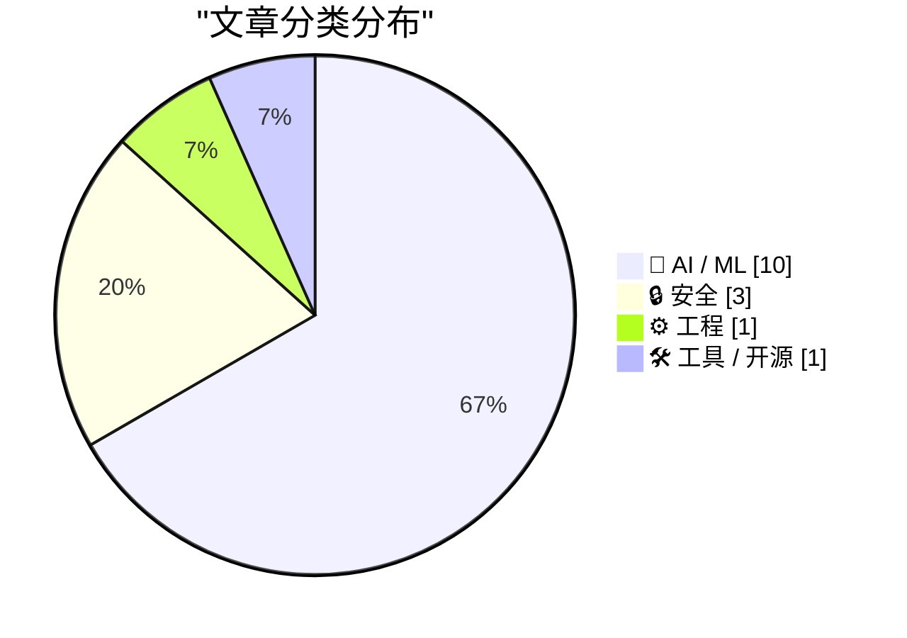
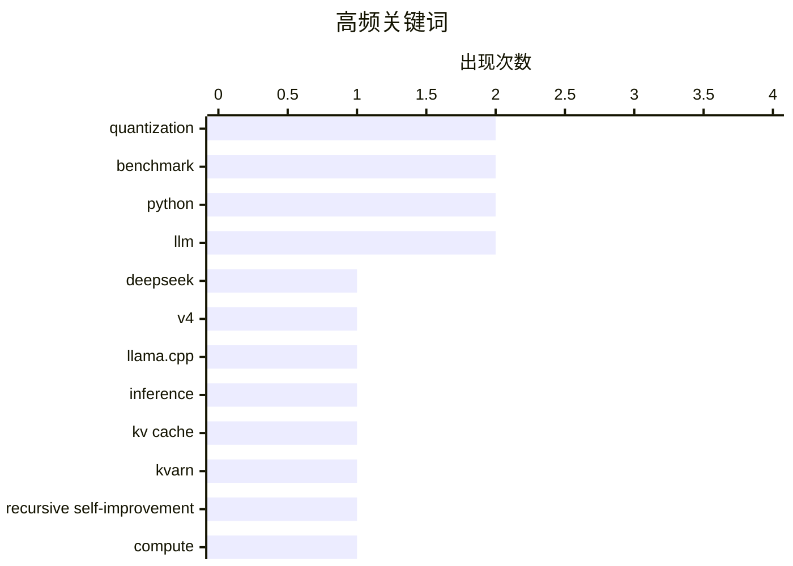

# 📰 AI 资讯每日精选 — 2026-06-07

> 汇聚 140+ 技术博客、X/Twitter、Hacker News、Reddit、Product Hunt、
> Lobste.rs、ClawFeed 日报及 GitHub Trending，经 AI 评分筛选。
>
> **本期内容**：🏆 今日必读 · 🌐 ClawFeed 日报 · 🔥 GitHub Trending · 📂 分类精选 · 🎨 设计与生成式 AI · 📊 数据概览

## 📝 今日看点

今日技术圈聚焦两大趋势：一是AI模型推理效率与量化技术的突破，DeepSeek V4获得llama.cpp初步支持，KV缓存量化方案KVarN实现精度跃升，低比特量化MoQ技术即将大幅提升GGUF模型质量，同时Google Gemma 4 QAT版本在12GB显存上跑出120 tok/s的速度；二是AI安全与隐私风险持续发酵，Meta确认数千Instagram账户因AI聊天机器人漏洞被黑，智能电视被揭露成为AI数据抓取经济的节点。此外，开源语音模型实现0.4秒级流式交互、Sakana AI押注递归自我改进打破算力军备竞赛，以及GitHub Copilot开放自定义端点，共同勾勒出AI技术从底层优化到应用生态的快速演进图景。

---

## 🏆 今日必读

🥇 **DeepSeek V4 Flash 令人惊叹！（WIP llama.cpp PR #24162）**

[DeepSeek V4 Flash is amazing! (WIP llama.cpp PR #24162)](https://www.reddit.com/r/LocalLLaMA/comments/1tyb3np/deepseek_v4_flash_is_amazing_wip_llamacpp_pr_24162/) — r/LocalLLaMA · 17 小时前 · 🤖 AI / ML

> DeepSeek V4 系列模型终于通过 PR #24162 获得了 llama.cpp 的初步支持。该 PR 目前处于早期阶段，仅适合出于好奇进行实验的用户，存在严重的稳定性和性能问题。当前推理速度极慢（约 5-6 tps），GPU 支持和 Flash Attention 仍需完善，但已能保证基本的正确性。

💡 **为什么值得读**: 抢先了解 DeepSeek V4 在 llama.cpp 上的早期支持状态，适合关注本地大模型部署的开发者评估风险与潜力。

🏷️ DeepSeek, V4, llama.cpp, inference

🥈 **KV 缓存量化基准测试：KVarN 6-bit 匹配 q8_0，4-bit 匹配 q5_0。意义重大！**

[KV cache quant benchmarks: KVarN 6-bit matches q8_0, 4-bit matches q5_0. Massive!](https://www.reddit.com/r/LocalLLaMA/comments/1tyockn/kv_cache_quant_benchmarks_kvarn_6bit_matches_q8_0/) — r/LocalLLaMA · 7 小时前 · 🤖 AI / ML

> 基于长上下文 KLD 基准测试，KVarN 量化方案在 llama.cpp 的 KV 缓存量化中表现显著优于传统方案。在每个比特位上，KVarN 的精度都能匹配比它高一个比特位的传统量化（例如 KVarN 6-bit 精度等于 q8_0，4-bit 等于 q5_0）。这意味着在相同精度下，KVarN 能大幅节省显存占用。

💡 **为什么值得读**: KVarN 量化方案为本地大模型推理的 KV 缓存优化提供了突破性思路，能直接降低显存需求，值得所有关注推理效率的开发者关注。

🏷️ KV cache, quantization, KVarN, benchmark

🥉 **Sakana AI 押注：能自我改进的 AI 可打破前沿实验室的算力军备竞赛**

[Sakana AI bets AI that improves itself can break the compute arms race of frontier labs](https://the-decoder.com/sakana-ai-bets-ai-that-improves-itself-can-break-the-compute-arms-race-of-frontier-labs/) — The Decoder · 11 小时前 · 🤖 AI / ML

> 日本初创公司 Sakana AI（由 Transformer 论文合著者 Llion Jones 联合创立）成立了一个专门研究递归自我改进（RSI）的研究实验室。该公司认为 RSI 技术是替代美国大型实验室依赖原始算力堆叠的可行路径。然而，Anthropic 对此技术发出了控制风险的警告。

💡 **为什么值得读**: 本文揭示了递归自我改进 AI 作为算力军备竞赛替代方案的最新进展与争议，对理解 AI 发展路线分歧具有重要参考价值。

🏷️ recursive self-improvement, compute, Sakana AI, RSI

4️⃣ **使用 MicroPython 和 WASM 在沙箱中运行 Python 代码**

[Running Python code in a sandbox with MicroPython and WASM](https://simonwillison.net/2026/Jun/6/micropython-in-a-sandbox/#atom-everything) — simonwillison.net · 22 小时前 · ⚙️ 工程

> 作者经过多年实验，最终采用 MicroPython 编译为 WebAssembly（WASM）的方案，实现了理想的代码沙箱执行环境。该方案已发布为 alpha 包 micropython-wasm，并用于 Datasette Agent 的代码执行沙箱插件。该方案兼具安全性、轻量级和易用性，解决了长期以来的沙箱难题。

💡 **为什么值得读**: 提供了一种新颖且实用的 Python 沙箱方案，结合 MicroPython 和 WASM 技术，对需要安全执行用户代码的开发者极具启发性。

🏷️ sandbox, MicroPython, WASM, Python

5️⃣ **全新开源语音模型：持续监听，每 0.4 秒决定是否说话或保持沉默**

[New open-source voice model listens nonstop and decides every 0.4 seconds whether to speak or stay silent](https://the-decoder.com/new-open-source-voice-model-listens-nonstop-and-decides-every-0-4-seconds-whether-to-speak-or-stay-silent/) — The Decoder · 15 小时前 · 🤖 AI / ML

> 名为 Audio Interaction 的开源语音模型实现了真正的流式交互，无需等待录音结束即可实时处理。它能在一个流中同时完成翻译、转录、对话，甚至识别咳嗽等日常环境音，决策间隔仅为 0.4 秒。模型权重和代码已在 GitHub 上以 Apache 2.0 许可证开源，训练数据也将后续发布。

💡 **为什么值得读**: 该模型在实时语音交互的流畅度和功能完整性上超越了 GPT-4o 等现有方案，且完全开源，是构建下一代语音助手的关键参考。

🏷️ voice model, open-source, real-time, Apache 2.0

---

## 🌐 ClawFeed 日报精选

> 来源：[ClawFeed](https://clawfeed.kevinhe.io) — AI 驱动的多源新闻聚合

🌅 ClawFeed Daily | 2026-06-06 (SGT)

聚合范围：2026-06-05 16:00 - 2026-06-06 15:59 SGT 共 6 个 4h digest（ids 601 / 602 / 604 / 605 / 606 / 607）。
（注：上一份 daily id=603 截止 06-05 23:59 但仅聚合到 16:00 期；本日 daily 从 id=601 起以保证 16:00/20:00/00:00/04:00/08:00/12:00 六段完整覆盖 24h。）

样本量：feed 约 257 (39+44+44+53+47+30) + bookmarks 120 + followingSample 210 + followingProfiles 144（6 个 4h 段累计）。

—

🔥 当日全场最重要 5 条

1. **Anthropic Recursive Self-Improvement (RSI) 24h 内完成"官方反击 → 全球 builder 共识 → 内外双视角放大"三段闭环**：Anthropic 官方账号 "Our internal data shows Claude is accelerating AI development—a possible path to recursive self-improvement, or AI autonomously building a more capable successor / It's happening faster than we thought" 配 "When AI builds itself" 长文+视频 **10M~16M 阅读封顶**；Box CEO @levie 9h 接力"乐观情景的关键段落 / Anthropic 员工与高能力 AI 协作爆炸式产生 ideas / initiative / 工具 / 模拟"（45K 阅读）；中文 AI 教练 @jungeAGI 二次 Quote @Jackywine "今天 Anthropic 这篇文章被所有人转发了 / 但只有真正去官网看的人才会体会到 那段动画的恐怖感 / 递归开始了 / 这才是 AI 进化了 还得是 Anthropic"；@Potatoloogs Jun 4 长文中文转译 "Anthropic 内部用 Claude 接管 95% 数据分析请求 / 一开始直接接数据仓库准确率不超过 21% → 95%"（21K 阅读）；@_catwu "I'm hiring a PM for Claude Code, focused on model performance + agentic evals + research → core product integration"；@claudeai 官方 "We've doubled usage limits in Claude Cowork for the next month / Delegate bigger, more complex tasks"（803K 阅读）= 一日内 Anthropic 同时投放 thesis（RSI）+ 内部数据（21%→95%）+ 战术让利（Cowork limits 翻倍）+ 招聘（Claude Code PM）四件套。但同时 @levie 7h 反向校准 "Coding is basically the pinnacle of what you could reasonably automate with AI, and yet we still need human engineers to oversee agents / fully autonomous AI engineers 仍然很远"（51K 阅读）= **builder 圈对 RSI thesis 已进入"理性消化期"而非纯 hype**。https://x.com/AnthropicAI/status/2062568862479208923 · https://x.com/jungeAGI · https://x.com/Potatoloogs/status/2062513449100595489 · https://x.com/claudeai/status/2063018337567670285

2. **西方 builder stack 进入"工业化中间件 + agent infra"双轨成熟期：Vercel 五连发 + Supabase 10B 巩固期 + InsForge "agent-native AWS" 新玩家入场 + Cline/NVIDIA Nemotron 3 Ultra 双轨分发 + Marin 6x cumulative pretraining speedup**：(a) **Vercel 五连 ship**：@vercel_dev 24h 内连发 skills.sh API GA (600K skills) / Vercel × Perplexity Computer 集成 / v0 × Shopify Next.js 一键 store / Sandbox drives 私测（compute / storage 解耦 + agent memories 跨 sandbox 持久化）/ AI Gateway 接入 Nemotron 3 Ultra 550B；@rauchg + @tobi 双 CEO 站台"prompt Next.js + Shopify store in seconds / The old tradeoff was easy monolith or costly headless. No more"（543K + 11h 二次确认）；@EstebanSuarez 独立 builder 当晚做出 "𝚞𝚙" demo（sync code into Sandbox + detect framework + install deps + dev server + public URL）= **第三方在 Sandbox drives 上构建的首个工具样本**。(b) **Supabase Paul Copplestone**：Jun 5 thread "Supabase has raised $500M at a $10B valuation / employees opportunity to cash out 25% of vested options / cashless transaction / We have done this in every round since inception"（310K 阅读 / 275 retweets / 3.3K likes）= Postgres BaaS winner-takes-most 10B 巩固期 + founder-friendly 制度化样本。(c) **InsForge 11h launch**：@insforge "We're building the agent-native alternative to AWS but it's actually good / 33,000+ projects (10% WoW) / 2x weekly active (2000 → 4000+) / 11K+ GitHub stars (5x in 3 months) / faster than React Supabase Linux"（342K 阅读）= agent infra 战国期新玩家。(d) **Cline + NVIDIA Nemotron 3 Ultra 550B / 1M context / 5x faster / 30% cheaper 美国史上最大开源权重 model Free in Cline + Vercel AI Gateway 双轨分发**。(e) **@percyliang Marin / openathena 长文 "two types of advances: singular 3x + 一系列 micro 20% / Marin Dense → 129B MoE → architecture → optimizer = 6x cumulative pretraining speedup accounting for MFU"** = 训练侧 micro-optimization 累积成果论。**总览：applied AI 西方 builder 在 model 分发 / IDE 集成 / skills 中间件 / agent 长期 state / 训练 micro-optimization / 商业化 SaaS 六层同时推进。** https://x.com/kiwicopple/status/2062595323470717093 · https://x.com/insforge/status/2062935372703629402 · https://x.com/vercel_dev · https://x.com/percyliang/status/2062919606403313680

3. **applied AI 定价新例：Cognition Devin "AI Productivity Guarantee / $10M 保底报销" + Vercel × Shopify "prompt → store" + Claude Design "3 周设计 → 10 分钟" = 西方 builder 商业化层三件套同窗成熟**：@cognition 17h "If Devin delivers less engineering value than you're paying for, Cognition will fund your usage until it does, up to $10 million"（applied AI / coding agent results-based pricing 公司级第一例）；@dabit3 "Pay for productivity, not activity is the next chapter of AI pricing / If Devin doesn't pay for itself, we'll eat the cost"；@0xshunshun 中文同步定调 "从 burn tokens 到 pay for real productivity / Cognition 把整个行业转到了正确方向"；@PrajwalTomar_ 4h "Claude Design just collapsed 3 weeks of design work into 10 minutes / Rough idea in / Fully responsive high-fidelity website out / In 10 minutes"（Claude Design skill 应用侧实测首波）；@tobi 转 v0 "Vercel partnering with Shopify / prompt a Next.js + Shopify store in seconds / The old tradeoff was easy monolith or costly headless. No more"。**applied AI 定价从 token → seat → 产出保证 + applied AI builder 从代码 → 设计 → 电商 storefront 三层 prompt 化产品矩阵同窗成型**——上一日 levie "Uber $1,500/月 token cap" demand-side 痛点在 24h 内被 Cognition supply-side 反向回应。https://x.com/dabit3/status/2062602262237626802 · https://x.com/PrajwalTomar_/status/2062935788258832560 · https://x.com/rauchg/status/2063009510503932181

4. **Bitcoin 周末 capitulation 实盘验证：BTC 跌破 60K → 59xxx 一日完成 thesis 派 → 抄底情绪派 → capitulation 派 三段递进**：周五傍晚 16:00 SGT @ThinkingUSD "Buying Bitcoin today is front running the forced diversification of a completely AI saturated equity market / 5 Trillion dollars of equity value 三次大规模 index 纳入" + @nsquaredvalue "-20% one week / 30 天 70% 概率上涨 / 中位 +15%" + @MetaMona_ "I'm not selling my Bitcoin into the hands of hucksters / I'm buying more. Lower" + @MattFiebach "balance sheet management is the most underrated growth lever" = **多角度抄底 thesis 派**；周六凌晨 04:00 SGT @kaikaibtc "忍不住想抄底 60000" + @Mandrik "$58K gang return" + @Paris13Jeanne "6 万其实开始买现货没啥问题" = **散户抄底情绪派**；周六上午 12:00 SGT @Nazarick_eth "6 万已经摸过了 最低 59xxx / 黑天鹅在路上 / 别急着抄底" + @Bitwux 14h "BTC 已经破 60000 币安最大爆仓单 1500w / 怎一个惨字了得" + @huahuayjy "所有资产都在跌 黄金跌 原油跌 股市跌 币圈跌 / 清仓逃命了 / 留得青山在不怕没柴烧"（47K 阅读）+ @_FORAB "Tom Lee Bitmine ETH 浮亏 103 亿 + Saylor Strategy BTC 浮亏 123 亿 / 大佬抄底也要先交学费"（19K 阅读）+ @wolfyxbt "方程式新闻 Vida 表示不敢抄底" + @jt588888 "杀破狼实盘做空 BTC 利润快 50W U" = **集体 capitulation 派**；周六下午 16:00 SGT 情绪降温（仅 Bitwux + dashengbigwin 短评）= 进入"等开盘 / 不发声"沉默期。**24h 内 thesis 派 → 抄底情绪派 → capitulation 派 → 沉默期 四段完整剧本**。同窗 @KyleSamani + @vibhu "First you win spot. Then you win perps / Historic day for solana: HYPE did more spot volume on Solana than all centralized exchanges in 24h / ZEC also did more volume than all CEXes" = DEX 战国期信号叠加。https://x.com/Nazarick_eth/status/2062932848928338373 · https://x.com/_FORAB/status/2063085730851950678 · https://x.com/huahuayjy/status/2062979120146022513

5. **MicroStrategy 五年来首次净卖 BTC 32 枚 + paper bitcoin debate + Zcash 漏洞余震 + ZK 系统通用风险教训 + Bitcoin 协议后量子升级 同窗递进**：@Steam_Diary123 10h 长文 "Strategy 6 月 1 日 8-K 披露 / 5 月 26-31 日期间均价 $77,135 卖出 32 BTC 套现 250 万 / 公司自 BTC 战略以来首次净卖出"；@knutsvanholm "Paper Bitcoin adoption is not Bitcoin adoption" + @unchained "And paper bitcoin holders are not bitcoin holders" = **Bitcoin 纯粹主义对 Strategy 公司财库式囤币的反向 thesis 在首次卖出节点正式启动**；@OGDfarmer "long wherever this flush ends / Equities puking too / 周末小幅反弹 scalp 一下就够" 冷静派；同窗 Zcash 漏洞余震二期 @sethforprivacy 6h "No Monero folks should be looking to dunk on Zcash / Monero 自己也有过通胀 bug / 这是 ZK 系统建设的天然下行风险" + @exitnode_ 反驳 + @0xxNathan "Adam (Hoffman) sold all the ETH he'd held for 9 years and bought VVV NEAR ZEC HYPE LIT / ZEC 24h -43% / Why not BTC" = **Zcash 漏洞从纯市场叙事升级为 ZK 系统通用风险教训 / Hoffman ETH→altcoin 押注 24h 反向打脸进入第二期**；@bitcoinoptech #408 "BIP324 transport encryption 量子安全 / QR-based miniscript signing 标准化 / CTV-only vault PoC" + @ODELLXYZ 重回 X "Elon wanted $50k for my deleted account so I made a fresh handle and kept the bitcoin" + @oomahq + @TheBoozles "BIP-110 个人 noderunner 17 Ph/s 占 1M Ph/s / Bitcoin 不属于 5 家公司" = **Bitcoin 协议侧 后量子升级 + 矿池去中心化辩论 + 主权派回归 三线在 Strategy 卖出 + Zcash 漏洞双余震中冷静推进**。https://x.com/Steam_Diary123/status/2062774743665926506 · https://x.com/sethforprivacy/status/2062858766924546219 · https://x.com/bitcoinoptech/status/2062857938960543934

—

📰 当日核心主题

**主题一：Anthropic RSI thesis 24h 内成西方 + 中文 builder 共识中心，但 levie 反向校准 = 进入理性消化期**
- 06-05 20:00：Anthropic 官方 RSI 帖 10M 阅读 + levie 9h 接力"乐观情景的关键段落"
- 06-06 00:00：Jackywine "递归开始了 动画恐怖感" 中文转化
- 06-06 04:00：jungeAGI 二次 Quote "这才是 AI 进化了 还得是 Anthropic"
- 06-06 12:00：levie 7h 反向校准 "coding 仍需 human engineers oversee / fully autonomous AI engineers 还远"
- 06-06 16:00：Potatoloogs Jun 4 "Anthropic 21% → 95% 数据分析准确率"中文转译 + claudeai 官方 Cowork limits 翻倍一个月 803K 阅读 + _catwu Claude Code PM 招聘
- 总结：Anthropic 一日内同时投放 thesis（RSI）+ 内部数据（21%→95% harness 工程化）+ 战术让利（Cowork 翻倍）+ 招聘（Claude Code PM）= "model lab 自我神化"四件套，levie 反向校准成为"理性消化期"标志

**主题二：西方 builder stack 工业化中间件 + agent infra 双层成熟，三家平台层并进（Vercel / Supabase / InsForge）**
- 06-05 20:00：Cline + NVIDIA Nemotron 3 Ultra 550B / 1M context Free 上线（开源权重 model 第一分发层）
- 06-06 00:00：Vercel AI Gateway 接入 Nemotron 3 Ultra 30% lower cost（第二分发层）+ Percy Liang Marin 6x cumulative pretraining speedup
- 06-06 04:00：Vercel skills.sh API GA (600K skills) + Vercel × Perplexity Computer + v0 × Shopify Next.js + Tobi Lutke 转推
- 06-06 08:00：Vercel Sandbox drives 私测（compute / storage 解耦 + agent memories 跨 sandbox 持久化）+ EstebanSuarez 𝚞𝚙 demo
- 06-06 12:00：InsForge "agent-native AWS / 33K projects / 11K stars 5x in 3 months"  launch（342K 阅读）
- 06-06 16:00：kiwicopple Supabase 5 亿 D 轮 10B 估值 + 员工 25% vested options cashless（310K 阅读 / 巩固期）+ rauchg 二次确认 Sandbox drives
- 总结：西方 builder stack 在 model 分发 / IDE 集成 / skills 中间件 / agent 长期 state / 训练 micro-optimization / 商业化 SaaS 六层同时推进，Vercel 工业化中间件 + Supabase BaaS 10B 巩固 + InsForge agent infra 新玩家 = 三足鼎立

**主题三：applied AI 定价进化首例 + applied AI 产品 prompt 化矩阵（代码 / 设计 / 电商）**
- 06-05 20:00：Cognition Devin "AI Productivity Guarantee $10M 保底报销" + dabit "pay for productivity, not activity" + 0xshunshun 中文定调
- 06-06 04:00：PrajwalTomar_ "Claude Design 把 3 周设计塌缩到 10 分钟" Anthropic skill 实测首波
- 06-06 04:00 + 12:00 + 16:00：Tobi + rauchg + v0 × Shopify 三连"prompt → Next.js + Shopify store" 商业化层主推
- 总结：定价从 token → seat → 产出保证 三段进化首例 / 产品从代码 → 设计 → 电商 storefront 三层 prompt 化 / 上一日 levie "Uber $1,500/月 token cap" demand-side 痛点被 Cognition supply-side 反向回应

**主题四：BTC 周末 capitulation 实盘验证：thesis 派 → 抄底派 → capitulation 派 → 沉默期 24h 四段完整剧本**
- 06-05 20:00：MicroStrategy 五年首次卖 BTC 32 枚 + knutsvanholm "paper bitcoin holders are not bitcoin holders" 反向 thesis 启动
- 06-06 00:00：ThinkingUSD AI 饱和股指强制 diversification + nsquaredvalue -20% 一周 30 天 70% 上涨概率 + MetaMona 道德派 + MattFiebach balance sheet management 治理派 = 多角度抄底 thesis 派
- 06-06 04:00：kaikaibtc "忍不住抄底 60000" + Mandrik "$58K gang return" + Paris13Jeanne "6 万买现货没问题" = 散户抄底情绪派
- 06-06 08:00：BTC 实际跌破 60K → 59xxx（Nazarick_eth 11h 验证）+ huahuayjy "清仓逃命 留得青山在" + _FORAB "Tom Lee 浮亏 103 亿 + Saylor 浮亏 123 亿 大佬抄底也要先交学费" + wolfyxbt "方程式 Vida 不敢抄底" + jt588888 "杀破狼实盘做空 BTC 利润快 50W U" = 集体 capitulation 派
- 06-06 12:00：Bitwux "BTC 破 60000 币安爆仓单 1500w 怎一个惨字了得" 情绪降温
- 06-06 12:00：ArtofSpecuycky "NASDAQ -4.18% 费半 -10% 不卖反而加仓"（50K 阅读）+ ViewsOfChris "更乐意回调"双声 = **中文盘感派分裂："加密 capitulation 派 vs 美股加仓派"**
- 同窗 KyleSamani + vibhu "First you win spot. Then you win perps / Historic day for solana: HYPE did more spot volume than all CEX / ZEC 同窗" = DEX 战国期信号叠加

**主题五：Zcash 漏洞余震 + ZK 系统通用风险教训 + Bitcoin 协议后量子 + Bitcoin 主权派回归 同窗递进**
- 06-05 20:00：sethforprivacy "Monero 自己也有过通胀 bug / ZK 系统天然下行风险 / Zooko 公开经过是正确的" + exitnode_ 反驳 + 0xxNathan "ZEC 24h -43% Hoffman 为什么不直接 BTC" 二次打脸
- 06-05 20:00：Bitcoin Optech #408 "BIP324 transport encryption 后量子前瞻 + QR-based miniscript signing 标准化 + CTV-only vault PoC"
- 06-06 04:00：oomahq + TheBoozles "BIP-110 个人 noderunner 17 Ph/s 占 1M Ph/s / Bitcoin 不属于 5 家公司"个人 hashrate 民主化辩论
- 06-06 08:00：ODELLXYZ "Elon 出价 5 万收回 deleted handle 我没付 留了 BTC" Bitcoin 主权派回归
- 06-06 08:00：0xDaedalus "Free token transfers are coming / 真实世界 payments 2y 上链 / simple transfer 免费 由复杂 tx fees 补贴" + Web3zy chain abstraction 痛点
- 总结：Bitcoin 协议侧 后量子升级 + 矿池去中心化辩论 + 主权派回归 + 加密 UX 持续 四线 在 Strategy 卖出 + Zcash 漏洞 双余震 + SpaceX IPO 短期 meme 抢跑 中冷静推进

**主题六：中文 AI 编程经济账显形 + 中文 AI 焦点扩张到具身智能**
- 06-06 00:00：dotey 长文 "我知道的所有做 AI Agent 团队都很拼 / Kimi 团队开发 Kimi Code 时自家 model token 用得多还是 Claude/GPT token 用得多 / 抱电脑去汤泉卷两天 几千刀 token 做架构验证" + ai_muzi Coze 3.0 "Claude Code / Codex CLI / OpenClaw 可以接进" 8.2K 阅读
- 06-06 00:00：_LuoFuli Xiaomi MiMo V2.5 Hybrid Sliding Window Attention 推理优化博客 / API 价格永久降幅 99% / 5-8x 可用 token（128K 阅读）
- 06-06 00:00：jakevin7 "微信里有人专门扫开源源码 / wx-cli ~/.wx 或 ~/.wx-cli 被检测会被警告"（19K 阅读）+ cyrilxuq "不然没办法垄断" + turingou 上一期"大公司组织腐烂" 同窗
- 06-06 04:00：istdrc "opus 4.8 has too much hallucination" 95K 阅读 + Kathydotxyz 22h 长文 "机器人产业链 估值泡沫 / 6/1 宇树 IPO 过会 A 股具身智能第一股 / 黄仁勋 GTC Taipei 物理 AI ChatGPT 时刻马上就到 / 马斯克 Fremont 工厂停 Model X"
- 06-06 08:00：上一日 sainingxie + ma_nanye VSTAT MLLM 视觉状态追踪 benchmark + kalinowski007 "AI frontier moving from digital to physical / VR did not fail, it graduated" + a16z + drfeifei "World Models Functional Taxonomy" 物理 AI thesis 第三期同窗
- 06-06 12:00：GitHub_Daily BrowserAct "AI Agent 浏览器自动化 CLI / 三层反封锁机制" + GitTrend0x "Hermes 插件 generation / Multi-Agent Desktop Client / HermesHub 技能枢纽 / Mnemo Cortex 记忆系统"
- 06-06 16:00：elliotchen100 中文转述 drfeifei "World Models 功能分类法克制 / 没造新词 / 强化学习里 40 年..." + mdancho84 "BREAKING: MIT researchers discover how to enable LLMs to do real logical reasoning"
- 总结：中文 AI 圈"自家 model + 西方 API 并行使用"成共识 / 焦点从 model + IDE + skills 扩张到 具身智能 + applied skills 实测 + agent OS / 与"国产开源化 vs 大公司围墙" 双线对照

—

🔖 累计 bookmark 精选

本日 6 个 4h 段中 Kevin 全程没有新增任何 bookmark 标记。Bookmarks 仍为旧帖回滚常规集合（arrakis_ai / gdb GPT-Realtime-2 / turingou wanman / Stitch DESIGN.md yangyi / cline Kanban / heynavtoor + chenchengpro Harness Engineering / levie Era of Context + 企业软件未来 + capability overhang / openfangg / yq_acc / mntruell / istdrc Slock / oragnes Pika / idoubicc open-agent-sdk / DoveyWanCN harness 泄漏 / demishassabis YC）。

观察：连续 24h 无新 bookmark + 无 Deep Dive 触发 = 本日 Kevin 处于"被动消费"模式 / 建议在周日剩余时段考虑：(1) Sandbox drives + EstebanSuarez 𝚞𝚙 demo 是否值得 mark 复盘；(2) Potatoloogs "Anthropic 21% → 95% harness 工程化" 长文是否值得 mark 作为 Harness Engineering 增量参考；(3) Kathydotxyz 具身智能产业链长文是否值得 mark 进入物理 AI 思考。

—

👀 推荐关注汇总（已去重）

本日 6 个 4h 段累计推荐关注（按出现次数 + thesis 价值排序）：

1. **@kiwicopple**（Paul Copplestone Supabase CEO）— Supabase 5 亿 D 轮 10B 估值 + cashless 25% vested options 制度化 / Postgres BaaS 派 + e/postgres handle / 企业级 builder thesis 长线跟踪。https://x.com/kiwicopple
2. **@AnthropicAI Institute / @_catwu / @claudeai**（Anthropic 官方账号集群）— RSI 系列 + character formation + frontier safety + Claude Code PM 招聘 + Cowork limits 翻倍 = 过去一周 frontier safety + AI thesis 最值得追踪通道。https://x.com/AnthropicAI
3. **@cognition**（Cognition AI）— Devin AI Productivity Guarantee + $10M 保底报销 = 2026 年 applied AI / coding agent 定价模式转折点的官方账号。https://x.com/cognition
4. **@percyliang**（Stanford CRFM）— Marin / openathena "(i) singular 3x (ii) micro 20% stack = 6x cumulative pretraining speedup" 长文 / Stanford CRFM 训练侧 micro-optimization 累积论 一手作者通道。https://x.com/percyliang
5. **@eastdakota**（Matthew Prince Cloudflare CEO）— Cloudflare CEO 一手 VC 圈黑历史叙事 / "Sequoia 因女性 CEO 拒投 + a16z 周一 GP 睡死" / 跨产品 + 跨故事质量极高。https://x.com/eastdakota
6. **@_patrickogrady**（高性能链 builder）— 新链发布 70K TPS / 400ms finalization / browser light client / native passkey wallet 免费 / 加密 UX 一手通道。https://x.com/_patrickogrady
7. **@drfeifei + @ma_nanye + @kalinowski007**（spatial / physical AI 学术派三位）— Fei-Fei World Models taxonomy + NYU AMI Labs VSTAT benchmark + 前 Apple Meta XR Caitlin "VR graduated" = 物理 AI 长线 thesis 通道。
8. **@insforge**（agent-native AWS 新玩家）— launch thread 342K 阅读 / 11K stars 5x in 3 months / 长线 hype vs 实绩观察价值高。https://x.com/insforge
9. **@EstebanSuarez**（Vercel 生态独立 builder）— 𝚞𝚙 demo Sandbox drives 第三方应用样本 / agent runtime infra 一手跟踪。https://x.com/EstebanSuarez
10. **@_FORAB**（AB Kuai.Dong V神老朋友）— "Tom Lee Bitmine + Saylor 双浮亏 大佬抄底也要先交学费" / 链上长线分析师派一手通道。https://x.com/_FORAB
11. **@ArtofSpecuycky**（中文美股大 V）— "NASDAQ -4.18% 费半 -10% 不卖反而加仓" 加仓派 thesis 系统化 / 跟踪周一美股开盘前是否扩散为主流盘感。https://x.com/ArtofSpecuycky
12. **@Potatoloogs**（土豆本豆，Anthropic 中文转译派）— "Anthropic 内部 Claude 21% → 95% 数据分析" 长文 + harness 工程化 thesis 派 一手通道。https://x.com/Potatoloogs
13. **@Kathydotxyz**（中文具身智能产业链派）— "机器人产业链拆解 + 估值泡沫 + 宇树 IPO + 黄仁勋 GTC Taipei 物理 AI ChatGPT 时刻" 22h 长文 / 中文具身智能一手通道。https://x.com/Kathydotxyz
14. **@PrajwalTomar_**（Anthropic skills 实测派）— "Claude Design 3 周设计 → 10 分钟" thread / Anthropic skills 应用侧实测一手通道。https://x.com/PrajwalTomar_
15. **@nsquaredvalue + @MattFiebach + @OGDfarmer + @0xDaedalus**（加密多角度 thesis 派四位）— 历史统计 + 资产负债表治理 + 冷静派 swing trader + 加密 UX 各有侧重 / 长线持仓决策辅助价值高。

提醒：上述未通过浏览器逐一核实是否已关注，**Kevin 操作前请先在 Following 里搜一下** 避免重复加关注。

—

💤 当日重复噪音模式

整体噪音密度：本日 6 个 4h 段噪音占比从 16:00 (中等偏低) → 20:00 (中等偏低) → 00:00 (中等偏上) → 04:00 (中等偏下) → 08:00 (高) → 12:00 (高 / 信号密度低)，周日下午回落至 (高 / 样本枯竭)。**周末噪音密度明显高于工作日，且夜间段（00:00-04:00）+ 周日早盘段（08:00-12:00）双高峰**。

重复噪音模式（按出现次数排序）：

1. **加密 parody / 喊单 / 营销付费（连续 6 期）**：@feibo03 Parody account + gmgn + 抓奶工坊 TG（第十期复议建议取关）/ @Soft6161 TermMax Alpha BNB Chain Long/Short $MUon/$NVDAon/$QQQon/$METAon/$INTCon Paid partnership + SpaceX IPO 蹭热点 / @Brent_Fulfer SPRINT $7K paid intro / @rwayne XCrawl 5 个数据爬虫副业 Paid partnership + 偏离主轴的生活段子 / @MEJ50749 + @ADRPROTOCOL 1xBet 世界杯 ADR Protocol / @Pumpfun + @vveefo + @chowtato + @healthydege "pump.fun GO $690K kill yourself / marriage bounty" / @Jaileddotfun + @shiroino__ + @gyo_n + @idekun321511 Solana 监狱模拟器邀请码 + breeding cooldown / @im3mortal + @onlyonexhj TRON 营销长文 / @coin_pep BiyaPay referral / @sunshinebinance Binance 创意大赛蹭热点
2. **僵尸号 / follow-back 占位号（连续 15 期）**：@HeXiaobo 最后原创 2018-07 / 8 年沉寂 / @0xJasonBateman 36 posts / 8 followers / follows you / profile 完全空——**结论稳定，立即执行取关**
3. **加密散户惨案 + 情绪喊单**：@yollysalazarrr 借 38W 抄底 ETH 1600 全部爆仓 + 婚姻破裂 / @kaikaibtc + @lin_btc + @Paris13Jeanne + @Mandrik "$58K gang return" / @huahuayjy 清仓逃命派 / @cryptowang4423 "宁愿少赚不能亏钱" / @0xFeiYang "大饼真废了" / @liuwei16602825 "盘感登峰造极"自信叙事 / @Nazarick_eth 空单 61111 止盈派 / @jt588888 杀破狼实盘做空 BTC 50W U / @wolfyxbt 方程式 Vida 不敢抄底
4. **体育 / 节日 / 政治流量虹吸**：@Cristiano 父亲节 3.4M 阅读 / @AryaNedaee_ Monaco F1 Paddock Club / @WorldCupMedia "7 DAYS TO GO" / @MwepuMagic Nick Woltemade penalty / @narendramodi Daman Namo Airport / @elonmusk Community Notes + Tesla Earth-Mars orbit 流量帖 / @nypost dog stolen and eaten / Marine veteran trib.al 新闻 / @NVIDIAGeForce #RTXPowersPlay 抽奖
5. **纯互关 / 蓝 V / 弱信号短句**：@asunarococo Shibuya Crossing / @Lewis8888888 + @ohouhou717 / @kai2009pp "DM me pls" 多次 / @selectivesnail / @ynonestop / @TheTriceRozay "Bro to Bro just say Hello" / @1thousandfaces_ "most noided bitch in this club" / @hwke95 "粉丝少时多发推" / @0xLdnx / @xamiguo / @0xRory / @GemMaster01 / @RobotecAvi "Oho" / @icekento1 / @Pioneer4697 / @MosesCyborg / @dashengbigwin "写的非常好" / @kai2009pp "Hi can u dm me pls" / @charcoded "60lbs 哑铃总是放回正确位置" 健身梗 49K likes / @ashleyyjoelle SF pasta night 求场地 / @eunifiedworld blue RIMOWA 被偷 / @0xKaco + @grugcapital + @GeorgePBeall Vegas "people think we're gay" 室友梗
6. **生活段子 / 风水 / 脑洞**：@YuLin807 "洗的衣服少了一股男人味" / "瑞克和莫蒂星露谷物语角色是否会发明宗教" / "X 增加转帖权重 16 条诵读完周末约会去"（连续多期建议第六期纳入观察暂缓取关）/ @caterpillarous 情绪日志"晚上吃水果刷到乔布斯视频又觉得很想哭" / "The pain of becoming yourself"（第五期纳入观察）/ @Jordan97995944 "这个少妇长得不错" / @oran_ge "和归藏老师录播客 一秒不剪 完全不想聊 AI" / @fugui8 "周边都是去哪里舔的" / @YuLin807 + @0xFelix 美股个股小作文

—

样本汇总：feed 257（39+44+44+53+47+30）/ bookmarks 120 / followingSample 210 / followingProfiles 144。**周末样本枯竭节奏明显**（53 → 47 → 30），且 builder/AI 干货密度从 04:00 段 (信号密度中等偏上) 急速回落至 08:00-12:00 段 (信号密度低)，但 16:00 段意外承载本日最大企业级 builder 信号（Supabase 5 亿 10B）。

主线 5 条收口：(1) **Anthropic RSI thesis 24h 三段闭环 + levie 反向校准 = 进入理性消化期**；(2) **西方 builder stack 工业化中间件 + agent infra 双轨成熟期 / Vercel + Supabase + InsForge 三足鼎立 + Cline/Vercel Nemotron 3 Ultra 双轨分发 + Marin 6x cumulative speedup**；(3) **applied AI 定价进化首例 + applied AI 产品 prompt 化矩阵 / Cognition Devin 产出保证 + Vercel × Shopify "prompt → store" + Claude Design "3 周 → 10 分钟"**；(4) **BTC 周末 capitulation 实盘验证 / thesis 派 → 抄底情绪派 → capitulation 派 → 沉默期 24h 四段完整剧本 / BTC 跌破 60K → 59xxx 验证 / 中文盘感派"加密 capitulation vs 美股加仓"分裂**；(5) **MicroStrategy 五年首次卖 BTC + paper bitcoin debate + Zcash 漏洞 ZK 风险教训 + Bitcoin 协议后量子升级 + 主权派回归 + 加密 UX 同窗推进**。

明日（2026-06-07）重点跟踪：(1) BTC 是否在 58-60K 区间企稳 / Strategy 是否在 8-K 后追加披露 / 中文加密圈 capitulation 是否扩散；(2) 美股周一开盘前 ArtofSpecuycky 加仓 thesis 是否扩散为主流盘感 / SpaceX IPO 周末是否更新官方定价；(3) Supabase 5 亿融资业内讨论延续 / InsForge launch 后续指标 / Vercel Sandbox drives 第三方应用样本增加 / EstebanSuarez 𝚞𝚙 demo 用户口碑；(4) Anthropic RSI 第三波转化是否有产品 release / Claude Cowork limits 翻倍是否有计费 bug 信号扩散（xxxDreamer_mo "usage 神秘消耗" 一手反馈）/ Claude Design skill 是否有中文 KOL 复述（dotey / yangyi / 木子）；(5) Cline + Nemotron 3 Ultra 实测口碑（多期遗留跟踪）/ Marin 6x speedup 同行复议；(6) dotey Kimi Code 新架构是否进一步披露 / Coze 3.0 接入 Claude Code/Codex/OpenClaw 用户反馈；(7) yucheng mercury CEO 面见结果 / Tutti.so 一手口碑数据；(8) Patrick O'Grady 新链是否 mainnet / POD Network 测试官方公告 / pump.fun GO 是否出现监管或下架。
---

## 🔥 GitHub Trending

> 今日热门开源项目（全语言 + Python）

| # | 项目 | 描述 | ⭐ 总星 | 📈 今日 | 语言 |
|---|------|------|---------|---------|------|
| 1 | [lfnovo/open-notebook](https://github.com/lfnovo/open-notebook) | An Open Source implementation of Notebook LM with more fl... | 26.6k | +794 | TypeScript |
| 2 | [obra/superpowers](https://github.com/obra/superpowers) | An agentic skills framework & software development method... | 219.7k | +700 | Shell |
| 3 | [Panniantong/Agent-Reach](https://github.com/Panniantong/Agent-Reach) 🤖 | Give your AI agent eyes to see the entire internet. Read ... | 22.4k | +683 | Python |
| 4 | [CopilotKit/CopilotKit](https://github.com/CopilotKit/CopilotKit) 🤖 | The Frontend Stack for Agents & Generative UI. React, Ang... | 33.2k | +631 | TypeScript |
| 5 | [666ghj/MiroFish](https://github.com/666ghj/MiroFish) | A Simple and Universal Swarm Intelligence Engine, Predict... | 65.1k | +493 | Python |
| 6 | [MemPalace/mempalace](https://github.com/MemPalace/mempalace) 🤖 | The best-benchmarked open-source AI memory system. And it... | 54.3k | +446 | Python |
| 7 | [mvanhorn/last30days-skill](https://github.com/mvanhorn/last30days-skill) 🤖 | AI agent skill that researches any topic across Reddit, X... | 28.9k | +439 | Python |
| 8 | [PaddlePaddle/PaddleOCR](https://github.com/PaddlePaddle/PaddleOCR) 🤖 | Turn any PDF or image document into structured data for y... | 81.0k | +433 | Python |
| 9 | [github/spec-kit](https://github.com/github/spec-kit) | 💫 Toolkit to help you get started with Spec-Driven Devel... | 109.6k | +398 | Python |
| 10 | [yt-dlp/yt-dlp](https://github.com/yt-dlp/yt-dlp) | A feature-rich command-line audio/video downloader | 168.7k | +291 | Python |
| 11 | [microsoft/VibeVoice](https://github.com/microsoft/VibeVoice) 🤖 | Open-Source Frontier Voice AI | 48.5k | +216 | Python |
| 12 | [openai/plugins](https://github.com/openai/plugins) 🤖 | OpenAI Plugins | 1.8k | +213 | JavaScript |
| 13 | [Shubhamsaboo/awesome-llm-apps](https://github.com/Shubhamsaboo/awesome-llm-apps) 🤖 | 100+ AI Agent & RAG apps you can actually run — clone, cu... | 113.5k | +206 | Python |
| 14 | [santifer/career-ops](https://github.com/santifer/career-ops) 🤖 | AI-powered job search system built on Claude Code. 14 ski... | 49.4k | +193 | JavaScript |
| 15 | [aquasecurity/trivy](https://github.com/aquasecurity/trivy) | Find vulnerabilities, misconfigurations, secrets, SBOM in... | 36.0k | +159 | Go |

---

## 🤖 AI / ML

### 1. DeepSeek V4 Flash 令人惊叹！（WIP llama.cpp PR #24162）

[DeepSeek V4 Flash is amazing! (WIP llama.cpp PR #24162)](https://www.reddit.com/r/LocalLLaMA/comments/1tyb3np/deepseek_v4_flash_is_amazing_wip_llamacpp_pr_24162/) — **r/LocalLLaMA** · 17 小时前 · ⭐ 27/30

> DeepSeek V4 系列模型终于通过 PR #24162 获得了 llama.cpp 的初步支持。该 PR 目前处于早期阶段，仅适合出于好奇进行实验的用户，存在严重的稳定性和性能问题。当前推理速度极慢（约 5-6 tps），GPU 支持和 Flash Attention 仍需完善，但已能保证基本的正确性。

🏷️ DeepSeek, V4, llama.cpp, inference

---

### 2. KV 缓存量化基准测试：KVarN 6-bit 匹配 q8_0，4-bit 匹配 q5_0。意义重大！

[KV cache quant benchmarks: KVarN 6-bit matches q8_0, 4-bit matches q5_0. Massive!](https://www.reddit.com/r/LocalLLaMA/comments/1tyockn/kv_cache_quant_benchmarks_kvarn_6bit_matches_q8_0/) — **r/LocalLLaMA** · 7 小时前 · ⭐ 27/30

> 基于长上下文 KLD 基准测试，KVarN 量化方案在 llama.cpp 的 KV 缓存量化中表现显著优于传统方案。在每个比特位上，KVarN 的精度都能匹配比它高一个比特位的传统量化（例如 KVarN 6-bit 精度等于 q8_0，4-bit 等于 q5_0）。这意味着在相同精度下，KVarN 能大幅节省显存占用。

🏷️ KV cache, quantization, KVarN, benchmark

---

### 3. Sakana AI 押注：能自我改进的 AI 可打破前沿实验室的算力军备竞赛

[Sakana AI bets AI that improves itself can break the compute arms race of frontier labs](https://the-decoder.com/sakana-ai-bets-ai-that-improves-itself-can-break-the-compute-arms-race-of-frontier-labs/) — **The Decoder** · 11 小时前 · ⭐ 26/30

> 日本初创公司 Sakana AI（由 Transformer 论文合著者 Llion Jones 联合创立）成立了一个专门研究递归自我改进（RSI）的研究实验室。该公司认为 RSI 技术是替代美国大型实验室依赖原始算力堆叠的可行路径。然而，Anthropic 对此技术发出了控制风险的警告。

🏷️ recursive self-improvement, compute, Sakana AI, RSI

---

### 4. 全新开源语音模型：持续监听，每 0.4 秒决定是否说话或保持沉默

[New open-source voice model listens nonstop and decides every 0.4 seconds whether to speak or stay silent](https://the-decoder.com/new-open-source-voice-model-listens-nonstop-and-decides-every-0-4-seconds-whether-to-speak-or-stay-silent/) — **The Decoder** · 15 小时前 · ⭐ 25/30

> 名为 Audio Interaction 的开源语音模型实现了真正的流式交互，无需等待录音结束即可实时处理。它能在一个流中同时完成翻译、转录、对话，甚至识别咳嗽等日常环境音，决策间隔仅为 0.4 秒。模型权重和代码已在 GitHub 上以 Apache 2.0 许可证开源，训练数据也将后续发布。

🏷️ voice model, open-source, real-time, Apache 2.0

---

### 5. 在 12GB 显存上以 120 tok/s 运行 Gemma 4 12B QAT MTP

[120 tok/s on 12GB VRAM with Gemma 4 12B QAT MTP](https://www.reddit.com/r/LocalLLaMA/comments/1typjmc/120_toks_on_12gb_vram_with_gemma_4_12b_qat_mtp/) — **r/LocalLLaMA** · 7 小时前 · ⭐ 25/30

> Google 发布了 Gemma 4 模型的 QAT（量化感知训练）版本，包括 12B 参数模型。作者在 12GB 显存的 GPU 上，使用 llama.cpp 配合 Gemma 4 MTP 补丁和 Unsloth 的 GGUF 量化版本，成功实现了高达 120 tok/s 的推理速度。这证明了 QAT 技术能在大幅降低显存需求的同时保持极高的推理性能。

🏷️ Gemma, QAT, MTP, benchmark

---

### 6. MoQ GGUFs 和 GSQ：低比特 GGUF 即将迎来重大提升

[MoQ GGUFs and GSQ: Low-Bit GGUFs Are About to Get Much Better](https://www.reddit.com/r/LocalLLaMA/comments/1tyjkfh/moq_ggufs_and_gsq_lowbit_ggufs_are_about_to_get/) — **r/LocalLLaMA** · 10 小时前 · ⭐ 25/30

> 一种名为 MoQ 的新型量化方法及其配套的 GSQ 格式即将显著改善低比特 GGUF 模型的质量。MoQ 在极低比特（如 2-bit、3-bit）下能保持比现有量化方案高得多的模型精度，有望让低比特量化模型在保持较小体积的同时，性能接近更高比特的模型。

🏷️ MoQ, GSQ, GGUF, quantization

---

### 7. How LLMs Actually Work

[How LLMs Actually Work](https://0xkato.xyz/how-llms-actually-work/) — **Lobste.rs** · 1 小时前 · ⭐ 25/30

> <p><a href="https://lobste.rs/s/pumnjn/how_llms_actually_work">Comments</a></p>

🏷️ LLM, explanation, architecture

---

### 8. Thoughts on starting new projects with LLM agents

[Thoughts on starting new projects with LLM agents](https://eli.thegreenplace.net/2026/thoughts-on-starting-new-projects-with-llm-agents/) — **eli.thegreenplace.net** · 1 小时前 · ⭐ 24/30

> <p>A few months ago I wrote about <a class="reference external" href="https://eli.thegreenplace.net/2026/rewriting-pycparser-with-the-help-of-an-llm/">using LLM agents to help restructuring one of my


🏷️ LLM, agents, refactoring, Python

---

### 9. Elon Musk's xAI reportedly trained its coding models on Claude outputs for months before getting cut off

[Elon Musk's xAI reportedly trained its coding models on Claude outputs for months before getting cut off](https://the-decoder.com/elon-musks-xai-reportedly-trained-its-coding-models-on-claude-outputs-for-months-before-getting-cut-off/) — **The Decoder** · 14 小时前 · ⭐ 24/30

> Elon Musk's xAI used Anthropic's Claude to train its own coding models for months and kept going even after Anthropic cut off access, using private accounts and the Blackbox AI service. Meanwhile, xAI

🏷️ xAI, Claude, training data, controversy

---

### 10. SpaceX signs $920 million per month deal with Google for 110,000 Nvidia AI chips ahead of IPO

[SpaceX signs $920 million per month deal with Google for 110,000 Nvidia AI chips ahead of IPO](https://the-decoder.com/spacex-signs-920-million-per-month-deal-with-google-for-110000-nvidia-ai-chips-ahead-of-ipo/) — **The Decoder** · 17 小时前 · ⭐ 24/30

> SpaceX is leasing AI computing capacity to Google for $920 million per month, according to an SEC filing. The deal gives Google access to about 110,000 Nvidia chips to meet demand for its Gemini Enter

🏷️ SpaceX, Google, Nvidia, AI chips

---

## 🔒 安全

### 11. Meta 确认：数千个 Instagram 账户因滥用其 AI 聊天机器人而被黑

[Meta confirms 1000s of Instagram accounts were hacked by abusing its AI chatbot](https://this.weekinsecurity.com/meta-confirms-thousands-of-instagram-accounts-were-hacked-by-abusing-its-ai-chatbot/) — **Hacker News Best** · 7 小时前 · ⭐ 25/30

> Meta 官方确认，攻击者通过滥用 Instagram 的 AI 聊天机器人功能，成功入侵了数千个用户账户。该安全事件暴露了 AI 功能集成中的安全漏洞，导致用户账户被控制。目前 Meta 已采取措施修复漏洞，但具体攻击细节和受影响用户数量仍在调查中。

🏷️ Instagram, hacking, AI chatbot, abuse

---

### 12. 你客厅里的智能电视是 AI 数据抓取经济中的一个节点

[The Smart TV in Your LivingRoom Is a Node in the AIScraping Economy](https://blog.includesecurity.com/2026/06/the-smart-tv-in-your-livingroom-is-a-node-in-the-aiscraping-economy/) — **Hacker News Best** · 16 小时前 · ⭐ 25/30

> 研究发现，智能电视正被广泛用于 AI 数据抓取，成为“AI 抓取经济”中的节点。电视厂商通过内置的传感器和操作系统，持续收集用户的观看行为、语音指令甚至环境数据，这些数据被用于训练 AI 模型或出售给第三方。文章揭示了用户隐私在智能家居设备中面临的系统性风险。

🏷️ smart TV, AI scraping, privacy, IoT

---

### 13. Magecart skimmer turns Stripe into a malware command server

[Magecart skimmer turns Stripe into a malware command server](https://sansec.io/research/stripe-api-skimmer-infrastructure) — **Lobste.rs** · 18 小时前 · ⭐ 25/30

> <p><a href="https://lobste.rs/s/evgsx7/magecart_skimmer_turns_stripe_into">Comments</a></p>

🏷️ Magecart, Stripe, malware, C2

---

## ⚙️ 工程

### 14. 使用 MicroPython 和 WASM 在沙箱中运行 Python 代码

[Running Python code in a sandbox with MicroPython and WASM](https://simonwillison.net/2026/Jun/6/micropython-in-a-sandbox/#atom-everything) — **simonwillison.net** · 22 小时前 · ⭐ 25/30

> 作者经过多年实验，最终采用 MicroPython 编译为 WebAssembly（WASM）的方案，实现了理想的代码沙箱执行环境。该方案已发布为 alpha 包 micropython-wasm，并用于 Datasette Agent 的代码执行沙箱插件。该方案兼具安全性、轻量级和易用性，解决了长期以来的沙箱难题。

🏷️ sandbox, MicroPython, WASM, Python

---

## 🛠 工具 / 开源

### 15. GitHub Copilot 终于支持自定义端点

[Github Copilot finally supporting custom endpoints](https://www.reddit.com/r/LocalLLaMA/comments/1ty68yx/github_copilot_finally_supporting_custom_endpoints/) — **r/LocalLLaMA** · 22 小时前 · ⭐ 25/30

> GitHub Copilot 正式支持连接自定义端点，允许用户将 Copilot 指向自己部署的或第三方的模型服务。这一更新打破了 Copilot 对 GitHub 官方模型的依赖，使得开发者可以使用本地运行的开源模型或私有部署的模型进行代码补全。

🏷️ GitHub Copilot, custom endpoint, local LLM, IDE

---

## 🎨 Design & Generative AI

### 🖥️ 生成式 UI

- **[用Claude Opus 4.8创建ComfyUI节点](https://www.reddit.com/r/comfyui/comments/1typ2lh/creating_nodes_with_claude_opus_48/)** — r/comfyui · 7 小时前
  > Claude 4.8能一次性生成可用的ComfyUI节点，提升工作流效率。

- **[本地压缩错误日志，节省云端AI使用额度](https://www.reddit.com/r/comfyui/comments/1ty8ulf/you_can_now_condense_massive_error_logs_locally/)** — r/comfyui · 20 小时前
  > 本地工具可压缩大量错误日志，减少云端AI服务消耗。

### 🖼️ 生成式图片

- **[本地无审查图像生成：Qwen3-VL分析图像并生成结构化JSON提示给Ideogram 4](https://www.reddit.com/r/comfyui/comments/1tye5n6/local_uncensored_img2img_qwen3vl_abliterated_8b/)** — r/comfyui · 14 小时前
  > 一个完全本地的ComfyUI工作流，结合LLM视觉分析与Ideogram 4图像生成。

- **[ComfyUI支持ByteDance Lance-3B：统一图像/视频生成与编辑](https://www.reddit.com/r/StableDiffusion/comments/1ty4kg1/comfyui_support_or_bytedance_lance3b_unified/)** — r/StableDiffusion · 23 小时前
  > ByteDance Lance-3B模型在ComfyUI中实现统一图像和视频生成、编辑与理解，支持低显存GPU。

- **[Ideogram 4的赞美引发对开源成人内容未来的担忧](https://www.reddit.com/r/StableDiffusion/comments/1tyvz2w/the_praise_for_ideogram_4_while_it_is_fantastic/)** — r/StableDiffusion · 2 小时前
  > 用户担心Ideogram 4的安全过滤器可能限制成人内容生成，影响开源社区。

- **[Ideogram 4.0示例：提示辅助功能展示](https://www.reddit.com/r/StableDiffusion/comments/1ty9uzs/ideogram_40_examples_with_prompt_assist/)** — r/StableDiffusion · 19 小时前
  > 利用旧图像视觉分析，展示Ideogram 4.0的提示辅助生成效果。

- **[ComfyUI上的Ideogram 4：高提示遵循但生成慢](https://www.reddit.com/r/StableDiffusion/comments/1tyo4ha/ideogram_4_on_comfyui/)** — r/StableDiffusion · 7 小时前
  > Ideogram 4在ComfyUI中提示遵循度高，但生成时间长，质量一般。

- **[寻找可靠的提示资源？](https://www.reddit.com/r/StableDiffusion/comments/1ty5gs5/good_real_resources_for_prompting/)** — r/StableDiffusion · 22 小时前
  > 用户质疑ChatGPT和Grok的提示建议准确性，寻求更可靠的提示资源。

- **[ComfyUI 0.24更新后出现内存不足错误](https://www.reddit.com/r/comfyui/comments/1tyo6wx/out_of_memory_error_since_024_update/)** — r/comfyui · 7 小时前
  > 更新后运行Flux工作流时出现显存溢出错误，影响正常使用。

- **[Ideogram 4.0开箱即用效果出色](https://www.reddit.com/r/StableDiffusion/comments/1tyoyzk/ideogram_40_feels_good/)** — r/StableDiffusion · 7 小时前
  > 用户反馈Ideogram 4.0生成的图像质量优秀，无需额外调整。

- **[Ideogram 4生成示例：固定种子与修复节点](https://www.reddit.com/r/StableDiffusion/comments/1tywjfn/some_generations_with_ideogram_4_with_fix_nod_kj/)** — r/StableDiffusion · 2 小时前
  > 使用固定种子和修复节点展示Ideogram 4的生成效果。

- **[Ideogram 4工作流：支持LoRA与修复](https://www.reddit.com/r/StableDiffusion/comments/1tysann/workflow_ideogram4_with_lora_support_fixes/)** — r/StableDiffusion · 5 小时前
  > 经过多日调整，实现Ideogram 4的LoRA支持和工作流修复。

- **[Ideogram模型LoRA训练经验分享](https://www.reddit.com/r/StableDiffusion/comments/1tyfb20/ideogram_model_lora/)** — r/StableDiffusion · 13 小时前
  > 用户寻求为Ideogram创建LoRA的技巧和建议。

- **[Ideogram 4测试现有IP角色生成](https://www.reddit.com/r/StableDiffusion/comments/1tyufqz/ideogram_4_testing_some_existing_ips/)** — r/StableDiffusion · 3 小时前
  > 分享Ideogram 4生成现有IP角色的提示和工作流。

### 🎬 生成式视频

- **[LTX模型每次运行都重新加载，更新后效率下降](https://www.reddit.com/r/comfyui/comments/1tyvmi6/ltx_fully_reloads_the_model_each_time_i_run_it/)** — r/comfyui · 2 小时前
  > 最近更新导致LTX模型每次运行都重新加载，不再保持模型常驻内存。

---

## 📊 数据概览

| 扫描源 | 抓取文章 | 时间范围 | 精选 |
|:---:|:---:|:---:|:---:|
| 117/140 | 5380 篇 → 181 篇 | 24h | **15 篇** |

### 分类分布



### 高频关键词



<details>
<summary>📈 纯文本关键词图（终端友好）</summary>

```
quantization │ ████████████████████ 2
benchmark    │ ████████████████████ 2
python       │ ████████████████████ 2
llm          │ ████████████████████ 2
deepseek     │ ██████████░░░░░░░░░░ 1
v4           │ ██████████░░░░░░░░░░ 1
llama.cpp    │ ██████████░░░░░░░░░░ 1
inference    │ ██████████░░░░░░░░░░ 1
kv cache     │ ██████████░░░░░░░░░░ 1
kvarn        │ ██████████░░░░░░░░░░ 1
```

</details>

### 🏷️ 话题标签

**quantization**(2) · **benchmark**(2) · **python**(2) · llm(2) · deepseek(1) · v4(1) · llama.cpp(1) · inference(1) · kv cache(1) · kvarn(1) · recursive self-improvement(1) · compute(1) · sakana ai(1) · rsi(1) · sandbox(1) · micropython(1) · wasm(1) · voice model(1) · open-source(1) · real-time(1)

---

*生成于 2026-06-07 01:55 | 汇聚 140 个技术博客、X/Twitter、Hacker News、Reddit、Product Hunt、Lobste.rs、ClawFeed 日报及 GitHub Trending，经 AI 评分筛选出 Top 15 精华内容*
