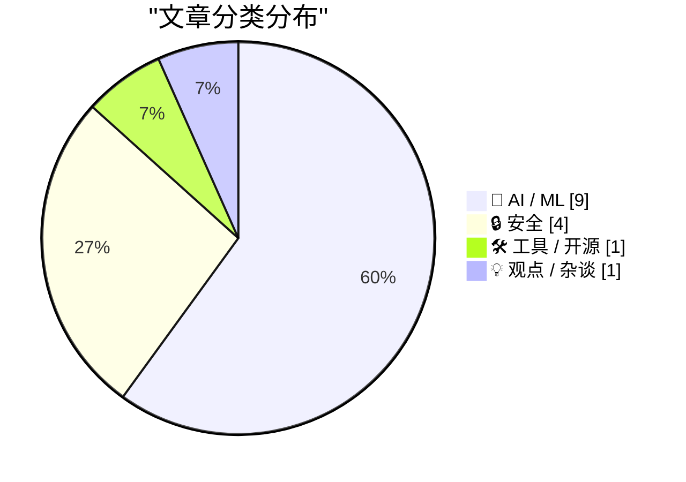
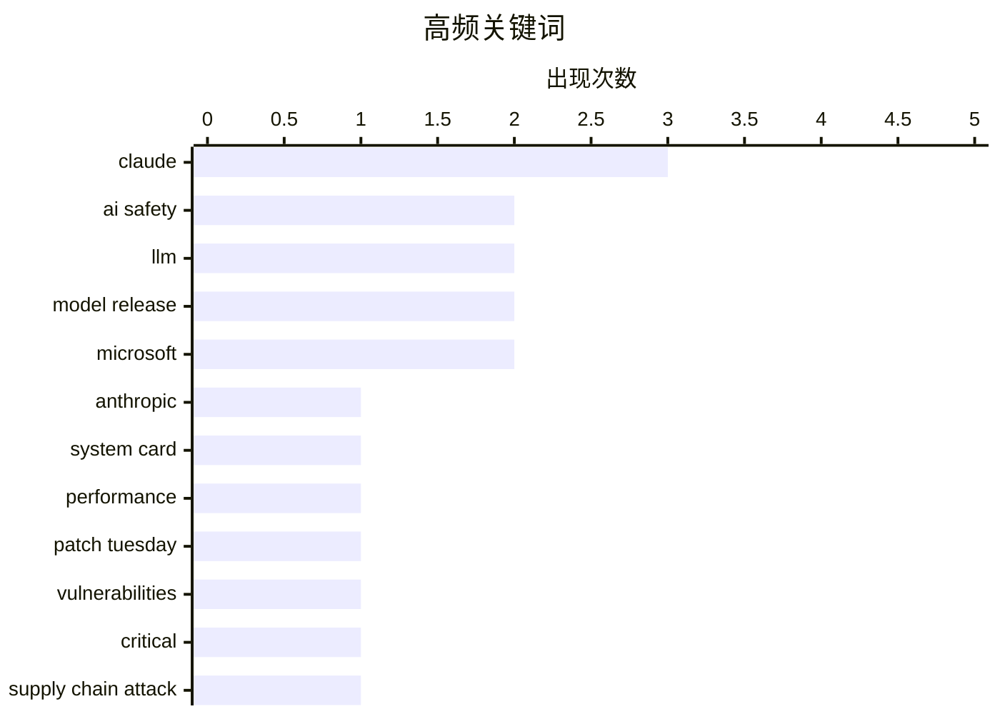

# 📰 AI 资讯每日精选 — 2026-06-10

> 汇聚 140+ 技术博客、X/Twitter、Hacker News、Reddit、Product Hunt、
> Lobste.rs、ClawFeed 日报及 GitHub Trending，经 AI 评分筛选。
>
> **本期内容**：🏆 今日必读 · 🌐 ClawFeed 日报 · 🔥 GitHub Trending · 📂 分类精选 · 🎨 设计与生成式 AI · 📊 数据概览

## 📝 今日看点

今日技术圈的核心焦点集中在AI模型的军备竞赛与安全风险的同步升级上。Anthropic发布的Claude Fable 5在编码和科研领域展现出惊人能力，但高昂的成本与缓慢速度也凸显了前沿模型的现实瓶颈；与此同时，微软开源工具遭黑客攻击、Miasma供应链攻击框架源码泄露等事件，揭示了AI开发者正成为网络攻击的重点目标。此外，苹果因欧盟法规拒绝在欧推出新版Siri，以及OpenAI发布AGI路线图，反映出AI治理与商业落地之间的张力正日益加剧。

---

## 🏆 今日必读

🥇 **Claude Fable 5 发布**

[Claude Fable 5](https://www.anthropic.com/news/claude-fable-5-mythos-5) — Hacker News Best · 8 小时前 · 🤖 AI / ML

> Anthropic 发布了新一代旗舰模型 Claude Fable 5 及其安全变体 Mythos 5。Fable 5 在编码和科学研究任务上取得了重大突破，例如为 Stripe 完成了一项原本需要一个团队两个月才能完成的代码迁移，仅用了一天。Mythos 5 能够自主设计候选药物，但由于其强大的网络攻击能力，目前被限制发布。该模型性能强劲但速度较慢且成本高昂，挑战在于找到它无法完成的任务。

💡 **为什么值得读**: 这是 Anthropic 最新旗舰模型的官方发布信息，展示了 AI 在编码和科学领域的最新能力边界，对于关注前沿 AI 模型进展的读者至关重要。

🏷️ Claude, Anthropic, system card, AI safety

🥈 **Claude Fable 5 的初步印象**

[Initial impressions of Claude Fable 5](https://simonwillison.net/2026/Jun/9/claude-fable-5/#atom-everything) — simonwillison.net · 1 小时前 · 🤖 AI / ML

> 作者在 Claude Fable 5 发布后立即进行了约 5.5 小时的测试，认为该模型是一个“野兽”。它运行缓慢、价格昂贵，但能轻松处理作者抛出的所有任务。与当前前沿模型的情况类似，真正的挑战在于找到它无法完成的任务。

💡 **为什么值得读**: 这是一篇来自知名技术博主的独立、快速上手评测，提供了官方发布之外的真实使用体验和性能感受，有助于判断模型的实际可用性。

🏷️ Claude, LLM, model release, performance

🥉 **2026年6月：创纪录的补丁星期二**

[A Record-Breaking Patch Tuesday for June 2026](https://krebsonsecurity.com/2026/06/a-record-breaking-patch-tuesday-for-june-2026/) — krebsonsecurity.com · 3 小时前 · 🔒 安全

> 微软在2026年6月的“补丁星期二”中发布了近200个安全漏洞的修复程序，创下了单月修复数量的历史记录。其中近36个漏洞被标记为最严重的“严重”级别，并且至少有3个漏洞的利用代码已经公开可用。

💡 **为什么值得读**: 该文章报道了微软有史以来最大规模的月度安全更新，对于所有 Windows 用户和安全从业者来说，这是必须立即关注的紧急安全警报。

🏷️ Patch Tuesday, Microsoft, vulnerabilities, critical

4️⃣ **微软开源工具遭黑客攻击，用于窃取AI开发者密码**

[Microsoft's open source tools were hacked to steal passwords of AI developers](https://techcrunch.com/2026/06/08/microsofts-open-source-tools-were-hacked-to-steal-passwords-of-ai-developers/) — Hacker News Best · 18 小时前 · 🔒 安全

> 微软的开源工具遭到黑客攻击，攻击者利用这些工具窃取人工智能开发者的密码。该事件在 Hacker News 上获得了 526 个点赞和 178 条评论，表明其引发了广泛关注。

💡 **为什么值得读**: 该事件直接威胁到 AI 开发者的账户安全，揭示了供应链攻击的新目标，对于所有使用微软开源工具和参与 AI 开发的团队具有极高的警示价值。

🏷️ Microsoft, supply chain attack, AI developers, password theft

5️⃣ **Anthropic 发布 Claude Fable 5 和 Mythos 5：编码和科学能力大幅提升**

[Anthropic releases Claude Fable 5 and Mythos 5 with major gains in coding and science](https://the-decoder.com/anthropic-releases-claude-fable-5-and-mythos-5-with-major-gains-in-coding-and-science/) — The Decoder · 7 小时前 · 🤖 AI / ML

> Anthropic 发布了 Claude Fable 5 和 Mythos 5 两个新模型，声称其性能远超当前的 Opus 系列，尤其在编码和科研领域。Fable 5 为 Stripe 完成了一项原本需要团队两个月才能完成的代码迁移，仅用了一天。Mythos 5 能自主设计候选药物，但因具备强大的网络攻击能力而被限制发布。

💡 **为什么值得读**: 该文章提供了 Fable 5 和 Mythos 5 在具体商业和科研任务上的量化成果，是了解新模型实际应用价值的绝佳补充材料。

🏷️ Claude, coding, science, model release

---

## 🌐 ClawFeed 日报精选

> 来源：[ClawFeed](https://clawfeed.kevinhe.io) — AI 驱动的多源新闻聚合

# 🗓 ClawFeed Daily | 2026-06-09 (SGT)

> 综合自 5 个 4h digest（ID #626, #627, #628, #629, #630）
> 覆盖时段：SGT 00:00–19:59（20:00–23:59 digest 将于明日 00:00 SGT 产出，本日报暂未含）
> 素材总量：feed 217 + bookmarks 100 + following sample/profiles 200+

---

## 🔥 当日全场最重要 5 条（跨档去重排序）

1. **Xiaomi MiMo-V2.5-Pro-UltraSpeed 推理里程碑**：1T 参数模型首次稳定突破 **1,000+ tokens/s** 输出速度。**注意**：早档（#626/#627/#628）报道与 **TileRT AI** 合作走纯软件 + 调度路线（非 Cerebras 晶圆级集成），但晚档 #630 改为与 **Groq** 合作发布——同一产品两个不同合作版本，需要注意来源差异。无论合作方为何，"国产推理工程拿到全球级里程碑"的信号成立。
   - 主源: https://x.com/XiaomiMiMo/status/2063993790587904362
   - 技术细节（_LuoFuli）: https://x.com/_LuoFuli/status/2060672928367497480

2. **Aaron Levie（Box CEO）的 AI 企业软件 thesis 全天连发**：跨 4 个 4h digest 反复被推。核心论点 3 段：
   - "AI 让软件构建门槛归零 → 但好软件依然难做"——品味、差异化、安全、销售/营销才是真护城河
   - "80% 工作负载将跑在便宜模型上，20% 高端任务用前沿模型"——用例分层将快速到来
   - "对任何足够复杂的问题，AI 没有 context 都是瞎蒙"——**Context 是企业 AI 的真正瓶颈与差异化**
   - 综合源: https://x.com/levie/status/2063756386572681606, https://x.com/levie/status/2064186766907887941

3. **Cline 发布企业级 Spec Driven 工程平台（与 LG CNS 合作）**：跨 3 个 4h digest 标 🔥，专项 agent 团队从 PRD 接收 → 拆解 → 并行执行 → 业务上下文 + 运营标准全打通——coding agent 第一次明确向企业合规 + 大型工程量级跨越。配合 Cline Kanban 独立 app（CLI-agnostic、Claude/Codex 兼容、worktree 隔离），multi-agent 编排开始有完整产品形态。
   - https://x.com/cline/status/2064058014903251036

4. **Anthropic 即将公开发布 Mythos "去敏感化"版本**（#630 独家爆料 @jungeAGI）：非原版，叫法不同，安全防护大幅加固，**刻意移除了向可信合作伙伴开放的网络安全能力**——意味着 Anthropic 在 "开源/公开" vs "企业级 / 政府合作" 两条线分化运营。值得持续追踪。
   - https://x.com/jungeAGI/status/2064304760312955228

5. **Tim Cook 主持最后一届 WWDC 26 + macOS 27 原生 bartender 落地**（#629）：库克时代 = 全球最强现金流机器 vs 乔布斯时代 = 发明未来——市场对苹果继任战略方向的猜测升温。macOS 多年痛点窗口管理终于内置，说明苹果在 WWDC 前夜仍在密集补 UX 细节。
   - https://x.com/OtmAtm/status/2064030716154048734
   - https://x.com/dingyi/status/2064228555127710084

---

## 📰 当日核心主题（聚类视角）

**主题 1：Agentic 工程化转向"harness > model"** — 跨 4 档反复出现
- Harness Engineering：同模型同 benchmark 42% → 78%，唯一变量是 harness（规则 / 工具 / 技能 / 反馈循环）。Boris Cherny（Claude Code 作者）观点 "Self-verification is the real key"——工程化围栏比模型本身更决定成败。
- "我不再 prompt Claude 了，我的工作是写 loops"（@rohit4verse 引 Boris Cherny）— 这是 2026 agentic 工程师角色定义。
- 配合 Cline Kanban、claude-code-sourcemap → open-agent-sdk 逆向，社区围绕 harness 的工程化复刻速度极快。

**主题 2：推理基础设施的"速度战"全面打响**
- Xiaomi MiMo 1T @ 1000tok/s（合作方有 TileRT / Groq 两种说法）
- OpenFang AutoKernel：agent 自写 CUDA kernel，在某些 NVIDIA kernel 上 14x，已被大厂内部采用
- Apple Private Cloud Compute 扩展 + Google Confidential GPU 已上线 — AI 隐私推理硬件竞赛进入硬件阶段
- Google Colab CLI 发布（@osanseviero）— GPU notebook 接入 agent 工具链

**主题 3：企业级 AI 的"context > intelligence"共识**
- Levie 的 context-as-moat thesis（连发 4 档）
- Cline Spec Driven 平台用业务上下文 + 运营标准做 agent 工程化
- Box 新增 Box Drive 挂载，作为企业级内容接入 Claude Cowork / Codex / Obsidian / Cursor 的基础设施

**主题 4：Agent 经济基础设施成型**
- x402 协议 + Injective：机器可读链上微支付，agent 无人工干预完成付款
- Stablecoin neobank 卡消费累计 $9B（RedotPay 65%）
- Manus 支持多 Gmail / Calendar 跨账号 workflow
- Infini 上线 Bill Pay / Quick Transfer / Batch Transfer

**主题 5：消费 / 个人场景的 AI 落地**
- Pika 给 Agent 套实时虚拟形象（替身开会、AI 保姆、情绪稳定陪伴），Skills 库开源
- Kimi Work 桌面版上线（macOS/Windows）：本地 300 个 agent 并行，WebBridge 直接操作浏览器
- Chormex（GPT-Realtime-2）实时音频翻译，YouTube / 直播 / 会议全场景覆盖

---

## 🔖 累计 Bookmark 精选

跨档高频出现，建议优先消化：

- **@chenchengpro / @heynavtoor — Harness Engineering**（42% → 78% 核心证据）: https://x.com/chenchengpro/status/2037332209003282747
- **@cline — Cline Kanban 多 agent 编排独立 app**（CLI-agnostic, Claude/Codex 兼容, worktree 隔离）: https://x.com/cline/status/2037182739695493399
- **@openfangg — OpenFang AutoKernel**（agent 自写 CUDA kernel, 14x 性能）: https://x.com/Akashi203/status/2064021398364770483
- **@_LuoFuli — MiMo-V2.5 Hybrid SWA 架构详解**（推理优化技术博客）: https://x.com/_LuoFuli/status/2060672928367497480
- **@levie — 模型用例分层观点**（Brian Armstrong 80/20 论被 Levie 认同）: https://x.com/levie/status/2063835799096090749
- **@gdb / @arrakis_ai — GPT-Realtime-2 实时音频翻译**（Greg Brockman 罕见转推）: https://x.com/gdb/status/2053134883040514350
- **@yangyi — Google Stitch DESIGN.md**（一个 markdown 教会 AI Coding Agent 整个设计系统）: https://x.com/yangyi/status/2040272305277079728
- **@idoubicc — claude-code-sourcemap 逆向出 open-agent-sdk**（社区 harness 复刻速度）: https://x.com/idoubicc/status/2039006326882546141
- **@DoveyWanCN — harness 架构泄漏的企业级影响判断**: https://x.com/DoveyWanCN/status/2038997433586425956
- **@turingou — wanman.ai 一人公司操作系统第 14 弹**: https://x.com/turingou/status/2047860898560373246

---

## 👀 推荐关注汇总（跨档去重）

**今日多次出现（强信号）：**
- **@_LuoFuli** (Fuli Luo, Xiaomi MiMo) — 推荐 4 次。前 DeepSeek，现 MiMo 推理优化核心，1T@1000tok/s 背后的技术负责人，67K follower。https://x.com/_LuoFuli
- **@sainingxie** (Saining Xie, AMI Labs) — 推荐 2 次。NYU/Google DeepMind 出身，与 Yann LeCun 共同创办 AMI Labs（融资 $1.03B），Physical AI/世界模型领域。https://x.com/sainingxie
- **@kalinowski007** (Caitlin Kalinowski) — 推荐 2 次。前 Apple MacBook/Mac Pro 负责人 → Meta AR 眼镜负责人 → 现 physical AI，38.8K follower 低频高质。https://x.com/kalinowski007
- **@istdrc** (stdrc) — 推荐 2 次。前 Kimi CLI 作者，现独立 build Slock，中文 AI infra 圈高质量 founder 视角。https://x.com/istdrc

**今日新增（首次推荐）：**
- **@jungeAGI** (俊哥AI) — 前字节跳动，持续追踪 Anthropic/OpenAI 内部动态（今日独家 Mythos 公开版爆料），OpenClaw 多 agent 实践。https://x.com/jungeAGI
- **@openfangg** — Rust + WASM agent OS，YC F26，AutoKernel → inference 持续高质量 agent infra 输出，6.7K follower 仍在早期。https://x.com/openfangg
- **@aibuilderclub_** — Claude Code/Opus 长任务实战，benchmark 支撑，agent 工程化实操参考。https://x.com/aibuilderclub_
- **@AmandaAskell** (Amanda Askell, Anthropic) — Anthropic 哲学家/伦理研究员，Claude 角色设计者。https://x.com/AmandaAskell
- **@osanseviero** (Omar Sanseviero, Hugging Face) — ML infra 工具链整合趋势跟踪。https://x.com/osanseviero
- **@pierceboggan** (Pierce Boggan, GitHub) — GitHub Copilot App PM，Copilot agentic 转型内部信息。https://x.com/pierceboggan

提醒：上述推荐**未通过浏览器逐一核实是否已关注**——Kevin 操作前请先在 Following 里搜一下避免重复加关注。

---

## 🧹 建议取关

- **@HeXiaobo (David.He)** — 跨 3 档（#626 / #629 / #630）均独立识别为僵尸号：最近推文停留在 2017-2018 年，超过 6 个月+完全不活跃，511 follower，无领域相关内容。强烈建议取关。

其余 followingSample 账号本日所有抽样均活跃且领域相关，无其他取关建议。

---

## 💤 当日重复噪音模式（不是单条吐槽）

以下噪音在全部 5 档都被过滤，呈结构化模式，建议平台/客户端层面长期屏蔽：

1. **加密 meme / shitcoin 拉盘群**：@elonmusk 政治、@memekiller365、@Kathydotxyz、@Sophia_WebX、@x_The_Farmrrr_x、@jetsetJ3、@ApeishGreg、@maccurated、@7777chu 等 — meme coin / PFP NFT 吹捧帖横跨整天，单条价值低但量大
2. **印尼 / 越南散户互动帖**：@itsamarl、@unklebenss、@Naty_lobacz、@DareTunbosun — 投机咨询 / follow-for-follow 流量帖
3. **博彩广告**：@DiceyHQ、@star_okx (World Cup) — 持续广告投放，全档过滤
4. **加密项目软文**：@ShirleyBitget、@ssovoovo (dappOS)、@stark_nico99、@_FORAB、@SolvProtocol 等 — 项目方常规公告 / 推广帖
5. **私信营销 / 蓝V 引流**：@aiduduba、@yingbinance（币安广场推广）、@0xborder、@sevdaloji（follow-for-follow）— 整天高频低质
6. **加密社区互撕 / 私生活风波**：@AlanSunJet / @BTCyuanying 系列、@Topuriailia（格斗明星私生活）— 非领域相关情绪内容
7. **生活随笔 / 护肤品推广 / 无文字推文**：@thewisementor（retinol 帖）、shopping 帖、纯图片无文字内容 — 信号噪声比极低

噪音总体趋势：crypto / meme coin / 流量互推三大类占绝对多数，建议客户端层面通过关键词 + 账号黑名单做半自动过滤。

---

*本日报由 Lisa（Zylos）于 2026-06-09 23:59 SGT 生成。来源：5 个 4h digest（#626–#630）。注：20:00–23:59 SGT 时段的 4h digest 将于次日 00:00 SGT 产出，未纳入本日报。*
---

## 🔥 GitHub Trending

> 今日热门开源项目（全语言 + Python）

| # | 项目 | 描述 | ⭐ 总星 | 📈 今日 | 语言 |
|---|------|------|---------|---------|------|
| 1 | [mvanhorn/last30days-skill](https://github.com/mvanhorn/last30days-skill) 🤖 | AI agent skill that researches any topic across Reddit, X... | 37.4k | +3191 | Python |
| 2 | [RyanCodrai/turbovec](https://github.com/RyanCodrai/turbovec) | A vector index built on TurboQuant, written in Rust with ... | 10.2k | +1801 | Python |
| 3 | [Panniantong/Agent-Reach](https://github.com/Panniantong/Agent-Reach) 🤖 | Give your AI agent eyes to see the entire internet. Read ... | 25.6k | +1560 | Python |
| 4 | [santifer/career-ops](https://github.com/santifer/career-ops) 🤖 | AI-powered job search system built on Claude Code. 14 ski... | 51.7k | +1110 | JavaScript |
| 5 | [refactoringhq/tolaria](https://github.com/refactoringhq/tolaria) | Desktop app to manage markdown knowledge bases | 14.4k | +829 | TypeScript |
| 6 | [phuryn/pm-skills](https://github.com/phuryn/pm-skills) | PM Skills Marketplace: 100+ agentic skills, commands, and... | 13.5k | +806 | - |
| 7 | [roboflow/supervision](https://github.com/roboflow/supervision) 🤖 | We write your reusable computer vision tools. 💜 | 43.0k | +733 | Python |
| 8 | [google/skills](https://github.com/google/skills) 🤖 | Agent Skills for Google products and technologies | 12.9k | +680 | Python |
| 9 | [Andyyyy64/whichllm](https://github.com/Andyyyy64/whichllm) 🤖 | Find the local LLM that actually runs and performs best o... | 4.1k | +633 | Python |
| 10 | [TapXWorld/ChinaTextbook](https://github.com/TapXWorld/ChinaTextbook) | 所有小初高、大学PDF教材。 | 73.5k | +519 | Roff |
| 11 | [aaif-goose/goose](https://github.com/aaif-goose/goose) 🤖 | an open source, extensible AI agent that goes beyond code... | 48.5k | +489 | Rust |
| 12 | [addyosmani/agent-skills](https://github.com/addyosmani/agent-skills) 🤖 | Production-grade engineering skills for AI coding agents. | 49.8k | +443 | Shell |
| 13 | [MemPalace/mempalace](https://github.com/MemPalace/mempalace) 🤖 | The best-benchmarked open-source AI memory system. And it... | 55.2k | +404 | Python |
| 14 | [yikart/AiToEarn](https://github.com/yikart/AiToEarn) 🤖 | Let's use AI to Earn! | 20.0k | +402 | TypeScript |
| 15 | [openai/plugins](https://github.com/openai/plugins) 🤖 | OpenAI Plugins | 2.6k | +284 | JavaScript |

---

## 🤖 AI / ML

### 1. Claude Fable 5 发布

[Claude Fable 5](https://www.anthropic.com/news/claude-fable-5-mythos-5) — **Hacker News Best** · 8 小时前 · ⭐ 29/30

> Anthropic 发布了新一代旗舰模型 Claude Fable 5 及其安全变体 Mythos 5。Fable 5 在编码和科学研究任务上取得了重大突破，例如为 Stripe 完成了一项原本需要一个团队两个月才能完成的代码迁移，仅用了一天。Mythos 5 能够自主设计候选药物，但由于其强大的网络攻击能力，目前被限制发布。该模型性能强劲但速度较慢且成本高昂，挑战在于找到它无法完成的任务。

🏷️ Claude, Anthropic, system card, AI safety

---

### 2. Claude Fable 5 的初步印象

[Initial impressions of Claude Fable 5](https://simonwillison.net/2026/Jun/9/claude-fable-5/#atom-everything) — **simonwillison.net** · 1 小时前 · ⭐ 27/30

> 作者在 Claude Fable 5 发布后立即进行了约 5.5 小时的测试，认为该模型是一个“野兽”。它运行缓慢、价格昂贵，但能轻松处理作者抛出的所有任务。与当前前沿模型的情况类似，真正的挑战在于找到它无法完成的任务。

🏷️ Claude, LLM, model release, performance

---

### 3. Anthropic 发布 Claude Fable 5 和 Mythos 5：编码和科学能力大幅提升

[Anthropic releases Claude Fable 5 and Mythos 5 with major gains in coding and science](https://the-decoder.com/anthropic-releases-claude-fable-5-and-mythos-5-with-major-gains-in-coding-and-science/) — **The Decoder** · 7 小时前 · ⭐ 26/30

> Anthropic 发布了 Claude Fable 5 和 Mythos 5 两个新模型，声称其性能远超当前的 Opus 系列，尤其在编码和科研领域。Fable 5 为 Stripe 完成了一项原本需要团队两个月才能完成的代码迁移，仅用了一天。Mythos 5 能自主设计候选药物，但因具备强大的网络攻击能力而被限制发布。

🏷️ Claude, coding, science, model release

---

### 4. 苹果在欧盟豁免请求被拒后，决定不在欧盟推出Siri

[Apple decided not to roll out Siri in EU after denied request for exemption](https://www.reuters.com/business/apple-failed-make-its-ai-tool-comply-eu-regulations-eu-commission-says-2026-06-09/) — **Hacker News Best** · 9 小时前 · ⭐ 26/30

> 由于未能使其 AI 工具符合欧盟法规，且其豁免请求被欧盟委员会拒绝，苹果决定不在欧盟地区推出新版 Siri。该事件在 Hacker News 上获得了 352 个点赞和 583 条评论，引发了关于 AI 监管和科技巨头合规策略的激烈讨论。

🏷️ Apple, Siri, EU regulation, AI compliance

---

### 5. ICML论文：可预测的幻觉（信息预算弃权门）及开源实现 ntkMirror

[Our ICML paper on predictable hallucination (information-budget abstention gate), + ntkMirror: a training-free open-weight implementation we're releasing today](https://www.reddit.com/r/LocalLLaMA/comments/1u19vn2/our_icml_paper_on_predictable_hallucination/) — **r/LocalLLaMA** · 9 小时前 · ⭐ 26/30

> 一篇被 ICML 2026 接收的论文提出，在基于证据的问答任务中，输入证据的顺序会影响模型的回答概率（排列分散性）。作者将顺序视为干扰变量，并提出了一种“信息预算弃权门”方法来预测和缓解这种由顺序导致的幻觉。同时，他们发布了名为 ntkMirror 的训练无关的开源实现。

🏷️ hallucination, ICML, information-budget, open-weight

---

### 6. 仅用约3美元API调用和零人工标注，微调 Qwen2.5-7B 达到 Claude Haiku 96% 的领域任务性能

[Fine-tuned Qwen2.5-7B to 96% of Claude Haiku on a domain-specific task using ~$3 of API calls and zero human labelers](https://www.reddit.com/r/LocalLLaMA/comments/1u1m8bd/finetuned_qwen257b_to_96_of_claude_haiku_on_a/) — **r/LocalLLaMA** · 1 小时前 · ⭐ 26/30

> 作者通过仅花费约3美元的 API 调用费用，且完全不需要人工标注数据，成功微调了 Qwen2.5-7B 模型，使其在特定领域任务上的性能达到了 Claude Haiku 的 96%。

🏷️ fine-tuning, Qwen, Claude-Haiku, cost-effective

---

### 7. OpenAI 发布构建 AGI 的计划

[Open AI just published their plan towards building AGI](https://www.reddit.com/r/singularity/comments/1u17n2q/open_ai_just_published_their_plan_towards/) — **r/singularity** · 10 小时前 · ⭐ 26/30

> OpenAI 发布了一份官方计划，阐述了其构建通用人工智能（AGI）的路线图。该计划在 r/singularity 社区引发了广泛讨论。

🏷️ OpenAI, AGI, plan, roadmap

---

### 8. Gemini 3.5 Live Translate：实现流畅自然的语音实时翻译

[Fluid, natural voice translation with Gemini 3.5 Live Translate](https://deepmind.google/blog/fluid-natural-voice-translation-with-gemini-35-live-translate/) — **Google DeepMind Blog** · 10 小时前 · ⭐ 25/30

> Google DeepMind推出Gemini 3.5 Live Translate，为Google AI Studio、Google翻译和Google Meet提供接近实时的自然语音翻译能力。该技术突破了传统机器翻译的机械感，能够生成流畅、自然的语音输出，并支持多语言间的实时对话。这一进展将显著提升跨语言沟通效率，尤其适用于视频会议和即时翻译场景。

🏷️ Gemini, voice translation, real-time, multimodal

---

### 9. AI认知风险：新兴机制与证据

[AI Epistemic Risks: Emerging Mechanisms & Evidence [R]](https://www.reddit.com/r/MachineLearning/comments/1u1ew6q/ai_epistemic_risks_emerging_mechanisms_evidence_r/) — **r/MachineLearning** · 6 小时前 · ⭐ 25/30

> 一篇由30位专家合著的新论文系统梳理了AI对人类认知能力的威胁，即“认知风险”（epistemic risks）。论文识别出AI通过说服与操纵、信息污染、认知依赖等机制损害人类准确形成信念、理性判断和维持健康信息环境的能力。研究指出，AI系统在个性化推荐和对话交互中展现出极强的说服力，可能系统性削弱用户的独立思考和判断能力。结论认为，这些风险已从理论走向现实，需要建立新的治理框架来保护人类认知自主权。

🏷️ epistemic risk, AI safety, misinformation, research

---

## 🔒 安全

### 10. 2026年6月：创纪录的补丁星期二

[A Record-Breaking Patch Tuesday for June 2026](https://krebsonsecurity.com/2026/06/a-record-breaking-patch-tuesday-for-june-2026/) — **krebsonsecurity.com** · 3 小时前 · ⭐ 27/30

> 微软在2026年6月的“补丁星期二”中发布了近200个安全漏洞的修复程序，创下了单月修复数量的历史记录。其中近36个漏洞被标记为最严重的“严重”级别，并且至少有3个漏洞的利用代码已经公开可用。

🏷️ Patch Tuesday, Microsoft, vulnerabilities, critical

---

### 11. 微软开源工具遭黑客攻击，用于窃取AI开发者密码

[Microsoft's open source tools were hacked to steal passwords of AI developers](https://techcrunch.com/2026/06/08/microsofts-open-source-tools-were-hacked-to-steal-passwords-of-ai-developers/) — **Hacker News Best** · 18 小时前 · ⭐ 27/30

> 微软的开源工具遭到黑客攻击，攻击者利用这些工具窃取人工智能开发者的密码。该事件在 Hacker News 上获得了 526 个点赞和 178 条评论，表明其引发了广泛关注。

🏷️ Microsoft, supply chain attack, AI developers, password theft

---

### 12. Miasma 供应链攻击工具包源代码在 GitHub 上泄露

[someone actually leaked the Miasma supply chain attack toolkit source code on github](https://www.reddit.com/r/programming/comments/1u1512l/someone_actually_leaked_the_miasma_supply_chain/) — **r/programming** · 12 小时前 · ⭐ 26/30

> 有人通过被入侵的开发者账户，在 GitHub 上泄露了名为“Miasma”的供应链攻击工具包的完整源代码。该工具包并非简单的蠕虫，而是一个完整的供应链攻击框架，包含架构文档和集成测试，设计上甚至不需要命令与控制（C2）服务器。

🏷️ supply chain, malware, GitHub, Miasma

---

### 13. 德国里程碑式裁决：谷歌AI概览被视为谷歌自身言论，需为错误答案承担责任

[Landmark German ruling declares Google's AI Overviews are Google's own words and makes it liable for false answers](https://the-decoder.com/landmark-german-ruling-declares-googles-ai-overviews-are-googles-own-words-and-makes-it-liable-for-false-answers/) — **The Decoder** · 9 小时前 · ⭐ 25/30

> 德国一家地区法院裁定，谷歌需为其AI搜索概览（AI Overviews）生成的内容承担直接责任，不能像传统搜索结果那样享受有限责任保护。该案中，谷歌的AI错误地将两家出版商与欺诈行为关联，并生成了在链接来源中不存在的虚假陈述。法院认为，搜索引擎运营商此前享有的责任豁免不适用于AI生成内容。这一裁决可能为全球AI生成内容的责任认定开创先例，迫使科技公司对其AI输出内容承担更高法律风险。

🏷️ AI liability, Google, legal ruling, search overviews

---

## 🛠 工具 / 开源

### 14. Phinite：首个支持一等公民身份、可组合技能和行为评估的多智能体操作系统

[Phinite — multi-agent OS with first-class agent identity, composable skills, behavioral evaluation [P]](https://www.reddit.com/r/MachineLearning/comments/1u1jqmf/phinite_multiagent_os_with_firstclass_agent/) — **r/MachineLearning** · 3 小时前 · ⭐ 25/30

> Phinite是一个面向多智能体系统的开源基础设施层，解决了当前智能体系统缺乏身份管理、行为评估和技能组合等核心问题。它提供了类似微服务架构中的服务网格和IAM机制，为每个智能体分配唯一ID、版本、所有者和技能图谱。同时，Phinite引入了行为评估框架，替代传统的函数测试，能够对智能体的非确定性行为进行系统化评测。该项目已开源，旨在成为多智能体系统的标准操作系统层。

🏷️ multi-agent, OS, agent identity, infrastructure

---

## 💡 观点 / 杂谈

### 15. 开源大语言模型是否已达到“足够好”的水平？

[Have we reached the point where open-source LLMs are “just good enough”?](https://www.reddit.com/r/LocalLLaMA/comments/1u0yo32/have_we_reached_the_point_where_opensource_llms/) — **r/LocalLLaMA** · 17 小时前 · ⭐ 25/30

> 社区讨论聚焦于开源LLM是否已能满足95%的日常需求，并质疑闭源模型剩余5%的性能提升是否值得额外成本。讨论指出，在回答质量、自动化流程稳定性等维度上，开源模型与闭源模型的差距正在缩小，但闭源模型在复杂推理和长尾任务上仍有优势。参与者普遍认为，对于大多数应用场景，开源模型已“足够好”，而闭源模型的溢价更多体现在特定高价值场景和更低的运维成本上。结论是，选择开源还是闭源应基于具体业务需求，而非单纯追求性能指标。

🏷️ open-source, LLM, quality, adoption

---

## 🎨 Design & Generative AI

### 🖼️ 生成式图片

- **[面部相似度门控：按参考匹配度筛选生成结果](https://www.reddit.com/r/comfyui/comments/1u160r3/face_likeness_gate_split_generations_into/)** — r/comfyui · 11 小时前
  > 通过面部相似度阈值自动分类生成图像为接受或拒绝。

- **[NAVA FP8 ComfyUI 封装器发布](https://www.reddit.com/r/StableDiffusion/comments/1u1cw2k/nava_fp8_comfyui/)** — r/StableDiffusion · 7 小时前
  > 百度NAVA模型通过FP8封装器在ComfyUI中实现推理支持。

- **[Ideogram GGUF 在 ComfyUI 中运行（8GB显存可用）](https://www.reddit.com/r/StableDiffusion/comments/1u1i5pd/ideogram_gguf_in_comfyui_works_with_8gb_vram/)** — r/StableDiffusion · 4 小时前
  > Ideogram模型通过GGUF量化在ComfyUI中实现低显存推理。

- **[Ideogram 4.0 写实引擎 LoRA（测试版）](https://www.reddit.com/r/StableDiffusion/comments/1u1cah3/ideogram_40_realism_engine_lora_beta/)** — r/StableDiffusion · 7 小时前
  > 新LoRA模型改进Ideogram 4.0在解剖学细节上的生成准确性。

- **[Ideogram：无需JSON，自然语言即可提示](https://www.reddit.com/r/StableDiffusion/comments/1u1bi1v/ideogram_json_is_not_necessary/)** — r/StableDiffusion · 8 小时前
  > Ideogram模型接受详细自然语言提示，无需JSON格式即可生成。

- **[ComfyUI XY图与查找替换节点教程](https://www.reddit.com/r/comfyui/comments/1u17qjn/comfyui_xy_plot_findreplace_nodes_github/)** — r/comfyui · 10 小时前
  > 介绍ComfyUI中XY图节点和查找替换节点的使用方法。

- **[Ideogram I2T2I 图像到文本到图像工作流](https://www.reddit.com/r/StableDiffusion/comments/1u1fkb8/ideogram_i2t2i_working/)** — r/StableDiffusion · 5 小时前
  > 通过图像生成超详细提示，再融合创意生成新图像。

- **[ComfyUI 一致角色生成与姿态控制最佳工作流](https://www.reddit.com/r/comfyui/comments/1u19wg6/whats_the_best_workflow_for_consistent_character/)** — r/comfyui · 9 小时前
  > 探讨在ComfyUI中保持角色一致性的多姿态生成方法。

- **[绕过Ideogram 4泳装安全过滤器的技巧](https://www.reddit.com/r/StableDiffusion/comments/1u11mrd/how_to_bypass_ideogram_4s_image_blocked_by_safety/)** — r/StableDiffusion · 14 小时前
  > 通过理解过滤器机制，在泳装场景中规避Ideogram 4的安全拦截。

- **[ComfyUI 在建筑可视化中的应用](https://www.reddit.com/r/comfyui/comments/1u13ayk/confyui_in_architectural_visualization/)** — r/comfyui · 13 小时前
  > 展示建筑师使用ComfyUI进行建筑可视化的工作坊成果。

- **[Ideogram 4 控制能力出色](https://www.reddit.com/r/StableDiffusion/comments/1u10wi3/ideogram_4_control_is_so_good/)** — r/StableDiffusion · 15 小时前
  > Ideogram 4在图像生成控制方面表现优异。

### 🎬 生成式视频

- **[LTX 2.3 电影制作第二部：FFLF技术与种子搜索](https://www.reddit.com/r/comfyui/comments/1u1i3kj/ltx_23_filmmaking_part_2_fflf_techniques_and_the/)** — r/comfyui · 4 小时前
  > 利用FFLF技术和种子搜索策略优化LTX 2.3模型视频生成效果。

- **[虚拟无人机航拍：360全景图与LTX 2.3插值](https://www.reddit.com/r/comfyui/comments/1u1bmf5/virtual_drone_footage_using_equirectangular_360/)** — r/comfyui · 8 小时前
  > 利用360度全景图和LTX 2.3模型生成虚拟无人机视频。

- **[Wan 2.2：Bernini 实现 Wan Animate 的期待](https://www.reddit.com/r/StableDiffusion/comments/1u0xnja/wan_22_bernini_is_what_we_had_hope_for_with_wan/)** — r/StableDiffusion · 18 小时前
  > Wan 2.2模型在动画生成方面达到预期效果。

- **[动画迭代为何结果完全相同？](https://www.reddit.com/r/midjourney/comments/1u1nqzd/why_do_my_animation_iterations_look_exactly_the/)** — r/midjourney · 31 分钟前
  > 分析Midjourney中动画批次生成结果高度相似的原因。

---

## 📊 数据概览

| 扫描源 | 抓取文章 | 时间范围 | 精选 |
|:---:|:---:|:---:|:---:|
| 115/140 | 5365 篇 → 217 篇 | 24h | **15 篇** |

### 分类分布



### 高频关键词



<details>
<summary>📈 纯文本关键词图（终端友好）</summary>

```
claude          │ ████████████████████ 3
ai safety       │ █████████████░░░░░░░ 2
llm             │ █████████████░░░░░░░ 2
model release   │ █████████████░░░░░░░ 2
microsoft       │ █████████████░░░░░░░ 2
anthropic       │ ███████░░░░░░░░░░░░░ 1
system card     │ ███████░░░░░░░░░░░░░ 1
performance     │ ███████░░░░░░░░░░░░░ 1
patch tuesday   │ ███████░░░░░░░░░░░░░ 1
vulnerabilities │ ███████░░░░░░░░░░░░░ 1
```

</details>

### 🏷️ 话题标签

**claude**(3) · **ai safety**(2) · **llm**(2) · model release(2) · microsoft(2) · anthropic(1) · system card(1) · performance(1) · patch tuesday(1) · vulnerabilities(1) · critical(1) · supply chain attack(1) · ai developers(1) · password theft(1) · coding(1) · science(1) · apple(1) · siri(1) · eu regulation(1) · ai compliance(1)

---

*生成于 2026-06-10 01:42 | 汇聚 140 个技术博客、X/Twitter、Hacker News、Reddit、Product Hunt、Lobste.rs、ClawFeed 日报及 GitHub Trending，经 AI 评分筛选出 Top 15 精华内容*
