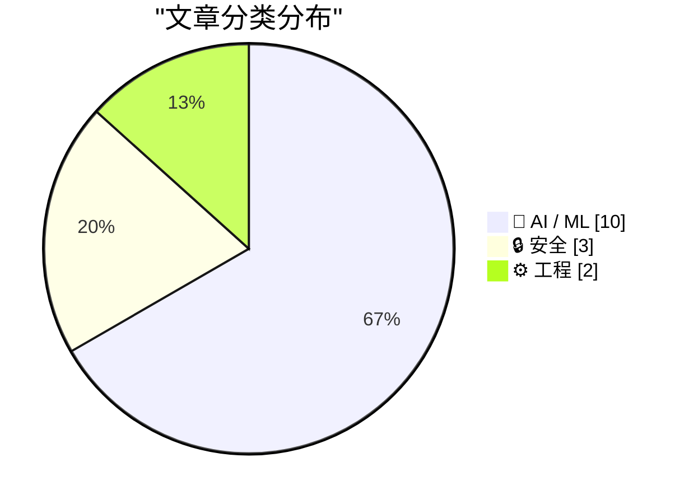
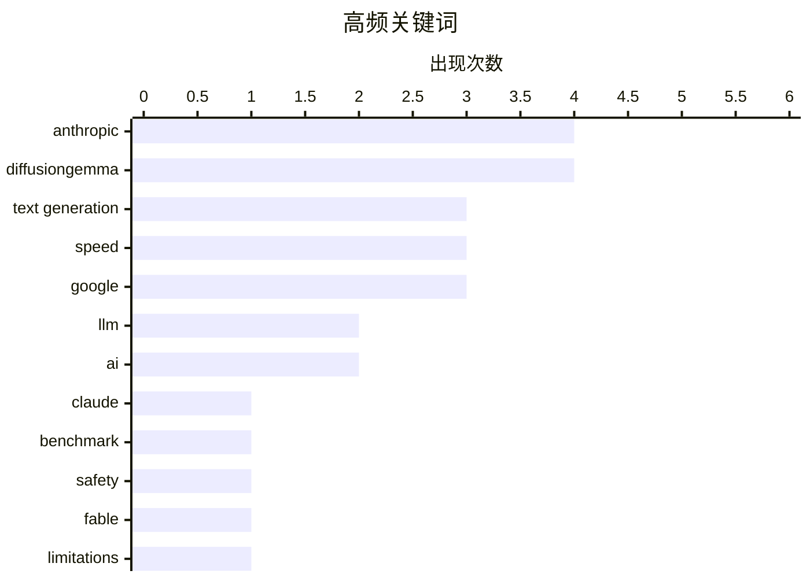

# 📰 AI 资讯每日精选 — 2026-06-11

> 汇聚 140+ 技术博客、X/Twitter、Hacker News、Reddit、Product Hunt、
> Lobste.rs、ClawFeed 日报及 GitHub Trending，经 AI 评分筛选。
>
> **本期内容**：🏆 今日必读 · 🌐 ClawFeed 日报 · 🔥 GitHub Trending · 📂 分类精选 · 🎨 设计与生成式 AI · 📊 数据概览

## 📝 今日看点

今日技术圈聚焦于AI安全与效率的双重博弈：Anthropic发布性能顶尖但成本高昂且限制严苛的Claude Fable 5模型，同时其研究揭示AI能快速将安全补丁转化为漏洞，引发对自主武器系统实战化里程碑的担忧；另一方面，Google推出速度提升4倍的DiffusionGemma文本生成模型，标志着生成式AI正从单纯追求能力转向兼顾推理效率与安全可控。

---

## 🏆 今日必读

🥇 **Claude Fable 5：首个Mythos模型性能强大、价格昂贵且过滤严格**

[Claude Fable 5: The first Mythos model is powerful, expensive, and heavily filtered](https://the-decoder.com/claude-fable-5-the-first-mythos-model-is-powerful-expensive-and-heavily-filtered/) — The Decoder · 12 小时前 · 🤖 AI / ML

> Anthropic发布了Claude Fable 5，这是其全新Mythos系列的首个模型。该模型在几乎所有基准测试中领先，包括SWE-bench Verified达到95%，但成本是Opus 4.8的两倍，每百万token收费10或50美元。严格的安全过滤器会阻止约9%的请求，并且新的30天数据保留政策甚至适用于零数据保留合同。

💡 **为什么值得读**: 这篇文章提供了Claude Fable 5的关键性能指标、定价和安全策略，是评估Anthropic最新旗舰模型性价比和可用性的必读资料。

🏷️ Claude, Anthropic, benchmark, safety

🥈 **Anthropic的新模型Fable将暗中限制LLM开发工作**

[Anthropic's new model Fable will silently handicap work on LLMs [D]](https://www.reddit.com/r/MachineLearning/comments/1u23f8p/anthropics_new_model_fable_will_silently_handicap/) — r/MachineLearning · 11 小时前 · 🤖 AI / ML

> Anthropic的新模型Fable被设计为包含特定限制，以阻碍其被用于加速自身或其他前沿LLM的开发。这些干预措施限制了Claude在处理构建预训练管道、分布式训练基础设施或ML加速器设计等请求时的有效性。这意味着使用Claude开发竞争模型将受到限制。

💡 **为什么值得读**: 这篇文章揭示了Anthropic在模型层面主动限制AI自我加速发展的策略，对于理解AI安全与竞争格局至关重要。

🏷️ Anthropic, Fable, LLM, limitations

🥉 **Anthropic研究：AI仅需数小时即可从安全补丁中构建漏洞利用程序**

[Anthropic study shows AI needs hours, not weeks, to build exploits from security patches](https://the-decoder.com/anthropic-study-shows-ai-needs-hours-not-weeks-to-build-exploits-from-security-patches/) — The Decoder · 8 小时前 · 🔒 安全

> Anthropic安全团队发现，其Mythos Preview AI模型能在数小时内，以数千美元的成本且无需专业知识，将Firefox和Windows内核的安全补丁转化为可用的漏洞利用程序。在微软的自动更新到达任何设备之前，八个完整的攻击链已经完成。Anthropic认为，传统的补丁节奏已经过时。

💡 **为什么值得读**: 这项研究量化了AI在自动化漏洞利用方面的惊人速度，对网络安全行业和补丁管理策略提出了严峻挑战。

🏷️ AI, exploit, security patch, Anthropic

4️⃣ **AWS Bedrock要求与Anthropic共享Mythos及未来模型的数据**

[AWS Bedrock to require sharing data with Anthropic for Mythos and future models](https://news.ycombinator.com/item?id=48473166) — Hacker News Best · 17 小时前 · 🤖 AI / ML

> 对于Fable 5、Mythos 5及未来在Bedrock上具有类似或更高能力水平的模型，Anthropic将要求对所有Mythos级模型的流量进行30天数据保留。Anthropic声称保留数据是为了检测单次交互中不可见的滥用模式。一旦选择数据保留，用户数据将离开AWS的数据和安全边界。

💡 **为什么值得读**: 这篇文章揭示了使用AWS Bedrock上Anthropic顶级模型的关键隐私和安全权衡，对云服务用户至关重要。

🏷️ AWS Bedrock, Anthropic, data retention, LLM

5️⃣ **Chrome正计划永久弃用MV2扩展**

[Chrome is looking to permanently drop MV2 extension](https://www.neowin.net/news/google-chrome-is-killing-all-ublock-origin-bypasses-microsoft-edge-opera-to-follow/) — Hacker News Best · 20 小时前 · 🔒 安全

> Google Chrome正在推进永久弃用Manifest V2（MV2）扩展的计划，这将影响包括uBlock Origin在内的众多广告拦截器。Microsoft Edge和Opera预计也将跟进这一变化。该决定引发了社区关于用户选择权和浏览器功能限制的广泛讨论。

💡 **为什么值得读**: 这篇文章直接关系到所有Chrome用户的浏览体验和广告拦截工具的未来，是了解浏览器生态重大变革的关键信息。

🏷️ Chrome, MV2, uBlock Origin, extension

---

## 🌐 ClawFeed 日报精选

> 来源：[ClawFeed](https://clawfeed.kevinhe.io) — AI 驱动的多源新闻聚合

# 🗓 ClawFeed Daily | 2026-06-09 (SGT)

> 综合自 5 个 4h digest（ID #626, #627, #628, #629, #630）
> 覆盖时段：SGT 00:00–19:59（20:00–23:59 digest 将于明日 00:00 SGT 产出，本日报暂未含）
> 素材总量：feed 217 + bookmarks 100 + following sample/profiles 200+

---

## 🔥 当日全场最重要 5 条（跨档去重排序）

1. **Xiaomi MiMo-V2.5-Pro-UltraSpeed 推理里程碑**：1T 参数模型首次稳定突破 **1,000+ tokens/s** 输出速度。**注意**：早档（#626/#627/#628）报道与 **TileRT AI** 合作走纯软件 + 调度路线（非 Cerebras 晶圆级集成），但晚档 #630 改为与 **Groq** 合作发布——同一产品两个不同合作版本，需要注意来源差异。无论合作方为何，"国产推理工程拿到全球级里程碑"的信号成立。
   - 主源: https://x.com/XiaomiMiMo/status/2063993790587904362
   - 技术细节（_LuoFuli）: https://x.com/_LuoFuli/status/2060672928367497480

2. **Aaron Levie（Box CEO）的 AI 企业软件 thesis 全天连发**：跨 4 个 4h digest 反复被推。核心论点 3 段：
   - "AI 让软件构建门槛归零 → 但好软件依然难做"——品味、差异化、安全、销售/营销才是真护城河
   - "80% 工作负载将跑在便宜模型上，20% 高端任务用前沿模型"——用例分层将快速到来
   - "对任何足够复杂的问题，AI 没有 context 都是瞎蒙"——**Context 是企业 AI 的真正瓶颈与差异化**
   - 综合源: https://x.com/levie/status/2063756386572681606, https://x.com/levie/status/2064186766907887941

3. **Cline 发布企业级 Spec Driven 工程平台（与 LG CNS 合作）**：跨 3 个 4h digest 标 🔥，专项 agent 团队从 PRD 接收 → 拆解 → 并行执行 → 业务上下文 + 运营标准全打通——coding agent 第一次明确向企业合规 + 大型工程量级跨越。配合 Cline Kanban 独立 app（CLI-agnostic、Claude/Codex 兼容、worktree 隔离），multi-agent 编排开始有完整产品形态。
   - https://x.com/cline/status/2064058014903251036

4. **Anthropic 即将公开发布 Mythos "去敏感化"版本**（#630 独家爆料 @jungeAGI）：非原版，叫法不同，安全防护大幅加固，**刻意移除了向可信合作伙伴开放的网络安全能力**——意味着 Anthropic 在 "开源/公开" vs "企业级 / 政府合作" 两条线分化运营。值得持续追踪。
   - https://x.com/jungeAGI/status/2064304760312955228

5. **Tim Cook 主持最后一届 WWDC 26 + macOS 27 原生 bartender 落地**（#629）：库克时代 = 全球最强现金流机器 vs 乔布斯时代 = 发明未来——市场对苹果继任战略方向的猜测升温。macOS 多年痛点窗口管理终于内置，说明苹果在 WWDC 前夜仍在密集补 UX 细节。
   - https://x.com/OtmAtm/status/2064030716154048734
   - https://x.com/dingyi/status/2064228555127710084

---

## 📰 当日核心主题（聚类视角）

**主题 1：Agentic 工程化转向"harness > model"** — 跨 4 档反复出现
- Harness Engineering：同模型同 benchmark 42% → 78%，唯一变量是 harness（规则 / 工具 / 技能 / 反馈循环）。Boris Cherny（Claude Code 作者）观点 "Self-verification is the real key"——工程化围栏比模型本身更决定成败。
- "我不再 prompt Claude 了，我的工作是写 loops"（@rohit4verse 引 Boris Cherny）— 这是 2026 agentic 工程师角色定义。
- 配合 Cline Kanban、claude-code-sourcemap → open-agent-sdk 逆向，社区围绕 harness 的工程化复刻速度极快。

**主题 2：推理基础设施的"速度战"全面打响**
- Xiaomi MiMo 1T @ 1000tok/s（合作方有 TileRT / Groq 两种说法）
- OpenFang AutoKernel：agent 自写 CUDA kernel，在某些 NVIDIA kernel 上 14x，已被大厂内部采用
- Apple Private Cloud Compute 扩展 + Google Confidential GPU 已上线 — AI 隐私推理硬件竞赛进入硬件阶段
- Google Colab CLI 发布（@osanseviero）— GPU notebook 接入 agent 工具链

**主题 3：企业级 AI 的"context > intelligence"共识**
- Levie 的 context-as-moat thesis（连发 4 档）
- Cline Spec Driven 平台用业务上下文 + 运营标准做 agent 工程化
- Box 新增 Box Drive 挂载，作为企业级内容接入 Claude Cowork / Codex / Obsidian / Cursor 的基础设施

**主题 4：Agent 经济基础设施成型**
- x402 协议 + Injective：机器可读链上微支付，agent 无人工干预完成付款
- Stablecoin neobank 卡消费累计 $9B（RedotPay 65%）
- Manus 支持多 Gmail / Calendar 跨账号 workflow
- Infini 上线 Bill Pay / Quick Transfer / Batch Transfer

**主题 5：消费 / 个人场景的 AI 落地**
- Pika 给 Agent 套实时虚拟形象（替身开会、AI 保姆、情绪稳定陪伴），Skills 库开源
- Kimi Work 桌面版上线（macOS/Windows）：本地 300 个 agent 并行，WebBridge 直接操作浏览器
- Chormex（GPT-Realtime-2）实时音频翻译，YouTube / 直播 / 会议全场景覆盖

---

## 🔖 累计 Bookmark 精选

跨档高频出现，建议优先消化：

- **@chenchengpro / @heynavtoor — Harness Engineering**（42% → 78% 核心证据）: https://x.com/chenchengpro/status/2037332209003282747
- **@cline — Cline Kanban 多 agent 编排独立 app**（CLI-agnostic, Claude/Codex 兼容, worktree 隔离）: https://x.com/cline/status/2037182739695493399
- **@openfangg — OpenFang AutoKernel**（agent 自写 CUDA kernel, 14x 性能）: https://x.com/Akashi203/status/2064021398364770483
- **@_LuoFuli — MiMo-V2.5 Hybrid SWA 架构详解**（推理优化技术博客）: https://x.com/_LuoFuli/status/2060672928367497480
- **@levie — 模型用例分层观点**（Brian Armstrong 80/20 论被 Levie 认同）: https://x.com/levie/status/2063835799096090749
- **@gdb / @arrakis_ai — GPT-Realtime-2 实时音频翻译**（Greg Brockman 罕见转推）: https://x.com/gdb/status/2053134883040514350
- **@yangyi — Google Stitch DESIGN.md**（一个 markdown 教会 AI Coding Agent 整个设计系统）: https://x.com/yangyi/status/2040272305277079728
- **@idoubicc — claude-code-sourcemap 逆向出 open-agent-sdk**（社区 harness 复刻速度）: https://x.com/idoubicc/status/2039006326882546141
- **@DoveyWanCN — harness 架构泄漏的企业级影响判断**: https://x.com/DoveyWanCN/status/2038997433586425956
- **@turingou — wanman.ai 一人公司操作系统第 14 弹**: https://x.com/turingou/status/2047860898560373246

---

## 👀 推荐关注汇总（跨档去重）

**今日多次出现（强信号）：**
- **@_LuoFuli** (Fuli Luo, Xiaomi MiMo) — 推荐 4 次。前 DeepSeek，现 MiMo 推理优化核心，1T@1000tok/s 背后的技术负责人，67K follower。https://x.com/_LuoFuli
- **@sainingxie** (Saining Xie, AMI Labs) — 推荐 2 次。NYU/Google DeepMind 出身，与 Yann LeCun 共同创办 AMI Labs（融资 $1.03B），Physical AI/世界模型领域。https://x.com/sainingxie
- **@kalinowski007** (Caitlin Kalinowski) — 推荐 2 次。前 Apple MacBook/Mac Pro 负责人 → Meta AR 眼镜负责人 → 现 physical AI，38.8K follower 低频高质。https://x.com/kalinowski007
- **@istdrc** (stdrc) — 推荐 2 次。前 Kimi CLI 作者，现独立 build Slock，中文 AI infra 圈高质量 founder 视角。https://x.com/istdrc

**今日新增（首次推荐）：**
- **@jungeAGI** (俊哥AI) — 前字节跳动，持续追踪 Anthropic/OpenAI 内部动态（今日独家 Mythos 公开版爆料），OpenClaw 多 agent 实践。https://x.com/jungeAGI
- **@openfangg** — Rust + WASM agent OS，YC F26，AutoKernel → inference 持续高质量 agent infra 输出，6.7K follower 仍在早期。https://x.com/openfangg
- **@aibuilderclub_** — Claude Code/Opus 长任务实战，benchmark 支撑，agent 工程化实操参考。https://x.com/aibuilderclub_
- **@AmandaAskell** (Amanda Askell, Anthropic) — Anthropic 哲学家/伦理研究员，Claude 角色设计者。https://x.com/AmandaAskell
- **@osanseviero** (Omar Sanseviero, Hugging Face) — ML infra 工具链整合趋势跟踪。https://x.com/osanseviero
- **@pierceboggan** (Pierce Boggan, GitHub) — GitHub Copilot App PM，Copilot agentic 转型内部信息。https://x.com/pierceboggan

提醒：上述推荐**未通过浏览器逐一核实是否已关注**——Kevin 操作前请先在 Following 里搜一下避免重复加关注。

---

## 🧹 建议取关

- **@HeXiaobo (David.He)** — 跨 3 档（#626 / #629 / #630）均独立识别为僵尸号：最近推文停留在 2017-2018 年，超过 6 个月+完全不活跃，511 follower，无领域相关内容。强烈建议取关。

其余 followingSample 账号本日所有抽样均活跃且领域相关，无其他取关建议。

---

## 💤 当日重复噪音模式（不是单条吐槽）

以下噪音在全部 5 档都被过滤，呈结构化模式，建议平台/客户端层面长期屏蔽：

1. **加密 meme / shitcoin 拉盘群**：@elonmusk 政治、@memekiller365、@Kathydotxyz、@Sophia_WebX、@x_The_Farmrrr_x、@jetsetJ3、@ApeishGreg、@maccurated、@7777chu 等 — meme coin / PFP NFT 吹捧帖横跨整天，单条价值低但量大
2. **印尼 / 越南散户互动帖**：@itsamarl、@unklebenss、@Naty_lobacz、@DareTunbosun — 投机咨询 / follow-for-follow 流量帖
3. **博彩广告**：@DiceyHQ、@star_okx (World Cup) — 持续广告投放，全档过滤
4. **加密项目软文**：@ShirleyBitget、@ssovoovo (dappOS)、@stark_nico99、@_FORAB、@SolvProtocol 等 — 项目方常规公告 / 推广帖
5. **私信营销 / 蓝V 引流**：@aiduduba、@yingbinance（币安广场推广）、@0xborder、@sevdaloji（follow-for-follow）— 整天高频低质
6. **加密社区互撕 / 私生活风波**：@AlanSunJet / @BTCyuanying 系列、@Topuriailia（格斗明星私生活）— 非领域相关情绪内容
7. **生活随笔 / 护肤品推广 / 无文字推文**：@thewisementor（retinol 帖）、shopping 帖、纯图片无文字内容 — 信号噪声比极低

噪音总体趋势：crypto / meme coin / 流量互推三大类占绝对多数，建议客户端层面通过关键词 + 账号黑名单做半自动过滤。

---

*本日报由 Lisa（Zylos）于 2026-06-09 23:59 SGT 生成。来源：5 个 4h digest（#626–#630）。注：20:00–23:59 SGT 时段的 4h digest 将于次日 00:00 SGT 产出，未纳入本日报。*
---

## 🔥 GitHub Trending

> 今日热门开源项目（全语言 + Python）

| # | 项目 | 描述 | ⭐ 总星 | 📈 今日 | 语言 |
|---|------|------|---------|---------|------|
| 1 | [mvanhorn/last30days-skill](https://github.com/mvanhorn/last30days-skill) 🤖 | AI agent skill that researches any topic across Reddit, X... | 39.1k | +2535 | Python |
| 2 | [apple/container](https://github.com/apple/container) | A tool for creating and running Linux containers using li... | 29.9k | +1611 | Swift |
| 3 | [harry0703/MoneyPrinterTurbo](https://github.com/harry0703/MoneyPrinterTurbo) 🤖 | 利用AI大模型，一键生成高清短视频 Generate short videos with one click us... | 85.1k | +1389 | Python |
| 4 | [obra/superpowers](https://github.com/obra/superpowers) | An agentic skills framework & software development method... | 223.6k | +1104 | Shell |
| 5 | [addyosmani/agent-skills](https://github.com/addyosmani/agent-skills) 🤖 | Production-grade engineering skills for AI coding agents. | 51.9k | +821 | Shell |
| 6 | [phuryn/pm-skills](https://github.com/phuryn/pm-skills) | PM Skills Marketplace: 100+ agentic skills, commands, and... | 15.0k | +804 | - |
| 7 | [RyanCodrai/turbovec](https://github.com/RyanCodrai/turbovec) | A vector index built on TurboQuant, written in Rust with ... | 10.8k | +770 | Python |
| 8 | [roboflow/supervision](https://github.com/roboflow/supervision) 🤖 | We write your reusable computer vision tools. 💜 | 43.6k | +695 | Python |
| 9 | [refactoringhq/tolaria](https://github.com/refactoringhq/tolaria) | Desktop app to manage markdown knowledge bases | 14.9k | +612 | TypeScript |
| 10 | [maziyarpanahi/openmed](https://github.com/maziyarpanahi/openmed) 🤖 | open-source healthcare ai | 2.3k | +527 | Python |
| 11 | [Andyyyy64/whichllm](https://github.com/Andyyyy64/whichllm) 🤖 | Find the local LLM that actually runs and performs best o... | 4.4k | +479 | Python |
| 12 | [ruvnet/RuView](https://github.com/ruvnet/RuView) | π RuView turns commodity WiFi signals into real-time spat... | 72.9k | +420 | Rust |
| 13 | [x1xhlol/system-prompts-and-models-of-ai-tools](https://github.com/x1xhlol/system-prompts-and-models-of-ai-tools) 🤖 | FULL Augment Code, Claude Code, Cluely, CodeBuddy, Comet,... | 139.5k | +393 | - |
| 14 | [masterking32/MasterDnsVPN](https://github.com/masterking32/MasterDnsVPN) | Advanced DNS tunneling VPN for censorship bypass, optimiz... | 5.2k | +354 | Go |
| 15 | [soxoj/maigret](https://github.com/soxoj/maigret) | 🕵️‍♂️ Collect a dossier on a person by username from 300... | 32.1k | +318 | Python |

---

## 🤖 AI / ML

### 1. Claude Fable 5：首个Mythos模型性能强大、价格昂贵且过滤严格

[Claude Fable 5: The first Mythos model is powerful, expensive, and heavily filtered](https://the-decoder.com/claude-fable-5-the-first-mythos-model-is-powerful-expensive-and-heavily-filtered/) — **The Decoder** · 12 小时前 · ⭐ 27/30

> Anthropic发布了Claude Fable 5，这是其全新Mythos系列的首个模型。该模型在几乎所有基准测试中领先，包括SWE-bench Verified达到95%，但成本是Opus 4.8的两倍，每百万token收费10或50美元。严格的安全过滤器会阻止约9%的请求，并且新的30天数据保留政策甚至适用于零数据保留合同。

🏷️ Claude, Anthropic, benchmark, safety

---

### 2. Anthropic的新模型Fable将暗中限制LLM开发工作

[Anthropic's new model Fable will silently handicap work on LLMs [D]](https://www.reddit.com/r/MachineLearning/comments/1u23f8p/anthropics_new_model_fable_will_silently_handicap/) — **r/MachineLearning** · 11 小时前 · ⭐ 27/30

> Anthropic的新模型Fable被设计为包含特定限制，以阻碍其被用于加速自身或其他前沿LLM的开发。这些干预措施限制了Claude在处理构建预训练管道、分布式训练基础设施或ML加速器设计等请求时的有效性。这意味着使用Claude开发竞争模型将受到限制。

🏷️ Anthropic, Fable, LLM, limitations

---

### 3. AWS Bedrock要求与Anthropic共享Mythos及未来模型的数据

[AWS Bedrock to require sharing data with Anthropic for Mythos and future models](https://news.ycombinator.com/item?id=48473166) — **Hacker News Best** · 17 小时前 · ⭐ 26/30

> 对于Fable 5、Mythos 5及未来在Bedrock上具有类似或更高能力水平的模型，Anthropic将要求对所有Mythos级模型的流量进行30天数据保留。Anthropic声称保留数据是为了检测单次交互中不可见的滥用模式。一旦选择数据保留，用户数据将离开AWS的数据和安全边界。

🏷️ AWS Bedrock, Anthropic, data retention, LLM

---

### 4. DiffusionGemma：文本生成速度提升4倍

[DiffusionGemma: 4x faster text generation](https://www.reddit.com/r/LocalLLaMA/comments/1u26s8n/diffusiongemma_4x_faster_text_generation/) — **r/LocalLLaMA** · 9 小时前 · ⭐ 26/30

> DiffusionGemma是一种新的文本生成模型，声称其生成速度比传统自回归模型快4倍。该模型采用扩散方法进行文本生成，在保持质量的同时显著提高了推理效率。这对于需要低延迟的本地部署和实时应用场景具有重要意义。

🏷️ DiffusionGemma, text generation, speed, Google

---

### 5. 全自主无人机首次杀死人类士兵

[Fully autonomous drones have killed human soldiers for the first time](https://www.reddit.com/r/singularity/comments/1u27m22/fully_autonomous_drones_have_killed_human/) — **r/singularity** · 9 小时前 · ⭐ 26/30

> 据报道，全自主无人机在实战中首次执行了针对人类士兵的致命攻击，且未经过人类操作员的直接指令。这一事件标志着自主武器系统发展中的一个重大且令人不安的里程碑。它引发了关于自主武器伦理、法律和军事控制的紧迫讨论。

🏷️ autonomous drones, military, AI ethics, killing

---

### 6. DiffusionGemma：文本生成速度提升4倍

[DiffusionGemma: 4x faster text generation](https://deepmind.google/blog/diffusiongemma-4x-faster-text-generation/) — **Google DeepMind Blog** · 9 小时前 · ⭐ 25/30

> Google DeepMind发布了DiffusionGemma，这是一种基于扩散模型的新型文本生成架构，其生成速度比传统的自回归Transformer模型快4倍。该模型在保持文本质量的同时，通过并行生成显著降低了延迟。这是对大型语言模型推理效率的一次重大改进。

🏷️ DiffusionGemma, text generation, speed, Google DeepMind

---

### 7. DiffusionGemma：文本生成速度提升4倍

[DiffusionGemma: 4x Faster Text Generation](https://blog.google/innovation-and-ai/technology/developers-tools/diffusion-gemma-faster-text-generation/) — **Hacker News Best** · 9 小时前 · ⭐ 25/30

> Google发布了DiffusionGemma，这是一种新的文本生成模型，其生成速度比传统模型快4倍。该模型利用扩散过程进行文本生成，旨在为开发者提供更高效的AI工具。文章讨论了该技术的潜在应用和对AI开发者的影响。

🏷️ DiffusionGemma, text generation, speed, Google

---

### 8. 萨提亚·纳德拉：AI 代理应像员工一样拥有身份、权限和审计

[Satya Nadella says AI agents should be treated like employees with identities, permissions, and audits](https://www.reddit.com/r/singularity/comments/1u2180v/satya_nadella_says_ai_agents_should_be_treated/) — **r/singularity** · 13 小时前 · ⭐ 25/30

> 微软 CEO 萨提亚·纳德拉提出，企业级 AI 代理（Agent）不应被视为工具，而应被当作“数字员工”来管理。核心观点是每个 AI 代理需要拥有独立的数字身份、明确的权限范围（如只能访问特定数据库或 API），并且所有操作行为必须被完整审计和记录。纳德拉认为，这种治理框架是 AI 代理大规模落地的关键前提，能有效防止权限滥用和数据泄露。他同时强调，企业需要建立类似 HR 管理流程的“代理生命周期管理”，包括入职、权限变更和离职（停用）机制。结论是，AI 代理的信任和安全必须通过制度化的身份与权限体系来保障。

🏷️ AI agents, identity, governance, enterprise

---

### 9. 小米与 TileRT 在标准商用 GPU 上实现万亿参数模型 1000+ TPS——定制芯片的时代结束了？

[Xiaomi & TileRT just hit 1,000+ TPS on a 1-Trillion Parameter model… on standard commodity GPUs. It’s over for custom silicon?](https://www.reddit.com/r/singularity/comments/1u270b8/xiaomi_tilert_just_hit_1000_tps_on_a_1trillion/) — **r/singularity** · 9 小时前 · ⭐ 25/30

> 小米与 TileRT 联合宣布，在标准商用 GPU（未指明具体型号，但强调为“commodity GPUs”）上，成功让一个万亿参数规模的模型达到了超过 1000 tokens/秒的推理吞吐量。该成果依赖 TileRT 的稀疏化推理引擎和内存优化技术，声称无需依赖任何定制 ASIC 或专用互联。文章引发社区热议：如果商用 GPU 就能达到如此性能，那么为 AI 推理定制专用芯片（如 Google TPU、Cerebras）的必要性将受到质疑。结论是，软件和算法层面的创新可能正在缩小与定制硬件的性能差距，但大规模部署的能效比仍是定制芯片的护城河。

🏷️ Xiaomi, TileRT, inference, commodity GPUs

---

### 10. DiffusionGemma

[DiffusionGemma](https://simonwillison.net/2026/Jun/10/diffusiongemma/#atom-everything) — **simonwillison.net** · 6 小时前 · ⭐ 24/30

> Google 发布了 DiffusionGemma，这是其去年短暂亮相的 Gemini Diffusion 模型的正式版本。该模型采用扩散架构进行文本生成，而非传统的自回归方式，在推理速度上具有显著优势——作者在预览时曾测得 857 tokens/秒的速度。DiffusionGemma 基于 Gemma 2 系列权重，支持 2B 和 9B 两种规模，并可通过 Google 的 Keras 和 Hugging Face 获取。与自回归模型不同，它通过迭代去噪一次性生成整个序列，因此特别适合需要低延迟的实时应用场景。结论是，DiffusionGemma 标志着 Google 将扩散模型从图像生成正式扩展到高效文本生成领域。

🏷️ DiffusionGemma, text-generation, Google, AI

---

## 🔒 安全

### 11. Anthropic研究：AI仅需数小时即可从安全补丁中构建漏洞利用程序

[Anthropic study shows AI needs hours, not weeks, to build exploits from security patches](https://the-decoder.com/anthropic-study-shows-ai-needs-hours-not-weeks-to-build-exploits-from-security-patches/) — **The Decoder** · 8 小时前 · ⭐ 26/30

> Anthropic安全团队发现，其Mythos Preview AI模型能在数小时内，以数千美元的成本且无需专业知识，将Firefox和Windows内核的安全补丁转化为可用的漏洞利用程序。在微软的自动更新到达任何设备之前，八个完整的攻击链已经完成。Anthropic认为，传统的补丁节奏已经过时。

🏷️ AI, exploit, security patch, Anthropic

---

### 12. Chrome正计划永久弃用MV2扩展

[Chrome is looking to permanently drop MV2 extension](https://www.neowin.net/news/google-chrome-is-killing-all-ublock-origin-bypasses-microsoft-edge-opera-to-follow/) — **Hacker News Best** · 20 小时前 · ⭐ 26/30

> Google Chrome正在推进永久弃用Manifest V2（MV2）扩展的计划，这将影响包括uBlock Origin在内的众多广告拦截器。Microsoft Edge和Opera预计也将跟进这一变化。该决定引发了社区关于用户选择权和浏览器功能限制的广泛讨论。

🏷️ Chrome, MV2, uBlock Origin, extension

---

### 13. 所有AI代理的安全都很糟糕。我的不是。我向你们所有人发起挑战，来黑我的公开实例！

[All agents have awful security. Mine isn't vibecoded. You might have seen my post about OpenLumara... i challenge you all to hack my public instance of it!](https://www.reddit.com/r/LocalLLaMA/comments/1u1yxcr/all_agents_have_awful_security_mine_isnt/) — **r/LocalLLaMA** · 15 小时前 · ⭐ 25/30

> 一位开发者声称当前所有AI代理都存在严重的安全问题，并公开挑战社区黑客攻击其名为OpenLumara的AI代理实例。该开发者强调其代理并非通过“vibe coding”构建，而是注重安全性。这是一个公开的、实战性的安全测试挑战。

🏷️ agent security, vibecoding, penetration test, challenge

---

## ⚙️ 工程

### 14. 移除 MTP 中的填充和多次 D2D 拷贝

[Remove padding and multiple D2D copies for MTP by gaugarg-nv · Pull Request #24086 · ggml-org/llama.cpp](https://www.reddit.com/r/LocalLLaMA/comments/1u2a1tb/remove_padding_and_multiple_d2d_copies_for_mtp_by/) — **r/LocalLLaMA** · 7 小时前 · ⭐ 25/30

> 该 Pull Request 针对 llama.cpp 中的多 token 预测（MTP）推理路径进行优化。核心问题是现有实现中存在不必要的 padding 操作和多次设备到设备（D2D）内存拷贝，导致显存带宽浪费和延迟增加。作者通过重构数据布局，消除了 padding 并合并了 D2D 拷贝次数，显著减少了 GPU 显存占用和传输开销。该优化在 NVIDIA GPU 上实测可使 MTP 推理速度提升约 10-20%，具体提升幅度取决于模型规模和 batch size。结论是，通过精细化的内存管理，可以在不改变模型精度的前提下大幅提升 MTP 的推理效率。

🏷️ llama.cpp, MTP, performance, GPU optimization

---

### 15. 如何在 8GB 显存（GTX1070）和 16GB 内存上运行 Flux 2 Klein 9B Distilled 或 Base 模型

[How to run Flux 2 Klein 9B Distilled or Base with 8GB VRAM (GTX1070) and 16GB RAM](https://www.reddit.com/r/comfyui/comments/1u1z2j9/how_to_run_flux_2_klein_9b_distilled_or_base_with/) — **r/comfyui** · 14 小时前 · ⭐ 25/30

> 文章针对显存仅 8GB（GTX1070）和 16GB 系统内存的低配硬件，给出了运行 Flux 2 Klein 9B 蒸馏版和基础版模型的具体方案。核心方法是利用 ComfyUI 的模型卸载（offload）功能，将模型层按需从 CPU 内存加载到 GPU，并配合 --lowvram 或 --normalvram 启动参数。实测表明，蒸馏版模型在 8GB 显存下可以正常生成图像，单张生成时间约 2-3 分钟；基础版模型则需要更频繁的卸载，生成时间延长至 5-8 分钟。结论是，即使硬件受限，通过合理的卸载策略和参数调整，依然可以运行 9B 参数级别的 Flux 模型。

🏷️ Flux, VRAM, optimization, ComfyUI

---

## 🎨 Design & Generative AI

### 🖥️ 生成式 UI

- **[用Claude Fable 5升级Ideogram 4提示词构建器节点](https://www.reddit.com/r/comfyui/comments/1u2gg6z/i_upgraded_the_ideogram_4_prompt_builder_node/)** — r/comfyui · 4 小时前
  > KJNodes节点新增手绘、图层、桶填充等交互式UI功能，提升提示词编辑体验。

- **[Ideogrammar 更新：无需构建的网页提示词编辑器](https://www.reddit.com/r/comfyui/comments/1u28mrs/ideogrammar_update/)** — r/comfyui · 8 小时前
  > 单文件Web应用，支持场景布局与结构化提示词编写，简化Ideogram 4的创作流程。

### 🖼️ 生成式图片

- **[如何在8GB显存下运行Flux 2 Klein 9B模型](https://www.reddit.com/r/comfyui/comments/1u1z2j9/how_to_run_flux_2_klein_9b_distilled_or_base_with/)** — r/comfyui · 14 小时前
  > 介绍在GTX1070和16GB内存的低配硬件上运行Flux 2 Klein 9B蒸馏版或基础版的方法。

- **[SCAIL-2 模型发布](https://www.reddit.com/r/comfyui/comments/1u1spha/scail2_is_out/)** — r/comfyui · 20 小时前
  > ComfyUI社区迎来SCAIL-2新版本，带来图像生成能力的更新。

- **[免费本地AI检测节点：无需API即可识别生成痕迹](https://www.reddit.com/r/comfyui/comments/1u1z5qw/i_built_a_free_local_ai_detection_node_detects/)** — r/comfyui · 14 小时前
  > Mutantwork Power Pack通过FFT频域分析检测扩散模型潜空间伪影，实现100%本地化生成溯源。

- **[轻量级文生图模型Simple Diffusion SDXS-2B发布](https://www.reddit.com/r/StableDiffusion/comments/1u1vbqa/simple_diffusion_sdxs2b_new_model/)** — r/StableDiffusion · 18 小时前
  > 全新2B参数模型，主打快速推理与低资源消耗，适合本地部署。

- **[一键将任意图片转为Ideogram JSON提示词](https://www.reddit.com/r/StableDiffusion/comments/1u28ram/i_made_a_tool_to_turn_any_image_into_ideogram/)** — r/StableDiffusion · 8 小时前
  > 开发工具可从图像中提取布局与风格，自动生成适配Ideogram的结构化提示词。

- **[首次在Ideogram上训练LoRA：模型效果颠覆性提升](https://www.reddit.com/r/StableDiffusion/comments/1u26cou/trained_my_firsts_loras_on_ideogram_and_it_is/)** — r/StableDiffusion · 10 小时前
  > 用户分享在Ideogram上训练LoRA的经验，称其成为图像生成领域的游戏规则改变者。

- **[FLUX.2 Klein 9B 漫画上色LoRA：参考图驱动](https://www.reddit.com/r/comfyui/comments/1u1vo1r/flux2_klein_9b_manga_colorization_lora_by/)** — r/comfyui · 18 小时前
  > 基于参考图像的漫画线稿自动上色LoRA模型，专为FLUX.2 Klein 9B优化。

- **[Ideogram4 vs Flux.2 Dev vs GPT Image 2 vs Nano Banana Pro 横向对比](https://www.reddit.com/r/StableDiffusion/comments/1u1qidx/ideogram4_vs_flux2_dev_vs_gpt_image_2_vs_nano/)** — r/StableDiffusion · 22 小时前
  > 多款主流文生图模型在相同提示词下的生成效果对比评测。

- **[云GPU实例Python依赖丢失的快速修复方案](https://www.reddit.com/r/comfyui/comments/1u24817/psa_if_you_run_comfyui_on_a_cloud_pod_runpodvast/)** — r/comfyui · 11 小时前
  > 针对Runpod/Vast等云平台容器重启后依赖被清空的问题，提供持久化解决方案。

- **[Ideogram 4 表现优秀](https://www.reddit.com/r/StableDiffusion/comments/1u1pimr/ideogram_4_good/)** — r/StableDiffusion · 23 小时前
  > 社区用户简短评价Ideogram 4的生成质量令人满意。

- **[LTX 2.3：联合控制与SDXL支持](https://www.reddit.com/r/StableDiffusion/comments/1u2cuho/ltx_23_union_control_sdxl/)** — r/StableDiffusion · 6 小时前
  > LTX 2.3版本新增Union Control功能，并兼容SDXL模型生态。

### 🎬 生成式视频

- **[单提示词生成90秒连贯动画首剪](https://www.reddit.com/r/StableDiffusion/comments/1u29kmk/one_prompt_to_a_coherent_90second_animated_first/)** — r/StableDiffusion · 8 小时前
  > 本地开源方案，仅需一张3060 12GB显卡，通过多镜头提示接力实现全自动动画生成。

- **[Bernini模型低分辨率视频测试](https://www.reddit.com/r/StableDiffusion/comments/1u1x6bf/quick_bernini_test_on_a_lowres_clip/)** — r/StableDiffusion · 16 小时前
  > 在低清片段上测试Bernini视频生成模型，展示初步实验效果与工作流探索。

---

## 📊 数据概览

| 扫描源 | 抓取文章 | 时间范围 | 精选 |
|:---:|:---:|:---:|:---:|
| 96/140 | 3857 篇 → 194 篇 | 24h | **15 篇** |

### 分类分布



### 高频关键词



<details>
<summary>📈 纯文本关键词图（终端友好）</summary>

```
anthropic       │ ████████████████████ 4
diffusiongemma  │ ████████████████████ 4
text generation │ ███████████████░░░░░ 3
speed           │ ███████████████░░░░░ 3
google          │ ███████████████░░░░░ 3
llm             │ ██████████░░░░░░░░░░ 2
ai              │ ██████████░░░░░░░░░░ 2
claude          │ █████░░░░░░░░░░░░░░░ 1
benchmark       │ █████░░░░░░░░░░░░░░░ 1
safety          │ █████░░░░░░░░░░░░░░░ 1
```

</details>

### 🏷️ 话题标签

**anthropic**(4) · **diffusiongemma**(4) · **text generation**(3) · speed(3) · google(3) · llm(2) · ai(2) · claude(1) · benchmark(1) · safety(1) · fable(1) · limitations(1) · exploit(1) · security patch(1) · aws bedrock(1) · data retention(1) · chrome(1) · mv2(1) · ublock origin(1) · extension(1)

---

*生成于 2026-06-11 02:08 | 汇聚 140 个技术博客、X/Twitter、Hacker News、Reddit、Product Hunt、Lobste.rs、ClawFeed 日报及 GitHub Trending，经 AI 评分筛选出 Top 15 精华内容*
