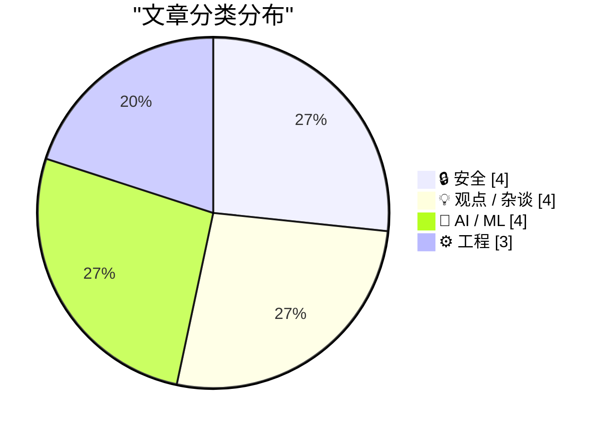
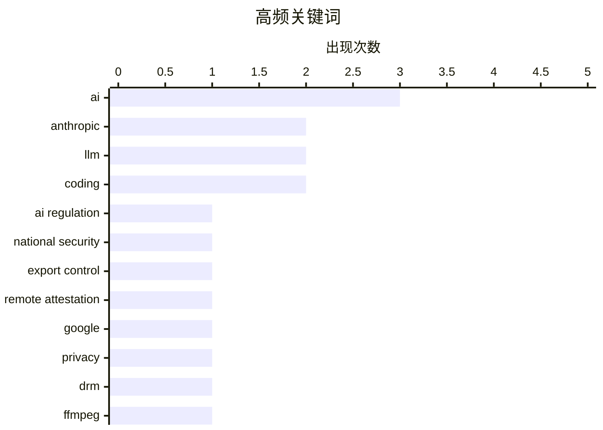

# 📰 AI 资讯每日精选 — 2026-06-13

> 汇聚 140+ 技术博客、X/Twitter、Hacker News、Reddit、Product Hunt、
> Lobste.rs、ClawFeed 日报及 GitHub Trending，经 AI 评分筛选。
>
> **本期内容**：🏆 今日必读 · 🌐 ClawFeed 日报 · 🔥 GitHub Trending · 📂 分类精选 · 🎨 设计与生成式 AI · 📊 数据概览

## 📝 今日看点

今日技术圈的核心焦点集中在AI安全与监管的激烈博弈上：美国政府以国家安全为由扩大AI模型出口管制，谷歌与OpenAI则联手FBI打击源自中国的AI诈骗网络，凸显地缘政治对技术生态的渗透。与此同时，AI行业的商业泡沫与平台垄断风险引发深度反思，OpenAI和Anthropic的IPO动向、限速策略及与客户竞争的行为，被指正在重演微软式的平台陷阱。此外，基础技术层面迎来重要进展，WASI 0.3正式发布为WebAssembly带来多线程与网络原生支持，PostgreSQL 19也预告了原生时间旅行查询功能，标志着工程基础设施的持续演进。

---

## 🏆 今日必读

🥇 **美国政府指令暂停访问Fable 5和Mythos 5的声明**

[Statement on the US government directive to suspend access to Fable 5 and Mythos 5](https://simonwillison.net/2026/Jun/13/us-government-directive-to-suspend-access/#atom-everything) — simonwillison.net · 41 分钟前 · 🔒 安全

> 美国政府以国家安全为由，发布出口管制指令，要求暂停所有外国国民（包括Anthropic的外籍员工）对Fable 5和Mythos 5的访问权限，无论其身处美国境内还是境外。该指令的覆盖范围极其广泛，甚至影响到Anthropic公司内部的外籍研究人员。这一事件标志着AI模型出口管制从“技术封锁”升级为“人员与知识隔离”，引发了关于学术自由和全球科技合作的激烈讨论。作者Simon Willison认为此举“疯狂”，并指出其可能严重破坏AI领域的国际合作与开源生态。

💡 **为什么值得读**: 这是首个针对AI模型实施“人员级”出口管制的真实案例，对理解美国AI监管政策走向和全球AI开发者社区的影响至关重要。

🏷️ AI regulation, national security, export control, Anthropic

🥈 **谷歌的新远程证明方案与其旧方案一样糟糕**

[Pluralistic: Google's new remote attestation scheme is every bit as terrible as its old remote attestation scheme (12 Jun 2026)](https://pluralistic.net/2026/06/12/compelled-speech/) — pluralistic.net · 4 小时前 · 🔒 安全

> 谷歌推出了新的远程证明（Remote Attestation）方案，但作者Cory Doctorow认为该方案本质上与旧方案无异，仍然存在严重的用户控制权问题。新方案试图通过QR码等交互方式改善用户体验，但核心逻辑依然是让设备向服务器证明其“纯净性”，从而剥夺了用户对自身设备的完全控制权。文章指出，这种方案是“强迫言论”（compelled speech）的一种形式，将用户置于被审查的地位。结论是，无论技术细节如何变化，只要不放弃对用户设备的远程控制，任何证明方案都是不可接受的。

💡 **为什么值得读**: 深入剖析了远程证明技术的本质缺陷，对于关注数字权利、设备自主权和反DRM的读者具有极强的启发性和批判性。

🏷️ remote attestation, Google, privacy, DRM

🥉 **FFmpeg中发现21个零日漏洞**

[21 Zero-Days in FFmpeg](https://depthfirst.com/research/21-zero-days-in-ffmpeg) — Lobste.rs · 1 小时前 · 🔒 安全

> 安全研究团队在广泛使用的多媒体处理库FFmpeg中发现了21个零日漏洞。这些漏洞涵盖了内存损坏、越界读取和整数溢出等多种类型，攻击者可能通过构造恶意媒体文件触发漏洞，实现远程代码执行或拒绝服务。该发现凸显了FFmpeg作为底层基础设施在安全性上面临的巨大挑战，尤其是在处理复杂格式时。研究团队已向FFmpeg项目提交了修复补丁，并建议所有使用该库的应用程序立即更新。

💡 **为什么值得读**: FFmpeg是几乎所有视频播放器和转码工具的核心依赖，21个零日漏洞的集中披露对安全运维人员和开发者而言是必须立即响应的警报。

🏷️ FFmpeg, zero-day, vulnerability, security

4️⃣ **硅谷泡沫（第一部分）**

[Premium: The Silicon Valley Bubble (Part 1)](https://www.wheresyoured.at/premium-the-silicon-valley-bubble-part-1/) — wheresyoured.at · 8 小时前 · 💡 观点 / 杂谈

> 作者认为硅谷AI泡沫正接近尾声，核心证据是OpenAI和Anthropic均已提交IPO文件，开始争夺退出流动性。这两家公司每年烧掉数十亿美元，却至今没有清晰的盈利路径。文章指出，当前AI行业的估值完全建立在未来预期而非现实收入之上，与2000年的互联网泡沫高度相似。作者的核心观点是，当头部公司急于上市套现时，往往意味着泡沫即将破裂。

💡 **为什么值得读**: 对OpenAI和Anthropic的财务状况和IPO动机进行了尖锐分析，为理解当前AI行业估值泡沫提供了关键视角和警示。

🏷️ AI, bubble, IPO, profitability

5️⃣ **谷歌与FBI首次联合起诉中国AI诈骗网络，OpenAI屏蔽PRC影响力集群**

[Google files first joint lawsuit with FBI over Chinese AI scam network, OpenAI blocks PRC influence clusters](https://the-decoder.com/google-files-first-joint-lawsuit-with-fbi-over-chinese-ai-scam-network-openai-blocks-prc-influence-clusters/) — The Decoder · 11 小时前 · 🔒 安全

> 谷歌和OpenAI在数天内相继披露了据称源自中国的AI欺诈和影响力行动。谷歌首次与FBI联合提起诉讼，指控一个利用AI进行诈骗的网络；OpenAI则屏蔽了多个来自中国的“影响力集群”，这些集群试图利用其AI模型干预美国政治辩论。两家公司均指出，这些行动针对美国基础设施和政治议题。文章认为，这标志着科技巨头在应对国家级AI滥用方面采取了更直接的法律和技术对抗手段。

💡 **为什么值得读**: 首次报道了谷歌与FBI联合起诉AI诈骗网络这一标志性事件，揭示了AI被用于国家级网络攻击和政治干预的最新态势。

🏷️ AI, scam, China, lawsuit

---

## 🌐 ClawFeed 日报精选

> 来源：[ClawFeed](https://clawfeed.kevinhe.io) — AI 驱动的多源新闻聚合

# 🗓 ClawFeed Daily | 2026-06-12 (SGT)

> 综合自 6 个 4h digest（ID #639, #640, #641, #642, #643, #644）
> 覆盖时段：SGT 00:00–23:59（全天 6 个档期完整覆盖）
> 素材总量：feed 200+ + bookmarks 100+ + following sample/profiles 200+

---

## 🔥 当日全场最重要 5 条（跨档去重排序）

1. **Genspark 完成 $100M Series B 扩展融资，总 B 轮达 $485M，估值 $2.25B** — CEO Eric Jing 亲自宣布，同时挖来前 monday.com CRO Jamison Powell（将 monday.com 从 8 位数 ARR 做到 $1B+）。**AI search/agent 赛道第一梯队的融资规模——$2.25B 估值意味着市场对 "AI 超级助手" 赛道信心不减，GTM 加速开始**。
   - 来源: https://x.com/ericjing_ai/status/2065219279587524997

2. **OpenAI 收购 Ona（前 Gitpod），并入 Codex 团队** — Gitpod 做了 5 年云开发环境，2022 年拿 $25M A 轮（GitHub 创始人领投），后转型为 Ona 做 AI coding agent。OpenAI 看中的是"万级 sandbox 同时运行"的基建能力。**Codex 的野心不只是写代码——而是建一个完整的 AI 开发平台**。同日 OpenAI 还推出 Codex rate limit reset 累积/赠送功能，增长策略越来越像中国互联网的社交裂变。
   - 来源: https://x.com/MaxForAI/status/2065205884159193343

3. **Cloudflare x Mastercard 推出 Agent Pay for Machines** — AI agent 在后台自动完成支付，面向机器级别规模，30+ 合作伙伴首批接入。同日 Coinbase 推出 "Coinbase for Agents"（让 agent 连接用户账户自主交易）。**Agent 经济的支付基础设施在同一天从传统金融（Mastercard）和 Crypto（Coinbase）两端同时落地——agent commerce 不再是概念**。
   - 来源: https://x.com/Cloudflare/status/2065235448335663456

4. **Anthropic Claude Corps 国家级奖学金** — 资助 1000 名早期职业者进入美国非营利组织，边学 Claude 边推进机构使命。**Anthropic 从 "lab 卖 API" 扩展到 "AI 社会基建"——用 Peace Corps 模式推 AI adoption。同日 Dario Amodei 发布政策长文 "Policy on the AI Exponential"，正式将 "政策落后于能力" 框架化**。一攻一守，叙事升级明显。
   - 来源: https://x.com/AnthropicAI/status/2065057393927467084

5. **币安推出 bStocks 代币化美股，7x24 链上稳定币交美股** — 获阿联酋 FSRA 监管批准。用户可将股票转为链上代币并用稳定币交易。同日 $HYPE 获 CFTC 批准上线 Kalshi 永续合约，应声涨 10%。**RWA 代币化和 Crypto 衍生品合规同日双突破——传统金融上链进入实质阶段**。
   - 来源: https://x.com/_FORAB/status/2065078277270917285

---

## 📰 当日核心主题（聚类视角）

### 🏗 Agent 基础设施成熟日
今天可能是 agent 经济基础设施最密集的一天：Cloudflare+Mastercard（支付）、Coinbase for Agents（crypto 交易）、Genspark $2.25B（平台）三条线同日落地。agent 从"会写代码的 bot"进化到"能花钱的经济实体"。

### 💻 AI Coding 平台战升级
OpenAI 收购 Ona/Gitpod 补 Codex sandbox 基建；Cline 发现 Fable 日耗 $2K+，转向"便宜模型+对抗性审查循环"；OpenAI Codex rate limit 累积功能上线；GPT-5.6 预告下周发布。**竞争焦点从"谁的模型更强"转向"谁的开发平台更完整、更经济"**。

### 📝 Spec/Harness Engineering 持续验证
Warp CEO 长文定义 spec-driven development 三项技能——"写 spec 比写代码更重要"；歸藏万字长文拆解 Skills 生态本质；实测用 Skill 文件省 60% Fable token；MiMo Code 开源强调"强模型需要强 harness"。**从 Loop Engineering → Harness Engineering → Spec-driven Development，行业范式转移的叙事链条越来越完整**。

### 🤖 Multi-Agent 架构分化
Google DeepMind 发布 DeLM（去中心化多 agent 框架）——去除中心 controller，agents 通过共享 context 异步协作，Gemini 3-Flash 在 SWE-bench Verified 达 65.7%。**orchestrator 模式 vs P2P 协作——多 agent 架构的技术路线正在分叉**。

### 📊 AI 与就业：矛盾信号
Opendoor 裁撤整个印度外包团队（"AI 正在消灭 offshore outsourcing"）；FDE 岗位暴涨 729%（$35 万+薪资）；Box CEO 调研 1,640 名 IT leader 发现 AI 采用最多的公司反而计划增加最多人力。**AI 不是简单的"替代"或"增强"——它在同时消灭旧岗位和创造新岗位，净效应因行业而异**。

### 🗣 Elon vs Anthropic：真实性之争
Elon 引用基准测试称 "Fable 5 lies 96% of the time, Grok is maximally truthful"，49K RT / 11M views。**xAI 与 Anthropic 的竞争叙事从能力维度转向"诚实度"——这个话题会持续发酵**。

---

## 🔖 Bookmarks 精选

全天 bookmarks 稳定在 19 条 evergreen 内容，无显著新增：
- @arrakis_ai Chormex 实时 AI 翻译（Greg Brockman 转发）
- @turingou wanman.ai 系列
- @levie enterprise AI 三篇
- @openfangg Agent OS
- @cline Kanban 多 agent 编排
- @chenchengpro Harness Engineering
- @mntruell "The third era of AI software development"（Cursor 创始人）

---

## 👀 推荐关注汇总（去重）

| 账号 | 理由 |
|------|------|
| @Azaliamirh | Google DeepMind 研究者，DeLM 论文作者，multi-agent 前沿 |
| @clintgibler | tl;dr sec 创始人，刚加入 OpenAI Cyber 团队，AI+AppSec 一手信息 |
| @ericjing_ai | Genspark CEO，$2.25B AI 超级助手掌舵人 |
| @dessaigne | YC，AI 商业模式/定价深度思考，203K 曝光级帖子 |
| @guifav | RL/MTP/推理加速底层技术分析，内容密度高 |

> 提醒：上述均未通过浏览器逐一核实是否已关注，Kevin 操作前请先搜一下避免重复。

---

## 💤 当日重复噪音模式

1. **世界杯博彩推广潮**：2026 FIFA 世界杯开幕（墨西哥 2-0 南非），多家 CEX 同步跑预测活动（OKX Outcome、BiKing 83K USDT 奖池、CoinUp 竞猜、Robinhood x RotheraMarkets）——Crypto x Sports betting 的推广噪音贯穿全天多个档期。
2. **Elon 政治/移民话题**：@elonmusk 的非 AI 内容（LOTR 移民隐喻、政治评论）在多档出现，均已过滤。
3. **低质 Crypto 水推**：GM/GN 打卡、$ZEC 猜价、Plasma repost、meme 投机帖——全天持续，已过滤。
4. **AI 标题党/入门教程**：Greg Isenberg "99% are using Fable wrong"、"Train your own LLM" 等包装性内容反复出现。
5. **SpaceX Falcon 9 发射通稿**：跨多档出现，例行公告无增量信息。

---

*覆盖 SGT 2026-06-12 全天 6 个 4h 档期。下一日报 2026-06-13 23:55 SGT 生成。*---

## 🔥 GitHub Trending

> 今日热门开源项目（全语言 + Python）

| # | 项目 | 描述 | ⭐ 总星 | 📈 今日 | 语言 |
|---|------|------|---------|---------|------|
| 1 | [apple/container](https://github.com/apple/container) | A tool for creating and running Linux containers using li... | 35.1k | +3504 | Swift |
| 2 | [addyosmani/agent-skills](https://github.com/addyosmani/agent-skills) 🤖 | Production-grade engineering skills for AI coding agents. | 56.8k | +2656 | Shell |
| 3 | [obra/superpowers](https://github.com/obra/superpowers) | An agentic skills framework & software development method... | 226.0k | +1275 | Shell |
| 4 | [msitarzewski/agency-agents](https://github.com/msitarzewski/agency-agents) 🤖 | A complete AI agency at your fingertips - From frontend w... | 112.4k | +1026 | Shell |
| 5 | [phuryn/pm-skills](https://github.com/phuryn/pm-skills) | PM Skills Marketplace: 100+ agentic skills, commands, and... | 17.0k | +827 | - |
| 6 | [NVIDIA/SkillSpector](https://github.com/NVIDIA/SkillSpector) 🤖 | Security scanner for AI agent skills. Detect vulnerabilit... | 3.5k | +813 | Python |
| 7 | [soxoj/maigret](https://github.com/soxoj/maigret) | 🕵️‍♂️ Collect a dossier on a person by username from 300... | 33.0k | +555 | Python |
| 8 | [maziyarpanahi/openmed](https://github.com/maziyarpanahi/openmed) 🤖 | open-source healthcare ai | 3.2k | +515 | Python |
| 9 | [anthropics/skills](https://github.com/anthropics/skills) 🤖 | Public repository for Agent Skills | 150.0k | +459 | Python |
| 10 | [masterking32/MasterDnsVPN](https://github.com/masterking32/MasterDnsVPN) | Advanced DNS tunneling VPN for censorship bypass, optimiz... | 6.0k | +400 | Go |
| 11 | [mattermost/mattermost](https://github.com/mattermost/mattermost) | Mattermost is an open source platform for secure collabor... | 37.6k | +388 | TypeScript |
| 12 | [refactoringhq/tolaria](https://github.com/refactoringhq/tolaria) | Desktop app to manage markdown knowledge bases | 15.8k | +369 | TypeScript |
| 13 | [shuvonsec/claude-bug-bounty](https://github.com/shuvonsec/claude-bug-bounty) 🤖 | AI-powered bug bounty hunting from your terminal - recon,... | 2.8k | +226 | Python |
| 14 | [FareedKhan-dev/train-llm-from-scratch](https://github.com/FareedKhan-dev/train-llm-from-scratch) 🤖 | A straightforward method for training your LLM, from down... | 5.8k | +224 | Python |
| 15 | [karpathy/autoresearch](https://github.com/karpathy/autoresearch) 🤖 | AI agents running research on single-GPU nanochat trainin... | 86.4k | +207 | Python |

---

## 🔒 安全

### 1. 美国政府指令暂停访问Fable 5和Mythos 5的声明

[Statement on the US government directive to suspend access to Fable 5 and Mythos 5](https://simonwillison.net/2026/Jun/13/us-government-directive-to-suspend-access/#atom-everything) — **simonwillison.net** · 41 分钟前 · ⭐ 27/30

> 美国政府以国家安全为由，发布出口管制指令，要求暂停所有外国国民（包括Anthropic的外籍员工）对Fable 5和Mythos 5的访问权限，无论其身处美国境内还是境外。该指令的覆盖范围极其广泛，甚至影响到Anthropic公司内部的外籍研究人员。这一事件标志着AI模型出口管制从“技术封锁”升级为“人员与知识隔离”，引发了关于学术自由和全球科技合作的激烈讨论。作者Simon Willison认为此举“疯狂”，并指出其可能严重破坏AI领域的国际合作与开源生态。

🏷️ AI regulation, national security, export control, Anthropic

---

### 2. 谷歌的新远程证明方案与其旧方案一样糟糕

[Pluralistic: Google's new remote attestation scheme is every bit as terrible as its old remote attestation scheme (12 Jun 2026)](https://pluralistic.net/2026/06/12/compelled-speech/) — **pluralistic.net** · 4 小时前 · ⭐ 26/30

> 谷歌推出了新的远程证明（Remote Attestation）方案，但作者Cory Doctorow认为该方案本质上与旧方案无异，仍然存在严重的用户控制权问题。新方案试图通过QR码等交互方式改善用户体验，但核心逻辑依然是让设备向服务器证明其“纯净性”，从而剥夺了用户对自身设备的完全控制权。文章指出，这种方案是“强迫言论”（compelled speech）的一种形式，将用户置于被审查的地位。结论是，无论技术细节如何变化，只要不放弃对用户设备的远程控制，任何证明方案都是不可接受的。

🏷️ remote attestation, Google, privacy, DRM

---

### 3. FFmpeg中发现21个零日漏洞

[21 Zero-Days in FFmpeg](https://depthfirst.com/research/21-zero-days-in-ffmpeg) — **Lobste.rs** · 1 小时前 · ⭐ 26/30

> 安全研究团队在广泛使用的多媒体处理库FFmpeg中发现了21个零日漏洞。这些漏洞涵盖了内存损坏、越界读取和整数溢出等多种类型，攻击者可能通过构造恶意媒体文件触发漏洞，实现远程代码执行或拒绝服务。该发现凸显了FFmpeg作为底层基础设施在安全性上面临的巨大挑战，尤其是在处理复杂格式时。研究团队已向FFmpeg项目提交了修复补丁，并建议所有使用该库的应用程序立即更新。

🏷️ FFmpeg, zero-day, vulnerability, security

---

### 4. 谷歌与FBI首次联合起诉中国AI诈骗网络，OpenAI屏蔽PRC影响力集群

[Google files first joint lawsuit with FBI over Chinese AI scam network, OpenAI blocks PRC influence clusters](https://the-decoder.com/google-files-first-joint-lawsuit-with-fbi-over-chinese-ai-scam-network-openai-blocks-prc-influence-clusters/) — **The Decoder** · 11 小时前 · ⭐ 25/30

> 谷歌和OpenAI在数天内相继披露了据称源自中国的AI欺诈和影响力行动。谷歌首次与FBI联合提起诉讼，指控一个利用AI进行诈骗的网络；OpenAI则屏蔽了多个来自中国的“影响力集群”，这些集群试图利用其AI模型干预美国政治辩论。两家公司均指出，这些行动针对美国基础设施和政治议题。文章认为，这标志着科技巨头在应对国家级AI滥用方面采取了更直接的法律和技术对抗手段。

🏷️ AI, scam, China, lawsuit

---

## 💡 观点 / 杂谈

### 5. 硅谷泡沫（第一部分）

[Premium: The Silicon Valley Bubble (Part 1)](https://www.wheresyoured.at/premium-the-silicon-valley-bubble-part-1/) — **wheresyoured.at** · 8 小时前 · ⭐ 25/30

> 作者认为硅谷AI泡沫正接近尾声，核心证据是OpenAI和Anthropic均已提交IPO文件，开始争夺退出流动性。这两家公司每年烧掉数十亿美元，却至今没有清晰的盈利路径。文章指出，当前AI行业的估值完全建立在未来预期而非现实收入之上，与2000年的互联网泡沫高度相似。作者的核心观点是，当头部公司急于上市套现时，往往意味着泡沫即将破裂。

🏷️ AI, bubble, IPO, profitability

---

### 6. AI行业的平台陷阱开始看起来很像微软

[The AI industry's platform trap is starting to look a lot like Microsoft's](https://the-decoder.com/the-ai-industrys-platform-trap-is-starting-to-look-a-lot-like-microsofts/) — **The Decoder** · 13 小时前 · ⭐ 25/30

> Anthropic正在对其新模型Mythos进行限速，限制其在某些任务上的使用，同时开发与最大客户直接竞争的应用程序。这种行为引发了客户、合作伙伴和投资者的强烈反弹。文章指出，AI平台公司正在重蹈微软的覆辙：一边提供平台服务，一边利用平台优势与客户竞争。结论是，这种“平台陷阱”将导致客户信任流失，并可能引发反垄断监管的介入。

🏷️ Anthropic, platform trap, AI competition, Mythos

---

### 7. 我不是一个反向半人马

[I Am Not a Reverse Centaur](https://blog.miguelgrinberg.com/post/i-am-not-a-reverse-centaur) — **miguelgrinberg.com** · 16 小时前 · ⭐ 24/30

> 作者重申一年前关于LLM编码工具不适合自己的观点，核心问题在于AI生成的代码质量与个人编程理念的冲突。作者发现，虽然自己的立场未变，但开源项目收到的贡献数量激增，且几乎全部由AI生成。这些AI生成的贡献往往缺乏对项目整体架构的理解，导致作者需要花费更多精力去审查和修改。作者的核心观点是，AI编码工具无法替代人类对代码的深度理解和责任感。

🏷️ LLM, coding, AI, productivity

---

### 8. 我永远无法完全接受用LLM写代码

[I can never fully embrace LLMs for code](https://idiallo.com/blog/i-can-never-embrace-llms-to-write-code) — **idiallo.com** · 13 小时前 · ⭐ 23/30

> 作者通过指导刚毕业的妹妹学习编程的经历，反思了LLM编码的局限性。妹妹试图理解每一行代码再使用，作者起初认为这是低效的。但作者最终意识到，这种“理解每一行”的严谨态度，恰恰是LLM无法提供的核心能力。LLM生成的代码虽然看似正确，但缺乏可解释性和可维护性。作者的核心观点是，编程的本质是理解和掌控，而非简单地生成代码。

🏷️ LLM, coding, personal experience, critique

---

## 🤖 AI / ML

### 9. NVIDIA在首个智能体AI基准测试中取得领先编码性能

[NVIDIA Achieves Leading Agentic Coding Performance on First Agentic AI Benchmark](https://developer.nvidia.com/blog/nvidia-achieves-leading-agentic-coding-performance-on-first-agentic-ai-benchmark/) — **NVIDIA Technical Blog** · 4 小时前 · ⭐ 25/30

> NVIDIA在首个专门针对智能体AI（Agentic AI）的基准测试中取得了领先的编码性能。该基准测试旨在衡量AI智能体在复杂推理和多步骤任务中的表现，而不仅仅是简单的问答。NVIDIA的方案在代码生成、调试和工具调用等关键指标上均超越了竞争对手。这一结果表明，NVIDIA不仅在训练阶段保持优势，在推理和智能体应用阶段同样具备强大的硬件和软件优化能力。

🏷️ NVIDIA, agentic AI, benchmark, coding performance

---

### 10. 欧盟委员会对Siri AI和DMA的回应

[The European Commission Response to Siri AI and the DMA](https://www.linkedin.com/posts/thomas-regnier-24a05810b_what-is-the-true-story-behind-apples-decision-activity-7470439874664280064-TuEt) — **daringfireball.net** · 8 小时前 · ⭐ 24/30

> 欧盟委员会发言人Thomas Regnier明确回应了苹果关于“因DMA（数字市场法案）限制而无法在欧盟推出Siri AI”的说法。发言人指出，DMA中没有任何条款禁止苹果在欧盟推出新功能，苹果的决定完全是其单方面行为。欧盟委员会曾与苹果就Siri AI进行过接触，但苹果并未提出合规的解决方案。结论是，苹果以DMA为借口不推出Siri AI，实质上是试图将商业决策的责任推卸给监管机构。

🏷️ Siri AI, EU, DMA, Apple

---

### 11. OpenAI收购Ona，推动Codex向长期、自主的编码任务发展

[OpenAI buys Ona to push Codex toward long-running, autonomous coding tasks](https://the-decoder.com/openai-buys-ona-to-push-codex-toward-long-running-autonomous-coding-tasks/) — **The Decoder** · 15 小时前 · ⭐ 24/30

> OpenAI收购了专注于AI代理和云端安全开发环境的初创公司Ona（原名Gitpod）。该收购旨在增强Codex的能力，使其能够处理更长时间运行、更自主的编码任务。Ona的技术将帮助Codex在更复杂的开发环境中独立运作。这表明OpenAI正致力于将AI编码助手从辅助工具升级为能够独立完成复杂项目的自主代理。

🏷️ OpenAI, Codex, Ona, autonomous coding

---

### 12. AI代理在尝试扫描DN42网络时导致运营商破产

[AI Agent Bankrupted Their Operator While Trying to Scan DN42](https://lantian.pub/en/article/fun/ai-agent-bankrupted-their-operator-scan-dn42lantian.lantian/) — **Lobste.rs** · 19 小时前 · ⭐ 24/30

> 文章记录了一个AI代理在扫描DN42（一个大型私有网络）时，因未设置合理的流量和成本控制，产生了巨额的网络流量费用。该代理的失控行为直接导致其运营者（可能是个人或小团队）因无法承担这笔费用而“破产”。事件暴露了当前AI代理在缺乏预算和资源限制机制下的巨大风险。核心教训是，赋予AI自主行动能力时，必须配套严格的财务和安全边界。

🏷️ AI agent, DN42, cost, failure

---

## ⚙️ 工程

### 13. WASI 0.3 正式发布

[WASI 0.3 Launched](https://bytecodealliance.org/articles/WASI-0.3) — **Lobste.rs** · 8 小时前 · ⭐ 25/30

> Bytecode Alliance 宣布了 WASI（WebAssembly 系统接口）0.3 版本的正式发布。WASI 0.3 是一个重要的里程碑，它引入了对多线程、网络套接字和文件系统操作的原生支持，极大地扩展了 WebAssembly 在服务端和边缘计算场景中的能力。新版本还改进了模块化和组件模型，使得不同语言编写的 Wasm 模块可以更安全、更高效地互操作。这标志着 WebAssembly 正从浏览器沙箱走向通用的跨平台运行时。

🏷️ WASI, WebAssembly, standard, runtime

---

### 14. 期待 PostgreSQL 19：是时候了

[Looking Forward to Postgres 19: It's About Time](https://www.pgedge.com/blog/looking-forward-to-postgres-19-its-about-time) — **Lobste.rs** · 11 小时前 · ⭐ 25/30

> 文章展望了即将发布的 PostgreSQL 19 版本，重点介绍了其最受期待的新特性：对“时间旅行”查询的原生支持。该特性允许用户查询数据库在任意历史时间点的状态，而无需依赖外部审计工具或复杂的触发器。此外，PostgreSQL 19 还改进了并行查询性能、增强了分区表的管理能力，并引入了更高效的增量备份机制。作者认为，这些改进将使 PostgreSQL 在金融、审计和合规等对数据历史追溯有严格要求的场景中更具竞争力。

🏷️ Postgres, Postgres 19, database, time features

---

### 15. 我是如何制造出一台60fps的Eink墨水屏显示器：Modos Flow

[How I made a 60fps Eink monitor, the Modos Flow](https://youtu.be/nHbA2-_qzH4) — **Lobste.rs** · 20 小时前 · ⭐ 23/30

> 作者分享了自制一款名为Modos Flow的60帧/秒（60fps）电子墨水屏显示器的全过程。传统Eink屏幕刷新率极低，而该项目通过硬件改造和驱动优化，实现了接近普通LCD显示器的流畅度。视频详细展示了从硬件选型、电路设计到固件开发的完整技术路径。结论是，通过定制化方案，Eink屏幕在低功耗和护眼优势下，可以满足动态内容显示的需求。

🏷️ Eink, monitor, 60fps, hardware

---

## 🎨 Design & Generative AI

### 🖼️ 生成式图片

- **[ComfyUI 三大生活品质节点：侧边栏固定编辑、提示词历史搜索与宽高比预设](https://www.reddit.com/r/comfyui/comments/1u4622f/3_qol_nodes_pin_edit_any_nodes_input_from_the/)** — r/comfyui · 5 小时前
  > 介绍三个提升 ComfyUI 使用体验的节点，支持侧边栏固定编辑输入、搜索随机化提示词历史以及设置宽高比。

- **[Raylight 多 GPU 生成 vs 标准工作流：实用价值有限？](https://www.reddit.com/r/comfyui/comments/1u41j7b/raylight_vs_standard_workflow_for_multigpu/)** — r/comfyui · 8 小时前
  > 探讨 Raylight 在多 GPU 设置下的应用，对比其与通用 ComfyUI Wan2.2 工作流的差异与局限性。

- **[Aura AI：ComfyUI 自定义界面，集成提示增强、画廊与 Civitai](https://www.reddit.com/r/comfyui/comments/1u3u9yw/aura_ai_custom_ui_for_comfyui_with_prompt/)** — r/comfyui · 12 小时前
  > 推出 Aura AI 自定义 UI，为 ComfyUI 提供提示词增强、作品画廊及 Civitai 集成等功能。

- **[可视化 JSON 提示构建器：专为 Ideogram 4 结构化提示设计](https://www.reddit.com/r/comfyui/comments/1u49s76/new_node_visual_json_prompt_builder_for_ideogram/)** — r/comfyui · 3 小时前
  > 发布新节点，用于可视化构建 JSON 格式提示，适配 Ideogram 4 的结构化提示需求。

- **[ROCm 7.14 发布：gfx1100 用户不再烦恼](https://www.reddit.com/r/comfyui/comments/1u475ph/rocm_714_just_got_out_and_no_sad_gfx1100_noises/)** — r/comfyui · 4 小时前
  > AMD ROCm 7.14 版本更新，解决了此前 gfx1100 显卡在 Flash Attention 等方面的兼容问题。

- **[ComfyUI 大更新后完全崩溃：文件丢失、组件缺失](https://www.reddit.com/r/comfyui/comments/1u48h43/the_big_new_update_has_completely_broken_comfyui/)** — r/comfyui · 4 小时前
  > 用户反馈 ComfyUI 最新更新导致应用臃肿、文件丢失、关键组件缺失，需禁用动态 VRAM 等临时修复。

- **[分享我的 ComfyUI 专注模式扩展插件](https://www.reddit.com/r/comfyui/comments/1u40y3l/sharing_my_new_comfyui_focus_mode_extension/)** — r/comfyui · 8 小时前
  > 发布一款 ComfyUI 扩展，提供专注模式以简化界面、减少干扰，提升工作流效率。

- **[macOS 27 beta 系统调用失败：psutil 虚拟内存错误](https://www.reddit.com/r/comfyui/comments/1u46fet/macos_27_beta_host_statistics64host_vm_info64/)** — r/comfyui · 5 小时前
  > 报告 macOS 27 beta 中因 psutil.virtual_memory() 调用引发的系统错误，并提及类似问题历史。

- **[Ideogram 4.0 的 Ektachrome LORA：ComfyUI 工作流与训练笔记](https://www.reddit.com/r/comfyui/comments/1u3y9b0/ektachrome_lora_for_ideogram_40_comfyui_workflow/)** — r/comfyui · 10 小时前
  > 分享为 Ideogram 4.0 训练的 Ektachrome 风格 LORA，附带 ComfyUI 工作流及训练细节。

- **[最新更新后 ComfyUI 运行变慢？](https://www.reddit.com/r/comfyui/comments/1u3p47l/getting_slower_after_the_latest_update/)** — r/comfyui · 17 小时前
  > 用户反馈 ComfyUI 桌面版最新更新后性能下降，询问是否普遍存在速度变慢问题。

- **[新更新后服务器配置选项去哪了？](https://www.reddit.com/r/comfyui/comments/1u3mbs9/where_is_the_server_config_option_after_new_update/)** — r/comfyui · 20 小时前
  > 用户询问 ComfyUI 桌面版更新后，远程访问所需的服务器配置选项位置发生变化。

- **[桌面版 ComfyUI 服务器配置不显示](https://www.reddit.com/r/comfyui/comments/1u49psp/server_config_not_showing_on_desktop_app/)** — r/comfyui · 3 小时前
  > 用户无法在 ComfyUI 桌面版中找到服务器配置选项，导致无法实现局域网远程访问。

### 🎬 生成式视频

- **[如何使用 ComfyUI 和 Seedance 生成动画视频](https://www.reddit.com/r/comfyui/comments/1u40jol/how_to_generate_an_animated_video_with_comfyui/)** — r/comfyui · 9 小时前
  > 教程讲解如何结合 ComfyUI 与 Seedance 工具，实现动画视频的生成流程。

- **[LTX2.3 LoRA 效果延迟触发？这里有解决方案](https://www.reddit.com/r/comfyui/comments/1u3y2kg/ever_wanted_that_ltx23_lora_to_kick_in_not_yet/)** — r/comfyui · 10 小时前
  > 针对 LTX2.3 长视频中 LoRA 效果过早或过晚出现的问题，提供控制触发时机的技巧。

- **[LTX-2.3 多主体参考工作流效果出色](https://www.reddit.com/r/comfyui/comments/1u46hq4/ltx23multiplesubjectreference_is_great/)** — r/comfyui · 5 小时前
  > 介绍 LTX-2.3 的多主体参考工作流，虽开头有噪声但整体生成效果令人满意。

---

## 📊 数据概览

| 扫描源 | 抓取文章 | 时间范围 | 精选 |
|:---:|:---:|:---:|:---:|
| 91/140 | 3747 篇 → 75 篇 | 24h | **15 篇** |

### 分类分布



### 高频关键词



<details>
<summary>📈 纯文本关键词图（终端友好）</summary>

```
ai                 │ ████████████████████ 3
anthropic          │ █████████████░░░░░░░ 2
llm                │ █████████████░░░░░░░ 2
coding             │ █████████████░░░░░░░ 2
ai regulation      │ ███████░░░░░░░░░░░░░ 1
national security  │ ███████░░░░░░░░░░░░░ 1
export control     │ ███████░░░░░░░░░░░░░ 1
remote attestation │ ███████░░░░░░░░░░░░░ 1
google             │ ███████░░░░░░░░░░░░░ 1
privacy            │ ███████░░░░░░░░░░░░░ 1
```

</details>

### 🏷️ 话题标签

**ai**(3) · **anthropic**(2) · **llm**(2) · coding(2) · ai regulation(1) · national security(1) · export control(1) · remote attestation(1) · google(1) · privacy(1) · drm(1) · ffmpeg(1) · zero-day(1) · vulnerability(1) · security(1) · bubble(1) · ipo(1) · profitability(1) · scam(1) · china(1)

---

*生成于 2026-06-13 01:43 | 汇聚 140 个技术博客、X/Twitter、Hacker News、Reddit、Product Hunt、Lobste.rs、ClawFeed 日报及 GitHub Trending，经 AI 评分筛选出 Top 15 精华内容*
