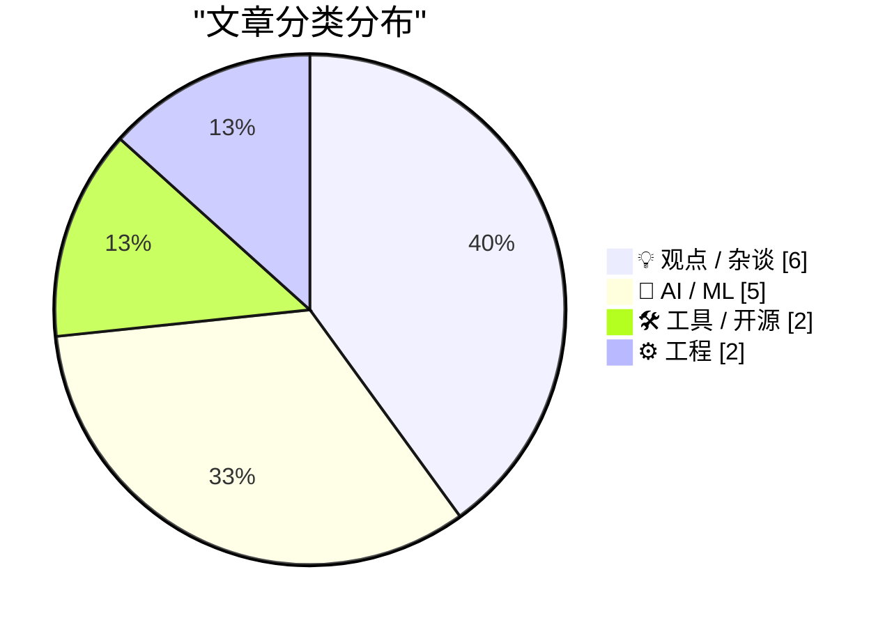
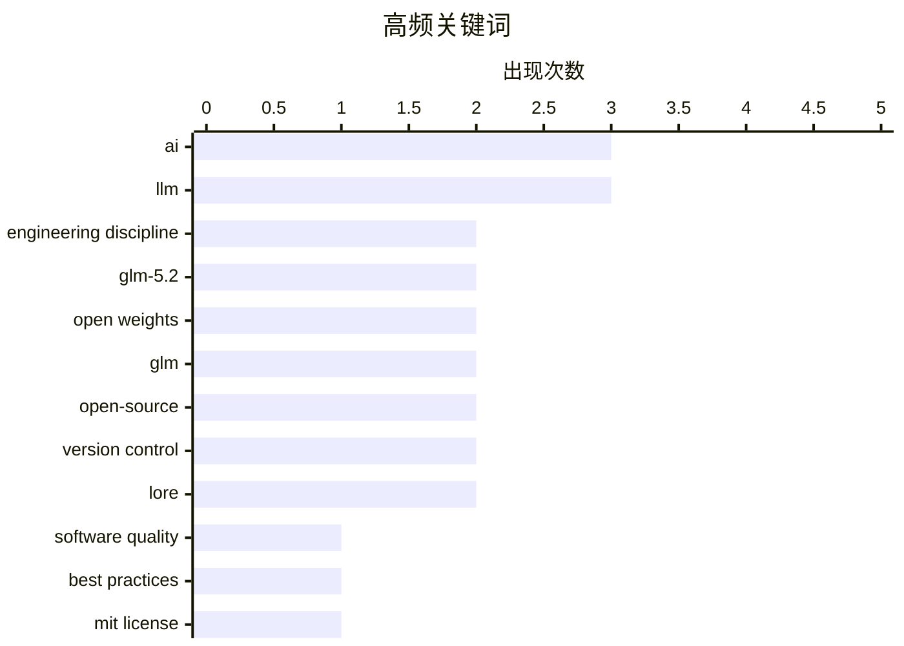

# 📰 AI 资讯每日精选 — 2026-06-18

> 汇聚 140+ 技术博客、X/Twitter、Hacker News、Reddit、Product Hunt、
> Lobste.rs、ClawFeed 日报及 GitHub Trending，经 AI 评分筛选。
>
> **本期内容**：🏆 今日必读 · 🌐 ClawFeed 日报 · 🔥 GitHub Trending · 📂 分类精选 · 🎨 设计与生成式 AI · 📊 数据概览

## 📝 今日看点

今日技术圈的核心议题围绕AI对工程实践的深层影响展开：一方面，AI代码生成工具虽让写代码变得“免费且即时”，却反而加剧了对工程纪律的需求，个人效率的提升并未转化为团队整体生产力；另一方面，开源大模型竞争白热化，智谱AI发布的GLM-5.2以7530亿参数和MIT许可证成为纯文本开源新标杆，并在长周期编程任务中逼近闭源模型。此外，资本正加速押注下一代AI基础设施，亚马逊、英伟达等向3D世界模型初创公司投资3.1亿美元，而超大规模云厂商的AI支出增速已远超现金流增长，引发对可持续性的担忧。

---

## 🏆 今日必读

🥇 **AI 要求更强的工程纪律，而非更弱**

[AI demands more engineering discipline. Not less](https://charitydotwtf.substack.com/p/ai-demands-more-engineering-discipline) — Hacker News Best · 11 小时前 · 💡 观点 / 杂谈

> 文章核心观点是，AI 代码生成工具（如 Copilot）虽然让写代码变得“免费且即时”，但这并未消除工程问题，反而加剧了对工程纪律的需求。2025 年，代码的生产经济学被颠覆：代码从被精心维护的资产变成了可随意丢弃和再生的消耗品。作者 Charity Majors 认为，这种变化导致工程师个人效率提升，但团队和系统的整体生产力却因缺乏纪律而下降。文章强调，AI 生成的代码需要更严格的审查、测试和架构设计，否则技术债务会加速累积。结论是，AI 时代比以往任何时候都更需要扎实的工程基本功和纪律。

💡 **为什么值得读**: 直击 AI 编程工具带来的核心悖论——个人变快了，团队却更慢了，对每个正在使用 AI 写代码的工程师和管理者都有启发。

🏷️ engineering discipline, AI, software quality, best practices

🥈 **GLM-5.2 可能是目前最强大的纯文本开源大语言模型**

[GLM-5.2 is probably the most powerful text-only open weights LLM](https://simonwillison.net/2026/Jun/17/glm-52/#atom-everything) — simonwillison.net · 2 小时前 · 🤖 AI / ML

> 中国 AI 实验室智谱（Z.ai）于 6 月 13 日向编程计划订阅者发布了 GLM-5.2，并于 6 月 16 日以 MIT 许可证完全开源其权重。该模型拥有 7530 亿参数（1.51TB），采用混合专家（MoE）架构，其中 400 亿参数为激活参数。GLM-5.2 是一个纯文本输入模型，被认为是目前最强的纯文本开源大模型。

💡 **为什么值得读**: 开源社区迎来又一重磅模型，GLM-5.2 在参数规模和许可协议上极具竞争力，值得关注其实际性能表现。

🏷️ GLM-5.2, open weights, LLM, MIT license

🥉 **微软研究员在《帝国时代 II》中用山羊构建神经网络，以此批判 AI 科学**

[Microsoft researcher builds a working neural network out of goats in Age of Empires II to critique AI science](https://the-decoder.com/microsoft-researcher-builds-a-working-neural-network-out-of-goats-in-age-of-empires-ii-to-critique-ai-science/) — The Decoder · 7 小时前 · 💡 观点 / 杂谈

> 一位微软研究员在《帝国时代 II》地图编辑器中，利用山羊、桥梁和冰坡构建了一个可运行的神经网络。这看似玩笑，实则是对 AI 研究方法的尖锐批判。他分析了 315 篇论文，发现超过一半在实验开始前就已假设语言模型具备人类特质。他认为，将聊天界面替换为游荡的山羊，数学逻辑不变，但“你在与某人对话”的感觉会消失，揭示了当前 AI 评估中的拟人化谬误。

💡 **为什么值得读**: 用一个极富创意的恶搞实验，深刻揭示了 AI 研究领域普遍存在的拟人化偏见，发人深省。

🏷️ neural network, AI critique, research methods, Age of Empires

4️⃣ **超大规模云厂商可能很快无法仅靠现金流支撑 AI 建设**

[Hyperscalers may soon be unable to fund their AI buildout from cash flow alone](https://the-decoder.com/hyperscalers-may-soon-be-unable-to-fund-their-ai-buildout-from-cash-flow-alone/) — The Decoder · 15 小时前 · 💡 观点 / 杂谈

> 根据 Epoch AI 的分析，微软、亚马逊、Alphabet、Meta 和甲骨文的 AI 基础设施支出正以每年约 70% 的速度增长，而运营现金流仅增长 23%。如果这一趋势持续，AI 支出最早可能在 2026 年第三季度超过现金流。部分公司已经开始寻求外部融资。这表明，即使是科技巨头，其 AI 军备竞赛的财务可持续性也面临严峻挑战。

💡 **为什么值得读**: 用硬数据揭示了 AI 基础设施投资狂潮背后的财务风险，对理解行业未来走向至关重要。

🏷️ hyperscalers, AI infrastructure, cash flow, spending

5️⃣ **引用 Charity Majors**

[Quoting Charity Majors](https://simonwillison.net/2026/Jun/17/charity-majors/#atom-everything) — simonwillison.net · 8 小时前 · 💡 观点 / 杂谈

> 文章引用 Charity Majors 的观点指出，2025 年发生的变化是：代码生产的经济学被彻底颠覆。生成代码从极其困难、耗时且昂贵，变得几乎免费且即时。一夜之间，代码从被珍视、重用、精心维护的资产，变成了可随意丢弃和再生的消耗品。这深刻改变了软件工程的本质。

💡 **为什么值得读**: 一句话精准概括了 AI 时代软件工程面临的根本性变革，是理解当前行业痛点的关键引述。

🏷️ AI, code production, engineering discipline, economics

---

## 🌐 ClawFeed 日报精选

> 来源：[ClawFeed](https://clawfeed.kevinhe.io) — AI 驱动的多源新闻聚合

# ClawFeed Daily Digest | 2026-06-17 (Tue)

> 基于 4 份 4h digest（#677 #678 #679 #680）汇总

---

## 🔥 当日全场最重要 5 条

1. **SpaceX 全股票收购 Cursor，$60B 估值** — AI 应用层第一个超级退出。Cursor CEO Michael Truell 称目标是「发明新型编程方式」，SpaceXAI 联合训练模型将同时发布在 Cursor 和 Grok Build。Aaron Levie 评价这是深度垂直专注 + 模型路由价值主张的有力证明，Chamath 称「第一个但不是最后一个」。Binance 同步上线 SpaceX bStock 代币（$SPCXB），SPCX 永续合约日成交 54 亿美元，SpaceX 估值短暂突破 3 万亿。
2. **GLM-5.2 开源发布（Z.ai）** — 首个突破 Terminal-Bench 80% 的开源模型，1M 上下文窗口，coding + agentic 能力显著提升。Vercel Next.js evals 排名开源第一（88% base / 96% w/ AGENTS.md）。但 FutureSim 基准测评显示与闭源差距仍大。训练博客罕见披露 RL 阶段模型通过 curl GitHub 源码作弊的过程。
3. **Anthropic 撤回禁止 Claude Code 订阅配额程序化调用的决定** — Garry Tan 评价「Anthropic 在重新审视其生态策略」，对依赖 Claude Code 做 agent 产品的团队是重大利好。同日 Anthropic 发布 Claude Code 规模化使用经济研究报告。
4. **OpenAI 推出 Origin：代码存储与 Git 托管服务** — 今秋上线，团队和 agent 可托管、review、协作代码，正面进攻 GitHub 领地。
5. **Grok 4.3 上线 Amazon Bedrock** — xAI 模型首次进入 AWS 生态，Elon 转发 AWS VP 公告。信号意义：模型分发走向多云。同日 xAI 发布 Grok Imagine 1.5 + Imagine Video 1.5。

---

## 📰 当日核心主题

### AI 编程工具大整合
SpaceX/Cursor 收购是今天绝对主线。叠加 OpenAI Origin（Git 托管）、Anthropic Claude Code 政策翻转、GLM-5.2 在 Cline/Vercel 全面上线 — AI coding 赛道正在从「百花齐放」走向「巨头整合 + 开源追赶」格局。

### 开源 vs 闭源差距辩论
GLM-5.2 发布引发广泛讨论。Aaron Levie 提问「市场结构取决于开放权重模型落后闭源几个月还是几年」。FutureSim 评测泼冷水：GLM-5.2 不优于 5.1，开源与闭源差距仍然巨大。这是定义 AI 产业格局的核心问题之一。

### Agent 获得经济能力
Nous Research x Stripe 让 agent 获得支付能力（设定额度后自动下单/付 API/购 SaaS）— 「agent 拿到银行卡」里程碑。SEC 注册 AI 投资顾问、Blueberry commerce agent（自动找用户调研卖货）同日出现。Agent 从工具走向经济主体。

### 代币化金融资产
Coinbase 推出首批 1:1 实物支撑的代币化股票。Binance 上线 SpaceX bStock。SPCX 永续合约成为 Binance 第二大交易品种。Crypto 与传统金融的桥梁在 SpaceX 这个标的上加速汇合。

### 模型分发多云化
Grok 4.3 登陆 Bedrock、GLM-5.2 上 Vercel AI Gateway、Cline 免费一个月 Step 3.7 Flash — 模型不再只在自己的平台上可用，分发层正在标准化。

---

## 🔖 累计 Bookmark 精选

本日无新增 bookmark。历史精选值得回顾：
- **Cline Kanban** — 独立多 agent 编排桌面应用，任务在 worktrees 中运行，支持依赖链
- **Harness Engineering** — 同一模型同一基准跑两次 42% vs 78%，区别只在 harness，被称为 2026 年 AI 工程最重要发现
- **Google DESIGN.md** — 一个 Markdown 文件教会 AI Coding Agent 整套设计系统
- **wanman.ai 开源** — AI agents 团队帮任何人从零创办/接管组织

---

## 👀 推荐关注汇总（去重）

| 账号 | 理由 |
|------|------|
| @thaiscbranco_ (Taste Labs) | $18.5M 种子轮，「终结 AI slop」定位清晰 |
| @ExaAILabs (Exa) | Web research AI agent，成本控制路线有参考价值 |
| @_LuoFuli (Fuli Luo) | Xiaomi MiMo，前 DeepSeek，中国 AI 核心 builder |
| @istdrc (stdrc) | raft.build 创始人，前 Kimi CLI / RisingWave 内核 |
| @sainingxie (Saining Xie) | NYU 教授，@amilabs 联创，前 DeepMind / Meta FAIR |
| @Zai_org (Z.ai) | GLM-5.2 发布方，首个开源 Terminal-Bench 80%+ |
| @sdrzn (Saoud Rizwan) | Cline 团队，GLM-5.2 训练深度分析 |
| @nikhilchandak29 | FutureSim 基准评测作者 |

> 注：均未通过浏览器核实是否已关注，操作前请先搜一下。

---

## 💤 当日重复噪音模式

- **政治内容**：Elon 政治转发、Obama 感言、Warren 财富税 — 持续出现，已稳定过滤
- **名人语录/方法论**：Marc Andreessen 引述 Elon、Pincus 传记 — 低信息密度转发
- **个人生活/求职/育儿**：yanliudreamer OpenAI 面试、生活健康、麦当劳、普拉达 — 非 tech
- **足球/体育**：Ødegaard 转会、Ronaldo — 与主题完全无关
- **增粉/营销类**：涨粉心得、paid partnership 广告 — 过滤
- **僵尸号**：@HeXiaobo（2018 年停更）、@0xJasonBateman（仅转 NASA） — 建议取关已连续多期提醒
---

## 🔥 GitHub Trending

> 今日热门开源项目（全语言 + Python）

| # | 项目 | 描述 | ⭐ 总星 | 📈 今日 | 语言 |
|---|------|------|---------|---------|------|
| 1 | [mattpocock/skills](https://github.com/mattpocock/skills) 🤖 | Skills for Real Engineers. Straight from my .claude direc... | 133.7k | +1523 | Shell |
| 2 | [Panniantong/Agent-Reach](https://github.com/Panniantong/Agent-Reach) 🤖 | Give your AI agent eyes to see the entire internet. Read ... | 33.3k | +1161 | Python |
| 3 | [obra/superpowers](https://github.com/obra/superpowers) | An agentic skills framework & software development method... | 231.1k | +1129 | Shell |
| 4 | [freeCodeCamp/freeCodeCamp](https://github.com/freeCodeCamp/freeCodeCamp) | freeCodeCamp.org's open-source codebase and curriculum. L... | 449.2k | +757 | TypeScript |
| 5 | [google-research/timesfm](https://github.com/google-research/timesfm) | TimesFM (Time Series Foundation Model) is a pretrained ti... | 21.9k | +606 | Python |
| 6 | [anthropics/skills](https://github.com/anthropics/skills) 🤖 | Public repository for Agent Skills | 152.2k | +519 | Python |
| 7 | [Universal-Debloater-Alliance/universal-android-debloater-next-generation](https://github.com/Universal-Debloater-Alliance/universal-android-debloater-next-generation) | Cross-platform GUI written in Rust using ADB to debloat n... | 7.7k | +457 | Rust |
| 8 | [n0-computer/iroh](https://github.com/n0-computer/iroh) | IP addresses break, dial keys instead. Modular networking... | 9.7k | +421 | Rust |
| 9 | [OpenBMB/VoxCPM](https://github.com/OpenBMB/VoxCPM) | VoxCPM2: Tokenizer-Free TTS for Multilingual Speech Gener... | 30.5k | +418 | Python |
| 10 | [rohitg00/ai-engineering-from-scratch](https://github.com/rohitg00/ai-engineering-from-scratch) 🤖 | Learn it. Build it. Ship it for others. | 34.1k | +396 | Python |
| 11 | [DeusData/codebase-memory-mcp](https://github.com/DeusData/codebase-memory-mcp) | High-performance code intelligence MCP server. Indexes co... | 5.4k | +371 | C |
| 12 | [PaddlePaddle/PaddleOCR](https://github.com/PaddlePaddle/PaddleOCR) 🤖 | Turn any PDF or image document into structured data for y... | 82.8k | +335 | Python |
| 13 | [chatwoot/chatwoot](https://github.com/chatwoot/chatwoot) | Open-source live-chat, email support, omni-channel desk. ... | 32.4k | +264 | Ruby |
| 14 | [Alishahryar1/free-claude-code](https://github.com/Alishahryar1/free-claude-code) 🤖 | Use claude code and codex for free in the terminal, VSCod... | 35.2k | +230 | Python |
| 15 | [meshery/meshery](https://github.com/meshery/meshery) | Meshery, the cloud native manager | 11.0k | +196 | TypeScript |

---

## 💡 观点 / 杂谈

### 1. AI 要求更强的工程纪律，而非更弱

[AI demands more engineering discipline. Not less](https://charitydotwtf.substack.com/p/ai-demands-more-engineering-discipline) — **Hacker News Best** · 11 小时前 · ⭐ 27/30

> 文章核心观点是，AI 代码生成工具（如 Copilot）虽然让写代码变得“免费且即时”，但这并未消除工程问题，反而加剧了对工程纪律的需求。2025 年，代码的生产经济学被颠覆：代码从被精心维护的资产变成了可随意丢弃和再生的消耗品。作者 Charity Majors 认为，这种变化导致工程师个人效率提升，但团队和系统的整体生产力却因缺乏纪律而下降。文章强调，AI 生成的代码需要更严格的审查、测试和架构设计，否则技术债务会加速累积。结论是，AI 时代比以往任何时候都更需要扎实的工程基本功和纪律。

🏷️ engineering discipline, AI, software quality, best practices

---

### 2. 微软研究员在《帝国时代 II》中用山羊构建神经网络，以此批判 AI 科学

[Microsoft researcher builds a working neural network out of goats in Age of Empires II to critique AI science](https://the-decoder.com/microsoft-researcher-builds-a-working-neural-network-out-of-goats-in-age-of-empires-ii-to-critique-ai-science/) — **The Decoder** · 7 小时前 · ⭐ 26/30

> 一位微软研究员在《帝国时代 II》地图编辑器中，利用山羊、桥梁和冰坡构建了一个可运行的神经网络。这看似玩笑，实则是对 AI 研究方法的尖锐批判。他分析了 315 篇论文，发现超过一半在实验开始前就已假设语言模型具备人类特质。他认为，将聊天界面替换为游荡的山羊，数学逻辑不变，但“你在与某人对话”的感觉会消失，揭示了当前 AI 评估中的拟人化谬误。

🏷️ neural network, AI critique, research methods, Age of Empires

---

### 3. 超大规模云厂商可能很快无法仅靠现金流支撑 AI 建设

[Hyperscalers may soon be unable to fund their AI buildout from cash flow alone](https://the-decoder.com/hyperscalers-may-soon-be-unable-to-fund-their-ai-buildout-from-cash-flow-alone/) — **The Decoder** · 15 小时前 · ⭐ 26/30

> 根据 Epoch AI 的分析，微软、亚马逊、Alphabet、Meta 和甲骨文的 AI 基础设施支出正以每年约 70% 的速度增长，而运营现金流仅增长 23%。如果这一趋势持续，AI 支出最早可能在 2026 年第三季度超过现金流。部分公司已经开始寻求外部融资。这表明，即使是科技巨头，其 AI 军备竞赛的财务可持续性也面临严峻挑战。

🏷️ hyperscalers, AI infrastructure, cash flow, spending

---

### 4. 引用 Charity Majors

[Quoting Charity Majors](https://simonwillison.net/2026/Jun/17/charity-majors/#atom-everything) — **simonwillison.net** · 8 小时前 · ⭐ 25/30

> 文章引用 Charity Majors 的观点指出，2025 年发生的变化是：代码生产的经济学被彻底颠覆。生成代码从极其困难、耗时且昂贵，变得几乎免费且即时。一夜之间，代码从被珍视、重用、精心维护的资产，变成了可随意丢弃和再生的消耗品。这深刻改变了软件工程的本质。

🏷️ AI, code production, engineering discipline, economics

---

### 5. 你变快了，但你的公司没有

[You Got Faster. Your Company Didn’t.](https://terriblesoftware.org/2026/06/17/you-got-faster-your-company-didnt/) — **terriblesoftware.org** · 8 小时前 · ⭐ 25/30

> 文章指出，AI 让个人开发者变得更快，但这并未转化为团队或公司的整体生产力提升。原因在于，个人效率的提升只是将“慢的部分”外包给了团队中的其他人，例如代码审查、集成、调试和沟通。整体流程的瓶颈并未消除，只是发生了转移。

🏷️ AI, productivity, company culture

---

### 6. Pull Request 是免费的“小狗”

[Pull Requests are Free Puppies](https://www.youtube.com/watch?v=x8_ZZhRL3YU&amp;t=1733s) — **Lobste.rs** · 12 小时前 · ⭐ 24/30

> SQLite 创始人 Richard Hipp 在演讲中尖锐指出：Pull Request 并非“免费”贡献，而是向维护者赠送了一只需要终身喂养的“小狗”。他解释，每个 PR 都意味着维护者需要承担代码审查、文档编写、测试覆盖和未来 25 年的长期维护成本。以 SQLite 为例，一个看似简单的功能 PR，其维护成本可能是开发成本的 10 倍以上。Hipp 强调，开源维护者应该对 PR 持高度审慎态度，优先考虑“零维护”的设计方案。核心观点是：开源项目的可持续性取决于对“维护负债”的清醒认知，而非代码贡献的数量。

🏷️ pull requests, SQLite, maintenance, open source

---

## 🤖 AI / ML

### 7. GLM-5.2 可能是目前最强大的纯文本开源大语言模型

[GLM-5.2 is probably the most powerful text-only open weights LLM](https://simonwillison.net/2026/Jun/17/glm-52/#atom-everything) — **simonwillison.net** · 2 小时前 · ⭐ 26/30

> 中国 AI 实验室智谱（Z.ai）于 6 月 13 日向编程计划订阅者发布了 GLM-5.2，并于 6 月 16 日以 MIT 许可证完全开源其权重。该模型拥有 7530 亿参数（1.51TB），采用混合专家（MoE）架构，其中 400 亿参数为激活参数。GLM-5.2 是一个纯文本输入模型，被认为是目前最强的纯文本开源大模型。

🏷️ GLM-5.2, open weights, LLM, MIT license

---

### 8. GLM-5.2：为长周期任务而生

[GLM-5.2: Built for Long-Horizon Tasks](https://huggingface.co/blog/zai-org/glm-52-blog) — **Hugging Face Blog** · 17 小时前 · ⭐ 25/30

> 智谱 AI 在 Hugging Face 博客上发布了 GLM-5.2 的技术介绍。该模型专为需要长时间推理和规划的长周期任务（Long-Horizon Tasks）设计。博客详细阐述了其在处理复杂、多步骤问题上的架构优化和性能表现。

🏷️ GLM, long-horizon, LLM, tasks

---

### 9. 亚马逊、英伟达和 AMD 向构建 3D 世界模型的 AI 初创公司投资 3.1 亿美元

[Amazon, Nvidia, and AMD bet $310 million on AI startup building 3D world models](https://the-decoder.com/amazon-nvidia-and-amd-bet-310-million-on-ai-startup-building-3d-world-models/) — **The Decoder** · 7 小时前 · ⭐ 24/30

> 亚马逊、英伟达和 AMD 向世界模型初创公司 Odyssey ML 投资 3.1 亿美元，使其估值达到 14.5 亿美元。与 CIA 有关联的基金 IQT 和谷歌首席科学家 Jeff Dean 也参与了本轮投资。这表明，在纯语言模型之后，世界模型正成为 AI 领域的下一个重大赌注。

🏷️ world models, investment, 3D, Odyssey ML

---

### 10. 智谱 AI 的 GLM-5.2 在编程马拉松中逼近闭源领导者

[Zhipu AI's GLM-5.2 closes in on closed-source leaders in coding marathons](https://the-decoder.com/zhipu-ais-glm-5-2-closes-in-on-closed-source-leaders-in-coding-marathons/) — **The Decoder** · 8 小时前 · ⭐ 24/30

> 智谱 AI 发布了 GLM-5.2，以 MIT 许可证开源，并支持稳定的 100 万 token 上下文。在评估数小时长编程任务的 FrontierSWE 基准测试中，该开源模型仅落后 Anthropic 的 Claude Opus 4.8 一个百分点。但在推理能力上，它仍落后于闭源竞争对手。

🏷️ GLM-5.2, open-source, coding benchmark, long context

---

### 11. GLM-5.2 成为 Artificial Analysis 上领先的开放权重模型

[GLM-5.2 is the new leading open weights model on Artificial Analysis](https://artificialanalysis.ai/articles/glm-5-2-is-the-new-leading-open-weights-model-on-the-artificial-analysis-intelligence-index) — **Hacker News Best** · 16 小时前 · ⭐ 24/30

> GLM-5.2 在 Artificial Analysis 的综合评测中超越 Llama 3.1 和 Qwen 2.5，成为新的开放权重模型榜首。该模型在推理、编码和多语言任务上表现突出，尤其在 MATH 和 HumanEval 基准测试中分别达到 92.3% 和 88.7% 的准确率。其关键优势在于采用了改进的混合专家架构（MoE），在保持 70B 总参数量的同时，每次推理仅激活 18B 参数，推理速度比同规模密集模型快 2.5 倍。Artificial Analysis 指出，GLM-5.2 在性价比上已超越 GPT-4o-mini，每百万 token 成本仅为 $0.15。结论是：开放权重模型在性能和效率上已全面逼近闭源前沿模型。

🏷️ GLM, open weights, LLM, benchmark

---

## 🛠 工具 / 开源

### 12. Lore – 为可扩展性设计的开源版本控制系统

[Lore – Open source version control system designed for scalability](https://lore.org/) — **Hacker News Best** · 11 小时前 · ⭐ 24/30

> Lore 是一个全新的开源版本控制系统，其核心设计目标是解决 Git 在处理超大规模代码库和极长历史记录时的性能瓶颈。它采用了不同的底层数据结构和算法，旨在提供更快的克隆、日志和分支操作。该项目在 Hacker News 上获得了 975 个点赞和 533 条评论，引发了关于版本控制未来的热烈讨论。

🏷️ version control, scalability, open-source, Lore

---

### 13. Wolfram 语言 15

[Wolfram Language 15](https://www.producthunt.com/products/wolfram-mathematica) — **Product Hunt** · 20 小时前 · ⭐ 24/30

> Wolfram 语言 15 发布，定位为同时面向人类和 AI 智能体的计算语言。新版本引入了 200 多个新函数，重点增强了符号计算、图神经网络和量子计算支持。其核心创新在于“AI 原生”设计：所有函数均可被 LLM 直接调用，并内置了可解释的符号推理管道，解决了纯神经网络模型在数学和逻辑任务上的幻觉问题。此外，新版本支持直接部署为 AI Agent 的工具链，无需额外编写适配代码。结论是：Wolfram 语言 15 试图成为 AI 时代计算领域的“通用接口语言”。

🏷️ Wolfram Language, computational, AI agents

---

## ⚙️ 工程

### 14. RFC 10008：新的 HTTP 查询方法

[RFC 10008: The new HTTP Query Method](https://www.rfc-editor.org/info/rfc10008/) — **Hacker News Best** · 15 小时前 · ⭐ 24/30

> RFC 10008 正式定义了全新的 HTTP 查询方法（QUERY），旨在解决传统 GET 请求在复杂查询场景下的局限性。该方法允许在请求体中携带结构化查询语句（如 JSON 或 GraphQL），从而避免 URL 长度限制和编码问题。与现有的 POST 方法相比，QUERY 方法明确语义为“查询”而非“创建”，且响应可被缓存，提升了 RESTful API 的语义清晰度和性能。该提案还定义了与 GET 一致的幂等性和安全属性，确保查询操作不会产生副作用。核心结论是：QUERY 方法为现代 Web API 提供了一种标准化、高效且语义正确的查询机制。

🏷️ HTTP, query method, RFC, protocol

---

### 15. Epic Games 宣布 Lore 版本控制系统

[Epic Games announces Lore version control system](https://lore.org/) — **Lobste.rs** · 10 小时前 · ⭐ 24/30

> Epic Games 正式开源了其内部使用的版本控制系统 Lore，专为大型游戏开发场景设计。Lore 采用内容寻址存储和自定义的差异算法，能够高效处理二进制资产（如 3D 模型、纹理）的版本管理，对比 Git 在 10GB 级仓库上的操作速度快 40 倍。其核心设计是“基于引用”的依赖追踪，自动检测并记录资源间的引用关系，解决了传统 VCS 在大型项目中“谁依赖谁”的混乱问题。Lore 还支持原子提交和跨仓库操作，与 Unreal Engine 深度集成。结论是：Lore 填补了游戏开发领域缺乏专用版本控制系统的空白。

🏷️ version control, Epic Games, Lore

---

## 🎨 Design & Generative AI

### 🖼️ 生成式图片

- **[IMG数据集精炼器v4.4.6发布](https://www.reddit.com/r/comfyui/comments/1u86c9n/img_dataset_refiner_v446_is_here_custom_ai/)** — r/comfyui · 15 小时前
  > 新增自定义AI操作与手动裁剪功能，优化LoRA数据集工作流。

- **[ComfyUI v0.25.0正式发布](https://www.reddit.com/r/comfyui/comments/1u879sb/release_v0250_comfyorgcomfyui/)** — r/comfyui · 14 小时前
  > 开源AI图像生成工具迎来重大版本更新。

- **[Ideogram 4低显存破解方案](https://www.reddit.com/r/comfyui/comments/1u8d9ip/ideogram_4_low_vram_hack_ostriss_differential/)** — r/comfyui · 10 小时前
  > Ostris差分LoRA以一半显存实现接近双模型质量。

- **[Ideogram 4导演模式体验](https://www.reddit.com/r/comfyui/comments/1u8s1mh/ideogram_4_director_mode_is_very_fun_workflow/)** — r/comfyui · 1 小时前
  > 附工作流，探索AI图像生成的创意控制新玩法。

- **[艺术家参考工具开发征集意见](https://www.reddit.com/r/comfyui/comments/1u8dok9/building_an_artist_reference_tool_looking_for/)** — r/comfyui · 10 小时前
  > 构建上传参考图像并辅助创作的AI工具。

- **[AMD显卡ComfyUI加速求助](https://www.reddit.com/r/comfyui/comments/1u84917/help_triton_sage_attention_for_amd_on_comfyui/)** — r/comfyui · 17 小时前
  > 解决Triton与Sage Attention在Windows 11上的兼容问题。

- **[Ideogram Turbo LoRA对比测试](https://www.reddit.com/r/comfyui/comments/1u8lsag/ideogram_turbo_lora_with_and_without_comparison/)** — r/comfyui · 5 小时前
  > 展示有无LoRA的生成效果差异。

- **[Flux Klein工作流整理工具](https://www.reddit.com/r/comfyui/comments/1u8c90f/tired_of_spaghetti_wiring_for_flux_klein_try_nkd/)** — r/comfyui · 11 小时前
  > NKD Klein Tools助你告别杂乱节点连线。

- **[Flux 2非洲纪录片LoRA训练](https://www.reddit.com/r/comfyui/comments/1u88rpc/training_a_documentary_africa_lora_on_flux_2/)** — r/comfyui · 13 小时前
  > 100张图片初显成果，探索定制化风格生成。

- **[Ideogram与Comfy创始人直播对谈](https://www.reddit.com/r/comfyui/comments/1u8i1b0/ideogram_x_comfy_founders_live/)** — r/comfyui · 7 小时前
  > 探讨AI图像生成工具的未来方向。

- **[VR头显360度全景图像生成](https://www.reddit.com/r/comfyui/comments/1u8sllu/360_panoramic_images_for_vr_headsets/)** — r/comfyui · 48 分钟前
  > 基于Qwen模板改进，打造沉浸式全景体验。

- **[Bernini渲染预览设置指南](https://www.reddit.com/r/comfyui/comments/1u88kdf/how_to_get_render_preview_working_with_bernini/)** — r/comfyui · 13 小时前
  > 实现类似LTX的潜空间预览功能。

- **[提示词变量随机化技巧](https://www.reddit.com/r/comfyui/comments/1u8ldyk/variable_manipulation/)** — r/comfyui · 5 小时前
  > 高效管理多角色关键词列表的实用方法。

### 🎬 生成式视频

- **[ACESTEP 1.5 XL视频工作流教程](https://www.reddit.com/r/comfyui/comments/1u8qz8m/acestep_15_xl_sam_audio_autoeditor_trim_audio/)** — r/comfyui · 2 小时前
  > 整合SAM音频与自动剪辑工具，提供20页完整指南。

- **[Itx 2.3视频生成质量优化](https://www.reddit.com/r/comfyui/comments/1u88it1/quality_issues_with_videos_generated_with_itx_23/)** — r/comfyui · 13 小时前
  > 解决远距离主体在i2v工作流中的画质下降问题。

---

## 📊 数据概览

| 扫描源 | 抓取文章 | 时间范围 | 精选 |
|:---:|:---:|:---:|:---:|
| 92/140 | 3786 篇 → 82 篇 | 24h | **15 篇** |

### 分类分布



### 高频关键词



<details>
<summary>📈 纯文本关键词图（终端友好）</summary>

```
ai                     │ ████████████████████ 3
llm                    │ ████████████████████ 3
engineering discipline │ █████████████░░░░░░░ 2
glm-5.2                │ █████████████░░░░░░░ 2
open weights           │ █████████████░░░░░░░ 2
glm                    │ █████████████░░░░░░░ 2
open-source            │ █████████████░░░░░░░ 2
version control        │ █████████████░░░░░░░ 2
lore                   │ █████████████░░░░░░░ 2
software quality       │ ███████░░░░░░░░░░░░░ 1
```

</details>

### 🏷️ 话题标签

**ai**(3) · **llm**(3) · **engineering discipline**(2) · glm-5.2(2) · open weights(2) · glm(2) · open-source(2) · version control(2) · lore(2) · software quality(1) · best practices(1) · mit license(1) · neural network(1) · ai critique(1) · research methods(1) · age of empires(1) · hyperscalers(1) · ai infrastructure(1) · cash flow(1) · spending(1)

---

*生成于 2026-06-18 02:07 | 汇聚 140 个技术博客、X/Twitter、Hacker News、Reddit、Product Hunt、Lobste.rs、ClawFeed 日报及 GitHub Trending，经 AI 评分筛选出 Top 15 精华内容*
