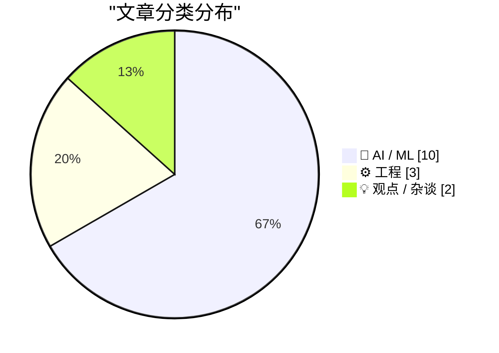
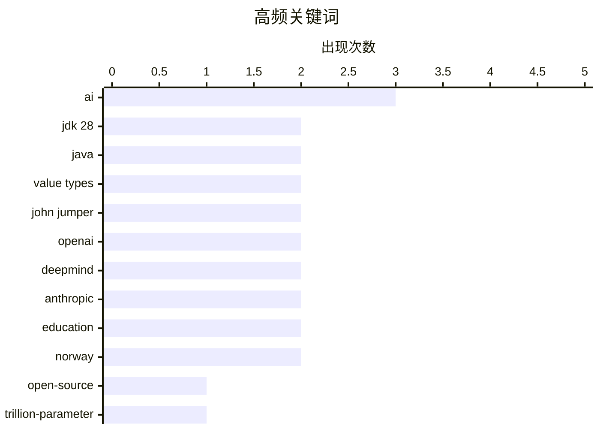

# 📰 AI 资讯每日精选 — 2026-06-20

> 汇聚 140+ 技术博客、X/Twitter、Hacker News、Reddit、Product Hunt、
> Lobste.rs、ClawFeed 日报及 GitHub Trending，经 AI 评分筛选。
>
> **本期内容**：🏆 今日必读 · 🌐 ClawFeed 日报 · 🔥 GitHub Trending · 📂 分类精选 · 🎨 设计与生成式 AI · 📊 数据概览

## 📝 今日看点

今日技术圈呈现两大焦点：一是AI人才争夺战白热化，Transformer合著者Noam Shazeer与AlphaFold负责人John Jumper在三天内相继离开谷歌，分别加入OpenAI和Anthropic，折射出顶级AI实验室间的激烈竞争；二是AI落地的现实挑战与争议并存，新基准测试显示最先进模型在真实知识工作中的完全解决率仅3%，而挪威则对小学实施近乎全面的AI禁令，引发对技术边界与教育影响的反思。此外，Java领域历经十年的Project Valhalla终将落地JDK 28，为语言性能带来重大革新。

---

## 🏆 今日必读

🥇 **开源、MIT许可的1万亿参数智能体模型（Ling/Ring 2.6）发布——可下载意味着什么**

[An open, MIT-licensed 1T agentic model (Ling/Ring 2.6) is out — what it means that this is downloadable](https://www.reddit.com/r/singularity/comments/1u9xpow/an_open_mitlicensed_1t_agentic_model_lingring_26/) — r/singularity · 15 小时前 · 🤖 AI / ML

> 蚂蚁集团发布了Ling和Ring 2.6模型，这是一个拥有1万亿参数的混合专家（MoE）模型，其中约630亿参数被激活，采用MIT开源许可。Ring模型专为智能体工作流设计，支持可调节的推理深度。一年前，“万亿参数智能体模型”还意味着只能通过API租用，而现在这个模型可以直接下载并本地运行。其可行性主要归功于两项效率优化：固定的稀疏激活比率和混合线性注意力机制，使得长上下文处理成为可能。

💡 **为什么值得读**: 这是首个可下载的万亿参数级开源智能体模型，标志着大模型从API服务向可本地部署的转变，对AI研究和应用具有里程碑意义。

🏷️ open-source, trillion-parameter, agentic model, MoE

🥈 **新基准测试揭示AI在真实知识工作中表现有多糟糕**

[New benchmark exposes how badly AI struggles with real knowledge work](https://the-decoder.com/new-benchmark-exposes-how-badly-ai-struggles-with-real-knowledge-work/) — The Decoder · 11 小时前 · 🤖 AI / ML

> 一项新的基准测试显示，即使是最先进的AI模型在模拟真实知识工作的任务中也表现不佳，完全解决率仅为3%。该测试旨在评估AI处理复杂、多步骤、需要深度推理的实际工作场景的能力，而非简单的问答或代码生成。结果表明，当前AI在需要长期规划、信息整合和判断力的知识工作领域存在显著短板。

💡 **为什么值得读**: 3%的完全解决率是一个令人警醒的数据，直接戳破了AI在知识工作领域的神话，对评估AI实际生产力有重要参考价值。

🏷️ AI, benchmark, knowledge work, limitations

🥉 **Project Valhalla详解：十年磨一剑，终抵JDK 28**

[Project Valhalla, Explained: How a Decade of Work Arrives in JDK 28](https://www.jvm-weekly.com/p/project-valhalla-explained-how-a) — Hacker News Best · 19 小时前 · ⚙️ 工程

> 文章详细介绍了Project Valhalla，这是Java语言和JVM历时近十年的一项重大改进，最终将在JDK 28中落地。核心是引入值类型（Value Types）和基本类型泛型，旨在解决Java中对象装箱带来的内存和性能开销问题。通过将小而不可变的数据类型（如复数、坐标）作为值类型处理，可以显著减少内存占用和垃圾回收压力，同时保持与现有代码的兼容性。

💡 **为什么值得读**: Project Valhalla是Java生态十年来最重要的底层变革之一，理解它将帮助Java开发者提前掌握未来性能优化的关键方向。

🏷️ Project Valhalla, JDK 28, Java, value types

4️⃣ **三天内：Transformer合著者Noam Shazeer离开谷歌加入OpenAI，诺贝尔奖得主、AlphaFold负责人John Jumper离开谷歌DeepMind加入Anthropic**

[In the span of 3 days: Noam Shazeer (Transformer co-author) leaves Google for OpenAI, and John Jumper (Nobel laureate, AlphaFold lead) leaves Google DeepMind for Anthropic](https://www.reddit.com/r/singularity/comments/1ua6gv6/in_the_span_of_3_days_noam_shazeer_transformer/) — r/singularity · 9 小时前 · 🤖 AI / ML

> 在短短三天内，两位谷歌AI领域的顶尖人物相继离职：Transformer论文合著者Noam Shazeer加入OpenAI，诺贝尔奖得主、AlphaFold项目负责人John Jumper离开谷歌DeepMind加入Anthropic。此前，AlphaGo研究员David Silver也已离职创业。这标志着谷歌在短短几个月内流失了三位最具影响力的AI科学家，反映出当前AI人才争夺战的激烈程度。

💡 **为什么值得读**: 顶级AI人才的集中流失揭示了谷歌在AI人才竞争中的危机，也预示着OpenAI和Anthropic在基础研究和生物计算领域的战略布局。

🏷️ Noam Shazeer, John Jumper, Google, OpenAI

5️⃣ **Project Valhalla详解：十年磨一剑，终抵JDK 28**

[Project Valhalla, Explained: How a Decade of Work Arrives in JDK 28](https://www.jvm-weekly.com/p/project-valhalla-explained-how-a) — Lobste.rs · 10 小时前 · ⚙️ 工程

> 文章详细介绍了Project Valhalla，这是Java语言和JVM历时近十年的一项重大改进，最终将在JDK 28中落地。核心是引入值类型（Value Types）和基本类型泛型，旨在解决Java中对象装箱带来的内存和性能开销问题。通过将小而不可变的数据类型（如复数、坐标）作为值类型处理，可以显著减少内存占用和垃圾回收压力，同时保持与现有代码的兼容性。

💡 **为什么值得读**: Project Valhalla是Java生态十年来最重要的底层变革之一，理解它将帮助Java开发者提前掌握未来性能优化的关键方向。

🏷️ Java, Valhalla, value types, JDK 28

---

## 🌐 ClawFeed 日报精选

> 来源：[ClawFeed](https://clawfeed.kevinhe.io) — AI 驱动的多源新闻聚合

# ClawFeed Daily Digest | 2026-06-18 (Wed)

> 基于 6 份 4h digest（#681 #684 #685 #686 #687 #688）汇总。#681 为 Jun 17 晚档（16:00-20:00 SGT），未纳入 Jun 17 日报 #682，此处补收。

---

## 🔥 当日全场最重要 5 条

1. **NVIDIA ENPIRE Physical AutoResearch** — Jim Fan 团队首次让 AI AutoResearch 进入物理世界：8 个 Codex agent 同时控制一整支机器人舰队 + GPU 集群，目标是让机器人不闲着、尽快解决任务。最硬的不是按 Enter，而是按之前的安全 harness 设计（防撞、物理约束、故障恢复）。AI 从代码世界走进物理世界的里程碑。
2. **Noam Shazeer 加入 OpenAI** — Transformer 论文共同作者、MoE 架构提出者、前 Character AI CEO。谷歌此前花 $27 亿收购 Character 就为留他，结果没多久出走 OpenAI 做模型架构研究。AI 人才争夺战最强信号。
3. **Vercel 一天三连发：Eve + Connect + Passport** — Eve 开源 agent 框架（durable execution + 沙箱 + human-in-the-loop + subagents），Connect 统一 OAuth token 管理（给 agent 短期 scoped token 访问 Slack/GitHub/Salesforce），Passport 内部应用零代码身份认证。Agent 基础设施全家桶成型。Guillermo Rauch 直言"构建 agent 最难的不是 agent 本身，而是数据——OAuth、token、credential、scope"。
4. **Cursor 本地 agent → 云端，移动端即将 GA** — 本地 agent 一键推上云端，关掉笔记本继续跑；手机端发 prompt、并行多 agent、收 PR + demo。从"本地 IDE copilot"到"云端 agent 调度中心"的范式转型落地。
5. **Midjourney 发布全身医疗扫描仪** — 无辐射、1 分钟完成扫描、部分成像优于 MRI。从 AI 绘画公司到医疗硬件的跨界转型，AI 公司向物理世界扩展的新案例。

---

## 📰 当日核心主题

### Agent 基础设施成熟化
Vercel Eve/Connect/Passport 三连发 + Cursor 云端 agent + Raft Joint Channels（跨组织 agent 协作频道） — agent 从"能跑"走向"能部署、能协作、能安全授权"。stdrc 说得好："don't talk to me, talk to my agents。"

### AI 走出软件
NVIDIA ENPIRE 让 agent 控制物理机器人；Midjourney 跨界医疗硬件；Odyssey 获 $310M B 轮做通用世界模型（Amazon、GV、AMD 投资）；OpenAI LifeSciBench 瞄准真实科研场景。AI 从语言理解走向世界模拟和物理交互。

### AI 人才与地缘政治
Noam Shazeer → OpenAI 是人才争夺最大新闻。G7 AI 午餐会 Altman + Amodei 与各国首脑同桌，美国限制 Anthropic 最先进模型出口引发盟友紧张。AI 能力集中度成为国际议题。

### 开源追赶闭源
GLM-5.2 在 Code Arena Frontend 排第 2，超越 Claude Opus 4.7（Thinking）。Haseeb Qureshi 公开认错更新判断。OpenAI 向 Rust Foundation 投 $60 万（白金会员），Greg Brockman："Rust is the future of systems programming"。Firecrawl 无 API key 免费开放全线功能。

### Agent 经济体形成
微信推出 AI 专属卡——用户在 Agent 对话中直接完成推荐→下单→付款，钱包隔离限额。LLM 已占 Walmart/Target 等零售商 2% referral traffic（同比 3x）。企业 Claude 支出 $3.1K/工程师/月。YC 2026 春季 Demo Day 头部公司 Tasklet $500 万 ARR。Applied AI 层从"薄壳"变成有真正壁垒的商业层。

---

## 🔖 累计 Bookmark 精选

- **Chormex 实时 AI 翻译** — GPT-Realtime-2 驱动，YouTube/直播/会议/演讲全场景实时翻译，Greg Brockman 转推
- **MiMo-V2.5 推理优化** — Hybrid Sliding Window Attention，UltraSpeed 模式 1000 tokens/s，5 人 14 天 vibe-coding 完成
- **Google DESIGN.md** — 一个 Markdown 文件教会 AI Coding Agent 整套设计系统，不需要 Figma/JSON

---

## 👀 推荐关注汇总（去重）

| 账号 | 理由 |
|------|------|
| @DrJimFan (Jim Fan, NVIDIA) | Physical AI + embodied agents 持续深度输出，ENPIRE 等前沿工作第一手信息源 |
| @istdrc (stdrc) | Raft 创始人，前 Kimi CLI / RisingWave 内核，agent-native 协作工具 builder |
| @huang_biwei (Biwei Huang) | CMU 因果 AI 教授，Aether AI 创始人，$2000 万种子轮，因果世界模型方向 |
| @hosseeb (Haseeb Qureshi) | Dragonfly 合伙人，AI+crypto 双线视角，敢于公开认错更新判断 |
| @dongxi_nlp (马东锡) | "Context Is A Projection" 系列，coding agent 架构哲学级深度思考 |
| @_LuoFuli (Fuli Luo) | 前 DeepSeek → Xiaomi MiMo 团队，一手大模型训练/推理经验 |
| @sainingxie (Saining Xie) | AmiLabs 联创兼首席科学家，视觉/多模态基础模型方向 |

> 注：均未通过浏览器核实是否已关注，操作前请先搜一下。

---

## 💤 当日重复噪音模式

1. **Elon Musk 政治转推** — 每个时段都有，英国政治、SEC 争议、非 AI 评论，一律过滤
2. **政治/生活内容** — Obama 校友聚会、JD Vance MLB 评论、Modi 演讲、Cristiano 足球、邮轮打卡，与 AI/crypto/tech 无关
3. **Crypto 社交刷量** — Kaito 互点、"gm frens"、follow-for-follow、BTC 矿机广告
4. **跨时段重复报道** — Cursor 云端 agent（3 个时段重复）、Vercel Eve（3 个时段重复）、Noam Shazeer 加入 OpenAI（2 个时段重复）— 日报已去重合并
5. **营销/卖课内容** — "60 分钟用 Claude 月赚 $7200"、"加微信"引流帖

---

*Aggregated from 4h digests #681 #684 #685 #686 #687 #688 | Generated 2026-06-18 23:55 SGT*---

## 🔥 GitHub Trending

> 今日热门开源项目（全语言 + Python）

| # | 项目 | 描述 | ⭐ 总星 | 📈 今日 | 语言 |
|---|------|------|---------|---------|------|
| 1 | [chopratejas/headroom](https://github.com/chopratejas/headroom) 🤖 | Compress tool outputs, logs, files, and RAG chunks before... | 38.8k | +4005 | Python |
| 2 | [google-research/timesfm](https://github.com/google-research/timesfm) | TimesFM (Time Series Foundation Model) is a pretrained ti... | 24.1k | +1510 | Python |
| 3 | [obra/superpowers](https://github.com/obra/superpowers) | An agentic skills framework & software development method... | 233.4k | +1110 | Shell |
| 4 | [DeusData/codebase-memory-mcp](https://github.com/DeusData/codebase-memory-mcp) | High-performance code intelligence MCP server. Indexes co... | 8.3k | +1058 | C |
| 5 | [palmier-io/palmier-pro](https://github.com/palmier-io/palmier-pro) 🤖 | macOS video editor built for AI | 1.9k | +756 | Swift |
| 6 | [zai-org/GLM-5](https://github.com/zai-org/GLM-5) | GLM-5: From Vibe Coding to Agentic Engineering | 4.6k | +480 | - |
| 7 | [public-apis/public-apis](https://github.com/public-apis/public-apis) | A collective list of free APIs | 442.9k | +367 | Python |
| 8 | [withastro/flue](https://github.com/withastro/flue) 🤖 | The sandbox agent framework. | 5.8k | +309 | TypeScript |
| 9 | [n0-computer/iroh](https://github.com/n0-computer/iroh) | IP addresses break, dial keys instead. Modular networking... | 10.3k | +302 | Rust |
| 10 | [Kong/insomnia](https://github.com/Kong/insomnia) | The open-source, cross-platform API client for GraphQL, R... | 39.0k | +292 | TypeScript |
| 11 | [github/spec-kit](https://github.com/github/spec-kit) | 💫 Toolkit to help you get started with Spec-Driven Devel... | 114.2k | +284 | Python |
| 12 | [Lightricks/LTX-2](https://github.com/Lightricks/LTX-2) 🤖 | Official Python inference and LoRA trainer package for th... | 7.7k | +196 | Python |
| 13 | [stanford-oval/storm](https://github.com/stanford-oval/storm) 🤖 | An LLM-powered knowledge curation system that researches ... | 28.8k | +196 | Python |
| 14 | [koala73/worldmonitor](https://github.com/koala73/worldmonitor) 🤖 | Real-time global intelligence dashboard. AI-powered news ... | 57.3k | +156 | TypeScript |
| 15 | [calesthio/OpenMontage](https://github.com/calesthio/OpenMontage) 🤖 | World's first open-source, agentic video production syste... | 6.3k | +156 | Python |

---

## 🤖 AI / ML

### 1. 开源、MIT许可的1万亿参数智能体模型（Ling/Ring 2.6）发布——可下载意味着什么

[An open, MIT-licensed 1T agentic model (Ling/Ring 2.6) is out — what it means that this is downloadable](https://www.reddit.com/r/singularity/comments/1u9xpow/an_open_mitlicensed_1t_agentic_model_lingring_26/) — **r/singularity** · 15 小时前 · ⭐ 27/30

> 蚂蚁集团发布了Ling和Ring 2.6模型，这是一个拥有1万亿参数的混合专家（MoE）模型，其中约630亿参数被激活，采用MIT开源许可。Ring模型专为智能体工作流设计，支持可调节的推理深度。一年前，“万亿参数智能体模型”还意味着只能通过API租用，而现在这个模型可以直接下载并本地运行。其可行性主要归功于两项效率优化：固定的稀疏激活比率和混合线性注意力机制，使得长上下文处理成为可能。

🏷️ open-source, trillion-parameter, agentic model, MoE

---

### 2. 新基准测试揭示AI在真实知识工作中表现有多糟糕

[New benchmark exposes how badly AI struggles with real knowledge work](https://the-decoder.com/new-benchmark-exposes-how-badly-ai-struggles-with-real-knowledge-work/) — **The Decoder** · 11 小时前 · ⭐ 26/30

> 一项新的基准测试显示，即使是最先进的AI模型在模拟真实知识工作的任务中也表现不佳，完全解决率仅为3%。该测试旨在评估AI处理复杂、多步骤、需要深度推理的实际工作场景的能力，而非简单的问答或代码生成。结果表明，当前AI在需要长期规划、信息整合和判断力的知识工作领域存在显著短板。

🏷️ AI, benchmark, knowledge work, limitations

---

### 3. 三天内：Transformer合著者Noam Shazeer离开谷歌加入OpenAI，诺贝尔奖得主、AlphaFold负责人John Jumper离开谷歌DeepMind加入Anthropic

[In the span of 3 days: Noam Shazeer (Transformer co-author) leaves Google for OpenAI, and John Jumper (Nobel laureate, AlphaFold lead) leaves Google DeepMind for Anthropic](https://www.reddit.com/r/singularity/comments/1ua6gv6/in_the_span_of_3_days_noam_shazeer_transformer/) — **r/singularity** · 9 小时前 · ⭐ 26/30

> 在短短三天内，两位谷歌AI领域的顶尖人物相继离职：Transformer论文合著者Noam Shazeer加入OpenAI，诺贝尔奖得主、AlphaFold项目负责人John Jumper离开谷歌DeepMind加入Anthropic。此前，AlphaGo研究员David Silver也已离职创业。这标志着谷歌在短短几个月内流失了三位最具影响力的AI科学家，反映出当前AI人才争夺战的激烈程度。

🏷️ Noam Shazeer, John Jumper, Google, OpenAI

---

### 4. 谷歌DeepMind再失顶级AI研究员：诺贝尔奖得主John Jumper跳槽Anthropic

[Google Deepmind loses another top AI researcher as Nobel laureate John Jumper leaves for Anthropic](https://the-decoder.com/google-deepmind-loses-another-top-ai-researcher-as-nobel-laureate-john-jumper-leaves-for-anthropic/) — **The Decoder** · 7 小时前 · ⭐ 25/30

> 诺贝尔奖得主、AlphaFold项目负责人John Jumper在任职近九年后离开谷歌DeepMind，加入Anthropic。此前几天，Gemini联合负责人Noam Shazeer已离职加入OpenAI；几周前，AlphaGo研究员David Silver也离职创业。这意味着谷歌在短短数月内失去了三位最杰出的AI科学家。

🏷️ DeepMind, Anthropic, talent, Nobel

---

### 5. [SemiAnalysis] 别再说什么“2026年美国一半数据中心容量被取消”了

[[SemiAnalysis] Stop Saying Half of 2026 US Datacenter Capacity Is Canceled](https://www.reddit.com/r/singularity/comments/1ua1ifj/semianalysis_stop_saying_half_of_2026_us/) — **r/singularity** · 12 小时前 · ⭐ 25/30

> 针对市场上流传的“2026年美国一半数据中心容量被取消”的说法，SemiAnalysis发布分析报告予以驳斥。报告指出，这些说法源于对数据中心项目取消和延迟的误读，实际取消比例远低于50%。报告认为，虽然部分项目因电力供应、审批或需求变化而调整，但整体AI算力需求仍在快速增长，数据中心建设并未出现大规模退潮。

🏷️ datacenter, capacity, AI infrastructure, analysis

---

### 6. 引用Sean Lynch：MCP的真正价值

[Quoting Sean Lynch](https://simonwillison.net/2026/Jun/19/sean-lynch/#atom-everything) — **simonwillison.net** · 2 小时前 · ⭐ 24/30

> Sean Lynch在评论中指出，MCP（模型上下文协议）相对于传统的技能/CLI方式，其真正有价值的能力在于将认证流程隔离在智能体的上下文窗口之外，甚至完全脱离智能体的控制。他认为，MCP的理想形态可能仅仅是一个API的认证网关，仅此一项就已经是巨大的胜利。

🏷️ MCP, agent, auth, context window

---

### 7. AI中心的数据黑洞

[The data black hole at the center of AI](https://www.dwarkesh.com/p/the-sample-efficiency-black-hole-2) — **dwarkesh.com** · 8 小时前 · ⭐ 24/30

> 文章指出，当前AI模型展现出的惊人能力背后，隐藏着一个巨大的“数据黑洞”——即对海量训练数据的极端依赖。尽管模型在推理、编程等任务上表现亮眼，但其核心的样本效率极低，需要吞噬天文数字级别的数据才能涌现出这些能力。作者认为，这种“数据黑洞”现象是当前AI发展的根本瓶颈，它限制了模型的泛化能力和可解释性。结论是，如果不解决样本效率问题，AI能力的进一步突破将面临天花板。

🏷️ AI, data, training, scaling

---

### 8. 挪威禁止小学使用生成式AI工具，以保护儿童基础学习技能

[Norway bans generative AI tools in elementary schools to protect kids' basic learning skills](https://the-decoder.com/norway-bans-generative-ai-tools-in-elementary-schools-to-protect-kids-basic-learning-skills/) — **The Decoder** · 6 小时前 · ⭐ 24/30

> 挪威政府宣布，从8月底起，全国1至7年级的小学生将被完全禁止使用生成式AI工具。初中和高中学生则只能在教师监督下有限使用。首相斯托尔明确表示，儿童必须先“学会阅读、写作和计算”，才能接触AI。该禁令旨在防止AI工具削弱儿童在关键成长期的基础学习能力。

🏷️ AI, education, ban, Norway

---

### 9. 诺贝尔奖得主John Jumper将离开Google DeepMind，加入Anthropic

[Nobel Winner John Jumper to Leave Google DeepMind for Anthropic](https://www.reddit.com/r/singularity/comments/1uadqbb/nobel_winner_john_jumper_to_leave_google_deepmind/) — **r/singularity** · 4 小时前 · ⭐ 24/30

> 据Reddit社区消息，因AlphaFold获得诺贝尔化学奖的John Jumper，即将离开Google DeepMind并加入AI公司Anthropic。Jumper是蛋白质结构预测领域的核心人物，其离职被视为DeepMind的重大人才流失。Anthropic目前正大力招募顶尖AI科学家，以加速其在基础模型和AI安全方面的研究。

🏷️ John Jumper, DeepMind, Anthropic, AlphaFold

---

### 10. 一颗卫星正在轨道上运行Google的Gemma 3视觉语言模型，实现星上推理

[A satellite is now running Google's Gemma 3 vision-language model in orbit, doing onboard inference instead of downlinking everything first](https://www.reddit.com/r/singularity/comments/1ua2961/a_satellite_is_now_running_googles_gemma_3/) — **r/singularity** · 12 小时前 · ⭐ 24/30

> Loft Orbital公司的YAM-9卫星成功在轨部署了Google的Gemma 3视觉语言模型，据称是首个在太空运行的VLM。卫星不再需要将所有图像下传至地面分析，而是直接在太空中对所见内容进行推理，并自主判断哪些数据值得回传。这一方案显著节省了稀缺且昂贵的卫星下行带宽和传输延迟。边缘推理能力让卫星从“数据采集器”转变为“智能观察者”。

🏷️ satellite, onboard inference, vision-language model, edge AI

---

## ⚙️ 工程

### 11. Project Valhalla详解：十年磨一剑，终抵JDK 28

[Project Valhalla, Explained: How a Decade of Work Arrives in JDK 28](https://www.jvm-weekly.com/p/project-valhalla-explained-how-a) — **Hacker News Best** · 19 小时前 · ⭐ 26/30

> 文章详细介绍了Project Valhalla，这是Java语言和JVM历时近十年的一项重大改进，最终将在JDK 28中落地。核心是引入值类型（Value Types）和基本类型泛型，旨在解决Java中对象装箱带来的内存和性能开销问题。通过将小而不可变的数据类型（如复数、坐标）作为值类型处理，可以显著减少内存占用和垃圾回收压力，同时保持与现有代码的兼容性。

🏷️ Project Valhalla, JDK 28, Java, value types

---

### 12. Project Valhalla详解：十年磨一剑，终抵JDK 28

[Project Valhalla, Explained: How a Decade of Work Arrives in JDK 28](https://www.jvm-weekly.com/p/project-valhalla-explained-how-a) — **Lobste.rs** · 10 小时前 · ⭐ 26/30

> 文章详细介绍了Project Valhalla，这是Java语言和JVM历时近十年的一项重大改进，最终将在JDK 28中落地。核心是引入值类型（Value Types）和基本类型泛型，旨在解决Java中对象装箱带来的内存和性能开销问题。通过将小而不可变的数据类型（如复数、坐标）作为值类型处理，可以显著减少内存占用和垃圾回收压力，同时保持与现有代码的兼容性。

🏷️ Java, Valhalla, value types, JDK 28

---

### 13. ATProto中没有“实例”这个概念

[There are no instances in ATProto](https://overreacted.io/there-are-no-instances-in-atproto/) — **Hacker News Best** · 10 小时前 · ⭐ 24/30

> 文章澄清了AT Protocol（ATProto）架构中的一个常见误解：它并没有传统联邦式协议（如ActivityPub）中的“实例”概念。ATProto的核心是个人数据服务器（PDS），每个用户拥有独立的数据存储，而非加入某个“实例”社区。作者指出，这种设计消除了用户迁移时的数据锁定问题，但也带来了发现和社交图谱构建上的新挑战。结论是，ATProto的架构更接近“个人数据主权”而非“社区托管”，理解这一点对开发者至关重要。

🏷️ ATProto, decentralization, protocol, architecture

---

## 💡 观点 / 杂谈

### 14. 付费内容：硅谷泡沫（第二部分）

[Premium: The Silicon Valley Bubble (Part 2)](https://www.wheresyoured.at/premium-the-silicon-valley-bubble-part-2/) — **wheresyoured.at** · 8 小时前 · ⭐ 25/30

> 文章是作者此前独家报道OpenAI 2024和2025年经审计财报的后续分析。该报道披露OpenAI在两年内花费了340亿美元，而收入仅为130.7亿美元，引发了关于其巨额亏损和商业模式可持续性的广泛讨论。作者在第二部分中进一步分析了硅谷AI投资热潮背后的泡沫风险，以及这种烧钱模式是否可持续。

🏷️ OpenAI, financials, bubble, Silicon Valley

---

### 15. 挪威对小学实施近乎全面的AI禁令

[Norway imposes near ban on AI in elementary school](https://www.reuters.com/technology/norway-imposes-near-ban-ai-elementary-school-2026-06-19/) — **Hacker News Best** · 9 小时前 · ⭐ 25/30

> 挪威政府宣布将在小学阶段实施近乎全面的AI禁令，限制学生在课堂上使用人工智能工具。该政策旨在保护儿童的数据隐私、防止过早依赖AI影响认知发展，并确保基础读写和计算能力的培养。此举引发了关于AI教育应用边界的广泛讨论。

🏷️ AI ban, education, Norway, policy

---

## 🎨 Design & Generative AI

### 🖼️ 生成式图片

- **[Midjourney扫描仪：60秒全身超声成像，媲美MRI](https://www.producthunt.com/products/midjourney)** — Product Hunt · 22 小时前
  > 利用AI图像生成技术，通过60秒超声波扫描实现全身高精度成像，有望替代传统MRI检查。

### 🌍 世界模型 / 3D

- **[4DGS：在Vision Pro上实现高保真高斯泼溅视频流](https://www.reddit.com/r/singularity/comments/1u9ucpl/4dgs_gracia_gaussian_splat_video_streaming_on/)** — r/singularity · 19 小时前
  > 一种基于4D高斯泼溅技术的实时视频流方案，专为Apple Vision Pro优化，提供沉浸式3D场景体验。

---

## 📊 数据概览

| 扫描源 | 抓取文章 | 时间范围 | 精选 |
|:---:|:---:|:---:|:---:|
| 92/140 | 3790 篇 → 76 篇 | 24h | **15 篇** |

### 分类分布



### 高频关键词



<details>
<summary>📈 纯文本关键词图（终端友好）</summary>

```
ai          │ ████████████████████ 3
jdk 28      │ █████████████░░░░░░░ 2
java        │ █████████████░░░░░░░ 2
value types │ █████████████░░░░░░░ 2
john jumper │ █████████████░░░░░░░ 2
openai      │ █████████████░░░░░░░ 2
deepmind    │ █████████████░░░░░░░ 2
anthropic   │ █████████████░░░░░░░ 2
education   │ █████████████░░░░░░░ 2
norway      │ █████████████░░░░░░░ 2
```

</details>

### 🏷️ 话题标签

**ai**(3) · **jdk 28**(2) · **java**(2) · value types(2) · john jumper(2) · openai(2) · deepmind(2) · anthropic(2) · education(2) · norway(2) · open-source(1) · trillion-parameter(1) · agentic model(1) · moe(1) · benchmark(1) · knowledge work(1) · limitations(1) · project valhalla(1) · noam shazeer(1) · google(1)

---

*生成于 2026-06-20 01:41 | 汇聚 140 个技术博客、X/Twitter、Hacker News、Reddit、Product Hunt、Lobste.rs、ClawFeed 日报及 GitHub Trending，经 AI 评分筛选出 Top 15 精华内容*
