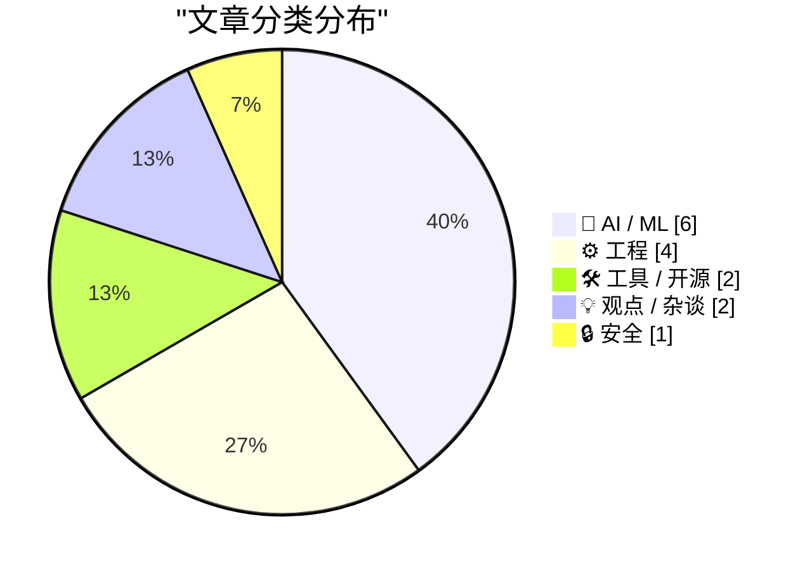
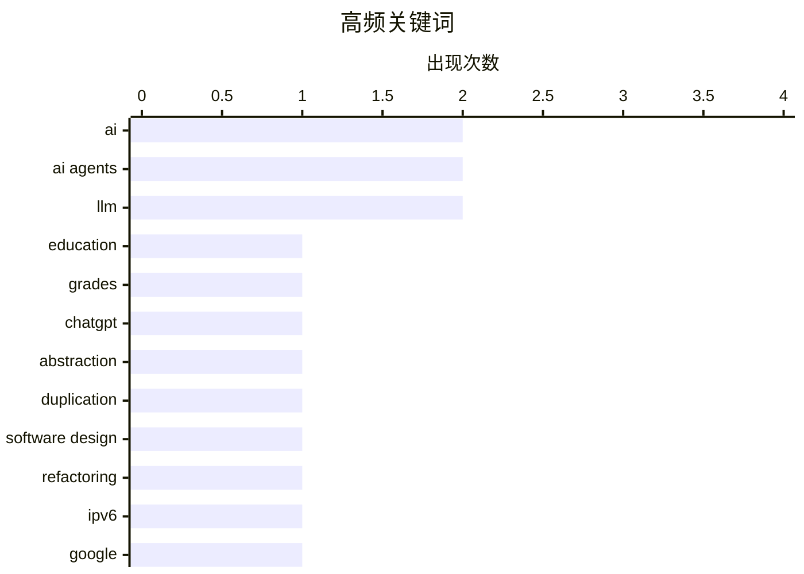

# 📰 AI 资讯每日精选 — 2026-06-22

> 汇聚 140+ 技术博客、X/Twitter、Hacker News、Reddit、Product Hunt、
> Lobste.rs、ClawFeed 日报及 GitHub Trending，经 AI 评分筛选。
>
> **本期内容**：🏆 今日必读 · 🌐 ClawFeed 日报 · 🔥 GitHub Trending · 📂 分类精选 · 🎨 设计与生成式 AI · 📊 数据概览

## 📝 今日看点

今日技术圈聚焦两大趋势：AI对教育生态的冲击与基础设施的演进。一方面，多项研究揭示学生正利用AI外包作业而非提升能力，同时Nature等机构警告过度依赖AI可能导致批判性思维退化，引发对“技能空心化”的深层忧虑；另一方面，Google IPv6流量突破50%标志网络基础设施进入新阶段，而AWS与Cloudflare则分别推出面向AI代理的业务上下文服务与临时账户功能，推动AI从工具向自主执行者进化。此外，围绕大模型规模化路线的争议持续升温，Sam Altman与学界就“规模化是否拖慢创新”展开激烈交锋。

---

## 🏆 今日必读

🥇 **AI正在抬高学生成绩，但效果指向外包作业而非更好的学习**

[AI is inflating student grades, and the effect points to outsourced work, not better learning](https://the-decoder.com/ai-is-inflating-student-grades-and-the-effect-points-to-outsourced-work-not-better-learning/) — The Decoder · 14 小时前 · 🤖 AI / ML

> 加州大学伯克利分校一项对超过50万份成绩的研究发现，ChatGPT发布后，写作和编程类课程的成绩显著上升。这种效应主要体现在家庭作业上，而非考试，表明学生正在用AI替代自己完成作业，而非借助AI提升学习能力。研究指出，AI并未带来真正的学习进步，反而可能掩盖了学生实际能力的缺失。作者认为，成绩的虚高是AI外包工作的直接结果，教育系统需要重新评估评估方式。

💡 **为什么值得读**: 用大规模真实数据揭示了AI在教育领域的双刃剑效应，对教育工作者和政策制定者具有重要警示意义。

🏷️ AI, education, grades, ChatGPT

🥈 **宁可重复代码，也不要错误的抽象（2016）**

[Prefer duplication over the wrong abstraction (2016)](https://sandimetz.com/blog/2016/1/20/the-wrong-abstraction) — Hacker News Best · 10 小时前 · ⚙️ 工程

> 文章批判了软件工程中过度追求抽象的不良倾向，指出错误的抽象比重复代码更危险。作者Sandi Metz认为，当抽象不正确时，它会迫使后续开发者不断打补丁，最终导致代码难以维护。她提出“宁可重复，也不要错误的抽象”这一原则，建议在抽象尚未成熟时，先容忍重复，直到模式清晰后再进行重构。核心观点是：过早或错误的抽象是技术债务的主要来源，而重复代码至少是诚实的。

💡 **为什么值得读**: 这是一篇经典软件工程文章，对任何写代码的人都具有持久的启发价值，能从根本上改变你对代码设计的思考方式。

🏷️ abstraction, duplication, software design, refactoring

🥉 **Google IPv6 流量占比达到 50%**

[Google Hits 50% IPv6](https://blog.apnic.net/2026/04/28/google-hits-50-ipv6/) — Hacker News Best · 17 小时前 · ⚙️ 工程

> 根据APNIC博客报道，Google的IPv6流量占比已正式突破50%大关，标志着IPv6在全球互联网中的部署进入新阶段。这一里程碑反映了全球网络基础设施向IPv6迁移的持续加速，尤其是在移动网络和新兴市场。尽管IPv6部署已取得显著进展，但仍有大量遗留系统和内容未完成迁移。作者认为，50%的临界点意味着IPv6已成为不可忽视的主流协议，网络工程师和内容提供商应加速适配。

💡 **为什么值得读**: 这是一个重要的互联网基础设施里程碑数据，对网络工程师、云服务商和互联网架构决策者具有直接参考价值。

🏷️ IPv6, Google, network, adoption

4️⃣ **面向AI代理的临时Cloudflare账户**

[Temporary Cloudflare Accounts for AI agents](https://simonwillison.net/2026/Jun/21/temporary-cloudflare-accounts/#atom-everything) — simonwillison.net · 4 小时前 · 🛠 工具 / 开源

> Cloudflare推出了临时账户功能，允许用户无需注册即可通过命令行创建Workers项目并部署。该功能虽然宣传为“面向AI代理”，但实际上对所有开发者都很有用。用户只需运行 `npx wrangler deploy --temporary` 即可快速测试和部署代码，无需绑定支付方式或创建长期账户。作者Simon Willison认为，这种零摩擦的体验降低了Cloudflare Workers的使用门槛，尤其适合快速原型和临时任务。

💡 **为什么值得读**: 这是一个极其实用的新功能，能大幅降低Cloudflare Workers的试用和开发门槛，对前端和全栈开发者来说值得立即尝试。

🏷️ Cloudflare, temporary accounts, AI agents, API

5️⃣ **AWS称AI代理缺乏业务上下文和安全性，推出两项服务填补空白**

[AWS says AI agents lack business context and security, launches two services to patch the gaps](https://the-decoder.com/aws-says-ai-agents-lack-business-context-and-security-launches-two-services-to-patch-the-gaps/) — The Decoder · 17 小时前 · 🤖 AI / ML

> AWS在纽约峰会上发布了两项新服务：Continuum 能自动检测、优先级排序并修复代码漏洞；Context 则从企业数据中构建知识图谱，为AI代理提供所需的业务上下文。这两项服务直指同一个痛点：AI代理写代码速度快，但经常出错，且缺乏对业务逻辑的理解。AWS认为，当前AI代理在安全性和业务对齐方面存在明显短板，这两项服务旨在让AI代理更可靠、更安全地融入企业工作流。

💡 **为什么值得读**: AWS官方对AI代理当前局限性的坦诚分析，以及针对性的解决方案，对企业AI落地和DevSecOps实践有直接指导意义。

🏷️ AWS, AI agents, security, knowledge graph

---

## 🌐 ClawFeed 日报精选

> 来源：[ClawFeed](https://clawfeed.kevinhe.io) — AI 驱动的多源新闻聚合

# ClawFeed Daily Digest | 2026-06-21 (Sat)

> 基于 4 份 4h digest（#695 20:00, #696 00:00, #697 04:00, #698 08:00）汇总。12:00/16:00/20:00 三档因 scraper 故障未生成（当日数据覆盖率 4/7）。#693 (16:00) 已纳入 Jun 20 日报 #694，不重复计。

---

## 🔥 当日全场最重要 5 条

1. **AlphaFold 之父 John Jumper 离开 Google DeepMind（9年），加入 Anthropic** — 2024 诺贝尔化学奖得主正式跳槽，5.5M views。继 Noam Shazeer 之后 DeepMind 又失血一位顶级科学家。Anthropic 在科学计算方向的野心暴露无遗，同时 Google AI 人才流失叙事持续发酵。（#695 #698 跨档热点）

2. **OpenAI 发布对齐突破论文「Beneficial Trait」** — 《RL Towards Broadly and Persistently Beneficial Models》用 RL 训练模型在新领域和压力下仍保持有益行为，打破"越安全越笨"的旧困局。三年来 alignment 领域最显著进展之一。（#698）

3. **"Harness Engineering" 正式命名** — @chenchengpro 总结：同模型同 benchmark，换 harness（rules/tools/skills/反馈循环）成绩从 42% → 78%。"2026 年 AI 工程最重要发现——不是模型本身，而是包裹模型的工程层决定产出质量。" 与我们 Zylos/ClawVita 的 agent harness 架构直接相关。（#697）

4. **GLM-5.2 在网页设计评测中击败 Fable 5 和 Opus 4.6** — Aaron Levie 评论开源权重模型正在接近 frontier，开源 AI 护城河论被重新定价。Z.ai 开源模型势头凶猛。（#698）

5. **GPT-Realtime-2 实时翻译产品化** — @arrakis_ai 将 OpenAI Realtime API 嵌入 Chormex 浏览器扩展，YouTube/直播/会议全场景实时翻译。Greg Brockman 亲自转推背书。从 demo 到可用产品的速度值得注意。（#696 #697 跨档热点）

---

## 📰 当日核心主题

### Google 人才大出血
John Jumper 投奔 Anthropic + Vivi 深度文章分析 Noam Shazeer 等人离开 Google 的趋势。"谷歌的末日到了吗？" 成为当日刷屏讨论。DeepMind 连失蛋白质折叠和 Transformer 两大核心功臣。

### Harness/Context 工程 > 模型能力
三条独立信号汇聚：① Harness Engineering 42%→78%（@chenchengpro）；② Aaron Levie "agent 成功的核心变量是能否拿到 context"；③ Anthropic Boris Cherny + Cat Wu 对话——模型越强越要 context minimalism，不要用又长又重的 Prompt 管死它。2026 年 AI 工程的核心共识正在形成。

### Agent 基础设施 Agent-Native 化
Cloudflare Temporary Accounts for Workers（`wrangler deploy --temporary` 秒级获得 live Worker 无需注册）、GitHub Copilot CLI GA（on-device 语音 + Rubber Duck agent）、Codex 跨主机线程热迁移——agent 不再跑在"人用的工具"上，基础设施正在为 agent 原生设计。

### 开源 AI 逼近 Frontier
GLM-5.2 beat Fable 5/Opus 4.6 + 社区热议 coding vs design 哪方面更强。@LotusDecoder 总结新老模型差异：Opus/Fable 能"脑补"残缺信息，老模型需手把手教步骤。开源 vs 闭源的能力鸿沟在特定任务上已经消失。

### AI 在科学研究的深入
OpenAI AI 化学家实验——GPT-5.4 接入 Molecule.one，围绕 Chan-Lam coupling 跑了 10,080 组实验，AI 参与研究方案+实验设计+数据分析全流程。John Jumper 加入 Anthropic 也指向同一方向：AI 正从工程工具向科学研究伙伴转变。

---

## 🔖 Bookmarks 精选

• @turingou - wanman.ai 第 14 款 vibe 产品开源：AI agent 团队帮任何人零部署创办"一人公司"
• @yangyi - Google Stitch 发布 DESIGN.md：一个 Markdown 文件教会 AI coding agent 整套设计系统
• @oragnes - Pika 给 Agent 套实时虚拟形象：替身开会、赛博保姆（带长期记忆陪聊）
• @idoubicc - 从 claude-code-sourcemap 源码逆向抽离出 open-agent-sdk，@DoveyWanCN 评论 harness 架构泄漏影响深远
• @cline - Cline Kanban：CLI-agnostic 多 agent 编排独立 app

---

## 👀 推荐关注汇总（去重）

• @arrakis_ai — GPT-Realtime-2 实时翻译 demo 制作者，AI × 浏览器扩展方向 builder，Greg Brockman 背书
• @_LuoFuli (Fuli Luo) — 现在建 @XiaomiMiMo，此前在 @deepseek_ai，中国顶尖 LLM 从业者
• @NoamShazeer — Attention Is All You Need 共同作者、Character.AI 联创，现回归 Google DeepMind。低频但每条干货
• @janleike — 前 OpenAI 对齐负责人，现 Anthropic 对齐团队。AI safety 核心人物
• @simran_s_arora — Stanford 背景，AI 在专利/法律/验证等严谨性任务上的应用
• @dingyi — 前端+AI 工具交叉领域，实操 builder 型内容

**提醒：Kevin 操作前请先在 Following 里搜一下避免重复。**

---

## 💤 当日重复噪音模式

• **Crypto 短线交易信号**：@youzi_chigua、@0xFelix、@therealchaseeb、@FabianoSolana 等多条币安/Solana 短线帖，信号密度低
• **纯生活/旅行分享**：@turingou 克罗地亚游记、@soy_muse 海藻体验、@Tyler_Did_It 负重徒步——每期必有，已稳定过滤
• **政治/名人转发**：Elon 犯罪统计、Obama 演讲、Trump 相关——非 AI/crypto 主题，全部过滤
• **低质推广/付费帖**：@NadzuAI、@Soft6161、@thedailyblock 等模板式推广帖

---

*数据覆盖率说明：当日 scraper 于 12:00 SGT 后故障（PID stuck），12:00/16:00/20:00 三档 4h digest 未生成。本日报基于可用的 4 档编制，部分下午/晚间话题可能遗漏。*
---

## 🔥 GitHub Trending

> 今日热门开源项目（全语言 + Python）

| # | 项目 | 描述 | ⭐ 总星 | 📈 今日 | 语言 |
|---|------|------|---------|---------|------|
| 1 | [chopratejas/headroom](https://github.com/chopratejas/headroom) 🤖 | Compress tool outputs, logs, files, and RAG chunks before... | 44.6k | +2624 | Python |
| 2 | [palmier-io/palmier-pro](https://github.com/palmier-io/palmier-pro) 🤖 | macOS video editor built for AI | 5.3k | +1834 | Swift |
| 3 | [mattpocock/skills](https://github.com/mattpocock/skills) 🤖 | Skills for Real Engineers. Straight from my .claude direc... | 139.9k | +1443 | Shell |
| 4 | [penpot/penpot](https://github.com/penpot/penpot) | Penpot: The open-source design tool for design and code c... | 52.3k | +1135 | Clojure |
| 5 | [DeusData/codebase-memory-mcp](https://github.com/DeusData/codebase-memory-mcp) | High-performance code intelligence MCP server. Indexes co... | 10.4k | +1032 | C |
| 6 | [calesthio/OpenMontage](https://github.com/calesthio/OpenMontage) 🤖 | World's first open-source, agentic video production syste... | 8.9k | +987 | Python |
| 7 | [NousResearch/hermes-agent](https://github.com/NousResearch/hermes-agent) 🤖 | The agent that grows with you | 199.0k | +700 | Python |
| 8 | [ZhuLinsen/daily_stock_analysis](https://github.com/ZhuLinsen/daily_stock_analysis) 🤖 | LLM 驱动的多市场股票智能分析系统：多源行情、实时新闻、决策看板与自动推送，支持零成本定时运行。 LLM-pow... | 44.6k | +568 | Python |
| 9 | [tursodatabase/turso](https://github.com/tursodatabase/turso) | Turso is an in-process SQL database, compatible with SQLite. | 20.8k | +548 | Rust |
| 10 | [bytedance/deer-flow](https://github.com/bytedance/deer-flow) | An open-source long-horizon SuperAgent harness that resea... | 72.6k | +442 | Python |
| 11 | [mukul975/Anthropic-Cybersecurity-Skills](https://github.com/mukul975/Anthropic-Cybersecurity-Skills) 🤖 | 754 structured cybersecurity skills for AI agents · Mappe... | 17.7k | +361 | Python |
| 12 | [topoteretes/cognee](https://github.com/topoteretes/cognee) 🤖 | Cognee is the open-source AI memory platform for agents. ... | 18.7k | +347 | Python |
| 13 | [smicallef/spiderfoot](https://github.com/smicallef/spiderfoot) | SpiderFoot automates OSINT for threat intelligence and ma... | 18.8k | +294 | Python |
| 14 | [asgeirtj/system_prompts_leaks](https://github.com/asgeirtj/system_prompts_leaks) 🤖 | Extracted system prompts from Anthropic - Claude Fable 5,... | 44.4k | +282 | JavaScript |
| 15 | [Alishahryar1/free-claude-code](https://github.com/Alishahryar1/free-claude-code) 🤖 | Use claude code and codex for free in the terminal, VSCod... | 36.1k | +258 | Python |

---

## 🤖 AI / ML

### 1. AI正在抬高学生成绩，但效果指向外包作业而非更好的学习

[AI is inflating student grades, and the effect points to outsourced work, not better learning](https://the-decoder.com/ai-is-inflating-student-grades-and-the-effect-points-to-outsourced-work-not-better-learning/) — **The Decoder** · 14 小时前 · ⭐ 26/30

> 加州大学伯克利分校一项对超过50万份成绩的研究发现，ChatGPT发布后，写作和编程类课程的成绩显著上升。这种效应主要体现在家庭作业上，而非考试，表明学生正在用AI替代自己完成作业，而非借助AI提升学习能力。研究指出，AI并未带来真正的学习进步，反而可能掩盖了学生实际能力的缺失。作者认为，成绩的虚高是AI外包工作的直接结果，教育系统需要重新评估评估方式。

🏷️ AI, education, grades, ChatGPT

---

### 2. AWS称AI代理缺乏业务上下文和安全性，推出两项服务填补空白

[AWS says AI agents lack business context and security, launches two services to patch the gaps](https://the-decoder.com/aws-says-ai-agents-lack-business-context-and-security-launches-two-services-to-patch-the-gaps/) — **The Decoder** · 17 小时前 · ⭐ 24/30

> AWS在纽约峰会上发布了两项新服务：Continuum 能自动检测、优先级排序并修复代码漏洞；Context 则从企业数据中构建知识图谱，为AI代理提供所需的业务上下文。这两项服务直指同一个痛点：AI代理写代码速度快，但经常出错，且缺乏对业务逻辑的理解。AWS认为，当前AI代理在安全性和业务对齐方面存在明显短板，这两项服务旨在让AI代理更可靠、更安全地融入企业工作流。

🏷️ AWS, AI agents, security, knowledge graph

---

### 3. Sam Altman称整整一代研究者因低估规模化的潜力而拖慢了AI发展

[Sam Altman says a whole generation of researchers held AI back by underestimating what scaling could do](https://the-decoder.com/sam-altman-says-a-whole-generation-of-researchers-held-ai-back-by-underestimating-what-scaling-could-do/) — **The Decoder** · 16 小时前 · ⭐ 23/30

> Sam Altman在斯坦福演讲中为LLM规模化路线辩护，并反击质疑者，称整整一代研究者因低估规模化（scaling）的潜力而拖慢了整个领域的发展。他引用OpenAI最近推翻一个数学猜想的成果作为证据，证明规模化不仅能提升性能，还能带来新的能力涌现。Altman的核心观点是：过去对规模化的怀疑是AI进步的主要障碍，而持续扩大模型规模仍是通往AGI的最可靠路径。

🏷️ Sam Altman, scaling, LLM, OpenAI

---

### 4. Claude 身份验证功能上线

[Identity verification on Claude](https://support.claude.com/en/articles/14328960-identity-verification-on-claude) — **Hacker News Best** · 13 小时前 · ⭐ 23/30

> Anthropic为Claude推出了身份验证功能，要求用户在某些场景下验证身份。该功能旨在防止滥用、提升安全性，并可能用于区分不同用户的使用权限。Hacker News上该话题获得569分和506条评论，社区讨论热烈，主要围绕隐私、用户体验和反滥用策略展开。作者认为，身份验证是AI服务走向成熟和合规的必然步骤，但也可能影响用户体验。

🏷️ Claude, identity verification, AI safety

---

### 5. LLM的有效用例

[Effective use-cases for LLMs](https://aggressivelyparaphrasing.me/2026/06/21/effective-use-cases-for-llms/) — **Lobste.rs** · 21 小时前 · ⭐ 23/30

> 文章系统梳理了大型语言模型（LLM）真正有效的使用场景，并区分了“炒作”与“实用”。作者认为，LLM在文本摘要、代码生成、翻译、头脑风暴和格式化数据提取等任务上表现出色，但在事实推理、数学计算和需要深度专业知识的领域仍不可靠。文章强调，LLM的最佳定位是“增强人类能力”而非“替代人类”，并给出了具体的选型建议和失败案例。核心观点是：理解LLM的能力边界，才能发挥其最大价值。

🏷️ LLM, use-cases, effectiveness, best practices

---

### 6. Ideogram 4 —— 他们正在封锁高精度 BF16 权重

[Ideogram 4 - They are gatekeeping the high-precision BF16 weights confirmed](https://www.reddit.com/r/StableDiffusion/comments/1ubj0s5/ideogram_4_they_are_gatekeeping_the_highprecision/) — **r/StableDiffusion** · 19 小时前 · ⭐ 22/30

> Ideogram 公司确认不会发布其 Ideogram 4 模型的高精度 BF16 权重，或至少会拖延到模型过时。该消息由 Ideogram CEO 在 YouTube 直播中透露，他表示做出这一决定是为了提供高精度 BF16 权重。此举引发了社区对模型开放性和可复现性的担忧，认为这是一种“封锁”行为。目前用户只能使用低精度版本，可能影响模型在本地部署和微调中的性能表现。

🏷️ Ideogram, weights, open source, BF16

---

## ⚙️ 工程

### 7. 宁可重复代码，也不要错误的抽象（2016）

[Prefer duplication over the wrong abstraction (2016)](https://sandimetz.com/blog/2016/1/20/the-wrong-abstraction) — **Hacker News Best** · 10 小时前 · ⭐ 25/30

> 文章批判了软件工程中过度追求抽象的不良倾向，指出错误的抽象比重复代码更危险。作者Sandi Metz认为，当抽象不正确时，它会迫使后续开发者不断打补丁，最终导致代码难以维护。她提出“宁可重复，也不要错误的抽象”这一原则，建议在抽象尚未成熟时，先容忍重复，直到模式清晰后再进行重构。核心观点是：过早或错误的抽象是技术债务的主要来源，而重复代码至少是诚实的。

🏷️ abstraction, duplication, software design, refactoring

---

### 8. Google IPv6 流量占比达到 50%

[Google Hits 50% IPv6](https://blog.apnic.net/2026/04/28/google-hits-50-ipv6/) — **Hacker News Best** · 17 小时前 · ⭐ 25/30

> 根据APNIC博客报道，Google的IPv6流量占比已正式突破50%大关，标志着IPv6在全球互联网中的部署进入新阶段。这一里程碑反映了全球网络基础设施向IPv6迁移的持续加速，尤其是在移动网络和新兴市场。尽管IPv6部署已取得显著进展，但仍有大量遗留系统和内容未完成迁移。作者认为，50%的临界点意味着IPv6已成为不可忽视的主流协议，网络工程师和内容提供商应加速适配。

🏷️ IPv6, Google, network, adoption

---

### 9. Apple 内部：内核中的 Swift

[Apple Internals: Swift in the Kernel](https://blog.calif.io/p/apple-internals-swift-in-the-kernel) — **Lobste.rs** · 17 小时前 · ⭐ 22/30

> 文章探讨了 Apple 将 Swift 语言引入操作系统内核的工程实践。核心论点是 Swift 的内存安全特性和现代语言特性可以显著减少内核中常见的内存错误（如缓冲区溢出）。作者分析了 Swift 与 C 在内核开发中的性能对比，指出 Swift 在保持接近 C 语言性能的同时，大幅降低了安全漏洞风险。结论是 Apple 正在逐步用 Swift 替换内核中的 C 代码，以提升系统整体安全性。

🏷️ Swift, kernel, Apple, internals

---

### 10. 鲁棒的任务服务器（Robust Jobserver）

[Robust Jobserver](https://codeberg.org/mlugg/robust-jobserver/src/branch/main/spec.md) — **Lobste.rs** · 11 小时前 · ⭐ 22/30

> 该规范定义了一种新型的任务服务器（Jobserver）协议，旨在解决传统 GNU Make 等工具中任务调度存在的竞态条件和死锁问题。核心方案是使用基于令牌的分布式调度算法，确保在多核并行构建中任务分配的正确性和公平性。与现有实现相比，Robust Jobserver 提供了更强的容错机制和更低的延迟。结论是这一设计可以显著提升大型软件项目的并行构建效率。

🏷️ jobserver, parallelism, build systems

---

## 🛠 工具 / 开源

### 11. 面向AI代理的临时Cloudflare账户

[Temporary Cloudflare Accounts for AI agents](https://simonwillison.net/2026/Jun/21/temporary-cloudflare-accounts/#atom-everything) — **simonwillison.net** · 4 小时前 · ⭐ 24/30

> Cloudflare推出了临时账户功能，允许用户无需注册即可通过命令行创建Workers项目并部署。该功能虽然宣传为“面向AI代理”，但实际上对所有开发者都很有用。用户只需运行 `npx wrangler deploy --temporary` 即可快速测试和部署代码，无需绑定支付方式或创建长期账户。作者Simon Willison认为，这种零摩擦的体验降低了Cloudflare Workers的使用门槛，尤其适合快速原型和临时任务。

🏷️ Cloudflare, temporary accounts, AI agents, API

---

### 12. sqlite-utils 4.0rc1 新增迁移和嵌套事务支持

[sqlite-utils 4.0rc1 adds migrations and nested transactions](https://simonwillison.net/2026/Jun/21/sqlite-utils-40rc1/#atom-everything) — **simonwillison.net** · 2 小时前 · ⭐ 23/30

> sqlite-utils 4.0rc1 版本发布，主要新增了数据库迁移（migrations）和嵌套事务（nested transactions）两大功能。sqlite-utils 是Simon Willison开发的Python库和命令行工具，在Python内置sqlite3之上提供了高级操作，包括复杂表转换和自动建表。迁移功能让数据库模式变更更加安全可控，嵌套事务则增强了复杂操作的事务管理能力。作者认为，这两个特性使sqlite-utils成为更成熟的SQLite数据库管理工具。

🏷️ sqlite-utils, migrations, transactions, Python

---

## 💡 观点 / 杂谈

### 13. AI正在毁掉我们的技能吗？早期结果并不乐观

[Is AI ruining our skills? Early results are in and they’re not good](https://www.nature.com/articles/d41586-026-01947-1) — **Lobste.rs** · 15 小时前 · ⭐ 23/30

> Nature发表文章探讨AI对人类技能的影响，早期研究结果令人担忧。研究发现，过度依赖AI工具会导致用户在批判性思维、问题解决和创造力等核心技能上出现退化。与以往技术革命不同，AI不仅替代体力劳动，还开始替代认知劳动，使得技能流失更加隐蔽和广泛。作者认为，如果不主动设计“人机协作”的边界，AI可能让人类变得“更聪明地懒惰”，最终削弱长期竞争力。

🏷️ AI, skills, productivity, impact

---

### 14. 古怪的 API 能告诉我们关于 Web 的什么？

[What can wonky APIs tell us about the web?](https://alexwlchan.net/2026/wonky-web-apis/) — **Lobste.rs** · 3 小时前 · ⭐ 22/30

> 文章通过分析 Web 平台中一些设计古怪的 API（如 `document.write`、`alert`、`history.pushState` 等），探讨了 Web 标准演进中的历史遗留问题和设计权衡。作者指出这些 API 虽然看似不合理，但反映了早期 Web 对兼容性和快速迭代的妥协。核心观点是这些“wonky” API 是 Web 发展史的活化石，揭示了技术决策背后的社会和技术约束。结论是理解这些 API 有助于更理性地看待 Web 平台的复杂性和未来方向。

🏷️ APIs, web, design, critique

---

## 🔒 安全

### 15. Loupe：一款关注隐私的 iOS 应用，揭示原生应用能看见什么

[loupe: A privacy-focused iOS app that raises awareness about what native apps can see](https://github.com/mysk-research/loupe) — **Lobste.rs** · 5 小时前 · ⭐ 22/30

> Loupe 是一款开源的 iOS 隐私监控应用，旨在让用户了解原生应用（如系统相机、相册、通讯录）在后台能访问哪些数据。它通过可视化界面展示应用对敏感权限的实时调用情况，包括摄像头、麦克风、位置等。该工具基于 iOS 的私有 API 和日志系统实现，无需越狱即可运行。核心发现是许多原生应用在用户不知情的情况下频繁访问敏感数据。

🏷️ privacy, iOS, native apps, awareness

---

## 🎨 Design & Generative AI

### 🖼️ 生成式图片

- **[Ideogram 4 高精度权重被封锁](https://www.reddit.com/r/StableDiffusion/comments/1ubj0s5/ideogram_4_they_are_gatekeeping_the_highprecision/)** — r/StableDiffusion · 19 小时前
  > 社区确认 Ideogram 4 的高精度 BF16 权重不会发布，引发开源社区不满。

- **[Ideogram 4 权重封锁与审查引发争议](https://www.reddit.com/r/StableDiffusion/comments/1ubr957/ideogram_making_2_horrible_precedent_and_we_need/)** — r/StableDiffusion · 11 小时前
  > 用户批评 Ideogram 4 未发布 BF16 权重且内置审查，对比 FLUX 2 的开放做法。

- **[免费 LoRA 过拟合检测工具发布](https://www.reddit.com/r/StableDiffusion/comments/1uc3lgw/i_made_a_free_overfitting_detective_for_lora/)** — r/StableDiffusion · 3 小时前
  > 作者开发了一款免费工具用于检测 LoRA 模型的过拟合问题，寻求社区反馈。

- **[LTX 2.3 在 RTX 5090 上的精度选择](https://www.reddit.com/r/StableDiffusion/comments/1ubmvum/ltx_23_bf16_or_nvfp4_with_rtx_5090/)** — r/StableDiffusion · 15 小时前
  > 用户询问在 RTX 5090 上使用 LTX 2.3 时 BF16 与 nvfp4 精度的性能与质量权衡。

- **[RTX 5080 跑 SDXL 速度实测](https://www.reddit.com/r/StableDiffusion/comments/1ubipox/rtx_5080_speed_on_sdxl/)** — r/StableDiffusion · 19 小时前
  > 用户升级至 RTX 5080 后测试 SDXL 生成速度，平均约 5 it/s 寻求验证。

- **[ComfyUI 单节点 Z-Image 工具发布](https://www.reddit.com/r/StableDiffusion/comments/1uc2ut0/one_node_zimage_comfyui/)** — r/StableDiffusion · 3 小时前
  > 推出 ComfyUI 单节点插件，简化 Z-Image Turbo 生成流程，无需复杂节点图。

- **[VNCCS Utils 0.5.3 移植 InvokeAI 功能](https://www.reddit.com/r/StableDiffusion/comments/1ubmqyr/vnccs_utils_053_unicanvas/)** — r/StableDiffusion · 15 小时前
  > VNCCS UniCanvas 将 InvokeAI 核心功能移植到 ComfyUI，提升工作流效率。

- **[llama-cpp-python CLIP 加载器开发心得](https://www.reddit.com/r/StableDiffusion/comments/1ubxa90/how_i_kinda_wasted_my_time_on_a_llamacpppython/)** — r/StableDiffusion · 7 小时前
  > 作者反思在 llama-cpp-python 中实现 CLIP 加载器时浪费的时间与教训。

- **[Ideogram 4 训练自动标注工具求助](https://www.reddit.com/r/StableDiffusion/comments/1ubsmjn/auto_captioning_for_ideogram_4_training/)** — r/StableDiffusion · 10 小时前
  > 用户寻求用于 Ideogram 4 训练数据集自动标注的工具与提示词建议。

- **[LTX 2.3 IC-LoRA 交叉眼效果毁掉汤姆·克鲁斯](https://www.reddit.com/r/StableDiffusion/comments/1ubn0gi/ruined_tom_cruise_used_ltx_23_iclora_crosseyed/)** — r/StableDiffusion · 15 小时前
  > 使用 LTX 2.3 和 IC-LoRA 生成汤姆·克鲁斯图像，因交叉眼效果导致失败。

- **[Ace Step 1.5 Turbo LoRa 音乐风格模型发布](https://www.reddit.com/r/StableDiffusion/comments/1ubepb9/release_ace_step_15_turbo_lora_trained_on_my/)** — r/StableDiffusion · 23 小时前
  > 基于作者自产暗黑电子音乐训练的 LoRa 模型发布，用于图像生成。

### 🌍 世界模型 / 3D

- **[虚幻引擎中的 NeuralCompanion 项目](https://www.reddit.com/r/StableDiffusion/comments/1ublkzg/neuralcompanion_an_unreal_engine/)** — r/StableDiffusion · 16 小时前
  > 作者分享在虚幻引擎中开发 NeuralCompanion 的进展，结合 AI 与 3D 场景。

### 🎬 生成式视频

- **[自建实时视频编辑器替代方案第8天](https://www.reddit.com/r/StableDiffusion/comments/1ubwqow/trying_to_make_my_alternative_to_that_decartais/)** — r/StableDiffusion · 8 小时前
  > 开发者尝试打造 DecartAI 实时视频编辑器的替代品，持续更新进展。

- **[SCAIL-2 唇形同步效果评价](https://www.reddit.com/r/StableDiffusion/comments/1uc3rjl/scail2_for_lipsync_eh_not_great_not_terrible/)** — r/StableDiffusion · 3 小时前
  > 用户测试 SCAIL-2 唇形同步工具，认为效果一般，不算好也不算差。

- **[首个10分钟音乐视频项目分享](https://www.reddit.com/r/StableDiffusion/comments/1uc4j38/my_first_10_min_music_video_project/)** — r/StableDiffusion · 2 小时前
  > 作者展示其首个10分钟音乐视频项目，感谢社区支持并分享创作经验。

---

## 📊 数据概览

| 扫描源 | 抓取文章 | 时间范围 | 精选 |
|:---:|:---:|:---:|:---:|
| 91/140 | 3767 篇 → 60 篇 | 24h | **15 篇** |

### 分类分布



### 高频关键词



<details>
<summary>📈 纯文本关键词图（终端友好）</summary>

```
ai              │ ████████████████████ 2
ai agents       │ ████████████████████ 2
llm             │ ████████████████████ 2
education       │ ██████████░░░░░░░░░░ 1
grades          │ ██████████░░░░░░░░░░ 1
chatgpt         │ ██████████░░░░░░░░░░ 1
abstraction     │ ██████████░░░░░░░░░░ 1
duplication     │ ██████████░░░░░░░░░░ 1
software design │ ██████████░░░░░░░░░░ 1
refactoring     │ ██████████░░░░░░░░░░ 1
```

</details>

### 🏷️ 话题标签

**ai**(2) · **ai agents**(2) · **llm**(2) · education(1) · grades(1) · chatgpt(1) · abstraction(1) · duplication(1) · software design(1) · refactoring(1) · ipv6(1) · google(1) · network(1) · adoption(1) · cloudflare(1) · temporary accounts(1) · api(1) · aws(1) · security(1) · knowledge graph(1)

---

*生成于 2026-06-22 02:09 | 汇聚 140 个技术博客、X/Twitter、Hacker News、Reddit、Product Hunt、Lobste.rs、ClawFeed 日报及 GitHub Trending，经 AI 评分筛选出 Top 15 精华内容*
