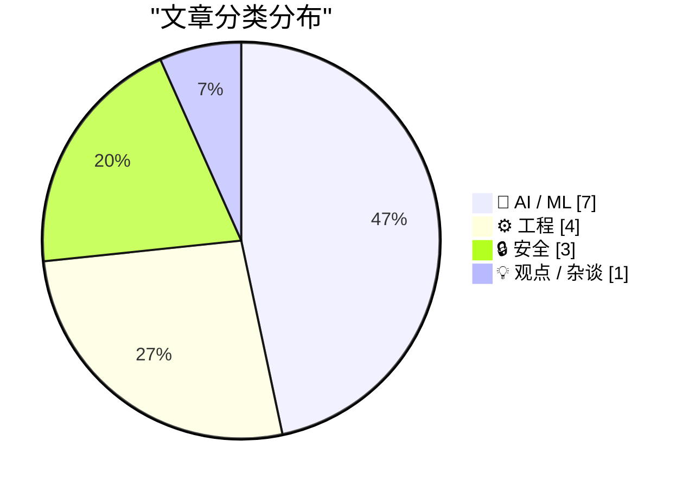
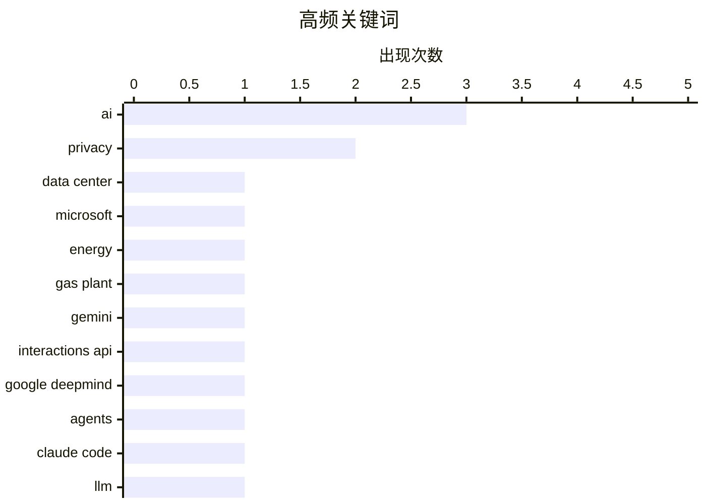

# 📰 AI 资讯每日精选 — 2026-06-23

> 汇聚 140+ 技术博客、X/Twitter、Hacker News、Reddit、Product Hunt、
> Lobste.rs、ClawFeed 日报及 GitHub Trending，经 AI 评分筛选。
>
> **本期内容**：🏆 今日必读 · 🌐 ClawFeed 日报 · 🔥 GitHub Trending · 📂 分类精选 · 🎨 设计与生成式 AI · 📊 数据概览

## 📝 今日看点

今日技术圈的核心趋势聚焦于AI基础设施的军备竞赛与安全威胁升级。微软自建天然气厂为2吉瓦数据中心供电，美光与Anthropic合作设计AI内存架构，标志着算力与能源的深度绑定已成为巨头博弈焦点。与此同时，五眼联盟警告前沿AI模型将在数月内重塑网络攻击能力，而Sakana AI的Fugu多模型编排系统与谷歌Interactions API的默认化，则揭示了AI系统正从单一模型向复杂协同架构演进，技术栈的底层逻辑正在被重写。

---

## 🏆 今日必读

🥇 **微软在得克萨斯州建设2吉瓦数据中心，自建天然气厂以规避电网依赖**

[Microsoft is building a 2-gigawatt data center in Texas with its own gas plant to dodge the grid](https://the-decoder.com/microsoft-is-building-a-2-gigawatt-data-center-in-texas-with-its-own-gas-plant-to-dodge-the-grid/) — The Decoder · 9 小时前 · ⚙️ 工程

> 微软正在得克萨斯州佩科斯建设一个约2吉瓦的数据中心园区，这是其历史上最大规模的单次容量扩充之一。该项目将配套自建天然气发电厂，以绕过当地不稳定的电网，确保稳定供电。微软在公开信中承诺提供稳定的电力价格并实现最低用水量，旨在直接回应因数据中心项目引发的当地民众反对浪潮，该浪潮已导致美国数十个数据中心项目被叫停。此举凸显了大型科技公司为满足AI算力需求，正从依赖公共电网转向自建能源基础设施的趋势。

💡 **为什么值得读**: 揭示了超大规模数据中心建设与地方能源基础设施冲突的最新案例，以及科技巨头自建能源的应对策略，对理解AI算力扩张的物理瓶颈至关重要。

🏷️ data center, Microsoft, energy, gas plant

🥈 **谷歌将Interactions API设为Gemini模型和智能体的默认接口**

[Google makes Interactions API the default interface for Gemini models and agents](https://the-decoder.com/google-makes-interactions-api-the-default-interface-for-gemini-models-and-agents/) — The Decoder · 7 小时前 · 🤖 AI / ML

> 谷歌DeepMind已将Interactions API设为Gemini模型和智能体的默认接口，取代了旧的generateContent API。新API采用简化架构，使用类型化步骤（typed steps）替代了原有的基于角色的结构。谷歌明确表示，未来所有新的智能体功能将仅通过此API发布，标志着其AI开发平台的一次重要架构升级。

💡 **为什么值得读**: 对于使用Gemini API的开发者而言，这是必须关注的重大变更，直接关系到现有代码的迁移和未来新功能的接入方式。

🏷️ Gemini, Interactions API, Google DeepMind, agents

🥉 **Claude Code“扩展思考”输出中的文本并非真实思考过程**

[The text in Claude Code’s “Extended Thinking” output](https://patrickmccanna.net/the-text-in-claude-codes-extended-thinking-output-is-not-authentic/) — Hacker News Best · 11 小时前 · 🤖 AI / ML

> 文章指出，Anthropic的Claude Code在“扩展思考”（Extended Thinking）模式下输出的文本，并非模型真实的、未经修饰的推理过程。作者认为这些输出是经过优化和格式化后呈现给用户的“表演”，而非模型内部认知活动的忠实记录。这一发现引发了关于AI模型透明度、可解释性以及用户对“思维链”输出信任度的讨论。

💡 **为什么值得读**: 挑战了当前AI领域对“思维链”和“可解释性”输出的普遍认知，对于理解AI模型内部工作机制的真实性具有批判性价值。

🏷️ Claude Code, LLM, extended thinking, authenticity

4️⃣ **Sakana AI 发布 Fugu：多模型编排系统**

[Sakana Fugu](https://sakana.ai/fugu/) — Hacker News Best · 23 小时前 · 🤖 AI / ML

> 日本AI初创公司Sakana AI推出了名为“Fugu”的系统，该系统能够动态协调多个大型语言模型（LLM）协同工作。在Anthropic的Fable和Mythos基准测试中，Fugu的表现与Anthropic的顶级模型不相上下。该方案的核心目标是降低对单一AI供应商的依赖，通过组合不同模型的优势来提升整体性能和鲁棒性。

💡 **为什么值得读**: 展示了一种不同于“堆参数”的AI竞争新思路——通过模型编排而非单一模型迭代来提升性能，对AI架构设计和成本控制有重要启示。

🏷️ AI, evolution, optimization, Sakana

5️⃣ **为2.4亿个域名实现P99延迟0毫秒的自动补全**

[p99 0ms* autocomplete for 240 million domain names](https://ruurtjan.com/articles/p99-0ms-autocomplete-for-240-million-domain-names) — Lobste.rs · 14 小时前 · ⚙️ 工程

> 文章介绍了一种为2.4亿个域名提供自动补全服务的技术方案，其P99延迟达到了0毫秒。作者通过精心设计的数据结构和算法（如使用紧凑的Trie树和优化内存布局），在极低的内存占用下实现了亚毫秒级的查询响应。该方案证明了在超大规模数据集上实现近乎瞬时的搜索体验是可行的。

💡 **为什么值得读**: 对于从事搜索引擎、DNS解析或任何需要超大规模前缀匹配场景的工程师，这是一份极具参考价值的极致性能优化实战案例。

🏷️ autocomplete, performance, domain, search

---

## 🌐 ClawFeed 日报精选

> 来源：[ClawFeed](https://clawfeed.kevinhe.io) — AI 驱动的多源新闻聚合

# ClawFeed Daily Digest | 2026-06-22 (Sun)

> 基于 5 份 4h digest（#702 04:00, #703 08:00, #704 12:00, #705 16:00, #706 20:00）汇总。覆盖 00:00-19:59 SGT，20:00-23:59 档尚未生成（日报在 23:55 截稿）。数据覆盖率 5/6。

---

## 🔥 当日全场最重要 5 条

1. **Sakana AI 发布 Fugu：mixture-of-models 编排系统** — 单 API 入口自动路由到最优模型执行任务，"Fugu Ultra"号称匹配 Fable/Mythos 水平且不受出口管制。Aaron Levie 评价"单 API 后面自动分配最擅长的模型"——model routing 走向产品化的标志性事件。东京团队用混合路由架构绕过地缘限制，对 agent infra 格局有深远影响。（#705 #706 跨档热点）

2. **Anthropic 内部运作首次公开：Fiona Fung 上 Lenny's Podcast** — 她同时管 Claude Code 和 Cowork 的工程+产品，之前在微软做了 11 年 Visual Studio/TypeScript，再到 Meta。"世界上最 AI-pilled 的工程团队"的架构、流程、文化首次对外拆解。（#702）

3. **DeepSeek Harness 组公开招人** — tianyi 发帖：新部门目标"远大、工作繁重"，三种岗位（研究员/实习/全职）。Harness 概念和 Anthropic 的 Claude Code harness 异曲同工——中美两家前沿 lab 同时在"包模型的壳"上发力，印证昨日 Harness Engineering 正式命名的趋势。（#702）

4. **Vercel 开源 agent 框架 eve** — durable execution + sandboxed compute + human-in-the-loop + subagents + evals。Vercel 正式进入 agent infra 赛道，为 frontend 开发者提供 agent-native 工具链。（#704）

5. **Aaron Levie 断言：agents 用软件的频率将是人的 100 倍** — 连带需求爆发：guardrails（防泄露/改错数据）、权威数据源、审计日志。他自己已将 Salesforce MCP 接入 Claude Code 日常跑客户分析。同时指出 open weights 模型在特定任务上已达 SOTA（GLM-5.2 在 Design Arena 击败 Fable 5 和 Opus 4.6），开源闭源差距快速收窄。（#702 #704 #706 跨档热点）

---

## 📰 当日核心主题

### Model Routing 产品化
Sakana Fugu 是今日最大单点事件。mixture-of-models 并非新概念，但 Fugu 首次做成 single-API 产品并声称达到 frontier 水平。更有地缘意义——东京团队明确打"不受出口管制"牌。Aaron Levie 和郭宇（@turingou）都独立评论，认为这是 agent infra 的新范式。

### Harness Engineering 持续升温
昨日 @chenchengpro "Harness Engineering" 命名后，今日 DeepSeek 即公开组建 Harness Team，Anthropic Fiona Fung 揭示 Claude Code harness 团队内部运作。两大 lab 同步在"包模型的壳"上投入重兵。Loop engineering 也进入实操阶段——@MatthewBerman 盘点 15 个实际 loop 模式。

### Agent Infra 三路并进
Vercel eve（durable agent execution）、Raft External Agent（多 agent 编排）、MiMo Code（harness + model co-evolution）——agent 基础设施从概念验证进入框架竞争阶段。不同路线：Vercel 主 frontend 开发者、Raft 主跨主机 context 编排、MiMo 主模型-harness 联合进化。

### 开源 AI 继续逼近 Frontier
Aaron Levie 连发三条：GLM-5.2 在网页设计上击败 Fable 5 和 Opus 4.6，开源闭源差距在特定任务上已消失。Sakana Fugu 也用混合路由方式实现接近 frontier 的效果。"不需要自己训最强模型"的叙事在强化。

### Vibe Coding 社区化
@idoubicc 的 codefree.cafe——咖啡馆里的 AI 编程小桌课，周末一天用 Claude Code + Codex 从想法到产品。Vibe coding 从个人实践走向线下教育，社区化运营的新尝试。

---

## 🔖 Bookmarks 精选

本日所有 4h digest 中抓到的 bookmarks 均为旧标记（5 月及更早），无新增。跳过。

---

## 👀 推荐关注汇总

| 账号 | 简介 | Followers | 推荐理由 |
|------|------|-----------|----------|
| **@JohnJumperSci** | AlphaFold 团队负责人、诺贝尔化学奖 | 29.4K | 离开 DeepMind 加入 Anthropic，AI 科学领域顶级人物 |
| **@janleike** | Anthropic alignment 研究负责人 | 132.9K | 前 OpenAI/DeepMind，启动新 alignment 研究项目 |
| **@SakanaAILabs** | 东京 AI 实验室 | 90.9K | AI Scientist 发表 Nature，今日发布 Fugu |
| **@_LuoFuli** | 前 DeepSeek，小米 MiMo 核心建设者 | 67.9K | MiMo-V2.5 推理优化技术博客质量高 |
| **@tianyi** | DeepSeek Harness 组成员 | 12.1K | Harness/RL 方向一手信息源 |
| **@ArfurGrok** | 匿名 AI 人事变动追踪号 | 3.25K | Barret Zoph/Charlie Snell 等独家人事情报 |

提醒：未通过浏览器核实是否已关注，操作前请先搜一下 Following 避免重复。

---

## 🧹 建议取关

| 账号 | 理由 |
|------|------|
| **@HeXiaobo** (David.He) | 最后一条推文 2018 年 7 月，已超 8 年无活动。Follows you，可能有私交——由 Kevin 决定 |
| **@hollylabs** (Holly) | 内容以 crypto airdrop farming 为主，165 followers，无原创分析 |
| **@0xJasonBateman** (Jason) | 仅 36 posts，8 followers，内容与 AI/tech 无关。Follows you |

---

## 💤 当日重复噪音模式

- **Elon Musk 政治评论**：移民政策、能源政策、gain-of-function biolabs 转发——全天 4 档均出现，持续高噪音
- **体育明星动态**：Cristiano Ronaldo 训练/足球——3 档出现
- **生活段子**：@rwayne 打赏骑手/干燥剂趣事/付费推广——2 档出现
- **Crypto 推广**：@Soft6161 / @feibo03 meme 内容——1 档出现

---

*Generated at 2026-06-22 23:55 SGT | Digests aggregated: #702, #703, #704, #705, #706*---

## 🔥 GitHub Trending

> 今日热门开源项目（全语言 + Python）

| # | 项目 | 描述 | ⭐ 总星 | 📈 今日 | 语言 |
|---|------|------|---------|---------|------|
| 1 | [calesthio/OpenMontage](https://github.com/calesthio/OpenMontage) 🤖 | World's first open-source, agentic video production syste... | 12.2k | +2938 | Python |
| 2 | [palmier-io/palmier-pro](https://github.com/palmier-io/palmier-pro) 🤖 | macOS video editor built for AI | 7.4k | +2463 | Swift |
| 3 | [mattpocock/skills](https://github.com/mattpocock/skills) 🤖 | Skills for Real Engineers. Straight from my .claude direc... | 141.7k | +2051 | Shell |
| 4 | [ZhuLinsen/daily_stock_analysis](https://github.com/ZhuLinsen/daily_stock_analysis) 🤖 | LLM 驱动的多市场股票智能分析系统：多源行情、实时新闻、决策看板与自动推送，支持零成本定时运行。 LLM-pow... | 45.9k | +1557 | Python |
| 5 | [DeusData/codebase-memory-mcp](https://github.com/DeusData/codebase-memory-mcp) | High-performance code intelligence MCP server. Indexes co... | 11.6k | +1185 | C |
| 6 | [mukul975/Anthropic-Cybersecurity-Skills](https://github.com/mukul975/Anthropic-Cybersecurity-Skills) 🤖 | 817 structured cybersecurity skills for AI agents · Mappe... | 18.7k | +956 | Python |
| 7 | [bytedance/deer-flow](https://github.com/bytedance/deer-flow) | An open-source long-horizon SuperAgent harness that resea... | 73.3k | +738 | Python |
| 8 | [penpot/penpot](https://github.com/penpot/penpot) | Penpot: The open-source design tool for design and code c... | 52.9k | +728 | Clojure |
| 9 | [topoteretes/cognee](https://github.com/topoteretes/cognee) 🤖 | Cognee is the open-source AI memory platform for agents. ... | 19.3k | +688 | Python |
| 10 | [firecrawl/firecrawl](https://github.com/firecrawl/firecrawl) | The API to search, scrape, and interact with the web at s... | 137.3k | +615 | TypeScript |
| 11 | [garrytan/gstack](https://github.com/garrytan/gstack) 🤖 | Use Garry Tan's exact Claude Code setup: 23 opinionated t... | 113.2k | +573 | TypeScript |
| 12 | [Stirling-Tools/Stirling-PDF](https://github.com/Stirling-Tools/Stirling-PDF) | #1 PDF Application on GitHub that lets you edit PDFs on a... | 83.0k | +547 | TypeScript |
| 13 | [tursodatabase/turso](https://github.com/tursodatabase/turso) | Turso is an in-process SQL database, compatible with SQLite. | 21.5k | +540 | Rust |
| 14 | [jamiepine/voicebox](https://github.com/jamiepine/voicebox) 🤖 | The open-source AI voice studio. Clone, dictate, create. | 32.3k | +529 | TypeScript |
| 15 | [heygen-com/hyperframes](https://github.com/heygen-com/hyperframes) | Write HTML. Render video. Built for agents. | 30.0k | +395 | TypeScript |

---

## 🤖 AI / ML

### 1. 谷歌将Interactions API设为Gemini模型和智能体的默认接口

[Google makes Interactions API the default interface for Gemini models and agents](https://the-decoder.com/google-makes-interactions-api-the-default-interface-for-gemini-models-and-agents/) — **The Decoder** · 7 小时前 · ⭐ 26/30

> 谷歌DeepMind已将Interactions API设为Gemini模型和智能体的默认接口，取代了旧的generateContent API。新API采用简化架构，使用类型化步骤（typed steps）替代了原有的基于角色的结构。谷歌明确表示，未来所有新的智能体功能将仅通过此API发布，标志着其AI开发平台的一次重要架构升级。

🏷️ Gemini, Interactions API, Google DeepMind, agents

---

### 2. Claude Code“扩展思考”输出中的文本并非真实思考过程

[The text in Claude Code’s “Extended Thinking” output](https://patrickmccanna.net/the-text-in-claude-codes-extended-thinking-output-is-not-authentic/) — **Hacker News Best** · 11 小时前 · ⭐ 25/30

> 文章指出，Anthropic的Claude Code在“扩展思考”（Extended Thinking）模式下输出的文本，并非模型真实的、未经修饰的推理过程。作者认为这些输出是经过优化和格式化后呈现给用户的“表演”，而非模型内部认知活动的忠实记录。这一发现引发了关于AI模型透明度、可解释性以及用户对“思维链”输出信任度的讨论。

🏷️ Claude Code, LLM, extended thinking, authenticity

---

### 3. Sakana AI 发布 Fugu：多模型编排系统

[Sakana Fugu](https://sakana.ai/fugu/) — **Hacker News Best** · 23 小时前 · ⭐ 25/30

> 日本AI初创公司Sakana AI推出了名为“Fugu”的系统，该系统能够动态协调多个大型语言模型（LLM）协同工作。在Anthropic的Fable和Mythos基准测试中，Fugu的表现与Anthropic的顶级模型不相上下。该方案的核心目标是降低对单一AI供应商的依赖，通过组合不同模型的优势来提升整体性能和鲁棒性。

🏷️ AI, evolution, optimization, Sakana

---

### 4. PP-OCRv6 登陆 Hugging Face：支持50种语言，参数量从1.5M到34.5M

[PP-OCRv6 on Hugging Face: 50-Language OCR from 1.5M to 34.5M Parameters](https://huggingface.co/blog/PaddlePaddle/pp-ocrv6) — **Hugging Face Blog** · 12 小时前 · ⭐ 24/30

> 百度飞桨（PaddlePaddle）团队在Hugging Face上发布了PP-OCRv6模型系列。该系列支持50种语言的文字识别，提供了从150万（1.5M）到3450万（34.5M）参数的多种模型规模选择，以适应从移动端到服务端的不同部署场景。PP-OCRv6在识别精度和推理速度上相比前代版本均有显著提升。

🏷️ OCR, PP-OCRv6, Hugging Face, multilingual

---

### 5. Anthropic 与美光合作，共同设计AI内存架构

[Anthropic and Micron want to co-design AI memory architecture](https://the-decoder.com/anthropic-and-micron-want-to-co-design-ai-memory-architecture/) — **The Decoder** · 8 小时前 · ⭐ 24/30

> 美光科技（Micron）投资了Anthropic的H轮融资，并签署了一份多年期协议，为Claude的AI基础设施供应内存。Anthropic联合创始人Tom Brown强调内存对于训练和运行Claude模型至关重要。批评者认为此类“循环交易”正在催生市场泡沫，而美光的股价在一年内已飙升超过十倍。

🏷️ Anthropic, Micron, memory, AI infrastructure

---

### 6. Sakana AI 的 Fugu 系统编排多个LLM，在Anthropic基准测试中达到顶尖水平

[Sakana AI's Fugu orchestrates multiple LLMs to match Anthropic's Fable and Mythos benchmarks](https://the-decoder.com/sakana-ais-fugu-orchestrates-multiple-llms-to-match-anthropics-fable-and-mythos-benchmarks/) — **The Decoder** · 17 小时前 · ⭐ 24/30

> 日本AI初创公司Sakana AI发布了Fugu系统，该系统能够实时协调多个AI模型协同工作，在Anthropic的Fable和Mythos基准测试中与Anthropic的顶级模型（如Fable 5）表现相当。该方法的另一个目标是减少对任何单一AI供应商的依赖，通过模型组合实现更强的性能和灵活性。

🏷️ Sakana AI, Fugu, LLM orchestration, benchmark

---

### 7. Moebius：0.2B 参数图像修复模型，性能媲美 10B 级模型

[Moebius: 0.2B image inpainting model with 10B-level performance](https://hustvl.github.io/Moebius/) — **Hacker News Best** · 11 小时前 · ⭐ 24/30

> Moebius 是一个仅 2 亿参数的图像修复模型，在多项基准测试中达到了与 100 亿参数级别模型（如 Stable Diffusion 系列）相当的性能。其核心创新在于提出了一种“扩散先验蒸馏”方法，将大规模扩散模型的知识高效压缩到小模型中，同时设计了轻量级的修复专用架构。在 ImageNet 和 Places2 数据集上，Moebius 在 FID 和 LPIPS 等指标上均优于同尺寸模型，并接近甚至超越大模型。该工作证明了通过精心设计的蒸馏策略，小模型可以在特定任务上实现“以小博大”的效果，大幅降低推理成本和部署门槛。

🏷️ image inpainting, Moebius, efficient model, computer vision

---

## ⚙️ 工程

### 8. 微软在得克萨斯州建设2吉瓦数据中心，自建天然气厂以规避电网依赖

[Microsoft is building a 2-gigawatt data center in Texas with its own gas plant to dodge the grid](https://the-decoder.com/microsoft-is-building-a-2-gigawatt-data-center-in-texas-with-its-own-gas-plant-to-dodge-the-grid/) — **The Decoder** · 9 小时前 · ⭐ 27/30

> 微软正在得克萨斯州佩科斯建设一个约2吉瓦的数据中心园区，这是其历史上最大规模的单次容量扩充之一。该项目将配套自建天然气发电厂，以绕过当地不稳定的电网，确保稳定供电。微软在公开信中承诺提供稳定的电力价格并实现最低用水量，旨在直接回应因数据中心项目引发的当地民众反对浪潮，该浪潮已导致美国数十个数据中心项目被叫停。此举凸显了大型科技公司为满足AI算力需求，正从依赖公共电网转向自建能源基础设施的趋势。

🏷️ data center, Microsoft, energy, gas plant

---

### 9. 为2.4亿个域名实现P99延迟0毫秒的自动补全

[p99 0ms* autocomplete for 240 million domain names](https://ruurtjan.com/articles/p99-0ms-autocomplete-for-240-million-domain-names) — **Lobste.rs** · 14 小时前 · ⭐ 25/30

> 文章介绍了一种为2.4亿个域名提供自动补全服务的技术方案，其P99延迟达到了0毫秒。作者通过精心设计的数据结构和算法（如使用紧凑的Trie树和优化内存布局），在极低的内存占用下实现了亚毫秒级的查询响应。该方案证明了在超大规模数据集上实现近乎瞬时的搜索体验是可行的。

🏷️ autocomplete, performance, domain, search

---

### 10. 再次向 Zig 软件基金会捐赠 40 万美元

[Pledging another $400k to the Zig software foundation](https://mitchellh.com/writing/zig-donation-2026) — **Hacker News Best** · 11 小时前 · ⭐ 24/30

> Mitchell Hashimoto 宣布向 Zig 软件基金会追加捐赠 40 万美元，累计捐赠额达到 80 万美元，以支持 Zig 编程语言的持续开发。文章解释了 Zig 作为系统编程语言在构建可靠、高性能软件方面的独特优势，包括编译时计算、无隐藏控制流和与 C ABI 的无缝互操作。作者认为 Zig 有潜力成为下一代基础设施软件（如操作系统、数据库、网络工具）的首选语言。这笔捐赠旨在帮助基金会雇佣全职核心开发者，加速语言和工具链的成熟，确保 Zig 能够实现其设计目标。

🏷️ Zig, open source, funding, Mitchell Hashimoto

---

### 11. Codex 日志记录 Bug 可能导致本地 SSD 写入数 TB 数据

[Codex logging bug may write TBs to local SSDs](https://github.com/openai/codex/issues/28224) — **Hacker News Best** · 18 小时前 · ⭐ 24/30

> OpenAI 的 Codex 代码生成工具存在一个严重的日志记录 Bug，可能导致在用户本地 SSD 上写入数 TB 的日志文件。该问题源于日志系统在特定错误循环中无限制地重复写入调试信息，且未设置文件大小上限或轮转机制。受影响的用户报告称，在短时间内 SSD 可用空间从数百 GB 骤降至零，甚至导致系统崩溃。该 Bug 已在 GitHub Issue 中被标记为高优先级，OpenAI 正在修复中。此事件暴露了 AI 工具在客户端日志管理上的设计缺陷，可能对用户硬件寿命造成不可逆的损害。

🏷️ Codex, logging bug, SSD, OpenAI

---

## 🔒 安全

### 12. 五眼联盟警告：前沿AI模型可能在数月内重塑网络攻击能力

[Five Eyes intelligence alliance says frontier AI models could reshape offensive cyber ops in months](https://the-decoder.com/five-eyes-intelligence-alliance-says-frontier-ai-models-could-reshape-offensive-cyber-ops-in-months/) — **The Decoder** · 11 小时前 · ⭐ 24/30

> 五眼情报联盟（美国、英国、加拿大、澳大利亚、新西兰）发出警告，具备颠覆政府和企业能力的前沿AI模型可能仅需数月就能问世。这些模型将极大提升网络攻击的自动化、规模和隐蔽性，从而彻底改变网络战格局。该警告基于对当前AI技术发展速度的评估。

🏷️ Five Eyes, AI, cyber ops, threat

---

### 13. Flock 车牌识别系统助长警察局长跟踪女性，凸显搜查令的必要性

[Flock-Powered Police Chiefs Stalking Women Shows Why Warrants Are Needed](https://ipvm.com/reports/police-chiefs-track) — **Hacker News Best** · 6 小时前 · ⭐ 24/30

> 文章揭露了美国警方广泛使用的 Flock 自动车牌识别系统被滥用于个人目的，多名警察局长利用该系统跟踪女性伴侣或潜在约会对象。Flock 系统在全国部署了超过 2 万个摄像头，存储了海量车辆行踪数据，但缺乏有效的访问审计和滥用防范机制。这些案例表明，在没有司法监督和搜查令的情况下，大规模监控系统极易被内部人员用于跟踪和骚扰。作者认为，必须通过法律强制要求执法机构在查询此类数据前获得搜查令，以保护公民隐私和防止权力滥用。

🏷️ police surveillance, warrants, privacy, Flock

---

### 14. 永远不要交出你的脸

[Never Give Them Your Face](https://nevergivethemyourface.com/) — **Hacker News Best** · 11 小时前 · ⭐ 24/30

> 文章系统性地论证了面部识别技术对个人隐私和自由的根本性威胁，指出人脸作为生物特征具有不可更改性，一旦泄露将无法撤销。作者列举了人脸数据被用于大规模监控、无差别扫描、以及被第三方滥用的现实案例，包括 Clearview AI 等公司从互联网抓取数十亿张照片。文章强调，与密码不同，人脸无法重置，因此保护人脸数据比保护其他隐私数据更为紧迫。核心结论是：个人应主动避免在非必要场景下提供面部信息，并推动立法禁止政府在公共场所进行实时面部识别。

🏷️ facial recognition, privacy, surveillance, biometrics

---

## 💡 观点 / 杂谈

### 15. “氛围编码”正成为软件收购中的一票否决测试

[Vibecoding is becoming a deal-breaker test for software acquisitions](https://the-decoder.com/vibecoding-is-becoming-a-deal-breaker-test-for-software-acquisitions/) — **The Decoder** · 11 小时前 · ⭐ 24/30

> 咨询公司贝恩（Bain & Company）在评估潜在收购目标时，开始使用“氛围编码”（Vibecoding）——即通过AI快速复制目标公司的软件产品。这些由AI生成的复制品已被用于评估目标公司的技术护城河，并直接影响具体的收购决策。这表明AI正在改变传统的软件尽职调查流程。

🏷️ Vibecoding, AI, software acquisition, Bain

---

## 📊 数据概览

| 扫描源 | 抓取文章 | 时间范围 | 精选 |
|:---:|:---:|:---:|:---:|
| 91/140 | 3775 篇 → 84 篇 | 24h | **15 篇** |

### 分类分布



### 高频关键词



<details>
<summary>📈 纯文本关键词图（终端友好）</summary>

```
ai               │ ████████████████████ 3
privacy          │ █████████████░░░░░░░ 2
data center      │ ███████░░░░░░░░░░░░░ 1
microsoft        │ ███████░░░░░░░░░░░░░ 1
energy           │ ███████░░░░░░░░░░░░░ 1
gas plant        │ ███████░░░░░░░░░░░░░ 1
gemini           │ ███████░░░░░░░░░░░░░ 1
interactions api │ ███████░░░░░░░░░░░░░ 1
google deepmind  │ ███████░░░░░░░░░░░░░ 1
agents           │ ███████░░░░░░░░░░░░░ 1
```

</details>

### 🏷️ 话题标签

**ai**(3) · **privacy**(2) · **data center**(1) · microsoft(1) · energy(1) · gas plant(1) · gemini(1) · interactions api(1) · google deepmind(1) · agents(1) · claude code(1) · llm(1) · extended thinking(1) · authenticity(1) · evolution(1) · optimization(1) · sakana(1) · autocomplete(1) · performance(1) · domain(1)

---

*生成于 2026-06-23 01:37 | 汇聚 140 个技术博客、X/Twitter、Hacker News、Reddit、Product Hunt、Lobste.rs、ClawFeed 日报及 GitHub Trending，经 AI 评分筛选出 Top 15 精华内容*
