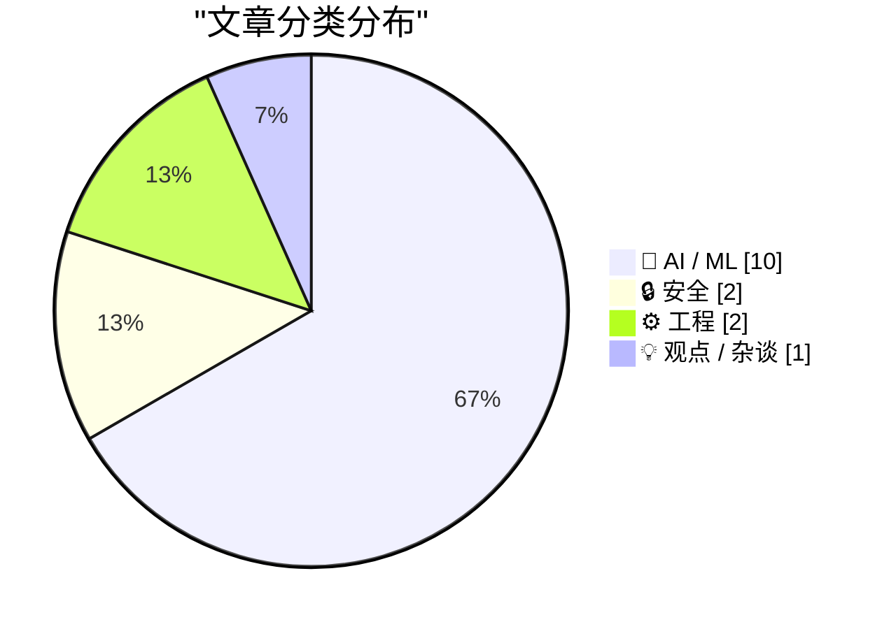
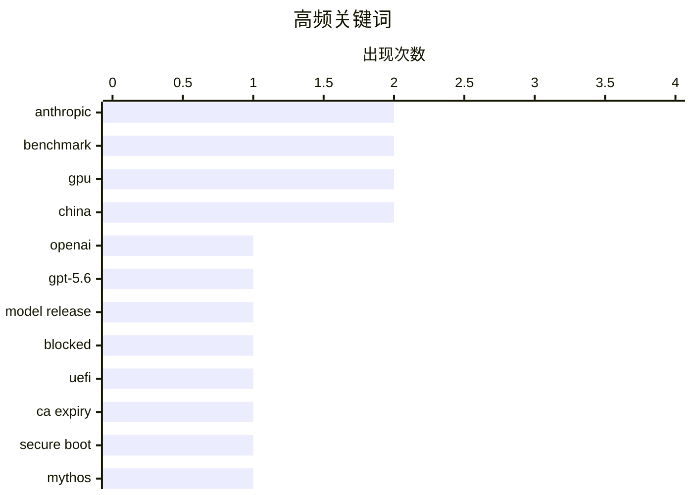

# 📰 AI 资讯每日精选 — 2026-06-28

> 汇聚 140+ 技术博客、X/Twitter、Hacker News、Reddit、Product Hunt、
> Lobste.rs、ClawFeed 日报及 GitHub Trending，经 AI 评分筛选。
>
> **本期内容**：🏆 今日必读 · 🌐 ClawFeed 日报 · 🔥 GitHub Trending · 📂 分类精选 · 🎨 设计与生成式 AI · 📊 数据概览

## 📝 今日看点

今日技术圈的核心议题围绕AI模型的实用化落地与基础设施瓶颈展开。一方面，OpenAI、Anthropic等巨头密集发布新模型，但白宫对AI访问权限的管控与谷歌因算力紧张限制Meta使用Gemini，凸显了资源分配与安全治理的尖锐矛盾；另一方面，从Coinbase转向中国AI模型以降低成本，到普林斯顿测试显示多数AI代理在模拟创业中破产，再到腾讯呼吁AI应从“回答问题”转向“完成任务”，业界正深刻反思AI的经济性与实际协作价值。此外，UEFI安全证书大规模过期事件，也为技术基础设施的长期维护敲响了警钟。

---

## 🏆 今日必读

🥇 **OpenAI 宣布但被阻止发布新的 GPT-5.6 系列模型**

[OpenAI Announces, But Is Blocked From Releasing, New GPT-5.6 Models](https://openai.com/index/previewing-gpt-5-6-sol/) — daringfireball.net · 20 小时前 · 🤖 AI / ML

> OpenAI 宣布了 GPT-5.6 系列模型的有限预览，包括旗舰模型 Sol、日常工作的均衡模型 Terra 以及快速经济的 Luna。Terra 的性能与 GPT-5.5 相当，但成本降低 2 倍，Luna 则以最低成本提供强大能力。GPT-5.6 Sol 配备了迄今为止最强大的安全堆栈，加强了对高风险活动、敏感网络请求和重复滥用的保护。然而，该系列模型的发布似乎受到了外部因素的阻止。

💡 **为什么值得读**: 了解 OpenAI 最新模型系列的性能、成本优势以及其发布受阻的现状，对关注 AI 前沿动态和监管博弈的读者至关重要。

🏷️ OpenAI, GPT-5.6, model release, blocked

🥈 **它死了，吉姆！（UEFI CA 证书过期）**

[It's dead, Jim! (UEFI CA expiry)](https://blog.einval.com/2026/06/27#its_dead_jim) — Lobste.rs · 17 小时前 · 🔒 安全

> 文章讨论了 UEFI 安全启动中使用的证书颁发机构（CA）证书即将过期的问题。这个过期事件可能导致大量旧硬件无法通过安全启动验证，从而无法正常启动操作系统。作者将此事件描述为“死亡”，暗示其影响范围广泛且后果严重。文章可能探讨了该问题的技术细节、受影响的范围以及潜在的解决方案。

💡 **为什么值得读**: 对于系统管理员、固件开发者以及关心硬件长期可用性的用户来说，这是关于一个即将到来的、影响广泛的底层基础设施危机的关键预警。

🏷️ UEFI, CA expiry, secure boot

🥉 **白宫授予 100 多家美国机构访问 Anthropic 的 Mythos 模型权限；Fable 仍被关闭**

[White House Grants Access to Anthropic’s Mythos Model to 100+ U.S. Institutions; Fable Still Shut Down](https://www.semafor.com/article/06/27/2026/us-releases-powerful-anthropic-model-mythos-to-some-us-companies) — daringfireball.net · 20 小时前 · 🤖 AI / ML

> 白宫决定允许 100 多家美国机构访问 Anthropic 的 Mythos 模型，这标志着特朗普政府与 Anthropic 之间对抗的重大缓和。此前，政府因担心模型被“越狱”用于恶意目的，对 Mythos 实施了出口管制，并导致其姊妹模型 Fable 5 被关闭。此举是在亚马逊等公司发出警告后做出的，旨在平衡国家安全与商业利益。

💡 **为什么值得读**: 本文揭示了 AI 模型出口管制政策的最新动态，以及政府、AI 公司和大型科技企业之间复杂的博弈，对理解 AI 地缘政治有直接参考价值。

🏷️ Anthropic, Mythos, White House, regulation

4️⃣ **Coinbase 加入使用中国 AI 模型的热潮，西方实验室面临定价压力测试**

[Coinbase joins the rush to Chinese AI models as Western labs face a pricing stress test](https://the-decoder.com/coinbase-joins-the-rush-to-chinese-ai-models-as-western-labs-face-a-pricing-stress-test/) — The Decoder · 4 小时前 · 🤖 AI / ML

> Coinbase 首席执行官 Brian Armstrong 正将公司转向使用中国的 AI 模型，如 GLM 5.2 和 Kimi 2.7。他们构建了一个自动路由系统，根据任务和价格选择最佳模型，并通过改进缓存将命中率从 5% 提升至 60%。此举使 Coinbase 在 token 使用量持续攀升的情况下，将 AI 支出削减了一半。这表明中国 AI 模型在性价比上对西方实验室构成了巨大压力。

💡 **为什么值得读**: 本文通过 Coinbase 的案例，量化展示了中国 AI 模型在成本效益上的显著优势，为企业在 AI 模型选型和成本控制方面提供了极具说服力的参考。

🏷️ Coinbase, Chinese AI, GLM, cost optimization

5️⃣ **在 500 天的创业生存测试中，只有三个 AI 模型的最终资本高于初始资本**

[Only three AI models finished above starting capital in a 500-day startup survival test](https://the-decoder.com/only-three-ai-models-finished-above-starting-capital-in-a-500-day-startup-survival-test/) — The Decoder · 5 小时前 · 🤖 AI / ML

> 普林斯顿大学的研究人员构建了 CEO-Bench 测试，让 AI 代理在模拟环境中运营一家软件公司 500 天。结果显示，大多数当前的主流 AI 模型都会在模拟中破产。更令人惊讶的是，一个简单的基于规则的启发式算法（非 AI）几乎击败了所有 AI 模型。只有三个 AI 模型在测试结束时资本高于初始资本。

💡 **为什么值得读**: 这项研究对当前 AI 在复杂、长期决策任务中的能力提出了严峻质疑，对于评估 AI 在商业管理领域的实际应用价值具有颠覆性意义。

🏷️ AI agents, startup simulation, CEO-Bench, benchmark

---

## 🌐 ClawFeed 日报精选

> 来源：[ClawFeed](https://clawfeed.kevinhe.io) — AI 驱动的多源新闻聚合

# ClawFeed 日报 | 2026-06-28 (Saturday)

汇总 6 期 4h digest（#740 #742 #743 #744 #745 #746），覆盖 00:00–23:59 SGT。

---

## 🔥 当日全场 Top 5

1. **Claude Code 金融应用破圈** — leopardracer "How I Set Up Claude Code as My Investment Research Analyst" 引 @Av1dlive 推荐为"quant AI 领域最值得花的 1 小时"，**806K views**。Claude Code 使用场景从纯开发向金融研究/投研分析延伸，标志性拐点。
   来源: https://x.com/Av1dlive/status/2059273095970738264

2. **Boris Cherny Loop Engineering PDF（Anthropic 官方方法论）** — Anthropic 高级工程师（Claude Code 构建者）发布 11 页 PDF，核心转变：别再 prompt agent，改为构建"prompt agent 的系统"。Discover→Isolate→Build→Verify→Repeat 自主循环。**208K views**，连续 3 档发酵。
   来源: https://x.com/DataChaz/status/2070415564510785812

3. **Greg Isenberg 4 张图解 AI Agent 公司架构** — 人退到战略/品味/判断层，agent 承接执行层，从 single-agent 到 multi-agent org 的演进路径。**109K views** 刷屏。
   来源: https://x.com/gregisenberg/status/2070918939526205494

4. **Ryan Carson $15-20k/月 Token 开销 + Coinbase 路由策略** — 单人月花 $15-20k 是 AI 工程成本指数化实证。计划参考 Brian Armstrong：GLM 5.2 做默认，frontier 只用于难题，核心是 better defaults + routing + caching，不是限额。Aaron Levie 同步评论："intelligence 和 work 之间需要一个中间层"。
   来源: https://x.com/ryancarson/status/2070876856317010406

5. **BINEVAL：LLM-as-Judge 原子化评估方法** — 把每个评估维度拆成二值判断（是/否），替代传统整体打分，解决 holistic judge scores 隐藏推理过程和天花板效应问题。@omarsar0 推荐为"最有效的 LLM-as-Judge eval 用法"。**38K views**。
   来源: https://x.com/omarsar0/status/2070942495832470001

---

## 📰 当日核心主题

### 1. Agent-Native 公司 / 工作流设计
今天最强信号。Greg Isenberg 4 图刷屏、Warp 开源仓库做成 agent-native workflow（issue triage→spec→实现→review→CI 诊断全流程化）、@BruceGuai Matrix Agent OS 架构（不是一个大 Agent，而是一套 Agent 公司 OS——角色分离+权限最小化+可审计）、Raft（原 Slock）正式亮相定位"humans and agents build together"。这条线正在从概念走向方法论和产品。

### 2. Loop Engineering 从经验帖变成官方方法论
Boris Cherny（Anthropic）的 PDF 在今天整整 3 档持续发酵。@istdrc（Raft 创始人）呼应"meta thinking is the key of loop engineering"——知道事情不再稀缺，知道该知道什么才是关键。Agent 开发范式正在从 prompting 转向 harness engineering。

### 3. Token 成本管理 — 从个人到企业的现实拷问
Ryan Carson $15-20k/月 + Coinbase 路由策略是最具实证的数据点。Aaron Levie 的评论把讨论推到更高维度：成本优化的前提是深度理解底层工作本身。这不是"省钱"的问题，是"如何让 AI 的投入产出比可持续"。

### 4. Claude Code 跨界扩展（金融 / 一人公司）
806K views 的金融应用帖 + "One-Person Company Using Claude Cowork"（2M views）+ Hermes+Obsidian+Claude Code Trinity——Claude Code 正在从开发者工具变成知识工作者基础设施。

### 5. AI 模型格局更新
GPT-5.6 三件套发布（Sol 旗舰 / Terra 日常 / Luna 高吞吐低价），Aaron Levie 评"real and looks very strong"。Anthropic Mythos 5 获美国政府重新放行。MiMo Code 开源（小米，5 人 14 天 vibe-coding）。竞争在加速。

---

## 🔖 Bookmark 精选

• **@Av1dlive** — Anthropic Claude for Finance 讲座 + Claude Code 投研分析师搭建教程（806K views），Kevin 已 bookmark
• **@BruceGuai** — Matrix Agent OS 架构解析：Agent 公司 OS，角色隔离、权限最小化、可审计

---

## 👀 推荐关注汇总

• **Raft (@raft_hq)** — agent-native 协作工具新玩家，IM 界面直接接 Claude Code，手机可用
• **@sainingxie** (NYU → AMI Labs 联合创始人) — $10.3 亿融资造"可理解世界、有持久记忆、能推理规划"的 AI 系统，LeCun 坐镇

### 🧹 建议取关
• **@HeXiaobo** — 最后一条推文 2018 年 7 月，超 7 年未活跃（但可能是私人联系人，酌情处理）
• **@0xJasonBateman** — 最后推文 2026-04-10，近 3 个月未活跃，仅 8 followers，无 AI/tech 原创

---

## 💤 当日重复噪音模式

1. **@rwayne 生活/情感文** — 多档出现（职场汇报技巧、理财感想、"人生真的会突然变好的"），与 AI/tech 无关，已全部过滤
2. **Codex 教程搬运** — 纯搬运无原创分析的 Codex 教程帖在多档出现，信息增量低
3. **跨档重复** — Av1dlive Claude Finance（3 档重复）、BruceGuai Matrix Agent OS（3 档重复）、Boris Cherny Loop Engineering（3 档重复）——热度持续但新信息趋零
4. **Crypto KOL 推广帖** — @Soft6161 等推广类内容已过滤

---

*聚合自 4h digest #740 #742 #743 #744 #745 #746 | Generated by Lisa*---

## 🔥 GitHub Trending

> 今日热门开源项目（全语言 + Python）

| # | 项目 | 描述 | ⭐ 总星 | 📈 今日 | 语言 |
|---|------|------|---------|---------|------|
| 1 | [DeusData/codebase-memory-mcp](https://github.com/DeusData/codebase-memory-mcp) | High-performance code intelligence MCP server. Indexes co... | 19.0k | +2162 | C |
| 2 | [xbtlin/ai-berkshire](https://github.com/xbtlin/ai-berkshire) 🤖 | AI 时代的伯克希尔：基于 Claude Code / Codex 的价值投资研究框架。巴菲特·芒格·段永平·李录... | 5.1k | +1456 | Python |
| 3 | [simplex-chat/simplex-chat](https://github.com/simplex-chat/simplex-chat) | SimpleX - the first messaging network operating without u... | 14.6k | +1183 | Haskell |
| 4 | [HKUDS/Vibe-Trading](https://github.com/HKUDS/Vibe-Trading) 🤖 | "Vibe-Trading: Your Personal Trading Agent" | 14.1k | +490 | Python |
| 5 | [ripienaar/free-for-dev](https://github.com/ripienaar/free-for-dev) | A list of SaaS, PaaS and IaaS offerings that have free ti... | 124.7k | +472 | HTML |
| 6 | [opendatalab/MinerU](https://github.com/opendatalab/MinerU) 🤖 | Transforms complex documents like PDFs and Office docs in... | 71.4k | +426 | Python |
| 7 | [Robbyant/lingbot-map](https://github.com/Robbyant/lingbot-map) | A feed-forward 3D foundation model for reconstructing sce... | 8.1k | +372 | Python |
| 8 | [luongnv89/claude-howto](https://github.com/luongnv89/claude-howto) 🤖 | A visual, example-driven guide to Claude Code — from basi... | 38.8k | +357 | Python |
| 9 | [browser-use/video-use](https://github.com/browser-use/video-use) | Edit videos with coding agents | 10.8k | +324 | Python |
| 10 | [commaai/openpilot](https://github.com/commaai/openpilot) | openpilot is an operating system for robotics. Currently,... | 62.3k | +265 | Python |
| 11 | [altic-dev/FluidVoice](https://github.com/altic-dev/FluidVoice) | FluidVoice - Fastest macOS Offline Dictation app - Voice ... | 3.4k | +264 | Swift |
| 12 | [TauricResearch/TradingAgents](https://github.com/TauricResearch/TradingAgents) 🤖 | TradingAgents: Multi-Agents LLM Financial Trading Framework | 89.3k | +231 | Python |
| 13 | [cupy/cupy](https://github.com/cupy/cupy) | NumPy & SciPy for GPU | 11.4k | +172 | Python |
| 14 | [pandas-dev/pandas](https://github.com/pandas-dev/pandas) | Flexible and powerful data analysis / manipulation librar... | 49.2k | +143 | Python |
| 15 | [ByteByteGoHq/system-design-101](https://github.com/ByteByteGoHq/system-design-101) | Explain complex systems using visuals and simple terms. H... | 84.2k | +132 | - |

---

## 🤖 AI / ML

### 1. OpenAI 宣布但被阻止发布新的 GPT-5.6 系列模型

[OpenAI Announces, But Is Blocked From Releasing, New GPT-5.6 Models](https://openai.com/index/previewing-gpt-5-6-sol/) — **daringfireball.net** · 20 小时前 · ⭐ 25/30

> OpenAI 宣布了 GPT-5.6 系列模型的有限预览，包括旗舰模型 Sol、日常工作的均衡模型 Terra 以及快速经济的 Luna。Terra 的性能与 GPT-5.5 相当，但成本降低 2 倍，Luna 则以最低成本提供强大能力。GPT-5.6 Sol 配备了迄今为止最强大的安全堆栈，加强了对高风险活动、敏感网络请求和重复滥用的保护。然而，该系列模型的发布似乎受到了外部因素的阻止。

🏷️ OpenAI, GPT-5.6, model release, blocked

---

### 2. 白宫授予 100 多家美国机构访问 Anthropic 的 Mythos 模型权限；Fable 仍被关闭

[White House Grants Access to Anthropic’s Mythos Model to 100+ U.S. Institutions; Fable Still Shut Down](https://www.semafor.com/article/06/27/2026/us-releases-powerful-anthropic-model-mythos-to-some-us-companies) — **daringfireball.net** · 20 小时前 · ⭐ 24/30

> 白宫决定允许 100 多家美国机构访问 Anthropic 的 Mythos 模型，这标志着特朗普政府与 Anthropic 之间对抗的重大缓和。此前，政府因担心模型被“越狱”用于恶意目的，对 Mythos 实施了出口管制，并导致其姊妹模型 Fable 5 被关闭。此举是在亚马逊等公司发出警告后做出的，旨在平衡国家安全与商业利益。

🏷️ Anthropic, Mythos, White House, regulation

---

### 3. Coinbase 加入使用中国 AI 模型的热潮，西方实验室面临定价压力测试

[Coinbase joins the rush to Chinese AI models as Western labs face a pricing stress test](https://the-decoder.com/coinbase-joins-the-rush-to-chinese-ai-models-as-western-labs-face-a-pricing-stress-test/) — **The Decoder** · 4 小时前 · ⭐ 24/30

> Coinbase 首席执行官 Brian Armstrong 正将公司转向使用中国的 AI 模型，如 GLM 5.2 和 Kimi 2.7。他们构建了一个自动路由系统，根据任务和价格选择最佳模型，并通过改进缓存将命中率从 5% 提升至 60%。此举使 Coinbase 在 token 使用量持续攀升的情况下，将 AI 支出削减了一半。这表明中国 AI 模型在性价比上对西方实验室构成了巨大压力。

🏷️ Coinbase, Chinese AI, GLM, cost optimization

---

### 4. 在 500 天的创业生存测试中，只有三个 AI 模型的最终资本高于初始资本

[Only three AI models finished above starting capital in a 500-day startup survival test](https://the-decoder.com/only-three-ai-models-finished-above-starting-capital-in-a-500-day-startup-survival-test/) — **The Decoder** · 5 小时前 · ⭐ 24/30

> 普林斯顿大学的研究人员构建了 CEO-Bench 测试，让 AI 代理在模拟环境中运营一家软件公司 500 天。结果显示，大多数当前的主流 AI 模型都会在模拟中破产。更令人惊讶的是，一个简单的基于规则的启发式算法（非 AI）几乎击败了所有 AI 模型。只有三个 AI 模型在测试结束时资本高于初始资本。

🏷️ AI agents, startup simulation, CEO-Bench, benchmark

---

### 5. 谷歌限制 Meta 的 Gemini 使用量，AI 需求导致容量紧张

[Google caps Meta’s Gemini use as AI demand strains capacity](https://www.reddit.com/r/singularity/comments/1uhx4vo/google_caps_metas_gemini_use_as_ai_demand_strains/) — **r/singularity** · 2 小时前 · ⭐ 24/30

> 由于 AI 需求激增导致算力容量紧张，谷歌开始限制 Meta 对 Gemini 模型的使用。这一事件凸显了当前 AI 基础设施面临的巨大压力，即使是大型科技公司之间也出现了资源挤兑。文章可能讨论了限制的具体细节、对 Meta 业务的影响以及 AI 算力短缺的行业现状。

🏷️ Google, Meta, Gemini, capacity

---

### 6. MAX 模型现可在 Apple Silicon GPU 上运行

[MAX models can now run on Apple silicon GPUs](https://forum.modular.com/t/max-models-can-now-run-on-apple-silicon-gpus/3283) — **Lobste.rs** · 6 小时前 · ⭐ 24/30

> Modular 公司宣布其 MAX 模型现在可以在 Apple Silicon 的 GPU 上运行。这意味着开发者可以在 Mac 电脑上本地利用 GPU 加速来运行和推理 MAX 模型。这为在 Apple 硬件上进行 AI 开发和部署提供了新的可能性，可能带来性能提升和更低的延迟。

🏷️ Apple Silicon, GPU, MAX models, inference

---

### 7. AI 只有停止回答问题、开始完成任务，才能成为真正的同事

[AI won't become a real coworker until it stops answering and starts finishing tasks](https://the-decoder.com/ai-wont-become-a-real-coworker-until-it-stops-answering-and-starts-finishing-tasks/) — **The Decoder** · 3 小时前 · ⭐ 23/30

> 腾讯与多所中国大学联合发表的一篇综述论文指出，AI 系统要成为可靠的“数字同事”，关键在于在持久的工作环境中完成整个任务，而不仅仅是生成答案。研究人员认为，当前聊天机器人的模式存在局限，未来的突破在于将持久工作空间与可复用的技能相结合。

🏷️ AI coworker, task completion, persistent environment, digital colleague

---

### 8. Sina's open model VibeThinker-3B aims to show reasoning compresses well but factual knowledge doesn't

[Sina's open model VibeThinker-3B aims to show reasoning compresses well but factual knowledge doesn't](https://the-decoder.com/sinas-open-model-vibethinker-3b-aims-to-show-reasoning-compresses-well-but-factual-knowledge-doesnt/) — **The Decoder** · 8 小时前 · ⭐ 23/30

> Sina Weibo's VibeThinker-3B has just three billion parameters but matches models like DeepSeek V3.2 and Kimi K2.5 on math and coding benchmarks. Those models are up to 333 times larger. The secret isn

🏷️ small model, reasoning, post-training, benchmark

---

### 9. China Has Matched Anthropic in Cybersecurity, Resetting AI Race

[China Has Matched Anthropic in Cybersecurity, Resetting AI Race](https://www.reddit.com/r/singularity/comments/1uhkyg4/china_has_matched_anthropic_in_cybersecurity/) — **r/singularity** · 13 小时前 · ⭐ 23/30

> submitted by   <a href="https://www.reddit.com/user/yogthos"> /u/yogthos </a> <br/> <span><a href="https://www.wsj.com/tech/ai/chinese-ai-anthropic-mythos-cybersecurity-574b02c2">[link]</a></span>   <

🏷️ China, Anthropic, cybersecurity, AI race

---

### 10. what's separating open source (mainly Chinese) labs from the frontier labs?

[what's separating open source (mainly Chinese) labs from the frontier labs?](https://www.reddit.com/r/singularity/comments/1uh9d42/whats_separating_open_source_mainly_chinese_labs/) — **r/singularity** · 22 小时前 · ⭐ 22/30

> <!-- SC_OFF --><div class="md"><p>As we all know, all the big closed source labs like (OpenAI, Anthropic, and etc) always seem to be around ~6-12 months ahead of all the major open source labs. What i

🏷️ open source, frontier labs, China, compute

---

## 🔒 安全

### 11. 它死了，吉姆！（UEFI CA 证书过期）

[It's dead, Jim! (UEFI CA expiry)](https://blog.einval.com/2026/06/27#its_dead_jim) — **Lobste.rs** · 17 小时前 · ⭐ 25/30

> 文章讨论了 UEFI 安全启动中使用的证书颁发机构（CA）证书即将过期的问题。这个过期事件可能导致大量旧硬件无法通过安全启动验证，从而无法正常启动操作系统。作者将此事件描述为“死亡”，暗示其影响范围广泛且后果严重。文章可能探讨了该问题的技术细节、受影响的范围以及潜在的解决方案。

🏷️ UEFI, CA expiry, secure boot

---

### 12. 如何选择公共 DNS 解析器

[Choosing a Public DNS Resolver](https://evilbit.de/dns-resolver-guide.html) — **Hacker News Best** · 18 小时前 · ⭐ 24/30

> 这是一份关于如何选择公共 DNS 解析器的实用指南。文章可能对比了主流公共 DNS 服务（如 Cloudflare、Google、Quad9 等）在隐私、安全、速度和功能方面的差异。它旨在帮助读者根据自身需求（如注重隐私、需要内容过滤或追求速度）做出明智的选择。文章可能还包含配置方法和性能测试数据。

🏷️ DNS, privacy, security, resolver

---

## ⚙️ 工程

### 13. AMD Strix Halo RDMA Cluster Setup Guide

[AMD Strix Halo RDMA Cluster Setup Guide](https://github.com/kyuz0/amd-strix-halo-vllm-toolboxes/blob/main/rdma_cluster/setup_guide.md) — **Hacker News Best** · 15 小时前 · ⭐ 23/30

> Article URL: https://github.com/kyuz0/amd-strix-halo-vllm-toolboxes/blob/main/rdma_cluster/setup_guide.md
Comments URL: https://news.ycombinator.com/item?id=48703258
Points: 199
# Comments: 59

🏷️ AMD, RDMA, cluster, GPU

---

### 14. IBM hails new 'block of flats' design breakthrough for tiny chips

[IBM hails new 'block of flats' design breakthrough for tiny chips](https://www.reddit.com/r/singularity/comments/1uh9qua/ibm_hails_new_block_of_flats_design_breakthrough/) — **r/singularity** · 22 小时前 · ⭐ 22/30

> <table> <tr><td> <a href="https://www.reddit.com/r/singularity/comments/1uh9qua/ibm_hails_new_block_of_flats_design_breakthrough/">  文章探讨了“可理解软件”的理念，即软件系统应该易于被人类理解其工作原理和行为。作者可能批评了当前软件日益复杂、难以理解和调试的趋势。文章可能提出了实现可理解性的具体原则或方法，例如更清晰的架构、更好的文档、更简单的设计或更强的可观测性。

🏷️ software design, understandability, engineering

---

## 📊 数据概览

| 扫描源 | 抓取文章 | 时间范围 | 精选 |
|:---:|:---:|:---:|:---:|
| 92/140 | 3788 篇 → 57 篇 | 24h | **15 篇** |

### 分类分布



### 高频关键词



<details>
<summary>📈 纯文本关键词图（终端友好）</summary>

```
anthropic     │ ████████████████████ 2
benchmark     │ ████████████████████ 2
gpu           │ ████████████████████ 2
china         │ ████████████████████ 2
openai        │ ██████████░░░░░░░░░░ 1
gpt-5.6       │ ██████████░░░░░░░░░░ 1
model release │ ██████████░░░░░░░░░░ 1
blocked       │ ██████████░░░░░░░░░░ 1
uefi          │ ██████████░░░░░░░░░░ 1
ca expiry     │ ██████████░░░░░░░░░░ 1
```

</details>

### 🏷️ 话题标签

**anthropic**(2) · **benchmark**(2) · **gpu**(2) · china(2) · openai(1) · gpt-5.6(1) · model release(1) · blocked(1) · uefi(1) · ca expiry(1) · secure boot(1) · mythos(1) · white house(1) · regulation(1) · coinbase(1) · chinese ai(1) · glm(1) · cost optimization(1) · ai agents(1) · startup simulation(1)

---

*生成于 2026-06-28 16:15 | 汇聚 140 个技术博客、X/Twitter、Hacker News、Reddit、Product Hunt、Lobste.rs、ClawFeed 日报及 GitHub Trending，经 AI 评分筛选出 Top 15 精华内容*
