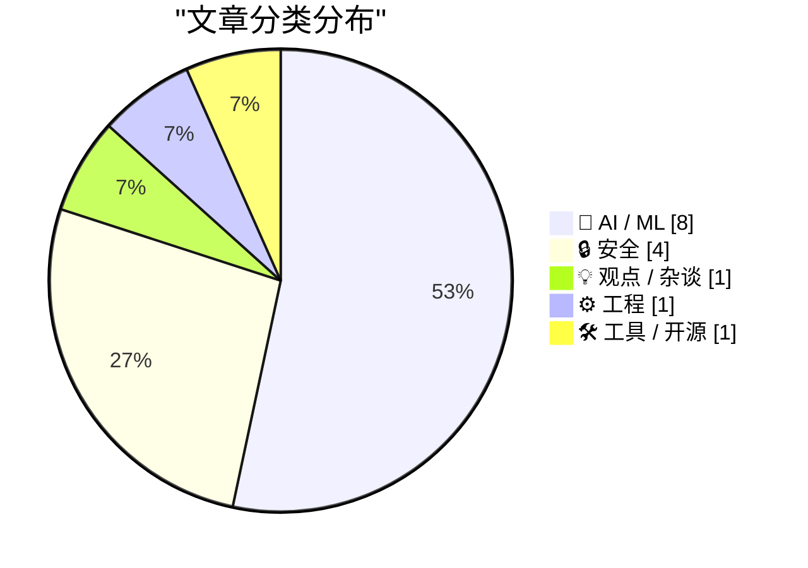
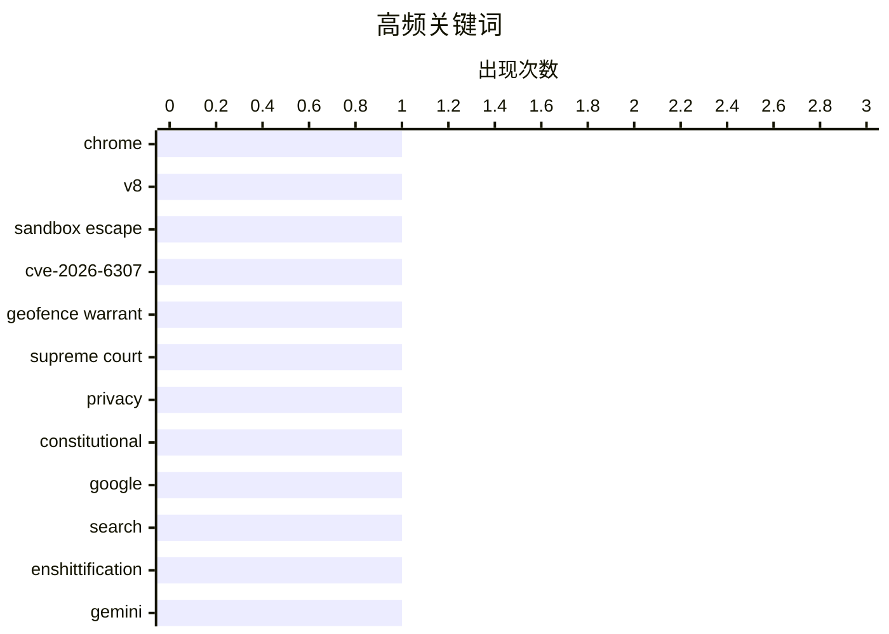

# 📰 AI 资讯每日精选 — 2026-06-30

> 汇聚 140+ 技术博客、X/Twitter、Hacker News、Reddit、Product Hunt、
> Lobste.rs、ClawFeed 日报及 GitHub Trending，经 AI 评分筛选。
>
> **本期内容**：🏆 今日必读 · 🌐 ClawFeed 日报 · 🔥 GitHub Trending · 📂 分类精选 · 🎨 设计与生成式 AI · 📊 数据概览

## 📝 今日看点

今日技术圈聚焦三大趋势：安全领域接连爆出重大事件，从Chrome V8引擎单点漏洞突破双重沙箱，到美国最高法院对地理围栏数据搜查令的宪法裁定，再到苹果供应链数据泄露，凸显数字与物理边界的脆弱性；AI模型竞争进入实用化深水区，Qwen 3.6 27B成为本地开发新标杆，DeepSeek通过投机解码大幅提升推理速度，而亚马逊则通过蒸馏Anthropic模型应对成本压力；与此同时，AI治理与伦理风险持续发酵，美军AI系统因忽略学校备注导致误炸，以及企业自主智能体治理框架的讨论，警示技术落地必须同步解决可控性与问责问题。

---

## 🏆 今日必读

🥇 **Longinus：一个漏洞突破两道边界——CVE-2026-6307 如何刺穿 Chrome 渲染器与 V8 沙箱**

[Longinus: 2 Boundaries in One Bug, Piercing Chrome’s Renderer and V8 Sandbox with a Single Vulnerability, CVE-2026-6307](https://nebusec.ai/research/v8-cve-2026-6307-writeup/) — Lobste.rs · 19 小时前 · 🔒 安全

> 该文章详细分析了 CVE-2026-6307 漏洞，这是一个存在于 Chrome V8 引擎中的单点漏洞，却能同时突破渲染器进程沙箱和 V8 内存沙箱两道安全边界。攻击者利用 JavaScript 引擎中的类型混淆漏洞，结合特定的内存布局操纵，实现了从任意代码执行到沙箱逃逸的完整攻击链。文章展示了该漏洞如何绕过 Chrome 的 Site Isolation 和 V8 的指针压缩保护机制。作者 Nebula Security 团队通过该漏洞证明了即使是最新的多层防御体系，在面对精心构造的单点漏洞时依然存在被击穿的风险。结论是，安全架构设计需要重新审视边界之间的信任关系，不能假设单点失效不会导致全局沦陷。

💡 **为什么值得读**: 这是一份来自顶级安全研究团队的实战漏洞分析，详细拆解了如何用一个漏洞击穿 Chrome 的两层沙箱，对浏览器安全工程师和漏洞研究者极具技术参考价值。

🏷️ Chrome, V8, sandbox escape, CVE-2026-6307

🥈 **美国最高法院裁定：地理围栏搜查令需受宪法保护**

[US Supreme Court rules geofence warrants require constitutional protections](https://www.theguardian.com/us-news/2026/jun/29/supreme-court-geofence-warrants-case-decision) — Hacker News Best · 18 小时前 · 🔒 安全

> 美国最高法院裁定，警方获取手机地理围栏数据（即要求科技公司提供某个区域内所有设备的定位记录）必须基于“可能原因”（probable cause）并申请搜查令，而非仅凭法院命令。该判决源于对一起银行抢劫案的调查，警方曾通过地理围栏令获取了数百名无辜者的位置数据。法院认为，这种大规模、无差别的数据收集行为侵犯了第四修正案赋予公民的隐私权。这一裁决将显著限制执法部门利用数字监控工具进行“钓鱼式”调查的能力。结论是，数字时代的隐私权需要与时俱进的法律解释，而最高法院此次明确将地理围栏搜查纳入传统宪法保护框架。

💡 **为什么值得读**: 这是美国最高法院对数字时代隐私权做出的里程碑式裁决，直接关系到每个公民的位置数据是否会被执法机构无差别调取，对科技公司、法律从业者和隐私倡导者都至关重要。

🏷️ geofence warrant, Supreme Court, privacy, constitutional

🥉 **多元主义：Gemini 比搜索更好，因为谷歌把搜索搞烂了**

[Pluralistic: Gemini is better than search because Google enshittified search (29 Jun 2026)](https://pluralistic.net/2026/06/29/arsonist-firefighters/) — pluralistic.net · 18 小时前 · 💡 观点 / 杂谈

> 作者 Cory Doctorow 指出，谷歌的 Gemini AI 之所以在某些场景下比谷歌搜索更好用，根本原因在于谷歌通过“平台堕落”（enshittification）故意劣化了传统搜索体验，以迫使用户转向其 AI 产品。文章列举了搜索中充斥的广告、SEO 垃圾内容、以及谷歌为推广自家服务而打压竞争对手等行为。作者认为，谷歌并非在“创新”AI 搜索，而是在“纵火”后扮演“消防员”的角色。结论是，用户不应感激谷歌提供了更好的 AI 工具，而应警惕其通过破坏旧产品来推销新产品的商业策略。

💡 **为什么值得读**: Cory Doctorow 以犀利的文风揭示了科技巨头“先制造问题、再兜售解决方案”的经典套路，对理解当前 AI 搜索浪潮背后的商业动机和平台垄断逻辑极具启发。

🏷️ Google, search, enshittification, Gemini

4️⃣ **Qwen 3.6 27B：本地开发的最佳平衡点**

[Qwen 3.6 27B is the sweet spot for local development](https://quesma.com/blog/qwen-36-is-awesome/) — Hacker News Best · 17 小时前 · 🤖 AI / ML

> 文章论证了 Qwen 3.6 27B 模型是当前本地开发场景下的最优选择，在性能、显存占用和推理速度之间取得了最佳平衡。与 7B 模型相比，27B 在代码生成、逻辑推理和上下文理解上表现显著提升；与 72B 或更大模型相比，它又能在单张消费级显卡（如 RTX 4090）上流畅运行。作者通过实际开发任务（如代码补全、Bug 修复、SQL 生成）进行了对比测试，结果显示 27B 的完成质量和响应速度均优于同尺寸的其他开源模型。结论是，对于追求隐私和低延迟的本地 AI 开发，Qwen 3.6 27B 是目前最值得投入的模型。

💡 **为什么值得读**: 如果你正在为本地 AI 开发选择模型而纠结于“大模型跑不动、小模型不够用”，这篇文章用实测数据直接给出了当前的最优解，省去你大量试错时间。

🏷️ Qwen, local LLM, development, 27B

5️⃣ **印度供应商 Tata Electronics 数据泄露，iPhone 18 Pro 详情与照片曝光**

[Data Breach at Indian Supplier Tata Electronics Exposes iPhone 18 Pro Details and Photos](https://www.reuters.com/business/media-telecom/apple-iphone-18-pro-supplier-list-parts-photos-exposed-tata-data-leak-2026-06-29/) — daringfireball.net · 9 小时前 · 🔒 安全

> 路透社报道，勒索软件组织从苹果印度供应商 Tata Electronics 窃取的数据已在暗网公开，其中包括 iPhone 18 Pro 的组件清单、供应商名单以及产品照片。此次泄露威胁到苹果高度保密的供应链管理体系，暴露了其全球制造网络中关键环节的安全漏洞。泄露文件详细列出了 iPhone 18 Pro 的摄像头模组、芯片组和外壳材料等核心部件的供应商信息。结论是，即使苹果对产品信息保密极为严格，其供应链的第三方环节仍可能成为信息泄露的薄弱点。

💡 **为什么值得读**: 这是关于下一代 iPhone 核心信息被提前曝光的独家报道，对关注苹果产品路线图、供应链安全以及数据泄露事件的读者具有极高的新闻价值。

🏷️ data-breach, iPhone, ransomware, supply-chain

---

## 🌐 ClawFeed 日报精选

> 来源：[ClawFeed](https://clawfeed.kevinhe.io) — AI 驱动的多源新闻聚合

# ClawFeed 日报 | 2026-06-29 (Sunday)

汇总 6 期 4h digest：#747, #750, #751, #752, #753, #754

---

## 🔥 当日 Top 5

1. **Verification 取代 Coding 成新瓶颈** — Fiona Fung（Anthropic Claude Code/Cowork 工程负责人）上 Lenny 播客：代码生成已基本解决，瓶颈转移到验证环节。Anthropic 内部组织正围绕这一转变重构。[#752]
   https://x.com/wangray/status/2071266780182683748

2. **AI 工程 Token 开销破 $15-20K/月** — Ryan Carson 透露个人月均 token 支出，计划参考 Coinbase (Brian Armstrong) 策略：用便宜模型做默认 + 路由 + 缓存，不限用量。258K views。AI-native 工程成本管理成刚需。[#750]
   https://x.com/ryancarson/status/2070876856317010406

3. **一人公司 Claude Cowork 方法论刷屏 4.5M views** — Rahul 拆解知识工作者 60% 时间可被 Claude Cowork 接管（邮件/报告/deck/SEO/研究）。"One-Person Company" 叙事传播高峰。[#750, #751]
   https://x.com/sairahul1/status/2070795168677265758

4. **Vercel 开源 Eve Agent 框架** — 标准化 agent build/run/scale，不再每次手搓基础设施。51K views，agent infra 开源化趋势加速。[#747]
   https://x.com/omarsar0/status/2070884837372703196

5. **VAS 虚拟代理服务器概念** — 郭宇分享在 VPS 上跑多 coding agent，提交/测试/构建/部署全在服务端，绕开 GitHub，声称提速 10x。一个月没碰 MacBook。server-side multi-agent 新范式。[#752]
   https://x.com/turingou/status/2071354445070323922

---

## 📰 核心主题

### Agent 基础设施标准化
Vercel Eve 开源、VAS 服务端多 agent、Matrix Agent OS（多 agent 分权分责可审计）、COCO 智外文化案例（26 AI 员工 5 部门，AI manager 管 AI worker）。Agent 从 demo 走向工程化运维。

### AI 成本管理成刚需
Ryan Carson $15-20K/月 token 花费 → Coinbase 策略（cheaper defaults + routing + caching）。这是 AI-native 工程从 "能用" 到 "可持续" 的关键拐点。

### Verification > Coding
Fiona Fung (Anthropic) 明确表态：coding is solved，verification 是新瓶颈。Anthropic 内部重组方向验证了这一趋势。对 COCO 的启示：验证能力（自动化测试、审计追踪）将成为 agent 平台差异化关键。

### 一人公司叙事高峰
sairahul1 帖子 4.5M views，知识工作者 60% 时间可替代。与 Greg Isenberg "4 张图解 AI agent 公司" (127K→持续增长) 形成共振。

### 半导体供应链暗流
CXMT（长鑫存储）可能向苹果供货 + 低价 DRAM 冲击市场担忧 → SK Hynix、三星持续下跌。Jenny Cheng 认为第二点 largely unsubstantiated。[#753]

---

## 🔖 Bookmarks 精选

本日无新增 bookmark。持续跟踪中的：
- Av1dlive: Claude for Finance quant AI 讲座 (807K views)
- BruceGuai: Matrix Agent OS 架构 (33K views)

---

## 👀 推荐关注汇总

- **@raft_hq** (Raft, YC) — agent-native workflow 工具，"一条消息替代 form+email+chat+spreadsheet"
- **@runinfrai** (RunInfra, YC F26) — automegakernel / autokernel，CUDA 推理优化
- **@_LuoFuli** (Fuli Luo) — 小米 MiMo 团队 lead，前 DeepSeek，MiMo-V2.5 推理优化

---

## 💤 当日重复噪音模式

- **Bookmark 回显**：Av1dlive quant AI (807K) 和 BruceGuai Matrix Agent OS (33K) 在 6 期中反复出现（未新增 bookmark 导致每期重复展示），建议 CDP 逻辑过滤已展示过的 bookmark。
- **sairahul1 One-Person Company 跨期重复**：从 #750 的 4.1M 涨到 #751 的 4.5M，同一帖子在 3 期中反复出现。高热帖跨期去重可优化。
- **CocoAI 官推**：A/B Opus 4.5 code review 帖在 #753 和 #754 中重复覆盖。
- **周日低流量**：下午档 (#754) feed 仅 3 条且大部分已覆盖，本质是 followingSample 抽查报告而非新内容 digest。

---

*聚合自 4h digest #747, #750, #751, #752, #753, #754 | 生成时间: 2026-06-29*
---

## 🔥 GitHub Trending

> 今日热门开源项目（全语言 + Python）

| # | 项目 | 描述 | ⭐ 总星 | 📈 今日 | 语言 |
|---|------|------|---------|---------|------|
| 1 | [ripienaar/free-for-dev](https://github.com/ripienaar/free-for-dev) | A list of SaaS, PaaS and IaaS offerings that have free ti... | 127.1k | +1935 | HTML |
| 2 | [simplex-chat/simplex-chat](https://github.com/simplex-chat/simplex-chat) | SimpleX - the first messaging network operating without u... | 17.2k | +1607 | Haskell |
| 3 | [msitarzewski/agency-agents](https://github.com/msitarzewski/agency-agents) 🤖 | A complete AI agency at your fingertips - From frontend w... | 119.8k | +1425 | Shell |
| 4 | [xbtlin/ai-berkshire](https://github.com/xbtlin/ai-berkshire) 🤖 | AI 时代的伯克希尔：基于 Claude Code / Codex 的价值投资研究框架。巴菲特·芒格·段永平·李录... | 7.2k | +1386 | Python |
| 5 | [browser-use/video-use](https://github.com/browser-use/video-use) | Edit videos with coding agents | 12.3k | +967 | Python |
| 6 | [topoteretes/cognee](https://github.com/topoteretes/cognee) 🤖 | Cognee is the open-source AI memory platform for agents. ... | 25.9k | +868 | Python |
| 7 | [HKUDS/Vibe-Trading](https://github.com/HKUDS/Vibe-Trading) 🤖 | "Vibe-Trading: Your Personal Trading Agent" | 15.5k | +839 | Python |
| 8 | [altic-dev/FluidVoice](https://github.com/altic-dev/FluidVoice) | FluidVoice - Fastest macOS Offline Dictation app - Voice ... | 4.7k | +830 | Swift |
| 9 | [Robbyant/lingbot-map](https://github.com/Robbyant/lingbot-map) | A feed-forward 3D foundation model for reconstructing sce... | 8.6k | +465 | Python |
| 10 | [commaai/openpilot](https://github.com/commaai/openpilot) | openpilot is an operating system for robotics. Currently,... | 62.9k | +458 | Python |
| 11 | [TauricResearch/TradingAgents](https://github.com/TauricResearch/TradingAgents) 🤖 | TradingAgents: Multi-Agents LLM Financial Trading Framework | 89.9k | +362 | Python |
| 12 | [cupy/cupy](https://github.com/cupy/cupy) | NumPy & SciPy for GPU | 12.0k | +352 | Python |
| 13 | [0xNyk/council-of-high-intelligence](https://github.com/0xNyk/council-of-high-intelligence) 🤖 | 18 AI personas deliberate your hardest decisions across m... | 2.2k | +331 | Shell |
| 14 | [unclecode/crawl4ai](https://github.com/unclecode/crawl4ai) 🤖 | 🚀🤖 Crawl4AI: Open-source LLM Friendly Web Crawler & Scr... | 70.4k | +288 | Python |
| 15 | [refactoringhq/tolaria](https://github.com/refactoringhq/tolaria) | Desktop app to manage markdown knowledge bases | 17.8k | +280 | TypeScript |

---

## 🤖 AI / ML

### 1. Qwen 3.6 27B：本地开发的最佳平衡点

[Qwen 3.6 27B is the sweet spot for local development](https://quesma.com/blog/qwen-36-is-awesome/) — **Hacker News Best** · 17 小时前 · ⭐ 26/30

> 文章论证了 Qwen 3.6 27B 模型是当前本地开发场景下的最优选择，在性能、显存占用和推理速度之间取得了最佳平衡。与 7B 模型相比，27B 在代码生成、逻辑推理和上下文理解上表现显著提升；与 72B 或更大模型相比，它又能在单张消费级显卡（如 RTX 4090）上流畅运行。作者通过实际开发任务（如代码补全、Bug 修复、SQL 生成）进行了对比测试，结果显示 27B 的完成质量和响应速度均优于同尺寸的其他开源模型。结论是，对于追求隐私和低延迟的本地 AI 开发，Qwen 3.6 27B 是目前最值得投入的模型。

🏷️ Qwen, local LLM, development, 27B

---

### 2. Ornith-1.0：用于智能体编程的自脚手架大语言模型

[Ornith-1.0: Self-Scaffolding LLMs for Agentic Coding](https://simonwillison.net/2026/Jun/29/ornith/#atom-everything) — **simonwillison.net** · 18 小时前 · ⭐ 24/30

> DeepReinforce 发布了首个开源模型 Ornith-1.0（MIT 许可），该模型专为智能体编程场景设计，具备“自脚手架”能力，即模型能自主规划、分解任务并生成中间代码结构。Ornith 提供 9B Dense、31B Dense、35B MoE 和 397B MoE 四种变体，基于 Gemma 4 和 Qwen 3.5 预训练模型构建。在编程基准测试中，Ornith 在同尺寸开源模型中取得了最先进的性能。结论是，Ornith 代表了开源模型在复杂、多步骤编程任务上的一个重要进步，尤其适合需要自主规划和执行的 AI 编程助手场景。

🏷️ LLM, coding, agent, open-weights

---

### 3. DeepSeek 的 DSpark 将 AI 推理速度提升高达 85%，在美国出口管制收紧下的战略胜利

[Deepseek's DSpark boosts AI speed by up to 85 percent, a strategic win under tightening US export controls](https://the-decoder.com/deepseeks-dspark-boosts-ai-speed-by-up-to-85-percent-a-strategic-win-under-tightening-us-export-controls/) — **The Decoder** · 2 小时前 · ⭐ 24/30

> DeepSeek 发布新框架 DSpark，通过“小模型提议、大模型批量验证”的投机解码架构，将单用户响应速度提升了 60% 到 85%。该框架的核心创新在于用小模型快速生成候选 token，再由大模型一次性批量验证，从而在更少的芯片上榨取更高性能。在美国对华高端芯片出口管制持续收紧的背景下，DSpark 显著降低了对先进硬件的依赖。结论是，DSpark 通过算法创新而非硬件堆叠来提升效率，是中国 AI 产业应对芯片封锁的一条有效技术路径。

🏷️ Deepseek, DSpark, AI speed, export controls

---

### 4. 亚马逊工程师正蒸馏 Anthropic 模型以降低成本，应对即将到来的按 Token 计费模式

[Amazon engineers are reportedly distilling Anthropic models to cut costs before new token-based pricing kicks in](https://the-decoder.com/amazon-engineers-are-reportedly-distilling-anthropic-models-to-cut-costs-before-new-token-based-pricing-kicks-in/) — **The Decoder** · 16 小时前 · ⭐ 24/30

> 据报道，亚马逊工程师正在将 Anthropic 的大模型蒸馏成更小、更便宜的版本供内部使用，以应对明年即将从按计算小时计费转为按 Token 计费的新定价模式。新计费模式可能导致成本急剧上升，促使亚马逊提前布局。除了蒸馏 Anthropic 模型，亚马逊也在评估 OpenAI 等替代方案。结论是，即使是像亚马逊这样的大客户，也在积极寻求通过模型压缩和供应商多元化来应对 AI 服务成本上涨的压力。

🏷️ Amazon, Anthropic, model distillation, cost

---

### 5. 如何在企业 AI 工厂中治理自主智能体

[How to Govern Autonomous Agents in Enterprise AI Factories](https://developer.nvidia.com/blog/how-to-govern-autonomous-agents-in-enterprise-ai-factories/) — **NVIDIA Technical Blog** · 18 小时前 · ⭐ 24/30

> 文章探讨了随着 AI 智能体从聊天对话扩展到代码审查、测试执行、文档检索、内部系统查询等长时间运行的任务，企业面临的治理挑战。核心问题包括：如何确保智能体的行为符合企业安全策略、如何审计其决策过程、以及如何防止权限滥用。NVIDIA 提出了一个治理框架，涵盖身份认证、细粒度权限控制、操作日志审计以及“人在回路”的审批机制。结论是，企业部署自主智能体时，必须将治理和安全机制作为基础设施的一部分来设计，而非事后补救。

🏷️ AI agents, enterprise, governance, autonomous

---

### 6. Tidal AI 政策

[Tidal AI Policy](https://tidal.com/ai-policy) — **Hacker News Best** · 21 小时前 · ⭐ 24/30

> Tidal 发布了针对人工智能公司使用其音乐内容的明确政策，核心立场是禁止任何 AI 系统未经授权使用 Tidal 上的音乐进行模型训练。该政策特别针对生成式 AI，明确禁止爬取、抓取或通过 API 获取 Tidal 曲库用于训练、微调或改进 AI 模型。Tidal 强调其拥有大量独家内容和高质量音频，这些是艺术家和厂牌的重要资产，必须受到保护。政策还指出，任何违反条款的行为都可能面临法律诉讼。这一举措反映了音乐流媒体行业在 AI 版权问题上的集体焦虑，Tidal 选择以强硬姿态保护其内容资产。

🏷️ AI policy, music, copyright, Tidal

---

### 7. DiScoFormer：一个适用于多种分布的密度与分数统一 Transformer

[DiScoFormer: One transformer for density and score, across distributions](https://huggingface.co/blog/allenai/discoformer) — **Hugging Face Blog** · 16 小时前 · ⭐ 23/30

> DiScoFormer 是一种新型 Transformer 架构，旨在统一处理密度估计（Density Estimation）和分数函数（Score Function）建模，且能跨不同数据分布工作。传统方法通常需要为每个分布单独训练模型，而 DiScoFormer 通过一个共享的 Transformer 主干网络，同时学习多个分布的密度和分数。该方法在多个标准基准测试上取得了与专用模型相当甚至更优的性能，同时显著降低了训练和存储成本。其核心创新在于设计了一种条件化的注意力机制，使模型能够根据输入数据的分布特征动态调整其行为。这项工作为构建更通用、更高效的生成模型提供了新思路。

🏷️ transformer, density, score, distribution

---

### 8. Meta 限制使用 Claude Code 和 Codex，防止竞争对手的 AI 进入其训练数据

[Meta restricts use of Claude Code and Codex to keep rival AI out of its training data](https://the-decoder.com/meta-restricts-use-of-claude-code-and-codex-to-keep-rival-ai-out-of-its-training-data/) — **The Decoder** · 18 小时前 · ⭐ 23/30

> Meta 正在限制其工程师使用 Anthropic 的 Claude 和 OpenAI 的 Codex 等竞争对手的 AI 编程工具，以防止这些工具的输出被无意中纳入 Meta 自身的 AI 训练数据。该政策旨在保护 Meta 训练数据的纯净性，避免因混入竞争对手模型生成的代码而引发版权或数据污染问题。Meta 内部已明确要求工程师优先使用自家开发的 AI 编程助手，如 Code Llama。这一举措反映了大型科技公司在 AI 训练数据来源上的高度警惕，以及日益激烈的 AI 人才和工具竞争。

🏷️ Meta, Claude, Codex, training data

---

## 🔒 安全

### 9. Longinus：一个漏洞突破两道边界——CVE-2026-6307 如何刺穿 Chrome 渲染器与 V8 沙箱

[Longinus: 2 Boundaries in One Bug, Piercing Chrome’s Renderer and V8 Sandbox with a Single Vulnerability, CVE-2026-6307](https://nebusec.ai/research/v8-cve-2026-6307-writeup/) — **Lobste.rs** · 19 小时前 · ⭐ 28/30

> 该文章详细分析了 CVE-2026-6307 漏洞，这是一个存在于 Chrome V8 引擎中的单点漏洞，却能同时突破渲染器进程沙箱和 V8 内存沙箱两道安全边界。攻击者利用 JavaScript 引擎中的类型混淆漏洞，结合特定的内存布局操纵，实现了从任意代码执行到沙箱逃逸的完整攻击链。文章展示了该漏洞如何绕过 Chrome 的 Site Isolation 和 V8 的指针压缩保护机制。作者 Nebula Security 团队通过该漏洞证明了即使是最新的多层防御体系，在面对精心构造的单点漏洞时依然存在被击穿的风险。结论是，安全架构设计需要重新审视边界之间的信任关系，不能假设单点失效不会导致全局沦陷。

🏷️ Chrome, V8, sandbox escape, CVE-2026-6307

---

### 10. 美国最高法院裁定：地理围栏搜查令需受宪法保护

[US Supreme Court rules geofence warrants require constitutional protections](https://www.theguardian.com/us-news/2026/jun/29/supreme-court-geofence-warrants-case-decision) — **Hacker News Best** · 18 小时前 · ⭐ 27/30

> 美国最高法院裁定，警方获取手机地理围栏数据（即要求科技公司提供某个区域内所有设备的定位记录）必须基于“可能原因”（probable cause）并申请搜查令，而非仅凭法院命令。该判决源于对一起银行抢劫案的调查，警方曾通过地理围栏令获取了数百名无辜者的位置数据。法院认为，这种大规模、无差别的数据收集行为侵犯了第四修正案赋予公民的隐私权。这一裁决将显著限制执法部门利用数字监控工具进行“钓鱼式”调查的能力。结论是，数字时代的隐私权需要与时俱进的法律解释，而最高法院此次明确将地理围栏搜查纳入传统宪法保护框架。

🏷️ geofence warrant, Supreme Court, privacy, constitutional

---

### 11. 印度供应商 Tata Electronics 数据泄露，iPhone 18 Pro 详情与照片曝光

[Data Breach at Indian Supplier Tata Electronics Exposes iPhone 18 Pro Details and Photos](https://www.reuters.com/business/media-telecom/apple-iphone-18-pro-supplier-list-parts-photos-exposed-tata-data-leak-2026-06-29/) — **daringfireball.net** · 9 小时前 · ⭐ 25/30

> 路透社报道，勒索软件组织从苹果印度供应商 Tata Electronics 窃取的数据已在暗网公开，其中包括 iPhone 18 Pro 的组件清单、供应商名单以及产品照片。此次泄露威胁到苹果高度保密的供应链管理体系，暴露了其全球制造网络中关键环节的安全漏洞。泄露文件详细列出了 iPhone 18 Pro 的摄像头模组、芯片组和外壳材料等核心部件的供应商信息。结论是，即使苹果对产品信息保密极为严格，其供应链的第三方环节仍可能成为信息泄露的薄弱点。

🏷️ data-breach, iPhone, ransomware, supply-chain

---

### 12. 美军使用 AI 筛选数千个目标，却忽略了标注为学校的备注

[The US military used AI to pick thousands of targets but missed a note saying one was a school](https://the-decoder.com/the-us-military-used-ai-to-pick-thousands-of-targets-but-missed-a-note-saying-one-was-a-school/) — **The Decoder** · 22 小时前 · ⭐ 25/30

> 调查显示，美军在一次对伊朗学校的导弹袭击中，其 AI 目标筛选系统在处理数千个潜在目标时，遗漏了一条明确标注该地点为学校的备注信息。该 AI 系统被设计用来加速目标识别和排序，但缺乏对非结构化文本备注的有效审核机制。此次误炸暴露了美军在将 AI 引入致命决策流程时的严重缺陷：系统无法区分关键上下文信息与普通元数据。结论是，AI 虽然能提升目标筛选效率，但若缺乏对语义和上下文的深度理解，反而可能因忽略关键细节而导致灾难性后果。

🏷️ AI targeting, military, school strike, ethics

---

## 💡 观点 / 杂谈

### 13. 多元主义：Gemini 比搜索更好，因为谷歌把搜索搞烂了

[Pluralistic: Gemini is better than search because Google enshittified search (29 Jun 2026)](https://pluralistic.net/2026/06/29/arsonist-firefighters/) — **pluralistic.net** · 18 小时前 · ⭐ 26/30

> 作者 Cory Doctorow 指出，谷歌的 Gemini AI 之所以在某些场景下比谷歌搜索更好用，根本原因在于谷歌通过“平台堕落”（enshittification）故意劣化了传统搜索体验，以迫使用户转向其 AI 产品。文章列举了搜索中充斥的广告、SEO 垃圾内容、以及谷歌为推广自家服务而打压竞争对手等行为。作者认为，谷歌并非在“创新”AI 搜索，而是在“纵火”后扮演“消防员”的角色。结论是，用户不应感激谷歌提供了更好的 AI 工具，而应警惕其通过破坏旧产品来推销新产品的商业策略。

🏷️ Google, search, enshittification, Gemini

---

## ⚙️ 工程

### 14. 当你运行一个 CUDA 内核时，究竟发生了什么？

[What happens when you run a CUDA kernel?](https://fergusfinn.com/blog/what-happens-when-you-run-a-gpu-kernel/) — **Hacker News Best** · 21 小时前 · ⭐ 24/30

> 文章深入剖析了从 CPU 端调用 GPU 内核（CUDA kernel）到 GPU 实际执行完成的完整软硬件栈流程。它详细解释了 CUDA 运行时如何将内核启动命令打包并提交到驱动层，驱动如何通过 PCIe 总线将指令和数据传输到 GPU 的命令队列中。文章进一步拆解了 GPU 内部的硬件调度机制，包括 GigaThread 引擎如何分发线程块（Thread Blocks）到流多处理器（SM），以及 SM 内部的 Warp 调度器如何执行指令。作者还对比了同步与异步启动、默认流与多流（Streams）的行为差异，并解释了隐式同步点（如 cudaMemcpy）对性能的影响。核心结论是：理解 GPU 的异步执行模型和硬件调度细节，是编写高性能 CUDA 程序的关键。

🏷️ CUDA, GPU, kernel, internals

---

## 🛠 工具 / 开源

### 15. Cursor for iOS

[Cursor for iOS](https://www.producthunt.com/products/cursor-for-ios) — **Product Hunt** · 6 小时前 · ⭐ 24/30

> Cursor 推出了 iOS 版本，将 AI 驱动的代码编辑能力带到了移动端。该应用允许用户在 iPhone 或 iPad 上使用 Cursor 的 AI 编程代理（Coding Agents）进行代码编写和项目构建。它支持与桌面版相同的 AI 对话、代码补全和上下文理解功能，但针对触控界面进行了优化。用户可以在移动设备上浏览代码库、提出修改请求，并让 AI 代理直接生成和修改代码文件。这一发布标志着 AI 编程工具从桌面 IDE 向全平台移动化的重要一步。

🏷️ Cursor, iOS, coding agent, mobile

---

## 🎨 Design & Generative AI

### 🖼️ 生成式图片

- **[P.D.E / 实验3号](https://www.reddit.com/r/midjourney/comments/1uiv1vg/pde_experiment_nº3_updated_opensource_project/)** — r/midjourney · 19 小时前
  > 更新了开源项目文件的Midjourney图像实验。

- **[昆虫形态](https://www.reddit.com/r/midjourney/comments/1uippo6/insectomorphs/)** — r/midjourney · 23 小时前
  > Midjourney生成的昆虫主题图像。

- **[空间的死亡](https://www.reddit.com/r/midjourney/comments/1uj66hw/the_death_of_space/)** — r/midjourney · 12 小时前
  > Midjourney创作的太空主题图像。

- **[《印加》第二集 第6-8页](https://www.reddit.com/r/midjourney/comments/1uj4fd9/the_incal_episode_two_pages_68/)** — r/midjourney · 14 小时前
  > Midjourney生成的漫画风格图像系列。

- **[奇幻城市景观](https://www.reddit.com/r/midjourney/comments/1uixvte/fantasy_cityscape/)** — r/midjourney · 18 小时前
  > Midjourney绘制的幻想城市风景图。

- **[七月四日](https://www.reddit.com/r/midjourney/comments/1uirvnn/fourth_of_july/)** — r/midjourney · 21 小时前
  > Midjourney生成的美国独立日主题图像。

- **[谎言之网](https://www.reddit.com/r/midjourney/comments/1uivv9d/web_of_lies/)** — r/midjourney · 19 小时前
  > Midjourney创作的抽象或叙事性图像。

- **[通勤](https://www.reddit.com/r/midjourney/comments/1ujkzqw/the_commute/)** — r/midjourney · 42 分钟前
  > Midjourney描绘的通勤场景图像。

- **[第一声吼叫：小猎豹特写](https://www.reddit.com/r/midjourney/comments/1uj2e99/the_first_roar_baby_cheetah_shots/)** — r/midjourney · 15 小时前
  > Midjourney生成的幼年猎豹图像。

- **[鲨鱼会做噩梦吗？](https://www.reddit.com/r/midjourney/comments/1ujdnqf/do_sharks_have_nightmares/)** — r/midjourney · 7 小时前
  > Midjourney创作的鲨鱼主题奇幻图像。

- **[近距离射击](https://www.reddit.com/r/midjourney/comments/1uj02cv/point_blank/)** — r/midjourney · 16 小时前
  > Midjourney生成的动态或冲突场景图像。

- **[融冰 [原创]](https://www.reddit.com/r/midjourney/comments/1ujh16n/deshielo_oc/)** — r/midjourney · 4 小时前
  > Midjourney创作的冰川融化主题图像。

- **[实例与身份](https://www.reddit.com/r/midjourney/comments/1ujcp5c/instances_and_identities/)** — r/midjourney · 8 小时前
  > Midjourney生成的聊天机器人自我代表图像系列。

- **[诊所](https://www.reddit.com/r/midjourney/comments/1uj0d8z/the_clinic/)** — r/midjourney · 16 小时前
  > Midjourney创作的医疗或神秘场景图像。

- **[灵魂与巅峰](https://www.reddit.com/r/midjourney/comments/1ujjwoj/anima_and_apex/)** — r/midjourney · 1 小时前
  > Midjourney生成的抽象或自然主题图像。

---

## 📊 数据概览

| 扫描源 | 抓取文章 | 时间范围 | 精选 |
|:---:|:---:|:---:|:---:|
| 92/140 | 3796 篇 → 75 篇 | 24h | **15 篇** |

### 分类分布



### 高频关键词



<details>
<summary>📈 纯文本关键词图（终端友好）</summary>

```
chrome           │ ████████████████████ 1
v8               │ ████████████████████ 1
sandbox escape   │ ████████████████████ 1
cve-2026-6307    │ ████████████████████ 1
geofence warrant │ ████████████████████ 1
supreme court    │ ████████████████████ 1
privacy          │ ████████████████████ 1
constitutional   │ ████████████████████ 1
google           │ ████████████████████ 1
search           │ ████████████████████ 1
```

</details>

### 🏷️ 话题标签

**chrome**(1) · **v8**(1) · **sandbox escape**(1) · cve-2026-6307(1) · geofence warrant(1) · supreme court(1) · privacy(1) · constitutional(1) · google(1) · search(1) · enshittification(1) · gemini(1) · qwen(1) · local llm(1) · development(1) · 27b(1) · data-breach(1) · iphone(1) · ransomware(1) · supply-chain(1)

---

*生成于 2026-06-30 10:47 | 汇聚 140 个技术博客、X/Twitter、Hacker News、Reddit、Product Hunt、Lobste.rs、ClawFeed 日报及 GitHub Trending，经 AI 评分筛选出 Top 15 精华内容*
