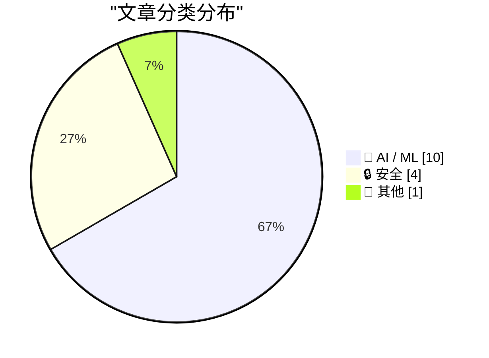
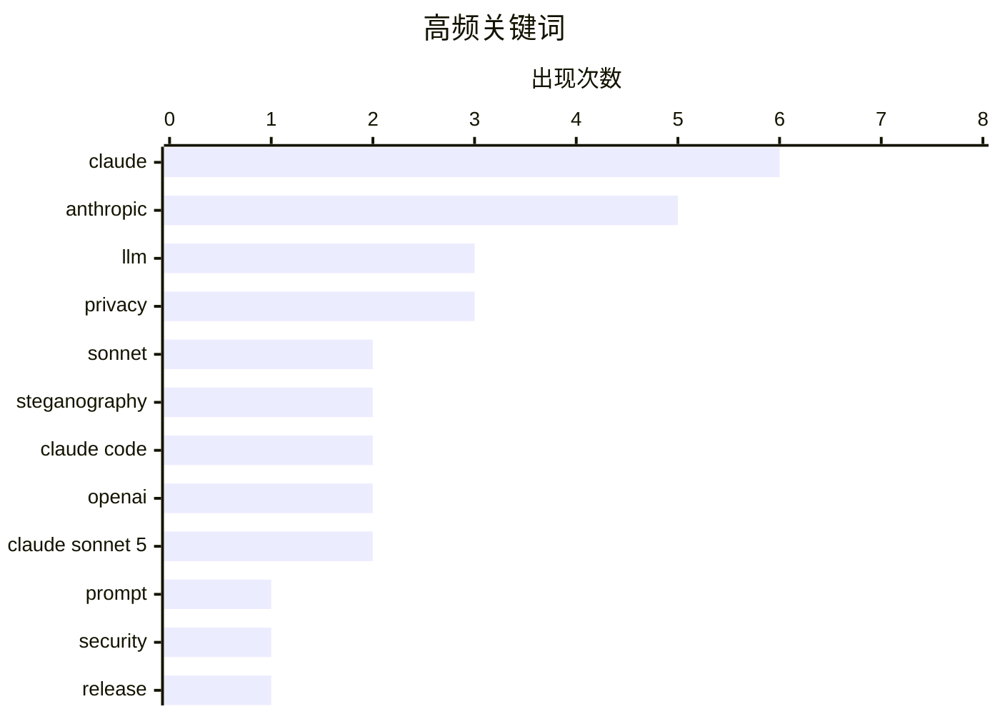

# 📰 AI 资讯每日精选 — 2026-07-01

> 汇聚 140+ 技术博客、X/Twitter、Hacker News、Reddit、Product Hunt、
> Lobste.rs、ClawFeed 日报及 GitHub Trending，经 AI 评分筛选。
>
> **本期内容**：🏆 今日必读 · 🌐 ClawFeed 日报 · 🔥 GitHub Trending · 📂 分类精选 · 🎨 设计与生成式 AI · 📊 数据概览

## 📝 今日看点

今日技术圈聚焦两大热点：Anthropic 发布性能逼近旗舰但价格更低的Claude Sonnet 5，在代理任务上表现突出，同时其编程工具Claude Code被曝通过隐写术秘密标记中国用户，引发隐私争议；另一边，OpenAI被曝计划推出GPT-5.6 Pro的三个变体，打破单一顶级模型策略，并已找到将推理成本减半的方法，预示AI模型正从单纯追求性能转向更灵活、更低成本的竞争格局。

---

## 🏆 今日必读

🥇 **Claude Sonnet 5 发布**

[Claude Sonnet 5](https://www.anthropic.com/news/claude-sonnet-5) — Hacker News Best · 17 小时前 · 🤖 AI / ML

> Anthropic 发布了其最新模型 Claude Sonnet 5，官方宣称其性能接近旗舰级 Opus 4.8，但价格更低。该模型在多项基准测试中表现出色，尤其在代理（Agent）任务上超越了 Opus 4.8。然而，有分析指出，Sonnet 5 在处理任务时消耗的 token 数比前代多约 40%，导致实际使用成本几乎翻倍，尽管标价未变。这一“隐性涨价”模式引发了社区讨论。

💡 **为什么值得读**: 如果你想了解最新大模型的能力提升与真实成本变化，这篇官方发布与第三方分析结合的文章能帮你做出更明智的选型判断。

🏷️ Claude, Sonnet, Anthropic, LLM

🥈 **Claude Code 正在通过隐写术标记请求**

[Claude Code is steganographically marking requests](https://thereallo.dev/blog/claude-code-prompt-steganography) — Hacker News Best · 19 小时前 · 🔒 安全

> 开发者发现 Anthropic 的编程工具 Claude Code 在发出的请求中嵌入了隐写标记，用于秘密识别用户身份。该功能被设计为隐藏的监控特性，尤其针对中国用户进行标记。这一发现引发了社交媒体上的强烈抗议，Anthropic 随后宣布将移除该功能。事件暴露了 AI 工具在隐私和地域歧视方面的潜在风险。

💡 **为什么值得读**: 这篇文章揭露了 AI 工具中隐蔽的隐私侵犯行为，对于关注数据安全和 AI 伦理的开发者与用户来说，具有重要的警示意义。

🏷️ Claude, steganography, prompt, security

🥉 **Claude Sonnet 5 的新特性**

[What's new in Claude Sonnet 5](https://simonwillison.net/2026/Jun/30/claude-sonnet-5/#atom-everything) — simonwillison.net · 14 小时前 · 🤖 AI / ML

> 开发者文档显示，Claude Sonnet 5 的性能接近 Opus 4.8，但定价更低。文章作者 Simon Willison 指出，官方公告往往信息量不足，而开发者文档提供了更多可操作的细节。Sonnet 5 在多项任务上实现了效率提升，但具体 token 消耗和成本变化需要开发者自行测试验证。

💡 **为什么值得读**: 如果你是一名开发者，想快速了解 Sonnet 5 的实际 API 变化和性能细节，这篇来自知名技术博主的解读比官方公告更具参考价值。

🏷️ Claude, Sonnet, release, update

4️⃣ **Claude Code 中的隐藏代码秘密标记中国用户**

[Hidden code in Claude Code secretly flagged Chinese users](https://the-decoder.com/hidden-code-in-claude-code-secretly-flagged-chinese-users/) — The Decoder · 14 分钟前 · 🔒 安全

> Anthropic 的编程工具 Claude Code 被发现包含隐藏的监控功能，该功能通过隐写术在请求中嵌入标记，专门用于识别中国用户。该功能在社交媒体上引发强烈抗议后，Anthropic 宣布将移除这一功能。事件凸显了 AI 工具在跨国运营中面临的隐私与合规挑战。

💡 **为什么值得读**: 这篇文章直接点出了 AI 工具中针对特定地区用户的隐蔽监控行为，对于关心技术伦理和地缘政治风险的读者来说，是一个必须关注的案例。

🏷️ Claude Code, hidden code, privacy, Anthropic

5️⃣ **OpenAI 论文揭示 GPT-5.6 Pro 将有三个变体，打破单一顶级模型策略**

[OpenAI paper reveals three GPT-5.6 Pro models, breaking with single top-tier strategy](https://the-decoder.com/openai-paper-reveals-three-gpt-5-6-pro-models-breaking-with-single-top-tier-strategy/) — The Decoder · 1 小时前 · 🤖 AI / ML

> OpenAI 的一篇基准测试论文暗示，GPT-5.6 的 Pro 版本可能会推出三个不同的变体。这将是自 ChatGPT Pro 计划推出以来，其结构首次重大调整。此举可能意味着 OpenAI 正在放弃“一个模型通吃”的策略，转向针对不同场景提供专业化模型。

💡 **为什么值得读**: 这篇文章揭示了 OpenAI 未来产品策略的重大转向，对于关注大模型行业趋势和 ChatGPT 订阅服务变化的用户，具有前瞻性价值。

🏷️ GPT-5.6, OpenAI, model variants, Pro tier

---

## 🌐 ClawFeed 日报精选

> 来源：[ClawFeed](https://clawfeed.kevinhe.io) — AI 驱动的多源新闻聚合

# ClawFeed 日报 | 2026-06-30 (Mon)

> 聚合 7 期 4h digest (#755, #757, #758, #759, #760, #761, #762)

---

## 🔥 当日 Top 5

1. **Cline 推出 $9.99/月订阅** — 头部开源 coding agent 正式转向"多模型聚合订阅"商业化，打包 GLM-5.2/DeepSeek/Kimi/MiniMax/Mimo/Qwen 等模型，验证 agent + 多模型路由变现路径。374K views, 187 RT。[#758]
   https://x.com/cline/status/2071617325296734309

2. **Anthropic loop engineering playbook 泄露引爆讨论** — 0xMovez (308→405K views, 76 RT) 和 Miles Deutscher (54K views, 45 RT) 从不同角度解读 agent loop/harness/eval 的完整 stack。核心框架：trace → LLM judge → diagnose → fix → ship，形成 agent 自我改进闭环。全天持续发酵。[#757, #759, #760]
   https://x.com/0xMovez/status/2071214176526049739

3. **全栈切换中国 AI 模型，成本降 87%** — DeRonin_ 公开晒替换清单（Opus 4.8 → Kimi K2.7, GPT-5.5 → Qwen 3.7 Max），宣称收入不变。中国模型价格战从 benchmark 比拼进入"真实生产环境替换"阶段。251K views, 4.6K likes。[#759]
   https://x.com/DeRonin_/status/2071561335234531578

4. **"AI native 组织"定义之争** — 玉伯指出"只有程序员 ≠ AI native"，需要全职能参与；elliotchen100 补充模型能力需渗入全链路。对"一人公司"叙事的冷思考：缺少非工程角色，AI 自动化再强也撑不起完整产品闭环。[#762]
   https://x.com/elliotchen100/status/2071801503204192268

5. **Aaron Levie: 智谱 AI 匹配 Claude Mythos 网络安全水平** — "Mythos 级别的开源网络安全模型即将出现，替代技术栈将从美国体系分走更多经济价值和控制权。" 140K views。[#755]
   https://x.com/levie/status/2071253118252356001

---

## 📰 核心主题聚类

### Agent 工程化浪潮
- Anthropic loop engineering playbook 全天热议（0xMovez + Miles Deutscher，合计 ~460K views）
- Matrix Agent OS 公测一周：用户创建"数以万计" 0-person companies（BruceGuai）
- OpenAI 开源航空公司客服多 Agent Demo（Agents SDK, Jolyne_AI）
- COCO CharlieHuAI 在新加坡 Agentic Finance panel: "模型能力过剩，落地能力才是稀缺资源"

### 中国模型价格战 → 生产替换
- DeRonin_ 全栈替换案例（87% 降本，收入不变）
- Cline 订阅打包大量中国开源模型（GLM/DeepSeek/Kimi/Qwen 等）
- 小米 MiMo Code 开源（5 人 14 天 vibe-coding，Fuli Luo）

### "一人公司" vs 现实
- elliotchen100 + 玉伯：AI native ≠ 只有工程师
- BruceGuai Matrix: agent 公司 OS 需要 accountability/audit/可控性
- AI 网站出海实战（huangyun_122）：从焦虑到第一个 $10K

### Crypto 合规 + 生态位
- DujunX: crypto 交易所在传统资本市场中"降维"——从王者变散户券商
- OKX.AI 发布（bxiaokang）：Crypto + AI 交叉叙事

---

## 🔖 Bookmark 精选

- **BruceGuai — Matrix Agent 公司 OS 架构详解**: 不是一个巨大 Agent 塞满所有工具，而是一套可长期运行的 agent 公司架构。核心设计原则：accountability、audit、可控性。引用 DerekNee "you cannot run a company on one giant agent."
  https://x.com/BruceGuai/status/2070130243059495142

- **Av1dlive — Google senior engineer MIT 公开课**: AI 模型构建方法论 55 分钟免费讲解。同一作者此前的 quant AI lecture 获 807K views，持续产出高质量教育内容。

---

## 👀 推荐关注汇总

本日各期均无新增推荐——当前 following 列表覆盖已较完整。

---

## 🧹 建议取关

- **@HeXiaobo** — 最后一条推文 2018 年 7 月，超 8 年未活跃，509 followers。典型僵尸号。（多期重复建议）
- **@0xJasonBateman** — 仅 8 followers，无近期推文，账号几乎无活动。
- **@caterpillarous** — 最后发推 5 月 19 日（41 天前），内容以个人感悟为主，与 AI/crypto/tech builder 方向关联弱。观察中。

---

## 💤 当日噪音模式

1. **Bookmark 回显轮回**: Av1dlive quant AI lecture (807K) 和 BruceGuai Matrix (33K) 在全部 7 期中反复出现为"前期已覆盖"，占据每期 bookmark 位但无增量信息。
2. **followingSample 固定 8 人旋转**: raft_hq / levie / kalinowski007 / runinfrai / caterpillarous / _LuoFuli / AmandaAskell / rwayne 在多期中重复抽样，产出相同评估结论。
3. **Marketing 内容混入 feed**: DujunX WidthGRC 合规平台推广、Renee7eth AgentKey 涨粉模板。
4. **非技术生活帖过滤**: turingou 米其林餐厅、rwayne 娱乐八卦、AmandaAskell 个人生活向内容。

---

*Generated by Lisa · ClawFeed Daily Digest Pipeline*---

## 🔥 GitHub Trending

> 今日热门开源项目（全语言 + Python）

| # | 项目 | 描述 | ⭐ 总星 | 📈 今日 | 语言 |
|---|------|------|---------|---------|------|
| 1 | [msitarzewski/agency-agents](https://github.com/msitarzewski/agency-agents) 🤖 | A complete AI agency at your fingertips - From frontend w... | 121.9k | +1791 | Shell |
| 2 | [hasaneyldrm/exercises-dataset](https://github.com/hasaneyldrm/exercises-dataset) | A comprehensive dataset of 433 fitness exercises. Each en... | 7.9k | +1343 | HTML |
| 3 | [HKUDS/Vibe-Trading](https://github.com/HKUDS/Vibe-Trading) 🤖 | "Vibe-Trading: Your Personal Trading Agent" | 16.2k | +721 | Python |
| 4 | [browser-use/video-use](https://github.com/browser-use/video-use) | Edit videos with coding agents | 13.0k | +721 | Python |
| 5 | [altic-dev/FluidVoice](https://github.com/altic-dev/FluidVoice) 🤖 | Fastest and only macOS Dictation app with on-device STT a... | 5.2k | +588 | Swift |
| 6 | [logto-io/logto](https://github.com/logto-io/logto) 🤖 | 🧑‍🚀 Authentication and authorization infrastructure for... | 13.1k | +561 | TypeScript |
| 7 | [usestrix/strix](https://github.com/usestrix/strix) 🤖 | Open-source AI penetration testing tool to find and fix y... | 28.6k | +515 | Python |
| 8 | [ogulcancelik/herdr](https://github.com/ogulcancelik/herdr) 🤖 | agent multiplexer that lives in your terminal. | 9.3k | +486 | Rust |
| 9 | [0xNyk/council-of-high-intelligence](https://github.com/0xNyk/council-of-high-intelligence) 🤖 | 18 AI personas deliberate your hardest decisions across m... | 2.4k | +473 | Shell |
| 10 | [google/agents-cli](https://github.com/google/agents-cli) 🤖 | The CLI and skills that turn any coding assistant into an... | 4.5k | +445 | Python |
| 11 | [refactoringhq/tolaria](https://github.com/refactoringhq/tolaria) | Desktop app to manage markdown knowledge bases | 17.9k | +435 | TypeScript |
| 12 | [diegosouzapw/OmniRoute](https://github.com/diegosouzapw/OmniRoute) 🤖 | Never stop coding. Free AI gateway: one endpoint, 231+ pr... | 9.1k | +387 | TypeScript |
| 13 | [facebook/astryx](https://github.com/facebook/astryx) 🤖 | An open source design system that's fully customizable an... | 2.1k | +364 | TypeScript |
| 14 | [CoreBunch/Instatic](https://github.com/CoreBunch/Instatic) | Instatic is a modern self-hosted visual CMS - get it runn... | 1.8k | +351 | TypeScript |
| 15 | [allenai/olmocr](https://github.com/allenai/olmocr) 🤖 | Toolkit for linearizing PDFs for LLM datasets/training | 18.1k | +295 | Python |

---

## 🤖 AI / ML

### 1. Claude Sonnet 5 发布

[Claude Sonnet 5](https://www.anthropic.com/news/claude-sonnet-5) — **Hacker News Best** · 17 小时前 · ⭐ 28/30

> Anthropic 发布了其最新模型 Claude Sonnet 5，官方宣称其性能接近旗舰级 Opus 4.8，但价格更低。该模型在多项基准测试中表现出色，尤其在代理（Agent）任务上超越了 Opus 4.8。然而，有分析指出，Sonnet 5 在处理任务时消耗的 token 数比前代多约 40%，导致实际使用成本几乎翻倍，尽管标价未变。这一“隐性涨价”模式引发了社区讨论。

🏷️ Claude, Sonnet, Anthropic, LLM

---

### 2. Claude Sonnet 5 的新特性

[What's new in Claude Sonnet 5](https://simonwillison.net/2026/Jun/30/claude-sonnet-5/#atom-everything) — **simonwillison.net** · 14 小时前 · ⭐ 26/30

> 开发者文档显示，Claude Sonnet 5 的性能接近 Opus 4.8，但定价更低。文章作者 Simon Willison 指出，官方公告往往信息量不足，而开发者文档提供了更多可操作的细节。Sonnet 5 在多项任务上实现了效率提升，但具体 token 消耗和成本变化需要开发者自行测试验证。

🏷️ Claude, Sonnet, release, update

---

### 3. OpenAI 论文揭示 GPT-5.6 Pro 将有三个变体，打破单一顶级模型策略

[OpenAI paper reveals three GPT-5.6 Pro models, breaking with single top-tier strategy](https://the-decoder.com/openai-paper-reveals-three-gpt-5-6-pro-models-breaking-with-single-top-tier-strategy/) — **The Decoder** · 1 小时前 · ⭐ 26/30

> OpenAI 的一篇基准测试论文暗示，GPT-5.6 的 Pro 版本可能会推出三个不同的变体。这将是自 ChatGPT Pro 计划推出以来，其结构首次重大调整。此举可能意味着 OpenAI 正在放弃“一个模型通吃”的策略，转向针对不同场景提供专业化模型。

🏷️ GPT-5.6, OpenAI, model variants, Pro tier

---

### 4. Claude Sonnet 5 发布

[Introducing Claude Sonnet 5](https://www.reddit.com/r/singularity/comments/1ujwh9i/introducing_claude_sonnet_5/) — **r/singularity** · 17 小时前 · ⭐ 26/30

> Reddit 用户转发了 Anthropic 官方关于 Claude Sonnet 5 的发布公告链接。该帖子在 r/singularity 社区引发了广泛讨论，用户们主要关注新模型的性能提升、与 Opus 4.8 的对比以及实际使用成本。

🏷️ Claude, Sonnet 5, Anthropic, LLM

---

### 5. OpenAI 据报已找到将推理成本减半的方法

[OpenAI has reportedly found a way to cut inference costs in half](https://www.reddit.com/r/singularity/comments/1ujxfgf/openai_has_reportedly_found_a_way_to_cut/) — **r/singularity** · 17 小时前 · ⭐ 26/30

> 据一份付费报告透露，OpenAI 已经找到了一种将模型推理成本降低一半的方法。这一突破如果属实，将大幅降低 GPT 系列模型的使用成本，可能对 AI 应用生态产生深远影响。目前具体技术细节尚未公开。

🏷️ OpenAI, inference, cost reduction, LLM

---

### 6. Claude Sonnet 5

[Claude Sonnet 5](https://www.producthunt.com/products/claude) — **Product Hunt** · 17 小时前 · ⭐ 26/30

> Product Hunt 上发布了 Claude Sonnet 5 的产品页面，将其描述为“能够规划、行动并完成工作的 AI”。该页面提供了产品链接和讨论入口，供用户了解和体验新模型。

🏷️ Claude Sonnet 5, AI agent, product launch

---

### 7. Claude Sonnet 5 延续了 Anthropic 在不变 token 费率下隐藏涨价的模式

[Claude Sonnet 5 continues Anthropic's pattern of hiding price increases behind unchanged token rates](https://the-decoder.com/claude-sonnet-5-continues-anthropics-pattern-of-hiding-price-increases-behind-unchanged-token-rates/) — **The Decoder** · 29 分钟前 · ⭐ 25/30

> Claude Sonnet 5 在 Artificial Analysis 智能指数中排名第五，得分 53，在某些代理任务上甚至超越了更贵的 Opus 4.8。但分析指出，该模型每项任务消耗的 token 数比前代多约 40%，导致实际成本几乎翻倍，尽管标价未变。Anthropic 这种“隐性涨价”已成为一种模式。

🏷️ Claude Sonnet 5, pricing, token usage, Anthropic

---

### 8. Department of Commerce has lifted export controls on Claude Fable 5 and Mythos 5

[Department of Commerce has lifted export controls on Claude Fable 5 and Mythos 5](https://twitter.com/AnthropicAI/status/2072106151890809341) — **Hacker News Best** · 11 小时前 · ⭐ 25/30

> Article URL: https://twitter.com/AnthropicAI/status/2072106151890809341
Comments URL: https://news.ycombinator.com/item?id=48740771
Points: 718
# Comments: 418

🏷️ export controls, Claude, Anthropic, regulation

---

### 9. Leanstral 1.5

[Leanstral 1.5](https://docs.mistral.ai/models/model-cards/leanstral-1-5-26-06) — **Hacker News Best** · 14 小时前 · ⭐ 25/30

> Article URL: https://docs.mistral.ai/models/model-cards/leanstral-1-5-26-06
Comments URL: https://news.ycombinator.com/item?id=48738938
Points: 236
# Comments: 83

🏷️ Mistral, Leanstral, model, efficiency

---

### 10. Claude Science

[Claude Science](https://claude.com/product/claude-science) — **Hacker News Best** · 18 小时前 · ⭐ 25/30

> Article URL: https://claude.com/product/claude-science
Comments URL: https://news.ycombinator.com/item?id=48735770
Points: 502
# Comments: 147

🏷️ Claude, science, research, tool

---

## 🔒 安全

### 11. Claude Code 正在通过隐写术标记请求

[Claude Code is steganographically marking requests](https://thereallo.dev/blog/claude-code-prompt-steganography) — **Hacker News Best** · 19 小时前 · ⭐ 27/30

> 开发者发现 Anthropic 的编程工具 Claude Code 在发出的请求中嵌入了隐写标记，用于秘密识别用户身份。该功能被设计为隐藏的监控特性，尤其针对中国用户进行标记。这一发现引发了社交媒体上的强烈抗议，Anthropic 随后宣布将移除该功能。事件暴露了 AI 工具在隐私和地域歧视方面的潜在风险。

🏷️ Claude, steganography, prompt, security

---

### 12. Claude Code 中的隐藏代码秘密标记中国用户

[Hidden code in Claude Code secretly flagged Chinese users](https://the-decoder.com/hidden-code-in-claude-code-secretly-flagged-chinese-users/) — **The Decoder** · 14 分钟前 · ⭐ 26/30

> Anthropic 的编程工具 Claude Code 被发现包含隐藏的监控功能，该功能通过隐写术在请求中嵌入标记，专门用于识别中国用户。该功能在社交媒体上引发强烈抗议后，Anthropic 宣布将移除这一功能。事件凸显了 AI 工具在跨国运营中面临的隐私与合规挑战。

🏷️ Claude Code, hidden code, privacy, Anthropic

---

### 13. Claude Code 正在通过隐写术标记请求

[Claude Code Is Steganographically Marking Requests](https://thereallo.dev/blog/claude-code-prompt-steganography) — **Lobste.rs** · 16 小时前 · ⭐ 26/30

> Lobste.rs 社区转载了关于 Claude Code 使用隐写术标记用户请求的文章。该发现引发了技术社区对 AI 工具隐私透明度的广泛讨论，焦点在于 Anthropic 是否在未告知用户的情况下实施了监控。

🏷️ Claude Code, steganography, AI, privacy

---

### 14. ★ The Supreme Court Rules That Law Enforcement’s Use of ‘Geofence Warrant’ Was a ‘Search’ (But May Be Moot, Technically, Since 2024)

[★ The Supreme Court Rules That Law Enforcement’s Use of ‘Geofence Warrant’ Was a ‘Search’ (But May Be Moot, Technically, Since 2024)](https://daringfireball.net/2026/06/scotus_geofence_warrant_search) — **daringfireball.net** · 16 小时前 · ⭐ 24/30

> Google no longer collects this information in a way that is susceptible to geofence warrants, and, more importantly, Apple never did.

🏷️ geofence warrant, privacy, Supreme Court, search

---

## 📝 其他

### 15. County with 37 Data Centers Asks Schools to 'Conserve Electricity'

[County with 37 Data Centers Asks Schools to 'Conserve Electricity'](https://www.404media.co/henrico-virginia-datacenter-energy-cost-email/) — **Hacker News Best** · 19 小时前 · ⭐ 25/30

> Article URL: https://www.404media.co/henrico-virginia-datacenter-energy-cost-email/
Comments URL: https://news.ycombinator.com/item?id=48734699
Points: 402
# Comments: 178

🏷️ data center, energy, infrastructure, schools

---

## 📊 数据概览

| 扫描源 | 抓取文章 | 时间范围 | 精选 |
|:---:|:---:|:---:|:---:|
| 90/140 | 3769 篇 → 107 篇 | 24h | **15 篇** |

### 分类分布



### 高频关键词



<details>
<summary>📈 纯文本关键词图（终端友好）</summary>

```
claude          │ ████████████████████ 6
anthropic       │ █████████████████░░░ 5
llm             │ ██████████░░░░░░░░░░ 3
privacy         │ ██████████░░░░░░░░░░ 3
sonnet          │ ███████░░░░░░░░░░░░░ 2
steganography   │ ███████░░░░░░░░░░░░░ 2
claude code     │ ███████░░░░░░░░░░░░░ 2
openai          │ ███████░░░░░░░░░░░░░ 2
claude sonnet 5 │ ███████░░░░░░░░░░░░░ 2
prompt          │ ███░░░░░░░░░░░░░░░░░ 1
```

</details>

### 🏷️ 话题标签

**claude**(6) · **anthropic**(5) · **llm**(3) · privacy(3) · sonnet(2) · steganography(2) · claude code(2) · openai(2) · claude sonnet 5(2) · prompt(1) · security(1) · release(1) · update(1) · hidden code(1) · gpt-5.6(1) · model variants(1) · pro tier(1) · sonnet 5(1) · inference(1) · cost reduction(1)

---

*生成于 2026-07-01 11:42 | 汇聚 140 个技术博客、X/Twitter、Hacker News、Reddit、Product Hunt、Lobste.rs、ClawFeed 日报及 GitHub Trending，经 AI 评分筛选出 Top 15 精华内容*
