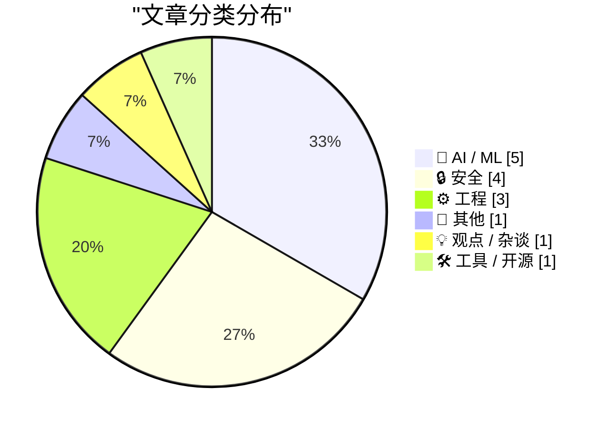
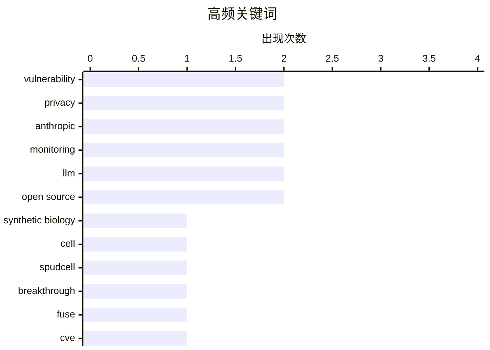

# 📰 AI 资讯每日精选 — 2026-07-02

> 汇聚 140+ 技术博客、X/Twitter、Hacker News、Reddit、Product Hunt、
> Lobste.rs、ClawFeed 日报及 GitHub Trending，经 AI 评分筛选。
>
> **本期内容**：🏆 今日必读 · 🌐 ClawFeed 日报 · 🔥 GitHub Trending · 📂 分类精选 · 🎨 设计与生成式 AI · 📊 数据概览

## 📝 今日看点

今日技术圈聚焦三大趋势：合成生物学迎来里程碑，科学家首次造出能自主生长分裂的“最小人造细胞”；安全领域接连爆出高危漏洞，从Linux内核提权到苹果iCloud隐私泄露，再到伪装成Google应用的Android恶意软件，暴露出系统与平台层面的深层隐患；AI领域则争议不断，文本水印被证可轻易移除、Claude被曝隐藏监控代码标记中国用户，同时新模型发布与智能体技术进展也引发对透明度与定价策略的质疑。

---

## 🏆 今日必读

🥇 **首次实现：从零构建的细胞能够生长和分裂**

[For first time, a cell built from scratch grows and divides](https://www.quantamagazine.org/for-the-first-time-a-cell-built-from-scratch-grows-and-divides-20260701/) — Hacker News Best · 19 小时前 · 📝 其他

> 科学家首次成功制造出一种完全由合成DNA和人工细胞膜构建的细胞，名为“Spudcell”，并证实其能够自主生长和分裂。该细胞的核心基因组由约500个基因组成，是已知最小、最简化的生命体之一。研究团队通过精确控制基因表达和代谢通路，解决了合成细胞无法自我复制的长期难题。这一突破标志着合成生物学从“制造生命部件”迈入“构建完整生命系统”的新阶段。

💡 **为什么值得读**: 这是合成生物学领域的里程碑式成果，直接回答了“生命能否被从头创造”这一根本问题，对理解生命起源和设计新型生物工厂具有深远意义。

🏷️ synthetic biology, cell, SpudCell, breakthrough

🥈 **利用FUSE readdir缓存中的越界写入实现无权限的root提权（CVE-2026-31694）**

[Unprivileged root via an out-of-bounds write in the FUSE readdir cache (CVE-2026-31694)](https://cyberstan.co.uk/fuse-readdir-oob/) — Lobste.rs · 9 小时前 · 🔒 安全

> 安全研究人员披露了一个Linux内核FUSE文件系统驱动中的高危漏洞（CVE-2026-31694），允许无特权的本地用户通过越界写入操作获得root权限。漏洞存在于readdir缓存机制中，攻击者可构造恶意目录结构触发内核内存损坏。该漏洞影响所有使用FUSE的Linux发行版，且无需用户交互即可利用。目前官方补丁尚未发布，建议用户禁用FUSE或限制非信任用户的文件系统挂载权限。

💡 **为什么值得读**: 该漏洞影响范围极广（所有Linux系统），且利用方式简单、危害极高（无权限直接提权至root），是系统管理员必须立即关注的安全威胁。

🏷️ FUSE, CVE, privilege escalation, vulnerability

🥉 **来自Google的新型Android恶意软件**

[A new Android malware from Google](https://f-droid.org/2026/07/01/adv-malware.html) — Hacker News Best · 7 小时前 · 🔒 安全

> F-Droid团队发现并披露了一款伪装成Google官方应用的Android恶意软件，该恶意软件通过侧载渠道传播，能够窃取用户凭证、短信和通讯录。分析显示，该恶意软件利用了Android的辅助功能服务权限进行键盘记录和屏幕截图，并具备远程控制能力。F-Droid提醒用户仅从可信来源（如Google Play或F-Droid官方仓库）安装应用，并警惕任何要求开启“无障碍服务”权限的非必要应用。

💡 **为什么值得读**: 该恶意软件伪装成Google官方应用，欺骗性极强，且具备完整的间谍功能，所有Android用户都应了解其传播手法和防御措施。

🏷️ Android, malware, Google, F-Droid

4️⃣ **文本AI水印始终可以被轻易移除**

[Text AI watermarks will always be trivial to remove](https://seangoedecke.com/text-ai-watermarks/) — seangoedecke.com · 10 小时前 · 🤖 AI / ML

> 欧盟AI法案将于2026年8月生效，其中第50条要求所有AI输出必须“可被检测为人工生成”，这迫使LLM提供商部署文本水印技术。然而，作者论证了任何基于统计或模式嵌入的文本水印都无法抵御简单的对抗性攻击，例如同义词替换、句式改写或添加/删除标点符号。由于文本的离散性和人类语言的多样性，水印的鲁棒性与文本质量之间存在根本性矛盾。结论是：强制性的文本AI水印在技术上是不可行的，只会增加合规成本而无法实现监管目标。

💡 **为什么值得读**: 该文从技术原理上彻底否定了文本AI水印的可行性，对即将实施的欧盟AI法案提出了尖锐且有理有据的挑战，是理解AI监管技术瓶颈的必读文章。

🏷️ AI watermark, EU AI Act, removal, trivial

5️⃣ **404 Media：iCloud‘隐藏邮件地址’漏洞泄露用户真实邮箱**

[404 Media: Vulnerability in iCloud’s ‘Hide My Email’ Reveals Peoples’ Real Email Addresses](https://www.404media.co/apple-hide-my-email-vulnerability-reveals-peoples-real-email-addresses/) — daringfireball.net · 19 小时前 · 🔒 安全

> 安全媒体404 Media披露，苹果iCloud的“隐藏邮件地址”（Hide My Email）功能存在漏洞，会泄露用户原本应被隐藏的真实电子邮件地址。该漏洞在报告给苹果一年多后仍未修复，且目前仍可被利用。404 Media已验证该漏洞，但出于安全考虑未公开具体利用细节。该功能旨在让用户生成随机转发地址以保护隐私，但漏洞导致接收邮件时可能暴露真实地址。

💡 **为什么值得读**: 苹果隐私功能的核心漏洞被曝光，且苹果在收到报告后一年多未修复，这对所有iCloud+用户构成直接隐私风险，值得立即关注。

🏷️ iCloud, Hide My Email, vulnerability, privacy

---

## 🌐 ClawFeed 日报精选

> 来源：[ClawFeed](https://clawfeed.kevinhe.io) — AI 驱动的多源新闻聚合

# ClawFeed Daily Digest | 2026-07-01 (Tue)

> 覆盖 5 期 4h digest（#766 #767 #768 #769 #770），00:00–19:59 SGT。20:00–23:59 SGT 期尚未生成。

## 🔥 当日 Top 5

1. **Andrew Ng 定义 "Loop Engineering" 为 AI agent 核心范式** — Boris Cherny（Claude Code）+ Peter Steinberger（OpenClaw）带火的概念，Ng 在 newsletter 系统梳理：让 agent 在长循环中迭代构建软件，是 prompt engineering 之后的下一个工程化焦点。全天 5 期 digest 均出现，views 从 92K → 317K 持续攀升。  
   https://x.com/AndrewYNg/status/2071988145667928442

2. **X/Twitter 官方 MCP 正式发布** — Grok、Cursor 或任何 MCP 兼容工具可直接连接 X API，无需额外配置。按量付费（个人信息类 $0.01/次）。对 ClawFeed 采集方式和 agent 实时信息获取是重大利好，可能改变数据接入架构。  
   https://x.com/op7418/status/2071816099986022650

3. **CocoAI AllScale Roundtable 预告** — Jul 2 (明天) 21:00 SGT，主题 "AI Agents, Wallets & Payments"。CharlieHuAI 代表 COCO 出席，同台 AllScale / NeoSoulAI / Clustly。公司活动，需关注。  
   https://x.com/CocoAIxyz/status/2071976165364101335

4. **CharlieHuAI Agentic Finance 核心论点** — "Model capability is already in surplus. What's scarce is the ability to actually land it."（模型能力过剩，落地能力才稀缺）。与 Kevin 团队 harness > model 理念高度一致，品牌传播价值高。  
   https://x.com/CocoAIxyz/status/2071860824294215732

5. **Matt Pocock 发布 /writing-great-skills 指南** — 教写"可预测工作流"式 Claude Code Skill：稳定触发、分层加载、清楚完成、持续删减。Skill 编写的 meta-skill，对 Zylos 技能体系有直接参考价值。  
   https://x.com/shao__meng/status/2072126769986220157

## 📰 当日核心主题

### 1. Loop Engineering 成为 agent 工程标准术语
Andrew Ng 系统化梳理后，loop engineering 从 Twitter buzzword 进入方法论阶段。agent 通过迭代循环长时间构建软件，不再是单次 prompt → response。这是当日绝对主线话题。

### 2. COCO/CocoAI 公开活动密集
- AllScale Roundtable (Jul 2, 21:00 SGT)
- Agentic Finance panel 回顾（Charlie "model surplus" 金句）
- 品牌叙事新尝试："Every answer an AI gives you started as sunlight. Energy → electricity → data centers → tokens → intelligence."

### 3. Agent 架构模式讨论升温
- BruceGuai Matrix Agent OS："不是一个 Agent，而是一套 Agent 公司 OS"——角色分工、权限隔离、可审计（与 Zylos 理念共鸣）
- Matt Pocock writing-great-skills：Claude Code Skill 工程化最佳实践
- MiMo Code 开源（5 人 14 天 vibe-coding 完成）

### 4. X/Twitter MCP = agent 数据接入新通道
官方 MCP 发布意味着 agent 不再需要 scraping 或 unofficial API。对 ClawFeed 来说，可能从浏览器自动化切换为 MCP 直连，值得评估。

### 5. 开源模型生态动态
- Cline $9.99/mo 订阅，捆绑 GLM-5.2 + DeepSeek/Kimi/MiniMax/MiMo/Qwen（971K views）
- MiMo Code 开源（_LuoFuli, 117K views）
- MOPD post-training pipeline 论文（_TobiasLee）

## 🔖 Bookmark 精选

- **Av1dlive**: Anthropic "Claude for Finance" 讲座 — "quant AI 最值得看的免费 1 小时"，附 Claude Code 投研分析师实操文章。807K views。  
  https://x.com/Av1dlive/status/2059273095970738264
- **BruceGuai**: Matrix Agent OS 架构深度帖 — Agent 公司操作系统，不是巨大 Agent + 所有工具，而是分层治理。33K views。  
  https://x.com/BruceGuai/status/2070130243059495142

## 👀 推荐关注汇总

| Handle | 简介 | 关注理由 |
|--------|------|----------|
| @runinfrai | RunInfra, YC F26 | Inference 优化平台 beta，自动处理 kernel/量化/部署 |
| @_LuoFuli | Fuli Luo, 小米 MiMo | 前 DeepSeek，MiMo Code 开源核心人物 |
| @raft_hq | Raft | Agent 工作流平台，与 COCO Workspace 有交集 |
| @_TobiasLee | Lei Li, MiMo 团队 | MOPD post-training pipeline 论文 |

提醒：以上均未通过浏览器核实是否已关注，Kevin 操作前请先搜索确认。

## 🧹 建议取关

| Handle | 理由 |
|--------|------|
| @HeXiaobo | 2018 年 7 月最后发推，7+ 年未活跃。标注 "Follows you"，请确认 |
| @0xJasonBateman | 仅 36 posts，内容为 NASA repost + Spotify 歌曲，与 AI/crypto 无关 |

## 💤 当日重复噪音模式

- **Andrew Ng Loop Engineering 跨档重复**：5 期 digest 均为头条，内容大同小异（仅 view count 递增 92K→169K→235K→280K→317K）。建议后续 4h digest 对当日已详细报道的话题做增量更新而非全文重复。
- **Bookmark 板块零更新**：Av1dlive + BruceGuai 两条 bookmark 在 5 期中重复出现，均为前日内容。当日无新 bookmark 活动。
- **followingSample 抓取不稳定**：多期报告部分 profile page 未加载出推文（levie/caterpillarous/rwayne/raft_hq），可能是 Puppeteer 抓取限流问题。---

## 🔥 GitHub Trending

> 今日热门开源项目（全语言 + Python）

| # | 项目 | 描述 | ⭐ 总星 | 📈 今日 | 语言 |
|---|------|------|---------|---------|------|
| 1 | [hasaneyldrm/exercises-dataset](https://github.com/hasaneyldrm/exercises-dataset) | A comprehensive dataset of 433 fitness exercises. Each en... | 8.8k | +2470 | HTML |
| 2 | [msitarzewski/agency-agents](https://github.com/msitarzewski/agency-agents) 🤖 | A complete AI agency at your fingertips - From frontend w... | 124.8k | +2114 | Shell |
| 3 | [usestrix/strix](https://github.com/usestrix/strix) 🤖 | Open-source AI penetration testing tool to find and fix y... | 30.6k | +1211 | Python |
| 4 | [microsoft/AI-For-Beginners](https://github.com/microsoft/AI-For-Beginners) 🤖 | 12 Weeks, 24 Lessons, AI for All! | 50.9k | +1096 | Jupyter Notebook |
| 5 | [diegosouzapw/OmniRoute](https://github.com/diegosouzapw/OmniRoute) 🤖 | Never stop coding. Free AI gateway: one endpoint, 231+ pr... | 10.0k | +1010 | TypeScript |
| 6 | [facebook/astryx](https://github.com/facebook/astryx) 🤖 | An open source design system that's fully customizable an... | 3.1k | +708 | TypeScript |
| 7 | [HKUDS/Vibe-Trading](https://github.com/HKUDS/Vibe-Trading) 🤖 | "Vibe-Trading: Your Personal Trading Agent" | 17.1k | +694 | Python |
| 8 | [browser-use/video-use](https://github.com/browser-use/video-use) | Edit videos with coding agents | 13.5k | +693 | Python |
| 9 | [ogulcancelik/herdr](https://github.com/ogulcancelik/herdr) 🤖 | agent multiplexer that lives in your terminal. | 9.9k | +609 | Rust |
| 10 | [google/agents-cli](https://github.com/google/agents-cli) 🤖 | The CLI and skills that turn any coding assistant into an... | 4.6k | +586 | Python |
| 11 | [altic-dev/FluidVoice](https://github.com/altic-dev/FluidVoice) 🤖 | Fastest and only macOS Dictation app with on-device STT a... | 5.7k | +572 | Swift |
| 12 | [CoreBunch/Instatic](https://github.com/CoreBunch/Instatic) | Instatic is a modern self-hosted visual CMS - get it runn... | 2.2k | +508 | TypeScript |
| 13 | [allenai/olmocr](https://github.com/allenai/olmocr) 🤖 | Toolkit for linearizing PDFs for LLM datasets/training | 18.5k | +334 | Python |
| 14 | [omkarcloud/botasaurus](https://github.com/omkarcloud/botasaurus) | The All in One Framework to Build Undefeatable Scrapers | 5.5k | +211 | Python |
| 15 | [virgiliojr94/book-to-skill](https://github.com/virgiliojr94/book-to-skill) 🤖 | Turn any technical book PDF into a Claude Code skill — re... | 7.5k | +192 | Python |

---

## 🤖 AI / ML

### 1. 文本AI水印始终可以被轻易移除

[Text AI watermarks will always be trivial to remove](https://seangoedecke.com/text-ai-watermarks/) — **seangoedecke.com** · 10 小时前 · ⭐ 25/30

> 欧盟AI法案将于2026年8月生效，其中第50条要求所有AI输出必须“可被检测为人工生成”，这迫使LLM提供商部署文本水印技术。然而，作者论证了任何基于统计或模式嵌入的文本水印都无法抵御简单的对抗性攻击，例如同义词替换、句式改写或添加/删除标点符号。由于文本的离散性和人类语言的多样性，水印的鲁棒性与文本质量之间存在根本性矛盾。结论是：强制性的文本AI水印在技术上是不可行的，只会增加合规成本而无法实现监管目标。

🏷️ AI watermark, EU AI Act, removal, trivial

---

### 2. Claude Sonnet 5延续Anthropic的套路：在不变token费率下隐藏涨价

[Claude Sonnet 5 continues Anthropic's pattern of hiding price increases behind unchanged token rates](https://the-decoder.com/claude-sonnet-5-continues-anthropics-pattern-of-hiding-price-increases-behind-unchanged-token-rates/) — **The Decoder** · 23 小时前 · ⭐ 25/30

> Anthropic发布的新模型Claude Sonnet 5在Artificial Analysis Intelligence Index中排名第五（53分），部分智能体任务上甚至超越更贵的Opus 4.8。然而，该模型每任务消耗的token数比前代多约40%，导致实际使用成本几乎翻倍，而官方公布的token单价保持不变。文章指出，这已成为Anthropic的惯用策略：通过提升模型“食量”而非直接涨价来增加用户支出。

🏷️ Claude Sonnet, pricing, tokens, Anthropic

---

### 3. 掌握智能体技术：AI智能体强化学习

[Mastering Agentic Techniques: AI Agent Reinforcement Learning](https://developer.nvidia.com/blog/mastering-agentic-techniques-ai-agent-reinforcement-learning/) — **NVIDIA Technical Blog** · 17 小时前 · ⭐ 25/30

> NVIDIA技术博客深入探讨了强化学习（RL）在AI智能体中的应用，特别是如何通过RLHF（基于人类反馈的强化学习）对齐语言模型。文章介绍了从环境建模、奖励函数设计到策略优化的完整技术栈，并对比了在线RL与离线RL在智能体训练中的优劣。核心观点是：RL是让AI智能体从“会说话”进化到“会做事”的关键技术，但需要解决样本效率和奖励稀疏性两大挑战。

🏷️ reinforcement learning, AI agents, RLHF, NVIDIA

---

### 4. ZCode——GLM-5.2 模型的测试平台

[ZCode – Harness for GLM-5.2](https://zcode.z.ai/en) — **Hacker News Best** · 12 小时前 · ⭐ 24/30

> 文章介绍了 ZCode，一个专为智谱最新大模型 GLM-5.2 设计的在线测试与评估平台。该平台提供了代码生成、数学推理、逻辑问答等多种基准测试的实时交互环境。GLM-5.2 在 HumanEval 和 MBPP 等代码基准上展现了与 GPT-4o 相当的性能，同时在中文理解任务上具有明显优势。ZCode 允许开发者直接通过网页 API 调用模型，并对比不同参数配置下的输出结果。核心观点是，ZCode 降低了开发者评估和接入 GLM-5.2 的门槛，有助于推动国产大模型在编程领域的应用。

🏷️ GLM, LLM, ZCode, AI harness

---

### 5. 本地 AI 新闻速览 - 2026 年 6 月

[Local AI News You Missed - June 2026](https://www.reddit.com/r/StableDiffusion/comments/1uku1dv/local_ai_news_you_missed_june_2026/) — **r/StableDiffusion** · 15 小时前 · ⭐ 24/30

> 这是一篇 Reddit 社区整理的 2026 年 6 月本地 AI 模型发布汇总。重点包括：DeepSeek-v4-Fable，一个专注于在沙盒环境中指导授权安全测试的 LLM；Qwable-3.6-27b，提供清晰的逐步编程帮助；以及 GLM-5.2 的 GGUF 量化版本发布，方便在消费级硬件上本地运行。帖子还提及了多个社区微调模型和工具链更新。核心信息是，本地 AI 生态正在快速丰富，从安全测试到编程辅助，用户有了更多可在个人设备上运行的专业化模型选择。

🏷️ DeepSeek, LLM, local AI, open source

---

## 🔒 安全

### 6. 利用FUSE readdir缓存中的越界写入实现无权限的root提权（CVE-2026-31694）

[Unprivileged root via an out-of-bounds write in the FUSE readdir cache (CVE-2026-31694)](https://cyberstan.co.uk/fuse-readdir-oob/) — **Lobste.rs** · 9 小时前 · ⭐ 27/30

> 安全研究人员披露了一个Linux内核FUSE文件系统驱动中的高危漏洞（CVE-2026-31694），允许无特权的本地用户通过越界写入操作获得root权限。漏洞存在于readdir缓存机制中，攻击者可构造恶意目录结构触发内核内存损坏。该漏洞影响所有使用FUSE的Linux发行版，且无需用户交互即可利用。目前官方补丁尚未发布，建议用户禁用FUSE或限制非信任用户的文件系统挂载权限。

🏷️ FUSE, CVE, privilege escalation, vulnerability

---

### 7. 来自Google的新型Android恶意软件

[A new Android malware from Google](https://f-droid.org/2026/07/01/adv-malware.html) — **Hacker News Best** · 7 小时前 · ⭐ 26/30

> F-Droid团队发现并披露了一款伪装成Google官方应用的Android恶意软件，该恶意软件通过侧载渠道传播，能够窃取用户凭证、短信和通讯录。分析显示，该恶意软件利用了Android的辅助功能服务权限进行键盘记录和屏幕截图，并具备远程控制能力。F-Droid提醒用户仅从可信来源（如Google Play或F-Droid官方仓库）安装应用，并警惕任何要求开启“无障碍服务”权限的非必要应用。

🏷️ Android, malware, Google, F-Droid

---

### 8. 404 Media：iCloud‘隐藏邮件地址’漏洞泄露用户真实邮箱

[404 Media: Vulnerability in iCloud’s ‘Hide My Email’ Reveals Peoples’ Real Email Addresses](https://www.404media.co/apple-hide-my-email-vulnerability-reveals-peoples-real-email-addresses/) — **daringfireball.net** · 19 小时前 · ⭐ 25/30

> 安全媒体404 Media披露，苹果iCloud的“隐藏邮件地址”（Hide My Email）功能存在漏洞，会泄露用户原本应被隐藏的真实电子邮件地址。该漏洞在报告给苹果一年多后仍未修复，且目前仍可被利用。404 Media已验证该漏洞，但出于安全考虑未公开具体利用细节。该功能旨在让用户生成随机转发地址以保护隐私，但漏洞导致接收邮件时可能暴露真实地址。

🏷️ iCloud, Hide My Email, vulnerability, privacy

---

### 9. Claude Code中的隐藏代码秘密标记中国用户

[Hidden code in Claude Code secretly flagged Chinese users](https://the-decoder.com/hidden-code-in-claude-code-secretly-flagged-chinese-users/) — **The Decoder** · 22 小时前 · ⭐ 24/30

> Anthropic被发现在其编程工具Claude Code中嵌入了一段隐藏的监控代码，该代码会检测用户IP地址并秘密标记来自中国的用户。该功能未在文档或隐私政策中披露，引发社交媒体上的强烈抗议。Anthropic随后表示将移除该功能，但未解释其最初目的。这一事件引发了关于AI工具中地缘政治监控和用户隐私的广泛讨论。

🏷️ Claude Code, privacy, Anthropic, monitoring

---

## ⚙️ 工程

### 10. Clickhouse正在赢得可观测性战争

[Clickhouse is winning the Observability Wars](https://matduggan.com/clickhouse-is-winning-the-observability-wars/) — **matduggan.com** · 21 小时前 · ⭐ 24/30

> 文章论证了ClickHouse正在成为可观测性领域（日志、指标、追踪）的底层标准存储引擎。相比Elasticsearch，ClickHouse在数据压缩率（通常高3-5倍）、查询性能（特别是聚合查询）和运维复杂度上具有显著优势。越来越多的可观测性工具（如Grafana、Signoz）已将ClickHouse作为默认后端。作者认为，ClickHouse凭借其列式存储和向量化执行引擎，在成本与性能的平衡上击败了所有竞争对手。

🏷️ Clickhouse, observability, database, monitoring

---

### 11. Oomwoo：一个你可以自己动手搭建的开源扫地机器人

[Oomwoo, an open-source robot vacuum you build yourself](https://makerspet.com/blog/building-an-open-source-robot-vacuum-meet-oomwoo/) — **Hacker News Best** · 9 小时前 · ⭐ 24/30

> 文章介绍了 Oomwoo，一个完全开源的扫地机器人项目，用户可以自行购买零件并组装。该项目旨在打破商业扫地机器人的封闭生态，让用户拥有对硬件和软件的完全控制权。Oomwoo 基于 Raspberry Pi 和 ROS 2 构建，支持 LiDAR 导航、SLAM 建图和自定义清扫逻辑。作者详细分享了从电机选型、3D 打印外壳到固件刷写的完整搭建过程。结论是，开源硬件方案虽然需要一定的动手能力，但能提供商业产品无法比拟的定制性和隐私保护。

🏷️ open-source, robot vacuum, DIY, hardware

---

### 12. Box3D：一个开源 3D 物理引擎

[Box3D, an open source 3D physics engine](https://box2d.org/posts/2026/06/announcing-box3d/) — **Hacker News Best** · 22 小时前 · ⭐ 24/30

> 文章宣布了 Box3D 的发布，这是著名 2D 物理引擎 Box2D 作者推出的全新 3D 开源物理引擎。Box3D 延续了 Box2D 的设计哲学，专注于提供稳定、高效且易于集成的刚体动力学模拟。引擎采用迭代约束求解器，支持凸多边形和球体碰撞检测，并针对游戏和机器人仿真场景进行了优化。初步基准测试显示，在包含数千个物体的场景中，Box3D 的性能与 Bullet 和 PhysX 处于同一梯队。作者的核心观点是，Box3D 将填补 2D 到 3D 物理模拟的鸿沟，为独立游戏开发者和教育领域提供一个更简洁的 3D 物理方案。

🏷️ physics engine, open source, Box3D, simulation

---

## 📝 其他

### 13. 首次实现：从零构建的细胞能够生长和分裂

[For first time, a cell built from scratch grows and divides](https://www.quantamagazine.org/for-the-first-time-a-cell-built-from-scratch-grows-and-divides-20260701/) — **Hacker News Best** · 19 小时前 · ⭐ 27/30

> 科学家首次成功制造出一种完全由合成DNA和人工细胞膜构建的细胞，名为“Spudcell”，并证实其能够自主生长和分裂。该细胞的核心基因组由约500个基因组成，是已知最小、最简化的生命体之一。研究团队通过精确控制基因表达和代谢通路，解决了合成细胞无法自我复制的长期难题。这一突破标志着合成生物学从“制造生命部件”迈入“构建完整生命系统”的新阶段。

🏷️ synthetic biology, cell, SpudCell, breakthrough

---

## 💡 观点 / 杂谈

### 14. 关于AI大问题的获奖征文

[The Winning Essays for the Big Questions About AI](https://www.dwarkesh.com/p/blog-prize-winners) — **dwarkesh.com** · 12 小时前 · ⭐ 24/30

> Dwarkesh Patel主办的“AI大问题”征文比赛公布了获奖作品，主题涵盖：利用AI根除流行病、如何让人类在AI自动化浪潮中不被淘汰、以及学习香港地铁（MTR）的商业模式来管理AI基础设施。获奖文章从技术、经济和社会治理等多个维度探讨了AI对未来的深远影响。这些文章代表了当前思想界对AI长期风险与机遇的最前沿思考。

🏷️ AI, essays, future, pandemics

---

## 🛠 工具 / 开源

### 15. FFmpeg 9.1 的新 AAC 编码器

[FFmpeg 9.1's new AAC encoder](https://hydrogenaudio.org/index.php/topic,129691.0.html) — **Hacker News Best** · 20 小时前 · ⭐ 24/30

> 文章详细介绍了 FFmpeg 9.1 版本中引入的全新原生 AAC 编码器（`libffmpeg_aac`）。该编码器在中等码率（128-256 kbps）下，主观听感质量显著优于旧的 `libfaac` 和 `libvo_aacenc`，并接近甚至在某些场景下超越了商业编码器 Fraunhofer FDK AAC。性能测试显示，新编码器的编码速度比 FDK 快约 30%，且完全免除了外部库依赖。文章还讨论了新编码器在低码率（64 kbps）下的表现，指出其在高频细节保留上仍有优化空间。结论是，`libffmpeg_aac` 的加入使 FFmpeg 在音频编码领域具备了更强的独立性和竞争力。

🏷️ FFmpeg, AAC, encoder, audio

---

## 🎨 Design & Generative AI

### 🖼️ 生成式图片

- **[iPhone本地运行ComfyUI工作流](https://www.reddit.com/r/StableDiffusion/comments/1ukua9h/comfyuistyle_workflows_running_fully_local_on/)** — r/StableDiffusion · 15 小时前
  > 在iPhone上实现文生图、图生图、放大和去背景等ComfyUI风格工作流。

- **[ComfyUI 27.0中Krea2 INT8与FP8性能对比](https://www.reddit.com/r/StableDiffusion/comments/1ukjhag/krea2_int8_convrot_vs_fp8_scaled_in_comfyui_270/)** — r/StableDiffusion · 22 小时前
  > 对比ComfyUI 27.0中Krea2的INT8和FP8精度模式的基准测试结果。

- **[警惕针对ComfyUI扩展开发者的诈骗](https://www.reddit.com/r/StableDiffusion/comments/1ul5wss/scamers_target_comfyui_extensions_developers_be/)** — r/StableDiffusion · 7 小时前
  > 提醒ComfyUI扩展开发者注意针对他们的诈骗行为。

- **[本地LLM加载器节点：简化ComfyUI提示词工作](https://www.reddit.com/r/StableDiffusion/comments/1ul5dcv/introducing_local_llm_loader_a_node_that_makes/)** — r/StableDiffusion · 8 小时前
  > 推出新节点，在ComfyUI中集成本地大语言模型以优化提示词编写。

- **[Krea2 RAW→Turbo两遍工作流分享](https://www.reddit.com/r/StableDiffusion/comments/1ukwrda/like_to_share_my_krea2_raw_turbo_twopass_workflow/)** — r/StableDiffusion · 14 小时前
  > 分享Krea2的RAW到Turbo两遍生成工作流，包含工作流、提示词和样本。

- **[Krea 2 Turbo三小时体验：令人印象深刻](https://www.reddit.com/r/StableDiffusion/comments/1ul0p0i/ive_been_using_krea_2_turbo_for_literally_3_hours/)** — r/StableDiffusion · 11 小时前
  > 用户分享使用Krea 2 Turbo仅三小时后的惊艳感受。

- **[Krea 2新绕过滤镜：有效且无变形](https://www.reddit.com/r/StableDiffusion/comments/1ul38ei/made_yet_another_bypass_filter_for_krea_2_this/)** — r/StableDiffusion · 9 小时前
  > 发布新LoRA，有效绕过Krea 2滤镜且不产生图像变形。

- **[用Krea2和Gemma 4生成2x2电影故事板](https://www.reddit.com/r/StableDiffusion/comments/1ul3ask/2x2_4_panels_cinematic_storyboards_with_krea2_and/)** — r/StableDiffusion · 9 小时前
  > 利用Krea2和Gemma 4模型生成四格电影风格故事板。

- **[Krea 2安全滤镜绕过：最小化图像退化](https://www.reddit.com/r/StableDiffusion/comments/1uknobs/krea_2_safery_filters_bypass_trying_to_minimize/)** — r/StableDiffusion · 19 小时前
  > 尝试绕过Krea 2安全滤镜，同时尽量减少对图像质量的影响。

- **[Ideogram 4.0 vs Krea 2：无LoRA对比](https://www.reddit.com/r/StableDiffusion/comments/1ul08yi/ideogram_40_vs_krea_2_no_loras/)** — r/StableDiffusion · 11 小时前
  > 在相同提示词下对比Ideogram 4.0和Krea 2的生成效果。

- **[Krea2在时尚细节上表现更优](https://www.reddit.com/r/StableDiffusion/comments/1ukpwfa/krea2_fashion_details/)** — r/StableDiffusion · 18 小时前
  > Krea2在微观时尚细节标注上优于其他模型，需查阅不同服装风格。

- **[用Anima创作灵感来自物体、动物或食物的角色](https://www.reddit.com/r/StableDiffusion/comments/1ukijni/what_if_i_create_characters_inspired_by_objects/)** — r/StableDiffusion · 23 小时前
  > 探索如何利用Anima生成以物体、动物或食物为灵感的角色设计。

- **[Krea2无LoRA真实感图像生成](https://www.reddit.com/r/StableDiffusion/comments/1ukxk2t/krea2_realism_no_lora_images/)** — r/StableDiffusion · 13 小时前
  > 不使用LoRA，通过增加步数和特定提示词实现Krea2的真实感输出。

### 🎬 生成式视频

- **[Blender内实现资产生成+3D场景转视频](https://www.reddit.com/r/StableDiffusion/comments/1ukxqlp/asset_generation_3d_scene_to_video_all_inside/)** — r/StableDiffusion · 13 小时前
  > 在Blender中直接生成资产并将3D场景转换为视频，无需寻找低多边形资源。

- **[ComfyUI节点助力LTX 2.3生成4K视频](https://www.reddit.com/r/StableDiffusion/comments/1ukq12c/i_made_a_comfyui_node_that_helps_ltx_23_generate/)** — r/StableDiffusion · 18 小时前
  > 开发新ComfyUI节点，使LTX 2.3模型能够输出4K分辨率视频。

---

## 📊 数据概览

| 扫描源 | 抓取文章 | 时间范围 | 精选 |
|:---:|:---:|:---:|:---:|
| 93/140 | 3829 篇 → 88 篇 | 24h | **15 篇** |

### 分类分布



### 高频关键词



<details>
<summary>📈 纯文本关键词图（终端友好）</summary>

```
vulnerability     │ ████████████████████ 2
privacy           │ ████████████████████ 2
anthropic         │ ████████████████████ 2
monitoring        │ ████████████████████ 2
llm               │ ████████████████████ 2
open source       │ ████████████████████ 2
synthetic biology │ ██████████░░░░░░░░░░ 1
cell              │ ██████████░░░░░░░░░░ 1
spudcell          │ ██████████░░░░░░░░░░ 1
breakthrough      │ ██████████░░░░░░░░░░ 1
```

</details>

### 🏷️ 话题标签

**vulnerability**(2) · **privacy**(2) · **anthropic**(2) · monitoring(2) · llm(2) · open source(2) · synthetic biology(1) · cell(1) · spudcell(1) · breakthrough(1) · fuse(1) · cve(1) · privilege escalation(1) · android(1) · malware(1) · google(1) · f-droid(1) · ai watermark(1) · eu ai act(1) · removal(1)

---

*生成于 2026-07-02 10:20 | 汇聚 140 个技术博客、X/Twitter、Hacker News、Reddit、Product Hunt、Lobste.rs、ClawFeed 日报及 GitHub Trending，经 AI 评分筛选出 Top 15 精华内容*
