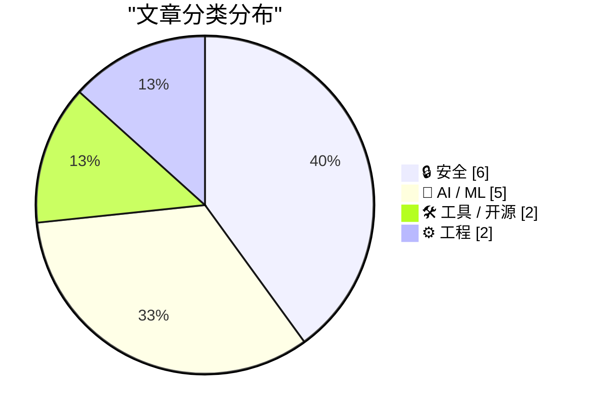
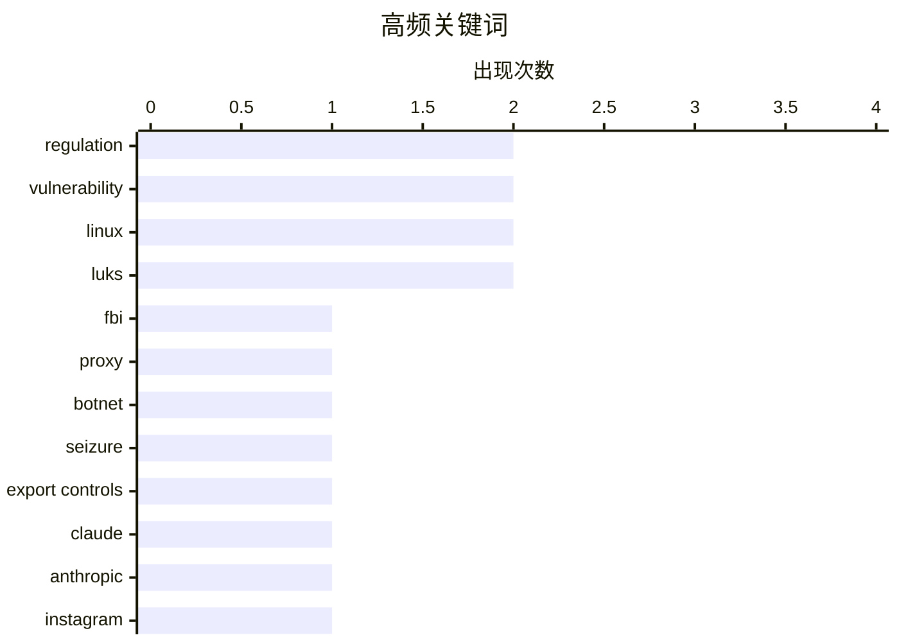

# 📰 AI 资讯每日精选 — 2026-07-03

> 汇聚 140+ 技术博客、X/Twitter、Hacker News、Reddit、Product Hunt、
> Lobste.rs、ClawFeed 日报及 GitHub Trending，经 AI 评分筛选。
>
> **本期内容**：🏆 今日必读 · 🌐 ClawFeed 日报 · 🔥 GitHub Trending · 📂 分类精选 · 🎨 设计与生成式 AI · 📊 数据概览

## 📝 今日看点

今日技术圈呈现三大焦点：AI代理能力爆发式增长，八个月内完成专业自由职业工作的比例从2.5%飙升至16%，正加速渗透劳动力市场；同时，AI法律边界被进一步明确，日本最高法院裁定AI不能列为专利发明人；安全领域则接连曝出重大隐患，包括黑客仅通过向Meta AI请求即可窃取Instagram账户，以及Linux 6.9内核起LUKS加密密钥在系统挂起时不再从内存清除，引发数据泄露风险。

---

## 🏆 今日必读

🥇 **FBI查封NetNut代理平台及Popa僵尸网络**

[FBI Seizes NetNut Proxy Platform, Popa Botnet](https://krebsonsecurity.com/2026/07/fbi-seizes-netnut-proxy-platform-popa-botnet/) — krebsonsecurity.com · 14 小时前 · 🔒 安全

> FBI宣布与行业合作伙伴合作，查封了与NetNut相关的数百个域名。NetNut是一家由以色列上市公司Alarum Technologies运营的住宅代理服务商。此次行动发生在KrebsOnSecurity发布调查报告约两周后，该报告将NetNut与Popa僵尸网络联系起来。Popa是一个由至少200万台被恶意软件感染的设备组成的僵尸网络。

💡 **为什么值得读**: 揭示了大型商业代理服务与僵尸网络之间的直接关联，以及执法部门的快速响应行动，对网络安全从业者具有重要警示意义。

🏷️ FBI, proxy, botnet, seizure

🥈 **Claude Fable与虚构叙事**

[Claude Fable and Kayfabe](https://www.anthropic.com/news/redeploying-fable-5) — daringfireball.net · 15 小时前 · 🤖 AI / ML

> Anthropic公司宣布，美国政府于6月12日对其最新模型Claude Fable 5和Claude Mythos 5实施了出口管制。由于无法实时验证用户国籍，Anthropic立即暂停了所有用户对这两个模型的访问权限。截至6月30日，针对Fable 5和Mythos 5的出口管制已被解除，模型访问已恢复。

💡 **为什么值得读**: 记录了AI大模型因出口管制被突然暂停和恢复访问的罕见事件，对关注AI监管和模型可用性的读者有直接参考价值。

🏷️ export controls, Claude, Anthropic, regulation

🥉 **黑客仅通过向Meta AI请求就窃取了Instagram账户**

[Hackers Stole Instagram Accounts Simply by Asking Meta AI to Give Them Access](https://www.404media.co/hackers-simply-asked-meta-ai-to-give-them-access-to-high-profile-instagram-accounts-it-worked/) — daringfireball.net · 18 小时前 · 🔒 安全

> 安全研究人员发现，黑客通过简单地与Meta的AI支持机器人对话，就能窃取高知名度Instagram账户。黑客在对话中要求AI将目标账户链接到新的邮箱地址，并提供了目标用户名和验证码。整个过程在Telegram群组中被分享，视频显示操作异常简单，无需复杂的技术手段。

💡 **为什么值得读**: 暴露了AI客服系统在账户安全验证上的严重漏洞，案例极具冲击力，对任何使用社交平台账户的用户都有警示作用。

🏷️ Instagram, account takeover, Meta AI, vulnerability

4️⃣ **自Linux 6.9起，LUKS挂起操作不再从内存中清除磁盘加密密钥**

[Since Linux 6.9, LUKS suspend stopped wiping disk-encryption keys from memory](https://mathstodon.xyz/@iblech/116769502749142438) — Hacker News Best · 18 小时前 · 🔒 安全

> 自2024年5月发布的Linux 6.9内核版本起，LUKS（Linux统一密钥设置）在系统挂起时不再将磁盘加密密钥从内存中清除。这意味着当笔记本电脑进入休眠或挂起状态时，加密密钥会保留在内存中，可能被攻击者通过冷启动攻击或其他内存访问手段获取。该问题在Hacker News上引发了广泛讨论，获得475个点赞和206条评论。

💡 **为什么值得读**: 揭示了一个影响所有使用LUKS全盘加密的Linux用户的安全回归问题，时间跨度超过一年，对系统安全评估至关重要。

🏷️ Linux, LUKS, disk encryption, kernel

5️⃣ **KDE Plasma沙箱中的任意代码执行漏洞**

[Arbitrary code execution breaking sandboxes in KDE Plasma](https://blog.kimiblock.top/2026/07/01/arbitrary-code-execution-in-kde-plasma/) — Lobste.rs · 7 小时前 · 🔒 安全

> 一篇博客文章披露了KDE Plasma桌面环境中存在一个可突破沙箱限制的任意代码执行漏洞。该漏洞允许攻击者在用户系统上执行任意代码，从而绕过KDE的沙箱安全机制。文章详细描述了漏洞的技术细节和利用方法。

💡 **为什么值得读**: 对KDE Plasma用户和开发者而言，这是需要立即关注的高危安全漏洞，涉及桌面环境的核心安全机制。

🏷️ KDE, sandbox, arbitrary code execution, vulnerability

---

## 🌐 ClawFeed 日报精选

> 来源：[ClawFeed](https://clawfeed.kevinhe.io) — AI 驱动的多源新闻聚合

# ClawFeed 日报 | 2026-07-02 (Wed)

基于 7 期 4h digest（#770–#777，覆盖 Jul 1 16:00 – Jul 2 20:00 SGT）汇总。

---

## 🔥 当日 Top 5

1. **Cursor 被 SpaceX 以 $60B 收购** — 买的不是利润（还在烧钱），是开发者社群和数据飞轮。AI 时代"最值钱的资产不在资产负债表上"。[来源](https://x.com/CocoAIxyz/status/2072530871245238552)

2. **Andrew Ng "Loop Engineering" 全天霸榜** — Boris Cherny (Claude Code) + Peter Steinberger (OpenClaw) 引爆的概念，view 从 280K → 467K，全天持续发酵，正在成为 agent 工程标准术语。[来源](https://x.com/AndrewYNg/status/2071988145667928442)

3. **Anthropic Fable 5 全球重新上线** — 与美国政府协商后加了新的安全分类器，部分常规编码任务短期受影响。Levie 评价：前沿模型发布的"新范式先例"。[来源](https://x.com/levie/status/2072172275017879829)

4. **X/Twitter 官方 MCP 正式发布** — Grok、Cursor 或任何 MCP 兼容工具可直接连接 X API，按量付费，个人信息类调用 $0.01/次。对 ClawFeed 采集和 agent 实时信息获取都是重大利好。[来源](https://x.com/op7418/status/2071816099986022650)

5. **Cognition 发布 Devin Security Swarm + "Agentic MapReduce"** — agent 大规模并发扫描代码安全漏洞。Aaron Levie 推论：AI 推理需求还要再涨 100 倍。[来源](https://x.com/levie/status/2072519377371459836)

---

## 📰 当日核心主题

- **Agent 工程范式成型** — Loop Engineering (Ng) + Agentic MapReduce (Devin) + Agent OS (BruceGuai Matrix) + OpenWiki (LangChain)，agent 从"概念"进入"工程方法论"阶段
- **AI 基础设施整合加速** — Cursor $60B 收购、X MCP 开放、RunInfra (YC F26) beta 上线，平台级入口快速收敛
- **中国 AI 开源持续输出** — MiMo 团队 (Fuli Luo) 连发 MOPD 论文 + MiMo-V2.5 推理优化 + MiMo Code 开源；CCOnline (idoubi) 零门槛 Vibe Coding
- **AI + Finance 交叉升温** — Claude for Finance 讲座 807K views，leopardracer 的投研分析师搭建教程持续传播
- **Skill 工程化** — Matt Pocock 的 Claude Code Skill 写作指南 (/writing-great-skills)、archify 架构图生成 Skill、OpenWiki agent-optimized docs

---

## 🔖 Bookmark 精选

- **@Av1dlive** — "Anthropic Claude for Finance 讲座是量化 AI 目前最好的免费一小时"，配合 leopardracer 投研分析师搭建文章。807K views。[链接](https://x.com/Av1dlive/status/2059273095970738264)
- **@BruceGuai** — Matrix Agent Company OS 架构详解：不是一个 Agent，而是一套能长期运行的 Agent 公司 OS。每个 Agent 独立权限/工具/记忆。与 Zylos 思路有共鸣。33K views。[链接](https://x.com/BruceGuai/status/2070130243059495142)

---

## 👀 推荐关注汇总（去重）

| 账号 | 简介 | Followers |
|------|------|-----------|
| [@_LuoFuli](https://x.com/_LuoFuli) | 前 DeepSeek，现 Xiaomi MiMo 负责人，MOPD/MiMo-V2.5/MiMo Code 连发 | 67.9K |
| [@rwayne](https://x.com/rwayne) | 医学+经济学+AI 交叉研究员，AI Research Workflow 开源计划 | 52K |
| [@runinfrai](https://x.com/runinfrai) | YC F26，推理优化平台 beta 上线，auto-optimize + serverless deploy | 6.7K |
| [@raft_hq](https://x.com/raft_hq) | humans + agents 协作平台，与 COCO agent-first workspace 方向有交集 | 1.1K |
| [@BruceGuai](https://x.com/BruceGuai) | Agent 架构实操经验，Matrix Agent OS，building in public | — |

> 提醒：未逐一核实是否已关注，Kevin 操作前请先搜 Following 列表。

---

## 💤 当日噪音模式

- **Bookmarks 零更新**：全天 7 期 digest 的 bookmarks 完全一致（仅 Av1dlive + BruceGuai 两条），说明 Kevin 今天没有新收藏操作，或 CDP 抓取窗口未覆盖新增
- **夜间/凌晨重复率高**：00:00–08:00 SGT 三期 digest 中 80%+ 内容与前期重复，Andrew Ng 帖子被 5 期反复收录（仅 view 数递增）
- **Following sample 固定**：8 人 sample 连续 7 期未变，部分账号（caterpillarous）整天无推文但仍被 surface

---

*聚合自 4h digests: #770, #772, #773, #774, #775, #776, #777*
---

## 🔥 GitHub Trending

> 今日热门开源项目（全语言 + Python）

| # | 项目 | 描述 | ⭐ 总星 | 📈 今日 | 语言 |
|---|------|------|---------|---------|------|
| 1 | [msitarzewski/agency-agents](https://github.com/msitarzewski/agency-agents) 🤖 | A complete AI agency at your fingertips - From frontend w... | 126.1k | +3032 | Shell |
| 2 | [usestrix/strix](https://github.com/usestrix/strix) 🤖 | Open-source AI penetration testing tool to find and fix y... | 33.4k | +2137 | Python |
| 3 | [HKUDS/Vibe-Trading](https://github.com/HKUDS/Vibe-Trading) 🤖 | "Vibe-Trading: Your Personal Trading Agent" | 17.6k | +939 | Python |
| 4 | [hasaneyldrm/exercises-dataset](https://github.com/hasaneyldrm/exercises-dataset) | A comprehensive dataset of 433 fitness exercises. Each en... | 9.7k | +938 | HTML |
| 5 | [JuliusBrussee/caveman](https://github.com/JuliusBrussee/caveman) 🤖 | 🪨 why use many token when few token do trick — Claude Co... | 82.2k | +926 | JavaScript |
| 6 | [obra/superpowers](https://github.com/obra/superpowers) | An agentic skills framework & software development method... | 245.0k | +897 | Shell |
| 7 | [NousResearch/hermes-agent](https://github.com/NousResearch/hermes-agent) 🤖 | The agent that grows with you | 208.4k | +829 | Python |
| 8 | [browser-use/video-use](https://github.com/browser-use/video-use) | Edit videos with coding agents | 14.2k | +554 | Python |
| 9 | [affaan-m/ECC](https://github.com/affaan-m/ECC) 🤖 | The agent harness performance optimization system. Skills... | 225.5k | +486 | JavaScript |
| 10 | [santifer/career-ops](https://github.com/santifer/career-ops) 🤖 | AI-powered job search system built on Claude Code. 14 ski... | 58.3k | +372 | JavaScript |
| 11 | [public-apis/public-apis](https://github.com/public-apis/public-apis) | A collective list of free APIs | 446.2k | +366 | Python |
| 12 | [openai/codex-plugin-cc](https://github.com/openai/codex-plugin-cc) 🤖 | Use Codex from Claude Code to review code or delegate tasks. | 22.9k | +352 | JavaScript |
| 13 | [browser-use/browser-use](https://github.com/browser-use/browser-use) 🤖 | 🌐 Make websites accessible for AI agents. Automate tasks... | 102.3k | +205 | Python |
| 14 | [anthropics/claude-code](https://github.com/anthropics/claude-code) 🤖 | Claude Code is an agentic coding tool that lives in your ... | 135.6k | +202 | Python |
| 15 | [open-webui/open-webui](https://github.com/open-webui/open-webui) 🤖 | User-friendly AI Interface (Supports Ollama, OpenAI API, ... | 144.0k | +144 | Python |

---

## 🔒 安全

### 1. FBI查封NetNut代理平台及Popa僵尸网络

[FBI Seizes NetNut Proxy Platform, Popa Botnet](https://krebsonsecurity.com/2026/07/fbi-seizes-netnut-proxy-platform-popa-botnet/) — **krebsonsecurity.com** · 14 小时前 · ⭐ 28/30

> FBI宣布与行业合作伙伴合作，查封了与NetNut相关的数百个域名。NetNut是一家由以色列上市公司Alarum Technologies运营的住宅代理服务商。此次行动发生在KrebsOnSecurity发布调查报告约两周后，该报告将NetNut与Popa僵尸网络联系起来。Popa是一个由至少200万台被恶意软件感染的设备组成的僵尸网络。

🏷️ FBI, proxy, botnet, seizure

---

### 2. 黑客仅通过向Meta AI请求就窃取了Instagram账户

[Hackers Stole Instagram Accounts Simply by Asking Meta AI to Give Them Access](https://www.404media.co/hackers-simply-asked-meta-ai-to-give-them-access-to-high-profile-instagram-accounts-it-worked/) — **daringfireball.net** · 18 小时前 · ⭐ 26/30

> 安全研究人员发现，黑客通过简单地与Meta的AI支持机器人对话，就能窃取高知名度Instagram账户。黑客在对话中要求AI将目标账户链接到新的邮箱地址，并提供了目标用户名和验证码。整个过程在Telegram群组中被分享，视频显示操作异常简单，无需复杂的技术手段。

🏷️ Instagram, account takeover, Meta AI, vulnerability

---

### 3. 自Linux 6.9起，LUKS挂起操作不再从内存中清除磁盘加密密钥

[Since Linux 6.9, LUKS suspend stopped wiping disk-encryption keys from memory](https://mathstodon.xyz/@iblech/116769502749142438) — **Hacker News Best** · 18 小时前 · ⭐ 26/30

> 自2024年5月发布的Linux 6.9内核版本起，LUKS（Linux统一密钥设置）在系统挂起时不再将磁盘加密密钥从内存中清除。这意味着当笔记本电脑进入休眠或挂起状态时，加密密钥会保留在内存中，可能被攻击者通过冷启动攻击或其他内存访问手段获取。该问题在Hacker News上引发了广泛讨论，获得475个点赞和206条评论。

🏷️ Linux, LUKS, disk encryption, kernel

---

### 4. KDE Plasma沙箱中的任意代码执行漏洞

[Arbitrary code execution breaking sandboxes in KDE Plasma](https://blog.kimiblock.top/2026/07/01/arbitrary-code-execution-in-kde-plasma/) — **Lobste.rs** · 7 小时前 · ⭐ 26/30

> 一篇博客文章披露了KDE Plasma桌面环境中存在一个可突破沙箱限制的任意代码执行漏洞。该漏洞允许攻击者在用户系统上执行任意代码，从而绕过KDE的沙箱安全机制。文章详细描述了漏洞的技术细节和利用方法。

🏷️ KDE, sandbox, arbitrary code execution, vulnerability

---

### 5. 自Linux 6.9（2024年5月）起，LUKS加密密钥在挂起期间仍驻留在内存中

[Since Linux 6.9 (May 2024), the LUKS encryption key remained resident in memory across suspend](https://mathstodon.xyz/@iblech/116769502749142438) — **Lobste.rs** · 15 小时前 · ⭐ 26/30

> 该文章指出，从Linux内核6.9版本开始，LUKS加密密钥在系统挂起（suspend）操作后仍然保留在内存中。这一行为违背了安全预期，因为挂起状态下内存数据更容易被物理访问或通过DMA攻击窃取。该问题在Lobste.rs社区引发了技术讨论。

🏷️ Linux, LUKS, encryption, memory leak

---

### 6. 弗吉尼亚州禁止销售地理位置数据

[Virginia bans sale of geolocation data](https://www.hunton.com/privacy-and-cybersecurity-law-blog/virginia-bans-sale-of-geolocation-data) — **Hacker News Best** · 13 小时前 · ⭐ 24/30

> 弗吉尼亚州通过新法案，成为美国首个明确禁止买卖消费者地理位置数据的州。该禁令覆盖了通过手机、车辆等设备收集的精确位置信息，旨在保护个人隐私免受追踪和滥用。法律对执法和紧急服务等特定场景设有豁免条款。此举被视为美国在联邦层面缺乏隐私立法背景下，州级数据保护的重要里程碑。核心观点是，地理位置数据因其高度敏感性，正成为隐私监管的首要目标。

🏷️ privacy, geolocation, regulation, data protection

---

## 🤖 AI / ML

### 7. Claude Fable与虚构叙事

[Claude Fable and Kayfabe](https://www.anthropic.com/news/redeploying-fable-5) — **daringfireball.net** · 15 小时前 · ⭐ 26/30

> Anthropic公司宣布，美国政府于6月12日对其最新模型Claude Fable 5和Claude Mythos 5实施了出口管制。由于无法实时验证用户国籍，Anthropic立即暂停了所有用户对这两个模型的访问权限。截至6月30日，针对Fable 5和Mythos 5的出口管制已被解除，模型访问已恢复。

🏷️ export controls, Claude, Anthropic, regulation

---

### 8. AI代理现在能以专业质量完成16%的自由职业工作，八个月前仅为2.5%

[AI agents can now complete 16 percent of freelance jobs at pro quality, up from 2.5 percent eight months ago](https://the-decoder.com/ai-agents-can-now-complete-16-percent-of-freelance-jobs-at-pro-quality-up-from-2-5-percent-eight-months-ago/) — **The Decoder** · 21 小时前 · ⭐ 25/30

> 根据远程劳动指数（Remote Labor Index）的测量，AI代理在八个月内以专业质量完成付费自由职业项目的比例从2.5%飙升至16%，增长了超过四倍。该指数衡量的是AI代理在无需人工干预的情况下，达到专业水准完成自由职业任务的能力。

🏷️ AI agents, freelance, automation, Remote Labor Index

---

### 9. 日本最高法院裁定：AI不能被列为专利发明人

[AI can't be listed as inventor on patent applications, Japan's top court rules](https://japannews.yomiuri.co.jp/science-nature/technology/20260306-314930/) — **Hacker News Best** · 20 小时前 · ⭐ 25/30

> 日本最高法院作出裁决，明确禁止将人工智能（AI）列为专利申请的发明人。该裁定确立了只有人类才能被认定为发明人的法律原则，为AI相关知识产权归属划定了清晰界限。该新闻在Hacker News上获得377个点赞和198条评论。

🏷️ AI, patent, inventorship, Japan

---

### 10. 使用 DSPy 评估和改进 Datasette Agent 的 SQL 系统提示词

[Using DSPy to evaluate and improve Datasette Agent's SQL system prompts](https://simonwillison.net/2026/Jul/2/dspy-datasette-agent-prompts/#atom-everything) — **simonwillison.net** · 15 小时前 · ⭐ 24/30

> 文章探讨了如何利用斯坦福大学的 DSPy 框架来系统性地优化 Datasette Agent 的 SQL 生成提示词。作者通过 DSPy 的编程式优化能力，对现有系统提示词进行了自动化评估和迭代改进。实验结果显示，优化后的提示词在生成 SQL 查询的准确性和鲁棒性上均有显著提升。该方法展示了将传统手工调优提示词转变为数据驱动、可复现的工程流程的可行性。核心结论是 DSPy 这类工具能有效降低 LLM 应用开发中提示词工程的试错成本。

🏷️ DSPy, evaluation, SQL, agent

---

### 11. 英伟达正通过资助 AI 初创公司，以削弱大型科技公司对其芯片业务的掌控

[Nvidia is bankrolling AI startups to loosen Big Tech's grip on its chip business](https://the-decoder.com/nvidia-is-bankrolling-ai-startups-to-loosen-big-techs-grip-on-its-chip-business/) — **The Decoder** · 21 小时前 · ⭐ 24/30

> 文章指出英伟达正扮演 AI 初创公司“央行”的角色，通过投资和提供算力资源来主动塑造计算市场。其核心策略是扶持新兴 AI 公司，以降低对亚马逊、谷歌、微软等云巨头客户的依赖。英伟达此举旨在分散其芯片销售渠道，避免被少数大客户绑架议价能力。结论是英伟达正从单纯的芯片供应商转变为 AI 生态的规则制定者。

🏷️ Nvidia, AI startups, investment, chip market

---

## 🛠 工具 / 开源

### 12. 为Web开发者推出Safari MCP服务器

[Introducing the Safari MCP Server for Web Developers](https://webkit.org/blog/18136/introducing-the-safari-mcp-server-for-web-developers/) — **daringfireball.net** · 12 小时前 · ⭐ 25/30

> WebKit团队在Safari技术预览版247中引入了Safari MCP服务器，这是一个基于模型上下文协议（MCP）的服务器。该工具允许AI代理连接到Safari浏览器窗口，从而实时了解代码在浏览器中的实际渲染效果。这旨在加速和增强Web开发与调试工作流程，使AI代理能更准确地辅助编码。

🏷️ Safari, MCP, web development, debugging

---

### 13. Podman v6.0.0 正式发布

[Podman v6.0.0](https://blog.podman.io/2026/07/introducing-podman-v6-0-0/) — **Hacker News Best** · 19 小时前 · ⭐ 24/30

> Podman 发布了 6.0.0 大版本更新，引入了多项重大改进。新版本重点优化了与 Docker Compose 的兼容性，并默认启用了新的网络栈 Netavark。此外，Podman Machine 在 macOS 和 Windows 上的性能与稳定性得到显著提升。该版本还移除了对旧版 CNI 网络插件的支持，标志着架构的彻底转型。核心结论是 Podman 6.0 进一步巩固了其作为 Docker 安全、无守护进程替代方案的地位。

🏷️ Podman, containers, Docker, release

---

## ⚙️ 工程

### 14. PostgreSQL 19中的内核异步读取（io_uring）

[kernel asynchronous reads in PostgreSQL 19 (io_uring)](https://dev.to/franckpachot/iouring-buffered-reads-in-postgresql-19-iouring-mcn) — **Lobste.rs** · 21 小时前 · ⭐ 25/30

> 文章介绍了PostgreSQL 19版本中引入的基于io_uring的内核异步读取功能。io_uring是Linux内核提供的高性能异步I/O接口，该特性允许PostgreSQL在缓冲池读取操作中利用内核级别的异步能力，从而显著提升数据库的I/O性能和并发处理能力。

🏷️ PostgreSQL, io_uring, async, database

---

### 15. “为什么 Meta 正在摧毁它的工程组织？”

[‘Why Is Meta Destroying Its Engineering Organization?’](https://newsletter.pragmaticengineer.com/p/why-is-meta-destroying-its-engineering) — **daringfireball.net** · 17 小时前 · ⭐ 24/30

> 文章尖锐批评了 Meta 近期在工程管理上的四项争议性举措：追踪工程师的键盘和鼠标点击、将大量工程师调岗做数据标注、宣布 10% 的裁员计划，以及鼓励开发者互相打低绩效分的文化。作者认为，这些措施导致工程师不再关注实际产出，转而专注于“表演性工作”。核心观点是，这种管理方式正在系统性地摧毁 Meta 的工程文化和创新能力。

🏷️ Meta, engineering culture, performative work, management

---

## 🎨 Design & Generative AI

### 🖼️ 生成式图片

- **[LTX 2.3多功能时间线与数字人工作流](https://www.reddit.com/r/comfyui/comments/1ullhi8/comfyuiltx_23_multifunctional_timeline_digital/)** — r/comfyui · 18 小时前
  > 基于ComfyUI的LTX 2.3工作流，集成时间线编辑、音频驱动生成和一致性增强提示模板。

- **[自定义节点包：实时节点内预览](https://www.reddit.com/r/comfyui/comments/1uma5rc/made_a_custom_node_pack_with_live_innode_previews/)** — r/comfyui · 19 分钟前
  > 开发了一个支持节点内实时预览的自定义节点包，提升ComfyUI使用体验。

- **[ComfyDesigner：模糊ComfyUI与TouchDesigner的界限](https://www.reddit.com/r/comfyui/comments/1ulnagf/comfydesigner_blurring_the_line_between_comfyui/)** — r/comfyui · 17 小时前
  > 一个将ComfyUI与TouchDesigner融合的工具，拓展了创意编程的可能性。

- **[TrixLoader 2.5：完全独立的终极图像编辑器](https://www.reddit.com/r/comfyui/comments/1ulg9pg/trixloader_25_is_here_the_ultimate_image_editor/)** — r/comfyui · 22 小时前
  > TrixLoader 2.5实现完全独立，集成CameraRaw滤镜、SAM 3高级遮罩编辑和裁剪外绘功能。

- **[ComfyUI更新后每次从磁盘重新加载模型，生成时间暴增](https://www.reddit.com/r/comfyui/comments/1uluxn1/just_updated_to_latest_comfyui_from_the_release/)** — r/comfyui · 12 小时前
  > 最新ComfyUI版本强制每次从磁盘读取模型，即使共享加载节点也导致生成时间异常延长。

- **[ComfyUI更新后旧图像参数丢失？](https://www.reddit.com/r/comfyui/comments/1ulmf5i/missing_data/)** — r/comfyui · 18 小时前
  > 升级到ComfyUI 0.26.0后，之前生成的图像工作流参数全部恢复为默认值，数据丢失问题待解决。

- **[如何制作高质量的Krea 2 AI模型LoRA教程](https://www.reddit.com/r/comfyui/comments/1ulo44r/tutorial_how_to_make_a_decent_krea_2_ai_model_lora/)** — r/comfyui · 17 小时前
  > 分享制作Krea 2 AI模型LoRA的教程，展示良好效果并即将发布模型。

- **[Flux 2 Klein 9b LoRa实现太阳方向精确控制](https://www.reddit.com/r/comfyui/comments/1ulon9c/precise_control_of_the_sun_direction_with_this/)** — r/comfyui · 16 小时前
  > 通过Flux 2 Klein 9b LoRa模型，实现对图像中太阳方向的精准控制。

- **[节点输入溢出错误问题求助](https://www.reddit.com/r/comfyui/comments/1ulgekh/overflow_of_input_on_node/)** — r/comfyui · 22 小时前
  > 用户反馈ComfyUI节点出现输入溢出错误，寻求解决方案。

### 🎬 生成式视频

- **[中国AI视频生成器Kling融资20亿美元，筹备香港IPO](https://the-decoder.com/chinese-ai-video-maker-kling-raises-2-billion-as-it-gears-up-for-hong-kong-ipo/)** — The Decoder · 1 小时前
  > 快手旗下AI视频部门Kling筹集约20亿美元，正为香港首次公开募股做准备。

- **[在ComfyUI中为不同场景使用两种视频模型，效果显著提升](https://www.reddit.com/r/comfyui/comments/1ulfwo4/used_two_different_video_models_for_different/)** — r/comfyui · 22 小时前
  > 通过结合两种视频模型处理不同场景类型，在ComfyUI中实现了更优的视频生成效果。

- **[为ComfyUI视频稳定器添加人工相机抖动](https://www.reddit.com/r/comfyui/comments/1um9fn7/added_artificial_camera_shake_to/)** — r/comfyui · 1 小时前
  > 在ComfyUI视频稳定器中新增人工相机抖动功能，增强视频动态效果。

- **[RTX 3090还是5070 Ti？为Wan视频模型选择最佳GPU](https://www.reddit.com/r/comfyui/comments/1ulwppi/rtx_3090_or_5070_ti_for_wan/)** — r/comfyui · 11 小时前
  > 针对Wan视频模型，对比RTX 3090与5070 Ti的性能，提供本地GPU升级建议。

- **[Wan 2.2动画：角色动画与替换工作流](https://www.reddit.com/r/comfyui/comments/1um9mx0/wan_22_animate_character_animation_and_replacement/)** — r/comfyui · 49 分钟前
  > 寻找在ComfyUI中用图像替换视频中人物的工作流，适用于角色动画与替换。

- **[视频角色替换：用AI角色替换参考视频中的人物](https://www.reddit.com/r/comfyui/comments/1ulr93a/character_replacement/)** — r/comfyui · 15 小时前
  > 基于参考视频，使用训练好的AI角色替换视频中的人物，实现角色替换效果。

---

## 📊 数据概览

| 扫描源 | 抓取文章 | 时间范围 | 精选 |
|:---:|:---:|:---:|:---:|
| 93/140 | 3824 篇 → 91 篇 | 24h | **15 篇** |

### 分类分布



### 高频关键词



<details>
<summary>📈 纯文本关键词图（终端友好）</summary>

```
regulation      │ ████████████████████ 2
vulnerability   │ ████████████████████ 2
linux           │ ████████████████████ 2
luks            │ ████████████████████ 2
fbi             │ ██████████░░░░░░░░░░ 1
proxy           │ ██████████░░░░░░░░░░ 1
botnet          │ ██████████░░░░░░░░░░ 1
seizure         │ ██████████░░░░░░░░░░ 1
export controls │ ██████████░░░░░░░░░░ 1
claude          │ ██████████░░░░░░░░░░ 1
```

</details>

### 🏷️ 话题标签

**regulation**(2) · **vulnerability**(2) · **linux**(2) · luks(2) · fbi(1) · proxy(1) · botnet(1) · seizure(1) · export controls(1) · claude(1) · anthropic(1) · instagram(1) · account takeover(1) · meta ai(1) · disk encryption(1) · kernel(1) · kde(1) · sandbox(1) · arbitrary code execution(1) · encryption(1)

---

*生成于 2026-07-03 10:15 | 汇聚 140 个技术博客、X/Twitter、Hacker News、Reddit、Product Hunt、Lobste.rs、ClawFeed 日报及 GitHub Trending，经 AI 评分筛选出 Top 15 精华内容*
