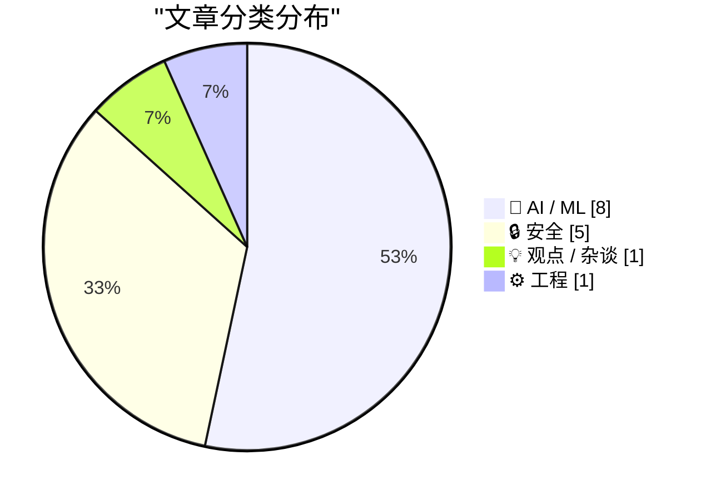
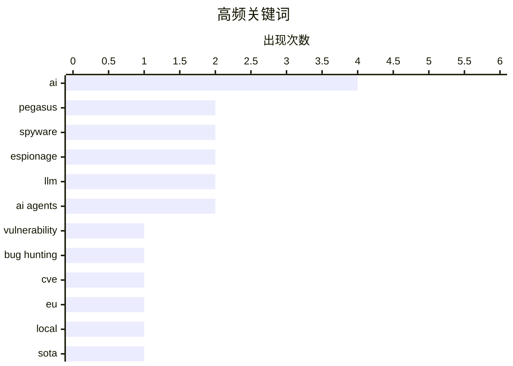

# 📰 AI 资讯每日精选 — 2026-07-04

> 汇聚 140+ 技术博客、X/Twitter、Hacker News、Reddit、Product Hunt、
> Lobste.rs、ClawFeed 日报及 GitHub Trending，经 AI 评分筛选。
>
> **本期内容**：🏆 今日必读 · 🌐 ClawFeed 日报 · 🔥 GitHub Trending · 📂 分类精选 · 🎨 设计与生成式 AI · 📊 数据概览

## 📝 今日看点

今日技术圈的核心趋势围绕AI安全与智能体能力展开。一方面，AI驱动的漏洞挖掘正引发安全报告激增，同时针对高层的间谍软件攻击也凸显了数字威胁的严峻性；另一方面，AI智能体的真实能力被低估，开源模型在形式化验证和代码缺陷发现上取得突破，而微软、Anthropic等巨头正加速整合AI超级应用与智能体工具，推动编程与办公场景的深度自动化。

---

## 🏆 今日必读

🥇 **自AI模型开始搜寻漏洞以来，安全漏洞报告数量激增**

[Security vulnerability reports have exploded since AI models started hunting for bugs](https://the-decoder.com/security-vulnerability-reports-have-exploded-since-ai-models-started-hunting-for-bugs/) — The Decoder · 16 小时前 · 🔒 安全

> Epoch AI报告显示，安全漏洞报告数量出现急剧增长。2026年6月，21家组织报告了约1500个高严重性和关键性的CVE漏洞，是此前月度记录的三倍多。这一激增与AI驱动的漏洞搜寻项目的启动时间点高度吻合。AI模型正在显著改变安全漏洞的发现和报告模式。

💡 **为什么值得读**: 用具体数据（1500个CVE、3.5倍增长）直观展示了AI对网络安全领域的颠覆性影响，值得安全从业者和AI研究者关注。

🏷️ vulnerability, AI, bug hunting, CVE

🥈 **针对欧洲议会的间谍活动**

[Espionage Against the European Parliament](https://citizenlab.ca/research/member-of-committee-investigating-spyware-hacked-with-pegasus/) — Hacker News Best · 12 小时前 · 🔒 安全

> 公民实验室（Citizenlab）的研究揭露，一名正在调查间谍软件问题的欧洲议会委员会成员，其手机被以色列NSO公司的Pegasus间谍软件入侵。该事件表明，即便是调查间谍软件的最高立法机构成员，也成为了商业间谍软件的目标。这起入侵事件凸显了间谍软件对民主机构和调查人员的严重威胁。

💡 **为什么值得读**: 揭露了调查间谍软件的人反被间谍软件攻击的讽刺性事件，对理解当前数字监控的严峻形势具有极高警示价值。

🏷️ Pegasus, spyware, espionage, EU

🥉 **Jamesob的本地运行SOTA大语言模型指南**

[Jamesob's guide to running SOTA LLMs locally](https://github.com/jamesob/local-llm) — Hacker News Best · 18 小时前 · 🤖 AI / ML

> 这是一个在GitHub上广受好评的实用指南，详细介绍了如何在本地硬件上运行当前最先进（SOTA）的大语言模型（LLM）。指南涵盖了模型选择、硬件要求、量化技术以及推理框架的配置等关键步骤。它旨在帮助用户摆脱对云服务的依赖，实现完全本地化、私密的AI体验。该指南因其操作性强和内容全面而获得了334个点赞和151条评论。

💡 **为什么值得读**: 对于希望摆脱API依赖、追求数据隐私和离线使用的AI爱好者和开发者来说，这是一份不可多得的实战操作手册。

🏷️ LLM, local, SOTA, guide

4️⃣ **Mistral开源模型Leanstral 1.5在形式化数学基准测试中表现出色，并捕获真实代码错误**

[Mistral's open-source Leanstral 1.5 aces formal math benchmarks and catches real bugs in code](https://the-decoder.com/mistrals-open-source-leanstral-1-5-aces-formal-math-benchmarks-and-catches-real-bugs-in-code/) — The Decoder · 1 小时前 · 🤖 AI / ML

> Mistral AI发布了开源模型Leanstral 1.5，专门用于Lean 4形式化验证。该模型不仅在形式化数学基准测试中取得了优异成绩，还在扫描57个开源代码仓库时，发现了5个此前未知的真实代码错误。这证明了AI在形式化验证和代码缺陷检测领域的实用价值，超越了纯数学理论范畴。

💡 **为什么值得读**: 展示了开源AI模型在严谨的数学证明和实际软件工程中同时取得突破，对形式化方法和代码质量领域具有里程碑意义。

🏷️ Mistral, formal verification, Lean 4, open-source

5️⃣ **英国AI安全研究所发现标准基准测试系统性低估了AI智能体的实际能力**

[UK's AI Security Institute finds standard benchmarks systematically underestimate what AI agents can actually do](https://the-decoder.com/uks-ai-security-institute-finds-standard-benchmarks-systematically-underestimate-what-ai-agents-can-actually-do/) — The Decoder · 16 小时前 · 🤖 AI / ML

> 英国AI安全研究所（AISI）对七个基准测试的研究表明，标准AI评估通过限制计算预算（token预算），系统性低估了智能体的真实能力。在软件工程任务中，当token预算增加十倍时，成功率跃升了约25%。新模型受益最大。AISI指出，根据token预算的不同，前沿模型的实际进步速度比此前测量结果要陡峭约60%。

💡 **为什么值得读**: 揭示了当前AI评估体系的一个根本性缺陷，对于正确理解AI智能体（尤其是前沿模型）的真实能力上限至关重要。

🏷️ AI agents, benchmarks, evaluation, UK AISI

---

## 🌐 ClawFeed 日报精选

> 来源：[ClawFeed](https://clawfeed.kevinhe.io) — AI 驱动的多源新闻聚合

📅 ClawFeed 日报 | 2026-07-03 (Thu)

覆盖 5 期 4h digest（#780–#784），时段 00:00–19:59 SGT。20:00–23:59 期尚未生成。

---

## 🔥 当日 Top 5

1. **Browser Use CLI 3.0 发布** — 体积缩小 6 倍、token 消耗大幅下降，通过 Chrome CDP 协议直接操作浏览器，可作为 skill 装进 Claude Code / Codex。Agent 工具链基础层正在重构。(#784)
   https://x.com/xiaohu/status/2072987979979837620

2. **Microsoft "Frontier Co" $2.5B + 6,000 工程师** — Microsoft/Amazon/OpenAI/Anthropic 全部入场 Palantir 式企业 AI 落地赛道。Aaron Levie 评论：企业 AI 部署远不止 chatbot，需要真正对齐底层业务流程。(#782 #784)
   https://x.com/levie/status/2072875685811716182

3. **Cognition Devin Security Swarm** — 基于 "Agentic MapReduce" 架构扫描复杂代码库漏洞，Levie 跟进：这正是未来需要 100X 推理算力的缩影——swarm 将指数级放大处理大数据任务的算力需求。(#784)
   https://x.com/levie/status/2072519377371459836

4. **ElevenLabs $2M pre-seed → $11B 估值，三年，$780M+ 融资** — a16z/ICONIQ/Sequoia/Nat Friedman，原始 seed deck 公开。语音 AI 赛道标杆融资路径。(#782)
   https://x.com/Collateral_com/status/2072387293587898768

5. **Elvis Fable 5 /goal + Loss Functions 实战 Playbook** — "99% 的人用 /goal 和 loops 都用错了"——30 小时用一条 prompt 提炼产品的完整方法论。核心观点：顶级 agentic 工程师精确定义 loss function 让 agent 在循环中收敛。418 likes / 100K views。(#781)
   https://x.com/elvissun/status/2072728995532255669

---

## 📰 当日核心主题

**1. Agent 工具链重构**
Browser Use CLI 3.0（CDP 直控）、archify 架构图生成 skill（#780 #781 持续传播 129K views）——agent 操作浏览器和可视化文档的基础能力正在从"封装 API"转向"原生协议"。

**2. 企业 AI 落地赛道加速**
Microsoft Frontier Co $2.5B、Levie 反复评论企业 AI 部署复杂度——从 chatbot 到 business process alignment，巨头和创业公司在同一赛道竞争。

**3. Agent 架构范式**
Devin Security Swarm（Agentic MapReduce）、Raft "We build Raft entirely in Raft" 自举、BruceGuai Matrix Agent OS 深度拆解——"一个超级 agent 扛所有" 正在让位给有分工有问责的 agent 组织。

**4. 融资与估值信号**
ElevenLabs $11B（语音 AI）、DoveyWanCN 披露 Google 内部视角（TPU 自研 vs GPU 采购、广告业务 AI-native）——资本在往哪走，底层架构在怎么变。

**5. 推理基础设施**
RunInfra beta（YC F26）——推理侧 DevOps 抽象层，描述 use case 自动完成 kernel/量化/serverless 部署。Google TPU 战略。

---

## 🔖 Bookmarks 精选

全天无新增收藏，维持两条长期标注：
- @Av1dlive — Claude for Finance 讲座（808K+ views），金融 x AI 工具化实操标杆
- @BruceGuai — Matrix Agent 架构拆解，harness 工程 > 单模型能力

---

## 👀 推荐关注汇总

- **@runinfrai** (RunInfra YC F26) — 推理基础设施自动优化方向，刚上 beta
- **@BruceGuai** — Agent 架构工程深度输出，中文 AI 圈少有的 harness 级别思考者

*上述未验证是否已关注，操作前请先在 Following 搜索确认。*

---

## 💤 当日噪音模式

- **Bookmarks 停滞**：连续多期完全相同（Av1dlive + BruceGuai），无新增——可能需要调整收藏习惯或扩大 monitoring 范围
- **Feed 薄 + 重复**：凌晨/上午/午间三个时段（#780 #781 #783）feed 条数极少（各 3 条），大量内容为前期持续传播
- **币圈 spam**：@Soft6161 DeFi 付费推广，已过滤
- **非 AI 噪音**：caterpillarous Steve Jobs 感怀、AmandaAskell 球赛吐槽——与 AI/tech 无信号价值

---

聚合自 4h digest: #780, #781, #782, #783, #784---

## 🔥 GitHub Trending

> 今日热门开源项目（全语言 + Python）

| # | 项目 | 描述 | ⭐ 总星 | 📈 今日 | 语言 |
|---|------|------|---------|---------|------|
| 1 | [JuliusBrussee/caveman](https://github.com/JuliusBrussee/caveman) 🤖 | 🪨 why use many token when few token do trick — Claude Co... | 83.3k | +2863 | JavaScript |
| 2 | [usestrix/strix](https://github.com/usestrix/strix) 🤖 | Open-source AI penetration testing tool to find and fix y... | 35.3k | +2803 | Python |
| 3 | [obra/superpowers](https://github.com/obra/superpowers) | An agentic skills framework & software development method... | 245.8k | +1209 | Shell |
| 4 | [msitarzewski/agency-agents](https://github.com/msitarzewski/agency-agents) 🤖 | A complete AI agency at your fingertips - From frontend w... | 126.7k | +1208 | Shell |
| 5 | [facebook/astryx](https://github.com/facebook/astryx) 🤖 | An open source design system that's fully customizable an... | 5.0k | +885 | TypeScript |
| 6 | [harvard-edge/cs249r_book](https://github.com/harvard-edge/cs249r_book) 🤖 | Machine Learning Systems | 26.3k | +793 | Python |
| 7 | [openai/codex-plugin-cc](https://github.com/openai/codex-plugin-cc) 🤖 | Use Codex from Claude Code to review code or delegate tasks. | 23.5k | +634 | JavaScript |
| 8 | [langflow-ai/langflow](https://github.com/langflow-ai/langflow) 🤖 | Langflow is a powerful tool for building and deploying AI... | 151.1k | +531 | Python |
| 9 | [ogulcancelik/herdr](https://github.com/ogulcancelik/herdr) 🤖 | agent multiplexer that lives in your terminal. | 11.0k | +478 | Rust |
| 10 | [HKUDS/Vibe-Trading](https://github.com/HKUDS/Vibe-Trading) 🤖 | "Vibe-Trading: Your Personal Trading Agent" | 17.7k | +464 | Python |
| 11 | [agentskills/agentskills](https://github.com/agentskills/agentskills) 🤖 | Specification and documentation for Agent Skills | 22.1k | +406 | Python |
| 12 | [ChromeDevTools/chrome-devtools-mcp](https://github.com/ChromeDevTools/chrome-devtools-mcp) | Chrome DevTools for coding agents | 45.6k | +405 | TypeScript |
| 13 | [pytorch/pytorch](https://github.com/pytorch/pytorch) 🤖 | Tensors and Dynamic neural networks in Python with strong... | 101.5k | +293 | Python |
| 14 | [rommapp/romm](https://github.com/rommapp/romm) | A beautiful, powerful, self-hosted rom manager and player. | 9.9k | +239 | Python |
| 15 | [anthropics/claude-code](https://github.com/anthropics/claude-code) 🤖 | Claude Code is an agentic coding tool that lives in your ... | 136.0k | +221 | Python |

---

## 🤖 AI / ML

### 1. Jamesob的本地运行SOTA大语言模型指南

[Jamesob's guide to running SOTA LLMs locally](https://github.com/jamesob/local-llm) — **Hacker News Best** · 18 小时前 · ⭐ 26/30

> 这是一个在GitHub上广受好评的实用指南，详细介绍了如何在本地硬件上运行当前最先进（SOTA）的大语言模型（LLM）。指南涵盖了模型选择、硬件要求、量化技术以及推理框架的配置等关键步骤。它旨在帮助用户摆脱对云服务的依赖，实现完全本地化、私密的AI体验。该指南因其操作性强和内容全面而获得了334个点赞和151条评论。

🏷️ LLM, local, SOTA, guide

---

### 2. Mistral开源模型Leanstral 1.5在形式化数学基准测试中表现出色，并捕获真实代码错误

[Mistral's open-source Leanstral 1.5 aces formal math benchmarks and catches real bugs in code](https://the-decoder.com/mistrals-open-source-leanstral-1-5-aces-formal-math-benchmarks-and-catches-real-bugs-in-code/) — **The Decoder** · 1 小时前 · ⭐ 25/30

> Mistral AI发布了开源模型Leanstral 1.5，专门用于Lean 4形式化验证。该模型不仅在形式化数学基准测试中取得了优异成绩，还在扫描57个开源代码仓库时，发现了5个此前未知的真实代码错误。这证明了AI在形式化验证和代码缺陷检测领域的实用价值，超越了纯数学理论范畴。

🏷️ Mistral, formal verification, Lean 4, open-source

---

### 3. 英国AI安全研究所发现标准基准测试系统性低估了AI智能体的实际能力

[UK's AI Security Institute finds standard benchmarks systematically underestimate what AI agents can actually do](https://the-decoder.com/uks-ai-security-institute-finds-standard-benchmarks-systematically-underestimate-what-ai-agents-can-actually-do/) — **The Decoder** · 16 小时前 · ⭐ 25/30

> 英国AI安全研究所（AISI）对七个基准测试的研究表明，标准AI评估通过限制计算预算（token预算），系统性低估了智能体的真实能力。在软件工程任务中，当token预算增加十倍时，成功率跃升了约25%。新模型受益最大。AISI指出，根据token预算的不同，前沿模型的实际进步速度比此前测量结果要陡峭约60%。

🏷️ AI agents, benchmarks, evaluation, UK AISI

---

### 4. 开源AI差距地图

[Open Source AI Gap Map](https://simonwillison.net/2026/Jul/3/open-source-ai-gap-map/#atom-everything) — **simonwillison.net** · 11 小时前 · ⭐ 24/30

> Current AI是一个在2025年2月巴黎AI行动峰会上成立的全球非营利合作伙伴关系，已获得4亿美元承诺资金。该组织发布了“差距地图”（Gap Map）v0.1版本，旨在系统性地索引和可视化当前开源AI生态系统中存在的空白和不足。该地图为理解开源AI的发展现状和投资方向提供了宏观视角。

🏷️ Open Source, AI, non-profit, policy

---

### 5. 来自加拉帕戈斯岛的智能体编程笔记

[Agentic coding notes from Galapogos Island](https://danluu.com/ai-coding/#appendix-agentic-loops-and-writing-this-post) — **Lobste.rs** · 5 小时前 · ⭐ 24/30

> Dan Luu在其博客中分享了关于AI智能体编程的深度观察和实验笔记。文章探讨了当前AI编码智能体的实际能力、局限性以及在不同任务上的表现。附录部分详细记录了作者在撰写本文时使用的智能体循环（agentic loops）和具体工作流程，提供了第一手的实践经验。

🏷️ agentic coding, AI, LLM, software development

---

### 6. 微软效仿Anthropic和OpenAI，通过全面改版的Copilot和AutoPilot智能体加入AI超级应用竞赛

[Microsoft follows Anthropic and OpenAI into the AI super app race with overhauled Copilot and AutoPilot agents](https://the-decoder.com/microsoft-follows-anthropic-and-openai-into-the-ai-super-app-race-with-overhauled-copilot-and-autopilot-agents/) — **The Decoder** · 13 小时前 · ⭐ 23/30

> 据报道，微软计划在8月将其消费者和企业版Copilot应用合并为一个统一应用。同时，一些使用率低的功能如Copilot Podcasts将被砍掉。新的AI智能体“AutoPilot”将能够在后台自动处理任务，但需要额外付费。此举标志着微软正式加入与Anthropic和OpenAI的AI超级应用竞争。

🏷️ Microsoft, Copilot, AI agents, super app

---

### 7. GPT和Claude未能通过桥水基金金融测试，因为正确答案从未公开

[GPT and Claude failed Bridgewater's finance tests because the right answers were never public](https://the-decoder.com/gpt-and-claude-failed-bridgewaters-finance-tests-because-the-right-answers-were-never-public/) — **The Decoder** · 21 小时前 · ⭐ 23/30

> 桥水基金与前OpenAI CTO Mira Murati创立的Thinking Machines Lab合作，基于Qwen3-235B模型微调了一个金融专用模型。在内部测试中，该模型准确率达到84.7%，性能超越Gemini、Claude和GPT，但成本仅为这些模型的约十四分之一。此前GPT和Claude在桥水基金的金融测试中表现不佳，根本原因在于正确答案从未公开，导致模型无法通过公开数据学习到正确决策。该测试结果尚未得到两家公司之外的第三方验证。

🏷️ finance, Qwen, fine-tuning, Bridgewater

---

### 8. Anthropic启动自有药物发现项目，攻克大型制药公司认为无利可图的疾病

[Anthropic launches its own drug discovery programs to tackle diseases Big Pharma considers unprofitable](https://the-decoder.com/anthropic-launches-its-own-drug-discovery-programs-to-tackle-diseases-big-pharma-considers-unprofitable/) — **The Decoder** · 58 分钟前 · ⭐ 22/30

> Anthropic宣布启动针对被制药行业视为无利可图的被忽视疾病的药物开发项目。诺华CEO Vas Narasimhan认为，AI可将药物开发时间从12年缩短至7-8年，并将成功率从8%翻倍至16%。Anthropic此举旨在利用AI能力填补市场失灵领域，而非追求商业回报最大化。

🏷️ AI, drug discovery, Anthropic, pharma

---

## 🔒 安全

### 9. 自AI模型开始搜寻漏洞以来，安全漏洞报告数量激增

[Security vulnerability reports have exploded since AI models started hunting for bugs](https://the-decoder.com/security-vulnerability-reports-have-exploded-since-ai-models-started-hunting-for-bugs/) — **The Decoder** · 16 小时前 · ⭐ 26/30

> Epoch AI报告显示，安全漏洞报告数量出现急剧增长。2026年6月，21家组织报告了约1500个高严重性和关键性的CVE漏洞，是此前月度记录的三倍多。这一激增与AI驱动的漏洞搜寻项目的启动时间点高度吻合。AI模型正在显著改变安全漏洞的发现和报告模式。

🏷️ vulnerability, AI, bug hunting, CVE

---

### 10. 针对欧洲议会的间谍活动

[Espionage Against the European Parliament](https://citizenlab.ca/research/member-of-committee-investigating-spyware-hacked-with-pegasus/) — **Hacker News Best** · 12 小时前 · ⭐ 26/30

> 公民实验室（Citizenlab）的研究揭露，一名正在调查间谍软件问题的欧洲议会委员会成员，其手机被以色列NSO公司的Pegasus间谍软件入侵。该事件表明，即便是调查间谍软件的最高立法机构成员，也成为了商业间谍软件的目标。这起入侵事件凸显了间谍软件对民主机构和调查人员的严重威胁。

🏷️ Pegasus, spyware, espionage, EU

---

### 11. Claude Code复杂的中国问题：太平洋两岸的禁令

[Claude Code's complicated China problem involves bans on both sides of the Pacific](https://the-decoder.com/claude-codes-complicated-china-problem-involves-bans-on-both-sides-of-the-pacific/) — **The Decoder** · 15 小时前 · ⭐ 24/30

> Anthropic试图阻止字节跳动和蚂蚁金服等中国公司访问其编程工具Claude Code，但这些公司通过VPN和海外子公司绕过了限制。与此同时，阿里巴巴在发现Claude Code中存在可识别中国用户的隐藏代码后，已禁止其员工使用该工具。这形成了太平洋两岸相互封锁的复杂局面。

🏷️ Claude Code, China, VPN, bans

---

### 12. 换个名字的“非混合TLS-MLKEM”标准：IETF如何逃避责任

[A [non-hybrid tls-mlkem] standard by any other name: How IETF evades responsibility for its actions](https://blog.cr.yp.to/20260702-standard.html) — **Lobste.rs** · 19 小时前 · ⭐ 23/30

> 文章批评IETF（互联网工程任务组）在制定后量子密码标准时，通过将“非混合TLS-MLKEM”方案重新命名来规避对其安全决策的责任。作者指出，IETF明知纯ML-KEM（不含混合方案）存在安全风险，却通过语义游戏而非技术论证来推动标准化进程。核心观点是IETF这种命名策略实质上是在推卸对标准安全性的最终责任。

🏷️ TLS, ML-KEM, IETF, cryptography

---

### 13. 针对欧洲议会的间谍活动：调查间谍软件委员会成员遭Pegasus入侵

[Espionage Against the European Parliament: Member of Committee Investigating Spyware Hacked with Pegasus](https://citizenlab.ca/research/member-of-committee-investigating-spyware-hacked-with-pegasus/) — **Lobste.rs** · 10 小时前 · ⭐ 23/30

> 公民实验室（Citizen Lab）披露，欧洲议会调查间谍软件使用情况的委员会成员遭到NSO集团开发的Pegasus间谍软件入侵。该攻击直接针对正在调查非法监控行为的立法者，表明攻击者有能力且有意愿对最高层级的调查机构实施反制。这一事件暴露了数字监控工具对民主机构和调查程序的严重威胁。

🏷️ Pegasus, spyware, espionage, privacy

---

## 💡 观点 / 杂谈

### 14. Claude糟糕透顶的Electron Mac应用是一场内部阴谋

[★ Claude’s Criminally Bad Electron Mac App Is an Inside Job](https://daringfireball.net/2026/07/claudes_criminally_bad_mac_app_is_an_inside_job) — **daringfireball.net** · 11 小时前 · ⭐ 24/30

> 文章尖锐批评了Anthropic公司Claude桌面版Mac应用使用Electron框架的决定。作者指出，该项目的负责人Felix Rieseberg恰好是世界上最流行的Electron框架之一（Slack）的创始人和共同拥有者。这解释了为何Claude会选择性能饱受诟病的Electron，而非原生Mac应用。作者认为这是一种利益冲突导致的产品决策失误。

🏷️ Claude, Electron, app performance, critique

---

## ⚙️ 工程

### 15. 编译为空的掩码：HotSpot JIT如何学会推理比特位

[The mask that compiles to nothing: how HotSpot's JIT learned to reason about bits](https://questdb.com/blog/jvm-jit-known-bits/) — **Lobste.rs** · 19 小时前 · ⭐ 22/30

> 文章深入解析了HotSpot JIT编译器如何通过“已知比特位”（known bits）优化技术，将看似必要的位掩码操作在编译期消除为零开销。JIT通过追踪寄存器中每个比特位的已知状态，能够识别出冗余的掩码运算并直接将其编译为空操作。这种优化依赖于JIT对数据流和控制流的深度推理能力，是Java性能优化的关键机制之一。

🏷️ JIT, HotSpot, bit manipulation, optimization

---

## 🎨 Design & Generative AI

### 🖼️ 生成式图片

- **[奇幻肖像·漫画风格](https://www.reddit.com/r/midjourney/comments/1umqboe/fantasy_portraits_graphic_novel_style/)** — r/midjourney · 11 小时前
  > 使用Midjourney生成的漫画风格奇幻人物肖像。

- **[故障艺术](https://www.reddit.com/r/midjourney/comments/1umjgyn/glitch/)** — r/midjourney · 16 小时前
  > 通过Midjourney创作的故障风格数字艺术作品。

- **[太空一周](https://www.reddit.com/r/midjourney/comments/1umdrbb/a_week_in_space/)** — r/midjourney · 20 小时前
  > Midjourney生成的太空主题系列图像。

- **[大灾变](https://www.reddit.com/r/midjourney/comments/1umcrl2/the_cataclysm/)** — r/midjourney · 20 小时前
  > 描绘灾难场景的Midjourney图像作品。

- **[圆·感知显示引擎实验4号](https://www.reddit.com/r/midjourney/comments/1umfzak/circle_perceptual_display_engine_experiment_nº4/)** — r/midjourney · 18 小时前
  > Midjourney生成的抽象几何实验图像。

- **[被遗忘的城市](https://www.reddit.com/r/midjourney/comments/1ume4so/the_forgotten_city/)** — r/midjourney · 19 小时前
  > Midjourney创作的失落城市主题幻想场景。

- **[乌达德罗战士](https://www.reddit.com/r/midjourney/comments/1umw14k/udadrow_warrior/)** — r/midjourney · 7 小时前
  > Midjourney生成的奇幻战士角色设计。

- **[特斯拉](https://www.reddit.com/r/midjourney/comments/1un03jp/tesla/)** — r/midjourney · 4 小时前
  > 以特斯拉为主题的Midjourney图像创作。

- **[垃圾DNA是生物涂鸦](https://www.reddit.com/r/midjourney/comments/1umy00v/junk_dna_is_biological_graffiti/)** — r/midjourney · 5 小时前
  > 用Midjourney将科学概念转化为视觉涂鸦。

- **[双人机械降神](https://www.reddit.com/r/midjourney/comments/1umxbu0/duo_deus_ex_machina/)** — r/midjourney · 6 小时前
  > Midjourney生成的机械与神话融合风格作品。

- **[屠宰场之主无和可谈](https://www.reddit.com/r/midjourney/comments/1un00zr/there_will_be_no_parley_with_lord_of_the_abattoir/)** — r/midjourney · 4 小时前
  > 黑暗奇幻风格的Midjourney图像叙事。

- **[距离（费莉西蒂·普朗克特）](https://www.reddit.com/r/midjourney/comments/1umu01b/distance_felicity_plunkett/)** — r/midjourney · 9 小时前
  > 结合诗歌与Midjourney图像的孤独主题创作。

- **[悬崖（原创）](https://www.reddit.com/r/midjourney/comments/1un1pmy/el_acantilado_oc/)** — r/midjourney · 2 小时前
  > Midjourney生成的壮丽悬崖景观图像。

---

## 📊 数据概览

| 扫描源 | 抓取文章 | 时间范围 | 精选 |
|:---:|:---:|:---:|:---:|
| 91/140 | 3772 篇 → 63 篇 | 24h | **15 篇** |

### 分类分布



### 高频关键词



<details>
<summary>📈 纯文本关键词图（终端友好）</summary>

```
ai            │ ████████████████████ 4
pegasus       │ ██████████░░░░░░░░░░ 2
spyware       │ ██████████░░░░░░░░░░ 2
espionage     │ ██████████░░░░░░░░░░ 2
llm           │ ██████████░░░░░░░░░░ 2
ai agents     │ ██████████░░░░░░░░░░ 2
vulnerability │ █████░░░░░░░░░░░░░░░ 1
bug hunting   │ █████░░░░░░░░░░░░░░░ 1
cve           │ █████░░░░░░░░░░░░░░░ 1
eu            │ █████░░░░░░░░░░░░░░░ 1
```

</details>

### 🏷️ 话题标签

**ai**(4) · **pegasus**(2) · **spyware**(2) · espionage(2) · llm(2) · ai agents(2) · vulnerability(1) · bug hunting(1) · cve(1) · eu(1) · local(1) · sota(1) · guide(1) · mistral(1) · formal verification(1) · lean 4(1) · open-source(1) · benchmarks(1) · evaluation(1) · uk aisi(1)

---

*生成于 2026-07-04 09:10 | 汇聚 140 个技术博客、X/Twitter、Hacker News、Reddit、Product Hunt、Lobste.rs、ClawFeed 日报及 GitHub Trending，经 AI 评分筛选出 Top 15 精华内容*
