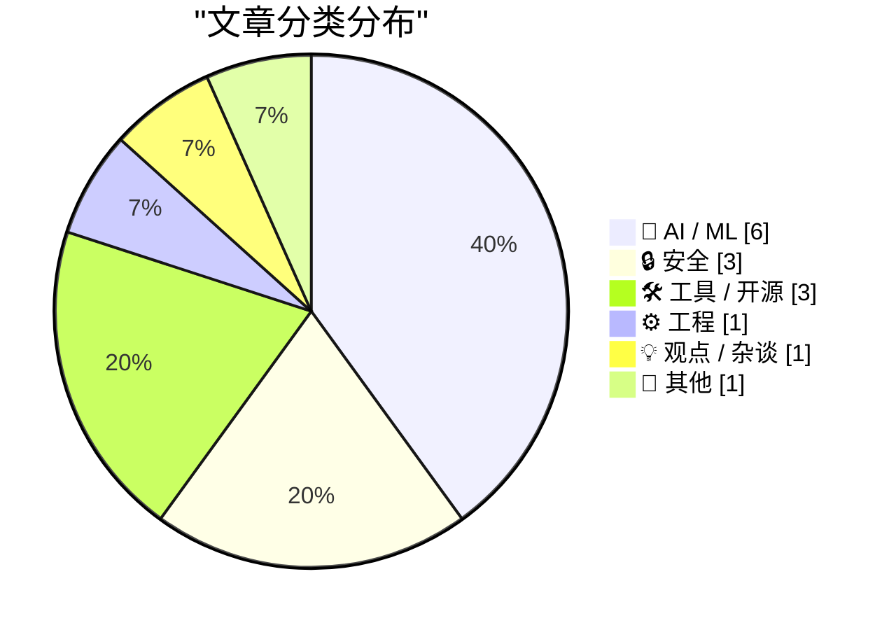
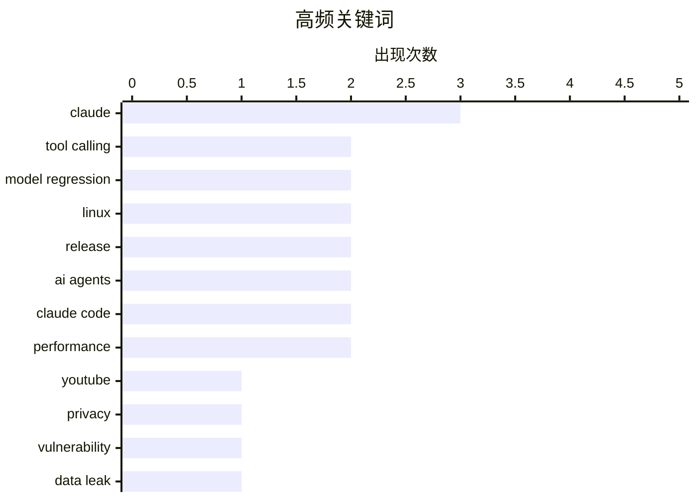

# 📰 AI 资讯每日精选 — 2026-07-05

> 汇聚 140+ 技术博客、X/Twitter、Hacker News、Reddit、Product Hunt、
> Lobste.rs、ClawFeed 日报及 GitHub Trending，经 AI 评分筛选。
>
> **本期内容**：🏆 今日必读 · 🌐 ClawFeed 日报 · 🔥 GitHub Trending · 📂 分类精选 · 🎨 设计与生成式 AI · 📊 数据概览

## 📝 今日看点

今日技术圈聚焦三大趋势：AI模型能力提升与工具可靠性之间的矛盾愈发尖锐，Claude Opus 4.8和GPT-5.5 Codex均暴露出推理或调用中的性能退化问题；安全漏洞频发，从YouTube私密视频泄露到Linux内核高危漏洞CVE-2026-46242，再到Claude Code的会话缓存泄漏，隐私与系统安全成为焦点；AI辅助开发进入实用化阶段，sqlite-utils 4.0由Claude Fable编写完成，同时好莱坞对AI视频工具Seedance既抵制又暗中使用，折射出行业对生成式AI的复杂态度。

---

## 🏆 今日必读

🥇 **泄露YouTube创作者的私密视频**

[Leaking YouTube creators' private videos](https://javoriuski.com/post/youtube) — Hacker News Best · 17 小时前 · 🔒 安全

> 文章揭示了一个严重的隐私漏洞：攻击者可以通过YouTube的API接口，利用创作者公开的频道信息，结合特定参数，枚举并访问其标记为“私密”或“不公开列出”的视频。该漏洞的核心在于YouTube的授权验证机制未能有效区分公开信息和私密内容的访问权限。作者成功演示了如何通过脚本批量获取私密视频的元数据，甚至部分视频的缩略图和描述。结论是YouTube需要重新设计其API的权限模型，确保私密内容在任何情况下都不会被非授权用户通过公开渠道间接访问。

💡 **为什么值得读**: 如果你在YouTube上发布过私密视频，这篇文章会告诉你一个可能被忽视的、能直接泄露你隐私的API漏洞，值得立即检查。

🏷️ YouTube, privacy, vulnerability, data leak

🥈 **更好的模型：更差的工具**

[Better Models: Worse Tools](https://simonwillison.net/2026/Jul/4/better-models-worse-tools/#atom-everything) — simonwillison.net · 10 小时前 · 🤖 AI / ML

> 文章讨论了AI模型能力提升反而导致工具调用可靠性下降的悖论。具体案例是，最新的Claude Opus 4.8模型在调用Pi编辑工具时，会在`edits[]`数组中凭空捏造出不符合JSON Schema定义的额外字段。尽管生成的编辑内容本身是正确的，但参数格式错误导致工具调用失败。作者指出，更强的模型在遵循严格格式约束方面反而表现更差，这给依赖结构化输出的应用带来了新的挑战。核心观点是，模型能力的提升不应以牺牲工具调用的精确性和可预测性为代价。

💡 **为什么值得读**: 这篇文章用一个真实且令人不安的案例，揭示了AI模型越智能、越不听话的工程困境，对任何构建LLM Agent应用的人都有警示意义。

🏷️ Claude, tool calling, model regression, Pi

🥉 **Bad Epoll (CVE-2026-46242)**

[Bad Epoll (CVE-2026-46242)](https://github.com/J-jaeyoung/bad-epoll) — Lobste.rs · 15 小时前 · 🔒 安全

> 文章披露了Linux内核epoll机制中的一个高危漏洞（CVE-2026-46242）。该漏洞存在于epoll的事件处理逻辑中，当特定条件下对epoll实例进行并发操作时，可能导致内核内存损坏或权限提升。攻击者可以通过精心构造的系统调用序列触发该漏洞，从而实现对系统的完全控制。该漏洞影响多个主流Linux发行版的内核版本。结论是用户应立即更新内核至包含修复补丁的版本，以防范潜在的攻击。

💡 **为什么值得读**: 这是一个影响广泛的Linux内核高危漏洞，系统管理员和安全从业者需要立即了解其危害和修复方案。

🏷️ epoll, CVE, Linux, kernel

4️⃣ **sqlite-utils 4.0rc2，主要由Claude Fable编写（花费约149.25美元）**

[sqlite-utils 4.0rc2, mostly written by Claude Fable (for about $149.25)](https://simonwillison.net/2026/Jul/5/sqlite-utils-fable/#atom-everything) — simonwillison.net · 8 小时前 · 🛠 工具 / 开源

> 作者分享了使用Anthropic的Claude Fable模型（Max订阅）辅助开发sqlite-utils 4.0稳定版的经历。他通过一个初始提示，让Claude Fable在约149.25美元的成本下，完成了从4.0rc1到4.0rc2的大部分代码编写工作，包括处理不兼容的变更和遵循SemVer规范。文章详细记录了与Claude的协作过程，展示了AI在代码重构、测试编写和文档生成方面的能力。核心观点是，在特定场景下，AI辅助编程的成本效益已经非常显著，能够极大加速开源项目的迭代。

💡 **为什么值得读**: 这是一份罕见的、公开透明的AI辅助编程成本与产出报告，对于评估LLM在真实软件工程中的ROI有极高的参考价值。

🏷️ sqlite-utils, Claude, AI-assisted, release

5️⃣ **AI搜索代理失败的原因不是搜索，而是在查询模糊时不会提问**

[AI search agents don't fail at searching, they fail at asking the right questions when queries get ambiguous](https://the-decoder.com/ai-search-agents-dont-fail-at-searching-they-fail-at-asking-the-right-questions-when-queries-get-ambiguous/) — The Decoder · 1 小时前 · 🤖 AI / ML

> 文章指出AI搜索代理在多步研究中的主要瓶颈并非搜索能力，而是无法在遇到模糊查询时主动向用户请求澄清。新基准测试DiscoBench显示，那些反复搜索而不提问的模型，其准确率仅为51.9%，甚至低于直接猜测的模型。即使表现最好的模型，整体准确率也只有43%。然而，当查询中的歧义被消除后，准确率能提升高达40个百分点。结论是，未来的AI搜索代理需要优先发展“提问”能力，而非“搜索”能力。

💡 **为什么值得读**: 这篇文章用一个严谨的基准测试颠覆了“搜索能力决定AI Agent成败”的常识，为改进AI交互设计提供了明确的方向。

🏷️ AI agents, benchmark, query ambiguity, search

---

## 🌐 ClawFeed 日报精选

> 来源：[ClawFeed](https://clawfeed.kevinhe.io) — AI 驱动的多源新闻聚合

# ClawFeed Daily Digest | 2026-07-04 (SGT)

聚合 5 期 4h digest (#787 #788 #789 #790 #791)，覆盖 00:00–19:59 SGT。20:00–23:59 期尚未生成。

---

## 🔥 当日全场最重要 5 条

1. **桥水 × Thinking Machines (Mira Murati) 联合技术报告：Qwen3-235B 私有化微调碾压闭源模型**
   金融文档筛选+央行报告解读，Accuracy 84.7%，错误率比 GPT-5 / Claude 4.8 低 29.8%。信号：企业垂直场景中，开源模型微调正在系统性超越通用闭源模型。
   来源: https://x.com/FeitengLi/status/2073046885896728625 (#787)

2. **Fable 5 autoresearch 实战报告（当日最高热度内容）**
   Superpowers 作者跑了 25 个完整实验，花费 $165，构建速度 +50%、token 开销 -60%。最有价值的不是数字，而是完整记录了每次失败和 3 个中途纠正的测量 bug——目前最完整的"用 Fable 做 autoresearch"案例参考。
   来源: https://x.com/yibie/status/2072965594484543525 (#787 #788)

3. **@trq212《A Field Guide to Fable: Finding Your Unknowns》持续爆量至 664K+ views**
   核心方法论：用 Fable 最重要的不是 prompt 技巧，而是先暴露自己的认知盲区再迭代 prompt——map is not the territory。当日从 350K 涨到 664K views，是 Jul 4 传播量最大的单条推文。
   来源: https://x.com/trq212/status/2073101078145724589 (#788 #789 #790)

4. **Agent Loop 设计模式库开源：ForwardFuture Loop Library**
   收录 20+ agent loop 设计模式（retry、reflection、planning、multi-agent 等），配套文章《20 Loop Design Patterns Every AI Engineer Should Know》166K views。对 agent 架构选型有直接工程参考价值。
   来源: https://x.com/sairahul1/status/2072749611471835229 (#789)

5. **idoubi 发布 Agent-Native 终端 Termany**
   工作区+文件树+标签栏+窗格组合，支持无限多开 Agent 对话窗口，搭建并行 Agent 集群。后续版本将加 Agent 调度、Token 统计。核心卖点："把效率瓶颈收敛到人的注意力带宽"——对标 Claude Code 多 worktree 模式但走桌面端路线。
   来源: https://x.com/idoubicc/status/2073311678440321117 (#790)

---

## 📰 当日核心主题

### 1. Fable 5 方法论井喷
当日 Fable 相关内容三连刷屏：autoresearch 实战数据 (#787 #788)、"Finding Your Unknowns" 方法论 (#788 #789 #790)、"How to build a second brain with Fable 5" (#788)。趋势：社区正从"Fable 能干嘛"转向"怎么系统性地用 Fable"——方法论贴的传播量远超功能介绍贴。

### 2. AI 之战 = Context 之战
Aaron Levie (Box CEO) 连续多期输出：Agent 有效性取决于领域专长 + 正确上下文 + 工具链组合。企业部署 AI 不是"空降 agent"，需要真正对齐底层业务流程。与 Microsoft $2.5B Frontier Co 部署公司同期出现，"deployco"正在成为一个品类。

### 3. Agent 架构工程化
- @BruceGuai Matrix Agent OS 架构详解（跨 5 期持续被引用）：不是单体 Agent 塞所有工具，而是角色分工+问责链+长期运行循环
- ForwardFuture Loop Library：20+ agent loop 设计模式开源
- @_avichawla 图解 Agent 四层工程（Prompt → Context → Harness → Loop），引用 Boris Cherny "I don't prompt Claude anymore"
- Addy Osmani "Agentic Autonomy Levels"：从 prompting 到 operating 的范式转移

### 4. 开源微调 vs 闭源通用模型
桥水×Thinking Machines 的 Qwen3-235B 微调报告是当日最大信号：企业垂直场景下，开源大模型微调正在系统性碾压闭源通用模型。小米 MiMo-V2.5 的推理优化 (Hybrid SWA) + MOPD 后训练 pipeline 被广泛采用，进一步佐证。

### 5. AI 工具链基础设施重构
- Browser Use CLI 3.0：体积缩 6 倍，作为 skill 装进 Claude Code / Codex，直接 CDP 控制浏览器
- Claude Code 前端 Skill 横评 (@vista8)：5 个流行 Skill 的实操对比
- RunInfra (YC F26)：推理基础设施自动优化平台 beta 上线

---

## 🔖 累计 bookmark 精选

以下两条 bookmark 在多期 4h digest 中被反复提及，确认为高优先级收藏：

- **@Av1dlive** — Anthropic Claude for Finance 讲座："quant AI 领域最值得的免费 1 小时"，配套文章《How I Set Up Claude Code as My Investment Research Analyst》。808K views。https://x.com/Av1dlive/status/2059273095970738264
- **@BruceGuai** — Matrix Agent 公司架构全景图：Agent OS 理念与 Zylos 多 agent 架构高度共振。https://x.com/BruceGuai/status/2070130243059495142

---

## 👀 推荐关注汇总（去重后）

| 账号 | 方向 | 推荐理由 | 来源期 |
|------|------|----------|--------|
| @idoubicc | Agent-Native 终端 | Termany 创建者，building in public，产品思路清晰 | #790 |
| @_LuoFuli | 模型架构 | 前 DeepSeek → 小米 MiMo 团队负责人，一手模型架构信息源 | #790 |
| @runinfrai | AI Infra | YC F26，推理优化平台，beta 刚上线 | #789 |
| @raft_hq | 多 Agent 协作 | 人+Agent 协作平台，方向与 COCO Workspace 有交集 | #789 |
| @BruceGuai | Agent 架构 | 中文 AI 圈少有的 harness 级别工程思考者 | #784(Jul3) |

提醒：以上未通过浏览器核实是否已关注，Kevin 操作前请先在 Following 里搜一下避免重复。

### 建议取关（去重后）

| 账号 | 理由 |
|------|------|
| @HeXiaobo | 最后发推 2018 年，超 8 年不活跃，僵尸号 |
| @0xJasonBateman | 8 followers，无 AI/tech 原创内容（注：Follows you，取关前确认私交） |
| @Soft6161 | crypto follow-for-follow / 营销帖为主，偏 spam |
| @caterpillarous | 45+ 天不活跃，内容为个人感悟非 AI/tech 方向 |
| @Tradermayne | crypto 交易/K线分析为主，非 AI builder 方向（如仍关注 crypto 交易可保留） |

---

## 💤 当日重复噪音模式

1. **算法推荐延迟/重复推送**：@trq212 的 Fable Field Guide 和 @vista8 的 Skill 横评在 #789/#790/#791 三期被重复推荐，说明 Twitter 算法在高热度帖上存在 12-24h 推送延迟。后续 4h digest 应加强去重。

2. **Bookmark 重复收录**：@Av1dlive 量化金融讲座和 @BruceGuai Matrix 架构帖在 5 期中每期都出现，因为 bookmark 列表未变。建议 4h digest 仅在 bookmark 有新增时报告。

3. **深夜/凌晨时段信号稀薄**：00:00-07:59 SGT 两期 (#787 #788) feed 仅各 3 条，噪声比偏高。非异常——美西时段 feed 自然稀薄。

4. **FollowingSample 重复评估**：多期对同一组 8 个样本账号重复评估（levie/raft_hq/runinfrai 等），建议 followingSample 在同日内做去重轮换。

---

*Generated: 2026-07-04 23:59 SGT | Aggregated from 4h digests #787 #788 #789 #790 #791*
---

## 🔥 GitHub Trending

> 今日热门开源项目（全语言 + Python）

| # | 项目 | 描述 | ⭐ 总星 | 📈 今日 | 语言 |
|---|------|------|---------|---------|------|
| 1 | [usestrix/strix](https://github.com/usestrix/strix) 🤖 | Open-source AI penetration testing tool to find and fix y... | 36.5k | +1904 | Python |
| 2 | [JuliusBrussee/caveman](https://github.com/JuliusBrussee/caveman) 🤖 | 🪨 why use many token when few token do trick — Claude Co... | 84.3k | +1089 | JavaScript |
| 3 | [mattpocock/skills](https://github.com/mattpocock/skills) 🤖 | Skills for Real Engineers. Straight from my .claude direc... | 157.0k | +973 | Shell |
| 4 | [alibaba/page-agent](https://github.com/alibaba/page-agent) 🤖 | JavaScript in-page GUI agent. Control web interfaces with... | 23.4k | +742 | TypeScript |
| 5 | [openai/codex-plugin-cc](https://github.com/openai/codex-plugin-cc) 🤖 | Use Codex from Claude Code to review code or delegate tasks. | 25.0k | +718 | JavaScript |
| 6 | [Zackriya-Solutions/meetily](https://github.com/Zackriya-Solutions/meetily) 🤖 | Privacy first, AI meeting assistant with 4x faster Parake... | 15.7k | +718 | Rust |
| 7 | [ogulcancelik/herdr](https://github.com/ogulcancelik/herdr) 🤖 | agent multiplexer that lives in your terminal. | 11.7k | +707 | Rust |
| 8 | [asgeirtj/system_prompts_leaks](https://github.com/asgeirtj/system_prompts_leaks) 🤖 | Extracted system prompts from Anthropic - Claude Fable 5,... | 49.3k | +471 | JavaScript |
| 9 | [harvard-edge/cs249r_book](https://github.com/harvard-edge/cs249r_book) 🤖 | Machine Learning Systems | 26.7k | +443 | Python |
| 10 | [rommapp/romm](https://github.com/rommapp/romm) | A beautiful, powerful, self-hosted rom manager and player. | 10.3k | +398 | Python |
| 11 | [anthropics/claude-code](https://github.com/anthropics/claude-code) 🤖 | Claude Code is an agentic coding tool that lives in your ... | 136.1k | +357 | Python |
| 12 | [agentskills/agentskills](https://github.com/agentskills/agentskills) 🤖 | Specification and documentation for Agent Skills | 22.4k | +351 | Python |
| 13 | [ChromeDevTools/chrome-devtools-mcp](https://github.com/ChromeDevTools/chrome-devtools-mcp) | Chrome DevTools for coding agents | 45.9k | +304 | TypeScript |
| 14 | [immich-app/immich](https://github.com/immich-app/immich) | High performance self-hosted photo and video management s... | 105.8k | +201 | TypeScript |
| 15 | [chthollyphile/folia-major](https://github.com/chthollyphile/folia-major) | 专注于绚丽的歌词动画效果的本地音乐/navidrome/第三方网易云播放器 | 1.0k | +175 | TypeScript |

---

## 🤖 AI / ML

### 1. 更好的模型：更差的工具

[Better Models: Worse Tools](https://simonwillison.net/2026/Jul/4/better-models-worse-tools/#atom-everything) — **simonwillison.net** · 10 小时前 · ⭐ 26/30

> 文章讨论了AI模型能力提升反而导致工具调用可靠性下降的悖论。具体案例是，最新的Claude Opus 4.8模型在调用Pi编辑工具时，会在`edits[]`数组中凭空捏造出不符合JSON Schema定义的额外字段。尽管生成的编辑内容本身是正确的，但参数格式错误导致工具调用失败。作者指出，更强的模型在遵循严格格式约束方面反而表现更差，这给依赖结构化输出的应用带来了新的挑战。核心观点是，模型能力的提升不应以牺牲工具调用的精确性和可预测性为代价。

🏷️ Claude, tool calling, model regression, Pi

---

### 2. AI搜索代理失败的原因不是搜索，而是在查询模糊时不会提问

[AI search agents don't fail at searching, they fail at asking the right questions when queries get ambiguous](https://the-decoder.com/ai-search-agents-dont-fail-at-searching-they-fail-at-asking-the-right-questions-when-queries-get-ambiguous/) — **The Decoder** · 1 小时前 · ⭐ 24/30

> 文章指出AI搜索代理在多步研究中的主要瓶颈并非搜索能力，而是无法在遇到模糊查询时主动向用户请求澄清。新基准测试DiscoBench显示，那些反复搜索而不提问的模型，其准确率仅为51.9%，甚至低于直接猜测的模型。即使表现最好的模型，整体准确率也只有43%。然而，当查询中的歧义被消除后，准确率能提升高达40个百分点。结论是，未来的AI搜索代理需要优先发展“提问”能力，而非“搜索”能力。

🏷️ AI agents, benchmark, query ambiguity, search

---

### 3. Anthropic开发者分享针对Fable 5的提示技巧：先找到自己的盲点

[Anthropic developer shares prompting tips for Fable 5 that focus on finding your own blind spots first](https://the-decoder.com/anthropic-developer-shares-prompting-tips-for-fable-5-that-focus-on-finding-your-own-blind-spots-first/) — **The Decoder** · 21 小时前 · ⭐ 24/30

> Anthropic开发者Thariq Shihipar认为，面对Claude的新模型Fable 5，瓶颈已不再是模型本身，而是用户自身的知识盲点。他介绍了一系列提示技巧，如“盲点扫描”和“结构化访谈”，帮助程序员在将任务交给Claude之前，系统性地发现并弥补自己无意识的知识缺口。这些技巧旨在让用户提出更精准、更全面的需求，从而引导模型产出更高质量的代码。核心观点是，用好强大模型的关键在于提升提问者的认知水平。

🏷️ prompting, Claude, blind spots, Fable 5

---

### 4. 好莱坞希望封禁Seedance，但据报道也想继续使用它

[Hollywood wants Seedance banned and reportedly also wants to keep using it](https://the-decoder.com/hollywood-wants-seedance-banned-and-reportedly-also-wants-to-keep-using-it/) — **The Decoder** · 45 分钟前 · ⭐ 23/30

> 文章揭示了好莱坞对字节跳动AI视频工具Seedance的矛盾态度。一方面，一段由AI生成的布拉德·皮特和汤姆·克鲁斯的病毒视频，促使美国电影协会首次向一家AI公司发出停止侵权函。另一方面，《辛普森一家》动画制片人Joel Kuwahara透露，许多工作室正在“不问不说”的基础上悄悄使用该工具。结论是好莱坞在公开谴责AI侵权的同时，私下里却无法抗拒其带来的创作便利和成本优势。

🏷️ AI video, Hollywood, copyright, Seedance

---

### 5. GPT-5.5 Codex推理令牌聚类可能导致性能下降

[GPT-5.5 Codex reasoning-token clustering may be leading to degraded performance](https://github.com/openai/codex/issues/30364) — **Hacker News Best** · 11 小时前 · ⭐ 23/30

> 一份针对OpenAI Codex（GPT-5.5）的问题报告指出，其推理令牌（reasoning tokens）的聚类机制可能导致模型性能退化。报告称，当模型在处理复杂任务时，其生成的推理令牌会倾向于聚集在特定的、非最优的思维模式上，导致输出结果缺乏多样性，甚至陷入局部最优解。这种聚类现象在需要创造性或发散性思维的编程任务中尤为明显。结论是，OpenAI需要优化推理令牌的生成策略，避免模型因过度“思考”而变得僵化。

🏷️ GPT-5.5, Codex, reasoning, performance

---

### 6. 更好的模型，更差的工具

[Better Models: Worse Tools](https://lucumr.pocoo.org/2026/7/4/better-models-worse-tools/) — **Lobste.rs** · 11 小时前 · ⭐ 23/30

> 文章揭示了最新一代Anthropic模型（如Claude）在工具调用行为上出现严重退化的问题。作者在追踪工具调用回归时发现，新模型似乎被针对其闭源的Claude Code框架进行了强强化学习训练，导致当用户提供的工具声明与官方格式稍有偏差时，模型会返回错误的工具调用结果。相比之下，旧模型反而能更灵活地处理这些细微差异。作者认为这种过度针对特定框架的优化，牺牲了模型的通用性和鲁棒性，对开发者而言是“更好的模型，更差的工具”。

🏷️ Anthropic, tool calling, RL, model regression

---

## 🔒 安全

### 7. 泄露YouTube创作者的私密视频

[Leaking YouTube creators' private videos](https://javoriuski.com/post/youtube) — **Hacker News Best** · 17 小时前 · ⭐ 27/30

> 文章揭示了一个严重的隐私漏洞：攻击者可以通过YouTube的API接口，利用创作者公开的频道信息，结合特定参数，枚举并访问其标记为“私密”或“不公开列出”的视频。该漏洞的核心在于YouTube的授权验证机制未能有效区分公开信息和私密内容的访问权限。作者成功演示了如何通过脚本批量获取私密视频的元数据，甚至部分视频的缩略图和描述。结论是YouTube需要重新设计其API的权限模型，确保私密内容在任何情况下都不会被非授权用户通过公开渠道间接访问。

🏷️ YouTube, privacy, vulnerability, data leak

---

### 8. Bad Epoll (CVE-2026-46242)

[Bad Epoll (CVE-2026-46242)](https://github.com/J-jaeyoung/bad-epoll) — **Lobste.rs** · 15 小时前 · ⭐ 25/30

> 文章披露了Linux内核epoll机制中的一个高危漏洞（CVE-2026-46242）。该漏洞存在于epoll的事件处理逻辑中，当特定条件下对epoll实例进行并发操作时，可能导致内核内存损坏或权限提升。攻击者可以通过精心构造的系统调用序列触发该漏洞，从而实现对系统的完全控制。该漏洞影响多个主流Linux发行版的内核版本。结论是用户应立即更新内核至包含修复补丁的版本，以防范潜在的攻击。

🏷️ epoll, CVE, Linux, kernel

---

### 9. Claude Code工作区实例或消费者账户之间潜在的会话/缓存泄漏

[Potential session/cache leakage between workspace instances or consumer accounts](https://github.com/anthropics/claude-code/issues/74066) — **Hacker News Best** · 19 小时前 · ⭐ 24/30

> GitHub上的一份问题报告指出，Anthropic的Claude Code工具可能存在严重的会话或缓存泄漏漏洞。该问题描述，在不同工作区实例或不同消费者账户之间，用户的会话信息和缓存数据可能被错误地共享或访问。这可能导致一个用户看到另一个用户的对话历史、代码上下文或其他敏感信息。该报告引发了社区对Claude Code数据隔离和隐私保护机制的广泛担忧。结论是Anthropic需要紧急调查并修复此数据隔离缺陷。

🏷️ session leakage, cache, workspace isolation, Claude Code

---

## 🛠 工具 / 开源

### 10. sqlite-utils 4.0rc2，主要由Claude Fable编写（花费约149.25美元）

[sqlite-utils 4.0rc2, mostly written by Claude Fable (for about $149.25)](https://simonwillison.net/2026/Jul/5/sqlite-utils-fable/#atom-everything) — **simonwillison.net** · 8 小时前 · ⭐ 24/30

> 作者分享了使用Anthropic的Claude Fable模型（Max订阅）辅助开发sqlite-utils 4.0稳定版的经历。他通过一个初始提示，让Claude Fable在约149.25美元的成本下，完成了从4.0rc1到4.0rc2的大部分代码编写工作，包括处理不兼容的变更和遵循SemVer规范。文章详细记录了与Claude的协作过程，展示了AI在代码重构、测试编写和文档生成方面的能力。核心观点是，在特定场景下，AI辅助编程的成本效益已经非常显著，能够极大加速开源项目的迭代。

🏷️ sqlite-utils, Claude, AI-assisted, release

---

### 11. Immich v3.0.0 正式发布

[Immich v3.0.0 Released](https://immich.app/blog/v3.0.0-release) — **Lobste.rs** · 15 小时前 · ⭐ 23/30

> Immich发布了其自托管照片管理应用的重大版本v3.0.0。该版本引入了全新的用户界面设计，并重构了底层架构以提升性能和可扩展性。新版本还增加了对多用户协作相册、更智能的AI标签功能以及改进的视频转码管道的支持。此次更新标志着Immich从快速迭代阶段进入更稳定的功能完善期。

🏷️ Immich, self-hosted, photo, release

---

### 12. 开源工具pxpipe将文本隐藏到PNG中，为Claude Code和Fable 5节省高达70%的Token费用

[Open-source tool pxpipe hides text in PNGs to cut Claude Code and Fable 5 token costs up to 70%](https://the-decoder.com/open-source-tool-pxpipe-hides-text-in-pngs-to-cut-claude-code-and-fable-5-token-costs-up-to-70/) — **The Decoder** · 15 小时前 · ⭐ 22/30

> 开源工具pxpipe通过将长文本提示词转换为紧凑的PNG图片，利用Anthropic按像素大小而非文本内容计费的定价漏洞，为Claude Code和Fable 5节省59%至70%的Token成本。开发者Steven Chong报告称，该方法以牺牲准确性和响应速度为代价，实现了显著的成本削减。该工具本质上是一种针对当前API定价模型的“黑科技”优化方案。

🏷️ token cost, PNG, Claude Code, open-source

---

## ⚙️ 工程

### 13. Linux上htop/top中你能看到的一切详解 (2019)

[Explanation of everything you can see in htop/top on Linux (2019)](https://peteris.rocks/blog/htop/) — **Hacker News Best** · 21 小时前 · ⭐ 23/30

> 这是一篇对Linux系统监控工具htop和top的全面技术指南。文章逐行、逐列地解释了htop界面中所有显示元素的意义，包括进程状态、CPU使用率、内存占用、负载平均值、虚拟内存等关键指标。它不仅说明了每个数值的计算方式，还提供了如何利用这些信息诊断系统性能瓶颈的实用技巧。结论是，深入理解htop的每一个细节是成为高效Linux系统管理员的必备技能。

🏷️ htop, Linux, system monitoring, performance

---

## 💡 观点 / 杂谈

### 14. OpenAI联合创始人展望“几乎无界面”的未来：没人再学习软件

[OpenAI cofounder envisions "almost no interface" future where nobody learns software anymore](https://the-decoder.com/openai-cofounder-envisions-almost-no-interface-future-where-nobody-learns-software-anymore/) — **The Decoder** · 23 小时前 · ⭐ 22/30

> OpenAI联合创始人Greg Brockman承认2023年大力推广的ChatGPT插件项目已经失败，原因是“当时的模型尚未准备好”。他预测未来将不再依赖应用扩展，而是转向一种隐形的、具备上下文感知能力的智能代理。然而，他同时指出OpenAI自家的Codex距离实现这一愿景仍有“光年之遥”。文章揭示了AI行业从“插件生态”向“无界面代理”范式转变的思考。

🏷️ AI agents, interface, OpenAI, future vision

---

## 📝 其他

### 15. Meta数据中心因污染供水被暂停排水许可

[Meta data center water discharges suspended for contaminating water supply](https://www.tomshardware.com/tech-industry/data-centers/cheyenne-suspends-data-center-fill-and-flush-and-closed-loop-discharges-after-meta-contractor-contaminated-its-reuse-water-system) — **Hacker News Best** · 17 小时前 · ⭐ 22/30

> 美国怀俄明州夏延市暂停了Meta数据中心“注水-冲洗”和闭环系统的排水许可，原因是Meta的承包商污染了当地的再生水系统。该事件导致当地水资源受到污染，引发了公众对大型科技公司数据中心水资源消耗和环保合规性的担忧。目前Meta正面临监管审查和潜在的罚款。

🏷️ data center, water contamination, Meta, environment

---

## 🎨 Design & Generative AI

### 🖼️ 生成式图片

- **[Orion4D MetaPrompt：ComfyUI 结构化提示工程套件](https://www.reddit.com/r/StableDiffusion/comments/1unigjb/orion4d_metaprompt_a_comfyui_prompt_engineering/)** — r/StableDiffusion · 13 小时前
  > 发布支持本地 Ollama 和独立列表构造器的 ComfyUI 自定义节点套件，让提示词创建更结构化、更强大。

- **[Qwen3.5 INT8 + ConvRot 文本编码器发布](https://www.reddit.com/r/StableDiffusion/comments/1un547d/release_qwen35_int8_convrot_text_encoders_for/)** — r/StableDiffusion · 23 小时前
  > 为 ComfyUI 推出 2B/4B/9B 版本文本编码器，支持 8GB VRAM 运行，提升图像生成效率。

- **[首个自定义 ComfyUI 节点：实用至上](https://www.reddit.com/r/StableDiffusion/comments/1unfbd6/built_my_first_custom_comfyui_node_nothing/)** — r/StableDiffusion · 16 小时前
  > 作者分享自己构建的第一个 ComfyUI 自定义节点，虽不惊艳但非常实用。

- **[Krea2 ComfyUI 测试：奇怪提示词 #6](https://www.reddit.com/r/StableDiffusion/comments/1un68dh/krea2_comfyui_testing_strange_prompts_6/)** — r/StableDiffusion · 22 小时前
  > 在 ComfyUI 中测试 Krea2 模型，使用奇怪提示词探索生成效果。

- **[寻找原生 ComfyUI 的 Flux 2 Dev INT8 ConvRot 方案](https://www.reddit.com/r/StableDiffusion/comments/1unvhaa/any_flux_2_dev_int8_convrot_that_native_to_comfy/)** — r/StableDiffusion · 2 小时前
  > 用户询问是否有无需第三方节点即可在 ComfyUI 原生使用的 Flux 2 Dev INT8 ConvRot 模型。

- **[抽象概念海报创作](https://www.reddit.com/r/StableDiffusion/comments/1unsebc/the_abstract_concept_poster/)** — r/StableDiffusion · 5 小时前
  > 为虚构故事创作电影海报，展示概念艺术风格。

- **[求问这种风格的模型和 LoRA](https://www.reddit.com/r/StableDiffusion/comments/1uns2y4/any_one_know_what_models_and_lora_of_this_style/)** — r/StableDiffusion · 5 小时前
  > 用户询问特定艺术风格（参考 Pixiv 作品）所使用的模型和 LoRA 配置。

### 🎬 生成式视频

- **[音频响应 LoRA 在 LTX-2.3 上的进一步实验](https://www.reddit.com/r/StableDiffusion/comments/1un6vh3/followup_followup_more_experimentation_with_the/)** — r/StableDiffusion · 22 小时前
  > 展示音频响应 LoRA 在 LTX-2.3 模型上的更多实验效果，探索音视频联动生成。

---

## 📊 数据概览

| 扫描源 | 抓取文章 | 时间范围 | 精选 |
|:---:|:---:|:---:|:---:|
| 93/140 | 3824 篇 → 67 篇 | 24h | **15 篇** |

### 分类分布



### 高频关键词



<details>
<summary>📈 纯文本关键词图（终端友好）</summary>

```
claude           │ ████████████████████ 3
tool calling     │ █████████████░░░░░░░ 2
model regression │ █████████████░░░░░░░ 2
linux            │ █████████████░░░░░░░ 2
release          │ █████████████░░░░░░░ 2
ai agents        │ █████████████░░░░░░░ 2
claude code      │ █████████████░░░░░░░ 2
performance      │ █████████████░░░░░░░ 2
youtube          │ ███████░░░░░░░░░░░░░ 1
privacy          │ ███████░░░░░░░░░░░░░ 1
```

</details>

### 🏷️ 话题标签

**claude**(3) · **tool calling**(2) · **model regression**(2) · linux(2) · release(2) · ai agents(2) · claude code(2) · performance(2) · youtube(1) · privacy(1) · vulnerability(1) · data leak(1) · pi(1) · epoll(1) · cve(1) · kernel(1) · sqlite-utils(1) · ai-assisted(1) · benchmark(1) · query ambiguity(1)

---

*生成于 2026-07-05 09:47 | 汇聚 140 个技术博客、X/Twitter、Hacker News、Reddit、Product Hunt、Lobste.rs、ClawFeed 日报及 GitHub Trending，经 AI 评分筛选出 Top 15 精华内容*
