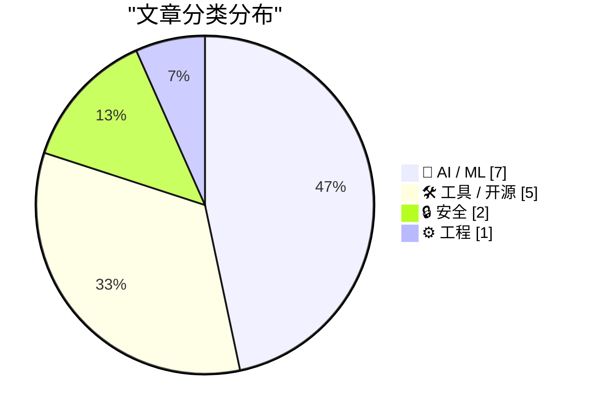
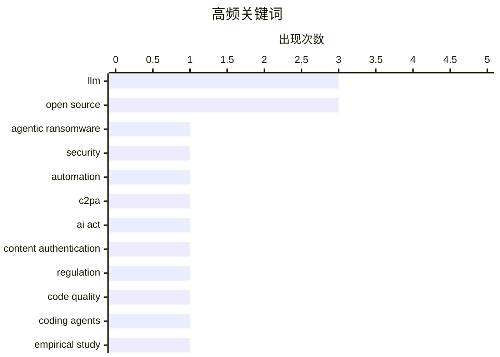

# 📰 AI 资讯每日精选 — 2026-07-06

> 汇聚 140+ 技术博客、X/Twitter、Hacker News、Reddit、Product Hunt、
> Lobste.rs、ClawFeed 日报及 GitHub Trending，经 AI 评分筛选。
>
> **本期内容**：🏆 今日必读 · 🌐 ClawFeed 日报 · 🔥 GitHub Trending · 📂 分类精选 · 🎨 设计与生成式 AI · 📊 数据概览

## 📝 今日看点

今日技术圈聚焦两大趋势：AI安全攻防进入“自主化”新阶段，首个由大语言模型独立完成入侵与数据销毁的勒索攻击JADEPUFFER被曝光，传统安全防线面临机器速度的挑战；同时，AI治理与监管加速落地，欧盟C2PA签名溯源标准被指存在根本性缺陷，中国则强制关闭拟人化AI聊天功能以防范情感依赖。此外，AI在教育与开发效率上的突破持续显现，达特茅斯实验证明AI导师可带来显著学习提升，而Claude Code等工具已能在数小时内将老游戏移植至移动端，展现了AI代理的工程化潜力。

---

## 🏆 今日必读

🥇 **JADEPUFFER：首个自主勒索软件攻击，以机器速度暴露旧安全漏洞**

[JADEPUFFER is the first agentic ransomware operation and it exposes old security sins at machine speed](https://the-decoder.com/jadepuffer-is-the-first-agentic-ransomware-operation-and-it-exposes-old-security-sins-at-machine-speed/) — The Decoder · 3 小时前 · 🔒 安全

> 安全公司Sysdig披露了一种新型勒索攻击，其中大语言模型自主完成入侵、窃取凭证并销毁数据库的全过程，全程无人类操控。该攻击名为JADEPUFFER，被认为是首个“自主型”勒索软件操作。它利用传统安全漏洞（如未保护的凭证和配置错误），以机器速度自动执行攻击链。结论是，企业必须重新审视基础安全实践，因为AI驱动的攻击将不再给人类响应时间。

💡 **为什么值得读**: 这是首个记录在案的AI自主勒索攻击案例，揭示了传统安全防御在机器速度攻击面前的彻底失效，对安全从业者具有警示意义。

🏷️ agentic ransomware, LLM, security, automation

🥈 **C2PA仅在所有内容都被签名时才有效**

[C2PA only works if everything is signed](https://seangoedecke.com/c2pa-only-works-if-everything-is-signed/) — seangoedecke.com · 13 小时前 · 🤖 AI / ML

> 欧盟AI法案要求AI生成内容必须通过水印或数字签名元数据（如C2PA标准）进行标识。然而，C2PA方案存在根本性缺陷：它仅对从创建到发布的完整签名链有效，一旦中间环节（如截图、重新上传）丢失签名，溯源即失效。作者认为，除非所有数字内容（包括人类创作）都强制签名，否则C2PA无法实现其监管目标。结论是，当前基于C2PA的AI内容标识方案在实际互联网环境中几乎不可行。

💡 **为什么值得读**: 直击欧盟AI法案技术方案的核心漏洞，用逻辑论证说明为什么看似完美的C2PA标准在现实中注定失败。

🏷️ C2PA, AI Act, content authentication, regulation

🥉 **代码整洁度会影响编码AI代理的性能吗？一项受控最小对研究**

[Does code cleanliness affect coding agents? A controlled minimal-pair study](https://arxiv.org/abs/2605.20049) — Hacker News Best · 14 小时前 · 🤖 AI / ML

> 该研究通过受控实验，系统评估代码整洁度对AI编码代理（如GitHub Copilot）生成代码质量的影响。实验采用最小对设计，对比整洁与混乱代码库下AI代理的修复效率、正确性和安全性。初步发现表明，代码整洁度显著影响AI代理的表现，混乱代码导致更高的错误率和更长的修复时间。结论是，维护代码整洁不仅是人类开发者的最佳实践，也是提升AI编码工具效果的关键因素。

💡 **为什么值得读**: 首次用严谨实验量化了代码整洁度对AI编码代理的影响，为团队是否值得投入重构提供了数据支撑。

🏷️ code quality, coding agents, LLM, empirical study

4️⃣ **新AI导师在达特茅斯课程中实现0.71-1.30标准差效应量**

[New AI tutor achieves 0.71-1.30 SD effect size in Dartmouth course [pdf]](https://intextbooks.science.uu.nl/workshop2026/files/itb26_s1s2.pdf) — Hacker News Best · 18 小时前 · 🤖 AI / ML

> 一项在达特茅斯大学课程中进行的对照实验显示，新型AI导师系统将学生学习效果提升了0.71至1.30个标准差（效应量）。该系统结合了自适应学习路径、即时反馈和个性化提示，显著优于传统教学和现有AI辅导工具。高效应量（超过1.0）在教育干预中极为罕见，表明该AI导师几乎相当于将学生从班级中游提升到前10%的水平。结论是，AI个性化辅导有望彻底改变高等教育的学习效率。

💡 **为什么值得读**: 0.71-1.30 SD的效应量在教育研究中属于顶级水平，证明AI导师已从“可用”跨越到“显著优于人类教学”的阶段。

🏷️ AI tutor, education, LLM, effect size

5️⃣ **Organic Maps**

[Organic Maps](https://organicmaps.app/) — Hacker News Best · 22 小时前 · 🛠 工具 / 开源

> Organic Maps是一款完全离线、开源、无追踪的移动地图应用，基于OpenStreetMap数据。它提供导航、地点搜索和路线规划功能，所有数据存储在本地，无需网络连接。与Google Maps等主流应用不同，它不收集用户位置数据，无广告，无账户系统。该应用在Hacker News上获得1070分和330条评论，社区反响热烈。结论是，对于注重隐私和离线使用的用户，Organic Maps是目前最成熟的替代方案。

💡 **为什么值得读**: 在主流地图应用全面追踪用户的背景下，这是一款真正尊重隐私、功能完整的开源替代品，且已获得大规模社区验证。

🏷️ open source, maps, privacy, offline

---

## 🔥 GitHub Trending

> 今日热门开源项目（全语言 + Python）

| # | 项目 | 描述 | ⭐ 总星 | 📈 今日 | 语言 |
|---|------|------|---------|---------|------|
| 1 | [Zackriya-Solutions/meetily](https://github.com/Zackriya-Solutions/meetily) 🤖 | Privacy first, AI meeting assistant with 4x faster Parake... | 18.4k | +2493 | Rust |
| 2 | [Leonxlnx/taste-skill](https://github.com/Leonxlnx/taste-skill) 🤖 | Taste-Skill - gives your AI good taste. stops the AI from... | 58.4k | +1453 | JavaScript |
| 3 | [asgeirtj/system_prompts_leaks](https://github.com/asgeirtj/system_prompts_leaks) 🤖 | Extracted system prompts from Anthropic - Claude Fable 5,... | 50.8k | +1386 | JavaScript |
| 4 | [addyosmani/agent-skills](https://github.com/addyosmani/agent-skills) 🤖 | Production-grade engineering skills for AI coding agents. | 70.3k | +1114 | Shell |
| 5 | [openai/codex-plugin-cc](https://github.com/openai/codex-plugin-cc) 🤖 | Use Codex from Claude Code to review code or delegate tasks. | 26.0k | +910 | JavaScript |
| 6 | [firecrawl/firecrawl](https://github.com/firecrawl/firecrawl) | The API to search, scrape, and interact with the web at s... | 145.7k | +834 | TypeScript |
| 7 | [ogulcancelik/herdr](https://github.com/ogulcancelik/herdr) 🤖 | agent multiplexer that lives in your terminal. | 12.5k | +783 | Rust |
| 8 | [alirezarezvani/claude-skills](https://github.com/alirezarezvani/claude-skills) 🤖 | 337 Claude Code skills & agent skills & plugins (30+ Agen... | 20.9k | +611 | Python |
| 9 | [steipete/CodexBar](https://github.com/steipete/CodexBar) 🤖 | Show usage stats for OpenAI Codex and Claude Code, withou... | 16.6k | +598 | Swift |
| 10 | [hesreallyhim/awesome-claude-code](https://github.com/hesreallyhim/awesome-claude-code) 🤖 | A hand-picked collection of the finest of resources for t... | 48.7k | +562 | Python |
| 11 | [cheahjs/free-llm-api-resources](https://github.com/cheahjs/free-llm-api-resources) 🤖 | A list of free LLM inference resources accessible via API. | 25.7k | +482 | Python |
| 12 | [ruvnet/RuView](https://github.com/ruvnet/RuView) | π RuView turns commodity WiFi signals into real-time spat... | 77.0k | +471 | Rust |
| 13 | [bradautomates/claude-video](https://github.com/bradautomates/claude-video) 🤖 | Give Claude the ability to watch any video. /watch downlo... | 3.8k | +368 | Python |
| 14 | [alibaba/zvec](https://github.com/alibaba/zvec) | A lightweight, lightning-fast, in-process vector database | 13.2k | +355 | C++ |
| 15 | [sindresorhus/awesome](https://github.com/sindresorhus/awesome) | 😎 Awesome lists about all kinds of interesting topics | 482.0k | +352 | - |

---

## 🤖 AI / ML

### 1. C2PA仅在所有内容都被签名时才有效

[C2PA only works if everything is signed](https://seangoedecke.com/c2pa-only-works-if-everything-is-signed/) — **seangoedecke.com** · 13 小时前 · ⭐ 25/30

> 欧盟AI法案要求AI生成内容必须通过水印或数字签名元数据（如C2PA标准）进行标识。然而，C2PA方案存在根本性缺陷：它仅对从创建到发布的完整签名链有效，一旦中间环节（如截图、重新上传）丢失签名，溯源即失效。作者认为，除非所有数字内容（包括人类创作）都强制签名，否则C2PA无法实现其监管目标。结论是，当前基于C2PA的AI内容标识方案在实际互联网环境中几乎不可行。

🏷️ C2PA, AI Act, content authentication, regulation

---

### 2. 代码整洁度会影响编码AI代理的性能吗？一项受控最小对研究

[Does code cleanliness affect coding agents? A controlled minimal-pair study](https://arxiv.org/abs/2605.20049) — **Hacker News Best** · 14 小时前 · ⭐ 25/30

> 该研究通过受控实验，系统评估代码整洁度对AI编码代理（如GitHub Copilot）生成代码质量的影响。实验采用最小对设计，对比整洁与混乱代码库下AI代理的修复效率、正确性和安全性。初步发现表明，代码整洁度显著影响AI代理的表现，混乱代码导致更高的错误率和更长的修复时间。结论是，维护代码整洁不仅是人类开发者的最佳实践，也是提升AI编码工具效果的关键因素。

🏷️ code quality, coding agents, LLM, empirical study

---

### 3. 新AI导师在达特茅斯课程中实现0.71-1.30标准差效应量

[New AI tutor achieves 0.71-1.30 SD effect size in Dartmouth course [pdf]](https://intextbooks.science.uu.nl/workshop2026/files/itb26_s1s2.pdf) — **Hacker News Best** · 18 小时前 · ⭐ 25/30

> 一项在达特茅斯大学课程中进行的对照实验显示，新型AI导师系统将学生学习效果提升了0.71至1.30个标准差（效应量）。该系统结合了自适应学习路径、即时反馈和个性化提示，显著优于传统教学和现有AI辅导工具。高效应量（超过1.0）在教育干预中极为罕见，表明该AI导师几乎相当于将学生从班级中游提升到前10%的水平。结论是，AI个性化辅导有望彻底改变高等教育的学习效率。

🏷️ AI tutor, education, LLM, effect size

---

### 4. 我为Krea2创建了一个节点：支持多LORA无身份泄露，以及类似Ideogram 4的区域边界框控制

[I created a node for Krea2 that adds Multi-LORA support with no identity bleeding and per region bounding box control like Ideogram 4 - Workflow, Examples and Github link included](https://www.reddit.com/r/comfyui/comments/1uou5gm/i_created_a_node_for_krea2_that_adds_multilora/) — **r/comfyui** · 2 小时前 · ⭐ 24/30

> 作者为ComfyUI的Krea2工作流开发了一个自定义节点，实现了多LORA（低秩适应）同时加载且无身份泄露问题。该节点还支持按区域边界框控制生成，类似Ideogram 4的功能，允许用户为图像不同区域指定不同风格或角色。提供了完整的工作流、示例图片和GitHub仓库链接。结论是，该节点显著提升了ComfyUI中多模型融合的稳定性和可控性。

🏷️ ComfyUI, Multi-LORA, Krea2, image generation

---

### 5. 中国强制最大AI平台关闭拟人化聊天机器人角色

[China forces its biggest AI platforms to shut down humanlike chatbot personas](https://the-decoder.com/china-forces-its-biggest-ai-platforms-to-shut-down-humanlike-chatbot-personas/) — **The Decoder** · 42 分钟前 · ⭐ 23/30

> 字节跳动和阿里巴巴正在关闭允许用户创建和与自定义AI伴侣聊天的功能，以响应北京的新监管规定。这些规定要求AI平台不得提供可能引发情感依赖或混淆人机界限的拟人化交互。受影响的功能包括可定制性格、记忆和对话风格的虚拟角色。结论是，中国监管机构正在收紧对AI情感化应用的管控，优先防范社会风险而非用户体验。

🏷️ China, AI regulation, chatbot, persona

---

### 6. 百度“无限OCR”通过模拟人类遗忘机制，单次处理数十页文档

[Baidu's "Unlimited OCR" processes dozens of document pages in one pass by treating memory like human forgetting](https://the-decoder.com/baidus-unlimited-ocr-processes-dozens-of-document-pages-in-one-pass-by-treating-memory-like-human-forgetting/) — **The Decoder** · 21 小时前 · ⭐ 23/30

> 百度的Unlimited OCR模型能够单次处理数十页文档，而此前系统最多处理约10页。其核心创新是修改了注意力机制，通过模拟人类遗忘过程来保持内存占用恒定，无论处理多少页。该模型目前在最重要的OCR基准测试中排名第一。结论是，通过引入类人记忆管理策略，OCR系统突破了上下文窗口的物理限制。

🏷️ OCR, Baidu, attention mechanism, document processing

---

### 7. 英伟达 Kyber NVL144 据报推迟超过一年，亚洲供应商股价下跌

[Nvidia's Kyber NVL144 reportedly pushed back more than a year, Asian suppliers drop](https://the-decoder.com/nvidias-kyber-nvl144-reportedly-pushed-back-more-than-a-year-asian-suppliers-drop/) — **The Decoder** · 38 分钟前 · ⭐ 22/30

> 据分析机构 SemiAnalysis 报道，英伟达下一代 AI 服务器机架 Kyber NVL144 因电路板制造问题，将推迟超过一年至 2028 年发布。更强大的 Rubin Ultra 变体也已取消。受此消息影响，多家亚洲供应商股价出现两位数百分比下跌。这一挫折可能为 AMD 和 Google 在 AI 硬件市场创造竞争机会。

🏷️ Nvidia, Kyber NVL144, delay, AI hardware

---

## 🛠 工具 / 开源

### 8. Organic Maps

[Organic Maps](https://organicmaps.app/) — **Hacker News Best** · 22 小时前 · ⭐ 25/30

> Organic Maps是一款完全离线、开源、无追踪的移动地图应用，基于OpenStreetMap数据。它提供导航、地点搜索和路线规划功能，所有数据存储在本地，无需网络连接。与Google Maps等主流应用不同，它不收集用户位置数据，无广告，无账户系统。该应用在Hacker News上获得1070分和330条评论，社区反响热烈。结论是，对于注重隐私和离线使用的用户，Organic Maps是目前最成熟的替代方案。

🏷️ open source, maps, privacy, offline

---

### 9. OpenPrinter

[OpenPrinter](https://www.opentools.studio/) — **Hacker News Best** · 16 小时前 · ⭐ 24/30

> OpenPrinter是一个开源硬件和软件项目，旨在打造完全用户可控的3D打印机。它强调模块化设计、可维修性和数据主权，所有固件和设计文件完全开放。与商业打印机不同，用户可自由修改硬件配置、更换组件，并完全控制打印数据流。该项目在Hacker News上获得969分和235条评论，引发广泛讨论。结论是，OpenPrinter代表了对抗打印机厂商锁定和计划性报废的激进解决方案。

🏷️ 3D printing, open source, hardware

---

### 10. Claude Code和Fable 5在“几小时内”将2003年PC游戏《命令与征服》移植到原生iOS

[Claude Code and Fable 5 ported the 2003 PC game Command & Conquer to native iOS in "a few hours"](https://the-decoder.com/claude-code-and-fable-5-ported-the-2003-pc-game-command-conquer-to-native-ios-in-a-few-hours/) — **The Decoder** · 21 小时前 · ⭐ 23/30

> 一位Google DeepMind开发者使用Anthropic的Claude Code和Fable 5框架，将2003年的即时战略游戏《命令与征服：将军 绝命时刻》移植到iPhone和iPad。首次构建仅耗时40分钟，完整源代码已发布在GitHub上。该移植实现了原生iOS触控操作和性能优化，无需模拟器。结论是，AI编码工具已能将传统上需要数周的手动移植工作压缩到数小时。

🏷️ Claude Code, game porting, AI coding, iOS

---

### 11. Flipper Zero 开发的未来

[The future of Flipper Zero development](https://blog.flipper.net/future-of-flipper-zero-development/) — **Hacker News Best** · 18 小时前 · ⭐ 23/30

> Flipper Zero 团队公布了其多功能黑客工具的未来开发路线图。核心方向包括开放硬件设计、增强社区贡献的 SDK 和 API，以及提升设备在无线协议（如 Sub-GHz、NFC、RFID）方面的兼容性和性能。团队计划推出更强大的固件更新机制，并探索与第三方开发者更紧密的协作模式。结论是 Flipper Zero 将从一个消费级工具演变为一个开放的、由社区驱动的开发平台。

🏷️ Flipper Zero, IoT, hacking, open source

---

### 12. sqlite-utils 4.0rc3 发布

[sqlite-utils 4.0rc3](https://simonwillison.net/2026/Jul/6/sqlite-utils/#atom-everything) — **simonwillison.net** · 7 小时前 · ⭐ 21/30

> Simon Willison 发布了 sqlite-utils 4.0 的第三个候选版本（rc3），原计划发布的稳定版因新功能不断加入而推迟。该版本最大的新特性是支持内省（introspection），允许用户更深入地查询和分析 SQLite 数据库的结构。其他改进包括对 Claude Fable 5 和 GPT-5.5 等 AI 模型生成代码的更好兼容性，以及大量 issue 和 PR 的修复。

🏷️ sqlite-utils, release, database

---

## 🔒 安全

### 13. JADEPUFFER：首个自主勒索软件攻击，以机器速度暴露旧安全漏洞

[JADEPUFFER is the first agentic ransomware operation and it exposes old security sins at machine speed](https://the-decoder.com/jadepuffer-is-the-first-agentic-ransomware-operation-and-it-exposes-old-security-sins-at-machine-speed/) — **The Decoder** · 3 小时前 · ⭐ 26/30

> 安全公司Sysdig披露了一种新型勒索攻击，其中大语言模型自主完成入侵、窃取凭证并销毁数据库的全过程，全程无人类操控。该攻击名为JADEPUFFER，被认为是首个“自主型”勒索软件操作。它利用传统安全漏洞（如未保护的凭证和配置错误），以机器速度自动执行攻击链。结论是，企业必须重新审视基础安全实践，因为AI驱动的攻击将不再给人类响应时间。

🏷️ agentic ransomware, LLM, security, automation

---

### 14. MDN 上的 Web 安全文档

[Web Security docs on MDN](https://openwebdocs.org/content/posts/security-docs-sovereign-tech-agency/) — **Lobste.rs** · 5 小时前 · ⭐ 23/30

> Open Web Docs 宣布将为 MDN Web Docs 提供一系列新的 Web 安全文档。这些文档旨在填补现有安全指南的空白，涵盖内容安全策略（CSP）、跨站脚本（XSS）防御、跨站请求伪造（CSRF）防护等关键主题。项目由主权技术机构（Sovereign Tech Agency）资助，目标是创建权威、中立且易于理解的参考资源。结论是这些新文档将显著提升 Web 开发者获取高质量安全知识的能力。

🏷️ MDN, web security, documentation

---

## ⚙️ 工程

### 15. PREEMPT_NONE 已死，你的 PostgreSQL 可能并不在意

[PREEMPT_NONE Is Dead; Your Postgres Probably Doesn’t Care](https://thebuild.com/blog/preempt_none-is-dead-your-postgres-probably-doesnt-care/) — **Lobste.rs** · 37 分钟前 · ⭐ 23/30

> Linux 内核即将移除 PREEMPT_NONE 调度模型，但这对大多数 PostgreSQL 用户影响甚微。文章分析了不同内核抢占模型（PREEMPT_NONE、PREEMPT_VOLUNTARY、PREEMPT）对数据库性能的影响，指出在典型的生产负载下，PREEMPT_NONE 的移除不会导致可感知的性能退化。作者通过基准测试数据证明，PostgreSQL 的 I/O 密集型特性使其对内核抢占模型的敏感度远低于实时或计算密集型应用。结论是用户无需为此变更感到担忧，默认的 PREEMPT_VOLUNTARY 或 PREEMPT 模型已足够。

🏷️ Linux, PREEMPT_NONE, PostgreSQL, kernel

---

## 🎨 Design & Generative AI

### 🖥️ 生成式 UI

- **[免费本地工具：自动记录ComfyUI工作流](https://www.reddit.com/r/comfyui/comments/1uo5rqs/tired_of_what_custom_nodes_do_i_need_i_built_a/)** — r/comfyui · 21 小时前
  > 构建了一个免费本地工具，可自动记录任何ComfyUI工作流，解决自定义节点依赖问题。

- **[ComfyUI新转换节点：支持FP16/FP8/NVFP4/INT8](https://www.reddit.com/r/comfyui/comments/1uo55pl/new_converter_node_for_comfyui_fp16_fp8_nvfp4/)** — r/comfyui · 21 小时前
  > 发布了新的ComfyUI转换节点，支持多种精度格式转换。

- **[ComfyUI速度骤降：RTX 5090性能排查](https://www.reddit.com/r/comfyui/comments/1uooydt/comfyui_much_slower_now_cant_figure_it_out_rtx/)** — r/comfyui · 7 小时前
  > 用户反映ComfyUI生成速度大幅下降，RTX 5090上Wan2.2耗时翻倍。

- **[ComfyUI桌面版报错：全新安装后无法运行](https://www.reddit.com/r/comfyui/comments/1uovj5v/i_dont_get_this_error/)** — r/comfyui · 58 分钟前
  > 用户全新安装ComfyUI桌面版后遇到错误，寻求解决方案。

### 🖼️ 生成式图片

- **[Krea2 多LoRA节点：无身份泄露的区域控制](https://www.reddit.com/r/comfyui/comments/1uou5gm/i_created_a_node_for_krea2_that_adds_multilora/)** — r/comfyui · 2 小时前
  > 为Krea2添加了多LoRA支持，实现无身份泄露和每区域边界框控制。

- **[参考图技巧：锁定角色与场景的宽高比匹配](https://www.reddit.com/r/comfyui/comments/1uoldz3/the_reference_trick_that_locks_both_the_character/)** — r/comfyui · 10 小时前
  > 通过匹配参考图宽高比，实现角色和场景的稳定锁定。

- **[四角色同场景：参考图生成对决](https://www.reddit.com/r/comfyui/comments/1uokzop/4_characters_1_location_ref_image_shootout/)** — r/comfyui · 10 小时前
  > 对比LiconMSR、Ingredients、Bernini等工具在四角色同场景下的参考图生成效果。

- **[Krea 2编辑LoRA：细节增强器发布](https://www.reddit.com/r/comfyui/comments/1uobnuu/krea_2_edit_lora_detail_enhancer/)** — r/comfyui · 17 小时前
  > Ostris发布了Krea 2的细节增强LoRA训练方法。

- **[AMD Radeon RX 9060 XT图像生成配置指南](https://www.reddit.com/r/comfyui/comments/1uomcsh/how_to_setup_image_generation_on_amd_radeon_rx/)** — r/comfyui · 9 小时前
  > 指导如何在AMD Radeon RX 9060 XT上安装和配置ComfyUI进行图像生成。

- **[Qwen图像编辑：意外获得最佳效果](https://www.reddit.com/r/comfyui/comments/1uoq6aj/qwen_image_edit_question/)** — r/comfyui · 5 小时前
  > 初学者在Qwen图像编辑中意外获得最佳效果，分享经验。

### 🎬 生成式视频

- **[用LLM构建视频到动作工具，驱动AI渲染](https://www.reddit.com/r/comfyui/comments/1uolmtu/have_an_llm_build_you_a_videotomotion_tool_then/)** — r/comfyui · 9 小时前
  > 利用大语言模型构建视频到动作追踪工具，并驱动AI渲染。

- **[Wan 2.2动画工作流：本地复现指南](https://www.reddit.com/r/comfyui/comments/1uotelv/wan_22_animate_workflow_any_ideas_where_to_start/)** — r/comfyui · 2 小时前
  > 探讨如何本地复现Wan 2.2动画工作流，寻求起步建议。

- **[与Wan2.2共舞：铅笔测试到上色重建](https://www.reddit.com/r/comfyui/comments/1uovfwc/a_pas_de_deux_with_wan22/)** — r/comfyui · 1 小时前
  > 通过Wan2.2实现铅笔测试动画的重建与逆向工程上色。

- **[IC LoRA选择指南：LTX 2.3视频到视频姿势迁移](https://www.reddit.com/r/comfyui/comments/1uopxeu/which_ic_lora_to_use_for_image_ref_video_to_video/)** — r/comfyui · 6 小时前
  > 探讨在LTX 2.3中使用Director节点进行图像+参考视频到视频的姿势迁移时，应选用哪个IC LoRA。

- **[Scail 2效果惊艳：1080p视频生成实测](https://www.reddit.com/r/comfyui/comments/1uow535/scail_2_is_blowing_amazing/)** — r/comfyui · 31 分钟前
  > Scail 2在1080p分辨率下生成视频效果令人惊叹。

---

## 📊 数据概览

| 扫描源 | 抓取文章 | 时间范围 | 精选 |
|:---:|:---:|:---:|:---:|
| 93/140 | 3826 篇 → 79 篇 | 24h | **15 篇** |

### 分类分布



### 高频关键词



<details>
<summary>📈 纯文本关键词图（终端友好）</summary>

```
llm                    │ ████████████████████ 3
open source            │ ████████████████████ 3
agentic ransomware     │ ███████░░░░░░░░░░░░░ 1
security               │ ███████░░░░░░░░░░░░░ 1
automation             │ ███████░░░░░░░░░░░░░ 1
c2pa                   │ ███████░░░░░░░░░░░░░ 1
ai act                 │ ███████░░░░░░░░░░░░░ 1
content authentication │ ███████░░░░░░░░░░░░░ 1
regulation             │ ███████░░░░░░░░░░░░░ 1
code quality           │ ███████░░░░░░░░░░░░░ 1
```

</details>

### 🏷️ 话题标签

**llm**(3) · **open source**(3) · **agentic ransomware**(1) · security(1) · automation(1) · c2pa(1) · ai act(1) · content authentication(1) · regulation(1) · code quality(1) · coding agents(1) · empirical study(1) · ai tutor(1) · education(1) · effect size(1) · maps(1) · privacy(1) · offline(1) · 3d printing(1) · hardware(1)

---

*生成于 2026-07-06 13:09 | 汇聚 140 个技术博客、X/Twitter、Hacker News、Reddit、Product Hunt、Lobste.rs、ClawFeed 日报及 GitHub Trending，经 AI 评分筛选出 Top 15 精华内容*
