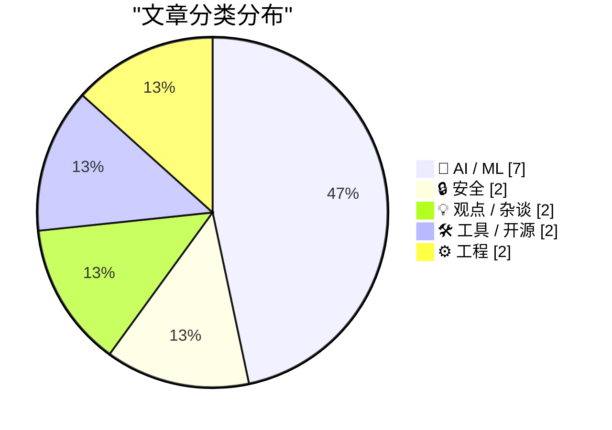
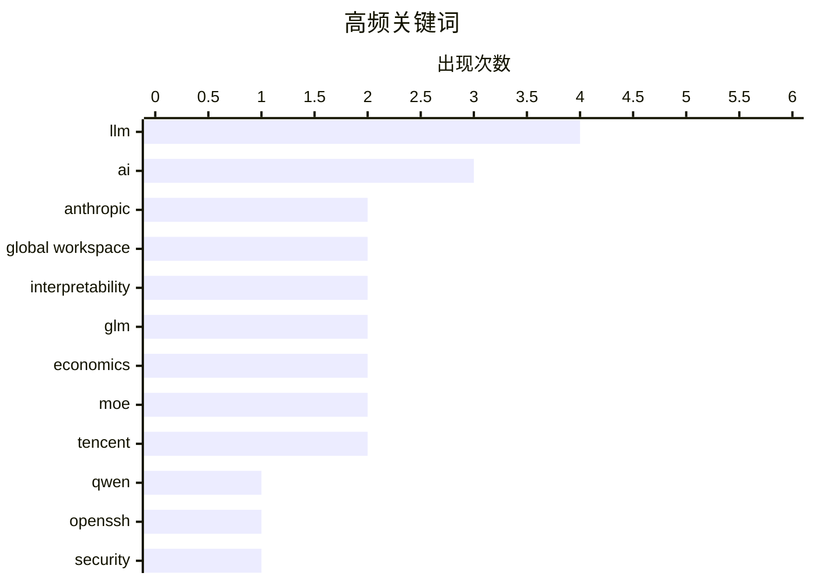

# 📰 AI 资讯每日精选 — 2026-07-07

> 汇聚 140+ 技术博客、X/Twitter、Hacker News、Reddit、Product Hunt、
> Lobste.rs、ClawFeed 日报及 GitHub Trending，经 AI 评分筛选。
>
> **本期内容**：🏆 今日必读 · 🌐 ClawFeed 日报 · 🔥 GitHub Trending · 📂 分类精选 · 🎨 设计与生成式 AI · 📊 数据概览

## 📝 今日看点

今日技术圈聚焦两大趋势：一是AI模型内部机制的可解释性取得突破，Anthropic揭示语言模型存在“全局工作空间”并开源相关工具，同时开源模型性能逼近闭源，正引发对AI利润崩塌的行业反思；二是基础设施安全与可控性成为焦点，OpenSSH与KVM虚拟机逃逸漏洞相继曝光，而Cloudflare与OpenWrt则分别从细粒度机器人控制和开源硬件角度，推动网络与计算环境的自主可控。

---

## 🏆 今日必读

🥇 **Qwen的J-Space：Anthropic发现模型内部全局工作空间**

[Qwen's J-Space - Anthropic's discovery of an internal model Global Workspace](https://www.reddit.com/r/LocalLLaMA/comments/1upl93b/qwens_jspace_anthropics_discovery_of_an_internal/) — r/LocalLLaMA · 5 小时前 · 🤖 AI / ML

> Anthropic发布了一项研究，揭示了语言模型在决定输出内容时，其内部存在一个“全局工作空间”（Global Workspace）在幕后进行思考。研究团队不仅发表了论文，还开源了J-Space透镜代码（Jacobian Lens），用于探测模型的内部表征。合作伙伴Neuronpedia基于该技术，为Qwen 3.6 27B模型搭建了J-Space可视化演示，让外界能直观观察模型在生成文本前的内部推理过程。这一发现为理解大语言模型的内部工作机制提供了新的工具和视角。

💡 **为什么值得读**: 如果你对“大模型内部到底在想什么”感到好奇，这篇文章和配套的开源工具将首次让你像看X光片一样观察模型的思考过程。

🏷️ Anthropic, Global Workspace, interpretability, Qwen

🥈 **语言模型中的全局工作空间**

[A global workspace in language models](https://www.anthropic.com/research/global-workspace) — Hacker News Best · 16 小时前 · 🤖 AI / ML

> Anthropic的研究发现，语言模型在生成最终输出之前，其内部存在一个类似“全局工作空间”的中间表征层。该工作空间整合了模型对上下文的理解、潜在推理路径和候选输出，然后才决定最终写什么。通过J-Space透镜技术，研究人员可以实时观察这个内部空间的动态变化。这项研究为解释模型行为、提升可解释性以及检测潜在风险提供了全新的技术手段。

💡 **为什么值得读**: 这是Anthropic在AI可解释性领域的最新突破，直接回答了“大模型是如何思考的”这一核心问题，对理解AI安全至关重要。

🏷️ LLM, global workspace, Anthropic, interpretability

🥉 **OpenSSH 10.4 发布**

[OpenSSH 10.4](https://www.openssh.org/releasenotes.html#10.4) — Lobste.rs · 10 小时前 · 🔒 安全

> OpenSSH 10.4版本正式发布，带来了多项安全增强和功能改进。新版本修复了若干安全漏洞，并优化了密钥交换算法和加密协议的支持。此外，该版本还改进了对FIDO/U2F硬件密钥的支持，并提升了SSH代理转发的安全性。用户应尽快升级以获取最新的安全补丁和性能优化。

💡 **为什么值得读**: OpenSSH是服务器和开发者日常使用的核心工具，10.4版本包含关键安全修复，所有运维人员都应了解并尽快升级。

🏷️ OpenSSH, security, release, SSH

4️⃣ **GLM 5.2 与即将到来的AI利润崩塌**

[GLM 5.2 and the coming AI margin collapse](https://martinalderson.com/posts/the-upcoming-ai-margin-collapse-part-1-glm-5-2/) — Hacker News Best · 14 小时前 · 🤖 AI / ML

> 文章指出，随着GLM 5.2等新一代开源模型的性能逼近闭源模型，AI行业的利润率将面临严重压缩。开源模型的快速迭代正在消除闭源模型的护城河，导致推理成本急剧下降。作者认为，当模型能力趋同且价格趋近于零时，依赖API收费的AI公司利润将崩塌。这一趋势将迫使AI公司从卖模型转向卖应用和服务。

💡 **为什么值得读**: 这篇文章提出了一个反直觉但极具说服力的观点：开源模型的进步可能不是AI行业的福音，而是利润崩塌的导火索，值得所有AI从业者和投资者深思。

🏷️ GLM, AI, margin, economics

5️⃣ **Januscape：KVM/x86 虚拟机逃逸漏洞**

[Januscape: Guest-to-Host Escape in KVM/x86](https://github.com/V4bel/Januscape) — Lobste.rs · 16 小时前 · 🔒 安全

> 安全研究人员公开了一个名为Januscape的KVM/x86虚拟机逃逸漏洞。该漏洞允许恶意虚拟机中的攻击者突破虚拟化隔离，直接访问宿主机系统。漏洞利用涉及对KVM内存管理机制的特定操作，影响多个版本的Linux内核。目前该漏洞的PoC代码已在GitHub上公开，云服务商和虚拟化平台管理员需立即评估风险并应用补丁。

💡 **为什么值得读**: 这是一个严重的虚拟机逃逸漏洞，直接威胁云服务的安全性，所有使用KVM虚拟化的团队必须立即关注并采取防护措施。

🏷️ KVM, virtualization, escape, vulnerability

---

## 🌐 ClawFeed 日报精选

> 来源：[ClawFeed](https://clawfeed.kevinhe.io) — AI 驱动的多源新闻聚合

# ClawFeed Daily Digest | 2026-07-06 (Sun)

聚合 6 期 4h digest (#802 #803 #804 #805 #806 #807)，覆盖 00:00–23:59 SGT。注：#805–#807 为断电补发（Jul 6 12:20–Jul 7 01:47 SGT 断电期间未能实时抓取）。全天周日 + 独立日长周末尾声，上午极薄，下午起逐步回暖，傍晚到深夜出现若干高质量新信号。

---

## 🔥 当日 Top 5

1. **Harness Engineering 核心证据浮出水面** — @chenchengpro："同一模型、同一 benchmark，换 harness 后从 42% 跳到 78%——什么都没换。"「Harness Engineering」作为 2026 年 AI 工程最重要发现之一正式命名。直接呼应 @levie "AI 之战 = Context 之战"论述，两条信号在本日形成完整闭环。
   https://x.com/chenchengpro

2. **Anthropic 发布全局工作空间研究「A global workspace in language models」** — 语言模型内部存在类似大脑 Global Workspace Theory 的机制：极少量 token 承载全局可访问状态，其余大量处理在幕后进行。模型可解释性研究的重要里程碑，与意识科学直接挂钩。
   https://x.com/AnthropicAI

3. **ICML 2026 杰出论文：扩散语言模型打破自回归顺序** — @wey_gu 介绍清华 LeapLab × 阿里合作论文：扩散语言模型允许以任意顺序并行或无序生成 token，打破从左到右的刚性约束。语言模型基础架构层面的最高学术认可。ICML 2026 首尔信号全天持续涌现（AMI Labs 亮相 + 此杰出论文）。
   https://x.com/wey_gu

4. **Cline Kanban 发布：CLI-agnostic 多 agent 编排独立应用** — @cline 推出 Kanban board，Claude Code / Codex 均兼容，任务跑在 git worktree 隔离环境，支持 diff review、card 链接。`npm i -g cline`。继 Superset（YC P26）之后，多 agent 管理工具赛道再添重量级选手，两者正在形成竞争格局。
   https://x.com/cline

5. **open weights 护城河叙事被推翻** — @CharliehuAI："盲测已无法区分开源与前沿闭源模型，closed model 的护城河比任何人预期都消失得更快。"配合 @levie 的 context/harness 论述，共同指向：产品竞争壁垒已从模型本身迁移到 harness + context pipeline。
   https://x.com/CharliehuAI

---

## 📰 当日核心主题

### 1. Harness Engineering 叙事在本日完成从「话题」到「范式」的跃迁
- @chenchengpro 42%→78% 数据（#806）提供了迄今最直接的量化证据
- @levie "AI 之战 = Context 之战"（#803, 57K views）提供了市场层面的宏观框架
- @howie_serious 150B token 实战总结（#806）提供了个人 builder 的微观体验
- @bozhou_ai CLAUDE.md 解释报告 skill（#806）是具体落地实践
- @jerryjliu Document Context Layer（#806）是基础设施视角的补全
- 五个信号从不同层次汇聚同一结论：2026 年 AI 工程竞争力 = harness 质量，而非模型选择

### 2. 多 agent 管理工具赛道全天最活跃
- **Cline Kanban**（#806）：`npm i -g cline`，Claude+Codex 兼容，worktree 隔离
- **Superset YC P26**（#807）：Show HN 从 24→96 points，同时管理多 agent + diff review
- **BonsAI**（#807）：macOS 画布 + agent，解决上下文整理痛点
- 三款工具定位各异（CLI orchestrator / 操作台 / 想法画布），共同说明开发者对「管理多个 coding agent」的需求已从探索期进入工具化期

### 3. Agent 架构工具链补全加速
- Stanford agent-native Git（#805）：agent 任务状态版本管理
- LangChain OpenWiki（#805）：agent 自动维护代码文档
- Google Stitch DESIGN.md（#806）：Markdown 替代 Figma 给 agent 提供设计系统
- Claude Design System 逆向工程（#807，vikingmute）：20 章节+14 skills 公开
- agent 工具链的「配置层」（CLAUDE.md / DESIGN.md / skills）正在标准化

### 4. 中国 AI 研究 × 产品双线亮相 ICML 2026
- 清华 LeapLab × 阿里扩散 LLM 斩获杰出论文（#807）
- AMI Labs（LeCun 联合创办）× SBVA mixer 首尔亮相（#804）
- @_LuoFuli（小米 MiMo）持续在 following sample 出现，MiMo-V2.5 推理优化技术持续传播
- 学术+产业双线说明中国 AI 在国际顶会的曝光度显著提升

### 5. 上午极薄 → 傍晚明显回暖的全天节奏
#802–#804（00:00–11:59）内容几乎全是前几期的二次传播（lennysan/levie/turingou MCP 反思）；#805–#807（12:00–23:59）出现多条全新一手内容。假期尾声 + 时区效应导致的明显信号密度差异。

---

## 🔖 Bookmark 精选

本日 bookmarks 出现以下有价值新内容（除持续出现的 @Av1dlive/@BruceGuai）：
- **GPT-Realtime-2 实时音频翻译**（@arrakis_ai / @gdb，#805）：浏览器实时翻译 YouTube/直播/会议，「feels absolutely surreal」
- **Pika 虚拟形象 agent**（@oragnes，#807）：替身开会 + 赛博保姆，Skills 库已开源，消费级 agent 具身化的早期实践
- **wanman.ai 开源**（@turingou，#805）：1000+ 服务接入 + 实时语音控制，「一人公司 OS」产品化

---

## 👀 推荐关注汇总

| 账号 | 理由 | 来源期 |
|------|------|--------|
| @_avichawla | Stanford 研究者，agent tooling 前沿，内容深度高 | #805 |
| @willdepue | 数据基础设施 × AI 未来布局，独立研究视角 | #805 |
| @jerryjliu0 | LlamaIndex 创始人，document × agent 系统化 | #806 |
| @howie_serious | 重度 Codex 用户，150B token 实战反思，高质量原创 | #806 |
| @istdrc | raft.build 创始人，前 Kimi CLI 作者，agent 平台一手 builder | #807 |
| @yan5xu | Superset YC P26，多 agent 管理工具实操 | #807 |

*以上均需先通过浏览器确认未关注后执行*

---

## 🧹 建议取关

| 账号 | 理由 | 首次建议 |
|------|------|---------|
| @Tradermayne | 纯 crypto 交易/prop firm 内容，561K followers 但与 AI builder 方向完全不符。全天 6 期均建议取关，**强烈建议今日执行** | #794 |
| @caterpillarous | 最近有实质内容的推文在 5 月中旬，个人感悟号与 AI/tech 无关 | #794 |
| @HeXiaobo (David.He) | 最近一条推文 2018 年，完全僵尸号（8 年），510 followers | #804 |
| @0xJasonBateman | 极低频，内容与 AI/tech 无关（8 followers，"Follows you"如无私交意义建议取关） | #804 |

---

## 💤 当日噪音模式

- **假期效应分段明显**：前 3 期（#802-804）内容几乎全是 #794-801 的二次传播，新鲜信号集中在后 3 期（#805-807）
- **@lennysan Phil Chen 帖全天 6 期连续出现**：view 数从 563K→686K 持续攀升，但内容零增量——已充分覆盖，后续可降权
- **bookmarks 全天重复高**：@Av1dlive Claude for Finance + @BruceGuai Matrix OS 在 6 期中各出现 5 次以上，作为长期标注可以考虑单独归档处理
- **断电影响**：#805-#807 为回溯补发，内容来自当前 feed 快照而非原始时间窗口抓取，部分推文时间戳可能有偏差

---

*Generated: 2026-07-06 23:59 SGT | Aggregated from 4h digests #802 #803 #804 #805 #806 #807 | #805-#807 retroactive catch-up*
---

## 🔥 GitHub Trending

> 今日热门开源项目（全语言 + Python）

| # | 项目 | 描述 | ⭐ 总星 | 📈 今日 | 语言 |
|---|------|------|---------|---------|------|
| 1 | [Zackriya-Solutions/meetily](https://github.com/Zackriya-Solutions/meetily) 🤖 | Privacy first, AI meeting assistant with 4x faster Parake... | 20.0k | +2494 | Rust |
| 2 | [Leonxlnx/taste-skill](https://github.com/Leonxlnx/taste-skill) 🤖 | Taste-Skill - gives your AI good taste. stops the AI from... | 59.7k | +1458 | JavaScript |
| 3 | [asgeirtj/system_prompts_leaks](https://github.com/asgeirtj/system_prompts_leaks) 🤖 | Extracted system prompts from Anthropic - Claude Fable 5,... | 52.3k | +1378 | JavaScript |
| 4 | [addyosmani/agent-skills](https://github.com/addyosmani/agent-skills) 🤖 | Production-grade engineering skills for AI coding agents. | 71.5k | +1112 | JavaScript |
| 5 | [openai/codex-plugin-cc](https://github.com/openai/codex-plugin-cc) 🤖 | Use Codex from Claude Code to review code or delegate tasks. | 26.5k | +906 | JavaScript |
| 6 | [firecrawl/firecrawl](https://github.com/firecrawl/firecrawl) | The API to search, scrape, and interact with the web at s... | 146.9k | +867 | TypeScript |
| 7 | [ogulcancelik/herdr](https://github.com/ogulcancelik/herdr) 🤖 | agent multiplexer that lives in your terminal. | 13.2k | +779 | Rust |
| 8 | [alirezarezvani/claude-skills](https://github.com/alirezarezvani/claude-skills) 🤖 | 345 Claude Code skills & agent skills & plugins (30+ Agen... | 21.4k | +610 | Python |
| 9 | [steipete/CodexBar](https://github.com/steipete/CodexBar) 🤖 | Show usage stats for OpenAI Codex and Claude Code, withou... | 16.9k | +598 | Swift |
| 10 | [hesreallyhim/awesome-claude-code](https://github.com/hesreallyhim/awesome-claude-code) 🤖 | A hand-picked collection of the finest of resources for t... | 48.8k | +506 | Python |
| 11 | [ruvnet/RuView](https://github.com/ruvnet/RuView) | π RuView turns commodity WiFi signals into real-time spat... | 78.0k | +470 | Rust |
| 12 | [mvanhorn/last30days-skill](https://github.com/mvanhorn/last30days-skill) 🤖 | AI agent skill that researches any topic across Reddit, X... | 50.1k | +458 | Python |
| 13 | [bradautomates/claude-video](https://github.com/bradautomates/claude-video) 🤖 | Give Claude the ability to watch any video. /watch downlo... | 4.7k | +427 | Python |
| 14 | [cheahjs/free-llm-api-resources](https://github.com/cheahjs/free-llm-api-resources) 🤖 | A list of free LLM inference resources accessible via API. | 26.0k | +419 | Python |
| 15 | [alibaba/zvec](https://github.com/alibaba/zvec) | A lightweight, lightning-fast, in-process vector database | 13.8k | +382 | C++ |

---

## 🤖 AI / ML

### 1. Qwen的J-Space：Anthropic发现模型内部全局工作空间

[Qwen's J-Space - Anthropic's discovery of an internal model Global Workspace](https://www.reddit.com/r/LocalLLaMA/comments/1upl93b/qwens_jspace_anthropics_discovery_of_an_internal/) — **r/LocalLLaMA** · 5 小时前 · ⭐ 28/30

> Anthropic发布了一项研究，揭示了语言模型在决定输出内容时，其内部存在一个“全局工作空间”（Global Workspace）在幕后进行思考。研究团队不仅发表了论文，还开源了J-Space透镜代码（Jacobian Lens），用于探测模型的内部表征。合作伙伴Neuronpedia基于该技术，为Qwen 3.6 27B模型搭建了J-Space可视化演示，让外界能直观观察模型在生成文本前的内部推理过程。这一发现为理解大语言模型的内部工作机制提供了新的工具和视角。

🏷️ Anthropic, Global Workspace, interpretability, Qwen

---

### 2. 语言模型中的全局工作空间

[A global workspace in language models](https://www.anthropic.com/research/global-workspace) — **Hacker News Best** · 16 小时前 · ⭐ 27/30

> Anthropic的研究发现，语言模型在生成最终输出之前，其内部存在一个类似“全局工作空间”的中间表征层。该工作空间整合了模型对上下文的理解、潜在推理路径和候选输出，然后才决定最终写什么。通过J-Space透镜技术，研究人员可以实时观察这个内部空间的动态变化。这项研究为解释模型行为、提升可解释性以及检测潜在风险提供了全新的技术手段。

🏷️ LLM, global workspace, Anthropic, interpretability

---

### 3. GLM 5.2 与即将到来的AI利润崩塌

[GLM 5.2 and the coming AI margin collapse](https://martinalderson.com/posts/the-upcoming-ai-margin-collapse-part-1-glm-5-2/) — **Hacker News Best** · 14 小时前 · ⭐ 26/30

> 文章指出，随着GLM 5.2等新一代开源模型的性能逼近闭源模型，AI行业的利润率将面临严重压缩。开源模型的快速迭代正在消除闭源模型的护城河，导致推理成本急剧下降。作者认为，当模型能力趋同且价格趋近于零时，依赖API收费的AI公司利润将崩塌。这一趋势将迫使AI公司从卖模型转向卖应用和服务。

🏷️ GLM, AI, margin, economics

---

### 4. 语言模型到底记住了多少？

[[Paper] How much do language models memorize?](https://www.reddit.com/r/LocalLLaMA/comments/1upq1rc/paper_how_much_do_language_models_memorize/) — **r/LocalLLaMA** · 1 小时前 · ⭐ 25/30

> 该研究提出了一种新方法，用于估算语言模型从训练数据中记忆了多少内容。该方法通过分析模型对特定文本片段的预测概率，来量化其记忆程度，而无需访问原始训练数据。实验发现，模型对训练数据中高频出现的文本记忆程度较高，但对低频或独特内容的记忆则显著下降。研究还揭示了模型规模与记忆能力之间的正相关关系，即更大的模型倾向于记住更多细节。结论是，语言模型的记忆行为并非均匀分布，而是高度依赖于数据的频率和独特性。

🏷️ memorization, LLM, privacy, paper

---

### 5. GLM 5.2 与即将到来的AI利润率崩溃

[GLM 5.2 and the coming AI margin collapse](https://martinalderson.com/posts/the-upcoming-ai-margin-collapse-part-1-glm-5-2/) — **Lobste.rs** · 14 小时前 · ⭐ 25/30

> 文章探讨了AI大模型行业面临的利润率崩溃风险，以GLM 5.2模型为切入点。核心论点是，随着开源模型性能快速逼近闭源模型，以及模型训练和推理成本持续下降，闭源AI公司的定价权和利润率将受到严重挤压。作者指出，GLM 5.2等开源模型在多项基准测试中已接近甚至超越GPT-4，但成本却低得多。结论是，AI行业正从“稀缺性溢价”阶段转向“商品化竞争”阶段，未来只有少数拥有独特数据或生态的公司能维持高利润。

🏷️ GLM, AI, margin collapse, economics

---

### 6. 腾讯发布Hy3开源模型

[tencent/Hy3](https://simonwillison.net/2026/Jul/6/hy3/#atom-everything) — **simonwillison.net** · 10 小时前 · ⭐ 24/30

> 腾讯发布了Hy3，一个295B参数的混合专家（MoE）开源模型，每次推理仅激活21B参数，并额外包含3.8B的MTP层参数。该模型基于Hy3 Preview版本，收集了50多个产品的反馈并提升了后训练数据质量。腾讯声称Hy3在性能上可匹敌其激活参数规模2到5倍的模型，同时将幻觉率降低至5.4%。模型采用Apache 2.0许可证发布，旨在推动开源社区发展。

🏷️ MoE, LLM, Tencent, Apache 2.0

---

### 7. 腾讯发布Hy3开源模型，声称性能匹敌其激活规模五倍的模型

[Tencent releases Hy3 open-source model that allegedly matches models up to five times its active size](https://the-decoder.com/tencent-releases-hy3-open-source-model-that-allegedly-matches-models-up-to-five-times-its-active-size/) — **The Decoder** · 16 小时前 · ⭐ 24/30

> 腾讯正式开源了Hy3大语言模型，该模型拥有2950亿总参数，采用混合专家（MoE）架构，每次推理仅激活210亿参数。腾讯宣称Hy3在多项任务上可匹敌其激活参数规模2到5倍的模型，同时将幻觉率降低一半至5.4%。该模型基于Apache 2.0许可证发布，旨在推动AI技术的开放与普及。

🏷️ open-source, MoE, LLM, Tencent

---

## 🔒 安全

### 8. OpenSSH 10.4 发布

[OpenSSH 10.4](https://www.openssh.org/releasenotes.html#10.4) — **Lobste.rs** · 10 小时前 · ⭐ 27/30

> OpenSSH 10.4版本正式发布，带来了多项安全增强和功能改进。新版本修复了若干安全漏洞，并优化了密钥交换算法和加密协议的支持。此外，该版本还改进了对FIDO/U2F硬件密钥的支持，并提升了SSH代理转发的安全性。用户应尽快升级以获取最新的安全补丁和性能优化。

🏷️ OpenSSH, security, release, SSH

---

### 9. Januscape：KVM/x86 虚拟机逃逸漏洞

[Januscape: Guest-to-Host Escape in KVM/x86](https://github.com/V4bel/Januscape) — **Lobste.rs** · 16 小时前 · ⭐ 26/30

> 安全研究人员公开了一个名为Januscape的KVM/x86虚拟机逃逸漏洞。该漏洞允许恶意虚拟机中的攻击者突破虚拟化隔离，直接访问宿主机系统。漏洞利用涉及对KVM内存管理机制的特定操作，影响多个版本的Linux内核。目前该漏洞的PoC代码已在GitHub上公开，云服务商和虚拟化平台管理员需立即评估风险并应用补丁。

🏷️ KVM, virtualization, escape, vulnerability

---

## 💡 观点 / 杂谈

### 10. 阿波罗经济学家警告：AI利润增长在科技行业之外可能远低于华尔街预期

[Apollo economist warns AI profit gains outside tech could take "well beyond" what Wall Street expects](https://the-decoder.com/apollo-economist-warns-ai-profit-gains-outside-tech-could-take-well-beyond-what-wall-street-expects/) — **The Decoder** · 13 分钟前 · ⭐ 25/30

> 阿波罗首席经济学家Torsten Slok指出，AI带来的利润增长在科技行业之外可能远不及华尔街的乐观预期。在医疗、银行、制药等受严格监管的行业，流程改造和隐私法规可能将生产力提升推迟数年。如果实现AI效益需要五年而非五个月，许多AI相关股票将面临痛苦的重新定价。

🏷️ AI, profit, Wall Street, regulation

---

### 11. GPT-4的统治地位持续了一年，而如今顶级模型在榜首仅能维持七周

[GPT-4's dominance lasted a year while today's top models barely survive seven weeks at the top](https://the-decoder.com/gpt-4s-dominance-lasted-a-year-while-todays-top-models-barely-survive-seven-weeks-at-the-top/) — **The Decoder** · 17 小时前 · ⭐ 24/30

> 根据Epoch Capabilities Index的数据，OpenAI的GPT-4在模型能力排行榜上保持了近一年的领先地位，远超其他任何模型。但自2024年2月Claude 3 Opus登顶以来，榜首位置已易手17次，中位停留时间仅为七周。文章指出，虽然模型间的竞争空前激烈，但新模型带来的能力提升幅度正在缩小。这表明AI模型的能力增长已进入平台期，差异化竞争正从“能力”转向“成本、速度和生态”。

🏷️ GPT-4, model competition, AI progress, benchmark

---

## 🛠 工具 / 开源

### 12. Cloudflare 用细粒度控制取代一刀切的AI机器人拦截策略

[Cloudflare replaces its blanket AI bot block with granular controls for search, training, and agent crawlers](https://the-decoder.com/cloudflare-replaces-its-blanket-ai-bot-block-with-granular-controls-for-search-training-and-agent-crawlers/) — **The Decoder** · 15 小时前 · ⭐ 25/30

> Cloudflare宣布为所有客户提供细粒度的AI机器人控制功能。网站所有者现在可以分别管理搜索、训练和代理三类机器人，而不是一刀切地全部拦截。从2026年9月15日起，在广告支持的页面上，训练和代理机器人将被默认拦截。这一变化让网站主能更灵活地决定哪些AI爬虫可以访问其内容。

🏷️ Cloudflare, AI bots, crawlers, control

---

### 13. Ternlight – 仅7MB的嵌入模型，可在浏览器中运行（WASM）

[Ternlight – 7 MB embedding model that runs in browser (WASM)](https://ternlight-demo.vercel.app/) — **Hacker News Best** · 11 小时前 · ⭐ 25/30

> Ternlight是一个仅7MB大小的文本嵌入模型，通过WebAssembly（WASM）技术实现了在浏览器中本地运行。该模型无需服务器端推理，完全在用户设备上执行，保障了数据隐私。尽管体积小巧，它在语义搜索和文本相似度任务上仍保持了可用的性能。开发者可以将其集成到前端应用中，实现离线或隐私敏感的AI功能。

🏷️ embedding model, WASM, browser, Ternlight

---

## ⚙️ 工程

### 14. OpenWrt One – 开源硬件路由器

[OpenWrt One – Open Hardware Router](https://openwrt.org/toh/openwrt/one) — **Hacker News Best** · 16 小时前 · ⭐ 25/30

> OpenWrt项目正式发布了其首款官方开源硬件路由器——OpenWrt One。该设备采用完全开源的设计，预装OpenWrt系统，旨在为用户提供完全可控的网络体验。硬件规格包括双千兆网口、USB 3.0和可扩展存储接口，支持完整的开源固件生态。这是OpenWrt社区从软件走向硬件的重要里程碑。

🏷️ OpenWrt, router, open hardware, networking

---

### 15. Workers Cache：Cloudflare Workers 缓存功能

[Workers Cache](https://blog.cloudflare.com/workers-cache/) — **Hacker News Best** · 21 小时前 · ⭐ 25/30

> Cloudflare宣布推出Workers Cache，这是一个专为Cloudflare Workers设计的缓存解决方案。它允许开发者在Workers代码中直接控制缓存策略，实现更精细的缓存管理。该功能支持基于请求、响应和用户属性的条件缓存，并能与Cloudflare的全球网络深度集成，显著降低源站负载并提升响应速度。

🏷️ Cloudflare Workers, caching, edge computing, performance

---

## 📊 数据概览

| 扫描源 | 抓取文章 | 时间范围 | 精选 |
|:---:|:---:|:---:|:---:|
| 89/140 | 3744 篇 → 90 篇 | 24h | **15 篇** |

### 分类分布



### 高频关键词



<details>
<summary>📈 纯文本关键词图（终端友好）</summary>

```
llm              │ ████████████████████ 4
ai               │ ███████████████░░░░░ 3
anthropic        │ ██████████░░░░░░░░░░ 2
global workspace │ ██████████░░░░░░░░░░ 2
interpretability │ ██████████░░░░░░░░░░ 2
glm              │ ██████████░░░░░░░░░░ 2
economics        │ ██████████░░░░░░░░░░ 2
moe              │ ██████████░░░░░░░░░░ 2
tencent          │ ██████████░░░░░░░░░░ 2
qwen             │ █████░░░░░░░░░░░░░░░ 1
```

</details>

### 🏷️ 话题标签

**llm**(4) · **ai**(3) · **anthropic**(2) · global workspace(2) · interpretability(2) · glm(2) · economics(2) · moe(2) · tencent(2) · qwen(1) · openssh(1) · security(1) · release(1) · ssh(1) · margin(1) · kvm(1) · virtualization(1) · escape(1) · vulnerability(1) · profit(1)

---

*生成于 2026-07-07 10:42 | 汇聚 140 个技术博客、X/Twitter、Hacker News、Reddit、Product Hunt、Lobste.rs、ClawFeed 日报及 GitHub Trending，经 AI 评分筛选出 Top 15 精华内容*
