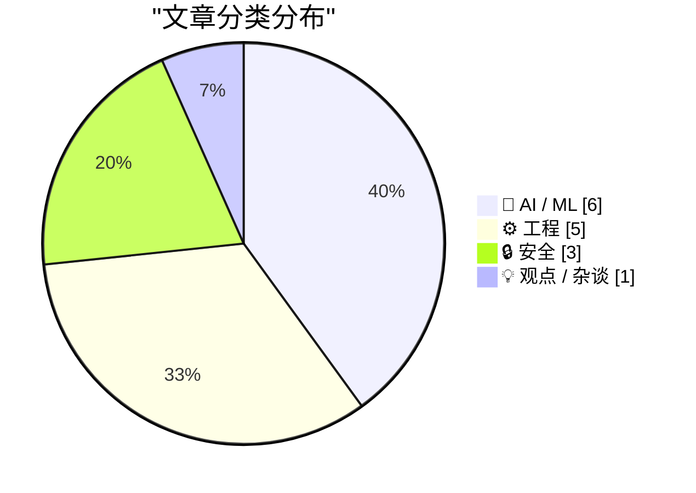
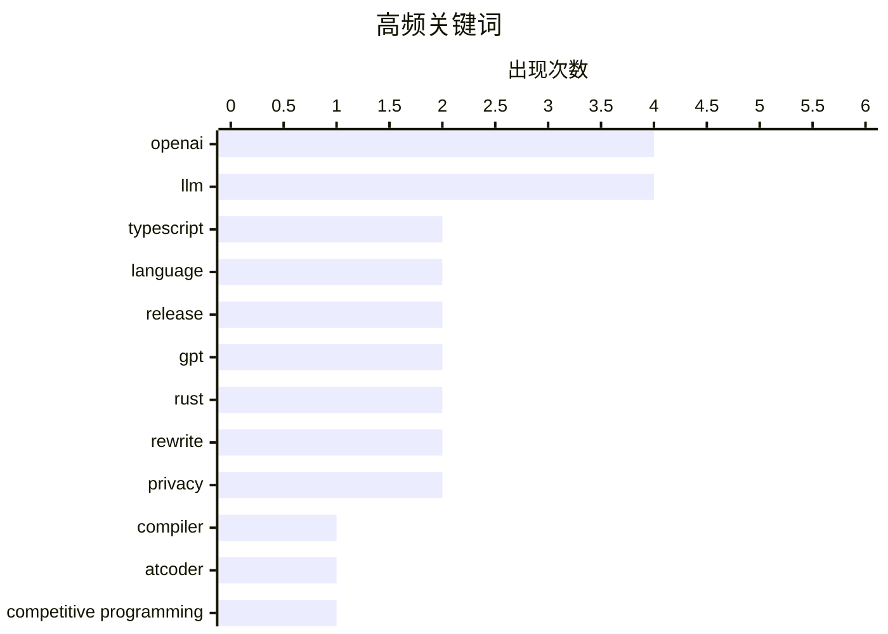

# 📰 AI 资讯每日精选 — 2026-07-09

> 汇聚 140+ 技术博客、X/Twitter、Hacker News、Reddit、Product Hunt、
> Lobste.rs、ClawFeed 日报及 GitHub Trending，经 AI 评分筛选。
>
> **本期内容**：🏆 今日必读 · 🌐 ClawFeed 日报 · 🔥 GitHub Trending · 📂 分类精选 · 🎨 设计与生成式 AI · 📊 数据概览

## 📝 今日看点

今日技术圈聚焦两大主线：AI在编程领域的统治力持续增强，OpenAI在顶级竞赛中击败人类选手，同时推出GPT-Live大幅升级语音交互体验；工程领域则迎来TypeScript 7.0重大版本发布，以及Bun用Rust重写核心架构，标志着开发者工具在性能与安全上的新一轮迭代。此外，安全领域曝出由罪犯运营的初创公司丑闻，引发行业对零日漏洞交易链的深度反思。

---

## 🏆 今日必读

🥇 **TypeScript 7.0 正式发布**

[TypeScript 7](https://devblogs.microsoft.com/typescript/announcing-typescript-7-0/) — Hacker News Best · 18 小时前 · ⚙️ 工程

> 微软正式发布了 TypeScript 7.0，这是该语言的一次重大版本升级。新版本重点提升了编译速度和运行时性能，引入了多项新特性，包括对装饰器（Decorators）的稳定支持、更强大的类型系统改进以及更好的 ECMAScript 模块互操作性。TypeScript 7.0 还优化了编辑器体验，提供了更快的代码补全和错误检查。该版本旨在进一步巩固 TypeScript 作为大型 JavaScript 项目首选语言的地位。

💡 **为什么值得读**: TypeScript 7.0 是近年来最重要的版本更新之一，对性能和新特性的改进将直接影响所有前端和后端 TypeScript 开发者的日常工作。

🏷️ TypeScript, language, compiler, release

🥈 **OpenAI 的 AI 在顶级编程竞赛 AtCoder 中击败所有人类选手**

[OpenAI's AI beats every human at AtCoder, a top competitive programming contest](https://the-decoder.com/openais-ai-beats-every-human-at-atcoder-a-top-competitive-programming-contest/) — The Decoder · 50 分钟前 · 🤖 AI / ML

> 在 AtCoder 世界巡回总决赛 2026 的表演赛中，OpenAI 的 AI 系统在算法组别中解决了全部五道题目，击败了所有人类参赛者。其中两道题目被观察者评为“异常困难”。这一结果展示了 AI 在复杂算法推理和编程竞赛领域的惊人进步，超越了此前任何 AI 在类似竞赛中的表现。该事件引发了关于 AI 在编程领域能力上限以及其对程序员职业影响的广泛讨论。

💡 **为什么值得读**: 这是 AI 首次在顶级人类编程竞赛中全面击败人类冠军，是衡量 AI 推理能力的一个重要里程碑。

🏷️ OpenAI, AtCoder, competitive programming, AI

🥉 **OpenAI 发布 GPT-Live**

[GPT‑Live](https://openai.com/index/introducing-gpt-live/) — Hacker News Best · 17 小时前 · 🤖 AI / ML

> OpenAI 正式推出了 GPT-Live，这是 ChatGPT 语音模式的一次重大升级，终于更新了底层模型。新模型在语音交互的流畅度、理解能力和响应速度上表现非常出色。GPT-Live 还具备“任务委派”能力，对于需要网络搜索、深度推理或更复杂工作的请求，它会自动在后台调用更强大的 GPT-5.5 模型来处理。这一设计在保持实时对话低延迟的同时，确保了复杂问题的处理质量。

💡 **为什么值得读**: GPT-Live 是 ChatGPT 语音交互体验的质变，其“委派”架构设计为实时 AI 助手如何平衡速度与深度提供了新思路。

🏷️ GPT, live, OpenAI, real-time

4️⃣ **TypeScript 7.0 正式发布**

[Announcing TypeScript 7.0](https://devblogs.microsoft.com/typescript/announcing-typescript-7-0/) — Lobste.rs · 17 小时前 · ⚙️ 工程

> 微软正式发布了 TypeScript 7.0，这是该语言的一次重大版本升级。新版本重点提升了编译速度和运行时性能，引入了多项新特性，包括对装饰器（Decorators）的稳定支持、更强大的类型系统改进以及更好的 ECMAScript 模块互操作性。TypeScript 7.0 还优化了编辑器体验，提供了更快的代码补全和错误检查。该版本旨在进一步巩固 TypeScript 作为大型 JavaScript 项目首选语言的地位。

💡 **为什么值得读**: TypeScript 7.0 是近年来最重要的版本更新之一，对性能和新特性的改进将直接影响所有前端和后端 TypeScript 开发者的日常工作。

🏷️ TypeScript, 7.0, release, language

5️⃣ **GPT-Live 正式发布**

[Introducing GPT‑Live](https://simonwillison.net/2026/Jul/8/introducing-gptlive/#atom-everything) — simonwillison.net · 11 小时前 · 🤖 AI / ML

> OpenAI 终于升级了 ChatGPT 语音模式所使用的模型，推出了 GPT-Live。作者在 iPhone 应用上获得了数周的预览权限，认为新模型令人印象深刻。GPT-Live 的一个关键特性是能够将更困难的任务（如需要网络搜索、深度推理或更复杂工作的问题）委派给后台的 GPT-5.5 模型处理。这种架构设计使得实时对话保持流畅，同时复杂问题也能得到高质量解答。

💡 **为什么值得读**: 来自知名技术博主的一手体验评测，详细解读了 GPT-Live 的“委派”机制及其实际表现，比官方公告更具洞察力。

🏷️ GPT, voice mode, OpenAI, LLM

---

## 🌐 ClawFeed 日报精选

> 来源：[ClawFeed](https://clawfeed.kevinhe.io) — AI 驱动的多源新闻聚合

# ClawFeed Daily Digest | 2026-07-08 (Tuesday)

Sources: 5 x 4h digests (#817-#821, windows 00:00-19:59 SGT)

---

## 🔥 Top 5 Signals of the Day

**1. Harness Engineering 成为 AI 自我改进的主战场**
Lilian Weng 发布长文 "Harness Engineering for AI Self-Improvement"，把 auto-research、自改进 agent、进化式程序搜索做了系统收敛——harness 是 RSI（递归自我改进）的近期主战场。ACE 作者 Qizheng Zhang 回应：harness 产出的 trace 不仅是 test-time 技术，还能反哺 pre/mid-training 作为数据引擎，harness → self-improvement → auto-research 将形成闭环。GLM-5 论文 "from Vibe Coding to Agentic Engineering" 也被推为理解 agent 发展趋势的必读材料。**这是当日最密集的智识线索**——从工程技巧升维到 AI 进化路径。
- https://x.com/shao__meng/status/2074385362777235878
- https://x.com/qizhengz_alex/status/2074514253554557338
- https://x.com/seekjourney/status/2074433715447717931

**2. Anthropic "Global Workspace in Language Models"——模型内部的"意识/无意识"分层**
Anthropic 新研究发现 Claude 内部存在类似人脑的分层机制：大部分内部激活不可自省，只有一小部分进入可描述、可推理的"全局工作空间"。Shopify CEO Tobi Lutke 评 "astonishing"。Nash_su 在 Qwen 3.6 上本地复现了可视化效果——可解释性工具开始向开源模型迁移。这是大模型可解释性领域目前最具启发性的成果之一。
- https://x.com/tobi/status/2074493694137258222
- https://x.com/nash_su/status/2074712416508911630

**3. DeepSeek 自研推理芯片——中国 AI 全链路自主化再进一步**
路透社独家：DeepSeek 正在开发专用推理芯片，旨在降低对 Nvidia 和华为的依赖。芯片面向 inference 而非 training。如果成功，中国 AI 从模型到硬件的自主链条又闭合了一环。同日，中国当局被报道讨论限制海外使用中国开源模型，HuggingFace CEO Clem 呼吁 Elon/Cursor 开源模型来对冲。
- https://x.com/MaxForAI/status/2074458585258692881
- https://x.com/vivilinsv/status/2074693128062468281

**4. Cloudflare x402 AI Agent 收费网关——互联网变现模式的底层转型**
Brian Armstrong 官宣 Cloudflare x402 Monetization Gateway waitlist：任意网页/API/MCP tool 可通过 stablecoin 自动收费。启用 HTTP 402 状态码（万维网诞生起保留未用），让 AI agent 访问网页/API 时按请求付费。当 AI agent 取代人类成为主要访客，30 年"内容→注意力→广告"的商业逻辑失灵，这是替代方案的基础设施级落地。当日三个 digest 反复出现此信号。
- https://x.com/brian_armstrong/status/2074519993107239080
- https://x.com/xiaohu/status/2074667192487174412
- https://x.com/aigclink/status/2074475872963395905

**5. Meta MSL Muse Image + Muse Video——媒体生成进入推理+工具链时代**
Meta MSL 发布 Muse Image 和 Muse Video 预览：首个使用推理、refinement 和工具链提升精度的媒体生成模型，test-time scaling 趋势从文本推理延伸到媒体生成。Meta 在生成式媒体上的正式入局。
- https://x.com/shengjia_zhao/status/2074577897009152298

---

## 📰 Core Themes

**1. Harness Engineering / RSI（递归自我改进）**
当日最密集主题。Lilian Weng 长文定调 + ACE 作者回应 + GLM-5 论文 + "Getting started with loops" 翻译 + Verification 作为第三个 scaling axis 的论文。核心共识：harness 层（工具、上下文、反馈链）的 scaling 是被忽视的 alpha，可能比模型 scaling law 更接近 AGI 路径。

**2. AI Agent 经济基础设施**
Cloudflare x402 支付网关 + MiniMax M3 预留推理容量（99% SLA，比 Opus 4.8 低 90% 成本）+ Vercel 收购 Better Auth 团队（agent 认证）+ Convey $38M Series A（AI teammate 办公自动化）。Agent 经济的支付、认证、算力三件套正在同步成型。

**3. 多模型协作成为主流工程范式**
Claude 官方文档化 Fable 5 Advisor 模式（大模型做顾问/小模型执行）和 Orchestrator 模式（大模型调度/子 agent 并行）。Nader Dabit 推混合 Kimi/GLM/Fable 通过 ACP 在 Devin 上统一调度。Dynamic Workflows 移植 Codex，比冷启动快 16x。大小模型协作从"技巧"变成"标准架构"。

**4. 模型可解释性突破**
Anthropic Global Workspace 研究 + J-Space 可解释性本地复现 + Vincent 深度解读"Claude 嘴上没说话时内部已闪过完整念头链"。核心问题升级：我们该信模型输出还是信内部表征？

**5. 开源模型企业化加速 vs 地缘风险**
DeepSeek V4 GGUF 量化（85GB 本地跑）+ MiniMax M3 provisioned throughput + 中国讨论限制开源模型出海。开源模型的企业级能力在快速成熟，但地缘政治风险同步升高。

---

## 🔖 Bookmarks Highlights

- **LimestoneHQ** - "How to Make a Company AI-Native"：面向中小型公司的 AI 原生转型实操方法论（当日三次被 digest 引用）
- **BruceGuai** - Matrix Agent 公司 OS 架构详解：不是一个巨大 Agent，而是职责分离+可审计+可规模化的 Agent 公司操作系统（当日三次被引用，与 harness engineering 讨论高度互补）
- **mardehaym** - "The Five Stages of AI-Native Engineering"：定义了从 Stage Zero 到 Stage Five 的完整框架，187K views
- **Av1dlive** - "Anthropic Claude for Finance 讲座是 quant AI 目前最值得看的免费 1 小时"，809K views

---

## 👀 Recommended Follows (Deduplicated)

| Handle | Why |
|--------|-----|
| @lilianweng | OpenAI 安全团队前负责人，harness engineering for RSI 长文年度级别参考 |
| @qizhengz_alex | ACE/Meta-Harness 作者，CMU 博士，harness → training data engine 延伸讨论质量极高 |
| @omarsar0 | AI 论文快评质量稳定，verification scaling axis 精准且早于大部分中文信息源 |
| @shengjia_zhao | Meta MSL 联合创始人，media generation 前沿一手信息源 |
| @seekjourney | 深度论文解读 + harness/agent 趋势分析，中文 AI 圈稀缺的"论文→工程启发"桥接者 |
| @ataiiam | Self-learning agents / moat 思考者，产品视角非纯技术视角 |
| @lvwerra | HuggingFace TRL 负责人，RLHF/RL+LLM 核心贡献者 |
| @xiaohu | 中文 AI/互联网趋势分析，Cloudflare AI 网关解读有深度 |
| @MatthewBerman | AI YouTube 头部创作者，经常拿到 OpenAI/Anthropic 提前测试资格 |
| @servasyy_ai | Dynamic Workflows 移植 Codex 等硬核 AI 工程分享 |

提醒：上述未通过浏览器逐一核实是否已关注，Kevin 操作前请先在 Following 里搜一下避免重复。

---

## 🧹 Unfollow Candidates (Consolidated)

| Handle | Reason | Status |
|--------|--------|--------|
| @caterpillarous | bio "comfortably numb"，无 AI/crypto/tech 内容指向 | 观察中（连续 3 期标记） |
| @0xJasonBateman | 8 followers，仅 36 posts，bio 为空 | 观察中（连续 2 期标记） |
| @YuLin807 | bio "自由，希望与爱"，无可见近期 tech 内容 | 观察中（连续 2 期标记） |

建议：如下期仍无活跃 tech 内容输出，执行取关。

---

## 💤 Noise Patterns

当日反复出现的噪音模式（非单条过滤，是系统性噪声）：

1. **杜均 vs 李博杰投资纠纷连续剧**（第三天）——VC 撕逼从 Day 1 的事实陈述退化为情绪宣泄和站队帖，信号价值已归零。
2. **Memecoin / Referral 推广潮**——Ondo Perps、TronBid、GitReverse、WEEX 大富翁、Robinhood Chain 教程，crypto 垃圾信号密度上升。
3. **国足婉拒佛得角段子串**——400 万播放量的擦边视频引发跟风一句话帖，占据多个时间窗。
4. **泛创业/职场鸡汤**——薪资谈判、UGC 营销增长教程等，信号弱且非核心领域。

---

## Meta

- Signal density: **HIGH** in 00:00-15:59 windows (harness engineering + interpretability + DeepSeek chips), **LOW** in 16:00-19:59 (mostly crypto noise)
- Dominant intellectual thread: Harness Engineering → RSI → Auto-Research feedback loop
- Market signal: Agent economy infrastructure (payments, auth, compute) maturing in parallel
- Aggregated from 4h digest IDs: 817, 818, 819, 820, 821
---

## 🔥 GitHub Trending

> 今日热门开源项目（全语言 + Python）

| # | 项目 | 描述 | ⭐ 总星 | 📈 今日 | 语言 |
|---|------|------|---------|---------|------|
| 1 | [MadsLorentzen/ai-job-search](https://github.com/MadsLorentzen/ai-job-search) 🤖 | AI-powered job application framework built on Claude Code... | 16.8k | +5079 | TypeScript |
| 2 | [iOfficeAI/OfficeCLI](https://github.com/iOfficeAI/OfficeCLI) 🤖 | OfficeCLI is the first and best Office suite purpose-buil... | 12.8k | +1717 | C# |
| 3 | [addyosmani/agent-skills](https://github.com/addyosmani/agent-skills) 🤖 | Production-grade engineering skills for AI coding agents. | 75.3k | +1297 | JavaScript |
| 4 | [asgeirtj/system_prompts_leaks](https://github.com/asgeirtj/system_prompts_leaks) 🤖 | Extracted system prompts from Anthropic - Claude Fable 5,... | 54.7k | +1218 | JavaScript |
| 5 | [Diolinux/PhotoGIMP](https://github.com/Diolinux/PhotoGIMP) | A Patch for GIMP 3+ for Photoshop Users | 15.3k | +1125 | CSS |
| 6 | [obra/superpowers](https://github.com/obra/superpowers) | An agentic skills framework & software development method... | 250.4k | +1116 | Shell |
| 7 | [bradautomates/claude-video](https://github.com/bradautomates/claude-video) 🤖 | Give Claude the ability to watch any video. /watch downlo... | 6.4k | +951 | Python |
| 8 | [Graphify-Labs/graphify](https://github.com/Graphify-Labs/graphify) 🤖 | AI coding assistant skill (Claude Code, Codex, OpenCode, ... | 80.8k | +856 | Python |
| 9 | [ruvnet/RuView](https://github.com/ruvnet/RuView) | π RuView turns commodity WiFi signals into real-time spat... | 79.5k | +799 | Rust |
| 10 | [kyutai-labs/pocket-tts](https://github.com/kyutai-labs/pocket-tts) | A TTS that fits in your CPU (and pocket) | 6.7k | +655 | Python |
| 11 | [TencentCloud/CubeSandbox](https://github.com/TencentCloud/CubeSandbox) 🤖 | Instant, Concurrent, Secure & Lightweight Sandbox for AI ... | 9.2k | +564 | Rust |
| 12 | [yt-dlp/yt-dlp](https://github.com/yt-dlp/yt-dlp) | A feature-rich command-line audio/video downloader | 176.6k | +488 | Python |
| 13 | [alibaba/zvec](https://github.com/alibaba/zvec) | A lightweight, lightning-fast, in-process vector database | 14.6k | +395 | C++ |
| 14 | [mvanhorn/last30days-skill](https://github.com/mvanhorn/last30days-skill) 🤖 | AI agent skill that researches any topic across Reddit, X... | 51.1k | +352 | Python |
| 15 | [TencentCloud/TencentDB-Agent-Memory](https://github.com/TencentCloud/TencentDB-Agent-Memory) 🤖 | TencentDB Agent Memory delivers fully local long-term mem... | 7.9k | +318 | TypeScript |

---

## 🤖 AI / ML

### 1. OpenAI 的 AI 在顶级编程竞赛 AtCoder 中击败所有人类选手

[OpenAI's AI beats every human at AtCoder, a top competitive programming contest](https://the-decoder.com/openais-ai-beats-every-human-at-atcoder-a-top-competitive-programming-contest/) — **The Decoder** · 50 分钟前 · ⭐ 27/30

> 在 AtCoder 世界巡回总决赛 2026 的表演赛中，OpenAI 的 AI 系统在算法组别中解决了全部五道题目，击败了所有人类参赛者。其中两道题目被观察者评为“异常困难”。这一结果展示了 AI 在复杂算法推理和编程竞赛领域的惊人进步，超越了此前任何 AI 在类似竞赛中的表现。该事件引发了关于 AI 在编程领域能力上限以及其对程序员职业影响的广泛讨论。

🏷️ OpenAI, AtCoder, competitive programming, AI

---

### 2. OpenAI 发布 GPT-Live

[GPT‑Live](https://openai.com/index/introducing-gpt-live/) — **Hacker News Best** · 17 小时前 · ⭐ 27/30

> OpenAI 正式推出了 GPT-Live，这是 ChatGPT 语音模式的一次重大升级，终于更新了底层模型。新模型在语音交互的流畅度、理解能力和响应速度上表现非常出色。GPT-Live 还具备“任务委派”能力，对于需要网络搜索、深度推理或更复杂工作的请求，它会自动在后台调用更强大的 GPT-5.5 模型来处理。这一设计在保持实时对话低延迟的同时，确保了复杂问题的处理质量。

🏷️ GPT, live, OpenAI, real-time

---

### 3. GPT-Live 正式发布

[Introducing GPT‑Live](https://simonwillison.net/2026/Jul/8/introducing-gptlive/#atom-everything) — **simonwillison.net** · 11 小时前 · ⭐ 26/30

> OpenAI 终于升级了 ChatGPT 语音模式所使用的模型，推出了 GPT-Live。作者在 iPhone 应用上获得了数周的预览权限，认为新模型令人印象深刻。GPT-Live 的一个关键特性是能够将更困难的任务（如需要网络搜索、深度推理或更复杂工作的问题）委派给后台的 GPT-5.5 模型处理。这种架构设计使得实时对话保持流畅，同时复杂问题也能得到高质量解答。

🏷️ GPT, voice mode, OpenAI, LLM

---

### 4. Grok 4.5 发布

[Grok 4.5](https://x.ai/news/grok-4-5) — **Hacker News Best** · 16 小时前 · ⭐ 26/30

> xAI 发布了其最新的大语言模型 Grok 4.5。该模型在推理、编程和数学能力上相比前代有显著提升，在多项基准测试中取得了领先成绩。Grok 4.5 特别强调了其在长上下文处理和实时信息检索方面的改进。该模型的发布加剧了与 OpenAI 的 GPT 系列和 Google 的 Gemini 系列在顶级 AI 模型领域的竞争。

🏷️ Grok, LLM, coding, cost

---

### 5. Writing an LLM from scratch, part 34b -- from bigrams to GPT-2, one component at a time (in JAX)

[Writing an LLM from scratch, part 34b -- from bigrams to GPT-2, one component at a time (in JAX)](https://www.gilesthomas.com/2026/07/llm-from-scratch-34b-building-and-training-gpt-2-small-in-jax) — **gilesthomas.com** · 16 小时前 · ⭐ 25/30

> <p>This post is the capstone of
<a href="/llm-from-scratch">the most long-running series on my blog</a>.
In December 2024 (!), I started
reading <a href="https://sebastianraschka.com/">Sebastian Rasch

🏷️ LLM, GPT-2, JAX, tutorial

---

### 6. Anthropic's fix for Fable 5's high cost is turning it into a manager that delegates to Sonnet 5

[Anthropic's fix for Fable 5's high cost is turning it into a manager that delegates to Sonnet 5](https://the-decoder.com/anthropics-fix-for-fable-5s-high-cost-is-turning-it-into-a-manager-that-delegates-to-sonnet-5/) — **The Decoder** · 18 小时前 · ⭐ 25/30

> Anthropic recommends using the expensive Claude Fable 5 mainly as a planner for smaller models instead of running it on every task. Combined with Sonnet 5 in the "Advisor" pattern, this setup hits 92 

🏷️ Anthropic, Fable 5, Sonnet 5, cost optimization

---

## ⚙️ 工程

### 7. TypeScript 7.0 正式发布

[TypeScript 7](https://devblogs.microsoft.com/typescript/announcing-typescript-7-0/) — **Hacker News Best** · 18 小时前 · ⭐ 28/30

> 微软正式发布了 TypeScript 7.0，这是该语言的一次重大版本升级。新版本重点提升了编译速度和运行时性能，引入了多项新特性，包括对装饰器（Decorators）的稳定支持、更强大的类型系统改进以及更好的 ECMAScript 模块互操作性。TypeScript 7.0 还优化了编辑器体验，提供了更快的代码补全和错误检查。该版本旨在进一步巩固 TypeScript 作为大型 JavaScript 项目首选语言的地位。

🏷️ TypeScript, language, compiler, release

---

### 8. TypeScript 7.0 正式发布

[Announcing TypeScript 7.0](https://devblogs.microsoft.com/typescript/announcing-typescript-7-0/) — **Lobste.rs** · 17 小时前 · ⭐ 27/30

> 微软正式发布了 TypeScript 7.0，这是该语言的一次重大版本升级。新版本重点提升了编译速度和运行时性能，引入了多项新特性，包括对装饰器（Decorators）的稳定支持、更强大的类型系统改进以及更好的 ECMAScript 模块互操作性。TypeScript 7.0 还优化了编辑器体验，提供了更快的代码补全和错误检查。该版本旨在进一步巩固 TypeScript 作为大型 JavaScript 项目首选语言的地位。

🏷️ TypeScript, 7.0, release, language

---

### 9. Bun 用 Rust 重写

[Rewriting Bun in Rust](https://bun.com/blog/bun-in-rust) — **Hacker News Best** · 12 小时前 · ⭐ 26/30

> JavaScript 运行时 Bun 宣布将其核心部分用 Rust 语言重写。此举旨在解决 Bun 原有基于 Zig 的架构在内存管理和跨平台兼容性上遇到的瓶颈。重写后的 Bun 在启动速度、内存占用和 API 稳定性方面预计将获得显著提升。这一决策反映了在系统编程语言选型上，Rust 因其安全性和生态成熟度正成为越来越多高性能工具的首选。

🏷️ Bun, Rust, rewrite, JavaScript runtime

---

### 10. OpenAI 发现 SWE Bench Pro 中约 30% 的任务存在缺陷

[OpenAI finds ~30% of tasks in SWE Bench Pro are broken](https://www.reddit.com/r/singularity/comments/1ur9835/openai_finds_30_of_tasks_in_swe_bench_pro_are/) — **r/singularity** · 11 小时前 · ⭐ 26/30

> OpenAI 在一项分析中发现，流行的软件工程基准测试 SWE Bench Pro 中约有 30% 的任务存在缺陷。这些缺陷包括问题描述不清晰、测试用例错误或环境配置问题，导致 AI 模型无法正确完成任务。OpenAI 指出，这些有问题的任务会误导对 AI 编程能力的评估，导致分数虚高或虚低。该发现呼吁社区重新审视和清理现有的 AI 代码能力基准测试，以确保评估结果的可靠性。

🏷️ SWE Bench, evaluation, OpenAI, software engineering

---

### 11. Rewriting Bun in Rust

[Rewriting Bun in Rust](https://simonwillison.net/2026/Jul/8/rewriting-bun-in-rust/#atom-everything) — **simonwillison.net** · 10 小时前 · ⭐ 25/30

> <p><strong><a href="https://bun.com/blog/bun-in-rust">Rewriting Bun in Rust</a></strong></p>
Jarred Sumner has been promising this blog post (<a href="https://x.com/jarredsumner/status/205306352482662

🏷️ Rust, Zig, rewrite, performance

---

## 🔒 安全

### 12. 重罪犯和欺诈者经营的网络安全初创公司

[Felons, Fraudsters Flog Offensive Cybersecurity Startup](https://krebsonsecurity.com/2026/07/felons-fraudsters-flog-offensive-cybersecurity-startup/) — **krebsonsecurity.com** · 22 小时前 · ⭐ 26/30

> 一家声称提供数百万美元收购流行软件零日漏洞的网络安全初创公司，其背后运营者是两名极右翼阴谋论者和已定罪的罪犯。这两人最近的其他创业项目包括虚假情报公司和一个现已倒闭的、基于 AI 的游说平台，且他们一直使用化名运营。该报道揭露了网络安全行业中存在的欺诈和背景审查漏洞，警示投资者和研究人员在合作前需进行严格的尽职调查。

🏷️ cybersecurity, zero-day, fraud, startup

---

### 13. Cloudflare Drop 发布

[Cloudflare Drop](https://www.cloudflare.com/drop/) — **Hacker News Best** · 15 小时前 · ⭐ 26/30

> Cloudflare 推出了名为“Drop”的新服务。该服务旨在简化文件共享流程，用户无需注册或安装任何软件，即可通过一个简单的链接安全地分享文件。Cloudflare Drop 利用其全球网络基础设施，提供高速、加密的文件传输服务。此举直接挑战了 WeTransfer 等传统文件共享平台，强调了隐私和易用性。

🏷️ Cloudflare, security, privacy, infrastructure

---

### 14. EU now one step away from reviving private message scanning rules

[EU now one step away from reviving private message scanning rules](https://cyberinsider.com/eu-now-one-step-away-from-reviving-private-message-scanning-rules/) — **Hacker News Best** · 17 小时前 · ⭐ 25/30

> Article URL: https://cyberinsider.com/eu-now-one-step-away-from-reviving-private-message-scanning-rules/
Comments URL: https://news.ycombinator.com/item?id=48834296
Points: 426
# Comments: 164

🏷️ EU, privacy, message scanning, regulation

---

## 💡 观点 / 杂谈

### 15. I think I have LLM burnout

[I think I have LLM burnout](https://www.alecscollon.com/blog/llm-burnout/) — **Hacker News Best** · 8 小时前 · ⭐ 25/30

> Article URL: https://www.alecscollon.com/blog/llm-burnout/
Comments URL: https://news.ycombinator.com/item?id=48839984
Points: 339
# Comments: 279

🏷️ LLM, burnout, AI fatigue, opinion

---

## 📊 数据概览

| 扫描源 | 抓取文章 | 时间范围 | 精选 |
|:---:|:---:|:---:|:---:|
| 94/140 | 3853 篇 → 99 篇 | 24h | **15 篇** |

### 分类分布



### 高频关键词



<details>
<summary>📈 纯文本关键词图（终端友好）</summary>

```
openai     │ ████████████████████ 4
llm        │ ████████████████████ 4
typescript │ ██████████░░░░░░░░░░ 2
language   │ ██████████░░░░░░░░░░ 2
release    │ ██████████░░░░░░░░░░ 2
gpt        │ ██████████░░░░░░░░░░ 2
rust       │ ██████████░░░░░░░░░░ 2
rewrite    │ ██████████░░░░░░░░░░ 2
privacy    │ ██████████░░░░░░░░░░ 2
compiler   │ █████░░░░░░░░░░░░░░░ 1
```

</details>

### 🏷️ 话题标签

**openai**(4) · **llm**(4) · **typescript**(2) · language(2) · release(2) · gpt(2) · rust(2) · rewrite(2) · privacy(2) · compiler(1) · atcoder(1) · competitive programming(1) · ai(1) · live(1) · real-time(1) · 7.0(1) · voice mode(1) · cybersecurity(1) · zero-day(1) · fraud(1)

---

*生成于 2026-07-09 10:47 | 汇聚 140 个技术博客、X/Twitter、Hacker News、Reddit、Product Hunt、Lobste.rs、ClawFeed 日报及 GitHub Trending，经 AI 评分筛选出 Top 15 精华内容*
