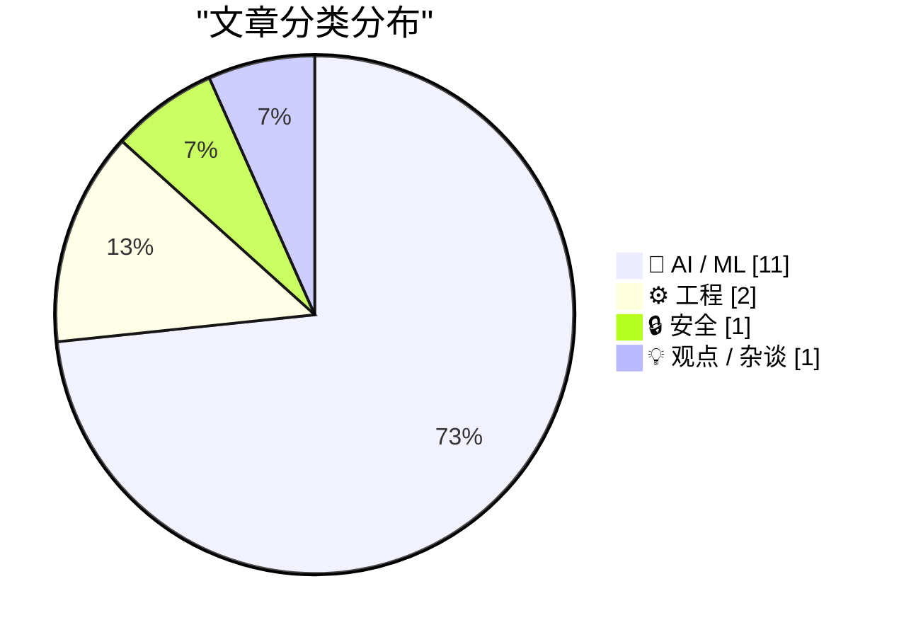
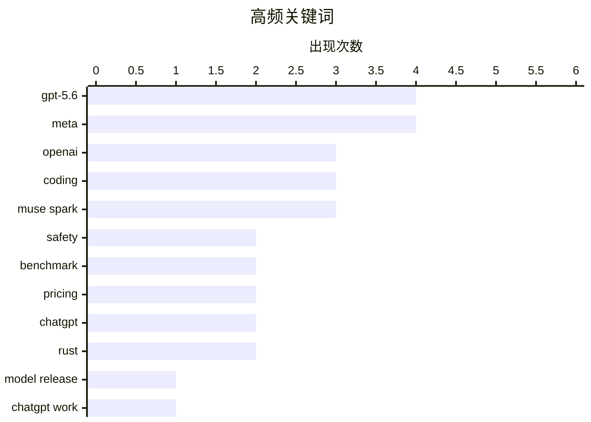

# 📰 AI 资讯每日精选 — 2026-07-10

> 汇聚 140+ 技术博客、X/Twitter、Hacker News、Reddit、Product Hunt、
> Lobste.rs、ClawFeed 日报及 GitHub Trending，经 AI 评分筛选。
>
> **本期内容**：🏆 今日必读 · 🌐 ClawFeed 日报 · 🔥 GitHub Trending · 📂 分类精选 · 🎨 设计与生成式 AI · 📊 数据概览

## 📝 今日看点

今日技术圈的核心焦点是AI大模型的“价格战”与“代理化”双线并进：OpenAI发布GPT-5.6系列，以极具攻击性的定价和跨应用工作流代理产品ChatGPT Work抢占市场，而Meta与Databricks则分别通过低价API和开源模型进一步挤压成本空间，推动AI服务走向普惠化。与此同时，AI基准测试的可靠性受到质疑——OpenAI发现约30%的热门编码测试存在缺陷，引发行业对评估标准真实性的反思。此外，欧盟通过“聊天控制”法案，要求大规模扫描私人通信，在隐私与安全之间掀起新一轮争议。

---

## 🏆 今日必读

🥇 **GPT-5.6**

[GPT-5.6](https://openai.com/index/gpt-5-6/) — Hacker News Best · 17 小时前 · 🤖 AI / ML

> OpenAI 正式发布其最新旗舰模型 GPT-5.6，并同步公开了部署安全报告和开发者 API 文档。该模型在多项基准测试中表现优异，尤其在代理编码任务上击败了所有竞争对手。其定价策略极具攻击性，Sol 版本每百万输出 token 仅需 30 美元，远低于 Anthropic 的 Claude Fable 5。此举加剧了 AI 模型的价格战，给烧钱的纯 AI 实验室带来了巨大压力。

💡 **为什么值得读**: 这是 OpenAI 最新旗舰模型的官方发布页面，包含了最权威的模型规格、安全报告和定价信息，是了解 GPT-5.6 的第一手资料。

🏷️ GPT-5.6, OpenAI, model release, safety

🥈 **GPT-5.6 Sol 在综合基准测试中几乎媲美 Fable 5，成本仅为三分之一**

[GPT-5.6 Sol nearly matches Fable 5 on aggregated benchmarks at one-third the cost](https://the-decoder.com/gpt-5-6-sol-nearly-matches-fable-5-on-aggregated-benchmarks-at-one-third-the-cost/) — The Decoder · 16 小时前 · 🤖 AI / ML

> OpenAI 的 GPT-5.6 Sol 在人工智能分析智能指数上获得 59 分，仅比 Anthropic 的 Claude Fable 5 低 1 分。在成本方面，Sol 每次任务仅需 1.04 美元，仅为 Fable 5 价格的三分之一。在代理编码任务中，Sol 击败了所有竞争对手，进一步加剧了 Anthropic 的定价压力。

💡 **为什么值得读**: 文章提供了 GPT-5.6 Sol 与 Claude Fable 5 的直接性能与成本对比数据，对于正在做模型选型的开发者和企业决策者极具参考价值。

🏷️ GPT-5.6, benchmark, pricing, coding

🥉 **OpenAI 将 GPT-5.6 公测与 ChatGPT Work 结合，推出可处理完整工作流的新代理**

[OpenAI pairs its GPT-5.6 public rollout with ChatGPT Work, a new agent that handles entire workflows](https://the-decoder.com/openai-pairs-its-gpt-5-6-public-rollout-with-chatgpt-work-a-new-agent-that-handles-entire-workflows/) — The Decoder · 16 小时前 · 🤖 AI / ML

> OpenAI 推出基于 Codex 和 GPT-5.6 的代理产品 ChatGPT Work，能够独立处理跨 Google Drive、Slack 和 Salesforce 等应用的复杂项目。ChatGPT Work 现已支持网页、移动端和桌面端，但访问权限取决于用户的订阅计划。这标志着 OpenAI 从单一对话模型向自动化工作流代理的战略转型。

💡 **为什么值得读**: 本文介绍了 GPT-5.6 的核心应用场景——ChatGPT Work 代理，展示了模型从对话到自动化执行的关键进化，适合关注 AI 应用落地的读者。

🏷️ GPT-5.6, ChatGPT Work, agent, workflow

4️⃣ **Meta 的 Muse Spark 1.1 API 定价挤压 OpenAI 和 Anthropic，AI 价格战升温**

[Meta's Muse Spark 1.1 API pricing squeezes OpenAI and Anthropic as the AI price war heats up](https://the-decoder.com/metas-muse-spark-1-1-api-pricing-squeezes-openai-and-anthropic-as-the-ai-price-war-heats-up/) — The Decoder · 17 小时前 · 🤖 AI / ML

> Meta 以 Muse Spark 1.1 进入 AI API 市场，其定价甚至低于昨日刚发布的廉价模型 Grok 4.5。Muse Spark 1.1 每百万输出 token 仅收费 4.25 美元，仅为 Anthropic 或 OpenAI 收费的一小部分。对于正在烧钱的纯 AI 实验室来说，竞争压力进一步加大。

💡 **为什么值得读**: 本文揭示了 Meta 以极低价格杀入 API 市场的最新动态，对于关注 AI 成本趋势和市场竞争格局的读者是必读信息。

🏷️ Meta, API pricing, Muse Spark, competition

5️⃣ **欧盟议会批准“聊天控制 1.0”法案**

[EU Parliament greenlights Chat Control 1.0](https://www.patrick-breyer.de/en/eu-parliament-greenlights-chat-control-1-0-breyer-our-children-lose-out/) — Hacker News Best · 23 小时前 · 🔒 安全

> 欧盟议会投票通过了备受争议的“聊天控制 1.0”法案，该法案要求对私人通信进行大规模扫描以检测儿童性虐待材料。批评者认为，这实际上建立了大规模监控系统，侵犯了公民的隐私权和通信保密权。欧洲议会议员 Patrick Breyer 表示，该法案的通过意味着“我们的孩子输了”。

💡 **为什么值得读**: 这是关于欧盟隐私立法里程碑事件的深度分析，对于关注数字权利、隐私保护和科技政策的读者至关重要。

🏷️ EU, Chat Control, privacy, surveillance

---

## 🌐 ClawFeed 日报精选

> 来源：[ClawFeed](https://clawfeed.kevinhe.io) — AI 驱动的多源新闻聚合

📅 ClawFeed 日报 | 2026-07-09 (SGT)

基于 4 期 4h digest（#824 00:00 / #825 04:00 / #826 08:00 / #827 16:00）汇总。12:00-15:59 窗口缺失（scrape 未产出）。

---

## 🔥 当日全场最重要 5 条

**1. Harness Engineering 提出者 Ryan Lopopolo 加入 Google Cloud 任首席 Agent 工程师**
Agent 工程化从"开发者工具链"正式升级为"云平台基础设施"——GCP 用人事信号宣告 agent infra 是下一代云战场。此前 Lopopolo 在 OpenAI 提出 Harness Engineering 概念，现在 GCP 将其落地为 Agentic GCP 方向。
来源: https://x.com/MaxForAI/status/2075123203366854681

**2. xAI 发布 Grok 4.5——性能接近 Opus 4.8，价格低近 90%**
专为编码和 Agent 场景训练，与 Cursor 联合调优。Elon 定位"roughly comparable to Opus 4.7, but much faster"——不在 eval 上卷，而在落地速度和成本上做差异化。Frontier 模型价格战加速，高端智能正在商品化。对 OpenMax 的启示：模型层竞争进入实用主义阶段，harness/orchestration 层的价值进一步凸显。
来源: https://x.com/indigox/status/2074989568441680362 / https://x.com/elonmusk/status/2074911038286295049

**3. 企业 AI Agent 落地瓶颈是 Operating Model，不是技术**
Aaron Levie（Box CEO）与数十位企业 IT leader 密集会面后的核心共识：组织结构、审批流、权责边界没跟上，工具再强也空转。数据基础设施和 context engine 是企业 AI 落地的真正战场。Glean AI Gateway 同日发布，论点一致——interface 层变化太快，该标准化的是 platform 层。
来源: https://x.com/levie/status/2074719479377109312 / https://x.com/jainarvind/status/2074871518191054952

**4. OpenClaw Foundation 成立非营利，Personal AI 脱离商业大厂走向独立运营**
Peter Steinberger 澄清：OpenAI 雇了他本人，但 OpenClaw Foundation 独立——非营利、有赞助商而非 owner、首次配备全职团队。Personal AI 最重要的开源项目走向组织化独立运营，与商业 AI 公司保持距离。
来源: https://x.com/steipete/status/2075046949896736835

**5. Agent Harness 工程化全面升温——从极简框架到自我进化**
三条主线同步推进：(1) Pi Agent SDK 极简化——核心 agent 仅 ~15 行代码，extension 系统可将 tool token 用量砍掉 80-96%；(2) Raven agent harness 达 1K GitHub stars，核心差异是 Proactive Engine（主动感知环境并行动，不等用户输入）；(3) Self-evolving Agents 进入系统化——Hermes Agent 自动可复用 skills、RSI Lab 递归算法发现。Agent 从"loop + tools"走向自我进化。
来源: https://x.com/jasonzhou1993/status/2074811444038894078 / https://x.com/elliotchen100/status/2074781116066849232 / https://x.com/Shilong_Liu_AI/status/2074800880017342665

---

## 📰 当日核心主题

### 1. Agent Engineering → 云基础设施
当日最强信号。Ryan Lopopolo 入职 GCP、Anthropic 发布 5 个 agentic workshop（从零构建→自我改进→记忆→主动→多 agent 编排）、Raven Proactive Engine、Pi SDK 极简化——Agent 工程正从"开发者个人实践"变为"可标准化的云服务"。

### 2. Frontier 模型商品化加速
Grok 4.5 以 Opus 4.8 九折价格入场；GPT-5.6 Sol 早期评价涌入（"各方面重大飞跃"但 @rezosh 泼冷水：benchmark 可能被高估）；Haseeb (Dragonfly VC) 坦承"没有任何单一 well-scoped 智力任务我能赢 frontier AI"。模型能力趋同+价格战=orchestration/harness 层价值凸显。

### 3. 企业 AI：从 PoC 到组织变革
Levie 的 operating model 论贯穿全天。Coda 更名 Superhuman Docs（AI-native 协作文档）、Glean AI Gateway（企业 AI 统一 control plane）、PromptQL 融 $136M 要做"AI 版 Slack"——企业 AI 战场从模型选型移向基础设施和组织层。

### 4. AI 安全与评测可信度危机
Anthropic 发布 dual-use AI 安全研究（off-switch 机制）；OpenAI 审计 SWE-Bench Pro 发现 30% 测试任务有问题并撤回推荐；PG 转发的 Brown 大学期中/期末成绩散点图（AI 作弊可视化证据）4.6M views——AI 对教育评估体系冲击已不可逆。

### 5. 小模型 + 本地化趋势
LingBot-Vision 1B 击败 7B 深度估计；Nutrient 本地 PDF-to-Markdown 性能跃升（隐私友好 RAG）；Hermes Agent 上云 60 秒部署；定制化小模型 vs frontier 全能大模型的路线之争持续。

---

## 🔖 累计 Bookmark 精选

• **@BruceGuai** - Matrix Agent 架构：不是单一 Agent + 全部工具，而是"Agent 公司 OS"——多角色长期运行、职责分离、可审计。与 OpenMax 多 agent 团队理念高度共振。
• **@mardehaym / @LimestoneHQ** - "AI-Native Engineering 的五个阶段"+ 完整方法论免费公开。大多数团队还在第零阶段。
• **@arrakis_ai** - Chormex 用 GPT-Realtime-2 实现 Chrome 内实时 AI 翻译，Greg Brockman 转推背书。
• **@Av1dlive** - Anthropic "Claude for Finance" 讲座——quant AI 领域最值得看的免费 1 小时。
• **@mntruell** (Cursor CEO) - "AI 软件开发的第三纪元"，7.2M views。
• **@turingou** - wanman.ai 开源：AI agent 团队帮任何人从零创办/运营一人公司。
• **@levie** - "The Era of Context"：AI 时代 context 是企业的灵魂。

---

## 👀 推荐关注汇总（去重）

| 账号 | 推荐理由 |
|------|---------|
| @MaxForAI | 中文圈 Agent/AI 工程化深度评论，Harness Engineering 人事动态最早报道 |
| @shao__meng | 中文圈少见的 Agent Engineering 深度评论者，持续引介一线工程实践 |
| @elliotchen100 | Raven/EverMind 创始人，Proactive Engine 理念与 OpenMax always-on agent 方向对齐 |
| @joshwoodward | Google VP/GM，负责 Gemini 产品，公开征集用户痛点，态度开放 |
| @BruceGuai | Agent 架构深度思考者，Matrix/Agent OS 设计者 |
| @huang_chao4969 | DeepTutor 作者，agent-native 教育方向 |
| @atasteoff | Self-evolving agents 分类学综述作者 |

⚠️ 上述未通过浏览器逐一核实是否已关注，操作前请先搜 Following 避免重复。

---

## 💤 当日重复噪音模式

1. **Crypto KOL 互撕 / 八卦连续剧**：Metagent/李博杰投资纠纷连续第三天、Gate.io 170 万被盗争议——占 feed 多条但信息增量递减
2. **Meme token / referral 推广**：$BRIDGE launch、Ondo Perps 拉人、TronBid 软广、GitReverse token 推、WEEX 大富翁——每期 3-5 条，可安全过滤
3. **生活方式 / 非 AI 内容串**：国足段子串（400 万播放擦边视频带节奏）、蜜雪冰城品控讨论、giffgaff 电话卡代购——关注列表中混入的非目标内容源
4. **活动宣传 / 软广**：WAIC 活动、PANews 投资软文、CoinW 周报——信息密度低，形式固定---

## 🔥 GitHub Trending

> 今日热门开源项目（全语言 + Python）

| # | 项目 | 描述 | ⭐ 总星 | 📈 今日 | 语言 |
|---|------|------|---------|---------|------|
| 1 | [addyosmani/agent-skills](https://github.com/addyosmani/agent-skills) 🤖 | Production-grade engineering skills for AI coding agents. | 76.4k | +2554 | JavaScript |
| 2 | [iOfficeAI/OfficeCLI](https://github.com/iOfficeAI/OfficeCLI) 🤖 | OfficeCLI is the first and best Office suite purpose-buil... | 14.0k | +1929 | C# |
| 3 | [VoltAgent/awesome-design-md](https://github.com/VoltAgent/awesome-design-md) | A collection of DESIGN.md files analysis by popular brand... | 100.4k | +1391 | - |
| 4 | [asgeirtj/system_prompts_leaks](https://github.com/asgeirtj/system_prompts_leaks) 🤖 | Extracted system prompts from Anthropic - Claude Fable 5,... | 55.6k | +1125 | JavaScript |
| 5 | [Graphify-Labs/graphify](https://github.com/Graphify-Labs/graphify) 🤖 | AI coding assistant skill (Claude Code, Codex, OpenCode, ... | 81.6k | +909 | Python |
| 6 | [bradautomates/claude-video](https://github.com/bradautomates/claude-video) 🤖 | Give Claude the ability to watch any video. /watch downlo... | 7.0k | +718 | Python |
| 7 | [vxcontrol/pentagi](https://github.com/vxcontrol/pentagi) 🤖 | Fully autonomous AI Agents system capable of performing c... | 19.7k | +535 | Go |
| 8 | [SmartlyDressedGames/U3-SDK](https://github.com/SmartlyDressedGames/U3-SDK) | Source code for Unturned, a free open-world zombie surviv... | 2.3k | +524 | C# |
| 9 | [huxingyi/autoremesher](https://github.com/huxingyi/autoremesher) | Automatic quad remeshing tool | 2.5k | +403 | C++ |
| 10 | [prisma/prisma](https://github.com/prisma/prisma) | Next-generation ORM for Node.js & TypeScript | PostgreSQL... | 47.1k | +376 | TypeScript |
| 11 | [microsoft/SkillOpt](https://github.com/microsoft/SkillOpt) 🤖 | SkillOpt is a text-space optimizer that trains reusable n... | 12.0k | +276 | Python |
| 12 | [imthenachoman/How-To-Secure-A-Linux-Server](https://github.com/imthenachoman/How-To-Secure-A-Linux-Server) | An evolving how-to guide for securing a Linux server. | 29.3k | +243 | - |
| 13 | [kyutai-labs/pocket-tts](https://github.com/kyutai-labs/pocket-tts) | A TTS that fits in your CPU (and pocket) | 7.2k | +235 | Python |
| 14 | [unclecode/crawl4ai](https://github.com/unclecode/crawl4ai) 🤖 | 🚀🤖 Crawl4AI: Open-source LLM Friendly Web Crawler & Scr... | 72.1k | +215 | Python |
| 15 | [fqscfqj/Y2A-Auto](https://github.com/fqscfqj/Y2A-Auto) 🤖 | YouTube到AcFun和bilibili自动化搬运工具，支持AI翻译、字幕生成、内容审核、智能监控 | 1.6k | +211 | Python |

---

## 🤖 AI / ML

### 1. GPT-5.6

[GPT-5.6](https://openai.com/index/gpt-5-6/) — **Hacker News Best** · 17 小时前 · ⭐ 28/30

> OpenAI 正式发布其最新旗舰模型 GPT-5.6，并同步公开了部署安全报告和开发者 API 文档。该模型在多项基准测试中表现优异，尤其在代理编码任务上击败了所有竞争对手。其定价策略极具攻击性，Sol 版本每百万输出 token 仅需 30 美元，远低于 Anthropic 的 Claude Fable 5。此举加剧了 AI 模型的价格战，给烧钱的纯 AI 实验室带来了巨大压力。

🏷️ GPT-5.6, OpenAI, model release, safety

---

### 2. GPT-5.6 Sol 在综合基准测试中几乎媲美 Fable 5，成本仅为三分之一

[GPT-5.6 Sol nearly matches Fable 5 on aggregated benchmarks at one-third the cost](https://the-decoder.com/gpt-5-6-sol-nearly-matches-fable-5-on-aggregated-benchmarks-at-one-third-the-cost/) — **The Decoder** · 16 小时前 · ⭐ 27/30

> OpenAI 的 GPT-5.6 Sol 在人工智能分析智能指数上获得 59 分，仅比 Anthropic 的 Claude Fable 5 低 1 分。在成本方面，Sol 每次任务仅需 1.04 美元，仅为 Fable 5 价格的三分之一。在代理编码任务中，Sol 击败了所有竞争对手，进一步加剧了 Anthropic 的定价压力。

🏷️ GPT-5.6, benchmark, pricing, coding

---

### 3. OpenAI 将 GPT-5.6 公测与 ChatGPT Work 结合，推出可处理完整工作流的新代理

[OpenAI pairs its GPT-5.6 public rollout with ChatGPT Work, a new agent that handles entire workflows](https://the-decoder.com/openai-pairs-its-gpt-5-6-public-rollout-with-chatgpt-work-a-new-agent-that-handles-entire-workflows/) — **The Decoder** · 16 小时前 · ⭐ 27/30

> OpenAI 推出基于 Codex 和 GPT-5.6 的代理产品 ChatGPT Work，能够独立处理跨 Google Drive、Slack 和 Salesforce 等应用的复杂项目。ChatGPT Work 现已支持网页、移动端和桌面端，但访问权限取决于用户的订阅计划。这标志着 OpenAI 从单一对话模型向自动化工作流代理的战略转型。

🏷️ GPT-5.6, ChatGPT Work, agent, workflow

---

### 4. Meta 的 Muse Spark 1.1 API 定价挤压 OpenAI 和 Anthropic，AI 价格战升温

[Meta's Muse Spark 1.1 API pricing squeezes OpenAI and Anthropic as the AI price war heats up](https://the-decoder.com/metas-muse-spark-1-1-api-pricing-squeezes-openai-and-anthropic-as-the-ai-price-war-heats-up/) — **The Decoder** · 17 小时前 · ⭐ 27/30

> Meta 以 Muse Spark 1.1 进入 AI API 市场，其定价甚至低于昨日刚发布的廉价模型 Grok 4.5。Muse Spark 1.1 每百万输出 token 仅收费 4.25 美元，仅为 Anthropic 或 OpenAI 收费的一小部分。对于正在烧钱的纯 AI 实验室来说，竞争压力进一步加大。

🏷️ Meta, API pricing, Muse Spark, competition

---

### 5. 新的 GPT-5.6 系列：Luna、Terra、Sol

[The new GPT-5.6 family: Luna, Terra, Sol](https://simonwillison.net/2026/Jul/9/gpt-5-6/#atom-everything) — **simonwillison.net** · 14 小时前 · ⭐ 26/30

> OpenAI 的最新旗舰模型 GPT-5.6 正式全面可用，提供三个尺寸版本：Luna（最小）、Terra（中等）和 Sol（最大）。定价分别为每百万输入/输出 token：Luna 1/6 美元、Terra 2.50/15 美元、Sol 5/30 美元。相比之下，Claude Opus 系列为 5/25 美元，Claude Fable 5 为 10/50 美元，但单纯比较每百万 token 价格已无意义，因为不同模型的推理 token 数量差异巨大。

🏷️ GPT-5.6, OpenAI, LLM, pricing

---

### 6. ChatGPT Work

[ChatGPT Work](https://openai.com/index/chatgpt-for-your-most-ambitious-work/) — **Hacker News Best** · 17 小时前 · ⭐ 26/30

> OpenAI 正式发布 ChatGPT Work，这是一款专为处理最复杂工作而设计的代理产品。该产品能够自主完成跨应用的多步骤工作流，旨在提升用户的生产力。ChatGPT Work 现已上线，支持网页、移动和桌面端，但功能访问取决于用户的订阅计划。

🏷️ ChatGPT, productivity, OpenAI, work

---

### 7. OpenAI 发现约 30% 的热门 AI 编码测试存在缺陷

[OpenAI finds roughly 30 percent of popular AI coding test is broken](https://the-decoder.com/openai-finds-roughly-30-percent-of-popular-ai-coding-test-is-broken/) — **The Decoder** · 21 小时前 · ⭐ 25/30

> OpenAI 在审查广泛用于衡量 AI 模型编程能力的 SWE-Bench Pro 基准测试时，发现其中约 30% 的任务存在缺陷。由于该基准测试的可靠性受到质疑，OpenAI 已撤回其此前对该基准测试的认可。这一发现引发了业界对现有 AI 编码评估方法有效性的广泛讨论。

🏷️ SWE-Bench, benchmark, broken, coding

---

### 8. Databricks 将中国开源模型 GLM 5.2 设为默认编码引擎，因其以更低成本匹配 Opus

[Databricks makes Chinese open-source model GLM 5.2 its default coding engine after it matched Opus at lower cost](https://the-decoder.com/databricks-makes-chinese-open-source-model-glm-5-2-its-default-coding-engine-after-it-matched-opus-at-lower-cost/) — **The Decoder** · 23 小时前 · ⭐ 25/30

> Databricks 在其数百万行代码库上对编码代理进行基准测试，发现中国开源模型 GLM 5.2 在性能上匹配了 Anthropic 的 Opus 4.8，但每次任务成本仅为 1.28 美元，低于 Opus 的 1.94 美元。Databricks 计划将其作为日常编码主力模型推广。其更广泛的结论是：没有单一供应商能主导市场，企业应构建自己的基准测试而非依赖公开测试。

🏷️ GLM 5.2, open-source, coding, Databricks

---

### 9. Introducing Muse Spark 1.1

[Introducing Muse Spark 1.1](https://simonwillison.net/2026/Jul/9/muse-spark-1-1/#atom-everything) — **simonwillison.net** · 18 小时前 · ⭐ 24/30

> <p><strong><a href="https://ai.meta.com/blog/introducing-muse-spark-meta-model-api/">Introducing Muse Spark 1.1</a></strong></p>
Following <a href="https://simonwillison.net/2026/Apr/8/muse-spark/">Mu

🏷️ Muse Spark, Meta, API, model

---

### 10. Meta Sets Default for Instagram Accounts to Permit Content Reuse by AI

[Meta Sets Default for Instagram Accounts to Permit Content Reuse by AI](https://www.nytimes.com/2026/07/08/technology/meta-instagram-ai.html?unlocked_article_code=1.wVA.Q5Do.Uvg5yPwCEB5H) — **daringfireball.net** · 20 小时前 · ⭐ 24/30

> Eli Tan, reporting for The New York Times (gift link):


  The company’s new A.I. image generator has a surprising twist: It
allows people to use images from public Instagram accounts.

When Meta unve

🏷️ Meta, Instagram, AI, image generation

---

### 11. Muse Spark 1.1

[Muse Spark 1.1](https://ai.meta.com/blog/introducing-muse-spark-meta-model-api/) — **Hacker News Best** · 20 小时前 · ⭐ 24/30

> https://ai.meta.com/static-resource/muse-spark-1-1-evaluatio... [pdf]https://developer.meta.com/ai/resources/blog/build-with-muse...https://www.bloomberg.com/news/articles/2026-07-09/meta-star..., htt

🏷️ Muse Spark, Meta, AI model, evaluation

---

## ⚙️ 工程

### 12. 宣布 Rust 1.97.0

[Announcing Rust 1.97.0](https://blog.rust-lang.org/2026/07/09/Rust-1.97.0/) — **Lobste.rs** · 19 小时前 · ⭐ 26/30

> Rust 编程语言发布了 1.97.0 版本，带来了新的语言特性和标准库改进。该版本继续遵循 Rust 的六周发布周期，旨在提升开发者的编程体验和代码安全性。具体的变更日志和详细说明可在 Rust 官方博客中查看。

🏷️ Rust, release, language

---

### 13. Cpp2Rust: Automatic Translation of C++ to Safe Rust

[Cpp2Rust: Automatic Translation of C++ to Safe Rust](https://github.com/Cpp2Rust/cpp2rust) — **Lobste.rs** · 7 小时前 · ⭐ 25/30

> <p><a href="https://lobste.rs/s/xyotoa/cpp2rust_automatic_translation_c_safe">Comments</a></p>

🏷️ C++, Rust, translation, safety

---

## 🔒 安全

### 14. 欧盟议会批准“聊天控制 1.0”法案

[EU Parliament greenlights Chat Control 1.0](https://www.patrick-breyer.de/en/eu-parliament-greenlights-chat-control-1-0-breyer-our-children-lose-out/) — **Hacker News Best** · 23 小时前 · ⭐ 27/30

> 欧盟议会投票通过了备受争议的“聊天控制 1.0”法案，该法案要求对私人通信进行大规模扫描以检测儿童性虐待材料。批评者认为，这实际上建立了大规模监控系统，侵犯了公民的隐私权和通信保密权。欧洲议会议员 Patrick Breyer 表示，该法案的通过意味着“我们的孩子输了”。

🏷️ EU, Chat Control, privacy, surveillance

---

## 💡 观点 / 杂谈

### 15. Today’s the Day OpenAI Fucked Up the ChatGPT Mac App

[Today’s the Day OpenAI Fucked Up the ChatGPT Mac App](https://9to5mac.com/2026/07/09/openai-announcing-the-next-chapter-for-chatgpt-today-watch-here/) — **daringfireball.net** · 14 小时前 · ⭐ 24/30

> Zac Hall, writing at 9to5Mac about OpenAI’s sprawling product announcements today:


  To summarize today’s desktop app changes:


The existing ChatGPT app is now ChatGPT Classic.
Codex is now the new

🏷️ ChatGPT, Mac app, Codex, UI change

---

## 🎨 Design & Generative AI

### 🖼️ 生成式图片

- **[如何保留风格几何结构但更换调色板？](https://www.reddit.com/r/midjourney/comments/1us2odl/how_to_grab_the_geometry_of_a_style_but_not_the/)** — r/midjourney · 13 小时前
  > 用户询问在Midjourney中如何保留tarot卡艺术风格的几何结构，同时更换有限的调色板。

- **[动态/运动中的提示词技巧](https://www.reddit.com/r/midjourney/comments/1uru5ck/dynamicinmotion_prompts/)** — r/midjourney · 18 小时前
  > 用户寻求生成武器挥砍、击打等动态效果的最佳提示词方法。

- **[德鲁伊哨兵：角色肖像系列](https://www.reddit.com/r/midjourney/comments/1uru5m8/druidic_sentinels_a_series_of_mj_character/)** — r/midjourney · 18 小时前
  > 一组Midjourney生成的德鲁伊角色肖像，赋予生命感。

- **[洞穴城市](https://www.reddit.com/r/midjourney/comments/1us0mrp/cavern_city/)** — r/midjourney · 15 小时前
  > Midjourney生成的洞穴城市景观作品。

- **[1935年的梦境](https://www.reddit.com/r/midjourney/comments/1usazva/the_dreams_of_1935/)** — r/midjourney · 8 小时前
  > Midjourney生成的1935年风格梦幻图像。

- **[莫斯科地铁档案](https://www.reddit.com/r/midjourney/comments/1us7t6y/moscow_metro_archive/)** — r/midjourney · 10 小时前
  > Midjourney生成的莫斯科地铁主题图像。

- **[光泽绘制的Dezsimator](https://www.reddit.com/r/midjourney/comments/1usa2l3/a_glossy_painted_dezsimator/)** — r/midjourney · 8 小时前
  > Midjourney生成的光泽质感Dezsimator图像。

- **[下注吧！](https://www.reddit.com/r/midjourney/comments/1urzfeb/place_your_bets/)** — r/midjourney · 15 小时前
  > Midjourney生成的与下注相关的图像。

- **[升天——Finn的旅程](https://www.reddit.com/r/midjourney/comments/1usebla/ascension_finns_journey/)** — r/midjourney · 5 小时前
  > Midjourney生成的系列作品第二部，包含6集计划。

- **[Costa Desolación（原创内容）](https://www.reddit.com/r/midjourney/comments/1usfsbf/costa_desolación_oc/)** — r/midjourney · 3 小时前
  > Midjourney生成的荒凉海岸景观原创图像。

- **[科幻风景](https://www.reddit.com/r/midjourney/comments/1urv1qb/scifi_scenery/)** — r/midjourney · 18 小时前
  > Midjourney生成的科幻风格风景图像。

- **[采矿机甲](https://www.reddit.com/r/midjourney/comments/1uru2xz/mining_mech/)** — r/midjourney · 18 小时前
  > Midjourney生成的采矿机甲主题图像。

- **[决斗](https://www.reddit.com/r/midjourney/comments/1urorpv/the_duel/)** — r/midjourney · 22 小时前
  > Midjourney生成的决斗场景图像。

- **[天空蝠鲼](https://www.reddit.com/r/midjourney/comments/1usg2g5/sky_manta/)** — r/midjourney · 3 小时前
  > Midjourney生成的天空蝠鲼飞行生物图像。

- **[风暴女王](https://www.reddit.com/r/midjourney/comments/1urtdco/storm_queen/)** — r/midjourney · 19 小时前
  > Midjourney生成的风暴女王角色图像。

---

## 📊 数据概览

| 扫描源 | 抓取文章 | 时间范围 | 精选 |
|:---:|:---:|:---:|:---:|
| 93/140 | 3830 篇 → 72 篇 | 24h | **15 篇** |

### 分类分布



### 高频关键词



<details>
<summary>📈 纯文本关键词图（终端友好）</summary>

```
gpt-5.6    │ ████████████████████ 4
meta       │ ████████████████████ 4
openai     │ ███████████████░░░░░ 3
coding     │ ███████████████░░░░░ 3
muse spark │ ███████████████░░░░░ 3
safety     │ ██████████░░░░░░░░░░ 2
benchmark  │ ██████████░░░░░░░░░░ 2
pricing    │ ██████████░░░░░░░░░░ 2
chatgpt    │ ██████████░░░░░░░░░░ 2
rust       │ ██████████░░░░░░░░░░ 2
```

</details>

### 🏷️ 话题标签

**gpt-5.6**(4) · **meta**(4) · **openai**(3) · coding(3) · muse spark(3) · safety(2) · benchmark(2) · pricing(2) · chatgpt(2) · rust(2) · model release(1) · chatgpt work(1) · agent(1) · workflow(1) · api pricing(1) · competition(1) · eu(1) · chat control(1) · privacy(1) · surveillance(1)

---

*生成于 2026-07-10 10:40 | 汇聚 140 个技术博客、X/Twitter、Hacker News、Reddit、Product Hunt、Lobste.rs、ClawFeed 日报及 GitHub Trending，经 AI 评分筛选出 Top 15 精华内容*
