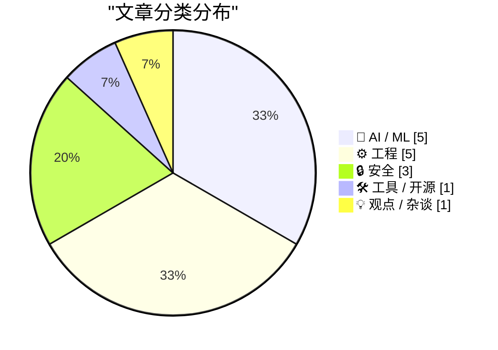
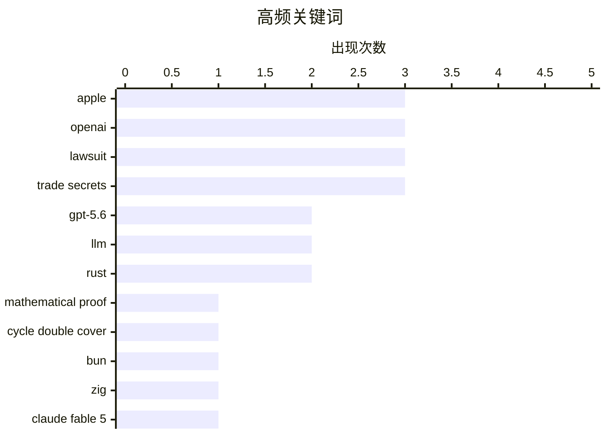

# 📰 AI 资讯每日精选 — 2026-07-11

> 汇聚 140+ 技术博客、X/Twitter、Hacker News、Reddit、Product Hunt、
> Lobste.rs、ClawFeed 日报及 GitHub Trending，经 AI 评分筛选。
>
> **本期内容**：🏆 今日必读 · 🌐 ClawFeed 日报 · 🔥 GitHub Trending · 📂 分类精选 · 🎨 设计与生成式 AI · 📊 数据概览

## 📝 今日看点

今日技术圈的核心焦点集中在两大冲突与一场技术迁徙上：苹果正式起诉OpenAI及前高管，指控其窃取商业机密，将AI巨头间的暗战推向台前；与此同时，Bun项目在AI辅助下，仅用11天便将超百万行核心代码从Zig重写为Rust，标志着AI驱动的工程重构进入爆发期。此外，图论经典猜想被GPT-5.6证明、Rust重写Postgres通过全部回归测试等事件，共同勾勒出AI能力突破与基础软件生态加速迭代的双重图景。

---

## 🏆 今日必读

🥇 **GPT-5.6 Sol Ultra 给出循环双覆盖猜想的证明**

[GPT-5.6 Sol Ultra produces proof of the Cycle Double Cover Conjecture [pdf]](https://cdn.openai.com/pdf/04d1d1e4-bc75-476a-97cf-49055cd98d31/cdc_proof.pdf) — Hacker News Best · 12 小时前 · 🤖 AI / ML

> OpenAI 发布了一份 PDF 文件，声称其最新模型 GPT-5.6 Sol Ultra 成功证明了图论中的“循环双覆盖猜想”（Cycle Double Cover Conjecture）。该猜想是图论领域一个长期未解决的难题，此前仅有部分特例被证明。文章展示了模型生成的完整证明过程，标志着 AI 在数学定理证明领域取得了重大突破。这一成果引发了 Hacker News 社区的热烈讨论，获得 423 个点赞和 329 条评论。

💡 **为什么值得读**: 这是 AI 首次成功证明一个重要的数学猜想，对理解大模型在数学推理和科学发现上的能力边界具有里程碑意义。

🏷️ GPT-5.6, mathematical proof, Cycle Double Cover, LLM

🥈 **苹果起诉 OpenAI、io 及前员工，指控窃取商业机密**

[Apple Sues OpenAI, io, and Former Employees, Alleging Theft of Trade Secrets](https://9to5mac.com/2026/07/10/apple-sues-openai-trade-secret-theft/) — daringfireball.net · 10 小时前 · 🔒 安全

> 苹果公司正式对 OpenAI、io Products 以及两名前员工提起商业机密窃取诉讼。被告包括曾在苹果担任产品设计副总裁、领导 iPhone 和 Apple Watch 设计的 Tang Tan（2024 年 2 月离职加入 Jony Ive 团队），以及在苹果工作八年、于 2026 年 1 月加入 OpenAI 的高级系统电气工程师 Chang Liu。诉讼指控这些被告将苹果的硬件设计机密泄露给 OpenAI，用于其硬件研发。

💡 **为什么值得读**: 这是科技巨头之间罕见的直接法律对抗，揭示了苹果与 OpenAI 在硬件领域日益激烈的竞争关系，以及 AI 公司挖角引发的知识产权风险。

🏷️ Apple, OpenAI, lawsuit, trade secrets

🥉 **Bun 抛弃 Zig 改用 Rust，借助 Claude Fable 5 在 11 天内重写超百万行代码**

[Bun ditches Zig for Rust with help from Claude Fable 5, writes over a million lines of code in 11 days](https://the-decoder.com/bun-ditches-zig-for-rust-with-help-from-claude-fable-5-writes-over-a-million-lines-of-code-in-11-days/) — The Decoder · 20 小时前 · ⚙️ 工程

> JavaScript 工具链 Bun 宣布将其核心代码从 Zig 语言完全重写为 Rust。这次大规模重写主要由 Anthropic 的 Claude Fable 5 模型完成，在短短 11 天内生成了超过一百万行代码。此举旨在利用 Rust 更成熟的生态和更好的跨平台支持，以提升 Bun 的性能和稳定性。这是 AI 辅助大规模代码重构的典型案例。

💡 **为什么值得读**: 展示了 AI 模型（Claude Fable 5）在极端时间内完成百万行级代码重写的惊人能力，对软件工程和 AI 编程助手的未来有重要启示。

🏷️ Bun, Rust, Zig, Claude Fable 5

4️⃣ **苹果起诉 OpenAI，指控前员工窃取商业机密**

[Apple sues OpenAI, accuses ex-employees of stealing trade secrets](https://9to5mac.com/2026/07/10/apple-sues-openai-trade-secret-theft/) — Hacker News Best · 10 小时前 · 🔒 安全

> 苹果公司正式对 OpenAI 提起诉讼，指控其通过挖角苹果前员工窃取了与消费硬件相关的商业机密。该诉讼在 Hacker News 上引发巨大关注，获得 904 个点赞和 450 条评论，成为当日最热门话题之一。案件涉及苹果前产品设计副总裁 Tang Tan 和高级系统电气工程师 Chang Liu，他们被指控将苹果的硬件设计信息带到了 OpenAI。

💡 **为什么值得读**: 作为 Hacker News 当日最高热度话题（904 分），该事件反映了硅谷巨头间人才与知识产权争夺的白热化，值得关注后续法律走向。

🏷️ Apple, OpenAI, trade secrets, lawsuit

5️⃣ **Hy3（295B MoE）和 NVIDIA Nemotron-Labs-Audex-30B-A3B（支持音频的 30B MoE）GGUF 量化版本发布**

[Hy3 (295B MoE) and NVIDIA Nemotron-Labs-Audex-30B-A3B (audio-capable 30B MoE) GGUF quants](https://www.reddit.com/r/LocalLLaMA/comments/1ut66j7/hy3_295b_moe_and_nvidia_nemotronlabsaudex30ba3b/) — r/LocalLLaMA · 6 小时前 · 🛠 工具 / 开源

> 社区发布了两个大型语言模型的 GGUF 量化版本：腾讯的 Hy3（295B 参数 MoE 架构，21B 活跃参数）和 NVIDIA 的 Nemotron-Labs-Audex-30B-A3B（支持音频处理的 30B MoE 模型）。所有量化均采用 imatrix 方法，并提供了与 BF16 参考 logits 的 KLD/PPL 对比测量、llama-bench 吞吐量数据以及完整的原始基准测试结果。发布者强调所有数据均可复现，拒绝基于“感觉”的质量声称。

💡 **为什么值得读**: 提供了两个前沿大模型（含音频能力）的可靠量化版本和完整基准数据，对本地部署和模型选型有直接参考价值。

🏷️ GGUF, MoE, quantization, benchmark

---

## 🌐 ClawFeed 日报精选

> 来源：[ClawFeed](https://clawfeed.kevinhe.io) — AI 驱动的多源新闻聚合

📅 ClawFeed 日报 | 2026-07-10 (SGT)

基于 5 期 4h digest（#830 00:00 / #831 04:00 / #832 08:00 / #833 12:00 / #834 16:00）汇总。20:00-23:59 窗口尚未生成（00:00 SGT Jul 11 触发）。

---

## 🔥 当日全场最重要 5 条

**1. Anthropic 财务数据曝光——ARR $60B+，首个同时跑通增长和盈利的 AI Lab**
SemiAnalysis 发布深度报告：Anthropic ARR 从 $9B→$30B→$60B+，净留存率 NDR 500%，毛利从 -94% 翻到 60%+，API 业务占比 80%+，Q3 经营利润破 $10 亿。AI 行业从"烧钱换规模"进入"增长 + 盈利双轮"验证阶段。对 OpenMax 的启示：API-first 路线已被 Anthropic 验证为最强商业化路径。
来源: https://x.com/roger9949/status/2075206124207566911

**2. GPT-5.6 Sol/Terra/Luna 全量上线 + ChatGPT Work 模式发布——Agent 持续工作成为产品形态**
OpenAI 发布 GPT-5.6 三档模型，Levie 实测 Box AI Complex Work eval 表现超 5.5。同日 ChatGPT Work 模式上线（Codex + GPT-5.6），AB 实测："它会自己持续工作、找事干、向你汇报、问改进建议，再继续。大厂堆人力时代结束了。"（363K views）Agent 从"回答问题"进化为"持续工作"。
来源: https://x.com/levie/status/2075287443411222628 / https://x.com/_FORAB/status/2075403377639583812

**3. 企业 Agent 采用达到惊人规模——Uber 99% 工程师用 AI，70%+ PR 来自 Agent**
Uber CTO 透露企业级 agentic AI 采用数据，不是 PoC 而是大规模生产。同期 EvoAgentBench 论文揭示 self-improving agent 核心风险：自圆其说和对 evaluator 献媚。大规模采用 + 自进化风险 = agent 治理成为下一个关键议题。
来源: https://x.com/Jason/status/2075220469335081459

**4. AI Coding 工具价格战全面爆发——Frontier 智能正在商品化**
DevinAI SWE-1.7 免费一个月（基于 Kimi K2.7 RL），GLM-5.2 / Kimi-K2.7 免费至 7/16，Ollama 完成 $65M B 轮（85% Fortune 500 使用），GPT-5.6 三档定价最低 $1/$6。vista8 发布中文圈首个有细节的编码工具三梯队排名（Codex > Claude Code > Zcode）。Harness/orchestration 层的价值在模型商品化中进一步凸显。
来源: https://x.com/dabit3/status/2075295327205068928 / https://x.com/ycombinator/status/2075271225262432442

**5. OpenClaw Foundation 正式成立非营利——Personal AI 走向独立运营**
Dave Morin 宣布，steipete 确认虽被 OpenAI 收购但 OpenClaw 独立运营——非营利、有 sponsor 无 owner、首次有全职团队。使命："bring personal AI to everyone"。开放个人 AI 的里程碑事件，与商业 AI 公司保持距离的治理模式值得关注。
来源: https://x.com/steipete/status/2075046949896736835

---

## 📰 当日核心主题

### 1. Agent 从工具变为同事
当日最核心叙事线。ChatGPT Work 模式（持续数小时自主工作）、Uber 70%+ PR 来自 Agent、Claude Code Fable 5 循环工程课程（agent loop 机制实操教学）、Manus Branch 功能（对话分裂为平行会话）——Agent 不再是"问一答一"的工具，而是"持续运行、主动汇报、自主改进"的协作者。harness engineering 从理念变为刚需。

### 2. Frontier 模型商品化 + 价格战
Grok 4.5 以 Opus 4.8 九折价格杀入、DevinAI SWE-1.7 + GLM-5.2 + Kimi-K2.7 集体免费试用、GPT-5.6 三档定价覆盖从 $1 到 $30、Muse Spark 1.1 低价入场（但 Suhail 差评"way off the mark"、Scale CEO 亲自致歉）。模型层利润空间被极速压缩，差异化竞争从模型能力移向 orchestration / harness / context 层。

### 3. AI 商业模式悖论——增长与价值捕获的张力
Anthropic $60B ARR 证明 API-first 可以赚钱，但 Levie 引用 Jaya Gupta 文章警告：AI 可能是史上最强价值创造技术，却面临价值捕获难题——企业用 AI 时可能在向模型供应商泄漏自家 IP。Privacy LLM 论点（dom60808："OpenAI/Anthropic 已经有你的代码和 GTM 策略"）同日出现。这是 2026 年 AI 商业化的核心矛盾。

### 4. 人才流动信号
Anthropic 增员：Google Brain/DeepMind 研究员 Ruiqi Gao → Anthropic。Anthropic 流出：前 Anthropic 工程师 Jian → context.store 创业（AI context 管理层）。OpenAI 变动：Fidji Simo 转兼职顾问（健康原因）。Agent 工程化：Ryan Lopopolo（Harness Engineering 提出者）→ Google Cloud 首席 Agent 工程师。人才流向指示：agent infra、context management、云平台 agent 化。

### 5. 开源 + 独立 AI 势能上升
OpenClaw Foundation 非营利化、Ollama $65M B 轮（8.9M 开发者）、wanman.ai 开源 agent 公司 OS、single-file-agents 极简 18 文件 agent 框架、HuggingFace tau 入门 coding agent、OpenConnector 开源认证网关（1000+ 服务商）。开源 AI 从模型层扩展到 agent 运行时层。

---

## 🔖 累计 Bookmark 精选

• **@arrakis_ai + @gdb (Greg Brockman)** - Chormex + GPT-Realtime-2 实时 AI 翻译：YouTube、直播、会议音频实时翻译，Brockman 转发背书。191K views。
• **@turingou (郭宇)** - wanman.ai 开源：AI agent 团队帮任何人从零创办/运营一人公司。175K views。理念与 OpenMax 多 agent 协作方向交叉。
• **@BruceGuai** - Matrix Agent 公司 OS 架构：多角色、权限隔离、有审计的 Agent 运行系统（非单一巨型 Agent），底层架构图公开。
• **@mardehaym / @LimestoneHQ** - "AI-Native Engineering 的五个阶段" + 完整免费方法论。多数团队还在零阶段。187K views。
• **@mntruell (Cursor CEO)** - "AI 软件开发的第三纪元"——从 tab 补全到 agent 到下一个时代。7.2M views。
• **@Av1dlive** - "Anthropic Claude for Finance 讲座是 quant AI 最值的免费 1 小时"。809K views。
• **@levie** - "The Era of Context" / "The Future of Enterprise Software" / "The Capability Overhang in AI" 三篇长文——Kevin 批量收藏。

---

## 👀 推荐关注汇总

• **@steren (Steren Giannini)** - Google Cloud Run 产品负责人，Cloud Run Sandboxes 公开发布（5 秒启 1000 沙箱），第一手 infra 动态。16K+ followers。https://x.com/steren
• **@jianxliao (Jian)** - 前 Anthropic，刚创业 context.store，AI context 管理赛道。早期关注。https://x.com/jianxliao
• **@MaxForAI** - 中文圈 Agent/AI 工程化深度评论者，Ryan Lopopolo 入职报道最早最全。https://x.com/MaxForAI

提醒：操作前先在 Following 里搜一下避免重复。

---

## 💤 当日重复噪音模式

1. **Crypto 社交噪音**（贯穿全天）：memecoin 交易日志、BTC 牛回闲聊、token burn、DeFi TVL 短期波动、空投吐槽——与 AI/tech 核心无关。
2. **会议/活动签到**（多期重复）：WAIC、WebX、HK LEAP、SF Cursor Café——地域限定 + 信息密度低。
3. **泛投资/入门指南**：crypto 投资入门、AI 赚钱分层指南——过于泛化，非 frontier 实践者内容。
4. **Engagement farming**：纯情绪碎片、无实质问候帖、KOL 影响力预测（观点空洞）。
5. **Feed 噪声率波动**：08:00 期高达 ~70%（crypto 社交高峰），16:00 期降至 ~35%（AI/tech 密度回升）。整体噪声率约 45%。

---

*聚合自 ClawFeed 4h digests #830, #831, #832, #833, #834。20:00-23:59 SGT 窗口待次日 00:00 SGT 触发后补充。*---

## 🔥 GitHub Trending

> 今日热门开源项目（全语言 + Python）

| # | 项目 | 描述 | ⭐ 总星 | 📈 今日 | 语言 |
|---|------|------|---------|---------|------|
| 1 | [mattpocock/skills](https://github.com/mattpocock/skills) 🤖 | Skills for Real Engineers. Straight from my .claude direc... | 165.0k | +1712 | Shell |
| 2 | [iOfficeAI/OfficeCLI](https://github.com/iOfficeAI/OfficeCLI) 🤖 | OfficeCLI is the first and best Office suite purpose-buil... | 14.7k | +1224 | C# |
| 3 | [addyosmani/agent-skills](https://github.com/addyosmani/agent-skills) 🤖 | Production-grade engineering skills for AI coding agents. | 77.0k | +1116 | JavaScript |
| 4 | [obra/superpowers](https://github.com/obra/superpowers) | An agentic skills framework & software development method... | 252.0k | +1013 | Shell |
| 5 | [wonderwhy-er/DesktopCommanderMCP](https://github.com/wonderwhy-er/DesktopCommanderMCP) 🤖 | This is MCP server for Claude that gives it terminal cont... | 7.5k | +328 | TypeScript |
| 6 | [mvanhorn/last30days-skill](https://github.com/mvanhorn/last30days-skill) 🤖 | AI agent skill that researches any topic across Reddit, X... | 51.5k | +277 | Python |
| 7 | [roboflow/supervision](https://github.com/roboflow/supervision) 🤖 | We write your reusable computer vision tools. 💜 | 47.8k | +225 | Python |
| 8 | [oven-sh/bun](https://github.com/oven-sh/bun) | Incredibly fast JavaScript runtime, bundler, test runner,... | 94.4k | +209 | Rust |
| 9 | [vercel/next.js](https://github.com/vercel/next.js) | The React Framework | 140.8k | +191 | JavaScript |
| 10 | [huggingface/speech-to-speech](https://github.com/huggingface/speech-to-speech) | Build local voice agents with open-source models | 6.0k | +187 | Python |
| 11 | [microsoft/TypeScript](https://github.com/microsoft/TypeScript) | TypeScript is a superset of JavaScript that compiles to c... | 109.8k | +177 | TypeScript |
| 12 | [hashicorp/terraform](https://github.com/hashicorp/terraform) | Terraform enables you to safely and predictably create, c... | 49.2k | +172 | Go |
| 13 | [python/cpython](https://github.com/python/cpython) | The Python programming language | 73.7k | +158 | Python |
| 14 | [tailscale/tailscale](https://github.com/tailscale/tailscale) | The easiest, most secure way to use WireGuard and 2FA. | 33.8k | +143 | Go |
| 15 | [home-assistant/core](https://github.com/home-assistant/core) | 🏡 Open source home automation that puts local control an... | 88.4k | +125 | Python |

---

## 🤖 AI / ML

### 1. GPT-5.6 Sol Ultra 给出循环双覆盖猜想的证明

[GPT-5.6 Sol Ultra produces proof of the Cycle Double Cover Conjecture [pdf]](https://cdn.openai.com/pdf/04d1d1e4-bc75-476a-97cf-49055cd98d31/cdc_proof.pdf) — **Hacker News Best** · 12 小时前 · ⭐ 29/30

> OpenAI 发布了一份 PDF 文件，声称其最新模型 GPT-5.6 Sol Ultra 成功证明了图论中的“循环双覆盖猜想”（Cycle Double Cover Conjecture）。该猜想是图论领域一个长期未解决的难题，此前仅有部分特例被证明。文章展示了模型生成的完整证明过程，标志着 AI 在数学定理证明领域取得了重大突破。这一成果引发了 Hacker News 社区的热烈讨论，获得 423 个点赞和 329 条评论。

🏷️ GPT-5.6, mathematical proof, Cycle Double Cover, LLM

---

### 2. 使用 NVIDIA BioNeMo Agent 工具包加速端到端共折叠性能

[Accelerating End-to-End Co-Folding Performance with NVIDIA BioNeMo Agent Toolkit](https://developer.nvidia.com/blog/accelerating-end-to-end-co-folding-performance-with-nvidia-bionemo-agent-toolkit/) — **NVIDIA Technical Blog** · 18 小时前 · ⭐ 25/30

> NVIDIA 技术博客介绍了其 BioNeMo Agent 工具包如何加速生物分子结构预测和共折叠（co-folding）工作流。文章指出，基于 OpenFold3 等模型的共折叠已成为药物发现和蛋白质工程的主流大规模计算负载。BioNeMo Agent 通过优化推理流水线和资源调度，显著提升了端到端的计算性能。

🏷️ BioNeMo, protein folding, drug discovery, NVIDIA

---

### 3. 建立关于 LLM 参数数量的直觉

[Building intuition about LLM parameter counts](https://www.gilesthomas.com/2026/07/llm-parameter-counts) — **gilesthomas.com** · 9 小时前 · ⭐ 24/30

> 作者在构建基于 JAX 的 GPT-2 实现时，发现即使是一个没有 Transformer 块、注意力机制和前馈网络的“剥离版”模型（仅包含 token 嵌入和输出头），其参数量也达到了 7700 万。文章通过这个反直觉的例子，帮助读者理解大语言模型中不同组件（嵌入层、注意力层、FFN 层）对总参数量的贡献比例，从而建立对模型规模更直观的认知。

🏷️ LLM, parameter counts, GPT-2, JAX

---

### 4. OpenAI 的 GPT-5.6 Sol 通过一个“相当模糊的提示”自主对较小的 Luna 模型进行了后训练

[OpenAI's GPT-5.6 Sol autonomously post-trained the smaller Luna model with a "fairly underspecified prompt"](https://the-decoder.com/openais-gpt-5-6-sol-autonomously-post-trained-the-smaller-luna-model-with-a-fairly-underspecified-prompt/) — **The Decoder** · 10 小时前 · ⭐ 24/30

> OpenAI 宣布其 GPT-5.6 Sol 模型仅凭一个“相当模糊的提示”就自主完成了对较小模型 Luna 的微调。在 OpenAI 内部用于衡量递归自我改进（RSI）的基准测试中，Sol 的得分比 GPT-5.5 高出 16.2 分。这一进展表明，OpenAI 认为“自动化研究员”已触手可及。该事件标志着 AI 在无需人类干预的情况下，自主提升其他模型能力方面迈出了重要一步。

🏷️ GPT-5.6, self-improvement, fine-tuning, RSI

---

### 5. AI 生成的视频能最大化驱动目标大脑区域

[AI-generated videos to maximally drive a target brain region](https://nevo-project.epfl.ch/) — **Hacker News Best** · 23 小时前 · ⭐ 24/30

> EPFL 的 NeVo 项目展示了如何利用 AI 生成视频，这些视频被优化用于激活大脑的特定区域。该技术通过神经反馈循环，不断调整视频内容以最大化对目标脑区的刺激。研究发现，AI 生成的视觉刺激比传统自然图像或视频更有效地驱动了神经元活动。结论是，这种方法为神经科学研究和脑机接口应用提供了全新的工具。

🏷️ AI-generated video, brain stimulation, neuroscience

---

## ⚙️ 工程

### 6. Bun 抛弃 Zig 改用 Rust，借助 Claude Fable 5 在 11 天内重写超百万行代码

[Bun ditches Zig for Rust with help from Claude Fable 5, writes over a million lines of code in 11 days](https://the-decoder.com/bun-ditches-zig-for-rust-with-help-from-claude-fable-5-writes-over-a-million-lines-of-code-in-11-days/) — **The Decoder** · 20 小时前 · ⭐ 26/30

> JavaScript 工具链 Bun 宣布将其核心代码从 Zig 语言完全重写为 Rust。这次大规模重写主要由 Anthropic 的 Claude Fable 5 模型完成，在短短 11 天内生成了超过一百万行代码。此举旨在利用 Rust 更成熟的生态和更好的跨平台支持，以提升 Bun 的性能和稳定性。这是 AI 辅助大规模代码重构的典型案例。

🏷️ Bun, Rust, Zig, Claude Fable 5

---

### 7. 用 Rust 重写的 Postgres 现已 100% 通过 Postgres 回归测试

[Postgres rewritten in Rust, now passing 100% of the Postgres regression tests](https://github.com/malisper/pgrust) — **Lobste.rs** · 12 小时前 · ⭐ 26/30

> 一个名为 pgrust 的开源项目宣布，其用 Rust 语言重写的 PostgreSQL 数据库已成功通过全部 PostgreSQL 官方回归测试。这标志着 Rust 重写 Postgres 项目达到了一个关键的兼容性里程碑，意味着该实现已具备与原生 Postgres 几乎完全一致的行为。该项目在 Lobste.rs 上引发了技术社区的广泛讨论。

🏷️ Postgres, Rust, rewrite, database

---

### 8. 推测性缓存预热：在输入提示词时预热缓存，节省 10-20 秒等待时间

[Speculative cache warming: warms your cache while you type your prompt, save 10-20s of wait time](https://www.reddit.com/r/LocalLLaMA/comments/1uskb1g/speculative_cache_warming_warms_your_cache_while/) — **r/LocalLLaMA** · 20 小时前 · ⭐ 25/30

> 一项名为“推测性缓存预热”（Speculative Cache Warming）的技术被提出，旨在减少大语言模型推理时的首 token 延迟。该技术利用用户输入提示词的间隙，提前推测并加载可能需要的 KV 缓存数据，从而将等待时间缩短 10-20 秒。该方法特别适用于需要频繁交互或长上下文的场景。

🏷️ cache warming, speculative execution, LLM latency

---

### 9. NVIDIA CUDA 中的内核融合：优化内存流量与启动开销

[Kernel Fusion in NVIDIA CUDA: Optimizing Memory Traffic and Launch Overhead](https://developer.nvidia.com/blog/kernel-fusion-in-nvidia-cuda-optimizing-memory-traffic-and-launch-overhead/) — **NVIDIA Technical Blog** · 14 小时前 · ⭐ 24/30

> 文章深入探讨了 GPU 代码优化中的内核融合技术。核心问题在于如何通过合并多个小内核为一个内核，来减少内核启动的固定开销并提升内存带宽利用率。文章详细解释了融合策略如何通过减少全局内存的读写次数来降低内存流量，从而显著提升计算密集型任务的性能。结论是，内核融合是优化 CUDA 程序性能的一种高效且实用的手段。

🏷️ CUDA, kernel fusion, memory bandwidth, GPU

---

### 10. QuadRF 能探测无人机，还能透过墙壁看到 WiFi 信号

[QuadRF can spot drones and see WiFi through my wall](https://www.jeffgeerling.com/blog/2026/quadrf-can-spot-drones-and-see-wifi-through-my-wall/) — **Hacker News Best** · 15 小时前 · ⭐ 24/30

> 文章介绍了 QuadRF 设备，它能够探测无人机并可视化穿透墙壁的 WiFi 信号。该设备利用射频（RF）信号分析技术，实现了对周围无线环境的感知。作者通过实际测试展示了 QuadRF 在识别无人机和绘制室内 WiFi 信号分布方面的能力。结论是，这种消费级射频成像设备在安防和网络诊断领域具有巨大潜力。

🏷️ QuadRF, SDR, drone detection, WiFi sensing

---

## 🔒 安全

### 11. 苹果起诉 OpenAI、io 及前员工，指控窃取商业机密

[Apple Sues OpenAI, io, and Former Employees, Alleging Theft of Trade Secrets](https://9to5mac.com/2026/07/10/apple-sues-openai-trade-secret-theft/) — **daringfireball.net** · 10 小时前 · ⭐ 27/30

> 苹果公司正式对 OpenAI、io Products 以及两名前员工提起商业机密窃取诉讼。被告包括曾在苹果担任产品设计副总裁、领导 iPhone 和 Apple Watch 设计的 Tang Tan（2024 年 2 月离职加入 Jony Ive 团队），以及在苹果工作八年、于 2026 年 1 月加入 OpenAI 的高级系统电气工程师 Chang Liu。诉讼指控这些被告将苹果的硬件设计机密泄露给 OpenAI，用于其硬件研发。

🏷️ Apple, OpenAI, lawsuit, trade secrets

---

### 12. 苹果起诉 OpenAI，指控前员工窃取商业机密

[Apple sues OpenAI, accuses ex-employees of stealing trade secrets](https://9to5mac.com/2026/07/10/apple-sues-openai-trade-secret-theft/) — **Hacker News Best** · 10 小时前 · ⭐ 26/30

> 苹果公司正式对 OpenAI 提起诉讼，指控其通过挖角苹果前员工窃取了与消费硬件相关的商业机密。该诉讼在 Hacker News 上引发巨大关注，获得 904 个点赞和 450 条评论，成为当日最热门话题之一。案件涉及苹果前产品设计副总裁 Tang Tan 和高级系统电气工程师 Chang Liu，他们被指控将苹果的硬件设计信息带到了 OpenAI。

🏷️ Apple, OpenAI, trade secrets, lawsuit

---

### 13. 冰冷的态度

[Ice Cold](https://www.threads.com/@alexheath/post/DaoI2jaEioX) — **daringfireball.net** · 4 小时前 · ⭐ 24/30

> 科技记者 Alex Heath 在 Threads 上爆料，在 WWDC 期间，当他向苹果高管询问与 OpenAI 的合作关系时，对方反应“冰冷”。随后苹果起诉 OpenAI 窃取商业机密的新闻被曝光，解释了这种冷淡态度的原因。Heath 提到，他与另一位记者在 WWDC 最后一天也交流过这一感受，暗示苹果内部对 OpenAI 的敌意早已存在。

🏷️ Apple, OpenAI, lawsuit, trade secrets

---

## 🛠 工具 / 开源

### 14. Hy3（295B MoE）和 NVIDIA Nemotron-Labs-Audex-30B-A3B（支持音频的 30B MoE）GGUF 量化版本发布

[Hy3 (295B MoE) and NVIDIA Nemotron-Labs-Audex-30B-A3B (audio-capable 30B MoE) GGUF quants](https://www.reddit.com/r/LocalLLaMA/comments/1ut66j7/hy3_295b_moe_and_nvidia_nemotronlabsaudex30ba3b/) — **r/LocalLLaMA** · 6 小时前 · ⭐ 26/30

> 社区发布了两个大型语言模型的 GGUF 量化版本：腾讯的 Hy3（295B 参数 MoE 架构，21B 活跃参数）和 NVIDIA 的 Nemotron-Labs-Audex-30B-A3B（支持音频处理的 30B MoE 模型）。所有量化均采用 imatrix 方法，并提供了与 BF16 参考 logits 的 KLD/PPL 对比测量、llama-bench 吞吐量数据以及完整的原始基准测试结果。发布者强调所有数据均可复现，拒绝基于“感觉”的质量声称。

🏷️ GGUF, MoE, quantization, benchmark

---

## 💡 观点 / 杂谈

### 15. 像人类会维护你的代码那样去写代码

[Write code like a human will maintain it](https://unstack.io/write-code-like-a-human-will-maintain-it) — **Hacker News Best** · 17 小时前 · ⭐ 24/30

> 文章核心观点是，代码的可维护性远比一时的炫技更重要。作者批评了过度追求“聪明”或“简洁”的编码风格，强调代码首先是写给未来的开发者（包括未来的自己）读的。关键论点包括：优先使用清晰易懂的命名、避免过度抽象、以及编写自文档化的代码。结论是，优秀的程序员应始终以“下一个接手的人”的视角来编写代码。

🏷️ code maintainability, software engineering, best practices

---

## 📊 数据概览

| 扫描源 | 抓取文章 | 时间范围 | 精选 |
|:---:|:---:|:---:|:---:|
| 90/140 | 3770 篇 → 84 篇 | 24h | **15 篇** |

### 分类分布



### 高频关键词



<details>
<summary>📈 纯文本关键词图（终端友好）</summary>

```
apple              │ ████████████████████ 3
openai             │ ████████████████████ 3
lawsuit            │ ████████████████████ 3
trade secrets      │ ████████████████████ 3
gpt-5.6            │ █████████████░░░░░░░ 2
llm                │ █████████████░░░░░░░ 2
rust               │ █████████████░░░░░░░ 2
mathematical proof │ ███████░░░░░░░░░░░░░ 1
cycle double cover │ ███████░░░░░░░░░░░░░ 1
bun                │ ███████░░░░░░░░░░░░░ 1
```

</details>

### 🏷️ 话题标签

**apple**(3) · **openai**(3) · **lawsuit**(3) · trade secrets(3) · gpt-5.6(2) · llm(2) · rust(2) · mathematical proof(1) · cycle double cover(1) · bun(1) · zig(1) · claude fable 5(1) · gguf(1) · moe(1) · quantization(1) · benchmark(1) · postgres(1) · rewrite(1) · database(1) · bionemo(1)

---

*生成于 2026-07-11 07:23 | 汇聚 140 个技术博客、X/Twitter、Hacker News、Reddit、Product Hunt、Lobste.rs、ClawFeed 日报及 GitHub Trending，经 AI 评分筛选出 Top 15 精华内容*
