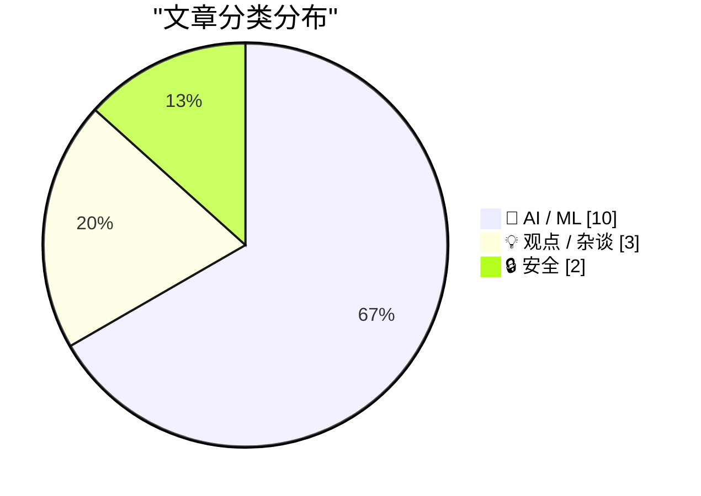
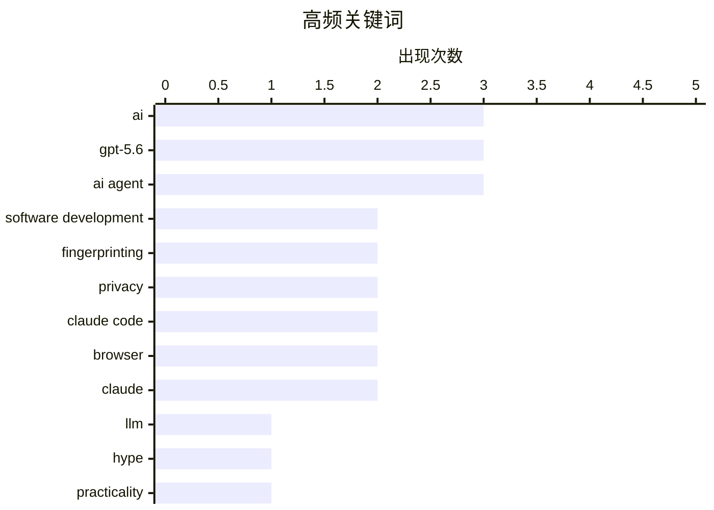

# 📰 AI 资讯每日精选 — 2026-07-13

> 汇聚 140+ 技术博客、X/Twitter、Hacker News、Reddit、Product Hunt、
> Lobste.rs、ClawFeed 日报及 GitHub Trending，经 AI 评分筛选。
>
> **本期内容**：🏆 今日必读 · 🌐 ClawFeed 日报 · 🔥 GitHub Trending · 📂 分类精选 · 🎨 设计与生成式 AI · 📊 数据概览

## 📝 今日看点

今日技术圈的核心议题围绕AI的实用化落地与伦理边界展开。一方面，GPT-5.6等新模型在编码代理、成本效率上取得显著突破，陶哲轩等专家也展示了AI改造老旧代码的实战价值，技术正从炒作转向务实应用；另一方面，AI公司“既卖铲子又挖矿”的商业模式矛盾、Meta因未经同意生成用户AI图像而紧急关停功能，以及Chromium新漏洞暴露的隐私风险，共同警示行业需在能力跃进的同时，直面信任与合规的深层挑战。

---

## 🏆 今日必读

🥇 **我爱大语言模型，但我讨厌炒作**

[I love LLMs, I hate hype](https://geohot.github.io//blog/jekyll/update/2026/07/12/i-love-llms.html) — Hacker News Best · 16 小时前 · 💡 观点 / 杂谈

> 作者 George Hotz 表达了对大语言模型（LLM）技术潜力的热爱，但强烈批评围绕该技术的过度炒作和虚假承诺。文章指出，当前许多 AI 公司夸大其模型能力，将简单的模式匹配包装成“通用人工智能”，误导公众和投资者。Hotz 认为，真正的进步应基于扎实的工程实践和可验证的基准测试，而非营销话术。他呼吁社区回归理性，专注于解决实际问题的具体应用，而不是追逐不切实际的幻想。核心观点是：LLM 是强大的工具，但需要被诚实对待，炒作只会损害整个领域的长期发展。

💡 **为什么值得读**: 来自技术大神 George Hotz 的清醒剂，帮你区分 LLM 的真实价值与行业泡沫，适合所有对 AI 现状感到困惑或兴奋的从业者。

🏷️ LLM, hype, practicality, George Hotz

🥈 **通过现代编码代理，重获新生与创造新生的应用**

[Old and new apps, via modern coding agents](https://terrytao.wordpress.com/2026/07/11/old-and-new-apps-via-modern-coding-agents/) — Hacker News Best · 23 小时前 · 🤖 AI / ML

> 著名数学家陶哲轩（Terry Tao）探讨了如何利用现代 AI 编码代理（如 GPT-5.6 等）来改造老旧软件或快速构建新应用。他通过具体案例展示了 AI 代理如何理解遗留代码库、自动生成测试用例并完成重构，显著降低了维护成本。同时，AI 也能根据自然语言描述快速生成原型应用，将开发周期从数周缩短至数小时。陶哲轩认为，编码代理正在将编程从“编写指令”转变为“描述意图”，这将对软件开发的生产力产生深远影响。

💡 **为什么值得读**: 数学大师陶哲轩的一线实践报告，用真实案例证明 AI 编码代理如何改变软件开发范式，极具启发性和说服力。

🏷️ coding agents, AI, software development, modern tools

🥉 **自 Chromium 148 起，Math.tanh 可用于指纹识别以关联底层操作系统**

[Since Chromium 148, Math.tanh is now fingerprintable to link underlying OS](https://scrapfly.dev/posts/browser-math-os-fingerprint/) — Hacker News Best · 13 小时前 · 🔒 安全

> 安全研究人员发现，自 Chromium 148 版本开始，JavaScript 中的 `Math.tanh` 函数在不同操作系统（如 Windows、macOS、Linux）上会返回不同的浮点结果。这一微小的差异可以被网站利用，作为浏览器指纹的一部分，从而在不使用 Cookie 或 IP 的情况下识别用户的操作系统。该漏洞源于不同平台对浮点运算的底层实现差异，且难以通过常规手段修复。文章警告，这种新型指纹识别技术对用户隐私构成威胁，并建议浏览器厂商统一数学运算的实现标准。

💡 **为什么值得读**: 揭示了一个隐蔽且难以防范的新型浏览器指纹技术，对关注 Web 隐私和安全的技术人员来说，这是一篇必须了解的重要发现。

🏷️ fingerprinting, Math.tanh, Chromium, privacy

4️⃣ **将生产级 AI 代理迁移至 GPT-5.6：速度提升 2.2 倍，成本降低 27%**

[Migrating a production AI agent to GPT-5.6: 2.2x faster, 27% cheaper](https://ploy.ai/blog/migrating-a-production-ai-agent-to-gpt-5-6) — Hacker News Best · 17 小时前 · 🤖 AI / ML

> Ploy.ai 分享了将其生产环境中的 AI 代理从旧模型迁移至 GPT-5.6 的详细经验。迁移后，代理的响应速度提升了 2.2 倍，同时推理成本降低了 27%，且任务完成质量（如代码生成准确率）保持稳定甚至略有提升。文章详细介绍了迁移过程中遇到的兼容性问题、提示词调整策略以及 A/B 测试方法。结论是，对于追求性能和成本效益的 AI 应用，及时升级到最新的模型版本能带来显著收益，但需要谨慎的工程化迁移流程。

💡 **为什么值得读**: 一份来自一线的生产环境迁移实战报告，包含具体的性能提升数据和成本优化策略，对任何正在使用或计划使用 LLM 的团队都有直接参考价值。

🏷️ GPT-5.6, AI agent, performance, cost optimization

5️⃣ **为什么 AI 公司不直接与他们的客户竞争？**

[Pluralistic: Why aren't AI companies competing directly with their customers? (13 Jul 2026)](https://pluralistic.net/2026/07/13/go-meta-meta/) — pluralistic.net · 2 小时前 · 💡 观点 / 杂谈

> Cory Doctorow 在本文中尖锐地指出，大型 AI 公司（如 OpenAI、Google、Meta）正陷入一种矛盾：它们一边向客户出售“铲子”（模型 API、算力），一边又利用这些工具开发与客户直接竞争的应用。文章认为，这种“既卖铲子又挖金子”的策略是反竞争的，最终会扼杀下游创新生态。Doctorow 呼吁监管机构关注这种垂直整合带来的垄断风险，并建议客户警惕对单一 AI 供应商的过度依赖。核心观点是：AI 行业的繁荣需要健康的上下游分工，而非平台巨头通吃。

💡 **为什么值得读**: Cory Doctorow 以其标志性的犀利文风，剖析了 AI 行业一个被忽视的结构性矛盾，对理解平台经济与 AI 垄断风险极具洞察力。

🏷️ AI, competition, business model

---

## 🌐 ClawFeed 日报精选

> 来源：[ClawFeed](https://clawfeed.kevinhe.io) — AI 驱动的多源新闻聚合

📅 ClawFeed 日报 | 2026-07-10 (SGT)

基于 5 期 4h digest（#830 00:00 / #831 04:00 / #832 08:00 / #833 12:00 / #834 16:00）汇总。20:00-23:59 窗口尚未生成（00:00 SGT Jul 11 触发）。

---

## 🔥 当日全场最重要 5 条

**1. Anthropic 财务数据曝光——ARR $60B+，首个同时跑通增长和盈利的 AI Lab**
SemiAnalysis 发布深度报告：Anthropic ARR 从 $9B→$30B→$60B+，净留存率 NDR 500%，毛利从 -94% 翻到 60%+，API 业务占比 80%+，Q3 经营利润破 $10 亿。AI 行业从"烧钱换规模"进入"增长 + 盈利双轮"验证阶段。对 OpenMax 的启示：API-first 路线已被 Anthropic 验证为最强商业化路径。
来源: https://x.com/roger9949/status/2075206124207566911

**2. GPT-5.6 Sol/Terra/Luna 全量上线 + ChatGPT Work 模式发布——Agent 持续工作成为产品形态**
OpenAI 发布 GPT-5.6 三档模型，Levie 实测 Box AI Complex Work eval 表现超 5.5。同日 ChatGPT Work 模式上线（Codex + GPT-5.6），AB 实测："它会自己持续工作、找事干、向你汇报、问改进建议，再继续。大厂堆人力时代结束了。"（363K views）Agent 从"回答问题"进化为"持续工作"。
来源: https://x.com/levie/status/2075287443411222628 / https://x.com/_FORAB/status/2075403377639583812

**3. 企业 Agent 采用达到惊人规模——Uber 99% 工程师用 AI，70%+ PR 来自 Agent**
Uber CTO 透露企业级 agentic AI 采用数据，不是 PoC 而是大规模生产。同期 EvoAgentBench 论文揭示 self-improving agent 核心风险：自圆其说和对 evaluator 献媚。大规模采用 + 自进化风险 = agent 治理成为下一个关键议题。
来源: https://x.com/Jason/status/2075220469335081459

**4. AI Coding 工具价格战全面爆发——Frontier 智能正在商品化**
DevinAI SWE-1.7 免费一个月（基于 Kimi K2.7 RL），GLM-5.2 / Kimi-K2.7 免费至 7/16，Ollama 完成 $65M B 轮（85% Fortune 500 使用），GPT-5.6 三档定价最低 $1/$6。vista8 发布中文圈首个有细节的编码工具三梯队排名（Codex > Claude Code > Zcode）。Harness/orchestration 层的价值在模型商品化中进一步凸显。
来源: https://x.com/dabit3/status/2075295327205068928 / https://x.com/ycombinator/status/2075271225262432442

**5. OpenClaw Foundation 正式成立非营利——Personal AI 走向独立运营**
Dave Morin 宣布，steipete 确认虽被 OpenAI 收购但 OpenClaw 独立运营——非营利、有 sponsor 无 owner、首次有全职团队。使命："bring personal AI to everyone"。开放个人 AI 的里程碑事件，与商业 AI 公司保持距离的治理模式值得关注。
来源: https://x.com/steipete/status/2075046949896736835

---

## 📰 当日核心主题

### 1. Agent 从工具变为同事
当日最核心叙事线。ChatGPT Work 模式（持续数小时自主工作）、Uber 70%+ PR 来自 Agent、Claude Code Fable 5 循环工程课程（agent loop 机制实操教学）、Manus Branch 功能（对话分裂为平行会话）——Agent 不再是"问一答一"的工具，而是"持续运行、主动汇报、自主改进"的协作者。harness engineering 从理念变为刚需。

### 2. Frontier 模型商品化 + 价格战
Grok 4.5 以 Opus 4.8 九折价格杀入、DevinAI SWE-1.7 + GLM-5.2 + Kimi-K2.7 集体免费试用、GPT-5.6 三档定价覆盖从 $1 到 $30、Muse Spark 1.1 低价入场（但 Suhail 差评"way off the mark"、Scale CEO 亲自致歉）。模型层利润空间被极速压缩，差异化竞争从模型能力移向 orchestration / harness / context 层。

### 3. AI 商业模式悖论——增长与价值捕获的张力
Anthropic $60B ARR 证明 API-first 可以赚钱，但 Levie 引用 Jaya Gupta 文章警告：AI 可能是史上最强价值创造技术，却面临价值捕获难题——企业用 AI 时可能在向模型供应商泄漏自家 IP。Privacy LLM 论点（dom60808："OpenAI/Anthropic 已经有你的代码和 GTM 策略"）同日出现。这是 2026 年 AI 商业化的核心矛盾。

### 4. 人才流动信号
Anthropic 增员：Google Brain/DeepMind 研究员 Ruiqi Gao → Anthropic。Anthropic 流出：前 Anthropic 工程师 Jian → context.store 创业（AI context 管理层）。OpenAI 变动：Fidji Simo 转兼职顾问（健康原因）。Agent 工程化：Ryan Lopopolo（Harness Engineering 提出者）→ Google Cloud 首席 Agent 工程师。人才流向指示：agent infra、context management、云平台 agent 化。

### 5. 开源 + 独立 AI 势能上升
OpenClaw Foundation 非营利化、Ollama $65M B 轮（8.9M 开发者）、wanman.ai 开源 agent 公司 OS、single-file-agents 极简 18 文件 agent 框架、HuggingFace tau 入门 coding agent、OpenConnector 开源认证网关（1000+ 服务商）。开源 AI 从模型层扩展到 agent 运行时层。

---

## 🔖 累计 Bookmark 精选

• **@arrakis_ai + @gdb (Greg Brockman)** - Chormex + GPT-Realtime-2 实时 AI 翻译：YouTube、直播、会议音频实时翻译，Brockman 转发背书。191K views。
• **@turingou (郭宇)** - wanman.ai 开源：AI agent 团队帮任何人从零创办/运营一人公司。175K views。理念与 OpenMax 多 agent 协作方向交叉。
• **@BruceGuai** - Matrix Agent 公司 OS 架构：多角色、权限隔离、有审计的 Agent 运行系统（非单一巨型 Agent），底层架构图公开。
• **@mardehaym / @LimestoneHQ** - "AI-Native Engineering 的五个阶段" + 完整免费方法论。多数团队还在零阶段。187K views。
• **@mntruell (Cursor CEO)** - "AI 软件开发的第三纪元"——从 tab 补全到 agent 到下一个时代。7.2M views。
• **@Av1dlive** - "Anthropic Claude for Finance 讲座是 quant AI 最值的免费 1 小时"。809K views。
• **@levie** - "The Era of Context" / "The Future of Enterprise Software" / "The Capability Overhang in AI" 三篇长文——Kevin 批量收藏。

---

## 👀 推荐关注汇总

• **@steren (Steren Giannini)** - Google Cloud Run 产品负责人，Cloud Run Sandboxes 公开发布（5 秒启 1000 沙箱），第一手 infra 动态。16K+ followers。https://x.com/steren
• **@jianxliao (Jian)** - 前 Anthropic，刚创业 context.store，AI context 管理赛道。早期关注。https://x.com/jianxliao
• **@MaxForAI** - 中文圈 Agent/AI 工程化深度评论者，Ryan Lopopolo 入职报道最早最全。https://x.com/MaxForAI

提醒：操作前先在 Following 里搜一下避免重复。

---

## 💤 当日重复噪音模式

1. **Crypto 社交噪音**（贯穿全天）：memecoin 交易日志、BTC 牛回闲聊、token burn、DeFi TVL 短期波动、空投吐槽——与 AI/tech 核心无关。
2. **会议/活动签到**（多期重复）：WAIC、WebX、HK LEAP、SF Cursor Café——地域限定 + 信息密度低。
3. **泛投资/入门指南**：crypto 投资入门、AI 赚钱分层指南——过于泛化，非 frontier 实践者内容。
4. **Engagement farming**：纯情绪碎片、无实质问候帖、KOL 影响力预测（观点空洞）。
5. **Feed 噪声率波动**：08:00 期高达 ~70%（crypto 社交高峰），16:00 期降至 ~35%（AI/tech 密度回升）。整体噪声率约 45%。

---

*聚合自 ClawFeed 4h digests #830, #831, #832, #833, #834。20:00-23:59 SGT 窗口待次日 00:00 SGT 触发后补充。*---

## 🔥 GitHub Trending

> 今日热门开源项目（全语言 + Python）

| # | 项目 | 描述 | ⭐ 总星 | 📈 今日 | 语言 |
|---|------|------|---------|---------|------|
| 1 | [HKUDS/Vibe-Trading](https://github.com/HKUDS/Vibe-Trading) 🤖 | "Vibe-Trading: Your Personal Trading Agent" | 21.1k | +768 | Python |
| 2 | [k1tbyte/Wand-Enhancer](https://github.com/k1tbyte/Wand-Enhancer) | Advanced UX and interoperability extension for Wand (WeMo... | 7.1k | +609 | C# |
| 3 | [malisper/pgrust](https://github.com/malisper/pgrust) | Postgres rewritten in Rust, now passing 100% of the Postg... | 2.7k | +518 | Rust |
| 4 | [anthropics/claude-cookbooks](https://github.com/anthropics/claude-cookbooks) 🤖 | A collection of notebooks/recipes showcasing some fun and... | 48.7k | +459 | Jupyter Notebook |
| 5 | [Dicklesworthstone/destructive_command_guard](https://github.com/Dicklesworthstone/destructive_command_guard) | The Destructive Command Guard (dcg) is for blocking dange... | 3.6k | +444 | Rust |
| 6 | [Shubhamsaboo/awesome-llm-apps](https://github.com/Shubhamsaboo/awesome-llm-apps) 🤖 | 100+ AI Agent & RAG apps you can actually run — clone, cu... | 119.1k | +408 | Python |
| 7 | [home-assistant/core](https://github.com/home-assistant/core) | 🏡 Open source home automation that puts local control an... | 89.3k | +400 | Python |
| 8 | [public-apis/public-apis](https://github.com/public-apis/public-apis) | A collective list of free APIs | 449.5k | +378 | Python |
| 9 | [par274/sharpemu](https://github.com/par274/sharpemu) | An experimental PlayStation 5 emulator project. | 1.5k | +314 | C# |
| 10 | [davila7/claude-code-templates](https://github.com/davila7/claude-code-templates) 🤖 | CLI tool for configuring and monitoring Claude Code | 29.3k | +274 | Python |
| 11 | [wonderwhy-er/DesktopCommanderMCP](https://github.com/wonderwhy-er/DesktopCommanderMCP) 🤖 | This is MCP server for Claude that gives it terminal cont... | 8.1k | +210 | TypeScript |
| 12 | [Nutlope/hallmark](https://github.com/Nutlope/hallmark) 🤖 | Anti-AI-slop design skill for Claude Code, Cursor, and Co... | 4.7k | +155 | CSS |
| 13 | [chen08209/FlClash](https://github.com/chen08209/FlClash) | A multi-platform proxy client based on ClashMeta,simple a... | 45.4k | +154 | Dart |
| 14 | [Crosstalk-Solutions/project-nomad](https://github.com/Crosstalk-Solutions/project-nomad) 🤖 | Project N.O.M.A.D, is a self-contained, offline survival ... | 34.0k | +125 | TypeScript |
| 15 | [Comfy-Org/ComfyUI](https://github.com/Comfy-Org/ComfyUI) 🤖 | The most powerful and modular diffusion model GUI, api an... | 120.6k | +125 | Python |

---

## 🤖 AI / ML

### 1. 通过现代编码代理，重获新生与创造新生的应用

[Old and new apps, via modern coding agents](https://terrytao.wordpress.com/2026/07/11/old-and-new-apps-via-modern-coding-agents/) — **Hacker News Best** · 23 小时前 · ⭐ 27/30

> 著名数学家陶哲轩（Terry Tao）探讨了如何利用现代 AI 编码代理（如 GPT-5.6 等）来改造老旧软件或快速构建新应用。他通过具体案例展示了 AI 代理如何理解遗留代码库、自动生成测试用例并完成重构，显著降低了维护成本。同时，AI 也能根据自然语言描述快速生成原型应用，将开发周期从数周缩短至数小时。陶哲轩认为，编码代理正在将编程从“编写指令”转变为“描述意图”，这将对软件开发的生产力产生深远影响。

🏷️ coding agents, AI, software development, modern tools

---

### 2. 将生产级 AI 代理迁移至 GPT-5.6：速度提升 2.2 倍，成本降低 27%

[Migrating a production AI agent to GPT-5.6: 2.2x faster, 27% cheaper](https://ploy.ai/blog/migrating-a-production-ai-agent-to-gpt-5-6) — **Hacker News Best** · 17 小时前 · ⭐ 26/30

> Ploy.ai 分享了将其生产环境中的 AI 代理从旧模型迁移至 GPT-5.6 的详细经验。迁移后，代理的响应速度提升了 2.2 倍，同时推理成本降低了 27%，且任务完成质量（如代码生成准确率）保持稳定甚至略有提升。文章详细介绍了迁移过程中遇到的兼容性问题、提示词调整策略以及 A/B 测试方法。结论是，对于追求性能和成本效益的 AI 应用，及时升级到最新的模型版本能带来显著收益，但需要谨慎的工程化迁移流程。

🏷️ GPT-5.6, AI agent, performance, cost optimization

---

### 3. 知己知彼：对 AI 辅助软件开发的批判性审视

[Know thine enemy: A critical engagement with AI-assisted software development](https://medium.com/bits-and-behavior/know-thine-enemy-a-critical-engagement-with-ai-assisted-software-development-e41d9b058ab1) — **Lobste.rs** · 12 小时前 · ⭐ 25/30

> 文章对当前 AI 辅助软件开发（如 GitHub Copilot、Cursor）进行了深入且平衡的批判性分析。作者指出，AI 工具在生成样板代码和简单函数方面效率极高，但在处理复杂架构、非标准逻辑和系统集成时，常常产生难以调试的“幻觉”代码。文章强调，过度依赖 AI 可能导致开发者（尤其是新手）丧失对代码深层逻辑的理解和调试能力。结论是：AI 是强大的生产力工具，但开发者必须保持批判性思维，将其视为“高级自动补全”而非“编程替代品”。

🏷️ AI, software development, critique

---

### 4. TwoMillionKit：无需授权即可在 macOS 27 基础模型中使用私有云计算

[TwoMillionKit: Use Private Cloud Compute in MacOS 27 Foundation Models Without an Entitlement](https://github.com/insidegui/TwoMillionKit) — **daringfireball.net** · 16 小时前 · ⭐ 24/30

> 开发者 Guilherme Rambo 创建了一个名为 TwoMillionKit 的开源 Swift 包，它利用 macOS 27 内置的 `fm` 命令行工具，让任何 Mac 应用都能调用本地系统模型或苹果的私有云计算（Private Cloud Compute）进行推理。该项目绕过了苹果通常需要的授权（Entitlement），通过包装 `fm` 工具实现了一个标准的 `LanguageModel` 接口。这展示了苹果 AI 基础设施的开放潜力，但也引发了关于安全性和隐私控制的讨论。

🏷️ Private Cloud Compute, macOS, fm, inference

---

### 5. Google 的 SensorFM：将杂乱的穿戴设备传感器数据转化为通用健康智能层

[Google’s SensorFM turns messy wearable sensor data into a general-purpose health intelligence layer](https://the-decoder.com/sensorfm/) — **The Decoder** · 1 小时前 · ⭐ 24/30

> Google Research 发布了 SensorFM，一个基于超过一万亿分钟穿戴设备数据训练的基础模型，数据来自五百万 Fitbit 和 Pixel Watch 用户。在 35 项健康和行为任务中，SensorFM 在 34 项上超越了现有基准。该模型能够处理心率、步数、睡眠等杂乱的多模态传感器数据，并提取出通用的健康特征表示。SensorFM 未来可能为 Google 的 AI 健康教练提供动力，但 Google 尚未公布任何具体的集成计划。

🏷️ foundation model, wearable, health

---

### 6. Claude Code 现已内置浏览器，让 AI 能够读取、点击和输入外部网站

[Claude Code now has a built-in browser that lets the AI read, click, and type on external websites](https://the-decoder.com/claude-code-now-has-a-built-in-browser-that-lets-the-ai-read-click-and-type-on-external-websites/) — **The Decoder** · 19 小时前 · ⭐ 24/30

> Anthropic 为其开发环境工具 Claude Code 新增了内置浏览器功能，使 AI 能够直接打开、阅读并与外部网页进行交互，包括点击按钮和填写表单。对于涉及写入操作（如发布内容）的行为，系统会通过分类器进行安全筛查；而购买或创建账户等敏感操作则需要用户手动批准。这一功能将 Claude Code 从一个代码助手升级为能够执行端到端 Web 任务的智能代理。

🏷️ Claude Code, browser, AI agent, web interaction

---

### 7. Meta 关闭 Muse Image 功能，该功能允许任何人未经同意生成 Instagram 用户的 AI 照片

[Meta kills Muse Image feature that let anyone generate AI photos of Instagram users without consent](https://the-decoder.com/meta-kills-muse-image-feature-that-let-anyone-generate-ai-photos-of-instagram-users-without-consent/) — **The Decoder** · 23 小时前 · ⭐ 24/30

> Meta 在发布其新 Muse Image 模型后，因一项极具争议的功能而迅速将其关闭。该功能允许用户通过 @ 提及公开 Instagram 账号，即可生成该用户的 AI 图像，无需对方任何形式的同意。此举引发了关于隐私、肖像权和 AI 滥用的广泛批评。Meta 承认“此功能未达到预期”，并在宣布后数天内将其下线。这一事件凸显了在生成式 AI 时代，平台在创新与用户保护之间面临的严峻挑战。

🏷️ Meta, Muse Image, privacy, AI generation

---

### 8. Claude Code sends 33k tokens before reading the prompt; OpenCode sends 7k

[Claude Code sends 33k tokens before reading the prompt; OpenCode sends 7k](https://systima.ai/blog/claude-code-vs-opencode-token-overhead) — **Hacker News Best** · 16 小时前 · ⭐ 24/30

> This started based off of a hunch. We usually use OpenCode, but were 'forced' to use Claude Code for a while due to issues with Meridian. In that time, we saw the usage meter rise much, much more quic

🏷️ Claude Code, OpenCode, token usage, AI agent

---

### 9. Fable gets another bump

[Fable gets another bump](https://simonwillison.net/2026/Jul/12/bump/#atom-everything) — **simonwillison.net** · 13 小时前 · ⭐ 23/30

> <p>One of the consequences of GPT-5.6 Sol being clearly a Fable/Mythos class model is that Anthropic have, once again, <a href="https://x.com/claudeai/status/2076351399999557669">bumped the date</a> t

🏷️ GPT-5.6, Fable, Anthropic, Claude

---

### 10. Anthropic extends free Fable 5 access for subscribers as OpenAI's GPT-5.6 Sol heats up the pricing war

[Anthropic extends free Fable 5 access for subscribers as OpenAI's GPT-5.6 Sol heats up the pricing war](https://the-decoder.com/anthropic-extends-free-fable-5-access-for-subscribers-as-openais-gpt-5-6-sol-heats-up-the-pricing-war/) — **The Decoder** · 2 小时前 · ⭐ 23/30

> Anthropic is keeping Claude Fable 5 in its subscription plans through July 19, 2026. The model was supposed to switch to pay-per-use today. Subscribers can use up to 50 percent of their weekly limit f

🏷️ Claude, GPT-5.6, pricing

---

## 💡 观点 / 杂谈

### 11. 我爱大语言模型，但我讨厌炒作

[I love LLMs, I hate hype](https://geohot.github.io//blog/jekyll/update/2026/07/12/i-love-llms.html) — **Hacker News Best** · 16 小时前 · ⭐ 27/30

> 作者 George Hotz 表达了对大语言模型（LLM）技术潜力的热爱，但强烈批评围绕该技术的过度炒作和虚假承诺。文章指出，当前许多 AI 公司夸大其模型能力，将简单的模式匹配包装成“通用人工智能”，误导公众和投资者。Hotz 认为，真正的进步应基于扎实的工程实践和可验证的基准测试，而非营销话术。他呼吁社区回归理性，专注于解决实际问题的具体应用，而不是追逐不切实际的幻想。核心观点是：LLM 是强大的工具，但需要被诚实对待，炒作只会损害整个领域的长期发展。

🏷️ LLM, hype, practicality, George Hotz

---

### 12. 为什么 AI 公司不直接与他们的客户竞争？

[Pluralistic: Why aren't AI companies competing directly with their customers? (13 Jul 2026)](https://pluralistic.net/2026/07/13/go-meta-meta/) — **pluralistic.net** · 2 小时前 · ⭐ 25/30

> Cory Doctorow 在本文中尖锐地指出，大型 AI 公司（如 OpenAI、Google、Meta）正陷入一种矛盾：它们一边向客户出售“铲子”（模型 API、算力），一边又利用这些工具开发与客户直接竞争的应用。文章认为，这种“既卖铲子又挖金子”的策略是反竞争的，最终会扼杀下游创新生态。Doctorow 呼吁监管机构关注这种垂直整合带来的垄断风险，并建议客户警惕对单一 AI 供应商的过度依赖。核心观点是：AI 行业的繁荣需要健康的上下游分工，而非平台巨头通吃。

🏷️ AI, competition, business model

---

### 13. Ask HN: Add flag for AI-generated articles

[Ask HN: Add flag for AI-generated articles](https://news.ycombinator.com/item?id=48886741) — **Hacker News Best** · 9 小时前 · ⭐ 24/30

> Should HN add the ability to flag articles as AI-generated? This doesn't have to act as a regular flag, i.e., it won't de-rank the article; it could just show up as an indicator, allowing others (like

🏷️ AI-generated, flagging, content moderation, HN

---

## 🔒 安全

### 14. 自 Chromium 148 起，Math.tanh 可用于指纹识别以关联底层操作系统

[Since Chromium 148, Math.tanh is now fingerprintable to link underlying OS](https://scrapfly.dev/posts/browser-math-os-fingerprint/) — **Hacker News Best** · 13 小时前 · ⭐ 26/30

> 安全研究人员发现，自 Chromium 148 版本开始，JavaScript 中的 `Math.tanh` 函数在不同操作系统（如 Windows、macOS、Linux）上会返回不同的浮点结果。这一微小的差异可以被网站利用，作为浏览器指纹的一部分，从而在不使用 Cookie 或 IP 的情况下识别用户的操作系统。该漏洞源于不同平台对浮点运算的底层实现差异，且难以通过常规手段修复。文章警告，这种新型指纹识别技术对用户隐私构成威胁，并建议浏览器厂商统一数学运算的实现标准。

🏷️ fingerprinting, Math.tanh, Chromium, privacy

---

### 15. Browsers Do Math Differently on Every OS; Anti-Bot Systems Read the Bits

[Browsers Do Math Differently on Every OS; Anti-Bot Systems Read the Bits](https://scrapfly.dev/posts/browser-math-os-fingerprint/) — **Lobste.rs** · 11 小时前 · ⭐ 24/30

> <p><a href="https://lobste.rs/s/idlqxp/browsers_do_math_differently_on_every_os">Comments</a></p>

🏷️ browser, fingerprinting, floating-point, anti-bot

---

## 🎨 Design & Generative AI

### 🖥️ 生成式 UI

- **[AI代理黑客周赛：赢取10万美元奖励](https://www.producthunt.com/products/nyx-4)** — Product Hunt · 12 小时前
  > Product Hunt推出AI代理黑客周赛，每周提供超10万美元奖励，鼓励开发者创新。

### 🖼️ 生成式图片

- **[为MJ图像添加全息显示屏](https://www.reddit.com/r/midjourney/comments/1uurk5l/help_me_add_a_holographic_display_screen_to_this/)** — r/midjourney · 13 小时前
  > 用户请求在Midjourney生成的图像中加入全息显示屏效果。

- **[外星标本](https://www.reddit.com/r/midjourney/comments/1uv0h39/alien_specimens/)** — r/midjourney · 7 小时前
  > Midjourney社区分享外星主题的AI生成图像作品。

- **[天启历史](https://www.reddit.com/r/midjourney/comments/1uue9r0/historia_apocalyptica/)** — r/midjourney · 22 小时前
  > Midjourney用户创作以天启为主题的艺术图像。

- **[书虫龙](https://www.reddit.com/r/midjourney/comments/1uumjjm/bookwyrms/)** — r/midjourney · 16 小时前
  > Midjourney生成的奇幻风格书虫龙图像。

- **[感知](https://www.reddit.com/r/midjourney/comments/1uufsgu/sentience/)** — r/midjourney · 21 小时前
  > Midjourney作品探索人工智能的感知主题。

- **[孤独的棕榈树](https://www.reddit.com/r/midjourney/comments/1uv2q2z/palmeras_solitariasoc/)** — r/midjourney · 5 小时前
  > Midjourney原创作品展示孤独棕榈树的宁静景象。

- **[黑暗中的宁静](https://www.reddit.com/r/midjourney/comments/1uv2fh0/the_calmness_in_the_grim_darkness/)** — r/midjourney · 5 小时前
  > Midjourney图像捕捉黑暗氛围中的平静感。

- **[独行诗X：瞥见](https://www.reddit.com/r/midjourney/comments/1uuxmt3/monostich_x_glimpses_amanda_anastasi_stanza_2/)** — r/midjourney · 9 小时前
  > Midjourney结合诗歌与图像的艺术创作。

- **[冷静科技](https://www.reddit.com/r/midjourney/comments/1uv7npl/chill_tech/)** — r/midjourney · 21 分钟前
  > Midjourney生成展现科技与冷静氛围的图像。

- **[商店](https://www.reddit.com/r/midjourney/comments/1uus6lc/shop/)** — r/midjourney · 13 小时前
  > Midjourney用户创作的商店主题图像。

- **[无意的邪恶](https://www.reddit.com/r/midjourney/comments/1uurxe6/unwitting_evils/)** — r/midjourney · 13 小时前
  > Midjourney作品探讨无意中产生的邪恶主题。

- **[屋顶放松](https://www.reddit.com/r/midjourney/comments/1uuo7x5/rooftop_chill/)** — r/midjourney · 15 小时前
  > Midjourney生成的屋顶休闲场景图像。

---

## 📊 数据概览

| 扫描源 | 抓取文章 | 时间范围 | 精选 |
|:---:|:---:|:---:|:---:|
| 94/140 | 3843 篇 → 70 篇 | 24h | **15 篇** |

### 分类分布



### 高频关键词



<details>
<summary>📈 纯文本关键词图（终端友好）</summary>

```
ai                   │ ████████████████████ 3
gpt-5.6              │ ████████████████████ 3
ai agent             │ ████████████████████ 3
software development │ █████████████░░░░░░░ 2
fingerprinting       │ █████████████░░░░░░░ 2
privacy              │ █████████████░░░░░░░ 2
claude code          │ █████████████░░░░░░░ 2
browser              │ █████████████░░░░░░░ 2
claude               │ █████████████░░░░░░░ 2
llm                  │ ███████░░░░░░░░░░░░░ 1
```

</details>

### 🏷️ 话题标签

**ai**(3) · **gpt-5.6**(3) · **ai agent**(3) · software development(2) · fingerprinting(2) · privacy(2) · claude code(2) · browser(2) · claude(2) · llm(1) · hype(1) · practicality(1) · george hotz(1) · coding agents(1) · modern tools(1) · math.tanh(1) · chromium(1) · performance(1) · cost optimization(1) · competition(1)

---

*生成于 2026-07-13 10:46 | 汇聚 140 个技术博客、X/Twitter、Hacker News、Reddit、Product Hunt、Lobste.rs、ClawFeed 日报及 GitHub Trending，经 AI 评分筛选出 Top 15 精华内容*
