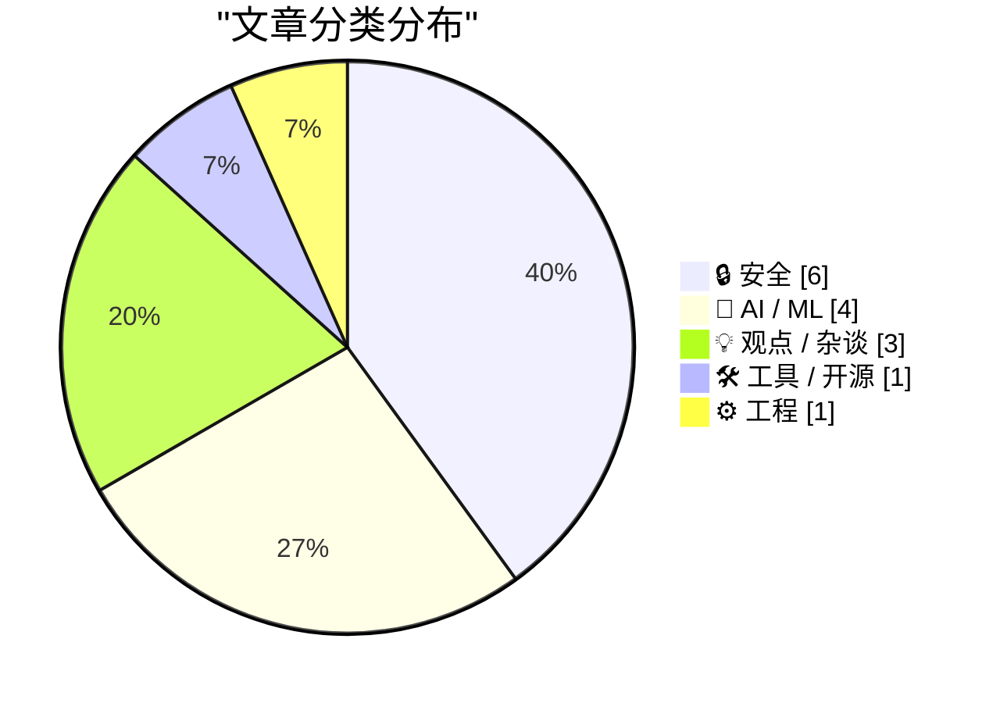
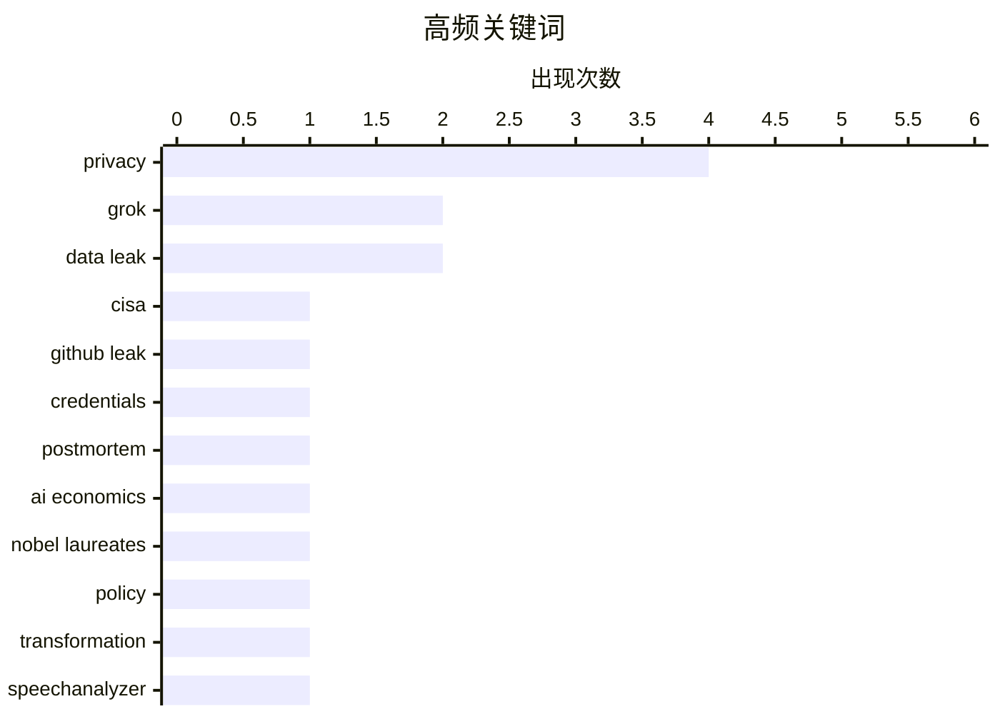

# 📰 AI 资讯每日精选 — 2026-07-14

> 汇聚 140+ 技术博客、X/Twitter、Hacker News、Reddit、Product Hunt、
> Lobste.rs、ClawFeed 日报及 GitHub Trending，经 AI 评分筛选。
>
> **本期内容**：🏆 今日必读 · 🌐 ClawFeed 日报 · 🔥 GitHub Trending · 📂 分类精选 · 🎨 设计与生成式 AI · 📊 数据概览

## 📝 今日看点

今日技术圈的核心议题集中在AI的失控风险与行业伦理冲突上：多位诺贝尔奖得主与AI领袖联合警告，AI对经济的颠覆性影响正以快于预期的速度逼近，而应对窗口正在关闭；与此同时，微软CEO纳德拉公开批评OpenAI和Anthropic在数据使用上的“双重标准”，引发关于知识蒸馏与公开数据合理使用的激烈争论。此外，安全领域接连爆出重大事件，CISA因承包商将政府密钥泄露至GitHub长达半年而发布教训报告，Telegram的短链接域名t.me也被暂停，凸显出数字基础设施的脆弱性。

---

## 🏆 今日必读

🥇 **从CISA近期GitHub泄露事件中汲取的教训**

[Lessons Learned from CISA’s Recent GitHub Leak](https://krebsonsecurity.com/2026/07/lessons-learned-from-cisas-recent-github-leak/) — krebsonsecurity.com · 16 小时前 · 🔒 安全

> 美国网络安全和基础设施安全局（CISA）发布了一份关于数据泄露的事后调查报告，一名承包商将包括AWS Govcloud密钥在内的数十个内部凭证，公开发布在公共GitHub仓库中近六个月，直到被KrebsOnSecurity通知才发现。专家指出，CISA在初始响应中暴露的漏洞为所有安全团队提供了重要教训。该事件凸显了内部凭证管理、第三方承包商风险监控以及安全事件响应流程的严重缺失。核心结论是，组织必须建立自动化的凭证扫描和泄露检测机制，并缩短从泄露到发现的时间窗口。

💡 **为什么值得读**: 真实发生的政府级安全事件复盘，提供了可立即应用于企业安全实践的凭证泄露检测与响应教训。

🏷️ CISA, GitHub leak, credentials, postmortem

🥈 **诺贝尔奖得主与AI领袖警告：应对AI经济影响的窗口正在迅速关闭**

[Nobel laureates and AI leaders warn the window to prepare for AI's economic impact is closing fast](https://the-decoder.com/nobel-laureates-and-ai-leaders-warn-the-window-to-prepare-for-ais-economic-impact-is-closing-fast/) — The Decoder · 15 小时前 · 🤖 AI / ML

> 包括16位诺贝尔奖得主以及来自谷歌、OpenAI和Anthropic的代表在内的200多位经济学家和AI研究人员，联合发表声明呼吁立即采取行动。他们认为AI带来的变革可能超越工业革命，但发生速度却快得多。该声明并未提出具体措施，且现有研究尚未发现AI对劳动力市场产生显著影响。核心观点是，社会必须提前制定政策以应对AI可能引发的剧烈经济冲击，否则将措手不及。

💡 **为什么值得读**: 汇集了顶级经济学家和AI领袖的罕见共识，揭示了AI对就业和经济影响的紧迫性，但同时也指出了当前缺乏具体解决方案的困境。

🏷️ AI economics, Nobel laureates, policy, transformation

🥉 **苹果全新SpeechAnalyzer API基准测试：与Whisper及前代产品对比**

[Apple's new SpeechAnalyzer API, benchmarked against Whisper and its predecessor](https://get-inscribe.com/blog/apple-speech-api-benchmark.html) — Hacker News Best · 15 小时前 · 🤖 AI / ML

> 文章对苹果新发布的SpeechAnalyzer API进行了详细的基准测试，并将其与OpenAI的Whisper以及苹果前一代语音识别技术进行了对比。测试涵盖了不同口音、背景噪音和语速下的准确率、延迟和资源消耗。结果显示，SpeechAnalyzer API在特定场景下的准确率显著优于前代，但在某些复杂口音上仍不及Whisper。结论是，苹果的API在设备端推理和隐私保护方面具有优势，但通用性上仍有提升空间。

💡 **为什么值得读**: 提供了苹果最新语音API与行业标杆Whisper的硬核性能对比数据，对需要做语音技术选型的开发者极具参考价值。

🏷️ SpeechAnalyzer, Apple, Whisper, speech recognition

4️⃣ **Zig创始人直言不讳，批评Anthropic虚张声势**

[Zig Creator Calls Spade a Spade, Anthropic Blows Smoke](https://raymyers.org/post/zed-creator-calls-spade-a-spade/) — Hacker News Best · 22 小时前 · 💡 观点 / 杂谈

> Zig语言的创始人Andrew Kelley发表文章，严厉批评AI公司Anthropic在技术宣传上的不实之处。他指责Anthropic夸大其模型的能力，尤其是在代码生成和逻辑推理方面的表现，并认为这种“烟雾弹”式的宣传误导了开发者和公众。文章通过具体的技术案例，对比了Anthropic声称的能力与实际表现之间的差距。核心观点是，技术社区需要更诚实和严谨的评估标准，而不是被营销话术所左右。

💡 **为什么值得读**: 来自顶级系统编程语言创始人的尖锐批评，揭露了AI行业常见的过度宣传问题，对于保持技术判断力至关重要。

🏷️ Zig, Anthropic, criticism, AI safety

5️⃣ **每天数百篇论文涌向arXiv，但可能只有3篇与我的研究相关，所以我构建了一个开源工具来找到它们**

[Hundreds of papers hit arXiv every day and maybe 3 matter to my research, so I built an open-source tool that finds them [P]](https://www.reddit.com/r/MachineLearning/comments/1uvcdf7/hundreds_of_papers_hit_arxiv_every_day_and_maybe/) — r/MachineLearning · 17 小时前 · 🛠 工具 / 开源

> 一位机器学习研究者因每天花费30-60分钟浏览arXiv但95%的内容无关而开发了一款开源工具。该工具通过用户自定义的研究兴趣和关键词，从每日海量论文中精准筛选出最相关的几篇，并支持通过Telegram摘要或详细HTML页面两种方式推送。它解决了传统新闻通讯只推荐“热门”论文而忽略个人研究方向的痛点。核心价值在于将论文筛选时间从小时级缩短到分钟级，显著提升科研效率。

💡 **为什么值得读**: 直击AI研究者每天面对的信息过载痛点，提供了一个开源、可定制的解决方案，能极大提升文献筛选效率。

🏷️ arXiv, paper discovery, open-source, research tool

---

## 🌐 ClawFeed 日报精选

> 来源：[ClawFeed](https://clawfeed.kevinhe.io) — AI 驱动的多源新闻聚合

# ClawFeed 日报 | 2026-07-13 (Sun)

> 聚合 4 期 4h digest（#838 00:00 / #839 08:00 / #840 12:00 / #841 16:00 SGT）
> 素材总计：feed 123 + bookmarks 80（bookmarks 连续 4 期全重复）

---

## 🔥 当日全场 Top 5

1. **Anthropic 官方背书 "Fable 5 规划 + Sonnet 5 执行" 架构**——96% 的 Fable 5 性能只花 46% 的成本（BrowseComp 86.8% vs 90.8%）。"用最贵模型当顾问，执行全交给便宜模型"正式成为官方推荐的 agent 设计模式。[#841] 来源: https://x.com/LimestoneHQ/status/2076559490850165122

2. **Gemini 3.5 Pro 内测传闻全面超越 Fable 5 和 GPT-5.6**——据称谷歌内部私有评测 zero-shot 表现较 3.1 Pro 有跨越式突破，消息未经官方证实但已在中文 AI 圈刷屏。若属实，将打破 Anthropic/OpenAI 双寡头格局。[#841] 来源: https://x.com/oragnes/status/2076406013184671811

3. **Claude 官方延长 Fable 5 访问至 7/19 + Claude Code 周限额上调 50%**——10M views，对所有付费用户的直接利好。[#839] 来源: https://x.com/claudeai/status/2076351399999557669

4. **Satya Nadella《逆向信息悖论》刷屏全天**——企业用 AI"付两次钱"：一次现金，一次用机构知识（每个 prompt、每次纠正都在训练模型）。跨 4 期被不同博主反复引用讨论，当日传播最广的单一话题。[#838→#841 全天] 来源: https://x.com/mardehaym/status/2076336758908662206

5. **Citadel 创始人 Ken Griffin：AI 数周复现博士级量化研究员 6-8 周工作**——竞争护城河正在"以闪电速度"被填平。顶级对冲基金视角的 AI 冲击一线证言。10K views。[#839] 来源: https://x.com/Ariston_Macro/status/2076311728120558033

---

## 📰 当日核心主题

### 1. AI Agent 工程化加速成熟
当日最密集的技术话题。多个信号同时出现：
- **架构范式**：Anthropic 官方推 Fable 5+Sonnet 5 分层架构（规划/执行分离）
- **Skill 工程化**：Skillgrade 2.0（给 Agent Skills 写单元测试）+ 微软开源 SkillOpt（自动优化 SKILL.md prompt）
- **Agent 脚手架变薄**：Anthropic 高管分享 agent 开发范式演变，几个月前需大量流程控制代码，现在模型能力提升后越来越多交给模型自身
- **落地案例**：ChatCut（AI 剪辑 agent）、TREK（旅行规划器+MCP 150 tools）、agent-device（移动端自动化 CLI）、Hermes 外贸 WhatsApp 客服

### 2. Nadella "逆向信息悖论" 与企业 AI 知识产权焦虑
当日传播最广的单一概念。Satya Nadella 文章被 4 期 digest 反复引用（@mardehaym、@vasuman、@PANewsCN、@wlzh），核心洞察：企业每次使用 AI 都在向模型"泄漏"核心知识。呼应 Kenneth Arrow 的信息市场悖论。Thinking Machines Lab（Mira Murati 公司）同日发布的 AI 哲学宣言也在回应类似问题。

### 3. 模型竞争白热化 + 成本博弈
- Gemini 3.5 Pro 内测传闻（未证实）
- Fable 5 延期 + 限额上调（官方确认）
- DeepSeek v4 Pro vs Claude+Codex 成本对比：同等 token 量下 DeepSeek 反而更贵
- DevinX 上线多模型选择器（Sol/Fable 5/GLM/Kimi/Adaptive）

### 4. Crypto/DeFi 市场动态
- Robinhood Chain 24h 交易量超 ETH，Backpack 钱包接入，零手续费
- ETH 估值方法论辩论（安全结算层 vs P/E 模型）
- Pi Network 市值从 $20B 跌破 $10B
- Uniswap 日手续费 $520 万，仅次于 Tether/Circle
- 能源地缘冲突推高油价 4.5%，黄金/BTC 罕见同步下跌
- AI 微型企业/零工支付或推动稳定币 2033 年交易量达 $262B

### 5. AI 对知识工作的冲击辩论
两极观点同日碰撞：
- 看空方：Citadel Griffin "护城河以闪电速度被填平"；智谱唐杰 "AI 疯狂递归自我改进"
- 看多方：Aaron Levie "AI 不会消灭软件工作，反而加速增长"（经济学逻辑：成本降低→需求上升→更多产出→更多岗位，208K views）
- 中间派：玉伯论 AI 应用分类——效率类被大厂吞噬，效果类（帮企业赚钱）才是创业机会

---

## 🔖 Bookmarks 精选

本日 4 期 bookmarks（共 80 条）全部与往期重复，连续第 4 期无新增。固定池包括：
- Aaron Levie 系列（Era of Context / 未来企业软件 / 能力过剩）
- Harness Engineering 42%→78% 效率提升
- Cline Kanban、wanman.ai、Matrix Agent OS
- Cursor 第三时代、Google Stitch DESIGN.md
- Anthropic Finance breakdown、Chormex 实时翻译

**建议 Kevin 清理旧 bookmarks 或补充新收藏**——当前 bookmarks 池已无法提供增量信息。

---

## 👀 推荐关注汇总

4 期均未发现新的高质量未关注账号。

---

## 🧹 建议取关（去重汇总）

| 账号 | 理由 | 提及期数 |
|------|------|----------|
| @HeXiaobo (David.He) | 2018 年 7 月最后一条推文，僵尸号 7 年+ | #838-#841 连续 4 期 |
| @0xJasonBateman | 8 粉丝，最近原创 4 月 10 日（内容仅为数字"90"），与 AI/crypto 无关 | #841 |
| @Soft6161 (软萌子) | 近期以付费合作广告为主，内容与主线脱节 | #841 |

---

## 💤 当日重复噪音模式

| 模式 | 频率 | 说明 |
|------|------|------|
| Meme 币/抽奖/竞猜推广 | 每期 3-5 条 | MetaWin、OKX、Deepcoin、PredictFun 等 |
| GM/晚安/寒暄帖 | 每期 2-3 条 | 单字回复、鸭子图、无实质内容问候 |
| Elon Musk 非核心转发 | 每期 1-2 条 | SpaceX、播客应用、无文字视频 |
| 政治/体育/宗教内容 | 散发 | 与 AI/crypto 主线无关 |
| 付费推广/站台帖 | 每期 1-2 条 | KorProtocol、TripleT 等合作广告 |

**全天平均噪声率约 50%**，AI/crypto 信号密度中等，集中在 agent 工程化落地和模型成本/性能博弈两条主线。

---

*Generated by Lisa · ClawFeed Daily Digest Pipeline*
---

## 🔥 GitHub Trending

> 今日热门开源项目（全语言 + Python）

| # | 项目 | 描述 | ⭐ 总星 | 📈 今日 | 语言 |
|---|------|------|---------|---------|------|
| 1 | [Dicklesworthstone/destructive_command_guard](https://github.com/Dicklesworthstone/destructive_command_guard) | The Destructive Command Guard (dcg) is for blocking dange... | 3.9k | +1295 | Rust |
| 2 | [OpenCut-app/OpenCut](https://github.com/OpenCut-app/OpenCut) | The open-source CapCut alternative | 67.7k | +1229 | TypeScript |
| 3 | [HKUDS/Vibe-Trading](https://github.com/HKUDS/Vibe-Trading) 🤖 | "Vibe-Trading: Your Personal Trading Agent" | 22.2k | +1153 | Python |
| 4 | [Graphify-Labs/graphify](https://github.com/Graphify-Labs/graphify) 🤖 | AI coding assistant skill (Claude Code, Codex, OpenCode, ... | 85.2k | +1095 | Python |
| 5 | [Shubhamsaboo/awesome-llm-apps](https://github.com/Shubhamsaboo/awesome-llm-apps) 🤖 | 100+ AI Agent & RAG apps you can actually run — clone, cu... | 120.0k | +996 | Python |
| 6 | [Nutlope/hallmark](https://github.com/Nutlope/hallmark) 🤖 | Anti-AI-slop design skill for Claude Code, Cursor, and Co... | 5.5k | +794 | CSS |
| 7 | [github/spec-kit](https://github.com/github/spec-kit) | 💫 Toolkit to help you get started with Spec-Driven Devel... | 120.8k | +543 | Python |
| 8 | [hasaneyldrm/exercises-dataset](https://github.com/hasaneyldrm/exercises-dataset) | 1,324-exercise fitness dataset — animation GIFs, 180×180 ... | 12.9k | +451 | HTML |
| 9 | [public-apis/public-apis](https://github.com/public-apis/public-apis) | A collective list of free APIs | 449.9k | +359 | Python |
| 10 | [virattt/ai-hedge-fund](https://github.com/virattt/ai-hedge-fund) 🤖 | An AI Hedge Fund Team | 61.6k | +330 | Python |
| 11 | [coreyhaines31/marketingskills](https://github.com/coreyhaines31/marketingskills) 🤖 | Marketing skills for Claude Code and AI agents. CRO, copy... | 38.9k | +299 | JavaScript |
| 12 | [PrefectHQ/prefect](https://github.com/PrefectHQ/prefect) | Prefect is a workflow orchestration framework for buildin... | 23.3k | +254 | Python |
| 13 | [TauricResearch/TradingAgents](https://github.com/TauricResearch/TradingAgents) 🤖 | TradingAgents: Multi-Agents LLM Financial Trading Framework | 92.9k | +245 | Python |
| 14 | [practical-tutorials/project-based-learning](https://github.com/practical-tutorials/project-based-learning) | Curated list of project-based tutorials | 273.2k | +179 | Python |
| 15 | [simonlin1212/TradingAgents-astock](https://github.com/simonlin1212/TradingAgents-astock) 🤖 | A股多Agent投研框架 — 适配A股数据源(龙虎榜/游资/解禁等)，7位分析师基于A股规则的辩论决策，基于Tra... | 2.2k | +179 | Python |

---

## 🔒 安全

### 1. 从CISA近期GitHub泄露事件中汲取的教训

[Lessons Learned from CISA’s Recent GitHub Leak](https://krebsonsecurity.com/2026/07/lessons-learned-from-cisas-recent-github-leak/) — **krebsonsecurity.com** · 16 小时前 · ⭐ 26/30

> 美国网络安全和基础设施安全局（CISA）发布了一份关于数据泄露的事后调查报告，一名承包商将包括AWS Govcloud密钥在内的数十个内部凭证，公开发布在公共GitHub仓库中近六个月，直到被KrebsOnSecurity通知才发现。专家指出，CISA在初始响应中暴露的漏洞为所有安全团队提供了重要教训。该事件凸显了内部凭证管理、第三方承包商风险监控以及安全事件响应流程的严重缺失。核心结论是，组织必须建立自动化的凭证扫描和泄露检测机制，并缩短从泄露到发现的时间窗口。

🏷️ CISA, GitHub leak, credentials, postmortem

---

### 2. Telegram的t.me域名已被暂停

[Telegram's t.me domain has been suspended](https://www.whois.com/whois/t.me) — **Hacker News Best** · 11 小时前 · ⭐ 25/30

> 根据WHOIS查询记录，Telegram的短链接域名t.me已被暂停。该域名被广泛用于Telegram的分享链接、频道邀请和用户名跳转。暂停的具体原因尚未公布，但可能涉及域名注册商或监管机构的合规性审查。这一事件对依赖t.me链接进行传播的Telegram用户和频道运营者造成了直接影响。核心结论是，域名层面的风险可能随时导致关键服务的中断。

🏷️ Telegram, domain suspension, t.me, DNS

---

### 3. 洛杉矶警察局因公民自由与隐私担忧，终止与监控巨头Flock的合同

[LAPD lets contract with surveillance giant Flock expire](https://techcrunch.com/2026/07/13/lapd-lets-contract-with-surveillance-giant-flock-expire-citing-serious-concerns-over-civil-liberties-and-privacy/) — **Hacker News Best** · 16 小时前 · ⭐ 25/30

> 洛杉矶警察局（LAPD）决定不再续签与监控技术公司Flock的合同，理由是“对公民自由和隐私的严重担忧”。Flock以其自动车牌识别（ALPR）系统闻名，该系统被广泛用于追踪车辆行踪。LAPD的决策标志着美国大型执法机构对大规模监控技术的态度转变。核心观点是，在隐私和公共安全的天平上，公民自由正获得越来越多的权重。

🏷️ surveillance, privacy, LAPD, civil liberties

---

### 4. Grok uploaded my user directory to xAI's servers

[Grok uploaded my user directory to xAI's servers](https://twitter.com/a_green_being/status/2076598897779020159) — **Hacker News Best** · 17 小时前 · ⭐ 25/30

> Grok uploaded my user directory to xAI's servers

🏷️ Grok, privacy, data leak, xAI

---

### 5. Grok CLI uploaded the whole home directory to GCS

[Grok CLI uploaded the whole home directory to GCS](https://twitter.com/a_green_being/status/2076598897779020159) — **Hacker News Best** · 17 小时前 · ⭐ 25/30

> Grok CLI uploaded the whole home directory to GCS

🏷️ Grok, data leak, CLI, privacy

---

### 6. Samsung Health app threatens data deletion if users opt out AI training

[Samsung Health app threatens data deletion if users opt out AI training](https://neow.in/cWsyMTV3) — **Hacker News Best** · 11 小时前 · ⭐ 24/30

> Samsung Health app threatens data deletion if users opt out AI training

🏷️ Samsung Health, data deletion, AI training, privacy

---

## 🤖 AI / ML

### 7. 诺贝尔奖得主与AI领袖警告：应对AI经济影响的窗口正在迅速关闭

[Nobel laureates and AI leaders warn the window to prepare for AI's economic impact is closing fast](https://the-decoder.com/nobel-laureates-and-ai-leaders-warn-the-window-to-prepare-for-ais-economic-impact-is-closing-fast/) — **The Decoder** · 15 小时前 · ⭐ 26/30

> 包括16位诺贝尔奖得主以及来自谷歌、OpenAI和Anthropic的代表在内的200多位经济学家和AI研究人员，联合发表声明呼吁立即采取行动。他们认为AI带来的变革可能超越工业革命，但发生速度却快得多。该声明并未提出具体措施，且现有研究尚未发现AI对劳动力市场产生显著影响。核心观点是，社会必须提前制定政策以应对AI可能引发的剧烈经济冲击，否则将措手不及。

🏷️ AI economics, Nobel laureates, policy, transformation

---

### 8. 苹果全新SpeechAnalyzer API基准测试：与Whisper及前代产品对比

[Apple's new SpeechAnalyzer API, benchmarked against Whisper and its predecessor](https://get-inscribe.com/blog/apple-speech-api-benchmark.html) — **Hacker News Best** · 15 小时前 · ⭐ 26/30

> 文章对苹果新发布的SpeechAnalyzer API进行了详细的基准测试，并将其与OpenAI的Whisper以及苹果前一代语音识别技术进行了对比。测试涵盖了不同口音、背景噪音和语速下的准确率、延迟和资源消耗。结果显示，SpeechAnalyzer API在特定场景下的准确率显著优于前代，但在某些复杂口音上仍不及Whisper。结论是，苹果的API在设备端推理和隐私保护方面具有优势，但通用性上仍有提升空间。

🏷️ SpeechAnalyzer, Apple, Whisper, speech recognition

---

### 9. 图灵奖得主Rich Sutton创立Oak Lab，打造自主学习AI智能体

[Turing Award winner Rich Sutton founds Oak Lab to build AI agents that learn on their own](https://the-decoder.com/turing-award-winner-rich-sutton-founds-oak-lab-to-build-ai-agents-that-learn-on-their-own/) — **The Decoder** · 14 小时前 · ⭐ 25/30

> 2024年图灵奖得主、现代强化学习联合创始人Richard Sutton在多伦多创立了初创公司Oak Lab。他批评当前的深度学习方法“薄弱且低效”，并计划构建能够从环境中持续学习的AI智能体。Oak Lab的目标是开发一种全新的AI范式，使智能体不再依赖海量标注数据，而是通过与真实世界的交互不断进化。核心观点是，当前主流的深度学习路径已接近瓶颈，真正的通用人工智能需要回归到基于环境交互的持续学习。

🏷️ reinforcement learning, Rich Sutton, Oak Lab, AI agents

---

### 10. German AI consortium releases Soofi S, an open 30B model that tops benchmarks in both English and German

[German AI consortium releases Soofi S, an open 30B model that tops benchmarks in both English and German](https://the-decoder.com/german-ai-consortium-releases-soofi-s-an-open-30b-model-that-tops-benchmarks-in-both-english-and-german/) — **The Decoder** · 19 小时前 · ⭐ 24/30

> German AI consortium releases Soofi S, an open 30B model that tops benchmarks in both English and German

🏷️ open model, Soofi S, German AI, 30B parameters

---

## 💡 观点 / 杂谈

### 11. Zig创始人直言不讳，批评Anthropic虚张声势

[Zig Creator Calls Spade a Spade, Anthropic Blows Smoke](https://raymyers.org/post/zed-creator-calls-spade-a-spade/) — **Hacker News Best** · 22 小时前 · ⭐ 26/30

> Zig语言的创始人Andrew Kelley发表文章，严厉批评AI公司Anthropic在技术宣传上的不实之处。他指责Anthropic夸大其模型的能力，尤其是在代码生成和逻辑推理方面的表现，并认为这种“烟雾弹”式的宣传误导了开发者和公众。文章通过具体的技术案例，对比了Anthropic声称的能力与实际表现之间的差距。核心观点是，技术社区需要更诚实和严谨的评估标准，而不是被营销话术所左右。

🏷️ Zig, Anthropic, criticism, AI safety

---

### 12. 控制思想，而非代码

[Control the ideas, not the code](http://antirez.com/news/169) — **antirez.com** · 19 小时前 · ⭐ 25/30

> Redis创始人antirez反思了AI编程工具对程序员的影响，认为核心问题不在于AI是否取代代码编写，而在于程序员是否失去了对“思想”的控制。他观察到，过度依赖AI生成代码会导致开发者不再深入理解问题本质和系统设计，从而丧失创造力和技术判断力。尽管他本人也在开发本地LLM推理软件，但他强调，真正的价值在于掌握解决问题的思路和架构，而非仅仅产出代码。结论是，程序员应警惕成为AI的“提示词操作员”，而应始终主导技术决策。

🏷️ AI, programming, ideas, control

---

### 13. 纳德拉指责OpenAI和Anthropi：一边禁止知识蒸馏，一边用所有人的数据训练

[Nadella calls out AI labs like OpenAI and Anthropic for banning distillation while training on everyone else's data](https://the-decoder.com/nadella-calls-out-ai-labs-like-openai-and-anthropic-for-banning-distillation-while-training-on-everyone-elses-data/) — **The Decoder** · 16 小时前 · ⭐ 25/30

> 微软CEO萨提亚·纳德拉公开批评OpenAI和Anthropic存在“反向信息悖论”：它们依据合理使用原则使用公开数据训练模型，却禁止他人对其模型进行知识蒸馏，同时还在从用户交互中学习。纳德拉认为，公司应该控制自己的学习基础设施，而不是依赖这些AI实验室的封闭生态。当然，微软恰好是提供这种基础设施的供应商。核心观点是，AI行业需要更公平的数据使用和模型访问规则。

🏷️ distillation, fair use, Satya Nadella, AI ethics

---

## 🛠 工具 / 开源

### 14. 每天数百篇论文涌向arXiv，但可能只有3篇与我的研究相关，所以我构建了一个开源工具来找到它们

[Hundreds of papers hit arXiv every day and maybe 3 matter to my research, so I built an open-source tool that finds them [P]](https://www.reddit.com/r/MachineLearning/comments/1uvcdf7/hundreds_of_papers_hit_arxiv_every_day_and_maybe/) — **r/MachineLearning** · 17 小时前 · ⭐ 26/30

> 一位机器学习研究者因每天花费30-60分钟浏览arXiv但95%的内容无关而开发了一款开源工具。该工具通过用户自定义的研究兴趣和关键词，从每日海量论文中精准筛选出最相关的几篇，并支持通过Telegram摘要或详细HTML页面两种方式推送。它解决了传统新闻通讯只推荐“热门”论文而忽略个人研究方向的痛点。核心价值在于将论文筛选时间从小时级缩短到分钟级，显著提升科研效率。

🏷️ arXiv, paper discovery, open-source, research tool

---

## ⚙️ 工程

### 15. lobste.rs is now running on SQLite

[lobste.rs is now running on SQLite](https://lobste.rs/s/ko1ji1/lobste_rs_is_now_running_on_sqlite) — **Lobste.rs** · 11 小时前 · ⭐ 25/30

> lobste.rs is now running on SQLite

🏷️ SQLite, migration, production, scaling

---

## 📊 数据概览

| 扫描源 | 抓取文章 | 时间范围 | 精选 |
|:---:|:---:|:---:|:---:|
| 92/140 | 3811 篇 → 70 篇 | 24h | **15 篇** |

### 分类分布



### 高频关键词



<details>
<summary>📈 纯文本关键词图（终端友好）</summary>

```
privacy         │ ████████████████████ 4
grok            │ ██████████░░░░░░░░░░ 2
data leak       │ ██████████░░░░░░░░░░ 2
cisa            │ █████░░░░░░░░░░░░░░░ 1
github leak     │ █████░░░░░░░░░░░░░░░ 1
credentials     │ █████░░░░░░░░░░░░░░░ 1
postmortem      │ █████░░░░░░░░░░░░░░░ 1
ai economics    │ █████░░░░░░░░░░░░░░░ 1
nobel laureates │ █████░░░░░░░░░░░░░░░ 1
policy          │ █████░░░░░░░░░░░░░░░ 1
```

</details>

### 🏷️ 话题标签

**privacy**(4) · **grok**(2) · **data leak**(2) · cisa(1) · github leak(1) · credentials(1) · postmortem(1) · ai economics(1) · nobel laureates(1) · policy(1) · transformation(1) · speechanalyzer(1) · apple(1) · whisper(1) · speech recognition(1) · zig(1) · anthropic(1) · criticism(1) · ai safety(1) · arxiv(1)

---

*生成于 2026-07-14 07:23 | 汇聚 140 个技术博客、X/Twitter、Hacker News、Reddit、Product Hunt、Lobste.rs、ClawFeed 日报及 GitHub Trending，经 AI 评分筛选出 Top 15 精华内容*
