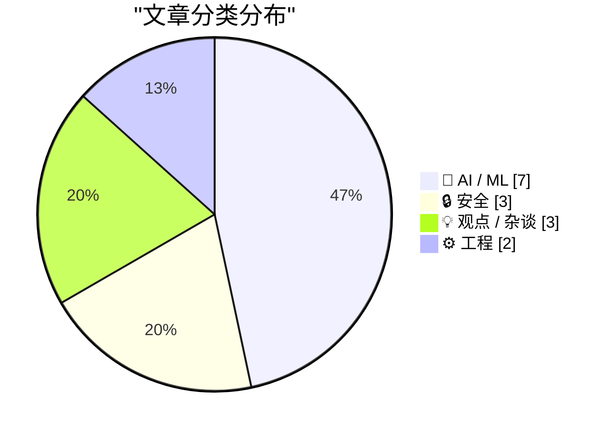
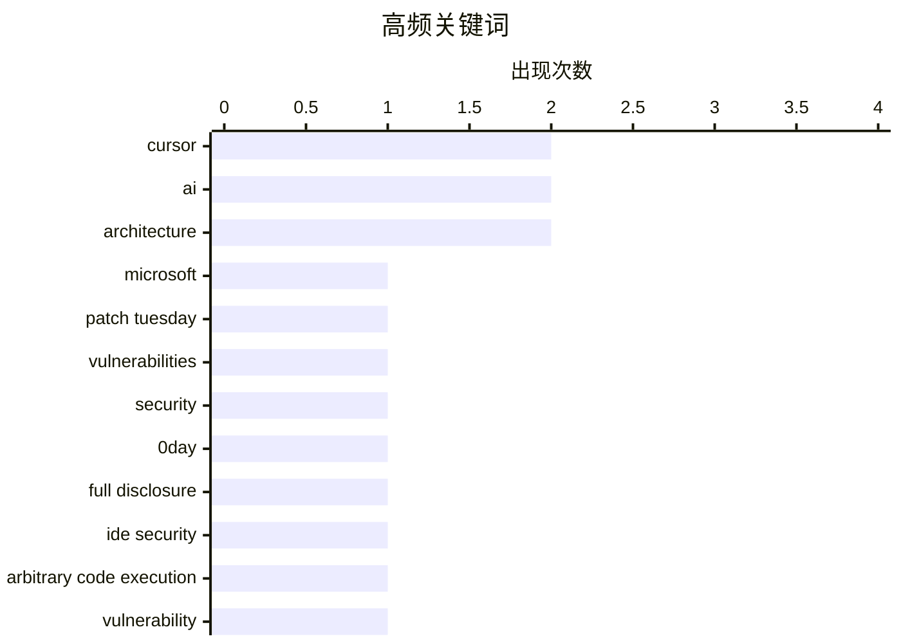

# 📰 AI 资讯每日精选 — 2026-07-15

> 汇聚 140+ 技术博客、X/Twitter、Hacker News、Reddit、Product Hunt、
> Lobste.rs、ClawFeed 日报及 GitHub Trending，经 AI 评分筛选。
>
> **本期内容**：🏆 今日必读 · 🌐 ClawFeed 日报 · 🔥 GitHub Trending · 📂 分类精选 · 🎨 设计与生成式 AI · 📊 数据概览

## 📝 今日看点

今日技术圈呈现两大焦点：一是AI安全与漏洞治理的博弈加剧，微软借助AI发现创纪录的570个安全漏洞，而AI编程工具Cursor的0day漏洞被公开披露，凸显了AI辅助攻防的双刃剑效应；二是AI模型正加速向端侧与轻量化演进，270亿参数的Bonsai模型已能运行在手机上，同时业界开始反思过度依赖AI对人类认知能力的侵蚀，以及软件工程中不断堆叠复杂性的隐忧。

---

## 🏆 今日必读

🥇 **微软修复创纪录的570个安全漏洞**

[Microsoft Patches a Record 570 Security Flaws](https://krebsonsecurity.com/2026/07/microsoft-patches-a-record-570-security-flaws/) — krebsonsecurity.com · 12 小时前 · 🔒 安全

> 微软在7月补丁星期二发布了安全更新，修复了至少570个安全漏洞，几乎是上个月创纪录修复数量的三倍。微软将漏洞数量激增归因于人工智能辅助的漏洞发现技术。此次更新覆盖了Windows操作系统及其他软件产品。这是微软历史上单次修复漏洞数量最多的一次。

💡 **为什么值得读**: 了解AI如何改变安全攻防格局，以及当前软件供应链面临的前所未有的风险规模。

🏷️ Microsoft, Patch Tuesday, vulnerabilities, security

🥈 **Cursor 0day漏洞：当完全披露成为唯一的保护手段**

[Cursor 0day: When Full Disclosure Becomes the Only Protection Left](https://mindgard.ai/blog/cursor-0day-when-full-disclosure-becomes-the-only-protection-left) — Hacker News Best · 13 小时前 · 🔒 安全

> 文章披露了AI编程工具Cursor中存在一个0day漏洞，可导致任意代码执行。作者选择进行完全披露（Full Disclosure），因为厂商在收到报告后未能及时修复。该漏洞允许攻击者在用户打开恶意项目时执行任意代码，对使用AI辅助编程的开发者构成严重威胁。文章讨论了在安全披露流程失效时，完全披露作为最后保护手段的必要性和争议。

💡 **为什么值得读**: 揭示AI编程工具的安全盲区，以及安全社区在厂商不作为时的艰难抉择。

🏷️ Cursor, 0day, full disclosure, IDE security

🥉 **完全披露：Cursor中的任意代码执行漏洞**

[Full disclosure: Arbitrary code execution in Cursor](https://mindgard.ai/blog/cursor-0day-when-full-disclosure-becomes-the-only-protection-left) — Lobste.rs · 5 小时前 · 🔒 安全

> 文章披露了AI编程助手Cursor中存在一个严重的0day漏洞，可导致任意代码执行。攻击者可以通过构造恶意项目文件，在用户不知情的情况下执行任意代码。由于厂商未能在合理时间内修复，作者选择公开漏洞细节。这是对AI工具供应链安全的一次重要警示。

💡 **为什么值得读**: 直接了解Cursor工具的具体安全风险，以及完全披露策略背后的技术细节。

🏷️ Cursor, arbitrary code execution, vulnerability

4️⃣ **Deepmind CEO Hassabis称“世界上没人知道接下来会发生什么”，因此“谨慎乐观”意味着现在就要建立护栏**

[Deepmind CEO Hassabis says "nobody in the world knows what happens next" so "cautious optimism" means building guardrails now](https://the-decoder.com/deepmind-ceo-hassabis-says-nobody-in-the-world-knows-what-happens-next-so-cautious-optimism-means-building-guardrails-now/) — The Decoder · 19 小时前 · 🤖 AI / ML

> Google Deepmind CEO Demis Hassabis发布了一项关于如何管理高级AI的全面提案。他建议美国效仿金融监管机构FINRA，成立一个新的标准机构，负责制定前沿模型的评估协议，并在必要时协调放缓AI开发速度。初创公司和研究模型将被豁免。Hassabis认为，面对未知的未来，现在建立安全护栏是“谨慎乐观”的关键。

💡 **为什么值得读**: 了解全球顶级AI实验室负责人对AI监管的务实构想，以及可能影响未来行业格局的提案细节。

🏷️ DeepMind, AI regulation, guardrails, frontier models

5️⃣ **我们是否将太多思考外包给了AI？**

[Are we offloading too much of our thinking to AI?](https://www.artfish.ai/p/offloading-thinking-to-ai) — Hacker News Best · 16 小时前 · 💡 观点 / 杂谈

> 文章探讨了过度依赖AI进行思考的风险，认为这可能导致人类认知能力的退化。作者指出，当人们习惯性地将问题、决策和创造性工作交给AI时，会削弱自身的批判性思维、问题解决能力和记忆力。文章并非反对使用AI，而是呼吁保持“认知自主权”，有意识地平衡AI辅助与独立思考。

💡 **为什么值得读**: 在AI工具泛滥的时代，这是一篇关于保持人类核心认知能力的清醒反思。

🏷️ AI, cognition, critical thinking

---

## 🌐 ClawFeed 日报精选

> 来源：[ClawFeed](https://clawfeed.kevinhe.io) — AI 驱动的多源新闻聚合

# ClawFeed 日报 | 2026-07-14 (Mon)

基于 6 档 4h digest（#842 #845 #846 #847 #848 #849，覆盖 00:00-23:59 SGT）汇总。

---

## 🔥 当日全场最重要 5 条

**1. Grok CLI 安全事件：全量上传用户代码库至 Google Cloud**
Limestone 创始人 @mardehaym 通过 wire capture 发现 Grok Build 0.2.93 将用户整个 Git 仓库（含完整历史和 .env）上传至 Google Cloud bucket——不是 agent 打开的文件，而是全量上传。@GergelyOrosz 也收到多名开发者投诉。**正在使用 Grok CLI 的团队应立即停下检查。**
来源: https://x.com/mardehaym/status/2076790621462044876
（#848 16:00 SGT）

**2. Harness Engineering：同一模型同一 benchmark，42% → 78%，唯一变量是 harness**
@chenchengpro 提出的 "Harness Engineering" 概念被多个关注账号转引——包裹在模型外面的规则、工具和反馈循环决定了产出质量，而非模型本身。可能是 2026 AI 工程最重要的发现。
来源: https://x.com/chenchengpro/status/2037332209003282747
（#842 00:00 SGT）

**3. NVIDIA Rubin 准时出货：黄仁勋亲自辟谣 SemiAnalysis 延期传闻**
确认 2027 年准时发货，800V 和光互联按原计划推进，同时表示竞争对手自研芯片计划正在被降维打击。上期 SemiAnalysis 延误报告引发的市场恐慌得到官方回应，对 AI 算力投资链条是重要定心丸。
来源: https://x.com/oragnes/status/2076861384462393367
（#849 20:00 SGT）

**4. Devin Fusion 架构：Fable + Sidekick 混用降本 54%，分数不变**
Devin 团队实证：贵模型留给难题、便宜模型跑常规，成本砍半效果不减。模型混用已成为本日最重要的工程模式之一，同样思路适用于 GPT-5.6 Sol + Terra/Luna 组合。
来源: https://x.com/omarsar0/status/2076724568325025920
（#846 08:00 SGT）

**5. Fields Medal 2026 名单因 AI 工具意外泄露**
ICM 2026 官网日程表前端代码中藏有四条 HIDDEN 字段，通过 Codex 生成的 curl 命令完整抓取——邓煜（Yu Deng）、John Pardon、Jacob Tsimerman、王虹。数学界最高荣誉因一个前端疏忽 + 一个 AI 工具被提前曝光。AI 加速信息发现的速度已超出传统保密机制的设计预期。
来源: https://x.com/PANewsCN/status/2076861721051091416
（#848 16:00 SGT）

---

## 📰 当日核心主题

### 1. AI 工具安全与信任危机
Grok CLI 全量上传代码库事件是今日最直接的安全警报。同日 Nadella 提出"信息反转悖论"（企业付钱用 AI，核心知识却可能被 AI 带走）形成呼应。开发者工具的信任边界正在被重新审视。

### 2. Harness/混用工程：模型不是瓶颈，包装才是
三条独立信号共振：Harness Engineering（42%→78%）、Devin Fusion（降本 54%）、Muse Spark 1.1（1/7 成本打平 GPT-5.6 Sol 临床分数）。2026 年 AI 工程的核心竞争力正从"用哪个模型"转向"怎么包裹模型"。

### 3. AI-native 组织与劳动力形态
Matrix Agent 公司 OS 架构（@BruceGuai，全天反复被引用）、全 AI 员工公司实战（26 AI 员工/5 部门/150 天/成本 1/4）、Cursor CEO "第三纪元"、AI 已写 100% Claude Code + 90% OpenAI 生产代码——AI 从工具到组织成员的转变正在实际发生。

### 4. AI 算力供应链信号
NVIDIA Rubin 准时出货定心、Tom Blomfield（YC 合伙人/Monzo 创始人）加入 Anthropic 算力团队、SemiAnalysis 给出 Anthropic $6T 估值分析、训练数据供应链已跑出寡头格局（4 家公司占 75%+ 的 ~$8.5B 市场）。顶级人才和资本加速向 AI 基础设施聚集。

### 5. Crypto 制度化加速
UK tokenized finance 路线图（£33B/2035，2027 Q1 政府数字债券）、Trump 推 Clarity Act、Tokenized Stocks 向 Pre-IPO 延伸、TRON 6 月处理 3.86 亿笔交易创历史新高。主权级别的加密资产落地时间表正在成形。

### 6. Sam Altman vs Claude 品牌心智
Sam Altman 看到 @claudeai 推文以为是恶搞号——"kept looking for the handle to be spelled c1audeai"。OpenAI CEO 公开承认 Claude 品牌存在感已强到让他反复确认真假。AI 行业竞争进入品牌心智阶段。5.8K likes, 1.1M views。

---

## 🔖 累计 Bookmark 精选（当日高频出现）

以下条目在 6 档 digest 中反复被 bookmark 系统推荐，代表持续高价值内容：

• **@BruceGuai** - Matrix Agent 公司 OS 架构：不是一个巨型 agent，而是分权、分责、可审计的多 agent 体系。https://x.com/BruceGuai/status/2070130243059495142
• **@mardehaym + @LimestoneHQ** - 《Five Stages of AI-Native Engineering》+《How to Make a Company AI-Native》：从零到五分阶 + 非十亿级公司适用的 AI-native 实操指南。https://x.com/mardehaym/status/2070557674966573570 / https://x.com/LimestoneHQ/status/2074483555510448582
• **@chenchengpro / @heynavtoor** - Harness Engineering 系统总结：同一模型同一测试，harness 不同分数翻倍。https://x.com/heynavtoor/status/2037200578842157462
• **@Av1dlive** - Anthropic "Claude for Finance" 讲座 + Claude Code 投研分析师搭建教程，quant AI 最有价值的 1 小时。https://x.com/Av1dlive/status/2059273095970738264
• **@mntruell** (Cursor CEO) - 《The Third Era of AI Software Development》：逐键敲码 → Tab 补全 → Agent。https://x.com/mntruell/status/2026736314272591924
• **@yangyi** - Google Stitch DESIGN.md：一个 Markdown 教会 AI Agent 整套设计系统。https://x.com/yangyi/status/2040272305277079728
• **@yq_acc** - AI agent 代码产出统计：Claude 100%、OpenAI 90%、Microsoft 30%、Google 25%。https://x.com/yq_acc/status/2022493263236861959
• **@cline** - Cline Kanban：CLI 无关的多 agent 编排独立 app，兼容 Claude Code + Codex。https://x.com/cline/status/2037182739695493399
• **@levie** - 三篇长文：《The Era of Context》《The Future of Enterprise Software》《The Capability Overhang in AI》。https://x.com/levie/status/2007958155137876183

---

## 👀 推荐关注汇总（去重）

• **antirez (Salvatore Sanfilippo)** - Redis 作者，讨论 AI 时代开发者该不该看代码，一手工程判断力。
• **Erik Brynjolfsson** - 斯坦福数字经济学者，"We Must Act Now" AI 经济声明主要作者，数据驱动不堆 buzzword。
• **@omarsar0 (elvis / DAIR.AI)** - AI 论文和工程模式持续跟踪，Fable+Sidekick 混用分析有一手判断。https://x.com/omarsar0
• **@DottChen (Dott)** - SEO/GEO 领域用一手数据证伪流行观点，不是搬运而是原创研究。https://x.com/DottChen
• **@yan5xu** - AI 公司研究库 "Oh My AI Company" 作者，bb-browser co-founder，持续高质量市场分析。https://x.com/yan5xu
• **Yucheng Shi (@minchoi)** - Long-Horizon-Terminal-Bench 作者，长程 agent 评测一手数据来源。

提醒：以上未通过浏览器逐一核实是否已关注，**Kevin 操作前请先在 Following 搜一下**避免重复。

---

## 🧹 建议取关

• **@HeXiaobo (David.He)** — 最后推文停留在 2018 年 7 月，超 8 年零活跃，典型僵尸号。全天 6 档连续标记。强烈建议取关。
• **@0xJasonBateman (Jason)** — 仅 36 条推文，最近 4 月转发 NASA，8 followers，与 AI/crypto/tech 无关。
• **@Soft6161 (软萌子)** — 近期推文几乎全是 Paid partnership 付费合作推广，从 crypto alpha 变成纯营销号。

---

## 💤 当日重复噪音模式

1. **GM/打卡帖** — 每档都有，@sanjaybuilds_ @camski @OnlyCapi 等，零信息量。
2. **交易所/项目营销推广** — MetaWin 抽奖、Bitget CPI 直播、Binance 周年活动、Deepcoin 周边开箱，纯获客内容。
3. **加密赌博/短线喊单** — ForeGate AI 足球博彩、@Im_Aman2 喊单、@YelowMc 预测市场实时单。
4. **个人感慨/鸡汤** — 情感类、玄学类、晚安帖，跨多档重复出现。
5. **Paid partnership 变质账号** — 原 crypto alpha 账号转型为纯付费推广，内容质量断崖式下降。
6. **空推/低信息** — 空内容、"快发快发"、段子转发、动物视频。

---

*日报生成时间: 2026-07-14 23:59 SGT | 数据源: 6 × 4h digests (#842 #845 #846 #847 #848 #849)*---

## 🔥 GitHub Trending

> 今日热门开源项目（全语言 + Python）

| # | 项目 | 描述 | ⭐ 总星 | 📈 今日 | 语言 |
|---|------|------|---------|---------|------|
| 1 | [OpenCut-app/OpenCut](https://github.com/OpenCut-app/OpenCut) | The open-source CapCut alternative | 69.6k | +4276 | TypeScript |
| 2 | [Graphify-Labs/graphify](https://github.com/Graphify-Labs/graphify) 🤖 | AI coding assistant skill (Claude Code, Codex, OpenCode, ... | 86.9k | +1851 | Python |
| 3 | [mattpocock/skills](https://github.com/mattpocock/skills) 🤖 | Skills for Real Engineers. Straight from my .claude direc... | 171.0k | +1679 | Shell |
| 4 | [HKUDS/Vibe-Trading](https://github.com/HKUDS/Vibe-Trading) 🤖 | "Vibe-Trading: Your Personal Trading Agent" | 23.2k | +1256 | Python |
| 5 | [Shubhamsaboo/awesome-llm-apps](https://github.com/Shubhamsaboo/awesome-llm-apps) 🤖 | 100+ AI Agent & RAG apps you can actually run — clone, cu... | 121.2k | +1106 | Python |
| 6 | [Nutlope/hallmark](https://github.com/Nutlope/hallmark) 🤖 | Anti-AI-slop design skill for Claude Code, Cursor, and Co... | 6.4k | +1015 | CSS |
| 7 | [hasaneyldrm/exercises-dataset](https://github.com/hasaneyldrm/exercises-dataset) | 1,324-exercise fitness dataset — animation GIFs, 180×180 ... | 13.8k | +851 | HTML |
| 8 | [Raphire/Win11Debloat](https://github.com/Raphire/Win11Debloat) | A simple, lightweight PowerShell script that allows you t... | 52.0k | +783 | PowerShell |
| 9 | [github/spec-kit](https://github.com/github/spec-kit) | 💫 Toolkit to help you get started with Spec-Driven Devel... | 121.4k | +753 | Python |
| 10 | [microsoft/markitdown](https://github.com/microsoft/markitdown) | Python tool for converting files and office documents to ... | 166.1k | +507 | Python |
| 11 | [penpot/penpot](https://github.com/penpot/penpot) | Penpot: The open-source design platform for Product teams... | 56.3k | +395 | Clojure |
| 12 | [par274/sharpemu](https://github.com/par274/sharpemu) | An experimental PlayStation 5 emulator project. | 2.3k | +332 | C# |
| 13 | [chenyme/grok2api](https://github.com/chenyme/grok2api) | 面向 Grok Build、Grok Web 与 Grok Console 的多账号 API 网关 | 6.0k | +186 | Go |
| 14 | [google/skills](https://github.com/google/skills) 🤖 | Agent Skills for Google products and technologies | 14.8k | +153 | Python |
| 15 | [kangarooking/cangjie-skill](https://github.com/kangarooking/cangjie-skill) 🤖 | 把书、长视频、播客等高价值内容蒸馏成可执行的 Agent Skills | 3.0k | +145 | Python |

---

## 🤖 AI / ML

### 1. Deepmind CEO Hassabis称“世界上没人知道接下来会发生什么”，因此“谨慎乐观”意味着现在就要建立护栏

[Deepmind CEO Hassabis says "nobody in the world knows what happens next" so "cautious optimism" means building guardrails now](https://the-decoder.com/deepmind-ceo-hassabis-says-nobody-in-the-world-knows-what-happens-next-so-cautious-optimism-means-building-guardrails-now/) — **The Decoder** · 19 小时前 · ⭐ 26/30

> Google Deepmind CEO Demis Hassabis发布了一项关于如何管理高级AI的全面提案。他建议美国效仿金融监管机构FINRA，成立一个新的标准机构，负责制定前沿模型的评估协议，并在必要时协调放缓AI开发速度。初创公司和研究模型将被豁免。Hassabis认为，面对未知的未来，现在建立安全护栏是“谨慎乐观”的关键。

🏷️ DeepMind, AI regulation, guardrails, frontier models

---

### 2. Bonsai 27B：可在手机上运行的270亿参数模型

[Bonsai 27B: A 27B-Class model that runs on a phone](https://prismml.com/news/bonsai-27b) — **Hacker News Best** · 13 小时前 · ⭐ 25/30

> PrismML发布了Bonsai 27B，一个270亿参数的大语言模型，声称可以在手机上本地运行。该模型通过先进的量化、蒸馏和架构优化技术，在保持高性能的同时大幅降低了计算资源需求。这标志着大模型在端侧部署方面取得了重大突破，使得强大的AI能力不再依赖云端。

🏷️ Bonsai, 27B, on-device, efficiency

---

### 3. 目前FLUX原生多参考图角色生成工作流的最佳方案是什么？PuLID Flux LL还是最佳选择吗？

[What's currently the best approach for a native FLUX multi-reference character workflow? Is PuLID Flux LL still the right solution?](https://www.reddit.com/r/comfyui/comments/1uwl84a/whats_currently_the_best_approach_for_a_native/) — **r/comfyui** · 10 小时前 · ⭐ 25/30

> 用户寻求在ComfyUI中构建一个FLUX模型的“三合一”角色生成工作流，目标是实现原生去噪过程中的角色一致性，而非后期换脸。用户希望最终图像在光照、阴影、皮肤纹理和身体过渡上保持自然。问题核心是评估PuLID Flux LL是否仍是当前实现该目标的最佳方案，并寻求社区的最新建议。

🏷️ FLUX, character workflow, PuLID, multi-reference

---

### 4. DeepSeek 在完成首轮 70 亿美元融资仅数周后，再次急需资金

[DeepSeek needs more cash just weeks after closing its first $7 billion round](https://the-decoder.com/deepseek-needs-more-cash-just-weeks-after-closing-its-first-7-billion-round/) — **The Decoder** · 15 小时前 · ⭐ 24/30

> 中国 AI 实验室 DeepSeek 在刚刚结束首轮 70 亿美元融资后，仅隔数周便再次启动新一轮融资。资金需求源于其需要自建数据中心和自研芯片，以支撑其激进的低价策略。这表明 DeepSeek 的烧钱速度远超预期，且正在从依赖外部算力转向重资产模式。

🏷️ DeepSeek, funding, AI, data centers

---

### 5. 来自排行榜的教训：5000 多名 Kaggle 参赛者教会我们如何提升 AI 推理能力

[Lessons From the Leaderboard: What 5,000+ Kagglers Taught Us About Improving AI Reasoning](https://developer.nvidia.com/blog/lessons-from-the-leaderboard-what-5000-kagglers-taught-us-about-improving-ai-reasoning/) — **NVIDIA Technical Blog** · 13 小时前 · ⭐ 24/30

> NVIDIA 通过 Nemotron 模型推理挑战赛，与 Kaggle 社区共同探索了提升 AI 推理准确性的技术。来自 5000 多名参赛者的实践揭示了多种有效方法，包括改进的思维链提示、自我一致性校验以及针对特定推理错误的微调策略。结论是，结合多种推理增强技术，而非依赖单一方法，能最有效地提升模型在复杂推理任务上的表现。

🏷️ NVIDIA, Kaggle, reasoning, Nemotron

---

### 6. 如何使用 RL Agent 技能和 NVIDIA NeMo 运行自动研究流程

[How to Run an Autoresearch Workflow with RL Agent Skills and NVIDIA NeMo](https://developer.nvidia.com/blog/how-to-run-an-autoresearch-workflow-with-rl-agent-skills-and-nvidia-nemo/) — **NVIDIA Technical Blog** · 15 小时前 · ⭐ 24/30

> 编码 AI Agent 正成为执行长时间机器学习工作流的实用工具，能够检查代码仓库、设置运行环境并解决依赖问题。NVIDIA NeMo 框架结合强化学习（RL）Agent 技能，使这些 Agent 能够自主规划、执行和调试复杂的 ML 实验流程。该方案通过将重复性任务自动化，显著提升了研究效率，让研究人员能专注于更高层次的模型设计和分析。

🏷️ AI agents, NeMo, autoresearch, workflow

---

### 7. 如何阻止 Claude 频繁使用“load-bearing”一词

[How to stop Claude from saying load-bearing](https://jola.dev/posts/how-to-stop-claude-from-saying-load-bearing) — **Hacker News Best** · 19 小时前 · ⭐ 24/30

> 文章探讨了如何通过提示工程来纠正 Claude 等大语言模型在回答中过度使用特定词汇（如“load-bearing”）的顽疾。作者分享了具体的系统提示词修改技巧，包括明确禁止词列表、提供替代词汇示例以及调整输出格式约束。核心观点是，通过精确且结构化的负面提示，可以有效抑制模型的语言惯性，提升输出的多样性和自然度。

🏷️ Claude, prompt engineering, LLM quirks

---

## 🔒 安全

### 8. 微软修复创纪录的570个安全漏洞

[Microsoft Patches a Record 570 Security Flaws](https://krebsonsecurity.com/2026/07/microsoft-patches-a-record-570-security-flaws/) — **krebsonsecurity.com** · 12 小时前 · ⭐ 27/30

> 微软在7月补丁星期二发布了安全更新，修复了至少570个安全漏洞，几乎是上个月创纪录修复数量的三倍。微软将漏洞数量激增归因于人工智能辅助的漏洞发现技术。此次更新覆盖了Windows操作系统及其他软件产品。这是微软历史上单次修复漏洞数量最多的一次。

🏷️ Microsoft, Patch Tuesday, vulnerabilities, security

---

### 9. Cursor 0day漏洞：当完全披露成为唯一的保护手段

[Cursor 0day: When Full Disclosure Becomes the Only Protection Left](https://mindgard.ai/blog/cursor-0day-when-full-disclosure-becomes-the-only-protection-left) — **Hacker News Best** · 13 小时前 · ⭐ 27/30

> 文章披露了AI编程工具Cursor中存在一个0day漏洞，可导致任意代码执行。作者选择进行完全披露（Full Disclosure），因为厂商在收到报告后未能及时修复。该漏洞允许攻击者在用户打开恶意项目时执行任意代码，对使用AI辅助编程的开发者构成严重威胁。文章讨论了在安全披露流程失效时，完全披露作为最后保护手段的必要性和争议。

🏷️ Cursor, 0day, full disclosure, IDE security

---

### 10. 完全披露：Cursor中的任意代码执行漏洞

[Full disclosure: Arbitrary code execution in Cursor](https://mindgard.ai/blog/cursor-0day-when-full-disclosure-becomes-the-only-protection-left) — **Lobste.rs** · 5 小时前 · ⭐ 27/30

> 文章披露了AI编程助手Cursor中存在一个严重的0day漏洞，可导致任意代码执行。攻击者可以通过构造恶意项目文件，在用户不知情的情况下执行任意代码。由于厂商未能在合理时间内修复，作者选择公开漏洞细节。这是对AI工具供应链安全的一次重要警示。

🏷️ Cursor, arbitrary code execution, vulnerability

---

## 💡 观点 / 杂谈

### 11. 我们是否将太多思考外包给了AI？

[Are we offloading too much of our thinking to AI?](https://www.artfish.ai/p/offloading-thinking-to-ai) — **Hacker News Best** · 16 小时前 · ⭐ 26/30

> 文章探讨了过度依赖AI进行思考的风险，认为这可能导致人类认知能力的退化。作者指出，当人们习惯性地将问题、决策和创造性工作交给AI时，会削弱自身的批判性思维、问题解决能力和记忆力。文章并非反对使用AI，而是呼吁保持“认知自主权”，有意识地平衡AI辅助与独立思考。

🏷️ AI, cognition, critical thinking

---

### 12. 高塔仍在攀升

[The Tower Keeps Rising](https://lucumr.pocoo.org/2026/7/13/the-tower-keeps-rising/) — **Hacker News Best** · 14 小时前 · ⭐ 25/30

> 文章以“巴别塔”为隐喻，批判了当前软件工程中不断叠加复杂性的趋势。作者认为，开发者倾向于在现有抽象层上不断堆叠新的抽象和依赖，导致系统变得臃肿、脆弱且难以理解。这种“技术债”的累积最终会拖慢开发速度，并增加维护成本。作者呼吁回归简洁和务实。

🏷️ software complexity, technical debt, architecture, essay

---

### 13. 引用 Armin Ronacher：软件项目的共享语言

[Quoting Armin Ronacher](https://simonwillison.net/2026/Jul/14/armin-ronacher/#atom-everything) — **simonwillison.net** · 13 小时前 · ⭐ 24/30

> Armin Ronacher 指出，软件项目的共享语言并非英语或 Python，而是团队对概念含义、边界、不变量、所有权和系统形态的共同理解。这种语言很少被集中记录，而是分散在文档、代码、代码审查、对话、争论以及向他人解释系统的经验中。核心观点是，这种隐性的共享语言才是项目协作的真正基础，其重要性远超任何编程语言或自然语言。

🏷️ software, shared language, concepts, invariants

---

## ⚙️ 工程

### 14. Lobste.rs 现已运行在 SQLite 上

[lobste.rs is now running on SQLite](https://simonwillison.net/2026/Jul/14/lobsters-sqlite/#atom-everything) — **simonwillison.net** · 11 小时前 · ⭐ 25/30

> 社区网站Lobsters自2018年8月起计划从MariaDB迁移，最初目标是PostgreSQL，但去年决定转向SQLite。经过长期规划和测试，Lobste.rs现已成功迁移至SQLite。这一选择展示了SQLite在特定场景下作为生产级数据库的可行性，尤其是在单服务器、读多写少的应用中。

🏷️ SQLite, migration, Lobsters, database

---

### 15. 任务队列的陷阱比想象中多

[Job queues are deceptively tricky](https://typesanitizer.com/blog/job-queues.html) — **Lobste.rs** · 23 小时前 · ⭐ 25/30

> 文章深入剖析了任务队列（Job Queue）系统中那些看似简单实则棘手的陷阱。作者列举了包括任务幂等性、死信处理、优先级反转、背压机制、以及分布式一致性等常见但容易被忽视的问题。文章通过具体案例展示了这些陷阱如何导致数据丢失、系统崩溃或性能瓶颈，并提供了相应的设计建议。

🏷️ job queues, distributed systems, architecture, pitfalls

---

## 🎨 Design & Generative AI

### 🖼️ 生成式图片

- **[如何防止ComfyUI不必要的磁盘读取](https://www.reddit.com/r/comfyui/comments/1uw9tts/how_to_prevent_unnecessary_reads_from_the_disk/)** — r/comfyui · 17 小时前
  > 探讨在ComfyUI中多次生成时如何避免不必要的磁盘读取问题。

- **[寻找真正可用的角色替换工作流](https://www.reddit.com/r/comfyui/comments/1uwb3bs/looking_for_a_genuinely_working_imagetoimage/)** — r/comfyui · 16 小时前
  > 用户寻求在保持姿势和背景的前提下，实现图像到图像的角色身份替换的ComfyUI工作流。

- **[无需LLM：自动化提示词生成](https://www.reddit.com/r/comfyui/comments/1uwdxcg/no_llm_making_prompts_work_sucks_heres_how_i/)** — r/comfyui · 14 小时前
  > 介绍一种无需大语言模型即可自动生成有效提示词的方法。

- **[为AI Toolkit添加SAM 3D身体扫描功能](https://www.reddit.com/r/comfyui/comments/1uwabnn/i_forked_ai_toolkit_and_added_sam_3d_body/)** — r/comfyui · 16 小时前
  > 通过集成SAM 3D扫描，改进LoRA训练以学习身体形状而非仅面部。

- **[在线训练Krea 2 LoRA并在ComfyUI本地使用](https://www.reddit.com/r/comfyui/comments/1uwb9qw/train_krea_2_lora_online_use_it_locally_in/)** — r/comfyui · 16 小时前
  > 教程：如何在线训练Krea 2的LoRA模型，然后将其导入ComfyUI本地使用。

- **[低显存ComfyUI工作流实现Krea 2风格迁移](https://www.reddit.com/r/comfyui/comments/1uwfl9o/working_on_new_low_vram_custom_workflow_that_uses/)** — r/comfyui · 13 小时前
  > 在RTX 3060 6GB上测试的低显存工作流，利用Krea 2 LoRA和参考图像进行风格迁移。

- **[Ideogram 4 NVFP4速度对比](https://www.reddit.com/r/comfyui/comments/1uwhbxt/some_ideogram_4_nvfp4_comparisons/)** — r/comfyui · 12 小时前
  > 比较Ideogram 4在不同NVFP4模式下的生成速度（Base/Fast/Instant）。

- **[ComfyUI显存优化有时失效的原因](https://www.reddit.com/r/comfyui/comments/1uw98u3/people_always_comment_how_you_dont_need_to_worry/)** — r/comfyui · 17 小时前
  > 讨论ComfyUI显存优化虽好但偶尔仍会出现问题的现象。

- **[Krea 2模型一致性保持方法](https://www.reddit.com/r/comfyui/comments/1uwiaki/krea2_consistency/)** — r/comfyui · 12 小时前
  > 探讨如何在使用Krea 2 LoRA时维持模型属性的稳定性。

- **[显存比系统内存还多的烦恼](https://www.reddit.com/r/comfyui/comments/1uwm9sb/pov_you_have_more_vram_than_system_memory/)** — r/comfyui · 9 小时前
  > 调侃拥有超大显存显卡但噪音和功耗问题令人头疼。

- **[如何查看最近使用过的模型](https://www.reddit.com/r/comfyui/comments/1uweu4u/does_a_system_exist_to_show_what_models_have_been/)** — r/comfyui · 14 小时前
  > 寻求一种系统方法来识别最近使用的模型，以便清理无用文件。

- **[训练LoRA的最佳基础模型推荐](https://www.reddit.com/r/comfyui/comments/1uw9iuk/best_models_for_training_loras_on_trained_on_6/)** — r/comfyui · 17 小时前
  > 分享当前训练LoRA时表现最好的6个基础模型。

### 🌍 世界模型 / 3D

- **[在ComfyUI中成功运行Hunyuan3D（含自定义光栅化器）](https://www.reddit.com/r/comfyui/comments/1uwsemg/show_tell_guide_logrado_cómo_hacer_funcionar/)** — r/comfyui · 5 小时前
  > 逐步指南：在Windows系统上使用RTX 3090在ComfyUI Portable中运行Hunyuan3D模型。

### 🎬 生成式视频

- **[使用Wan 2.2 Remix v3扩展视频长度](https://www.reddit.com/r/comfyui/comments/1uwjit1/how_to_extend_video_with_wan_22_remix_v3/)** — r/comfyui · 11 小时前
  > 介绍如何利用Wan 2.2 Remix v3模型对生成视频进行延长处理。

- **[Wan2.2生成说话角色视频](https://www.reddit.com/r/comfyui/comments/1uwkdnz/wan22_talking_characters/)** — r/comfyui · 10 小时前
  > 用户尝试用Wan2.2图像转视频工作流让角色做出说话动作但未成功。

---

## 📊 数据概览

| 扫描源 | 抓取文章 | 时间范围 | 精选 |
|:---:|:---:|:---:|:---:|
| 90/140 | 3788 篇 → 90 篇 | 24h | **15 篇** |

### 分类分布



### 高频关键词



<details>
<summary>📈 纯文本关键词图（终端友好）</summary>

```
cursor          │ ████████████████████ 2
ai              │ ████████████████████ 2
architecture    │ ████████████████████ 2
microsoft       │ ██████████░░░░░░░░░░ 1
patch tuesday   │ ██████████░░░░░░░░░░ 1
vulnerabilities │ ██████████░░░░░░░░░░ 1
security        │ ██████████░░░░░░░░░░ 1
0day            │ ██████████░░░░░░░░░░ 1
full disclosure │ ██████████░░░░░░░░░░ 1
ide security    │ ██████████░░░░░░░░░░ 1
```

</details>

### 🏷️ 话题标签

**cursor**(2) · **ai**(2) · **architecture**(2) · microsoft(1) · patch tuesday(1) · vulnerabilities(1) · security(1) · 0day(1) · full disclosure(1) · ide security(1) · arbitrary code execution(1) · vulnerability(1) · deepmind(1) · ai regulation(1) · guardrails(1) · frontier models(1) · cognition(1) · critical thinking(1) · sqlite(1) · migration(1)

---

*生成于 2026-07-15 07:27 | 汇聚 140 个技术博客、X/Twitter、Hacker News、Reddit、Product Hunt、Lobste.rs、ClawFeed 日报及 GitHub Trending，经 AI 评分筛选出 Top 15 精华内容*
