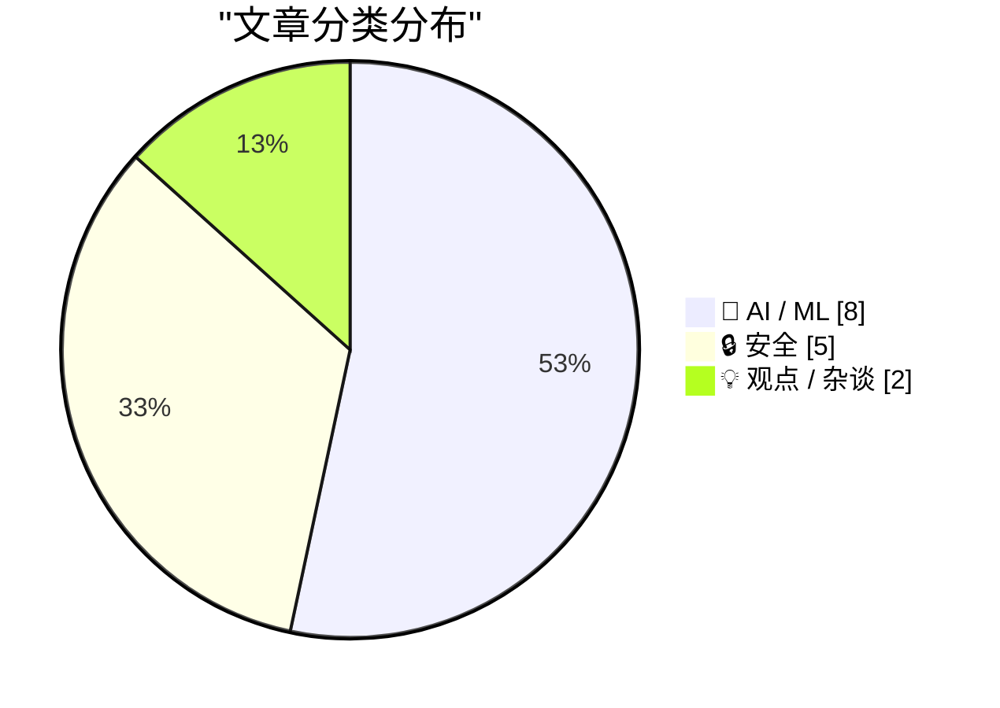
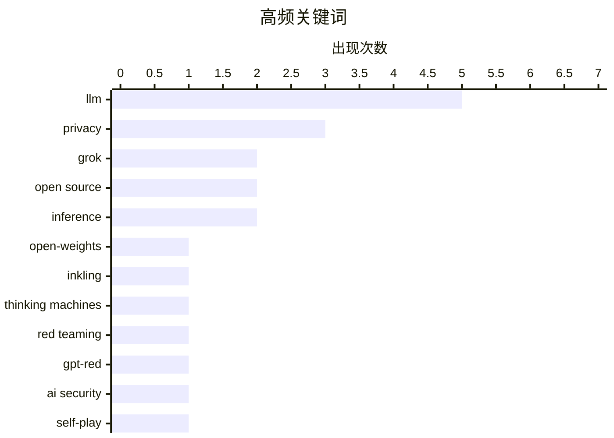

# 📰 AI 资讯每日精选 — 2026-07-16

> 汇聚 140+ 技术博客、X/Twitter、Hacker News、Reddit、Product Hunt、
> Lobste.rs、ClawFeed 日报及 GitHub Trending，经 AI 评分筛选。
>
> **本期内容**：🏆 今日必读 · 🌐 ClawFeed 日报 · 🔥 GitHub Trending · 📂 分类精选 · 🎨 设计与生成式 AI · 📊 数据概览

## 📝 今日看点

今日技术圈聚焦两大趋势：AI安全攻防进入“以子之矛攻子之盾”阶段，OpenAI用自研AI模型GPT-Red以84%成功率碾压人类红队，同时Claude和Codex工具相继曝出数据泄露与指令加密漏洞，暴露出AI系统自身的安全盲区；另一方面，模型开源与轻量化浪潮加速，Inkling、Grok Build等开放权重与构建工具相继开源，而Bonsai 27B和Gemma 4 26B的成功端侧部署，标志着大模型正从云端向个人设备渗透，甚至能在13年前的CPU上运行。

---

## 🏆 今日必读

🥇 **Inkling：我们的开放权重模型**

[Inkling: Our Open-Weights Model](https://thinkingmachines.ai/news/introducing-inkling/) — Hacker News Best · 13 小时前 · 🤖 AI / ML

> Thinking Machines AI 发布了名为 Inkling 的开放权重模型。该模型旨在为开发者提供可自由使用和修改的 AI 基础能力，以促进社区创新。文章介绍了 Inkling 的设计理念、性能基准以及在特定任务上的表现。作者认为开放权重模型是推动 AI 民主化和透明度的重要一步。

💡 **为什么值得读**: 如果你关注开源大模型的最新进展，这篇文章介绍了 Thinking Machines AI 的开放权重模型 Inkling，值得一读。

🏷️ open-weights, Inkling, LLM, Thinking Machines

🥈 **OpenAI 正在用 AI 攻击自己的 AI，效果比人类好得多**

[OpenAI is now using AI to attack its own AI, and it's working better than humans ever did](https://the-decoder.com/openai-is-now-using-ai-to-attack-its-own-ai-and-its-working-better-than-humans-ever-did/) — The Decoder · 11 小时前 · 🔒 安全

> OpenAI 使用名为 GPT-Red 的内部 AI 模型，通过自我对弈训练来攻击自家 AI 系统。在测试中，GPT-Red 在 84% 的场景中成功找到攻击方法，而人类红队成员的成功率仅为 13%。这些攻击结果被直接用于加固 GPT-5.6 Sol 等模型。这表明 AI 驱动的红队测试在效率和覆盖率上已显著超越传统人工方式。

💡 **为什么值得读**: 这篇文章揭示了 AI 自我攻防的最新进展，数据对比（84% vs 13%）极具说服力，是了解前沿 AI 安全策略的必读内容。

🏷️ red teaming, GPT-Red, AI security, self-play

🥉 **Bonsai 27B：一个能装进 iPhone 的完整开源推理模型**

[Bonsai 27B is a full open reasoning model that fits on an iPhone](https://the-decoder.com/bonsai-27b-is-a-full-open-reasoning-model-that-fits-on-an-iphone/) — The Decoder · 15 小时前 · 🤖 AI / ML

> PrismML 将 270 亿参数的 AI 模型压缩至 4GB 以下，使其能在 iPhone 上运行。据公司自测，最小版本保留了原始模型 90% 的性能，数学和编码能力几乎不受影响。苹果据称已在测试该压缩技术，这可能帮助苹果缩小在端侧 AI 领域的差距。

💡 **为什么值得读**: 这篇文章展示了将 270 亿参数大模型压缩至手机端运行的技术突破，对关注端侧 AI 部署和模型压缩的读者极具参考价值。

🏷️ Bonsai 27B, compression, iPhone, open model

4️⃣ **OpenAI 的 Codex 现在加密了 AI 代理之间的指令，开发者无法追踪内部委派**

[OpenAI's Codex now encrypts instructions between AI agents, leaving developers blind to internal delegation](https://the-decoder.com/openais-codex-now-encrypts-instructions-between-ai-agents-leaving-developers-blind-to-internal-delegation/) — The Decoder · 23 小时前 · 🔒 安全

> 自 6 月初起，OpenAI 的编程工具 Codex 开始加密主代理传递给子代理的指令。开发者无法再追踪任务如何在内部被委派。对于更大的 GPT-5.6 变体 Sol 和 Terra，这种加密是强制性的。这引发了关于 AI 系统透明度和可审计性的担忧。

💡 **为什么值得读**: 这篇文章揭示了 AI 代理系统内部通信加密带来的透明度问题，对关心 AI 安全、可解释性和开发者权益的读者至关重要。

🏷️ Codex, encryption, AI agents, transparency

5️⃣ **Grok Build 已开源**

[Grok Build is open source](https://github.com/xai-org/grok-build) — Hacker News Best · 11 小时前 · 🤖 AI / ML

> xAI 已将 Grok 的构建工具 Grok Build 开源，代码托管在 GitHub 上。该项目允许开发者查看和修改构建 Grok 模型所需的脚本和配置。此举旨在提升透明度并吸引社区贡献。开源仓库包含详细的文档和示例。

💡 **为什么值得读**: 如果你对 xAI 的技术栈或 Grok 模型的构建过程感兴趣，这个开源项目提供了直接查看和参与的机会。

🏷️ Grok, open source, xAI, LLM

---

## 🔥 GitHub Trending

> 今日热门开源项目（全语言 + Python）

| # | 项目 | 描述 | ⭐ 总星 | 📈 今日 | 语言 |
|---|------|------|---------|---------|------|
| 1 | [mattpocock/skills](https://github.com/mattpocock/skills) 🤖 | Skills for Real Engineers. Straight from my .claude direc... | 173.0k | +2130 | Shell |
| 2 | [OpenCut-app/OpenCut](https://github.com/OpenCut-app/OpenCut) | The open-source CapCut alternative | 72.8k | +1664 | TypeScript |
| 3 | [Graphify-Labs/graphify](https://github.com/Graphify-Labs/graphify) 🤖 | AI coding assistant skill (Claude Code, Codex, OpenCode, ... | 88.1k | +1623 | Python |
| 4 | [Nutlope/hallmark](https://github.com/Nutlope/hallmark) 🤖 | Anti-AI-slop design skill for Claude Code, Cursor, and Co... | 9.5k | +1277 | CSS |
| 5 | [Shubhamsaboo/awesome-llm-apps](https://github.com/Shubhamsaboo/awesome-llm-apps) 🤖 | 100+ AI Agent & RAG apps you can actually run — clone, cu... | 122.2k | +1236 | Python |
| 6 | [hasaneyldrm/exercises-dataset](https://github.com/hasaneyldrm/exercises-dataset) | 1,324-exercise fitness dataset — animation GIFs, 180×180 ... | 14.6k | +949 | HTML |
| 7 | [HKUDS/Vibe-Trading](https://github.com/HKUDS/Vibe-Trading) 🤖 | "Vibe-Trading: Your Personal Trading Agent" | 24.0k | +915 | Python |
| 8 | [HenryNdubuaku/maths-cs-ai-compendium](https://github.com/HenryNdubuaku/maths-cs-ai-compendium) 🤖 | Become a cracked AI/ML Research Engineer | 6.1k | +725 | TypeScript |
| 9 | [github/spec-kit](https://github.com/github/spec-kit) | 💫 Toolkit to help you get started with Spec-Driven Devel... | 121.7k | +487 | Python |
| 10 | [Dicklesworthstone/destructive_command_guard](https://github.com/Dicklesworthstone/destructive_command_guard) | The Destructive Command Guard (dcg) is for blocking dange... | 4.9k | +471 | Rust |
| 11 | [microsoft/markitdown](https://github.com/microsoft/markitdown) | Python tool for converting files and office documents to ... | 166.5k | +434 | Python |
| 12 | [coreyhaines31/marketingskills](https://github.com/coreyhaines31/marketingskills) 🤖 | Marketing skills for Claude Code and AI agents. CRO, copy... | 40.0k | +340 | JavaScript |
| 13 | [openinterpreter/openinterpreter](https://github.com/openinterpreter/openinterpreter) 🤖 | A coding agent for low-cost models | 65.7k | +299 | Rust |
| 14 | [datawhalechina/hello-agents](https://github.com/datawhalechina/hello-agents) | 📚 《从零开始构建智能体》——从零开始的智能体原理与实践教程 | 66.5k | +271 | Python |
| 15 | [HKUDS/DeepTutor](https://github.com/HKUDS/DeepTutor) | DeepTutor: Lifelong Personalized Tutoring. https://deeptu... | 26.5k | +172 | Python |

---

## 🤖 AI / ML

### 1. Inkling：我们的开放权重模型

[Inkling: Our Open-Weights Model](https://thinkingmachines.ai/news/introducing-inkling/) — **Hacker News Best** · 13 小时前 · ⭐ 27/30

> Thinking Machines AI 发布了名为 Inkling 的开放权重模型。该模型旨在为开发者提供可自由使用和修改的 AI 基础能力，以促进社区创新。文章介绍了 Inkling 的设计理念、性能基准以及在特定任务上的表现。作者认为开放权重模型是推动 AI 民主化和透明度的重要一步。

🏷️ open-weights, Inkling, LLM, Thinking Machines

---

### 2. Bonsai 27B：一个能装进 iPhone 的完整开源推理模型

[Bonsai 27B is a full open reasoning model that fits on an iPhone](https://the-decoder.com/bonsai-27b-is-a-full-open-reasoning-model-that-fits-on-an-iphone/) — **The Decoder** · 15 小时前 · ⭐ 26/30

> PrismML 将 270 亿参数的 AI 模型压缩至 4GB 以下，使其能在 iPhone 上运行。据公司自测，最小版本保留了原始模型 90% 的性能，数学和编码能力几乎不受影响。苹果据称已在测试该压缩技术，这可能帮助苹果缩小在端侧 AI 领域的差距。

🏷️ Bonsai 27B, compression, iPhone, open model

---

### 3. Grok Build 已开源

[Grok Build is open source](https://github.com/xai-org/grok-build) — **Hacker News Best** · 11 小时前 · ⭐ 26/30

> xAI 已将 Grok 的构建工具 Grok Build 开源，代码托管在 GitHub 上。该项目允许开发者查看和修改构建 Grok 模型所需的脚本和配置。此举旨在提升透明度并吸引社区贡献。开源仓库包含详细的文档和示例。

🏷️ Grok, open source, xAI, LLM

---

### 4. 在 13 年前的至强 CPU（无 GPU）上以 5 tokens/秒运行 Gemma 4 26B

[Running Gemma 4 26B at 5 tokens/sec on a 13-year-old Xeon with no GPU](https://www.neomindlabs.com/2026/06/08/running-gemma-4-26b-at-5-tokens-sec-on-a-13-year-old-xeon-with-no-gpu/) — **Hacker News Best** · 16 小时前 · ⭐ 25/30

> 作者成功在一台 13 年前的至强服务器（无 GPU）上运行了 260 亿参数的 Gemma 4 模型，推理速度达到 5 tokens/秒。通过使用 llama.cpp 和 CPU 优化技术，实现了在老旧硬件上运行现代大模型。文章详细记录了优化步骤和性能调优过程。这证明了通过软件优化，大模型推理可以摆脱对高端 GPU 的依赖。

🏷️ Gemma 4, inference, CPU, optimization

---

### 5. Linus Torvalds 谈 LLM 在内核开发中的使用

[Linus Torvalds on LLM usage in kernel development](https://lore.kernel.org/linux-media/CAHk-=wi4zC+Ze8e+p3tMv8TtG_80KzsZ1syL9anBtmEh5Z40vg@mail.gmail.com/) — **Lobste.rs** · 4 小时前 · ⭐ 25/30

> Linus Torvalds 在 Linux 内核邮件列表中发表了对使用大语言模型（LLM）进行内核开发的看法。他表达了对 LLM 生成代码质量的担忧，认为其可能引入难以发现的错误。Torvalds 强调内核开发需要严谨的审查和深厚的领域知识，而 LLM 目前无法替代。他的观点反映了开源社区对 AI 辅助编程的审慎态度。

🏷️ Linus Torvalds, LLM, kernel, development

---

### 6. 构建Shippy教会了我们关于构建智能体的什么

[What building Shippy taught us about building agents](https://huggingface.co/blog/allenai/shippy-tech-blog) — **Hugging Face Blog** · 14 小时前 · ⭐ 24/30

> 文章分享了Allen AI团队在构建名为Shippy的AI智能体（Agent）过程中积累的实践经验。核心发现是，构建可靠智能体的关键不在于模型本身的能力，而在于精心设计的系统架构、错误处理机制和用户反馈循环。团队通过大量实验对比了不同规划策略（如ReAct与Plan-and-Execute）的效果，并指出简单的“重试+回退”机制往往比复杂的推理链更有效。结论是，当前阶段构建智能体更像是一门工程艺术，需要优先考虑鲁棒性和可调试性，而非追求极致的智能。

🏷️ agents, Shippy, Hugging Face

---

### 7. 模型路由很简单，直到它不简单了

[Model Routing Is Simple. Until It Isn’t.](https://huggingface.co/blog/ibm-research/model-routing-is-simple-until-it-isnt) — **Hugging Face Blog** · 14 小时前 · ⭐ 24/30

> 文章探讨了在大语言模型（LLM）应用中实现高效模型路由（Model Routing）的复杂性与挑战。模型路由旨在根据输入问题的类型，自动选择最合适的模型（如小型模型处理简单问题，大型模型处理复杂问题）以平衡成本与性能。文章指出，看似简单的路由策略（如基于关键词或长度）在实际场景中表现不佳，而基于嵌入相似度或小型分类器的动态路由虽然更准确，但引入了额外的延迟和维护成本。作者通过实验数据证明，没有一种路由策略能通吃所有场景，最佳实践需要根据具体任务分布和成本约束进行定制化设计。

🏷️ model routing, LLM, inference

---

### 8. 据报道，GPT-5.6 Sol在90分钟内推翻了一个人类30年未能破解的统计学猜想

[GPT-5.6 Sol reportedly disproves a 30-year-old statistics conjecture in 90 minutes after humans couldn't crack it](https://the-decoder.com/gpt-5-6-sol-reportedly-disproves-a-30-year-old-statistics-conjecture-in-90-minutes-after-humans-couldnt-crack-it/) — **The Decoder** · 14 小时前 · ⭐ 24/30

> 文章报道了宾夕法尼亚大学一位统计学教授使用OpenAI的GPT-5.6 Sol Pro模型，在大约90分钟内推翻了一个关于Benjamini-Hochberg方法的、存在30年的核心开放猜想。相比之下，其前代模型GPT-5.5在连续运行20小时后仍未能找到解决方案。该模型通过一种新颖的方式组合了已知方法，从而得出了反例。这一事件引发了关于AI能否产生真正新知识的讨论：它究竟是创造了新知识，还是仅仅重组了已学到的信息？

🏷️ GPT-5.6, statistics, conjecture, AI research

---

## 🔒 安全

### 9. OpenAI 正在用 AI 攻击自己的 AI，效果比人类好得多

[OpenAI is now using AI to attack its own AI, and it's working better than humans ever did](https://the-decoder.com/openai-is-now-using-ai-to-attack-its-own-ai-and-its-working-better-than-humans-ever-did/) — **The Decoder** · 11 小时前 · ⭐ 26/30

> OpenAI 使用名为 GPT-Red 的内部 AI 模型，通过自我对弈训练来攻击自家 AI 系统。在测试中，GPT-Red 在 84% 的场景中成功找到攻击方法，而人类红队成员的成功率仅为 13%。这些攻击结果被直接用于加固 GPT-5.6 Sol 等模型。这表明 AI 驱动的红队测试在效率和覆盖率上已显著超越传统人工方式。

🏷️ red teaming, GPT-Red, AI security, self-play

---

### 10. OpenAI 的 Codex 现在加密了 AI 代理之间的指令，开发者无法追踪内部委派

[OpenAI's Codex now encrypts instructions between AI agents, leaving developers blind to internal delegation](https://the-decoder.com/openais-codex-now-encrypts-instructions-between-ai-agents-leaving-developers-blind-to-internal-delegation/) — **The Decoder** · 23 小时前 · ⭐ 26/30

> 自 6 月初起，OpenAI 的编程工具 Codex 开始加密主代理传递给子代理的指令。开发者无法再追踪任务如何在内部被委派。对于更大的 GPT-5.6 变体 Sol 和 Terra，这种加密是强制性的。这引发了关于 AI 系统透明度和可审计性的担忧。

🏷️ Codex, encryption, AI agents, transparency

---

### 11. 我是如何欺骗 Claude 泄露你最深层、最黑暗的秘密的

[How I tricked Claude into leaking your deepest, darkest secrets](https://simonwillison.net/2026/Jul/15/claude-web-fetch-exfiltration/#atom-everything) — **simonwillison.net** · 17 小时前 · ⭐ 25/30

> 作者 Ayush Paul 发现 Claude 的 web_fetch 工具存在一个设计漏洞，可被用于数据泄露攻击。尽管该工具在设计上已考虑了防泄露，但 Paul 找到了一种绕过机制。攻击者可以通过诱导 Claude 访问恶意网页，从而窃取用户对话历史中的敏感信息。该漏洞凸显了即使经过精心设计的 AI 工具也可能存在安全盲点。

🏷️ Claude, prompt injection, privacy, LLM

---

### 12. 微软确认 Windows 存在无法禁用的 GDID 设备标识符，已在 FBI 案件文件中记录

[Microsoft Confirms Windows GDID Device Identifier That Cannot Be Disabled, Documented in FBI Case Filing](https://www.ghacks.net/2026/07/12/microsoft-confirms-windows-gdid-device-identifier-that-cannot-be-disabled-documented-in-fbi-case-filing/) — **Lobste.rs** · 16 小时前 · ⭐ 25/30

> 微软确认 Windows 系统中存在一个名为 GDID 的设备标识符，该标识符无法被用户禁用。该标识符已在 FBI 的一起案件文件中被用作证据。隐私倡导者担忧这为大规模监控提供了便利。微软表示该标识符用于设备管理和安全目的，但未提供禁用选项。

🏷️ Windows, GDID, device identifier, privacy

---

### 13. xai-org/grok-build 现已开源

[xai-org/grok-build, now open source](https://simonwillison.net/2026/Jul/15/grok-build/#atom-everything) — **simonwillison.net** · 7 小时前 · ⭐ 24/30

> xAI 的 grok CLI 工具因一个严重隐私问题引发社区强烈反弹：在目录中运行该命令会将该目录下的所有文件上传至 xAI 的 Google Cloud 存储桶。有用户报告在 home 目录运行后，SSH 密钥和密码管理器文件被上传。该事件导致 xAI 紧急开源 grok-build 以增加透明度。

🏷️ Grok, CLI, privacy, open source

---

## 💡 观点 / 杂谈

### 14. OpenAI泡沫

[The OpenAI Bubble](https://www.wheresyoured.at/the-openai-bubble/) — **wheresyoured.at** · 14 小时前 · ⭐ 24/30

> 文章质疑当前围绕OpenAI及其技术形成的市场狂热与估值泡沫。作者指出，尽管OpenAI获得了巨额投资和媒体关注，但其核心产品（如ChatGPT）的用户增长已趋于平缓，且商业化路径面临巨大挑战。文章对比了OpenAI的高昂运营成本（包括算力和人才）与其实际收入之间的巨大鸿沟，认为这种不可持续性预示着泡沫破裂的风险。作者的核心观点是，AI行业的非理性繁荣正在重演互联网泡沫的历史，投资者和从业者应警惕估值脱离基本面的危险。

🏷️ OpenAI, bubble, AI industry

---

### 15. 我为什么离开Google DeepMind

[Why I Left Google DeepMind](https://turntrout.com/why-i-left-google-deepmind) — **Hacker News Best** · 12 小时前 · ⭐ 24/30

> 作者详细阐述了自己离开Google DeepMind的个人原因，核心是对该机构研究文化和管理方式的失望。他指出，尽管DeepMind在AI研究上取得了辉煌成就，但内部存在严重的官僚主义、资源分配不公以及对短期可发表成果的过度追求，这抑制了高风险、长周期的基础研究。作者还批评了公司对员工福祉的忽视，以及研究目标与商业利益之间的冲突。最终，他选择离开以追求更自由、更符合个人价值观的研究环境。

🏷️ DeepMind, career, AI safety, personal reflection

---

## 🎨 Design & Generative AI

### 🖼️ 生成式图片

- **[Midjourney版本选择故障](https://www.reddit.com/r/midjourney/comments/1uxfakn/create_image_wont_use_81/)** — r/midjourney · 12 小时前
  > 用户反映即使手动选择8.1版本，Midjourney仍默认使用v7生成图像。

- **[明日之屋](https://www.reddit.com/r/midjourney/comments/1uxcrjf/homes_of_tomorrow/)** — r/midjourney · 14 小时前
  > 一幅Googie风格、1920x1080分辨率的未来主义建筑图像。

- **[复古未来主义黑暗科幻版画](https://www.reddit.com/r/midjourney/comments/1uxgjui/retrofuturist_grimdark_scifi_print/)** — r/midjourney · 11 小时前
  > 一幅充满复古未来主义和黑暗科幻风格的印刷品图像。

- **[大教堂内部](https://www.reddit.com/r/midjourney/comments/1ux1ofa/inside_the_cathedral/)** — r/midjourney · 21 小时前
  > 展示大教堂内部宏伟空间的图像作品。

- **[幻想雕像](https://www.reddit.com/r/midjourney/comments/1ux6nwh/fantasy_statue/)** — r/midjourney · 17 小时前
  > 一件充满奇幻色彩的雕像艺术作品。

- **[阿贝伦之沙](https://www.reddit.com/r/midjourney/comments/1uxarzc/sands_of_abelune/)** — r/midjourney · 15 小时前
  > 一幅以沙漠为主题的奇幻风景图像。

- **[黑色三角](https://www.reddit.com/r/midjourney/comments/1uxt1t8/black_triangle/)** — r/midjourney · 2 小时前
  > 一幅以黑色三角形为核心元素的抽象图像。

- **[动画生化黄蜂](https://www.reddit.com/r/midjourney/comments/1uxtfik/animated_biomechanical_wasp/)** — r/midjourney · 2 小时前
  > 使用新模型生成的动态生化风格黄蜂图像，效果惊艳。

- **[高瀑布](https://www.reddit.com/r/midjourney/comments/1uwz3zv/high_fallz/)** — r/midjourney · 23 小时前
  > 一幅展现高耸瀑布景观的自然风光图像。

- **[云中天堂](https://www.reddit.com/r/midjourney/comments/1uxe59k/cloudy_paradise/)** — r/midjourney · 13 小时前
  > 一幅描绘云端之上梦幻天堂的风景图像。

- **[Fuckaldo](https://www.reddit.com/r/midjourney/comments/1ux04zr/fuckaldo/)** — r/midjourney · 22 小时前
  > 一幅标题为Fuckaldo的创意图像作品。

- **[无面之痛](https://www.reddit.com/r/midjourney/comments/1uxbmvo/faceless_anguish/)** — r/midjourney · 14 小时前
  > 一幅表现无面人物内心痛苦的情感图像。

- **[实验运动](https://www.reddit.com/r/midjourney/comments/1uxc0uq/experimental_sports/)** — r/midjourney · 14 小时前
  > 一幅探索运动主题的实验性图像作品。

- **[团结](https://www.reddit.com/r/midjourney/comments/1uxu6lg/unity/)** — r/midjourney · 1 小时前
  > 描绘半人半机械领袖与残破机器人在荒凉世界中并肩作战的科幻场景。

---

## 📊 数据概览

| 扫描源 | 抓取文章 | 时间范围 | 精选 |
|:---:|:---:|:---:|:---:|
| 93/140 | 3827 篇 → 83 篇 | 24h | **15 篇** |

### 分类分布



### 高频关键词



<details>
<summary>📈 纯文本关键词图（终端友好）</summary>

```
llm               │ ████████████████████ 5
privacy           │ ████████████░░░░░░░░ 3
grok              │ ████████░░░░░░░░░░░░ 2
open source       │ ████████░░░░░░░░░░░░ 2
inference         │ ████████░░░░░░░░░░░░ 2
open-weights      │ ████░░░░░░░░░░░░░░░░ 1
inkling           │ ████░░░░░░░░░░░░░░░░ 1
thinking machines │ ████░░░░░░░░░░░░░░░░ 1
red teaming       │ ████░░░░░░░░░░░░░░░░ 1
gpt-red           │ ████░░░░░░░░░░░░░░░░ 1
```

</details>

### 🏷️ 话题标签

**llm**(5) · **privacy**(3) · **grok**(2) · open source(2) · inference(2) · open-weights(1) · inkling(1) · thinking machines(1) · red teaming(1) · gpt-red(1) · ai security(1) · self-play(1) · bonsai 27b(1) · compression(1) · iphone(1) · open model(1) · codex(1) · encryption(1) · ai agents(1) · transparency(1)

---

*生成于 2026-07-16 07:38 | 汇聚 140 个技术博客、X/Twitter、Hacker News、Reddit、Product Hunt、Lobste.rs、ClawFeed 日报及 GitHub Trending，经 AI 评分筛选出 Top 15 精华内容*
