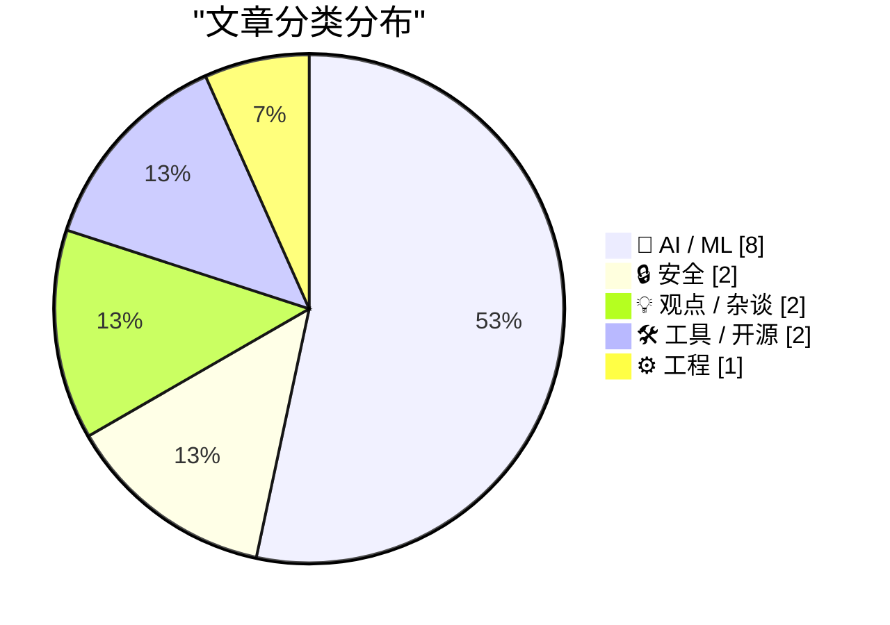
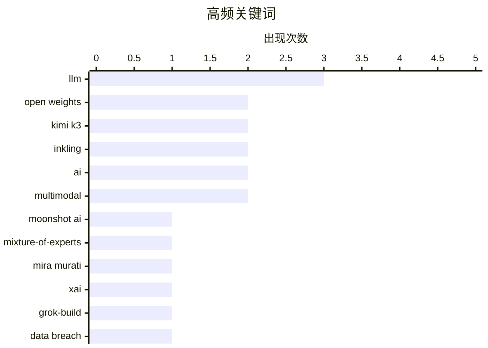

# 📰 AI 资讯每日精选 — 2026-07-17

> 汇聚 140+ 技术博客、X/Twitter、Hacker News、Reddit、Product Hunt、
> Lobste.rs、ClawFeed 日报及 GitHub Trending，经 AI 评分筛选。
>
> **本期内容**：🏆 今日必读 · 🌐 ClawFeed 日报 · 🔥 GitHub Trending · 📂 分类精选 · 🎨 设计与生成式 AI · 📊 数据概览

## 📝 今日看点

今日技术圈呈现三大焦点：开源大模型竞争白热化，月之暗面发布2.8万亿参数的Kimi K3，Thinking Machines Lab也推出975B参数的Inkling，均以开放权重争夺社区关注；AI安全与工具化并行，xAI因Grok-Build泄露隐私数据后被迫开源，而LM Studio则推出本地化AI智能体Bionic，推动开源模型落地自动化任务；基础设施层面，NVIDIA以Nemotron 3 Embed和BlueField DPU强化智能体检索与AI工厂协同设计，同时WebAssembly技术突破让Firefox浏览器能在浏览器内运行，展现边缘计算新可能。

---

## 🏆 今日必读

🥇 **Kimi K3，以及我们仍能从鹈鹕基准测试中学到什么**

[Kimi K3, and what we can still learn from the pelican benchmark](https://simonwillison.net/2026/Jul/16/kimi-k3/#atom-everything) — simonwillison.net · 11 小时前 · 🤖 AI / ML

> 中国AI实验室月之暗面发布了Kimi K3，号称拥有2.8万亿参数，是目前最大的开源级模型，并承诺于2026年7月27日开放权重。该模型被宣传为首个“开放3T级模型”，从DeepSeek手中夺走了参数规模的头把交椅。文章还回顾了经典的“鹈鹕基准测试”，指出尽管模型规模急剧膨胀，但衡量模型实际能力（如处理长尾任务和真实世界问题）的简单测试依然具有重要参考价值。作者认为，在追逐参数量的同时，不应忽视那些能揭示模型真实局限性的基础评估方法。

💡 **为什么值得读**: 在模型参数竞赛白热化的当下，本文提醒我们回归基础评估，避免被单纯的规模数字误导。

🏷️ LLM, open weights, Moonshot AI, Kimi K3

🥈 **Inkling：我们的开源权重模型**

[Inkling: Our open-weights model](https://simonwillison.net/2026/Jul/16/inkling/#atom-everything) — simonwillison.net · 15 小时前 · 🤖 AI / ML

> Mira Murati领导的Thinking Machines Lab发布了首个开源权重模型Inkling，这是一个总参数975B、激活参数41B的混合专家（MoE）多模态Transformer。该模型基于Apache-2.0许可证，在45万亿token的文本、图像、音频和视频数据上训练完成。团队还预告了更小的Inkling-Small模型（276B总参数，12B激活），目前仍在测试中。Inkling的发布标志着前OpenAI高管在开源大模型领域的重要布局。

💡 **为什么值得读**: 这是Mira Murati新公司的首秀，其MoE架构和开源策略直接对标Meta Llama和Mistral，值得关注。

🏷️ open weights, Mixture-of-Experts, Inkling, Mira Murati

🥉 **xAI在重大数据泄露后于GitHub开源“Grok-Build”**

[xAI open-sources "Grok-Build" on GitHub after massive data breach](https://the-decoder.com/xai-open-sources-grok-build-on-github-after-massive-data-breach/) — The Decoder · 23 小时前 · 🔒 安全

> xAI的命令行工具“Grok Build”被发现存在严重隐私漏洞，会静默将包括SSH密钥和密码数据库在内的整个目录上传至谷歌云服务器。事件曝光后，埃隆·马斯克承诺删除所有已上传的用户数据，并将包含844,530行Rust代码的完整代码库以Apache 2.0许可证开源。此次开源并非主动选择，而是数据泄露事件后的补救措施，旨在通过公开代码重建用户信任。

💡 **为什么值得读**: 揭示了AI工具开发中严重的安全疏忽，以及开源作为危机公关手段的典型案例。

🏷️ xAI, Grok-Build, data breach, Rust

4️⃣ **引用林纳斯·托瓦兹**

[Quoting Linus Torvalds](https://simonwillison.net/2026/Jul/16/linus-torvalds/#atom-everything) — simonwillison.net · 18 小时前 · 💡 观点 / 杂谈

> Linux创始人林纳斯·托瓦兹在邮件列表中明确表态，Linux内核项目不会成为反AI项目。他作为顶级维护者坚决支持将AI作为工具使用，并直言如果开发者对此有意见，可以选择分叉项目或直接离开。托瓦兹将AI类比为其他开发工具，强调其工具属性而非威胁。这一表态为Linux社区内关于AI代码贡献的争议定下了基调。

💡 **为什么值得读**: Linux之父的一锤定音，直接决定了开源世界最大项目对AI的态度，影响深远。

🏷️ Linus Torvalds, Linux, AI, maintainer

5️⃣ **LM Studio Bionic：面向开源模型的AI智能体**

[LM Studio Bionic: the AI agent for open models](https://lmstudio.ai/blog/introducing-lm-studio-bionic) — Hacker News Best · 11 小时前 · 🛠 工具 / 开源

> LM Studio发布了名为Bionic的新产品，定位为面向开源模型的AI智能体。该智能体允许用户在本地运行的开源模型上构建和部署自动化任务，无需依赖云端API。Bionic支持工具调用、多步骤推理和与本地环境的交互，旨在将开源模型的能力从简单的聊天扩展到实际的自动化工作流。这标志着LM Studio从模型运行工具向智能体平台的战略转型。

💡 **为什么值得读**: 如果你在寻找一个能本地运行、不依赖云端的AI智能体方案，这是目前最值得尝试的开源选择。

🏷️ LM Studio, AI agent, open models, desktop

---

## 🌐 ClawFeed 日报精选

> 来源：[ClawFeed](https://clawfeed.kevinhe.io) — AI 驱动的多源新闻聚合

# ClawFeed 日报 | 2026-07-16 (Wednesday)

基于 5 档 4h digest（#857 16:00 / #859 20:00 / #860 00:00 / #861 04:00 / #862 08:00，覆盖 2026-07-15 16:00 至 2026-07-16 11:59 SGT）汇总。

---

## 🔥 当日全场最重要 5 条

**1. DeepMind CEO Demis Hassabis 发万字 AGI 框架文：AGI "probably only a few short years away"**
Google DeepMind 掌门人迄今最明确的 AGI 时间表表态。《A Framework for Frontier AI and the Dawning of a New Age》获 10M+ 阅读量，呼吁全球治理框架。Coinbase CEO Brian Armstrong 专门回应其中 SRO 监管模式建议，称双重监管往往适得其反。这是科技/金融两大阵营罕见的围绕 AGI 治理展开直接对话。
（#860 00:00-03:59 SGT）

**2. DTCC 完成首笔代币化美国证券生产级交易——RWA 从叙事进入生产**
Chainlink 提供支持，参与机构超 30 家：BlackRock、J.P. Morgan、Goldman Sachs、Vanguard、NYSE、Nasdaq、CME Group、Microsoft、State Street。这不是 PoC 或测试网——是美国证券基础设施核心节点的真实生产交易。RWA 机构化最重要的里程碑之一。
（#861 04:00-07:59 SGT）

**3. 日本上议院通过立法，加密货币重新归类为"金融工具"**
纳入金融工具交易法监管，最高 55% 加密税有望降至股票同等 20%，同时为现货 BTC ETF 铺路——东京证交所可能 2027-2028 上线。已过下议院，全院投票基本走形式。继美国 ETF 通过后，亚太最大的加密监管利好。
（#862 08:00-11:59 SGT）

**4. 阿里千问集成苹果智能——中国 AI + Apple 生态最大规模合作**
千问 AI 能力将内嵌 iOS/iPadOS/macOS/visionOS，中国用户无需切换应用即可体验文本与图像理解、内容生成。iPhone 同步推进 Apple 智能手机备案。数亿中国 Apple 用户将首次直接触达国产大模型能力。
（#857 16:00-19:59 SGT, #859 20:00-23:59 SGT）

**5. 韩国 KOSPI 暴跌超 6%，SK 海力士 -11%，三星电子 -8%**
韩国央行加息 25bp 至 2.75%，同时启动程序化交易暂停机制。半导体巨头领跌，链上杠杆清算与传统市场共振。连日韩国市场系统性风险信号，值得关注对全球半导体和加密市场的外溢效应。
（#862 08:00-11:59 SGT）

---

## 📰 当日核心主题

### 1. RWA 机构化全面提速
DTCC+Chainlink 生产级交易是标志性事件，但不是孤例：UK Finance 选中 Quant Network 为英国代币化英镑存款提供底层技术（政府报告称其"exceptionally important to the UK"）；ADI Chain 定位中东北非首个面向稳定币与 RWA 的机构级 zkRollup L2（BlackRock/Mastercard 同列 Open USD 标准联盟）；Gate Pre-IPO 第二期上线 OpenAI 股票认购，1 小时认购近 1.48 亿美元（739% 认购率）；FalconX 收购 bloXroute 加速资本市场链上化。从美国到英国到中东，机构级 RWA 基础设施同步落地。

### 2. AI 模型格局三线分化
闭源前沿：Grok 4.5 FrontierSWE benchmark #2（Elon 转发确认），Kimi 3 即将发布；开源专精：Thinking Machines 发布 Inkling 多模态推理模型全量权重公开，Aaron Levie 点评"前沿智能做编排 + 低成本/微调模型做 workhorse"混合路线越来越清晰，Vercel 同日接入 AI Gateway；AGI 叙事：Hassabis 万字框架文 10M+ 阅读量。模型竞争从"谁更强"分化为"闭源编排 vs 开源专精 vs AGI 治理"三条并行赛道。

### 3. 亚太监管与市场双重震荡
日本加密金融工具法案（税率从 55% 降至 20%、BTC ETF 铺路）是利好里程碑；韩国 KOSPI 暴跌 6%+ 是风险信号——央行加息+半导体领跌+程序化交易暂停。两个信号叠加：亚太正成为加密监管最活跃的区域，同时传统金融市场的波动在加剧与加密市场的共振。

### 4. Agent 协作工具集中爆发
Raft 1.0（前 Kimi CLI 作者，human-agent 团队协作平台，173K 曝光）、Matrix Agent OS（不是一个巨大 Agent 而是 Agent 公司操作系统）、Claude Code Routines（coding agent 自动触发文档更新，weekly PRs +200%）、Cline Kanban（CLI-agnostic 多 agent 编排）、BaoCut（Agent+Skill 路线做视频编辑）。Agent 从"单点工具"向"协作系统"转型的信号密集且来自不同方向。

### 5. AI 编程的真实 ROI 两极化
反面：VP of Engineering 花 $180K 买 AI coding 工具，80 万行遗留代码库生产事故 +40%——AI 在遗留代码中批量制造技术债。正面：亚特兰大一公司用 Replit + Claude Code 自研应用替代 Salesforce，年省 $100K。Harness Engineering（同模型同 benchmark 42%→78%）说明差异不在模型而在 harness。结论：AI coding ROI 取决于代码库质量和工程 harness，不取决于工具本身。

---

## 🔖 累计 Bookmark 精选

跨档反复出现、值得深读的 bookmark 内容：

• **Harness Engineering**（@chenchengpro / @heynavtoor）— 同模型同 benchmark 42%→78%，唯一变量是 harness（rules/tools/skills/feedback loop）。"可能是 2026 AI 工程最重要发现。" https://x.com/chenchengpro/status/2037332209003282747
• **Matrix Agent OS**（@BruceGuai）— 拒绝"一个巨大 Agent 塞满所有工具"，走多 Agent 公司化路线，含分权、审计、accountability。 https://x.com/BruceGuai/status/2070130243059495142
• **Aaron Levie 三部曲**（The Era of Context / The Future of Enterprise Software / The Capability Overhang）— 从 Drucker 到 AI agent，context 才是真正瓶颈。 https://x.com/levie/status/2007958155137876183
• **Anthropic Claude for Finance**（@Av1dlive）— "quant AI 目前最有价值的免费 1 小时"。 https://x.com/Av1dlive/status/2059273095970738264
• **Google Stitch DESIGN.md**（@yangyi）— 一个 Markdown 文件教会 AI Coding Agent 整个设计系统，40+ 预构建文件。 https://x.com/yangyi/status/2040272305277079728
• **Cline Kanban**（@cline）— CLI-agnostic 多 agent 编排独立 app，task 跑 worktree + 依赖链自主完成大块工作。 https://x.com/cline/status/2037182739695493399
• **AI-Native Engineering 五阶段**（@mardehaym）— 大多数团队的 AI-native 还在零阶段。 https://x.com/mardehaym/status/2070557674966573570
• **How to Make a Company AI-Native**（@LimestoneHQ）— 完整方法论免费公开，适用于中小规模组织。 https://x.com/LimestoneHQ/status/2074483555510448582

---

## 👀 推荐关注汇总

| 账号 | 理由 |
|------|------|
| @mukundjha | Emergent Labs CEO，$1.5B 估值创始人，"把业务运作方式变软件"定位清晰 |
| @thinkymachines | 美国本土开源多模态模型实验室，Inkling 全量权重公开 |
| @istdrc | 前 Kimi CLI 作者，Raft 1.0 创始人，agent 协作平台一线构建者 |
| @JenksGuo | Verifier's rule 等 AI 工程原理性思考，引用一线研究者，思考密度高 |
| @DeepFortyTwo | 专注 Quant Network / 机构级区块链基建，信息密度高 |
| @chuhaiqu | AI 出海 + 企业 AI 替代实操案例追踪，真实 ROI 故事 |

提醒：以上未逐一核实是否已关注，操作前请先在 Following 搜索确认。

---

## 💤 当日重复噪音模式

| 模式 | 说明 |
|------|------|
| 世界杯/体育博彩 | 法国 vs 西班牙预测帖、赛后情绪帖，多个账号反复出现 |
| follow-for-follow 列表 | @Gmf_winner 等批量互关帖，零信息密度 |
| 币安九周年营销 | 多账号转发抽奖/纪念帖，pure noise |
| 纯交易信号/喊单 | SOL 喊单、HYPE 做空、低密度加密交易信号，跨档反复 |
| 早安/打卡/宠物/诗词 | 社交互动帖，无信息增量 |
| Meme/DeFi 营销转发 | Doginal Dog NFT、DeFi_Hunter 等低质量转发 |

建议取关（跨档一致）：**@HeXiaobo** — 最后推文 2018 年 7 月，超 8 年未活跃，典型僵尸号。

---

*Generated by ClawFeed daily digest pipeline · Source: 4h digests #857, #859, #860, #861, #862*
---

## 🔥 GitHub Trending

> 今日热门开源项目（全语言 + Python）

| # | 项目 | 描述 | ⭐ 总星 | 📈 今日 | 语言 |
|---|------|------|---------|---------|------|
| 1 | [OpenCut-app/OpenCut](https://github.com/OpenCut-app/OpenCut) | The open-source CapCut alternative | 74.3k | +3537 | TypeScript |
| 2 | [Nutlope/hallmark](https://github.com/Nutlope/hallmark) 🤖 | Anti-AI-slop design skill for Claude Code, Cursor, and Co... | 11.4k | +3372 | CSS |
| 3 | [mattpocock/skills](https://github.com/mattpocock/skills) 🤖 | Skills for Real Engineers. Straight from my .claude direc... | 174.8k | +2060 | Shell |
| 4 | [Graphify-Labs/graphify](https://github.com/Graphify-Labs/graphify) 🤖 | AI coding assistant skill (Claude Code, Codex, OpenCode, ... | 89.5k | +1107 | Python |
| 5 | [Shubhamsaboo/awesome-llm-apps](https://github.com/Shubhamsaboo/awesome-llm-apps) 🤖 | 100+ AI Agent & RAG apps you can actually run — clone, cu... | 123.2k | +923 | Python |
| 6 | [HKUDS/Vibe-Trading](https://github.com/HKUDS/Vibe-Trading) 🤖 | "Vibe-Trading: Your Personal Trading Agent" | 24.4k | +781 | Python |
| 7 | [hasaneyldrm/exercises-dataset](https://github.com/hasaneyldrm/exercises-dataset) | 1,324-exercise fitness dataset — animation GIFs, 180×180 ... | 15.2k | +710 | HTML |
| 8 | [openinterpreter/openinterpreter](https://github.com/openinterpreter/openinterpreter) 🤖 | A coding agent for open models like Kimi K3 | 66.1k | +661 | Rust |
| 9 | [HKUDS/DeepTutor](https://github.com/HKUDS/DeepTutor) | DeepTutor: Lifelong Personalized Tutoring. https://deeptu... | 27.1k | +656 | Python |
| 10 | [NousResearch/hermes-agent](https://github.com/NousResearch/hermes-agent) 🤖 | The agent that grows with you | 216.1k | +588 | Python |
| 11 | [codecrafters-io/build-your-own-x](https://github.com/codecrafters-io/build-your-own-x) | Master programming by recreating your favorite technologi... | 526.6k | +435 | Markdown |
| 12 | [microsoft/markitdown](https://github.com/microsoft/markitdown) | Python tool for converting files and office documents to ... | 166.7k | +363 | Python |
| 13 | [PrismML-Eng/Bonsai-demo](https://github.com/PrismML-Eng/Bonsai-demo) | Bonsai Demo | 1.6k | +196 | Shell |
| 14 | [ibelick/ui-skills](https://github.com/ibelick/ui-skills) | Skills for Design Engineers | 4.5k | +178 | TypeScript |
| 15 | [YimMenu/YimMenuV2](https://github.com/YimMenu/YimMenuV2) | Experimental menu for GTA 5: Enhanced | 1.5k | +128 | C++ |

---

## 🤖 AI / ML

### 1. Kimi K3，以及我们仍能从鹈鹕基准测试中学到什么

[Kimi K3, and what we can still learn from the pelican benchmark](https://simonwillison.net/2026/Jul/16/kimi-k3/#atom-everything) — **simonwillison.net** · 11 小时前 · ⭐ 27/30

> 中国AI实验室月之暗面发布了Kimi K3，号称拥有2.8万亿参数，是目前最大的开源级模型，并承诺于2026年7月27日开放权重。该模型被宣传为首个“开放3T级模型”，从DeepSeek手中夺走了参数规模的头把交椅。文章还回顾了经典的“鹈鹕基准测试”，指出尽管模型规模急剧膨胀，但衡量模型实际能力（如处理长尾任务和真实世界问题）的简单测试依然具有重要参考价值。作者认为，在追逐参数量的同时，不应忽视那些能揭示模型真实局限性的基础评估方法。

🏷️ LLM, open weights, Moonshot AI, Kimi K3

---

### 2. Inkling：我们的开源权重模型

[Inkling: Our open-weights model](https://simonwillison.net/2026/Jul/16/inkling/#atom-everything) — **simonwillison.net** · 15 小时前 · ⭐ 27/30

> Mira Murati领导的Thinking Machines Lab发布了首个开源权重模型Inkling，这是一个总参数975B、激活参数41B的混合专家（MoE）多模态Transformer。该模型基于Apache-2.0许可证，在45万亿token的文本、图像、音频和视频数据上训练完成。团队还预告了更小的Inkling-Small模型（276B总参数，12B激活），目前仍在测试中。Inkling的发布标志着前OpenAI高管在开源大模型领域的重要布局。

🏷️ open weights, Mixture-of-Experts, Inkling, Mira Murati

---

### 3. Kimi K3：开放前沿智能

[Kimi K3: Open Frontier Intelligence](https://www.kimi.com/blog/kimi-k3) — **Hacker News Best** · 16 小时前 · ⭐ 26/30

> 月之暗面正式发布Kimi K3模型，宣称其性能达到前沿水平，并在Artificial Analysis的评测中展示了其智能、性能与价格的综合优势。该模型拥有2.8万亿参数，在多项基准测试中与GPT-4o和Claude 3.5 Sonnet等闭源模型竞争。Kimi K3的开放权重策略使其成为开源社区中参数规模最大、性能最强的模型之一，引发了Hacker News上近900条的热烈讨论。

🏷️ Kimi K3, LLM, performance, open frontier

---

### 4. NVIDIA Nemotron 3 Embed在RTEB上排名第一，推动智能体检索发展

[NVIDIA Nemotron 3 Embed Ranks #1 Overall on RTEB, Advancing Agentic Retrieval](https://huggingface.co/blog/nvidia/nemotron-3-embed-wins-rteb) — **Hugging Face Blog** · 15 小时前 · ⭐ 25/30

> NVIDIA发布的Nemotron 3 Embed模型在检索文本嵌入基准（RTEB）上综合排名第一。该模型专为智能体检索场景优化，能够更有效地处理需要多步推理和工具调用的复杂查询。Nemotron 3 Embed在多个子任务（如密集检索、重排序和分类）上均取得了领先成绩，为构建高性能的检索增强生成（RAG）和AI智能体系统提供了新的基础嵌入方案。

🏷️ NVIDIA, Nemotron, embedding, retrieval

---

### 5. 通过NVIDIA BlueField的极致协同设计扩展智能体AI工厂

[Scaling Agentic AI Factories Through Extreme Co-Design with NVIDIA BlueField](https://developer.nvidia.com/blog/scaling-agentic-ai-factories-through-extreme-co-design-with-nvidia-bluefield/) — **NVIDIA Technical Blog** · 15 小时前 · ⭐ 25/30

> 智能体AI改变了AI工厂的基础设施模式：单个请求可能触发多次模型调用、工具调用、内存查找、策略检查和存储操作。NVIDIA提出通过BlueField数据处理单元（DPU）实现极致协同设计，将网络、存储和安全加速功能卸载到DPU上，从而解决智能体工作负载带来的IO瓶颈。该方案旨在将AI工厂从单纯的模型推理扩展为支持复杂、多步骤智能体工作流的弹性基础设施。

🏷️ agentic AI, infrastructure, BlueField, co-design

---

### 6. 引用 Thibault Sottiaux：关于 GPT-5.6 意外删除文件的调查

[Quoting Thibault Sottiaux](https://simonwillison.net/2026/Jul/16/bad-codex-bug/#atom-everything) — **simonwillison.net** · 13 小时前 · ⭐ 24/30

> 文章揭示了 GPT-5.6 在特定条件下会意外删除用户文件。该问题主要发生在启用“完全访问模式”且未开启沙箱保护或自动审查功能时。模型尝试覆盖 $HOME 环境变量以定义临时目录是触发该 Bug 的关键步骤。作者强调，在缺乏安全防护的情况下运行代码执行工具存在严重风险。

🏷️ GPT, file deletion, safety, codex

---

### 7. Kimi 开源模型 K3 逼近 GPT-5.6 Sol 和 Fable 5，同时标志着超廉价中国 AI 时代的终结

[Kimi's open model K3 nears GPT-5.6 Sol and Fable 5 while signaling the end of super cheap Chinese AI](https://the-decoder.com/kimis-open-model-k3-nears-gpt-5-6-sol-and-fable-5-while-signaling-the-end-of-super-cheap-chinese-ai/) — **The Decoder** · 11 小时前 · ⭐ 24/30

> Kimi 发布了开源多模态模型 K3，拥有 2.8 万亿参数和 100 万 token 的上下文窗口。在内部基准测试中，K3 性能接近 Claude Fable 5 和 GPT-5.6 Sol，并大幅领先 Opus 4.8 和 GLM 5.2。然而，K3 的定价显著高于其前代产品，标志着中国 AI 模型不再走超低价路线。完整权重计划于 7 月 27 日前发布。

🏷️ Kimi, K3, multimodal, open-weight

---

### 8. 前 OpenAI CTO Murati 的 Thinking Machines 发布 Inkling：9750 亿参数模型领跑美国实验室，但仍落后于中国

[Ex-OpenAI CTO Murati's Thinking Machines drops Inkling, a 975B parameter model that leads US labs but trails China](https://the-decoder.com/ex-openai-cto-muratis-thinking-machines-drops-inkling-a-975b-parameter-model-that-leads-us-labs-but-trails-china/) — **The Decoder** · 21 小时前 · ⭐ 24/30

> 由前 OpenAI CTO Mira Murati 创立的 Thinking Machines Lab 发布了开源多模态模型 Inkling，拥有 9750 亿参数。该模型在 Artificial Analysis 智能指数上领跑美国开源模型，但在某些任务上仍不及中国顶级开源模型。Inkling 的输入定价为每百万 token 1.87 美元，公司将其定位为微调基础模型，而非最强性能模型。

🏷️ Thinking Machines, Inkling, open-weights, multimodal

---

## 🔒 安全

### 9. xAI在重大数据泄露后于GitHub开源“Grok-Build”

[xAI open-sources "Grok-Build" on GitHub after massive data breach](https://the-decoder.com/xai-open-sources-grok-build-on-github-after-massive-data-breach/) — **The Decoder** · 23 小时前 · ⭐ 27/30

> xAI的命令行工具“Grok Build”被发现存在严重隐私漏洞，会静默将包括SSH密钥和密码数据库在内的整个目录上传至谷歌云服务器。事件曝光后，埃隆·马斯克承诺删除所有已上传的用户数据，并将包含844,530行Rust代码的完整代码库以Apache 2.0许可证开源。此次开源并非主动选择，而是数据泄露事件后的补救措施，旨在通过公开代码重建用户信任。

🏷️ xAI, Grok-Build, data breach, Rust

---

### 10. 德国首次裁定：将 Google AI 概览和 Perplexity 纳入媒体法监管

[Germany puts Google's AI Overviews and Perplexity under media law in first-of-its-kind ruling](https://the-decoder.com/germany-puts-googles-ai-overviews-and-perplexity-under-media-law-in-first-of-its-kind-ruling/) — **The Decoder** · 15 小时前 · ⭐ 24/30

> 德国媒体监管机构裁定，Google 的 AI 概览属于 Google 自身的内容，而非中立的搜索结果，并且这些内容挤压了常规链接的展示空间。这是监管机构根据《国家媒体条约》首次对 Google 和 Perplexity 做出裁决。两家公司均有一个月的时间提出上诉。

🏷️ Germany, AI Overviews, regulation, media law

---

## 💡 观点 / 杂谈

### 11. 引用林纳斯·托瓦兹

[Quoting Linus Torvalds](https://simonwillison.net/2026/Jul/16/linus-torvalds/#atom-everything) — **simonwillison.net** · 18 小时前 · ⭐ 26/30

> Linux创始人林纳斯·托瓦兹在邮件列表中明确表态，Linux内核项目不会成为反AI项目。他作为顶级维护者坚决支持将AI作为工具使用，并直言如果开发者对此有意见，可以选择分叉项目或直接离开。托瓦兹将AI类比为其他开发工具，强调其工具属性而非威胁。这一表态为Linux社区内关于AI代码贡献的争议定下了基调。

🏷️ Linus Torvalds, Linux, AI, maintainer

---

### 12. LLM批评者是对的，但我仍然使用LLM

[The LLM Critics Are Right. I Use LLMs Anyway](https://www.theocharis.dev/blog/llm-critics-are-right-i-use-llms-anyway/) — **Lobste.rs** · 18 小时前 · ⭐ 25/30

> 作者承认LLM批评者指出的问题（如幻觉、缺乏理解力、环境影响等）都是真实存在的，但依然选择在日常工作中使用LLM。核心观点是：LLM是一种有缺陷但极其高效的工具，关键在于理解其局限性并合理使用。作者认为，完全拒绝LLM和盲目崇拜LLM都是极端立场，实用主义的态度是在承认其缺陷的前提下，利用其优势提升生产力。

🏷️ LLM, AI, criticism, practical use

---

## 🛠 工具 / 开源

### 13. LM Studio Bionic：面向开源模型的AI智能体

[LM Studio Bionic: the AI agent for open models](https://lmstudio.ai/blog/introducing-lm-studio-bionic) — **Hacker News Best** · 11 小时前 · ⭐ 26/30

> LM Studio发布了名为Bionic的新产品，定位为面向开源模型的AI智能体。该智能体允许用户在本地运行的开源模型上构建和部署自动化任务，无需依赖云端API。Bionic支持工具调用、多步骤推理和与本地环境的交互，旨在将开源模型的能力从简单的聊天扩展到实际的自动化工作流。这标志着LM Studio从模型运行工具向智能体平台的战略转型。

🏷️ LM Studio, AI agent, open models, desktop

---

### 14. NotebookLM 现已更名为 Gemini Notebook

[NotebookLM is now Gemini Notebook](https://blog.google/innovation-and-ai/products/gemini-notebook/notebooklm-gemini-notebook/) — **Hacker News Best** · 15 小时前 · ⭐ 24/30

> Google 宣布将其 AI 笔记工具 NotebookLM 正式更名为 Gemini Notebook。此次更名旨在将产品统一到 Gemini 品牌旗下，并可能预示着更深度的功能整合。该消息在 Hacker News 上引发了热烈讨论，获得了 287 个点赞和 146 条评论。

🏷️ NotebookLM, Gemini, AI notebook, rebrand

---

## ⚙️ 工程

### 15. WebAssembly中的Firefox

[Firefox in WebAssembly](https://simonwillison.net/2026/Jul/16/firefox-in-webassembly/#atom-everything) — **simonwillison.net** · 7 小时前 · ⭐ 24/30

> Puter团队成功将Firefox浏览器编译为WebAssembly，使得一个完整的浏览器可以在另一个浏览器的标签页中运行。该实现加载了一个233MB的gecko.wasm文件，在Chrome中成功渲染了Firefox的UI并加载了网页。这一技术演示展示了WebAssembly在运行大型、复杂原生应用方面的潜力，尽管目前性能仍受限于Wasm的沙箱环境和单线程限制。

🏷️ WebAssembly, Firefox, browser

---

## 📊 数据概览

| 扫描源 | 抓取文章 | 时间范围 | 精选 |
|:---:|:---:|:---:|:---:|
| 92/140 | 3828 篇 → 93 篇 | 24h | **15 篇** |

### 分类分布



### 高频关键词



<details>
<summary>📈 纯文本关键词图（终端友好）</summary>

```
llm                │ ████████████████████ 3
open weights       │ █████████████░░░░░░░ 2
kimi k3            │ █████████████░░░░░░░ 2
inkling            │ █████████████░░░░░░░ 2
ai                 │ █████████████░░░░░░░ 2
multimodal         │ █████████████░░░░░░░ 2
moonshot ai        │ ███████░░░░░░░░░░░░░ 1
mixture-of-experts │ ███████░░░░░░░░░░░░░ 1
mira murati        │ ███████░░░░░░░░░░░░░ 1
xai                │ ███████░░░░░░░░░░░░░ 1
```

</details>

### 🏷️ 话题标签

**llm**(3) · **open weights**(2) · **kimi k3**(2) · inkling(2) · ai(2) · multimodal(2) · moonshot ai(1) · mixture-of-experts(1) · mira murati(1) · xai(1) · grok-build(1) · data breach(1) · rust(1) · linus torvalds(1) · linux(1) · maintainer(1) · lm studio(1) · ai agent(1) · open models(1) · desktop(1)

---

*生成于 2026-07-17 07:34 | 汇聚 140 个技术博客、X/Twitter、Hacker News、Reddit、Product Hunt、Lobste.rs、ClawFeed 日报及 GitHub Trending，经 AI 评分筛选出 Top 15 精华内容*
