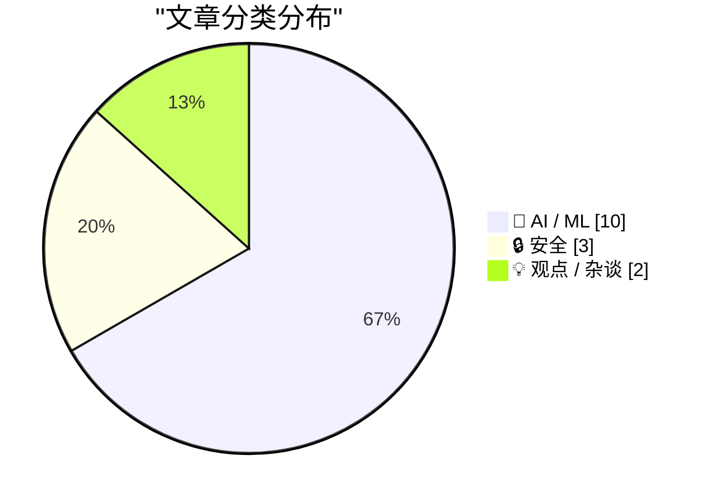
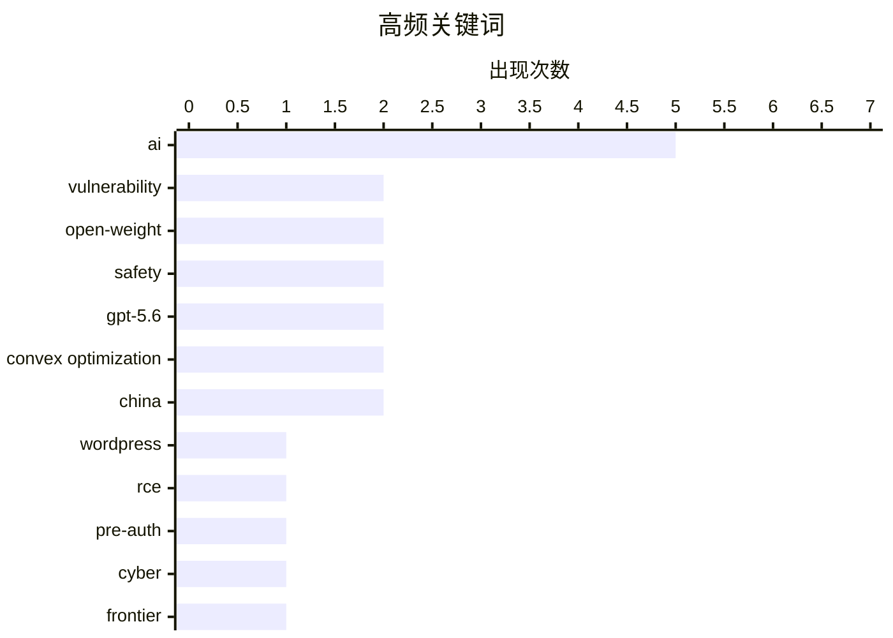

# 📰 AI 资讯每日精选 — 2026-07-19

> 汇聚 140+ 技术博客、X/Twitter、Hacker News、Reddit、Product Hunt、
> Lobste.rs、ClawFeed 日报及 GitHub Trending，经 AI 评分筛选。
>
> **本期内容**：🏆 今日必读 · 🌐 ClawFeed 日报 · 🔥 GitHub Trending · 📂 分类精选 · 🎨 设计与生成式 AI · 📊 数据概览

## 📝 今日看点

今日技术圈呈现两大核心趋势：AI能力持续突破成本与性能边界，开源模型迅速逼近闭源前沿，如Kimi K3以极低训练成本比肩GPT-5系列，而GPT-5.6更被用于攻克凸优化领域三十年理论空白；与此同时，安全威胁与治理争议同步升级，WordPress核心曝出无需凭证的远程代码执行漏洞，OpenSSL也发现仅需11字节即可触发的拒绝服务漏洞，而五角大楼则明确将“缓慢采用”视为比“不完美对齐”更大的风险，折射出AI军事化与商业狂热下的决策失衡。

---

## 🏆 今日必读

🥇 **wp2shell：WordPress 核心中的预认证远程代码执行漏洞**

[wp2shell: Pre Authentication RCE in WordPress Core](https://wp2shell.com/) — Lobste.rs · 13 小时前 · 🔒 安全

> 该文章披露了 WordPress 核心中存在一个严重的预认证远程代码执行（RCE）漏洞，命名为 wp2shell。攻击者无需任何用户凭证即可利用该漏洞，在目标服务器上执行任意代码。漏洞根源在于 WordPress 对特定输入数据的处理存在缺陷，导致可以绕过身份验证机制。该漏洞影响所有主流 WordPress 版本，官方已发布紧急安全更新进行修复。建议所有 WordPress 站点管理员立即升级至最新版本以防范潜在攻击。

💡 **为什么值得读**: WordPress 占据全球超过 40% 的网站份额，此预认证 RCE 漏洞影响面极广，安全从业者和站长必须第一时间了解并修复。

🏷️ WordPress, RCE, pre-auth, vulnerability

🥈 **开源权重模型现在以极低的成本追平四个月前的前沿网络性能**

[Open-weight models now match frontier cyber performance from just four months ago at a fraction of the cost](https://the-decoder.com/open-weight-models-now-match-frontier-cyber-performance-from-just-four-months-ago-at-a-fraction-of-the-cost/) — The Decoder · 21 小时前 · 🤖 AI / ML

> 英国人工智能安全研究所（AISI）发布报告指出，GLM-5.2 和 DeepSeek V4-Pro 等开源权重模型在网络攻击能力上已逼近四至七个月前闭源前沿模型的水平。2025 年初，这一差距仍有六至十个月，表明开源模型追赶速度正在加快。报告同时发现，开源模型的安全防护措施基本无效，导致防御者准备时间更短。结论是开源模型的能力提升正在压缩安全响应窗口，对网络防御构成新挑战。

💡 **为什么值得读**: AISI 的权威数据量化了开源与闭源模型在网络安全能力上的差距变化，对理解 AI 安全格局和防御策略制定有直接参考价值。

🏷️ open-weight, cyber, safety, frontier

🥉 **Kimi K3 时刻**

[The Kimi K3 Moment](https://stephen.bochinski.dev/blog/2026/07/18/the-kimi-k3-moment/) — Hacker News Best · 14 小时前 · 🤖 AI / ML

> 文章探讨了 Kimi K3 模型发布所带来的行业影响，将其称为“K3 时刻”。K3 在多项基准测试中展现出与 GPT-5 系列相当的性能，但训练成本仅为后者的一个零头。这一突破表明，通过创新的架构和训练方法，小团队也能在 AI 前沿领域实现重大突破。作者认为 K3 的出现将加速 AI 民主化进程，并迫使头部公司重新评估其技术壁垒。

💡 **为什么值得读**: Kimi K3 被视为中国 AI 追赶 OpenAI 的关键里程碑，文章深入分析了其技术路径和行业意义，对关注 AI 竞争格局的读者极具价值。

🏷️ Kimi, K3, LLM, breakthrough

4️⃣ **GPT-5.6 使用提示词关闭了凸优化领域一个 30 年的空白**

[GPT-5.6 used a prompt to close a 30-year gap in convex optimization](https://old.reddit.com/r/math/comments/1uxj3cy/after_openais_cdc_proof_announcement_gpt56_used_a/) — Hacker News Best · 18 小时前 · 🤖 AI / ML

> 在 OpenAI 宣布 CDC 证明之后，GPT-5.6 被用于解决凸优化领域一个悬而未决 30 年的理论问题。研究人员通过精心设计的提示词，引导模型生成了完整的数学证明，该证明随后在 Lean 定理证明器中得到形式化验证。这一成果标志着大语言模型在高级数学研究领域取得了实质性突破，能够解决长期困扰人类专家的难题。结论是，LLM 正从辅助工具转变为数学发现的新引擎。

💡 **为什么值得读**: 这是大模型首次在形式化验证下解决一个长达 30 年的数学难题，证明了 AI 在理论科学中的真实潜力，而非仅仅处理常规问题。

🏷️ GPT-5.6, convex optimization, math

5️⃣ **LG 显示器通过 Windows 更新在未经用户同意的情况下静默安装软件**

[LG monitors silently install software through Windows Update without consent](https://videocardz.com/newz/lg-monitors-silently-install-software-through-windows-update-without-user-consent) — Hacker News Best · 21 小时前 · 🔒 安全

> 报道揭露 LG 显示器通过 Windows Update 渠道，在用户不知情且未获同意的情况下静默安装名为“LG OnScreen Control”的软件。该行为绕过了用户对系统更新的控制权，且安装的软件会持续运行后台进程。用户即使卸载该软件，下次系统更新时仍会被重新安装。此事件引发了对硬件厂商滥用 Windows 更新机制和用户隐私权的广泛批评。

💡 **为什么值得读**: 涉及硬件厂商利用系统级更新机制侵犯用户选择权，对任何 Windows 用户都是切身相关的隐私和安全警示。

🏷️ LG, Windows Update, privacy, bloatware

---

## 🌐 ClawFeed 日报精选

> 来源：[ClawFeed](https://clawfeed.kevinhe.io) — AI 驱动的多源新闻聚合

# ClawFeed 日报 | 2026-07-18 (Friday)

聚合来源：4h digest #871-#875（00:00-19:59 SGT），#876（20:00-23:59）未产出。

## 🔥 当日全场最重要 5 条

1. **Moonshot AI 发布 Kimi K3** — 2.8万亿参数、百万级上下文、原生多模态。Delta Attention 解码速度提升 6.3x，训练效率+25%（开销<2%）。杨植麟给了一场从头构建前沿模型的 masterclass。Aaron Levie 引 Gavin Baker：K3 可能是 AI 的重要拐点。

2. **Boris Cherny AI 采纳四阶段模型** — 1.1M views / 9.3K likes。"一个人 10x 了产出，但组织其余人没跟上。" 方法论：stop prompting, start looping。

3. **杨植麟 agent swarm 哲学** — "单 agent 撞墙→一个老板、一千个工人。" Agent swarm + long context 是 Kimi 工程化路径，与 Anthropic sub-agent 架构对照。

4. **Replit Self-Driving Company** — 6个月工程师代码产出3倍，review时间不变，回退率持平。Andreessen："Ultra amazing"。

5. **Anthropic 人才路线图逆向** — Karpathy 进预训练组（AI造AI），核心引擎+训练效率信号最强。"人事就是路线图。"

## 📰 核心主题：Kimi K3架构创新（跨4个digest）、AI-Native工程方法论（三篇联读）、AI商业分层/WAIC、AI就业冲击

## 👀 推荐关注：@_LuoFuli（小米MiMo）、@runinfrai（YC F26推理）、@handotdev（Mintlify CEO）、@istdrc（Raft创始人）

## 💤 噪音：bookmarks零轮换、Minara重复4期、followingSample固定池---

## 🔥 GitHub Trending

> 今日热门开源项目（全语言 + Python）

| # | 项目 | 描述 | ⭐ 总星 | 📈 今日 | 语言 |
|---|------|------|---------|---------|------|
| 1 | [codecrafters-io/build-your-own-x](https://github.com/codecrafters-io/build-your-own-x) | Master programming by recreating your favorite technologi... | 528.5k | +1126 | Markdown |
| 2 | [Robbyant/lingbot-map](https://github.com/Robbyant/lingbot-map) | A feed-forward 3D foundation model for reconstructing sce... | 13.2k | +831 | Python |
| 3 | [HKUDS/DeepTutor](https://github.com/HKUDS/DeepTutor) | DeepTutor: Lifelong Personalized Tutoring. https://deeptu... | 27.7k | +370 | Python |
| 4 | [tirth8205/code-review-graph](https://github.com/tirth8205/code-review-graph) 🤖 | Local-first code intelligence graph for MCP and CLI. Buil... | 20.3k | +355 | Python |
| 5 | [PostHog/posthog](https://github.com/PostHog/posthog) 🤖 | 🦔 PostHog is the leading platform for building self-driv... | 36.7k | +338 | Python |
| 6 | [anthropics/skills](https://github.com/anthropics/skills) 🤖 | Public repository for Agent Skills | 162.5k | +291 | Python |
| 7 | [KnockOutEZ/wigolo](https://github.com/KnockOutEZ/wigolo) 🤖 | The go-to web for your AI coding agent — local-first sear... | 1.4k | +203 | TypeScript |
| 8 | [rohitg00/ai-engineering-from-scratch](https://github.com/rohitg00/ai-engineering-from-scratch) 🤖 | Learn it. Build it. Ship it for others. | 39.3k | +191 | Python |
| 9 | [lyogavin/airllm](https://github.com/lyogavin/airllm) | AirLLM 70B inference with single 4GB GPU | 23.4k | +161 | Jupyter Notebook |
| 10 | [datawhalechina/hello-agents](https://github.com/datawhalechina/hello-agents) | 📚 《从零开始构建智能体》——从零开始的智能体原理与实践教程 | 67.1k | +158 | Python |
| 11 | [ibelick/ui-skills](https://github.com/ibelick/ui-skills) | Skills for Design Engineers | 5.2k | +123 | TypeScript |
| 12 | [OpenSenseNova/SenseNova-U1](https://github.com/OpenSenseNova/SenseNova-U1) | SenseNova-U series: Native Unified Paradigm with NEO-unif... | 4.0k | +97 | Python |
| 13 | [elder-plinius/G0DM0D3](https://github.com/elder-plinius/G0DM0D3) 🤖 | LIBERATED AI CHAT | 9.6k | +69 | TypeScript |
| 14 | [MoonshotAI/kimi-cli](https://github.com/MoonshotAI/kimi-cli) 🤖 | Kimi Code CLI is your next CLI agent. | 9.6k | +65 | Python |
| 15 | [apache/ossie](https://github.com/apache/ossie) 🤖 | Apache Ossie, industry wide specification effort to stand... | 1.3k | +47 | Python |

---

## 🤖 AI / ML

### 1. 开源权重模型现在以极低的成本追平四个月前的前沿网络性能

[Open-weight models now match frontier cyber performance from just four months ago at a fraction of the cost](https://the-decoder.com/open-weight-models-now-match-frontier-cyber-performance-from-just-four-months-ago-at-a-fraction-of-the-cost/) — **The Decoder** · 21 小时前 · ⭐ 26/30

> 英国人工智能安全研究所（AISI）发布报告指出，GLM-5.2 和 DeepSeek V4-Pro 等开源权重模型在网络攻击能力上已逼近四至七个月前闭源前沿模型的水平。2025 年初，这一差距仍有六至十个月，表明开源模型追赶速度正在加快。报告同时发现，开源模型的安全防护措施基本无效，导致防御者准备时间更短。结论是开源模型的能力提升正在压缩安全响应窗口，对网络防御构成新挑战。

🏷️ open-weight, cyber, safety, frontier

---

### 2. Kimi K3 时刻

[The Kimi K3 Moment](https://stephen.bochinski.dev/blog/2026/07/18/the-kimi-k3-moment/) — **Hacker News Best** · 14 小时前 · ⭐ 26/30

> 文章探讨了 Kimi K3 模型发布所带来的行业影响，将其称为“K3 时刻”。K3 在多项基准测试中展现出与 GPT-5 系列相当的性能，但训练成本仅为后者的一个零头。这一突破表明，通过创新的架构和训练方法，小团队也能在 AI 前沿领域实现重大突破。作者认为 K3 的出现将加速 AI 民主化进程，并迫使头部公司重新评估其技术壁垒。

🏷️ Kimi, K3, LLM, breakthrough

---

### 3. GPT-5.6 使用提示词关闭了凸优化领域一个 30 年的空白

[GPT-5.6 used a prompt to close a 30-year gap in convex optimization](https://old.reddit.com/r/math/comments/1uxj3cy/after_openais_cdc_proof_announcement_gpt56_used_a/) — **Hacker News Best** · 18 小时前 · ⭐ 26/30

> 在 OpenAI 宣布 CDC 证明之后，GPT-5.6 被用于解决凸优化领域一个悬而未决 30 年的理论问题。研究人员通过精心设计的提示词，引导模型生成了完整的数学证明，该证明随后在 Lean 定理证明器中得到形式化验证。这一成果标志着大语言模型在高级数学研究领域取得了实质性突破，能够解决长期困扰人类专家的难题。结论是，LLM 正从辅助工具转变为数学发现的新引擎。

🏷️ GPT-5.6, convex optimization, math

---

### 4. 五角大楼的新 AI 手册：将缓慢采用视为比不完美对齐更大的风险

[The Pentagon's new AI playbook treats slow adoption as a bigger risk than imperfect alignment](https://the-decoder.com/the-pentagons-new-ai-playbook-treats-slow-adoption-as-a-bigger-risk-than-imperfect-alignment/) — **The Decoder** · 23 小时前 · ⭐ 24/30

> 美国海军部签署了一项新战略，旨在“武器化”数据和 AI，并打造“AI 优先”舰队。计划包括在军舰上直接运行大语言模型，并设立 AI 战争委员会来优先处理作战场景。该手册的核心信息是，在 AI 军事应用上行动过慢的风险大于“不完美对齐”的风险。这标志着美国军方对 AI 的态度从谨慎评估转向激进部署。

🏷️ Pentagon, AI, military, adoption

---

### 5. Fable 5 与 GPT-5.6 Sol 在 NP 难问题上的对决：/goal 提示有帮助吗？

[Fable 5 vs. GPT-5.6 Sol on an NP-Hard Problem: Does /goal help?](https://charlesazam.com/blog/fable-5-gpt-5-6-sol-goal/) — **Hacker News Best** · 20 小时前 · ⭐ 24/30

> 文章对比测试了 Fable 5 和 GPT-5.6 Sol 在解决 NP 难问题上的表现，重点评估了添加 /goal 提示词对模型性能的影响。实验结果显示，GPT-5.6 Sol 在多数测试用例中优于 Fable 5，而 /goal 提示词对两个模型的解题成功率均有显著提升。作者通过定量分析指出，明确的子目标分解提示能有效引导模型在复杂推理任务中保持方向。结论是，提示工程在解决高难度计算问题上仍至关重要。

🏷️ Fable 5, GPT-5.6, NP-hard, benchmark

---

### 6. 在 OpenAI 宣布 CDC 证明后，GPT-5.6 使用类似提示词关闭了凸优化领域一个 30 年的空白，并在 Lean 中验证

[After OpenAI’s CDC proof announcement, GPT-5.6 used a similar prompt to close a 30-year gap in convex optimization, verified in Lean](https://www.reddit.com/r/singularity/comments/1uzwy9q/after_openais_cdc_proof_announcement_gpt56_used_a/) — **r/singularity** · 17 小时前 · ⭐ 24/30

> 继 OpenAI 的 CDC 证明成果之后，GPT-5.6 被用于解决凸优化中一个存在 30 年的理论空白。研究人员采用了与 CDC 证明类似的提示策略，引导模型生成了完整的数学证明。该证明已通过 Lean 定理证明器的形式化验证，确保了其逻辑正确性。这一成果进一步证实了大语言模型在高级数学推理中的能力，表明其可以系统性地解决长期未解难题。

🏷️ GPT, convex optimization, Lean, proof

---

### 7. AI竞赛一分为二：中国发起开源权重“起义”

[AI race splits in two as China wages open-weight insurgency [Axios]](https://www.reddit.com/r/singularity/comments/1uzz6v5/ai_race_splits_in_two_as_china_wages_openweight/) — **r/singularity** · 16 小时前 · ⭐ 24/30

> 文章指出全球AI竞赛正分裂为两大阵营：一方以美国闭源巨头（如OpenAI、Google）为代表，另一方则是中国主导的开源权重（open-weight）模型“起义”。中国通过发布DeepSeek、Qwen等高性能开源模型，迫使美国公司重新思考商业模式，并吸引了全球开发者生态。这种分裂不仅体现在技术路线上，更涉及地缘政治和AI治理话语权的争夺。作者认为，开源权重模式正在成为挑战美国AI霸权的最有效策略。

🏷️ China, open-weight, AI race, open source

---

### 8. AI聊天机器人读X光片：即使犯错也极度自信，存在危险

[AI chatbots reading X-rays can be dangerously confident even when they're wrong](https://the-decoder.com/ai-chatbots-reading-x-rays-can-be-dangerously-confident-even-when-theyre-wrong/) — **The Decoder** · 22 分钟前 · ⭐ 23/30

> RadLE 2.0基准测试专门评估放射科AI模型能否判断何时应将诊断交由人类处理。结果显示，许多模型在给出错误发现时仍表现出完全自信，而人类放射科医生的判断仍显著领先。文章强调，在AI能够独立诊断之前，它必须首先学会何时保持沉默、承认不确定性。核心结论是：当前AI在医学影像领域的“过度自信”是阻碍其临床落地的关键风险。

🏷️ AI, radiology, confidence, safety

---

### 9. 中国新成立的世界人工智能合作组织：习近平构建平行AI秩序的最清晰举措

[China's new World Artificial Intelligence Cooperation Organization is President Xi's clearest play yet for a parallel AI order](https://the-decoder.com/chinas-new-world-artificial-intelligence-cooperation-organization-is-president-xis-clearest-play-yet-for-a-parallel-ai-order/) — **The Decoder** · 21 小时前 · ⭐ 23/30

> 在上海世界人工智能大会上，习近平宣布为全球南方国家提供5000个AI培训名额，并正式启动“世界人工智能合作组织”。该组织计划后续与东盟、非盟、金砖国家等联盟建立合作中心。文章认为，这是中国系统性地在西方影响力之外构建一个平行的AI治理结构，旨在争夺全球AI规则制定权。核心观点是：中国正通过多边外交和资源输出，打造一个绕开美国主导的AI治理体系。

🏷️ China, AI, geopolitics, cooperation

---

### 10. 一张图揭示AI对Stack Overflow的影响

[What AI did to stackoverflow in a graph](https://data.stackexchange.com/stackoverflow/query/1953768#graph) — **Hacker News Best** · 20 小时前 · ⭐ 23/30

> 该文章通过Stack Exchange数据查询，用一张图表直观展示了AI（尤其是ChatGPT）出现后Stack Overflow问答量的剧烈变化。数据显示，自2022年底以来，Stack Overflow的新问题提交量和回答参与度均出现断崖式下跌。社区活跃度的下降直接反映了开发者从“搜索问答”转向“直接询问AI”的行为迁移。结论是：AI正在从根本上改变开发者获取技术知识的方式，传统问答社区面临生存危机。

🏷️ Stack Overflow, AI, traffic

---

## 🔒 安全

### 11. wp2shell：WordPress 核心中的预认证远程代码执行漏洞

[wp2shell: Pre Authentication RCE in WordPress Core](https://wp2shell.com/) — **Lobste.rs** · 13 小时前 · ⭐ 27/30

> 该文章披露了 WordPress 核心中存在一个严重的预认证远程代码执行（RCE）漏洞，命名为 wp2shell。攻击者无需任何用户凭证即可利用该漏洞，在目标服务器上执行任意代码。漏洞根源在于 WordPress 对特定输入数据的处理存在缺陷，导致可以绕过身份验证机制。该漏洞影响所有主流 WordPress 版本，官方已发布紧急安全更新进行修复。建议所有 WordPress 站点管理员立即升级至最新版本以防范潜在攻击。

🏷️ WordPress, RCE, pre-auth, vulnerability

---

### 12. LG 显示器通过 Windows 更新在未经用户同意的情况下静默安装软件

[LG monitors silently install software through Windows Update without consent](https://videocardz.com/newz/lg-monitors-silently-install-software-through-windows-update-without-user-consent) — **Hacker News Best** · 21 小时前 · ⭐ 26/30

> 报道揭露 LG 显示器通过 Windows Update 渠道，在用户不知情且未获同意的情况下静默安装名为“LG OnScreen Control”的软件。该行为绕过了用户对系统更新的控制权，且安装的软件会持续运行后台进程。用户即使卸载该软件，下次系统更新时仍会被重新安装。此事件引发了对硬件厂商滥用 Windows 更新机制和用户隐私权的广泛批评。

🏷️ LG, Windows Update, privacy, bloatware

---

### 13. OpenSSL HollowByte：隐藏在 11 字节中的拒绝服务漏洞

[OpenSSL HollowByte: A DoS Hiding in 11 Bytes](https://sec.okta.com/articles/2026/06/openssl-hollowbtye-a-dos-hiding-in-11-bytes/) — **Lobste.rs** · 10 小时前 · ⭐ 25/30

> Okta 安全团队披露了 OpenSSL 中的一个高危拒绝服务（DoS）漏洞，命名为 HollowByte。攻击者只需发送一个精心构造的 11 字节数据包，即可触发该漏洞，导致服务进程崩溃。漏洞存在于 TLS 握手阶段的证书验证逻辑中，影响 OpenSSL 3.0 至 3.3 系列版本。该漏洞已被分配 CVE 编号，OpenSSL 项目已发布修复版本。

🏷️ OpenSSL, DoS, vulnerability, security

---

## 💡 观点 / 杂谈

### 14. AI 狂热正在摧毁全球决策能力

[AI Mania Is Eviscerating Global Decision-Making](https://simonwillison.net/2026/Jul/19/ai-mania/#atom-everything) — **simonwillison.net** · 2 小时前 · ⭐ 25/30

> 文章通过匿名咨询案例揭露了大型企业中的 AI 狂热现象：高管们在不了解甚至从未使用过 AI 工具的情况下，盲目推动 AI 项目上马。一位高管承认自己从未用过 ChatGPT，却要求团队制定 AI 战略。这种狂热导致资源浪费、决策质量下降，并忽视了真正的业务问题。作者核心观点是，当前对 AI 的盲目追捧正在系统性地削弱组织的理性决策能力。

🏷️ AI, decision-making, consulting, critique

---

### 15. 审查AI代码并非一个站得住脚的论点

[Reviewing AI Code Is Not A Viable Argument](https://softwaremaxims.com/blog/reviewing-ai-code) — **Lobste.rs** · 15 小时前 · ⭐ 23/30

> 文章反驳了“只要有人审查AI生成的代码，AI编码就是安全的”这一常见观点。作者指出，人类审查者往往对AI代码存在“自动化偏见”，倾向于信任输出而降低警惕；同时，AI代码的复杂性和非人类风格使得传统审查流程效率极低。此外，大规模AI代码生成会淹没审查管道，导致实际审查质量下降。核心结论是：将审查责任完全推给人类，是逃避AI工具本身责任问题的危险借口。

🏷️ AI code, code review, argument

---

## 📊 数据概览

| 扫描源 | 抓取文章 | 时间范围 | 精选 |
|:---:|:---:|:---:|:---:|
| 92/140 | 3823 篇 → 62 篇 | 24h | **15 篇** |

### 分类分布



### 高频关键词



<details>
<summary>📈 纯文本关键词图（终端友好）</summary>

```
ai                  │ ████████████████████ 5
vulnerability       │ ████████░░░░░░░░░░░░ 2
open-weight         │ ████████░░░░░░░░░░░░ 2
safety              │ ████████░░░░░░░░░░░░ 2
gpt-5.6             │ ████████░░░░░░░░░░░░ 2
convex optimization │ ████████░░░░░░░░░░░░ 2
china               │ ████████░░░░░░░░░░░░ 2
wordpress           │ ████░░░░░░░░░░░░░░░░ 1
rce                 │ ████░░░░░░░░░░░░░░░░ 1
pre-auth            │ ████░░░░░░░░░░░░░░░░ 1
```

</details>

### 🏷️ 话题标签

**ai**(5) · **vulnerability**(2) · **open-weight**(2) · safety(2) · gpt-5.6(2) · convex optimization(2) · china(2) · wordpress(1) · rce(1) · pre-auth(1) · cyber(1) · frontier(1) · kimi(1) · k3(1) · llm(1) · breakthrough(1) · math(1) · lg(1) · windows update(1) · privacy(1)

---

*生成于 2026-07-19 07:58 | 汇聚 140 个技术博客、X/Twitter、Hacker News、Reddit、Product Hunt、Lobste.rs、ClawFeed 日报及 GitHub Trending，经 AI 评分筛选出 Top 15 精华内容*
