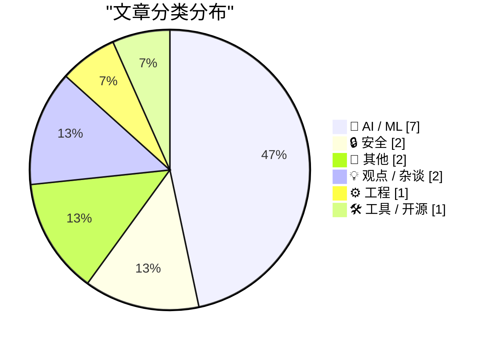
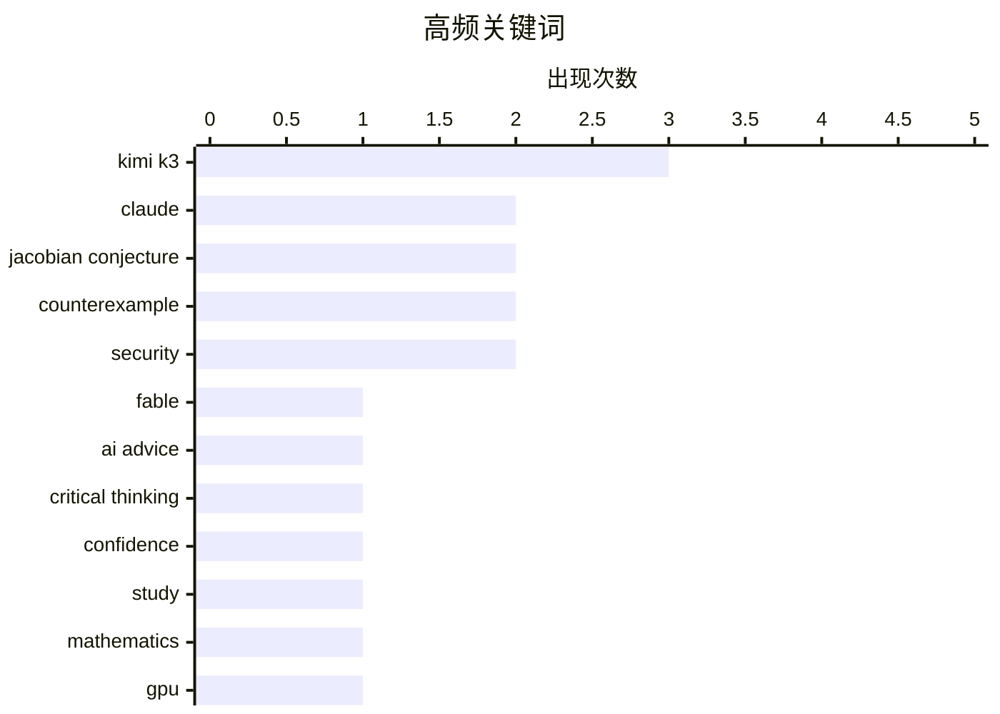

# 📰 AI 资讯每日精选 — 2026-07-20

> 汇聚 140+ 技术博客、X/Twitter、Hacker News、Reddit、Product Hunt、
> Lobste.rs、ClawFeed 日报及 GitHub Trending，经 AI 评分筛选。
>
> **本期内容**：🏆 今日必读 · 🌐 ClawFeed 日报 · 🔥 GitHub Trending · 📂 分类精选 · 🎨 设计与生成式 AI · 📊 数据概览

## 📝 今日看点

今日技术圈呈现三大焦点：AI在高级数学推理中取得突破性进展，Claude模型成功构造出雅可比猜想的反例，验证了AI解决长期未解难题的潜力；与此同时，AI的“双刃剑”效应引发关注，研究显示依赖AI建议会削弱用户批判性思维，导致决策更不准确却更自信；算力供需矛盾持续激化，Moonshot因Kimi K3需求暴增导致GPU容量48小时内耗尽，被迫暂停新订阅，折射出AI推理算力供给的紧张局面。

---

## 🏆 今日必读

🥇 **Claude Fable 发现了雅可比猜想的反例**

[Claude Fable produced a counterexample to the Jacobian Conjecture](https://xcancel.com/__alpoge__/status/2079028340955197566) — Hacker News Best · 7 小时前 · 🤖 AI / ML

> Claude Fable 模型成功构造了一个雅可比猜想的反例，这是一个长期未解的数学难题。该反例通过具体的多项式映射，展示了在特定条件下该猜想不成立。这一发现不仅验证了 AI 在高级数学推理中的潜力，也挑战了传统数学界对猜想的认知。结论是，AI 模型已具备发现重大数学反例的能力，可能加速数学领域的突破。

💡 **为什么值得读**: 这是 AI 首次在纯数学领域发现重大猜想的反例，展示了大型语言模型超越代码生成、进入理论数学推理的里程碑式能力。

🏷️ Claude, Fable, Jacobian Conjecture, counterexample

🥈 **研究显示：AI 建议让人更不准确但更自信**

[AI advice made people less accurate but more confident – sudy](https://thenextweb.com/news/ai-advice-suppresses-critical-thinking-wrong-answers-study) — Hacker News Best · 13 小时前 · 🤖 AI / ML

> 一项新研究发现，依赖 AI 建议会抑制用户的批判性思维，导致决策准确性下降，但用户反而对自己的判断更加自信。实验中，接受 AI 错误建议的参与者，其回答正确率降低，但自我评估的置信度却显著提升。这表明 AI 的“权威性”可能误导用户，使其忽视自身判断。结论是，过度依赖 AI 建议存在认知风险，需要警惕“虚假自信”效应。

💡 **为什么值得读**: 揭示了 AI 辅助决策中一个反直觉的心理学陷阱——AI 不仅可能让你犯错，还会让你对自己的错误更自信，对 AI 产品设计和用户教育有直接警示意义。

🏷️ AI advice, critical thinking, confidence, study

🥉 **Claude 发现了雅可比猜想的反例**

[Claude found a counterexample to the Jacobian Conjecture](https://news.ycombinator.com/item?id=48973869) — Lobste.rs · 3 小时前 · 🤖 AI / ML

> 与 Index 0 内容相同，Claude 模型构造了雅可比猜想的反例。该反例通过具体的多项式映射，展示了在特定条件下该猜想不成立。这一发现验证了 AI 在高级数学推理中的潜力，并挑战了传统数学界对猜想的认知。结论是，AI 模型已具备发现重大数学反例的能力。

💡 **为什么值得读**: 同一事件在 Lobste.rs 社区的讨论，可能包含不同的技术视角或社区评论，值得交叉参考。

🏷️ Claude, Jacobian Conjecture, counterexample, mathematics

4️⃣ **Moonshot 暂停 Kimi K3 新订阅：GPU 需求在 48 小时内达到上限**

[Moonshot pauses new Kimi K3 subscriptions after GPU demand maxes out in 48 hours](https://the-decoder.com/moonshot-pauses-new-kimi-k3-subscriptions-after-gpu-demand-maxes-out-in-48-hours/) — The Decoder · 2 小时前 · 🤖 AI / ML

> Moonshot 公司因 Kimi K3 模型需求激增，在 48 小时内几乎耗尽 GPU 容量，被迫暂停新订阅销售。公司计划拆分订阅模式，以更均匀地分配算力资源。这一事件反映了当前 AI 推理算力供给的紧张局面，以及热门模型上线后可能面临的扩容挑战。结论是，算力瓶颈已成为 AI 服务规模化部署的直接制约因素。

💡 **为什么值得读**: 真实案例展示了 AI 模型爆火后算力供给的脆弱性，对理解 AI 基础设施瓶颈和商业模式调整有直接参考价值。

🏷️ Kimi K3, GPU, subscription, Moonshot

5️⃣ **阿里巴巴 Qwen 发布开源 Qwen 3.8，称其“仅次于 Fable 5”**

[Alibaba's Qwen takes on Kimi K3 with open-weight Qwen 3.8, says model is "second only to Fable 5"](https://the-decoder.com/alibabas-qwen-takes-on-kimi-k3-with-open-weight-qwen-3-8-says-model-is-second-only-to-fable-5/) — The Decoder · 22 小时前 · 🤖 AI / ML

> 阿里巴巴发布了 Qwen 3.8，一个拥有 2.4 万亿参数的多模态 AI 模型。Qwen 团队声称该模型性能与领先模型相当，仅次于 Fable 5。目前已有预览版可用。该模型采用开源权重发布，旨在与 Kimi K3 等模型竞争。结论是，Qwen 3.8 的发布标志着中国大模型在参数规模和性能上进一步逼近全球顶尖水平。

💡 **为什么值得读**: 2.4 万亿参数的开源模型直接对标闭源顶尖模型，对关注大模型竞争格局、开源生态和性能对比的读者极具价值。

🏷️ Qwen 3.8, Alibaba, multimodal, open-weight

---

## 🌐 ClawFeed 日报精选

> 来源：[ClawFeed](https://clawfeed.kevinhe.io) — AI 驱动的多源新闻聚合

# ClawFeed 日报 | 2026-07-19 (Saturday)

> 聚合 6 期 4h digest (#875, #877, #878, #879, #880, #881)，覆盖 00:00-23:59 SGT。

---

## 🔥 当日全场最重要 5 条

1. **Kimi K3 正式发布** — Moonshot AI 发布 2.8 万亿参数模型，百万级上下文，原生多模态。Delta Attention 百万 token 解码加速 6.3x，Attention Residuals 训练效率提升 ~25%（额外开销 <2%）。杨植麟同步发布"如何从头构建前沿模型"masterclass，透明度罕见。260K+ 阅读。
   - 来源: https://x.com/cgtwts/status/2078271715155853331

2. **杨植麟 90 分钟 workshop 直击 Agent 路线之争** — "Claude 没赢在推理——他们赌在 agent 上，但跳过了最关键的一层：最好的 agent 需要最好的基座模型。" 472K 阅读，定义了当日 agent vs 基座模型的核心辩论。
   - 来源: https://x.com/0xCodila/status/2078545384587080105

3. **王煜全（海银资本）AI 投资前瞻** — "2029 年 AI 泡沫将破灭，2030 年遍地是黄金"。投资人中少见的直言派，提问和回答水平超一流。406K 阅读。
   - 来源: https://x.com/0xKevin00/status/2078466405369102834

4. **Boris Cherny（Claude Code 创造者）AI 采纳四阶段模型** — 多数公司卡在"一个人 10x 但全组没跟上"的阶段。1.1M views，痛点普遍引发共鸣。
   - 来源: https://x.com/bcherny/status/2077929379661844559

5. **Sebastian Raschka 长文 "Controlling Reasoning Effort in LLMs"** — 系统讲解 LLM 推理力度控制：inference-time 与 training-time 两个维度如何实现 low/medium/high 三档。直接关联 Claude thinking budget、DeepSeek reasoning token 等前沿工程实践。
   - 来源: https://x.com/dongxi_nlp/status/2078472633096585538

---

## 📰 当日核心主题

### 1. Kimi K3 发布生态（全天主线，6 期均覆盖）
- 2.8T 参数 / 百万上下文 / 原生多模态的技术规格
- 杨植麟 GTC 2026 演讲：重做 Transformer 三大基石（Adam / Attention / Residual Connection），全部开源
- Agent swarm + long context 工程化路径 vs Anthropic sub-agent 架构
- 杨新宇（月之暗面新成员）总结同行四大通病（傲慢/浮躁），321K 阅读

### 2. AI 采纳成熟度（Boris Cherny + mardehaym）
- Cherny 四阶段模型：个人 10x → 组织系统性采纳
- mardehaym AI-Native 工程五阶段：多数团队仍在零
- LimestoneHQ 完整 AI 转型方法论（非巨头公司适用）

### 3. LLM 推理强度控制（Raschka）
- 推理时切换 effort level + 训练时教模型"省着想"
- 直接关联 Claude extended thinking / budget tokens

### 4. AI 投资周期判断（王煜全）
- 2029 泡沫破灭 / 2030 黄金期的周期预测
- 科技投资前瞻的稀缺理性声音

### 5. 开源项目加速
- AI Agent Book（@bojie_li）一天翻倍至 2.6k stars，用 Claude Code + Kimi K3 + Opus 4.8 补全实验代码
- Archify（@t20000622yy）4.7k stars 上 GitHub Trending，Claude/Codex/opencode 上下文管理工具

---

## 🔖 Bookmarks 精选

本日无新增 bookmark，以下为持续在列：

- **@mardehaym** - "The Five Stages of AI-Native Engineering" — 188K views
  https://x.com/mardehaym/status/2070557674966573570
- **@LimestoneHQ** - "How to Make a Company AI-Native" — 104K views
  https://x.com/LimestoneHQ/status/2074483555510448582

---

## 👀 推荐关注汇总

- **@_LuoFuli** (Fuli Luo) — 前 DeepSeek 研究员，现小米 MiMo 核心成员。67.9K followers，底层模型研发一手信息源。https://x.com/_LuoFuli
- **@runinfrai** (RunInfra, YC F26) — 自动优化推理平台，inference infra 赛道早期项目。6.7K followers。https://x.com/runinfrai

⚠️ 未通过浏览器逐一核实是否已关注，操作前请先搜索 Following 避免重复。

---

## 💤 当日重复噪音模式

- **Kimi K3 跨窗口重复传播**：同一批推文（杨植麟演讲、K3 规格、杨新宇观点）在 #875→#881 六期中反复出现，属于大事件的自然衰减传播，非 spam。
- **Bookmarks 全天未刷新**：mardehaym + LimestoneHQ 两条贯穿 6 期，无新增。
- **凌晨窗口空转**（#878, 00:00-03:59 SGT）：周六凌晨 feed 零新增，全为缓存内容。
- **跨期重复标注**：#877/#878/#879/#880 中对同一推文的重复收录均已用 [续] 标记，去重有效。

---

*聚合自 digest #875, #877, #878, #879, #880, #881 | 生成时间: 2026-07-19 23:55 SGT*---

## 🔥 GitHub Trending

> 今日热门开源项目（全语言 + Python）

| # | 项目 | 描述 | ⭐ 总星 | 📈 今日 | 语言 |
|---|------|------|---------|---------|------|
| 1 | [Robbyant/lingbot-map](https://github.com/Robbyant/lingbot-map) | A feed-forward 3D foundation model for reconstructing sce... | 13.9k | +865 | Python |
| 2 | [codecrafters-io/build-your-own-x](https://github.com/codecrafters-io/build-your-own-x) | Master programming by recreating your favorite technologi... | 529.2k | +754 | Markdown |
| 3 | [tirth8205/code-review-graph](https://github.com/tirth8205/code-review-graph) 🤖 | Local-first code intelligence graph for MCP and CLI. Buil... | 22.2k | +663 | Python |
| 4 | [jamiepine/voicebox](https://github.com/jamiepine/voicebox) 🤖 | The open-source AI voice studio. Clone, dictate, create. | 43.8k | +610 | TypeScript |
| 5 | [KnockOutEZ/wigolo](https://github.com/KnockOutEZ/wigolo) 🤖 | The go-to web for your AI coding agent — local-first sear... | 2.2k | +595 | TypeScript |
| 6 | [rohitg00/ai-engineering-from-scratch](https://github.com/rohitg00/ai-engineering-from-scratch) 🤖 | Learn it. Build it. Ship it for others. | 40.1k | +501 | Python |
| 7 | [PostHog/posthog](https://github.com/PostHog/posthog) 🤖 | 🦔 PostHog is the leading platform for building self-driv... | 37.1k | +411 | Python |
| 8 | [MoonshotAI/kimi-cli](https://github.com/MoonshotAI/kimi-cli) 🤖 | Kimi Code CLI is your next CLI agent. | 10.1k | +410 | Python |
| 9 | [kvcache-ai/ktransformers](https://github.com/kvcache-ai/ktransformers) 🤖 | A Flexible Framework for Experiencing Heterogeneous LLM I... | 18.6k | +360 | Python |
| 10 | [lyogavin/airllm](https://github.com/lyogavin/airllm) | AirLLM 70B inference with single 4GB GPU | 23.8k | +358 | Jupyter Notebook |
| 11 | [topoteretes/cognee](https://github.com/topoteretes/cognee) 🤖 | Cognee is the open-source AI memory platform for agents. ... | 28.6k | +303 | Python |
| 12 | [HKUDS/DeepTutor](https://github.com/HKUDS/DeepTutor) | DeepTutor: Lifelong Personalized Tutoring. https://deeptu... | 28.2k | +269 | Python |
| 13 | [1jehuang/jcode](https://github.com/1jehuang/jcode) 🤖 | Coding Agent Harness | 9.2k | +235 | Rust |
| 14 | [Comfy-Org/ComfyUI](https://github.com/Comfy-Org/ComfyUI) 🤖 | The most powerful and modular diffusion model GUI, api an... | 121.5k | +138 | Python |
| 15 | [PKUFlyingPig/cs-self-learning](https://github.com/PKUFlyingPig/cs-self-learning) | 计算机自学指南 | 74.4k | +134 | HTML |

---

## 🤖 AI / ML

### 1. Claude Fable 发现了雅可比猜想的反例

[Claude Fable produced a counterexample to the Jacobian Conjecture](https://xcancel.com/__alpoge__/status/2079028340955197566) — **Hacker News Best** · 7 小时前 · ⭐ 27/30

> Claude Fable 模型成功构造了一个雅可比猜想的反例，这是一个长期未解的数学难题。该反例通过具体的多项式映射，展示了在特定条件下该猜想不成立。这一发现不仅验证了 AI 在高级数学推理中的潜力，也挑战了传统数学界对猜想的认知。结论是，AI 模型已具备发现重大数学反例的能力，可能加速数学领域的突破。

🏷️ Claude, Fable, Jacobian Conjecture, counterexample

---

### 2. 研究显示：AI 建议让人更不准确但更自信

[AI advice made people less accurate but more confident – sudy](https://thenextweb.com/news/ai-advice-suppresses-critical-thinking-wrong-answers-study) — **Hacker News Best** · 13 小时前 · ⭐ 26/30

> 一项新研究发现，依赖 AI 建议会抑制用户的批判性思维，导致决策准确性下降，但用户反而对自己的判断更加自信。实验中，接受 AI 错误建议的参与者，其回答正确率降低，但自我评估的置信度却显著提升。这表明 AI 的“权威性”可能误导用户，使其忽视自身判断。结论是，过度依赖 AI 建议存在认知风险，需要警惕“虚假自信”效应。

🏷️ AI advice, critical thinking, confidence, study

---

### 3. Claude 发现了雅可比猜想的反例

[Claude found a counterexample to the Jacobian Conjecture](https://news.ycombinator.com/item?id=48973869) — **Lobste.rs** · 3 小时前 · ⭐ 26/30

> 与 Index 0 内容相同，Claude 模型构造了雅可比猜想的反例。该反例通过具体的多项式映射，展示了在特定条件下该猜想不成立。这一发现验证了 AI 在高级数学推理中的潜力，并挑战了传统数学界对猜想的认知。结论是，AI 模型已具备发现重大数学反例的能力。

🏷️ Claude, Jacobian Conjecture, counterexample, mathematics

---

### 4. Moonshot 暂停 Kimi K3 新订阅：GPU 需求在 48 小时内达到上限

[Moonshot pauses new Kimi K3 subscriptions after GPU demand maxes out in 48 hours](https://the-decoder.com/moonshot-pauses-new-kimi-k3-subscriptions-after-gpu-demand-maxes-out-in-48-hours/) — **The Decoder** · 2 小时前 · ⭐ 24/30

> Moonshot 公司因 Kimi K3 模型需求激增，在 48 小时内几乎耗尽 GPU 容量，被迫暂停新订阅销售。公司计划拆分订阅模式，以更均匀地分配算力资源。这一事件反映了当前 AI 推理算力供给的紧张局面，以及热门模型上线后可能面临的扩容挑战。结论是，算力瓶颈已成为 AI 服务规模化部署的直接制约因素。

🏷️ Kimi K3, GPU, subscription, Moonshot

---

### 5. 阿里巴巴 Qwen 发布开源 Qwen 3.8，称其“仅次于 Fable 5”

[Alibaba's Qwen takes on Kimi K3 with open-weight Qwen 3.8, says model is "second only to Fable 5"](https://the-decoder.com/alibabas-qwen-takes-on-kimi-k3-with-open-weight-qwen-3-8-says-model-is-second-only-to-fable-5/) — **The Decoder** · 22 小时前 · ⭐ 24/30

> 阿里巴巴发布了 Qwen 3.8，一个拥有 2.4 万亿参数的多模态 AI 模型。Qwen 团队声称该模型性能与领先模型相当，仅次于 Fable 5。目前已有预览版可用。该模型采用开源权重发布，旨在与 Kimi K3 等模型竞争。结论是，Qwen 3.8 的发布标志着中国大模型在参数规模和性能上进一步逼近全球顶尖水平。

🏷️ Qwen 3.8, Alibaba, multimodal, open-weight

---

### 6. David Sacks 称美国 AI 护栏正在削弱模型竞争力：中国 Kimi K3 修复了 15 个 Codex 和 Fable 拒绝修复的安全漏洞

[David Sacks says U.S. AI guardrails are making American models less competitive after China’s Kimi K3 fixed 15 security bugs that Codex and Fable refused](https://www.reddit.com/r/singularity/comments/1v17ck7/david_sacks_says_us_ai_guardrails_are_making/) — **r/singularity** · 9 小时前 · ⭐ 23/30

> David Sacks 指出，美国严格的 AI 安全护栏导致本土模型（如 Codex 和 Fable）拒绝修复某些安全漏洞，而中国的 Kimi K3 则修复了 15 个此类漏洞。他认为这使美国模型在竞争中处于劣势。这一观点引发了关于 AI 安全监管与竞争力平衡的讨论。结论是，过度监管可能反而阻碍美国 AI 模型的安全改进和竞争力提升。

🏷️ AI guardrails, Kimi K3, security, competitiveness

---

### 7. Kimi K3 是否改变了关于蒸馏的争论？

[Does Kimi K3 change the distillation debate?](https://www.reddit.com/r/singularity/comments/1v0owoc/does_kimi_k3_change_the_distillation_debate/) — **r/singularity** · 22 小时前 · ⭐ 23/30

> Kimi K3 在人工智能指数中排名第三，这一成绩难以用“中国模型严重依赖从美国最新模型蒸馏”来解释。因为 Fable 5 和 GPT-5.6 仅比 Kimi K3 早几天上线，不太可能被用于 K3 的蒸馏。虽然较旧的 Claude 输出可能用于后训练，但 K3 的表现似乎反映了中国自身的重大创新。结论是，Kimi K3 的排名挑战了“中国 AI 仅靠蒸馏”的叙事。

🏷️ Kimi K3, distillation, Chinese AI, benchmark

---

## 🔒 安全

### 8. 模糊测试的乐趣：snac2 中的未认证拒绝服务漏洞

[Fuzzing for fun - unauthenticated denial of service in snac2](https://nullenvk.pl/posts/02-snac2-json/) — **Lobste.rs** · 3 小时前 · ⭐ 23/30

> 文章介绍了通过模糊测试在 snac2 中发现的一个未认证拒绝服务漏洞。该漏洞允许攻击者无需认证即可使服务崩溃。作者详细描述了模糊测试的方法、触发漏洞的具体输入以及漏洞的根本原因。结论是，模糊测试是发现此类安全问题的有效手段，即使是小型项目也不应忽视。

🏷️ fuzzing, denial of service, snac2, security

---

### 9. 9to5Mac Uncovers Dozens of Disguised Gambling Apps on the App Store in Brazil

[9to5Mac Uncovers Dozens of Disguised Gambling Apps on the App Store in Brazil](https://9to5mac.com/2026/07/17/investigation-reveals-dozens-of-disguised-gambling-apps-on-the-app-store-in-brazil/) — **daringfireball.net** · 17 小时前 · ⭐ 21/30

> 9to5Mac:


  Brazilian users browsing the App Store rankings in categories
such as Navigation, Travel, and Weather have noticed a growing
number of poorly made games appearing among the top results, m

🏷️ App Store, gambling, fraud, Brazil

---

## 📝 其他

### 10. 最后一项 MPEG-4 Visual 专利已过期

[The Last MPEG-4 Visual Patent Has Expired](https://www.phoronix.com/news/Last-MPEG-4-Patent-Expired) — **Hacker News Best** · 17 小时前 · ⭐ 22/30

> 最后一项与 MPEG-4 Visual（即 DivX/Xvid 使用的编解码器）相关的专利已正式过期。这意味着该视频编码标准现在完全进入公有领域，任何人都可以自由使用而无需支付专利费。这一事件对视频编码、播放器和存档领域有重大影响。结论是，MPEG-4 Visual 的专利过期将消除长期存在的法律风险，促进相关开源和商业应用的进一步发展。

🏷️ MPEG-4, patent, expiry, video codec

---

### 11. Washington Post: Data centers have united Americans of both parties in a shared hatred | Feeling ignored by political and economic powers, people are rallying against computer hubs over concerns about their communities’ future.

[Washington Post: Data centers have united Americans of both parties in a shared hatred | Feeling ignored by political and economic powers, people are rallying against computer hubs over concerns about their communities’ future.](https://www.reddit.com/r/singularity/comments/1v0r6hp/washington_post_data_centers_have_united/) — **r/singularity** · 20 小时前 · ⭐ 22/30

> <table> <tr><td> <a href="https://www.reddit.com/r/singularity/comments/1v0r6hp/washington_post_data_centers_have_united/">  <table> <tr><td> <a href="https://www.reddit.com/r/singularity/comments/1v0sxo1/david_sacks_calls_anthropic_and_openai_a_duopoly/">  <table> <tr><td> <a href="https://www.reddit.com/r/singularity/comments/1v0yd9u/what_happens_when_ai_can_produce_knowledge_humans/">  文章探讨了并行编程的核心原则和哲学，包括数据竞争、锁、原子操作、无锁数据结构等关键概念。作者通过具体示例解释了并行编程中的常见陷阱和最佳实践。结论是，理解并行编程的“道”（原则）比掌握具体 API 更重要，能帮助开发者写出正确且高效的并发代码。

🏷️ parallel programming, concurrency, best practices

---

## 🛠 工具 / 开源

### 15. CodeSizer: Why is that binary so big?

[CodeSizer: Why is that binary so big?](https://github.com/Wren6991/CodeSizer) — **Lobste.rs** · 20 小时前 · ⭐ 22/30

> <p><a href="https://lobste.rs/s/ukyvbo/codesizer_why_is_binary_so_big">Comments</a></p>

🏷️ binary size, code analysis, optimization

---

## 📊 数据概览

| 扫描源 | 抓取文章 | 时间范围 | 精选 |
|:---:|:---:|:---:|:---:|
| 94/140 | 3855 篇 → 55 篇 | 24h | **15 篇** |

### 分类分布



### 高频关键词



<details>
<summary>📈 纯文本关键词图（终端友好）</summary>

```
kimi k3             │ ████████████████████ 3
claude              │ █████████████░░░░░░░ 2
jacobian conjecture │ █████████████░░░░░░░ 2
counterexample      │ █████████████░░░░░░░ 2
security            │ █████████████░░░░░░░ 2
fable               │ ███████░░░░░░░░░░░░░ 1
ai advice           │ ███████░░░░░░░░░░░░░ 1
critical thinking   │ ███████░░░░░░░░░░░░░ 1
confidence          │ ███████░░░░░░░░░░░░░ 1
study               │ ███████░░░░░░░░░░░░░ 1
```

</details>

### 🏷️ 话题标签

**kimi k3**(3) · **claude**(2) · **jacobian conjecture**(2) · counterexample(2) · security(2) · fable(1) · ai advice(1) · critical thinking(1) · confidence(1) · study(1) · mathematics(1) · gpu(1) · subscription(1) · moonshot(1) · qwen 3.8(1) · alibaba(1) · multimodal(1) · open-weight(1) · ai guardrails(1) · competitiveness(1)

---

*生成于 2026-07-20 10:37 | 汇聚 140 个技术博客、X/Twitter、Hacker News、Reddit、Product Hunt、Lobste.rs、ClawFeed 日报及 GitHub Trending，经 AI 评分筛选出 Top 15 精华内容*
