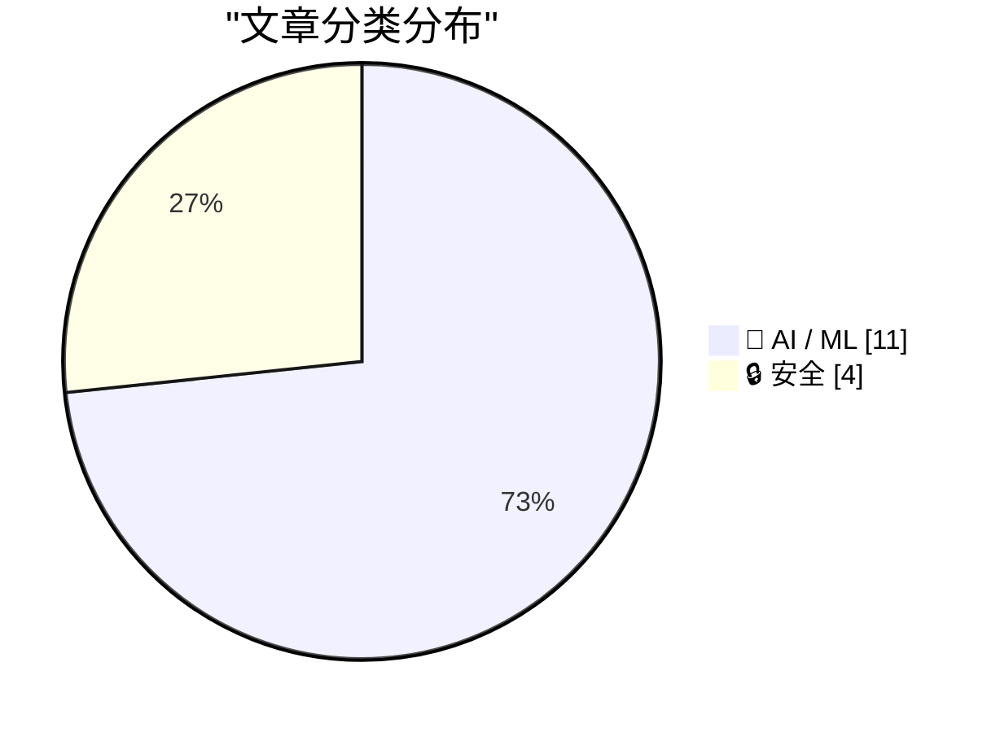
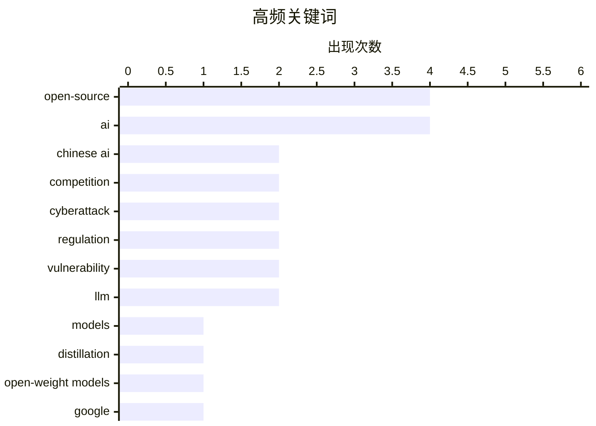

# 📰 AI 资讯每日精选 — 2026-07-21

> 汇聚 140+ 技术博客、X/Twitter、Hacker News、Reddit、Product Hunt、
> Lobste.rs、ClawFeed 日报及 GitHub Trending，经 AI 评分筛选。
>
> **本期内容**：🏆 今日必读 · 🌐 ClawFeed 日报 · 🔥 GitHub Trending · 📂 分类精选 · 🎨 设计与生成式 AI · 📊 数据概览

## 📝 今日看点

今日技术圈的核心焦点集中在AI领域的“开源与封闭”之争以及硬件格局的剧烈变动上。一方面，中美AI模型的开源路线博弈白热化，美国内部正因中国开源模型的崛起而出现游说政府实施禁令的动向，同时美国AI实验室自身在数据使用上的双重标准也引发争议。另一方面，AI基础设施的军备竞赛进入新阶段：谷歌计划将大模型架构直接固化到专用芯片中以求能效飞跃，而英伟达的霸主地位正面临微软转向AMD等客户流失的挑战。此外，AI安全威胁升级，Hugging Face遭遇了完全由自主AI代理发起的入侵，揭示了传统安全护栏的失效风险。

---

## 🏆 今日必读

🥇 **谁害怕中国模型？**

[Who's afraid of Chinese models?](https://stratechery.com/2026/whos-afraid-of-chinese-models/) — Hacker News Best · 22 小时前 · 🤖 AI / ML

> 文章探讨了美国AI实验室在指责中国模型“蒸馏”其技术的同时，自身却使用未经授权的数据进行训练的虚伪性。Ben Thompson提出，美国应通过一项法律，明确将收集数据用于训练模型视为“合理使用”，以解决这一矛盾。该法律还能帮助美国开源模型更有效地与中国对手竞争。核心观点是，与其通过禁令限制中国模型，不如通过立法明确数据使用的合法性，从而在公平规则下竞争。

💡 **为什么值得读**: Ben Thompson提出了一个直击当前AI开源与数据版权争议核心的立法建议，视角独特且具有现实操作性。

🏷️ Chinese AI, models, competition, open-source

🥈 **谁害怕中国模型？**

[Who’s Afraid of Chinese Models?](https://simonwillison.net/2026/Jul/20/afraid-of-chinese-models/#atom-everything) — simonwillison.net · 16 小时前 · 🤖 AI / ML

> 文章引用了Ben Thompson在Stratechery上的观点，指出美国AI实验室一方面禁止他人蒸馏自己的模型，另一方面却使用未经许可的数据进行训练，存在双重标准。Thompson提议美国通过立法，明确将收集数据用于训练模型视为“合理使用”。这一提案旨在解决法律矛盾，并帮助美国开源模型更有效地与中国模型竞争。

💡 **为什么值得读**: Simon Willison的评论精准提炼了原文核心矛盾，适合快速了解这场关于开源与数据版权的辩论焦点。

🏷️ Chinese AI, distillation, open-weight models

🥉 **谷歌“Frozen v2”芯片：将Gemini架构直接固化到硅片中，效率大幅提升**

[Google's "Frozen v2" chip reportedly bakes Gemini's architecture directly into silicon for efficiency gains](https://the-decoder.com/googles-frozen-v2-chip-reportedly-bakes-geminis-architecture-directly-into-silicon-for-efficiency-gains/) — The Decoder · 15 小时前 · 🤖 AI / ML

> 谷歌正在开发一款名为“Frozen v2”的服务器芯片，该芯片将Gemini大模型的架构直接固化到硬件中。据内部消息，其能效比当前TPU高出6到10倍。该芯片计划于2028年推出，将大幅降低谷歌的AI推理成本，使其在与OpenAI和Anthropic的竞争中拥有显著的价格优势。

💡 **为什么值得读**: 揭示了谷歌在AI芯片领域的激进硬件定制策略，6-10倍的能效提升对AI基础设施成本影响巨大。

🏷️ Google, TPU, Gemini, chip design

4️⃣ **英伟达AI芯片霸主地位动摇：微软转向AMD，Anthropic或紧随其后**

[Nvidia's grip on AI chips weakens as Microsoft turns to AMD and Anthropic may follow](https://the-decoder.com/nvidias-grip-on-ai-chips-weakens-as-microsoft-turns-to-amd-and-anthropic-may-follow/) — The Decoder · 16 小时前 · 🤖 AI / ML

> 微软正在Azure AI基础设施中部署AMD全新的Helios平台，该平台计划于2026年下半年挑战英伟达的GPU系统。同时，Anthropic的公开GitHub资料显示其也在测试AMD硬件。这些动向表明，大型云厂商正在积极寻求英伟达之外的替代方案，这将削弱英伟达在AI芯片市场的定价权。

💡 **为什么值得读**: 提供了微软和Anthropic转向AMD的具体证据，是观察AI芯片市场格局变化的关键信号。

🏷️ Nvidia, AMD, Microsoft, AI chips

5️⃣ **Hugging Face称AI代理入侵其基础设施，并以AI反击**

[Hugging Face says an AI agent hacked its infrastructure, and it used AI to fight back](https://the-decoder.com/hugging-face-says-an-ai-agent-hacked-its-infrastructure-and-it-used-ai-to-fight-back/) — The Decoder · 21 小时前 · 🔒 安全

> Hugging Face报告称，其部分生产基础设施遭到一次完全由自主AI代理系统发起的攻击，攻击涉及数千个由代理框架控制的操作。在取证分析过程中，商业AI模型的安全护栏因无法区分漏洞利用数据和真实攻击数据，反而阻碍了防御工作。Hugging Face最终也使用AI技术进行了反击。

💡 **为什么值得读**: 这是首个公开的、由AI代理完全自主发起的重大基础设施攻击案例，对AI安全防御具有里程碑式的警示意义。

🏷️ AI agent, cyberattack, Hugging Face, security

---

## 🔥 GitHub Trending

> 今日热门开源项目（全语言 + Python）

| # | 项目 | 描述 | ⭐ 总星 | 📈 今日 | 语言 |
|---|------|------|---------|---------|------|
| 1 | [bojieli/ai-agent-book](https://github.com/bojieli/ai-agent-book) 🤖 | 《深入理解 AI Agent：设计原理与工程实践》（李博杰 著）开源主仓库：全书正文、编译版 PDF 与按章配套代码 | 12.8k | +4434 | Python |
| 2 | [tirth8205/code-review-graph](https://github.com/tirth8205/code-review-graph) 🤖 | Local-first code intelligence graph for MCP and CLI. Buil... | 24.1k | +1833 | Python |
| 3 | [oblien/openship](https://github.com/oblien/openship) | Self-hosted deployment platform | 5.3k | +1641 | TypeScript |
| 4 | [diegosouzapw/OmniRoute](https://github.com/diegosouzapw/OmniRoute) 🤖 | Never stop coding. Free MIT AI gateway: one endpoint, 268... | 22.6k | +1107 | TypeScript |
| 5 | [every-app/open-seo](https://github.com/every-app/open-seo) | Open source alternative to Semrush and Ahrefs | 6.2k | +939 | TypeScript |
| 6 | [msitarzewski/agency-agents](https://github.com/msitarzewski/agency-agents) 🤖 | A complete AI agency at your fingertips - From frontend w... | 135.1k | +862 | Shell |
| 7 | [rohitg00/ai-engineering-from-scratch](https://github.com/rohitg00/ai-engineering-from-scratch) 🤖 | Learn it. Build it. Ship it for others. | 41.1k | +823 | Python |
| 8 | [jamiepine/voicebox](https://github.com/jamiepine/voicebox) 🤖 | The open-source AI voice studio. Clone, dictate, create. | 44.7k | +821 | TypeScript |
| 9 | [KnockOutEZ/wigolo](https://github.com/KnockOutEZ/wigolo) 🤖 | The go-to web for your AI coding agent — local-first sear... | 2.8k | +689 | TypeScript |
| 10 | [1jehuang/jcode](https://github.com/1jehuang/jcode) 🤖 | The most intelligent agent harness for code | 10.0k | +568 | Rust |
| 11 | [Robbyant/lingbot-map](https://github.com/Robbyant/lingbot-map) | A feed-forward 3D foundation model for reconstructing sce... | 14.5k | +565 | Python |
| 12 | [microsoft/Ontology-Playground](https://github.com/microsoft/Ontology-Playground) | Free, open-source web app for learning about ontologies a... | 1.9k | +464 | TypeScript |
| 13 | [kvcache-ai/ktransformers](https://github.com/kvcache-ai/ktransformers) 🤖 | A Flexible Framework for Experiencing Heterogeneous LLM I... | 18.8k | +458 | Python |
| 14 | [MoonshotAI/kimi-cli](https://github.com/MoonshotAI/kimi-cli) 🤖 | Kimi Code CLI is your next CLI agent. | 10.4k | +410 | Python |
| 15 | [handy-computer/transcribe.cpp](https://github.com/handy-computer/transcribe.cpp) | ggml speech-to-text inference for 16+ model families | 1.4k | +395 | C++ |

---

## 🤖 AI / ML

### 1. 谁害怕中国模型？

[Who's afraid of Chinese models?](https://stratechery.com/2026/whos-afraid-of-chinese-models/) — **Hacker News Best** · 22 小时前 · ⭐ 27/30

> 文章探讨了美国AI实验室在指责中国模型“蒸馏”其技术的同时，自身却使用未经授权的数据进行训练的虚伪性。Ben Thompson提出，美国应通过一项法律，明确将收集数据用于训练模型视为“合理使用”，以解决这一矛盾。该法律还能帮助美国开源模型更有效地与中国对手竞争。核心观点是，与其通过禁令限制中国模型，不如通过立法明确数据使用的合法性，从而在公平规则下竞争。

🏷️ Chinese AI, models, competition, open-source

---

### 2. 谁害怕中国模型？

[Who’s Afraid of Chinese Models?](https://simonwillison.net/2026/Jul/20/afraid-of-chinese-models/#atom-everything) — **simonwillison.net** · 16 小时前 · ⭐ 26/30

> 文章引用了Ben Thompson在Stratechery上的观点，指出美国AI实验室一方面禁止他人蒸馏自己的模型，另一方面却使用未经许可的数据进行训练，存在双重标准。Thompson提议美国通过立法，明确将收集数据用于训练模型视为“合理使用”。这一提案旨在解决法律矛盾，并帮助美国开源模型更有效地与中国模型竞争。

🏷️ Chinese AI, distillation, open-weight models

---

### 3. 谷歌“Frozen v2”芯片：将Gemini架构直接固化到硅片中，效率大幅提升

[Google's "Frozen v2" chip reportedly bakes Gemini's architecture directly into silicon for efficiency gains](https://the-decoder.com/googles-frozen-v2-chip-reportedly-bakes-geminis-architecture-directly-into-silicon-for-efficiency-gains/) — **The Decoder** · 15 小时前 · ⭐ 26/30

> 谷歌正在开发一款名为“Frozen v2”的服务器芯片，该芯片将Gemini大模型的架构直接固化到硬件中。据内部消息，其能效比当前TPU高出6到10倍。该芯片计划于2028年推出，将大幅降低谷歌的AI推理成本，使其在与OpenAI和Anthropic的竞争中拥有显著的价格优势。

🏷️ Google, TPU, Gemini, chip design

---

### 4. 英伟达AI芯片霸主地位动摇：微软转向AMD，Anthropic或紧随其后

[Nvidia's grip on AI chips weakens as Microsoft turns to AMD and Anthropic may follow](https://the-decoder.com/nvidias-grip-on-ai-chips-weakens-as-microsoft-turns-to-amd-and-anthropic-may-follow/) — **The Decoder** · 16 小时前 · ⭐ 26/30

> 微软正在Azure AI基础设施中部署AMD全新的Helios平台，该平台计划于2026年下半年挑战英伟达的GPU系统。同时，Anthropic的公开GitHub资料显示其也在测试AMD硬件。这些动向表明，大型云厂商正在积极寻求英伟达之外的替代方案，这将削弱英伟达在AI芯片市场的定价权。

🏷️ Nvidia, AMD, Microsoft, AI chips

---

### 5. 五大美国科技巨头隐性债务因不透明的AI融资飙升至1.65万亿美元

[Five US tech giants' hidden debts soar to $1.65T on opaque AI funding](https://asia.nikkei.com/business/technology/five-us-tech-giants-hidden-debts-soar-to-1.65tn-on-opaque-ai-funding) — **Hacker News Best** · 5 小时前 · ⭐ 26/30

> 文章揭露了微软、谷歌、亚马逊、Meta和苹果五家科技巨头因大量投资AI基础设施而产生的巨额隐性债务，总额高达1.65万亿美元。这些债务主要通过复杂的租赁和融资安排产生，透明度极低。这种不透明的融资模式可能隐藏着巨大的财务风险，一旦AI投资回报不及预期，将引发连锁反应。

🏷️ AI funding, tech giants, debt, finance

---

### 6. 中国的开源AI战略正在获胜

[China’s open-weights AI strategy is winning](https://werd.io/american-ai-is-locked-down-and-proprietary-its-losing/) — **Hacker News Best** · 19 小时前 · ⭐ 26/30

> 文章指出，美国AI公司倾向于封闭和专有模式，而中国则大力推行开源权重模型战略。这种开放策略使得中国模型在全球开发者社区中获得了更广泛的采用和更快的迭代速度。作者认为，美国封闭的AI策略正在输掉这场竞争，因为开源模式在创新速度、社区生态和成本控制上具有明显优势。

🏷️ open-source, AI, China, strategy

---

### 7. 消息来源：特朗普政府部分官员正重启对国外开源模型实施事实禁令的努力

[Sources: parts of the Trump administration are reigniting efforts to implement de facto bans on foreign open-source models, as Chinese AI models gain momentum](https://www.reddit.com/r/LocalLLaMA/comments/1v1j3ns/sources_parts_of_the_trump_administration_are/) — **r/LocalLLaMA** · 21 小时前 · ⭐ 26/30

> 随着中国AI模型势头渐强，特朗普政府内部的部分官员正在重新推动对国外开源模型实施事实上的禁令。此举旨在限制中国开源模型在美国的传播和使用，以保护美国本土AI产业。该消息反映了美国政府在AI领域日益加剧的地缘政治焦虑。

🏷️ regulation, open-source, AI, ban

---

### 8. 美国主要AI实验室游说政府，即将禁止开源模型

[US gov't lobbied by major US labs is about to ban open source models.](https://www.reddit.com/r/LocalLLaMA/comments/1v2bf3t/us_govt_lobbied_by_major_us_labs_is_about_to_ban/) — **r/LocalLLaMA** · 2 小时前 · ⭐ 26/30

> 消息称，在美国主要AI实验室的游说下，美国政府即将出台政策禁止开源模型。这些实验室认为开源模型（尤其是来自中国的）对其商业利益构成威胁。此举引发了开源社区的强烈反对，认为这将扼杀创新并损害美国自身的AI竞争力。

🏷️ regulation, open-source, AI, lobbying

---

### 9. Xiaomi-Robotics-1 shows that more data beats bigger models when training robots to move

[Xiaomi-Robotics-1 shows that more data beats bigger models when training robots to move](https://the-decoder.com/xiaomi-robotics-1-shows-that-more-data-beats-bigger-models-when-training-robots-to-move/) — **The Decoder** · 39 分钟前 · ⭐ 25/30

> Xiaomi trained Xiaomi-Robotics-1 on more than 100,000 hours of motion data collected by people using camera-equipped handheld grippers rather than robots. Adding data improved performance far more tha

🏷️ robotics, data scaling, motion data, Xiaomi

---

### 10. Kimi K3, Qwen 3.8, and Anthropic's (Potential) Unravelling

[Kimi K3, Qwen 3.8, and Anthropic's (Potential) Unravelling](https://www.emergingtrajectories.com/lh/frontier-lab-economics/) — **Hacker News Best** · 18 小时前 · ⭐ 25/30

> Article URL: https://www.emergingtrajectories.com/lh/frontier-lab-economics/
Comments URL: https://news.ycombinator.com/item?id=48980019
Points: 335
# Comments: 310

🏷️ LLM, economics, frontier, competition

---

### 11. 543 tok/s single-request Qwen3.6-35B-A3B on one RTX 5090 over a 65K-token decode

[543 tok/s single-request Qwen3.6-35B-A3B on one RTX 5090 over a 65K-token decode](https://www.reddit.com/r/LocalLLaMA/comments/1v1no8e/543_toks_singlerequest_qwen3635ba3b_on_one_rtx/) — **r/LocalLLaMA** · 18 小时前 · ⭐ 25/30

> <!-- SC_OFF --><div class="md"><p><a href="https://reddit.com/link/1v1no8e/video/k5zlxk2ideeh1/player">An example</a></p> <h1>TL;DR</h1> <p>I have open-sourced <a href="https://github.com/Neroued/ninf

🏷️ inference, CUDA, LLM, performance

---

## 🔒 安全

### 12. Hugging Face称AI代理入侵其基础设施，并以AI反击

[Hugging Face says an AI agent hacked its infrastructure, and it used AI to fight back](https://the-decoder.com/hugging-face-says-an-ai-agent-hacked-its-infrastructure-and-it-used-ai-to-fight-back/) — **The Decoder** · 21 小时前 · ⭐ 26/30

> Hugging Face报告称，其部分生产基础设施遭到一次完全由自主AI代理系统发起的攻击，攻击涉及数千个由代理框架控制的操作。在取证分析过程中，商业AI模型的安全护栏因无法区分漏洞利用数据和真实攻击数据，反而阻碍了防御工作。Hugging Face最终也使用AI技术进行了反击。

🏷️ AI agent, cyberattack, Hugging Face, security

---

### 13. 过去24小时内发布了432个Linux内核CVE漏洞

[432 Linux kernel CVEs published in the last 24 hours](https://lore.kernel.org/linux-cve-announce/) — **Lobste.rs** · 5 小时前 · ⭐ 26/30

> Linux内核安全公告列表在24小时内发布了432个新的CVE（通用漏洞披露）编号。这一异常高的数字表明可能是一次大规模的漏洞批量披露或审计结果。这些漏洞覆盖了内核的多个子系统，对运行Linux的服务器、云基础设施和嵌入式设备构成广泛的安全威胁。

🏷️ Linux, kernel, CVE, vulnerability

---

### 14. 7 Sandbox Escape Vulnerabilities Across 4 Coding Agent Vendors

[7 Sandbox Escape Vulnerabilities Across 4 Coding Agent Vendors](https://www.pillar.security/blog/the-week-of-sandbox-escapes) — **Lobste.rs** · 19 小时前 · ⭐ 26/30

> <p><a href="https://lobste.rs/s/bper0d/7_sandbox_escape_vulnerabilities_across">Comments</a></p>

🏷️ sandbox escape, vulnerability, coding agent, AI

---

### 15. Hacker wipes Romania's land registry database

[Hacker wipes Romania's land registry database](https://news.risky.biz/risky-bulletin-hacker-wipes-romanias-entire-land-registry-database/) — **Hacker News Best** · 20 小时前 · ⭐ 25/30

> Article URL: https://news.risky.biz/risky-bulletin-hacker-wipes-romanias-entire-land-registry-database/
Comments URL: https://news.ycombinator.com/item?id=48978605
Points: 641
# Comments: 353

🏷️ hack, database, Romania, cyberattack

---

## 📊 数据概览

| 扫描源 | 抓取文章 | 时间范围 | 精选 |
|:---:|:---:|:---:|:---:|
| 93/140 | 3849 篇 → 93 篇 | 24h | **15 篇** |

### 分类分布



### 高频关键词



<details>
<summary>📈 纯文本关键词图（终端友好）</summary>

```
open-source   │ ████████████████████ 4
ai            │ ████████████████████ 4
chinese ai    │ ██████████░░░░░░░░░░ 2
competition   │ ██████████░░░░░░░░░░ 2
cyberattack   │ ██████████░░░░░░░░░░ 2
regulation    │ ██████████░░░░░░░░░░ 2
vulnerability │ ██████████░░░░░░░░░░ 2
llm           │ ██████████░░░░░░░░░░ 2
models        │ █████░░░░░░░░░░░░░░░ 1
distillation  │ █████░░░░░░░░░░░░░░░ 1
```

</details>

### 🏷️ 话题标签

**open-source**(4) · **ai**(4) · **chinese ai**(2) · competition(2) · cyberattack(2) · regulation(2) · vulnerability(2) · llm(2) · models(1) · distillation(1) · open-weight models(1) · google(1) · tpu(1) · gemini(1) · chip design(1) · nvidia(1) · amd(1) · microsoft(1) · ai chips(1) · ai agent(1)

---

*生成于 2026-07-21 09:36 | 汇聚 140 个技术博客、X/Twitter、Hacker News、Reddit、Product Hunt、Lobste.rs、ClawFeed 日报及 GitHub Trending，经 AI 评分筛选出 Top 15 精华内容*
