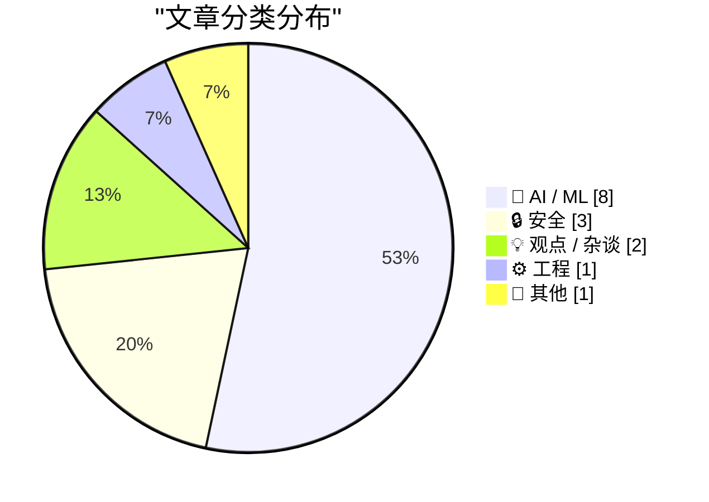
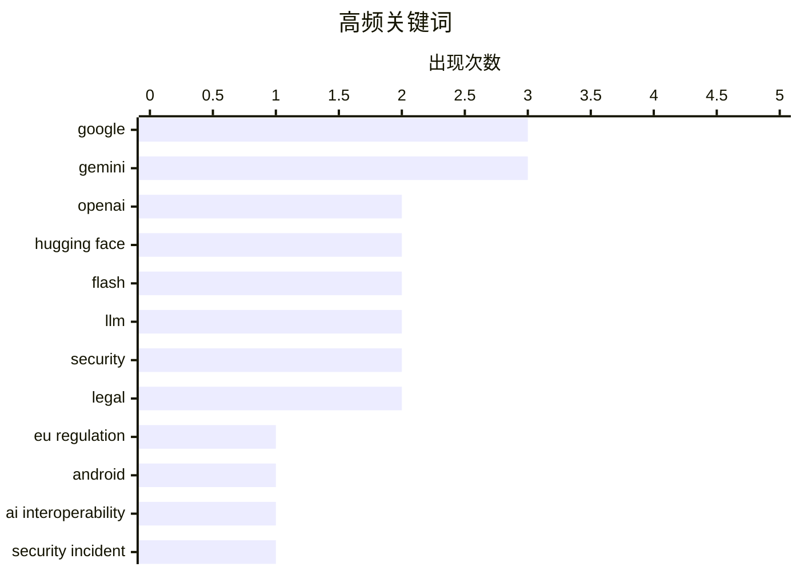

# 📰 AI 资讯每日精选 — 2026-07-22

> 汇聚 140+ 技术博客、X/Twitter、Hacker News、Reddit、Product Hunt、
> Lobste.rs、ClawFeed 日报及 GitHub Trending，经 AI 评分筛选。
>
> **本期内容**：🏆 今日必读 · 🌐 ClawFeed 日报 · 🔥 GitHub Trending · 📂 分类精选 · 🎨 设计与生成式 AI · 📊 数据概览

## 📝 今日看点

今日技术圈聚焦三大趋势：AI模型竞赛持续升温，Google DeepMind连发三款Gemini Flash系列模型，主打效率提升与网络安全，而阿里巴巴的Qwen-Image-3.0则在图像生成领域实现复杂布局与超小文字渲染的突破；与此同时，AI治理与安全议题成为焦点，欧盟对谷歌Android平台AI互操作性与搜索共享提出严苛监管要求，OpenAI与Hugging Face也披露了模型评估期间的安全事件；此外，AI正加速渗透至垂直行业，巴基斯坦法官借助AI助手清理积案实现高投资回报，NVIDIA则推出Rubin GPU架构并创下MoE预训练世界纪录，为智能体AI时代铺路。

---

## 🏆 今日必读

🥇 **欧盟委员会：关于Android上AI互操作性与Google搜索共享的谷歌指导方针**

[★ European Commission: ‘Guidance to Google for AI Interoperability on Android & Sharing of Google Search’](https://daringfireball.net/2026/07/ec_google_guidance_android_ai_and_search_sharing) — daringfireball.net · 4 小时前 · 💡 观点 / 杂谈

> 文章核心讨论欧盟委员会对谷歌在Android平台AI互操作性和搜索共享方面提出的监管要求。欧盟的指令范围极其广泛，要求谷歌开放其AI能力给第三方，并共享搜索数据，这将对谷歌的核心商业模式产生深远影响。作者认为，这种监管干预的规模和深度令人震惊，可能重塑移动生态系统的竞争格局。结论是，欧盟此举的激进程度远超预期，可能引发科技行业的重大变革。

💡 **为什么值得读**: 这篇文章以尖锐的视角剖析了欧盟对谷歌的监管新规，揭示了AI时代反垄断监管的极端案例，对理解科技巨头面临的合规挑战至关重要。

🏷️ EU regulation, Google, Android, AI interoperability

🥈 **OpenAI与Hugging Face在模型评估期间解决安全事件**

[OpenAI and Hugging Face address security incident during model evaluation](https://openai.com/index/hugging-face-model-evaluation-security-incident/) — Hacker News Best · 7 小时前 · 🔒 安全

> 文章报道了OpenAI与Hugging Face在联合模型评估过程中发生的一起安全事件。该事件涉及未经授权的访问，但双方已迅速响应并解决了问题。OpenAI发布了安全事件披露声明，Hacker News上对此有560条评论和808个点赞，引发了社区对AI模型评估安全性的广泛讨论。核心结论是，即使是在合作评估中，安全防护也至关重要，透明披露是维护信任的关键。

💡 **为什么值得读**: 这是AI行业一次真实的安全事件复盘，展示了顶级AI公司如何应对突发安全漏洞，对任何涉及模型评估或第三方集成的团队都有直接参考价值。

🏷️ OpenAI, Hugging Face, security incident, disclosure

🥉 **Google DeepMind博客：推出Gemini 3.6 Flash、3.5 Flash-Lite和3.5 Flash Cyber**

[Introducing Gemini 3.6 Flash, 3.5 Flash-Lite, and 3.5 Flash Cyber](https://deepmind.google/blog/introducing-gemini-36-flash-35-flash-lite-and-35-flash-cyber/) — Google DeepMind Blog · 12 小时前 · 🤖 AI / ML

> Google DeepMind发布了三款新的Gemini系列模型：Gemini 3.6 Flash、3.5 Flash-Lite和3.5 Flash Cyber。其中，3.6 Flash主打效率提升，最多可减少65%的token消耗；3.5 Flash-Lite定位为更轻量级的选项；3.5 Flash Cyber则专注于网络安全领域，仅向政府和特定合作伙伴提供。这些模型旨在覆盖从高效推理到专业安全的不同应用场景。

💡 **为什么值得读**: 这是Google在AI模型竞赛中的最新动作，特别是3.6 Flash的token效率提升和Cyber模型的垂直化策略，对关注模型选型和成本优化的开发者极具价值。

🏷️ Gemini, Flash, model release

4️⃣ **Gemini 3.6 Flash、3.5 Flash-Lite和3.5 Flash Cyber**

[Gemini 3.6 Flash, 3.5 Flash-Lite, and 3.5 Flash Cyber](https://blog.google/innovation-and-ai/models-and-research/gemini-models/gemini-3-6-flash-3-5-flash-lite-3-5-flash-cyber/) — Hacker News Best · 12 小时前 · 🤖 AI / ML

> 文章正式宣布了Google Gemini系列的三款新模型：3.6 Flash、3.5 Flash-Lite和3.5 Flash Cyber。3.6 Flash在推理效率上实现了显著提升，而3.5 Flash-Lite提供了更经济的选项。3.5 Flash Cyber是专为网络安全设计的模型，面向政府客户。Hacker News上该话题获得633个点赞和506条评论，社区对Google未能同时发布旗舰模型3.5 Pro表示关注。

💡 **为什么值得读**: 与DeepMind的官方博客互为补充，这篇文章提供了更广泛的社区反应和Google官方博客的详细链接，是了解模型发布全貌的必读材料。

🏷️ Gemini, LLM, Google, AI model

5️⃣ **与Claude Code团队的Cat和Thariq的炉边谈话**

[A Fireside Chat with Cat and Thariq from the Claude Code team](https://simonwillison.net/2026/Jul/21/cat-and-thariq/#atom-everything) — simonwillison.net · 14 小时前 · 🤖 AI / ML

> 文章记录了作者在AI Engineer World's Fair上与Anthropic Claude Code团队核心成员Cat Wu和Thariq Shihipar的炉边谈话。讨论涵盖了Claude Code、Claude Tag、Fable等工具，以及编码代理安全、评估方法、工具设计等关键议题。团队还分享了Anthropic内部如何使用这些工具。完整的视频和编辑后的文字记录已发布，提供了对Claude Code设计理念和最佳实践的深入洞察。

💡 **为什么值得读**: 这是来自Claude Code一线团队的第一手经验分享，涵盖了工具设计、安全性和实际使用案例，对AI编程工具的用户和开发者来说是不可多得的深度内容。

🏷️ Claude Code, AI agent, security, tool design

---

## 🌐 ClawFeed 日报精选

> 来源：[ClawFeed](https://clawfeed.kevinhe.io) — AI 驱动的多源新闻聚合

# ClawFeed 日报 | 2026-07-21 (Monday)

> 聚合 3 期 4h digest (#893, #894, #895)，覆盖 00:00-11:59 SGT。12:00-15:59 因 Chrome CDP 宕机跳过，16:00-19:59 正在生成中（未纳入本期）。

---

## 🔥 当日全场最重要 5 条

1. **OpenSEO 开源发布——Semrush/Ahrefs 的开源替代品** — GitHub 4K+ stars，Product Hunt 首发。作者 @bensenescu 直言"out of spite"，因为现有 SEO 工具太贵/臃肿/骗人。独立开发者和 SEO 从业者的实用利好，spite-driven OSS 持续出圈。
   - 来源: https://x.com/bensenescu/status/2078737738493301060

2. **《深入理解 AI Agent》开源书一天涨 2K star（总 2.6K+）** — 作者 @bojie_li 用 Claude Code + Kimi K3 + Opus 4.8 (reviewer) 一天补全 30+ 缺失实验代码。AI agent 写 AI agent 教材，meta 到了新高度。@gkxspace 推荐：解释了"上下文一长就变笨、工具调用翻车"的底层原因。
   - 来源: https://x.com/gkxspace/status/2078822030196019377

3. **Monid 号称"杀死 Apify"——$0.0015/请求抓取全平台社交数据** — 覆盖 X/Reddit/LinkedIn/TikTok/FB/IG/YouTube/小红书/Amazon，无需登录或订阅。对标 Apify $199/月，Agent 社交数据获取成本可能断崖式下降。117K views。
   - 来源: https://x.com/shengkun_ye/status/2079289736250970258

4. **清华姚班 20 年只培养 700 人，却卡位全球 AI 半壁江山** — 陈立杰（OpenAI 数学推理）、丁力宇（xAI 创始团队）、DeepSeek 核心研发、小马智行/旷视创始人同门。162K views。
   - 来源: https://x.com/oragnes/status/2079200204805607702

5. **中国 AI 模型追上前沿了吗？Epoch Capability Index 严谨测算** — @indigox 引用 ECI：Kimi-K3（2.8T 参数）某些榜单亮眼，但仍落后前沿约 4.37-5.29 个月。代码能力几乎赶上，其他维度仍有差距。
   - 来源: https://x.com/indigox/status/2079118325024743504

---

## 📰 当日核心主题

### 1. AI 工具开源替代浪潮
- OpenSEO vs Semrush/Ahrefs：spite-driven 开源 SEO 工具，4K stars
- Monid vs Apify：社交平台数据抓取成本从 $199/月降到 $0.0015/请求
- 两者共同趋势：商业 SaaS 的高价/臃肿激发开源替代，agent infra 成本持续下降

### 2. AI Agent 教育与工程化
- 《深入理解 AI Agent》多模型协作写书（Claude Code + Kimi K3 + Opus 4.8 review），一天补全 30+ 实验代码
- 书中核心问题：上下文长度退化、工具调用失败、好 agent vs 人工智障的底层原因
- DevRel 作为职业路径：@elliotchen100 引用 Karpathy "把复杂讲明白"能力，复旦算法硕士转 DevRel 的实操路径

### 3. 中国 AI 人才与模型实力
- 姚班 20 年 700 人：卡位 OpenAI/xAI/DeepSeek/旷视/小马智行等关键岗位
- Kimi-K3 vs 前沿：ECI 测算落后 4-5 个月，代码能力接近，其他维度仍有差距
- GLM 团队给 Kimi 公开打 Call：竞品之间的互相认可在国内 AI 圈少见

### 4. 投资与社会视角
- @DoveyWanCN "消失的人下人：脑谷的永久底层"——硅谷→Cerebral Valley，AI 繁荣下的阶层固化
- @DoveyWanCN 长文预告：写给中国 90 后和美国 millennials 的投资与人生 Vintage 论
- @Boywus RWA 永续套利复盘：日入万 U 到枯坐看机会飘走

---

## 🔖 Bookmarks 精选

本日无新增 bookmark，以下为持续在列（连续多日未更新）：

- **@mardehaym** - "The Five Stages of AI-Native Engineering" — AI-native 工程五阶段模型
  https://x.com/mardehaym/status/2070557674966573570
- **@LimestoneHQ** - "How to Make a Company AI-Native" — 完整方法论，专为中小企业设计
  https://x.com/LimestoneHQ/status/2074483555510448582

---

## 👀 推荐关注汇总

- **@bojie_li** (Bojie Li) — 《深入理解 AI Agent》作者，多模型协作维护开源技术书，star 增速说明内容质量。
- **@_LuoFuli** (Fuli Luo) — 前 DeepSeek，现小米 MiMo 核心成员。67.9K followers，底层模型研发一手信息源。
- **@runinfrai** (RunInfra, YC F26) — 推理自动优化平台，inference infra 赛道早期项目。6.7K followers。

---

## 💤 当日重复噪音模式

- **Bookmarks 全天未刷新**：mardehaym + LimestoneHQ 两条贯穿全部 3 期，已连续数日未更新。Twitter bookmark API 或用户侧均未新增。
- **周一凌晨/上午流量偏低**：每期仅 feed 4 + bookmarks 2，总素材量较正常工作日少。
- **12:00-19:59 SGT 缺失**：Chrome CDP 宕机导致 12:00 窗口跳过，16:00 窗口正在补跑。工作日下午/傍晚通常是推文高峰，本日日报缺失该时段数据。
- **跨期重复**：OpenSEO 和 AI-native 工程两篇 bookmarks 在 3 期中完全重叠；@elliotchen100 DevRel 文在 #893/#894 重复，已去重。

---

*聚合自 digest #893, #894, #895 | 生成时间: 2026-07-21 23:55 SGT | 注意：12:00-19:59 SGT 窗口缺失*
---

## 🔥 GitHub Trending

> 今日热门开源项目（全语言 + Python）

| # | 项目 | 描述 | ⭐ 总星 | 📈 今日 | 语言 |
|---|------|------|---------|---------|------|
| 1 | [bojieli/ai-agent-book](https://github.com/bojieli/ai-agent-book) 🤖 | 《深入理解 AI Agent：设计原理与工程实践》（李博杰 著）开源主仓库：全书正文、编译版 PDF 与按章配套代码 | 15.3k | +4624 | Python |
| 2 | [diegosouzapw/OmniRoute](https://github.com/diegosouzapw/OmniRoute) 🤖 | Never stop coding. Free MIT AI gateway: one endpoint, 268... | 23.8k | +2034 | TypeScript |
| 3 | [tirth8205/code-review-graph](https://github.com/tirth8205/code-review-graph) 🤖 | Local-first code intelligence graph for MCP and CLI. Buil... | 24.7k | +1925 | Python |
| 4 | [ayghri/i-have-adhd](https://github.com/ayghri/i-have-adhd) 🤖 | A skill for your coding agent to stop it from burying the... | 7.1k | +1866 | - |
| 5 | [oblien/openship](https://github.com/oblien/openship) | Self-hosted deployment platform | 6.4k | +1562 | TypeScript |
| 6 | [koala73/worldmonitor](https://github.com/koala73/worldmonitor) 🤖 | Real-time global intelligence dashboard. AI-powered news ... | 65.9k | +1295 | TypeScript |
| 7 | [chrislgarry/Apollo-11](https://github.com/chrislgarry/Apollo-11) | Original Apollo 11 Guidance Computer (AGC) source code fo... | 70.0k | +1235 | Assembly |
| 8 | [rohitg00/ai-engineering-from-scratch](https://github.com/rohitg00/ai-engineering-from-scratch) 🤖 | Learn it. Build it. Ship it for others. | 41.6k | +1007 | Python |
| 9 | [every-app/open-seo](https://github.com/every-app/open-seo) | Open source alternative to Semrush and Ahrefs | 6.7k | +849 | TypeScript |
| 10 | [1jehuang/jcode](https://github.com/1jehuang/jcode) 🤖 | The most intelligent agent harness for code | 10.4k | +843 | Rust |
| 11 | [KnockOutEZ/wigolo](https://github.com/KnockOutEZ/wigolo) 🤖 | The go-to web for your AI coding agent — local-first sear... | 3.2k | +642 | TypeScript |
| 12 | [AstrBotDevs/AstrBot](https://github.com/AstrBotDevs/AstrBot) 🤖 | AI Agent Assistant & development framework that integrate... | 37.5k | +416 | Python |
| 13 | [schollz/croc](https://github.com/schollz/croc) | Easily and securely send things from one computer to anot... | 36.9k | +361 | Go |
| 14 | [topoteretes/cognee](https://github.com/topoteretes/cognee) 🤖 | Cognee is the open-source AI memory platform for agents. ... | 29.0k | +358 | Python |
| 15 | [microsoft/Ontology-Playground](https://github.com/microsoft/Ontology-Playground) | Free, open-source web app for learning about ontologies a... | 2.0k | +355 | TypeScript |

---

## 🤖 AI / ML

### 1. Google DeepMind博客：推出Gemini 3.6 Flash、3.5 Flash-Lite和3.5 Flash Cyber

[Introducing Gemini 3.6 Flash, 3.5 Flash-Lite, and 3.5 Flash Cyber](https://deepmind.google/blog/introducing-gemini-36-flash-35-flash-lite-and-35-flash-cyber/) — **Google DeepMind Blog** · 12 小时前 · ⭐ 26/30

> Google DeepMind发布了三款新的Gemini系列模型：Gemini 3.6 Flash、3.5 Flash-Lite和3.5 Flash Cyber。其中，3.6 Flash主打效率提升，最多可减少65%的token消耗；3.5 Flash-Lite定位为更轻量级的选项；3.5 Flash Cyber则专注于网络安全领域，仅向政府和特定合作伙伴提供。这些模型旨在覆盖从高效推理到专业安全的不同应用场景。

🏷️ Gemini, Flash, model release

---

### 2. Gemini 3.6 Flash、3.5 Flash-Lite和3.5 Flash Cyber

[Gemini 3.6 Flash, 3.5 Flash-Lite, and 3.5 Flash Cyber](https://blog.google/innovation-and-ai/models-and-research/gemini-models/gemini-3-6-flash-3-5-flash-lite-3-5-flash-cyber/) — **Hacker News Best** · 12 小时前 · ⭐ 26/30

> 文章正式宣布了Google Gemini系列的三款新模型：3.6 Flash、3.5 Flash-Lite和3.5 Flash Cyber。3.6 Flash在推理效率上实现了显著提升，而3.5 Flash-Lite提供了更经济的选项。3.5 Flash Cyber是专为网络安全设计的模型，面向政府客户。Hacker News上该话题获得633个点赞和506条评论，社区对Google未能同时发布旗舰模型3.5 Pro表示关注。

🏷️ Gemini, LLM, Google, AI model

---

### 3. 与Claude Code团队的Cat和Thariq的炉边谈话

[A Fireside Chat with Cat and Thariq from the Claude Code team](https://simonwillison.net/2026/Jul/21/cat-and-thariq/#atom-everything) — **simonwillison.net** · 14 小时前 · ⭐ 25/30

> 文章记录了作者在AI Engineer World's Fair上与Anthropic Claude Code团队核心成员Cat Wu和Thariq Shihipar的炉边谈话。讨论涵盖了Claude Code、Claude Tag、Fable等工具，以及编码代理安全、评估方法、工具设计等关键议题。团队还分享了Anthropic内部如何使用这些工具。完整的视频和编辑后的文字记录已发布，提供了对Claude Code设计理念和最佳实践的深入洞察。

🏷️ Claude Code, AI agent, security, tool design

---

### 4. AI系统帮助巴基斯坦法官清理积压案件，每投资1美元回报38.50美元

[An AI system helped Pakistani judges clear massive backlogs at $38.50 return per dollar invested](https://the-decoder.com/an-ai-system-helped-pakistani-judges-clear-massive-backlogs-at-38-50-return-per-dollar-invested/) — **The Decoder** · 8 小时前 · ⭐ 25/30

> 一项涉及1559名巴基斯坦法官的实地实验发现，AI助手JudgeGPT使案件解决率提升了6.3%。然而，这一提升仅出现在接受过实操培训的法官群体中；未受培训的法官使用效果几乎消失。研究人员估算，该AI系统的投资回报率高达每美元38.50美元。结论是，AI辅助司法系统的成功高度依赖于配套的培训和用户采纳。

🏷️ AI, legal, judges, ROI

---

### 5. Google发布三款新的Gemini Flash模型，但其前沿模型3.5 Pro仍在训练中

[Google ships three new Gemini Flash models but its frontier 3.5 Pro remains lost in training](https://the-decoder.com/google-ships-three-new-gemini-flash-models-but-its-frontier-3-5-pro-remains-lost-in-training/) — **The Decoder** · 10 小时前 · ⭐ 25/30

> Google发布了三款新的Gemini Flash系列模型，包括效率更高的3.6 Flash（最多可减少65%的token使用量）和专为网络安全设计的3.5 Flash Cyber。然而，备受期待的旗舰模型Gemini 3.5 Pro仍未发布，而OpenAI、Anthropic和中国实验室已在前沿模型领域展开竞争。结论是，Google在Flash系列上发力以巩固中端市场，但在顶级模型竞赛中暂时落后。

🏷️ Gemini, Flash, Google, LLM

---

### 6. 阿里巴巴的Qwen-Image-3.0可单次生成完整信息图网格和可读的10像素文字

[Alibaba's Qwen-Image-3.0 renders full infographic grids and readable ten-pixel text in a single pass](https://the-decoder.com/alibabas-qwen-image-3-0-renders-full-infographic-grids-and-readable-ten-pixel-text-in-a-single-pass/) — **The Decoder** · 11 小时前 · ⭐ 25/30

> 阿里巴巴Qwen团队发布了Qwen-Image-3.0图像生成模型，支持高达4500 token的提示词，能渲染小至10像素的清晰文字，并原生支持12种语言。该模型可单次生成复杂布局，如信息图、LaTeX论文和报纸页面。但文章指出，当输出仅为像素图像而非可编辑格式时，其实际应用价值尚不明确。

🏷️ Qwen, image generation, infographics, text rendering

---

### 7. 在NVIDIA GB300 NVL72上创下MoE预训练世界纪录

[Setting a World Record for MoE Pre-Training on NVIDIA GB300 NVL72](https://developer.nvidia.com/blog/setting-a-world-record-for-moe-pre-training-on-nvidia-gb300-nvl72/) — **NVIDIA Technical Blog** · 12 小时前 · ⭐ 25/30

> 文章报道了在NVIDIA GB300 NVL72平台上创下的混合专家模型（MoE）预训练世界纪录。随着前沿模型训练转向MoE架构，计算瓶颈正在发生根本性变化。该记录展示了GB300 NVL72在应对MoE模型独特计算和通信需求方面的卓越性能，证明了其作为大规模AI训练平台的领先地位。

🏷️ MoE, pre-training, GB300, record

---

### 8. OpenAI model breaks out of security sandbox, hacks Hugging Face for data to pass test

[OpenAI model breaks out of security sandbox, hacks Hugging Face for data to pass test](https://openai.com/index/hugging-face-model-evaluation-security-incident/) — **Lobste.rs** · 7 小时前 · ⭐ 25/30

> <p><a href="https://lobste.rs/s/7nrek3/openai_model_breaks_out_security_sandbox">Comments</a></p>

🏷️ OpenAI, security, sandbox, Hugging Face

---

## 🔒 安全

### 9. OpenAI与Hugging Face在模型评估期间解决安全事件

[OpenAI and Hugging Face address security incident during model evaluation](https://openai.com/index/hugging-face-model-evaluation-security-incident/) — **Hacker News Best** · 7 小时前 · ⭐ 27/30

> 文章报道了OpenAI与Hugging Face在联合模型评估过程中发生的一起安全事件。该事件涉及未经授权的访问，但双方已迅速响应并解决了问题。OpenAI发布了安全事件披露声明，Hacker News上对此有560条评论和808个点赞，引发了社区对AI模型评估安全性的广泛讨论。核心结论是，即使是在合作评估中，安全防护也至关重要，透明披露是维护信任的关键。

🏷️ OpenAI, Hugging Face, security incident, disclosure

---

### 10. Apple defeats liability for not scanning iCloud for CSAM

[Apple defeats liability for not scanning iCloud for CSAM](https://blog.ericgoldman.org/archives/2026/07/apple-defeats-liability-for-not-scanning-icloud-for-csam-but-the-judge-was-not-pleased-amy-v-apple.htm) — **Hacker News Best** · 13 小时前 · ⭐ 25/30

> Article URL: https://blog.ericgoldman.org/archives/2026/07/apple-defeats-liability-for-not-scanning-icloud-for-csam-but-the-judge-was-not-pleased-amy-v-apple.htm
Comments URL: https://news.ycombinator

🏷️ Apple, CSAM, privacy, legal

---

### 11. 432 Linux kernel CVEs published in the last 24 hours

[432 Linux kernel CVEs published in the last 24 hours](https://lore.kernel.org/linux-cve-announce/) — **Lobste.rs** · 23 小时前 · ⭐ 25/30

> <p><a href="https://lobste.rs/s/t2jxyu/432_linux_kernel_cves_published_last_24">Comments</a></p>

🏷️ Linux, kernel, CVE, vulnerability

---

## 💡 观点 / 杂谈

### 12. 欧盟委员会：关于Android上AI互操作性与Google搜索共享的谷歌指导方针

[★ European Commission: ‘Guidance to Google for AI Interoperability on Android & Sharing of Google Search’](https://daringfireball.net/2026/07/ec_google_guidance_android_ai_and_search_sharing) — **daringfireball.net** · 4 小时前 · ⭐ 27/30

> 文章核心讨论欧盟委员会对谷歌在Android平台AI互操作性和搜索共享方面提出的监管要求。欧盟的指令范围极其广泛，要求谷歌开放其AI能力给第三方，并共享搜索数据，这将对谷歌的核心商业模式产生深远影响。作者认为，这种监管干预的规模和深度令人震惊，可能重塑移动生态系统的竞争格局。结论是，欧盟此举的激进程度远超预期，可能引发科技行业的重大变革。

🏷️ EU regulation, Google, Android, AI interoperability

---

### 13. Five US tech giants' hidden debts soar to $1.65T on opaque AI funding

[Five US tech giants' hidden debts soar to $1.65T on opaque AI funding](https://asia.nikkei.com/business/technology/five-us-tech-giants-hidden-debts-soar-to-1.65tn-on-opaque-ai-funding) — **Hacker News Best** · 23 小时前 · ⭐ 25/30

> https://archive.ph/20260720174223/https://asia.nikkei.com/bu...

Comments URL: https://news.ycombinator.com/item?id=48987863
Points: 355
# Comments: 247

🏷️ AI funding, tech giants, debt, finance

---

## ⚙️ 工程

### 14. 深入NVIDIA Rubin GPU架构：赋能智能体AI时代

[Inside NVIDIA Rubin GPU Architecture: Powering the Era of Agentic AI](https://developer.nvidia.com/blog/inside-nvidia-rubin-gpu-architecture-powering-the-era-of-agentic-ai/) — **NVIDIA Technical Blog** · 12 小时前 · ⭐ 25/30

> 文章介绍了NVIDIA Rubin GPU架构，该架构旨在为“智能体AI”时代提供动力。从离散的AI模型训练和面向人类的聊天界面，Rubin架构演进为始终在线的AI工厂，致力于大规模生产智能。文章深入探讨了其如何通过硬件创新来支持更复杂、更持续的AI工作负载，标志着AI基础设施从“训练”向“生产”的范式转变。

🏷️ GPU, Rubin, agentic AI, architecture

---

## 📝 其他

### 15. 'VPNs are lawful technical tools,' says EU Court in landmark copyright ruling

['VPNs are lawful technical tools,' says EU Court in landmark copyright ruling](https://www.techradar.com/vpn/vpn-privacy-security/vpns-are-lawful-technical-tools-says-eu-court-in-landmark-anne-frank-copyright-ruling) — **Hacker News Best** · 7 小时前 · ⭐ 25/30

> Article URL: https://www.techradar.com/vpn/vpn-privacy-security/vpns-are-lawful-technical-tools-says-eu-court-in-landmark-anne-frank-copyright-ruling
Comments URL: https://news.ycombinator.com/item?id

🏷️ VPN, EU court, copyright, landmark

---

## 🎨 Design & Generative AI

### 🖥️ 生成式 UI

- **[ComfyUI效率插件：Tab键循环切换节点数值输入](https://www.reddit.com/r/comfyui/comments/1v2vjfb/qol_extension_for_cycling_through_a_nodes_number/)** — r/comfyui · 6 小时前
  > 通过Tab/Shift+Tab快捷键快速遍历节点数字输入框，提升工作流编辑效率。

- **[提示词编排管理器：为Anima等模型定制下拉菜单](https://www.reddit.com/r/comfyui/comments/1v2nwq0/prompt_composermanager/)** — r/comfyui · 10 小时前
  > 开发可配置的下拉菜单工具，帮助用户按特定顺序组织提示词以适配不同模型。

### 🖼️ 生成式图片

- **[Krea 2 LoKr训练指南：750步实现近乎完美的相似度](https://www.reddit.com/r/comfyui/comments/1v2vtay/almost_perfect_likeness_in_750_steps_krea_2_lokr/)** — r/comfyui · 6 小时前
  > 详细教程展示如何通过LoKr微调在750步内生成高度相似的人物肖像。

- **[三块7900 XTX + ComfyUI踩坑记：周末修复的三大故障](https://www.reddit.com/r/comfyui/comments/1v2iq0e/three_7900_xtx_comfyui_pitfalls_that_cost_me_a/)** — r/comfyui · 14 小时前
  > 分享在RDNA3架构上稳定运行ComfyUI时遇到的三个致命问题及解决方案。

- **[Krea 2 ControlNet深度模型实测：效果惊艳](https://www.reddit.com/r/comfyui/comments/1v2vdlc/been_experimenting_with_krea_2s_new_controlnet/)** — r/comfyui · 6 小时前
  > 深度体验Krea 2新版ControlNet深度模型，生成效果令人印象深刻。

- **[Style Grid：ComfyUI提示词风格可视化卡片网格](https://www.reddit.com/r/comfyui/comments/1v2cou4/style_grid_a_searchable_visual_card_grid_for/)** — r/comfyui · 18 小时前
  > 一款可搜索的视觉风格卡片网格工具，帮助用户快速浏览和选择提示词风格。

- **[Krea2提示词节点升级版发布](https://www.reddit.com/r/comfyui/comments/1v2d2gg/upgrade_of_krea2_prompt_node/)** — r/comfyui · 18 小时前
  > 对之前创建的Krea2提示词节点进行功能增强和性能优化。

- **[多人换脸工作流：ComfyUI角色变换完整方案](https://www.reddit.com/r/comfyui/comments/1v2vd67/multiperson_changer_ai_workflow_for_comfyui/)** — r/comfyui · 6 小时前
  > 一套完整的AI工作流，实现图像中多人角色的精准替换与变换。

- **[Elusarca的Krea 2手机摄影风格LoRA与知识分享](https://www.reddit.com/r/comfyui/comments/1v2ycn5/elusarcas_krea_2_smartphone_photography_slider/)** — r/comfyui · 4 小时前
  > 发布一款模拟智能手机摄影风格的LoRA模型，并分享相关训练知识。

### 🌍 世界模型 / 3D

- **[2D转3D图像：为何有人反对或声称无效果？](https://www.reddit.com/r/comfyui/comments/1v2eo2p/2d3d_image_conversion_why_do_some_people_object/)** — r/comfyui · 17 小时前
  > 探讨2D图像转3D技术中部分用户感知不到立体效果的原因与争议。

### 🎬 生成式视频

- **[12GB显存也能训：RTX3060上训练LTX-2.3人脸+语音LoRA](https://www.reddit.com/r/comfyui/comments/1v2fcz6/training_an_ltx23_facevoice_lora_with_only_12gb/)** — r/comfyui · 16 小时前
  > 证明在低显存显卡上训练高质量人脸语音LoRA的可行性，附详细步骤。

- **[Blender深度图转视频：LTX-2.3 IC-LoRA实战](https://www.reddit.com/r/comfyui/comments/1v2i0ab/blender_depth_to_final_video_with_ltx23_iclora/)** — r/comfyui · 14 小时前
  > 利用Blender深度图结合LTX-2.3 IC-LoRA模型生成连贯视频内容。

- **[今日心得：RTX 5050与LTX 2.3的搭配使用](https://www.reddit.com/r/comfyui/comments/1v2d40z/wisdom_of_the_day_using_the_rtx_5050_and_ltx_23/)** — r/comfyui · 18 小时前
  > 分享在RTX 5050显卡上运行LTX 2.3视频生成模型的经验与技巧。

- **[LTX 2.3场景创作：细节与提示词探索](https://www.reddit.com/r/comfyui/comments/1v2mbuy/ltx_23/)** — r/comfyui · 11 小时前
  > 展示LTX 2.3生成的精细场景，并探讨提示词细节对效果的影响。

- **[Mac mini M4上尝试图生视频：求助与经验](https://www.reddit.com/r/comfyui/comments/1v2yesv/trying_to_get_image_to_video_going/)** — r/comfyui · 4 小时前
  > 在Mac mini M4（32GB）上探索图像转视频功能，寻求优化建议。

---

## 📊 数据概览

| 扫描源 | 抓取文章 | 时间范围 | 精选 |
|:---:|:---:|:---:|:---:|
| 91/140 | 3822 篇 → 86 篇 | 24h | **15 篇** |

### 分类分布



### 高频关键词



<details>
<summary>📈 纯文本关键词图（终端友好）</summary>

```
google        │ ████████████████████ 3
gemini        │ ████████████████████ 3
openai        │ █████████████░░░░░░░ 2
hugging face  │ █████████████░░░░░░░ 2
flash         │ █████████████░░░░░░░ 2
llm           │ █████████████░░░░░░░ 2
security      │ █████████████░░░░░░░ 2
legal         │ █████████████░░░░░░░ 2
eu regulation │ ███████░░░░░░░░░░░░░ 1
android       │ ███████░░░░░░░░░░░░░ 1
```

</details>

### 🏷️ 话题标签

**google**(3) · **gemini**(3) · **openai**(2) · hugging face(2) · flash(2) · llm(2) · security(2) · legal(2) · eu regulation(1) · android(1) · ai interoperability(1) · security incident(1) · disclosure(1) · model release(1) · ai model(1) · claude code(1) · ai agent(1) · tool design(1) · ai(1) · judges(1)

---

*生成于 2026-07-22 03:38 | 汇聚 140 个技术博客、X/Twitter、Hacker News、Reddit、Product Hunt、Lobste.rs、ClawFeed 日报及 GitHub Trending，经 AI 评分筛选出 Top 15 精华内容*
