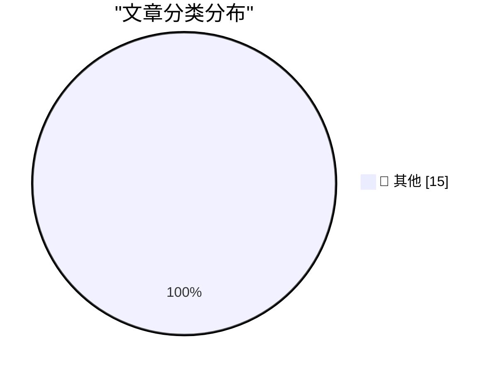

# 📰 AI 资讯每日精选 — 2026-07-25

> 汇聚 140+ 技术博客、X/Twitter、Hacker News、Reddit、Product Hunt、
> Lobste.rs、ClawFeed 日报及 GitHub Trending，经 AI 评分筛选。
>
> **本期内容**：🏆 今日必读 · 🌐 ClawFeed 日报 · 🔥 GitHub Trending · 📂 分类精选 · 🎨 设计与生成式 AI · 📊 数据概览

## 🏆 今日必读

🥇 **Quoting Boris Cherny**

[Quoting Boris Cherny](https://simonwillison.net/2026/Jul/25/boris-cherny/#atom-everything) — simonwillison.net · 2 小时前 · 📝 其他

> Quoting Boris Cherny

🥈 **Introducing Claude Opus 5**

[Introducing Claude Opus 5](https://simonwillison.net/2026/Jul/24/introducing-claude-opus-5/#atom-everything) — simonwillison.net · 3 小时前 · 📝 其他

> Introducing Claude Opus 5

🥉 **★ Regarding Ad Blockers and Daring Fireball**

[★ Regarding Ad Blockers and Daring Fireball](https://daringfireball.net/2026/07/regarding_ad_blockers_and_daring_fireball) — daringfireball.net · 6 小时前 · 📝 其他

> ★ Regarding Ad Blockers and Daring Fireball

4️⃣ **Coiner of ‘Enshittification’ Endorses ‘Dickover’**

[Coiner of ‘Enshittification’ Endorses ‘Dickover’](https://pluralistic.net/2026/07/21/dickovers/) — daringfireball.net · 8 小时前 · 📝 其他

> Coiner of ‘Enshittification’ Endorses ‘Dickover’

5️⃣ **Dickover of the Week: Tomtoc**

[Dickover of the Week: Tomtoc](https://daringfireball.net/2026/05/what_is_a_dickover) — daringfireball.net · 10 小时前 · 📝 其他

> Dickover of the Week: Tomtoc

---

## 🌐 ClawFeed 日报精选

> 来源：[ClawFeed](https://clawfeed.kevinhe.io) — AI 驱动的多源新闻聚合

# ClawFeed 日报 | 2026-07-24 (Thu)

基于 5 期 4h digest (#907-#911, 00:00-19:59 SGT)

---

## 🔥 当日全场最重要 5 条

1. **JetBrains Junie CLI 登顶 SWE-Rebench**（61.6% resolved / 72.7% pass@5）——超越所有 coding agent，AI coding 从"能不能用"正式进入"谁跑分高"的基准竞赛时代。来源: @hasantoxr (#907)

2. **GPU 算力期货市场正在成型**——Kalshi 已上线 H100/H200/B200 远期曲线，Architect_Fi 推算力期货，CME 和 ICE 也在跟进。GPU-hour 距离成为"数字原油"又近一步，算力正从基础设施变成可交易金融资产。来源: @MRRydon (#910)

3. **BitMEX 宣布 9 月 23 日关停**——11 年零安全事故的初代衍生品交易所谢幕，Arthur Hayes 时代彻底画句号。合规压力下业务难以为继，评论区预期交易量加速向链上迁移。来源: @Evans666666 / @maid_crypto (#909, #911)

4. **DeepSeek 梁文锋投资人闭门会议复盘流出**——100+ 问题，核心关键词"克制"：API 价格主动砍到 1/4 放弃短期利润换长期 AGI 概率，"亢龙有悔"经营哲学与硅谷增长范式形成鲜明对比。42 页 PDF / 3h44min 录音文字稿（未经 DS 授权，投资人偷录）。来源: @xincctnnq / @Sea_Bitcoin (#911, #907)

5. **Google/Alphabet 财报超预期但 CapEx 引争议**——Q2 营收 $964 亿（+14%），Cloud $136 亿（+32%），全年 CapEx 上调至 $850 亿全押 AI 基建。市场不买账：AI 投入节奏比业绩增长更快，ROI 证明期拉长。来源: @sanyuanVC / @Bybit_ZH (#907, #909)

---

## 📰 当日核心主题

### 1. AI Coding Agent 竞赛白热化
Junie 登顶 SWE-Rebench，Kimi K3 CEO 演示 11 分钟 solo 建完整 app（"以前你需要一个团队、一笔预算、几个月；现在你需要一个周末和 $15 订阅"），Cognition 收购 Interaction 开启赛道整合，Cursor CEO "第三纪元"定义行业分期。Salesforce Agentforce 团队突破 1 亿行 accepted code。Harness engineering（同模型同 benchmark，42%→78%，唯一变量是 harness）成为年度最重要发现之一。

### 2. Enterprise AI 从工具走向平台
Andrew Ng 发布 OpenWorker（deliverable-first agent），Claude Plugins 让 workflow 可安装打包，Dust（YC 重点介绍）帮企业构建 AI teammates。Aaron Levie 三篇长文系统性思考 agent 时代企业软件走向。"Context tax"概念浮现——每次重新解释你的工作对象给 AI 都是在交税。

### 3. Crypto 监管 + 交易所整合
BitMEX 关停 + CLARITY Act 立法窗口即将关闭（8 月国会休会前无排期投票）+ Mirae Asset 收购 Korbit 更名 Digital X 整合 RWA/稳定币/传统资产 + 三星 Galaxy Wallet 原生支持稳定币 + 高盛 CEO 公开推进加密监管。传统金融对 crypto 的态度从观望转向主动推动。

### 4. 算力 = 新型金融资产
GPU 期货市场成型 + Google $850 亿 CapEx 全押 AI 基建 + Google Cloud 持续高增长（+32%/+82%）。算力从基础设施成本变为可定价、可交易、可对冲的金融工具。

### 5. Agent 架构思想进化
Matrix Agent "公司 OS"（不是一个大 Agent 塞满工具，而是多角色分工+可审计+可问责的编排系统）+ RAG vs Graph RAG vs Agentic RAG 无废话对比 + Jack Dorsey 的 Buzz（一键共享本地模型给 agent）+ AgentOS CLI 持续迭代。

---

## 🔖 累计 Bookmark 精选（去重）

| 主题 | 来源 | 一句话 |
|------|------|--------|
| AI-Native Engineering 五阶段 | @mardehaym | 多数团队还在零阶段，$14M ARR 纯推荐增长的 Limestone 创始人总结 |
| How to Make a Company AI-Native | @LimestoneHQ | 完整方法论免费公开，专为非巨头公司设计 |
| Matrix Agent 公司 OS | @BruceGuai | 不是一个大 Agent，是可长期运行的多角色编排系统 |
| AI 软件开发第三纪元 | @mntruell (Cursor CEO) | 从按键→Tab→Agent，定义行业转型三阶段，7.2M views |
| Aaron Levie 三篇长文 | @levie | Era of Context / Future of Enterprise Software / Capability Overhang |
| Claude for Finance 讲座 | @Av1dlive | 当前量化 AI 最值得的免费 1 小时 |
| Google Stitch DESIGN.md | @yangyi | 一个 Markdown 文件教会 AI Agent 整个设计系统 |
| Harness Engineering | @chenchengpro | 同模型 42%→78%，唯一变量是 harness |
| GPT-Realtime-2 Chrome 翻译 | @gdb / @arrakis_ai | YouTube/直播/会议全场景实时翻译 |
| wanman.ai 一人公司 OS | @turingou | db9 搜索 + Codex 调 GPT Image 2 + 团队聊天自由布局 |
| Cline Kanban | @cline | CLI-agnostic 多 agent 编排，task 跑在 worktree 里 |

---

## 👀 推荐关注汇总（去重）

- **@MRRydon** — 深度跟踪 compute 商品化趋势（GPU 期货、算力定价），DeFi 与传统金融交叉分析，内容稀缺且原创性高
- **@aiwithsally** — AI 产品发布现场观察（Kimi K3 等），第一手体验报告而非二手转述

⚠️ 未通过浏览器逐一核实是否已关注，Kevin 操作前请先在 Following 里搜一下。

---

## 💤 当日重复噪音模式

| 模式 | 频次 | 典型账号 |
|------|------|----------|
| Crypto 交易所/平台营销推广 | 每期 2-4 条 | @GracyBitget, @DeribitOfficial, @102BTC, @crypto_dazui |
| Elon 政治争议/非 tech 内容 | 每期 1-2 条 | @elonmusk 引用帖系列 |
| DeFi/token 低质量 shill | 每期 1-3 条 | @_TokenHunter, @maid_crypto, @ytflzyyds |
| 会议/活动宣传帖 | 间歇性 | @PimaBD, @TaipeiWeek, @token2049 |
| 个人生活/感悟碎片 | 每期 1-2 条 | @fugui8, @choc07_, @longshao1191 |
| PayFi/SocialFi 营销 | 间歇性 | @Polyflow_PayFi, @DeBox_Social |

---

*Generated by ClawFeed Daily Digest | 5 × 4h digests (#907-#911) | 2026-07-24 23:55 SGT*---

## 🔥 GitHub Trending

> 今日热门开源项目（全语言 + Python）

| # | 项目 | 描述 | ⭐ 总星 | 📈 今日 | 语言 |
|---|------|------|---------|---------|------|
| 1 | [block/buzz](https://github.com/block/buzz) | A hive mind communication platform | 10.2k | +3270 | Rust |
| 2 | [mattpocock/skills](https://github.com/mattpocock/skills) | Skills for Real Engineers. Straight from my .agents direc... | 187.0k | +2251 | Shell |
| 3 | [koala73/worldmonitor](https://github.com/koala73/worldmonitor) 🤖 | Real-time global intelligence dashboard. AI-powered news ... | 73.4k | +2184 | TypeScript |
| 4 | [diegosouzapw/OmniRoute](https://github.com/diegosouzapw/OmniRoute) 🤖 | Never stop coding. Free MIT AI gateway: one endpoint, 290... | 29.0k | +1841 | TypeScript |
| 5 | [ruvnet/RuView](https://github.com/ruvnet/RuView) | π RuView turns commodity WiFi signals into real-time spat... | 86.0k | +1022 | Rust |
| 6 | [citrolabs/ego-lite](https://github.com/citrolabs/ego-lite) 🤖 | The fastest browser for AI agents to run web automation, ... | 2.7k | +880 | JavaScript |
| 7 | [Automattic/harper](https://github.com/Automattic/harper) | Offline, privacy-first grammar checker. Fast, open-source... | 13.1k | +876 | Rust |
| 8 | [ComposioHQ/awesome-claude-skills](https://github.com/ComposioHQ/awesome-claude-skills) 🤖 | A curated list of awesome Claude Skills, resources, and t... | 70.1k | +663 | Python |
| 9 | [shiyu-coder/Kronos](https://github.com/shiyu-coder/Kronos) | Kronos: A Foundation Model for the Language of Financial ... | 33.5k | +499 | Python |
| 10 | [Panniantong/Agent-Reach](https://github.com/Panniantong/Agent-Reach) 🤖 | Give your AI agent eyes to see the entire internet. Read ... | 60.6k | +477 | Python |
| 11 | [Pumpkin-MC/Pumpkin](https://github.com/Pumpkin-MC/Pumpkin) | Empowering everyone to host fast and efficient Minecraft ... | 9.4k | +473 | Rust |
| 12 | [chrislgarry/Apollo-11](https://github.com/chrislgarry/Apollo-11) | Original Apollo 11 Guidance Computer (AGC) source code fo... | 71.4k | +409 | Assembly |
| 13 | [yorukot/superfile](https://github.com/yorukot/superfile) | Pretty fancy and modern terminal file manager | 19.6k | +338 | Go |
| 14 | [likec4/likec4](https://github.com/likec4/likec4) | Visualize, collaborate, and evolve the software architect... | 5.1k | +337 | TypeScript |
| 15 | [calesthio/OpenMontage](https://github.com/calesthio/OpenMontage) 🤖 | World's first open-source, agentic video production syste... | 42.0k | +333 | Python |

---

## 📝 其他

### 1. Quoting Boris Cherny

[Quoting Boris Cherny](https://simonwillison.net/2026/Jul/25/boris-cherny/#atom-everything) — **simonwillison.net** · 2 小时前 · ⭐ 15/30

> Quoting Boris Cherny

---

### 2. Introducing Claude Opus 5

[Introducing Claude Opus 5](https://simonwillison.net/2026/Jul/24/introducing-claude-opus-5/#atom-everything) — **simonwillison.net** · 3 小时前 · ⭐ 15/30

> Introducing Claude Opus 5

---

### 3. ★ Regarding Ad Blockers and Daring Fireball

[★ Regarding Ad Blockers and Daring Fireball](https://daringfireball.net/2026/07/regarding_ad_blockers_and_daring_fireball) — **daringfireball.net** · 6 小时前 · ⭐ 15/30

> ★ Regarding Ad Blockers and Daring Fireball

---

### 4. Coiner of ‘Enshittification’ Endorses ‘Dickover’

[Coiner of ‘Enshittification’ Endorses ‘Dickover’](https://pluralistic.net/2026/07/21/dickovers/) — **daringfireball.net** · 8 小时前 · ⭐ 15/30

> Coiner of ‘Enshittification’ Endorses ‘Dickover’

---

### 5. Dickover of the Week: Tomtoc

[Dickover of the Week: Tomtoc](https://daringfireball.net/2026/05/what_is_a_dickover) — **daringfireball.net** · 10 小时前 · ⭐ 15/30

> Dickover of the Week: Tomtoc

---

### 6. Sixers Sign LeBron James

[Sixers Sign LeBron James](https://www.inquirer.com/sixers/live/lebron-james-signs-philadelphia-76ers-contract-salary-roster-updates-reaction-20260724.html) — **daringfireball.net** · 10 小时前 · ⭐ 15/30

> Sixers Sign LeBron James

---

### 7. The Talk Show: ‘A Scam Held Together With Patriotism and Golden Paint’

[The Talk Show: ‘A Scam Held Together With Patriotism and Golden Paint’](https://daringfireball.net/thetalkshow/2026/07/23/ep-452) — **daringfireball.net** · 11 小时前 · ⭐ 15/30

> The Talk Show: ‘A Scam Held Together With Patriotism and Golden Paint’

---

### 8. Have you read it?

[Have you read it?](https://idiallo.com/byte-size/have-you-read-your-own-article) — **idiallo.com** · 19 小时前 · ⭐ 15/30

> Have you read it?

---

### 9. Pluralistic: AI solipsists and AI cynics (24 Jul 2026)

[Pluralistic: AI solipsists and AI cynics (24 Jul 2026)](https://pluralistic.net/2026/07/24/supplemental-income/) — **pluralistic.net** · 17 小时前 · ⭐ 15/30

> Pluralistic: AI solipsists and AI cynics (24 Jul 2026)

---

### 10. Book Review: Foreign Fruit - A Personal History of the Orange by Katie Goh ★⯪☆☆☆

[Book Review: Foreign Fruit - A Personal History of the Orange by Katie Goh ★⯪☆☆☆](https://shkspr.mobi/blog/2026/07/book-review-foreign-fruit-a-personal-history-of-the-orange-by-katie-goh/) — **shkspr.mobi** · 15 小时前 · ⭐ 15/30

> Book Review: Foreign Fruit - A Personal History of the Orange by Katie Goh ★⯪☆☆☆

---

### 11. Making an agile version of a Windows Runtime delegate in C++/WinRT, part 5

[Making an agile version of a Windows Runtime delegate in C++/WinRT, part 5](https://devblogs.microsoft.com/oldnewthing/20260724-00/?p=112562) — **devblogs.microsoft.com/oldnewthing** · 13 小时前 · ⭐ 15/30

> Making an agile version of a Windows Runtime delegate in C++/WinRT, part 5

---

### 12. Benchmarking Qwen 3.6 35B MoE (3B active) on an RTX 3090

[Benchmarking Qwen 3.6 35B MoE (3B active) on an RTX 3090](https://www.gilesthomas.com/2026/07/benchmarking-qwen-3-6-35b-moe-rtx-3090) — **gilesthomas.com** · 4 小时前 · ⭐ 15/30

> Benchmarking Qwen 3.6 35B MoE (3B active) on an RTX 3090

---

### 13. Interview with a Maintainer

[Interview with a Maintainer](https://nesbitt.io/2026/07/24/interview-with-a-maintainer.html) — **nesbitt.io** · 18 小时前 · ⭐ 15/30

> Interview with a Maintainer

---

### 14. Premium: The Hater’s Guide To Oracle (Part 2)

[Premium: The Hater’s Guide To Oracle (Part 2)](https://www.wheresyoured.at/premium-the-haters-guide-to-oracle-part-2/) — **wheresyoured.at** · 10 小时前 · ⭐ 15/30

> Premium: The Hater’s Guide To Oracle (Part 2)

---

### 15. This Week on The Analog Antiquarian

[This Week on The Analog Antiquarian](https://www.filfre.net/2026/07/this-week-on-the-analog-antiquarian/) — **filfre.net** · 10 小时前 · ⭐ 15/30

> This Week on The Analog Antiquarian

---

## 📊 数据概览

| 扫描源 | 抓取文章 | 时间范围 | 精选 |
|:---:|:---:|:---:|:---:|
| 94/140 | 3872 篇 → 78 篇 | 24h | **15 篇** |

### 分类分布

---

*生成于 2026-07-25 03:33 | 汇聚 140 个技术博客、X/Twitter、Hacker News、Reddit、Product Hunt、Lobste.rs、ClawFeed 日报及 GitHub Trending，经 AI 评分筛选出 Top 15 精华内容*
