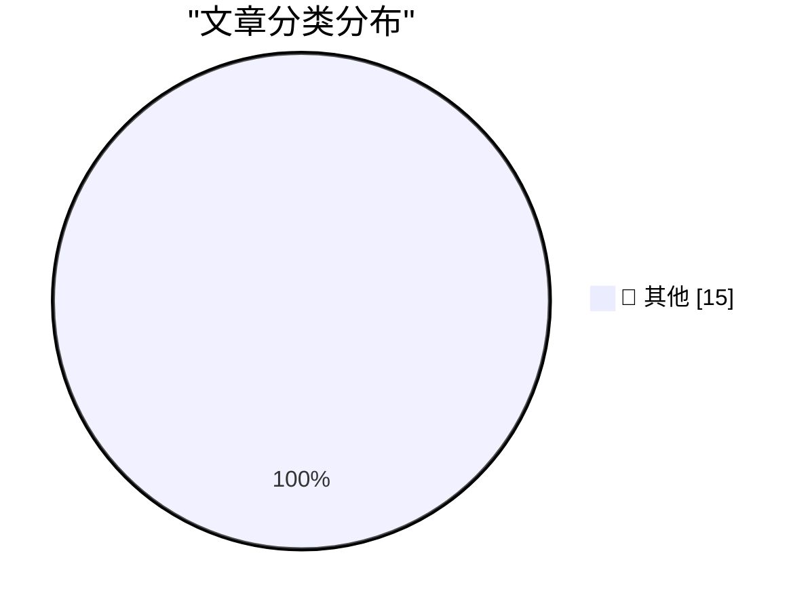

# 📰 AI 资讯每日精选 — 2026-07-26

> 汇聚 140+ 技术博客、X/Twitter、Hacker News、Reddit、Product Hunt、
> Lobste.rs、ClawFeed 日报及 GitHub Trending，经 AI 评分筛选。
>
> **本期内容**：🏆 今日必读 · 🌐 ClawFeed 日报 · 🔥 GitHub Trending · 📂 分类精选 · 🎨 设计与生成式 AI · 📊 数据概览

## 🏆 今日必读

🥇 **Ruff v0.16.0**

[Ruff v0.16.0](https://simonwillison.net/2026/Jul/25/ruff/#atom-everything) — simonwillison.net · 5 小时前 · 📝 其他

> Ruff v0.16.0

🥈 **‘AI Mania Is Eviscerating Global Decision-Making’**

[‘AI Mania Is Eviscerating Global Decision-Making’](https://ludic.mataroa.blog/blog/ai-mania-is-eviscerating-global-decision-making/) — daringfireball.net · 9 小时前 · 📝 其他

> ‘AI Mania Is Eviscerating Global Decision-Making’

🥉 **EU Fines Google $1 Billion for DMA Competition Violations, Including Making Search Results More Useful**

[EU Fines Google $1 Billion for DMA Competition Violations, Including Making Search Results More Useful](https://digital-markets-act.ec.europa.eu/commission-fines-google-eur890-million-breaches-digital-markets-act-2026-07-23_en) — daringfireball.net · 10 小时前 · 📝 其他

> EU Fines Google $1 Billion for DMA Competition Violations, Including Making Search Results More Useful

4️⃣ **Court Grants SerpApi’s Motion to Dismiss Google Lawsuit**

[Court Grants SerpApi’s Motion to Dismiss Google Lawsuit](https://serpapi.com/blog/google-v-serpapi-the-court-granted-our-motion-to-dismiss/) — daringfireball.net · 10 小时前 · 📝 其他

> Court Grants SerpApi’s Motion to Dismiss Google Lawsuit

5️⃣ **Apple Maps to Power Navigation Experience for Ford’s New EVs**

[Apple Maps to Power Navigation Experience for Ford’s New EVs](https://www.apple.com/newsroom/2026/07/apple-maps-to-power-navigation-experience-for-ford-uev-platform/) — daringfireball.net · 11 小时前 · 📝 其他

> Apple Maps to Power Navigation Experience for Ford’s New EVs

---

## 🌐 ClawFeed 日报精选

> 来源：[ClawFeed](https://clawfeed.kevinhe.io) — AI 驱动的多源新闻聚合

# ClawFeed Daily Digest | 2026-07-25 (SGT)

Aggregated from 5x 4h digests (#914-#918, 00:00-19:59 SGT)

---

## 🔥 当日全场最重要 5 条

1. **GPT-5.6 Sol Ultra 解决量子密码学 6 年未解开放问题** — 通过 Codex 生成构造与证明思路，人类专家精炼验证。AI 辅助数学/密码学研究从"有潜力"正式进入"出成果"阶段。来源: @polynoamial

2. **Claude Opus 5 正式发布** — @levie 称"huge jump over Opus 4.8 on a wide number of capabilities"，Box 用内部 Complex Work Eval 确认大幅提升。ZetaChain、aeon 等平台已上线。来源: @levie

3. **Elon Musk 宣布下月 X 全部代码开源 + 第三方审计** — "只有完全透明才配获得信任"。如果落地，X 将成为首个开源的主流社交平台。来源: @elonmusk

4. **黄仁勋首次入驻 X 发帖** — 分享 NVIDIA 签署的开放模型公开信：开放模型对 AI 安全、创新扩散和主权至关重要。Jensen 本人亲自下场做内容，信号极强。多位科技 CEO（Jensen、Zuck、Satya、Sundar）同期活跃 X。来源: @JensenHuang / @wolfyxbt

5. **Mubadala Capital（阿布扎比主权基金）+ KAIO 将私募基金 token 化上链** — Base/Solana/Sui，TVL $75M，Coinbase 自掏腰包买入。上市公司首次在链上资金管理中使用受监管 RWA，机构入场信号明确。来源: @maid_crypto

---

## 📰 当日核心主题

### 1. 开放 AI 模型阵营大集结
Jensen Huang X 首帖即为开放模型背书，Elon 承诺 X 代码开源，多位科技 CEO 同时活跃 X 发声。开源 AI 在本日获得迄今最高调的产业联盟站台。

### 2. Claude Opus 5 / 前沿模型发布潮
Opus 5 发布后 Box 确认大幅跃升，ZetaChain 生态直接上线（ZETA 质押者免开户获取），aeon 平台可调度 skills。GPT-5.6 Sol Ultra 同日以解题成果震撼密码学界。

### 3. Harness Engineering 压过模型选择
同一模型同一 benchmark，42% → 78%，唯一变量是 harness（rules/tools/skills/反馈循环）。@chenchengpro 称之为"2026 AI 工程最重要发现"，@FactoryAI CTO 证实 harness 对性价比的影响远超模型本身。

### 4. Agent 评测工业化
Sentient 公布 OfficeQA Challenge 13,483 条 agent 运行轨迹（156 份提交、4 种 harness），系统性回答"agent 任务到底为什么成功/失败"——公开数据中最大规模的 agent benchmark 实战分析。

### 5. 机构级 Crypto 基础设施加速
贝莱德/Coinbase/Strategy 等 9 家组建 BTC Security Alliance（后量子密码学+开源安全），ETH staking 创新高（4020 万 ETH / 33%），RWA token 化加速（bStocks AUM 4 天 $4B→$4.5B），Verus 跨链桥二次被黑暴露安全短板。

### 6. AI-Native Engineering 方法论
@mardehaym "Five Stages of AI-Native Engineering" (188K views)，@LimestoneHQ 公开完整方法论，@mntruell (Cursor CEO) "三个时代"论，Matrix Agent 公司 OS 架构。从概念到落地框架，AI-native 进入方法论竞争阶段。

---

## 🔖 累计 Bookmark 精选

- **Anthropic Claude for Finance 讲座** (@Av1dlive) — 量化 AI 领域最值得看的免费一小时 + Claude Code 做投研分析师配置文章 (812K views)
- **Matrix Agent 公司 OS** (@BruceGuai) — 不是一个巨大 Agent，而是结构化多 Agent 分工系统，有责任制有审计链 (34K views)
- **Cursor CEO "第三个时代"** (@mntruell) — 键盘写代码 → Tab 补全 → Agent 接管 (7.2M views)
- **Google Stitch DESIGN.md** (@yangyi) — 一个 Markdown 文件教会 AI coding agent 整套设计系统，40+ 预构建文件 (134K views)
- **Cline Kanban** (@cline) — CLI-agnostic 多 agent 编排，Claude/Codex 兼容，task 跑在 worktree，依赖链自动完成
- **GPT-Realtime-2 实时翻译集成 Chormex** (@gdb / @arrakis_ai) — YouTube/直播/会议全场景实时 AI 翻译
- **Harness Engineering 正名** (@chenchengpro) — 42%→78% 同模型同 benchmark，唯一变量 harness
- **"The Era of Context"** (@levie) — AI agent 时代的瓶颈从算力/模型转向 context
- **AI coding 渗透数据** (@yq_acc) — Claude 100%、OpenAI 90%、微软 30%、Google 25% 生产代码由 coding agent 编写
- **Raft 实时协作平台** (@istdrc) — 人与 AI agent 在同一 channel 作为平等队友协作

---

## 👀 推荐关注汇总

| 账号 | 推荐理由 |
|------|---------|
| @JensenHuang | 黄仁勋本人 X 账号刚开通，首帖即高质量政策立场声明 |
| @KAIO_xyz | 机构级 RWA token 化平台，与 Mubadala 合作 |
| @BruceGuai | Agent 架构深度输出者，Matrix agent company OS 方法论原创 |
| @yangyi | AI coding 工具生态跟踪（Google Stitch 等），中文圈实操导向 |
| @SentientAGI | 数据驱动 agent 评测研究，方法论扎实 |
| @AriaWestcott | AI 游戏创作工具 building in public |

提醒：操作前先在 Following 搜索确认未重复关注。

---

## 💤 当日重复噪音模式

1. **Jensen Huang 开放模型信 + "X is where it's at"** — 在 #914-#918 中至少出现 4 次，各期角度略有不同但核心信息重复
2. **纯 token shill / 交易所营销** — OKX 双币赢、TRON GasFree、bStocks 推广、gmgn 返佣链接等贯穿全天
3. **Telegram 导流喊单** — @0xFelix、@feibo03 等 bio 挂 TG 群链接的 alpha hunter 类账号
4. **无实质内容的名人转发** — Elon 空文本转评出现多次
5. **跨期重复 bookmark** — @mardehaym AI-Native 五阶段、@Av1dlive Claude Finance 讲座、@BruceGuai Matrix 在 3+ 期重复出现（说明持续高热度，但日报已去重）

---

*Generated: 2026-07-25 23:55 SGT | Sources: 4h digests #914-#918 | Periods covered: 00:00-19:59 SGT*
---

## 🔥 GitHub Trending

> 今日热门开源项目（全语言 + Python）

| # | 项目 | 描述 | ⭐ 总星 | 📈 今日 | 语言 |
|---|------|------|---------|---------|------|
| 1 | [block/buzz](https://github.com/block/buzz) | A hive mind communication platform | 12.1k | +2491 | Rust |
| 2 | [mattpocock/skills](https://github.com/mattpocock/skills) | Skills for Real Engineers. Straight from my .agents direc... | 188.4k | +1740 | Shell |
| 3 | [permissionlesstech/bitchat](https://github.com/permissionlesstech/bitchat) | bluetooth mesh chat, IRC vibes | 28.8k | +1720 | Swift |
| 4 | [citrolabs/ego-lite](https://github.com/citrolabs/ego-lite) 🤖 | The fastest browser for AI agents to run web automation, ... | 3.7k | +986 | JavaScript |
| 5 | [ComposioHQ/awesome-claude-skills](https://github.com/ComposioHQ/awesome-claude-skills) 🤖 | A curated list of awesome Claude Skills, resources, and t... | 70.6k | +577 | Python |
| 6 | [Automattic/harper](https://github.com/Automattic/harper) | Offline, privacy-first grammar checker. Fast, open-source... | 13.5k | +503 | Rust |
| 7 | [obra/superpowers](https://github.com/obra/superpowers) | An agentic skills framework & software development method... | 261.2k | +479 | Shell |
| 8 | [alibaba/open-code-review](https://github.com/alibaba/open-code-review) 🤖 | Open-source & free — Battle-tested at Alibaba's scale. Hy... | 13.1k | +431 | Go |
| 9 | [CoreBunch/Instatic](https://github.com/CoreBunch/Instatic) | The open-source alternative to Webflow, Framer and WordPr... | 5.1k | +426 | TypeScript |
| 10 | [palmier-io/palmier-pro](https://github.com/palmier-io/palmier-pro) 🤖 | macOS video editor built for AI | 12.3k | +412 | Swift |
| 11 | [Lordog/dive-into-llms](https://github.com/Lordog/dive-into-llms) | 《动手学大模型Dive into LLMs》系列编程实践教程 | 45.4k | +408 | Jupyter Notebook |
| 12 | [affaan-m/ECC](https://github.com/affaan-m/ECC) 🤖 | The agent harness performance optimization system. Skills... | 233.4k | +377 | JavaScript |
| 13 | [OtterMind/Chat2DB](https://github.com/OtterMind/Chat2DB) 🤖 | 🔥🔥🔥 AI-driven database tool and SQL client, The hottes... | 26.7k | +360 | Java |
| 14 | [Pumpkin-MC/Pumpkin](https://github.com/Pumpkin-MC/Pumpkin) | Empowering everyone to host fast and efficient Minecraft ... | 9.7k | +358 | Rust |
| 15 | [shiyu-coder/Kronos](https://github.com/shiyu-coder/Kronos) | Kronos: A Foundation Model for the Language of Financial ... | 33.8k | +319 | Python |

---

## 📝 其他

### 1. Ruff v0.16.0

[Ruff v0.16.0](https://simonwillison.net/2026/Jul/25/ruff/#atom-everything) — **simonwillison.net** · 5 小时前 · ⭐ 15/30

> Ruff v0.16.0

---

### 2. ‘AI Mania Is Eviscerating Global Decision-Making’

[‘AI Mania Is Eviscerating Global Decision-Making’](https://ludic.mataroa.blog/blog/ai-mania-is-eviscerating-global-decision-making/) — **daringfireball.net** · 9 小时前 · ⭐ 15/30

> ‘AI Mania Is Eviscerating Global Decision-Making’

---

### 3. EU Fines Google $1 Billion for DMA Competition Violations, Including Making Search Results More Useful

[EU Fines Google $1 Billion for DMA Competition Violations, Including Making Search Results More Useful](https://digital-markets-act.ec.europa.eu/commission-fines-google-eur890-million-breaches-digital-markets-act-2026-07-23_en) — **daringfireball.net** · 10 小时前 · ⭐ 15/30

> EU Fines Google $1 Billion for DMA Competition Violations, Including Making Search Results More Useful

---

### 4. Court Grants SerpApi’s Motion to Dismiss Google Lawsuit

[Court Grants SerpApi’s Motion to Dismiss Google Lawsuit](https://serpapi.com/blog/google-v-serpapi-the-court-granted-our-motion-to-dismiss/) — **daringfireball.net** · 10 小时前 · ⭐ 15/30

> Court Grants SerpApi’s Motion to Dismiss Google Lawsuit

---

### 5. Apple Maps to Power Navigation Experience for Ford’s New EVs

[Apple Maps to Power Navigation Experience for Ford’s New EVs](https://www.apple.com/newsroom/2026/07/apple-maps-to-power-navigation-experience-for-ford-uev-platform/) — **daringfireball.net** · 11 小时前 · ⭐ 15/30

> Apple Maps to Power Navigation Experience for Ford’s New EVs

---

### 6. Measles Cases Hit New Record in U.S., as Stupid-Americans Reject Vaccines

[Measles Cases Hit New Record in U.S., as Stupid-Americans Reject Vaccines](https://www.nytimes.com/2026/07/24/well/measles-record-united-states-numbers.html?unlocked_article_code=1.0VA.4jBf.vqAYN4Bwu807) — **daringfireball.net** · 11 小时前 · ⭐ 15/30

> Measles Cases Hit New Record in U.S., as Stupid-Americans Reject Vaccines

---

### 7. bIRC — A New Native IRC Client for Mac

[bIRC — A New Native IRC Client for Mac](https://birc.app/) — **daringfireball.net** · 12 小时前 · ⭐ 15/30

> bIRC — A New Native IRC Client for Mac

---

### 8. Being Linux Torvalds

[Being Linux Torvalds](http://antirez.com/news/171) — **antirez.com** · 16 小时前 · ⭐ 15/30

> Being Linux Torvalds

---

### 9. Pluralistic: Apple's robo-repo (25 Jul 2026)

[Pluralistic: Apple's robo-repo (25 Jul 2026)](https://pluralistic.net/2026/07/25/cruel-cruelty-oh-cruelty/) — **pluralistic.net** · 17 小时前 · ⭐ 15/30

> Pluralistic: Apple's robo-repo (25 Jul 2026)

---

### 10. Excel column numbering

[Excel column numbering](https://www.johndcook.com/blog/2026/07/25/excel-column-numbering/) — **johndcook.com** · 14 小时前 · ⭐ 15/30

> Excel column numbering

---

### 11. This Week in Package Management: 25 July 2026

[This Week in Package Management: 25 July 2026](https://nesbitt.io/2026/07/25/this-week-in-package-management.html) — **nesbitt.io** · 17 小时前 · ⭐ 15/30

> This Week in Package Management: 25 July 2026

---

### 12. Reading List 07/25/26

[Reading List 07/25/26](https://www.construction-physics.com/p/reading-list-072526) — **construction-physics.com** · 13 小时前 · ⭐ 15/30

> Reading List 07/25/26

---

### 13. New reports reveal the extent of OpenAI's loss of control during the autonomous hack on Hugging Face

[New reports reveal the extent of OpenAI's loss of control during the autonomous hack on Hugging Face](https://the-decoder.com/new-reports-reveal-the-extent-of-openais-loss-of-control-during-the-autonomous-hack-on-hugging-face/) — **The Decoder** · 14 小时前 · ⭐ 15/30

> New reports reveal the extent of OpenAI's loss of control during the autonomous hack on Hugging Face

---

### 14. Opus 5 may have solved browser-based prompt injection, the biggest security flaw haunting AI agents

[Opus 5 may have solved browser-based prompt injection, the biggest security flaw haunting AI agents](https://the-decoder.com/opus-5-may-have-solved-browser-based-prompt-injection-the-biggest-security-flaw-haunting-ai-agents/) — **The Decoder** · 17 小时前 · ⭐ 15/30

> Opus 5 may have solved browser-based prompt injection, the biggest security flaw haunting AI agents

---

### 15. Anthropic's Claude Opus 5 delivers near-Fable 5 performance at half the token price

[Anthropic's Claude Opus 5 delivers near-Fable 5 performance at half the token price](https://the-decoder.com/anthropic-claims-its-new-claude-opus-5-delivers-near-fable-5-performance-at-half-the-token-price/) — **The Decoder** · 17 小时前 · ⭐ 15/30

> Anthropic's Claude Opus 5 delivers near-Fable 5 performance at half the token price

---

## 📊 数据概览

| 扫描源 | 抓取文章 | 时间范围 | 精选 |
|:---:|:---:|:---:|:---:|
| 90/140 | 3760 篇 → 48 篇 | 24h | **15 篇** |

### 分类分布

---

*生成于 2026-07-26 03:49 | 汇聚 140 个技术博客、X/Twitter、Hacker News、Reddit、Product Hunt、Lobste.rs、ClawFeed 日报及 GitHub Trending，经 AI 评分筛选出 Top 15 精华内容*
