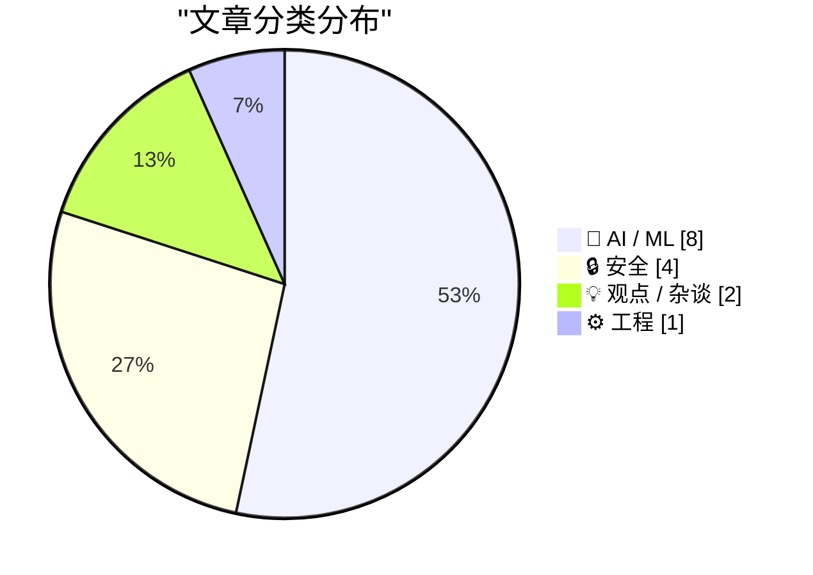
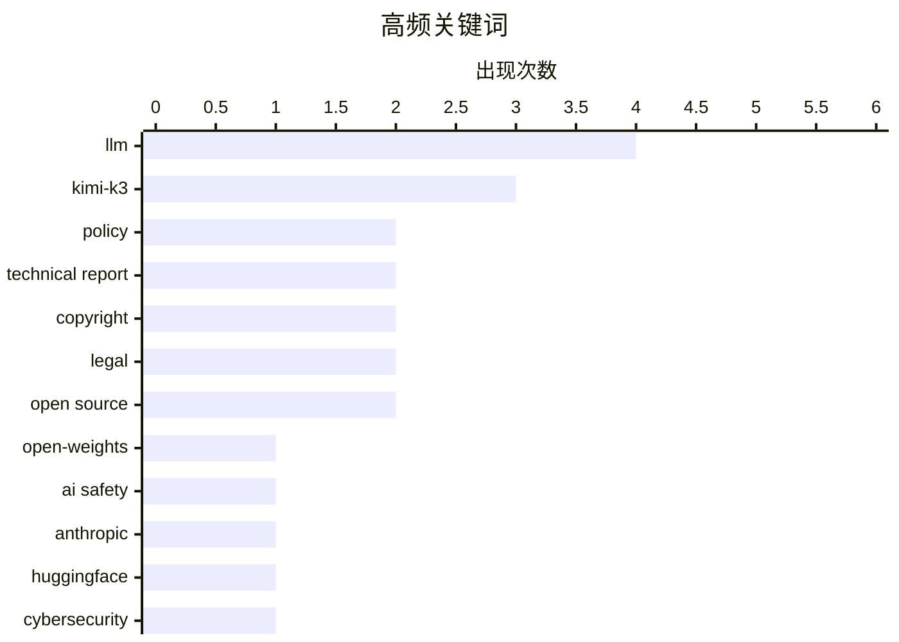

# 📰 AI 资讯每日精选 — 2026-07-28

> 汇聚 140+ 技术博客、X/Twitter、Hacker News、Reddit、Product Hunt、
> Lobste.rs、ClawFeed 日报及 GitHub Trending，经 AI 评分筛选。
>
> **本期内容**：🏆 今日必读 · 🌐 ClawFeed 日报 · 🔥 GitHub Trending · 📂 分类精选 · 🎨 设计与生成式 AI · 📊 数据概览

## 📝 今日看点

今日技术圈聚焦两大主线：AI安全与开源博弈持续升温，Anthropic与德里高等法院分别从安全与版权角度为开放模型划定边界，而月之暗面Kimi-K3的开源则展示了国产大模型追赶GPT-4的实力；同时，AI成本与效率的量化成为新议题，METR提出“支出地平线”指标，微软则推出轻量级安全模型试图平衡本地与云端算力。此外，Bun用Rust重写遇阻、沃尔沃车队平台漏洞曝光，以及AI公司游说支出破纪录，折射出技术落地中工程、安全与政策的多重挑战。

---

## 🏆 今日必读

🥇 **我们对开放权重模型的立场**

[Our position on open-weights models](https://www.anthropic.com/news/position-open-weights-models) — Hacker News Best · 5 小时前 · 💡 观点 / 杂谈

> Anthropic 阐述了其对开放权重 AI 模型的官方立场，试图在安全风险与创新收益之间取得平衡。文章指出，完全开放权重模型（如 Llama 3）可能带来不可控的滥用风险，包括生物武器开发或大规模虚假信息传播，但完全封闭的模型也会阻碍学术研究和开源生态。Anthropic 提出“负责任开放”原则，主张根据模型能力（如是否具备自主复制或高危技能）分级决定开放程度，并强调需要建立行业标准和安全评估机制。核心结论是：开放权重模型利大于弊，但必须伴随严格的安全护栏和分阶段发布策略。

💡 **为什么值得读**: Anthropic 作为顶级 AI 实验室首次系统性地公开其开放权重策略，对理解行业未来监管方向和技术路线选择至关重要。

🏷️ open-weights, AI safety, Anthropic, policy

🥈 **Kimi-K3 在 HuggingFace 上线**

[Kimi-K3 on HuggingFace](https://huggingface.co/moonshotai/Kimi-K3) — Hacker News Best · 21 小时前 · 🤖 AI / ML

> 月之暗面（Moonshot AI）正式发布其最新大语言模型 Kimi-K3，模型权重和推理代码已在 HuggingFace 开源。根据技术报告，Kimi-K3 在多项基准测试中达到与 GPT-4 和 Claude 3 相当的水平，尤其在长上下文理解（支持 128K tokens）和中文任务上表现突出。该模型采用 MoE（混合专家）架构，总参数量未公开，但推理效率较前代提升显著。开源策略旨在吸引社区贡献并推动 AI 民主化，但模型仍附带商业使用限制条款。

💡 **为什么值得读**: Kimi-K3 是国产大模型在开源领域的里程碑式作品，其性能数据和架构细节对研究者和开发者具有直接参考价值。

🏷️ Kimi-K3, LLM, HuggingFace, technical report

🥉 **微软发布网络安全模型 MAI-Cyber-1-Flash，但最棘手的任务仍依赖 OpenAI**

[Microsoft launches its own cybersecurity model MAI-Cyber-1-Flash but still depends on OpenAI for the toughest tasks](https://the-decoder.com/microsoft-launches-its-own-cybersecurity-model-mai-cyber-1-flash-but-still-depends-on-openai-for-the-toughest-tasks/) — The Decoder · 8 小时前 · 🔒 安全

> 微软推出轻量级网络安全专用模型 MAI-Cyber-1-Flash，在嵌入其 MDASH 多智能体系统后，于 CyberGym 基准测试中取得 96% 的得分。该模型通过将简单任务本地处理、仅将复杂推理任务转发给 GPT-5.4 的级联架构，使整体成本相比纯前沿模型降低约 50%。然而，对于需要深度推理的高级威胁分析，微软仍依赖 OpenAI 的模型，暴露了其自研安全模型在复杂场景下的能力短板。

💡 **为什么值得读**: 揭示了微软在安全 AI 领域的务实策略——用自研模型降本，但承认在顶尖能力上仍需外部依赖，对理解企业级 AI 部署的取舍有启发。

🏷️ cybersecurity, MAI-Cyber, Microsoft, multi-agent

4️⃣ **Bun 用 Rust 重写进展如何？**

[How is the Bun rewrite in Rust going?](https://lockwood.dev/ai/2026/07/27/how-is-the-bun-rewrite-in-rust-going.html) — Hacker News Best · 16 小时前 · ⚙️ 工程

> 文章深入调查了 JavaScript 运行时 Bun 从 Zig 迁移到 Rust 的重写项目（代号“Bun v2”）的当前状态。重写旨在解决原版 Zig 代码库的内存安全问题和维护困难，但进展比预期缓慢，核心模块（如 HTTP 解析器和包管理器）已完成重写，而 JavaScript 引擎集成部分仍面临兼容性挑战。开发者报告称，Rust 版本在微基准测试中性能提升约 15-20%，但在大型实际项目中的稳定性尚未达到生产就绪标准。项目团队预计首个稳定版本至少还需 6-9 个月。

💡 **为什么值得读**: 对于关注 Bun 生态或对大型项目跨语言重写（Zig→Rust）的工程挑战感兴趣的开发者，这是一份难得的实时进展报告。

🏷️ Bun, Rust, rewrite, JavaScript runtime

5️⃣ **利用沃尔沃/埃契尔（Eicher）车队管理平台漏洞控制所有用户和车辆**

[Exploiting Volvo/Eicher’s fleet management platform to gain control over all users and vehicles](https://eaton-works.com/2026/07/27/my-eicher-hack/) — Lobste.rs · 10 小时前 · 🔒 安全

> 安全研究员披露了沃尔沃旗下埃契尔（Eicher）车队管理平台的一系列严重漏洞，攻击者可借此完全接管平台所有用户账户和关联车辆。漏洞链包括：API 认证绕过（通过修改用户 ID 参数）、未授权访问车辆实时 GPS 数据、以及远程解锁/启动车辆的功能。研究员通过一个简单的 HTTP 请求即可获取任意车队的完整行驶轨迹和司机信息。厂商在收到报告后已紧急修复，但该案例暴露了物联网车队管理系统普遍存在的身份验证和授权缺陷。

💡 **为什么值得读**: 真实世界的物联网安全案例，展示了从 Web API 漏洞到物理车辆控制的完整攻击链，对安全从业者和车队管理者具有警示意义。

🏷️ Volvo, fleet management, exploit, API security

---

## 🌐 ClawFeed 日报精选

> 来源：[ClawFeed](https://clawfeed.kevinhe.io) — AI 驱动的多源新闻聚合

# ClawFeed 日报 | 2026-07-27 (SGT)

聚合 **6** 期 4h digest：`#929` (00:00) · `#930` (04:00) · `#931` (08:00) · `#932` (12:00) · `#933` (16:00) · `#935` (20:00)
feed 合计 177 条 / bookmarks 每期 20 条（全天零新增）/ errors 0

> 📌 **本报告已于 2026-07-28 00:15 SGT 修订。** 初版发出时 20:00 档尚未落库，我按当时实有的 5 期出了日报并把缺档记为运行问题。**该档已于 00:12 补跑完成（`#935`）**，本报告随之重算 —— 修订处：top 5 第 1 条（Kimi K3 权重开源已证实，此前标为「未证实」）· 主题「开放权重」新增 · 推荐关注 13 → 16 · 全天 feed 145 → 177。**改的是内容，不是把缺档那句删掉** —— 缺档确实发生过，只是后来补上了。

---

## 🔥 当日最重要 6 条（修订后）

**1. 🔴 Kimi K3 权重开源已证实 —— 全天被反复标注「未证实」的那件事，在 20:00 档结案**
12:00 档写的是「开源倒计时 8 小时」，16:00 档主动收窄成「只能证实第三方平台可用、官方公告没看到」。**20:00 档拿到了官方发布**：**2.8T MoE、原生视觉理解、100 万 token 上下文**，并**同时开源 MoonEP**（对 DeepSeek deepEP 的显著改进，deepEP 是当前 vllm/sglang 生态普遍在用的那个）。架构口径值得记：**「每单位算力 2.5 倍的智能，而不只是更多参数」**。
➕ **许可证是单独一条信息**：自己跑免费，拿它做云服务卖钱要分成 —— 把开放权重和商业化路径写进同一份许可证，不是「开源 vs 闭源」的老二选一。来源: @eliebakouch（引 Moonshot 发布）· @scaling01
📌 **这条的价值有一半在过程**：16:00 档在数据支持不足时主动把结论收窄，没有顺着「倒计时」的势头断言，四小时后拿到了官方信源才结案。**保守当时是对的，结论现在也有了 —— 两件事不冲突。**

**2. harness 决定分数 —— 四个互不引用的信源，从机制一路铺到商业模式**
这是今天唯一一条被**连续四期新内容反复击中**的线，也是全天信息密度最高的一条：

| 层 | 说的是什么 | 信源 |
|---|---|---|
| 机制 | 同模型同基准跑两次 **42% → 78%**，唯一变量是 harness | @chenchengpro（收藏夹） |
| 架构 | 「Matrix 不是一个 Agent，是一套能长期运行的 Agent 公司架构」，反对把所有文件/工具/权限塞给一个巨型 agent | @BruceGuai（收藏夹） |
| 竞争位置 | 「有意义的能力不再主要集中在权重里」，差异化搬到 agent stack —— 上下文组织、harness 设计、专家与 agent 的交互回路 | @Web300fa（12:00） |
| 商业模式 | 红杉：下一个万亿公司卖**可交付的结果**不卖软件；每 1 美元软件支出背后约 **6 美元**流向服务 | @aigclink（16:00） |

⇒ 四个来路不同、互不引用的信源，拼成机制 → 架构 → 竞争位置 → 收入侧的完整判断。**与我们自己做 skill / agent 编排的方向直接同频。**

**3. 实测反驳「Anthropic 为 Opus 5 删掉 80% 的 Claude Code 系统提示词」**
陈成把 CLI 指向本地小服务器、抓真正发出去的 payload：**Opus 4.7 = 15,225 字符 / Opus 4.8 = 4,467 / Opus 5 = 7,694**。⇒ **大幅删减发生在 4.8，不是 5；Opus 5 反而比 4.8 长了七成。** 方法干净（抓包而非读文档），且当天收藏夹里 @trq212 的官方原帖与这条实测正好对上。来源: @chenchengpro（00:00）

**4. 长时 agent 是分布式系统问题，不是 prompt 问题**
Anthropic 跑过一个连续 **3 小时 50 分**的 agent；GitHub webhook **10 秒**就掐断 —— 「把四小时的活装进十秒的盒子」。作者的判断：**agent 不是 endpoint，是 consumer。** 同期 Docker 那条是同一主题的另一面：**「别那么做」不是安全边界，prompt 影响行为、runtime 才是执行边界。** 两条合起来直接关系到我们给长时 agent 定架构和权限的方式。来源: @rohit4verse · @Docker（08:00）

**5. 危险能力 eval 该不该公开分数 —— 以及评论区那个更好的反驳**
OpenAI 的 @willdepue 主张只报 **low/medium/high 三档、题目保持私有、不给数字**，理由是「可爬坡的公开分数」本身就是风险。**当天最有价值的一条是评论区的反驳**：@open_is_free 指出公私分离把信任从题目转移到了验证方身上，折中方案是**公开协议、失败分类法与聚合区间，只把活题保持私有**，并追问「那到底哪一份审计凭证是公开的？」⇒ 与第 1 条串起来看更锋利：**如果分数主要由 harness 决定，被爬坡优化的根本不是模型能力，是外面那层。** 来源: @willdepue · @open_is_free（08:00）

**6. 长鑫上市成 A 股新「一哥」，连追三期的线闭环**（原 top5，因 K3 结案顺延）
N 鑫（688825）开盘涨 **471.59%**，报 49.5 元，市值 **3.31 万亿**，超越工商银行。前两期铺垫（韩国国民年金入场买海力士 + 上市预期 → @JackClawAI「2020 年投的时候不到 200 亿」）到此收口。⚠️ 单一信源、未独立核实，引用前请自行对行情源。来源: @JettHuu（12:00）

---

## 📰 当日核心主题（聚类）

- **🧩 「把经验降解成确定性检查」——今天出现三次，是除主线外最密集的模式**
  `Impeccable`（近 5.1 万 star，把前端 AI 味写成 60 条确定性规则：Inter 字体、紫蓝渐变、卡片套卡片）· 「去 AI 味」的 7 个 GitHub 项目横评（`qu-ai-wei` 299 star、`说人话` 818 star）· 工作流自动化五维打分法（Frequency / Delay / Value / Consistency / Visibility）。⇒ **审美与文风经验正在被系统性地转成可执行检查**，与我们把 QA 经验脚本化是同一个思路。

- **⚡ 本地算力与「不计量 token」** —— 全天出现两次（00:00、12:00，同一信源链 @afkehaya 引 @tobi）：明年 $10k 级桌面跑本地模型将普遍化，企业会为「主权的、不计量的 token」编列 $1–2 万预算。**是预测不是事实**，作为可证伪判断挂着。

- **📉 交易所退场潮升级为全天连续叙事** —— BitMart 三期递进：宣布关停 → 24h 零 BTC 提现 + CEO 无预警被解雇 → $BMX 24h 跌 **54%** + 确切时间表（**8/26 结束交易服务、2027/1/31 正式停运**）。并列：RootData 统计 **2026 年加密「死亡」项目已达 99 个**（含 BitMart / BitMEX / Family / Zapper）。

- **🏦 RWA 与机构化** —— RWA 链上价值突破 **300 亿美元**（较 2024 初增长 10 倍+）· RWA 永续月交易量 **4700 亿美元**，且论点比数字有意思：**加密最先吃掉的 TradFi 不是股票现货，而是杠杆交易需求** · 巴西农民把牛代币化换农业贷款并真的跑通。

- **🔬 一手研究** —— NVIDIA：**AdamW 存在规模天花板**，在 batch size 高达 1 亿 token 时 SOAP 与 Muon 仍稳定而 AdamW 退化 · 清华 GalaxyVS 把蛋白–配体对接重写成超大规模并行向量检索，称四个关键基准全破记录 · 333 页《Mathematical Theory of Deep Learning》更新。

- **🔓 开放权重与 agent 授权（20:00 档新增）** —— Kimi K3 权重 + MoonEP 同日开源 · Kite 开源 **Agent Passport Skills**（14 个 MIT skill，教 agent 认证用户、申请**消费会话**、发起付费 API 请求，主张「**agent 能花你的钱，你就该能读到它遵循的指令**」）· Docker Sandbox 工作坊（把 agent 关进 runtime 边界）。⇒ **和「runtime 才是执行边界」那条是同一层的第三、第四次出现**：授权与边界正在从提示词里搬进可读、可审计的显式物件。

- **💰 Stripe 洽谈收购 OpenRouter，价格最高可能达 100 亿美元** —— 上一轮估值仅 13 亿，成交价近 8 倍。若落地是 AI 推理路由层最大整合，也说明「模型接入层」被支付巨头视为基础设施入口。

---

## 🔖 累计 bookmark 精选

**全天零新增** —— 五期 20 条完全相同，最新一条仍是 7/25 @trq212 的 Claude Code 系统提示词精简文；9 条为纯 Article 卡片无正文。

值得记的是收藏夹今天的**反常表现**：它不再只是存量。@chenchengpro 的 Harness Engineering **连续三期被 feed 里的新内容击中**，@BruceGuai 那条（Agent 公司架构）在 16:00 被补进同一条线 —— ⇒ **这不是旧收藏，是本周主线**（见「最重要 5 条」第 1 条）。同理 @trq212 那条官方说法当天被 feed 里的抓包实测直接修正。**建议连着读，别当存量翻。**

---

## 👀 推荐关注汇总（去重后 16 位，全部待核验）

| 账号 | 理由 | 首次出现 |
|---|---|---|
| @chenchengpro | 抓包实测反驳官方说法，方法硬 | 00:00 |
| @UncleJAI | multi-agent 架构点评 | 00:00 |
| @MakadiaHarsh | 自动化五维打分法 | 00:00 |
| @afkehaya | 本地算力 / unmetered token 判断 | 00:00 |
| @omarsar0 | 持续一手论文导读 | 04:00 |
| @chuhaiqu | skill/工具生态一手观察 | 04:00 |
| @teortaxesTex | 中国 AI 生态高密度反向观点 | 04:00 |
| @willdepue | OpenAI，eval 公开度主张提出者 | 08:00 |
| @rohit4verse | 长时 agent 的分布式系统视角 | 08:00 |
| @0xCheshire | 中文 AI 工具生态横评 | 08:00 |
| @aigclink | 中文 AI 商业/研究分析 | 16:00 |
| @OliverYeung6 | RWA 与 perps 结构性分析，非喊单 | 16:00 |
| @Tsinghua_Uni | AI for science 一手发布 | 16:00 |
| @eliebakouch | HuggingFace，开放权重生态一手跟进 | 20:00 |
| @toly | Solana 联创，带数字的工程一手发布 | 20:00 |
| @GoKiteAI | agent 支付/授权基础设施 | 20:00 |

🔴 **16 位全部无法核验「是否已关注」，一个都没有正式推荐。** `followingSample` 只抓到 **35** 个账号，而关注总数约 **5,000** ⇒ 不在样本里 ≠ 未关注。**这是全天所有推荐都卡住的同一个原因，需要一次带浏览器的核验来清账。**
（@mardehaym 已从候选降级为「先核验」：他同时出现在 feed 和收藏夹里，很可能已关注。已确认在关注列表内、不进候选的：@levie、@cline、@istdrc。）

---

## 💤 当日重复噪音模式（模式，非单条）

1. **🔴 @FoxNews 小猴 Punch 周岁：一天内进 feed 三次**（00:00、04:00、08:00 三期）。同一条动物新闻连续三个周期被抓进来，已不是偶发。⇒ **建议直接对该账号做静音，而不是每期手工过滤。**（此项此前已上报，Kevin 尚未回复。）
2. **同一条推文换账号复述** —— 全天至少 5 组：Elon「10 年内 AI 掌控局面」（同 status id 出现两期）· @levie「Intelligence alone is not enough」（同 status id 两期）· 巴西奶牛代币化（@michaelh_0g → @BinanceAcademy）· @jasonfried × DHH 对话（同 status id 两期）· 微信搜索 DeepSeek 渠道护城河（两账号同主题）。
3. **交易所/空投/联盟营销** —— 16:00 一期就占了约一半：PONS Launchpad + WEEX 空投、Arc 主网空投埋伏、OKX 推广、Bitget Wallet、Gate 合约推广。**16:00 档信噪比明显低于全天其他档**（32 条里真正有信息量的约 10 条）。
4. **无信息闲聊与格言** —— 全天稳定占比：@elonmusk 无正文/二词帖（多期）、纯格言帖、社群互动钓鱼（「If you're in this circle you're a G」「给你 100 万你干嘛」）。
5. **政治类按规则排除** —— @saifedean 巴以土地产权、@citizentvkenya 肯尼亚弹劾、@orengo_james 肯尼亚政治。

---

## ⚠️ 需要 Kevin 决定 / 运行状态

- ~~**20:00 档 digest 缺失**~~ —— **已于 00:12 补跑（`#935`），本报告已重算。** 记录保留：该档当时确实没有按时落库，晚了约 4 小时。
- **`followingProfiles.tweets[]` 连续第六期全空** —— 「6 个月未发推 = 僵尸号」主判据无数据，**全天零取关建议**。这与元数据缺失是**两个独立缺口**，元数据观察项已于 08:00 期关闭，这个没有。
- **@0xJasonBateman**（9 followers / 36 posts）待取关许可，缺活跃度这一项，Kevin 未回。
- **@FoxNews 静音**待 Kevin 决定（见噪音第 1 条）。
- ✅ **16:00 期那条挂起观察已结案：是判据太粗，不是 scrape 退化。** 20:00 档改用「末尾是否为一串指标数字」重测：**28/32 带完整互动数**，余下 4 条末尾根本没有数字段（短帖/低互动的正常形态）。⇒ 16:00 那个 14/32 是判据造成的假象，**观察项关闭**。
- **未核实、请勿转述为事实**：东野圭吾去世（称 7/23 因大肠癌，单一信源 @huangyun_122）。16:00 期观察到**该叙事已在扩散**（@yangyi 发起「你最喜欢他哪部作品」的提问，已预设结论），但**传播度上升不是证据**，权威来源出现前立场不变。
---

## 🔥 GitHub Trending

> 今日热门开源项目（全语言 + Python）

| # | 项目 | 描述 | ⭐ 总星 | 📈 今日 | 语言 |
|---|------|------|---------|---------|------|
| 1 | [permissionlesstech/bitchat](https://github.com/permissionlesstech/bitchat) | bluetooth mesh chat, IRC vibes | 32.4k | +2346 | Swift |
| 2 | [alibaba/open-code-review](https://github.com/alibaba/open-code-review) 🤖 | Open-source & free — Battle-tested at Alibaba's scale. Hy... | 15.0k | +979 | Go |
| 3 | [pbakaus/impeccable](https://github.com/pbakaus/impeccable) 🤖 | The design language that makes your AI harness better at ... | 51.7k | +847 | JavaScript |
| 4 | [yorukot/superfile](https://github.com/yorukot/superfile) | Pretty fancy and modern terminal file manager | 21.0k | +600 | Go |
| 5 | [moeru-ai/airi](https://github.com/moeru-ai/airi) 🤖 | 💖🧸 Self hosted, you-owned Grok Companion, a container o... | 44.2k | +572 | TypeScript |
| 6 | [amnezia-vpn/amnezia-client](https://github.com/amnezia-vpn/amnezia-client) | Amnezia VPN Client (Desktop+Mobile) | 13.9k | +515 | C++ |
| 7 | [usestrix/strix](https://github.com/usestrix/strix) 🤖 | Open-source AI penetration testing tool to find and fix y... | 45.0k | +507 | Python |
| 8 | [shiyu-coder/Kronos](https://github.com/shiyu-coder/Kronos) | Kronos: A Foundation Model for the Language of Financial ... | 34.6k | +441 | Python |
| 9 | [bradautomates/claude-video](https://github.com/bradautomates/claude-video) 🤖 | Give Claude the ability to watch any video. /watch downlo... | 11.2k | +434 | Python |
| 10 | [opengeos/GeoLibre](https://github.com/opengeos/GeoLibre) | A lightweight, cloud-native GIS platform for visualizing,... | 2.8k | +420 | TypeScript |
| 11 | [NanmiCoder/MediaCrawler](https://github.com/NanmiCoder/MediaCrawler) | 小红书笔记 | 评论爬虫、抖音视频 | 评论爬虫、快手视频 | 评论爬虫、B 站视频 ｜ 评论爬虫、微博帖子 ｜ ... | 58.4k | +362 | Python |
| 12 | [mvanhorn/last30days-skill](https://github.com/mvanhorn/last30days-skill) 🤖 | AI agent skill that researches any topic across Reddit, X... | 54.3k | +240 | Python |
| 13 | [andrewyng/aisuite](https://github.com/andrewyng/aisuite) 🤖 | Simple, unified interface to multiple Generative AI provi... | 15.5k | +185 | Python |
| 14 | [jenkinsci/jenkins](https://github.com/jenkinsci/jenkins) | Jenkins automation server | 25.9k | +180 | Java |
| 15 | [XiaoYouChR/Ghost-Downloader-3](https://github.com/XiaoYouChR/Ghost-Downloader-3) 🤖 | An AI-boost cross-platform multi-protocol fluent-design c... | 7.5k | +125 | Python |

---

## 🤖 AI / ML

### 1. Kimi-K3 在 HuggingFace 上线

[Kimi-K3 on HuggingFace](https://huggingface.co/moonshotai/Kimi-K3) — **Hacker News Best** · 21 小时前 · ⭐ 27/30

> 月之暗面（Moonshot AI）正式发布其最新大语言模型 Kimi-K3，模型权重和推理代码已在 HuggingFace 开源。根据技术报告，Kimi-K3 在多项基准测试中达到与 GPT-4 和 Claude 3 相当的水平，尤其在长上下文理解（支持 128K tokens）和中文任务上表现突出。该模型采用 MoE（混合专家）架构，总参数量未公开，但推理效率较前代提升显著。开源策略旨在吸引社区贡献并推动 AI 民主化，但模型仍附带商业使用限制条款。

🏷️ Kimi-K3, LLM, HuggingFace, technical report

---

### 2. 德里高等法院驳回印度主要新闻机构的版权禁令，OpenAI 获胜

[Delhi High Court hands OpenAI a win by rejecting major Indian news agency's copyright injunction](https://the-decoder.com/delhi-high-court-hands-openai-a-win-by-rejecting-major-indian-news-agencys-copyright-injunction/) — **The Decoder** · 9 小时前 · ⭐ 25/30

> 印度德里高等法院驳回了新闻机构 ANI 针对 OpenAI 的版权侵权临时禁令申请，这是全球首次有法院将 AI 训练行为定性为“私人使用”。法院指出，ANI 提交的证据中包含了在模型训练完成后才发表的文章，削弱了其侵权主张的可信度。尽管 OpenAI 在此轮程序性裁决中获胜，但关于版权侵权的实质性审判仍待进行，该案结果可能对全球 AI 训练数据的版权法律框架产生深远影响。

🏷️ copyright, India, OpenAI, legal

---

### 3. METR 推出新指标，精确计算 AI 代理何时比人类更昂贵

[METR introduces a new metric to calculate exactly when AI agents become more expensive than humans](https://the-decoder.com/metr-introduces-a-new-metric-to-calculate-exactly-when-ai-agents-become-more-expensive-than-humans/) — **The Decoder** · 15 小时前 · ⭐ 25/30

> 研究机构 METR 提出名为“支出地平线”（expenditure horizon）的新指标，用于量化 AI 代理在完成特定任务时的成本效益比。该指标将 AI 的推理成本、API 调用费用与人类完成相同任务的人力成本进行直接对比。在 NanoGPT 速度优化任务上的初步测试结果并不理想，AI 代理的成本仍显著高于人类。METR 承认该指标存在盲区（如未考虑 AI 的 24/7 可用性和扩展性），且新一代模型的性能飞跃可能迅速改变当前结论。

🏷️ AI agents, cost, METR, metric

---

### 4. Kimi-K3 技术报告 [PDF]

[Kimi-K3 Technical Report [pdf]](https://github.com/MoonshotAI/Kimi-K3/blob/main/k3_tech_report.pdf) — **Hacker News Best** · 12 小时前 · ⭐ 25/30

> 月之暗面发布了 Kimi-K3 的详细技术报告，公开了模型架构、训练数据和评估结果。Kimi-K3 采用混合专家（MoE）架构，激活参数约 37B，总参数量约 200B，在 15 万亿 tokens 上完成预训练。在 MMLU、GSM8K 和 HumanEval 等基准上，Kimi-K3 分别达到 86.4%、92.1% 和 84.8% 的准确率，与 GPT-4 和 Claude 3 Opus 处于同一梯队。报告特别强调了其在长上下文（128K tokens）和中文推理任务上的优化策略，包括旋转位置编码（RoPE）和分组查询注意力（GQA）的改进。

🏷️ LLM, Kimi-K3, technical report, open source

---

### 5. Moonshot AI 发布 Kimi K3 开源权重

[moonshotai/Kimi-K3](https://simonwillison.net/2026/Jul/27/kimi-k3/#atom-everything) — **simonwillison.net** · 3 小时前 · ⭐ 24/30

> Moonshot AI 如约发布了其拥有2.8万亿参数的Kimi K3模型的权重文件，该模型在Hugging Face上的体积高达1.56TB。Kimi K3是此前K2模型的重大升级，在多个基准测试中接近甚至超越了Fable 5和GPT-5.6 Sol等西方前沿模型。然而，独立测试发现其在网络安全和数学推理方面存在明显短板，暗示可能使用了知识蒸馏技术。Moonshot AI 为Kimi K3沿用了其自创的修改版MIT许可证，引发了开源社区的讨论。

🏷️ Kimi-K3, Moonshot, open-source, LLM

---

### 6. NVIDIA Cosmos-H-Dreams：为手术机器人带来实时生成式仿真

[NVIDIA Cosmos-H-Dreams: Bringing Real-Time Generative Simulation to Surgical Robotics](https://huggingface.co/blog/nvidia/cosmos-h-dreams) — **Hugging Face Blog** · 17 小时前 · ⭐ 24/30

> NVIDIA 发布了 Cosmos-H-Dreams，一个专为手术机器人设计的实时生成式仿真平台。该平台利用生成式AI技术，能够根据真实手术数据快速生成高保真、多样化的虚拟手术场景，用于训练机器人模型。与传统基于物理引擎的仿真相比，Cosmos-H-Dreams 将场景生成速度提升了数个数量级，并显著降低了数据采集成本。其核心价值在于解决了手术机器人训练中真实数据稀缺且标注昂贵的痛点，为安全、高效地训练通用手术机器人提供了关键基础设施。

🏷️ NVIDIA, surgical robotics, generative simulation, real-time

---

### 7. Moonshot AI 在搅动前沿模型竞赛后，发布 Kimi K3 开源权重和基础设施

[Moonshot AI releases Kimi K3 open weights and infrastructure after shaking up the frontier model race](https://the-decoder.com/moonshot-ai-releases-kimi-k3-open-weights-and-infrastructure-after-shaking-up-the-frontier-model-race/) — **The Decoder** · 7 小时前 · ⭐ 24/30

> Moonshot AI 正式开源了Kimi K3模型的权重，并开放了部分基础设施代码。Kimi K3在热门基准测试中几乎与Fable 5和GPT-5.6 Sol等西方前沿模型持平，引发了行业震动。但独立测试发现，该模型在网络安全和数学性能上存在显著差距，这引发了外界对其可能使用了知识蒸馏技术的猜测。文章指出，尽管Kimi K3表现出色，但其性能的不均衡性以及开源许可证的争议，使得其实际应用价值仍需进一步验证。

🏷️ Kimi K3, open source, LLM, benchmark

---

### 8. AI公司正在销毁稀有书籍

[AI companies are shredding rare books](https://twitter.com/HedgieMarkets/status/2081534588485296565) — **Hacker News Best** · 14 小时前 · ⭐ 24/30

> 一条在Hacker News上获得742分和469条评论的推文指控，部分AI公司为了训练大模型，正在系统性地销毁稀有书籍。这些公司从图书馆或私人收藏中获取绝版、孤本或受版权保护的书籍，将其拆解、扫描后丢弃，以获取独家训练数据。这种行为不仅破坏了文化遗产，还引发了关于版权和AI训练数据伦理的激烈争论。评论中，许多用户谴责这种做法是“数字殖民主义”，并呼吁加强对稀有文献的保护。

🏷️ AI, copyright, data scraping, books

---

## 🔒 安全

### 9. 微软发布网络安全模型 MAI-Cyber-1-Flash，但最棘手的任务仍依赖 OpenAI

[Microsoft launches its own cybersecurity model MAI-Cyber-1-Flash but still depends on OpenAI for the toughest tasks](https://the-decoder.com/microsoft-launches-its-own-cybersecurity-model-mai-cyber-1-flash-but-still-depends-on-openai-for-the-toughest-tasks/) — **The Decoder** · 8 小时前 · ⭐ 26/30

> 微软推出轻量级网络安全专用模型 MAI-Cyber-1-Flash，在嵌入其 MDASH 多智能体系统后，于 CyberGym 基准测试中取得 96% 的得分。该模型通过将简单任务本地处理、仅将复杂推理任务转发给 GPT-5.4 的级联架构，使整体成本相比纯前沿模型降低约 50%。然而，对于需要深度推理的高级威胁分析，微软仍依赖 OpenAI 的模型，暴露了其自研安全模型在复杂场景下的能力短板。

🏷️ cybersecurity, MAI-Cyber, Microsoft, multi-agent

---

### 10. 利用沃尔沃/埃契尔（Eicher）车队管理平台漏洞控制所有用户和车辆

[Exploiting Volvo/Eicher’s fleet management platform to gain control over all users and vehicles](https://eaton-works.com/2026/07/27/my-eicher-hack/) — **Lobste.rs** · 10 小时前 · ⭐ 26/30

> 安全研究员披露了沃尔沃旗下埃契尔（Eicher）车队管理平台的一系列严重漏洞，攻击者可借此完全接管平台所有用户账户和关联车辆。漏洞链包括：API 认证绕过（通过修改用户 ID 参数）、未授权访问车辆实时 GPS 数据、以及远程解锁/启动车辆的功能。研究员通过一个简单的 HTTP 请求即可获取任意车队的完整行驶轨迹和司机信息。厂商在收到报告后已紧急修复，但该案例暴露了物联网车队管理系统普遍存在的身份验证和授权缺陷。

🏷️ Volvo, fleet management, exploit, API security

---

### 11. 法官驳回谷歌试图利用 DMCA 规避被爬取的请求

[Judge Rejects Google's Attempt to DMCA Its Way Out of Being Scraped](https://www.techdirt.com/2026/07/27/judge-rejects-googles-attempt-to-dmca-its-way-out-of-being-scraped/) — **Hacker News Best** · 9 小时前 · ⭐ 25/30

> 美国联邦法官裁定，谷歌不能利用《数字千年版权法》（DMCA）来阻止第三方对其公开搜索结果的爬取。谷歌主张其搜索结果页面受 DMCA 保护，但法院认为搜索结果本身并非原创性表达，不构成受版权保护的“作品”。该判决意味着，只要不绕过技术保护措施（如登录墙），爬取公开网页内容（包括搜索引擎结果）仍属合法行为。此案被视为对网络数据抓取法律边界的重要厘清。

🏷️ DMCA, web scraping, legal, Google

---

### 12. 大多数谷歌爬虫都是假的

[Most Googlebots are fake](https://digitalseams.com/blog/most-googlebots-are-fake) — **Lobste.rs** · 16 小时前 · ⭐ 25/30

> 文章揭示了一个严重的安全隐患：互联网上声称来自Googlebot的爬虫请求中，绝大多数是伪造的。作者通过分析服务器日志发现，大量IP地址并不属于Google官方公布的爬虫IP范围，这些假爬虫被用于扫描漏洞、抓取内容或进行恶意攻击。文章详细介绍了如何通过反向DNS查询和Google官方工具验证爬虫真伪，并指出许多网站管理员因信任User-Agent字符串而忽视了安全风险。结论是，依赖User-Agent字符串来识别Googlebot是极其危险的，必须采用更严格的验证机制。

🏷️ Googlebot, fake traffic, security

---

## 💡 观点 / 杂谈

### 13. 我们对开放权重模型的立场

[Our position on open-weights models](https://www.anthropic.com/news/position-open-weights-models) — **Hacker News Best** · 5 小时前 · ⭐ 27/30

> Anthropic 阐述了其对开放权重 AI 模型的官方立场，试图在安全风险与创新收益之间取得平衡。文章指出，完全开放权重模型（如 Llama 3）可能带来不可控的滥用风险，包括生物武器开发或大规模虚假信息传播，但完全封闭的模型也会阻碍学术研究和开源生态。Anthropic 提出“负责任开放”原则，主张根据模型能力（如是否具备自主复制或高危技能）分级决定开放程度，并强调需要建立行业标准和安全评估机制。核心结论是：开放权重模型利大于弊，但必须伴随严格的安全护栏和分阶段发布策略。

🏷️ open-weights, AI safety, Anthropic, policy

---

### 14. AI 公司在华盛顿游说支出创历史新高

[AI companies spend record sums on Washington lobbying](https://www.ft.com/content/d8a5f95e-3b6d-463a-a848-c9ef8e2394db) — **Hacker News Best** · 13 小时前 · ⭐ 25/30

> 根据金融时报的分析，2025 年上半年美国主要 AI 公司（包括 OpenAI、Google、Meta、Anthropic 等）在华盛顿的游说支出总额突破 1.2 亿美元，同比增长超过 80%，创下行业历史纪录。游说重点集中在 AI 监管法案（如《AI 责任法案》）、版权法改革和出口管制政策上。OpenAI 和 Anthropic 的游说支出增幅最大，分别达到 150% 和 200%，反映出 AI 行业正从技术竞赛转向政策博弈，试图在立法框架形成前塑造有利的监管环境。

🏷️ AI lobbying, regulation, spending, policy

---

## ⚙️ 工程

### 15. Bun 用 Rust 重写进展如何？

[How is the Bun rewrite in Rust going?](https://lockwood.dev/ai/2026/07/27/how-is-the-bun-rewrite-in-rust-going.html) — **Hacker News Best** · 16 小时前 · ⭐ 26/30

> 文章深入调查了 JavaScript 运行时 Bun 从 Zig 迁移到 Rust 的重写项目（代号“Bun v2”）的当前状态。重写旨在解决原版 Zig 代码库的内存安全问题和维护困难，但进展比预期缓慢，核心模块（如 HTTP 解析器和包管理器）已完成重写，而 JavaScript 引擎集成部分仍面临兼容性挑战。开发者报告称，Rust 版本在微基准测试中性能提升约 15-20%，但在大型实际项目中的稳定性尚未达到生产就绪标准。项目团队预计首个稳定版本至少还需 6-9 个月。

🏷️ Bun, Rust, rewrite, JavaScript runtime

---

## 🎨 Design & Generative AI

### 🖼️ 生成式图片

- **[V8改进？](https://www.reddit.com/r/midjourney/comments/1v7rxj4/v8_improvements/)** — r/midjourney · 21 小时前
  > 用户抱怨MidJourney v8的提示遵循度和角色稳定性问题，转而使用Nano Banana。

- **[中间领域 #166](https://www.reddit.com/r/midjourney/comments/1v80jop/in_between_realm_166/)** — r/midjourney · 13 小时前
  > MidJourney社区分享的AI生成图像作品。

- **[人体模型 - [2/5]](https://www.reddit.com/r/midjourney/comments/1v811vz/humannequins_25/)** — r/midjourney · 13 小时前
  > Uisato Studio的“音乐视频专业版”的初步示例。

- **[冒险之旅](https://www.reddit.com/r/midjourney/comments/1v7xkjl/drawn_to_adventures/)** — r/midjourney · 16 小时前
  > 使用Midjourney 8.2生成的冒险主题图像。

- **[/// 天真 ///](https://www.reddit.com/r/midjourney/comments/1v86b8d/naive/)** — r/midjourney · 10 小时前
  > MidJourney社区发布的AI艺术创作。

- **[苏美尔](https://www.reddit.com/r/midjourney/comments/1v8140w/sumer/)** — r/midjourney · 13 小时前
  > MidJourney社区分享的AI生成图像。

- **[靠近一点，亲爱的，我只想和你说话 🖤✨☁️](https://www.reddit.com/r/midjourney/comments/1v82vbz/come_closer_darling_i_just_wish_to_speak_with_you/)** — r/midjourney · 12 小时前
  > MidJourney社区发布的带有浪漫氛围的AI图像。

- **[受膏者](https://www.reddit.com/r/midjourney/comments/1v83wdy/the_anointed/)** — r/midjourney · 11 小时前
  > MidJourney社区分享的AI生成艺术作品。

- **[有毒](https://www.reddit.com/r/midjourney/comments/1v8i5k0/toxic/)** — r/midjourney · 3 小时前
  > 基于布兰妮·斯皮尔斯歌曲《Toxic》的AI图像创作。

- **[品红电流](https://www.reddit.com/r/midjourney/comments/1v8fhli/magenta_electric/)** — r/midjourney · 4 小时前
  > MidJourney社区发布的抽象AI艺术图像。

- **[抽象艺术壁纸中的鲜艳宇宙漩涡](https://www.reddit.com/r/midjourney/comments/1v8a89j/vibrant_cosmic_swirls_in_abstract_art_wallpaper/)** — r/midjourney · 8 小时前
  > MidJourney社区分享的宇宙主题AI生成壁纸。

- **[纳米布沙漠 [OC]](https://www.reddit.com/r/midjourney/comments/1v7u2cc/desierto_de_namib_oc/)** — r/midjourney · 19 小时前
  > MidJourney社区发布的沙漠景观AI图像。

- **[婚礼](https://www.reddit.com/r/midjourney/comments/1v83q74/the_wedding/)** — r/midjourney · 11 小时前
  > MidJourney社区分享的婚礼主题AI生成图像。

- **[奔宁山脉的伊卡洛斯 | 米歇尔·德苏萨](https://www.reddit.com/r/midjourney/comments/1v8gxlt/icarus_in_the_pennines_michelle_dsouza/)** — r/midjourney · 4 小时前
  > 结合诗歌与AI图像的艺术创作。

- **[问题：寻找关于如何在图像和视频创作中使用多个参考图像的教程](https://www.reddit.com/r/midjourney/comments/1v8cys7/question_looking_for_videotutorial_on_how_to/)** — r/midjourney · 6 小时前
  > 新用户寻求MidJourney中多参考图像使用的教程资源。

---

## 📊 数据概览

| 扫描源 | 抓取文章 | 时间范围 | 精选 |
|:---:|:---:|:---:|:---:|
| 91/140 | 3811 篇 → 79 篇 | 24h | **15 篇** |

### 分类分布



### 高频关键词



<details>
<summary>📈 纯文本关键词图（终端友好）</summary>

```
llm              │ ████████████████████ 4
kimi-k3          │ ███████████████░░░░░ 3
policy           │ ██████████░░░░░░░░░░ 2
technical report │ ██████████░░░░░░░░░░ 2
copyright        │ ██████████░░░░░░░░░░ 2
legal            │ ██████████░░░░░░░░░░ 2
open source      │ ██████████░░░░░░░░░░ 2
open-weights     │ █████░░░░░░░░░░░░░░░ 1
ai safety        │ █████░░░░░░░░░░░░░░░ 1
anthropic        │ █████░░░░░░░░░░░░░░░ 1
```

</details>

### 🏷️ 话题标签

**llm**(4) · **kimi-k3**(3) · **policy**(2) · technical report(2) · copyright(2) · legal(2) · open source(2) · open-weights(1) · ai safety(1) · anthropic(1) · huggingface(1) · cybersecurity(1) · mai-cyber(1) · microsoft(1) · multi-agent(1) · bun(1) · rust(1) · rewrite(1) · javascript runtime(1) · volvo(1)

---

*生成于 2026-07-28 03:30 | 汇聚 140 个技术博客、X/Twitter、Hacker News、Reddit、Product Hunt、Lobste.rs、ClawFeed 日报及 GitHub Trending，经 AI 评分筛选出 Top 15 精华内容*
