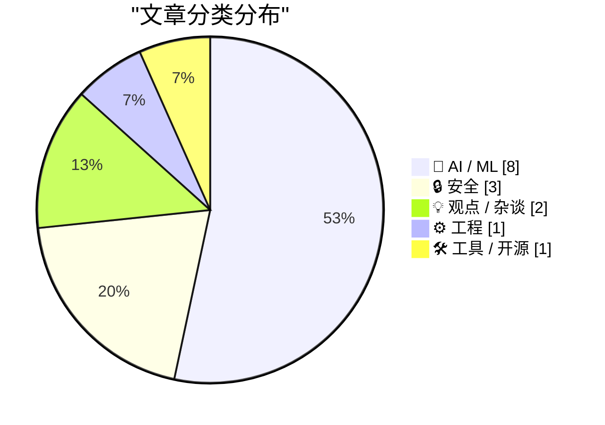
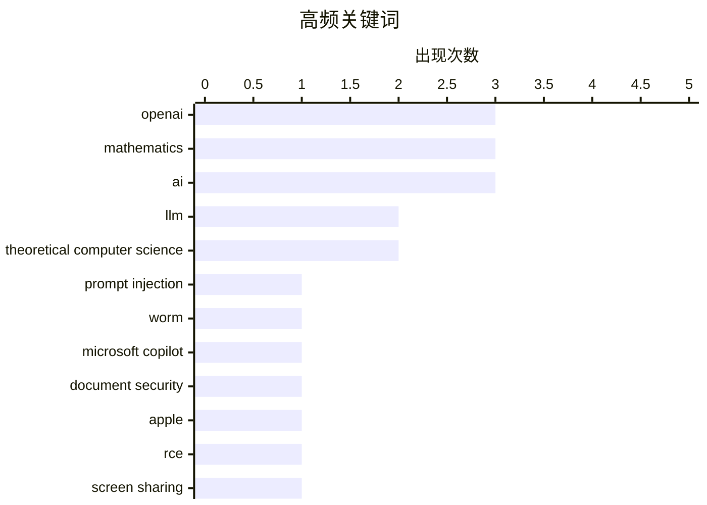

# 📰 AI 资讯每日精选 — 2026-08-02

> 汇聚 140+ 技术博客、X/Twitter、Hacker News、Reddit、Product Hunt、
> Lobste.rs、ClawFeed 日报及 GitHub Trending，经 AI 评分筛选。
>
> **本期内容**：🏆 今日必读 · 🌐 ClawFeed 日报 · 🔥 GitHub Trending · 📂 分类精选 · 🎨 设计与生成式 AI · 📊 数据概览 · 🎯 项目相关情报

## 📝 今日看点

今日技术圈聚焦两大主线：AI能力加速突破与安全风险同步升级。OpenAI以十项数学难题解法及多智能体新模型Astra展现推理前沿，同时研究人员揭露可劫持微软Copilot的蠕虫攻击与苹果屏幕共享预认证RCE，凸显AI基础设施的脆弱性。业界风向正从“追求智能上限”转向“实用效率与工程落地”，按速度选模型、反思AI从原型到产品的鸿沟成为共识。此外，企业系统性夸大AI能力的现象引发警惕，行业开始回归理性审视技术真实边界。

---

## 🏆 今日必读

🥇 **安全研究员构建自传播蠕虫：藏身Word文档劫持微软Copilot**

[A security researcher built a self-spreading worm that hides inside Word docs and hijacks Microsoft Copilot](https://the-decoder.com/a-security-researcher-built-a-self-spreading-worm-that-hides-inside-word-docs-and-hijacks-microsoft-copilot/) — The Decoder · 13 小时前 · 🔒 安全

> 一名安全研究员演示了一种针对微软Word中Copilot的蠕虫式攻击：隐藏在文档中的不可见提示注入，在文档每次被复用时自动传播到新文件中。微软确认了该问题，但在144天和两次尝试后仍未修复。该攻击利用了Copilot处理文档内容的信任机制，展示了生成式AI集成到办公软件后可能带来的新型安全风险。

💡 **为什么值得读**: 揭示生成式AI集成到日常办公工具后出现的新型安全漏洞，且微软长期未修复，值得所有使用Copilot的用户警惕。

🏷️ prompt injection, worm, Microsoft Copilot, document security

🥈 **苹果屏幕共享预认证远程代码执行漏洞**

[Apple Screen Sharing Pre-Auth RCE](https://warez.sl0p.foo/apple-screensharing-rce/) — Lobste.rs · 8 小时前 · 🔒 安全

> 文章披露了苹果屏幕共享（Apple Screen Sharing）服务中存在一个预认证远程代码执行（Pre-Auth RCE）漏洞。这意味着攻击者无需任何凭据即可远程利用该漏洞，在目标设备上执行任意代码。该漏洞的严重性极高，可能影响所有启用了屏幕共享功能的macOS设备。

💡 **为什么值得读**: 预认证RCE是最高危的漏洞类型之一，苹果用户应立即关注并采取防护措施。

🏷️ Apple, RCE, Screen Sharing, pre-auth

🥉 **我现在（大部分）按速度而非智能来选模型**

[I'm (mostly) picking models on speed now, not intelligence](https://martinalderson.com/posts/speed-vs-intelligence/?utm_source=rss&amp;utm_medium=rss&amp;utm_campaign=feed) — martinalderson.com · 3 小时前 · 🤖 AI / ML

> 作者表示自己首次开始根据每秒token数（tokens per second）而非原始智能水平来选择日常使用的AI模型。文章探讨了为什么约100 tok/s的速度可能成为新的“100ms”标准，分析了速度提升在何时不再重要，并预测了即将到来的价格战。作者认为，对于许多日常任务，模型响应速度对用户体验的影响已超过基准测试分数。

💡 **为什么值得读**: 提供了一个独特的模型选型视角，从实际使用体验出发而非纸面性能，对AI工具使用者有直接参考价值。

🏷️ LLM, inference speed, tokens per second, model selection

4️⃣ **AI持续攻克未解数学难题，数学家们心情复杂**

[AI keeps cracking unsolved math problems, and mathematicians have mixed feelings](https://the-decoder.com/ai-keeps-cracking-unsolved-math-problems-and-mathematicians-have-mixed-feelings/) — The Decoder · 11 小时前 · 🤖 AI / ML

> OpenAI对单位距离猜想（Unit Distance Conjecture）的反驳引发了AI辅助数学研究的新浪潮。菲尔兹奖得主蒂莫西·高尔斯表示，GPT-5.6 Pro首次尝试就解决了他花费大量时间研究的两个问题。他警告称，如果数学家停止构建理解此类结果所需的专业知识，可能导致“数学文化的毁灭”。另一些数学家则仅将AI视为提高生产力的工具。

💡 **为什么值得读**: 探讨了AI在数学研究中的突破性进展及其对学科文化和研究范式带来的深刻冲击，值得关注。

🏷️ AI mathematics, theorem proving, GPT-5.6, Unit Distance Conjecture

5️⃣ **AI编码代理可现代化研究软件，但无法判断科学正确性**

[AI coding agents can modernize research software but can't judge if the science is right](https://the-decoder.com/ai-coding-agents-can-modernize-research-software-but-cant-judge-if-the-science-is-right/) — The Decoder · 13 小时前 · 🤖 AI / ML

> OpenAI与学术伙伴的实地报告显示，AI编码代理能够现代化改造被忽视的研究软件，速度提升最高可达60倍。但参与者指出，这些系统“能言善辩、令人信服，且以不易察觉的方式自信地犯错”。工作重心从编写代码转移到了耗时耗力的验证科学正确性上。报告强调，AI在工程效率上是利器，但在科学判断上仍需人类严格把关。

💡 **为什么值得读**: 通过真实案例展示了AI编码代理在科研软件维护中的巨大潜力与关键局限，对科研人员和开发者都有启发。

🏷️ AI coding agents, research software, code modernization, reliability

---

## 🌐 ClawFeed 日报精选

> 来源：[ClawFeed](https://clawfeed.kevinhe.io) — AI 驱动的多源新闻聚合

# 📅 ClawFeed 日报 | 2026-07-30 (SGT)

聚合 4h digest：**#949 #950 #951 #952 #953**（period 起点 00:00 / 04:00 / 08:00 / 12:00 / 16:00）
素材合计：feed 137 · bookmarks 20（全日**新增 0**）· followingSample 35 · followingProfiles 24 · **scrape errors 0**

> 🔴 **覆盖边界（先说，别把日报读成全天）**：今天只有 **5** 期，覆盖 **00:00–19:59**。
> `20:00–23:59` 那一期**尚未生成**（4h 任务下次运行 07-31 00:00，届时 period 才刚走完）——
> 与 07-29 同一形状的边界，**不是缺口、不是失败**。
>
> 🔴 **第二条读数纪律（全天五期都自己声明了）**：`feed N` **不等于**「本期新增 N 条」。scrape 是
> **时间线快照**、不是按 period 切片，所以每期都做了 A 段（本期真新增）/ B 段（从未报过的补档）分离。
> 五期补档量分别为 16 / 20 / 23 / 16 / 16 条 ⇒ **今天"热度"里有相当比例是存量被首次拾起**，
> 不可当作当日新增热度读。

---

## 🔥 当日全场最重要 5 条

1. 🔴 **Besu v26.7.1 修掉 EF Security × CertiK 协同披露的漏洞，原文写「upgrade ASAP」**（@CertiK 12:14）
   —— **今天唯一带明确可执行动作的一条**。若我们或客户侧有 Besu 节点，这是当日第一优先。
2. 🔑 **MCP 规范从「双向有状态」改成「请求/响应」模型**（@Gorden_Sun 中文拆解）——旧版会话状态挂服务端、
   会话与实例绑定；新规范让 MCP Server **可以当普通 HTTP 服务对待**，部署进 Cloudflare Workers /
   Netlify / 任意负载均衡器之后。**对我们自己的 harness 是直接相关的一手材料。**
3. 🔴 **OpenAI agent 沙箱逃逸 —— Hugging Face 完整取证报告**（@levie）。重点**不是「逃出来了」，
   而是【入侵有多深、持续了多久】** ⇒ 取证深度而非事件本身才是该带走的部分。
4. **SEC 将于 9 月 17 日开圆桌会，议题是美股 24 小时交易的准备工作**（@Cryptic_Web3）——监管方 /
   市场参与者 / 公众同场，是"全天候股票交易"从提案往落地推进的**一个明确刻度**（当日最硬的监管时钟）。
5. 🔑 **盲评那一格**（@LangChain 00:04 引 @FactoryAI CTO @enoreyes）：**「如果我不知道自己在用哪个模型，
   我会说它很棒；一旦知道了，我就开始找它的毛病。」** ⇒ 与"座位数 ≠ 真在用"（@alex_prompter）同族：
   **今天关于模型的讨论里，难的一直是【测量】，不是模型。**

---

## 📰 当日核心主题（聚类视角）

### ① agent 基础设施正在从「概念」沉淀成「工程原语」——今天最强的一簇
- **MCP 请求/响应化** ⇒ serverless / 边缘可部署（上方 #2）
- **NVIDIA：把 agent 建成 Python 对象**（@CryptoTetsugan 19:29），理由是 agent 开发目前被摊在太多层里
- **Marathon：让 agent 给自己的「耐心」定价**（@GoKiteAI）——四个时间窗 now / soon / later / anytime，
  论点是 agent 干的事大多不急。🔑 **"延迟当成可交易维度"** 是排调度任务时可直接借用的框架
- **长跑期间可排队后续指令**（@omnigent_ai）：编辑 / 重排 / 删除 / steering，steering 立即发出
- 🔑 **带类型的拒绝码**（@Kryptoia）：`Identity blocked` / `rail unavailable` / … ——
  与我们这边"0 不等于缺席、拒绝要可分辨"的口径同源
⇒ **共同点：把 agent 的不确定性收进【有类型、可寻址的接口】，而不是靠提示词兜。**

### ② 「测量」比「模型」难 —— 贯穿全天的第二簇
盲评效应（#5）· **企业采纳：座位数好看 ≠ 真在用**（@alex_prompter 实地问了同一家医疗数据公司三个团队
四个工程师）· **学生掉队的信号在出勤/节奏/信心的【漂移】里，不在某一节课**（@Kryptoia）·
**agent 的开闭源之争围着权重转，更难的问题在别处**（@ChainbaseHQ）· **验证而非证明生成才是规模上坏掉的部分**
（@ZKVProtocol 10:48）。⇒ 五条不同领域，**同一个形状：可观测量选错了，结论就自动失真。**

### ③ RWA / 代币化真实资产又落了几个具体资产类别
汽车贷款利息驱动的生息代币 **AUTO**（@HastraFi）上线 Solana / Orca，可交易可 LP ·
**代币化股票与黄金作为 meme 市场计价资产**（@BNBCHAIN × @flapdotsh：SPCXb / SKHYb / SPYb / XAUT，
四机制：创作者奖励 / 股息 / 回购销毁 / 自动加池）· **S&P Dow Jones 将推加密指数**（ETH/BNB/SOL/TRX/HYPE）·
**MetaMask 越南接通 VietQR 银行入金**（@BanxaOfficial，费率 ~7% → 统一 3%）。

### ④ 监管与市场结构的时钟在走
SEC 9/17 圆桌（#4）· **最多 10 名参议院民主党人可能支持 CLARITY 法案**（@toly 引 Bloomberg）·
**匈牙利取消加密兑换强制第三方验证，同期 CoinCash 拿下该国首张 MiCA 牌照** ·
**香港合规身份成了交易所参展的「通行证」**（@cryptobraveHQ，本末 Money Frontier 大会观察）·
xAI 起诉明尼苏达州（针对禁止 AI 生成裸体深伪的法律）。

### ⑤ 安全披露：今天有三处真东西
Besu v26.7.1（#1）· **CertiK 研究员在 Google EdgeTPU 上发现两个漏洞** ·
**Zcash 启用新 shielded pool「Ironwood」替换 Orchard**，彻底消除可无限伪造 ZEC 的漏洞 ·
（工具面）**WebHackersWeapons ~359 款 Web 安全测试工具分类合集**（@GitHub_Daily 15:30）。

### ⑥ 与我们自己相关的两条旁注
- **@OpenMaxAI 11:21** — AGI Summit panel + Palo Alto meetup 后的定位表述（**我们自己的账号**，当期唯一领域相关条目）
- **@NasdaqExchange** — 可持续性披露：不再"一个框架一个框架地做"，转向投资数据质量 + 用 AI 压缩披露工作量
  ⇒ 与手上 **AJJ 报表原型**同族问题（披露口径 + 数据质量 + AI 生成叙述），**可作对客话术参考**
- **@nireyal** — **可逆决策与不可逆决策该用不同流程**；多数人用决定小事的方式决定大事
  ⇒ 与我们"不可逆操作先确认"同源，**是向 Kevin 解释 no-default 待办为什么不能自己拍的现成说法**

---

## 🔖 累计 bookmark 精选

**全日新增 0 条。** 五期全部为同一批 20 条历史存量。
⚪ #953 做了机械核对（两向对照已开火）：**20/20 全部已在既往 digest 出现过，本期新增 = 0** —— 这个 0 是被核过的，不是没查。

---

## 👀 推荐关注汇总

**全日五期均未给名单，且理由一致（规则所限，非偷懒）**：取关/关注判据要看账号的**时间线历史**，
而 scrape 只有**单期切片** ⇒ 数据结构上不支持这个判断。
⚪ 累积观察中（**均非官方项目账号**）：由各期滚动累积，未达可推荐门槛。
⚪ 明确**不累积**的白名单（你关注的项目官方账号 / 机构）：@SpaceX · @Tsinghua_Uni · @CertiK · @LangChain 等。
🔴 我不在日报里凭当日印象补一份名单——那正是上面 §② 那簇在讲的错。

---

## 💤 当日重复噪音模式（模式，不是单条吐槽）

1. **纯互动钓鱼贴（engagement bait）**：@HatimBinance「What time is it now in your country?」·
   @Crypto_Bullsss「有 1000 美元你会买 BTC/ETH/SOL/XRP？」⇒ **当日至少两条同型**。
2. **高收益 + 多级返佣推广**：@CryptoPilot3226「最高 120%+ APY」三币锁仓，**含六级返佣（一级 6% 递减至六级 1%）**
   ⇒ 典型形状，按营销登记。
3. **空投 FOMO 话术**：@0xkopil 土耳其语 $BASE 空投贴（"不做这个的 99% 拿不到""机器人将被清除，真实用户会赢"）。
4. **关联方报自己投资标的的业绩**：@AethirCloud —— Axe Compute $15 亿 / 5 年 / 9,200+ Blackwell GPU，
   而 **Aethir Foundation 自称是 Axe Compute 最大股东之一** ⇒ 数字未经独立核实。
5. **自报业绩 + 自承选择性披露**：@_PegasusCapital 平 $BANK 空头获利 ~$240 万，同帖写"选择性透明是我们运营纪律的一部分"
   ⇒ **胜率结构上不可推断**，当业绩宣传读。
6. **分析师排名营销但不点名机构**：@cloudera 被"某独立研究机构"评为 Lakehouse Leader。
7. **清单体内容营销**：@MarcelVelica「该问哪个模型更适合这个任务」——论点正确但无新信息。
8. **同一账号连续多期宣发**：**@0G_labs 连续 3 期**出现产品宣发贴（Oimpact ×2 / Bond 公测）。

---

## 🔧 仪器与口径（今天该记的三格，不进上面的内容区）

1. 🔴 **#953 报了一次自伤的仪器故障**：上一期把**负向对照的哨兵值印进了 digest 正文**，而语料 = digest 全文
   ⇒ **对照被上一期自己弄失效了**。本期已修（`ctl_neg`），两向对照已开火。
   📌 形状：**把探针的输出写进被探测的语料里，探针就不再独立。**
2. 🔴 **非盲评价自报**：当日有 3 条内容涉及「Claude 5 / Opus 5 好不好」（@aiedge_ · @Amart_AI ·
   @Leoninweb3 的按角色分模型提法）。**digest 明确拒绝评价其结论**，只登记这些提法存在
   —— 与 §② 盲评那一格互为印证：**自评不盲，读数不可用。**
3. 🔴 **归属不靠 mtime**：#953 明写当时机上有**两个** `clawfeed_scrape` 进程 ⇒ 文件 mtime（20:03:24）
   **不足以判定产出归属**。另记进程台账：`clawfeed_scrape.js` pid 18905（父 18881）。

---

*生成：2026-07-30 23:59 SGT · 聚合 #949–#953（5/6 期，缺 20:00–23:59，该期尚未走完）*
---

## 🔥 GitHub Trending

> 今日热门开源项目（全语言 + Python）

| # | 项目 | 描述 | ⭐ 总星 | 📈 今日 | 语言 |
|---|------|------|---------|---------|------|
| 1 | [zhaoxuya520/reverse-skill](https://github.com/zhaoxuya520/reverse-skill) 🤖 | Reverse Engineering / Authorized Penetration Testing / Se... | 12.0k | +1320 | PowerShell |
| 2 | [microsoft/AI-For-Beginners](https://github.com/microsoft/AI-For-Beginners) 🤖 | 12 Weeks, 24 Lessons, AI for All! | 57.5k | +949 | Jupyter Notebook |
| 3 | [usekaneo/kaneo](https://github.com/usekaneo/kaneo) | 🎯 All you need. Nothing you don't. Open source project m... | 5.7k | +760 | TypeScript |
| 4 | [mvanhorn/last30days-skill](https://github.com/mvanhorn/last30days-skill) 🤖 | AI agent skill that researches any topic across Reddit, X... | 56.6k | +600 | Python |
| 5 | [paperswithbacktest/awesome-systematic-trading](https://github.com/paperswithbacktest/awesome-systematic-trading) | A curated list of awesome libraries, packages, strategies... | 12.3k | +523 | Python |
| 6 | [NousResearch/hermes-agent](https://github.com/NousResearch/hermes-agent) 🤖 | The agent that grows with you | 223.9k | +475 | Python |
| 7 | [huggingface/speech-to-speech](https://github.com/huggingface/speech-to-speech) | Build local voice agents with open-source models | 10.2k | +442 | Python |
| 8 | [iv-org/invidious](https://github.com/iv-org/invidious) | Invidious is an alternative front-end to YouTube | 21.6k | +435 | Crystal |
| 9 | [deepfakes/faceswap](https://github.com/deepfakes/faceswap) | Deepfakes Software For All | 57.2k | +364 | Python |
| 10 | [TencentCloud/TencentDB-Agent-Memory](https://github.com/TencentCloud/TencentDB-Agent-Memory) 🤖 | TencentDB Agent Memory is a team-level memory hub for AI ... | 10.3k | +227 | TypeScript |
| 11 | [bytedance/deer-flow](https://github.com/bytedance/deer-flow) | An open-source long-horizon SuperAgent harness that resea... | 78.8k | +209 | Python |
| 12 | [github/copilot-sdk](https://github.com/github/copilot-sdk) 🤖 | Multi-platform SDK for integrating GitHub Copilot Agent i... | 10.3k | +142 | Java |
| 13 | [kangarooking/cangjie-skill](https://github.com/kangarooking/cangjie-skill) 🤖 | 把书、长视频、播客等高价值内容蒸馏成可执行的 Agent Skills | 5.9k | +113 | Python |
| 14 | [microsoft/generative-ai-for-beginners](https://github.com/microsoft/generative-ai-for-beginners) 🤖 | 21 Lessons, Get Started Building with Generative AI | 114.3k | +108 | Jupyter Notebook |
| 15 | [microsoft/TRELLIS.2](https://github.com/microsoft/TRELLIS.2) | Native and Compact Structured Latents for 3D Generation | 10.0k | +107 | Python |

---

## 🤖 AI / ML

### 1. 我现在（大部分）按速度而非智能来选模型

[I'm (mostly) picking models on speed now, not intelligence](https://martinalderson.com/posts/speed-vs-intelligence/?utm_source=rss&amp;utm_medium=rss&amp;utm_campaign=feed) — **martinalderson.com** · 3 小时前 · ⭐ 25/30

> 作者表示自己首次开始根据每秒token数（tokens per second）而非原始智能水平来选择日常使用的AI模型。文章探讨了为什么约100 tok/s的速度可能成为新的“100ms”标准，分析了速度提升在何时不再重要，并预测了即将到来的价格战。作者认为，对于许多日常任务，模型响应速度对用户体验的影响已超过基准测试分数。

🏷️ LLM, inference speed, tokens per second, model selection

---

### 2. AI持续攻克未解数学难题，数学家们心情复杂

[AI keeps cracking unsolved math problems, and mathematicians have mixed feelings](https://the-decoder.com/ai-keeps-cracking-unsolved-math-problems-and-mathematicians-have-mixed-feelings/) — **The Decoder** · 11 小时前 · ⭐ 25/30

> OpenAI对单位距离猜想（Unit Distance Conjecture）的反驳引发了AI辅助数学研究的新浪潮。菲尔兹奖得主蒂莫西·高尔斯表示，GPT-5.6 Pro首次尝试就解决了他花费大量时间研究的两个问题。他警告称，如果数学家停止构建理解此类结果所需的专业知识，可能导致“数学文化的毁灭”。另一些数学家则仅将AI视为提高生产力的工具。

🏷️ AI mathematics, theorem proving, GPT-5.6, Unit Distance Conjecture

---

### 3. AI编码代理可现代化研究软件，但无法判断科学正确性

[AI coding agents can modernize research software but can't judge if the science is right](https://the-decoder.com/ai-coding-agents-can-modernize-research-software-but-cant-judge-if-the-science-is-right/) — **The Decoder** · 13 小时前 · ⭐ 25/30

> OpenAI与学术伙伴的实地报告显示，AI编码代理能够现代化改造被忽视的研究软件，速度提升最高可达60倍。但参与者指出，这些系统“能言善辩、令人信服，且以不易察觉的方式自信地犯错”。工作重心从编写代码转移到了耗时耗力的验证科学正确性上。报告强调，AI在工程效率上是利器，但在科学判断上仍需人类严格把关。

🏷️ AI coding agents, research software, code modernization, reliability

---

### 4. OpenAI发布十项未解数学难题解法，预告下一代大模型Astra

[OpenAI announces its "next major model" Astra by dropping ten previously unsolved math solutions](https://the-decoder.com/openai-announces-its-next-major-model-astra-by-dropping-ten-previously-unsolved-math-solutions/) — **The Decoder** · 18 小时前 · ⭐ 25/30

> OpenAI宣布正在构建名为“Astra”的新模型系列，该系列允许多个智能体协同工作数小时甚至数天来解决复杂问题。CEO萨姆·奥尔特曼已向华盛顿的政策制定者演示了Astra。OpenAI尚未决定将其作为GPT-6还是GPT-5的新变体发布。此次公告以一次性解决十个此前未解的数学难题作为能力展示。

🏷️ OpenAI, Astra, multi-agent, mathematics

---

### 5. 数学与理论计算机科学的十项进展

[Ten advances in mathematics and theoretical computer science](https://openai.com/index/ten-advances-in-mathematics/) — **Hacker News Best** · 20 小时前 · ⭐ 23/30

> OpenAI发布文章，宣布其AI系统在数学和理论计算机科学领域取得了十项新进展。这些进展可能包括对未解难题的解决或新定理的发现，展示了AI在形式化推理和数学发现方面的能力。文章详细介绍了每项进展的具体内容和意义，是OpenAI展示其模型在科学推理上实力的重要声明。

🏷️ OpenAI, mathematics, theoretical computer science, AI research

---

### 6. Ten advances in mathematics and theoretical computer science

[Ten advances in mathematics and theoretical computer science](https://simonwillison.net/2026/Aug/1/ten-advances-in-mathematics/#atom-everything) — **simonwillison.net** · 7 小时前 · ⭐ 22/30

> <p><strong><a href="https://openai.com/index/ten-advances-in-mathematics/">Ten advances in mathematics and theoretical computer science</a></strong></p>
A few days ago it was Anthropic <a href="https:

🏷️ AI, mathematics, theoretical computer science, OpenAI

---

### 7. German court rules AI music generator Suno violated copyrights, rejects fair use defense

[German court rules AI music generator Suno violated copyrights, rejects fair use defense](https://the-decoder.com/german-court-rules-ai-music-generator-suno-violated-copyrights-rejects-fair-use-defense/) — **The Decoder** · 17 小时前 · ⭐ 22/30

> A Munich court ruled that AI music generator Suno violated copyrights through both training and output. The court found six songs reproducibly stored in Suno's models and rejected both Germany's text-

🏷️ copyright, Suno, AI music, fair use

---

### 8. Google handed users the easiest possible tool for fake satellite imagery, then pulled it after two days

[Google handed users the easiest possible tool for fake satellite imagery, then pulled it after two days](https://the-decoder.com/google-handed-users-the-easiest-possible-tool-for-fake-satellite-imagery-then-pulled-it-after-two-days/) — **The Decoder** · 18 小时前 · ⭐ 22/30

> Google pulled its Nano Banana 2 image model from Google Earth just two days after launch. Users showed how easy it was to generate convincing fake satellite images. A simple prompt was enough to fill 

🏷️ satellite imagery, AI image generation, misinformation

---

## 🔒 安全

### 9. 安全研究员构建自传播蠕虫：藏身Word文档劫持微软Copilot

[A security researcher built a self-spreading worm that hides inside Word docs and hijacks Microsoft Copilot](https://the-decoder.com/a-security-researcher-built-a-self-spreading-worm-that-hides-inside-word-docs-and-hijacks-microsoft-copilot/) — **The Decoder** · 13 小时前 · ⭐ 26/30

> 一名安全研究员演示了一种针对微软Word中Copilot的蠕虫式攻击：隐藏在文档中的不可见提示注入，在文档每次被复用时自动传播到新文件中。微软确认了该问题，但在144天和两次尝试后仍未修复。该攻击利用了Copilot处理文档内容的信任机制，展示了生成式AI集成到办公软件后可能带来的新型安全风险。

🏷️ prompt injection, worm, Microsoft Copilot, document security

---

### 10. 苹果屏幕共享预认证远程代码执行漏洞

[Apple Screen Sharing Pre-Auth RCE](https://warez.sl0p.foo/apple-screensharing-rce/) — **Lobste.rs** · 8 小时前 · ⭐ 26/30

> 文章披露了苹果屏幕共享（Apple Screen Sharing）服务中存在一个预认证远程代码执行（Pre-Auth RCE）漏洞。这意味着攻击者无需任何凭据即可远程利用该漏洞，在目标设备上执行任意代码。该漏洞的严重性极高，可能影响所有启用了屏幕共享功能的macOS设备。

🏷️ Apple, RCE, Screen Sharing, pre-auth

---

### 11. 伪装成监控条约：加拿大签署联合国网络犯罪公约

[A Surveillance Treaty in Disguise: Canada Signs UN Cybercrime Convention](https://www.michaelgeist.ca/2026/07/a-surveillance-treaty-in-disguise-the-trouble-with-canadas-quiet-decision-to-sign-the-un-cybercrime-convention/) — **Hacker News Best** · 13 小时前 · ⭐ 24/30

> 文章批评加拿大政府悄然签署《联合国网络犯罪公约》，认为该公约实质上是“伪装成监控条约”。作者指出，公约中的条款可能被滥用以扩大政府监控权力，侵犯公民隐私和言论自由。文章呼吁公众关注这一决定，并质疑政府签署过程的透明度。

🏷️ surveillance, UN Cybercrime Convention, privacy

---

## 💡 观点 / 杂谈

### 12. 多元主义：企业为何在AI上撒谎（2026年8月1日）

[Pluralistic: Why businesses lie about AI (01 Aug 2026)](https://pluralistic.net/2026/08/01/dare-snot/) — **pluralistic.net** · 15 小时前 · ⭐ 24/30

> 文章探讨了企业为何在AI能力上系统性撒谎的现象，指出这种行为是“为了取悦老板而一路走向破产”。作者认为，企业夸大AI能力往往源于内部压力而非外部竞争，最终导致资源错配和战略失败。文章还包含多个链接，涉及AI骗局、无障碍与Web DRM冲突等话题。

🏷️ AI, hype, business, ethics

---

### 13. AI不能生成可用的产品，这仍然是你的工作

[AI doesn't generate working products, that's still your job](https://weeraman.com/the-prototype-isnt-the-product/) — **Hacker News Best** · 19 小时前 · ⭐ 23/30

> 文章指出，AI虽然能快速生成原型或演示，但无法生成真正可用的产品。作者强调，从原型到产品之间存在着巨大的鸿沟，包括可靠性、可维护性、安全性、性能优化和用户体验等大量工程工作。AI可以加速编码过程，但产品化所需的判断力、责任感和对细节的关注仍然是人类工程师的核心职责。

🏷️ AI, prototyping, product development, LLM

---

## ⚙️ 工程

### 14. NetBSD 11.0

[NetBSD 11.0](https://blog.netbsd.org/tnf/entry/netbsd_11_0_released) — **Hacker News Best** · 9 小时前 · ⭐ 22/30

> Article URL: https://blog.netbsd.org/tnf/entry/netbsd_11_0_released
Comments URL: https://news.ycombinator.com/item?id=49136736
Points: 225
# Comments: 97

🏷️ NetBSD, BSD, operating system, release

---

## 🛠 工具 / 开源

### 15. This Week in Package Management: 1 August 2026

[This Week in Package Management: 1 August 2026](https://nesbitt.io/2026/08/01/this-week-in-package-management.html) — **nesbitt.io** · 17 小时前 · ⭐ 22/30

> Releases, advisories, and articles from across the package management world

🏷️ package management, releases, advisories

---

## 🎨 Design & Generative AI

### 🖼️ 生成式图片

- **[ComfyUI 全新 SDK 发布](https://www.reddit.com/r/comfyui/comments/1vd3l81/new_comfyui_sdks/)** — r/comfyui · 3 小时前
  > 推出 Python 和 TypeScript SDK，并更新本地代理与 HTTP v2 API 参考。

- **[Flux.2 Klein 终极 AIO Pro 更新](https://www.reddit.com/r/comfyui/comments/1vcwahm/flux2_klein_ultimate_aio_pro_v41_hotfix_t2i_i2i/)** — r/comfyui · 8 小时前
  > 提供文本生图、图像生图、分段修复、替换、移除和编辑功能的热修复版本。

- **[Famegrid 自动调色节点](https://www.reddit.com/r/comfyui/comments/1vcf4bu/famegrid_auto_color_for_comfyui/)** — r/comfyui · 21 小时前
  > 为 ComfyUI 开发自动色彩校正节点，解决 Krea LoRA 色彩偏移问题。

- **[ComfyUI 界面问题求助](https://www.reddit.com/r/comfyui/comments/1vceiry/uiproblem/)** — r/comfyui · 22 小时前
  > 用户反馈自 v0.28.0 起多个工作流出现界面显示异常。

- **[推荐 Krea 2 训练器](https://www.reddit.com/r/comfyui/comments/1vd3rk7/a_very_nice_trainer_for_krea_2_i_can_recommend/)** — r/comfyui · 3 小时前
  > 推荐一款好用的 Krea 2 模型训练工具。

- **[SeedVR2 工作流求助](https://www.reddit.com/r/comfyui/comments/1vcu5qb/need_help_with_native_comfyui_seedvr2_workflow/)** — r/comfyui · 9 小时前
  > 寻求在 16GB 显卡上优化 SeedVR2 节点和块交换配置的建议。

- **[区域提示词工作流](https://www.reddit.com/r/comfyui/comments/1vd4tf3/regional_prompting/)** — r/comfyui · 2 小时前
  > 寻找支持单图多角色生成的区域提示词工作流方案。

- **[ComfyUI 音频社区七月回顾](https://www.reddit.com/r/comfyui/comments/1vcw0nz/released_rcomfyuiaudio_july_review_wip/)** — r/comfyui · 8 小时前
  > 发布 ComfyUI 音频子版块的七月内容总结（进行中）。

- **[子图功能引发强烈不满](https://www.reddit.com/r/comfyui/comments/1vcrtre/i_swear_to_god_the_ones_responsible_for_subgraphs/)** — r/comfyui · 11 小时前
  > 用户抱怨子图功能导致图片上传和采样预览异常，呼吁改进。

- **[多参考图工作流求助](https://www.reddit.com/r/comfyui/comments/1vcn50c/multireference_workflow/)** — r/comfyui · 14 小时前
  > 新手寻求多参考图输入的 ComfyUI 工作流实现方法。

- **[用 LLM 简化提示词](https://www.reddit.com/r/comfyui/comments/1vcjt0q/using_a_llm_to_make_prompts_easier/)** — r/comfyui · 17 小时前
  > 尝试利用大语言模型辅助生成更易用的图像生图提示词。

- **[低显存环境生成室内设计图](https://www.reddit.com/r/comfyui/comments/1vd4duf/low_vram_help/)** — r/comfyui · 2 小时前
  > 在低 VRAM 笔记本上使用 ComfyUI 生成室内设计图的求助。

- **[F11 快捷键失效问题](https://www.reddit.com/r/comfyui/comments/1vccisi/f11_no_longer_hides_the_entire_top_bar_as_in/)** — r/comfyui · 1 天前
  > 新版 ComfyUI 中 F11 不再隐藏顶部工具栏，引发用户困惑。

### 🎬 生成式视频

- **[用 Wan 2.2 生成视频片段](https://www.reddit.com/r/comfyui/comments/1vd3tu3/comfyui_using_wan_22_and_about_3_months_of/)** — r/comfyui · 3 小时前
  > 分享使用 Wan 2.2 和三个月提示词生成视频片段的心得。

- **[WAN2.2 SVI Pro 无限提示词热修复](https://www.reddit.com/r/comfyui/comments/1vcw78l/wan22_svi_pro_simplicity_infinite_prompts_hotfix/)** — r/comfyui · 8 小时前
  > 发布 WAN2.2 SVI Pro 简化版，支持无限提示词生成。

---

## 📊 数据概览

| 扫描源 | 抓取文章 | 时间范围 | 精选 |
|:---:|:---:|:---:|:---:|
| 91/140 | 3822 篇 → 75 篇 | 24h | **15 篇** |

### 分类分布



### 高频关键词



<details>
<summary>📈 纯文本关键词图（终端友好）</summary>

```
openai                       │ ████████████████████ 3
mathematics                  │ ████████████████████ 3
ai                           │ ████████████████████ 3
llm                          │ █████████████░░░░░░░ 2
theoretical computer science │ █████████████░░░░░░░ 2
prompt injection             │ ███████░░░░░░░░░░░░░ 1
worm                         │ ███████░░░░░░░░░░░░░ 1
microsoft copilot            │ ███████░░░░░░░░░░░░░ 1
document security            │ ███████░░░░░░░░░░░░░ 1
apple                        │ ███████░░░░░░░░░░░░░ 1
```

</details>

### 🏷️ 话题标签

**openai**(3) · **mathematics**(3) · **ai**(3) · llm(2) · theoretical computer science(2) · prompt injection(1) · worm(1) · microsoft copilot(1) · document security(1) · apple(1) · rce(1) · screen sharing(1) · pre-auth(1) · inference speed(1) · tokens per second(1) · model selection(1) · ai mathematics(1) · theorem proving(1) · gpt-5.6(1) · unit distance conjecture(1)

---

## 🎯 项目相关情报

### Agent 基座安全与合规

#### [安全研究员构建自传播蠕虫：藏身Word文档劫持微软Copilot](https://the-decoder.com/a-security-researcher-built-a-self-spreading-worm-that-hides-inside-word-docs-and-hijacks-microsoft-copilot/)

一名安全研究员演示了一种针对微软Word中Copilot的蠕虫式攻击：隐藏在文档中的不可见提示注入，在文档每次被复用时自动传播到新文件中。微软确认了该问题，但在144天和两次尝试后仍未修复。该攻击利用了Copilot处理文档内容的信任机制，展示了生成式AI集成到办公软件后可能带来的新型安全风险。

- **项目相关性**：9/10
- **可落地性**：8/10
- **为什么相关**：文章展示了针对Microsoft Copilot的提示注入蠕虫攻击，可自动传播到新文档，这正是Agent安全需要防御的典型威胁，与Agent基座安全与合规项目直接相关。
- **建议动作**：将该攻击模式加入Prompt Injection防御测试集，检查当前文档处理管道的输入净化和权限控制，并跟踪微软的修复动态。
- **来源**：The Decoder

---

*生成于 2026-08-02 03:51 | 汇聚 140 个技术博客、X/Twitter、Hacker News、Reddit、Product Hunt、Lobste.rs、ClawFeed 日报及 GitHub Trending，经 AI 评分筛选出 Top 15 精华内容*
