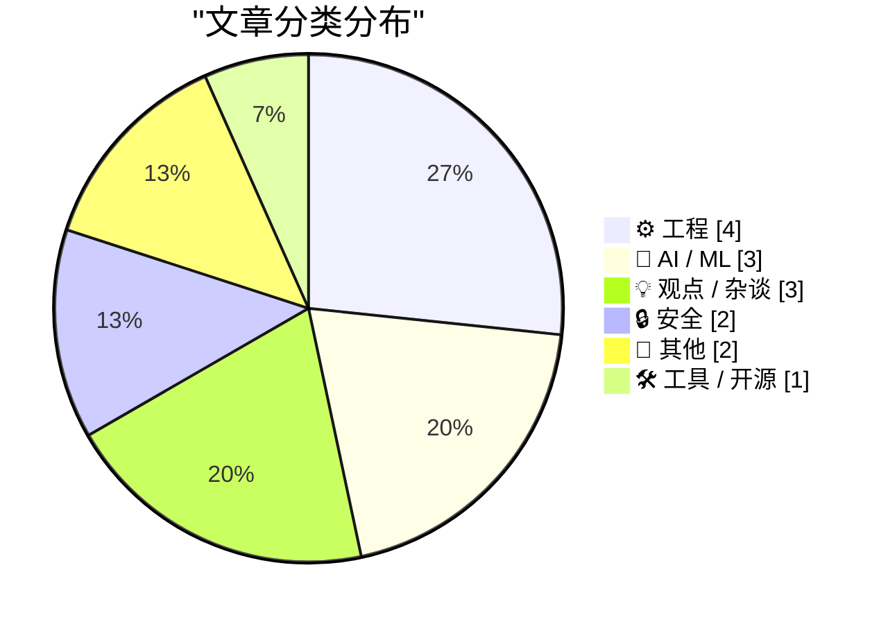
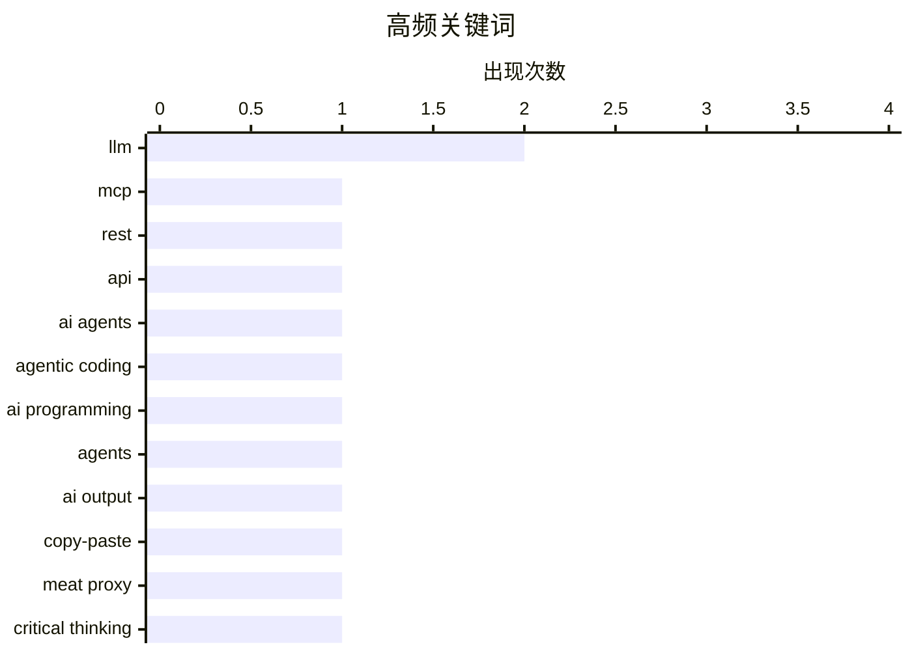

# 📰 AI 资讯每日精选 — 2026-08-04

> 汇聚 140+ 技术博客、X/Twitter、Hacker News、Reddit、Product Hunt、
> Lobste.rs、ClawFeed 日报及 GitHub Trending，经 AI 评分筛选。
>
> **本期内容**：🏆 今日必读 · 🌐 ClawFeed 日报 · 🔥 GitHub Trending · 📂 分类精选 · 🎨 设计与生成式 AI · 📊 数据概览 · 🎯 项目相关情报

## 🏆 今日必读

🥇 **[Sponsor] MCP vs. REST: The Right Way to Connect Agents to Your API**

[[Sponsor] MCP vs. REST: The Right Way to Connect Agents to Your API](https://workos.com/blog/mcp-vs-rest?utm_source=daringfireball&amp;utm_medium=newsletter&amp;utm_campaign=q32026) — daringfireball.net · 5 小时前 · ⚙️ 工程

> [Sponsor] MCP vs. REST: The Right Way to Connect Agents to Your API

🏷️ MCP, REST, API, AI agents

🥈 **Agentic coding techniques**

[Agentic coding techniques](https://micahflee.com/agentic-coding-techniques/) — micahflee.com · 11 小时前 · 🤖 AI / ML

> Agentic coding techniques

🏷️ agentic coding, LLM, AI programming, agents

🥉 **Don't be a meat proxy**

[Don't be a meat proxy](https://simonwillison.net/2026/Aug/3/dont-be-a-meat-proxy/#atom-everything) — simonwillison.net · 3 小时前 · 💡 观点 / 杂谈

> Don't be a meat proxy

🏷️ AI output, copy-paste, meat proxy, critical thinking

4️⃣ **Why smarter AI models could drive up compute prices 10x**

[Why smarter AI models could drive up compute prices 10x](https://www.dwarkesh.com/p/why-compute-might-get-10x-more-expensive-video) — dwarkesh.com · 10 小时前 · 🤖 AI / ML

> Why smarter AI models could drive up compute prices 10x

🏷️ AI compute, compute costs, LLM, economics

5️⃣ **Book Review: The Field Guide to Understanding 'Human Error' by Sidney Dekker ★★★★☆**

[Book Review: The Field Guide to Understanding 'Human Error' by Sidney Dekker ★★★★☆](https://shkspr.mobi/blog/2026/08/book-review-the-field-guide-to-understanding-human-error-by-sidney-dekker/) — shkspr.mobi · 16 小时前 · ⚙️ 工程

> Book Review: The Field Guide to Understanding 'Human Error' by Sidney Dekker ★★★★☆

🏷️ human error, system design, safety, book review

---

## 🌐 ClawFeed 日报精选

> 来源：[ClawFeed](https://clawfeed.kevinhe.io) — AI 驱动的多源新闻聚合

📅 ClawFeed 日报 | 2026-08-03（SGT）

🔴🔴 **先读这一段：本日报的覆盖率是 1/6，不是一天。**

```
今日应有 4h digest 窗口：00:00 · 04:00 · 08:00 · 12:00 · 16:00 · 20:00  = 6 个
今日实有                ：仅 #957（period 16:00-19:59，20:00 触发）      = 1 个
缺失原因                ：agent 侧上游限流停机 83h45m（07-31 06:14:11 → 08-03 17:59:02）
                          期间 4h digest 被调度 63 次、成功 0 次（scheduler task_history 实测）
```

📌 **所以这份文件是一份"4 小时快照"，只是文件名叫日报。** 它**不能**回答"今天整体如何"——
今天 00:00–15:59 这 16 个小时**没有任何素材被采集过**，那段时间的时间线已经过去、取不回来。
🔴 **缺的窗口我没有补做**：素材是实时抓取的，补做只能用今晚的快照冒充上午，那会产出一份看起来完整、实际是伪造时间归属的东西。
⇒ **下面每一节都受这条约束**，凡涉及"当日/全天/趋势"的措辞我都已降级或标注。

---

## 🔥 当日最重要（⚠️ 只有 3 条，不是 5 条）

⚠️ **任务模板要求"当日全场最重要 5 条（跨档排序、去重）"，而唯一的来源 digest 其"重要"区只有 3 条。**
凑到 5 条只能从 Feed 精选里提拔两条充数 ⇒ **我不凑**。下面 3 条是真·重要区全部内容：

1. **Grok Build 更新** — Auto mode 扩展、开发者可更细控制 **Bash 权限**、`/btw` 加速、长对话导航改善。Bash 权限粒度这条是 agent 编码工具从"能跑"走向"可授权管理"的方向。https://x.com/elonmusk/status/2084156097405849727
2. **微软折旧年限延长 + 资本开支指引下调，容易被误读成"微软控住了 AI 支出"** — 更准确是会计与经营同时给市场降温：AI 数据中心买完 GPU 才是开始，服务器/网络/土地/电力/租赁/冷却每一项都会变成未来数年的折旧与现金流压力。https://x.com/OliverYeung6/status/2084247915187359977
3. **EU AI 透明度规则已开始适用** — 特定 AI 系统与 AI 生成/篡改内容，基线现在包含披露与**机器可读标记**。合规面从"要不要标"变成"标成机器能读的格式"。https://x.com/brevis_zk/status/2084247917653807375

## 📰 当日核心主题

🔴 **本节按模板要求应做"聚类视角、把当天反复出现的话题 surface 出来"——而聚类需要跨窗口的重复出现，本日只有 1 个窗口 ⇒ 结构上做不了。**
⚪ 能诚实说的只是**该单一窗口内部**的共现（n=1 窗口，不构成"当日趋势"）：

- **「agent 写了码但没人能解释」这条线索在同一窗口出现两次、且是同一问题的两端**：
  @hasantoxr 主张付给 Claude 的 75% 花在 agent 重新发现它昨天已知的东西（⚠️ 该 75% 是厂商宣传数字、未见方法说明，当营销读）；
  @LimestoneHQ 报告 AI 写码快 10x 之后 code review 积压涨 3x、让人解释 agent 写了什么时人们的做法是**再跑一遍**。
  ⇒ 共同点：**agent 不留下可理解的痕迹**，一端是成本，一端是组织症状。
- **合规/权限颗粒度**：EU 机器可读标记 + Grok 的 Bash 权限控制，两者都指向"AI 行为需要可审计的边界"，但**这是我的归纳，不是数据里的重复出现**（各出现 1 次）。

## 🔖 累计 bookmark 精选

🔴 **本日 0 条新增**：#957 实测书签 20/20 全部已在历史语料（935 个 digest 文件）中，new = 0。
⚠️ 且 **9/20 书签正文为空**（scraper 未取到 body）⇒ 那 9 条**未被评估**，不等于"不值得收录"。
⇒ 本节不产出"精选"，避免把旧书签重新包装成今日产出。

## 👀 推荐关注汇总（去重后 3 个）

- **@OliverYeung6** — 唯一把 AI capex 拆到会计层面（折旧年限/租赁/电力）的中文分析，不堆 buzz 词。
- **@LimestoneHQ** — AI 工程落地后的组织症状观察（review 积压、可解释性缺失），一手客户视角。
- **@brevis_zk** — 把 EU AI 透明度规则拆成可执行的分层结构。

🔴 **操作前两条限制**：
1. **未逐一在浏览器核实是否已关注。** 可比对的 `followingSample` 只有 35 个，而关注数约 5,000 ⇒ **覆盖率 <1%，不在样本里完全不代表未关注。加之前请先在 Following 里搜。**
2. @LimestoneHQ 同时出现在 bookmarks 与 followingSample ⇒ **很可能已关注**。

## 💤 当日重复噪音模式

⚠️ 模板要求"模式，不是单条吐槽"。基于单一窗口（30 条 feed）能站住的只有两点：

- **领域外内容约占 30%**（30 条里 ~9 条）：清华污水处理膜、中缅媒体论坛、印尼宗教活动、古兰经每日经文、动物保护请愿、纯 airdrop 任务。⇒ 这是 feed 组成问题，不是某条推的问题。
- **同一账号同一活动连发**：@developer_dao 就一场 DevNTell 双集活动连发 3 条（预告 + 两集各 1 条）⇒ 单一事件占掉 10% 的窗口配额。
🔴 **不能说的**：这两条是否为"当日/长期模式"——**我只有一个窗口，n=1**。要成为模式判断需要跨窗口复现。

## 🔬 本日报自身的可信度边界（汇总）

| 项 | 状态 |
|---|---|
| 窗口覆盖 | **1/6**（缺 00:00/04:00/08:00/12:00/20:00 五档，未补做） |
| 重要条目 | 3 条（模板要 5，**不凑数**） |
| 跨窗口聚类 | **结构上不可能**（n=1 窗口） |
| bookmark 新增 | 0（20/20 为旧）· 9 条正文为空未评估 |
| 取关建议 | **无仪器** —— #957 实测 `followingProfiles` 24 条全部只抓到页面骨架（`body="To view keyboard shortcuts…"`、`tweets=[]`）⇒ 无法判断任何账号活跃度。**记为无量具，不记为"查无异常"。** |
| 关注建议核实 | 未核实（followingSample 覆盖率 <1%） |
| 来源 digest | `#957` 单一来源，dedup 双向对照已过（ctl_pos 命中 / ctl_neg 静默） |
---

## 🔥 GitHub Trending

> 今日热门开源项目（全语言 + Python）

| # | 项目 | 描述 | ⭐ 总星 | 📈 今日 | 语言 |
|---|------|------|---------|---------|------|
| 1 | [zhaoxuya520/reverse-skill](https://github.com/zhaoxuya520/reverse-skill) 🤖 | Reverse Engineering / Authorized Penetration Testing / Se... | 16.1k | +2446 | PowerShell |
| 2 | [microsoft/AI-For-Beginners](https://github.com/microsoft/AI-For-Beginners) 🤖 | 12 Weeks, 24 Lessons, AI for All! | 60.9k | +1902 | Jupyter Notebook |
| 3 | [firecrawl/pdf-inspector](https://github.com/firecrawl/pdf-inspector) | Fast Rust library for PDF inspection, classification, and... | 8.5k | +1699 | Rust |
| 4 | [TencentCloud/TencentDB-Agent-Memory](https://github.com/TencentCloud/TencentDB-Agent-Memory) 🤖 | TencentDB Agent Memory is a team-level memory hub for AI ... | 12.3k | +1090 | TypeScript |
| 5 | [lyogavin/airllm](https://github.com/lyogavin/airllm) | AirLLM 70B inference with single 4GB GPU | 27.3k | +1085 | Jupyter Notebook |
| 6 | [Panniantong/Agent-Reach](https://github.com/Panniantong/Agent-Reach) 🤖 | Give your AI agent eyes to see the entire internet. Read ... | 65.9k | +1057 | Python |
| 7 | [esengine/DeepSeek-Reasonix](https://github.com/esengine/DeepSeek-Reasonix) 🤖 | DeepSeek-native AI coding agent for your terminal. Engine... | 30.1k | +883 | Go |
| 8 | [Graphify-Labs/graphify](https://github.com/Graphify-Labs/graphify) 🤖 | Turn any codebase, with its docs, SQL schemas, configs, a... | 101.9k | +840 | Python |
| 9 | [microsoft/generative-ai-for-beginners](https://github.com/microsoft/generative-ai-for-beginners) 🤖 | 21 Lessons, Get Started Building with Generative AI | 115.7k | +775 | Jupyter Notebook |
| 10 | [usekaneo/kaneo](https://github.com/usekaneo/kaneo) | 🎯 All you need. Nothing you don't. Open source project m... | 6.9k | +665 | TypeScript |
| 11 | [NousResearch/hermes-agent](https://github.com/NousResearch/hermes-agent) 🤖 | The agent that grows with you | 225.0k | +622 | Python |
| 12 | [jamiepine/voicebox](https://github.com/jamiepine/voicebox) 🤖 | The open-source AI voice studio. Clone, dictate, create. | 48.8k | +412 | TypeScript |
| 13 | [iv-org/invidious](https://github.com/iv-org/invidious) | Invidious is an alternative front-end to YouTube | 22.3k | +402 | Crystal |
| 14 | [antirez/ds4](https://github.com/antirez/ds4) | DeepSeek 4 Flash and PRO local inference engine for Metal... | 20.4k | +384 | C |
| 15 | [Alishahryar1/free-claude-code](https://github.com/Alishahryar1/free-claude-code) 🤖 | Use Claude Code, Codex and Pi for free from your terminal... | 44.1k | +278 | Python |

---

## ⚙️ 工程

### 1. [Sponsor] MCP vs. REST: The Right Way to Connect Agents to Your API

[[Sponsor] MCP vs. REST: The Right Way to Connect Agents to Your API](https://workos.com/blog/mcp-vs-rest?utm_source=daringfireball&amp;utm_medium=newsletter&amp;utm_campaign=q32026) — **daringfireball.net** · 5 小时前 · ⭐ 20/30

> [Sponsor] MCP vs. REST: The Right Way to Connect Agents to Your API

🏷️ MCP, REST, API, AI agents

---

### 2. Book Review: The Field Guide to Understanding 'Human Error' by Sidney Dekker ★★★★☆

[Book Review: The Field Guide to Understanding 'Human Error' by Sidney Dekker ★★★★☆](https://shkspr.mobi/blog/2026/08/book-review-the-field-guide-to-understanding-human-error-by-sidney-dekker/) — **shkspr.mobi** · 16 小时前 · ⭐ 20/30

> Book Review: The Field Guide to Understanding 'Human Error' by Sidney Dekker ★★★★☆

🏷️ human error, system design, safety, book review

---

### 3. Relative velocity and closing speed

[Relative velocity and closing speed](https://eli.thegreenplace.net/2026/relative-velocity-and-closing-speed/) — **eli.thegreenplace.net** · 35 分钟前 · ⭐ 17/30

> Relative velocity and closing speed

🏷️ relative velocity, closing speed, physics simulation, game engine

---

### 4. Quoting David Crawshaw's prompt

[Quoting David Crawshaw's prompt](https://simonwillison.net/2026/Aug/3/david-crawshaw/#atom-everything) — **simonwillison.net** · 11 小时前 · ⭐ 17/30

> Quoting David Crawshaw's prompt

🏷️ cron job, LLM prompt, software maintenance, upstream rebase

---

## 🤖 AI / ML

### 5. Agentic coding techniques

[Agentic coding techniques](https://micahflee.com/agentic-coding-techniques/) — **micahflee.com** · 11 小时前 · ⭐ 25/30

> Agentic coding techniques

🏷️ agentic coding, LLM, AI programming, agents

---

### 6. Why smarter AI models could drive up compute prices 10x

[Why smarter AI models could drive up compute prices 10x](https://www.dwarkesh.com/p/why-compute-might-get-10x-more-expensive-video) — **dwarkesh.com** · 10 小时前 · ⭐ 22/30

> Why smarter AI models could drive up compute prices 10x

🏷️ AI compute, compute costs, LLM, economics

---

### 7. Quoting Steve Yegge

[Quoting Steve Yegge](https://simonwillison.net/2026/Aug/4/steve-yegge/#atom-everything) — **simonwillison.net** · 2 小时前 · ⭐ 18/30

> Quoting Steve Yegge

🏷️ AI coding, Claude Opus, software reuse

---

## 💡 观点 / 杂谈

### 8. Don't be a meat proxy

[Don't be a meat proxy](https://simonwillison.net/2026/Aug/3/dont-be-a-meat-proxy/#atom-everything) — **simonwillison.net** · 3 小时前 · ⭐ 22/30

> Don't be a meat proxy

🏷️ AI output, copy-paste, meat proxy, critical thinking

---

### 9. Devtools must be open source (exe.dev)

[Devtools must be open source (exe.dev)](https://simonwillison.net/2026/Aug/3/devtools-must-be-open-source-exedev/#atom-everything) — **simonwillison.net** · 12 小时前 · ⭐ 19/30

> Devtools must be open source (exe.dev)

🏷️ open source, devtools, software freedom

---

### 10. Om Malik’s Final Essay: ‘The Myth, the Mythos and the Man’

[Om Malik’s Final Essay: ‘The Myth, the Mythos and the Man’](https://om.co/2026/06/07/the-myth-the-mythos-and-the-man/) — **daringfireball.net** · 7 小时前 · ⭐ 18/30

> Om Malik’s Final Essay: ‘The Myth, the Mythos and the Man’

🏷️ Om Malik, memoir, tech industry, final essay

---

## 🔒 安全

### 11. Welcoming the Nepalese Government to Have I Been Pwned

[Welcoming the Nepalese Government to Have I Been Pwned](https://www.troyhunt.com/welcoming-the-nepalese-government-to-have-i-been-pwned/) — **troyhunt.com** · 20 小时前 · ⭐ 19/30

> Welcoming the Nepalese Government to Have I Been Pwned

🏷️ HIBP, data breach notification, Nepal, cybersecurity

---

### 12. The Information on Apple’s Unusual Use of iCloud for Confidential Work

[The Information on Apple’s Unusual Use of iCloud for Confidential Work](https://www.theinformation.com/articles/apple-icloud-policy-fueled-employee-leaks-ahead-openai-suit?rc=jfy0lk) — **daringfireball.net** · 5 小时前 · ⭐ 17/30

> The Information on Apple’s Unusual Use of iCloud for Confidential Work

🏷️ iCloud, Apple, confidential work, privacy

---

## 📝 其他

### 13. Pluralistic: Dualism (03 Aug 2026)

[Pluralistic: Dualism (03 Aug 2026)](https://pluralistic.net/2026/08/03/andor/) — **pluralistic.net** · 19 小时前 · ⭐ 18/30

> Pluralistic: Dualism (03 Aug 2026)

🏷️ DRM, copyright, surveillance, politics

---

### 14. 99 B-Line

[99 B-Line](https://www.reddit.com/r/midjourney/comments/1vewph1/99_bline/) — **r/midjourney** · 1 小时前 · ⭐ 15/30

> 99 B-Line

---

## 🛠 工具 / 开源

### 15. TerminalWidget 1.0

[TerminalWidget 1.0](https://terminalwidget.app/) — **daringfireball.net** · 1 小时前 · ⭐ 16/30

> TerminalWidget 1.0

🏷️ TerminalWidget, macOS, widgets, script automation

---

## 🎨 Design & Generative AI

### 🖼️ 生成式图片

- **[MiniMax H3 Day-0 Support in ComfyUI: Open Weights, Native Audio, and 2K Video](https://blog.comfy.org/p/minimax-h3-day-0-support-in-comfyui)** — Hacker News Best · 14 小时前
  > MiniMax H3 Day-0 Support in ComfyUI: Open Weights, Native Audio, and 2K Video

---

## 📊 数据概览

| 扫描源 | 抓取文章 | 时间范围 | 精选 |
|:---:|:---:|:---:|:---:|
| 86/140 | 3707 篇 → 82 篇 | 24h | **15 篇** |

### 分类分布



### 高频关键词



<details>
<summary>📈 纯文本关键词图（终端友好）</summary>

```
llm            │ ████████████████████ 2
mcp            │ ██████████░░░░░░░░░░ 1
rest           │ ██████████░░░░░░░░░░ 1
api            │ ██████████░░░░░░░░░░ 1
ai agents      │ ██████████░░░░░░░░░░ 1
agentic coding │ ██████████░░░░░░░░░░ 1
ai programming │ ██████████░░░░░░░░░░ 1
agents         │ ██████████░░░░░░░░░░ 1
ai output      │ ██████████░░░░░░░░░░ 1
copy-paste     │ ██████████░░░░░░░░░░ 1
```

</details>

### 🏷️ 话题标签

**llm**(2) · **mcp**(1) · **rest**(1) · api(1) · ai agents(1) · agentic coding(1) · ai programming(1) · agents(1) · ai output(1) · copy-paste(1) · meat proxy(1) · critical thinking(1) · ai compute(1) · compute costs(1) · economics(1) · human error(1) · system design(1) · safety(1) · book review(1) · open source(1)

---

## 🎯 项目相关情报

### Agent 基座安全与合规

#### [[Sponsor] MCP vs. REST: The Right Way to Connect Agents to Your API](https://workos.com/blog/mcp-vs-rest?utm_source=daringfireball&amp;utm_medium=newsletter&amp;utm_campaign=q32026)

[Sponsor] MCP vs. REST: The Right Way to Connect Agents to Your API

- **项目相关性**：6/10
- **可落地性**：7/10
- **为什么相关**：文章讨论 MCP 与 REST 的接入方式，属于 Agent 工具调用层和 API 访问控制的基础架构，与 Agent 基座的权限边界、调用审计相关。
- **建议动作**：阅读原文并与当前 MCP 接入方案对比，重点补充 MCP server 的授权、审计与最小权限设计。
- **来源**：daringfireball.net

---

*生成于 2026-08-04 03:36 | 汇聚 140 个技术博客、X/Twitter、Hacker News、Reddit、Product Hunt、Lobste.rs、ClawFeed 日报及 GitHub Trending，经 AI 评分筛选出 Top 15 精华内容*
