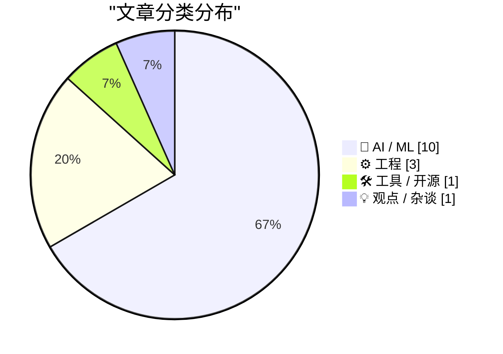
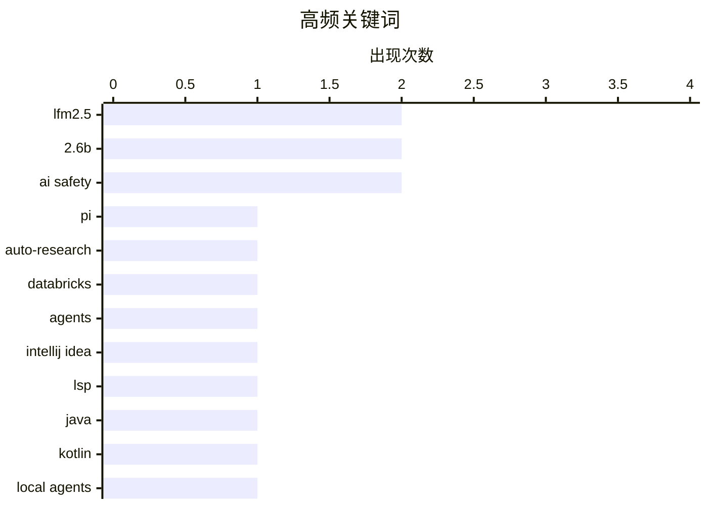

# 📰 AI 资讯每日精选 — 2026-08-05

> 汇聚 140+ 技术博客、X/Twitter、Hacker News、Reddit、Product Hunt、
> Lobste.rs、ClawFeed 日报及 GitHub Trending，经 AI 评分筛选。
>
> **本期内容**：🏆 今日必读 · 🌐 ClawFeed 日报 · 🔥 GitHub Trending · 📂 分类精选 · 🎨 设计与生成式 AI · 📊 数据概览 · 🎯 项目相关情报

## 📝 今日看点

今日技术圈聚焦于AI代理的轻量化与端侧部署，2.6B级小模型在手机上的高效运行正成为新常态。同时，开发工具链加速拥抱智能体工作流，JetBrains引擎通过LSP开放给VS Code与Cursor，重塑编码体验。开源社区也在消费级硬件上挖掘大模型潜力，从RTX 5090上的1M上下文到llama.cpp的MoE专家缓存，均指向更平民化的AI运行路径。此外，中美AI监管政策差异引发关注，或对开源模型全球竞争格局产生深远影响。

---

## 🏆 今日必读

🥇 **Pi 的极简主义是其优势**

[Pi's Minimalism Is Its Advantage](https://earendil.com/posts/pi-autoresearch-and-databricks/) — Hacker News Best · 11 小时前 · 🤖 AI / ML

> Pi 是一个 AI 研究代理，其核心设计理念是极简主义，而非堆砌功能。文章通过 Pi 与 Databricks 的对比，阐述了极简设计在 AI 代理中的优势：更少的组件意味着更低的延迟、更少的故障点和更易于调试。作者认为，复杂的系统往往在真实场景中表现不佳，而 Pi 通过专注于核心任务，实现了更高的可靠性和效率。文章的核心观点是，在 AI 代理领域，克制和专注比功能丰富更重要。

💡 **为什么值得读**: 在 AI 代理普遍追求复杂化的当下，这篇文章提供了一个反直觉的视角，对系统设计有启发意义。

🏷️ Pi, auto-research, Databricks, agents

🥈 **IntelliJ IDEA 支持 LSP：Java 和 Kotlin 智能提示登陆 VS Code、Cursor 及 Agentic 流程**

[IntelliJ IDEA Goes LSP: Java and Kotlin Intelligence Comes to VS Code, Cursor, and Agentic Flows](https://blog.jetbrains.com/idea/2026/08/intellij-idea-goes-lsp/) — Lobste.rs · 20 小时前 · 🛠 工具 / 开源

> JetBrains 宣布其 IntelliJ IDEA 引擎将通过语言服务器协议（LSP）开放，使 VS Code、Cursor 等编辑器以及 AI Agent 工作流也能获得与 IDEA 同级的 Java 和 Kotlin 代码智能。此举打破了 JetBrains IDE 的封闭生态，将强大的重构、代码分析和导航能力输出到更广泛的开发者工具链中。该方案旨在解决现有 LSP 实现（如 Eclipse JDT LS）在性能和功能上的不足。这标志着 JetBrains 从 IDE 厂商向代码智能平台提供商的战略转型。

💡 **为什么值得读**: 对使用 VS Code 或 Cursor 的 Java/Kotlin 开发者而言，这是获得顶级 IDE 智能提示的重大利好。

🏷️ IntelliJ IDEA, LSP, Java, Kotlin

🥉 **使用 LFM2.5-2.6B 在任意位置部署本地代理**

[Deploy local agents everywhere with LFM2.5-2.6B](https://huggingface.co/blog/LiquidAI/lfm2-5-2-6b) — Hugging Face Blog · 20 小时前 · 🤖 AI / ML

> Liquid AI 发布了 LFM2.5-2.6B，一个仅有 26 亿参数的小型语言模型，专为本地代理（agentic）场景设计。该模型支持工具调用和 128K 上下文窗口，在手机上可实现 30 tok/s 的推理速度。其设计目标是处理简单、高吞吐量的任务，如批量文档摘要，在保证性能的同时显著降低部署成本。LFM2.5-2.6B 在多个基准测试上超越了同量级模型，为边缘设备上的 AI 代理提供了新的选择。

💡 **为什么值得读**: 如果你需要在小内存设备上运行高效、低成本的 AI 代理，这款新模型值得关注。

🏷️ local agents, LFM2.5, AI agent, deployment

4️⃣ **LFM2.5-2.6B 已发布**

[LFM2.5-2.6B is out](https://www.reddit.com/r/LocalLLaMA/comments/1vfh1sn/lfm2526b_is_out/) — r/LocalLLaMA · 16 小时前 · 🤖 AI / ML

> Liquid AI 发布了 LFM2.5-2.6B 模型，重点强化了代理能力（agentic capabilities）。该模型专为简单、高容量的任务（如总结海量文档）设计，其前代 8B-A1B 模型已在该类任务中表现优异。社区用户对该模型在低资源设备上的性能表示期待，认为小型模型在特定场景下值得更多关注。

💡 **为什么值得读**: 来自社区的第一手反馈，可以快速了解该模型的实际定位和用户期待。

🏷️ LFM2.5, agentic capabilities, 2.6B, local LLM

5️⃣ **2.6B 模型支持工具调用和 128K 上下文，在手机上可达 30 tok/s**

[A 2.6B model with tool calling and 128K context now runs at 30 tok/s on a phone](https://www.reddit.com/r/LocalLLaMA/comments/1vfn9vc/a_26b_model_with_tool_calling_and_128k_context/) — r/LocalLLaMA · 12 小时前 · 🤖 AI / ML

> Liquid AI 的 LFM2.5-2.6B 模型实现了在手机上运行，支持工具调用和 128K 上下文窗口，推理速度达到 30 tok/s。这一性能指标展示了小型模型在端侧部署的巨大潜力，使得复杂的代理任务可以在无网络环境下完成。该模型在保持高推理速度的同时，提供了足够长的上下文处理能力，适合移动端 AI 应用。

💡 **为什么值得读**: 直观的性能数据（30 tok/s 在手机上）证明了小型模型在端侧 AI 的可行性。

🏷️ tool calling, mobile LLM, 2.6B, 128K context

---

## 🌐 ClawFeed 日报精选

> 来源：[ClawFeed](https://clawfeed.kevinhe.io) — AI 驱动的多源新闻聚合

# 🌏 ClawFeed 日报 | 2026-08-04 (SGT)

聚合当日 5 份 4h digest：**#960**(00:00-03:59) · **#961**(04:00-07:59) · **#962**(08:00-11:59) ·
**#963**(12:00-15:59) · **#964**(16:00-19:59)。素材合计 feed 140 条 / bookmarks 20 条 / errors 0。

---

## 🔥 当日最重要 5 条（跨档排序、已去重）

**1. 被信任的东西坏掉时，通常不报错 —— 当日出现两个独立实例，形状完全一致**
- **DNA 检测文件可被无痕篡改**（CVE-2026-17583）：研究者把两个人的图谱合并进同一个 Applied Biosystems
  文件，系统**未发任何告警**，文件仍显示「自 2015 年以来未被改动」。打穿的不是某个软件，而是**司法证据链
  的完整性假设**。 https://x.com/TheHackersNews/status/2084189222957666493
- **Coldcard 随机数**：2021 年 3 月一次固件更新「跳过了硬件正确的随机数生成」，**直到 2026 才被发现**。
  ⚠️ 推文串自述时间线，非厂商公告、未核实。
- ⇒ 两条都是「错误发生在 N 年前，可见性发生在今天，中间一切看起来正常」。**这是当日最有迁移价值的一条，
  不是因为 DNA 或硬件钱包，而是因为这个形状对任何自检系统都成立。**

**2. Cloudflare `@cloudflare/computer`：给每个 AI Agent 配一台「虚拟电脑」**
一份云端文件系统 + 数种执行环境，agent 每条命令自行决定派往哪个环境（动文件 / 处理数据 / 管 git），
毫秒级启动。⇒ 把「agent 需要一台机器」拆成**持久文件系统 ＋ 可按命令选择的短生命周期执行环境**。
⚪ 未实测、未读文档，只报机制与存在性。 https://x.com/xiaohu/status/2084549349997150643

**3. Google 开源 Agent Skills**（`github.com/google/skills`），并公开其内部 build/test/scale skills 的做法。
⚪ 仓库与文章均**未读**，只报存在性与位置。 https://x.com/Saboo_Shubham_/status/2084343083953717518

**4. 交易入口与发币入口同时上链 —— 当日三条独立坐标**
- 7 月 **DEX/CEX 现货成交量比首破 24%**（一年前 17%），Uniswap 同时在做上层 launchpad。
  https://x.com/Bitwux/status/2084567660671766939
- **BlackRock 在以太坊上线代币化货币市场基金** —— 全球最大资管把货基放上公链。
  🔴 原帖「管 15 万亿，1% 就是 1500 亿」的推演**已剔除**（把 AUM 当可迁移资金，且发帖者是利益相关方）；
  **事实收录，推演不收**。 https://x.com/3orovik/status/2084477808827306028
- **Cloudflare Workers 原生支持 gRPC**，边缘直接路由/转换/托管，免自建代理层。
  https://x.com/Cloudflare/status/2084293403328516571

**5. a16z / Kaleidos：装进集装箱的 1 兆瓦反应堆，燃料已运抵 Idaho National Laboratory 做满功率测试**，
并且是**首个进入 DOME 测试台的美国新反应堆设计**。⇒ 关键不是「小型核电」概念，而是它**已走到燃料进场**
这一步——从 PPT 到实物测试台是这类项目最易卡死的一段。⚠️ 投资方发布，非第三方实测。
https://x.com/a16z/status/2084381806103855182

---

## 📰 当日核心主题（聚类视角）

**① Agent 基建在同一天从四个方向收敛。** Cloudflare 给 agent 配虚拟电脑 · Cloudflare Workers 上 gRPC ·
Google 开源 Agent Skills · Grok Build CLI 近乎每日迭代（`X.ai/cli`）· 而 @alex_prompter 主张
「真正能用的 agent 记忆系统就是四个 markdown 文件 + 零数据库」。**同一天里，重型基建与极简主义
同时出现**，且两侧都没给失效边界。

**② 证据档位成为当日反复出现的操作问题，不只是措辞问题。** 当日被显式打「待核」标的包括：Solana Agave 4.2
三项数字（项目公告非第三方实测）· Morgan Stanley AI ROIC 25-50%（二手无方法）· Cramer 量子破解说 ·
binance bStocks「7 个周末中位 92%」（交易所自述、n 极小）· ika_xbt Pons 收入 +80%。
⚪ **当日唯一不需要打待核标的**是 Tether Evo 的 BCI 跨人泛化 —— 因为它是**同行评审**
（3 篇论文、跨 3 组人群）。https://x.com/paoloardoino/status/2084537410965098962

**③ 「对话式贴心」＝「标注管道」。** @bearliu 把 Google Health 教练对话逐个数采集点：主动提问显得体贴，
同时产出带标签的用户意图；快捷回复降低操作成本，同时让意图更好分类；反馈按钮给纠错机会，
同时把每次接受/拒绝变成训练信号。**当日最锋利的单条视角。** https://x.com/bearliu

**④ 归因分层被市场正确执行了一次。** 1000+ 个比特币地址被清空而 BTC 未崩——**故障在硬件钱包，不在
比特币网络**。「钱包被打穿」与「链被打穿」是两件事。

**⑤ 一个五年周期的收尾。** POAP 协议运营五年后正式关闭，累计铸造超 670 万枚徽章。

---

## 🔖 累计 Bookmark 精选

**当日 0 条新增**（四档 `bookmarks_new` 全为 0；数量 20→17→20 的变动为 Kevin 侧编辑，非抓取失败，errors=0）。
🔴 **20:00 档新查明**：那 20 条书签经**全历史**查重（942 份 digest / 5,573 个 status id）**20/20 全部往期已报**
（@mardehaym 那条出现在 **59** 份往期 digest 里）。此前的「最近 3 份」查重窗口对书签报 0 重复，
是因为近 3 份都没输出书签段 ⇒ 窗口里一个书签 id 都没有，**结构上不可能报重复**。已改为全历史查重。

## 👀 推荐关注汇总（跨档去重）

**当日唯一经核实的新推荐：@bearliu**（浏览器实测按钮文案 `关注` = 未关注）。理由见主题③。
https://x.com/bearliu

**当日方法学收获（比推荐本身更值钱）**：两档累计解出 5 个候选，**4 个是你早就关注了**，只有 1 个真新。
⇒「从首页 feed 里挑推荐」这个动作的**先验天然偏向已关注**（feed 主要就是已关注账号的内容），
这不再是一句担心，而是有数字的。已核实为**已关注**：@alex_prompter · @Saboo_Shubham_ · @FinanceYF5 · @gladstein。
⚪ **未判定留档**（按钮只能取到「订阅」）：@yanhua1010 · @Bitwux · @turingou · @Selkis_2028；
未核实留档：@xiaohu · @PhyrexNi · @BoxMrChen。**没核实就不推荐，不用免责声明兜底。**

## 💤 当日重复噪音模式（报模式，不吐槽单条）

- **噪音占比全天走高**：46% → 40% → 50% → **62%**（12:00-15:59 档最高）。当日 feed 结构性偏
  crypto 交易/空投/喊单，尤其午后。
- **一类结构性重复无法被现有尺子看见**：同一条推文跨档逐字重复、但两次都落在噪音桶里、**从未写进任何
  digest** ⇒ 语料里没有它的 id ⇒ 对查重**结构性不可见**。当日至少 3 例（BTCdayu 怀旧帖 ·
  BinanceWallet XAUT 活动 · elonmusk USAID 文本）。**正确表述：尺子现在能抓「我报过的」，仍抓不到
  「我抓到但没报的」。**
- **已排除不引用**：动物虐待 + 煽动性地域内容 1 条 · 煽动性移民内容 1 条 · 拘留所死亡新闻 1 条
  （涉具体个人，超范围）· 「GTA 6 beta 下载、链接在评论区」1 条（**符合钓鱼/诈骗诱饵形状**，
  不引用、不给链接、不复述操作步骤）。

---

## 🔧 量具备注（当日仪器状态，读数的可信边界）

- 🟢 **`followingProfiles` 全天坏了 6 档，在 20:00 档修复。** 00:00-15:59 六个连续档位均
  `24/24 tweets=[]`、`usable=0`，一直记为**「无仪器」而非「查无异常」**（故当日**不产出取关建议**）。
  20:00 档定位为**水化竞态**（profile 时间线懒加载，2.2s 单发抽取落在 `<article>` 出现之前；
  导航与正文均正常、无登录墙），改为 4s + 最多 3 次抽取、成功即 break ⇒ **实测 0/24 → 24/24**。
  同时把摘要从单一 `followingProfiles` 计数改为 `{total, with_tweets, empty, errored}`，
  并在 `with_tweets==0` 时打显式 `EXTRACTION-FAILURE` 行（该 marker 已用修前/修后两个真实产物**双向验证**：
  修前开火、修后静默）。**原先那个单一计数把成功/空/异常记成同一个数，100% 失效时会印成健康。**
- 🔴 **`created_at` 约定在库里有两套，当日发生一次碰撞，我没有自行修。**
  `#957`/`#959`(08-03) 用**周期起点**；`#960`-`#963`(08-04) 用**触发时刻**；`#964` 用周期起点
  （＝4h 任务 prompt 里 step-0 脚本算出的值）⇒ `#963` 与 `#964` 的 `created_at` **都是 16:00:00**。
  ⚪ 对本日报**无影响**（五条都在 08-04，聚合完整），但前端时间线会把 20:00 那份显示在 16:00。
  ⚪ **未改任何历史行**：改哪一套是 Kevin 的口径决定，且重写时间戳不易回退 ⇒ 只报不动。
---

## 🔥 GitHub Trending

> 今日热门开源项目（全语言 + Python）

| # | 项目 | 描述 | ⭐ 总星 | 📈 今日 | 语言 |
|---|------|------|---------|---------|------|
| 1 | [firecrawl/pdf-inspector](https://github.com/firecrawl/pdf-inspector) | Fast Rust library for PDF inspection, classification, and... | 10.7k | +2540 | Rust |
| 2 | [zhaoxuya520/reverse-skill](https://github.com/zhaoxuya520/reverse-skill) 🤖 | Reverse Engineering / Authorized Penetration Testing / Se... | 18.7k | +2297 | PowerShell |
| 3 | [lyogavin/airllm](https://github.com/lyogavin/airllm) | AirLLM 70B inference with single 4GB GPU | 28.7k | +1711 | Jupyter Notebook |
| 4 | [TencentCloud/TencentDB-Agent-Memory](https://github.com/TencentCloud/TencentDB-Agent-Memory) 🤖 | TencentDB Agent Memory is a team-level memory hub for AI ... | 14.5k | +1111 | TypeScript |
| 5 | [usestrix/strix](https://github.com/usestrix/strix) 🤖 | Open-source AI penetration testing tool to find and fix y... | 48.6k | +984 | Python |
| 6 | [Panniantong/Agent-Reach](https://github.com/Panniantong/Agent-Reach) 🤖 | Give your AI agent eyes to see the entire internet. Read ... | 66.7k | +956 | Python |
| 7 | [esengine/DeepSeek-Reasonix](https://github.com/esengine/DeepSeek-Reasonix) 🤖 | DeepSeek-native AI coding agent for your terminal. Engine... | 31.1k | +922 | Go |
| 8 | [microsoft/generative-ai-for-beginners](https://github.com/microsoft/generative-ai-for-beginners) 🤖 | 21 Lessons, Get Started Building with Generative AI | 116.5k | +783 | Jupyter Notebook |
| 9 | [obra/superpowers](https://github.com/obra/superpowers) | An agentic skills framework & software development method... | 266.9k | +653 | Shell |
| 10 | [donnemartin/system-design-primer](https://github.com/donnemartin/system-design-primer) | Learn how to design large-scale systems. Prep for the sys... | 361.1k | +637 | Python |
| 11 | [NousResearch/hermes-agent](https://github.com/NousResearch/hermes-agent) 🤖 | The agent that grows with you | 225.8k | +616 | Python |
| 12 | [huangruiteng/loopx](https://github.com/huangruiteng/loopx) 🤖 | Lightweight loop engineering state kernel for long-runnin... | 1.7k | +585 | Python |
| 13 | [usekaneo/kaneo](https://github.com/usekaneo/kaneo) | 🎯 All you need. Nothing you don't. Open source project m... | 7.4k | +559 | TypeScript |
| 14 | [Alishahryar1/free-claude-code](https://github.com/Alishahryar1/free-claude-code) 🤖 | Use Claude Code, Codex and Pi for free from your terminal... | 44.4k | +451 | Python |
| 15 | [livekit/agents](https://github.com/livekit/agents) 🤖 | A framework for building realtime voice AI agents 🤖🎙️📹 | 12.6k | +432 | Python |

---

## 🤖 AI / ML

### 1. Pi 的极简主义是其优势

[Pi's Minimalism Is Its Advantage](https://earendil.com/posts/pi-autoresearch-and-databricks/) — **Hacker News Best** · 11 小时前 · ⭐ 23/30

> Pi 是一个 AI 研究代理，其核心设计理念是极简主义，而非堆砌功能。文章通过 Pi 与 Databricks 的对比，阐述了极简设计在 AI 代理中的优势：更少的组件意味着更低的延迟、更少的故障点和更易于调试。作者认为，复杂的系统往往在真实场景中表现不佳，而 Pi 通过专注于核心任务，实现了更高的可靠性和效率。文章的核心观点是，在 AI 代理领域，克制和专注比功能丰富更重要。

🏷️ Pi, auto-research, Databricks, agents

---

### 2. 使用 LFM2.5-2.6B 在任意位置部署本地代理

[Deploy local agents everywhere with LFM2.5-2.6B](https://huggingface.co/blog/LiquidAI/lfm2-5-2-6b) — **Hugging Face Blog** · 20 小时前 · ⭐ 24/30

> Liquid AI 发布了 LFM2.5-2.6B，一个仅有 26 亿参数的小型语言模型，专为本地代理（agentic）场景设计。该模型支持工具调用和 128K 上下文窗口，在手机上可实现 30 tok/s 的推理速度。其设计目标是处理简单、高吞吐量的任务，如批量文档摘要，在保证性能的同时显著降低部署成本。LFM2.5-2.6B 在多个基准测试上超越了同量级模型，为边缘设备上的 AI 代理提供了新的选择。

🏷️ local agents, LFM2.5, AI agent, deployment

---

### 3. LFM2.5-2.6B 已发布

[LFM2.5-2.6B is out](https://www.reddit.com/r/LocalLLaMA/comments/1vfh1sn/lfm2526b_is_out/) — **r/LocalLLaMA** · 16 小时前 · ⭐ 20/30

> Liquid AI 发布了 LFM2.5-2.6B 模型，重点强化了代理能力（agentic capabilities）。该模型专为简单、高容量的任务（如总结海量文档）设计，其前代 8B-A1B 模型已在该类任务中表现优异。社区用户对该模型在低资源设备上的性能表示期待，认为小型模型在特定场景下值得更多关注。

🏷️ LFM2.5, agentic capabilities, 2.6B, local LLM

---

### 4. 2.6B 模型支持工具调用和 128K 上下文，在手机上可达 30 tok/s

[A 2.6B model with tool calling and 128K context now runs at 30 tok/s on a phone](https://www.reddit.com/r/LocalLLaMA/comments/1vfn9vc/a_26b_model_with_tool_calling_and_128k_context/) — **r/LocalLLaMA** · 12 小时前 · ⭐ 19/30

> Liquid AI 的 LFM2.5-2.6B 模型实现了在手机上运行，支持工具调用和 128K 上下文窗口，推理速度达到 30 tok/s。这一性能指标展示了小型模型在端侧部署的巨大潜力，使得复杂的代理任务可以在无网络环境下完成。该模型在保持高推理速度的同时，提供了足够长的上下文处理能力，适合移动端 AI 应用。

🏷️ tool calling, mobile LLM, 2.6B, 128K context

---

### 5. DeepSeek V4 Flash 在单张 AMD MI300X 上运行

[DeepSeek V4 Flash on a Single AMD MI300X](https://github.com/ryanzhou/deepseek-v4-flash-mi300x) — **Hacker News Best** · 1 天前 · ⭐ 26/30

> 该项目展示了如何在单张 AMD MI300X 加速卡上运行 DeepSeek V4 Flash 模型。通过针对 AMD ROCm 生态的优化，实现了在 MI300X 上的高效推理。该方案为 AMD GPU 用户提供了运行顶级开源 MoE 模型的途径，减少了了对 NVIDIA CUDA 生态的依赖。

🏷️ DeepSeek, MI300X, LLM inference, optimization

---

### 6. Mistral 发布 Shieldstral：用于多模态内容审核的 3B 开源模型

[Mistral's Shieldstral: 3B open-weights model for multimodal moderation](https://mistral.ai/news/shieldstral/) — **Hacker News Best** · 17 小时前 · ⭐ 25/30

> Mistral AI 发布了 Shieldstral，一个拥有 30 亿参数的开源多模态内容审核模型。该模型旨在检测和过滤文本与图像中的不安全内容，为平台提供高效、可定制的审核方案。Shieldstral 在多个公开基准测试中表现优于同类模型，并支持在本地或私有云部署，以满足数据隐私要求。

🏷️ Shieldstral, moderation, multimodal, open-weights

---

### 7. 中国的开放权重模型将免于美国安全测试

[China’s Open-Weight Models Will Be Spared US Safety Tests](https://www.reddit.com/r/LocalLLaMA/comments/1vfujnc/chinas_openweight_models_will_be_spared_us_safety/) — **r/LocalLLaMA** · 7 小时前 · ⭐ 24/30

> 据报道，美国政府的 AI 安全测试要求将不适用于中国的开放权重模型。这一政策差异意味着中国的开源模型（如 DeepSeek、Qwen 等）在进入国际市场时，将面临更少的监管障碍。此举可能进一步加剧中美在 AI 开源生态领域的竞争，并影响全球 AI 安全标准的制定。

🏷️ open-weight models, AI safety, China, US policy

---

### 8. White House AI Guidelines Exempt U.S. Open Models From Government Review

[White House AI Guidelines Exempt U.S. Open Models From Government Review](https://www.reddit.com/r/LocalLLaMA/comments/1vfqqdb/white_house_ai_guidelines_exempt_us_open_models/) — **r/LocalLLaMA** · 10 小时前 · ⭐ 24/30

> submitted by   <a href="https://www.reddit.com/user/realmvp77"> /u/realmvp77 </a> <br/> <span><a href="https://www.wsj.com/tech/ai/white-houses-ai-guidelines-exempt-u-s-open-models-from-government-rev

🏷️ AI regulation, open models, White House, AI safety

---

### 9. Waymo in Dallas

[Waymo in Dallas](https://waymo.com/blog/shorts/dallas-open-to-all/) — **Hacker News Best** · 15 小时前 · ⭐ 24/30

> Article URL: https://waymo.com/blog/shorts/dallas-open-to-all/
Comments URL: https://news.ycombinator.com/item?id=49172836
Points: 291
# Comments: 516

🏷️ Waymo, autonomous driving, robotaxi, Dallas

---

### 10. inclusionAI/Ling-3.0-flash weights are up on Hugging Face — MIT, BF16 plus an official FP8

[inclusionAI/Ling-3.0-flash weights are up on Hugging Face — MIT, BF16 plus an official FP8](https://www.reddit.com/r/LocalLLaMA/comments/1vfdeek/inclusionailing30flash_weights_are_up_on_hugging/) — **r/LocalLLaMA** · 18 小时前 · ⭐ 24/30

> <table> <tr><td> <a href="https://www.reddit.com/r/LocalLLaMA/comments/1vfdeek/inclusionailing30flash_weights_are_up_on_hugging/">  一位用户分享了在消费级硬件上运行 DeepSeek-V4-Flash-0731 的配置方案，实现了完整的 1M 上下文窗口。该方案使用单张 RTX 5090 (32GB) 配合 DDR5 内存，通过 vLLM 的 CPU/RAM 卸载技术，达到了约 800 tokens/s 的预填充速度和 15+ tokens/s 的解码速度。这一配置使得在本地运行超长上下文的 MoE 模型成为可能，为 Agentic Coding 等场景提供了高性价比的硬件方案。

🏷️ DeepSeek V4, vLLM offloading, 1M context, agentic coding

---

### 12. llama.cpp PR 在 GPU 上缓存“热门”MoE 专家——8GB 显存下速度从 33 提升至 56 tok/s

[A llama.cpp PR caches “hot” MoE experts on the GPU — 33 → 56 tok/s reported with 8GB VRAM](https://www.reddit.com/r/LocalLLaMA/comments/1vfhns3/a_llamacpp_pr_caches_hot_moe_experts_on_the_gpu/) — **r/LocalLLaMA** · 16 小时前 · ⭐ 25/30

> llama.cpp 的一个新 PR (#26563) 引入了专家热力图机制，用于缓存 MoE 模型中被频繁调用的“热门”专家在 GPU 上，而“冷门”专家继续在 CPU 上运行。在 8GB 显存的设备上运行 Qwen3.6-35B-A3B 模型时，Q2_M 量化速度从 33.25 tok/s 提升至 56.0 tok/s（1.68 倍），Q5_K_P 量化从 17.34 提升至 35.93 tok/s（2.07 倍）。该方案有效解决了 MoE 模型在低显存设备上的推理瓶颈。

🏷️ llama.cpp, MoE, GPU caching, inference performance

---

### 13. Enabling the next iteration of the borrow checker on nightly

[Enabling the next iteration of the borrow checker on nightly](https://blog.rust-lang.org/2026/08/04/enabling-polonius-alpha-on-nighty/) — **Lobste.rs** · 16 小时前 · ⭐ 24/30

> <p><a href="https://lobste.rs/s/skft2i/enabling_next_iteration_borrow_checker">Comments</a></p>

🏷️ Rust, borrow checker, nightly, compiler

---

## 🛠 工具 / 开源

### 14. IntelliJ IDEA 支持 LSP：Java 和 Kotlin 智能提示登陆 VS Code、Cursor 及 Agentic 流程

[IntelliJ IDEA Goes LSP: Java and Kotlin Intelligence Comes to VS Code, Cursor, and Agentic Flows](https://blog.jetbrains.com/idea/2026/08/intellij-idea-goes-lsp/) — **Lobste.rs** · 20 小时前 · ⭐ 25/30

> JetBrains 宣布其 IntelliJ IDEA 引擎将通过语言服务器协议（LSP）开放，使 VS Code、Cursor 等编辑器以及 AI Agent 工作流也能获得与 IDEA 同级的 Java 和 Kotlin 代码智能。此举打破了 JetBrains IDE 的封闭生态，将强大的重构、代码分析和导航能力输出到更广泛的开发者工具链中。该方案旨在解决现有 LSP 实现（如 Eclipse JDT LS）在性能和功能上的不足。这标志着 JetBrains 从 IDE 厂商向代码智能平台提供商的战略转型。

🏷️ IntelliJ IDEA, LSP, Java, Kotlin

---

## 💡 观点 / 杂谈

### 15. The AI Demand Bubble

[The AI Demand Bubble](https://www.wheresyoured.at/the-ai-demand-bubble/) — **wheresyoured.at** · 18 小时前 · ⭐ 24/30

> If you liked this piece, you should subscribe to my premium newsletter. It&#x2019;s $70 a year, or $7 a month, and in return you get a weekly newsletter that&#x2019;s usually anywhere from 5,000 to 18

🏷️ AI, bubble, NVIDIA, Anthropic

---

## 📊 数据概览

| 扫描源 | 抓取文章 | 时间范围 | 精选 |
|:---:|:---:|:---:|:---:|
| 91/140 | 3720 篇 → 93 篇 | 24h | **15 篇** |

### 分类分布



### 高频关键词



<details>
<summary>📈 纯文本关键词图（终端友好）</summary>

```
lfm2.5        │ ████████████████████ 2
2.6b          │ ████████████████████ 2
ai safety     │ ████████████████████ 2
pi            │ ██████████░░░░░░░░░░ 1
auto-research │ ██████████░░░░░░░░░░ 1
databricks    │ ██████████░░░░░░░░░░ 1
agents        │ ██████████░░░░░░░░░░ 1
intellij idea │ ██████████░░░░░░░░░░ 1
lsp           │ ██████████░░░░░░░░░░ 1
java          │ ██████████░░░░░░░░░░ 1
```

</details>

### 🏷️ 话题标签

**lfm2.5**(2) · **2.6b**(2) · **ai safety**(2) · pi(1) · auto-research(1) · databricks(1) · agents(1) · intellij idea(1) · lsp(1) · java(1) · kotlin(1) · local agents(1) · ai agent(1) · deployment(1) · agentic capabilities(1) · local llm(1) · tool calling(1) · mobile llm(1) · 128k context(1) · deepseek v4(1)

---

## 🎯 项目相关情报

### Agent 基座安全与合规

#### [Pi 的极简主义是其优势](https://earendil.com/posts/pi-autoresearch-and-databricks/)

Pi 是一个 AI 研究代理，其核心设计理念是极简主义，而非堆砌功能。文章通过 Pi 与 Databricks 的对比，阐述了极简设计在 AI 代理中的优势：更少的组件意味着更低的延迟、更少的故障点和更易于调试。作者认为，复杂的系统往往在真实场景中表现不佳，而 Pi 通过专注于核心任务，实现了更高的可靠性和效率。文章的核心观点是，在 AI 代理领域，克制和专注比功能丰富更重要。

- **项目相关性**：7/10
- **可落地性**：6/10
- **为什么相关**：文章讨论 Pi 的 auto-research agent 设计及其与 Databricks 的集成，涉及 Agent 系统架构与自主执行能力，属于 agent 基座安全与合规需要关注的 Agent 框架演进。
- **建议动作**：阅读原文了解 Pi 的权限与执行边界设计，并评估其风险评估机制是否可借鉴。
- **来源**：Hacker News Best

---

*生成于 2026-08-05 10:04 | 汇聚 140 个技术博客、X/Twitter、Hacker News、Reddit、Product Hunt、Lobste.rs、ClawFeed 日报及 GitHub Trending，经 AI 评分筛选出 Top 15 精华内容*
