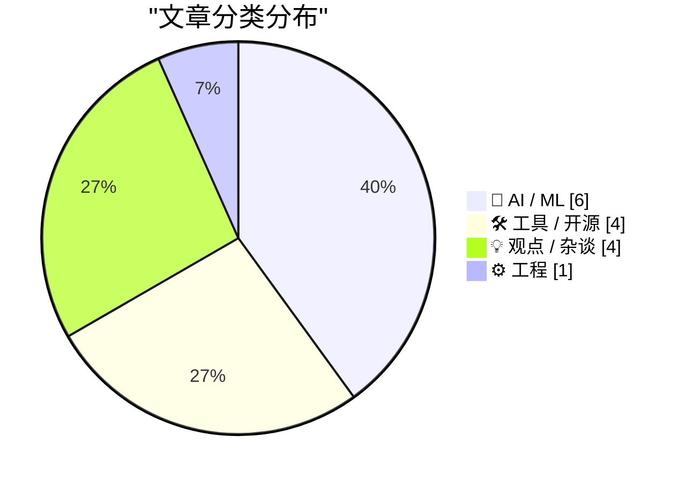
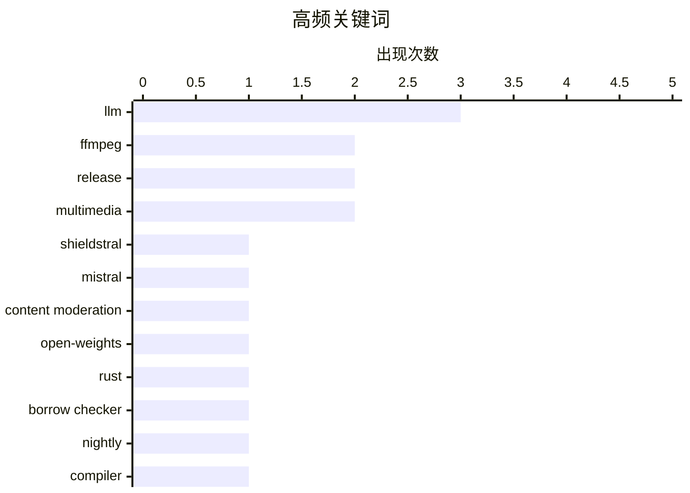

# 📰 AI 资讯每日精选 — 2026-08-05

> 汇聚 140+ 技术博客、X/Twitter、Hacker News、Reddit、Product Hunt、
> Lobste.rs、ClawFeed 日报及 GitHub Trending，经 AI 评分筛选。
>
> **本期内容**：🏆 今日必读 · 🌐 ClawFeed 日报 · 🔥 GitHub Trending · 📂 分类精选 · 🎨 设计与生成式 AI · 📊 数据概览 · 🎯 项目相关情报

## 📝 今日看点

今日技术圈聚焦AI模型的小型化与本地化部署，多款轻量级模型（如3B审核模型、2.6B端侧Agent模型）推动边缘智能落地；同时开发者工具链迎来密集升级，Rust下一代借用检查器、LLM命令行工具及IntelliJ的LSP支持显著提升编程效率；此外，硅谷在开源AI出口管制上的分歧正牵动全球政策走向，开放与安全的博弈成为行业核心议题。

---

## 🏆 今日必读

🥇 **Mistral 发布 Shieldstral：用于多模态内容审核的 3B 开放权重模型**

[Mistral's Shieldstral: 3B open-weights model for multimodal moderation](https://mistral.ai/news/shieldstral/) — Hacker News Best · 10 小时前 · 🤖 AI / ML

> Mistral AI 发布了 Shieldstral，一个仅 3B 参数的开放权重多模态内容审核模型，旨在解决大语言模型（LLM）部署中的安全与合规问题。该模型支持文本和图像输入，能够检测包括色情、暴力、仇恨言论在内的多种有害内容类别。Shieldstral 基于 Mistral 的小型模型构建，并针对审核任务进行了专门微调，在性能上可与更大的专用模型（如 OpenAI 的 Moderation API）相媲美。其开放权重特性允许开发者本地部署和自定义，兼顾了数据隐私和低延迟需求。文章强调，Shieldstral 为构建安全的生成式 AI 应用提供了一个高效、透明且可定制的审核方案。

💡 **为什么值得读**: 对于任何需要为 AI 应用添加内容安全层、但又受限于成本或隐私的开发者，这篇发布公告展示了如何用 3B 小模型实现媲美大模型的多模态审核能力。

🏷️ Shieldstral, Mistral, content moderation, open-weights

🥈 **在 nightly 版本中启用下一代借用检查器 Polonius**

[Enabling the next iteration of the borrow checker on nightly](https://blog.rust-lang.org/2026/08/04/enabling-polonius-alpha-on-nighty/) — Lobste.rs · 9 小时前 · ⚙️ 工程

> Rust 语言团队宣布在 nightly 编译器版本中默认启用下一代借用检查器 Polonius 的 alpha 版本，标志着 Rust 类型系统演进的重要里程碑。Polonius 基于位置敏感的分析模型，解决了旧借用检查器（NLL）在处理复杂生命周期关系时的局限性，例如允许更多合法的借用模式（如条件分支返回引用）。该实现通过新的 `-Zpolonius=next` 标志启用，并计划在收集足够反馈后逐步稳定。文章详细介绍了 Polonius 的工作原理、与现有 NLL 的差异，以及它对 Rust 代码编写方式可能带来的影响。团队强调，这一变化旨在提升语言表达能力，同时保持 Rust 一贯的内存安全保证。

💡 **为什么值得读**: 这是 Rust 语言核心工具链的重大更新，无论你是资深 Rustacean 还是初学者，了解 Polonius 将如何放宽借用限制，都能帮助你提前适应并利用更灵活的代码模式。

🏷️ Rust, borrow checker, nightly, compiler

🥉 **LLM 0.32 发布：支持推理痕迹、OpenAI Responses、服务端工具与更智能的日志**

[New release of LLM adds support for reasoning traces, OpenAI Responses, server-side tools, and smarter logging](https://simonwillison.net/2026/Aug/4/new-release-of-llm/#atom-everything) — simonwillison.net · 3 小时前 · 🛠 工具 / 开源

> Simon Willison 发布了 LLM 0.32，这是自项目启动以来最重要的版本更新，为这个命令行工具和 Python API 带来了多项关键特性。新版本支持显示模型的推理痕迹（reasoning traces），并集成了 OpenAI 最新的 Responses API，从而支持服务端工具调用。此外，LLM 0.32 重新设计了基于内容寻址的 SQLite 日志系统，使日志存储和检索更加高效和智能。该版本还引入了对新模型的支持，并同步发布了配套的 llm-anthropic 插件更新。这些更新显著增强了 LLM 作为通用 AI 助手和开发工具的能力。

💡 **为什么值得读**: 如果你是 LLM 命令行工具的用户，这次更新不仅带来了推理过程的可视化，还通过 OpenAI Responses API 和服务端工具支持，极大扩展了自动化工作流的可能性，值得立即升级体验。

🏷️ LLM, OpenAI Responses, reasoning traces, server-side tools

4️⃣ **IntelliJ IDEA 拥抱 LSP：Java 和 Kotlin 智能支持登陆 VS Code、Cursor 及 Agentic 流程**

[IntelliJ IDEA Goes LSP: Java and Kotlin Intelligence Comes to VS Code, Cursor, and Agentic Flows](https://blog.jetbrains.com/idea/2026/08/intellij-idea-goes-lsp/) — Lobste.rs · 14 小时前 · 🛠 工具 / 开源

> JetBrains 宣布将其 IntelliJ IDEA 的核心 Java 和 Kotlin 语言智能（包括代码补全、重构和导航）通过语言服务器协议（LSP）开放给其他编辑器。这一举措意味着 VS Code、Cursor 等编辑器以及基于 Agent 的编程流程也能获得与 IntelliJ IDEA 同等质量的代码分析能力。文章指出，这是 JetBrains 应对 AI 编程助手时代竞争的战略性转变，旨在将其在 JVM 语言上的深厚积累扩展到更广泛的开发者生态。该 LSP 实现将支持 Gradle 和 Maven 项目，并计划逐步开放更多高级功能。此举有望打破 IDE 壁垒，让开发者在不离开熟悉环境的情况下享受顶级的 Java/Kotlin 支持。

💡 **为什么值得读**: 对于使用 VS Code 或 Cursor 进行 Java/Kotlin 开发的程序员，这篇文章意味着你终于可以告别笨重的插件，直接获得 JetBrains 级别的智能代码体验，是提升开发效率的绝佳消息。

🏷️ LSP, IntelliJ IDEA, Kotlin, Java

5️⃣ **使用 LFM2.5-2.6B 在任意位置部署本地 Agent**

[Deploy local agents everywhere with LFM2.5-2.6B](https://huggingface.co/blog/LiquidAI/lfm2-5-2-6b) — Hugging Face Blog · 13 小时前 · 🤖 AI / ML

> Hugging Face 博客发布了 Liquid AI 的 LFM2.5-2.6B 模型，这是一个专为本地设备部署而设计的 26 亿参数语言模型。该模型在保持小体积的同时，针对 Agent 工作流（如工具调用、推理和规划）进行了优化，性能超越了同量级的其他模型（如 Llama 3.2 3B）。LFM2.5-2.6B 采用混合架构，在推理效率和上下文窗口长度上表现出色，能够在消费级硬件（如 MacBook 或 Raspberry Pi）上流畅运行。文章展示了其在函数调用和复杂任务分解上的基准测试结果，并提供了在 Hugging Face 上快速部署的示例。其核心优势在于将强大的 Agent 能力带到边缘设备，实现数据隐私和离线运行。

💡 **为什么值得读**: 如果你对在本地或边缘设备上运行 AI Agent 感兴趣，这篇介绍展示了当前小模型在工具调用和推理能力上的最新突破，证明了 2.6B 参数也能胜任复杂任务。

🏷️ local agents, LFM, small language model, deployment

---

## 🌐 ClawFeed 日报精选

> 来源：[ClawFeed](https://clawfeed.kevinhe.io) — AI 驱动的多源新闻聚合

# 🌏 ClawFeed 日报 | 2026-08-04 (SGT)

聚合当日 5 份 4h digest：**#960**(00:00-03:59) · **#961**(04:00-07:59) · **#962**(08:00-11:59) ·
**#963**(12:00-15:59) · **#964**(16:00-19:59)。素材合计 feed 140 条 / bookmarks 20 条 / errors 0。

---

## 🔥 当日最重要 5 条（跨档排序、已去重）

**1. 被信任的东西坏掉时，通常不报错 —— 当日出现两个独立实例，形状完全一致**
- **DNA 检测文件可被无痕篡改**（CVE-2026-17583）：研究者把两个人的图谱合并进同一个 Applied Biosystems
  文件，系统**未发任何告警**，文件仍显示「自 2015 年以来未被改动」。打穿的不是某个软件，而是**司法证据链
  的完整性假设**。 https://x.com/TheHackersNews/status/2084189222957666493
- **Coldcard 随机数**：2021 年 3 月一次固件更新「跳过了硬件正确的随机数生成」，**直到 2026 才被发现**。
  ⚠️ 推文串自述时间线，非厂商公告、未核实。
- ⇒ 两条都是「错误发生在 N 年前，可见性发生在今天，中间一切看起来正常」。**这是当日最有迁移价值的一条，
  不是因为 DNA 或硬件钱包，而是因为这个形状对任何自检系统都成立。**

**2. Cloudflare `@cloudflare/computer`：给每个 AI Agent 配一台「虚拟电脑」**
一份云端文件系统 + 数种执行环境，agent 每条命令自行决定派往哪个环境（动文件 / 处理数据 / 管 git），
毫秒级启动。⇒ 把「agent 需要一台机器」拆成**持久文件系统 ＋ 可按命令选择的短生命周期执行环境**。
⚪ 未实测、未读文档，只报机制与存在性。 https://x.com/xiaohu/status/2084549349997150643

**3. Google 开源 Agent Skills**（`github.com/google/skills`），并公开其内部 build/test/scale skills 的做法。
⚪ 仓库与文章均**未读**，只报存在性与位置。 https://x.com/Saboo_Shubham_/status/2084343083953717518

**4. 交易入口与发币入口同时上链 —— 当日三条独立坐标**
- 7 月 **DEX/CEX 现货成交量比首破 24%**（一年前 17%），Uniswap 同时在做上层 launchpad。
  https://x.com/Bitwux/status/2084567660671766939
- **BlackRock 在以太坊上线代币化货币市场基金** —— 全球最大资管把货基放上公链。
  🔴 原帖「管 15 万亿，1% 就是 1500 亿」的推演**已剔除**（把 AUM 当可迁移资金，且发帖者是利益相关方）；
  **事实收录，推演不收**。 https://x.com/3orovik/status/2084477808827306028
- **Cloudflare Workers 原生支持 gRPC**，边缘直接路由/转换/托管，免自建代理层。
  https://x.com/Cloudflare/status/2084293403328516571

**5. a16z / Kaleidos：装进集装箱的 1 兆瓦反应堆，燃料已运抵 Idaho National Laboratory 做满功率测试**，
并且是**首个进入 DOME 测试台的美国新反应堆设计**。⇒ 关键不是「小型核电」概念，而是它**已走到燃料进场**
这一步——从 PPT 到实物测试台是这类项目最易卡死的一段。⚠️ 投资方发布，非第三方实测。
https://x.com/a16z/status/2084381806103855182

---

## 📰 当日核心主题（聚类视角）

**① Agent 基建在同一天从四个方向收敛。** Cloudflare 给 agent 配虚拟电脑 · Cloudflare Workers 上 gRPC ·
Google 开源 Agent Skills · Grok Build CLI 近乎每日迭代（`X.ai/cli`）· 而 @alex_prompter 主张
「真正能用的 agent 记忆系统就是四个 markdown 文件 + 零数据库」。**同一天里，重型基建与极简主义
同时出现**，且两侧都没给失效边界。

**② 证据档位成为当日反复出现的操作问题，不只是措辞问题。** 当日被显式打「待核」标的包括：Solana Agave 4.2
三项数字（项目公告非第三方实测）· Morgan Stanley AI ROIC 25-50%（二手无方法）· Cramer 量子破解说 ·
binance bStocks「7 个周末中位 92%」（交易所自述、n 极小）· ika_xbt Pons 收入 +80%。
⚪ **当日唯一不需要打待核标的**是 Tether Evo 的 BCI 跨人泛化 —— 因为它是**同行评审**
（3 篇论文、跨 3 组人群）。https://x.com/paoloardoino/status/2084537410965098962

**③ 「对话式贴心」＝「标注管道」。** @bearliu 把 Google Health 教练对话逐个数采集点：主动提问显得体贴，
同时产出带标签的用户意图；快捷回复降低操作成本，同时让意图更好分类；反馈按钮给纠错机会，
同时把每次接受/拒绝变成训练信号。**当日最锋利的单条视角。** https://x.com/bearliu

**④ 归因分层被市场正确执行了一次。** 1000+ 个比特币地址被清空而 BTC 未崩——**故障在硬件钱包，不在
比特币网络**。「钱包被打穿」与「链被打穿」是两件事。

**⑤ 一个五年周期的收尾。** POAP 协议运营五年后正式关闭，累计铸造超 670 万枚徽章。

---

## 🔖 累计 Bookmark 精选

**当日 0 条新增**（四档 `bookmarks_new` 全为 0；数量 20→17→20 的变动为 Kevin 侧编辑，非抓取失败，errors=0）。
🔴 **20:00 档新查明**：那 20 条书签经**全历史**查重（942 份 digest / 5,573 个 status id）**20/20 全部往期已报**
（@mardehaym 那条出现在 **59** 份往期 digest 里）。此前的「最近 3 份」查重窗口对书签报 0 重复，
是因为近 3 份都没输出书签段 ⇒ 窗口里一个书签 id 都没有，**结构上不可能报重复**。已改为全历史查重。

## 👀 推荐关注汇总（跨档去重）

**当日唯一经核实的新推荐：@bearliu**（浏览器实测按钮文案 `关注` = 未关注）。理由见主题③。
https://x.com/bearliu

**当日方法学收获（比推荐本身更值钱）**：两档累计解出 5 个候选，**4 个是你早就关注了**，只有 1 个真新。
⇒「从首页 feed 里挑推荐」这个动作的**先验天然偏向已关注**（feed 主要就是已关注账号的内容），
这不再是一句担心，而是有数字的。已核实为**已关注**：@alex_prompter · @Saboo_Shubham_ · @FinanceYF5 · @gladstein。
⚪ **未判定留档**（按钮只能取到「订阅」）：@yanhua1010 · @Bitwux · @turingou · @Selkis_2028；
未核实留档：@xiaohu · @PhyrexNi · @BoxMrChen。**没核实就不推荐，不用免责声明兜底。**

## 💤 当日重复噪音模式（报模式，不吐槽单条）

- **噪音占比全天走高**：46% → 40% → 50% → **62%**（12:00-15:59 档最高）。当日 feed 结构性偏
  crypto 交易/空投/喊单，尤其午后。
- **一类结构性重复无法被现有尺子看见**：同一条推文跨档逐字重复、但两次都落在噪音桶里、**从未写进任何
  digest** ⇒ 语料里没有它的 id ⇒ 对查重**结构性不可见**。当日至少 3 例（BTCdayu 怀旧帖 ·
  BinanceWallet XAUT 活动 · elonmusk USAID 文本）。**正确表述：尺子现在能抓「我报过的」，仍抓不到
  「我抓到但没报的」。**
- **已排除不引用**：动物虐待 + 煽动性地域内容 1 条 · 煽动性移民内容 1 条 · 拘留所死亡新闻 1 条
  （涉具体个人，超范围）· 「GTA 6 beta 下载、链接在评论区」1 条（**符合钓鱼/诈骗诱饵形状**，
  不引用、不给链接、不复述操作步骤）。

---

## 🔧 量具备注（当日仪器状态，读数的可信边界）

- 🟢 **`followingProfiles` 全天坏了 6 档，在 20:00 档修复。** 00:00-15:59 六个连续档位均
  `24/24 tweets=[]`、`usable=0`，一直记为**「无仪器」而非「查无异常」**（故当日**不产出取关建议**）。
  20:00 档定位为**水化竞态**（profile 时间线懒加载，2.2s 单发抽取落在 `<article>` 出现之前；
  导航与正文均正常、无登录墙），改为 4s + 最多 3 次抽取、成功即 break ⇒ **实测 0/24 → 24/24**。
  同时把摘要从单一 `followingProfiles` 计数改为 `{total, with_tweets, empty, errored}`，
  并在 `with_tweets==0` 时打显式 `EXTRACTION-FAILURE` 行（该 marker 已用修前/修后两个真实产物**双向验证**：
  修前开火、修后静默）。**原先那个单一计数把成功/空/异常记成同一个数，100% 失效时会印成健康。**
- 🔴 **`created_at` 约定在库里有两套，当日发生一次碰撞，我没有自行修。**
  `#957`/`#959`(08-03) 用**周期起点**；`#960`-`#963`(08-04) 用**触发时刻**；`#964` 用周期起点
  （＝4h 任务 prompt 里 step-0 脚本算出的值）⇒ `#963` 与 `#964` 的 `created_at` **都是 16:00:00**。
  ⚪ 对本日报**无影响**（五条都在 08-04，聚合完整），但前端时间线会把 20:00 那份显示在 16:00。
  ⚪ **未改任何历史行**：改哪一套是 Kevin 的口径决定，且重写时间戳不易回退 ⇒ 只报不动。
---

## 🔥 GitHub Trending

> 今日热门开源项目（全语言 + Python）

| # | 项目 | 描述 | ⭐ 总星 | 📈 今日 | 语言 |
|---|------|------|---------|---------|------|
| 1 | [firecrawl/pdf-inspector](https://github.com/firecrawl/pdf-inspector) | Fast Rust library for PDF inspection, classification, and... | 10.2k | +2540 | Rust |
| 2 | [zhaoxuya520/reverse-skill](https://github.com/zhaoxuya520/reverse-skill) 🤖 | Reverse Engineering / Authorized Penetration Testing / Se... | 18.1k | +2297 | PowerShell |
| 3 | [lyogavin/airllm](https://github.com/lyogavin/airllm) | AirLLM 70B inference with single 4GB GPU | 28.5k | +1711 | Jupyter Notebook |
| 4 | [TencentCloud/TencentDB-Agent-Memory](https://github.com/TencentCloud/TencentDB-Agent-Memory) 🤖 | TencentDB Agent Memory is a team-level memory hub for AI ... | 13.9k | +1111 | TypeScript |
| 5 | [usestrix/strix](https://github.com/usestrix/strix) 🤖 | Open-source AI penetration testing tool to find and fix y... | 48.4k | +984 | Python |
| 6 | [Panniantong/Agent-Reach](https://github.com/Panniantong/Agent-Reach) 🤖 | Give your AI agent eyes to see the entire internet. Read ... | 66.6k | +956 | Python |
| 7 | [esengine/DeepSeek-Reasonix](https://github.com/esengine/DeepSeek-Reasonix) 🤖 | DeepSeek-native AI coding agent for your terminal. Engine... | 30.9k | +922 | Go |
| 8 | [microsoft/generative-ai-for-beginners](https://github.com/microsoft/generative-ai-for-beginners) 🤖 | 21 Lessons, Get Started Building with Generative AI | 116.3k | +783 | Jupyter Notebook |
| 9 | [obra/superpowers](https://github.com/obra/superpowers) | An agentic skills framework & software development method... | 266.6k | +653 | Shell |
| 10 | [donnemartin/system-design-primer](https://github.com/donnemartin/system-design-primer) | Learn how to design large-scale systems. Prep for the sys... | 361.0k | +637 | Python |
| 11 | [NousResearch/hermes-agent](https://github.com/NousResearch/hermes-agent) 🤖 | The agent that grows with you | 225.6k | +616 | Python |
| 12 | [huangruiteng/loopx](https://github.com/huangruiteng/loopx) 🤖 | Lightweight loop engineering state kernel for long-runnin... | 1.6k | +585 | Python |
| 13 | [usekaneo/kaneo](https://github.com/usekaneo/kaneo) | 🎯 All you need. Nothing you don't. Open source project m... | 7.3k | +559 | TypeScript |
| 14 | [Alishahryar1/free-claude-code](https://github.com/Alishahryar1/free-claude-code) 🤖 | Use Claude Code, Codex and Pi for free from your terminal... | 44.4k | +451 | Python |
| 15 | [livekit/agents](https://github.com/livekit/agents) 🤖 | A framework for building realtime voice AI agents 🤖🎙️📹 | 12.5k | +432 | Python |

---

## 🤖 AI / ML

### 1. Mistral 发布 Shieldstral：用于多模态内容审核的 3B 开放权重模型

[Mistral's Shieldstral: 3B open-weights model for multimodal moderation](https://mistral.ai/news/shieldstral/) — **Hacker News Best** · 10 小时前 · ⭐ 24/30

> Mistral AI 发布了 Shieldstral，一个仅 3B 参数的开放权重多模态内容审核模型，旨在解决大语言模型（LLM）部署中的安全与合规问题。该模型支持文本和图像输入，能够检测包括色情、暴力、仇恨言论在内的多种有害内容类别。Shieldstral 基于 Mistral 的小型模型构建，并针对审核任务进行了专门微调，在性能上可与更大的专用模型（如 OpenAI 的 Moderation API）相媲美。其开放权重特性允许开发者本地部署和自定义，兼顾了数据隐私和低延迟需求。文章强调，Shieldstral 为构建安全的生成式 AI 应用提供了一个高效、透明且可定制的审核方案。

🏷️ Shieldstral, Mistral, content moderation, open-weights

---

### 2. 使用 LFM2.5-2.6B 在任意位置部署本地 Agent

[Deploy local agents everywhere with LFM2.5-2.6B](https://huggingface.co/blog/LiquidAI/lfm2-5-2-6b) — **Hugging Face Blog** · 13 小时前 · ⭐ 24/30

> Hugging Face 博客发布了 Liquid AI 的 LFM2.5-2.6B 模型，这是一个专为本地设备部署而设计的 26 亿参数语言模型。该模型在保持小体积的同时，针对 Agent 工作流（如工具调用、推理和规划）进行了优化，性能超越了同量级的其他模型（如 Llama 3.2 3B）。LFM2.5-2.6B 采用混合架构，在推理效率和上下文窗口长度上表现出色，能够在消费级硬件（如 MacBook 或 Raspberry Pi）上流畅运行。文章展示了其在函数调用和复杂任务分解上的基准测试结果，并提供了在 Hugging Face 上快速部署的示例。其核心优势在于将强大的 Agent 能力带到边缘设备，实现数据隐私和离线运行。

🏷️ local agents, LFM, small language model, deployment

---

### 3. DeepSeek V4 Flash 在单块 AMD MI300X 上运行

[DeepSeek V4 Flash on a Single AMD MI300X](https://github.com/ryanzhou/deepseek-v4-flash-mi300x) — **Hacker News Best** · 17 小时前 · ⭐ 24/30

> GitHub 上出现了一个项目，展示了如何在单块 AMD MI300X GPU 上运行 DeepSeek V4 Flash 模型。该项目提供了详细的配置和优化指南，使得这款高性能模型无需多卡集群即可在 AMD 硬件上高效推理。通过利用 MI300X 的大显存（192GB）和特定的内核优化，项目实现了接近数据中心的推理速度。文章/项目页面提供了性能基准测试数据，并讨论了与 Nvidia H100 等竞品的对比。这一成果对于降低大模型部署成本、摆脱对 Nvidia 硬件的依赖具有重要意义。

🏷️ DeepSeek, MI300X, LLM inference, AMD

---

### 4. 驾驭工程学：用于自我提升

[Harness engineering for self-improvement](https://lilianweng.github.io/posts/2026-07-04-harness/) — **Hacker News Best** · 21 小时前 · ⭐ 24/30

> Lilian Weng 在其博客中探讨了如何将软件工程中的“驾驭（Harness）”理念应用于个人自我提升。文章将个人成长视为一个系统工程，提出通过设计外部环境、构建自动化流程和利用 AI 工具来“驾驭”自身行为，而非单纯依赖意志力。核心观点包括：将目标分解为可测试的模块、为习惯建立反馈回路、以及使用 LLM 作为个人“副驾驶”来辅助规划和执行。文章结合了行为科学和工程实践，提供了具体的框架和工具建议，如使用日志分析、自动化提醒和 AI 生成的个性化建议。作者认为，通过精心设计的“人生系统”，可以实现更高效、更可持续的自我改进。

🏷️ harness, self-improvement, AI agents, LLM

---

### 5. Beyond VLAs: How World Action Models Reshape Robot Manipulation

[Beyond VLAs: How World Action Models Reshape Robot Manipulation](https://developer.nvidia.com/blog/beyond-vlas-how-world-action-models-reshape-robot-manipulation/) — **NVIDIA Technical Blog** · 11 小时前 · ⭐ 23/30

> A central challenge in robotics is building policies that generalize beyond the demonstrations they’re trained on. A policy that succeeds in a training scene...

🏷️ World Action Models, robotics, manipulation, VLA

---

### 6. PipeNetwork/minimax-h3-mlx

[PipeNetwork/minimax-h3-mlx](https://simonwillison.net/2026/Aug/4/minimax-h3-mlx/#atom-everything) — **simonwillison.net** · 8 小时前 · ⭐ 22/30

> <p><strong><a href="https://github.com/PipeNetwork/minimax-h3-mlx">PipeNetwork/minimax-h3-mlx</a></strong></p>
MiniMax released <a href="https://huggingface.co/MiniMaxAI/MiniMax-H3">MiniMax-H3</a> two

🏷️ MiniMax-H3, omni-modal, MLX

---

## 🛠 工具 / 开源

### 7. LLM 0.32 发布：支持推理痕迹、OpenAI Responses、服务端工具与更智能的日志

[New release of LLM adds support for reasoning traces, OpenAI Responses, server-side tools, and smarter logging](https://simonwillison.net/2026/Aug/4/new-release-of-llm/#atom-everything) — **simonwillison.net** · 3 小时前 · ⭐ 25/30

> Simon Willison 发布了 LLM 0.32，这是自项目启动以来最重要的版本更新，为这个命令行工具和 Python API 带来了多项关键特性。新版本支持显示模型的推理痕迹（reasoning traces），并集成了 OpenAI 最新的 Responses API，从而支持服务端工具调用。此外，LLM 0.32 重新设计了基于内容寻址的 SQLite 日志系统，使日志存储和检索更加高效和智能。该版本还引入了对新模型的支持，并同步发布了配套的 llm-anthropic 插件更新。这些更新显著增强了 LLM 作为通用 AI 助手和开发工具的能力。

🏷️ LLM, OpenAI Responses, reasoning traces, server-side tools

---

### 8. IntelliJ IDEA 拥抱 LSP：Java 和 Kotlin 智能支持登陆 VS Code、Cursor 及 Agentic 流程

[IntelliJ IDEA Goes LSP: Java and Kotlin Intelligence Comes to VS Code, Cursor, and Agentic Flows](https://blog.jetbrains.com/idea/2026/08/intellij-idea-goes-lsp/) — **Lobste.rs** · 14 小时前 · ⭐ 25/30

> JetBrains 宣布将其 IntelliJ IDEA 的核心 Java 和 Kotlin 语言智能（包括代码补全、重构和导航）通过语言服务器协议（LSP）开放给其他编辑器。这一举措意味着 VS Code、Cursor 等编辑器以及基于 Agent 的编程流程也能获得与 IntelliJ IDEA 同等质量的代码分析能力。文章指出，这是 JetBrains 应对 AI 编程助手时代竞争的战略性转变，旨在将其在 JVM 语言上的深厚积累扩展到更广泛的开发者生态。该 LSP 实现将支持 Gradle 和 Maven 项目，并计划逐步开放更多高级功能。此举有望打破 IDE 壁垒，让开发者在不离开熟悉环境的情况下享受顶级的 Java/Kotlin 支持。

🏷️ LSP, IntelliJ IDEA, Kotlin, Java

---

### 9. FFmpeg 9.0 发布

[FFmpeg 9.0](https://github.com/FFmpeg/FFmpeg/blob/n9.0/RELEASE_NOTES) — **Lobste.rs** · 16 小时前 · ⭐ 24/30

> FFmpeg 9.0 正式发布，这是这个领先的多媒体处理框架的一次重大版本更新。新版本引入了大量新特性，包括对最新视频编码标准（如 VVC/H.266）的改进支持、新的硬件加速后端、以及多个新的滤镜和解码器。FFmpeg 9.0 还提升了音频处理能力，并增加了对新兴容器格式的支持。此外，该版本修复了多个安全漏洞并优化了性能，特别是在多线程处理和高分辨率视频转码方面。此次更新继续巩固了 FFmpeg 作为音视频处理领域事实标准的地位。

🏷️ FFmpeg, release, multimedia, video

---

### 10. FFmpeg 9.0 发布

[FFmpeg 9.0](https://github.com/FFmpeg/FFmpeg/blob/n9.0/RELEASE_NOTES) — **Hacker News Best** · 17 小时前 · ⭐ 24/30

> FFmpeg 9.0 正式发布，这是这个领先的多媒体处理框架的一次重大版本更新。新版本引入了大量新特性，包括对最新视频编码标准（如 VVC/H.266）的改进支持、新的硬件加速后端、以及多个新的滤镜和解码器。FFmpeg 9.0 还提升了音频处理能力，并增加了对新兴容器格式的支持。此外，该版本修复了多个安全漏洞并优化了性能，特别是在多线程处理和高分辨率视频转码方面。此次更新继续巩固了 FFmpeg 作为音视频处理领域事实标准的地位。

🏷️ FFmpeg, multimedia, video processing, release

---

## 💡 观点 / 杂谈

### 11. 硅谷在开源问题上的分歧，推迟了白宫对中国 AI 的禁令

[Silicon Valley’s rift over open source pushes back contemplated White House bans on Chinese AI](https://the-decoder.com/silicon-valleys-rift-over-open-source-pushes-back-contemplated-white-house-bans-on-chinese-ai/) — **The Decoder** · 15 小时前 · ⭐ 24/30

> 据《纽约时报》报道，特朗普政府曾讨论针对中国开源权重 AI 模型的制裁和云服务禁令，但遭到硅谷科技巨头的强烈反对。OpenAI 和 Anthropic 出于安全担忧支持限制，而 Nvidia、Google 和 Meta 则因商业利益和开源生态考量而坚决反对。在硅谷的游说压力下，华盛顿暂时搁置了相关计划，但预计在习近平九月访美前将做出最终决定。文章分析指出，这一分歧凸显了美国在 AI 领域国家安全与商业利益之间的深刻矛盾，以及开源 AI 模型在全球竞争中的战略地位。

🏷️ open source, Chinese AI, regulation, Silicon Valley

---

### 12. The AI Demand Bubble

[The AI Demand Bubble](https://www.wheresyoured.at/the-ai-demand-bubble/) — **wheresyoured.at** · 11 小时前 · ⭐ 23/30

> If you liked this piece, you should subscribe to my premium newsletter. It&#x2019;s $70 a year, or $7 a month, and in return you get a weekly newsletter that&#x2019;s usually anywhere from 5,000 to 18

🏷️ AI bubble, demand, NVIDIA, Anthropic

---

### 13. Apple is getting this wrong

[Apple is getting this wrong](https://openai.com/index/apple-is-getting-this-wrong/) — **Hacker News Best** · 21 小时前 · ⭐ 23/30

> Article URL: https://openai.com/index/apple-is-getting-this-wrong/
Comments URL: https://news.ycombinator.com/item?id=49164649
Points: 273
# Comments: 284

🏷️ Apple, OpenAI, AI, criticism

---

### 14. Born Against, or why hobby programming communities are aggressively against LLM usage

[Born Against, or why hobby programming communities are aggressively against LLM usage](https://blog.fogus.me/llm/born-against.html) — **Lobste.rs** · 7 小时前 · ⭐ 22/30

> <p><a href="https://lobste.rs/s/3d3wbr/born_against_why_hobby_programming">Comments</a></p>

🏷️ LLM, programming culture, hobby communities

---

## ⚙️ 工程

### 15. 在 nightly 版本中启用下一代借用检查器 Polonius

[Enabling the next iteration of the borrow checker on nightly](https://blog.rust-lang.org/2026/08/04/enabling-polonius-alpha-on-nighty/) — **Lobste.rs** · 9 小时前 · ⭐ 26/30

> Rust 语言团队宣布在 nightly 编译器版本中默认启用下一代借用检查器 Polonius 的 alpha 版本，标志着 Rust 类型系统演进的重要里程碑。Polonius 基于位置敏感的分析模型，解决了旧借用检查器（NLL）在处理复杂生命周期关系时的局限性，例如允许更多合法的借用模式（如条件分支返回引用）。该实现通过新的 `-Zpolonius=next` 标志启用，并计划在收集足够反馈后逐步稳定。文章详细介绍了 Polonius 的工作原理、与现有 NLL 的差异，以及它对 Rust 代码编写方式可能带来的影响。团队强调，这一变化旨在提升语言表达能力，同时保持 Rust 一贯的内存安全保证。

🏷️ Rust, borrow checker, nightly, compiler

---

## 🎨 Design & Generative AI

### 🖼️ 生成式图片

- **[MiniMax H3 的 Turbo LoRA 加速优化](https://www.reddit.com/r/StableDiffusion/comments/1vfclbp/ostris_is_already_working_on_a_turbo_lora_for/)** — r/StableDiffusion · 12 小时前
  > 社区开发者正在为 MiniMax H3 模型开发 Turbo LoRA，以提升生成效率。

- **[ComfyUI 中 MiniMax H3 的频谱加速方案](https://www.reddit.com/r/StableDiffusion/comments/1vf1ze3/spectrum_acceleration_for_minimax_h3_in_comfyui/)** — r/StableDiffusion · 21 小时前
  > 通过频谱加速技术，显著降低 Euler 采样和 RES 处理时间，提升 ComfyUI 性能。

- **[卫星图像编辑 LoRA 分享](https://www.reddit.com/r/StableDiffusion/comments/1vf3v46/this_will_probably_get_buried_under_all_the/)** — r/StableDiffusion · 19 小时前
  > 用户分享了一个用于卫星图像编辑的 LoRA 模型，尽管可能被 MiniMax 相关帖子淹没。

- **[别碰他的意大利面](https://www.reddit.com/r/StableDiffusion/comments/1vfaoa2/dont_touch_his_spaghetti/)** — r/StableDiffusion · 13 小时前
  > 一张趣味图像生成作品，展示意大利面相关的创意场景。

- **[夜晚外出惊悚时刻](https://www.reddit.com/r/StableDiffusion/comments/1vezwwv/night_out/)** — r/StableDiffusion · 23 小时前
  > AI 生成的夜晚外出场景，带有惊悚或戏剧性氛围。

- **[威尔·史密斯护面大作战](https://www.reddit.com/r/StableDiffusion/comments/1vezrex/will_smith_is_defensive_over_his_spaghetti/)** — r/StableDiffusion · 23 小时前
  > AI 生成的威尔·史密斯保护意大利面的搞笑图像，引发社区热议。

- **[RTX 3060 生成耗时 38 分钟](https://www.reddit.com/r/StableDiffusion/comments/1vez4q8/rtx_3060_12gb_32gb_ram_20_sec_took_38_min_55_sec/)** — r/StableDiffusion · 23 小时前
  > 在 RTX 3060 12GB 和 32GB 内存配置下，单次生成耗时长达 38 分 55 秒，反映性能瓶颈。

---

## 📊 数据概览

| 扫描源 | 抓取文章 | 时间范围 | 精选 |
|:---:|:---:|:---:|:---:|
| 93/140 | 3861 篇 → 86 篇 | 24h | **15 篇** |

### 分类分布



### 高频关键词



<details>
<summary>📈 纯文本关键词图（终端友好）</summary>

```
llm                │ ████████████████████ 3
ffmpeg             │ █████████████░░░░░░░ 2
release            │ █████████████░░░░░░░ 2
multimedia         │ █████████████░░░░░░░ 2
shieldstral        │ ███████░░░░░░░░░░░░░ 1
mistral            │ ███████░░░░░░░░░░░░░ 1
content moderation │ ███████░░░░░░░░░░░░░ 1
open-weights       │ ███████░░░░░░░░░░░░░ 1
rust               │ ███████░░░░░░░░░░░░░ 1
borrow checker     │ ███████░░░░░░░░░░░░░ 1
```

</details>

### 🏷️ 话题标签

**llm**(3) · **ffmpeg**(2) · **release**(2) · multimedia(2) · shieldstral(1) · mistral(1) · content moderation(1) · open-weights(1) · rust(1) · borrow checker(1) · nightly(1) · compiler(1) · openai responses(1) · reasoning traces(1) · server-side tools(1) · lsp(1) · intellij idea(1) · kotlin(1) · java(1) · local agents(1)

---

## 🎯 项目相关情报

### Agent 基座安全与合规

#### [Mistral 发布 Shieldstral：用于多模态内容审核的 3B 开放权重模型](https://mistral.ai/news/shieldstral/)

Mistral AI 发布了 Shieldstral，一个仅 3B 参数的开放权重多模态内容审核模型，旨在解决大语言模型（LLM）部署中的安全与合规问题。该模型支持文本和图像输入，能够检测包括色情、暴力、仇恨言论在内的多种有害内容类别。Shieldstral 基于 Mistral 的小型模型构建，并针对审核任务进行了专门微调，在性能上可与更大的专用模型（如 OpenAI 的 Moderation API）相媲美。其开放权重特性允许开发者本地部署和自定义，兼顾了数据隐私和低延迟需求。文章强调，Shieldstral 为构建安全的生成式 AI 应用提供了一个高效、透明且可定制的审核方案。

- **项目相关性**：7/10
- **可落地性**：7/10
- **为什么相关**：文章介绍的开放权重多模态审核模型可部署为Agent输入输出内容的安全护栏，增强Agent安全合规能力。
- **建议动作**：阅读Shieldstral技术文档，并在Agent多模态输入/输出场景中做小规模评测，评估拦截效果与延迟成本。
- **来源**：Hacker News Best

---

*生成于 2026-08-05 03:30 | 汇聚 140 个技术博客、X/Twitter、Hacker News、Reddit、Product Hunt、Lobste.rs、ClawFeed 日报及 GitHub Trending，经 AI 评分筛选出 Top 15 精华内容*
