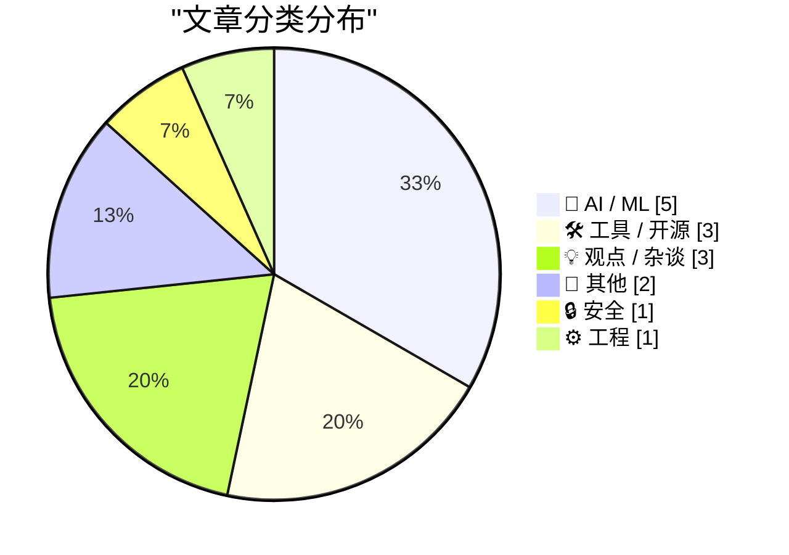
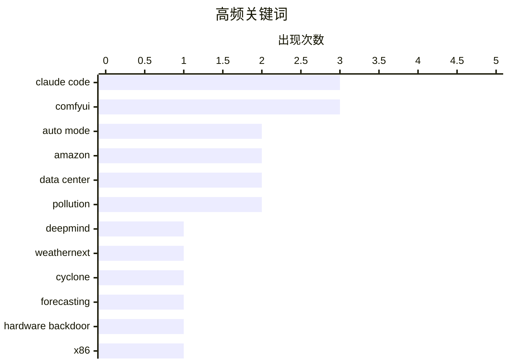

# 📰 AI 资讯每日精选 — 2026-08-09

> 汇聚 149+ 技术博客、X/Twitter、Hacker News、Reddit、Product Hunt、
> Lobste.rs、ClawFeed 日报及 GitHub Trending，经 AI 评分筛选。
>
> **本期内容**：🏆 今日必读 · 🌐 ClawFeed 日报 · 🔥 GitHub Trending · 📂 分类精选 · 📊 数据概览

## 📝 今日看点

今日技术圈聚焦于AI工具链的加速落地与其隐藏成本：Claude Code默认启用Auto模式，标志着AI编程助手正从辅助走向自动化决策，但随之而来的能耗问题也引发对AI扩张可持续性的反思。同时，开源与硬件安全领域暗流涌动，Nixpkgs核心团队解散暴露了社区治理的脆弱性，而x86 CPU后门的披露则再度敲响供应链安全的警钟。此外，行业开始审视AI投入的实际回报，警惕企业将资源浪费在琐碎任务上的“AI代币泡沫”。

---

## 🏆 今日必读

🥇 **DeepMind 的 WeatherNext 模型在气旋预报方面取得突破**

[DeepMind's WeatherNext model achieves breakthrough forecasting cyclones](https://deepmind.google/blog/weathernext-ai-model-achieves-breakthrough-in-forecasting-cyclones/) — Hacker News Best · 17 小时前 · 🤖 AI / ML

> DeepMind 发布了 WeatherNext 模型，在气旋预报方面取得突破性进展。该模型利用机器学习技术，能够更准确地预测气旋的路径和强度。与传统预报方法相比，WeatherNext 在多个指标上表现更优，尤其是在提前预报时间上。这一成果有望提升灾害预警能力，减少气旋带来的损失。

💡 **为什么值得读**: 了解 AI 在气象预报领域的最新突破，对关注气候变化和灾害预防的读者具有重要价值。

🏷️ DeepMind, WeatherNext, cyclone, forecasting

🥈 **部分 x86 CPU 中的硬件后门**

[Hardware backdoors in some x86 CPUs](https://github.com/xoreaxeaxeax/rosenbridge) — Hacker News Best · 19 小时前 · 🔒 安全

> GitHub 上的一个项目揭示了部分 x86 CPU 中存在硬件后门，这些后门可能被利用来绕过安全机制。该项目提供了详细的技术分析和验证方法，展示了如何检测和利用这些后门。这一发现对硬件安全和系统安全领域具有重大影响，提醒用户关注硬件层面的安全风险。

💡 **为什么值得读**: 对于关注硬件安全和系统底层安全的读者，这篇文章提供了重要的技术细节和警示。

🏷️ hardware backdoor, x86, CPU, security

🥉 **Claude Code 的 Auto 模式现已成为 Pro、Max 和 Team 计划的默认设置**

[Auto mode is now the default in Claude Code for Pro, Max, and Team plans](https://simonwillison.net/2026/Aug/8/auto-mode/#atom-everything) — simonwillison.net · 3 小时前 · 🛠 工具 / 开源

> Anthropic 宣布从 8 月 14 日起，Claude Code 的 Auto 模式将成为 Pro、Max 和 Team 计划的默认设置。Auto 模式旨在减少开发者的手动审批，提高效率。Anthropic 对该模式的安全性充满信心，认为其能够更好地保护开发者。这一变化标志着 AI 编程工具向更自动化方向发展。

💡 **为什么值得读**: 对于使用 Claude Code 的开发者，了解这一默认设置的变更及其影响至关重要。

🏷️ Claude Code, auto mode, Anthropic

4️⃣ **Anthropic 将 Claude Code 默认设置为 Auto 模式，以保护开发者免受错误审批**

[Anthropic sets Claude Code to Auto Mode by default to protect developers from bad approvals](https://the-decoder.com/anthropic-sets-claude-code-to-auto-mode-by-default-to-protect-developers-from-bad-approvals/) — The Decoder · 11 小时前 · 🛠 工具 / 开源

> Anthropic 将从 8 月 14 日起，将 Claude Code 的 Auto 模式设为 Pro、Max 和 Team 计划的默认设置。公司声称该模式更安全，测试显示其分类器能捕获 89% 的危险命令，而人工审查仅捕获 13.6%。这一变化意味着开发者从编写代码转向监控 AI 输出，反映了 AI 编程工具的演进趋势。

💡 **为什么值得读**: 了解 AI 编程工具的安全机制和默认设置变化，对开发者评估工具选择具有参考价值。

🏷️ Claude Code, AI safety, Auto Mode

5️⃣ **AI 代理的能耗大约是简单聊天提示的 600 倍**

[AI agents use roughly 600 times more energy than a simple chat prompt](https://the-decoder.com/ai-agents-use-roughly-600-times-more-energy-than-a-simple-chat-prompt/) — The Decoder · 16 小时前 · 🤖 AI / ML · **可追溯二手**

> 气候科学家 Zeke Hausfather 追踪了他使用 Claude Code 八周的能耗：处理了 32 亿个 token，消耗约 170 千瓦时的数据中心电力。每个提示的能耗大约是典型 AI 聊天的 600 倍。他的数据揭示了 Google 和 OpenAI 报告的低能耗数字如何扭曲了基于代理的 AI 的现实。

💡 **为什么值得读**: 这篇文章提供了关于 AI 代理能耗的实证数据，对关注 AI 环境影响和可持续性的读者很有价值。

🏷️ AI agents, energy consumption, Claude Code

---

## 🌐 ClawFeed 日报精选

> 来源：[ClawFeed](https://clawfeed.kevinhe.io) — AI 驱动的多源新闻聚合

📅 ClawFeed 日报 | 2026-08-08（SGT）

聚合 **4 档** 4h digest：DB `987`(00:00-03:59) · `988`(04:00-07:59) · `989`(12:00-15:59) · `990`(16:00-19:59)

🔴 **本日覆盖有一个真实缺口，写在最前面而不是脚注**
**`08:00-11:59` 窗口没有任何 digest** —— 12:00 档因 Chrome CDP 半死失败（HTTP 通但 `connectOverCDP`
30s 超时），当时按规则**未写空报、未拿旧数据顶数**。16:22 Kevin 授权后修复，16:00 档补跑成 `989`。
⚠️ **`989` 里"打捞"出的 6 条 08:00-11:59 内容 ≠ 该窗口被覆盖**：那是补**内容**不是补**覆盖**
（`補Li-495`）。所以下面任何"当日全场"的排序，**结构上缺 4 小时**，不是完整总体。
⚪ `20:00-23:59` 属明日 00:00 档，本日报按设计不含。

---

## 🔥 当日最重要 5 条（跨档排序、已去重）

**1. 权限确认疲劳被实测量化 —— 全天最有行动价值的一条** —— @lydiahallie（Anthropic，档 `987`）
1,053 名付费测试者：把权限确认框换成**明显危险的命令**（纯文本、未真执行），
**只有 13.6% 的人发现**；**看过 50 个提示之后识别率掉到约 5%**。
结论：auto mode 比"逐条人工确认"和 `--dangerously-skip-permissions` 都更安全。
https://x.com/lydiahallie/status/2085799128857272783
📌 **人工确认这道闸不是不管用，是随次数衰减** —— 与我这边"确认疲劳让危险操作被顺手放行"同一机制。

**2. 前沿 agent 在"真研究"上撞墙（有对照的实测）** —— @TheTuringPost（档 `988`）
给前沿 agent **6 天 + 数千美元算力**去解 **2 篇未发表 NeurIPS 2026 论文**的核心研究问题：
**工程部分扛得住，研究上没有实质进展。**
https://x.com/TheTuringPost/status/2085859661912392136
📌 它把"能干活"和"能做研究"**分开量了**；前者反复被证实，后者这次是**否定读数**。
⚠️ 仅读到推文摘要，未读原始报告。

**3. DeepSeek V4 Flash 刷新 ARC-AGI 成本-性能 Pareto** —— @teortaxesTex 转 ARC 验证榜（档 `987`）
**ARC-AGI-2: 61.4% @ $0.04/task** · **ARC-AGI-1: 89.0% @ $0.02/task**，称与 Kimi K3 持平，
且是**首次有这个参数量级/预训练成本的模型做到该水平**。
https://x.com/teortaxesTex/status/2085815197210398825
⚠️ 数字为推文转述，**我未打开 ARC 官方榜核对**。

**4. Coldcard 漏洞损失扩大** —— CoinMarketCap 引 Galaxy Research（档 `987`）
**至少 1,719 BTC（≈$111M）被盗，总损失预计 >$130M**。
https://x.com/CoinMarketCap/status/2085801953880080420
⚠️ 若名下有 Coldcard 硬件钱包，请走官方渠道自行核实，别照本条行动。

**5. X 停止创作者收益分成 —— 当日拿到第二个独立信源** —— @Lucas168（档 `988`）+ @AndrewCurran_（档 `990`）
两源**对"发生什么"一致**：Revenue Sharing 结束，改为 **Original Content Rewards**（按原创内容的合格曝光计费）。
**但对"哪一天"不一致**：中文源称 **9/7 结束、9/8 开放申请**；英文源称**最终付款约 9/11**。
https://x.com/Lucas168/status/2085857969560748242 · https://x.com/AndrewCurran_/status/2085845795614630316
🔑 **交叉印证抬高的是【事件】可信度，不是【细节】可信度** —— 日期仍不可引用，需官方公告。
**多一个来源 ≠ 每个字段都多一份证据。**

---

## 📰 当日核心主题（聚类视角）

**① Agent 的能力边界与成本 —— 全天最密集的一簇（跨 4 档都有）**
- 能力上界：研究做不动（`988`），但工程能扛。
- 组织形态：@OpenMaxAI「**25 人 / 75+ agent，每人管三个**，覆盖 sales/ops/finance/legal」，
  @CharliehuAI 在 SMEICC 2026 的说法是「瓶颈从来不是人头，是你不肯交出去的事」（`990`，**自家宣发**，不作市场信号）。
  个人侧同一方向：@milesdeutscher「用 Claude 自动化了整个人生 / 全部 SOP」。
- 协作机制：**Claude Code 出了「跨会话消息」**，并行任务时可让另一窗口接手，
  且**传的是摘要不是上下文**（@xiaohu，`989` 打捞段）。
- 成本反噬：@shao__meng 记录了「token 大跃进 → 账单暴涨 → 反过来限额」的循环，
  引 Databricks 公开的降本分析（部分场景单位成本降至 **1/10**）；圈内讽刺「高管发现还是人便宜」「token 不能欠费，人能」。
- 产品体感：@JefferyTatsuya 公开批评 Claude Code 桌面版**跨端状态查看体验差**、点名 @DarioAmodei/@bcherny（`988`）。
📌 **把这五格连起来看**：能力在涨、协作原语在出现、而**成本与跨端体验成了新的约束面**。

**② 人在回路的失效 —— 与①正面咬合**
第 1 条（确认疲劳 13.6% → 5%）是本簇唯一一条，但它**给①提供了反向约束**：
agent 越自动，人工闸门越被高频触发，而**闸门本身随次数衰减** ⇒ 「加一道人工确认」不是免费的安全。

**③ 稳定币 / 交易所结构 / RWA**
- **IMF：本地稳定币可能反而把用户推向"数字美元"**（@Cointelegraph，`990`）。
- **交易所储备结构对比**（@CoinMarketCap，`990`）：MEXC **70.8% 稳定币**最保守 · KuCoin 60.1% ·
  Bybit 48.9% · Bitget 48.3% · HTX **50.7% 押主流山寨**风险偏好最高；Binance **仅稳定币 460 亿美元**。
  📌 **构成看风险偏好、规模看流动性 —— 两个不同问题，别混。**
- vault 经济风险：抵押物下跌速度不能快过清算速度（@laurashin，`988`）。
- OP Enterprise 8 个月做到占 Optimism 收入大头、企业收入超主网（@therollupco，`988`）。
- DeFi 下一个 edge 是**专业化**：后来者在 BTCFi/GoldFi 做深胜过通用 DeFi 拼寡头（@0xAlexWu，`990`）。

**④ 中国 AI 与资本市场**
- 🔴 **Kimi（月之暗面）G 轮启动、估值 500 亿美元、视为 Pre-IPO**；为赴港上市并引国家资本，
  通报**不排除要求全部海外股东将权益转入国内主体**；母公司已改制为股份有限公司；
  额度紧张、要求 **8/15 前打款**（@_FORAB，`989` 打捞段）。
  ⚠️ 中文转述 + "知情人士"，**未见一手公告**，估值/日期勿作事实引用。
- DeepSeek V4 Flash（见上）。
- 生成式图像：Grok Imagine Image 2.0 文生图 Arena **#2（1320 分，自 #14 跃升）**，**仅 App 无 API**（@liyue_ai，`990`）。

**⑤ 基础设施 / 硬件**
BEP-675 让 BSC 测试网吞吐 **1,237 → 2,324 TPS（+88%）**，出块 450ms 与 finality lag 不变（`988`）·
DEF CON 34 徽章用 bunnie Huang 的开源 RISC-V 衍生芯片 Baochip-1x，**3 万人可用红外物理验证**（`989` 打捞段）·
Sandisk 营收同比 **+175% 至 202.5 亿美元、数据中心销售 +437%**（`989`）。

---

## 🔖 累计 bookmark 精选
⚪ **本日无新增**。四档**每一档**都是 **20/20 命中查重账本**（同一批历史 mark，最新一条 08-04）。
🔑 这条"没有变化"是**有判别力的**：bookmarks 命中率正是匹配器的阳性对照 ——
**它每档都开火，所以 feed 侧"基本首现"的结论是挣来的，不是空转。**
⚪ 例外说明：03:xx 按 Kevin 指令**人工**新入 5 条 mark（id **907-911**，周报 W29 §2 AI-Native 主题），
属人工指定、不在自动流程内，故不计入本节。

## 👀 推荐关注汇总
⚪ **全天四档一条都没出** —— 且这**不是"查了没有"**：规则要求推荐前必须**用浏览器逐一确认未关注**，
而**四档都没有做这一步**。⇒ 按规则不给名单，而不是给一份带免责声明的猜测。
**"没查"和"查了没有"必须长得不一样。**

## 💤 当日重复噪音模式（模式，非单条吐槽）
1. **meme 币 / 项目软广喊单** —— 四档全部出现，是最稳定的噪音源。
2. **课程与"自动化你的人生"类推广** —— 葡语 n8n 课程、SOP 自动化带货式推文。
3. **无上下文单句/生活贴** —— 单词回复、早安、旅行照、饺子照；`990` 窗口内 6 条里占 2 条。
4. **纯转述无出处的"重磅结论"** —— 典型：`987` 里"SemiAnalysis 称谷歌 DeepMind 已失去前沿地位"，
   **只有结论、无链接无引文** ⇒ 已标为未证实、不得引用。
📊 信噪比按档：`987` 15 条约 5 条噪声 · `988` 18 条约 **9 条**（当日最差）· `990` 窗口内 6 条有 4 条低信息量。
📌 **精选条数 ≠ 窗口条数**，四档都已照实记分母。

---

## ⚪ 本日方法与限制（勿省略）
- **覆盖缺 08:00-11:59**（见开头），本日报**不是完整一天**。
- `989` 采集晚于窗口关闭 **24 分钟**、`990` 晚 **4 分钟** ⇒ 两档均为**幸存者样本**，
  "窗口内 N 条"是**下界**不是总量；`989` 偏差更大。
- 窗口归属自 `989` 起改用 **snowflake 反解 status id**（分钟级），替代 1 小时粒度的相对标记。
- 🔴 **本日仪器自误一枚，记在日报里**：查重首次计算时取错字段（`sid`/`id` 不存在，实为
  `username/status/text/raw`）⇒ 打印出 `feed 0/27、bookmarks 0/20`，**不报错、值合理、读起来像"全是新内容"**。
  揭穿它的是**独立的量**：bookmarks 历来 20/20。⇒ 现已固定：sid 一律正则取自 `status` URL，
  **bookmarks 命中率每档必报，作为匹配器阳性对照**。
- ClawFeed 当日 Chrome CDP 故障已于 **16:22** 修复（`kill -TERM` 主进程 + LaunchAgent 自启，X 登录态未丢），
  20:00 档正常运行 ⇒ **修复已跨一个完整 4h 周期验证**。
---

## 🔥 GitHub Trending

> 今日热门开源项目（全语言 + Python）

| # | 项目 | 描述 | ⭐ 总星 | 📈 今日 | 语言 |
|---|------|------|---------|---------|------|
| 1 | [PrimeIntellect-ai/prime-agent](https://github.com/PrimeIntellect-ai/prime-agent) 🤖 | A self-improving RLM agent for coding workflows and long-... | 9.0k | +2483 | TypeScript |
| 2 | [mattpocock/skills](https://github.com/mattpocock/skills) | Skills for Real Engineers. Straight from my .agents direc... | 210.1k | +1359 | Shell |
| 3 | [addyosmani/agent-skills](https://github.com/addyosmani/agent-skills) 🤖 | Production-grade engineering skills for AI coding agents. | 84.6k | +779 | JavaScript |
| 4 | [virgiliojr94/book-to-skill](https://github.com/virgiliojr94/book-to-skill) 🤖 | Turn any technical book PDF into a Claude Code skill — re... | 18.9k | +644 | Python |
| 5 | [google/skills](https://github.com/google/skills) 🤖 | Agent Skills for Google products and technologies | 16.8k | +481 | Python |
| 6 | [goauthentik/authentik](https://github.com/goauthentik/authentik) | The authentication glue you need. | 24.0k | +467 | Python |
| 7 | [denoland/celld](https://github.com/denoland/celld) | self-hosted, distributed Durable Objects | 2.6k | +432 | Rust |
| 8 | [666ghj/MiroFish](https://github.com/666ghj/MiroFish) | A Simple and Universal Swarm Intelligence Engine, Predict... | 70.7k | +389 | Python |
| 9 | [huangruiteng/loopx](https://github.com/huangruiteng/loopx) 🤖 | Lightweight loop engineering state kernel for long-runnin... | 3.6k | +243 | Python |
| 10 | [Significant-Gravitas/AutoGPT](https://github.com/Significant-Gravitas/AutoGPT) 🤖 | AutoGPT is the vision of accessible AI for everyone, to u... | 186.4k | +218 | Python |
| 11 | [practical-tutorials/project-based-learning](https://github.com/practical-tutorials/project-based-learning) | Curated list of project-based tutorials | 277.4k | +208 | Python |
| 12 | [TauricResearch/TradingAgents](https://github.com/TauricResearch/TradingAgents) 🤖 | TradingAgents: Multi-Agents LLM Financial Trading Framework | 96.5k | +153 | Python |
| 13 | [TapXWorld/ChinaTextbook](https://github.com/TapXWorld/ChinaTextbook) | 所有小初高、大学PDF教材。 | 78.0k | +118 | Roff |
| 14 | [tirth8205/code-review-graph](https://github.com/tirth8205/code-review-graph) 🤖 | Local-first code intelligence graph for MCP and CLI. Buil... | 29.5k | +114 | Python |
| 15 | [bannedbook/fanqiang](https://github.com/bannedbook/fanqiang) | 翻墙-科学上网 | 49.9k | +101 | Kotlin |

---

## 🤖 AI / ML

### 1. DeepMind 的 WeatherNext 模型在气旋预报方面取得突破

[DeepMind's WeatherNext model achieves breakthrough forecasting cyclones](https://deepmind.google/blog/weathernext-ai-model-achieves-breakthrough-in-forecasting-cyclones/) — **Hacker News Best** · 17 小时前 · ⭐ 27/30

> DeepMind 发布了 WeatherNext 模型，在气旋预报方面取得突破性进展。该模型利用机器学习技术，能够更准确地预测气旋的路径和强度。与传统预报方法相比，WeatherNext 在多个指标上表现更优，尤其是在提前预报时间上。这一成果有望提升灾害预警能力，减少气旋带来的损失。

🏷️ DeepMind, WeatherNext, cyclone, forecasting

---

### 2. AI 代理的能耗大约是简单聊天提示的 600 倍

[AI agents use roughly 600 times more energy than a simple chat prompt](https://the-decoder.com/ai-agents-use-roughly-600-times-more-energy-than-a-simple-chat-prompt/) — **The Decoder** · 16 小时前 · ⭐ 24/30 · **可追溯二手**

> 气候科学家 Zeke Hausfather 追踪了他使用 Claude Code 八周的能耗：处理了 32 亿个 token，消耗约 170 千瓦时的数据中心电力。每个提示的能耗大约是典型 AI 聊天的 600 倍。他的数据揭示了 Google 和 OpenAI 报告的低能耗数字如何扭曲了基于代理的 AI 的现实。

🏷️ AI agents, energy consumption, Claude Code

---

### 3. 修订提示（Revision Prompting）改进工业级LLM流程

[Revision Prompting improves industrial LLM processes](https://revisionprompting.info/) — **Lobste.rs** · 6 小时前 · ⭐ 23/30

> 文章介绍了一种名为“修订提示”（Revision Prompting）的新技术，旨在提升大型语言模型（LLM）在工业应用中的表现。该方法通过让模型对初始输出进行自我修订，从而显著提高输出质量和准确性。实验表明，修订提示在多个基准测试中优于传统提示方法，尤其在复杂任务中效果明显。该技术易于集成到现有流程中，无需额外训练模型。作者认为，修订提示为工业界提供了一种简单有效的LLM优化方案。

🏷️ LLM, prompting, industrial

---

### 4. Comfy Org邀请MiniMax H3团队交流：直播文字摘要

[Comfy Org invited Minimax H3 team to talk: text summary of the stream](https://www.reddit.com/r/comfyui/comments/1vj1czl/comfy_org_invited_minimax_h3_team_to_talk_text/) — **r/comfyui** · 9 小时前 · ⭐ 21/30

> Comfy Org邀请了MiniMax H3团队进行直播交流，本文是直播内容的文字摘要。直播中，MiniMax H3团队介绍了其最新模型H3的特点和应用场景，并回答了社区关于模型性能、硬件需求等问题。团队强调了H3在视频生成方面的优势，并透露了未来与ComfyUI的集成计划。此外，团队还讨论了模型优化和部署的实践经验。此次交流为ComfyUI用户提供了关于H3模型的第一手信息。

🏷️ MiniMax H3, ComfyUI, stream summary

---

### 5. MiniMax-H3 FLF2V在8GB显存上的测试

[MiniMax-H3 FLF2V test on 8GB VRAM](https://www.reddit.com/r/comfyui/comments/1vjckhc/minimaxh3_flf2v_test_on_8gb_vram/) — **r/comfyui** · 1 小时前 · ⭐ 20/30

> 一位用户分享了在RTX 4070 8GB显存和64GB内存的配置下测试MiniMax-H3 FLF2V模型的体验。测试中，模型在832x640分辨率下渲染耗时920秒。用户提供了详细的性能数据和运行截图，并讨论了在低显存环境下运行该模型的可行性和优化建议。测试结果表明，尽管显存有限，但通过适当调整参数，模型仍可运行，但速度较慢。

🏷️ MiniMax-H3, FLF2V, VRAM, ComfyUI

---

## 🛠 工具 / 开源

### 6. Claude Code 的 Auto 模式现已成为 Pro、Max 和 Team 计划的默认设置

[Auto mode is now the default in Claude Code for Pro, Max, and Team plans](https://simonwillison.net/2026/Aug/8/auto-mode/#atom-everything) — **simonwillison.net** · 3 小时前 · ⭐ 24/30

> Anthropic 宣布从 8 月 14 日起，Claude Code 的 Auto 模式将成为 Pro、Max 和 Team 计划的默认设置。Auto 模式旨在减少开发者的手动审批，提高效率。Anthropic 对该模式的安全性充满信心，认为其能够更好地保护开发者。这一变化标志着 AI 编程工具向更自动化方向发展。

🏷️ Claude Code, auto mode, Anthropic

---

### 7. Anthropic 将 Claude Code 默认设置为 Auto 模式，以保护开发者免受错误审批

[Anthropic sets Claude Code to Auto Mode by default to protect developers from bad approvals](https://the-decoder.com/anthropic-sets-claude-code-to-auto-mode-by-default-to-protect-developers-from-bad-approvals/) — **The Decoder** · 11 小时前 · ⭐ 24/30

> Anthropic 将从 8 月 14 日起，将 Claude Code 的 Auto 模式设为 Pro、Max 和 Team 计划的默认设置。公司声称该模式更安全，测试显示其分类器能捕获 89% 的危险命令，而人工审查仅捕获 13.6%。这一变化意味着开发者从编写代码转向监控 AI 输出，反映了 AI 编程工具的演进趋势。

🏷️ Claude Code, AI safety, Auto Mode

---

### 8. Fastmail 提供欧盟数据区域

[Fastmail offers EU data region](https://www.fastmail.com/blog/fastmail-offers-eu-data-region/) — **Hacker News Best** · 10 小时前 · ⭐ 22/30

> Fastmail 宣布推出欧盟数据区域，允许用户将数据存储在欧盟境内，以满足数据主权和隐私法规要求。这一举措旨在吸引欧洲用户，并符合 GDPR 等法规。Fastmail 强调其对用户隐私的承诺，并提供更灵活的数据存储选项。

🏷️ Fastmail, EU data, privacy

---

## 💡 观点 / 杂谈

### 9. “代码从来不是难点”是对所有程序员的侮辱

[“Code was never the hard part” is an insult to all programmers](https://blog.senko.net/code-was-never-the-hard-part-is-an-insult-to-all-programmers) — **Hacker News Best** · 11 小时前 · ⭐ 23/30

> 文章反驳了“代码从来不是难点”这一观点，认为这是对所有程序员的侮辱。作者指出，编程不仅仅是逻辑和设计，还包括调试、优化、维护等复杂技能。这种说法忽视了程序员工作的实际难度和创造性。作者呼吁尊重编程的专业性，并强调代码编写本身就是一项高难度技能。

🏷️ programming, software development, craft

---

### 10. 也许“通过烧钱买 AI 代币来偷内裤”并不是一个好商业计划

[Maybe ‘Steal Underpants by Blowing a Fortune on AI Tokens’ Is, in Fact, Not a Good Business Plan](https://www.404media.co/the-tokenpocalypse-is-here-companies-are-scrambling-to-stop-spending-so-much-on-ai/) — **daringfireball.net** · 6 小时前 · ⭐ 22/30

> 文章讨论了企业 AI 代币支出飙升的问题，引用 404 Media 的报道，指出咨询巨头埃森哲正试图阻止非技术员工将 AI 代币浪费在琐碎任务上，如将 PDF 转换为演示文稿。泄露的音频显示，埃森哲观察到“代币支出飙升”，这削弱了“超级工程师生成大量代码”的叙事。文章质疑这种高成本 AI 使用的商业合理性。

🏷️ AI tokens, business, Accenture

---

### 11. Comfy心态

[Comfy mindset](https://www.reddit.com/r/comfyui/comments/1vis2m3/comfy_mindset/) — **r/comfyui** · 16 小时前 · ⭐ 20/30

> 这篇文章是一份面向ComfyUI新老用户的简短指南，旨在帮助用户建立正确的心态。作者指出，ComfyUI的开发速度极快，频繁更新导致功能变化是常态，用户不应抱怨开发者。文章建议用户学会适应变化，理解开发者的工作节奏，并掌握一些最佳实践，如备份工作流、关注更新日志等。作者强调，保持积极心态和灵活应变是使用ComfyUI的关键。

🏷️ ComfyUI, best practices, mindset

---

## 📝 其他

### 12. 亚马逊正在制造全国最大的污染源

[Amazon Is Creating the Biggest Pollution Source in the Country](https://newrepublic.com/post/214111/amazon-data-center-biggest-pollution-source-entire-country) — **Hacker News Best** · 8 小时前 · ⭐ 22/30

> 文章指出亚马逊的数据中心正在成为全国最大的污染源之一。这些数据中心消耗大量电力，导致碳排放增加。亚马逊作为科技巨头，其环境足迹受到关注。文章呼吁亚马逊采取更可持续的能源措施，并批评其环保承诺与实际行为之间的差距。

🏷️ Amazon, data center, pollution

---

### 13. 亚马逊新数据中心将配备美国污染最严重的发电厂

[New Amazon Data Center Is Set to Have the Most Polluting Power Plant in the U.S.](https://www.nytimes.com/2026/08/08/climate/amazon-data-center-texas-pollution.html) — **Hacker News Best** · 16 小时前 · ⭐ 22/30

> 亚马逊在德克萨斯州新建的数据中心将配备一座天然气发电厂，预计将成为美国污染最严重的发电厂。该发电厂将产生大量二氧化碳排放，引发环保人士和当地社区的强烈反对。亚马逊辩称，该设施对于满足数据中心的电力需求是必要的，但批评者认为，此举与公司的气候承诺相矛盾。文章指出，这一事件凸显了科技巨头在追求算力扩张与实现碳中和目标之间的深刻矛盾。最终，该发电厂的建设和运营可能面临法律挑战和公众压力。

🏷️ Amazon, data center, pollution

---

## 🔒 安全

### 14. 部分 x86 CPU 中的硬件后门

[Hardware backdoors in some x86 CPUs](https://github.com/xoreaxeaxeax/rosenbridge) — **Hacker News Best** · 19 小时前 · ⭐ 26/30

> GitHub 上的一个项目揭示了部分 x86 CPU 中存在硬件后门，这些后门可能被利用来绕过安全机制。该项目提供了详细的技术分析和验证方法，展示了如何检测和利用这些后门。这一发现对硬件安全和系统安全领域具有重大影响，提醒用户关注硬件层面的安全风险。

🏷️ hardware backdoor, x86, CPU, security

---

## ⚙️ 工程

### 15. Nixpkgs 核心团队已解散

[The Nixpkgs core team has disbanded](https://discourse.nixos.org/t/the-nixpkgs-core-team-has-disbanded/79413) — **Lobste.rs** · 23 小时前 · ⭐ 24/30

> Nixpkgs 核心团队宣布解散，这一事件对 Nix 生态系统的治理和未来发展产生重大影响。解散原因可能涉及内部冲突或资源不足。社区需要重新组织治理结构，以确保项目的持续维护和发展。这一变化可能影响 NixOS 和 Nix 包管理器的用户。

🏷️ Nixpkgs, core team, disbanded, governance

---

## 📊 数据概览

| 扫描源 | 抓取文章 | 时间范围 | 精选 |
|:---:|:---:|:---:|:---:|
| 100/149 | 5128 篇 → 73 篇 | 24h | **15 篇** |

### 分类分布



### 高频关键词



<details>
<summary>📈 纯文本关键词图（终端友好）</summary>

```
claude code │ ████████████████████ 3
comfyui     │ ████████████████████ 3
auto mode   │ █████████████░░░░░░░ 2
amazon      │ █████████████░░░░░░░ 2
data center │ █████████████░░░░░░░ 2
pollution   │ █████████████░░░░░░░ 2
deepmind    │ ███████░░░░░░░░░░░░░ 1
weathernext │ ███████░░░░░░░░░░░░░ 1
cyclone     │ ███████░░░░░░░░░░░░░ 1
forecasting │ ███████░░░░░░░░░░░░░ 1
```

</details>

### 🏷️ 话题标签

**claude code**(3) · **comfyui**(3) · **auto mode**(2) · amazon(2) · data center(2) · pollution(2) · deepmind(1) · weathernext(1) · cyclone(1) · forecasting(1) · hardware backdoor(1) · x86(1) · cpu(1) · security(1) · anthropic(1) · ai safety(1) · ai agents(1) · energy consumption(1) · programming(1) · software development(1)

---

*生成于 2026-08-09 02:25 | 汇聚 149 个技术博客、X/Twitter、Hacker News、Reddit、Product Hunt、Lobste.rs、ClawFeed 日报及 GitHub Trending，经 AI 评分筛选出 Top 15 精华内容*
