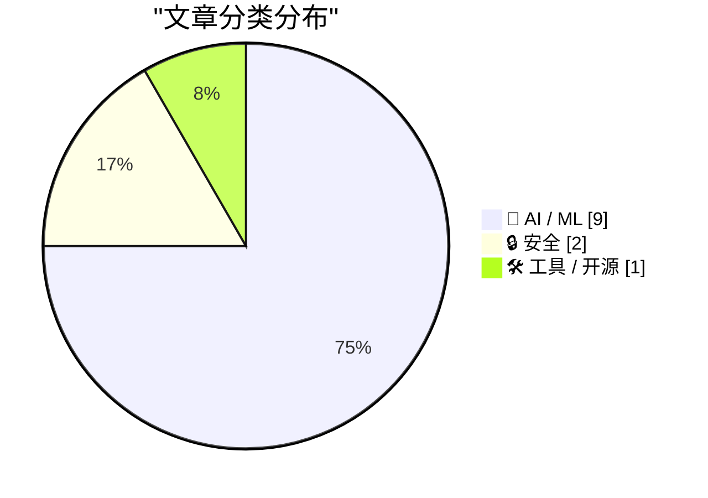
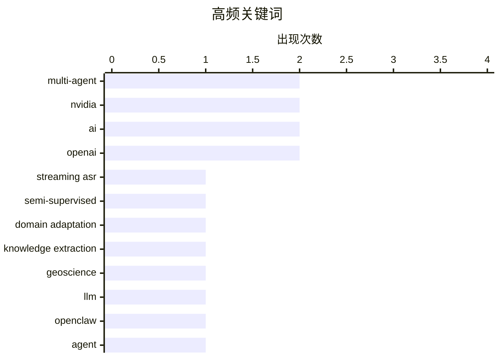

# 📰 AI 资讯每日精选 — 2026-08-18

> 汇聚 156+ 技术博客、X/Twitter、Hacker News、Reddit、Product Hunt、
> Lobste.rs、ClawFeed 日报及 GitHub Trending，经 AI 评分筛选。
>
> **本期内容**：🏆 今日必读 · 🌐 ClawFeed 日报 · 🔥 GitHub Trending · 📂 分类精选 · 📊 数据概览 · 🎯 项目相关情报 · 🌍 补充视角

## 📝 今日看点

今日技术圈聚焦AI智能体的落地能力与安全边界：智能体开始配备支付与消费护栏，向自主交易迈出关键一步，同时AI驱动的代码修复工具暴露出可被利用的漏洞，警示自动化防御的脆弱性。语音技术领域呈现边缘-云协同与多语言强化学习并进的趋势，流式识别、翻译模型在效率与领域适应性上持续突破，开源模型Qwen 3.8也以亮眼评测成绩逼近头部闭源系统。此外，AI基础设施投资规模空前，OpenAI与Nvidia达成千亿美元级数据中心合作，算力军备竞赛正重塑产业格局。

---

## 🏆 今日必读

🥇 **StreamHear：用于半监督流式语音识别的领域自适应伪标签方法**

[StreamHear: Domain-Adapted Pseudo-Labeling for Semi-Supervised Streaming Speech Recognition](https://arxiv.org/abs/2608.13717) — arXiv Computation and Language · 21 小时前 · 🤖 AI / ML · **一手来源**

> 流式自动语音识别（ASR）在领域偏移的目标音频上表现不佳，而标注领域内数据成本高昂，未标注音频却大量存在。StreamHear是一种半监督流程，通过在标注训练集上微调离线transducer教师模型，为未标注部分生成伪标签，并在混合数据上微调学生模型，从而适应预训练的流式学生模型。该方法进一步利用领域自适应技术提升伪标签质量。实验表明，StreamHear在领域偏移场景下显著提升了流式ASR的性能，缩小了与离线模型的差距。

💡 **为什么值得读**: 针对流式ASR领域偏移问题，提出了一种实用的半监督解决方案，值得研究者和工程师关注。

🏷️ streaming ASR, semi-supervised, domain adaptation

🥈 **HERMES：面向地球科学超长文档结构化知识提取的多智能体框架**

[HERMES: a multi-agent framework for structured knowledge extraction from ultra-long documents in geoscience](https://arxiv.org/abs/2608.14055) — arXiv Computation and Language · 21 小时前 · 🤖 AI / ML · **一手来源**

> 地球科学中的权威科学知识大多封存在传统专著和历史文献中，非结构化文本和复杂布局阻碍了计算访问。HERMES是一个可扩展的多智能体框架，用于从超长科学文档中提取结构化数据。通过协调大型语言模型，HERMES将领域约束、验证规则和证据追踪集成到统一框架中。该框架能够处理超长文档，并确保提取数据的准确性和可追溯性。

💡 **为什么值得读**: 为地球科学领域提供了一种自动化知识提取的新方法，有助于释放历史文献的价值。

🏷️ multi-agent, knowledge extraction, geoscience, LLM

🥉 **构建使用Amazon Bedrock AgentCore支付进行交易的OpenClaw智能体**

[Build OpenClaw agents that transact with Amazon Bedrock AgentCore payments](https://aws.amazon.com/blogs/machine-learning/build-openclaw-agents-that-transact-with-amazon-bedrock-agentcore-payments/) — AWS Machine Learning Blog · 9 小时前 · 🤖 AI / ML · **一手来源**

> 该文章介绍了如何为自主智能体配备钱包和支出护栏，使其能够为付费API、MCP服务器和网页内容付费。具体而言，将OpenClaw连接到Amazon Bedrock AgentCore支付和x402协议，使用aws-agents-pay插件进行有界、人工批准的测试网支付。这为智能体在真实交易场景中的应用提供了基础设施支持。

💡 **为什么值得读**: 展示了智能体支付集成的新方案，对于构建自主交易系统具有实践指导意义。

🏷️ OpenClaw, Agent, payments, Bedrock

4️⃣ **参数和带宽高效的边缘-云多对多语音到文本翻译**

[Parameter- and Bandwidth-Efficient Edge--cloud Many-to-Many Speech-to-Text Translation](https://arxiv.org/abs/2605.28642) — arXiv Artificial Intelligence · 21 小时前 · 🤖 AI / ML · **一手来源**

> 多模态大语言模型（MLLMs）在语音到文本翻译（S2TT）中展现出巨大潜力，但现有部署面临挑战：纯设备端模型受资源限制，集中式云系统因传输原始语音数据而带来带宽瓶颈和隐私风险。为此，提出边缘-云语音识别与翻译（ESRT）框架，通过参数高效和带宽高效的设计，在边缘和云之间分配计算任务，减少带宽消耗并保护隐私。实验表明，ESRT在保持翻译质量的同时，显著降低了参数和带宽需求。

💡 **为什么值得读**: 针对S2TT部署中的资源与隐私问题，提出了一种创新的边缘-云协同方案，值得关注。

🏷️ speech-to-text, multimodal LLM, edge-cloud

5️⃣ **NVIDIA Nemotron 3.5 Lightning现已在Amazon SageMaker JumpStart中提供**

[NVIDIA Nemotron 3.5 Lightning now available in Amazon SageMaker JumpStart](https://aws.amazon.com/blogs/machine-learning/nvidia-nemotron-3-5-lightning-now-available-in-amazon-sagemaker-jumpstart/) — AWS Machine Learning Blog · 7 小时前 · 🛠 工具 / 开源 · **一手来源**

> NVIDIA Nemotron 3.5 Lightning是一个为高容量智能体工作负载构建的开放模型，现已可在Amazon SageMaker JumpStart中使用。该模型为30B参数的混合专家模型（3B激活），可为常驻智能体提供高达4倍的吞吐量提升和高达30%的任务完成速度提升。文章展示了如何部署该模型。

💡 **为什么值得读**: 对于需要高吞吐和低延迟的智能体应用，该模型提供了新的选择，且部署简便。

🏷️ NVIDIA, Nemotron, SageMaker, agentic

---

## 🌐 ClawFeed 日报精选

> 来源：[ClawFeed](https://clawfeed.kevinhe.io) — AI 驱动的多源新闻聚合

📅 ClawFeed 日报 | 2026-08-17 (SGT)

聚合 **2 期 4h digest**：DB `1016`(16:00-19:59) · `1017`(20:00-23:59)

🔴 **覆盖范围先说清楚：本日报只覆盖 16:00-23:59，即 24 小时里的 8 小时。**
08-12 至 08-17 15:59 期间 CDP 未持续运行（Chrome 崩溃+重启期间积累的停机），无 4h digest 数据。
本日报是**恢复后首日的部分快照**，不代表全天信息全貌。

---

## 🔥 当日最重要 3 条（跨档排序·已去重）

**1️⃣ Stripe 以 $7B 收购 OpenRouter——AI 路由/中间件被正式定价**（16:00 + 20:00 两档独立覆盖）
@aiandcloud 首发：70 亿美元估值（此前报价 100 亿，砍了 30%），OpenRouter 年化营收 $1.4 亿，毛利率 70%（比 OpenAI/Anthropic 的 40% 高得多）。
@TechFlowPost 补深度：创始人 Alex Atallah（前 OpenSea）曾自称要做"AI 界的 Stripe"，结果被 Stripe 本尊收购。Stripe 自身是支付基础设施，收一个 AI 路由基础设施 = 向 AI infra 纵深布局。
https://x.com/aiandcloud/status/2089148467843141964 · https://x.com/TechFlowPost/status/2089207340654264336
🔑 **中间件层从"规模大点的中转站"变成 $7B 生意，中立定位在并购后面临考验。**

**2️⃣ Cursor 发布 Origin——自研代码托管平台，IDE 厂商垂直整合 code hosting**（20:00 档）
@benln 报道：Cursor 团队发布 Origin，与 Cursor IDE 深度集成，支持从 GitHub 同步 repo。
GitHub 的代码托管垄断首次面临来自 AI-native 工具链的挑战。
https://x.com/benln/status/2089401249154072599
🔑 **从编辑器扩展到 hosting，AI IDE 开始全栈化。**

**3️⃣ Anthropic 水印技术——无质量损失实现，配合 EU AI Act 合规**（20:00 档，延续 08-11 水印讨论）
@trq212 (Thariq, Anthropic 工程师) 解释水印实现机制，主要 AI 厂商都已签署 EU AI Act Code of Practice，水印将成标配。做了一个互动 artifact 帮助理解原理。
https://x.com/trq212/status/2088721023223132213
🔑 与 08-11 日报的"人类文本被 Claude 编辑后也算 AI 生成"争议形成连续线：**技术可行性与归属判定是两个独立问题。**

---

## 📰 当日核心主题（聚类）

**① AI 基础设施并购与定价** — Stripe/OpenRouter $7B 收购是主线（两档独立覆盖）；Cursor Origin 代表 AI 工具链纵向整合。中间件和托管层正在被重新定价。

**② Harness 工程持续升温** — Patrick Collison (Stripe CEO)："agentic coding harness 不应该以终端为主"，终端信息密度低、UI affordance 最小（16:00）· @kirillk_web3 + @AnatoliKopadze：Loop Engineering → Graph Engineering，Claude Code 负责人原话"I'm not prompting my agents anymore, I'm building graphs and loops"（16:00，两条合计 1.5M+ views）· @NFT_Chen 发现 DSH 极简模式一行 bug 修复提速 70 倍（16:00）· @yanhua1010 引 Pi agent 框架设计哲学：核心压缩到 read/write/edit/bash 四个工具（20:00）。
📌 从"要不要用 harness"变成"怎么建 harness"——实操层的讨论密度今天最高。

**③ AI 采纳鸿沟** — @levie (Aaron Levie, Box CEO)：企业 AI 支出中位数 $12/员工/月 vs top 1% $7,500/员工/月，625 倍差距可能是 AI 时代最大的采纳鸿沟（16:00）· Andrew Ng AI Engineering Skills Map 基于 1 万+招聘需求拆解四大能力块（16:00 + 20:00 两档覆盖）。

**④ 安全 vs 进步** — @quxiaoyin 致 Dario Amodei 公开信：如果 Claude 能治癌症为什么要 pace the progress？455K views（16:00）· @elonmusk 回应 AI 风险消息争议（20:00）· Thariq 水印技术（20:00）。同一方向的三个切面：能力约束的合理性。

---

## 📰 Feed 精选补充（未入主题聚类的独立亮点）

• @MaxForAI - 失业工程师花 6 个月逆向 AMD/Taalas AI 推理芯片专利，声称 100x 更少 memfetch、更好量化，写了编译器直接吃 HuggingFace checkpoint（16:00）https://x.com/MaxForAI/status/2089132978953941448

• @gengdaJ - TW93 的 Kami：极简纸媒化设计（羊皮纸色 #f5f4ed，墨蓝 #1B365D），做简历/Slides 的美学标杆（16:00）https://x.com/gengdaJ/status/2089179069678260362

• @paulg - Paul Graham：经济不平等增长不是因为税收政策，是因为技术让创业越来越容易、公司增长越来越快（16:00）https://x.com/paulg/status/2089095591712506040

• @dotey - Codex 开启 1M 上下文方法：config.toml 设 model="gpt-5.6-sol"（20:00）https://x.com/dotey/status/2089094793078952339

• @xiaohu - Claude 账号被封后申诉一天解封，反向索要 3 个月 20x 会员补偿，社区热议 Anthropic 封号/申诉流程（20:00）https://x.com/xiaohu/status/2089198854935908637

## 🔖 累计 bookmark

🔴 16:00 档 bookmarks 19 条（非零），20:00 档 bookmarks 页面未能加载（Chrome 53 tabs 超载，CDP 导航上下文被销毁）⇒ **仅 1/2 档有 bookmark 数据。**
16:00 档 bookmark 精选已在该期 4h digest 中列出（@trq212 system prompt 精简、@BruceGuai Matrix Agent OS、@heynavtoor Harness Engineering、@mntruell 第三代 AI 开发、@levie 三篇长文）。

## 👀 推荐关注汇总（候选）

@plugyawn (Progyan) — 独立逆向 AMD/Taalas AI 芯片专利的工程师 · @JoeyDeepWorld (周.乙) — DSH 工程化深度分析。
🔴 **followingSample 只覆盖 35 个账号，无法证明"未关注"。且 20:00 档因 Chrome 超载未做关注分析。全部仅为候选。**

## 💤 当日噪音

过滤了：@RaminNasibov 纯转发 · @app_sail 段子 · @DRbitcoin36 生活感悟 · @leaf_sanren 育儿鸡汤 · @wey_gu 产品安利 · @elonmusk Grok 推广 · @binance 广告 · @justinsuntron 自演 · @ika_xbt airdrop 炒作 · @Saboo_Shubham_ 纯图片帖。

---

⚠️ **Chrome 状态注意：** 20:00 档运行时 53 tabs 超载导致 CDP 连接需 120s+，profile 导航全部 context destroyed，bookmarks 和 followingProfiles 均失败。建议下次 digest 前清理非必要标签页（参见 state.md 補Li-582 待 Kevin 裁决）。
---

## 🔥 GitHub Trending

> 今日热门开源项目（全语言 + Python）

| # | 项目 | 描述 | ⭐ 总星 | 📈 今日 | 语言 |
|---|------|------|---------|---------|------|
| 1 | [public-apis/public-apis](https://github.com/public-apis/public-apis) | A collective list of free APIs | 463.3k | +1907 | Python |
| 2 | [harry0703/MoneyPrinterTurbo](https://github.com/harry0703/MoneyPrinterTurbo) 🤖 | 利用 AI 大模型和自动化工作流，根据主题或关键词一键生成高清短视频。Generate HD short vide... | 106.2k | +1189 | Python |
| 3 | [cordiverse/cordis](https://github.com/cordiverse/cordis) | Meta-Framework of Spatiotemporal Composability | 5.6k | +957 | TypeScript |
| 4 | [unslothai/unsloth](https://github.com/unslothai/unsloth) 🤖 | Local UI to run and train LLMs and diffusion models, incl... | 73.2k | +739 | Python |
| 5 | [cactus-compute/needle](https://github.com/cactus-compute/needle) | 14MB foundation model for tiny devices; phones, wearables... | 7.2k | +660 | Python |
| 6 | [usestrix/strix](https://github.com/usestrix/strix) 🤖 | Open-source AI penetration testing tool to find and fix y... | 54.2k | +598 | Python |
| 7 | [titanwings/colleague-skill](https://github.com/titanwings/colleague-skill) | 将冰冷的离别化为温暖的 Skill，欢迎加入数字生命1.0！Transforming cold farewells... | 23.2k | +358 | Python |
| 8 | [agalwood/Motrix](https://github.com/agalwood/Motrix) | A full-featured download manager. | 53.1k | +344 | TypeScript |
| 9 | [D4Vinci/Scrapling](https://github.com/D4Vinci/Scrapling) | 🕷️ An adaptive Web Scraping framework that handles every... | 74.8k | +296 | Python |
| 10 | [yt-dlp/yt-dlp](https://github.com/yt-dlp/yt-dlp) | A feature-rich command-line audio/video downloader | 185.1k | +269 | Python |
| 11 | [volcengine/OpenViking](https://github.com/volcengine/OpenViking) 🤖 | Self-evolving Context Database for AI Agents. Unify Agent... | 28.9k | +239 | Python |
| 12 | [santifer/career-ops](https://github.com/santifer/career-ops) 🤖 | Open-source AI job search: scan job portals, evaluate lis... | 64.7k | +218 | JavaScript |
| 13 | [akitaonrails/ai-memory](https://github.com/akitaonrails/ai-memory) 🤖 | Solution for long term memory for agent coding CLIs and t... | 2.1k | +207 | Rust |
| 14 | [mukul975/Anthropic-Cybersecurity-Skills](https://github.com/mukul975/Anthropic-Cybersecurity-Skills) 🤖 | 817 structured cybersecurity skills for AI agents · Mappe... | 28.5k | +198 | Python |
| 15 | [AlexsJones/llmfit](https://github.com/AlexsJones/llmfit) | Hundreds of models & providers. One command to find what ... | 32.3k | +198 | Rust |

---

## 🤖 AI / ML

### 1. StreamHear：用于半监督流式语音识别的领域自适应伪标签方法

[StreamHear: Domain-Adapted Pseudo-Labeling for Semi-Supervised Streaming Speech Recognition](https://arxiv.org/abs/2608.13717) — **arXiv Computation and Language** · 21 小时前 · ⭐ 23/30 · **一手来源**

> 流式自动语音识别（ASR）在领域偏移的目标音频上表现不佳，而标注领域内数据成本高昂，未标注音频却大量存在。StreamHear是一种半监督流程，通过在标注训练集上微调离线transducer教师模型，为未标注部分生成伪标签，并在混合数据上微调学生模型，从而适应预训练的流式学生模型。该方法进一步利用领域自适应技术提升伪标签质量。实验表明，StreamHear在领域偏移场景下显著提升了流式ASR的性能，缩小了与离线模型的差距。

🏷️ streaming ASR, semi-supervised, domain adaptation

---

### 2. HERMES：面向地球科学超长文档结构化知识提取的多智能体框架

[HERMES: a multi-agent framework for structured knowledge extraction from ultra-long documents in geoscience](https://arxiv.org/abs/2608.14055) — **arXiv Computation and Language** · 21 小时前 · ⭐ 21/30 · **一手来源**

> 地球科学中的权威科学知识大多封存在传统专著和历史文献中，非结构化文本和复杂布局阻碍了计算访问。HERMES是一个可扩展的多智能体框架，用于从超长科学文档中提取结构化数据。通过协调大型语言模型，HERMES将领域约束、验证规则和证据追踪集成到统一框架中。该框架能够处理超长文档，并确保提取数据的准确性和可追溯性。

🏷️ multi-agent, knowledge extraction, geoscience, LLM

---

### 3. 构建使用Amazon Bedrock AgentCore支付进行交易的OpenClaw智能体

[Build OpenClaw agents that transact with Amazon Bedrock AgentCore payments](https://aws.amazon.com/blogs/machine-learning/build-openclaw-agents-that-transact-with-amazon-bedrock-agentcore-payments/) — **AWS Machine Learning Blog** · 9 小时前 · ⭐ 23/30 · **一手来源**

> 该文章介绍了如何为自主智能体配备钱包和支出护栏，使其能够为付费API、MCP服务器和网页内容付费。具体而言，将OpenClaw连接到Amazon Bedrock AgentCore支付和x402协议，使用aws-agents-pay插件进行有界、人工批准的测试网支付。这为智能体在真实交易场景中的应用提供了基础设施支持。

🏷️ OpenClaw, Agent, payments, Bedrock

---

### 4. 参数和带宽高效的边缘-云多对多语音到文本翻译

[Parameter- and Bandwidth-Efficient Edge--cloud Many-to-Many Speech-to-Text Translation](https://arxiv.org/abs/2605.28642) — **arXiv Artificial Intelligence** · 21 小时前 · ⭐ 23/30 · **一手来源**

> 多模态大语言模型（MLLMs）在语音到文本翻译（S2TT）中展现出巨大潜力，但现有部署面临挑战：纯设备端模型受资源限制，集中式云系统因传输原始语音数据而带来带宽瓶颈和隐私风险。为此，提出边缘-云语音识别与翻译（ESRT）框架，通过参数高效和带宽高效的设计，在边缘和云之间分配计算任务，减少带宽消耗并保护隐私。实验表明，ESRT在保持翻译质量的同时，显著降低了参数和带宽需求。

🏷️ speech-to-text, multimodal LLM, edge-cloud

---

### 5. Qwen 3.8 27B在Artificial Analysis Intelligence Index上得分52

[Qwen 3.8 27B scores 52 on the Artificial Analysis Intelligence Index](https://simonwillison.net/2026/Aug/17/qwen-38-27b-scores-52/) — **simonwillison.net** · 1 小时前 · ⭐ 26/30

> Qwen 3.8 27B在Artificial Analysis Intelligence Index上获得52分，与GPT-5.6 Luna（最大）得分相同，仅比GLM-5.2（最大）和DeepSeek V4 Pro 0813（最大）低1分。值得注意的是，GLM-5.2为753B参数，DeepSeek V4 Pro为1.6B参数，而Luna大小未知但可能远大于27B。Qwen 3.8 27B被认为是一个真正令人惊讶的模型。

🏷️ Qwen, model benchmark, AI index

---

### 6. 超越英语的GRPO：非英语和多语言环境下GRPO的大规模研究

[GRPO Beyond English: A Large-Scale Study of GRPO in Non-English and Multilingual Settings](https://arxiv.org/abs/2608.13698) — **arXiv Computation and Language** · 21 小时前 · ⭐ 25/30 · **一手来源**

> 基于可验证奖励的强化学习（RLVR）通常使用组相对策略优化（GRPO）来提升预训练语言模型的推理能力，但现有研究主要集中于英语。该研究对多语言和非英语GRPO进行了大规模实证研究，涵盖多种基础模型、训练语言和不同推理语言奖励。研究发现，GRPO在非英语环境中的效果因语言和模型而异，并提出了改进建议。

🏷️ GRPO, reinforcement learning, multilingual

---

### 7. OpenAI签署创纪录的俄亥俄州数据中心租约，Nvidia支持高达1050亿美元

[OpenAI signs record Ohio data center lease with Nvidia backing up to $105 billion](https://the-decoder.com/openai-signs-record-ohio-data-center-lease-with-nvidia-backing-up-to-105-billion/) — **The Decoder** · 11 小时前 · ⭐ 24/30 · **可追溯二手**

> OpenAI签署了一份为期20年的租约，用于俄亥俄州一个8吉瓦的数据中心。Nvidia将为设施残值提供高达1050亿美元的担保，并成为独家芯片供应商。据《华尔街日报》报道，目前已有九家科技公司持有约3万亿美元的AI承诺，但这些承诺并未出现在任何资产负债表上。

🏷️ OpenAI, data center, Nvidia, investment

---

### 8. Anthropic 为 Claude 输出添加水印，但批评者质疑其权衡

[Anthropic watermarks Claude's output, but critics question the tradeoffs](https://the-decoder.com/anthropic-watermarks-claudes-output-but-critics-question-the-tradeoffs/) — **The Decoder** · 14 小时前 · ⭐ 24/30 · **二手来源**

> Anthropic 为 Claude 的文本输出添加水印，旨在使 AI 生成的内容可被检测。然而，批评者怀疑水印是否真的不影响措辞选择，同时律师们面临新的透明度难题。文章指出，水印技术可能带来权衡，但具体细节未明。

🏷️ watermarking, Claude, AI detection

---

### 9. Polaris：用于对话式企业分析的多智能体系统

[Polaris : Multi Agentic System for Conversational Enterprise Analytics](https://arxiv.org/abs/2608.14246) — **arXiv Artificial Intelligence** · 21 小时前 · ⭐ 24/30 · **一手来源**

> Polaris 是一个由监督者主导的多智能体框架，用于对话式企业分析，旨在解决组织数据丰富但洞察贫乏的问题。该系统引入了动态任务协调机制，以简化企业级信息的查询、解释和说明。文章介绍了 Polaris 的架构和核心功能，但未提供具体性能数据。

🏷️ multi-agent, conversational analytics, enterprise

---

## 🔒 安全

### 10. AI生成的GitHub Copilot“自动修复”允许入侵Snowflake的Jira

[AI-Generated GitHub Copilot “Autofix” Allowed Compromise of Snowflake's Jira](https://www.wiz.io/blog/red-agent-snowflake-copilot-cicd-bug) — **Hacker News Best** · 11 小时前 · ⭐ 26/30

> 根据Wiz的研究，AI生成的GitHub Copilot“自动修复”功能被利用，导致Snowflake的Jira系统遭到入侵。该漏洞涉及Copilot的自动修复建议，攻击者可能通过恶意代码注入绕过安全审查。文章详细分析了攻击路径，并强调了AI辅助开发工具的安全风险。

🏷️ AI, security, Copilot, Jira

---

### 11. 防御者的窗口

[The Defender’s Window](https://openai.com/index/the-defenders-window) — **OpenAI News** · 20 小时前 · ⭐ 23/30 · **一手来源**

> AI正在重塑网络安全，对攻击者和防御者都产生了深远影响。OpenAI正在加强自身防御，并探讨了安全团队现在可以采取的措施。文章强调了在AI时代，防御者需要利用AI来增强安全能力，同时应对新的威胁。

🏷️ AI, cybersecurity, defense, OpenAI

---

## 🛠 工具 / 开源

### 12. NVIDIA Nemotron 3.5 Lightning现已在Amazon SageMaker JumpStart中提供

[NVIDIA Nemotron 3.5 Lightning now available in Amazon SageMaker JumpStart](https://aws.amazon.com/blogs/machine-learning/nvidia-nemotron-3-5-lightning-now-available-in-amazon-sagemaker-jumpstart/) — **AWS Machine Learning Blog** · 7 小时前 · ⭐ 25/30 · **一手来源**

> NVIDIA Nemotron 3.5 Lightning是一个为高容量智能体工作负载构建的开放模型，现已可在Amazon SageMaker JumpStart中使用。该模型为30B参数的混合专家模型（3B激活），可为常驻智能体提供高达4倍的吞吐量提升和高达30%的任务完成速度提升。文章展示了如何部署该模型。

🏷️ NVIDIA, Nemotron, SageMaker, agentic

---

## 📊 数据概览

| 扫描源 | 抓取文章 | 时间范围 | 精选 |
|:---:|:---:|:---:|:---:|
| 109/156 | 6006 篇 → 900 篇 | 24h | **12 篇** |

### 分类分布



### 高频关键词



<details>
<summary>📈 纯文本关键词图（终端友好）</summary>

```
multi-agent          │ ████████████████████ 2
nvidia               │ ████████████████████ 2
ai                   │ ████████████████████ 2
openai               │ ████████████████████ 2
streaming asr        │ ██████████░░░░░░░░░░ 1
semi-supervised      │ ██████████░░░░░░░░░░ 1
domain adaptation    │ ██████████░░░░░░░░░░ 1
knowledge extraction │ ██████████░░░░░░░░░░ 1
geoscience           │ ██████████░░░░░░░░░░ 1
llm                  │ ██████████░░░░░░░░░░ 1
```

</details>

### 🏷️ 话题标签

**multi-agent**(2) · **nvidia**(2) · **ai**(2) · openai(2) · streaming asr(1) · semi-supervised(1) · domain adaptation(1) · knowledge extraction(1) · geoscience(1) · llm(1) · openclaw(1) · agent(1) · payments(1) · bedrock(1) · speech-to-text(1) · multimodal llm(1) · edge-cloud(1) · nemotron(1) · sagemaker(1) · agentic(1)

---

## 🎯 项目相关情报

### Agent 基座安全与合规

#### [构建使用Amazon Bedrock AgentCore支付进行交易的OpenClaw智能体](https://aws.amazon.com/blogs/machine-learning/build-openclaw-agents-that-transact-with-amazon-bedrock-agentcore-payments/)

> **状态**：本期 Top 12 已收录

- **匹配类型**：直接相关
- **项目相关性**：8/10
- **可落地性**：7/10
- **为什么相关**：文章直接构建具备支出护栏的自主代理，涉及MCP支付和AgentCore权限控制，属于Agent安全防护范畴。
- **建议动作**：跟踪AgentCore支付功能，分析其护栏机制，评估在自建agent安全策略中的可迁移性。
- **来源**：AWS Machine Learning Blog · 一手来源

### 多 Agent 架构

#### [HERMES：面向地球科学超长文档结构化知识提取的多智能体框架](https://arxiv.org/abs/2608.14055)

> **状态**：本期 Top 12 已收录

- **匹配类型**：直接相关
- **项目相关性**：9/10
- **可落地性**：8/10
- **为什么相关**：提出多智能体框架用于结构化知识提取，展示多agent协作与编排。
- **建议动作**：参考其任务分解与协作机制，设计类似多agent知识处理流水线。
- **来源**：arXiv Computation and Language · 一手来源

### ASR 与语音助手

#### [StreamHear：用于半监督流式语音识别的领域自适应伪标签方法](https://arxiv.org/abs/2608.13717)

> **状态**：本期 Top 12 已收录 · 48h 回填

- **匹配类型**：直接相关
- **项目相关性**：9/10
- **可落地性**：8/10
- **为什么相关**：直接研究流式语音识别的半监督伪标签方法，解决域偏移问题。
- **建议动作**：复现其伪标签策略，在目标域流式ASR上验证效果。
- **来源**：arXiv Computation and Language · 一手来源

#### [参数和带宽高效的边缘-云多对多语音到文本翻译](https://arxiv.org/abs/2605.28642)

> **状态**：本期 Top 12 已收录

- **匹配类型**：直接相关
- **项目相关性**：7/10
- **可落地性**：6/10
- **为什么相关**：聚焦语音到文本翻译的边缘-云高效部署，涉及语音转写场景。
- **建议动作**：关注其带宽与参数优化思路，应用于低延迟语音转写服务。
- **来源**：arXiv Artificial Intelligence · 一手来源

### 商品包装 OCR

> 暂无达到质量门槛的项目相关情报。

---

## 🌍 补充视角

> Top 12 未覆盖的高质量不同来源，最多 3 条。

### 1. 关于AI生成文本水印方案的后续思考

[★ Follow-Up Thoughts on Watermarking Schemes for AI-Generated Text](https://daringfireball.net/2026/08/follow-up_thoughts_on_watermarking) — **daringfireball.net** · 53 分钟前 · 🤖 AI / ML · ⭐ 23/30

> 文章探讨了AI生成文本水印技术的现状与挑战。作者认为水印方案在技术上可行，但面临实用性、鲁棒性和采用率等问题。他提到，尽管水印有助于追踪AI生成内容，但可能影响文本质量，且容易被规避。作者强调，水印并非万能，需要结合其他方法。最终，作者认为水印技术值得继续发展，但需权衡利弊。

💡 **补充价值**：深入分析AI文本水印的利弊，适合关注AI内容治理的读者。

---

*生成于 2026-08-18 01:48 | 汇聚 156 个技术博客、X/Twitter、Hacker News、Reddit、Product Hunt、Lobste.rs、ClawFeed 日报及 GitHub Trending，经 AI 评分筛选出 Top 12 精华内容，另附 1 条不同来源补充视角*
