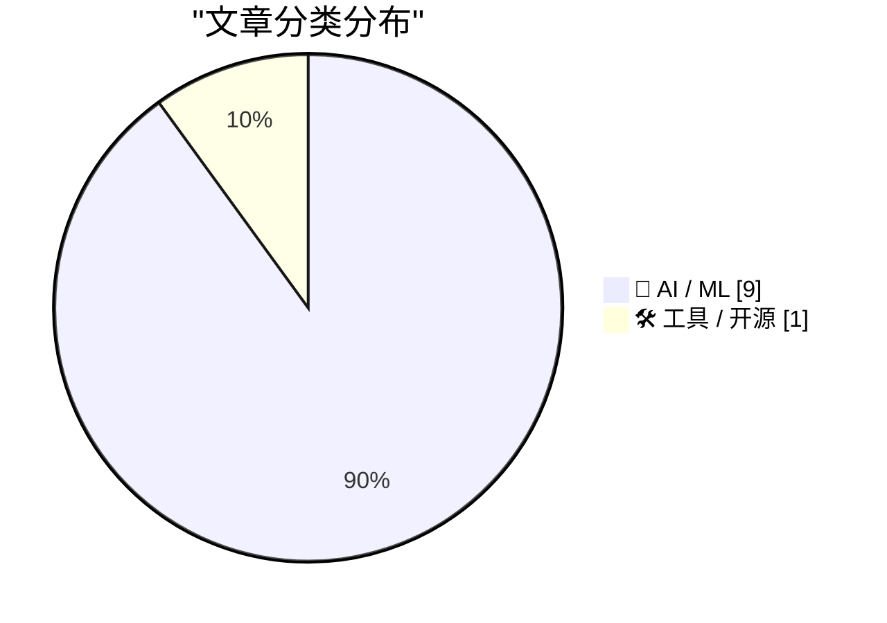
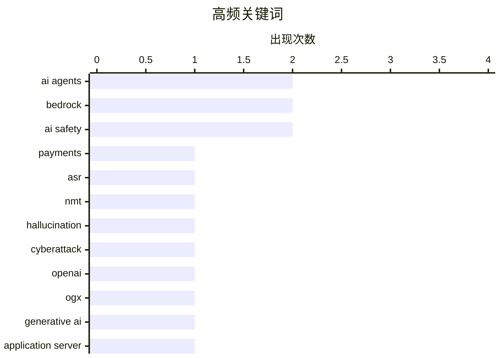

# 📰 AI 资讯每日精选 — 2026-08-19

> 汇聚 156+ 技术博客、X/Twitter、Hacker News、Reddit、Product Hunt、
> Lobste.rs、ClawFeed 日报及 GitHub Trending，经 AI 评分筛选。
>
> **本期内容**：🏆 今日必读 · 🌐 ClawFeed 日报 · 🔥 GitHub Trending · 📂 分类精选 · 📊 数据概览 · 🎯 项目相关情报 · 🌍 补充视角

## 📝 今日看点

今日技术圈聚焦两大主线：AI智能体正加速走向生产级应用，从自主支付、文档分类到多租户安全部署，行业开始强调可观测性、隔离性与成本控制；与此同时，前沿模型的安全风险成为发展节奏的“刹车阀”，OpenAI等机构主动调整开发速度，并引入实时监控与对齐机制。此外，开源与供应商中立的AI基础设施（如OGX）持续涌现，为多后端兼容与灵活部署提供新选项。整体看，技术创新与安全约束正形成动态平衡，推动AI从能力竞赛转向可信落地。

---

## 🏆 今日必读

🥇 **Amazon Bedrock AgentCore Payments 现已正式可用：让智能体安全自主地进行大规模交易**

[Amazon Bedrock AgentCore payments is now generally available: Enabling agents to transact safely and autonomously at scale](https://aws.amazon.com/blogs/machine-learning/amazon-bedrock-agentcore-payments-is-now-generally-available-enabling-agents-to-transact-safely-and-autonomously-at-scale/) — AWS Machine Learning Blog · 6 小时前 · 🤖 AI / ML · **一手来源**

> Amazon Bedrock AgentCore Payments 现已正式可用，使 AI 智能体能够自主进行交易，并内置支出护栏、协议无关的支付编排和生产级可观测性。该服务旨在让智能体在安全可控的环境下处理支付任务，降低自主交易的风险。它支持多种支付协议，并提供监控和审计功能，适合需要大规模自动化支付的企业。

💡 **为什么值得读**: 对于在 AWS 上构建支付相关 AI 智能体的开发者，了解这一新服务的能力和安全性至关重要。

🏷️ AI agents, payments, Bedrock

🥈 **空标记知道：减少 ASR 和 NMT 中的无消息幻觉**

[The Null Token Knows: Reducing Message-Free Hallucination in ASR and NMT](https://arxiv.org/abs/2608.15940) — arXiv Machine Learning · 21 小时前 · 🤖 AI / ML · **一手来源**

> 现代编码器-解码器系统即使在输入不包含可恢复消息时也能产生流畅文本，本文研究 ASR 和 NMT 中的这种失败，通过模型的保留空标记来检测。作者审计了原生空标记分数和标量 logit 偏移，并在 Whisper 中探测解码器状态进行比较。研究发现空标记分数可以作为有用的弃权信号，帮助模型在无法可靠生成时避免幻觉。

💡 **为什么值得读**: 该研究为减少语音识别和机器翻译中的幻觉提供了新的思路，对提升模型可靠性有重要价值。

🏷️ ASR, NMT, hallucination

🥉 **OpenAI 称随着 AI 网络安全风险加剧，正在“调整模型开发节奏”**

[OpenAI says it's "pacing model development" as AI cybersecurity risks grow too dangerous](https://the-decoder.com/openai-says-its-pacing-model-development-as-ai-cybersecurity-risks-grow-too-dangerous/) — The Decoder · 7 小时前 · 🤖 AI / ML · **二手来源**

> OpenAI 表示正在刻意“调整 AI 模型开发节奏”，部分原因是即将推出的“Astra”模型可能接近获得关键的网络攻击能力。新的监控系统能在模型出现可疑行为时 30 分钟内触发警报。这表明 OpenAI 在追求模型能力的同时，也在加强安全措施以应对潜在风险。

💡 **为什么值得读**: 了解 OpenAI 在 AI 安全方面的最新策略，对于关注 AI 发展动态和风险的人士很有价值。

🏷️ AI safety, cyberattack, OpenAI

4️⃣ **OGX：一个开源、供应商中立的生成式 AI 应用服务器**

[OGX: An Open-Source, Vendor-Neutral Generative AI Application Server](https://arxiv.org/abs/2608.14580) — arXiv Artificial Intelligence · 21 小时前 · 🛠 工具 / 开源 · **一手来源**

> OGX（Open GenAI Stack）是一个开源 AI 应用服务器和 Python 库，实现了主要前沿实验室（OpenAI、Anthropic、Google）的 API，并支持可插拔的后端提供商。开发者可以针对单一 API 表面开发代理式 AI 应用，如检索增强生成流水线、多轮代理和工具调用工作流，并部署时自由组合推理引擎、向量数据库和存储。

💡 **为什么值得读**: 对于希望避免供应商锁定并灵活构建生成式 AI 应用的开发者，OGX 提供了一个有吸引力的开源解决方案。

🏷️ OGX, generative AI, application server

5️⃣ **BCMT：分块因果记忆 Transformer**

[BCMT: Blockwise Causal Memory Transformer](https://arxiv.org/abs/2608.13578) — arXiv Computation and Language · 21 小时前 · 🤖 AI / ML · **一手来源**

> Transformer 架构依赖密集自注意力来建模长距离依赖，但该机制在序列长度上呈二次复杂度。本文提出 BCMT（分块因果记忆 Transformer），一种用于长上下文语言建模的架构，将局部 token 交互与全局上下文传播解耦。在局部块内独立应用密集因果自注意力，每个块产生记忆用于全局传播，从而降低计算复杂度。

💡 **为什么值得读**: BCMT 为长上下文建模提供了新的高效架构，对处理超长序列的 NLP 任务有重要意义。

🏷️ Transformer, long sequence, memory

---

## 🔥 GitHub Trending

> 今日热门开源项目（全语言 + Python）

| # | 项目 | 描述 | ⭐ 总星 | 📈 今日 | 语言 |
|---|------|------|---------|---------|------|
| 1 | [harry0703/MoneyPrinterTurbo](https://github.com/harry0703/MoneyPrinterTurbo) 🤖 | 利用 AI 大模型和自动化工作流，根据主题或关键词一键生成高清短视频。Generate HD short vide... | 108.6k | +2304 | Python |
| 2 | [usestrix/strix](https://github.com/usestrix/strix) 🤖 | Open-source AI penetration testing tool to find and fix y... | 55.1k | +1150 | Python |
| 3 | [public-apis/public-apis](https://github.com/public-apis/public-apis) | A collective list of free APIs | 464.6k | +1005 | Python |
| 4 | [mukul975/Anthropic-Cybersecurity-Skills](https://github.com/mukul975/Anthropic-Cybersecurity-Skills) 🤖 | 817 structured cybersecurity skills for AI agents · Mappe... | 29.2k | +730 | Python |
| 5 | [akitaonrails/ai-memory](https://github.com/akitaonrails/ai-memory) 🤖 | Solution for long term memory for agent coding CLIs and t... | 2.8k | +648 | Rust |
| 6 | [agalwood/Motrix](https://github.com/agalwood/Motrix) | A full-featured download manager. | 53.7k | +609 | TypeScript |
| 7 | [genlayerlabs/genlayer-project-boilerplate](https://github.com/genlayerlabs/genlayer-project-boilerplate) |  | 16.0k | +535 | TypeScript |
| 8 | [unslothai/unsloth](https://github.com/unslothai/unsloth) 🤖 | Local UI to run and train LLMs and diffusion models, incl... | 73.6k | +449 | Python |
| 9 | [jundot/omlx](https://github.com/jundot/omlx) 🤖 | LLM inference server with continuous batching & SSD cachi... | 19.4k | +370 | Python |
| 10 | [cactus-compute/needle](https://github.com/cactus-compute/needle) | 14MB foundation model for tiny devices; phones, wearables... | 7.5k | +364 | Python |
| 11 | [basecamp/omarchy](https://github.com/basecamp/omarchy) | Beautiful, Modern & Opinionated Linux | 26.4k | +356 | Shell |
| 12 | [chaitanyagiri/munder-difflin](https://github.com/chaitanyagiri/munder-difflin) 🤖 | local multi-agent harness | 2.1k | +306 | TypeScript |
| 13 | [volcengine/OpenViking](https://github.com/volcengine/OpenViking) 🤖 | Self-evolving Context Database for AI Agents. Unify Agent... | 29.4k | +213 | Python |
| 14 | [NawfalMotii79/PLFM_RADAR](https://github.com/NawfalMotii79/PLFM_RADAR) | Open-source, low-cost 10.5 GHz PLFM phased array RADAR sy... | 24.3k | +192 | PLSQL |
| 15 | [OpenCut-app/OpenCut](https://github.com/OpenCut-app/OpenCut) | The open-source CapCut alternative | 84.8k | +192 | TypeScript |

---

## 🤖 AI / ML

### 1. Amazon Bedrock AgentCore Payments 现已正式可用：让智能体安全自主地进行大规模交易

[Amazon Bedrock AgentCore payments is now generally available: Enabling agents to transact safely and autonomously at scale](https://aws.amazon.com/blogs/machine-learning/amazon-bedrock-agentcore-payments-is-now-generally-available-enabling-agents-to-transact-safely-and-autonomously-at-scale/) — **AWS Machine Learning Blog** · 6 小时前 · ⭐ 23/30 · **一手来源**

> Amazon Bedrock AgentCore Payments 现已正式可用，使 AI 智能体能够自主进行交易，并内置支出护栏、协议无关的支付编排和生产级可观测性。该服务旨在让智能体在安全可控的环境下处理支付任务，降低自主交易的风险。它支持多种支付协议，并提供监控和审计功能，适合需要大规模自动化支付的企业。

🏷️ AI agents, payments, Bedrock

---

### 2. 空标记知道：减少 ASR 和 NMT 中的无消息幻觉

[The Null Token Knows: Reducing Message-Free Hallucination in ASR and NMT](https://arxiv.org/abs/2608.15940) — **arXiv Machine Learning** · 21 小时前 · ⭐ 22/30 · **一手来源**

> 现代编码器-解码器系统即使在输入不包含可恢复消息时也能产生流畅文本，本文研究 ASR 和 NMT 中的这种失败，通过模型的保留空标记来检测。作者审计了原生空标记分数和标量 logit 偏移，并在 Whisper 中探测解码器状态进行比较。研究发现空标记分数可以作为有用的弃权信号，帮助模型在无法可靠生成时避免幻觉。

🏷️ ASR, NMT, hallucination

---

### 3. OpenAI 称随着 AI 网络安全风险加剧，正在“调整模型开发节奏”

[OpenAI says it's "pacing model development" as AI cybersecurity risks grow too dangerous](https://the-decoder.com/openai-says-its-pacing-model-development-as-ai-cybersecurity-risks-grow-too-dangerous/) — **The Decoder** · 7 小时前 · ⭐ 25/30 · **二手来源**

> OpenAI 表示正在刻意“调整 AI 模型开发节奏”，部分原因是即将推出的“Astra”模型可能接近获得关键的网络攻击能力。新的监控系统能在模型出现可疑行为时 30 分钟内触发警报。这表明 OpenAI 在追求模型能力的同时，也在加强安全措施以应对潜在风险。

🏷️ AI safety, cyberattack, OpenAI

---

### 4. BCMT：分块因果记忆 Transformer

[BCMT: Blockwise Causal Memory Transformer](https://arxiv.org/abs/2608.13578) — **arXiv Computation and Language** · 21 小时前 · ⭐ 25/30 · **一手来源**

> Transformer 架构依赖密集自注意力来建模长距离依赖，但该机制在序列长度上呈二次复杂度。本文提出 BCMT（分块因果记忆 Transformer），一种用于长上下文语言建模的架构，将局部 token 交互与全局上下文传播解耦。在局部块内独立应用密集因果自注意力，每个块产生记忆用于全局传播，从而降低计算复杂度。

🏷️ Transformer, long sequence, memory

---

### 5. DUET：通过同权重分歧的双教师在线蒸馏实现禁令合规

[DUET: Dual-Teacher On-Policy Distillation via Same-Weight Disagreement for Prohibition Compliance](https://arxiv.org/abs/2608.14644) — **arXiv Machine Learning** · 21 小时前 · ⭐ 25/30 · **一手来源**

> 现实世界的 LLM 部署越来越依赖运行时注入的禁令——企业政策、PII 红线、工具边界——这些禁令因请求和租户而异。传统后训练在结构上不适合：SFT 将违规信号隐藏在合规标签中，DPO 的序列级偏好与 token 局部违规不匹配。本文提出 DUET，一种用于禁令合规的 token 选择性在线蒸馏方法，通过配对教师模型并利用同权重分歧来识别和纠正违规 token。

🏷️ LLM, distillation, compliance

---

### 6. 使用 Amazon Bedrock 实现向量提示文档分类

[Implement vector-prompt document classification using Amazon Bedrock](https://aws.amazon.com/blogs/machine-learning/implement-vector-prompt-document-classification-using-amazon-bedrock/) — **AWS Machine Learning Blog** · 8 小时前 · ⭐ 23/30 · **一手来源**

> 本文介绍如何在 Amazon Bedrock 上使用 Strands Agents SDK 构建多智能体文档分类解决方案。三个专用智能体结合文本分析与 Claude Haiku 4.5 和 Amazon Titan Multimodal Embeddings 的视觉相似性搜索，准确分类保险文档，如保单和宣誓书。该方案展示了如何利用多模态嵌入和智能体协作提高分类准确性。

🏷️ multi-agent, document classification, Bedrock

---

### 7. 在网络关键能力时代调整模型开发节奏

[Pacing model development in an era of cyber-critical capabilities](https://openai.com/index/pacing-model-development-cyber-capabilities) — **OpenAI News** · 14 小时前 · ⭐ 23/30 · **一手来源**

> OpenAI 正在加强前沿 AI 模型的监控、对齐和安全措施。新的保障措施正在指导模型开发的节奏，以应对日益增长的网络风险。这表明 OpenAI 在追求模型能力的同时，更加注重安全性和负责任的发展。

🏷️ AI safety, alignment, monitoring

---

### 8. Axonius 如何在 Bedrock AgentCore 上构建安全的多租户 AI 智能体

[How Axonius built secure multi-tenant AI agents on Bedrock AgentCore](https://aws.amazon.com/blogs/machine-learning/how-axonius-built-secure-multi-tenant-ai-agents-on-bedrock-agentcore/) — **AWS Machine Learning Blog** · 9 小时前 · ⭐ 22/30 · **一手来源**

> 网络安全 SaaS 提供商 Axonius 使用 Amazon Bedrock AgentCore 在数百个客户环境中部署完全隔离的多租户 AI 智能体，而无需从头构建自定义计算隔离、身份验证或可观测性基础设施。这展示了 AgentCore 在简化多租户 AI 部署方面的能力，并提高了安全性和运营效率。

🏷️ multi-tenant, AI agents, Bedrock AgentCore

---

### 9. 新基准测试根据质量、成本和速度对 AI 智能体的搜索 API 进行排名

[New benchmark ranks search APIs for AI agents on quality, cost, and speed](https://the-decoder.com/new-benchmark-ranks-search-apis-for-ai-agents-on-quality-cost-and-speed/) — **The Decoder** · 7 小时前 · ⭐ 23/30 · **可追溯二手**

> Artificial Analysis 发布了“Search Index”基准测试，根据质量、成本和速度对 AI 智能体的搜索 API 提供商进行评级。在七个提供商中，使用 GPT-5.6 Luna 测试时，Parallel、Exa 和 Firecrawl 得分最高。该基准测试为开发者选择搜索 API 提供了参考。

🏷️ benchmark, search API, AI agent

---

## 🛠 工具 / 开源

### 10. OGX：一个开源、供应商中立的生成式 AI 应用服务器

[OGX: An Open-Source, Vendor-Neutral Generative AI Application Server](https://arxiv.org/abs/2608.14580) — **arXiv Artificial Intelligence** · 21 小时前 · ⭐ 25/30 · **一手来源**

> OGX（Open GenAI Stack）是一个开源 AI 应用服务器和 Python 库，实现了主要前沿实验室（OpenAI、Anthropic、Google）的 API，并支持可插拔的后端提供商。开发者可以针对单一 API 表面开发代理式 AI 应用，如检索增强生成流水线、多轮代理和工具调用工作流，并部署时自由组合推理引擎、向量数据库和存储。

🏷️ OGX, generative AI, application server

---

## 📊 数据概览

| 扫描源 | 抓取文章 | 时间范围 | 精选 |
|:---:|:---:|:---:|:---:|
| 108/156 | 7016 篇 → 1951 篇 | 24h | **10 篇** |

### 分类分布



### 高频关键词



<details>
<summary>📈 纯文本关键词图（终端友好）</summary>

```
ai agents     │ ████████████████████ 2
bedrock       │ ████████████████████ 2
ai safety     │ ████████████████████ 2
payments      │ ██████████░░░░░░░░░░ 1
asr           │ ██████████░░░░░░░░░░ 1
nmt           │ ██████████░░░░░░░░░░ 1
hallucination │ ██████████░░░░░░░░░░ 1
cyberattack   │ ██████████░░░░░░░░░░ 1
openai        │ ██████████░░░░░░░░░░ 1
ogx           │ ██████████░░░░░░░░░░ 1
```

</details>

### 🏷️ 话题标签

**ai agents**(2) · **bedrock**(2) · **ai safety**(2) · payments(1) · asr(1) · nmt(1) · hallucination(1) · cyberattack(1) · openai(1) · ogx(1) · generative ai(1) · application server(1) · transformer(1) · long sequence(1) · memory(1) · llm(1) · distillation(1) · compliance(1) · multi-agent(1) · document classification(1)

---

## 🎯 项目相关情报

### Agent 基座安全与合规

#### [Amazon Bedrock AgentCore Payments 现已正式可用：让智能体安全自主地进行大规模交易](https://aws.amazon.com/blogs/machine-learning/amazon-bedrock-agentcore-payments-is-now-generally-available-enabling-agents-to-transact-safely-and-autonomously-at-scale/)

> **状态**：本期 Top 10 已收录 · 48h 回填

- **匹配类型**：直接相关
- **项目相关性**：9/10
- **可落地性**：8/10
- **为什么相关**：直接介绍AgentCore payments GA，使agent自主交易并内置消费护栏和可观测性，属于Agent安全与合规的核心场景。
- **建议动作**：评估其支付护栏与权限控制设计，参考到自建Agent交易安全方案。
- **来源**：AWS Machine Learning Blog · 一手来源

### 多 Agent 架构

> 暂无达到质量门槛的项目相关情报。

### ASR 与语音助手

#### [空标记知道：减少 ASR 和 NMT 中的无消息幻觉](https://arxiv.org/abs/2608.15940)

> **状态**：本期 Top 10 已收录

- **匹配类型**：直接相关
- **项目相关性**：7/10
- **可落地性**：7/10
- **为什么相关**：研究ASR在无有效输入时产生幻觉的现象并提出抑制方法，直接提升ASR可靠性。
- **建议动作**：引入其抑制策略，改善ASR在静音或噪声场景下的输出控制。
- **来源**：arXiv Machine Learning · 一手来源

### 商品包装 OCR

> 暂无达到质量门槛的项目相关情报。

---

## 🌍 补充视角

> Top 10 未覆盖的高质量不同来源，最多 3 条。

### 1. 有组织的窃贼以暴力劫持方式瞄准AI服务器芯片

[Organized Thieves Are Targeting AI Server Chips With Violent Highway Hijackings](https://www.wired.com/story/the-worst-ive-ever-seen-cargo-thieves-are-turning-violent-in-pursuit-of-ai-hardware/) — **daringfireball.net** · 7 小时前 · 🔒 安全 · ⭐ 22/30

> 据《连线》杂志报道，货运盗窃团伙正将目标转向高价值的AI硬件，包括服务器芯片。文章提到两起从硅谷运往南加州的货物被盗事件，每辆卡车都有私人安保人员驾驶无标记车辆护送，但仍遭盗窃。窃贼采用暴力手段，表明AI硬件的高价值使其成为犯罪目标。报道基于执法部门消息，凸显了AI供应链面临的安全威胁。

💡 **补充价值**：这篇文章揭示了AI硬件供应链中的新安全风险，对于关注AI产业安全和物流的人士具有警示意义。

### 2. 谷歌在拍卖中收购已破产美国精神航空的数据，用于AI训练

[Google has acquired the data of failed US airline Spirit](https://www.theregister.com/ai-and-ml/2026/08/18/google-buys-crashed-airline-spirits-data-at-auction-because-ai/5288962) — **Hacker News Best** · 15 小时前 · 🤖 AI / ML · ⭐ 22/30

> 据报道，谷歌在拍卖中收购了已破产的美国精神航空的数据，目的是用于AI训练。该交易在Hacker News上引发热议，获得565分和386条评论。文章指出，谷歌此举旨在获取大量真实世界数据以提升AI模型性能。具体数据内容和交易金额未披露，但这一收购行为显示了科技巨头对数据资源的争夺。

💡 **补充价值**：这篇文章报道了科技巨头通过收购破产企业数据来增强AI能力的案例，对于理解AI数据获取策略具有参考价值。

---

*生成于 2026-08-19 01:51 | 汇聚 156 个技术博客、X/Twitter、Hacker News、Reddit、Product Hunt、Lobste.rs、ClawFeed 日报及 GitHub Trending，经 AI 评分筛选出 Top 10 精华内容，另附 2 条不同来源补充视角*
