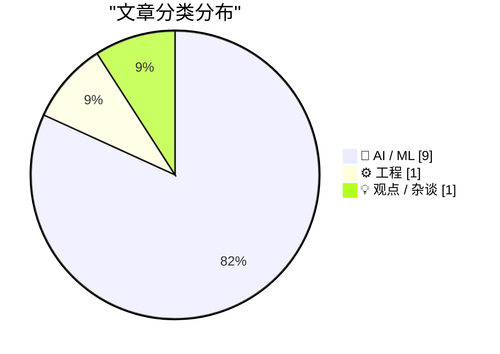
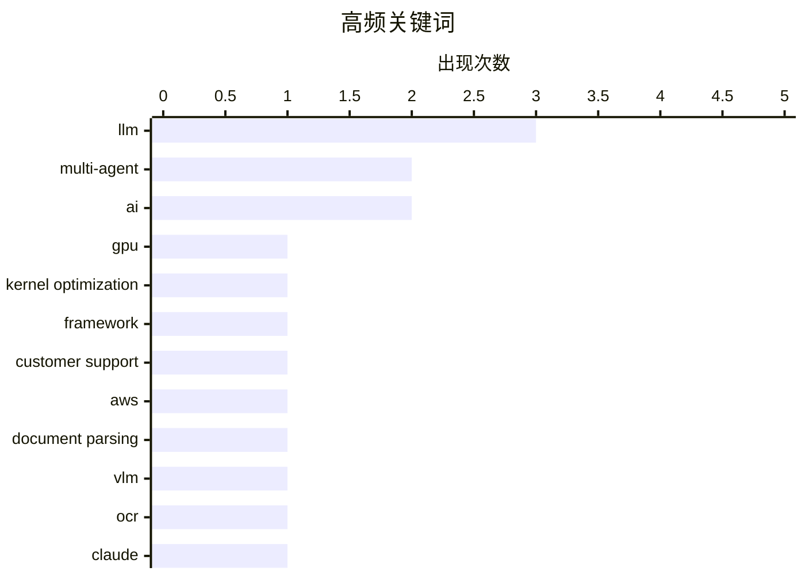

# 📰 AI 资讯每日精选 — 2026-08-20

> 汇聚 156+ 技术博客、X/Twitter、Hacker News、Reddit、Product Hunt、
> Lobste.rs、ClawFeed 日报及 GitHub Trending，经 AI 评分筛选。
>
> **本期内容**：🏆 今日必读 · 🌐 ClawFeed 日报 · 🔥 GitHub Trending · 📂 分类精选 · 📊 数据概览 · 🎯 项目相关情报 · 🌍 补充视角

## 📝 今日看点

今日技术圈聚焦于多智能体系统的规模化落地，从GPU内核优化到复杂客户支持，智能体协作正从实验走向工程实践；同时，代理式AI的运行时治理与安全边界成为新焦点，强调对工具操作副作用的可控执行。模型竞赛持续白热化，开源模型在性能与价格上双重突围，并推动推理速度实现数倍提升。此外，AI在科学发现中加速渗透，自主蛋白质设计命中率远超行业基准，展现出从工具辅助到自主科研的跃迁潜力。

---

## 🏆 今日必读

🥇 **KernelArc：用于GPU内核优化的多智能体框架**

[KernelArc: A Multi-Agent Framework for GPU Kernel Optimization](https://arxiv.org/abs/2608.17071) — arXiv Multiagent Systems · 21 小时前 · 🤖 AI / ML · **一手来源**

> KernelArc是一个多智能体框架，用于跨异构工作负载的自主GPU内核优化。策略专用智能体并行运行，通过仅结论的共享内存、确定性基准守卫和带平台触发草稿的只读跨智能体状态进行协调。在NVIDIA H100和B200 GPU上使用类别代表性的SOL-ExecBench工作负载进行评估。

💡 **为什么值得读**: 该框架提出了一种新颖的多智能体协作机制，有望提高GPU内核优化的效率和自动化水平，值得关注。

🏷️ multi-agent, GPU, kernel optimization, framework

🥈 **Fanatics Betting and Gaming如何构建多智能体客户支持系统**

[How Fanatics Betting and Gaming built a multi-agent customer support system](https://aws.amazon.com/blogs/machine-learning/how-fanatics-betting-and-gaming-built-a-multi-agent-customer-support-system/) — AWS Machine Learning Blog · 5 小时前 · 🤖 AI / ML · **一手来源**

> Fanatics Betting and Gaming在AWS上构建了一个多智能体客户支持系统，以应对体育博彩的复杂性：州特定规则、实时负责任博彩以及重大体育赛事期间的流量高峰。文章介绍了架构、涉及的AWS服务以及构建多智能体支持解决方案的模式。

💡 **为什么值得读**: 该案例展示了多智能体系统在复杂业务场景中的实际应用，对于构建类似系统的开发者具有参考价值。

🏷️ multi-agent, customer support, AWS

🥉 **NaviDC-OCR：跨数字和相机拍摄文档的文档解析导航**

[NaviDC-OCR: Navigating Document Parsing Across Digital and Camera-Captured Documents](https://arxiv.org/abs/2608.12898) — arXiv Artificial Intelligence · 21 小时前 · 🤖 AI / ML · **一手来源**

> 文档解析旨在将非结构化文档转换为结构化且机器可读的表示。视觉语言模型（VLM）的最新进展显著推进了文档解析，但现有方法仍面临两大挑战：解耦的基于VLM的方法严重依赖准确的布局分析，其中相机拍摄文档的几何失真可能引入级联错误；以及第二个挑战（摘要截断）。

💡 **为什么值得读**: 该研究针对文档解析中的关键挑战提出了解决方案，对于处理相机拍摄文档的应用具有实际意义。

🏷️ document parsing, VLM, OCR

4️⃣ **Anthropic称任何实验室现在都可以让语言模型代理运行整个蛋白质设计流程**

[Anthropic says any lab can now let a language model agent run the whole protein design stack](https://the-decoder.com/anthropic-says-any-lab-can-now-let-a-language-model-agent-run-the-whole-protein-design-stack/) — The Decoder · 12 小时前 · 🤖 AI / ML · **二手来源**

> Anthropic让Claude模型自主设计小蛋白质，这些蛋白质能对接体内的目标结构，这是早期药物开发的关键步骤。命中率高达35%，远高于行业平均的10%至15%。Claude仅操控现有的专业工具，独立审查尚待进行。

💡 **为什么值得读**: 该成果展示了语言模型在蛋白质设计中的潜力，命中率显著提升，对药物研发领域具有启示意义。

🏷️ Claude, protein design, Anthropic, AI

5️⃣ **GLM-5.3登顶开放模型排行榜并以价格优势击败对手，但发布推迟**

[GLM-5.3 tops the open-model rankings and undercuts rivals on price, but its release is delayed](https://the-decoder.com/glm-5-3-tops-the-open-model-rankings-and-undercuts-rivals-on-price-but-its-release-is-delayed/) — The Decoder · 11 小时前 · 🤖 AI / ML · **可追溯二手**

> 中国初创公司Z.ai的AI模型GLM-5.3在Artificial Analysis Intelligence Index上获得60分，与Kimi K3并列开放模型榜首，比之前的GLM-5.2高出7分。但该模型的发布被推迟。

💡 **为什么值得读**: 该模型在开放模型排行榜上表现突出，且价格有竞争力，值得关注其后续发布。

🏷️ GLM-5.3, open model, ranking, AI

---

## 🌐 ClawFeed 日报精选

> 来源：[ClawFeed](https://clawfeed.kevinhe.io) — AI 驱动的多源新闻聚合

# ClawFeed Daily Digest | 2026-08-18 (Mon)

> 覆盖 3 个 4h 周期 (00:00-11:59 SGT) · feed 89 条 · bookmarks 19 · 聚合自 digest #1020 #1021 #1022

---

## 🔥 当日 Top 5

1. **CFTC + CME AI 算力期货征求意见，10 月 5 日上线两个合约** — AI 算力正式进入金融衍生品市场，30-60 天审查期可能推迟。算力从基础设施变成可交易金融资产。(×2 档出现)

2. **黄仁勋：AI 瓶颈从 GPU 转向土地、电力和数据中心** — NVIDIA 联合 SB Energy 在俄亥俄锁定超大型 AI 基础设施项目，复制此前在晶圆/先进封装/HBM 上提前锁定供应链的打法。AI infra 竞争从算力层下沉到物理层。

3. **Anthropic Claude Code 系统提示词削减约 80%** — 工程师分享为 Claude 5 编写 system prompt / skills / CLAUDE.md 的新规则，harness 工程进入"做减法"阶段。(×2 档出现)

4. **美国电影协会与字节跳动签署 MOU，为 AI 视频设 IP 保护护栏** — 好莱坞与中国 AI 巨头之间首个正式知识产权协议，可能成为行业模板。

5. **Jane Street SEC 披露持有超 $9.9 亿美元比特币 ETF** — 华尔街做市巨头的大规模 BTC 配置，机构采纳加速的又一信号。

---

## 📰 核心主题

### AI 基础设施金融化与物理化
算力期货 (CFTC/CME)、GPU→土地/电力/数据中心 (黄仁勋/SB Energy)、核能创业数据集更新 — AI 竞争从模型层下沉到物理资源层，从技术竞赛变成资本和供应链竞赛。

### AI Agent 生态走向成熟
- Cloudflare `@cloudflare/computer`：给 Agent 配云端虚拟电脑，毫秒级启动
- Claude Code 系统提示词精简 80%：harness 工程做减法
- Matrix Agent "公司 OS" 架构：多 agent 长期协作
- GBrain 自动生成 SOUL.md + 70 个 agent skills
- 56,804 个公开 agent skills 争夺 ~100 个可靠触发位

### Crypto 监管与机构化
- Austin Campbell 解读财政部新规：Coinbase 可能不得不下架 Tether
- Jane Street $9.9 亿 BTC ETF 持仓
- Fireblocks 聘前 SEC 代理主席担任政策主管
- Bitcoin 期货 OI 超日成交量创历史新高，流动性风险

### 跨模型竞争与协作
- GPT Daybreak (Sol) 底层 tool call 调用 Claude Sonnet 5 — OpenAI 产品调用竞品模型
- 豆包客户端大改版：工作任务优先，体验类 Codex，整合飞书
- OpenAI 分享 GPT-5.6 构建低成本 agent 的经验

### 一人公司 / 独立开发者
- wanman.ai 开源：AI agent 团队辅助从零创办一人公司
- Anyway 全球收款：无需公司主体即可面向全球收款
- 腾讯云轻量服务器 $10/年

---

## 🔖 Bookmarks 精选 (去重)

| 来源 | 内容 |
|------|------|
| @AndrewYNg | AI Engineering Skills Map — 基于 10,000+ 招聘需求拆解四大能力块 |
| @xiaohu | Cloudflare @cloudflare/computer — Agent 云端虚拟电脑 |
| @trq212 | Claude Code 系统提示词削减 80% 实操经验 |
| 讲座 | "Claude for Finance" — 量化 AI 领域最值得看的免费 1 小时 |
| Matrix | Agent "公司 OS" 架构深度解析 |
| Chormex | GPT-Realtime-2 实时音频翻译 (YouTube/直播/会议) |
| @turingou | wanman.ai 开源 — AI 一人公司 + Codex 设计师 agent |
| @mntruell | Cursor CEO：AI 软件开发第三纪元 |
| @levie ×3 | Era of Context / Enterprise Software / Capability Overhang 系列 |
| Garry Tan | Demis Hassabis 做客 YC，展示 Google Gemma 创业项目 |

---

## 👀 推荐关注

本日 3 个 4h 周期均报告 followingProfiles 24/24 成功，未发现符合推荐关注标准的新账号。

---

## 💤 重复噪音模式

| 模式 | 出现频率 |
|------|----------|
| Crypto shill / pump 推广 ($onlymarms, $ALIGN, HTX 客服) | ×3 档 |
| 纯行情感叹 ("牛走别来"/"今天弱势收盘") | ×2 档 |
| 个人鸡汤 / 人生感悟 | ×2 档 |
| 纯图帖 / 空内容帖 | ×2 档 |
| 段子 / meme (deepfake, cat vs dog coin, 保安, 历史) | ×1 档 |

---

*Generated from 4h digests #1020, #1021, #1022 (00:00-11:59 SGT). 12:00-23:59 期间的 digest 尚未生成。*---

## 🔥 GitHub Trending

> 今日热门开源项目（全语言 + Python）

| # | 项目 | 描述 | ⭐ 总星 | 📈 今日 | 语言 |
|---|------|------|---------|---------|------|
| 1 | [harry0703/MoneyPrinterTurbo](https://github.com/harry0703/MoneyPrinterTurbo) 🤖 | 利用 AI 大模型和自动化工作流，根据主题或关键词一键生成高清短视频。Generate HD short vide... | 110.8k | +2221 | Python |
| 2 | [mattpocock/skills](https://github.com/mattpocock/skills) | Skills for Real Engineers. Straight from my .agents direc... | 223.9k | +1894 | Shell |
| 3 | [amadeusprotocol/node](https://github.com/amadeusprotocol/node) |  | 4.6k | +1397 | Rust |
| 4 | [volcengine/OpenViking](https://github.com/volcengine/OpenViking) 🤖 | Self-evolving Context Database for AI Agents. Unify Agent... | 30.2k | +804 | Python |
| 5 | [chaitanyagiri/munder-difflin](https://github.com/chaitanyagiri/munder-difflin) 🤖 | local multi-agent harness | 2.7k | +795 | TypeScript |
| 6 | [mukul975/Anthropic-Cybersecurity-Skills](https://github.com/mukul975/Anthropic-Cybersecurity-Skills) 🤖 | 817 structured cybersecurity skills for AI agents · Mappe... | 29.9k | +766 | Python |
| 7 | [usestrix/strix](https://github.com/usestrix/strix) 🤖 | Open-source AI penetration testing tool to find and fix y... | 55.7k | +593 | Python |
| 8 | [NousResearch/hermes-agent](https://github.com/NousResearch/hermes-agent) 🤖 | The agent that grows with you | 233.1k | +558 | Python |
| 9 | [obra/superpowers](https://github.com/obra/superpowers) | An agentic skills framework & software development method... | 274.3k | +557 | Shell |
| 10 | [jundot/omlx](https://github.com/jundot/omlx) 🤖 | LLM inference server with continuous batching & SSD cachi... | 19.9k | +472 | Python |
| 11 | [Graphify-Labs/graphify](https://github.com/Graphify-Labs/graphify) 🤖 | Turn any codebase, with its docs, SQL schemas, configs, a... | 108.4k | +470 | Python |
| 12 | [genlayerlabs/genlayer-project-boilerplate](https://github.com/genlayerlabs/genlayer-project-boilerplate) |  | 16.2k | +430 | TypeScript |
| 13 | [santifer/career-ops](https://github.com/santifer/career-ops) 🤖 | Open-source AI job search: scan job portals, evaluate lis... | 65.8k | +198 | JavaScript |
| 14 | [DrewThomasson/ebook2audiobook](https://github.com/DrewThomasson/ebook2audiobook) | Generate audiobooks from e-books, voice cloning & 1158+ l... | 19.9k | +141 | Python |
| 15 | [mvanhorn/last30days-skill](https://github.com/mvanhorn/last30days-skill) 🤖 | AI agent skill that researches any topic across Reddit, X... | 58.7k | +129 | Python |

---

## 🤖 AI / ML

### 1. KernelArc：用于GPU内核优化的多智能体框架

[KernelArc: A Multi-Agent Framework for GPU Kernel Optimization](https://arxiv.org/abs/2608.17071) — **arXiv Multiagent Systems** · 21 小时前 · ⭐ 25/30 · **一手来源**

> KernelArc是一个多智能体框架，用于跨异构工作负载的自主GPU内核优化。策略专用智能体并行运行，通过仅结论的共享内存、确定性基准守卫和带平台触发草稿的只读跨智能体状态进行协调。在NVIDIA H100和B200 GPU上使用类别代表性的SOL-ExecBench工作负载进行评估。

🏷️ multi-agent, GPU, kernel optimization, framework

---

### 2. Fanatics Betting and Gaming如何构建多智能体客户支持系统

[How Fanatics Betting and Gaming built a multi-agent customer support system](https://aws.amazon.com/blogs/machine-learning/how-fanatics-betting-and-gaming-built-a-multi-agent-customer-support-system/) — **AWS Machine Learning Blog** · 5 小时前 · ⭐ 22/30 · **一手来源**

> Fanatics Betting and Gaming在AWS上构建了一个多智能体客户支持系统，以应对体育博彩的复杂性：州特定规则、实时负责任博彩以及重大体育赛事期间的流量高峰。文章介绍了架构、涉及的AWS服务以及构建多智能体支持解决方案的模式。

🏷️ multi-agent, customer support, AWS

---

### 3. NaviDC-OCR：跨数字和相机拍摄文档的文档解析导航

[NaviDC-OCR: Navigating Document Parsing Across Digital and Camera-Captured Documents](https://arxiv.org/abs/2608.12898) — **arXiv Artificial Intelligence** · 21 小时前 · ⭐ 21/30 · **一手来源**

> 文档解析旨在将非结构化文档转换为结构化且机器可读的表示。视觉语言模型（VLM）的最新进展显著推进了文档解析，但现有方法仍面临两大挑战：解耦的基于VLM的方法严重依赖准确的布局分析，其中相机拍摄文档的几何失真可能引入级联错误；以及第二个挑战（摘要截断）。

🏷️ document parsing, VLM, OCR

---

### 4. Anthropic称任何实验室现在都可以让语言模型代理运行整个蛋白质设计流程

[Anthropic says any lab can now let a language model agent run the whole protein design stack](https://the-decoder.com/anthropic-says-any-lab-can-now-let-a-language-model-agent-run-the-whole-protein-design-stack/) — **The Decoder** · 12 小时前 · ⭐ 26/30 · **二手来源**

> Anthropic让Claude模型自主设计小蛋白质，这些蛋白质能对接体内的目标结构，这是早期药物开发的关键步骤。命中率高达35%，远高于行业平均的10%至15%。Claude仅操控现有的专业工具，独立审查尚待进行。

🏷️ Claude, protein design, Anthropic, AI

---

### 5. GLM-5.3登顶开放模型排行榜并以价格优势击败对手，但发布推迟

[GLM-5.3 tops the open-model rankings and undercuts rivals on price, but its release is delayed](https://the-decoder.com/glm-5-3-tops-the-open-model-rankings-and-undercuts-rivals-on-price-but-its-release-is-delayed/) — **The Decoder** · 11 小时前 · ⭐ 25/30 · **可追溯二手**

> 中国初创公司Z.ai的AI模型GLM-5.3在Artificial Analysis Intelligence Index上获得60分，与Kimi K3并列开放模型榜首，比之前的GLM-5.2高出7分。但该模型的发布被推迟。

🏷️ GLM-5.3, open model, ranking, AI

---

### 6. 代理式AI的运行时治理：具有可信来源和故障关闭执行的动作边界控制

[Runtime Governance for Agentic AI: Action-Boundary Control with Trusted Provenance and Fail-Closed Execution](https://arxiv.org/abs/2608.16891) — **arXiv Artificial Intelligence** · 21 小时前 · ⭐ 25/30 · **一手来源**

> 代理式AI系统请求的工具操作可能修改文件、发送消息、启动作业或更改工作流状态，这使安全问题从有害文本生成转向有害操作副作用。提示级治理可以塑造模型行为，但不能创建执行边界。我们引入了Aegis，一个运行时治理系统，将模型输出视为动作提议，并通过可信决策层进行调解。

🏷️ agentic AI, governance, safety, provenance

---

### 7. Data-DPO：用于LLM后训练中目标模型数据选择的直接偏好优化

[Data-DPO: Direct Preference Optimization for Target Model Data Selection in LLM Post-Training](https://arxiv.org/abs/2608.16926) — **arXiv Machine Learning** · 21 小时前 · ⭐ 25/30 · **一手来源**

> 监督微调中的数据选择旨在从大规模候选数据中选择一小部分有效样本，以降低训练成本同时保持模型性能。然而，现有方法通常将数据价值视为相对静态的属性，并且很少关注数据与目标模型能力分布之间的兼容性。为了解决这个问题，我们提出了Data-DPO，一种面向目标模型的SFT数据选择方法。

🏷️ LLM, data selection, DPO

---

### 8. Agentic ESOpt：以最低GPU要求微调长视野LLM代理

[Agentic ESOpt: Fine-Tuning Long-Horizon LLM Agents with Minimal GPU Requirements](https://arxiv.org/abs/2608.17310) — **arXiv Machine Learning** · 21 小时前 · ⭐ 25/30 · **一手来源**

> 强化学习（RL）在单轮LLM微调中显示出潜力，但长视野代理推理引入了越来越多的分支交互和稀疏奖励，暴露了RL的几个局限性：其基于反向传播的重型训练栈使得微调更大的LLM不切实际，而更长的轨迹使RL中的信用分配更加困难。本文认为进化策略（ES）...

🏷️ LLM, agent, fine-tuning

---

### 9. 为前沿模型提供零数据保留

[Offering Zero Data Retention for frontier models](https://openai.com/index/offering-zero-data-retention-for-frontier-models) — **OpenAI News** · 6 小时前 · ⭐ 23/30 · **一手来源**

> OpenAI重申对符合条件的API客户提供零数据保留，并预览了私有安全处理，以在不损害数据隐私的情况下实现高级AI安全。

🏷️ OpenAI, data privacy, zero data retention, AI safety

---

## ⚙️ 工程

### 10. DFlash2将Qwen 3.8 27B速度提升高达4倍

[DFlash2 speeds Qwen 3.8 27B up to 4 times](https://www.reddit.com/r/LocalLLaMA/comments/1vsuaoj/dflash2_speeds_qwen_38_27b_up_to_4_times/) — **r/LocalLLaMA** · 7 小时前 · ⭐ 25/30

> llama.cpp的DFlash2实现将Qwen 3.8 27B模型的速度提升了高达4倍。

🏷️ DFlash2, Qwen, inference, optimization

---

## 💡 观点 / 杂谈

### 11. 引用 Jeremy Morrell

[Quoting Jeremy Morrell](https://simonwillison.net/2026/Aug/19/jeremy-morrell/) — **simonwillison.net** · 2 小时前 · ⭐ 23/30

> 文章提出了一个假设：在网络上存在可扩展软件的新机遇。LLM 大幅降低了扩展的编写成本，现代沙箱原语降低了部署成本并提供了良好的安全边界。我们可以将应用构建为坚实的、可问责的核心，并通过 LLM 填补缺失部分，让用户安全地扩展其功能。

🏷️ LLM, extensible software, extensions

---

## 📊 数据概览

| 扫描源 | 抓取文章 | 时间范围 | 精选 |
|:---:|:---:|:---:|:---:|
| 108/156 | 6116 篇 → 1023 篇 | 24h | **11 篇** |

### 分类分布



### 高频关键词



<details>
<summary>📈 纯文本关键词图（终端友好）</summary>

```
llm                 │ ████████████████████ 3
multi-agent         │ █████████████░░░░░░░ 2
ai                  │ █████████████░░░░░░░ 2
gpu                 │ ███████░░░░░░░░░░░░░ 1
kernel optimization │ ███████░░░░░░░░░░░░░ 1
framework           │ ███████░░░░░░░░░░░░░ 1
customer support    │ ███████░░░░░░░░░░░░░ 1
aws                 │ ███████░░░░░░░░░░░░░ 1
document parsing    │ ███████░░░░░░░░░░░░░ 1
vlm                 │ ███████░░░░░░░░░░░░░ 1
```

</details>

### 🏷️ 话题标签

**llm**(3) · **multi-agent**(2) · **ai**(2) · gpu(1) · kernel optimization(1) · framework(1) · customer support(1) · aws(1) · document parsing(1) · vlm(1) · ocr(1) · claude(1) · protein design(1) · anthropic(1) · glm-5.3(1) · open model(1) · ranking(1) · agentic ai(1) · governance(1) · safety(1)

---

## 🎯 项目相关情报

### Agent 基座安全与合规

> 暂无达到质量门槛的项目相关情报。

### 多 Agent 架构

#### [KernelArc：用于GPU内核优化的多智能体框架](https://arxiv.org/abs/2608.17071)

> **状态**：本期 Top 11 已收录

- **匹配类型**：直接相关
- **项目相关性**：9/10
- **可落地性**：8/10
- **为什么相关**：提出KernelArc多智能体框架，用于GPU内核优化，直接研究多智能体架构与协作。
- **建议动作**：深入阅读框架设计，借鉴其多智能体分工与并行协作机制。
- **来源**：arXiv Multiagent Systems · 一手来源

#### [Fanatics Betting and Gaming如何构建多智能体客户支持系统](https://aws.amazon.com/blogs/machine-learning/how-fanatics-betting-and-gaming-built-a-multi-agent-customer-support-system/)

> **状态**：本期 Top 11 已收录

- **匹配类型**：直接相关
- **项目相关性**：8/10
- **可落地性**：7/10
- **为什么相关**：文章描述构建多智能体客户支持系统，涉及多智能体协作与编排，直接相关。
- **建议动作**：阅读全文获取架构细节，提取可复用的多智能体协作模式。
- **来源**：AWS Machine Learning Blog · 一手来源

### ASR 与语音助手

> 暂无达到质量门槛的项目相关情报。

### 商品包装 OCR

#### [NaviDC-OCR：跨数字和相机拍摄文档的文档解析导航](https://arxiv.org/abs/2608.12898)

> **状态**：本期 Top 11 已收录

- **匹配类型**：直接相关
- **项目相关性**：8/10
- **可落地性**：7/10
- **为什么相关**：该文研究跨数字与相机拍摄文档的解析，覆盖版面分析与结构化抽取，直接对应商品包装OCR所需的多模态文档理解与结构化提取能力。
- **建议动作**：评估其视觉-语言模型解析管线在包装标签、印刷文字与阅读顺序上的效果，尝试迁移至商品知识库结构化提取。
- **来源**：arXiv Artificial Intelligence · 一手来源

---

## 🌍 补充视角

> Top 11 未覆盖的高质量不同来源，最多 3 条。

### 1. 使用CLI、技能和AI编码代理开发NVIDIA Holoscan应用

[Developing NVIDIA Holoscan Applications with CLI, Skills, and AI Coding Agents](https://developer.nvidia.com/blog/developing-nvidia-holoscan-applications-with-cli-skills-and-ai-coding-agents/) — **NVIDIA Technical Blog** · 3 小时前 · ⚙️ 工程 · ⭐ 22/30

> NVIDIA Holoscan是一个用于在边缘构建实时AI应用的平台，涵盖从医学影像到机器人等领域。HoloHub是其配套的仓库，提供示例和工具。文章介绍了如何利用命令行界面（CLI）、技能（Skills）和AI编码代理来开发Holoscan应用，以提高开发效率。具体包括使用CLI快速创建项目、利用技能库复用代码，以及通过AI编码代理自动生成和调试代码。这些方法旨在简化开发流程，降低开发门槛，使开发者能够更专注于应用逻辑。文章还展示了相关工具的实际应用场景和效果。

💡 **补充价值**：对于希望快速上手Holoscan或提升开发效率的开发者，本文提供了实用的工具和方法，值得一读。

---

*生成于 2026-08-20 01:49 | 汇聚 156 个技术博客、X/Twitter、Hacker News、Reddit、Product Hunt、Lobste.rs、ClawFeed 日报及 GitHub Trending，经 AI 评分筛选出 Top 11 精华内容，另附 1 条不同来源补充视角*
