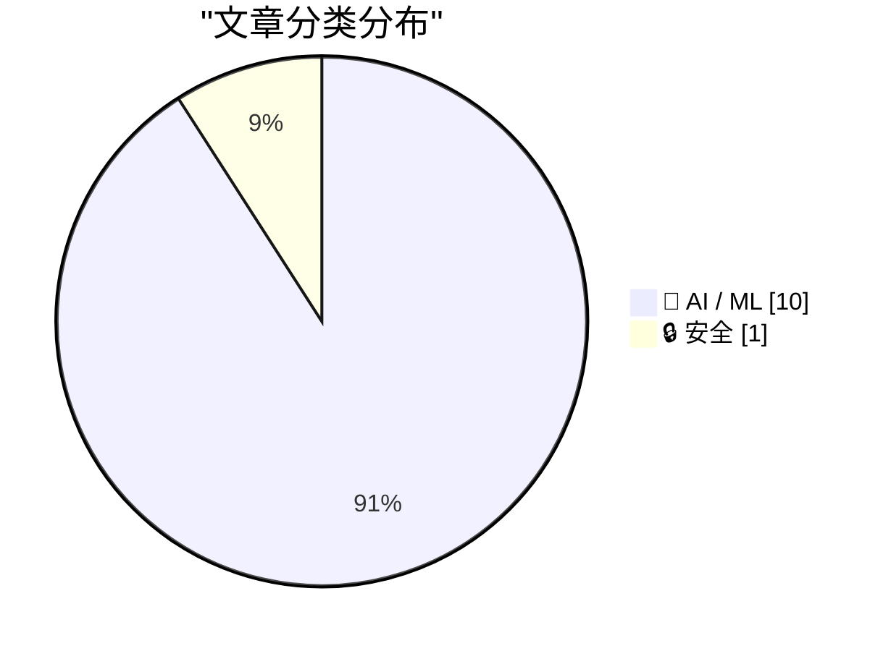
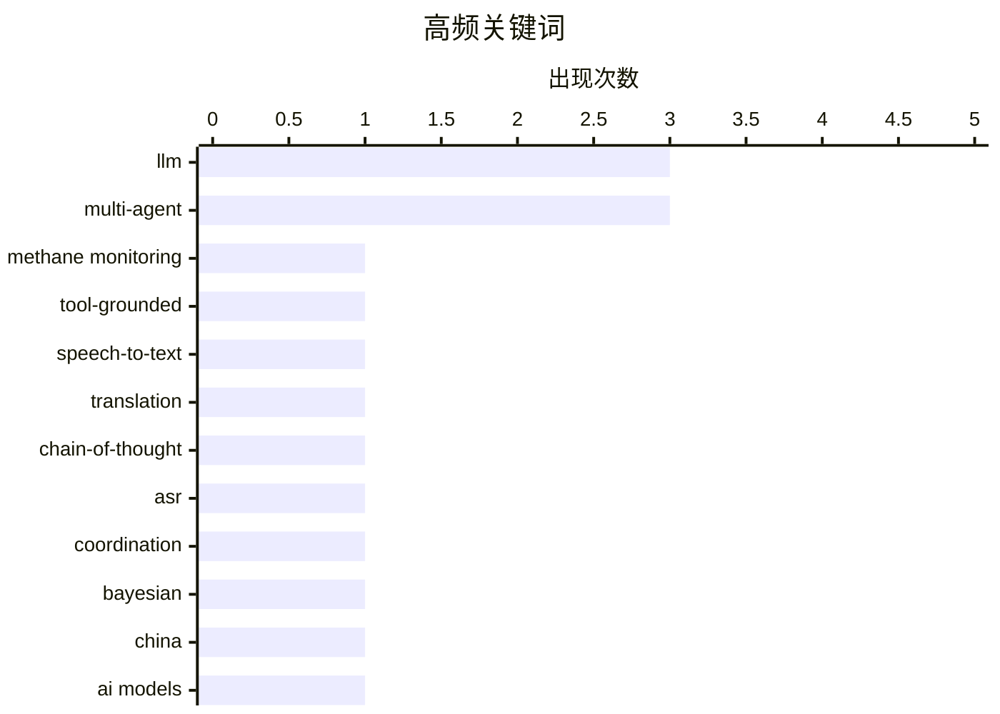

# 📰 AI 资讯每日精选 — 2026-08-21

> 汇聚 156+ 技术博客、X/Twitter、Hacker News、Reddit、Product Hunt、
> Lobste.rs、ClawFeed 日报及 GitHub Trending，经 AI 评分筛选。
>
> **本期内容**：🏆 今日必读 · 🌐 ClawFeed 日报 · 🔥 GitHub Trending · 📂 分类精选 · 📊 数据概览 · 🎯 项目相关情报 · 🌍 补充视角

## 📝 今日看点

今日技术圈聚焦三大主线：多智能体LLM系统从概念走向工程化，研究重点转向自适应协作、预测性调度与复杂任务分解；模型能力竞赛进入新阶段，中国开源模型逼近西方顶尖水平，头部实验室则通过内部更强者保持优势，同时小参数模型在实体追踪等专项任务上展现超预期表现；AI与实体产业加速融合，生成式推荐、数据中心节能及设备端实时生成成为落地热点，而安全风险同步引发关注。

---

## 🏆 今日必读

🥇 **本地可部署的基于工具的多智能体LLM框架用于自动化甲烷排放分析与报告**

[A Locally Deployable Tool-Grounded LLM Multi-agent Framework for Automating Methane Emission Analysis and Reporting](https://arxiv.org/abs/2608.18473) — arXiv Multiagent Systems · 21 小时前 · 🤖 AI / ML · **一手来源**

> 甲烷现场监测需要整合采样设计、气象解释、传感器处理、羽流分析、可视化和报告，但这些步骤通常分散在多个专家驱动的工作流程中。该研究开发了一个本地可部署的、基于工具的LLM多智能体框架，用于低成本甲烷传感和现场监测活动。该框架利用LLM智能体作为工作流协调器，自动化数据处理和报告生成。该框架旨在提高监测效率并减少人工干预。

💡 **为什么值得读**: 该框架提供了一种自动化甲烷监测的端到端解决方案，对于环境监测领域的研究者和从业者具有实用价值。

🏷️ LLM, multi-agent, methane monitoring, tool-grounded

🥈 **听还是读？评估思维链语音到文本翻译中的语音意识**

[Listening or Reading? Evaluating Speech Awareness in Chain-of-Thought Speech-to-Text Translation](https://arxiv.org/abs/2510.03115) — arXiv Computation and Language · 21 小时前 · 🤖 AI / ML · **一手来源**

> 语音到文本翻译（S2TT）系统通常由自动语音识别（ASR）和文本到文本翻译（T2TT）模块组成，面临错误传播和无法利用韵律或其他声学线索两大限制。最近引入了思维链（CoT）提示，期望通过同时访问语音和转录来克服这些问题。通过归因方法、鲁棒性分析等对CoT进行分析，研究评估了模型是否真正利用语音信息。

💡 **为什么值得读**: 该研究深入探讨了CoT在语音翻译中的作用，对于改进S2TT系统设计具有重要参考价值。

🏷️ speech-to-text, translation, chain-of-thought, ASR

🥉 **贝叶斯伙伴建模实现LLM协调中的自适应重规划**

[Bayesian Partner Modelling enables Adaptive Replanning for LLM Coordination](https://arxiv.org/abs/2608.18490) — arXiv Multiagent Systems · 21 小时前 · 🤖 AI / ML · **一手来源**

> 多智能体LLM系统在与策略中途变化的新队友协作时常常遇到困难。由于智能体执行多步或时间上扩展的技能，它们经常在公开证据显示伙伴已改变技能后仍继续执行过时计划。现有方法要么将伙伴跟踪视为被动上下文，使智能体意识到变化但行动迟缓，要么不加区分地重新规划。该研究提出了一种贝叶斯伙伴建模方法，使智能体能够自适应地重新规划。

💡 **为什么值得读**: 该研究解决了多智能体协作中的关键挑战，提出的方法有望显著提升LLM系统的适应性和协作效率。

🏷️ LLM, multi-agent, coordination, Bayesian

4️⃣ **前沿雷达#4：中国已迎头赶上，西方AI领先优势还剩什么？**

[Frontier Radar #4: China has caught up, so what's left of the Western AI lead?](https://the-decoder.com/frontier-radar-4-china-has-caught-up-so-whats-left-of-the-western-ai-lead/) — The Decoder · 11 小时前 · 🤖 AI / ML · **二手来源**

> Kimi K3和GLM-5.3等中国模型已接近美国最佳模型的水平。西方实验室归咎于蒸馏，且有真实证据支持。但无论是否有罪，结论都一样：模型领先无法防御。本刊探讨了哪些方面可以保持优势。

💡 **为什么值得读**: 文章深入分析了中美AI竞争态势，对于理解全球AI格局和战略规划具有重要参考价值。

🏷️ China, AI models, distillation

5️⃣ **生成式推荐器如何重新定义大规模推荐系统**

[How Generative Recommenders Are Redefining RecSys at Scale](https://developer.nvidia.com/blog/how-generative-recommenders-are-redefining-recsys-at-scale/) — NVIDIA Technical Blog · 9 小时前 · 🤖 AI / ML

> 推荐系统是消费互联网行业中最普遍的机器学习问题之一，但训练难度极大。NVIDIA技术博客探讨了生成式推荐器如何通过将推荐任务建模为序列生成问题来应对大规模挑战。文章介绍了生成式推荐器的核心思想，即利用Transformer等架构直接生成用户的下一个交互项，而非传统的评分或检索方法。这种方法能够统一处理多种推荐目标，并简化系统架构。文章还讨论了生成式推荐器在训练和推理效率上的优化，以及如何利用GPU加速实现大规模部署。最终，作者认为生成式推荐器有望成为下一代推荐系统的基础范式，但需解决实际应用中的工程挑战。

💡 **为什么值得读**: 了解生成式推荐器这一前沿方向，以及NVIDIA在GPU加速方面的实践，对推荐系统从业者具有重要参考价值。

🏷️ recommender systems, generative, scale

---

## 🌐 ClawFeed 日报精选

> 来源：[ClawFeed](https://clawfeed.kevinhe.io) — AI 驱动的多源新闻聚合

# ClawFeed Daily Digest | 2026-08-20 (Wed)

> 覆盖 5 个 4h 周期 (00:00-19:59 SGT) · feed ~130 条 · bookmarks ~19 · 聚合自 digest #1024 #1025 #1026 #1027 #1028
> X 登录恢复后首个完整采集日（此前因 session 过期停摆约 36 小时）。

---

## 🔥 当日 Top 5

1. **Stripe 以超 80 亿美元收购 OpenRouter — 支付巨头吞并 AI 模型路由层** — Stripe 史上最大规模收购。"Stripe 管美元流动，OpenRouter 管 Token 流动"——AI 经济的支付网络与智能网络正式合并。有人已在做"OpenRouter for agent tools"（treg.to），模型路由之后是工具路由，agent 中间件层快速成形。(×2 档出现)

2. **Moderna/默沙东 mRNA 个性化癌症疫苗三期临床积极结果，Moderna 股价暴涨 100%** — 路线：取出肿瘤组织 → AI 筛选 ~20 个抗原 → 编码 mRNA 注射回去训练 T 细胞。mRNA + AI 在肿瘤免疫治疗的里程碑事件，多位大 V 称之为"智能与解题的黄金时代"。(×2 档出现)

3. **Etched 完成 7 亿美元融资，估值翻倍至 210 亿美元** — Jane Street 领投，已交付首个推理机架，约 15% 员工来自 Nvidia。Transformer 专用推理芯片赛道热度飙升，与 CoreWeave 用 ~25 个季度做到 AWS 第 40 季才达到的 $2.6B 单季收入形成呼应——AI 算力基础设施增速正在压缩云计算 20 年的增长曲线。

4. **Unitree 上市开盘近 $66B — 机器人赛道标志性定价事件** — 2021 年 Hyundai 以 $1.1B 收购 Boston Dynamics，如今 Unitree 开盘估值是上轮 VC 的 35 倍、IPO 价的 7 倍。同日，Generalist AI 发布机器人基础模型 GEN-1.5，首次将 One-shot In-context Learning 大规模搬进物理世界——演示一遍即可学会新任务，被称为机器人领域的"GPT-3 时刻"。世界机器人大会首日同期举行。

5. **Coinbase 宣布面向 AI Agent 开放加密现货和衍生品交易 API** — 下一步将开放 Tokenized Equities。Agent 金融基础设施加速落地，与 Stripe/OpenRouter 合并形成"Agent 经济栈"雏形。

---

## 📰 核心主题

### Agent 基础设施大整合
Stripe/OpenRouter ($8B+) 是今日最大信号——AI infra 的分发层正在被金融巨头吞并。同日还有：Coinbase Agent 交易 API、Cloudflare 给每个 Agent 配虚拟电脑（@cloudflare/computer，毫秒级启动）、腾讯开源 teamai-cli（Git 驱动的团队 AI 协作基础设施）、TrueForge 开源 agent harness。Agent 工具链从"各自为战"走向"标准化中间件"。

### AI 模型竞争白热化
- Grok 4.6 登陆 Amazon Bedrock — xAI 首次进入 AWS 生态，与 Claude/Llama 同台
- Qwen 3.8 27B 声称超越 Opus 4.8 和 GPT-5.6 Terra，可笔记本离线运行
- DeepSeek-V4-Flash 免费上线 48 小时，Token 吞吐 2200 亿，达 OpenRouter ~20% 流量
- Replit + OpenAI Free Mode（GPT-5.6 Luna 驱动）——"Agent 让软件变便宜，但让写代码变贵"
- Claude 设计蛋白质结合物命中率 22%-35%（行业平均 10%-15%），Opus 5 仅凭两句提示 23 分钟完成 NMR 和 LC-MS 分析

### AI × 生物医药加速
癌症 mRNA 疫苗三期积极 + Claude 蛋白质设计超行业均值 — AI 在湿实验室的落地速度明显加快。

### 机器人产业起飞
Unitree $66B IPO + GEN-1.5 one-shot 机器人基础模型 + 世界机器人大会"从秀技术到拼落地" — 估值和技术同步到达拐点。

### Claude Code / Harness 工程
Claude Code 团队将内置 claude-api Skill 从 200k+ tokens 压缩到 ~25k（Progressive Disclosure 实战），系统 prompt 精简约 80%。Claude Code Skills 最佳实践：放入 GitHub repo → Plugin → 团队 auto-update 安装。Dosu 推出 Drop Day：从 agent session 历史中自动提取团队知识。

---

## 🔖 Bookmarks 精选（去重）

- **@AndrewYNg** AI Engineering 最重要技能地图 — AI 工程师技能树全景图
- **@xiaohu** Cloudflare @cloudflare/computer — 给每个 Agent 配云端虚拟电脑
- **@trq212** Anthropic 精简 Claude Code 系统 prompt ~80% — system prompt / skills / CLAUDE.md 写法经验
- **@Av1dlive** Anthropic Claude for Finance 讲座 — "quant AI 目前最值得看的免费 1 小时"
- **@BruceGuai** Matrix Agent 公司架构详解 — 不是一个 Agent 而是长期运行的 Agent 公司 OS
- **@turingou** wanman.ai 开源 — 一人公司 AI 平台，第 14 款 vibe 产品
- **@gdb + @arrakis_ai** GPT-Realtime-2 实时翻译 — Chormex 集成，YouTube/直播/会议全场景
- **@demishassabis** DeepMind CEO 拜访 @garrytan (YC)，推广 @googlegemma 生态

---

## 👀 推荐关注汇总（去重）

- **@turingou** — wanman.ai 创始人，14 个 vibe 产品，AI agent 一人公司理念，building in public
- **@vmg** — 深度工程博客作者（git 基础设施/分布式系统），高质量低频
- **@askalphaxiv** — AlphaXiv 团队，把学术论文变成可消费的 feed 格式
- **@runinfrai** (YC F26) — 自动优化推理的 inference 平台
- **@_LuoFuli** (Fuli Luo) — 现在在小米 MiMo，此前 DeepSeek，中国 LLM 训练研究者

⚠️ 以上未通过浏览器逐一核实是否已关注，Kevin 操作前请先在 Following 里搜一下。

---

## 💤 当日重复噪音模式

- **Crypto 短线情绪帖**：@Bitwux, @Xeer, @AirdropFarid, @Eth527 等，偏交易情绪/行情预测，信噪比低
- **纯 token/ICO 推广**：@rtk17025 stockcoin 推广、LINERA/$LNRA 注册链接帖
- **Binance 营销/公告**：bStocks 七夕帖、ICX/SCRT/STORJ 下架公告、Binance Inside 系列软广
- **Grok Bot 营销**：重复相似内容出现 2 次
- **纯社交/情绪/不相关**：@MsMistySOL 纯社交、@rosarioborgesi 足球/健身、@RaminNasibov 空推文、棒球博彩
- **Chrome 稳定性影响采样**：多个周期 followingSample profile 因 page crash 无法加载（20/24 失败），影响关注/取关建议质量
---

## 🔥 GitHub Trending

> 今日热门开源项目（全语言 + Python）

| # | 项目 | 描述 | ⭐ 总星 | 📈 今日 | 语言 |
|---|------|------|---------|---------|------|
| 1 | [harry0703/MoneyPrinterTurbo](https://github.com/harry0703/MoneyPrinterTurbo) 🤖 | 利用 AI 大模型和自动化工作流，根据主题或关键词一键生成高清短视频。Generate HD short vide... | 113.0k | +2761 | Python |
| 2 | [mattpocock/skills](https://github.com/mattpocock/skills) | Skills for Real Engineers. Straight from my .agents direc... | 226.6k | +2192 | Shell |
| 3 | [AprilNEA/OpenLogi](https://github.com/AprilNEA/OpenLogi) | ⚡️A native, local-first alternative to Logitech Options+,... | 11.9k | +1545 | Rust |
| 4 | [volcengine/OpenViking](https://github.com/volcengine/OpenViking) 🤖 | Self-evolving Context Database for AI Agents. Unify Agent... | 31.1k | +950 | Python |
| 5 | [santifer/career-ops](https://github.com/santifer/career-ops) 🤖 | Open-source AI job search: scan job portals, evaluate lis... | 66.7k | +816 | JavaScript |
| 6 | [obra/superpowers](https://github.com/obra/superpowers) | An agentic skills framework & software development method... | 275.0k | +727 | Shell |
| 7 | [mahlernim/google-timeline-visualizer](https://github.com/mahlernim/google-timeline-visualizer) | Visualize your year in travel using your Google Location ... | 1.6k | +657 | Kotlin |
| 8 | [mukul975/Anthropic-Cybersecurity-Skills](https://github.com/mukul975/Anthropic-Cybersecurity-Skills) 🤖 | 817 structured cybersecurity skills for AI agents · Mappe... | 30.4k | +632 | Python |
| 9 | [marceloprates/prettymaps](https://github.com/marceloprates/prettymaps) | Draw pretty maps from OpenStreetMap data! Built with osmn... | 13.5k | +551 | Python |
| 10 | [usestrix/strix](https://github.com/usestrix/strix) 🤖 | Open-source AI penetration testing tool to find and fix y... | 56.2k | +532 | Python |
| 11 | [chaitanyagiri/munder-difflin](https://github.com/chaitanyagiri/munder-difflin) 🤖 | local multi-agent harness | 3.1k | +507 | TypeScript |
| 12 | [cursor/plugins](https://github.com/cursor/plugins) | Cursor plugin specification and official plugins | 4.1k | +449 | TypeScript |
| 13 | [akitaonrails/ai-memory](https://github.com/akitaonrails/ai-memory) 🤖 | Solution for long term memory for agent coding CLIs and t... | 3.6k | +332 | Rust |
| 14 | [jundot/omlx](https://github.com/jundot/omlx) 🤖 | LLM inference server with continuous batching & SSD cachi... | 20.1k | +332 | Python |
| 15 | [modular/modular](https://github.com/modular/modular) | The Modular Platform (includes MAX & Mojo) | 28.0k | +268 | Mojo |

---

## 🤖 AI / ML

### 1. 本地可部署的基于工具的多智能体LLM框架用于自动化甲烷排放分析与报告

[A Locally Deployable Tool-Grounded LLM Multi-agent Framework for Automating Methane Emission Analysis and Reporting](https://arxiv.org/abs/2608.18473) — **arXiv Multiagent Systems** · 21 小时前 · ⭐ 22/30 · **一手来源**

> 甲烷现场监测需要整合采样设计、气象解释、传感器处理、羽流分析、可视化和报告，但这些步骤通常分散在多个专家驱动的工作流程中。该研究开发了一个本地可部署的、基于工具的LLM多智能体框架，用于低成本甲烷传感和现场监测活动。该框架利用LLM智能体作为工作流协调器，自动化数据处理和报告生成。该框架旨在提高监测效率并减少人工干预。

🏷️ LLM, multi-agent, methane monitoring, tool-grounded

---

### 2. 听还是读？评估思维链语音到文本翻译中的语音意识

[Listening or Reading? Evaluating Speech Awareness in Chain-of-Thought Speech-to-Text Translation](https://arxiv.org/abs/2510.03115) — **arXiv Computation and Language** · 21 小时前 · ⭐ 23/30 · **一手来源**

> 语音到文本翻译（S2TT）系统通常由自动语音识别（ASR）和文本到文本翻译（T2TT）模块组成，面临错误传播和无法利用韵律或其他声学线索两大限制。最近引入了思维链（CoT）提示，期望通过同时访问语音和转录来克服这些问题。通过归因方法、鲁棒性分析等对CoT进行分析，研究评估了模型是否真正利用语音信息。

🏷️ speech-to-text, translation, chain-of-thought, ASR

---

### 3. 贝叶斯伙伴建模实现LLM协调中的自适应重规划

[Bayesian Partner Modelling enables Adaptive Replanning for LLM Coordination](https://arxiv.org/abs/2608.18490) — **arXiv Multiagent Systems** · 21 小时前 · ⭐ 22/30 · **一手来源**

> 多智能体LLM系统在与策略中途变化的新队友协作时常常遇到困难。由于智能体执行多步或时间上扩展的技能，它们经常在公开证据显示伙伴已改变技能后仍继续执行过时计划。现有方法要么将伙伴跟踪视为被动上下文，使智能体意识到变化但行动迟缓，要么不加区分地重新规划。该研究提出了一种贝叶斯伙伴建模方法，使智能体能够自适应地重新规划。

🏷️ LLM, multi-agent, coordination, Bayesian

---

### 4. 前沿雷达#4：中国已迎头赶上，西方AI领先优势还剩什么？

[Frontier Radar #4: China has caught up, so what's left of the Western AI lead?](https://the-decoder.com/frontier-radar-4-china-has-caught-up-so-whats-left-of-the-western-ai-lead/) — **The Decoder** · 11 小时前 · ⭐ 26/30 · **二手来源**

> Kimi K3和GLM-5.3等中国模型已接近美国最佳模型的水平。西方实验室归咎于蒸馏，且有真实证据支持。但无论是否有罪，结论都一样：模型领先无法防御。本刊探讨了哪些方面可以保持优势。

🏷️ China, AI models, distillation

---

### 5. 生成式推荐器如何重新定义大规模推荐系统

[How Generative Recommenders Are Redefining RecSys at Scale](https://developer.nvidia.com/blog/how-generative-recommenders-are-redefining-recsys-at-scale/) — **NVIDIA Technical Blog** · 9 小时前 · ⭐ 25/30

> 推荐系统是消费互联网行业中最普遍的机器学习问题之一，但训练难度极大。NVIDIA技术博客探讨了生成式推荐器如何通过将推荐任务建模为序列生成问题来应对大规模挑战。文章介绍了生成式推荐器的核心思想，即利用Transformer等架构直接生成用户的下一个交互项，而非传统的评分或检索方法。这种方法能够统一处理多种推荐目标，并简化系统架构。文章还讨论了生成式推荐器在训练和推理效率上的优化，以及如何利用GPU加速实现大规模部署。最终，作者认为生成式推荐器有望成为下一代推荐系统的基础范式，但需解决实际应用中的工程挑战。

🏷️ recommender systems, generative, scale

---

### 6. Anthropic最强大的模型（代号“Model 2”）仅供内部使用

[Anthropic's most capable model, codenamed "Model 2," is for internal use only](https://the-decoder.com/anthropic-uses-an-unpublished-ai-model-called-model-2-internally/) — **The Decoder** · 15 小时前 · ⭐ 25/30 · **二手来源**

> Anthropic内部使用一个未发布的AI模型，该模型比任何公开可用的Claude版本都更强大。该模型代号为“Model 2”，仅供内部使用。

🏷️ Anthropic, internal model, Claude

---

### 7. Show HN：我训练了一个125M模型在设备上自动完成钢琴演奏

[Show HN: I trained a 125M model to autocomplete piano on-device](https://simedw.com/2026/08/20/midi-autocomplete/) — **Hacker News Best** · 13 小时前 · ⭐ 24/30

> 作者训练了一个125M参数的Transformer模型，用于实时自动完成钢琴演奏（在iPhone 15上约108音符/秒）。该模型类似于GitHub Copilot或Tabnine，但通过MIDI钢琴输入音符来提示模型，然后模型在设备上继续演奏。该应用免费提供。

🏷️ transformer, music generation, on-device

---

### 8. 基于LLM的预测性决策用于可持续数据中心运营

[LLM-Powered Predictive Decision-Making for Sustainable Data Center Operations](https://arxiv.org/abs/2608.18503) — **arXiv Machine Learning** · 21 小时前 · ⭐ 24/30 · **一手来源**

> AI驱动工作负载（尤其是LLM）的需求增长引发了对数据中心能源和资源消耗的担忧。该工作介绍了一种基于LLM的预测性调度系统，旨在提高运营效率并减少环境影响。系统利用LLM预测执行时间和能耗等关键指标，从而优化调度决策。

🏷️ LLM, data center, scheduling, sustainability

---

### 9. 实体追踪在低于十亿参数的语言模型中出现，并在自然叙事中超过人类表现

[Entity tracking emerges in sub-billion parameter language models and exceeds human performance in naturalistic narratives](https://arxiv.org/abs/2608.18083) — **arXiv Computation and Language** · 21 小时前 · ⭐ 24/30 · **一手来源**

> 理解语言需要跨话语追踪实体，即知道事物在哪里以及如何变化，即使没有明确说明。现有评估依赖于人工任务，远离自然语言理解，且缺乏与人类的比较。该研究在语言模型和人类中评估实体追踪，发现实体追踪在低于十亿参数的语言模型中出现，并在自然叙事中超过人类表现。

🏷️ entity tracking, language models, human performance

---

### 10. 扩展代理式AI：避免供应商锁定的企业模式

[Scaling agentic AI: Enterprise patterns without vendor lock-in](https://aws.amazon.com/blogs/machine-learning/scaling-agentic-ai-enterprise-patterns-without-vendor-lock-in/) — **AWS Machine Learning Blog** · 9 小时前 · ⭐ 22/30 · **一手来源**

> 本文探讨了企业在多框架、多模型、多提供商的环境中扩展代理式AI系统时，如何保持灵活性并避免供应商锁定。文章提出了让这些系统协同扩展的原则，并强调了在混合环境中运营多个代理式AI系统的关键考虑。作者认为，采用开放标准和模块化设计是实现企业级扩展的核心。

🏷️ agentic AI, multi-agent, enterprise, vendor lock-in

---

## 🔒 安全

### 11. 粗糙的界面是安全责任

[A Sloppy Interface Is a Security Liability ](https://blog.jim-nielsen.com/2026/sloppy-ui-is-security-liability/) — **blog.jim-nielsen.com** · 6 小时前 · ⭐ 24/30

> 在Feross Aboukhadijeh的演讲“为什么AI正在破坏我们所知的安全”中，他讨论了Axios npm事件，并指出维护者因屈服于伪造的Microsoft Teams界面而受到钓鱼攻击。文章强调粗糙的界面设计可能成为安全漏洞，容易被攻击者利用。

🏷️ AI, security, software

---

## 📊 数据概览

| 扫描源 | 抓取文章 | 时间范围 | 精选 |
|:---:|:---:|:---:|:---:|
| 107/156 | 6018 篇 → 954 篇 | 24h | **11 篇** |

### 分类分布



### 高频关键词



<details>
<summary>📈 纯文本关键词图（终端友好）</summary>

```
llm                │ ████████████████████ 3
multi-agent        │ ████████████████████ 3
methane monitoring │ ███████░░░░░░░░░░░░░ 1
tool-grounded      │ ███████░░░░░░░░░░░░░ 1
speech-to-text     │ ███████░░░░░░░░░░░░░ 1
translation        │ ███████░░░░░░░░░░░░░ 1
chain-of-thought   │ ███████░░░░░░░░░░░░░ 1
asr                │ ███████░░░░░░░░░░░░░ 1
coordination       │ ███████░░░░░░░░░░░░░ 1
bayesian           │ ███████░░░░░░░░░░░░░ 1
```

</details>

### 🏷️ 话题标签

**llm**(3) · **multi-agent**(3) · **methane monitoring**(1) · tool-grounded(1) · speech-to-text(1) · translation(1) · chain-of-thought(1) · asr(1) · coordination(1) · bayesian(1) · china(1) · ai models(1) · distillation(1) · recommender systems(1) · generative(1) · scale(1) · anthropic(1) · internal model(1) · claude(1) · ai(1)

---

## 🎯 项目相关情报

### Agent 基座安全与合规

> 暂无达到质量门槛的项目相关情报。

### 多 Agent 架构

#### [本地可部署的基于工具的多智能体LLM框架用于自动化甲烷排放分析与报告](https://arxiv.org/abs/2608.18473)

> **状态**：本期 Top 11 已收录

- **匹配类型**：直接相关
- **项目相关性**：9/10
- **可落地性**：8/10
- **为什么相关**：提出了一个工具接地的多智能体框架，用于甲烷排放分析报告，覆盖多步骤任务编排。
- **建议动作**：参考其本地部署与工具集成设计，优化多智能体任务流程。
- **来源**：arXiv Multiagent Systems · 一手来源

#### [贝叶斯伙伴建模实现LLM协调中的自适应重规划](https://arxiv.org/abs/2608.18490)

> **状态**：本期 Top 11 已收录

- **匹配类型**：直接相关
- **项目相关性**：8/10
- **可落地性**：7/10
- **为什么相关**：研究多智能体 LLM 协作中的自适应重规划，通过贝叶斯伙伴建模提升协调能力。
- **建议动作**：可借鉴其协作模型，用于多智能体对话或任务规划。
- **来源**：arXiv Multiagent Systems · 一手来源

### ASR 与语音助手

#### [听还是读？评估思维链语音到文本翻译中的语音意识](https://arxiv.org/abs/2510.03115)

> **状态**：本期 Top 11 已收录

- **匹配类型**：直接相关
- **项目相关性**：8/10
- **可落地性**：7/10
- **为什么相关**：研究 ASR 与 T2TT 级联的语音翻译中的语音感知，评估 CoT 对转写质量的影响。
- **建议动作**：可借鉴其评估方法，用于语音助手 ASR 转写质量测试。
- **来源**：arXiv Computation and Language · 一手来源

### 商品包装 OCR

> 暂无达到质量门槛的项目相关情报。

---

## 🌍 补充视角

> Top 11 未覆盖的高质量不同来源，最多 3 条。

### 1. OpenAI 推出 AI Futures 博客

[Introducing AI Futures](https://openai.com/index/introducing-ai-futures) — **OpenAI News** · 18 小时前 · 💡 观点 / 杂谈 · ⭐ 21/30 · **一手来源**

> OpenAI 宣布推出新博客 AI Futures，旨在探讨变革性 AI 如何重塑权力、治理、经济和个人自由。该博客将作为平台，讨论 AI 对社会的深远影响。文章强调 AI 的潜在影响范围广泛，涉及多个关键领域。目前博客刚刚推出，具体内容尚未公布。

💡 **补充价值**：关注 AI 社会影响的读者值得关注，这是 OpenAI 官方对 AI 未来影响的直接发声。

### 2. 如果这是真的，超大规模云厂商就完了

[If this is true, the hyperscalers are toast](https://klementoninvesting.substack.com/p/if-this-is-true-the-hyperscalers) — **Lobste.rs** · 14 小时前 · 🤖 AI / ML · ⭐ 23/30

> 文章提出 AI 的未来不在于大型语言模型（LLM），而在于小型语言模型（SLM）。这一观点若成立，将对依赖大规模算力的超大规模云厂商构成重大威胁。文章可能基于 SLM 在效率、成本或性能上的优势，认为其将颠覆现有 AI 格局。但具体论据和证据未在摘要中提供。

💡 **补充价值**：对 AI 技术路线和云市场格局感兴趣的读者，这篇文章提供了一个颠覆性的观点，值得深入探讨。

### 3. 多元主义：真正的认识论危机（2026年8月20日）

[Pluralistic: The actual epistemic crisis (20 Aug 2026)](https://pluralistic.net/2026/08/20/epistemic-void/) — **pluralistic.net** · 2 小时前 · 💡 观点 / 杂谈 · ⭐ 22/30

> 文章指出 AI 对现实的冲击是一种机会性感染，而非根本原因，真正的危机在于认识论层面。作者认为 AI 加剧了信息环境的混乱，但根源在于社会对事实和知识的信任体系已经脆弱。文章还包含其他链接和作者动态，但核心观点是 AI 的负面影响是乘虚而入。

💡 **补充价值**：这篇文章提供了对 AI 社会影响的独特视角，强调认识论危机，适合关注技术与社会关系的读者。

---

*生成于 2026-08-21 01:55 | 汇聚 156 个技术博客、X/Twitter、Hacker News、Reddit、Product Hunt、Lobste.rs、ClawFeed 日报及 GitHub Trending，经 AI 评分筛选出 Top 11 精华内容，另附 3 条不同来源补充视角*
