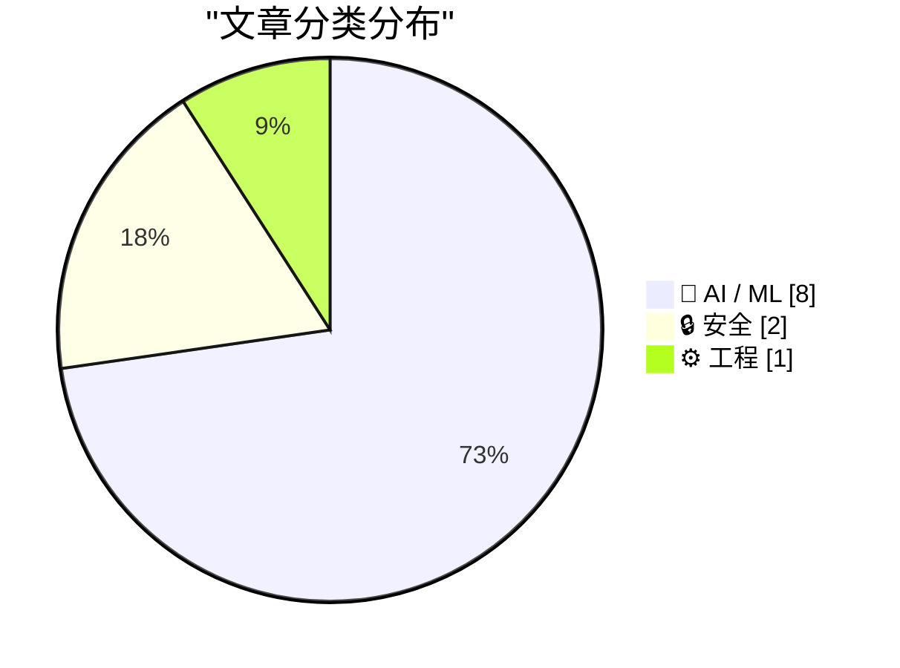
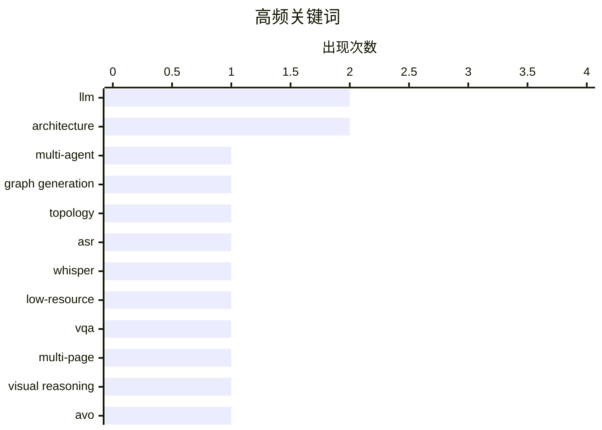

# 📰 AI 资讯每日精选 — 2026-08-22

> 汇聚 156+ 技术博客、X/Twitter、Hacker News、Reddit、Product Hunt、
> Lobste.rs、ClawFeed 日报及 GitHub Trending，经 AI 评分筛选。
>
> **本期内容**：🏆 今日必读 · 🌐 ClawFeed 日报 · 🔥 GitHub Trending · 📂 分类精选 · 📊 数据概览 · 🎯 项目相关情报 · 🌍 补充视角

## 📝 今日看点

今日技术圈聚焦AI系统效率与通用智能体的边界突破：英伟达通过收购和软硬件协同优化（如DSX MaxLPS）强调每瓦性能，其AVO架构在ARC-AGI-3上实现满分，凸显系统级设计的重要性。多模态与视觉推理成为竞争焦点，DeepSeek发布实验性视觉模型，文档VQA的粗到细交互推理方案也崭露头角。与此同时，安全与伦理议题同步升温，恶意智能体技能检测基准的推出及对LLM心理健康应用的系统综述，反映出技术落地的审慎考量。

---

## 🏆 今日必读

🥇 **奖励引导的自回归图生成用于高效多智能体通信拓扑设计**

[Reward-Guided Autoregressive Graph Generation for Efficient Multi-Agent Communication Topology Design](https://arxiv.org/abs/2608.20099) — arXiv Multiagent Systems · 21 小时前 · 🤖 AI / ML · **一手来源**

> 基于LLM的多智能体系统（MAS）在复杂推理任务上表现强劲，但消耗大量token。现有自动拓扑设计方法ARG-Designer将问题重构为自回归图生成，但其训练目标未显式鼓励生成稀疏高效的拓扑。本文提出奖励引导的方法，在训练中引入奖励信号以优化拓扑的稀疏性和效率。实验表明，该方法在保持任务性能的同时显著降低token消耗。

💡 **为什么值得读**: 对于关注多智能体系统效率的研究者，本文提供了一种通过奖励引导优化通信拓扑的新思路，有望大幅降低推理成本。

🏷️ LLM, multi-agent, graph generation, topology

🥈 **米佐语自动语音识别语音语料库：Whisper和SraVaani 1.0微调及形态感知评估**

[A Speech Corpus for Mizo Automatic Speech Recognition: Whisper and SraVaani 1.0 Fine-Tuning with Morphology-Aware Evaluation](https://arxiv.org/abs/2608.19361) — arXiv Computation and Language · 21 小时前 · 🤖 AI / ML · **一手来源**

> 本文报告了低资源语言米佐语的自动语音识别（ASR）系统开发，包括收集17.62小时语音数据、整理数据，并使用三个Whisper多语言模型和SraVaani 1.0印度多语言模型进行微调。Whisper-large-v3取得了最低的传统词错误率（WER）18.08%，而形态感知评估的WER为7.22%。零样本设置下的性能也有报告。

💡 **为什么值得读**: 该研究为低资源语言的ASR提供了宝贵的数据集和微调经验，特别是形态感知评估方法为其他形态丰富语言提供了参考。

🏷️ ASR, Whisper, low-resource

🥉 **Doc-V*：多页文档VQA的粗到细交互式视觉推理**

[Doc-V*:Coarse-to-Fine Interactive Visual Reasoning for Multi-Page Document VQA](https://arxiv.org/abs/2604.13731) — arXiv Computation and Language · 21 小时前 · 🤖 AI / ML · **一手来源**

> 多页文档视觉问答需要对长且视觉密集的文档进行语义、布局和视觉元素的推理。现有无OCR方法在容量和精度之间存在权衡：端到端模型随文档长度扩展性差，而基于视觉检索的流程脆弱且被动。本文提出Doc-V*，一个无OCR的智能体框架，将多页DocVQA建模为顺序证据收集过程。该方法通过粗到细的交互式推理，在多个基准上取得了先进性能。

💡 **为什么值得读**: 对于文档理解领域，Doc-V*提供了一种新的无OCR智能体方案，有效解决了长文档推理的扩展性问题，值得关注。

🏷️ VQA, multi-page, visual reasoning

4️⃣ **NVIDIA AVO在ARC-AGI-3上达到100%，展示面向长时程自主智能体的前沿级通用架构**

[NVIDIA AVO Reaches 100% on ARC-AGI-3, Demonstrating a Frontier-Level General-Purpose Architecture for Long-Horizon Autonomous Agents](https://developer.nvidia.com/blog/nvidia-avo-reaches-100-on-arc-agi-3-demonstrating-a-frontier-level-general-purpose-architecture-for-long-horizon-autonomous-agents/) — NVIDIA Technical Blog · 12 小时前 · 🤖 AI / ML

> NVIDIA博客宣布其AVO系统在ARC-AGI-3基准上达到100%的准确率，展示了面向长时程自主智能体的前沿级通用架构。文章强调，前沿语言模型只是AI智能体的一个组件，周围的智能体系统（通常称为harness）决定了模型如何接收信息、规划行动和与环境交互。AVO的成功表明，精心设计的智能体框架可以显著提升模型在复杂任务上的表现。

💡 **为什么值得读**: 该结果证明了智能体架构设计的重要性，对于AI智能体研究和应用具有启发意义。

🏷️ AVO, ARC-AGI-3, autonomous agents, architecture

5️⃣ **DeepSeek发布实验性Flash视觉模型，在智能体基准上媲美Opus 4.8**

[Deepseek releases experimental Flash vision model that rivals Opus 4.8 on agent benchmarks](https://the-decoder.com/deepseek-releases-experimental-flash-vision-model-that-rivals-opus-4-8-on-agent-benchmarks/) — The Decoder · 6 小时前 · 🤖 AI / ML · **二手来源**

> DeepSeek发布了V4-Flash-Vision-Exp，一个实验性多模态模型，为V4-Flash的文本能力添加了图像理解。在DeepSeek自家的多模态智能体基准上，该模型接近Opus 4.8，有时甚至超越。文章报道了这一发布，但未提供独立验证。

💡 **为什么值得读**: 该模型展示了多模态能力在智能体任务上的潜力，对于关注多模态模型和智能体应用的人士值得一读。

🏷️ Deepseek, multimodal, vision, agent

---

## 🌐 ClawFeed 日报精选

> 来源：[ClawFeed](https://clawfeed.kevinhe.io) — AI 驱动的多源新闻聚合

# ClawFeed Daily Digest | 2026-08-21 (Thu)

> 覆盖 4 个 4h 周期 (04:00-19:59 SGT) · feed ~117 条 · bookmarks ~19 · 聚合自 digest #1031 #1032 #1033 #1034
> 注：00:00-03:59 周期因 Chrome CDP 超时 + X session 过期跳过（Chrome 健康检查改进后已恢复）。

---

## 🔥 当日 Top 5

1. **X 正在谈判用 USDC 稳定币直接支付创作者** — 取消旧收入分成计划，推出新支付框架。Crypto 支付与社交平台的深度整合信号，可能影响整个 Creator Economy 支付基础设施。

2. **BTC 突破 $75,000，链上/交易所/ETF 三指标全面转多** — 链上活跃地址、交易所突破量、ETF 净流入同时转多。Arthur Hayes 称"没有 AI 模型就不会做这些交易"——AI 改变了顶级交易者的工作方式。白宫 Crypto Summit 持续发酵。

3. **OpenAI 增速实际已超 Anthropic** — Ramp Q3 数据：环比增长 82% vs 76%。GPT-5.6 Sol 成为更多开发者选择，Fable 5 因价格和数据保护受限。Codex 税务试点处理 7000 份报税，减少 1/3 准备时间——Agent 走向行业应用。

4. **Stripe/OpenRouter 收购持续发酵 + Binance Agent OS 亮相** — Erik Voorhees 播客讨论"谁真正控制了 AI 路由层"；Binance 推出 Agent OS，可在 Binance 上构建、部署和使用 AI agent；Brian Armstrong 称"是时候让美国成为 crypto 之都"。Agent 经济基础设施加速整合。

5. **MiniMax Design 发布 + Cindy Desktop 集成 iOS Simulator** — MiniMax 推出面向商业视频创作者的 AI Agent 客户端（策划→分镜→生成→剪辑→交付全流程）；Cindy Desktop 让 AI agent 直接操控 iOS 模拟器。Agent 的触达面从浏览器扩展到视频制作和移动端。

---

## 📰 核心主题

### Crypto 监管清晰化 + 市场暴力拉升
白宫 Crypto Summit 后续发酵全天贯穿：BTC 破 $75K、Brian Armstrong 喊话、Erik Voorhees 讨论 DeFi 融入传统金融、X 用 USDC 支付创作者、韩国监管清晰化案例。加密行业从"被监管"到"被整合"的叙事正在形成。Arthur Hayes 验证 AI+交易的融合。

### AI Agent 生态扩张
- Binance Agent OS — 在交易所内构建/部署 agent
- Cindy Desktop + iOS Simulator — agent 操控移动端
- MiniMax Design — agent 串联商业视频全流程
- Grok Bot — 独立远程电脑 + 视频制作能力 + 1 小时官方教程
- Claude Academy 上线 — Anthropic 的 Agent 教育平台
- treg.ai — $0.025 sourced 1000+ KOL
- Remotion skill — agent 制作视频

### Claude Code / Harness 工程
- Claude Academy 正式上线（多周期出现）
- Anthropic 水印不是监控而是溯源标记
- Anthropic discernment-nudge skill — AI 自我质疑工程化
- geekx-skills 合集 — 把工程方法沉淀为 skill（geekx-gate 砍过度设计 + geekx-grilling 问清关键问题）
- Claude Code vs Codex context portability 痛点

### AI 模型竞争
- OpenAI 增速超 Anthropic（Ramp Q3: 82% vs 76%）
- Grok Bot 持续进化（远程电脑、视频制作）
- Ox Alpha 模型生成 Voxel 场景
- 纯文本 agent 通过轻量适配器获得视觉能力

### 科技/工程
- MIT Git 内部机制专题讲座
- Kaito 从按曝光付费转为按真实转化付费
- John Maeda@YC："AGI 时代设计比以往更重要"
- NeoSoul AI $11M Pre-A 融资

---

## 🔖 Bookmarks 精选

本日 bookmarks 与 08-20 完全重叠，无新增。长期置顶：
- **@AndrewYNg** AI Engineering 技能地图
- **@trq212** Anthropic 精简 Claude Code 系统 prompt ~80%
- **@BruceGuai** Matrix Agent 公司架构
- **@Av1dlive** Anthropic Claude for Finance 讲座

---

## 👀 推荐关注汇总（去重）

- **@dani_avila7** — 追踪 Anthropic/Claude Code 内部 skill 动态（discernment-nudge 等）
- **@yacineMTB (kache)** — AI 系统工程实操，反编译/基础设施深度思考
- **@mardehaym** — Limestone Digital 创始人，AI 重建企业系统实战案例
- **@chaumian** — 量化金融 + AI 前沿论文（McKean-Vlasov 控制等）
- **@DougStandley** — AI policy/safety 角度解读 Anthropic 动态
- **@seekjourney** — Claude Code Skill 设计实践者（geekx-skills）
- **@making_cindy** — Cindy Desktop 开发者，Agent + iOS Simulator
- **@itsharmanjot** — 实操型 AI agent 用户，Claude Code/Codex 切换痛点

⚠️ 以上未通过浏览器逐一核实是否已关注，Kevin 操作前请先在 Following 里搜一下。

---

## 💤 当日重复噪音模式

- **@RaminNasibov**：每个 4h 周期 2-3 条，art 词源/品牌设计/城堡/iPod 怀旧/chairs——持续高频低相关
- **Justin Sun 营销**：TRON 增持公告、HTX 安全升级、TRON 嘉年华——纯运营推广
- **Binance 营销**：bStock 股息通知、Agent OS 问答、Clubhouse Bali 活动
- **PKU 非 tech 内容**：意大利面活动、地球温度科普
- **纯社交/meme**：健身帖、goat farmer、standing desk 段子、winrar T恤、佛像构图
- **Chrome profile 加载稳定性**：改进后 4 个周期均 24/24 成功，followingSample 质量恢复正常
---

## 🔥 GitHub Trending

> 今日热门开源项目（全语言 + Python）

| # | 项目 | 描述 | ⭐ 总星 | 📈 今日 | 语言 |
|---|------|------|---------|---------|------|
| 1 | [mattpocock/skills](https://github.com/mattpocock/skills) | Skills for Real Engineers. Straight from my .agents direc... | 229.6k | +3362 | Shell |
| 2 | [AprilNEA/OpenLogi](https://github.com/AprilNEA/OpenLogi) | ⚡️A native, local-first alternative to Logitech Options+,... | 13.0k | +1380 | Rust |
| 3 | [harry0703/MoneyPrinterTurbo](https://github.com/harry0703/MoneyPrinterTurbo) 🤖 | 利用 AI 大模型和自动化工作流，根据主题或关键词一键生成高清短视频。Generate HD short vide... | 114.0k | +1201 | Python |
| 4 | [mahlernim/google-timeline-visualizer](https://github.com/mahlernim/google-timeline-visualizer) | Visualize your year in travel using your Google Location ... | 2.2k | +1053 | Kotlin |
| 5 | [santifer/career-ops](https://github.com/santifer/career-ops) 🤖 | Open-source AI job search: scan job portals, evaluate lis... | 67.5k | +921 | JavaScript |
| 6 | [modular/modular](https://github.com/modular/modular) | The Modular Platform (includes MAX & Mojo) | 28.7k | +913 | Mojo |
| 7 | [obra/superpowers](https://github.com/obra/superpowers) | An agentic skills framework & software development method... | 275.7k | +790 | Shell |
| 8 | [volcengine/OpenViking](https://github.com/volcengine/OpenViking) 🤖 | Self-evolving Context Database for AI Agents. Unify Agent... | 31.7k | +654 | Python |
| 9 | [Tencent/AI-Infra-Guard](https://github.com/Tencent/AI-Infra-Guard) 🤖 | A full-stack AI Red Teaming platform securing AI ecosyste... | 5.3k | +434 | Python |
| 10 | [cursor/plugins](https://github.com/cursor/plugins) | Cursor plugin specification and official plugins | 4.4k | +388 | TypeScript |
| 11 | [affaan-m/ECC](https://github.com/affaan-m/ECC) 🤖 | The agent harness performance optimization system. Skills... | 241.8k | +357 | JavaScript |
| 12 | [PostHog/posthog](https://github.com/PostHog/posthog) 🤖 | 🦔 PostHog is the leading platform for building self-driv... | 38.3k | +335 | Python |
| 13 | [mukul975/Anthropic-Cybersecurity-Skills](https://github.com/mukul975/Anthropic-Cybersecurity-Skills) 🤖 | 817 structured cybersecurity skills for AI agents · Mappe... | 30.5k | +243 | Python |
| 14 | [MadsLorentzen/ai-job-search](https://github.com/MadsLorentzen/ai-job-search) 🤖 | The job search that runs on your machine. AI job applicat... | 32.8k | +223 | Python |
| 15 | [anthropics/claude-code](https://github.com/anthropics/claude-code) 🤖 | Claude Code is an agentic coding tool that lives in your ... | 142.3k | +170 | Python |

---

## 🤖 AI / ML

### 1. 奖励引导的自回归图生成用于高效多智能体通信拓扑设计

[Reward-Guided Autoregressive Graph Generation for Efficient Multi-Agent Communication Topology Design](https://arxiv.org/abs/2608.20099) — **arXiv Multiagent Systems** · 21 小时前 · ⭐ 25/30 · **一手来源**

> 基于LLM的多智能体系统（MAS）在复杂推理任务上表现强劲，但消耗大量token。现有自动拓扑设计方法ARG-Designer将问题重构为自回归图生成，但其训练目标未显式鼓励生成稀疏高效的拓扑。本文提出奖励引导的方法，在训练中引入奖励信号以优化拓扑的稀疏性和效率。实验表明，该方法在保持任务性能的同时显著降低token消耗。

🏷️ LLM, multi-agent, graph generation, topology

---

### 2. 米佐语自动语音识别语音语料库：Whisper和SraVaani 1.0微调及形态感知评估

[A Speech Corpus for Mizo Automatic Speech Recognition: Whisper and SraVaani 1.0 Fine-Tuning with Morphology-Aware Evaluation](https://arxiv.org/abs/2608.19361) — **arXiv Computation and Language** · 21 小时前 · ⭐ 21/30 · **一手来源**

> 本文报告了低资源语言米佐语的自动语音识别（ASR）系统开发，包括收集17.62小时语音数据、整理数据，并使用三个Whisper多语言模型和SraVaani 1.0印度多语言模型进行微调。Whisper-large-v3取得了最低的传统词错误率（WER）18.08%，而形态感知评估的WER为7.22%。零样本设置下的性能也有报告。

🏷️ ASR, Whisper, low-resource

---

### 3. Doc-V*：多页文档VQA的粗到细交互式视觉推理

[Doc-V*:Coarse-to-Fine Interactive Visual Reasoning for Multi-Page Document VQA](https://arxiv.org/abs/2604.13731) — **arXiv Computation and Language** · 21 小时前 · ⭐ 23/30 · **一手来源**

> 多页文档视觉问答需要对长且视觉密集的文档进行语义、布局和视觉元素的推理。现有无OCR方法在容量和精度之间存在权衡：端到端模型随文档长度扩展性差，而基于视觉检索的流程脆弱且被动。本文提出Doc-V*，一个无OCR的智能体框架，将多页DocVQA建模为顺序证据收集过程。该方法通过粗到细的交互式推理，在多个基准上取得了先进性能。

🏷️ VQA, multi-page, visual reasoning

---

### 4. NVIDIA AVO在ARC-AGI-3上达到100%，展示面向长时程自主智能体的前沿级通用架构

[NVIDIA AVO Reaches 100% on ARC-AGI-3, Demonstrating a Frontier-Level General-Purpose Architecture for Long-Horizon Autonomous Agents](https://developer.nvidia.com/blog/nvidia-avo-reaches-100-on-arc-agi-3-demonstrating-a-frontier-level-general-purpose-architecture-for-long-horizon-autonomous-agents/) — **NVIDIA Technical Blog** · 12 小时前 · ⭐ 26/30

> NVIDIA博客宣布其AVO系统在ARC-AGI-3基准上达到100%的准确率，展示了面向长时程自主智能体的前沿级通用架构。文章强调，前沿语言模型只是AI智能体的一个组件，周围的智能体系统（通常称为harness）决定了模型如何接收信息、规划行动和与环境交互。AVO的成功表明，精心设计的智能体框架可以显著提升模型在复杂任务上的表现。

🏷️ AVO, ARC-AGI-3, autonomous agents, architecture

---

### 5. DeepSeek发布实验性Flash视觉模型，在智能体基准上媲美Opus 4.8

[Deepseek releases experimental Flash vision model that rivals Opus 4.8 on agent benchmarks](https://the-decoder.com/deepseek-releases-experimental-flash-vision-model-that-rivals-opus-4-8-on-agent-benchmarks/) — **The Decoder** · 6 小时前 · ⭐ 25/30 · **二手来源**

> DeepSeek发布了V4-Flash-Vision-Exp，一个实验性多模态模型，为V4-Flash的文本能力添加了图像理解。在DeepSeek自家的多模态智能体基准上，该模型接近Opus 4.8，有时甚至超越。文章报道了这一发布，但未提供独立验证。

🏷️ Deepseek, multimodal, vision, agent

---

### 6. 英伟达以60亿美元收购Poolside的“模型工厂”及109名员工

[Nvidia is acquiring Poolside's "Model Factory" and 109 employees for $6 billion](https://the-decoder.com/nvidia-is-acquiring-poolsides-model-factory-and-109-employees-for-6-billion/) — **The Decoder** · 17 小时前 · ⭐ 25/30 · **二手来源**

> 英伟达将支付60亿美元收购初创公司Poolside的“模型工厂”软件，该软件用于构建AI模型，并计划吸纳109名员工。这一收购表明英伟达在AI基础设施领域的进一步扩张。

🏷️ Nvidia, acquisition, AI models, Poolside

---

### 7. 心理健康中的大型语言模型：应用、创新和伦理挑战的系统综述

[Large Language Models in Mental Health: A Systematic Review of Applications, Innovations, and Ethical Challenges](https://arxiv.org/abs/2608.18080) — **arXiv Artificial Intelligence** · 21 小时前 · ⭐ 25/30 · **一手来源**

> 本文系统综述了大型语言模型（LLM）在心理健康领域的应用，包括社交媒体分析、临床对话代理、治疗支持工具、提示工程、多模态学习和伦理考量。研究整合了跨学科研究，利用社交媒体帖子、电子病历和多模态输入等数据源，用于早期检测抑郁症、自杀风险等。综述指出了LLM在心理健康应用中的潜力和挑战。

🏷️ LLM, mental health, review

---

### 8. 非对称注意力头：Transformer注意力的结构化头级上下文分配

[Asymmetric Attention Heads: Structured Head-Wise Context Allocation for Transformer Attention](https://arxiv.org/abs/2608.19203) — **arXiv Computation and Language** · 21 小时前 · ⭐ 25/30 · **一手来源**

> 标准多头注意力（MHA）给每个头相同的完整因果上下文范围，但不同头可能扮演不同上下文角色。本文提出非对称注意力头（AAH），一种头级上下文分配框架，将上下文长度作为显式参数。AAH允许不同头使用不同长度的上下文，以更好地适应其角色。实验表明，AAH在保持性能的同时提高了效率。

🏷️ Transformer, attention, architecture

---

## 🔒 安全

### 9. MaliciousSkillBench：恶意智能体技能检测的综合基准

[MaliciousSkillBench: A Comprehensive Benchmark for Malicious Agent Skill Detection](https://arxiv.org/abs/2608.19901) — **arXiv Cryptography and Security** · 21 小时前 · ⭐ 25/30 · **一手来源**

> 智能体技能通过可重用的指令包扩展LLM智能体，可能包含脚本、资源和服务配置，这为恶意行为提供了直接分发渠道。然而，现有恶意技能数据集在来源、工件格式、证据制度和良性覆盖方面分散，重复和结构相关的内容使直接聚合和评估复杂化。本文提出MaliciousSkillBench，一个综合基准，用于检测恶意智能体技能。

🏷️ LLM agent, malicious skill, benchmark

---

### 10. AI代理栈中的安全定位

[Where Security Fits in an AI Agent Stack](https://developer.nvidia.com/blog/where-security-fits-in-an-ai-agent-stack/) — **NVIDIA Technical Blog** · 12 小时前 · ⭐ 24/30

> 随着AI代理能力增强并执行更长期的任务，在其驱动的应用中构建安全与信任变得日益重要。文章探讨了AI代理栈中安全性的关键位置，指出安全应贯穿代理的整个生命周期，包括输入验证、输出过滤、权限控制、审计日志等。作者提出了一种分层安全架构，将安全机制嵌入代理的各个组件，而非作为事后补救。文章强调，通过将安全设计为代理栈的固有部分，可以降低恶意输入、数据泄露和滥用风险。结论是，安全不是附加功能，而是AI代理可靠部署的基础。

🏷️ AI agents, security, trust

---

## ⚙️ 工程

### 11. 使用NVIDIA DSX MaxLPS最大化AI工厂的每瓦性能

[Maximizing AI Factory Performance per Watt with NVIDIA DSX MaxLPS](https://developer.nvidia.com/blog/maximizing-ai-factory-performance-per-watt-with-nvidia-dsx-maxlps/) — **NVIDIA Technical Blog** · 10 小时前 · ⭐ 24/30

> AI工厂是受功耗限制的工业系统，问题不再是数据中心能容纳多少GPU，而是每个可用瓦特能产生多少AI输出。NVIDIA博客介绍了DSX MaxLPS，一种最大化每瓦性能的解决方案。文章讨论了如何通过优化硬件和软件协同设计，提高AI工厂的能效。

🏷️ AI factory, power efficiency, NVIDIA DSX

---

## 📊 数据概览

| 扫描源 | 抓取文章 | 时间范围 | 精选 |
|:---:|:---:|:---:|:---:|
| 108/156 | 5950 篇 → 874 篇 | 24h | **11 篇** |

### 分类分布



### 高频关键词



<details>
<summary>📈 纯文本关键词图（终端友好）</summary>

```
llm              │ ████████████████████ 2
architecture     │ ████████████████████ 2
multi-agent      │ ██████████░░░░░░░░░░ 1
graph generation │ ██████████░░░░░░░░░░ 1
topology         │ ██████████░░░░░░░░░░ 1
asr              │ ██████████░░░░░░░░░░ 1
whisper          │ ██████████░░░░░░░░░░ 1
low-resource     │ ██████████░░░░░░░░░░ 1
vqa              │ ██████████░░░░░░░░░░ 1
multi-page       │ ██████████░░░░░░░░░░ 1
```

</details>

### 🏷️ 话题标签

**llm**(2) · **architecture**(2) · **multi-agent**(1) · graph generation(1) · topology(1) · asr(1) · whisper(1) · low-resource(1) · vqa(1) · multi-page(1) · visual reasoning(1) · avo(1) · arc-agi-3(1) · autonomous agents(1) · deepseek(1) · multimodal(1) · vision(1) · agent(1) · nvidia(1) · acquisition(1)

---

## 🎯 项目相关情报

### Agent 基座安全与合规

> 暂无达到质量门槛的项目相关情报。

### 多 Agent 架构

#### [奖励引导的自回归图生成用于高效多智能体通信拓扑设计](https://arxiv.org/abs/2608.20099)

> **状态**：本期 Top 11 已收录

- **匹配类型**：直接相关
- **项目相关性**：9/10
- **可落地性**：8/10
- **为什么相关**：文章研究 LLM 多智能体系统的通信拓扑设计，通过自回归图生成优化协调，直接涉及多智能体架构的协作与编排。
- **建议动作**：可提取其拓扑生成方法，用于多智能体任务编排或通信效率优化。
- **来源**：arXiv Multiagent Systems · 一手来源

### ASR 与语音助手

#### [米佐语自动语音识别语音语料库：Whisper和SraVaani 1.0微调及形态感知评估](https://arxiv.org/abs/2608.19361)

> **状态**：本期 Top 11 已收录

- **匹配类型**：直接相关
- **项目相关性**：9/10
- **可落地性**：7/10
- **为什么相关**：本文直接构建低资源 Mizo 语言 ASR 系统，使用 Whisper 和 SraVaani 微调，并采用形态学感知评估，与项目关注的语音识别模型和评测方法高度相关。
- **建议动作**：借鉴低资源 ASR 微调方法和形态学感知评估指标，用于评估语音助手对低资源语言的识别效果。
- **来源**：arXiv Computation and Language · 一手来源

### 商品包装 OCR

#### [Doc-V*：多页文档VQA的粗到细交互式视觉推理](https://arxiv.org/abs/2604.13731)

> **状态**：本期 Top 11 已收录

- **匹配类型**：可迁移参考
- **项目相关性**：7/10
- **可落地性**：6/10
- **为什么相关**：文章提出多页文档 VQA 的粗到细交互式视觉推理方法，虽面向文档，但其版面理解和阅读顺序技术可迁移到商品包装 OCR。
- **建议动作**：评估其交互式推理与版面分析模块，适用于包装文字多页或复杂背景下的结构化提取。
- **来源**：arXiv Computation and Language · 一手来源

---

## 🌍 补充视角

> Top 11 未覆盖的高质量不同来源，最多 3 条。

### 1. 代理数据操作平台（ADOP）：将数据工程压缩至数小时

[Agentic Data Operations Platform (ADOP): Data engineering into hours](https://aws.amazon.com/blogs/machine-learning/agentic-data-operations-platform-adop-data-engineering-into-hours/) — **AWS Machine Learning Blog** · 8 小时前 · 🤖 AI / ML · ⭐ 22/30 · **一手来源**

> ADOP 是 Amazon Bedrock 上的参考架构，利用专门的 AI 代理自动化完整的 Bronze-Silver-Gold 数据管道生命周期，将新数据源的接入时间从数周压缩至数小时，同时保持数据治理和合规控制。该平台通过代理协调数据工程任务，减少人工干预，提升效率。文章强调 ADOP 在保持治理和合规的同时，显著加速数据工程流程。

💡 **补充价值**：对于希望利用 AI 代理加速数据管道建设并保持治理的企业，ADOP 提供了实用的参考架构。

### 2. 从 Atari 到 EVE Online：基于 15 年游戏 AI 研究构建

[From Atari to EVE Online: Building on 15 Years of AI Research in Games](https://deepmind.google/blog/from-atari-to-eve-online-building-on-15-years-of-ai-research-in-games/) — **Google DeepMind Blog** · 13 小时前 · 🤖 AI / ML · ⭐ 24/30

> Google DeepMind 与游戏工作室合作，将 15 年的 AI 研究应用于游戏原型开发，以突破性 AI 游戏玩法为目标。文章回顾了 DeepMind 在游戏 AI 领域的历程，从 Atari 到 EVE Online，展示了 AI 在游戏中的潜力。合作旨在推动 AI 与游戏产业的融合，创造新的游戏体验。

💡 **补充价值**：了解 DeepMind 如何将多年研究转化为实际游戏合作，对游戏开发者和 AI 研究者具有启发意义。

### 3. 我对 Ox Alpha 进行了指纹识别：与 GLM-5.3 相同的分词器（+75 token 偏移），z.ai 的精确错误字符串，近乎相同的 temp-0 输出

[I fingerprinted Ox Alpha: same tokenizer as GLM-5.3 (+75 token offset), z.ai's exact error strings, near-identical temp-0 outputs](https://www.reddit.com/r/singularity/comments/1vufbx1/i_fingerprinted_ox_alpha_same_tokenizer_as_glm53/) — **r/singularity** · 13 小时前 · 🤖 AI / ML · ⭐ 23/30

> 作者对 stealth/ox-alpha 模型进行了三项黑盒指纹测试，与公开的 GLM-5.3 对比。测试发现 Ox Alpha 与 GLM-5.3 使用相同的分词器，且每个文本的 prompt_tokens 恰好多 75 个，表明存在隐藏的系统提示。错误字符串测试中，Ox Alpha 与 z.ai 的 GLM-5.3 错误信息完全一致。temp-0 输出测试显示两者输出近乎相同。这些证据表明 Ox Alpha 可能是 GLM-5.3 的重新包装。

💡 **补充价值**：通过黑盒测试揭示模型身份，对 AI 模型透明性和安全性具有重要参考价值。

---

*生成于 2026-08-22 01:50 | 汇聚 156 个技术博客、X/Twitter、Hacker News、Reddit、Product Hunt、Lobste.rs、ClawFeed 日报及 GitHub Trending，经 AI 评分筛选出 Top 11 精华内容，另附 3 条不同来源补充视角*
