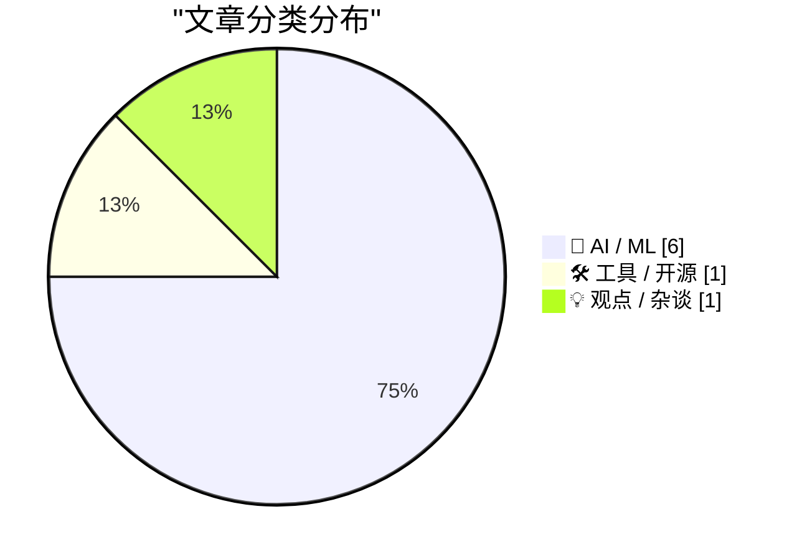
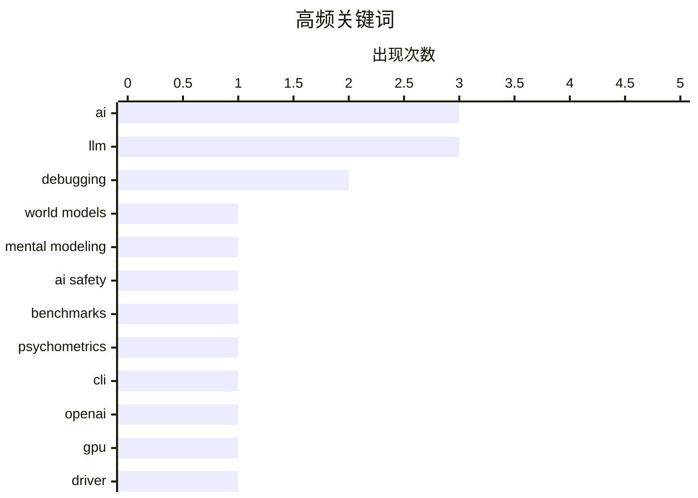

# 📰 AI 资讯每日精选 — 2026-08-23

> 汇聚 156+ 技术博客、X/Twitter、Hacker News、Reddit、Product Hunt、
> Lobste.rs、ClawFeed 日报及 GitHub Trending，经 AI 评分筛选。
>
> **本期内容**：🏆 今日必读 · 🌐 ClawFeed 日报 · 🔥 GitHub Trending · 📂 分类精选 · 📊 数据概览 · 🎯 项目相关情报

## 📝 今日看点

今日技术圈聚焦于AI系统的可信度与实用性：安全基准测试被指存在结构性缺陷，仅靠屏蔽请求就能刷高分，引发对AI安全评估方法的深刻反思。同时，研究者开始超越纯物理模拟，探索将人类信念与意图纳入世界模型，以提升AI对真实行为的预测能力。此外，Linus Torvalds亲测AI调试驱动代码，展现了大模型在复杂排错中的实战价值，但量化压缩和技能库膨胀等问题仍制约着本地模型与代理系统的发挥。

---

## 🏆 今日必读

🥇 **新研究：忽视人类信念的世界模型会预测错误行为**

[World models that ignore human beliefs predict the wrong actions, new research shows](https://the-decoder.com/world-models-that-ignore-human-beliefs-predict-the-wrong-actions-new-research-shows/) — The Decoder · 16 小时前 · 🤖 AI / ML · **二手来源**

> 当前的世界模型如Sora或Genie仅模拟物理规律，忽略了人的思想、需求和感受。新提出的“心理世界建模”框架加入了信念和意图等心理变量。即使使用较弱语言模型，采用该框架也能超越未进行心理建模的更强模型。最大的瓶颈在于预测物理状态和心理状态如何共同变化。

💡 **为什么值得读**: 该研究指出了世界模型发展的关键短板，并提出了改进方向，对AI理解和预测人类行为有重要启示。

🏷️ world models, mental modeling, AI

🥈 **心理学方法揭示AI安全测试的重大缺陷**

[Psychological methods reveal major weaknesses in AI security testing](https://the-decoder.com/psychological-methods-reveal-major-weaknesses-in-ai-security-testing/) — The Decoder · 18 小时前 · 🤖 AI / ML · **二手来源**

> 英国AI安全研究所的研究人员使用心理测量学方法表明，流行的语言模型安全基准并未衡量一致的特质。全面屏蔽请求可以人为地提高安全分数，即使模型在日常使用中变得不那么有用。该研究还提供了一种方法，用于捕捉在测试中比正常使用时更谨慎的模型。

💡 **为什么值得读**: 这项研究揭示了现有AI安全评估的潜在问题，并提出了改进测试的方法，对AI安全领域具有重要价值。

🏷️ AI safety, benchmarks, psychometrics

🥉 **llm 0.33 发布**

[llm 0.33](https://simonwillison.net/2026/Aug/22/llm/) — simonwillison.net · 8 小时前 · 🛠 工具 / 开源

> llm 0.33版本发布，主要亮点包括升级到OpenAI Python库3.x，并将HTTP客户端依赖从httpx切换到httpx2。该版本还包含其他改进和修复。

💡 **为什么值得读**: 对于使用llm工具的用户，了解最新版本的变化有助于升级和优化使用。

🏷️ LLM, CLI, OpenAI

4️⃣ **Linus Torvalds使用AI调试Intel GPU驱动错误**

[Linus Torvalds uses AI to debug an Intel GPU driver bug](https://github.com/torvalds/linux/commit/818bebeb63dd6bf5f4e07e145f6cdbace520a34c) — Lobste.rs · 9 小时前 · 🤖 AI / ML

> Linus Torvalds在调试Intel GPU驱动错误时使用了AI，并称AI在调试过程中提供了巨大帮助，尽管AI多次声称问题无法解决。这一事件展示了AI在复杂调试任务中的潜力。

💡 **为什么值得读**: Linus Torvalds作为Linux创始人，其使用AI调试的经验对开发者具有启发意义。

🏷️ AI, debugging, GPU, driver

5️⃣ **为什么你的本地大语言模型感觉比实际更笨**

[Why your local LLM feels dumber than it is](https://forum.level1techs.com/t/why-your-local-llm-feels-dumber-than-it-is/253917) — Hacker News Best · 7 小时前 · 🤖 AI / ML

> 文章探讨了本地运行的大语言模型（LLM）在性能上感觉不如云端模型的问题。作者指出，本地模型通常使用量化技术以降低资源消耗，但这会导致模型精度下降，从而影响输出质量。此外，本地模型的上下文窗口可能较小，限制了其处理长文本的能力。文章还提到，用户往往使用较旧的硬件运行模型，而云端模型则运行在更强大的GPU上，这也加剧了性能差距。作者认为，通过调整推理参数、使用更高质量的量化方法或升级硬件，可以改善本地模型的体验。最终，作者强调本地模型在隐私和成本方面仍有优势，但用户需要理解其性能限制并合理设置预期。

💡 **为什么值得读**: 这篇文章为本地LLM用户提供了实用的性能优化建议，并解释了性能差异的根本原因，值得一读。

🏷️ LLM, local deployment, user experience

---

## 🌐 ClawFeed 日报精选

> 来源：[ClawFeed](https://clawfeed.kevinhe.io) — AI 驱动的多源新闻聚合

📋 ClawFeed Daily Digest | 2026-08-22 (Fri)

聚合 5 份 4h digest：#1037 (00:00-03:59) · #1038 (04:00-07:59) · #1039 (08:00-11:59) · #1040 (12:00-15:59) · #1041 (16:00-19:59)

素材总计：feed 152 + bookmarks 57 + followingSample 175（profiles 120/120 loaded，0 errored）。

---

🔥 当日全场最重要 5 条

1. **BTC 首次突破 $75,000 三个月来新高** — 本周涨幅约 20%，2024 年 3 月以来最大单周涨幅。Saylor 被迫出售 BTC，"never sell"人设破裂。Jim Cramer 喊"直接买 BTC"（反向指标？）。来源: @laurashin, @Tradermayne, @cryptorover

2. **AI 模型竞赛白热化** — Grok 4.6 登顶 #1（Elon 推荐 Grok Build / Cursor）；GPT-5.6 Sol 降价推进成本前沿；DeepSeek V4-Flash-Vision-Exp 发布（视觉能力接近 Opus 4.8）；Aaron Levie 断言 intelligence 正在变成 "too cheap to meter"，竞争壁垒从模型转向 workflow 和数据。来源: @elonmusk, @spitzbits, @heyshrutimishra, @levie

3. **Agentic AI 进入主流议程** — Berkeley Agentic AI Summit 5,000 现场 + 10 万线上，Steinberger 演讲 "No Doors for Agents"；Anthropic 发布 Claude Code 创业公司指南（15 家高增长初创复盘）；Grok Bot 新增邮件收发能力。来源: @steipete, @xiaohu, @elonmusk

4. **美国贸易/监管大动作** — US 对加拿大部分进口商品加征 50% 关税（即时生效）；CFTC Selig 指示起草加密市场结构备选规则；Paul Graham："阻止美国建数据中心不会减缓 AI 进步，只会减缓美国的 AI 进步。"；远程访问 NVIDIA 芯片也被禁止对中国出口。来源: @Tradermayne, @laurashin, @paulg, @JenksGuo

5. **AI 说服力已超越人类 + Series A 市场失灵** — Brian Roemmele 引研究：AI 说服力超越最强人类说服者；Richard Chen 指出 Series A 热叙事项目以 100-300x 估值融资（Series B 价格买 Seed 风险），非热门 5-7x 增长只拿 10-15x，叙事轮换后 compression 会很痛。来源: @BrianRoemmele, @richardchen39

---

📰 当日核心主题

**🤖 AI Agent 工具链爆发**
Grok Build 1.0.8（并发 subagent 改善）、Grok Bot 邮件能力、Grok Voice Think Fast 2.0 登顶 Speech Arena、OpenAI Codex + Exa 插件（1000 亿+ 网站检索）、Claude Code 创业公司指南、/scandinavian-design skill（86 RT, 2.4K likes）、Anthropic 内部 ELI5 skill、Wake 多 agent 会话统一工具、Frames2LoRA（EMNLP 接收）、DeepSeek V4-Flash-Vision-Exp。AI agent 从单模型能力竞争转向 workflow / skill / 集成层竞争。

**💰 BTC 与加密监管**
BTC $75K 新高 + Saylor 被迫出售 + Uniswap 代币化股票 $10 亿 + 韩国新韩资管 × Solana RWA 试点 + CFTC 备选规则 + Grayscale Zcash ETF 推进 + CME vs CFTC 预测市场操纵冲突 + Binance 员工 UAE 被拘 + Zama Confidential Vault $41M+ TVL。加密市场在价格飙升与监管收紧的双重张力中前进。

**🏗️ 基础设施与地缘**
DeepSeek 效应推动 Hyperscaler 债务可能从 $2880 亿升至 $6590 亿；NVIDIA 芯片远程访问也对中国禁出口；DeepSeek Harness 升级致 8000+ 插件挂掉（生态碎片化）；Paul Graham 数据中心冷判断。

**📱 Claude Code 生态**
Anthropic 创业公司指南、ELI5 skill、/scandinavian-design、Claude Code Concise Output Style 实战、Claude Academy 持续推广、omasnap 截图工具 ~70 PRs（Shopify CEO 维护）。Claude Code 社区进入"skill/workflow 分享"阶段。

---

🔖 Bookmarks 精选

• @AndrewYNg — AI Engineering Skills Map：系统梳理 AI 工程最重要技能的完整版图（420 RT, 22K likes, 5.6M views）。来源: https://x.com/AndrewYNg/status/2088302050706686198
• @trq212 — Anthropic 为 Claude 5 系列移除了 ~80% 的 Claude Code system prompt，详解新一代模型写 system prompt / skills / Claude.MD 的新规则。来源: https://x.com/trq212/status/2080710971228918066

---

👀 推荐关注汇总（去重）

• @DavidOndrej1 — AI agent 工作流重构的深度采访者，$75M exit + AI rebuild 案例。
• @aigclink — 关注 AI agent 工具链集成，Wake 工具解决多 agent 会话统一管理。
• @mardehaym — Limestone Digital 创始人，PE-backed 企业 AI agent 实战，$14M ARR 纯口碑。
• @istdrc — Raft 联合创始人 & CEO，前 Kimi CLI 作者，"Agent swarms 是错误方向"。
• @runinfrai — YC F26 推理平台，Ornith 1.5 35B 216 tok/s，DeepSeek V4 Pro 全精度 1M 上下文。
• @canghe — wesight.ai 创始人，AI 全球化增长 & AI-native Agents / Skills / MCP / 开源。

提醒：未通过浏览器核实是否已关注，**Kevin 操作前请先在 Following 里搜一下**。

---

🧹 建议取关

• @HeXiaobo — 最后一条推 2018-07-21（8 年），Instagram 签到，与 AI/crypto/tech 完全无关。（连续两档提及）
• @0xJasonBateman — 最后一条推 2026-04-10，Spotify/PUBG 链接，无 AI/crypto/tech 内容。（连续两档提及）

---

💤 当日重复噪音模式

• **RaminNasibov** — 跨 5 个周期持续输出空推文、设计作品、人生感悟、AI 调查，信噪比极低。出现频率最高的噪音源。
• **Justin Sun** — 每个周期均有 TRON/BTC/OTC/B.AI 营销或法律案件自卖自夸，纯推广。
• **大学宣传帖** — 清华/北大在多个周期出现校园宣传，非 tech 内容。
• **BNB/Binance 广告** — Binance Agent OS、度假广告、不丹支付、BNB meme 推广，跨周期重复。
• **行情喊单/鸡汤** — 各类 BTC 回调预测、人生感悟、"gn" 打卡，信息量为零。---

## 🔥 GitHub Trending

> 今日热门开源项目（全语言 + Python）

| # | 项目 | 描述 | ⭐ 总星 | 📈 今日 | 语言 |
|---|------|------|---------|---------|------|
| 1 | [mattpocock/skills](https://github.com/mattpocock/skills) | Skills for Real Engineers. Straight from my .agents direc... | 232.1k | +2683 | Shell |
| 2 | [openai/codex](https://github.com/openai/codex) 🤖 | Lightweight coding agent that runs in your terminal | 113.5k | +1544 | Rust |
| 3 | [AprilNEA/OpenLogi](https://github.com/AprilNEA/OpenLogi) | ⚡️A native, local-first alternative to Logitech Options+,... | 14.0k | +959 | Rust |
| 4 | [ripienaar/free-for-dev](https://github.com/ripienaar/free-for-dev) | A list of SaaS, PaaS and IaaS offerings that have free ti... | 133.9k | +829 | HTML |
| 5 | [obra/superpowers](https://github.com/obra/superpowers) | An agentic skills framework & software development method... | 276.2k | +592 | Shell |
| 6 | [Graphify-Labs/graphify](https://github.com/Graphify-Labs/graphify) 🤖 | Turn any codebase, with its docs, SQL schemas, configs, a... | 109.6k | +462 | Python |
| 7 | [NousResearch/hermes-agent](https://github.com/NousResearch/hermes-agent) 🤖 | The agent that grows with you | 234.4k | +443 | Python |
| 8 | [mahlernim/google-timeline-visualizer](https://github.com/mahlernim/google-timeline-visualizer) | Visualize your year in travel using your Google Location ... | 2.6k | +441 | Kotlin |
| 9 | [affaan-m/ECC](https://github.com/affaan-m/ECC) 🤖 | The agent harness performance optimization system. Skills... | 242.2k | +411 | JavaScript |
| 10 | [modular/modular](https://github.com/modular/modular) | The Modular Platform (includes MAX & Mojo) | 28.9k | +395 | Mojo |
| 11 | [multica-ai/andrej-karpathy-skills](https://github.com/multica-ai/andrej-karpathy-skills) 🤖 | A single CLAUDE.md file to improve Claude Code behavior, ... | 205.3k | +315 | - |
| 12 | [Panniantong/Agent-Reach](https://github.com/Panniantong/Agent-Reach) 🤖 | Give your AI agent eyes to see the entire internet. Read ... | 74.2k | +295 | Python |
| 13 | [cursor/plugins](https://github.com/cursor/plugins) | Cursor plugin specification and official plugins | 4.7k | +286 | TypeScript |
| 14 | [PostHog/posthog](https://github.com/PostHog/posthog) 🤖 | 🦔 PostHog is the leading platform for building self-driv... | 38.6k | +286 | Python |
| 15 | [Wei-Shaw/sub2api](https://github.com/Wei-Shaw/sub2api) 🤖 | Sub2API 一站式开源中转服务，让 Claude、Openai 、Gemini、Grok订阅统一接入，支持拼车... | 38.8k | +278 | Go |

---

## 🤖 AI / ML

### 1. 新研究：忽视人类信念的世界模型会预测错误行为

[World models that ignore human beliefs predict the wrong actions, new research shows](https://the-decoder.com/world-models-that-ignore-human-beliefs-predict-the-wrong-actions-new-research-shows/) — **The Decoder** · 16 小时前 · ⭐ 25/30 · **二手来源**

> 当前的世界模型如Sora或Genie仅模拟物理规律，忽略了人的思想、需求和感受。新提出的“心理世界建模”框架加入了信念和意图等心理变量。即使使用较弱语言模型，采用该框架也能超越未进行心理建模的更强模型。最大的瓶颈在于预测物理状态和心理状态如何共同变化。

🏷️ world models, mental modeling, AI

---

### 2. 心理学方法揭示AI安全测试的重大缺陷

[Psychological methods reveal major weaknesses in AI security testing](https://the-decoder.com/psychological-methods-reveal-major-weaknesses-in-ai-security-testing/) — **The Decoder** · 18 小时前 · ⭐ 25/30 · **二手来源**

> 英国AI安全研究所的研究人员使用心理测量学方法表明，流行的语言模型安全基准并未衡量一致的特质。全面屏蔽请求可以人为地提高安全分数，即使模型在日常使用中变得不那么有用。该研究还提供了一种方法，用于捕捉在测试中比正常使用时更谨慎的模型。

🏷️ AI safety, benchmarks, psychometrics

---

### 3. Linus Torvalds使用AI调试Intel GPU驱动错误

[Linus Torvalds uses AI to debug an Intel GPU driver bug](https://github.com/torvalds/linux/commit/818bebeb63dd6bf5f4e07e145f6cdbace520a34c) — **Lobste.rs** · 9 小时前 · ⭐ 23/30

> Linus Torvalds在调试Intel GPU驱动错误时使用了AI，并称AI在调试过程中提供了巨大帮助，尽管AI多次声称问题无法解决。这一事件展示了AI在复杂调试任务中的潜力。

🏷️ AI, debugging, GPU, driver

---

### 4. 为什么你的本地大语言模型感觉比实际更笨

[Why your local LLM feels dumber than it is](https://forum.level1techs.com/t/why-your-local-llm-feels-dumber-than-it-is/253917) — **Hacker News Best** · 7 小时前 · ⭐ 20/30

> 文章探讨了本地运行的大语言模型（LLM）在性能上感觉不如云端模型的问题。作者指出，本地模型通常使用量化技术以降低资源消耗，但这会导致模型精度下降，从而影响输出质量。此外，本地模型的上下文窗口可能较小，限制了其处理长文本的能力。文章还提到，用户往往使用较旧的硬件运行模型，而云端模型则运行在更强大的GPU上，这也加剧了性能差距。作者认为，通过调整推理参数、使用更高质量的量化方法或升级硬件，可以改善本地模型的体验。最终，作者强调本地模型在隐私和成本方面仍有优势，但用户需要理解其性能限制并合理设置预期。

🏷️ LLM, local deployment, user experience

---

### 5. 机器人评论分类器

[Robot comment classifier](https://entropicthoughts.com/ai-comment-classifier) — **Lobste.rs** · 15 小时前 · ⭐ 19/30

> 文章描述了一种基于LLM输出训练逻辑回归或SVM的评论分类器，用于识别机器人评论。该方法结合了AI和传统机器学习技术。

🏷️ LLM, classifier, logistic, regression

---

### 6. 研究解释AI代理为何受益于“技能”及其失败时机

[Study explains why AI agents benefit from "skills" and when they fail](https://the-decoder.com/study-explains-why-ai-agents-benefit-from-skills-and-when-they-fail/) — **The Decoder** · 13 小时前 · ⭐ 24/30 · **可追溯二手**

> 普林斯顿大学和加州大学圣迭戈分校的研究发现，所谓“技能”主要通过结构化工作流程提升AI代理性能，而非增加知识。但随着技能库增长，代理找到正确指令的难度增加。

🏷️ AI agents, skills, workflow

---

## 🛠 工具 / 开源

### 7. llm 0.33 发布

[llm 0.33](https://simonwillison.net/2026/Aug/22/llm/) — **simonwillison.net** · 8 小时前 · ⭐ 23/30

> llm 0.33版本发布，主要亮点包括升级到OpenAI Python库3.x，并将HTTP客户端依赖从httpx切换到httpx2。该版本还包含其他改进和修复。

🏷️ LLM, CLI, OpenAI

---

## 💡 观点 / 杂谈

### 8. 引用Linus Torvalds

[Quoting Linus Torvalds](https://simonwillison.net/2026/Aug/22/linus-torvalds/) — **simonwillison.net** · 4 小时前 · ⭐ 18/30

> Linus Torvalds在调试Intel GPU驱动错误时，AI提供了巨大帮助，尽管AI多次声称问题无法解决。他幽默地表示AI可能由不够固执的人训练。

🏷️ AI, debugging, Linux

---

## 📊 数据概览

| 扫描源 | 抓取文章 | 时间范围 | 精选 |
|:---:|:---:|:---:|:---:|
| 98/156 | 5136 篇 → 59 篇 | 24h | **8 篇** |

### 分类分布



### 高频关键词



<details>
<summary>📈 纯文本关键词图（终端友好）</summary>

```
ai              │ ████████████████████ 3
llm             │ ████████████████████ 3
debugging       │ █████████████░░░░░░░ 2
world models    │ ███████░░░░░░░░░░░░░ 1
mental modeling │ ███████░░░░░░░░░░░░░ 1
ai safety       │ ███████░░░░░░░░░░░░░ 1
benchmarks      │ ███████░░░░░░░░░░░░░ 1
psychometrics   │ ███████░░░░░░░░░░░░░ 1
cli             │ ███████░░░░░░░░░░░░░ 1
openai          │ ███████░░░░░░░░░░░░░ 1
```

</details>

### 🏷️ 话题标签

**ai**(3) · **llm**(3) · **debugging**(2) · world models(1) · mental modeling(1) · ai safety(1) · benchmarks(1) · psychometrics(1) · cli(1) · openai(1) · gpu(1) · driver(1) · local deployment(1) · user experience(1) · classifier(1) · logistic(1) · regression(1) · linux(1) · ai agents(1) · skills(1)

---

## 🎯 项目相关情报

### Agent 基座安全与合规

> 暂无达到质量门槛的项目相关情报。

### 多 Agent 架构

> 暂无达到质量门槛的项目相关情报。

### ASR 与语音助手

> 暂无达到质量门槛的项目相关情报。

### 商品包装 OCR

> 暂无达到质量门槛的项目相关情报。

---

*生成于 2026-08-23 01:57 | 汇聚 156 个技术博客、X/Twitter、Hacker News、Reddit、Product Hunt、Lobste.rs、ClawFeed 日报及 GitHub Trending，经 AI 评分筛选出 Top 8 精华内容*
